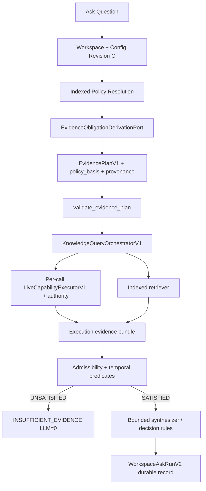

# COMM-5F2 Advanced Flagship Scenario & Platform Gap Audit

**Campaign:** `2026-08-20` (advanced flagship architecture & platform gap; design-only)  
**Mode:** read-only except this document; no production code, proof code, or tests  
**Branch:** `development` only  
**Audit start HEAD:** `f985ad342d0d6db38c9998df67f9cd7bc10bfa46`  
**Expected origin/development (operator):** `7e7aa895216ec4c3c65ff6f0a83ed6dde2c8eca8` — **not matched** at audit start; `origin/development` was `f985ad342d0d6db38c9998df67f9cd7bc10bfa46` after fetch  
**Prior audit:** [COMM_5_FLAGSHIP_CTO_AUDIT.md](COMM_5_FLAGSHIP_CTO_AUDIT.md) (COMM-5 baseline; 1 indexed + 1 live obligation)

---

## Executive verdict

**Verdict: B — ADVANCED FLAGSHIP IS VALUABLE BUT REQUIRES MEANINGFUL PLATFORM WORK**

COMM-5 proves a **governed hybrid composition** (obligations ≠ plan, execution-time authority, admissibility-before-synthesis, structural run identity). That is real but **too small** to answer a skeptical CTO who says: *"I can wire LangGraph nodes for policy RAG, status API, security API, and an `if missing: stop` gate."*

The advanced scenario **"Can ORION be deployed to production tonight?"** is the right escalation: it forces **rule-derived multi-obligation evidence contracts**, **multi-provider execution**, **policy-revision-driven obligation change**, and **structural explainability** — not a bigger ORION demo graph.

**Bottom line:** Intergrax already has the **execution/admissibility spine** for multi-call hybrid Ask. It does **not** yet have a canonical **policy → obligation derivation** layer. Without that, the advanced proof would still look like a hand-coded provider strategy — i.e. bespoke workflow with nicer types.

| Gate | Answer |
|------|--------|
| GO for COMM-5F3? | **YES WITH REDESIGN** — build platform derivation + provenance + temporal admissibility before scaling the proof harness |
| Target thesis after F3? | **YES WITH QUALIFICATION** — if F3-A/B/D ship; otherwise **NO** |
| LangGraph objection materially improved? | **PARTIALLY** today; **YES** after MUST_BUILD gaps |
| Major subsystems touched (F3) | **6** |
| MUST_BUILD count | **6** |
| SHOULD_BUILD count | **4** |

---

## Why the current proof is too simple

COMM-5 exercises exactly:

- 1 indexed obligation (`product:hybrid:indexed`)
- 1 live obligation (`provider:orion:live-status` → single `call_id`)
- 1 provider (`project_status`)
- 1 deployment policy document (indexed context only; **not** structurally bound to obligations)
- Obligations authored by **proof-local** `_OrionDeploymentProviderStrategy` (`proof_infrastructure/governed_hybrid_knowledge_proof/harness.py`)

A LangGraph team reproduces this in days: retriever node → HTTP tool node → conditional edge on JSON fields → END. COMM-5's differentiation (authority reload, call-id admissibility, EPHEMERAL provenance) is **necessary but insufficient** for the advanced claim.

What the CTO objection actually attacks:

| CTO mental model | COMM-5 exposes? | Advanced scenario needs |
|------------------|-----------------|-------------------------|
| "Workflow with tools" | Partially | **Contract-first** obligation set |
| "Prompt says check policy" | No (gate is structural) | **Policy revision → obligation diff** |
| "All tools must succeed" | No (optional planned calls exist in tests) | **Required vs optional at contract level** |
| "One integration" | Yes (single live call) | **Independent multi-provider partial outcomes** |
| "Why was pentest required?" | No | **Requirement provenance** |

---

## Target advanced scenario

**Question:** *"Can ORION be deployed to production tonight?"*

**Minimal convincing scope** (smallest set that demonstrates platform semantics, not ORION theatre):

| Layer | Source | Role |
|-------|--------|------|
| Indexed organizational knowledge | Deployment policy (rev 17/18), security policy, release/architecture policy | **Derive** mandatory evidence requirements — not hard-code call list |
| Live evidence | Project readiness, security blockers, architecture approval, change-management approval, deployment window | Each maps to **independent** `call_id` + `requirement_id` |
| Optional (SHOULD, not MUST for v1) | Penetration-test freshness (rev 18+) | Proves **temporal** admissibility |

**Business decision** (deployment allowed YES/NO) remains **downstream of admissibility** — applied by bounded synthesizer or deterministic rules over **admissible** evidence. Platform must never conflate:

- `ADMISSIBILITY = UNSATISFIED` → **no answer** (`INSUFFICIENT_EVIDENCE`, LLM = 0)
- `ADMISSIBILITY = SATISFIED` + evidence proves blockers → **answer = NO**

COMM-5 already separates these on the flagship path via admissibility gate then synthesizer (`hybrid_ask_service.py`).

**Why this scenario:** deployment governance is reusable (construction go-live, procurement approval, compliance gates, release management) without being ORION-specific — **if** obligations are derived from indexed policy semantics, not ORION-coded.

---

## Ideal evidence contract

For one Ask at policy revision **R** and workspace configuration revision **C**:

```text
EvidenceContractV1 (conceptual — extends EvidencePlanV1)
├── contract_id / plan_id
├── configuration_revision: C
├── policy_basis: PolicyEvidenceBasisV1
│   ├── indexed_policy_revision_ids: {deployment: rev17|rev18, security: …, release: …}
│   └── derivation_snapshot_id (hash of rule outputs)
├── ordered_live_call_proposals: [call-readiness, call-security, call-arch, call-cm, call-window, …]
├── required_evidence_obligations: [
│     REQ-readiness      (live, call-readiness,  origin: deployment-policy/rev/RULE-DEP-1)
│     REQ-security       (live, call-security,   origin: security-policy/rev/RULE-SEC-2)
│     REQ-architecture   (live, call-arch,       origin: release-policy/rev/RULE-REL-3)
│     REQ-change         (live, call-cm,         origin: deployment-policy/rev/RULE-DEP-2)
│     REQ-window         (live, call-window,     origin: deployment-policy/rev/RULE-DEP-3)
│     REQ-pentest        (live, call-pentest,    origin: deployment-policy/rev18/RULE-SEC-DEP-4)  # rev18 only
│     product:hybrid:indexed (indexed)
│   ]
├── optional_evidence_obligations: [...]   # explicit OPTIONAL cardinality — not merely unlisted calls
└── budget_snapshot
```

**Invariants the platform must enforce:**

1. Every **required** obligation has stable `requirement_id` and, for live, stable `call_id` referencing a validated proposal.
2. Indexed evidence **cannot** satisfy a live obligation (`LIVE_CALL_MISMATCH` / `NO_MATCHING_EVIDENCE`).
3. Live evidence satisfies **only** its bound `call_id` — not "any live JSON".
4. One failed **required** obligation → `overall_status = UNSATISFIED` → synthesis blocked.
5. Obligations record **structural origin** (rule + policy revision), not only `semantic_role` prose.

**Current state:** `EvidencePlanV1` + `RequiredEvidenceObligationV1` implement rows 1–4 **when obligations are supplied**. Rows 5–6 and `policy_basis` are **missing**.

---

## Dynamic policy evolution

**Core test:** Same question, same project, same model — **policy rev 17 → rev 18** adds `REQ-pentest` (fresh ≤ 90 days). Obligation set must change **without** editing provider Python.

| Capability | State | Evidence |
|------------|-------|----------|
| Workspace `configuration_revision` on plan/run | **READY** | `EvidencePlanV1.configuration_revision`, `WorkspaceAskRunV2.configuration_revision` |
| Indexed document / policy revision identity | **PARTIAL** | `KnowledgeRevisionKindV1`, binding `effective_revision` exist (`knowledge_inspection_operations_service.py`); **not** wired into obligation derivation or run contract |
| Rule engine: indexed policy text → obligations | **MISSING** | Obligations come from `ProviderEvidencePlanV1` / caller additive only (`hybrid_ask_policy.py`, `hybrid_ask_service._build_plan`) |
| Policy revision → different obligation set | **MISSING** | Proof strategy hard-codes one live obligation (`harness._OrionDeploymentProviderStrategy`) |
| Re-index policy without code change | **PARTIAL** | Indexed retrieval can return new chunks; **no** structural link from chunk revision to obligation set |
| Obligation records which rule/revision created them | **MISSING** | `semantic_role` is audit prose only (`HYBRID_ASK_ARCHITECTURE.md` §6.4) |

**Architectural placement (recommended):** Tier-1 **`intergrax/runtime/evidence/`** (new) or extension of **`intergrax/runtime/vendor_knowledge/`** — **`EvidenceObligationDerivationPort`** consuming:

- **Input:** question context, workspace configuration, **resolved indexed policy revisions** (deployment/security/release corpora), optional product/provider templates
- **Output:** `DerivedEvidenceContractV1` → maps into existing `EvidencePlanV1` via `compose_evidence_obligations`

Application Tier-3 (`local_workspace_application`) owns **corpus selection** and **ORION product binding**; platform owns **derivation contract + provenance shape**.

**REV17 vs REV18 demo:**

| | rev17 | rev18 |
|--|-------|-------|
| Obligations | 3 live + indexed | 4 live + indexed |
| Pentest satisfied | n/a | missing → UNSATISFIED |
| Overall | SATISFIED → decision possible | UNSATISFIED → LLM 0 |

**Not possible today** without new derivation subsystem.

---

## Multi-provider execution model

| Question | Answer | Evidence |
|----------|--------|----------|
| Multiple `LiveCallProposalV1` on one plan? | **YES** | `EvidencePlanV1.ordered_live_call_proposals`; tests with 2 calls (`test_hybrid_ask_service.py` optional/required) |
| Multiple `LiveEvidenceRequirementV1`? | **YES** | Tuple on plan; per-obligation admissibility loop (`hybrid_ask_admissibility.py`) |
| Multiple `required_evidence_obligations`? | **YES** | `compose_evidence_obligations` append-only |
| Stable `requirement_id` / `call_id`? | **YES** | Plan validation rejects duplicates/unknown refs |
| Independent evaluation? | **YES** | `_evaluate_live_requirement` matches `call_id` only |
| Accidental any-live satisfaction? | **NO** (prevented) | `LIVE_CALL_MISMATCH` when other calls have evidence |
| Multiple providers / connections? | **YES (structural)** | Each proposal resolves its own binding → `connection_ref` / `derived_provider_id` (`validate_evidence_plan`) |
| Resolver per connection? | **YES** | `TenantConnectionIntegrationResolverPort` per call |
| Independent authority revalidation? | **YES** | `LiveCapabilityExecutorV1.is_usable` **per call** before handler |
| One fails, others succeed? | **YES** | Orchestrator continues loop; `partial_failure` flag (`KnowledgeQueryOrchestratorV1.execute`) |
| Partial evidence collected? | **YES** | Successful calls append to `live_evidence`; failed calls omit items |
| One missing REQUIRED → UNSATISFIED? | **YES** | `evaluate_evidence_admissibility` all-of semantics |
| One provider strategy only? | **NO** | `WorkspaceAskProviderStrategy` is pluggable; COMM-5 uses one proof strategy — **not** a runtime limit |

**Practical conceptual maximum:** bounded by `max_live_calls` on query policy (default up to 50 in `EffectiveWorkspaceQueryPolicyV2`) and validation — not a single-provider assumption.

**Gap:** multi-provider is **proven lightly** (same binding, same capability in unit tests). Advanced proof needs **distinct providers** (project status, security, CM, calendar) — **application/provider work**, not orchestration rewrite.

---

## Temporal/freshness semantics

| Constraint | State | Where today | Recommendation |
|------------|-------|-------------|----------------|
| Status must be current (live fetch) | **READY** | Live HTTP at execution time | Keep in execution |
| `remote_updated_at` on live evidence | **REPRESENTED** | `LiveWorkspaceEvidenceV1.remote_updated_at` | Use in admissibility |
| Pen test not older than N days | **MISSING** | No obligation-level temporal fields | **Canonical: evidence requirement** (`max_age_days`, `valid_until`, `must_be_valid_at`) evaluated in **admissibility** |
| Approval valid until timestamp | **MISSING** | — | Same |
| Deployment window valid NOW | **MISSING** | — | Same + possibly live payload predicate |
| Policy effective at decision time | **PARTIAL** | Indexed retrieval at current config revision; no valid-time query | Bind `policy_basis.indexed_revision_ids` on contract; full bitemporal query **DEFER** |
| Bitemporal knowledge contracts | **READY (types only)** | `intergrax/contracts/bitemporal_knowledge.py` | Do not block F3 on TRACE-BITEMP-4 |

**Canonical architecture (one place):**

```text
Policy rule (indexed) → derives obligation + temporal predicate
Obligation carries TemporalConstraintV1 (frozen fields)
Admissibility evaluator applies predicate to matched evidence metadata
NOT: freshness only in LLM prompt
NOT: freshness only in provider handler ad hoc
```

**Do not** add a parallel rule engine in admissibility — predicates are **attached to obligations** at derivation time.

---

## Authority and partial failure model

### Partial authority revoke (5/6 sources authorized)

| Expected | Current |
|----------|---------|
| Revoked binding → HTTP 0 for that call only | **READY** — `live_binding_unavailable` before handler (`LiveCapabilityExecutorV1`) |
| Other providers may execute | **READY** — orchestrator does not abort batch |
| Revoked obligation UNSATISFIED | **READY** — no matching live evidence for that `call_id` |
| Overall UNSATISFIED, LLM 0 | **READY** — admissibility gate (`hybrid_ask_service.ask`) |
| Distinguish authority denial vs provider 503 at obligation level | **PARTIAL** — execution has `error_code`; admissibility reason is only `NO_MATCHING_EVIDENCE` / `LIVE_CALL_MISMATCH` (`RequirementAdmissibilityReasonCodeV1`) |

**MUST_BUILD:** `AUTHORITY_UNAVAILABLE`, `PROVIDER_EXECUTION_FAILED`, `PROVIDER_PAYLOAD_INVALID` reason codes propagated from execution receipts into per-requirement evaluation.

### Partial provider failure

| Expected | Current |
|----------|---------|
| Malformed/503 → HTTP may be 1 | **READY** — adversarial tests COMM-5 F/G |
| Failed requirement UNSATISFIED | **READY** |
| Other evidence valid | **READY** |
| No collapse to generic run error | **READY** — `INSUFFICIENT_EVIDENCE` with partial `persisted_evidence` |
| LLM 0 | **READY** |

### Optional vs required

| Expected | Current |
|----------|---------|
| Planned call without obligation = optional | **READY** — architecture §6.4.1; `test_hybrid_ask_service` required vs optional |
| Explicit OPTIONAL obligation cardinality | **MISSING** — optional is implicit (call not in obligations tuple) |
| Optional failure does not block | **READY** — if not in `required_evidence_obligations` |

**SHOULD_BUILD:** explicit `EvidenceCardinalityV1 { REQUIRED, OPTIONAL }` on obligations for audit clarity and UI — not strictly blocking.

### Source substitution / alternative authorities

REQ-architecture satisfied by Architecture Board **OR** delegated authority — **MISSING**. No OR-group, no alternative `call_id` sets. **DEFER** for flagship v1; document as SHOULD_BUILD for compliance use cases.

---

## Historical comparison model

| Capability | State |
|------------|-------|
| Run stores obligation snapshot | **READY** — `WorkspaceAskRunV2.required_evidence_obligations` |
| Run stores admissibility evaluations | **READY** — `evidence_admissibility.requirement_evaluations` |
| Run stores configuration_revision | **READY** |
| Policy revision on run | **MISSING** |
| Compare obligation sets across runs | **MISSING** — no platform diff API |
| Explain "rev18 added REQ-pentest" structurally | **MISSING** — requires provenance on obligations |

**SHOULD_BUILD:** `ObligationSetComparisonV1` (pure function): diff by `requirement_id`, surface added/removed/changed constraints with `origin` metadata — powers Experiment 7 without raw payload replay.

COMM-5 Experiment 04 proves **immutability of stored run**, not **cross-revision obligation diff**.

---

## Capability matrix

| Capability | Why scenario needs it | Current state | Evidence in repo | Gap | Priority | Recommended subsystem | Risk |
|------------|----------------------|---------------|------------------|-----|----------|----------------------|------|
| Multiple required obligations | 4–6 live gates for deployment | **READY** | `hybrid_ask_policy.py`, admissibility tests | Wire in advanced proof | — | hybrid_ask | LOW |
| Multiple live call proposals | One call per provider | **READY** | `EvidencePlanV1`, orchestrator loop | Distinct provider proof | — | hybrid_ask_execution | LOW |
| Multi-provider execution | Security, CM, calendar, status | **PARTIAL** | Structural support; single-provider proof | Provider handlers + bindings | SHOULD_BUILD | vendor_knowledge + LKW | MEDIUM |
| Independent authority revalidation | Revoke CM only | **READY** | `WorkspaceLiveAccessRuntimeAuthority`, scenario 03 | Obligation-level reason | MUST_BUILD | live runtime authority | LOW |
| Partial failure aggregation | 503 on one source | **READY** | Orchestrator + COMM-5 adversarial | Reason code enrichment | MUST_BUILD | hybrid_ask_admissibility | LOW |
| Dynamic obligation derivation | Policy rev → contract | **MISSING** | Hard-coded proof strategy | Core platform gap | **MUST_BUILD** | `intergrax/runtime/evidence` (new) | HIGH |
| Policy-revision-aware derivation | rev17 vs rev18 pentest | **MISSING** | No policy_basis on plan | Core platform gap | **MUST_BUILD** | derivation + indexed revision binding | HIGH |
| Requirement origin/provenance | "Why pentest?" | **MISSING** | `semantic_role` only | Differentiator | **MUST_BUILD** | obligation contract extension | MEDIUM |
| Evidence qualification | call_id, binding, provider | **PARTIAL** | call_id enforced; admissibility light | Enrich qualification dimensions | SHOULD_BUILD | admissibility evaluator | MEDIUM |
| Freshness constraints | Pentest ≤ 90 days | **MISSING** | `remote_updated_at` unused in gate | Temporal admissibility | **MUST_BUILD** | obligation + admissibility | MEDIUM |
| Optional vs required evidence | Supporting vs blocking | **PARTIAL** | Implicit via omission | Explicit cardinality | SHOULD_BUILD | obligation contract | LOW |
| Alternative evidence authorities | Board OR delegate | **MISSING** | — | OR-groups | DEFER | derivation grammar | HIGH |
| Structural historical comparison | rev17 vs rev18 runs | **MISSING** | Stored snapshots only | Diff utility | SHOULD_BUILD | ask run model / tooling | LOW |
| Obligation-level failure reason | Authority vs 503 | **PARTIAL** | Execution error_code; weak admissibility reason | Map execution → requirement | **MUST_BUILD** | admissibility | LOW |
| Source-specific authority failure | CM revoked | **PARTIAL** | Per-call HTTP 0 | Typed reason on obligation | MUST_BUILD | admissibility | LOW |
| Durable multi-obligation history | Audit across policy versions | **PARTIAL** | In-memory proof store | Production store + policy_basis | SHOULD_BUILD | persistence | MEDIUM |
| Admissibility vs business decision | Missing evidence ≠ blocked deploy | **READY** | Gate before LLM; synthesizer applies policy | Document as platform pattern | — | hybrid_ask_service | LOW |
| Rule-derived vs hard-coded graph | CTO objection | **MISSING** | Provider strategy = code | Derivation port | **MUST_BUILD** | evidence derivation | HIGH |

**State legend:** READY | PARTIAL | MISSING | CONFLICTING  
**Priority legend:** MUST_BUILD | SHOULD_BUILD | DEFER | DEMO_ONLY_REJECT

---

## MUST_BUILD gaps

### 1. Dynamic obligation derivation contract (F3-A)

- **Value:** Reusable across compliance, procurement, construction, release governance — any "organizational rules → evidence contract"
- **Owner:** Tier-1 `intergrax/runtime/evidence/derivation.py` (conceptual)
- **Contract:** `EvidenceObligationDerivationPort.derive(context) → DerivedEvidenceContractV1`
- **Input:** question, workspace config revision, indexed policy corpus handles + revision ids, product template id
- **Output:** proposals + obligations + `policy_basis` + provenance
- **Invariant:** Same inputs + same policy revisions → same obligation set (deterministic)
- **Persistence:** Store `policy_basis` on `WorkspaceAskRunV2`
- **Observability:** Log derivation_snapshot_id, obligation count, revision ids
- **Security:** Derivation runs server-side; caller cannot drop authoritative obligations

### 2. Requirement provenance / origin metadata (F3-B)

- **Value:** Explainability for auditors — "required because deployment-policy rev18 RULE-SEC-DEP-4"
- **Extend:** `IndexedEvidenceRequirementV1` / `LiveEvidenceRequirementV1` with `origin: RequirementOriginV1 { policy_document_id, revision_id, rule_id, derivation_engine_version }`
- **Invariant:** Enforcement still structural; origin is not optional for derived obligations

### 3. Policy revision binding on evidence contract (F3-B)

- **Value:** REV17 vs REV18 comparison; binds decision to policy semantics at ask time
- **Extend:** `EvidencePlanV1.policy_basis: PolicyEvidenceBasisV1`
- **Link:** Indexed source binding `effective_revision` + document identity

### 4. Freshness-aware admissibility (F3-D)

- **Value:** Pentest age, approval expiry, deployment window — generic temporal gates
- **Extend obligations:** `temporal_constraints: tuple[TemporalConstraintV1, ...]`
- **Evaluator:** `hybrid_ask_admissibility.py` — new reason codes `FRESHNESS_VIOLATION`, `WINDOW_NOT_ACTIVE`
- **Invariant:** LLM never sees evidence that failed temporal gate as "satisfied"

### 5. Obligation-level failure semantics (F3-E)

- **Value:** Partial revoke and partial 503 scenarios must be auditable per requirement
- **Map:** `LiveCapabilityExecutionResultV1.error_code` + authority path → `RequirementAdmissibilityReasonCodeV1`
- **Invariant:** `AUTHORITY_UNAVAILABLE` never implies HTTP occurred for that call

### 6. Multi-provider deployment governance evidence plan (F3-C)

- **Value:** Proves platform across providers — not ORION-only
- **Owner:** Tier-3 proof + provider registrations (project status, security, CM, calendar)
- **Depends on:** F3-A derivation producing multi-call contract from indexed policies
- **Proof criterion:** 5+ live calls, 4+ providers, independent failure/revoke behavior

---

## SHOULD_BUILD gaps

1. **Structural obligation set comparison** — pure diff for Experiment 7 / audit UI  
2. **Explicit OPTIONAL cardinality** on obligations (beyond implicit non-listing)  
3. **Enriched evidence qualification** — enforce `provider_id`, `capability_id`, `connection_ref` in admissibility when obligation specifies them  
4. **Durable production ask store** for multi-obligation history (beyond in-memory proof)

---

## Deferred capabilities

- Alternative evidence authorities (OR-groups, delegated satisfaction paths)  
- Full TRACE-BITEMP-4 combined historical query surface  
- Cryptographic signed run records  
- Distributed TOCTOU hardening after `is_usable`  
- Default LKW HTTP/Slack provider strategy without proof harness wiring

---

## Demo-only ideas rejected

| Idea | Verdict | Why |
|------|---------|-----|
| Six hard-coded LangGraph-equivalent nodes in proof only | **DEMO_ONLY_REJECT** | No derivation layer |
| Pentest fixture without `TemporalConstraintV1` | **DEMO_ONLY_REJECT** | Teaches nothing about platform freshness |
| Mermaid-only "policy engine" without indexed revision binding | **DEMO_ONLY_REJECT** | Not reusable |
| Single mega-provider returning all JSON in one HTTP call | **DEMO_ONLY_REJECT** | Collapses multi-provider semantics |
| LLM prompt listing required checks | **DEMO_ONLY_REJECT** | Commodity |

---

## Proposed production architecture



**Layer ownership:**

| Layer | Responsibility |
|-------|----------------|
| Tier-1 `intergrax/runtime/evidence` | Derivation contract, provenance types, temporal constraint types |
| Tier-1 `intergrax/runtime/vendor_knowledge/live` | Per-call execution, authority port (existing) |
| Tier-3 `local_workspace_application/workspaces/hybrid_ask_*` | Ask orchestration, admissibility extension, run persistence |
| Tier-3 `proof_infrastructure/governed_hybrid_knowledge_proof` | Advanced harness only — no production logic |

**Do not** fork a parallel orchestration system — extend `EvidencePlanV1` / admissibility / provider strategy seam.

---

## COMM-5F3 implementation roadmap

| Block | Scope | Dependencies | Proof criterion | Complexity | Subsystems |
|-------|-------|--------------|-----------------|------------|------------|
| **F3-A** Obligation derivation contract | `EvidenceObligationDerivationPort`, `DerivedEvidenceContractV1`, rule snapshot id | Indexed revision ids available | rev17 vs rev18 produces different obligation tuples without code change | **HIGH** | derivation, hybrid_ask_policy, indexed bindings |
| **F3-B** Provenance + policy_basis on plan/run | `RequirementOriginV1`, `PolicyEvidenceBasisV1` on plan and `WorkspaceAskRunV2` | F3-A | "Why pentest?" answerable from run record | **MEDIUM** | hybrid_ask_models, persistence |
| **F3-C** Multi-provider deployment plan | Provider registrations + proof fixtures for 4+ live sources | F3-A | One Ask executes ≥4 independent provider calls | **MEDIUM** | vendor_knowledge, proof harness |
| **F3-D** Temporal admissibility | `TemporalConstraintV1` + evaluator reason codes | F3-B | rev18 pentest stale → UNSATISFIED; fresh → SATISFIED | **MEDIUM** | hybrid_ask_admissibility |
| **F3-E** Obligation failure semantics | Map authority/execution errors to requirement reasons | — | Exp 5/6 show per-requirement AUTHORITY vs PROVIDER_FAILED | **LOW** | admissibility, execution |
| **F3-F** Advanced proof harness + comparison | 5-scenario runner, obligation diff utility | F3-A–E | CLI green; structural rev17/18 diff | **MEDIUM** | proof_infrastructure |

**Risk flags:**

- F3-A touches **derivation grammar** — not a full policy language, but rule IDs + indexed corpus references  
- F3-A is **not** a broad orchestration rewrite  
- Total major subsystems: **6** (within acceptable breadth)  
- No new agent loop required

---

## LangGraph objection test

| What must be hand-built on generic workflow runtime | What Intergrax provides as reusable platform contract | What advanced proof demonstrates | Strength (1–5) |
|------------------------------------------------------|------------------------------------------------------|----------------------------------|----------------|
| Graph nodes per provider; conditional edges per check | `EvidencePlanV1` / obligations separate from plan; validated multi-call budget | Multi-provider one Ask with independent partial outcomes | 3 |
| Custom "don't call LLM" guard | Admissibility evaluator + `INSUFFICIENT_EVIDENCE` + run integrity validator | LLM 0 with persisted per-requirement evaluations | 4 |
| Permission re-check wrapper per tool | `LiveRuntimeAuthorityPort` reload before handler | Revoke 1 of 6 bindings → HTTP 0 for that call only | 5 |
| Prompt/RAG for policy | Indexed retrieval + **derived** obligations (after F3-A) | rev18 adds pentest obligation without graph edit | **4 after F3** (1 today) |
| Audit log assembly | `WorkspaceAskRunV2` self-consistency + provenance hashes | Structural history + obligation diff | 3 |
| Temporal checks in code or LLM | `TemporalConstraintV1` on obligations (after F3-D) | Stale pentest blocks admissibility | **4 after F3** (0 today) |
| "Why required?" documentation | `RequirementOriginV1` (after F3-B) | Explain pentest via rule id | **5 after F3** (0 today) |

**Honest assessment:** **Today** the advanced scenario still looks like a **well-typed bespoke workflow** because obligations are code-authored. **After F3-A/B/D/E**, the objection weakens materially: the reusable layer is **rules → contracts → enforced acquisition → admissibility → optional synthesis**, not the ORION graph shape.

If F3-A is skipped, verdict drifts toward **D — WRONG DIRECTION**.

---

## Final advanced-proof experiment set

| # | Scenario | Needed? | Rationale |
|---|----------|---------|-----------|
| 1 | Baseline rev17 all satisfied → YES | **KEEP** | Anchor |
| 2 | Same policy, blocker → NO | **MERGE into 1** | Business decision, not platform — admissible + NO |
| 3 | rev18 adds pentest → UNSATISFIED | **KEEP** | **Primary differentiator** — dynamic contract |
| 4 | Fresh pentest → admissible again | **KEEP** | Pairs with 3; tests temporal gate |
| 5 | Partial authority revoke | **KEEP** | Strongest existing invariant at scale |
| 6 | Partial provider 503 | **KEEP** | Multi-call aggregation |
| 7 | History / policy comparison | **KEEP** | Proves revision narrative without payload replay |

**Minimal final set (5):** **1, 3, 4, 5, 6** — add **7** if F3-B ships (recommended → **6 experiments**).

Drop standalone **2** (covered by admissible NO in experiment 1 variant).

---

## Final recommendation

**Proceed to COMM-5F3** with redesign priority:

1. **F3-A/B first** — without derivation + provenance, do not scale the harness  
2. **F3-C/D/E** in parallel once contract frozen  
3. **F3-F** last — acceptance gate

**Target thesis evaluation:**

> *"Intergrax turns organizational rules into enforceable evidence contracts. Those contracts determine which indexed and live evidence must be acquired, under which current authority and temporal conditions, before an LLM is permitted to synthesize an answer."*

| | |
|--|--|
| Supported today? | **NO** — rules are not turned into contracts automatically |
| Supported after F3 (MUST_BUILD)? | **YES WITH QUALIFICATION** — qualification: derivation is deterministic rule-id based over indexed corpora, not arbitrary NL policy interpretation; business decision remains synthesizer/rules layer |

**Final decision code: B**

**GO/NO-GO: YES WITH REDESIGN**

---

## References (audit read scope)

- `applications/local_workspace_application/workspaces/hybrid_ask_policy.py` — `EvidencePlanV1`, obligations, validation  
- `applications/local_workspace_application/workspaces/hybrid_ask_admissibility.py` — admissibility evaluator  
- `applications/local_workspace_application/workspaces/hybrid_ask_execution.py` — orchestrator, per-call authority  
- `applications/local_workspace_application/workspaces/hybrid_ask_service.py` — plan build, admissibility gate  
- `applications/local_workspace_application/workspaces/hybrid_ask_models.py` — run model, reason codes  
- `applications/local_workspace_application/docs/HYBRID_ASK_ARCHITECTURE.md` — obligation ownership  
- `proof_infrastructure/governed_hybrid_knowledge_proof/harness.py` — proof provider strategy  
- `docs/audit_results/2026-08-20/COMM_5_FLAGSHIP_CTO_AUDIT.md` — baseline verdict  
- `intergrax/contracts/bitemporal_knowledge.py` — temporal types (not wired to Ask)
