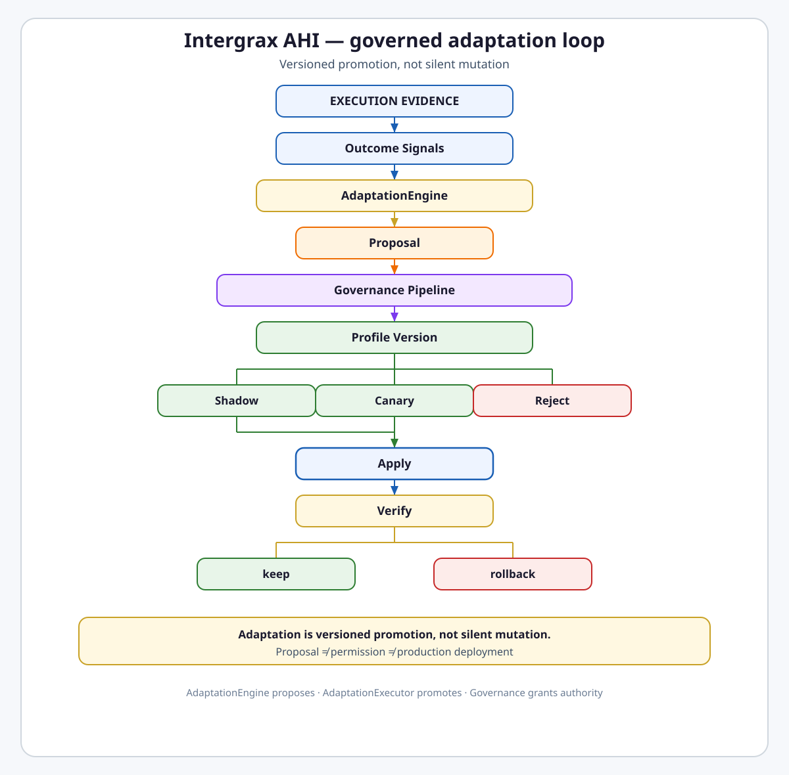

# Adaptive Harness Intelligence

**Intergrax Adaptive Harness Intelligence (AHI)** turns execution evidence into governed, versioned configuration proposals that can be evaluated, promoted through shadow and canary stages, applied within authority boundaries, and rolled back.

AHI is **evidence-driven, governed adaptation of versioned Harness configuration artifacts** — not a self-learning agent, not foundation-model training, and not uncontrolled reinforcement learning.

> [!IMPORTANT]
> **Adaptation is versioned promotion, not silent mutation.**

> [!IMPORTANT]
> **Proposal ≠ permission ≠ production deployment.**

> [!NOTE]
> **Maturity boundary:** Core adaptive runtime contracts and apply machinery are **implemented** (`SignalCollector`, `AdaptationEngine`, `AdaptationGovernancePipeline`, `AdaptationExecutor`, `VerificationLoop`, profile lifecycle stores). **Production autonomous adaptation is not claimed:** no 30-day real deployment evidence, TOKEN-AHI adaptive loop is **partial**, ADAS is **target/planned**, and production auto-apply remains **disabled by default**. See [Current maturity](#current-maturity).

**Primary audience:** Principal / Staff engineers, harness integrators, and operators evaluating adaptive posture — after the platform overview in the root README.

---

## Why it matters

Without AHI:

- profile and routing tuning stays manual,
- observations from many runs do not lead to controlled configuration changes,
- optimization risks silent config mutation without lineage,
- rollback depends on operator memory,
- adaptation logic leaks into business code,
- skill, routing, and RAG tuning can bypass Governance,
- “self-learning” becomes an unauditable marketing label.

AHI supplies a **governed control plane** that closes the loop from execution evidence to bounded harness improvement while preserving auditability.

### What AHI does not do

| Out of scope | Reason |
|--------------|--------|
| Training foundation model weights | Tier-0 LLM adapters remain replaceable providers |
| Autonomous business strategy | Tier-2 agent / Tier-3 application scope |
| Silent production mutation | Violates policy-first architecture |
| Deep RL / neural policy training | Wrong tool for governed harness adaptation |
| Installing Skills at runtime | Skills domain owns enable/install; AHI may only propose bundles |

---

## At a glance

| Concern | Summary |
| -------- | -------- |
| **Responsibility** | Governed adaptation of versioned harness configuration artifacts from execution evidence |
| **Evidence input** | Traces, metrics, evaluation, cost, HITL, optional business outcome — normalized to `HarnessOutcomeSignal` |
| **Proposal engine** | `AdaptationEngine` — ranks sub-engine candidates; does **not** deploy |
| **Governance** | `AdaptationGovernancePipeline` + `evaluate_adaptive_governance` envelope rules |
| **Profile version** | Immutable `ProfileVersionRecord` with lineage; active pointer swap on apply |
| **Lifecycle** | `DRAFT` → `SHADOW` → `CANARY` → `ACTIVE` → `RETIRED` |
| **Apply authority** | `AdaptationExecutor` — shadow / canary / apply / rollback; authority bounded per loop |
| **Verification** | `VerificationLoop` — candidate vs baseline checks; optional orchestrated rollback |
| **Utility** | Configured `compute_utility` decision function — not objective truth |
| **Routing / strategy** | `RoutingTuningEngine`, `ExecutionStrategyEngine` — **recommend/propose** by default |
| **Skills / patterns** | `SkillSelectionEngine`, `ProcessPatternMiner` — proposals and stubs, not install |
| **Policy learning** | `PolicyLearningEngine` — bounded proposals; human gate at apply when configured |
| **Token optimization** | Recommendation helper on Token Optimization side; full AHI loop **partial** |
| **ADAS** | Agent Design Search — **target/planned** sub-capability (docs/ADR only) |
| **Maturity** | **A4 / I3 / P2 / E2** — see [Current maturity](#current-maturity) |
| **Go deeper** | [Engineering canon](#engineering-canon) · [extended-depth satellite](satellites/ADAPTIVE_HARNESS_INTELLIGENCE_extended_depth.md) · [plan](../maintainers/plans/ADAPTIVE_HARNESS_INTELLIGENCE.md) |

---

## Flagship architecture visual

<picture>
  <source media="(prefers-color-scheme: dark)" srcset="assets/adaptive-governed-loop-dark.svg">
  <source media="(prefers-color-scheme: light)" srcset="assets/adaptive-governed-loop-light.svg">
  
</picture>

**Primary mental model:**

```text
execution evidence
      ↓
HarnessOutcomeSignal
      ↓
AdaptationEngine
      ↓
proposal
      ↓
governance gates
      ↓
profile version
      ↓
shadow → canary → apply
      ↓
verify
   ↓       ↓
 keep   rollback
```

---

## How adaptation works

Public sequence with current shipped status:

| Step | Action | Shipped status |
| ---- | ------ | -------------- |
| 1. **Observe** | Collect post-run evidence from trace, metrics, eval, cost, HITL | **Shipped** — `SignalCollector` |
| 2. **Normalize** | Assemble `HarnessOutcomeSignal`; optional `compute_utility` | **Shipped** |
| 3. **Propose** | Sub-engines emit candidates; `AdaptationEngine` ranks and builds packages | **Shipped** — recommend wave |
| 4. **Gate** | Envelope, capability graph, golden-scenario gates | **Shipped** — `AdaptationGovernancePipeline` |
| 5. **Materialize version** | `ProfileVersionDraft` → stored `ProfileVersionRecord` | **Shipped** |
| 6. **Shadow** | Allocate candidate version for shadow evaluation | **Shipped** — `AdaptationExecutor.shadow` |
| 7. **Canary** | Promote shadow → canary status | **Shipped** — `AdaptationExecutor.canary` |
| 8. **Apply** | Pointer swap to active version within authority | **Shipped** — conditional on gates + approval |
| 9. **Verify** | Candidate vs baseline checks over window | **Shipped** — `VerificationLoop` |
| 10. **Keep or rollback** | Report pass/fail; optional auto-rollback when configured | **Conditional** — rollback not automatic unless orchestration enables it |

`AdaptationEngine.run()` **must not** execute on the Nexus hot path. Adaptation cycles run asynchronously via scheduler jobs.

---

## Proposal lifecycle

A proposal is **not** active configuration.

```text
signal
→ AdaptationProposalCandidate
→ AdaptationProposalPackage (proposal_id, passed_all_gates, gate_reasons)
→ governance result
→ ProfileVersionRecord (when draft present)
```

| Artifact | Meaning |
| -------- | ------- |
| **Candidate** | Raw sub-engine output: loop envelope, optional `ProfileVersionDraft`, rank score |
| **proposal_id** | Stable package identifier (`prop_*`) for audit and approval stores |
| **passed_all_gates** | Envelope + capability + golden-scenario gates all passed |
| **profile draft** | Versioned artifact payload — orchestration, RAG, routing, or policy fragment |
| **loop_id** | Bounded adaptive loop identity within envelope cooldown scope |

---

## Profile lifecycle

Exact status enum: `ProfileVersionStatus` — `draft`, `shadow`, `canary`, `active`, `retired`.

| Status | Meaning | Serves live traffic? | Promotion rule |
| ------ | ------- | -------------------- | -------------- |
| **DRAFT** | Materialized version, not yet evaluated | No | → `SHADOW` via executor |
| **SHADOW** | Candidate for shadow-tagged runs | Shadow eval only | → `CANARY` or back to `DRAFT` |
| **CANARY** | Pre-production promotion stage | Canary scope only (host-qualified) | → `ACTIVE` on apply |
| **ACTIVE** | Current pointer target | Yes — via `ProfileActivePointerStore` | Previous → `RETIRED` on swap |
| **RETIRED** | Superseded active version | No | May be restored via rollback path |

> Adaptive configuration changes are **versioned artifacts with lineage** — not in-place mutation of the active record.

Active pointer semantics:

```text
active profile pointer → version N
promotion (apply)      → logical pointer swap to version N+1
                       → previous_version_id retained for rollback
```

Distributed atomicity across tenants is **not** claimed; stores are SQLite or in-memory under `build/adaptive_harness/`.

---

## Governance boundary

```text
better utility
≠
permission to deploy
```

AHI **proposes and evaluates** adaptive change. [Governed Execution](GOVERNED_EXECUTION.md) and product gates **determine whether it may proceed**. AHI must not self-expand authority.

### Authority envelope

`AdaptiveLoopEnvelope` fields (runtime contract):

| Field | Role |
| ----- | ---- |
| `loop_id` | Bounded loop identity |
| `kind` | `routing_tuning`, `execution_strategy_tuning`, `policy_learning`, `evaluation_feedback` |
| `max_iterations` / `max_delta_percent` | Bounded change magnitude |
| `authority` | `AdaptiveAuthorityLevel` — see below |
| `requires_human_approval` | Human gate flag |
| `audit_trail_required` | Must be true for adaptive loops |
| `cooldown_seconds` | Per-loop proposal throttle |

`AdaptiveAuthorityLevel` enum:

| Level | Meaning |
| ----- | ------- |
| `observe_only` | Collect and report — no apply path |
| `recommend` | Emit governed proposals — default for routing/strategy/skill engines |
| `auto_with_human_gate` | May proceed toward apply only with explicit human approval recorded |

> Different adaptive loops may carry different authority. **“Adaptive” does not automatically mean “auto-apply”.**

### Governance pipeline gates

`AdaptationGovernancePipeline.evaluate()` runs, in order:

1. **Envelope gate** — `evaluate_bounded_adaptive_loop` (policy-learning delta, approver, audit rules)
2. **Capability graph gate** — when previous/candidate graphs are supplied
3. **Golden scenario gate** — when `golden_scenario_pass_rate` is provided vs minimum threshold

Output: `AdaptationProposalPackage` with `passed_all_gates` and `gate_reasons`.

---

## Auto-apply matrix

Current runtime authority by change class (as implemented — host wiring may further restrict):

| Change class | Default authority | Apply path |
| ------------ | ----------------- | ---------- |
| Routing tuning (`RoutingTuningEngine`) | `recommend` | Proposal → governance → executor when operator/host invokes |
| Execution strategy (`ExecutionStrategyEngine`) | `recommend` | Same |
| RAG profile draft (routing engine artifact) | `recommend` | Profile promotion path only |
| Dynamic skill selection (`SkillSelectionEngine`) | `recommend` | **Proposal only** — does not enable/install Skills |
| Policy learning (`PolicyLearningEngine`) | `auto_with_human_gate` | `apply()` checks `PolicyLearningApprovalStore` **when store is configured**; envelope requires `human_approver_id` |
| Evaluation feedback (`EvaluationFeedbackEngine`) | `observe_only` | No apply |
| Cost anomaly bridge | `recommend` | Proposal source only |
| Token optimization (TOKEN-AHI-1) | **Recommendation-only** | Token Optimization advisory helper — no autonomous compression/budget reduction |
| ADAS (AHI-ADAS-10…90) | **Not shipped** | Target architecture only |

**Production auto-apply is disabled by default.** `AdaptationExecutor.apply()` exists, but sub-engines default to `recommend` or `observe_only`. Unrestricted production auto-apply is **not** a current capability claim.

---

## Rollback

```text
ACTIVE v1 → promote v2 → regression → restore v1
```

`AdaptationExecutor.rollback()`:

- reads `ProfileActivePointerStore` for `previous_version_id`,
- transitions current active → `DRAFT`, restores previous → `ACTIVE`,
- swaps active pointer back.

Rollback is **available as explicit executor API** — not automatic unless `VerificationLoop` is configured with `auto_rollback_enabled=True` and an executor instance.

---

## Verification

`VerificationLoop` compares **candidate vs baseline** signals over a configurable window:

| Check | Role |
| ----- | ---- |
| Utility trend | Candidate vs baseline `HarnessOutcomeSignal.utility` |
| Eval registry trend | Release comparison when trend supplied |
| Regression rate | Flag density across candidate runs |
| Cost budget | Budget envelope compliance |
| Security adversarial baseline | Harness security checker hook |

Output: `VerificationResult` / `VerificationReport` with per-check detail.

**Boundary:**

```text
VerificationLoop     → evaluates (reports pass/fail)
AdaptationExecutor   → mutates active profile pointer (rollback)
```

Automatic connection exists **only when** verification orchestration sets `auto_rollback_enabled` and provides an executor — otherwise verification is report-only.

---

## Adaptation examples (shipped)

| Example | Mode | Notes |
| ------- | ---- | ----- |
| Routing tier shift | **propose** | Thompson-sampling bandit state informs arm selection; does not mutate live routing directly |
| Execution strategy tightening | **propose** | Step-count / regression-triggered orchestration profile draft |
| RAG profile draft | **propose** | `ProfileArtifactType.RAG` payload via routing engine |
| Cost anomaly recommendation | **propose** | Bridge from cost forecast anomalies |
| Skill bundle recommendation | **propose** | Orchestration profile draft — **≠** Skill install |
| Process pattern | **propose** | `ProcessPatternMiner` → `ProcessPatternProposal`; optional `CREATE_SKILL_DRAFT` action |
| Policy fragment tightening | **propose** + **conditional apply** | Regression-flag triggered; human approval gate |

---

## Process intelligence

`ProcessPatternMiner` reads trace-derived sequences, mines recurring n-gram patterns, and emits `ProcessPatternProposal` values with suggested follow-up actions (`create_skill_draft`, `tune_routing`, `document_runbook`).

> **Mined pattern ≠ installed Skill.** Patterns inform proposals; Tier-2/Tier-3 owners implement capabilities.

---

## Policy learning

`PolicyLearningEngine` generates **bounded policy/profile proposals** when regression flags (`tool_usage_drop`, `llm_cost_spike`) appear. Envelope kind `policy_learning` requires:

- `requires_human_approval=True`,
- `human_approver_id` on the proposal,
- `max_delta_percent ≤ 25` at envelope gate.

At apply time, `require_policy_learning_approval()` blocks policy-learning packages until the approval store records consent — **when an approval store is injected**. Without a store, apply does not perform that check (envelope gate still applies at proposal time).

---

## Domain boundaries

### AHI vs Observability

```text
Observability → canonical execution evidence (RuntimeEvent / HOS)
AHI           → consumes derived HarnessOutcomeSignal
```

`SignalStore` (in-memory or SQLite under `build/adaptive_harness/`) is adaptive-domain storage — **not** canonical Observability storage.

### AHI vs Critic / OECP

```text
CVL  → correctness of current result
OECP → cross-run evaluation / evidence target
AHI  → turns evidence into bounded change proposals
```

### AHI vs Reliability

```text
Reliability → recover this run
AHI         → improve future execution posture
```

### AHI vs Governance

```text
AHI        → proposes / evaluates adaptive change
Governance → determines whether it may proceed
```

### AHI vs classical RL

| Dimension | Classical RL | Adaptive Harness Intelligence |
| --------- | ------------ | ----------------------------- |
| Optimization target | Expected cumulative reward | Bounded utility improvement on eval + signals |
| Action space | Policy parameters | Discrete versioned profile artifacts |
| Exploration | Epsilon-greedy, entropy | Shadow runs + canary promotion |
| Safety | Reward shaping | `AdaptiveLoopEnvelope` + governance pipeline + rollback |
| Auditability | Often opaque | Proposal ID + version lineage |
| Update model | Weight gradients | Pointer swap to new profile version |

### Token Optimization (TOKEN-AHI-1)

```text
token recommendation helper → shipped on Token Optimization side
full AHI adaptive token loop → partial / deferred
```

No autonomous production compression or budget reduction claim.

### ADAS (Agent Design Search)

Per plan: **AHI-ADAS-00 Done** (docs/ADR); **AHI-ADAS-10…90 Planned**.

> Agent Design Search is a **proposed target AHI sub-capability**, not current shipped core. Do not treat ADAS as live runtime in flagship diagrams.

Detail: [`satellites/ADAPTIVE_HARNESS_INTELLIGENCE_agent_design_search.md`](satellites/ADAPTIVE_HARNESS_INTELLIGENCE_agent_design_search.md)

---

## Current implementation state

| Component | Status |
| --------- | ------ |
| `SignalCollector` + `SignalStore` | Shipped — in-memory + SQLite; tenant-scoped append/list |
| `HarnessOutcomeSignal` | Shipped — quality, cost, latency, retry/failure flags, HITL, utility, LLM summary fields |
| `AdaptationEngine` | Shipped — sub-engine aggregation, bandit reward update, cooldown, package build |
| `AdaptationGovernancePipeline` | Shipped — envelope, capability, golden-scenario gates |
| `AdaptationExecutor` | Shipped — shadow, canary, apply, rollback |
| Profile lifecycle + stores | Shipped — `ProfileVersionStore`, `ProfileActivePointerStore`, `ProfileVersionLifecycleManager` |
| `VerificationLoop` | Shipped — checks + optional auto-rollback |
| `compute_utility` / `UtilityWeights` | Shipped — configured decision function |
| `RoutingTuningEngine` + `BanditStateStore` | Shipped — Thompson sampling infrastructure; proposals not live routing mutation |
| `ExecutionStrategyEngine` | Shipped — rule-based proposals |
| `SkillSelectionEngine` | Shipped — bundle proposal bridge |
| `ProcessPatternMiner` | Shipped — offline pattern proposals |
| `PolicyLearningEngine` | Shipped — bounded proposals + approval gate at apply |
| Token adaptive loop | **Partial** — advisory on Token Optimization side |
| ADAS runtime | **Not shipped** — documentation and ADR only |
| Host production orchestration | **Host-qualified** — apply machinery exists; continuous closed-loop production evidence **not demonstrated** |

---

## Current maturity

Four-axis statement per [`MATURITY_TAXONOMY.md`](../technical/guides/MATURITY_TAXONOMY.md):

```text
Architecture maturity:  A4
Implementation maturity: I3
Production readiness:   P2
Evidence maturity:      E2
```

| Axis | Rationale |
| ---- | --------- |
| **A4** | Proposal/deploy authority boundaries, profile lifecycle, versioning, and rollback contracts are stable; adjacent domains aligned; TOKEN-AHI and ADAS depth remain open |
| **I3** | Signal → proposal → governance → executor → verification path implemented with unit coverage; host-wide continuous orchestration not closed |
| **P2** | Apply machinery and SQLite stores exist; production auto-apply disabled by default; no 30-day real deployment evidence; no customer adaptive outcome proof |
| **E2** | Unit/gate tests and `phase_w_adapt_report.py`; no representative full harness proof of evidence → apply → verify → rollback in production |

### Sub-maturity (non-averaged)

| Slice | A / I / P / E |
| ----- | ------------- |
| Core proposal + governance | A4 / I3 / P2 / E2 |
| Profile lifecycle + apply | A4 / I3 / P2 / E2 |
| Verification + rollback | A4 / I3 / P2 / E2 |
| Policy learning | A4 / I2 / P1 / E2 |
| Process pattern + skill bridge | A3 / I2 / P1 / E2 |
| Token AHI | A3 / I1 / P0 / E1 |
| ADAS | A2 / I0 / P0 / E1 |

Historical **W-ADAPT 70/70 Done** marks implementation-campaign completion — **not** a public production maturity headline.

---

## Evidence / proof

| Layer | Artifacts |
| ----- | --------- |
| **Architecture** | This hub, satellites, ADR-ADAPT-*, governance canon in `adaptive_governance.py` |
| **Unit / gate** | `tests/unit/runtime/adaptive/` — signal, engine, governance, profile lifecycle, executor, verification, rollback, routing/policy/pattern engines |
| **Integration** | Adaptive shadow allocation, proposal→apply lifecycle, rollback paths in wave tests |
| **Ops report** | `scripts/release/phase_w_adapt_report.py` |
| **Public proof** | No dedicated AHI row in [`PROOFS.md`](../proofs/PROOFS.md) at time of writing |
| **Production / customer** | **Not claimed** — AUDIT-IDEAL-AHI.1 (30-day L4 closed-loop on real deploy) remains **Planned** |

---

## Go deeper

| Need | Where |
| ---- | ----- |
| Extended component specs, lifecycle modes, control-plane diagram | [`satellites/ADAPTIVE_HARNESS_INTELLIGENCE_extended_depth.md`](satellites/ADAPTIVE_HARNESS_INTELLIGENCE_extended_depth.md) |
| ADAS target architecture | [`satellites/ADAPTIVE_HARNESS_INTELLIGENCE_agent_design_search.md`](satellites/ADAPTIVE_HARNESS_INTELLIGENCE_agent_design_search.md) |
| Implementation phases and open rows | [`plan/ADAPTIVE_HARNESS_INTELLIGENCE.md`](../maintainers/plans/ADAPTIVE_HARNESS_INTELLIGENCE.md) |
| Execution evidence authority | [`OBSERVABILITY.md`](OBSERVABILITY.md) |
| Correctness vs adaptation | [`CRITIC_VERIFICATION.md`](CRITIC_VERIFICATION.md) |
| Policy enforcement | [`GOVERNED_EXECUTION.md`](GOVERNED_EXECUTION.md) |
| Run recovery vs future posture | [`RELIABILITY_FAILURE_AND_HITL.md`](RELIABILITY_FAILURE_AND_HITL.md) |
| Skill install boundary | [`SKILLS.md`](SKILLS.md) |
| RAG profile ownership | [`RAG.md`](RAG.md) |
| Orchestration profiles | [`ORCHESTRATION.md`](ORCHESTRATION.md) |
| Token advisory boundary | Token Optimization architecture/plan (TOKEN-AHI-1 row) |
| Maturity vocabulary | [`MATURITY_TAXONOMY.md`](../technical/guides/MATURITY_TAXONOMY.md) |

---

## Engineering canon

**Status:** Canonical architecture (domain pair 1:1)  
**Hub:** [`intergrax_runtime_architecture.md`](intergrax_runtime_architecture.md)  
**Plan (1:1):** [`plan/ADAPTIVE_HARNESS_INTELLIGENCE.md`](../maintainers/plans/ADAPTIVE_HARNESS_INTELLIGENCE.md)  
**Target:** [`IDEAL_HARNESS_AI_ARCHITECTURE.md`](../technical/guides/IDEAL_HARNESS_AI_ARCHITECTURE.md)  
**Audit layers:** L4 AHI  
**Platform audit:** [`docs/audit_results/AUDIT_PROTOCOL.md`](../../audit_results/AUDIT_PROTOCOL.md)  
**Last updated:** 2026-08-18 — DOC-3S design-system modernization; AdaptationExecutor reconciliation; A/I/P/E boundary

### L4 Frozen cross-domain index (AHI-MAINT-04)

| Item | Owner domain | Plan row | Notes |
|------|--------------|----------|-------|
| GAP-CTX-12 adaptive context ranking | AHI (Frozen) | AHI-MAINT-04 | No CE-owned auto-ranking |
| M-RAG.58 / GAP-RAG-15 adaptive retriever selection | AHI (Frozen) | [`RAG-MAINT-04`](../maintainers/plans/RAG.md#61av-harness-implementation-queue--rag-audit-maintenance-planned) | No RAG-owned implementation |
| CVL L4 adaptive critic thresholds | AHI (Frozen) | CVL-MAINT-02 | Product gate before auto-apply |

**Product gate (AHI-MAINT-01):** L4 threshold auto-apply requires explicit product decision — evidence bundle via `phase_w_adapt_report.py`.

---

### Cursor read scope (token budget)

**Do not read this entire file in one session.**

- **Implement / audit default:** Public front + § Engineering canon through governance boundary.
- **Extended §8+:** [`satellites/ADAPTIVE_HARNESS_INTELLIGENCE_extended_depth.md`](satellites/ADAPTIVE_HARNESS_INTELLIGENCE_extended_depth.md) — one satellite max per session.
- **ADAS:** [`satellites/ADAPTIVE_HARNESS_INTELLIGENCE_agent_design_search.md`](satellites/ADAPTIVE_HARNESS_INTELLIGENCE_agent_design_search.md) on demand.
- **Plan hub:** [`plan/ADAPTIVE_HARNESS_INTELLIGENCE.md`](../maintainers/plans/ADAPTIVE_HARNESS_INTELLIGENCE.md) — scoped §6 only.

### Architecture satellites

| Satellite | Contents |
|-----------|----------|
| [`satellites/ADAPTIVE_HARNESS_INTELLIGENCE_extended_depth.md`](satellites/ADAPTIVE_HARNESS_INTELLIGENCE_extended_depth.md) | Control plane diagram, component specs §8–§18, lifecycle modes, integration detail |
| [`satellites/ADAPTIVE_HARNESS_INTELLIGENCE_agent_design_search.md`](satellites/ADAPTIVE_HARNESS_INTELLIGENCE_agent_design_search.md) | ADAS target architecture |

---

## 1. Executive summary

Intergrax is a **Harness AI platform** — the durable product is the runtime, not any single agent. Most industry harnesses optimize for **run → trace → manual tuning**. AHI adds a **governed, auditable path** from production telemetry to bounded runtime improvement.

**Adaptive Harness Intelligence (AHI)** is a Tier-1 **Adaptive Control Plane** that:

1. **Observes** execution outcomes from trace, metrics, evaluation, cost, and HITL signals.
2. **Proposes** bounded configuration changes (routing, orchestration, RAG, policy fragments) as versioned artifacts.
3. **Validates** proposals through governance envelopes, capability-graph impact analysis, and regression gates.
4. **Applies** approved changes through shadow → canary → active promotion — never bypassing `PolicyEngine`.
5. **Verifies** measurable improvement over baseline before declaring production readiness.

This is **not classical reinforcement learning**. It is **evidence-driven harness adaptation**: contextual bandits, rule-based tuning, statistical regression gates, and human-governed policy learning.

**Current state (2026-08-18):** Runtime adaptive machinery is **implemented** — including `AdaptationExecutor` with shadow/canary/apply/rollback. **Closed-loop production improvement with measured long-term gains is not yet evidenced** (see AUDIT-IDEAL-AHI.1).

---

## 2. Strategic business case

### 2.1 Core business question

> Can Intergrax become a harness that **gets measurably better at running agents** — discovering efficient paths, reducing cost, improving quality, surfacing hidden workflow patterns — without sacrificing auditability or human control?

### 2.2 Value proposition

| Stakeholder | Value |
|-------------|-------|
| **Platform team** | Reduced manual tuning; evidence-based promotion of profile changes |
| **Agent authors** | Faster time-to-quality via recommended skill/routing profiles |
| **Operations / SRE** | Regression detection + bounded remediation within policy |
| **Security / compliance** | Every adaptation is versioned, gated, rollback-ready |
| **Product leadership** | Defensible differentiator vs commodity agent runtimes |
| **Business applications (Tier-3)** | Optional business-outcome signals feed harness utility without polluting Tier-1 |

### 2.3 Alignment with Intergrax strategic lock

From [`INTERGRAX_DEVELOPMENT_STRATEGY.md`](../technical/guides/INTERGRAX_DEVELOPMENT_STRATEGY.md):

- **Harness is the durable product; agents are replaceable execution units.**
- **Laboratory** optimizes hypothesis speed; **production harness** optimizes governed repeatability.
- Evolution is **evidence-driven** (L0–L4 legacy labels; use four-axis taxonomy for new claims), not declaration-driven.

### 2.4 Roadmap targets (not current evidence claims)

Historical 12-month KPI targets — **engineering roadmap only**:

1. ≥ 10% improvement in composite utility `U` on golden scenarios after adaptive routing vs static baseline.
2. Zero unapproved policy mutations in production (100% envelope compliance).
3. ≥ 3 process patterns per active tenant surfaced monthly with human-reviewed skill proposals.
4. Rollback time < 5 minutes for any applied profile version via registry pointer swap.
5. L4 gate evidence satisfying Phase V criteria in evaluation registry trends.

**Do not present these as demonstrated production outcomes.**

---

## 3. Problem statement and market gap

### 3.1 Industry default harness loop

```text
Static config → Run agent → Trace/logs → Human edits config → Repeat
```

### 3.2 Intergrax opportunity

Intergrax already invested in prerequisites competitors often lack together:

| Capability | Intergrax artifact |
|------------|-------------------|
| Full execution trace | `RunTraceWriter`, `RuntimeEvent` |
| Policy-first execution | `PolicyEngine`, `RuntimePolicyBundle` |
| Evaluation registry | `online_evaluation_registry`, `evaluation_registry_trends` |
| Agent lifecycle promotion | `agent_promotion.py` |
| Capability graph impact | `capability_graph_*` |
| Bounded adaptive envelopes | `adaptive_governance.py` |
| Shadow evaluation hook | `RuntimeArchitectureGovernanceBridge.record_shadow_run_evaluation` |
| Cost governance | `cost_budget.py`, `cost_optimization.py` |
| Experiment lab | `ExperimentSession` |

The historical gap — **signal → approved, versioned, verified harness mutation** — is addressed by W-ADAPT runtime components. **Production-scale continuous learning remains host-qualified.**

### 3.3 Three intelligence problems (kept separate)

| # | Problem | Primary owner | AHI component |
|---|---------|---------------|---------------|
| P1 | **Operational adaptation** — routing, retry, RAG, cost | Tier-1 Adaptive Control Plane | `AdaptationEngine`, `AdaptationExecutor` |
| P2 | **Process pattern discovery** — recurring tool/agent/HITL sequences | Tier-1 `ProcessPatternMiner` | Emits proposals; Tier-2 implements |
| P3 | **Strategic market intelligence** | Tier-2 agents (e.g. Problem Radar) | Consumes AHI outputs optionally |

**Architectural rule:** Tier-1 MUST remain domain-agnostic. P3 never lives inside Nexus core loops.

---

## 4. Terminology — Adaptive Harness Intelligence vs classical RL

| Term | Definition |
|------|------------|
| **Adaptive Harness Intelligence (AHI)** | Platform capability improving harness behavior through governed closed loops |
| **Adaptive Control Plane (ACP)** | Tier-1 subsystem: observe → propose → gate → apply → verify |
| **Harness Outcome Signal** | Normalized post-run measurement bundle |
| **Utility function U** | Weighted composite for candidate vs baseline comparison |
| **Adaptive Loop** | Bounded change category (`AdaptiveLoopKind`) |
| **Profile Version** | Immutable tunable configuration snapshot with rollback pointer |
| **Classical RL** | MDP policy-gradient learning — **not the AHI implementation model** |

### Acceptable learning algorithms inside AHI

| Algorithm class | Use case | Tier |
|-----------------|----------|------|
| Contextual bandits (Thompson sampling) | Model routing, RAG tier selection | Tier-1 `BanditStateStore` + routing engine |
| Rule-based thresholds | Step explosion, cost spike response | Tier-1 sub-engines |
| Statistical process control | Anomaly-triggered recommendations | Cost anomaly bridge |
| Frequent sequence mining | Process patterns in traces | `ProcessPatternMiner` |
| LLM-as-judge | Quality signal input only | Existing eval subsystem |
| Deep RL / neural policy | — | **Rejected for AHI v1** |

---

## 5. Audit of current Intergrax state

### 5.1 Layer-by-layer readiness (2026-08-18)

| Layer | Evidence | AHI readiness |
|-------|----------|---------------|
| Observability / trace | `RunTraceWriter`, OTLP | Signal source ready |
| Evaluation | `evaluation_automation.py`, online registry | Baseline/candidate compare ready |
| Policy / governance | `PolicyEngine`, `adaptive_governance.py` | Gates ready |
| Adaptive runtime | `intergrax/runtime/adaptive/*` | Executor + verification shipped |
| Cost governance | Budget, quota, forecast | Recommendations + anomaly bridge |
| Host orchestration | Scheduler, production wiring | Host-qualified |

### 5.2 Phase V L4 closeout scope

`scripts/release/phase_v_closeout_gate.py --enforce-l4` confirms adaptive **proposal envelopes** pass governance rules. It does **not** confirm measurable production improvement or unattended continuous adaptation.

**W-ADAPT 70/70 Done** = historical implementation campaign completion — see plan, not public maturity headline.

---

## 6. Gap analysis (historical)

> **Historical audit (2026-06-05).** Gaps G1–G8 closed by Phase W-ADAPT. Open items: production evidence (AUDIT-IDEAL-AHI.1), TOKEN-AHI full loop, ADAS runtime (AHI-ADAS-10…90).

---

## 7. Vision and design principles

> **Intergrax harness learns from every governed run — not by mutating opaque models, but by proposing auditable profile improvements that make agents cheaper, safer, and more effective over time.**

1. **Policy-first adaptation** — no change bypasses `PolicyEngine`.
2. **Reuse Tier-0** — one trace system, one eval registry, one policy stack.
3. **Hot path stays deterministic** — adaptation runs async; per-run reads use precomputed weights only.
4. **Human-governed autonomy** — authority matrix defaults conservative; policy learning requires approver.
5. **Evidence over declaration** — measured improvement required for production claims.
6. **Rollback by default** — every apply creates rollback pointer; verification may trigger rollback when configured.
7. **Tier-1 domain-agnostic** — business semantics via optional Tier-3 outcome hooks only.
8. **Capability graph before apply** — blast-radius analysis when graphs supplied.
9. **Shadow before production** — no skip of shadow/canary except observe mode.
10. **Extend, don't duplicate** — evolve `adaptive_governance.py`.

---

## Governance Boundary (engineering detail)

Adaptive Harness Intelligence is a **controlled mechanism for observation, proposal, and evaluation** — not an autonomous self-modifying runtime.

**Normative rule:** AHI may observe, analyze, recommend, and evaluate changes. It **MUST NOT** silently mutate production prompts, routing, policies, profiles, retrievers, critic thresholds, or tool-selection behavior without explicit governance approval.

### Allowed AHI actions

AHI **MAY**: observe outcomes; analyze traces, costs, latencies, quality; detect patterns; propose bounded changes; run shadow evaluation when enabled; generate governance-ready proposals; recommend canary/rollback; produce evidence reports.

### Disallowed AHI actions

AHI **MUST NOT**: silently mutate production config; bypass maturity/evidence requirements; bypass HITL/governance; bypass Observability spine; auto-apply high-risk changes without product decision; train foundation models.

### AHI change lifecycle (normative)

1. Observe → 2. Detect → 3. Propose → 4. Evaluate → 5. Classify risk → 6. Collect evidence → 7. Request governance approval → 8. Shadow/canary if approved → 9. Apply through profile stores only → 10. Monitor via `VerificationLoop` → 11. Roll back if needed → 12. Record outcome.

### Change risk classes

| Class | Examples | Gate |
| ----- | -------- | ---- |
| Low | Dashboard suggestion, lab-only recommendation | Propose freely; trace if recorded |
| Medium | Retriever ranking proposal, canary candidate | Owner review before production |
| High | Policy change, tool permission, critic threshold | Explicit governance + rollback plan |
| Critical | Safety auto-apply, compliance bypass | Must not auto-apply |

### Production auto-apply rule

Production auto-apply is **disabled by default**. Enable only with explicit product/governance decision, bounded change type, four-axis maturity statement, evidence threshold, rollback plan, observability coverage, policy approval, shadow/canary validation, and assigned owner.

### Cursor review checklist

Before modifying AHI behavior: observe vs apply? auto-apply approved? risk class? evidence? maturity stated? rollback path? observability preserved? safety impact assessed?

---

## Signal model and utility function

### HarnessOutcomeSignal (shipped dimensions)

| Dimension group | Fields |
| --------------- | ------ |
| Identity | `signal_id`, `run_id`, `tenant_id`, `application_id`, `agent_id`, `task_class`, `timestamp` |
| Quality / eval | `quality_score`, `validation_passed`, `eval_mode` |
| Cost / performance | `cost_normalized`, `latency_ms`, `total_tokens`, `step_count`, `tool_calls`, `llm_calls` |
| HITL / failure | `hitl_interventions`, `regression_flags` |
| Outcome | `business_outcome`, `utility` |
| LLM summary | `last_llm_*` fields |

Mental model:

```text
execution evidence → normalized HarnessOutcomeSignal → adaptive decision input
```

### Utility function

`compute_utility()` combines weighted quality, cost penalty, latency penalty, HITL penalty, regression penalty, and optional business bonus. **`UtilityWeights` is configuration — not an objective truth score.**

---

## Component roles (runtime map)

| Component | Role |
| --------- | ---- |
| `SignalCollector` | Assemble + persist signals after runs |
| `AdaptationEngine` | `signals + context` → ranked `AdaptationProposalPackage` list |
| `AdaptationGovernancePipeline` | `candidate` → gated package |
| `AdaptationExecutor` | Materialize drafts; shadow/canary/apply/rollback pointer swaps |
| `VerificationLoop` | Post-apply candidate vs baseline evaluation |
| `RoutingTuningEngine` | Bandit-informed routing proposals |
| `ExecutionStrategyEngine` | Orchestration profile proposals |
| `PolicyLearningEngine` | Policy fragment proposals with human gate |
| `SkillSelectionEngine` | Skill **bundle** proposals (not install) |
| `ProcessPatternMiner` | Trace n-gram pattern proposals |
| `AdaptationScheduler` | Async batch entry points |

Full module-level specification: extended-depth satellite §8–§9.

---

## ADAS — Agent Design Search (target sub-capability)

**Status:** Documentation + ADR (**AHI-ADAS-00 Done**); runtime phases **Planned** (AHI-ADAS-10…90).

ADAS extends the profile adaptation lifecycle to **agent candidates** — scaffold → static gate → evaluation → archive → governed promotion. It is **inside AHI Tier-1**, not a separate harness layer.

| Rule | Constraint |
|------|------------|
| Placement | Inside AHI — not a top-level layer |
| Mutation | No direct production agent mutation |
| Strategy | MAS is one replaceable `AgentDesignStrategy` |

**Canonical detail:** [`satellites/ADAPTIVE_HARNESS_INTELLIGENCE_agent_design_search.md`](satellites/ADAPTIVE_HARNESS_INTELLIGENCE_agent_design_search.md)  
**ADR:** [ADR-ADAPT-002](../technical/adr/entries/2026-06-22/ADR-ADAPT-002.md)

---

## Public invariants

```text
Proposal ≠ permission ≠ deployment.
Adaptation is versioned promotion, not silent mutation.
AHI may improve future execution posture. Reliability recovers the current run.
Observability supplies evidence. AHI consumes evidence.
Adaptive authority is bounded by Governance.
Mined pattern ≠ installed Skill.
AHI ≠ foundation-model training.
```

---

## Appendix references

- **Mapping to code:** `intergrax/runtime/adaptive/`, `intergrax/runtime/architecture/adaptive_governance.py`
- **Implementation plan task IDs:** [`plan/ADAPTIVE_HARNESS_INTELLIGENCE.md`](../maintainers/plans/ADAPTIVE_HARNESS_INTELLIGENCE.md)
- **ADR:** ADR-ADAPT-001 (AHI control plane), ADR-ADAPT-002 (ADAS placement)
