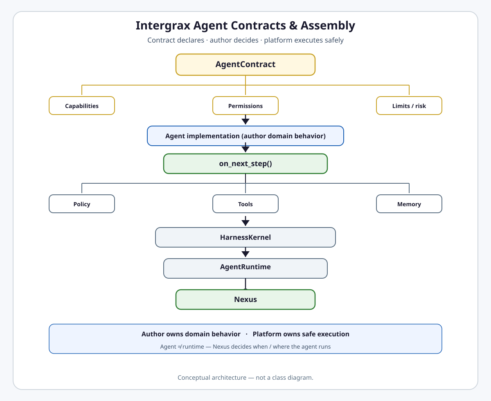

# Agent Contracts & Assembly

**Intergrax Agent Contracts & Assembly** defines how an agent declares its capabilities, inputs, outputs, permissions, limits, and risk — and how the platform binds that domain behavior into a governed execution environment.

> **Agent authors own domain behavior. The platform owns safe execution.**

An agent in Intergrax is a **contractually defined domain component**, not a private runtime. The author implements domain decisions — mainly through `on_next_step()` — while HarnessKernel, AgentRuntime, and UAEP enforce policy, tracing, budgets, memory/tool gateways, and lifecycle. Nexus decides **when** and **where** the agent runs; Tier-3 hosts select the roster and wire profiles.

```text
Agent contract     → what the agent promises
Agent author       → domain behavior / decisions
HarnessKernel + AgentRuntime + UAEP → safe execution
Nexus              → when / where the agent runs
Tier-3 host        → how the configured agent is exposed
```

**Agent ≠ runtime.** Agents must not implement private schedulers, HTTP servers, retry engines, direct vendor SDK calls, global state systems, multi-agent orchestration loops, tool gateways, or policy engines.

## Why it matters

Without a contract-driven agent model, every agent can expose a different API, capabilities stay implicit, tool permissions hide in code, limits and risk become un-auditable, agents build private runtimes, routing is unsafe, cross-host reuse fails, and governance and certification become accidental.

ACP solves this through:

- explicit `AgentContract` declarations,
- typed author surfaces (`AgentStepContext`, `StepOutcome`),
- registry and capability model for routing,
- platform-owned runtime execution (HarnessKernel / AgentRuntime / UAEP),
- profile and environment bindings,
- certification and release gates.

## Maturity boundary

> [!NOTE]
> **Phases ACP + ACP-CLOSE + ACP-FINISH + AUDIT-IDEAL (§12–§20) are Done** on the harness path — typed author API, fleet migration, production gates, registry snapshot, capability negotiation, lifecycle governance, prompt approval/diff, cross-host reuse certification, and eval-before-promotion enforcement. That is **platform-ready** architecture and gates, **not** universal **product production qualification**: every concrete agent, host combination, mutating deployment, operational SLO, and customer evidence requires separate qualification. See [Current maturity](#current-maturity) and [Harness-proven vs production-qualified](#harness-proven-vs-not-automatically-production-qualified).

**Primary audience:** Tier-2 agent authors and principal engineers defining agent contracts, assembly, and certification — after the platform overview in the root README.

## At a glance

| Concern | Summary |
| -------- | -------- |
| **Responsibility** | Agent contract, author surface, registry/capability model, assembly bindings — not private agent runtimes |
| **Agent contract** | `AgentContract` — identity, capabilities, I/O schemas, permissions, execution envelope |
| **Author API** | `Agent.run()` session facade; `on_next_step()` domain hook; typed `AgentStepContext` / `StepOutcome` |
| **Runtime API** | `AgentRuntime.advance_step()` glue; `HarnessKernel.execute_step()` safe cycle — internal to platform |
| **Capability / registry** | `capabilities[]` → `AgentRegistry` → capability resolve → Nexus routing |
| **Permissions / resources** | `allowed_tools`, `required_adapters`; profile-driven environment/resource bindings |
| **Limits / risk** | `max_steps`, `max_duration`, `max_cost`, `risk_level`, `failure_modes` on contract |
| **Assembly** | Contract + prompt/tool/LLM/memory/modality profiles + environment + governance → configured agent |
| **Nexus relation** | Nexus routes Task / graph nodes; agent executes domain role inside a node |
| **UER relation** | UAEP / HarnessKernel govern execution sequence, lifecycle, events — agent supplies behavior |
| **Tier-3 relation** | Host selects roster, binds profiles/environment, exposes product surfaces |
| **Distribution relation** | Catalog, install, binding, runtime lock, activation — [`AGENT_DISTRIBUTION.md`](AGENT_DISTRIBUTION.md) |
| **Production boundary** | Platform gates Done; per-agent / per-host production qualification **not** automatic |
| **Maturity** | Four-axis statement in [Current maturity](#current-maturity) — no dedicated public ACP proof route |
| **Go deeper** | [Engineering canon](#engineering-canon) · [extended depth satellite](satellites/AGENT_CONTRACTS_AND_ASSEMBLY_extended_depth.md) · [production gates satellite](satellites/AGENT_CONTRACTS_AND_ASSEMBLY_production_gates.md) · [plan](../maintainers/plans/AGENT_CONTRACTS_AND_ASSEMBLY.md) |

## Flagship architecture visual

<picture>
  <source media="(prefers-color-scheme: dark)" srcset="assets/agent-contract-assembly-dark.svg">
  <source media="(prefers-color-scheme: light)" srcset="assets/agent-contract-assembly-light.svg">
  
</picture>

**Author owns domain behavior. Platform owns safe execution.**

## How agents reach safe execution

```text
AgentContract (+ profiles / bindings)
        ↓
Tier-3 host wires environment → configured agent instance
        ↓
        ┌────────────────────────┴────────────────────────┐
        ↓                                                  ↓
Direct agent session                          Nexus Task / graph node
Agent.run()                                    UAEP bridge (run_step → shim)
        ↓                                                  ↓
AgentRuntime / session loop                             framework execution bridge
        └────────────────────────┬────────────────────────┘
                                 ↓
                         on_next_step()  — domain decision (author)
                                 ↓
                  HarnessKernel.execute_step()  — policy, trace, gateways, budgets
                                 ↓
                    AgentRunResult / graph node outcome
```

Nexus routes Task / graph nodes by capability when orchestration applies; it does **not** universally call `Agent.run()`. Both entry paths converge on the same author hook — `on_next_step()` — before platform-governed execution.

1. **Declare** — author defines `AgentContract` and registers capabilities.
2. **Assemble** — Tier-3 profile binds prompt, tool, LLM, memory, modality, and governance profiles.
3. **Route** — Nexus resolves `required_capability` via `AgentRegistry` (not hardcoded class names).
4. **Enter** — direct session via `Agent.run()`, **or** Nexus graph node via UAEP bridge (`run_step` → shim) without `Agent.run()` as outer facade.
5. **Decide** — each iteration: author `on_next_step()` returns intent; kernel executes safely.
6. **Govern** — lifecycle, certification, and production gates apply before `production_mode` promotion.

Minimal author path: [`guides/AGENT_AUTHOR_MINIMAL_PATH.md`](../technical/guides/AGENT_AUTHOR_MINIMAL_PATH.md).

## `run()` vs `on_next_step()`

| Entry | Scope | Owner |
| ----- | ----- | ----- |
| **`Agent.run()`** | Whole agent session — many iterations until terminal | Author-facing facade for **direct** sessions; base class orchestrates harness services |
| **`on_next_step()`** | One domain decision / iteration | Author domain logic — plan, tool intent, model choice within profile, terminal/HITL intent |

```text
Agent.run()           → whole direct agent session (Path A)
on_next_step()        → one domain decision / iteration (both paths)
```

`Agent.run()` is the public author-facing API for a full **direct** agent session. `on_next_step()` is the canonical author domain-decision hook.

Task / Nexus graph-node execution may reach the same `on_next_step()` through the UAEP bridge (`run_step` → shim) **without** using `Agent.run()` as the outer session facade. Therefore **`Agent.run()` is not the universal Tier-1 graph-node entry point.**

Authors **do not** implement the full execution loop. On the direct path: `run()` → merge environment → step loop (`advance_step` → `on_next_step`) → UAEP/policy/trace. Cognitive patterns (ReAct, decomposition) delegate to `on_next_step`.

Engineering detail: [§13](#13-agent-interface-run-facade-step-loop-and-uaep) · satellite [§32](satellites/AGENT_CONTRACTS_AND_ASSEMBLY_extended_depth.md).

## Execution stack

Ownership layers — not one mandatory call chain. Direct sessions and Nexus graph nodes take different outer paths; both converge on `on_next_step()` before HarnessKernel.

```text
Path A (direct):     Agent.run() → AgentRuntime.advance_step() → on_next_step() → HarnessKernel
Path B (Nexus):      Task → NexusLoop → graph node → UAEP bridge → on_next_step() → HarnessKernel
Shared author hook:  on_next_step()
Platform cycle:      HarnessKernel.execute_step() — policy, trace, gateways, budgets
```

| Layer | Does | Does not |
| ----- | ---- | -------- |
| **NexusLoop** | Task intake, graph, routing, delegation, merge | Agent session API; domain tool/model choice; mandatory `Agent.run()` on every node |
| **Agent.run()** | Direct author session facade; orchestrates iterations | Universal Tier-1 graph-node entry; policy, trace, tool gateway, budgets |
| **AgentRuntime** | Session-loop glue: `on_next_step` + kernel per iteration (Path A) | Domain planning |
| **UAEP bridge** | Nexus graph-node execution bridge (`run_step` → shim → `on_next_step`) | Author session API; domain planning |
| **on_next_step** | Domain reasoning, intent, terminal/HITL — **shared author hook** | Private lifecycle or retry engine |
| **HarnessKernel** | Policy, trace, gateways, state merge, budgets | Choose domain tools/models for author |

Nexus is **not** an agent session API. Agents must not build private multi-agent graphs outside Nexus contracts.

## Author surface vs platform surface

| Author owns | Platform owns |
| ----------- | ------------- |
| Domain reasoning | Policy |
| Intent / next step | Trace (`RuntimeEvent` spine) |
| Tool intent | Tool gateway (`BoundToolGateway` → `ToolRuntime`) |
| Model choice within profile | Model adapter / runtime constraints |
| Domain state decisions | State merge / checkpoint |
| Terminal / HITL intent | Lifecycle / HITL semantics |
| Capability declaration | Registry / routing infrastructure |
| Cognitive patterns in `on_next_step` | UAEP enforcement, attempt ledger |

## Typed author surface

ACP exposes typed contracts so authors can answer from code alone — without running the app:

1. what state was **read**,
2. what state **changed**,
3. whether the session **continues**, pauses, or **terminates**.

Key surfaces:

- `AgentStepContext` — step inputs, memory view, tool gateway, session state
- `StepOutcome` — typed factories for continue, terminal, HITL, tool intent
- `AcpSessionState` — typed session/state contracts

**Normative:** untyped `dict` on the author surface is **not supported**. See §32.0 in the [extended depth satellite](satellites/AGENT_CONTRACTS_AND_ASSEMBLY_extended_depth.md).

## AgentContract (public summary)

Group contract dimensions — full field list in [§12](#12-agent-contract).

### Identity

- `id`, `name`, `version`

### Capability

- `capabilities`, `description`

### Data contract

- `input_schema`, `output_schema`, `validation_rules`

### Permissions / resources

- `allowed_tools`, `required_adapters`

### Execution envelope

- `execution_mode`, `max_steps`, `max_duration`, `max_cost`, `risk_level`, `failure_modes`

## Capability model

```text
AgentContract.capabilities
        ↓
AgentRegistry (capability lookup)
        ↓
capability resolve / negotiation
        ↓
Nexus routing (required_capability → agent)
```

**Capability** answers: *what can this agent handle?* It is **not** a skill, tool id, or product feature. Production Nexus selection MUST resolve capability tokens — not Python class names (§16, §37.6 in extended satellite).

## Agent Registry

Tier-1 **execution projection** populated from materialized effective roster at host startup/activation:

- agent identity and version metadata,
- capability lookup for routing,
- durable snapshot / cross-host behavior (`registry_snapshot_store`),
- certification and lifecycle metadata when present.

Installation, catalog, binding, and activation are **Agent Distribution** — not duplicated here (§15).

## Capability graph (high level)

The capability graph answers operational questions:

- which agents depend on which capabilities/resources,
- blast radius of tool/skill/policy changes,
- what requires re-validation before release.

```text
Integration → Tool → Skill → Policy → Agent → Application → Product
```

AUDIT-IDEAL-20.1 blast-radius CI is **Done** — graph is analysis/governance, not a runtime scheduler. Detail: [§19](#19-capability-graph-architecture).

## Assembly

Semantic assembly model — ACP owns **binding surface**, component domains own semantics:

```text
AgentContract
+ PromptProfile
+ ToolProfile
+ LLM / Reasoning profile
+ Memory / context policy
+ ModalityProfile
+ environment / resource bindings
+ governance
        ↓
configured agent (host-specific instance)
```

- **ACP** — contract + author binding surface.
- **Tools / Memory / LLM / Reasoning** — own tool, memory, model, planner semantics.
- **Tier-3 host** — selects roster, wires `ApplicationEnvironmentProfile`, exposes product.

Do not treat ACP as a super-domain that subsumes Tools or Memory.

## Environment and resource binding

Agents may have per-agent environment and resource bindings — explicit and profile-driven. Authors should not discover global secrets or clients through ambient globals. Contract + `AgentRunBinding` + environment profile materialize effective resources at run time.

Implementation depth: satellite [§30](satellites/AGENT_CONTRACTS_AND_ASSEMBLY_extended_depth.md) — not duplicated here.

## Prompt registry

Prompts are **governed platform assets**, not uncontrolled embedded strings:

- ownership and versioning on every prompt id,
- agent declares / retrieves prompt bindings via profile,
- approval and diff workflow (AUDIT-IDEAL-17.1, 17.2 **Done**),
- Tier-3 `PromptProfile` selects catalog path per host.

Context assembly still flows through `ContextCompiler` / `ContextEngine` — Prompt Registry supplies governed fragments only ([`CONTEXT_ENGINEERING.md`](CONTEXT_ENGINEERING.md)). Canon: [§17](#17-prompt-registry-architecture).

## Cognitive architecture (ACP)

ACP provides **author-facing patterns** (ReAct, decomposition, reflection) as Tier-2 libraries implementing `on_next_step` — but:

- does **not** replace RCL task cognition ([`REASONING_AND_COGNITION.md`](REASONING_AND_COGNITION.md)),
- does **not** replace Nexus graph orchestration,
- does **not** create a second runtime.

Canon: [§21](#21-agent-cognitive-architecture-acp).

## Agent vs Reasoning & Cognition

| Layer | Owns |
| ----- | ---- |
| **Reasoning & Cognition (RCL)** | Platform-wide cognition contracts; planner/classifier semantics; `NexusPlan`, `DecisionRecord` |
| **ACP** | Cognition **inside** agent author surface — primarily `on_next_step()` and cognitive patterns |

Do not duplicate the three cognition planes here — see RCL hub.

## Agent vs Nexus

| | Agent | Nexus |
| - | ----- | ----- |
| **Role** | Executes domain role in one graph node | Routes Task, graph, multi-agent flow |
| **Entry** | `Agent.run()` | `NexusLoop.handle_task()` |
| **Rule** | Must not build private multi-agent graph | Owns orchestration control-flow |

## Agent vs UER

| | Agent | UER / UAEP |
| - | ----- | ---------- |
| **Supplies** | Domain behavior, `AgentDecision` intent | Execution sequence, lifecycle, `RuntimeEvent`, retry/HITL semantics |
| **Rule** | No custom lifecycle engine | `AgentEngine` / `HarnessKernel` mandatory path |

## Agent vs Tier-3 Application Hosting

| | ACP | Tier-3 host |
| - | --- | ----------- |
| **Defines** | Reusable contract + author surface | Product roster, profile wiring, exposure |
| **Rule** | Agent remains reusable where certified | Host selects environment and bindings |

## Agent vs Agent Distribution

| | ACP | Agent Distribution |
| - | --- | ------------------ |
| **Owns** | What agent is; how it executes | Catalog, install, binding, runtime lock, activation |
| **Boundary** | `AgentRegistry` execution projection only | Tier-0 distribution plane (ADR-AGENT-004, ADR-AGENT-005) |

## Agent lifecycle governance

Public summary — gates in [§20](#20-agent-lifecycle-governance) and production satellite §40+:

- owner / on-call metadata mandatory on certified agents (AUDIT-IDEAL-31.1 **Done**),
- evaluation required before production promotion — enforced (AUDIT-IDEAL-31.2 **Done**),
- certification, promotion, deprecation, retirement semantics,
- versioning and release posture per agent.

**Not every agent is production-certified.** Runtime rejects or reroutes retired agents in `production_mode`.

## Platform-ready vs product production-qualified

| Term | Meaning |
| ---- | ------- |
| **Platform-ready** | Architecture/runtime contracts, author API, registry, capability model, and CI/production gates **exist and are Done** on harness path |
| **Product / customer production-qualified** | Concrete agent + host + operational evidence + SLO/runbook + risk/certification + real deployment proof |

`ACP-PROD-*` and `ACP-CLOSE-PROD-*` **Done** mean mutating agents can meet platform gates — **not** that every agent or host is P4.

## Harness-proven vs not automatically production-qualified

### Harness / platform implemented

- ACP runtime depth, typed author API, fleet migration (ACP-FINISH **Done**)
- Production gates, token budget enforcement, checkpoint/idempotency depth
- Registry snapshot, capability negotiation, blast-radius CI
- Lifecycle governance, prompt approval/diff, cross-host reuse certification
- Eval-before-promotion enforcement

### Not automatically production-qualified

- Every real agent implementation and certification scoreboard row
- Every host combination and Tier-3 wiring matrix
- Every mutating agent / customer deployment
- Universal SLO, runbook, and operational evidence

`production_mode` and platform-ready wording are posture — not taxonomy **P4**.

## Current maturity

Architecture maturity: **A4**  
Implementation maturity: **I4**  
Production readiness: **P2**  
Evidence maturity: **E3**

- **A4** — Normative contract, author/runtime ownership split, assembly model, registry/capability architecture, adjacent-domain boundaries (Nexus, UER, Tools, Memory, Reasoning, Distribution, Tier-3); AUDIT-IDEAL §12–§20 **Done** ([plan](../maintainers/plans/AGENT_CONTRACTS_AND_ASSEMBLY.md)).
- **I4** — ACP + ACP-CLOSE + ACP-FINISH **Done**: `run()` / `on_next_step`, HarnessKernel path, fleet migration, registry snapshot, capability negotiation, prompt governance, lifecycle gates, production-gate implementation. Not I5 — uneven per-agent certification and host adoption.
- **P2** — Platform-ready gates and harness host depth (**ACP-CLOSE-PROD-* Done**); **no** universal product production handoff or per-customer operational package — `production_mode` ≠ **P4**.
- **E3** — Unit/gate suite (`check_agent_acp_close_ci.py`, contract/author surface, registry, capability graph, lifecycle metadata), integration paths (Nexus/UAEP execution, cross-host reuse certification). **No dedicated public ACP proof route** in [`PROOFS.md`](../proofs/PROOFS.md) — not E4/E5.

> **Phase vs maturity:** ACP-FINISH and AUDIT-IDEAL **Done** rows are plan delivery states, not P-axis or public proof claims.

## Evidence / proof

| Evidence class | What exists | What it does not prove |
| -------------- | ----------- | ---------------------- |
| Architecture | This hub, satellites, ADR-AGENT-001..004 | Production operation |
| Unit / gate | Contract/author surface, registry, capability graph, policy/budget gates, `check_agent_acp_close_ci.py` | Every agent/host matrix |
| Integration | Agent execution via Nexus/UAEP, cross-host reuse certification, lifecycle/certification tests | Universal product qualification |
| Public product proof | **None** — no dedicated ACP entry in [`PROOFS.md`](../proofs/PROOFS.md) | Do not infer from other domain proofs |
| Production / customer | **None** cited for ACP domain | Not E5 |

Audit slice: [`guides/audit_slices/AGENT_CONTRACTS_AND_ASSEMBLY.md`](../technical/guides/audit_slices/AGENT_CONTRACTS_AND_ASSEMBLY.md).

## Go deeper

| Depth | Route |
| ----- | ----- |
| **Engineering canon** | [Below](#engineering-canon) — §12–§21 |
| **Extended depth** | [`satellites/AGENT_CONTRACTS_AND_ASSEMBLY_extended_depth.md`](satellites/AGENT_CONTRACTS_AND_ASSEMBLY_extended_depth.md) — §22–§39 + §45 |
| **Production gates** | [`satellites/AGENT_CONTRACTS_AND_ASSEMBLY_production_gates.md`](satellites/AGENT_CONTRACTS_AND_ASSEMBLY_production_gates.md) — §40+ |
| **Implementation plan** | [`maintainers/plans/AGENT_CONTRACTS_AND_ASSEMBLY.md`](../maintainers/plans/AGENT_CONTRACTS_AND_ASSEMBLY.md) |
| **Minimal author path** | [`guides/AGENT_AUTHOR_MINIMAL_PATH.md`](../technical/guides/AGENT_AUTHOR_MINIMAL_PATH.md) |
| **Agent Distribution** | [`AGENT_DISTRIBUTION.md`](AGENT_DISTRIBUTION.md) |
| **Nexus** | [`NEXUS_EXECUTION_FLOW.md`](NEXUS_EXECUTION_FLOW.md) |
| **UER** | [`UNIFIED_EXECUTION_RUNTIME.md`](UNIFIED_EXECUTION_RUNTIME.md) |
| **Reasoning** | [`REASONING_AND_COGNITION.md`](REASONING_AND_COGNITION.md) |
| **Tools** | [`TOOLS.md`](TOOLS.md) |
| **Memory** | [`MEMORY.md`](MEMORY.md) |
| **Application hosting** | [`APPLICATION_HOSTING.md`](APPLICATION_HOSTING.md) |
| **Audit** | [`audit/AGENT_CONTRACTS_AND_ASSEMBLY.md`](../maintainers/audit/AGENT_CONTRACTS_AND_ASSEMBLY.md) |

---

## Maintainer and Cursor context

**Status:** Canonical architecture (domain pair 1:1) · **Production coding gate:** §40 + ACP-PROD-* + **ACP-CLOSE-PROD-*** **Done** at **platform** level (mutating agents can meet platform gates — not universal product qualification)  
**Hub:** [`intergrax_runtime_architecture.md`](intergrax_runtime_architecture.md)  
**Plan (1:1):** [`plan/AGENT_CONTRACTS_AND_ASSEMBLY.md`](../maintainers/plans/AGENT_CONTRACTS_AND_ASSEMBLY.md)  
**Target:** [`IDEAL_HARNESS_AI_ARCHITECTURE.md`](../technical/guides/IDEAL_HARNESS_AI_ARCHITECTURE.md)  
**Audit layers:** 17–20, 31 (+ ACP cognitive patterns §21)  
**Audit instruction:** [`audit/AGENT_CONTRACTS_AND_ASSEMBLY.md`](../maintainers/audit/AGENT_CONTRACTS_AND_ASSEMBLY.md)  
**ADR:** [`adr/entries/2026-06-11/ADR-AGENT-001.md`](../technical/adr/entries/2026-06-11/ADR-AGENT-001.md) · [`adr/entries/2026-06-11/ADR-AGENT-002.md`](../technical/adr/entries/2026-06-11/ADR-AGENT-002.md) · [`adr/entries/2026-06-11/ADR-AGENT-003.md`](../technical/adr/entries/2026-06-11/ADR-AGENT-003.md) · [`adr/entries/2026-08-12/ADR-AGENT-004.md`](../technical/adr/entries/2026-08-12/ADR-AGENT-004.md) — ACP · `run()` · `on_next_step` · dual observability · distribution boundary  

**Distribution (execution-adjacent — do not duplicate here):** [`AGENT_DISTRIBUTION.md`](AGENT_DISTRIBUTION.md) — catalog · install · binding · runtime lock · activation (AGENT-PLATFORM-2)

> **Practical minimal authoring path:** [`guides/AGENT_AUTHOR_MINIMAL_PATH.md`](../technical/guides/AGENT_AUTHOR_MINIMAL_PATH.md)

**Observability spine:** [`OBSERVABILITY.md`](OBSERVABILITY.md#observability-event-spine) — agents extend Plane B via `DiagnosticPayload`; execution truth lives on `RuntimeEvent` (Plane A). See §31 in [extended depth satellite](satellites/AGENT_CONTRACTS_AND_ASSEMBLY_extended_depth.md) and [event ownership rules](OBSERVABILITY.md#event-ownership-rules).

**Retry / recovery:** agents emit recovery **intent** only — runtime owns retry policy, layers and stop reasons — [`RELIABILITY_FAILURE_AND_HITL.md`](RELIABILITY_FAILURE_AND_HITL.md#attempt-ledger) · [`SYSTEM_INVARIANTS.md`](../technical/guides/SYSTEM_INVARIANTS.md) §8.

### Cursor read scope (token budget)

**Do not read this entire file in one session** (AGENT_CONTRACTS_AND_ASSEMBLY canon).

- **Implement / audit default:** §12–§21 (contract, registry, capability, ACP). Extended §22–§39 + checklist §45: [`satellites/AGENT_CONTRACTS_AND_ASSEMBLY_extended_depth.md`](satellites/AGENT_CONTRACTS_AND_ASSEMBLY_extended_depth.md). §40+: [`satellites/AGENT_CONTRACTS_AND_ASSEMBLY_production_gates.md`](satellites/AGENT_CONTRACTS_AND_ASSEMBLY_production_gates.md).
- **Use** table of contents below — `Read` with offset/limit per §.
- **Plan hub:** [`plan/AGENT_CONTRACTS_AND_ASSEMBLY.md`](../maintainers/plans/AGENT_CONTRACTS_AND_ASSEMBLY.md) (scoped §6 only).
- **Audit slice:** [`guides/audit_slices/AGENT_CONTRACTS_AND_ASSEMBLY.md`](../technical/guides/audit_slices/AGENT_CONTRACTS_AND_ASSEMBLY.md).
- **Max reads:** at most **one** file >5k tokens per session unless RESUME cites more.

### Architecture satellites (read on demand)

Large § blocks moved out of the architecture hub to reduce Cursor context use. Load **only** the satellite matching your task or cited §.

| Satellite | Contents |
|-----------|----------|
| [`satellites/AGENT_CONTRACTS_AND_ASSEMBLY_extended_depth.md`](satellites/AGENT_CONTRACTS_AND_ASSEMBLY_extended_depth.md) | §22–§39 + §45 extended depth |
| [`satellites/AGENT_CONTRACTS_AND_ASSEMBLY_production_gates.md`](satellites/AGENT_CONTRACTS_AND_ASSEMBLY_production_gates.md) | §40+ production gates |

> **Cursor context budget:** read hub read-scope block + **at most one** satellite per session.

### Table of contents (engineering canon — hub §12–§21)

| § | Topic |
|---|--------|
| [§12](#12-agent-contract) | Agent contract |
| [§13](#13-agent-interface-run-facade-step-loop-and-uaep) | Agent interface: `run()`, step loop, UAEP |
| [§14](#14-agent-execution-result) | Agent execution result |
| [§15](#15-agent-registry) | Agent registry |
| [§16](#16-capability-model) | Capability model |
| [§17](#17-prompt-registry-architecture) | Prompt registry |
| [§18](#18-registry-architecture) | Registry architecture |
| [§19](#19-capability-graph-architecture) | Capability graph |
| [§20](#20-agent-lifecycle-governance) | Agent lifecycle governance |
| [§21](#21-agent-cognitive-architecture-acp) | Agent Cognitive Architecture (ACP) |

Extended §22–§39 + §45 → [extended depth satellite](satellites/AGENT_CONTRACTS_AND_ASSEMBLY_extended_depth.md). §40+ → [production gates satellite](satellites/AGENT_CONTRACTS_AND_ASSEMBLY_production_gates.md).

---

## Engineering canon

# 12. Agent Contract

Every agent MUST implement a clear contract.

The contract should be easy for humans and LLMs to understand.

Minimum required fields:

```text
AgentContract:
    id
    name
    description
    version
    capabilities
    input_schema
    output_schema
    allowed_tools
    required_adapters
    execution_mode
    max_steps
    max_duration
    max_cost
    risk_level
    validation_rules
    failure_modes
```

---


---

# 13. Agent Interface: `run()` Facade, Step Loop, and UAEP

**ADR:** [ADR-AGENT-002](../technical/adr/entries/2026-06-11/ADR-AGENT-002.md) · [ADR-AGENT-003](../technical/adr/entries/2026-06-11/ADR-AGENT-003.md)

## 13.1 Primary author API — session `run()` (ADR-AGENT-002)

**Authors SHOULD use one session entry point:**

```text
result = await my_agent.run(request: AgentRunRequest) -> AgentRunResult
```

`Agent.run()` on the base class orchestrates harness services; subclasses implement **domain logic only** via **`on_next_step`** (§32), ACP hooks, or `@step` methods. See §29 for full contract and §31 for **`AgentRunTrace`** on the result.

**Internal engine:** `run()` → merge environment §30 → **step loop** (`execute_next_step` → `on_next_step`) → UAEP/policy/trace. Authors MUST NOT reimplement this stack.

## 13.2 Primary author API — step `on_next_step()` (ADR-AGENT-003)

**Authors SHOULD override one step hook for non-linear / cognitive agents:**

```text
async def on_next_step(self, step_ctx: AgentStepContext) -> StepOutcome
```

**Readability rule (normative — §32.0):** every author MUST be able to answer, from code alone and without running the app: (1) what state was read, (2) what state changed, (3) whether the session continues, pauses, or terminates — via **typed** `AcpSessionState` + `StepOutcome` factories only. Untyped `dict` on the author surface is **not supported**.

| Responsibility | Owner |
|----------------|-------|
| Domain reasoning, tool intent, RAG query, LLM model choice (within profile) | **Author** (`on_next_step`) |
| Whether plan is needed / still valid / terminal / replan / HITL | **Author** (`on_next_step`) |
| Policy, trace events, tool gateway, memory view, budgets, state merge | **Harness kernel** (`HarnessKernel.execute_step`) §38 |
| One agent iteration glue (domain hook + kernel) | **Agent runtime** (`AgentRuntime.advance_step`) §38 |
| Multi-agent graph, task routing, application governance | **NexusLoop** (Tier-1) §38 |

One **`run()`** invocation executes **many** iterations of **`advance_step`** until `StepOutcome.is_terminal`. See §32 · §38.

## 13.3 Framework surface (Tier-2 vs author visibility)

| Surface | Who implements | Author visibility |
|---------|----------------|-------------------|
| `run(AgentRunRequest)` | Base `IntergraxAgent` / `CognitiveAgent` | **Public — agent decision loop** |
| `on_next_step(AgentStepContext)` | Subclass | **Public — domain step** |
| `AgentRuntime.advance_step` | Framework only | **Internal — one iteration; alias `execute_next_step`** |
| `HarnessKernel.execute_step` | Tier-0/1 kernel | **Internal — deterministic harness cycle** |
| `perceive` / `reason` / `act` / `evaluate` | Subclass / pattern base | **Public — may delegate to `on_next_step`** |
| `@step` methods | Subclass | **Public — linear pipelines** |
| `get_contract`, `can_handle` | Subclass | **Public — registration** |
| `configure_run` / `merge_environment` | Subclass optional hooks | **Public — per-agent tuning** §30 |
| `NexusLoop.handle_task` | Tier-1 | **Internal — application orchestration only** |
| `get_steps`, `run_step`, `decide_after_step` | Framework (UAEP bridge) | **Internal — legacy map to §32/§38** |
| `build_context` | Subclass or harness injection | **Advanced** §30 |

## 13.4 UAEP (internal protocol — implementation of step loop)

Every production agent MUST satisfy **`UAEPAgent`** via the framework base class. Nexus graph nodes invoke the same path whether the caller used `agent.run()` or `Task → NexusLoop`.

```text
UAEPAgent (framework-wired, not author boilerplate):
    get_steps(context) -> list[AgentStep]
    async run_step(step, ctx: RuntimeExecutionContext) -> StepOutput
    decide_after_step(step, output, ctx) -> AgentDecision   # optional; prefer on_next_step
```

**Mapping (normative — §38):**

```text
Agent.run()                    = agent decision loop (many iterations)
Agent.on_next_step()           = agent decides: plan? tool? model? terminal? HITL?
AgentRuntime.advance_step()    = one iteration glue (calls on_next_step + kernel)
HarnessKernel.execute_step()   = deterministic harness cycle (NO domain planning)
NexusLoop.handle_task()        = application / multi-agent orchestration ONLY

Legacy UAEP names (implementation today):
  run_step / UAEPExecutor  →  advance_step + execute_step bridge (ACP-STEP-3)
  planning/StepExecutor    →  ExecutionPlan runner — NOT agent cognitive step
```

**Rules:**

- Agents MUST NOT implement private OS lifecycles (HTTP servers, global schedulers, direct vendor SDK calls).
- Agents MUST NOT bypass `Agent.run()` / `on_next_step` with Tier-1 execution shortcuts (ACP-CLOSE-LEG-5).
- Control flow via **`StepOutcome`** / **`AgentDecision`** (§42.7).
- Optional: `UAEPAgentWithResume.resume_step` for checkpointed long steps.

## 13.5 Removed legacy paths (ACP-CLOSE-LEG-5)

| Path | Status |
|------|--------|
| `RuntimeEngine` / `RuntimePipeline` / `runtime_steps` | **Removed** — [ADR-FLOW-005](../technical/adr/entries/2026-06-12/ADR-FLOW-005.md) |
| `agents/*/steps/pipeline.py` / `uaep_pipeline_bridge.py` | **Removed** — use `on_next_step` + cognitive patterns |
| `execute()` pseudocode | Replaced by `run()` + `on_next_step` |
| Override `execute_next_step` / `advance_step` | **Forbidden** — bypasses policy/trace |
| `nexus.run()` as agent session API | **Forbidden** — use `Agent.run()`; NexusLoop for Task only §38 |

**Author loop control (normative):** every domain iteration is decided in **`on_next_step`** (or a cognitive pattern delegating to it). The harness runs **`HarnessKernel.execute_step`** — policy, trace, gateways, budgets — without choosing tools, models, or termination.

**Execution entry (two paths, same author hook):**

| Path | When | Outer loop | Cognition |
|------|------|------------|-----------|
| **ACP session** | `metadata["acp.session.v1"]` (Tier-3 harness task enricher sets by default) | `run_acp_session` → `AgentRuntime.advance_step` (multi-iteration) | `on_next_step` each iteration |
| **UAEP bridge (Nexus default)** | `CognitiveAgent` / fleet agents | `UAEPExecutor` over `get_steps()` (typically **one** cognitive step) | `run_step` → `acp_uaep_shim` → **`on_next_step`**; ReAct/plan-execute loop **inside** `on_next_step` |

`UaepPipelineStubAgent` in `testing_support` is **test-only**. Product agents MUST NOT author custom `get_steps`/`run_step` beyond `CognitiveAgent` defaults — implement domain logic in `on_next_step` / pattern hooks.

```text
# ACP session (opt-in via acp.session.v1)
Agent.run(AgentRunRequest)
  └─ run_acp_session: for max_iterations
        ├─ agent.on_next_step(step_ctx) → StepOutcome   ← AUTHOR
        └─ HarnessKernel.execute_step(outcome)          ← HARNESS

# Nexus production default (fleet CognitiveAgent)
AgentEngine → UAEPExecutor → run_step → on_next_step → HarnessKernel (via uaep_step_bridge)
```

No Tier-1 code path may inject fixed step order (retired `RuntimePipeline` / `runtime_steps`). Tool loops (ReAct) run **inside** `on_next_step` via `run_bounded_tool_loop` + `ctx.invoke_tool`, not via Nexus graph scheduling (ADR-TOOL-002).

## 13.6 Authoring facades

| Facade | Module | Use when |
|--------|--------|----------|
| `IntergraxAgent` | `intergrax/agents/authoring/base.py` | `@step` linear agents; inherits `run()` + default `on_next_step` |
| `CognitiveAgent` + patterns §26 | `intergrax/agents/authoring/patterns` | ReAct, decomposition, reflection — patterns implement `on_next_step` |
| `HarnessReferenceAgent` | `harness_reference_agent.py` | Low-level UAEP ABC (framework/tests) |

**Guide:** [`guides/AGENT_CREATION_GUIDE.md`](../technical/guides/AGENT_CREATION_GUIDE.md) Appendix AC · **Plan:** Phase **ACP** + **ACP-DX** + **ACP-STEP** rows.

---


---

# 14. Agent Execution Result

Every agent should return a structured result.

Recommended structure:

```text
AgentExecutionResult:
    agent_id
    run_id
    status
    summary
    artifacts
    structured_data
    evidence
    confidence
    warnings
    errors
    used_tools
    cost
    duration
    next_recommendations
```

The result must be inspectable by Nexus and by humans.

---


---

# 15. Agent Registry

> **Distribution boundary:** installation, binding, effective roster, dependency lock, and activation are owned by [`AGENT_DISTRIBUTION.md`](AGENT_DISTRIBUTION.md). This section covers **Tier-1 execution projection only** — `AgentRegistry` is populated from materialized effective roster at host startup/activation, not from catalog or install stores.

Nexus discovers agents through the Agent Registry.

The registry stores:

- agent id
- name
- description
- version
- capabilities
- required adapters
- allowed tools
- execution modes
- cost profile
- risk profile
- status

Nexus MUST use the registry for agent selection.

Agents MUST NOT be hardcoded into Nexus logic unless explicitly needed for a minimal prototype.

Even in prototypes, hardcoded agents should be treated as temporary.

---


---

# 16. Capability Model

A capability describes what an agent can do.

Examples:

```text
capability: vendor.discovery
capability: vendor.scoring
capability: legal.contract_review
capability: research.web_search
capability: problem_radar.source_monitoring
capability: problem_radar.clustering
capability: onboarding.daily_guidance
```

Nexus should route tasks to capabilities, not only to specific class names.

This allows agents to be replaced later.

**Routing invariant (normative — §37.6):** production Nexus agent selection MUST resolve **`required_capability`** (or task capability token) → registry entries by **`capabilities[]`** match — **not** by Python class name, module path, or hardcoded agent id. Class name MAY appear only in Tier-3 manifest **`AgentBinding`** for wiring a chosen capability to a concrete implementation. CI: `check_capability_routing.py` (ACP-CON-6).

---


---

# 17. Prompt Registry Architecture

Prompt artifacts are **governed platform assets**, not ad-hoc strings in agents.

## 17.1 Requirements

- ownership and versioning on every prompt id (`PromptMeta`),
- composable layers: system / task / policy / context,
- deterministic policy injection overlays,
- regression suites on golden prompt catalogs,
- Tier-3 `PromptProfile` selects YAML catalog path per host.

## 17.2 Code map

| Module | Role |
|--------|------|
| `intergrax/prompts/registry` | YamlPromptRegistry, governance validation |
| `intergrax/runtime/architecture/prompt_registry_governance.py` | Ownership / risk tier gates |
| `intergrax/runtime/architecture/prompt_composition.py` | Layer composition |
| `intergrax/runtime/architecture/prompt_policy_overlay.py` | Policy overlays |
| `intergrax/runtime/architecture/prompt_regression_suite.py` | Golden regression |
| `intergrax/applications/_shared/prompt_wiring.py` | Environment → Nexus prompt registry |

**Authoring:** [`guides/AGENT_CREATION_GUIDE.md` Appendix M](../technical/guides/AGENT_CREATION_GUIDE.md) · **Plan:** [`plan/AGENT_CONTRACTS_AND_ASSEMBLY.md`](../maintainers/plans/AGENT_CONTRACTS_AND_ASSEMBLY.md) Phase PE.

**Context assembly boundary:** Prompt Registry supplies governed **fragments** only — not a full LLM window. Production context **MUST** flow through `ContextCompiler` / `ContextEngine` or an explicitly approved equivalent. See [`CONTEXT_ENGINEERING.md`](CONTEXT_ENGINEERING.md) §12 Context Path Unification.

---

# 18. Registry Architecture

Registries are versioned, snapshot-capable catalogs — not mutable globals.

## 18.1 Registry types

| Registry | Tier | Consumed by |
|----------|------|-------------|
| Agent registry | 1 | Nexus agent selection |
| Tool registry | 0 | `ToolRuntime` |
| Skill registry | 0 | Skill resolver |
| Integration registry | 0 | Provider hosts |
| Prompt registry | 0/1 | Nexus steps, eval |
| Evaluation registry | 1 | EvalRunner, release gates |

## 18.2 Assembly pattern

Tier-3 `wire_application_environment()` materializes registries from `ApplicationEnvironmentProfile` tool/skill/integration/prompt profiles → `RuntimeConfig` via `runtime_config_bridge.py` and domain `*_assembly_resolver.py` modules.

Snapshots and conformance CI validate registry shape before release (`scripts/maintenance/check_agents_lifecycle_metadata.py`, harness registry guards). **Durable cross-host snapshots:** `applications/_shared/registry_snapshot_store.py` (AUDIT-IDEAL-19.1) + `check_registry_snapshot_diff.py`.

**Plan:** [`plan/AGENT_CONTRACTS_AND_ASSEMBLY.md`](../maintainers/plans/AGENT_CONTRACTS_AND_ASSEMBLY.md) Phase REG.

---

# 19. Capability Graph Architecture

> **Tier-3 consumption:** environment-scoped graph view, blast-radius deploy gates, and ops health dimensions — [`TIER3_APPLICATION_ENVIRONMENT.md`](TIER3_APPLICATION_ENVIRONMENT.md) §50.1 · §51. **Do not duplicate** graph taxonomy in Tier-3; extend via `EnvironmentCapabilityGraphView` only.

Registries and capability layers MUST be represented as a typed dependency graph:

```text
Integration -> Tool -> Skill -> Policy -> Agent -> Application -> Product
```

## 19.1 Minimum requirements

- typed node and edge taxonomy,
- dependency lineage and provenance,
- blast-radius impact analysis for version/policy/runtime changes,
- compatibility validation on graph edges before release.

## 19.2 Code map

| Module | Role |
|--------|------|
| `runtime/architecture/capability_graph.py` | Core graph model |
| `capability_graph_lineage.py` | Lineage / provenance |
| `capability_graph_compatibility.py` | Edge compatibility |
| `capability_graph_applications.py` | Application slice |
| `scripts/release/phase_v_capability_graph_guard.py` | CI guard + blast-radius impact (AUDIT-IDEAL-20.1) |
| `scripts/gates/check_capability_graph_strict_deploy.py` | STRICT deploy gate (APP-OPS-1) |

Nexus routes to **capabilities** (§16), not hardcoded class names. Graph edges MUST reflect manifest roster per application — not global cross-product shortcuts.

**Plan:** [`plan/AGENT_CONTRACTS_AND_ASSEMBLY.md`](../maintainers/plans/AGENT_CONTRACTS_AND_ASSEMBLY.md) Phase CG.

---

# 20. Agent Lifecycle Governance

Beyond contract shape (§12) and registry metadata (§15):

| Stage | Requirement |
|-------|-------------|
| Certification | quality + policy + security gates before production |
| Promotion | dev → staging → production with evidence |
| Deprecation | migration windows, runtime filters for retired agents |
| Retirement | rollback/archive semantics |
| Ownership | explicit owner + escalation path |

**Code:** `runtime/architecture/agent_lifecycle_governance.py`, `agent_certification.py`, `agent_promotion.py`, `production_ownership.py`. **On-call gate (AUDIT-IDEAL-31.1):** `check_agents_lifecycle_metadata.py`, `check_on_call_ownership_model.py`, `on_call_contact` on `AgentContract`.

Runtime MUST reject or reroute retired/deprecated agents in production mode (V-REM-ALG.*). **Plan:** Phase AS + V-REM in [`plan/AGENT_CONTRACTS_AND_ASSEMBLY.md`](../maintainers/plans/AGENT_CONTRACTS_AND_ASSEMBLY.md).

---

# 21. Agent Cognitive Architecture (ACP)

**Status:** Canonical architecture — **platform delivered** (Phase ACP + ACP-CLOSE + ACP-FINISH **Done**); AUDIT-IDEAL §12–§20 **Done** (2026-06-13)  
**ADR:** [ADR-AGENT-001](../technical/adr/entries/2026-06-11/ADR-AGENT-001.md)
**Plan:** [`plan/AGENT_CONTRACTS_AND_ASSEMBLY.md`](../maintainers/plans/AGENT_CONTRACTS_AND_ASSEMBLY.md) — ACP · ACP-CLOSE · ACP-FINISH · AUDIT-IDEAL **Done**
**Cross-domain:** [`REASONING_AND_COGNITION.md`](REASONING_AND_COGNITION.md) (planes 1–3) · [`NEXUS_EXECUTION_FLOW.md`](NEXUS_EXECUTION_FLOW.md) (narrative) · [`TOOLS.md`](TOOLS.md) TOOL-ENG-6 (tool loop) · [`CRITIC_VERIFICATION.md`](CRITIC_VERIFICATION.md#verification-safety-boundaries) (reflection / verification safety) · [`CODE_CRAFT.md`](CODE_CRAFT.md#codecraft-safety-boundary) (ephemeral codegen — no agent-local craft loops)

## 21.1 Purpose

Define the **Agent Cognitive Architecture (ACP)** — how Tier-2 agents are authored, how they interact with Tier-1 Nexus, and how **cognitive patterns** (reflex, ReAct, plan-execute, decomposition, reflection) are implemented **without** collapsing the Harness into agent classes.

ACP answers:

> **How does a developer build a production-grade agent quickly, with the right reasoning pattern, while staying inside UAEP and platform governance?**

ACP does **not** replace Nexus, redefine tiers, or introduce a second execution engine.

## 21.2 Design invariants

| ID | Invariant |
|----|-----------|
| **ACP-INV-01** | Nexus remains Agent OS — global orchestration, policy, HITL, multi-agent graph |
| **ACP-INV-02** | All agent runs use UAEP step loop (legacy UAEP authoring retired — ACP-CLOSE-LEG-5) |
| **ACP-INV-03** | Cognitive patterns are **Tier-2 libraries** — no imports from `applications` or `intergrax.applications` |
| **ACP-INV-04** | Side effects only through `RuntimeExecutionContext.tool_gateway` → `ToolRuntime` |
| **ACP-INV-05** | Control flow via `AgentDecision` — never `sleep()` for HITL, never direct Slack/webhooks |
| **ACP-INV-06** | Configuration: **contract + pattern in agent**; **governance profile in Tier-3** |
| **ACP-INV-07** | Three cognition planes MUST NOT be collapsed into one opaque agent loop (§23) |
| **ACP-INV-08** | Every step emits `STEP_*` and `DECISION_EMITTED` events (§42.1) |
| **ACP-INV-09** | **`run()` is the author entry**; UAEP is internal; Nexus is application entry for `Task` (ADR-AGENT-002) |
| **ACP-INV-10** | Per-agent resources (memory, tools, RAG) bound via contract + environment — not hardcoded SDK clients |
| **ACP-INV-11** | **`NexusLoop` orchestrates tasks/graphs**; **`HarnessKernel.execute_step`** runs one deterministic agent runtime cycle — kernel MUST NOT plan agent reasoning (§38) |
| **ACP-INV-12** | **Organizational policy** is Tier-3 environment data — agents consume `OrganizationalPolicyContext`; harness enforces; agents MUST NOT embed org-specific regulations in source (§39) |
| **ACP-INV-13** | **Authenticated runs default to user-scoped memory** (`tenant_id` + `user_id`) — org-wide memory only when contract/binding/env declare `memory_scope=org` §30.9 |

## 21.3 Rejected architecture (audit outcome)

The following proposals were audited and **rejected** — documented here to prevent regression:

```text
REJECTED: Move NexusLoop responsibilities into IntergraxAgent base class
REJECTED: Agent owns PolicyEngine, GraphExecutor, or AgentRegistry
REJECTED: All RuntimeConfig / ApplicationEnvironmentProfile fields hardcoded in agent source
REJECTED: Private while-True agent loops without UAEP step boundaries
REJECTED: nexus.run() / NexusLoop as agent plan brain — planning lives in Agent.on_next_step (§38)
REJECTED: Nexus "run" naming for agent session step executor — blurs Agent OS vs step kernel
```

**Rationale:** Harness-first strategy ([`IDEAL_HARNESS_AI_ARCHITECTURE.md`](../technical/guides/IDEAL_HARNESS_AI_ARCHITECTURE.md) §0.2) — the runtime is the durable product; agents are replaceable workers.

## 21.4 Application boundary (agent/runtime merge)

Tier-1 agent merge (`merge_environment`, `ACPSessionHostContext`, ACP run loop) consumes **neutral runtime contracts** only — never `ApplicationManifest`, `ApplicationEnvironmentProfile`, or application-layer `AgentBinding`.

| Tier-3 (application host) | Neutral contract (agent/runtime) | Adapter |
|---------------------------|----------------------------------|---------|
| `ApplicationEnvironmentProfile` | `RuntimeEnvironmentProfile` (`intergrax/contracts/runtime_environment.py`) | `application_profile_to_runtime_profile()` |
| `AgentBinding` (manifest roster) | `AgentRunBinding` (`intergrax/contracts/agent_run_binding.py`) | `agent_binding_to_run_binding()` |
| `ExecutionMode`, org policy envelopes | `intergrax/contracts/execution_mode.py`, `intergrax/contracts/org_policy.py` | Re-exported from `intergrax/applications/contracts/*` for host authoring |

Adapters: `intergrax/applications/_shared/runtime_boundary_adapters.py`. Runtime bridges previously under `intergrax/applications/_shared/*_runtime_bridge.py` that agents/runtime consumed now live under `intergrax/runtime/wiring`.

CI: `scripts/check_no_upward_application_imports.py` (canonical) plus maintenance guards in `scripts/maintenance`.

---
