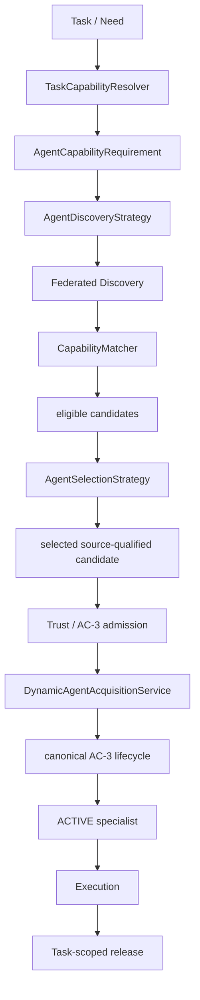
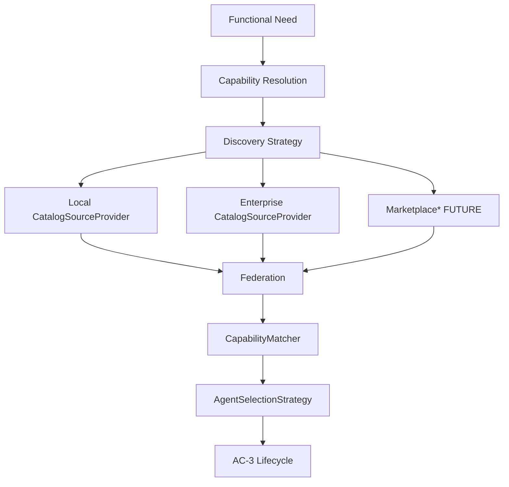

# Agent Distribution and Management

**Intergrax Agent Distribution and Management** is the Tier-0 platform plane that governs how agent packages move from catalog discovery through installation, application binding, deterministic dependency closure, immutable materialization, and activation - before Tier-1 **AgentRegistry** projection and Nexus capability routing answer what is actually running and routable.

The domain sits **below** Tier-3 application composition and **above** Tier-1 execution: applications declare defaults and host admin surfaces; Agent Distribution owns durable install/bind/enable state and produces revision-bound runtime artifacts; **AgentRegistry** remains a derived projection; **Nexus** remains capability routing only.

## Why it matters

Without a separate distribution layer, operators and product surfaces collapse distinct lifecycle steps:

- **Catalog availability ≠ installation** - a listing or index entry does not mean a digest-pinned artifact is verified on the host.
- **Installation ≠ application binding** - an installed package is not automatically bound to an application slot with validated config.
- **Application binding ≠ activation** - durable bindings and enablement do not by themselves swap the active runtime revision.
- **Catalog listing ≠ trusted runnable agent** - trust, provenance, and revocation gates precede production activation.
- **Runtime must not guess dependency closure** - every activated revision requires a deterministic lock produced from an effective roster, not floating catalog state.
- **Marketplace must not become a second runtime** - discovery and publisher onboarding are product/catalog surfaces; execution stays on AgentRegistry + Nexus.

Agent Distribution keeps these steps explicit and authoritative so third-party agents, enterprise catalogs, and future marketplace listings can attach without forking orchestration or hot-loading Python into a live process.

## Current reality / maturity boundary

Read this hub in four layers - do not merge them into a single “shipped” headline.

**A. Canonical architecture (frozen).** AGENT-PLATFORM-2 + ARCH-AGENT-ACTIVATION-1 define the full distribution → activation → projection chain, orthogonal lifecycle dimensions, persistence matrix, and marketplace/LKW boundaries. The architecture delivery for AGENT-PLATFORM-2 is **complete**; activation semantics are **frozen**.

**B. Implemented pieces (capability-specific).** Tier-0 modules under `intergrax/agent_distribution/` and reference process-local production semantics (§34) implement parts of the chain - contracts, stores, trust, roster merge, lock production, materialization adapters, activation/projection services - under explicit scope limits. Process-local in-memory stores are **reference single-process semantics**, not general durable multi-instance production.

**C. Implemented platform proofs (AC-3 + AC-4, reference production V1).** The canonical **install → bind → build → activate → serve** chain and **dynamic capability discovery → match → select → acquire → delegate → release** pipeline are **proven in reference production composition** (§34, §35). Evidence includes canonical AC-3 lifecycle E2E and AC-4 Phase 9 production-composition E2E. This is **platform proof**, not a claim of public commercial marketplace rollout.

**Still planned / not publicly productized:** Durable cross-process activation, horizontal host scale-out, LKW consumer proof wiring (AP-12), commercial marketplace product, remote publisher onboarding, billing/settlement, multi-instance lease recovery, and universal specialist invocation adapter. Manifest-only development assembly (migration phase M0) remains valid for lab; STRICT production hosts require an active revision-bound registry projection (§31, §34).

**D. Future marketplace / product surfaces.** [Agent Marketplace](../overview/AGENT_MARKETPLACE.md) is a **future** ecosystem discovery experience - one possible `CatalogSourceProvider` implementation plus publisher onboarding. Billing, reviews, checkout, publisher portal, and marketplace-specific Nexus branches are **not shipped**. Marketplace does not replace Agent Distribution authority, AgentRegistry, or Nexus. AC-4 does **not** require a marketplace backend.

> [!NOTE]
> **Maturity boundary:** AC-3 lifecycle authority and AC-4 dynamic capability plane are **implemented and frozen** for reference production V1. Public product rollout, durable multi-instance production, and commercial marketplace remain **out of scope** for this maturity tier. Frozen architecture documentation is not equivalent to universal production rollout.

**Primary audience:** CTOs, principal/staff engineers, software architects, and AI platform engineers evaluating how Intergrax separates agent packaging from runtime execution - after the platform overview in the root README.

**Related canon:** [`AGENT_CONTRACTS_AND_ASSEMBLY.md`](AGENT_CONTRACTS_AND_ASSEMBLY.md) · [`PLATFORM_PLUGINS.md`](PLATFORM_PLUGINS.md) · [`APPLICATION_RUNTIME_GRAPH_MODEL.md`](APPLICATION_RUNTIME_GRAPH_MODEL.md) · [`Agent Marketplace`](../overview/AGENT_MARKETPLACE.md) (future product surface)

## At a glance

| Concern | Responsibility / current boundary |
| -------- | ----------------------------------- |
| **Catalog availability** | `CatalogSourceProvider` indexes discoverable packages - **AVAILABLE** ≠ installed |
| **Installation** | Tier-0 verifies digest-pinned artifacts → durable `AgentInstallation` on host/environment |
| **Application binding** | Durable `ApplicationAgentBinding` per app + slot - separate from install records |
| **Dependency closure** | Effective roster → deterministic resolver → immutable `MaterializedRuntimeLock` |
| **Materialization** | Topology-abstract adapters produce runtime artifacts from lock + graph - Model B immutability |
| **Activation** | `RuntimeRevision` swap (PREPARE/READY/COMMIT/DRAIN) - enablement alone is insufficient |
| **AgentRegistry projection** | Tier-1 **derived** population from materialization - not install-state authority |
| **Nexus routing** | Capability routing over **ROUTABLE** subset - Distribution MUST NOT add routing branches |
| **Trust / provenance** | `AgentPackageTrust` parallel to Platform Plugins - fail-closed before activation |
| **Marketplace relation** | Future catalog/discovery surface only - not execution fork, not second Nexus |
| **LKW relation** | Future **consumer** via generic platform APIs - MUST NOT own stores, catalog, or materializer |
| **AC-4 capability plane** | Task need → resolve → discover → match → select → acquire → delegate → release (§35) |
| **Maturity** | AC-3 + AC-4 frozen for reference production V1; durable multi-instance and marketplace product deferred - see [Current reality](#current-reality--maturity-boundary), §34–§35 |
| **Go deeper** | [Engineering canon](#engineering-canon) · [§3 invariants](#3-architecture-invariants) · [§35 AC-4 freeze](#35-ac-4-dynamic-capability-discovery--acquisition-architecture-freeze) · [§27 LKW](#27-lkw-proof-boundary) · [§28 marketplace](#28-marketplace-readiness) · [plan](../maintainers/plans/AGENT_DISTRIBUTION.md) |

## Core mental model

### One canonical agent lifecycle (normative)

There is **exactly one** canonical agent lifecycle in Intergrax.

All Intergrax agents — regardless of origin, visibility, ownership, or reuse scope — **MUST** enter production runtime through the canonical Agent Distribution lifecycle. Registration, installation, binding, configuration, trust validation, enablement, activation, runtime projection, and routing semantics **MUST NOT** fork by application or scenario.

**Ownership is not lifecycle authority.** These dimensions are orthogonal and MUST NOT be conflated:

| Dimension | May vary by agent? | Authority |
|-----------|-------------------|-----------|
| **Ownership** | Yes | Who authors, ships, or curates the agent package |
| **Visibility** | Yes | Who may discover or list the agent |
| **Reuse scope** | Yes | Where the agent may be installed or bound again |
| **Lifecycle authority** | **No** | Always Tier-0 Agent Distribution |

Applications and scenarios **MAY** own or ship private agents. Applications and scenarios **MUST NOT** own an alternative agent lifecycle.

### Agent sources → single distribution plane

Agents may originate from different catalogs and ownership scopes, but every production path converges on one distribution authority and one lifecycle:

```text
                         AGENT SOURCES

        Public            Organization          Application / Scenario
      Marketplace        Private Catalog          Private / Bundled
           │                   │                        │
           └───────────────────┼────────────────────────┘
                               ▼
                    ┌─────────────────────┐
                    │ AGENT DISTRIBUTION  │
                    │ canonical authority │
                    └─────────────────────┘
                               │
              ┌────────────────┼────────────────┐
              ▼                ▼                ▼
          INSTALL           BINDING           TRUST
         UNINSTALL         CONFIGURE         VERSION
                               │
                               ▼
                         ENABLE / DISABLE
                               │
                               ▼
                           ACTIVATION
                               │
                               ▼
                       RUNTIME REVISION
                               │
                               ▼
                        AGENT REGISTRY
                    derived runtime projection
                               │
                               ▼
                             NEXUS
                     capability resolution
                               │
                               ▼
                  APPLICATIONS / SCENARIOS
```

**Frozen chain.** Each step has a single platform authority; later steps must not succeed when earlier required steps failed.

```text
catalog (CatalogSourceProvider)
  ↓
installation (digest-pinned AgentInstallation)
  ↓
application binding (ApplicationAgentBinding + config)
  ↓
deterministic dependency closure (EffectiveRoster → MaterializedRuntimeLock)
  ↓
immutable materialization (RuntimeMaterialization)
  ↓
activation (RuntimeRevision)
  ↓
AgentRegistry projection (MaterializedRegistryProjection)
  ↓
Nexus capability routing (ROUTABLE agents)
```

### Canonical lifecycle E2E proof

Offline regression proof (Stage 15) exercises the full frozen chain through canonical authorities only:

```text
catalog → install → bind → effective roster → RuntimeRevision
  → materialization → activation → traffic_serving_revision_id
  → RegistryProjectionAuthority → MaterializedRegistryProjection
  → AgentRegistryRead → HostTaskExecution → agent result
```

Evidence: `tests/integration/agent_distribution/test_canonical_agent_lifecycle_e2e.py` and reusable composition `testing_support/canonical_agent_lifecycle_composition.py`.

### Agent ownership classes (conceptual)

The platform supports multiple ownership and visibility patterns. All four classes below share the **same** lifecycle authority — only ownership, visibility, and reuse scope differ. This is a documentation model only; it does not prescribe concrete schema fields such as `visibility`, `scope`, or `owner` until contracts define them.

| Class | Ownership / visibility | Reuse | Lifecycle |
|-------|------------------------|-------|-----------|
| **Public / marketplace agent** | Public or governed catalog listing | Reusable across applications and organizations | Canonical Agent Distribution |
| **Organization-private shared agent** | Owned or curated within one organization; not public | Reusable inside the organization | Canonical Agent Distribution |
| **Application-private agent** | Owned by one application; specialized product logic | Not intended as a shared catalog entry | Canonical Agent Distribution |
| **Scenario-private agent** | Owned by one scenario or proof; highly specialized | Not intended for reuse outside the scenario | Canonical Agent Distribution |

A private agent is represented as a normal agent package / canonical agent artifact. Local ownership of the package is allowed; a local or alternate lifecycle is not.

### AgentRegistry is not lifecycle authority

`AgentRegistry` is a **derived runtime projection** of the active `RuntimeRevision`. It is not installation state, not catalog state, and not lifecycle authority.

```text
AgentRegistry != Agent Store
AgentRegistry != Installation Manager
AgentRegistry != Marketplace
AgentRegistry != Lifecycle Manager
```

`AgentRegistry` answers: *which agent instances exist for the traffic-serving revision and are available for capability resolution?* It is **not** the canonical API for install, uninstall, enable, disable, activate, or deactivate. Those operations belong to Agent Distribution (§11–§12, §20).

### Forbidden lifecycle bypass

Applications and scenarios **MUST NOT** construct an alternate registration or activation path that bypasses Agent Distribution when introducing agents into production runtime:

```text
Scenario/Application          ← FORBIDDEN as production lifecycle bypass
        ↓
new AgentRegistry()
        ↓
register(MyAgent)
        ↓
runtime
```

Manifest-only bootstrap compatibility paths (e.g. lab `AgentRegistry.from_agents(dict)`) are not production lifecycle authority — see §21 and [Current reality](#current-reality--maturity-boundary).

**Allowed** — private agent with canonical lifecycle:

```text
Application/Scenario
        ↓
private agent package
        ↓
Agent Distribution
        ↓
canonical activation
        ↓
RuntimeRevision
        ↓
AgentRegistry
        ↓
Nexus
```

### Marketplace ≠ Agent Distribution

[Agent Marketplace](../overview/AGENT_MARKETPLACE.md) and Agent Manager surfaces (future / planned) are **product and discovery layers** — convenient panels for discovering, installing, uninstalling, activating, deactivating, assigning, and configuring agents. Architecturally they are **not** runtime, **not** `AgentRegistry`, **not** Nexus, and **not** lifecycle authority.

Marketplace / Agent Manager **MAY** call Tier-0 Agent Distribution services. They **MUST NOT** replace Agent Distribution, fork activation semantics, or become a second path into production runtime.

**Agent Manager / Marketplace** is a control-plane and discovery surface. It **MUST NOT** own installation, binding, revision, activation, or serving authority.

**Authority separation (do not merge):**

| Surface | Question answered | Role |
| -------- | ----------------- | ---- |
| **Agent Marketplace** (future) | Where do operators discover/list packages? | Product/ecosystem discovery - one catalog provider kind |
| **Agent Distribution** | What is installed, bound, trusted, locked, materialized, activated? | Tier-0 distribution / activation authority |
| **AgentRegistry** | What agent instances exist for the active revision? | Tier-1 runtime projection - derived only |
| **Nexus** | Which agent handles this capability request? | Tier-1 execution / routing - derived only |

Marketplace MUST NOT replace AgentRegistry, replace Nexus, create a second execution runtime, or bypass activation/trust boundaries. Platform Plugins remain the broader extension/package architecture - Agent Distribution is the **agent-specific** distribution canon; reuse trust patterns only (§10, Platform Plugins §16–§18).

Orthogonal lifecycle dimensions (normative):

```text
AVAILABLE ≠ INSTALLED ≠ BOUND_TO_APPLICATION ≠ CONFIGURED ≠ ENABLED
  ≠ REGISTERED_IN_RUNTIME ≠ ROUTABLE
```

## Engineering canon

**Status:** Canonical architecture (AGENT-PLATFORM-2 + ARCH-AGENT-ACTIVATION-1 activation semantics frozen - documentation only)
**Plan (1:1):** [`plan/AGENT_DISTRIBUTION.md`](../maintainers/plans/AGENT_DISTRIBUTION.md)
**ADR:** [`adr/entries/2026-08-12/ADR-AGENT-004.md`](../technical/adr/entries/2026-08-12/ADR-AGENT-004.md) · [`adr/entries/2026-08-17/ADR-AGENT-005.md`](../technical/adr/entries/2026-08-17/ADR-AGENT-005.md) (AC-3 store ownership)
**Evidence gate:** [`audit_results/legacy/AGENT_PLATFORM_COMPOSITION_AND_DISTRIBUTION_GAP_AUDIT.md`](../../audit_results/legacy/AGENT_PLATFORM_COMPOSITION_AND_DISTRIBUTION_GAP_AUDIT.md) (AGENT-PLATFORM-0)
**Execution hub (do not duplicate):** [`AGENT_CONTRACTS_AND_ASSEMBLY.md`](AGENT_CONTRACTS_AND_ASSEMBLY.md) §15–§16
**Runtime graph:** [`APPLICATION_RUNTIME_GRAPH_MODEL.md`](APPLICATION_RUNTIME_GRAPH_MODEL.md)
**Packaging:** [`APPLICATION_DEPENDENCY_MODEL.md`](APPLICATION_DEPENDENCY_MODEL.md)
**Trust patterns (reuse only):** [`PLATFORM_PLUGINS.md`](PLATFORM_PLUGINS.md) §16–§18

## Cursor read scope (token budget)

**Do not read this entire file in one session.**

- **Implement / audit default:** §1–§8 (purpose, invariants, vocabulary, identity, state, catalog, package resolution).
- **Materialization chain:** §9–§16 (trust, installation, binding, roster, dependency lock, runtime revision, materialization, activation).
- **Operations:** §17–§22 (registry projection, persistence, concurrency, failure, topology, LKW boundary).
- **Program:** §23–§26 (marketplace, security, observability, migration, non-goals, sequencing).

---

## Table of contents

1. [Purpose and scope](#1-purpose-and-scope)
2. [Relationship to ADR-AGENT-004](#2-relationship-to-adr-agent-004)
3. [Architecture invariants](#3-architecture-invariants)
4. [Layer and ownership map](#4-layer-and-ownership-map)
5. [Domain vocabulary](#5-domain-vocabulary)
6. [Identity model](#6-identity-model)
7. [State model](#7-state-model)
8. [Catalog architecture](#8-catalog-architecture)
9. [Package identity and resolution](#9-package-identity-and-resolution)
10. [Trust and provenance](#10-trust-and-provenance)
11. [Installation model](#11-installation-model)
12. [Application binding model](#12-application-binding-model)
13. [Manifest and default merge semantics](#13-manifest-and-default-merge-semantics)
14. [Effective roster model](#14-effective-roster-model)
15. [Dependency-resolution architecture](#15-dependency-resolution-architecture)
16. [Materialized runtime lock / deterministic closure](#16-materialized-runtime-lock--deterministic-closure)
17. [Candidate runtime graph](#17-candidate-runtime-graph)
18. [Runtime revision model](#18-runtime-revision-model)
19. [Materialization model](#19-materialization-model)
20. [Activation and rollback model](#20-activation-and-rollback-model)
21. [AgentRegistry projection](#21-agentregistry-projection)
22. [Nexus routing boundary](#22-nexus-routing-boundary)
23. [Persistence and source-of-truth matrix](#23-persistence-and-source-of-truth-matrix)
24. [Concurrency and transaction semantics](#24-concurrency-and-transaction-semantics)
25. [Failure and recovery semantics](#25-failure-and-recovery-semantics)
26. [Self-hosted / hosted / enterprise topology treatment](#26-self-hosted--hosted--enterprise-topology-treatment)
27. [LKW proof boundary](#27-lkw-proof-boundary)
28. [Marketplace readiness](#28-marketplace-readiness)
29. [Security implications](#29-security-implications)
30. [Observability and audit evidence](#30-observability-and-audit-evidence)
31. [Migration from manifest-only applications](#31-migration-from-manifest-only-applications)
32. [Explicit non-goals](#32-explicit-non-goals)
33. [Implementation dependency graph / recommended AP-3+ sequencing](#33-implementation-dependency-graph--recommended-ap-3-sequencing)
34. [Reference production topology (AGENT-CONSOLIDATION-3-ARCH)](#34-reference-production-topology-agent-consolidation-3-arch)
35. [AC-4 Dynamic Capability Discovery & Acquisition (architecture freeze)](#35-ac-4-dynamic-capability-discovery--acquisition-architecture-freeze)

---

## 1. Purpose and scope

This document is the **canonical architecture** for the Intergrax **Agent Distribution and Management** platform - the Tier-0 plane that separates **catalog availability**, **installation**, **application binding**, **deterministic runtime dependency closure**, **immutable materialization**, and **activation** from Tier-1 **execution** (`AgentRegistry`, Nexus capability routing).

**In scope (architecture only):**

- Platform-neutral chain from catalog discovery through routable agents.
- Deterministic dependency closure for operator-installed agents not present in application source `pyproject.toml`.
- Identity, state, trust, merge, persistence, failure, and topology semantics.
- LKW as future **consumer** proof boundary - not owner.

**Out of scope (this task):**

- Production code, contracts, persistence schemas, APIs, materializer implementation, resolver implementation, `AgentRegistry` changes, LKW changes, marketplace product code.

**Primary outcome:** freeze architecture so **AGENT-PLATFORM-3** may implement Tier-0 contracts and store interfaces without reopening distribution vs execution boundaries.

---

## 2. Relationship to ADR-AGENT-004

[ADR-AGENT-004](../technical/adr/entries/2026-08-12/ADR-AGENT-004.md) (AGENT-PLATFORM-1) is **accepted** and gates this document. AGENT-PLATFORM-2 **instantiates** ADR decisions into a single canonical reference:

| ADR decision | AGENT-PLATFORM-2 resolution |
|--------------|----------------------------|
| AD-AP1-01 Tier-0 Agent Distribution domain | §4 ownership map; `intergrax/agent_distribution/` |
| AD-AP1-02 Model B immutable materialization | §19 materialization abstraction; §20 activation |
| AD-AP1-03 Manifest defaults + durable bindings | §12–§14 binding and effective roster |
| AD-AP1-04 Persisted enablement | §7 state model; §13 merge precedence |
| AD-AP1-05 Layered configuration | §12 binding config layers |
| AD-AP1-06 Installation + binding durable; registry derived | §21 registry projection |
| AD-AP1-07 Digest-pinned identity | §6 identity model; §16 runtime lock |
| AD-AP1-08 `AgentPackageTrust` parallel to plugins | §10 trust architecture |
| AD-AP1-09 `CatalogSourceProvider` | §8 catalog architecture |
| AD-AP1-10 LKW consumer only | §27 LKW proof boundary |
| ARCH-AGENT-ACTIVATION-1 zero-downtime activation semantics | §18.1 scope; §20 operator mutations + PREPARE/READY/COMMIT/DRAIN; §21 registry atomicity; §24–§25 |

ADR open questions OQ-1 (schema) and OQ-2 (default artifact topology per deploy) are **resolved at architecture level** in §12, §18–§19, §23; concrete schema and host defaults remain **AP-3+ implementation**.

---

## 3. Architecture invariants

### 3.1 Orthogonal lifecycle dimensions (normative)

These dimensions MUST remain **conceptually and operationally distinct**:

```text
AVAILABLE
  ≠ INSTALLED
  ≠ BOUND_TO_APPLICATION
  ≠ CONFIGURED
  ≠ ENABLED
  ≠ REGISTERED_IN_RUNTIME
  ≠ ROUTABLE
```

| Dimension | Meaning | Authoritative owner |
|-----------|---------|---------------------|
| **AVAILABLE** | Catalog entry visible; package may be resolved | Catalog provider (+ optional cache) |
| **INSTALLED** | Digest-pinned artifact verified and persisted on host/environment | Tier-0 Agent Distribution |
| **BOUND_TO_APPLICATION** | Durable `ApplicationAgentBinding` exists for app + slot | Tier-0 Agent Distribution |
| **CONFIGURED** | Binding config validated against agent config contract | Tier-0 Agent Distribution |
| **ENABLED** | Operator enablement true (policy may override) | Tier-0 Agent Distribution |
| **REGISTERED_IN_RUNTIME** | Agent instance present in `AgentRegistry` after materialization | Tier-1 runtime (derived) |
| **ROUTABLE** | Nexus may select agent for capability | Tier-1 routing policy (derived) |

**Normative rule:** no persistence layer may claim a later dimension is true when an earlier required dimension failed (e.g. never `INSTALLED` without verified artifact; never `REGISTERED` without successful activation materialization).

### 3.2 Platform invariants (preserved)

| Invariant | Enforcement |
|-----------|-------------|
| Tier-0 distribution ownership | Contracts, verification, installation/binding stores, lock production |
| Tier-1 `AgentRegistry` execution ownership | Population from materialization only; no install state |
| Tier-2 reusable agent packages | `AgentContract` + `pyproject.toml` metadata in package |
| Tier-3 application defaults / admin hosting | Manifest defaults; harness admin API surface |
| Capability-based Nexus routing | Unchanged - [`AGENT_CONTRACTS_AND_ASSEMBLY.md`](AGENT_CONTRACTS_AND_ASSEMBLY.md) §16 |
| Immutable production runtime | Model B materialization + activation swap |
| Minimal runtime graph | [`APPLICATION_RUNTIME_GRAPH_MODEL.md`](APPLICATION_RUNTIME_GRAPH_MODEL.md) |
| Deterministic dependency closure | §15–§16 - **every activated runtime revision** |
| Fail-closed trust / certification | §10; production gates before activation |
| No hot arbitrary Python installation | No runtime `pip install` into live production process |

### 3.3 Canonical platform chain

```text
CatalogSourceProvider
  → AgentCatalogEntry
  → AgentPackageIdentity
  → package resolution + AgentPackageTrust verification
  → AgentInstallation
  → ApplicationAgentBinding
  → EffectiveRoster
  → deterministic dependency resolution
  → MaterializedRuntimeLock (immutable dependency artifact)
  → CandidateApplicationRuntimeGraph
  → RuntimeMaterialization
  → Activation (RuntimeRevision)
  → AgentRegistry (projection)
  → Nexus capability routing (ROUTABLE subset)
```

**Authority separation (AGENT-CONSOLIDATION-2):**

| Surface | Question answered | Authority |
|---------|-------------------|-----------|
| `CatalogSourceProvider` | What packages are discoverable/resolvable? | Catalog/discovery index |
| `AgentCapabilityMetadataProvider` | What non-executable agent contract/capability metadata is known? | Architecture/discovery projection - **not** activation or routing |
| `RuntimeRevision` + `AgentRegistry` | What is actually running? | Execution truth |

Capability metadata authority chain:

```text
Tier-2 package metadata (`[[tool.intergrax.agent.contracts]]` in agent pyproject.toml)
  → AgentProjectMetadata (parse; `agent_version` = `[project].version`)
  → AgentCapabilityDescriptor
  → AgentCapabilityMetadataProvider
  → Capability Graph
```

Application composition authority chain:

```text
ApplicationManifest (`app_id`, enabled roster bindings)
  → ApplicationCapabilityDescriptor
  → ApplicationCapabilityMetadataProvider
  → Capability Graph
```

Capability Map is a **derived architecture/discovery projection**. It MUST NOT become lifecycle or runtime authority (installation, binding, activation, `RuntimeRevision`, serving state, registry materialization, or Nexus routing).

`AgentCapabilityMetadataProvider` and `ApplicationCapabilityMetadataProvider` MUST NOT become activation, routing, or runtime authority. `build_catalog_capability_graph()` has no default agent or application inventory and no default discovery root — callers pass metadata providers, otherwise inventory nodes for that plane are omitted.

Runtime execution remains a separate chain:

```text
AgentInstallation → EffectiveRoster → RuntimeRevision → RegistryProjection → AgentRegistry → Nexus
```

**Marketplace** is one **future** `CatalogSourceProvider` implementation only - not a runtime fork.

---

## 4. Layer and ownership map

```text
Tier-0  intergrax/agent_distribution/          distribution contracts, trust, stores (interfaces),
                                              dependency lock producer, catalog provider interfaces
Tier-1  intergrax/runtime/registry/          AgentRegistry, routing policy, Nexus (unchanged spine)
Tier-2  agents/<slug>/                       AgentContract, package metadata, agent pyproject
Tier-3  applications/<app>/                ApplicationManifest defaults, host admin routes, env profiles
```

| Concern | Owner tier | Notes |
|---------|------------|-------|
| `CatalogSourceProvider` | Tier-0 interface | Implementations: builtin, local, enterprise, official, governed third party |
| `AgentCatalogEntry`, `AgentPackageIdentity` | Tier-0 contracts | Catalog is index, not execution truth |
| Installation / binding persistence | Tier-0 store interfaces | Relational impl behind host environment - **not LKW** |
| Package verification / trust | Tier-0 | Reuses plugin evidence **patterns** only |
| Dependency resolution + lock | Tier-0 coordinator | Consumes effective roster + declarations |
| `CandidateApplicationRuntimeGraph` | Shared util (`application_runtime_graph.py` extended) | Pre-activation simulation |
| `RuntimeRevision` / activation | Tier-0 + Tier-3 host orchestration | Atomic from application perspective |
| `AgentRegistry` | Tier-1 | Derived execution index |
| Nexus routing | Tier-1 | `find_by_capability` unchanged |
| `ApplicationManifest.agents` | Tier-3 release artifact | Default roster template only |
| Admin API routes | Tier-3 host | Calls Tier-0 services - shared across apps |

**Tier boundary:** `intergrax/` MUST NOT import `agents/` or `applications/`.

---

## 5. Domain vocabulary

| Term | Definition |
|------|------------|
| **Logical agent** | Stable product/agent identity (`logical_agent_id` / roster slot) independent of package version |
| **Agent package** | Tier-2 installable distribution (`intergrax-*-agent` or external equivalent) |
| **Catalog entry** | Provider-indexed discoverable metadata - not installed |
| **Installation** | Host-scoped record that a digest-pinned package artifact is verified and stored |
| **Installation slot** | Stable logical install identity for one agent package line on an environment |
| **Binding** | Application-scoped durable link from roster slot to installation target + config |
| **Effective roster** | Single derived merge of manifest defaults + durable bindings |
| **Materialized runtime lock** | Immutable resolved dependency closure artifact for one candidate/active revision |
| **Runtime revision** | Complete identity of one materialized application runtime |
| **Activation** | Atomic traffic commit (`traffic_serving_revision_id` swap) promoting one `validated` + `ready` revision to traffic-serving authority for one `application_environment_id` (§20) |
| **Materialization** | Physical build of runtime bundle (image, venv bundle, or future sandbox unit) |

---

## 6. Identity model

### 6.1 Identity types

| Identity | Stable vs revision | Purpose |
|----------|-------------------|---------|
| `logical_agent_id` | **Stable** | Roster / product identity; merge key for manifest + bindings |
| `distribution_package_id` | **Stable** (normalized PyPI name) | Package line identity (`intergrax-local-search-agent`) |
| `package_version` | **Revision** (PEP 440) | Human-selectable version label - **not** production authority alone |
| `package_digest` | **Immutable revision** | Content-addressed artifact hash (wheel/sdist/OCI layer) - **production authority** |
| `catalog_entry_id` | **Provider-scoped stable** | Provider's entry key (may map many versions) |
| `catalog_source_id` | **Stable** | Provider type + instance (`builtin`, `enterprise:acme`, `official`) |
| `installation_id` | **Immutable revision** | One digest-pinned installation record |
| `installation_slot_id` | **Stable** | Logical install slot per environment + package line |
| `application_binding_id` | **Stable** | Durable binding row identity |
| `application_environment_id` | **Stable** | Deploy target (app + env profile + host scope) |
| `effective_roster_revision_id` | **Content hash revision** | Hash of merged roster inputs |
| `runtime_revision_id` | **Immutable revision** | Activated materialized runtime identity |
| `materialization_artifact_digest` | **Immutable revision** | Physical bundle digest (image manifest, venv tree hash, etc.) |
| `runtime_dependency_lock_digest` | **Immutable revision** | Hash of `MaterializedRuntimeLock` blob |
| `runtime_graph_digest` | **Immutable revision** | Hash of `CandidateApplicationRuntimeGraph` canonical JSON |

### 6.2 `AgentPackageIdentity` (canonical shape)

```text
AgentPackageIdentity:
  distribution_package_id     # stable package name
  package_version             # PEP 440 (informational)
  package_digest              # required immutable authority
  artifact_locator            # provider-specific fetch ref (not runtime truth after install)
  contract_id                 # optional AgentContract.id default
  platform_compatibility_spec # Intergrax version range
  python_requires             # optional
```

### 6.3 `AgentCatalogEntry` (catalog view only)

```text
AgentCatalogEntry:
  catalog_entry_id
  catalog_source_id
  display_name, publisher, categories   # metadata only - no secrets
  package_id_line                       # distribution_package_id
  version_channel_refs[]                # pointers to resolvable versions - not "latest" in prod
  compatibility_summary
  trust_labels                          # display hints only
```

Catalog metadata MUST NOT become execution truth. Disappearance of a catalog entry MUST NOT affect reproducibility of digest-pinned installations already on the host.

---

## 7. State model

### 7.1 Global dimension state machine

```text
AVAILABLE ──install──► INSTALLED ──bind──► BOUND_TO_APPLICATION
                              │                    │
                              │                    ├──validate config──► CONFIGURED
                              │                    │
                              │                    └──enable (+ policy)──► ENABLED
                              │                                          │
                              │                                          ▼
                              │                              REGISTERED_IN_RUNTIME
                              │                                          │
                              │                                          ▼
                              │                                    ROUTABLE
```

### 7.2 Installation record substates

| Substate | Meaning | `INSTALLED` flag |
|----------|---------|------------------|
| **candidate** | Install requested; resolving catalog + fetching artifact | **false** |
| **verified** | Digest + trust checks passed; artifact staged | **false** |
| **installed_active** | Artifact in environment store; record committed | **true** |
| **installed_previous** | Superseded digest retained for rollback | **true** (historical) |
| **failed_candidate** | Verification, materialization, or activation failed | **false** |
| **revoked** | Trust revocation flagged; block new enable/activation | **true** but **blocked** |
| **removed_tombstone** | Uninstalled; audit tombstone only | **false** |

### 7.3 When `INSTALLED` becomes true (normative)

`INSTALLED` becomes **true** only when **all** hold atomically in one transaction boundary:

1. `AgentPackageTrust.verify` succeeded for the target digest.
2. Package artifact is **persisted** in the environment artifact store (not merely downloaded to temp).
3. `AgentInstallationRecord` is committed with `installation_state = installed_active` (or `installed_previous` for rollback retention).

`INSTALLED` is **not** set when:

- catalog resolution alone succeeded;
- trust passed but artifact persistence failed;
- candidate runtime graph simulation failed;
- application binding exists but installation does not.

**Activation** (`RuntimeRevision` active) is a **separate** later step. An agent may be `INSTALLED` on the host but not `REGISTERED` / `ROUTABLE` for any application.

### 7.4 Runtime revision lifecycle

**Durable `revision_state`** (immutable revision artifact - see §18.3):

```text
candidate ──validate──► validated ──traffic commit──► active ──supersede──► superseded
     │                      │                              │
     └────fail──────────────┴──────────fail─────────────────┴──► failed
```

**Ephemeral serving state** (`DeploymentInstanceState` - see §20.4) models instance readiness (`preparing` → `ready` → `serving` → `draining` → `stopped`) separately from durable artifact lifecycle. A revision may be `validated` + `ready` before it becomes traffic authority.

Only **one** `revision_state = active` (traffic-serving authority) per `application_environment_id` at a time. Prior revision may remain in `draining` deployment state after supersession.

---

## 8. Catalog architecture

### 8.1 `CatalogSourceProvider` (conceptual contract)

```text
CatalogSourceProvider:
  catalog_source_id: str

  list_entries(filters) -> list[AgentCatalogEntry]
  resolve_package(entry, version_selector) -> AgentPackageIdentity + artifact_locator
  health() -> ProviderHealth                  # optional
```

**Provider kinds (future implementations):**

| Provider ID | Purpose |
|-------------|---------|
| `builtin` | Monorepo / first-party Intergrax agents |
| `local_developer` | Path / workspace dev packages |
| `enterprise_private` | Org registry, airgap bundles |
| `official_catalog` | Future Intergrax marketplace index |
| `governed_third_party` | Trusted external catalogs |

### 8.2 Catalog vs installation

| Property | Catalog | Installation store |
|----------|---------|-------------------|
| Authority for routing | No | No (bindings + revision) |
| Authority for digests | No - resolves candidates | **Yes** |
| Survives provider outage | N/A | **Yes** - digest-pinned artifacts local |
| Optional cache | Yes | No - durable SoT |

Execution runtime does not branch on provider type after installation - only `installation_ref`, `package_digest`, and trust evidence matter.

---

## 9. Package identity and resolution

### 9.1 Resolution pipeline

```text
1. Operator selects catalog_entry + explicit version (or digest)
2. CatalogSourceProvider.resolve_package → AgentPackageIdentity candidate
3. Fetch artifact bytes; compute/confirm package_digest
4. AgentPackageTrust.verify(publisher, signature, digest, revocation, org policy)
5. Persist artifact → installation record (see §11)
```

Production MUST reject floating `latest` as sole selector. Channel labels may map to digests at **selection time**; activated revisions store **digest only**.

### 9.2 Built-in monorepo agents

`builtin` provider resolves workspace members to `AgentPackageIdentity` with:

- `distribution_package_id` from agent `pyproject.toml`
- `package_digest` from **built artifact** or **workspace content hash policy** (implementation choice in AP-3 - architecture requires *some* immutable digest per activation)
- `catalog_source_id = builtin`

Built-in agents may skip external fetch but **never** skip trust/compatibility simulation in production profiles.

<a id="protocol-v2-agent-ownership-target-invariants-2026-08-18"></a>

### Protocol v2 agent ownership target invariants (2026-08-18)

Accepted Protocol v2 audit layer [`TIER_LAYER_BOUNDARIES`](../../audit_results/2026-08-18/TIER_LAYER_BOUNDARIES.md) (**FAIL**, finding 02 ACCEPTED). Target state only:

1. **Single implementation authority** - a production `(contract_id, agent_version)` has one canonical concrete implementation authority ([`AUDIT-20260818-TIER_LAYER_BOUNDARIES-02`](../../audit_results/2026-08-18/TIER_LAYER_BOUNDARIES.md)).
2. **No silent Tier-1 duplication** - Tier-1 framework/runtime packages may own abstractions, bridges, and runtime mechanisms, but MUST NOT silently duplicate a reusable concrete Tier-2 agent under the same production identity ([`AUDIT-20260818-TIER_LAYER_BOUNDARIES-02`](../../audit_results/2026-08-18/TIER_LAYER_BOUNDARIES.md)).
3. **No competing authorities** - packaging/materialization/registration MUST NOT allow two independently maintained concrete implementations with the same canonical identity to become competing authorities ([`AUDIT-20260818-TIER_LAYER_BOUNDARIES-02`](../../audit_results/2026-08-18/TIER_LAYER_BOUNDARIES.md)).
4. **Distinct core reference identity** - if a platform/reference harness agent must live in core, it requires an explicitly distinct identity/lifecycle contract rather than colliding with a reusable Tier-2 package ([`AUDIT-20260818-TIER_LAYER_BOUNDARIES-02`](../../audit_results/2026-08-18/TIER_LAYER_BOUNDARIES.md)).

Remediation tracked as **TL-FIX-B** in [plan](../maintainers/plans/AGENT_DISTRIBUTION.md). **Not implemented** by audit persistence.

---

## 10. Trust and provenance

### 10.1 `AgentPackageTrust` (parallel to Platform Plugins)

Reuse **evidence pipeline patterns** from [`PLATFORM_PLUGINS.md`](PLATFORM_PLUGINS.md) §16–§18. **Do not** reuse plugin subject identity.

| Concern | Plugin pattern reused | Agent-specific subject |
|---------|----------------------|------------------------|
| Publisher identity | Evidence kind shape | `AgentPublisherIdentity` |
| Delivery source | `PluginDeliverySource` pattern | `AgentDeliverySource` (+ marketplace, org registry, workspace) |
| Immutable digest | Required evidence | On `AgentPackageIdentity` |
| Signature verification | Evidence pipeline | Agent package signing contract |
| Qualification | `QualificationStatus` (`intergrax/core/qualification`) | `AgentPackageQualificationResult` |
| Platform compatibility | `PLATFORM_COMPATIBILITY` kind | + runtime graph simulation |
| Revocation | Deny policy pattern | Global list + org deny |
| Org allow/deny | Policy bundle | Org agent allowlist |

### 10.2 Trust evaluation points (fail closed)

Trust and qualification MUST be re-evaluated at:

- install (before `INSTALLED`);
- bind/enable (production profile);
- candidate runtime revision validation;
- activation;
- rollback target validation.

### 10.3 Trust record on installation

Every production `AgentInstallationRecord` carries:

```text
trust_evidence_refs[]
qualification_status
publisher_identity_ref
source_provider_id + source_entry_ref   # audit only
revocation_checked_at
org_policy_decision_ref                 # optional
```

### 10.4 Cryptographic package attestation (AC-6 Phase 2)

Cryptographic verification and trust policy are **separate authorities**:

```text
artifact digest
  → AgentPackageAttestationVerifier.verify_qualification_evidence() (offline Ed25519)
  → AgentPackageAttestationQualificationEvidence
  → AgentPackageTrustCoordinator (sole ALLOW/DENY authority; re-validates via injected verifier)
  → installation admission
```

- **Verifier scope:** proves signature validity over a canonical `AgentPackageAttestationStatement` binding `schema_id`, `distribution_package_id`, `package_version`, `package_digest`, `publisher_id`, and `key_id`. Digest mismatch or publisher mismatch fails verification before trust evaluation.
- **Trust scope:** policy, revocation, required evidence kinds, qualification status. A cryptographically valid signature may still be **DENY** (revoked digest, denied publisher, missing other evidence).
- **Evidence authority:** production `SIGNATURE_VERIFICATION` evidence MUST originate from `AgentPackageAttestationVerifier.verify_qualification_evidence()`, which performs cryptographic verification before emission. `AgentPackageAttestationVerificationResult` from diagnostic `verify()` alone is not qualification authority. `AgentPackageTrustCoordinator` requires injected attestation verifier re-validation plus platform-issued `AgentPackageAttestationQualificationEvidence`; caller-formatted `QualificationEvidence` or fabricated attestation metadata is rejected even when code/ref match. Evidence `ref` is audit metadata, not a cryptographic credential.
- **Algorithm (V1):** `ED25519` only. Keys resolved via injected `AgentPublisherVerificationKeyProvider` or explicit pinned public key bytes — no network fetch in core verification.
- **Non-claims (Phase 2):** Sigstore/cosign, X.509 chains, transparency logs, and key-trust registries are out of scope. Key/publisher trust remains policy/config responsibility upstream of verification.

### 10.5 Qualification freshness (AC-6 Phase 3)

Qualification freshness is policy-dependent and evaluated deterministically at explicit admission time:

```text
AgentPackageQualificationResult.qualified_at   # immutable snapshot timestamp (UTC)
  + AgentPackageTrustPolicy.max_qualification_age
  + explicit evaluated_at
  → AgentPackageTrustCoordinator (sole ALLOW/DENY authority)
```

- **Snapshot semantics:** `AgentPackageQualificationResult` is one immutable qualification snapshot; all nested evidence corresponds to `qualified_at`.
- **Policy:** `max_qualification_age: timedelta | None` — `None` disables age limits; positive durations enforce `age = evaluated_at - qualified_at` with exact-boundary freshness (`age <= max` is FRESH).
- **Fail closed:** future `qualified_at`, expired qualification, and missing `qualification_qualified_at` under an age-limited policy → **DENY** with stable reason codes (`qualification_expired`, `qualification_timestamp_invalid`).
- **Requalification:** produce a new immutable `AgentPackageQualificationResult` with a new `qualified_at`; never mutate historical snapshots or trust records.
- **Admission:** install admission and candidate runtime revision build re-check current policy + `qualification_qualified_at` on installation trust records; historical `policy_fingerprint` explains prior ALLOW only.
- **Non-claims (Phase 3):** no background scheduler, no automatic uninstall, no async active-runtime kill — stale qualification blocks future admission/revision only. Phase 4 owns active emergency response.

---

## 11. Installation model

### 11.1 `AgentInstallationRecord` (conceptual)

```text
AgentInstallationRecord:
  installation_id              # immutable
  installation_slot_id         # stable per env + package line
  environment_id
  package_identity               # AgentPackageIdentity (digest required)
  installation_state             # substates §7.2
  active_for_slot: bool          # exactly one true per slot
  previous_installation_ref      # rollback pointer on slot
  artifact_store_ref             # where bytes live on host
  materialization_evidence_ref   # optional pre-app bundle proof
  trust_evidence_refs[]
  created_at, superseded_at, tombstoned_at
```

### 11.2 Installation slot semantics

- **`installation_slot_id`** is the stable anchor for upgrades: one slot per `(environment_id, distribution_package_id)` unless policy allows multiple slots (advanced - default **one**).
- **Upgrade** creates new `installation_id`, sets prior to `installed_previous`, moves `active_for_slot`.
- **Rollback** reactivates `previous_installation_ref` if still trusted and present.

### 11.3 Install flow (reference)

```text
Operator: Install package P for environment E
  1. CatalogSourceProvider.resolve → AgentCatalogEntry + AgentPackageIdentity candidate
  2. Fetch artifact; confirm package_digest
  3. AgentPackageTrust.verify
  4. Stage artifact → environment artifact store
  5. Commit AgentInstallationRecord (installed_active)     ← INSTALLED true here
  6. Emit audit: installation.created
```

Pre-install **application** graph simulation may run at step 3b or at bind/activate time; failure prevents bind/activate, not necessarily host install if org policy allows install-without-bind.

---

## 12. Application binding model

### 12.1 Binding target (architecture decision)

`ApplicationAgentBinding` references:

| Field | Target | Rationale |
|-------|--------|-----------|
| **Primary** | `installation_slot_id` | Stable across digest upgrades; config anchor |
| **Resolved** | `active_installation_id` | Current digest-pinned record (denormalized cache) |
| **Roster** | `logical_agent_id` | Merge key with manifest defaults |
| **Built-in fallback** | `builtin_package_ref` | Monorepo agents without formal install row (migration) |

**Normative:** bindings MUST NOT reference only a floating `package_version`. They MUST resolve through `installation_slot_id` → active `installation_id` → `package_digest`.

### 12.2 `ApplicationAgentBinding` (conceptual)

```text
ApplicationAgentBinding:
  application_binding_id
  application_id
  application_environment_id
  logical_agent_id                 # roster merge key
  installation_slot_id             # stable upgrade anchor
  active_installation_id           # denormalized; refreshed on upgrade
  enablement: bool
  config                           # AgentBinding.config semantics
  secret_refs
  policy_overrides                 # tool allow/deny, budget, etc.
  manifest_origin_ref              # optional link to manifest default key
  tombstone: bool                  # operator removal of manifest default
  binding_revision                 # monotonic for audit
```

### 12.3 Data surviving version changes

| Survives upgrade | Re-validated on upgrade | Slot-scoped only |
|------------------|-------------------------|------------------|
| `logical_agent_id`, `application_binding_id` | Config schema vs new `AgentContract` | `installation_slot_id` |
| `enablement` (unless policy blocks) | Capability / tool policy compatibility | |
| Config keys still in schema | Certification / qualification | |
| `secret_refs` (refs, not values) | Factory wiring if import paths change | |
| Policy overrides (tool lists) | Graph simulation | |

Upgrade MUST NOT delete durable binding rows - only update `active_installation_id` and increment `binding_revision`.

### 12.4 Bind flow

```text
  1. Verify installation_slot has installed_active record
  2. Create/update ApplicationAgentBinding (BOUND; enablement may be false)
  3. Validate config → CONFIGURED or remain BOUND with error
  4. Enable → ENABLED (subject to AgentGovernanceProfile)
```

---

## 13. Manifest and default merge semantics

### 13.1 Inputs

| Source | Role |
|--------|------|
| `ApplicationManifest.agents` (`AgentBinding`) | Release-scoped **default roster template** |
| Durable `ApplicationAgentBinding` records | Operator authority for add/remove/override |

### 13.2 Merge algorithm (deterministic)

```text
effective_roster = merge_manifest_defaults(manifest.agents, durable_bindings)
```

**Identity key:** `logical_agent_id` derived as:

```text
logical_agent_id = binding.contract_id
                 ?? manifest AgentBinding.contract_id
                 ?? stable slug from agent_type / distribution_package_id
```

**Precedence (highest wins unless noted):**

| Concern | Precedence |
|---------|------------|
| Roster membership | Durable binding exists → included; durable `tombstone=true` → **excluded** even if manifest lists agent |
| Operator-added agent | Durable binding with no `manifest_origin_ref` → included |
| Default bootstrap | Manifest-only entries → included when no tombstone and no conflicting durable row |
| `enablement` | Durable `enablement` **overrides** manifest `AgentBinding.enabled` |
| `config` | Deep merge: manifest defaults **under** durable overrides (durable wins per key) |
| `policy_overrides` | Durable only (manifest tool lists seed defaults if no durable row) |
| `default` agent flag | Manifest provides default; durable may override if explicit `default=true` on one binding - **conflict → fail closed** at merge |
| Version selection | **Never** from manifest - always `active_installation_id` / builtin digest |
| Factory wiring | Manifest `factory` / `builder_key` / `factory_path` unless durable specifies override |

### 13.3 Conflict behavior

| Conflict | Behavior |
|----------|----------|
| Duplicate `logical_agent_id` in durable store | Reject write - fail closed |
| Two `default=true` after merge | Merge fails; activation blocked |
| Duplicate capability across enabled agents | Allowed; Nexus routing uses registry + policy - document in capability graph; merge emits **warning** evidence |
| Manifest agent + tombstone | Excluded from effective roster |
| Enabled binding → missing installation | Merge fails closed for activation |

### 13.4 Output

Exactly **one** `EffectiveRoster` per `(application_id, application_environment_id, merge_inputs_revision)`:

```text
EffectiveRoster:
  effective_roster_revision_id    # hash(manifest_release_id, binding_revisions[], tombstones)
  entries: EffectiveRosterEntry[]
```

Each `EffectiveRosterEntry` carries resolved `package_digest`, factory wiring, merged config, effective enablement, and `installation_slot_id`.

---

## 14. Effective roster model

The effective roster is **derived only** - never a durable SoT. It is the sole input to:

1. dependency resolution (§15);
2. `CandidateApplicationRuntimeGraph` (§17);
3. `build_application_registry` (extended input contract - AP-3).

**Recompute triggers:**

- manifest release change;
- any binding CRUD or enablement change;
- installation slot active digest change;
- policy profile change affecting enablement.

---

## 15. Dependency-resolution architecture

### 15.1 Problem statement (monorepo vs operator install)

**Today (monorepo):**

```text
application pyproject.toml
+ agent pyproject.toml (transitive Tier-2)
+ shared monorepo uv.lock
  → ApplicationRuntimeGraph
```

**Future (operator install):**

```text
catalog package → installed agent NOT in application source pyproject
```

The architecture MUST produce a **complete immutable closure** for every activated runtime revision **without assuming** the shared monorepo `uv.lock` remains authoritative for third-party packages introduced after application release.

### 15.2 Dependency metadata layers

| Layer | Name | Source | Role |
|-------|------|--------|------|
| L1 | **RepositoryDependencyDeclaration** | Application release artifact (`pyproject.toml` or extracted release metadata) | Dev/monorepo baseline; app direct deps |
| L2 | **InstalledAgentRequirementSet** | `EffectiveRoster` → active `AgentInstallationRecord` → package metadata | Digest-pinned agent packages + their declared deps |
| L3 | **CandidateDependencySpecification** | Deterministic merge of L1 + L2 + platform baseline | Resolver input document |
| L4 | **DependencyResolverInput** | L3 + platform version + policy constraints + lock policy | Fed to resolver |
| L5 | **MaterializedRuntimeLock** | Resolver output | **Immutable closure artifact** |
| L6 | **CandidateApplicationRuntimeGraph** | Graph builder over L5 + contracts | Structural Tier-2 closure |
| L7 | **RuntimeRevision** | Activation bundles L5 + L6 + physical artifact | Production authority |

### 15.3 Merge into `CandidateDependencySpecification`

```text
CandidateDependencySpecification:
  application_release_id
  platform_version
  repository_declaration: RepositoryDependencyDeclaration
  agent_packages[]:           # from EffectiveRoster - each entry:
      distribution_package_id
      package_digest
      agent_project_metadata_ref   # extracted from installed package
  platform_extras[]             # from ApplicationEnvironmentProfile
  policy_constraints[]          # deny packages, pin overrides, Python version
  repository_lock_hint_ref      # optional - monorepo uv.lock slice for dev only
```

**Normative rules:**

1. Every agent in `EffectiveRoster` with `enablement=true` MUST contribute its **installed** package metadata - not catalog metadata.
2. Transitive Tier-2 agent deps come from **installed agent** `pyproject.toml` embedded in artifact metadata extraction - same semantic as today, but source is installation store not workspace path.
3. Third-party closure is produced by the resolver into `MaterializedRuntimeLock` - not by ad hoc union of floating requirements.

### 15.4 Resolver responsibilities (implementation-agnostic)

The resolver MUST:

- accept fully pinned **direct** agent digests;
- resolve transitive Python dependencies deterministically given same input bytes;
- detect conflicts (`AGENT_DEPENDENCY_CYCLE`, tier violations, incompatible pins) → fail closed;
- emit reproducible lock bytes (canonical JSON / TOML - exact encoding AP-3);
- record resolver algorithm version in lock for audit.

**No concrete package-manager implementation is mandated.** The architecture requires **deterministic input → deterministic output** semantics equivalent in evidence to today's `uv export --frozen` behavior.

### 15.5 Relationship to monorepo `uv.lock`

| Phase | `uv.lock` role | `MaterializedRuntimeLock` role |
|-------|----------------|--------------------------------|
| Monorepo dev | Shared workspace authority for declared members | May be **derived from** uv export for convenience |
| Release build | Input hint + CI gate | **Becomes authoritative** when operator agents added post-release |
| Production activation | Not sufficient alone if roster ⊄ workspace declaration | **Always authoritative** for active revision |

**Critical invariant:** post-release operator-installed third-party packages MUST appear only via `MaterializedRuntimeLock` on the active `RuntimeRevision`, not by mutating application source `pyproject.toml` or relying on a stale shared lock.

---

## 16. Materialized runtime lock / deterministic closure

### 16.1 `MaterializedRuntimeLock` (canonical artifact)

```text
MaterializedRuntimeLock:
  lock_id                         # content-addressed
  lock_digest
  resolver_algorithm_id + version
  created_at
  inputs_digest                   # hash(DependencyResolverInput canonical form)

  platform:
    intergrax_version
    python_version
    platform_extras[]

  packages[]:                     # complete closure - direct + transitive
    distribution_name
    version                       # resolved pin
    package_digest                # when available (wheels)
    dependency_of                 # parent edges for audit

  agent_closure[]:
    distribution_package_id
    package_digest
    role: direct|transitive

  repository_lock_hint_digest     # optional - traceability to monorepo uv.lock slice
  reproducibility_evidence:
    resolver_log_ref
    input_snapshot_ref

  rollback_evidence:
    supersedes_lock_id            # prior active lock
    rollback_eligible: bool
```

### 16.2 Immutability

- Once referenced by an **`active`** `RuntimeRevision`, a lock is **immutable**.
- New installs/upgrades produce **new** `lock_id`; activation swaps pointer.
- Rollback reactivates prior revision's lock by digest - validates trust + artifact presence.

### 16.3 Reproducibility evidence

For every active revision, the platform MUST persist evidence sufficient to answer:

- which exact package bytes were included;
- which resolver input produced the lock;
- which effective roster revision was used;
- which installation digests were active.

This satisfies audit without live catalog access.

---

## 17. Candidate runtime graph

`CandidateApplicationRuntimeGraph` extends [`APPLICATION_RUNTIME_GRAPH_MODEL.md`](APPLICATION_RUNTIME_GRAPH_MODEL.md) semantics:

```text
CandidateApplicationRuntimeGraph:
  schema_version
  application_id
  runtime_graph_digest
  materialized_runtime_lock_id      # required - graph ⊆ lock closure
  direct_agents[]
  transitive_agents[]
  direct_third_party_distributions[]  # app-declared only (unchanged rule)
  tier_violations[]                 # empty or fail
```

**Gates before activation:**

1. Acyclic Tier-2 closure.
2. Every agent ⊆ installed digests from effective roster.
3. Lock closure contains all agent-declared deps.
4. Certification / compatibility evaluators pass (production).

Output serializes to `.intergrax-runtime-graph.json` (schema v3+ - version bump AP-3) inside materialization context.

---

## 18. Runtime revision model

### 18.1 Application environment scope invariant (normative)

Every `RuntimeRevision` belongs to **exactly one** activation target:

```text
(application_id, application_environment_id)
```

| Operator change for | MUST rebuild / activate | MUST NOT rebuild / activate |
|---------------------|-------------------------|-----------------------------|
| App A / `production` | App A / `production` only | global Intergrax platform; App A / `staging`; App B; any other `application_environment_id` |

The **unit of runtime replacement** is one `application_environment_id`. Agent enablement, binding, or install changes for one application environment never imply platform-wide rebuild or cross-environment activation.

### 18.2 `RuntimeRevision` (canonical)

Identifies the **complete immutable materialized application runtime** for one application environment:

```text
RuntimeRevision:
  runtime_revision_id
  application_id
  application_environment_id        # sole activation scope (§18.1)
  application_release_id            # app version / image tag lineage
  platform_version
  effective_roster_revision_id      # frozen roster snapshot for this revision
  installed_agent_package_digests[]   # from roster snapshot
  materialized_runtime_lock_id
  materialized_runtime_lock_digest
  runtime_graph_digest
  materialization_artifact_digest
  materialization_topology          # oci_image | venv_bundle | sandbox_sidecar
  policy_certification_evidence_refs[]
  revision_state                    # candidate|validated|active|superseded|failed (durable only)
  supersedes_revision_id
  rollback_target_revision_id
  activated_at
  superseded_at
```

### 18.3 Durable `revision_state` lifecycle

```text
candidate
  → validated     (lock + graph + trust + certification + materialization artifact OK)
  → active        (traffic commit - sole traffic-serving authority for app env)
  → superseded    (replaced; serving unit may still drain - §20.6)
  → failed        (validation, readiness, or activation failure)
```

**State model decision (ARCH-AGENT-ACTIVATION-1):** `revision_state` records **durable immutable revision identity** only. Ephemeral instance readiness (`preparing`, `ready`, `serving`, `draining`, `stopped`) lives in **`DeploymentInstanceState`** (§20.4), not in `revision_state`. This avoids conflating “artifact exists and is validated” with “serving unit is ready to accept traffic” or “in-flight work is draining.”

| Fact | Authoritative store |
|------|---------------------|
| Artifact validated, digest-pinned, immutable | `revision_state = validated` |
| Serving unit started, health/readiness OK | `DeploymentInstanceState = ready` |
| Production traffic authority | `traffic_serving_revision_id` + `revision_state = active` |
| Prior revision completing in-flight work | `DeploymentInstanceState = draining` on superseded revision |

### 18.4 Physical materialization and cache reuse

A logical `RuntimeRevision` is **complete and immutable** once `revision_state` reaches `validated`. Physical materialization **MAY** reuse unchanged bytes without weakening content identity:

- OCI image layers shared with prior revision
- Package artifacts already in environment artifact store
- Dependency resolution caches
- Unchanged runtime base layers

Cache reuse MUST NOT alter `materialization_artifact_digest`, `materialized_runtime_lock_digest`, or `runtime_graph_digest`. New agent inclusion produces a **new** revision identity even when most physical bytes are reused.

**Atomicity (application perspective):** routing, registry, and `traffic_serving_revision_id` MUST resolve to **one** exact `RuntimeRevision` - never a mixed agent closure (§20.5).

---

## 19. Materialization model

### 19.1 Logical contract (topology-agnostic)

All deployment topologies implement the same **logical materialization contract**:

```text
MaterializationInput:
  RuntimeRevision (validated)
  MaterializedRuntimeLock
  CandidateApplicationRuntimeGraph
  EffectiveRoster
  ApplicationBuildContext

MaterializationOutput:
  materialization_artifact_digest
  artifact_locator                  # image ref, venv path, sidecar spec
  health_check_evidence_ref
  runtime_graph_manifest_path       # .intergrax-runtime-graph.json
```

### 19.2 Supported topologies (abstract)

| Topology | Physical output | Notes |
|----------|-----------------|-------|
| **OCI container image** | Image manifest digest | Current `build_application_image.py` path |
| **Isolated venv / app bundle** | Directory tree hash | Self-hosted without Docker |
| **Sandbox / sidecar** (future) | Sidecar unit digest | Model C trust tier - optional |

**Normative:** Docker is **not** required globally. Every topology MUST produce `materialization_artifact_digest` + embedded runtime graph manifest satisfying the same validation gates.

### 19.3 Materialization flow

```text
  1. Compute EffectiveRoster
  2. Build CandidateDependencySpecification → resolve → MaterializedRuntimeLock
  3. Build CandidateApplicationRuntimeGraph
  4. Run certification / trust / health pre-checks
  5. Materialize physical bundle (topology-specific adapter)
  6. Health validation on candidate bundle
  7. Create RuntimeRevision (candidate → validated)
  8. Zero-downtime activation protocol (§20): PREPARE serving unit → READY → COMMIT traffic switch → DRAIN prior
```

---

## 20. Activation and rollback model

### 20.0 Operator mutations and activation boundary (normative)

Operator-facing mutations are **not** interchangeable. Only **ACTIVATE** (traffic commit) may change production traffic or runtime visibility for an `application_environment_id`.

| Operator action | Effect | MUST NOT |
|-----------------|--------|----------|
| **INSTALL** | Resolve catalog entry; verify trust; persist digest-pinned artifact into platform/org inventory | Affect any running application or `traffic_serving_revision_id` |
| **BIND / CONFIGURE** | Update durable desired `ApplicationAgentBinding` configuration | Mutate active runtime, registry, or traffic pointer |
| **ENABLE / DISABLE** | Change desired `EffectiveRoster` enablement inputs | Hot-mutate running runtime or registry |
| **BUILD / APPLY** | Compute frozen roster snapshot; build `MaterializedRuntimeLock`; graph; physical candidate `RuntimeRevision` (`candidate` → `validated`) | Change traffic-serving authority |
| **ACTIVATE** | Atomic traffic commit for one `application_environment_id` (§20.5) | Occur implicitly during install, bind, or enable |

**Frozen inequalities:**

```text
INSTALL  ≠ ACTIVATE
BIND     ≠ ACTIVATE
ENABLE   ≠ ACTIVATE
```

Install, bind, and enable are **desired-state** mutations. They create inputs for the next candidate revision but do not, by themselves, change what concurrent users observe.

### 20.1 Immutable active runtime (forbidden vs required pattern)

The active traffic-serving runtime **MUST NOT** be mutated in place.

| Forbidden (production) | Required |
|------------------------|----------|
| `pip install` / package add-remove into live Python process | Build separate immutable `RuntimeRevision N+1` while N serves traffic |
| Live registry mutation to add/remove agents | Full revision swap at traffic commit |
| In-place container filesystem mutation for agent closure | Topology-specific **deployment adapter** starts new **serving unit** for N+1 |

Only complete immutable revisions may become production traffic authority.

### 20.2 Zero-downtime candidate preparation

While revision **N** remains the traffic-serving authority, revision **N+1** is prepared in parallel:

```text
  1. Resolve frozen EffectiveRoster snapshot (from desired state at build start)
  2. Build MaterializedRuntimeLock + CandidateApplicationRuntimeGraph
  3. Materialize physical artifact (topology adapter)
  4. Deploy / start serving unit for N+1 (no production traffic)
  5. Health check + readiness check + certification re-check on candidate instance
  6. Mark DeploymentInstanceState = ready
```

**Normative:** N continues serving **all** normal production traffic throughout steps 1–6. N+1 receives **no** normal production traffic before readiness unless an explicit shadow/canary policy is added in a future revision. **Canary routing is not required in v1.**

Topology-neutral terms: **serving unit** (process, container, venv host, sidecar), **deployment adapter** (OCI / venv bundle / sandbox), **traffic router** (abstract pointer - not Kubernetes-specific). Kubernetes rolling deployment MAY illustrate an adapter but is **not** architecturally mandatory.

### 20.3 Durable state ordering: PREPARE → READY → COMMIT

Activation is a **two-phase** protocol when infrastructure must start before traffic commit:

| Phase | Durable / ephemeral effect | On failure |
|-------|---------------------------|------------|
| **PREPARE** | Create `RuntimeRevision` (`candidate` → `validated`); deploy serving unit (`preparing`) | N remains traffic authority; N+1 → `failed` or discarded candidate |
| **READY** | Health + readiness + certification on candidate instance; `DeploymentInstanceState = ready` | N remains traffic authority; N+1 never receives traffic |
| **COMMIT (traffic switch)** | Atomic `traffic_serving_revision_id` swap; N+1 `revision_state = active`; registry projection aligned (§21) | See §25 - one exact serving revision MUST remain authoritative |

**Ordering invariant:** durable control plane MUST NOT claim `revision_state = active` or set `traffic_serving_revision_id = N+1` until N+1 `DeploymentInstanceState = ready`. Failure before COMMIT leaves N active with no user-visible change.

### 20.4 Serving state model (`DeploymentInstanceState`)

Ephemeral per-revision, per-application-environment serving facts (distinct from durable `revision_state`):

```text
DeploymentInstanceState:
  runtime_revision_id
  application_environment_id
  instance_state        # preparing | ready | serving | draining | stopped | failed
  readiness_evidence_ref
  drain_started_at
  drain_completed_at
```

| `instance_state` | Meaning |
|------------------|---------|
| **preparing** | Serving unit allocated; artifact deployed; not yet readiness-checked |
| **ready** | Health + readiness + certification passed; eligible for traffic commit |
| **serving** | Receiving new production traffic (matches `traffic_serving_revision_id`) |
| **draining** | Superseded; no new traffic; in-flight work allowed to complete (§20.6) |
| **stopped** | Serving unit terminated after drain policy satisfied |
| **failed** | Instance failed readiness or post-cutover health; does not become traffic authority |

### 20.5 Atomic traffic cutover and serving pointer

Each `application_environment_id` has exactly one authoritative **traffic serving pointer**:

```text
ApplicationEnvironmentServingRecord:
  application_environment_id
  traffic_serving_revision_id       # single activation authority
  serving_pointer_revision          # monotonic CAS generation for races (§24)
  prior_traffic_revision_id         # rollback eligibility window (§20.7)
  committed_at
```

**ACTIVATE (traffic commit)** - atomic logical operation:

```text
commit_traffic_switch(application_environment_id, candidate_revision_id):
  1. Assert candidate revision_state == validated
  2. Assert candidate DeploymentInstanceState == ready
  3. Assert traffic_serving_revision_id == expected_current (CAS - §24)
  4. Begin activation transaction
  5. Set traffic_serving_revision_id = candidate_revision_id
  6. Mark candidate revision_state = active
  7. Mark prior revision revision_state = superseded; prior DeploymentInstanceState = draining
  8. Publish AgentRegistry projection from candidate frozen roster (§21) - same transaction boundary as pointer
  9. Commit durable activation record
 10. Traffic router directs all new requests to N+1 serving unit
```

**Cutover invariant:** at no observable moment may routing, `AgentRegistry`, and `traffic_serving_revision_id` disagree on revision identity. Forbidden mixed states include: traffic routes to N+1 while registry still reflects N, or registry reflects N+1 while traffic still routes to N.

Steps 5–8 MUST be one atomic durable boundary (or equivalent linearizable two-phase commit with rollback on partial failure).

### 20.6 Graceful drain

After traffic commit:

- **New requests** → N+1 (`serving`)
- **Existing / in-flight work** → MAY complete on N (`draining`)

N is **not** immediately terminated at cutover. N `revision_state` becomes `superseded` at commit, but N `DeploymentInstanceState` remains `draining` until:

1. Active requests on N complete, **or**
2. Bounded drain timeout / policy is reached (explicit operator policy; alert on timeout)

Then N `DeploymentInstanceState` → `stopped` and serving unit MAY be reclaimed.

**Drain-aware work:** long-running jobs, streaming responses, and websocket sessions MUST be classified as drain-aware. The deployment adapter and traffic router cooperate so drain does not truncate in-flight work before policy allows. Disable / binding changes already persisted do not retroactively cancel in-flight runs on the draining revision.

### 20.7 Rollback

Prior immutable revision **N** and its artifacts are retained for a **rollback eligibility window** after N+1 becomes active.

```text
rollback(application_environment_id):
  1. Load prior_traffic_revision_id (revision N) from serving record
  2. Assert N rollback-eligible: revision_state superseded, artifacts present, trust valid
  3. Re-verify: materialization_artifact_digest, lock digest, graph digest, registry projection inputs
  4. Assert N DeploymentInstanceState can reach ready (restart serving unit if stopped)
  5. Atomic CAS traffic commit: N+1 → draining/failed; N → active; registry projection = N roster
  6. On failure → fail closed; alert; retain last known good traffic pointer where possible
```

Rollback **reuses** prior artifact digest, lock, graph, and registry projection - **no rebuild** of N. N+1 becomes `failed` or `draining` as appropriate. If prior revision is unavailable or trust is no longer valid → **fail closed** and alert; do not silently serve a partial closure.

### 20.8 Normative example: large active user base

**Scenario:** App A / `production`, revision **17** active, **1000** concurrent users. Operator enables Agent X.

```text
T0  traffic_serving_revision_id = 17; revision 17 serving; users on 17
T1  Operator ENABLE Agent X (desired state only - 17 unchanged)
T2  BUILD/APPLY: revision 18 candidate → validated (frozen roster includes Agent X)
T3  Deploy serving unit for 18; health + readiness; 18 DeploymentInstanceState = ready
    (revision 17 continues serving all 1000 users - zero downtime to this point)
T4  ACTIVATE / COMMIT: atomic pointer 17 → 18
    revision 18 active + serving; revision 17 superseded + draining
    registry projection = revision 18 frozen roster (includes Agent X)
T5  New requests → 18; in-flight work on 17 completes under drain policy
T6  revision 17 DeploymentInstanceState = stopped after drain
```

**Explicit guarantees in this example:**

- No platform-wide Intergrax rebuild
- No App A / `staging` or App B impact
- No production downtime required by architecture
- No live in-place package or registry mutation

### 20.9 Activation failure and post-cutover health (summary)

| When | Behavior |
|------|----------|
| Before COMMIT | N remains sole traffic authority (§25) |
| COMMIT partial failure | One exact serving revision remains authoritative; no mixed closure |
| Post-cutover health failure on N+1 | Automatic rollback to N when rollback-eligible (§20.7) |
| Rollback failure | Fail closed; alert; retain last known serving state where possible |

---

## 21. AgentRegistry projection

[`AGENT_CONTRACTS_AND_ASSEMBLY.md`](AGENT_CONTRACTS_AND_ASSEMBLY.md) §15 defines execution registry semantics. Distribution architecture adds:

**Hard responsibility split (normative):**

```text
AgentRegistry != Agent Store
AgentRegistry != Installation Manager
AgentRegistry != Marketplace
AgentRegistry != Lifecycle Manager
```

`AgentRegistry` is the runtime projection of the active revision — the view of agent instances that were correctly materialized and activated. Install, uninstall, enable, disable, activate, and deactivate are **not** registry responsibilities.

| Rule | Detail |
|------|--------|
| Population source | Frozen `EffectiveRoster` snapshot from the **traffic-serving** `RuntimeRevision` (`enablement=true`) |
| Input contract | `build_application_registry(manifest, env, effective_roster=...)` (AP-3) |
| Revision binding | Registry MUST reflect exactly `traffic_serving_revision_id` - not desired state, not candidate roster |
| Install state | **Never** stored in registry |
| Disabled agents | Excluded from register (preferred) or registered not routable |
| Dynamic register API | **Not required** v1 - population occurs at traffic commit, not as independent post-step |

**Atomic registry rule (ARCH-AGENT-ACTIVATION-1):** `AgentRegistry` is a **projection of the exact traffic-serving `RuntimeRevision`**. Registry publication and traffic switch MUST be coordinated in the same activation boundary (§20.5 step 8) so operators and concurrent users never observe a mixed revision (e.g. registry agents from N+1 while requests still route to N). Registry population is **not** an independent best-effort post-activation step.

AP-10 implements the projection mechanism; AP-9 architecture **requires** this atomic relationship.

### Canonical production factory invocation (AC-5, frozen)

Production agent materialization during registry projection follows one revision-bound chain. AC-3 owns lifecycle; AC-5 owns factory resolution and invocation only after a validated `RuntimeRevision` exists.

```text
RuntimeRevision
  + EffectiveRosterEntry.package_digest
  + AgentBindingFactoryReference
        ↓
RuntimeAgentFactoryResolver          (sole replaceable resolution boundary)
        ↓
CanonicalAgentFactory                (plugin implementations; strict contract)
        ↓
invoke_canonical_agent_factory     (exactly (ctx, binding) → Agent)
        ↓
registry assembly / RegistryProjection
        ↓
AgentRegistry (derived projection; not factory authority)
```

| Invariant | Detail |
|-----------|--------|
| Revision authority | `package_digest` MUST be listed on `RuntimeRevision.installed_agent_package_digests`; resolver catalog knowledge ≠ revision authority |
| Factory reference | Exact `(builder_key \| factory_path)` match; no fuzzy match, no manifest-local callable override |
| Strict invocation | Production never probes signatures; internal `TypeError` is a real factory failure |
| No bypass | Revision-bound path forbids `builders` map, `factory_path` direct import, constructor fallback |
| Dev/lab isolation | `build_manifest_development_registry` / `invoke_legacy_compatible_agent_factory` remain explicit non-production only |
| Topology | `VENV_BUNDLE` in-process resolver implemented; `OCI_IMAGE` / `SANDBOX_SIDECAR` deferred |

AC-4 dynamic acquisition enters the same AC-5 path once lifecycle reaches canonical `RuntimeRevision` (see §35).

Evidence: `tests/unit/applications/test_ac5_phase3_factory_e2e.py`, `test_production_factory_invocation_ac5.py`.

Registry snapshots (`registry_snapshot_store`) SHOULD include `effective_roster_revision_id`, `runtime_revision_id`, `traffic_serving_revision_id`, and installation/binding ids for audit - not as install DB.

<a id="protocol-v2-agent-system-identity-projection-invariants-2026-08-18"></a>

### Protocol v2 agent system identity projection invariants (2026-08-18)

Accepted Protocol v2 audit layer [`AGENT_SYSTEM`](../../audit_results/2026-08-18/AGENT_SYSTEM.md) (**FAIL**, finding 04 ACCEPTED). Target state only - complements §6 identity model; does not create a second identity subsystem.

1. **Canonical identity preservation** - registry projection must preserve canonical package/contract identity (`AgentContract.id`, `logical_agent_id`, distribution identity tuple); registry-local dictionary aliases must not silently rewrite `AgentContract.id` ([`AUDIT-20260818-AGENT_SYSTEM-04`](../../audit_results/2026-08-18/AGENT_SYSTEM.md)).
2. **Fail-closed mismatch** - identity mismatch between bootstrap key and package-declared contract id must fail closed, or a distinct explicit typed alias/binding contract must own alias semantics ([`AUDIT-20260818-AGENT_SYSTEM-04`](../../audit_results/2026-08-18/AGENT_SYSTEM.md)).
3. **Bootstrap vs activated truth** - distinguish any temporary manifest-only/bootstrap compatibility path (e.g. `AgentRegistry.from_agents(dict)`) from canonical activated runtime projection truth populated at traffic commit ([`AUDIT-20260818-AGENT_SYSTEM-04`](../../audit_results/2026-08-18/AGENT_SYSTEM.md)).
4. **Ownership cross-link** - reuse §6 identity model and **TL-FIX-B** single-implementation-authority invariants; Tier-1 registry execution remains a projection - Distribution owns identity authority, not a competing registry identity mechanism ([`AUDIT-20260818-TIER_LAYER_BOUNDARIES-02`](../../audit_results/2026-08-18/TIER_LAYER_BOUNDARIES.md)).

Remediation tracked as **AGSYS-IDENTITY-PROJECTION** in [plan](../maintainers/plans/AGENT_DISTRIBUTION.md) with ACP registry bootstrap cross-reference. **Not implemented** by audit persistence.

---

## 22. Nexus routing boundary

Unchanged normative invariant from §16:

- Nexus selects by **capability** → `AgentRegistry.find_by_capability`.
- **ROUTABLE** ⊆ **REGISTERED** agents passing `evaluate_agent_routing` (lifecycle, certification, production mode).

Distribution plane MUST NOT add marketplace-specific routing branches or second Nexus.

```text
Task.required_capability
  → AgentRegistry.find_by_capability
  → evaluate_agent_routing(contract)
  → agent.run()
```

Install/enable/disable affects routing only after **BUILD/APPLY + ACTIVATE** (traffic commit) for the target `application_environment_id`. Desired-state changes alone never mutate the live registry.

---

## 23. Persistence and source-of-truth matrix

| Store (conceptual) | Owner | Durable? | Contents |
|--------------------|-------|----------|----------|
| Catalog provider index | Provider + optional **catalog cache** | Cache optional | `AgentCatalogEntry` |
| **Installation store** | Tier-0 | **Yes** | `AgentInstallationRecord`, artifact metadata |
| **Binding store** | Tier-0 | **Yes** | `ApplicationAgentBinding` |
| **Runtime revision store** | Tier-0 | **Yes** | `RuntimeRevision`, `traffic_serving_revision_id`, `ApplicationEnvironmentServingRecord` |
| **Artifact metadata store** | Tier-0 | **Yes** | Digests, locators, tombstones |
| **Lock artifact store** | Tier-0 | **Yes** | `MaterializedRuntimeLock` blobs |
| Manifest defaults | Tier-3 release | Versioned with app | `ApplicationManifest.agents` |
| `AgentRegistry` | Tier-1 | **No** (process) | Execution projection of `traffic_serving_revision_id` |
| Effective roster | - | **No** | Derived per revision build; frozen at candidate validation |
| `DeploymentInstanceState` | Tier-0 + host adapter | **Ephemeral** | Instance readiness / drain per revision |

### Transaction / atomicity boundaries

| Boundary | Must be atomic |
|----------|----------------|
| Artifact persist + `INSTALLED` record | **Yes** |
| Binding write + revision bump | **Yes** |
| Lock persist + graph validation result | **Yes** |
| Traffic commit: `traffic_serving_revision_id` + `revision_state` + registry projection | **Yes** (§20.5) |
| Registry population | **Same boundary as traffic commit** - not independent |
| Catalog cache refresh | **No** - best effort |

---

## 24. Concurrency and transaction semantics

| # | Scenario | Behavior |
|---|----------|----------|
| 1 | **Activation serialization** | At most one in-flight traffic commit per `application_environment_id`; concurrent activate requests queue or conflict |
| 2 | **Concurrent install / bind / enable** | Desired-state mutations do not alter a frozen candidate's roster, lock, or graph snapshot |
| 3 | **Candidate validation immutability** | Validation uses immutable roster / lock / graph snapshot captured at BUILD/APPLY start |
| 4 | **Later desired-state mutation** | Creates a **newer** candidate revision; does not mutate in-flight candidate |
| 5 | **Concurrent activation race** | Two activations cannot both win; `traffic_serving_revision_id` CAS on `serving_pointer_revision` (expected-current revision) |
| 6 | **Rollback vs activation race** | Rollback and activation serialized per `application_environment_id`; loser gets `RuntimeRevisionConflict` |
| 7 | **Concurrent installs same slot** | Serialize on `installation_slot_id`; one wins, other gets conflict |
| 8 | **Concurrent binding mutations** | Optimistic locking on `binding_revision` |
| 9 | **Install during candidate prep** | In-flight candidate uses snapshot from validation start; concurrent install requires new BUILD/APPLY for next revision |
| 10 | **Runtime restart during activation** | On startup, load durable `traffic_serving_revision_id` only; incomplete candidates ignored |
| 11 | **Partial persistence failure** | Roll back transaction; no `INSTALLED` / no traffic pointer change |

---

## 25. Failure and recovery semantics

| Failure | Behavior | Active revision impact | Fail mode |
|---------|----------|------------------------|-----------|
| Package resolution failure | Abort install; no record | Unchanged | Closed |
| Trust failure | Reject; quarantine artifact | Unchanged | Closed |
| Dependency conflict | Lock/graph simulation fails | Unchanged | Closed |
| Candidate lock failure | No revision promotion | Unchanged | Closed |
| Runtime graph failure | Activation blocked | Unchanged | Closed |
| Certification failure | Install/enable/activate rejected (prod) | Unchanged | Closed |
| Candidate materialization failure | Candidate → `failed`; no traffic commit | **Unchanged** | Closed |
| Candidate deploy / start failure | Serving unit `failed`; no READY | **Unchanged** | Closed |
| Readiness / health check failure | Candidate never reaches `ready`; no COMMIT | **Unchanged** | Closed |
| Failure before traffic COMMIT | Discard or mark candidate `failed` | **Unchanged** | Closed |
| Traffic COMMIT partial failure | Abort or complete atomically; one exact serving revision authoritative | Prior OR new - never mixed | Closed |
| Post-cutover health failure (N+1) | Automatic rollback to N when rollback-eligible (§20.7) | Revert to N if eligible | Closed |
| Drain timeout | Apply bounded termination policy; alert; force `stopped` on draining unit | N+1 remains authority | Closed (policy) |
| Activation failure (generic) | Rollback attempt to `prior_traffic_revision_id` | Revert when eligible | Closed |
| Partial persistence failure | Transaction rollback | Unchanged | Closed |
| Active package revocation | Block new enables; flag install; policy may force disable on next BUILD | Unchanged until next activate | Closed |
| Rollback failure | Alert; manual intervention; retain last known serving state where possible | Last known good | Closed |
| Removal with active bindings | Reject uninstall until unbind | Unchanged | Closed |
| Prior revision unavailable for rollback | Fail closed; alert; do not serve ambiguous closure | Retain N+1 or halt per policy | Closed |
| Catalog unavailable after prior install | No impact on active digest-pinned revision | Unchanged | Open for discovery only |
| Disable with in-flight runs | Disable persisted; in-flight continue on draining revision | Next activate applies | Open for in-flight only |

---

## 26. Self-hosted / hosted / enterprise topology treatment

| Topology | Catalog | Artifact store | Materialization | Lock authority |
|----------|---------|----------------|-----------------|----------------|
| **Monorepo dev** | `builtin` + `local_developer` | Local / workspace | venv bundle or image | uv.lock hint + derived lock |
| **Self-hosted prod** | `enterprise_private` + `builtin` | Customer artifact registry | Image or venv bundle | `MaterializedRuntimeLock` on revision |
| **Hosted SaaS** | `official_catalog` + enterprise | Multi-tenant object store | OCI image per revision | Same lock semantics |
| **Airgap enterprise** | `enterprise_private` bundles | On-prem store | Image/bundle sideload | Pre-signed lock in bundle |

**Uniform logical contract** - topology affects **adapters only**, not state machine or identity model.

---

## 27. LKW proof boundary

LKW (`local_workspace_application`) remains **consumer only**.

| LKW MAY | LKW MUST NOT |
|---------|--------------|
| Present Discover / Install / Configure / Enable / Disable / Upgrade / Rollback / Uninstall UX | Own `AgentInstallationStore` |
| Call **generic** platform harness admin APIs | Implement `CatalogSourceProvider` |
| Prove end-to-end capability routing after platform materialization | Own materializer or resolver |
| Keep `GET /v1/local_workspace/agents` as registry introspection | Fork Nexus or registry |

**Future proof journey:**

```text
discover → install → bind/configure → enable → invoke (Nexus) → disable → upgrade/rollback → uninstall
```

All transitions invoke **platform-owned** capabilities - identical API surface for other Tier-3 apps.

---

## 28. Marketplace readiness

| Ready (architecture) | Explicitly not ready |
|----------------------|----------------------|
| `CatalogSourceProvider` with `official_catalog` | Billing, reviews, checkout |
| Digest-pinned install + lock | Publisher portal |
| Trust / revocation pipeline | Recommendation engine |
| Org private catalog provider | LKW-specific store |
| Neutral installation plane | Marketplace Nexus branch |

Marketplace = **catalog provider + publisher onboarding** - not execution fork.

---

## 29. Security implications

- Installation equals **deploying trusted code** - same trust posture as Platform Plugins §16.
- Production requires digest + trust evidence on every active revision.
- Org allow/deny intersects before `INSTALLED`.
- Revocation re-check at enable and activation.
- Secrets never in catalog or lock artifacts - binding `secret_refs` only.
- Binding and manifest config is validated by Agent Distribution policy on the canonical secret-safe engine (`intergrax.core.security`): forbidden keys and secret-like literals are rejected. This is detection/validation only - not a secret manager.
- Materialization fail-closed on secret-like payloads (existing graph builder behavior).
- No hot arbitrary Python in production process.
- Audit tombstones retained on uninstall - artifacts removed per policy, records persist.

---

## 30. Observability and audit evidence

| Event | Minimum evidence |
|-------|------------------|
| `installation.created` | `installation_id`, `package_digest`, `catalog_source_id`, trust result |
| `binding.*` | `application_binding_id`, `logical_agent_id`, `binding_revision` |
| `enablement_changed` | prior/new, policy decision ref |
| `lock.produced` | `lock_digest`, `inputs_digest`, resolver version |
| `runtime_revision.activated` | full `RuntimeRevision` identity tuple |
| `activation.failed` / `rollback.*` | prior/new revision ids, reason |
| Registry snapshot | `runtime_revision_id`, `effective_roster_revision_id`, agent id set |

Align with observability spine - distribution events on Plane B; routing on Plane A.

---

## 31. Migration from manifest-only applications

| Phase | Behavior |
|-------|----------|
| **M0 (today)** | Manifest + pyproject only; graph from workspace |
| **M1** | Introduce durable bindings mirroring manifest; merge produces same roster |
| **M2** | Install API for non-workspace agents; lock produced on activate |
| **M3** | Operator enable/disable without redeploy; manifest defaults remain bootstrap |

**Feature flag:** `build_application_registry` may accept manifest-only fallback when no binding store mounted (dev/lab).

**AC-3 production host authority (STRICT):** active `RuntimeRevision` → `MaterializedRegistryProjection` → `HarnessHostRuntime`. Manifest-only assembly (`MANIFEST_DEVELOPMENT`) is forbidden under `ExecutionMode.STRICT`, including explicit override. Production host factories require an injected revision-bound projection; missing active serving/projection fails closed at composition.

Built-in monorepo agents map to `builtin_package_ref` until explicit install records are required by policy.

---

## 32. Explicit non-goals

- Production code (AP-3+)
- LKW-local stores or marketplace product
- Second Nexus or execution registry
- Runtime hot-load of arbitrary agent code
- Marketplace billing / commercial workflows
- Replacing `AgentContract` or capability routing
- Concrete ORM schemas (deferred AP-3)
- Mandating Docker for all deployments
- Choosing uv/pip/poetry as permanent resolver implementation

---

## 33. Implementation dependency graph / recommended AP-3+ sequencing

```text
AP-3  Tier-0 contracts (identity, catalog provider IF, installation/binding records)
  → AP-4  Store interfaces + transactional services
  → AP-5  Trust coordinator (AgentPackageTrust) + verification
  → AP-6  Effective roster merge + DependencyResolverInput builder
  → AP-7  MaterializedRuntimeLock producer + graph simulation gates
  → AP-8  Materialization adapters (image, venv bundle)
  → AP-9  RuntimeRevision activation + rollback orchestration
  → AP-10 build_application_registry extension + registry snapshot fields
  → AP-11 Tier-3 harness admin API routes (generic)
  → AP-12 LKW consumer proof wiring
```

**AGENT-PLATFORM-3 may begin** with AP-3 Tier-0 contracts and store interfaces - this architecture document is complete and contains no blocking open questions for implementation start.

---

## 34. Reference production topology (AGENT-CONSOLIDATION-3-ARCH)

**ADR:** [`ADR-AGENT-005`](../technical/adr/entries/2026-08-17/ADR-AGENT-005.md)

### 34.1 Reference production V1 (frozen)

| Property | Semantics |
|----------|-----------|
| Process model | Single OS process |
| Composition root | `ProductionProcessComposition` - one explicit process-level owner |
| Store bundle | `ProductionAgentPlatformRuntime.stores` (`AgentPlatformRuntimeStores`) shared by lifecycle and serving |
| Adapter tier | Process-local in-memory AP-9/AP-10 adapters **only** under this topology |
| Durability | Restart loses lifecycle state |
| Scale-out | Multi-instance deployment **not** supported by this adapter tier |

Process-local in-memory stores are **not** general production durable storage. They implement **reference single-process production semantics** only.

### 34.2 Deferred: durable / multi-instance production

Future evolution (not implemented):

- AP lifecycle authority survives process restart
- Multiple application host instances resolve the same active revision
- Serving/projection backed by durable store adapters
- Deployment/controller topology may be separate from serving hosts

**Migration trigger:** requirement for cross-process activation, restart-safe serving pointer, or horizontal host scale-out beyond one process.

### 34.3 Ownership rule

```text
ProductionProcessComposition                    ← canonical owner (process lifetime)
    ├── ProductionAgentPlatformRuntime
    │       └── AgentPlatformRuntimeStores
    │               ├── ApplicationEnvironmentServingStore   (AP-9 authority surface)
    │               └── RuntimeRegistryProjectionStore       (AP-10 authority surface)
    │
    └── ProductionAgentCapabilityRuntime (optional, AC-4 Phase 9)
            ├── AgentPlatformAdminService
            ├── DynamicAgentAcquisitionService
            ├── TaskScopedAgentService + lease store
            ├── discovery / matcher / selector
            ├── task scope authority (ActiveExecutionTaskScopePort)
            └── delegated subtask plan factories
```

`ProductionAgentCapabilityRuntime` is built **from the same** `ProductionAgentPlatformRuntime` — no second lifecycle universe (§35.9).

**Forbidden owners:** application `main.py`, product factories, per-request bootstrap, per-factory construction.

`build_production_agent_platform_runtime()` means *construct one new process-local lifecycle universe* - not *resolve currently active production state*.

### 34.4 Lifecycle writers and serving consumer

| Store | Writer (AP) | Module / service |
|-------|-------------|-------------------|
| `ApplicationEnvironmentServingStore.traffic_serving_revision_id` | AP-9 | `ActivationService.commit_activation()` → `ApplicationEnvironmentActivationStore.atomic_commit_activation()` (shared `AgentDistributionStoreState` with serving adapter) |
| `RuntimeRegistryProjectionStore` | AP-10 | `ApplicationRegistryProjectionCoordinator.prepare_projection()` → `put(MaterializedRegistryProjection)` |

The process composition root injects the **same** store instances into activation/projection services and into host serving resolution. No duplicate coordinator per application host.

**Serving consumer (read-only):**

```text
bootstrap_production_registry_projection()
  → resolve_active_registry_projection()
      → ApplicationEnvironmentServingStore.get_serving_record()
      → RuntimeRegistryProjectionStore.get(revision_id)
      → MaterializedRegistryProjection
      → HarnessHostRuntime / Nexus
```

Host MUST NOT activate, project, select latest revision, rebuild registry, or mutate serving pointer.

### 34.5 Startup sequencing (reference host)

1. Create `ProductionProcessComposition`
2. Initialize / load AP lifecycle state (admin or prior in-process state)
3. Ensure active serving revision exists (deploy + activate)
4. Resolve active projection (`bootstrap_production_registry_projection`)
5. Construct application host with injected projection
6. Expose traffic

**Fail closed:** no active revision → STRICT host cannot start. Do not auto-bootstrap a default manifest revision.

**DEPLOY / ACTIVATE ≠ SERVE:** cold reference process without prior activation cannot start a STRICT application host. That is expected.

### 34.6 Multi-application process semantics (AP-11)

One `AgentPlatformRuntimeStores` bundle per process may hold state for multiple `(application_id, application_environment_id)` pairs. Do not create one store bundle per application unless an explicit isolation contract requires it.

### 34.7 Development / lab (unchanged)

Manifest → development registry → host. No production lifecycle requirement. `ExecutionMode.STRICT` remains revision-bound.

### 34.8 Unresolved blockers

**None** for reference production V1. Durable multi-instance topology is explicitly deferred - not a blocker for AC-3-FIX-3 wiring against process-local adapters.

### Unresolved architecture blockers

**None.** Deferred implementation choices (exact lock file encoding, built-in digest policy for workspace agents, default topology per host profile) are explicitly bounded to AP-3/AP-8 without reopening distribution vs execution boundaries.

---

## 35. AC-4 Dynamic Capability Discovery & Acquisition (architecture freeze)

**Program:** AGENT-CONSOLIDATION-4
**Status:** Phases 1–9 **CLOSED** · Phase 10 **READY_FOR_INDEPENDENT_AUDIT** · **READY_FOR_FINAL_AUDIT** (independent audit required before AC-4 closure)
**AC-3 authority:** [`§20 Activation`](#20-activation-and-rollback-model) · canonical lifecycle E2E · [`§34 Reference production`](#34-reference-production-topology-agent-consolidation-3-arch)
**Plan chronology:** [maintainers plan § AGENT-CONSOLIDATION-4](../maintainers/plans/AGENT_DISTRIBUTION.md#agent-consolidation-4--dynamic-capability-discovery--acquisition)

### 35.1 Executive summary

**Before AC-4:** Applications and operators had to know **which agent package** to install and bind — e.g. “install `vendor-x/ocr-agent`”.

**After AC-4:** The platform can receive a **functional need** — e.g. “need OCR” — then **discover** eligible specialists, **match** capability requirements, **select** one source-qualified candidate, **acquire** it through the canonical AC-3 lifecycle, **use** it under task-scoped ownership, and **release** the lease when work completes.

AC-4 resolves **what specialist/capability is needed** and **how it becomes available dynamically**. AC-3 remains sole authority for **INSTALL · BIND · BUILD · VALIDATE · PROJECT · ACTIVATE · SERVE · ROLLBACK**. Cross-link AC-3 sections; do not duplicate full lifecycle specification here.

**Related canon:** AC-4 remains Agent-specific discovery and acquisition; it is one domain source and use case referenced by the broader [Capability Catalog & Discovery](CAPABILITY_CATALOG_AND_DISCOVERY.md) federation architecture. AC-4 semantics are unchanged.

### 35.2 Canonical terminology (frozen)

| Concept | Module / type |
|---------|----------------|
| `CapabilityId` | `intergrax/agent_distribution/capability_matching.py` |
| `AgentCapabilityDeclaration` | same |
| `CapabilityRequirement` | same |
| `AgentCapabilityRequirement` | same |
| `AgentDiscoveryCandidateIdentity` | `intergrax/agent_distribution/catalog.py` |
| `AgentDiscoveryCandidate` | `intergrax/agent_distribution/agent_discovery.py` |
| `AgentDiscoveryRequest` / `AgentDiscoveryResult` | same |
| `AgentDiscoveryStrategy` | same |
| `FederatedAgentDiscoveryStrategy` | `intergrax/agent_distribution/federated_discovery.py` |
| `AgentSelectionStrategy` | `intergrax/agent_distribution/agent_selection.py` |
| `TaskCapabilityResolver` | `intergrax/agent_distribution/task_capability_resolution.py` |
| `DynamicAgentAcquisitionService` | `intergrax/agent_distribution/dynamic_acquisition.py` |
| `TaskScopedAgentLease` | `intergrax/agent_distribution/task_scoped_agents.py` |
| `TaskScopedAgentService` | same |
| `DelegationId` | `intergrax/agent_distribution/delegated_subtasks.py` |
| `DelegatedSubtaskRequest` | same |
| `DelegatedSubtaskService` | same |
| `ActiveExecutionTaskScopePort` | `intergrax/contracts/active_execution_task_scope.py` |
| `ProductionAgentCapabilityRuntime` | `intergrax/applications/_shared/production_agent_capability_runtime.py` |
| `AgentCapabilityApplicationComposition` | same |
| `SpecialistInvocationPort` | `intergrax/agent_distribution/delegated_subtasks.py` |
| `AgentPlatformAdminService` | `intergrax/agent_distribution/admin_service.py` |
| `DelegatedSubtaskServiceFactory` | `intergrax/applications/_shared/production_agent_capability_runtime.py` |
| `ProductionProcessComposition` | `intergrax/applications/_shared/production_process_composition.py` |
| `CatalogSourceProviderRegistry` | `intergrax/agent_distribution/dynamic_acquisition.py` |

### 35.3 Responsibility model

| Concern | Question | Authority |
|---------|----------|-----------|
| **Task Capability Resolution** | What capability is required? | `TaskCapabilityResolver` (pluggable; reference: deterministic mapping) |
| **Discovery** | Which candidates exist? | `AgentDiscoveryStrategy` |
| **Federation** | How are results from multiple discovery strategies combined? | `FederatedAgentDiscoveryStrategy` |
| **Matching** | Which discovered candidates satisfy the requirement? | `CapabilityMatcher` |
| **Selection** | Which eligible candidate should be chosen? | `AgentSelectionStrategy` |
| **Trust / admission** | May the selected exact package enter runtime? | Canonical AC-3 trust/lifecycle (no second AC-4 trust engine) |
| **Dynamic Acquisition** | How does the selected package become ACTIVE? | `DynamicAgentAcquisitionService` + AC-3 (`AgentPlatformAdminService`) |
| **Task-scoped ownership** | How long should temporary specialist ownership remain? | `TaskScopedAgentService` |
| **Delegation** | How does an active execution request specialist work? | `DelegatedSubtaskService` |
| **Execution lineage** | How is the specialist child execution created? | `ChildExecutionRunner` via `ChildExecutionPort` |
| **Specialist invocation** | How is the typed application-specific payload delivered to the specialist? | `SpecialistInvocationPort` implementation — **not** lifecycle authority |

**Hard rule:** **DISCOVERY ≠ MATCHING ≠ SELECTION ≠ ACQUISITION ≠ EXECUTION**. Each stage has a single authority; no stage may substitute for another.

### 35.4 Primary AC-4 pipeline (Diagram 1)



### 35.5 Plugin architecture (Diagram 2)



`*` Marketplace = future provider/product surface; **not required** by AC-4.

### 35.6 User task dynamic acquisition (Diagram 3)

```text
User Task
   ↓
platform sees capability need (TaskCapabilityResolver)
   ↓
search specialists (Discovery → Federation → Matcher)
   ↓
select candidate B (SelectionStrategy)
   ↓
if necessary:
  install → bind → enable → build → activate  (DynamicAgentAcquisitionService)
   ↓
B ACTIVE (serving revision)
   ↓
perform work (execution / delegated subtask)
   ↓
release task lease (TaskScopedAgentService)
   ↓
PRE_EXISTING: persistent binding stays routable
   OR
TASK_CREATED: final lease release → binding ceases to be routable (disable path; not uninstall)
```

### 35.7 Delegated subtask (Diagram 4)

```text
Parent Execution A
        ↓
DelegatedSubtaskRequest (functional need — agent does NOT install/browse)
        ↓
TaskScope validation (ActiveExecutionTaskScopePort)
        ↓
Capability Resolution → Discovery → Matching → Selection
        ↓
TaskScopedAgentService.acquire
        ↓
specialist B ACTIVE
        ↓
ChildExecutionRunner (ChildExecutionPort)
        ↓
Child Execution B  (ExecutionId C; C.parent_execution_id = P)
        ↓
result to A
        ↓
TaskScopedAgentService.release

Frozen identity inheritance:
  TaskId = same · RunId = same · AttemptId = same
  ExecutionId: parent P · child C
```

### 35.8 Federated source-qualified identity (Diagram 5)

```text
Source A: package X@1.0  ──→  candidate identity (source A, X@1.0, digest D)
Source B: package X@1.0  ──→  DIFFERENT candidate identity (source B, X@1.0, digest D2)

Federation merges discovery results (no selection inside federation)
        ↓
CapabilityMatcher
        ↓
AgentSelectionStrategy (must preserve exact source-qualified identity into acquisition)
```

**Invariant:** Same `package_id` + `version` from different sources **does not** collapse identity. Selection must pass the exact `AgentDiscoveryCandidateIdentity` into `DynamicAgentAcquisitionService` — no fuzzy rediscovery or package switching after selection.

### 35.9 Responsibility boundary (Diagram 6)

```text
Application / Agent
        │
        │ functional need (DelegatedSubtaskRequest)
        ▼
AC-4 Agent Capability Plane
  (resolve · discover · match · select · acquire · lease)
        │
        │ selected exact candidate + lifecycle intents
        ▼
AC-3 Agent Lifecycle (AgentPlatformAdminService)
        │
        │ ACTIVE registry projection
        ▼
Tier-1 Runtime / Nexus
        │
        ▼
Execution (ChildExecutionRunner for delegated work)

Side boundary:
  SpecialistInvocationPort = application/plugin-specific execution adapter
  (NOT lifecycle authority · NOT registry mutation · NOT marketplace access)
```

### 35.10 Production composition (Diagram 7)

```text
ProductionProcessComposition
├── ProductionAgentPlatformRuntime
│   ├── canonical AC-3 stores (single universe)
│   ├── effective roster authority
│   └── lifecycle / serving authority
│
└── ProductionAgentCapabilityRuntime
    ├── AgentPlatformAdminService
    ├── DynamicAgentAcquisitionService
    ├── TaskScopedAgentService
    ├── TaskScopedAgentLeaseStore
    ├── ActiveExecutionTaskScopePort
    ├── AgentDiscoveryStrategy
    ├── CapabilityMatcher
    ├── AgentSelectionStrategy
    ├── acquisition plan factory
    └── release plan factory

DelegatedSubtaskServiceFactory uses:
  ProductionAgentCapabilityRuntime
  + AgentCapabilityApplicationComposition
  + SpecialistInvocationPort
```

**Critical invariant:** `ProductionAgentCapabilityRuntime` is constructed from the **same** `ProductionAgentPlatformRuntime`. No second stores. No second lifecycle.

### 35.11 Discovery ≠ Matching ≠ Selection ≠ Acquisition ≠ Execution (normative)

| Stage | Returns | MUST NOT |
|-------|---------|----------|
| **Discovery** | `AgentDiscoveryCandidate` set | Select winner; install; mutate lifecycle |
| **Matching** | Eligible subset (`CapabilityMatchResult`) | Install; resolve marketplace remotely |
| **Selection** | One `AgentDiscoveryCandidateIdentity` or explicit no-eligible | Rediscover; bypass trust; install |
| **Acquisition** | ACTIVE specialist via canonical AC-3 lifecycle | Fuzzy rediscovery; substitute selected identity |
| **Execution** | Delegated child result / specialist work outcome | Install; mutate lifecycle stores; bypass task scope |

**Prohibited:** discovery selecting winner; matcher performing install; selector resolving marketplace remotely; acquisition substituting a different package; running agent selecting package and installing it directly.

### 35.12 Federated discovery

`FederatedAgentDiscoveryStrategy` composes multiple `AgentDiscoveryStrategy` children.

| Rule | Semantics |
|------|-----------|
| Child alignment | Each child result must correspond to its strategy/request contract |
| Merge | Deterministic ordering; exact duplicate identities may deduplicate with provenance |
| Conflict | Conflicting representation for same identity → **fail closed** |
| Selection | **None** inside federation |

Does **not** claim remote federation protocols — composition of in-process strategy plugins only.

### 35.13 Task capability resolution

`TaskCapabilityResolver` maps task intent/type/context → `AgentCapabilityRequirement`.

Reference implementation: `build_deterministic_task_capability_resolver` with explicit rules (`TaskKind` → capabilities). Future LLM semantic resolvers may implement the same `TaskCapabilityResolver` protocol. **LLM resolver is not implemented** in reference production V1.

### 35.14 Dynamic acquisition (Phase 6)

Exact flow in `DynamicAgentAcquisitionService.acquire`:

```text
selected AgentDiscoveryCandidateIdentity
  → exact CatalogSourceProvider (CatalogSourceProviderRegistry)
  → package resolution + digest pinning
  → trust record (from application plan factory)
  → InstallAgentRequest
  → bind (+ optional enable)
  → build_application_revision
  → activate_revision
  → ACTIVE serving revision
```

No fuzzy rediscovery. No package switching after selection. Activation failure leaves desired state updated with explicit `DESIRED_STATE_UPDATED_ACTIVATION_FAILED` outcome; prior **N** continues serving per AC-3 zero-downtime rules (§20).

### 35.14a AC-3 handoff (freeze)

AC-4 does **not** create a second activation system. Handoff after selection:

```text
selected AgentDiscoveryCandidateIdentity
  → DynamicAgentAcquisitionService
  → AgentPlatformAdminService / canonical lifecycle
  → RuntimeRevision
  → RegistryProjection
  → ACTIVE serving authority
```

Discovery and selection **cannot** bypass trust. AC-3 remains sole lifecycle authority — cross-link [§20](#20-activation-and-rollback-model); do not restate full lifecycle here.

### 35.14b N / N+1 safety (dynamic acquisition)

Dynamic specialist acquisition respects existing AC-3 activation semantics (§20):

- **N** continues serving while **N+1** is prepared.
- **READY** does not change serving authority.
- **COMMIT** changes serving authority.
- Failed **N+1** preparation leaves **N** active.

### 35.15 Task-scoped ownership (Phase 7)

Task-scoped / ephemeral means **temporary ownership / routability intent** — not an untracked Python object outside canonical runtime.

| Origin | On final lease release |
|--------|------------------------|
| **PRE_EXISTING** | Release lease only; agent/binding stays routable |
| **TASK_CREATED** | Final owner release triggers disable/build/activate path; binding ceases to be routable |

**Not uninstall.** Multiple concurrent task leases may share one binding. `BindingTaskOrigin` reconciles `UNRESOLVED` → `PRE_EXISTING` | `TASK_CREATED`; last active owner controls whether runtime release is required. Race-safe ownership reconciliation via lease store locking.

### 35.16 Task ↔ Run authority

Reference Production V1 `ActiveTaskRegistry` (`intergrax/runtime/task/active_task_registry.py`) enforces **TaskId ↔ RunId** bidirectional uniqueness for active task ownership. `ActiveTaskRegistryTaskScopeResolver` implements `ActiveExecutionTaskScopePort`.

Delegated subtask caller **cannot** assert authority by passing `task_scope_id` alone — canonical active execution resolves owning `TaskId`. Mismatch → `DelegatedSubtaskTaskScopeMismatch` **before** discovery.

### 35.17 Delegated subtask authority (Phase 8)

A running agent **MUST NOT:** browse marketplace; install agents; mutate `AgentRegistry`; mutate runtime revision; call lifecycle store directly.

It **emits** `DelegatedSubtaskRequest` (functional need). Platform performs resolve → discover → match → select → acquire → child execute → release.

Child execution uses canonical `ChildExecutionRunner` — preserves `TaskId`, `RunId`, `AttemptId`; mints new `ExecutionId` with `parent_execution_id`. Authority and budget attenuated through existing execution policies. No separate “delegation execution tree.”

### 35.18 SpecialistInvocationPort (deliberate boundary)

`SpecialistInvocationPort` is the application/plugin boundary for typed request/result → concrete specialist invocation.

| Platform owns | Application/plugin owns |
|---------------|-------------------------|
| Who (identity, lifecycle, lease) | How (payload translation, domain logic) |
| Authority, task scope, child execution admission | SpecialistInvocationPort adapter |

A generic universal `Registry → Agent.run` adapter is **not required** by AC-4 and is **not** architectural debt.

### 35.19 Application composition

`AgentCapabilityApplicationComposition` injects application/domain policy at explicit production boundaries:

- `TaskCapabilityResolver`
- `catalog_providers` (`CatalogSourceProvider` set)
- `package_metadata_refs`, `package_logical_agents`
- `DelegatedSubtaskTrustRecordFactory`
- `ProductionDelegatedSubtaskPlanConfig`
- optional `discovery_strategy`, `selection_strategy`
- `ProductionAgentPlatformAdminConfig` (materialization, trust, metadata)

Shared `ProductionProcessComposition` remains application-neutral.

### 35.20 Plugin boundaries

| Boundary | Replaceable? | Reference implementation |
|----------|--------------|--------------------------|
| `CatalogSourceProvider` | YES | `CatalogSourceProviderDiscoveryStrategy` |
| `AgentDiscoveryStrategy` | YES | `FederatedAgentDiscoveryStrategy` / catalog-backed |
| `TaskCapabilityResolver` | YES | `build_deterministic_task_capability_resolver` |
| `AgentSelectionStrategy` | YES | `DeterministicIdentitySelectionStrategy` |
| `TaskScopedAgentLeaseStore` | YES | `InMemoryTaskScopedAgentLeaseStore` |
| `ActiveExecutionTaskScopePort` | YES | `ActiveTaskRegistryTaskScopeResolver` |
| `SpecialistInvocationPort` | YES | Application-specific (E2E: OCR specialist) |
| `DelegatedSubtaskTrustRecordFactory` | YES | `ProductionDelegatedSubtaskAcquisitionPlanFactory` |
| Materialization service | YES | `RuntimeMaterializationService` + adapters |
| Dependency resolver | YES | `DependencyResolver` port |

### 35.21 Fail-closed semantics

| Failure | Effect |
|---------|--------|
| Capability cannot resolve | No discovery mutation |
| Discovery failure | No lifecycle mutation |
| No eligible candidate | No acquisition |
| Selection failure / no eligible | No acquisition |
| Trust failure | No install |
| PREPARE/build failure | Existing **N** remains serving |
| Child execution failure | Release attempted |
| Release failure | No clean success reported |
| Task scope mismatch | Fail before discovery |
| Authority inconsistency | Fail closed |

### 35.22 Reference Production V1 limitations (AC-4)

| Property | Reference V1 |
|----------|--------------|
| Process model | Single OS process |
| Agent lifecycle stores | Process-local in-memory |
| Task-scoped lease store | Process-local in-memory (`InMemoryTaskScopedAgentLeaseStore`) |
| Active task registry | Process-local (`ActiveTaskRegistry`) |
| Restart recovery | **NO** for these reference stores |
| Multi-instance | **NO** |
| Distributed lease authority | **NO** |
| Remote marketplace backend | **NO** |
| Commercial publisher ecosystem | **NO** |
| Billing | **NO** |
| Generic universal `SpecialistInvocationPort` adapter | **NO** |
| Typed `SpecialistInvocationPort` | **YES** |
| Plugin-replaceable production boundaries | **YES** |
| Durable adapters | Future replaceable implementations |

### 35.23 AC-4 proven in Reference Production V1

- `ProductionProcessComposition` wiring with shared AC-3 universe
- Capability resolver → discovery → match → selection
- Exact provider acquisition with digest pinning
- Canonical AC-3 lifecycle to ACTIVE specialist
- Task-scoped lease acquire/release
- Delegated child execution with lineage
- Persistent binding preservation (`PRE_EXISTING`) and task isolation (`TASK_CREATED`)
- Cross-task scope rejection (fail before discovery)
- Source/provider coherence end-to-end

### 35.24 What is NOT claimed

- Horizontally scaled agent lifecycle / durable lease recovery after crash
- Commercial marketplace or remote publisher onboarding
- Billing, settlement, usage accounting (evidence hooks exist; not implemented)
- Distributed task lease arbitration
- Generic universal invocation adapter
- Autonomous planning engine or arbitrary recursion policy engine
- LLM semantic capability resolver (protocol only)

### 35.25 Evidence references

| Phase | Focus | Tests |
|-------|-------|-------|
| 1 | Capability matching | `tests/unit/agent_distribution/test_capability_matching.py` |
| 2 | Agent discovery | `tests/unit/agent_distribution/test_agent_discovery.py` |
| 3 | Selection | `tests/unit/agent_distribution/test_agent_selection.py` |
| 4 | Federated discovery | `tests/unit/agent_distribution/test_federated_discovery.py` |
| 5 | Task capability resolution | `tests/unit/agent_distribution/test_task_capability_resolution.py` |
| 6 | Dynamic acquisition | `tests/unit/agent_distribution/test_dynamic_acquisition.py` |
| 7 | Task-scoped agents | `tests/unit/agent_distribution/test_task_scoped_agents.py` |
| 8 | Delegated subtasks | `tests/unit/agent_distribution/test_delegated_subtasks.py` |
| 9 | Production composition E2E | `tests/unit/applications/test_ac4_phase9_production_composition_e2e.py` |
| AC-3 lifecycle | Canonical chain | `tests/integration/agent_distribution/test_canonical_agent_lifecycle_e2e.py` |
| Task scope authority | ActiveTaskRegistry | `tests/unit/runtime/task/test_active_task_registry.py` |
| Composition gate | Store continuity | `tests/unit/applications/test_production_composition_architecture_gate.py` |

### 35.26 AC-4 Architecture Freeze (normative rules)

1. Discovery ≠ Matching ≠ Selection ≠ Acquisition ≠ Execution.
2. Candidate identity is source-qualified (`AgentDiscoveryCandidateIdentity`).
3. Selected identity cannot be fuzzily rediscovered.
4. Platform owns acquisition — not the running agent.
5. Agent/application cannot install specialist directly.
6. AC-3 remains sole lifecycle authority.
7. Temporary ownership uses task-scoped leases.
8. Persistent binding survives delegated task release when `PRE_EXISTING`.
9. Child delegation uses canonical execution tree (`ChildExecutionRunner`).
10. Delegated task scope derives from active execution authority.
11. Production composition uses one AC-3 universe.
12. Specialist invocation is typed plugin boundary.
13. Registry is derived projection (§21).
14. Nexus is routing, not lifecycle (§22).
15. Marketplace is discovery/product surface only — not lifecycle owner.

### 35.27 Frozen extension rule

Future work may add new `CatalogSourceProvider`, discovery strategy, selector, `TaskCapabilityResolver`, lease store, `SpecialistInvocationPort` adapter, trust/admission policy, or durable production adapters **without** changing the canonical AC-4 pipeline above.

### 35.28 Architecture change rule (requires review)

Changes that **would** require architecture review:

- Discovery directly installing agents
- Agents owning marketplace access
- Selector bypassing trust
- Second lifecycle path
- Task-scoped agent outside `RuntimeRevision`
- Separate delegation execution tree
- Non-source-qualified candidate identity
- Runtime hot-load outside activation
- Direct `AgentRegistry` mutation by agents

### 35.29 Billing / settlement future boundary

Selection and delegation evidence carry sufficient source-qualified identity for future usage accounting, provider settlement, and task-level charging. **Billing/settlement is not implemented** in AC-4.

### 35.30 Marketplace boundary

Marketplace may become a `CatalogSourceProvider` / discovery source. AC-4 does **not** require marketplace. Marketplace does **not** own installation, runtime, registry, Nexus, or lifecycle.

---

## Compliance checklist

- [x] Platform-neutral chain documented end-to-end
- [x] State dimensions remain orthogonal
- [x] Deterministic dependency closure independent of floating catalog state
- [x] `uv.lock` relationship explicit - not sole post-release authority
- [x] Binding targets `installation_slot_id` with digest resolution
- [x] `RuntimeRevision` identifies complete materialized runtime
- [x] Materialization topology-abstract
- [x] Marketplace = catalog provider only
- [x] LKW consumer boundary explicit
- [x] Cross-link from agent execution hub (see hub header)
- [x] AC-4 capability plane frozen (§35)
- [x] Discovery / matching / selection separation documented
- [x] Source-qualified candidate identity documented
- [x] Reference Production V1 AC-4 limitations explicit
