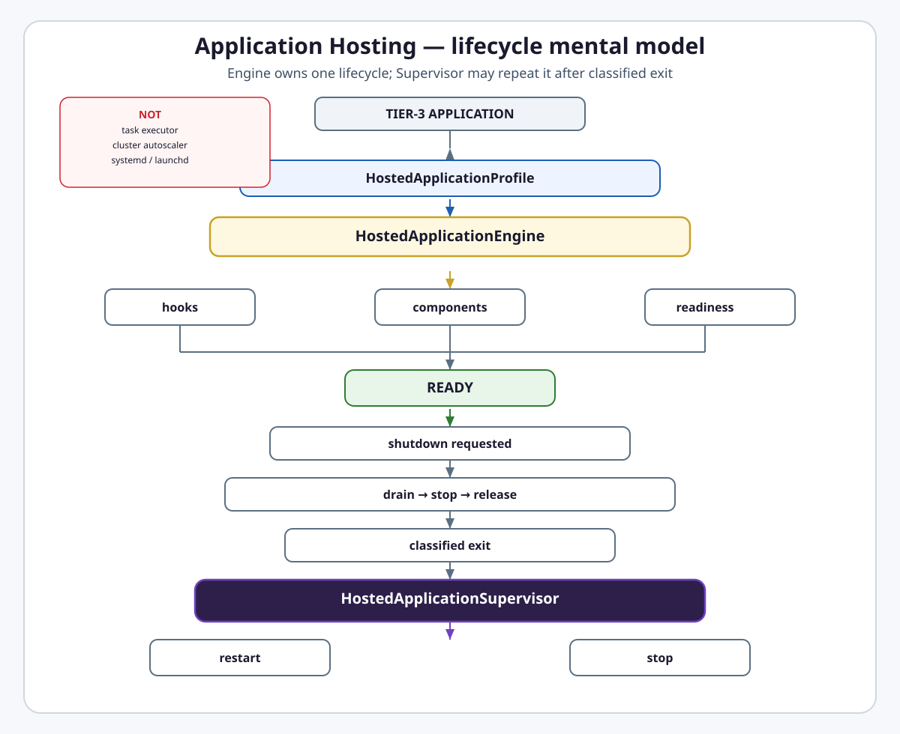
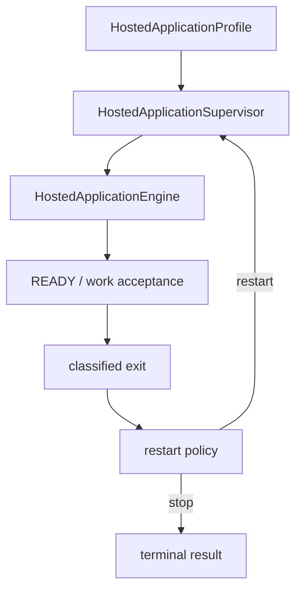

# Intergrax Application Hosting

**Intergrax Application Hosting** is the platform lifecycle layer that runs an already-configured Tier-3 application as a managed instance with readiness, components, safe shutdown, local instance ownership, and supervised in-process restart.

## Why it matters

Without Application Hosting:

- every product writes its own daemon loop,
- readiness depends on ad-hoc checks,
- components start and stop in arbitrary order,
- duplicate-instance protection stays application-local,
- shutdown may cut active work,
- restart is confused with task retry,
- OS-specific code leaks into products,
- first adopters like LKW would own generic hosting logic.

> **Hosting manages application lifecycle. It does not execute application tasks.**

> **Restart ≠ task retry.**

> **Local instance supervision ≠ cluster autoscaling.**

> [!NOTE]
> **Maturity boundary:** Core hosting contracts, engine lifecycle, instance guard, graceful shutdown, in-process supervisor, foreground signal bridge, `run_hosted_application(profile)`, and LKW live proof (APP-HOST-8C–8E) are **implemented and closed** on the canonical path. **Not** claimed as complete stable public release: dedicated hosting metrics (APP-HOST-3D), `InteractionProfile` (APP-HOST-6), hosting plugins (APP-HOST-9E), OS adapter suite and service-manager integration (APP-HOST-7), generic supervisor digest-preservation contract (APP-HOST-5D), stable API declaration (APP-HOST-9F), and cross-platform service posture remain **planned or partial**.

**Primary audience:** Principal / Staff engineers and Tier-3 application authors wrapping a product for continuous foreground or local single-instance operation — after [`TIER3_APPLICATION_ENVIRONMENT.md`](TIER3_APPLICATION_ENVIRONMENT.md).

## At a glance

| Concern | Summary |
| -------- | -------- |
| **Responsibility** | Application-instance lifecycle — not task execution, orchestration, or cluster scaling |
| **Composition root** | `HostedApplicationProfile` — shipped fields only; no plugin or interaction fields yet |
| **One lifecycle** | `HostedApplicationEngine` — startup, READY, shutdown, diagnostics for one instance |
| **Lifecycle repetition** | `HostedApplicationSupervisor` — in-process; new engine instance per supervised attempt |
| **Readiness** | `accepting_new_work` only in `READY` when runtime, lease, and required components allow |
| **Instance ownership** | `FileHostedApplicationInstanceGuard` — local file lock under `~/.intergrax/hosting/run` |
| **Author facade** | `run_hosted_application(profile)` — foreground runner with signal bridge |
| **Events** | Typed `hosting.*` envelopes via existing Observability export path — no private bus |
| **Metrics** | Lifecycle events and diagnostics **shipped**; dedicated hosting metrics row **planned** |
| **LKW proof** | Real engine + supervisor; READY, duplicate rejection, stop, restart, work after restart |
| **Planned** | `InteractionProfile`, plugins, OS adapters, systemd/Windows Service/launchd registration |
| **Maturity** | A4 · I4 · P3 · E4 — see [Current maturity](#current-maturity) |

## Flagship architecture visual

<picture>
  <source media="(prefers-color-scheme: dark)" srcset="assets/application-hosting-lifecycle-dark.svg">
  <source media="(prefers-color-scheme: light)" srcset="assets/application-hosting-lifecycle-light.svg">
  
</picture>

**Primary mental model:**

```text
Tier-3 application
        ↓
HostedApplicationProfile
        ↓
HostedApplicationEngine
   ┌────────┼────────┐
   ↓        ↓        ↓
 hooks   components readiness
   │        │        │
   └────────┼────────┘
            ↓
          READY
            ↓
   shutdown requested
            ↓
 drain → stop → release
            ↓
     classified exit
            ↓
HostedApplicationSupervisor
      ┌─────┴─────┐
      ↓           ↓
   restart       stop
```

**Lifecycle states (exact enum):**

```text
CREATED → STARTING → READY → STOPPING → STOPPED
                └──────────────→ FAILED
```

`STOPPED` and `FAILED` are terminal. Transitions are validated mechanically; illegal transitions raise `HostedApplicationLifecycleTransitionError`.

## How it works

1. **Author** builds `HostedApplicationProfile` with application factory, optional hooks, components, and policies.
2. **Resolve** profile into immutable `HostedApplicationDefinition` with digests and dependency order.
3. **Run** via `run_hosted_application(profile)` → `HostedApplicationSupervisor` in the foreground process.
4. **Supervisor** creates a new `instance_id`, builds `HostedApplicationEngine` through the engine factory, and awaits `run_until_stopped()`.
5. **Engine** acquires instance lease, transitions `CREATED → STARTING`, runs hooks and components in dependency order, starts Tier-3 runtime, evaluates readiness gate, transitions to `READY`.
6. **READY** exposes `accepts_new_work` / `accepting_new_work` when lifecycle is `READY`, runtime is ready, lease is valid, shutdown is not requested, and required components are healthy.
7. **Shutdown** (signal or control request) moves to `STOPPING`, rejects new intake, runs bounded drain/cancel/flush when ports are wired, stops components in reverse order, releases lease, `STOPPED`.
8. **Classifier** maps terminal result to `HostedApplicationExitRecord` (`clean_stop`, `startup_failure`, `instance_conflict`, …).
9. **Supervisor** evaluates restart policy; on eligible exit schedules backoff and starts **another engine lifecycle** with a new `instance_id` in the same process.



## Engine vs Supervisor

| Role | Owns | Does not own |
| ---- | ---- | ------------ |
| **`HostedApplicationEngine`** | One application-instance lifecycle: hooks, components, runtime start, readiness, shutdown, lease release, diagnostics | Task execution, Nexus loops, restart scheduling across attempts |
| **`HostedApplicationSupervisor`** | Lifecycle repetition after classified exit: new `instance_id`, backoff, restart exhaustion, attempt records | Cognition, tools, in-engine task routing |

> **Engine owns one lifecycle. Supervisor owns lifecycle repetition.**

**Process semantics:** The reference supervisor is an **in-process lifecycle supervisor**. It does **not** spawn OS child processes. Each restart creates a new `HostedApplicationEngine` (and new hosted context) inside the same foreground process via `HostedApplicationEngineFactory`. Duplicate-instance protection for LKW uses a **second OS process** attempting the same file lock — that is instance-guard behavior, not supervisor subprocess spawning.

Application Hosting is **not** systemd, Windows Service Manager, launchd, or Kubernetes. Those manage machine/process deployment; Hosting manages **application-aware** lifecycle inside an already-running host process (or a product-owned outer launcher).

## Liveness, readiness, and component health

| Concept | Meaning |
| ------- | ------- |
| **Liveness** | Engine/process loop is not in terminal `STOPPED` or `FAILED` (`live` on health snapshot) |
| **Readiness** | Application may accept new work (`ready` / `accepting_new_work`) |
| **Component health** | One component's `HostedApplicationComponentHealth` snapshot |

> **Liveness ≠ readiness ≠ component health.**

A process can be **live** in `STARTING` but **not READY**. `accepting_new_work` is derived in `HostedApplicationHealthCoordinator` and exposed on `HostedApplicationEngine.accepts_new_work` and `HostedApplicationLifecycleSnapshot.accepting_new_work`.

**Required vs optional components:**

- **Required** unhealthy or not ready → blocks readiness (`blocking_component_ids`).
- **Optional** unhealthy → typically `MARK_DEGRADED` (`degraded_component_ids`); does not automatically block readiness unless `failure_action` is `MARK_NOT_READY` or `FAIL_HOST`.

## Tier-3 boundary

```text
Tier-3
→ defines application semantics and Harness composition

Application Hosting
→ owns process/application lifecycle
```

Hosting does **not** replace:

- `ApplicationManifest`
- `ApplicationEnvironmentProfile`
- `UnifiedTaskRunner`
- `ApplicationHost.on_hook`
- `NexusLoop`

> **`ApplicationHost.on_hook`** → Tier-3 application/domain reaction at harness hook points.
>
> **`HostedApplicationHooks`** → hosting lifecycle reaction at `before_start`, `before_ready`, `before_stop`, …

They are distinct contracts and must not be merged.

## Responsibility / ownership boundaries

### Application Hosting owns

- `HostedApplicationProfile`, `HostedApplicationContext`
- `HostedApplicationEngine`, `HostedApplicationComponent`, `HostedApplicationHooks`
- hosting lifecycle events and safe diagnostics
- aggregate health/readiness
- `InstanceGuard` / file-lock reference implementation
- typed shutdown/restart control and foreground signal bridge
- in-process `HostedApplicationSupervisor`, exit classification, restart policy
- `run_hosted_application(profile)`

### Application Hosting does not own

- agent cognition, `Task` / `TaskResult`, `NexusLoop`
- harness task preparation and business execution
- cluster autoscaling ([`ELASTIC_CAPACITY_AND_SCALING.md`](ELASTIC_CAPACITY_AND_SCALING.md))
- execution retry taxonomy ([`RELIABILITY_FAILURE_AND_HITL.md`](RELIABILITY_FAILURE_AND_HITL.md))
- canonical execution journal ([`OBSERVABILITY.md`](OBSERVABILITY.md))
- OS service registration (planned APP-HOST-7)

### Reliability boundary

```text
Reliability retry → repeats task/action inside execution scope

Hosting restart → new application-instance lifecycle (new instance_id)
```

Backoff concepts may resemble reliability policy; ownership is distinct. No task ownership transfer on restart.

### Observability boundary

```text
Hosting → emits lifecycle/component/instance evidence

Observability → owns evidence spine, persistence, export semantics
```

Hosting publishes through `ObservabilityHostedApplicationEventPublisher` as platform observability signals — **no private hosting event bus**.

### ECP boundary

```text
Application Hosting → instance lifecycle / local restart

ECP → capacity scaling (replicas, workers, ceilings)
```

Restarting a failed instance ≠ adding replicas.

## Relationship to Intergrax

| Neighbor | Relationship |
| -------- | ------------ |
| [`TIER3_APPLICATION_ENVIRONMENT.md`](TIER3_APPLICATION_ENVIRONMENT.md) | Defines application; Hosting wraps it for continuous lifecycle |
| [`OBSERVABILITY.md`](OBSERVABILITY.md) | Export path for hosting events; not a second store |
| [`RELIABILITY_FAILURE_AND_HITL.md`](RELIABILITY_FAILURE_AND_HITL.md) | Execution recovery vs instance recovery |
| [`ELASTIC_CAPACITY_AND_SCALING.md`](ELASTIC_CAPACITY_AND_SCALING.md) | Capacity plane; not local supervisor |
| [`EXPERIMENTATION_AND_DEVELOPER_EXPERIENCE.md`](EXPERIMENTATION_AND_DEVELOPER_EXPERIENCE.md) | Lab qualification before production hosting posture |
| [`INTERGRAX_ARCHITECTURE_PRINCIPLES.md`](INTERGRAX_ARCHITECTURE_PRINCIPLES.md) | Platform ownership; LKW as first-adopter proof |

## Extensibility — shipped vs planned

### Shipped public surface

**`HostedApplicationProfile`** composition root (spec `1.0`):

```text
application_id, application_factory, application_factory_id
spec_version, metadata
hooks, components
lifecycle, shutdown, restart
component_failure, hook_failure, instance
event_subscriptions
```

**Authoring (shipped):**

```python
from intergrax.hosting import HostedApplicationProfile, run_hosted_application

profile = HostedApplicationProfile(
    application_id="my_application",
    application_factory=create_application,
)
run_hosted_application(profile)
```

**Hooks (shipped names):** `before_start`, `before_ready`, `before_stop` (blocking); `after_start`, `after_ready`, `after_stop`, `on_failure` (observer). Blocking hooks use configured timeouts; observer failures are diagnostic-only.

**Components (shipped):** `start()`, `health()`, `stop()` plus registration metadata (`required`, `dependencies`, timeouts, `failure_action`). Start order follows dependency DAG; stop and startup rollback use reverse order.

**Policies on profile (shipped):** `ShutdownPolicy`, `RestartPolicy` (`RestartMode`: `never`, `on_failure`, `always`), `InstancePolicy` (`single_instance` / `multi_instance`, `allow_stale_recovery`).

### Planned — do not treat as shipped

| Surface | Plan row | Status |
| ------- | -------- | ------ |
| `InteractionProfile` / HTTP/MCP intake facade | APP-HOST-6 | **Planned** — LKW uses application runtime adapter |
| `plugins` profile field + conformance kit | APP-HOST-9E | **Planned** — event types `hosting.plugin.*` exist; no profile wiring |
| `intergrax.hosting.os.*` adapters | APP-HOST-7 | **Planned** — no OS namespace shipped |
| systemd / Windows Service / launchd registration | APP-HOST-7E–7F | **Planned** |
| `HarnessApplication.hosting(...)` | APP-HOST-9B | **Planned** |
| Dedicated hosting metrics suite | APP-HOST-3D | **Planned** |
| Generic supervisor digest-preservation contract | APP-HOST-5D | **Planned** — LKW proof verifies digests on its path |
| Stable public API declaration | APP-HOST-9F | **Planned** |

> **Foreground signal bridge ≠ OS service-manager integration.** `PortableForegroundSignalAdapter` maps Ctrl+C / SIGINT to typed shutdown on the main thread — not daemon registration.

## Current implementation state

| Area | State |
| ---- | ----- |
| Profile / context / hooks / components / policies | **Shipped** (APP-HOST-1) |
| Engine lifecycle, readiness, rollback | **Shipped** (APP-HOST-2) |
| Typed events + Observability export | **Shipped** (APP-HOST-3A–3C) |
| Hosting metrics integration | **Planned** (APP-HOST-3D) |
| File-lock `InstanceGuard`, stale recovery | **Shipped** (APP-HOST-4A–4B) |
| Control coordinator, drain/cancel/flush executor | **Shipped** (APP-HOST-4C–4D) — drain via optional `HostedApplicationActiveWorkController` |
| Foreground signal bridge | **Shipped** (APP-HOST-4E) |
| Exit classification + restart evaluator | **Shipped** (APP-HOST-5A–5B) |
| In-process supervisor | **Shipped** (APP-HOST-5C) |
| `run_hosted_application(profile)` | **Shipped** (APP-HOST-9A) |
| LKW hosted profile + live proof 8C–8E | **Shipped** |
| InteractionProfile / plugins / OS adapters | **Planned** |

**Shutdown path (wired in engine):** `STOPPING` → reject new intake → `before_stop` → bounded drain (if controller wired) → cancel → flush services (if wired) → stop components (reverse) → runtime stop → lease release → `STOPPED`.

**Instance guard:** `FileHostedApplicationInstanceGuard` uses exclusive file lock + JSON metadata (PID, timestamps, `ownership_token`). Scope is **local single-machine** `run_directory` — **not** distributed leader election. Stale recovery uses PID liveness probe when `allow_stale_recovery` is true.

**LKW proof boundary:** LKW is a **real first-adopter proof**, not owner of generic hosting contracts and not universal cross-platform service proof. Proof uses real `HostedApplicationEngine`, supervisor, READY, `local.workspace.index`, duplicate `INSTANCE_CONFLICT`, graceful `CLEAN_STOP`, lock release, restart with new `instance_id`, work after restart, and structured `ProofReceipt` via platform `DocumentStore`.

## Current maturity

Aligned with [MATURITY_TAXONOMY.md](../technical/guides/MATURITY_TAXONOMY.md) and [`plan/APPLICATION_HOSTING.md`](../maintainers/plans/APPLICATION_HOSTING.md).

```text
Architecture maturity:     A4
Implementation maturity:   I4
Production readiness:      P3
Evidence maturity:         E4
```

| Axis | Level | Rationale |
| ---- | ----- | --------- |
| **A** | **A4** | Ownership, Engine/Supervisor split, and lifecycle invariants are stable; major planned public surfaces (interaction, plugins, OS adapters) remain documented targets |
| **I** | **I4** | Profile → engine → readiness → shutdown → supervisor integrated; LKW adopts canonical path without product-owned generic bypass |
| **P** | **P3** | Controlled live first-adopter proof; missing service-manager posture, stable API, and operational limits for P4 |
| **E** | **E4** | LKW 8C–8E live proof on canonical engine/supervisor path with persisted `ProofReceipt` — not external customer deployment evidence |

**Sub-axes (informative):** engine lifecycle I4 · instance ownership I4 · shutdown I4 · supervisor I4 · LKW adoption I4 · interaction facade — · OS integration — · DX/stable API I3.

## Evidence / proof

| Layer | Artifact |
| ----- | -------- |
| Architecture | This hub · [`satellites/APPLICATION_HOSTING_extended_depth.md`](satellites/APPLICATION_HOSTING_extended_depth.md) · [ADR-HOST-001](../technical/adr/entries/2026-07-13/ADR-HOST-001.md) |
| Unit / contract | Lifecycle transitions, hooks, components, readiness, instance guard, shutdown, restart policy tests under `tests/unit/intergrax/hosting/` |
| Integration | Engine startup/shutdown, event export, supervisor loops |
| First adopter live | LKW APP-HOST-8C (single instance), 8D (stop/restart/work), 8E (`ProofReceipt` + reviewer runner) |
| Public proof route | [`PROOFS.md`](../proofs/PROOFS.md) — `LKW-HOSTING` under Core Platform Proof |
| External / customer | **Not claimed** from LKW alone |

`ProofReceipt` (`intergrax.proofs.receipts.contracts.ProofReceipt`) is a **platform** structured receipt (`intergrax.proof_receipt.v1`) persisted through `DocumentStore` — product evidence container, not production audit certification.

## Go deeper

| Need | Document |
| ---- | -------- |
| Lifecycle contracts, policies, supervisor depth | [`satellites/APPLICATION_HOSTING_extended_depth.md`](satellites/APPLICATION_HOSTING_extended_depth.md) |
| Implementation truth / APP-HOST rows | [`maintainers/plans/APPLICATION_HOSTING.md`](../maintainers/plans/APPLICATION_HOSTING.md) |
| Tier-3 composition | [`TIER3_APPLICATION_ENVIRONMENT.md`](TIER3_APPLICATION_ENVIRONMENT.md) |
| Execution recovery | [`RELIABILITY_FAILURE_AND_HITL.md`](RELIABILITY_FAILURE_AND_HITL.md) |
| Evidence spine | [`OBSERVABILITY.md`](OBSERVABILITY.md) |
| LKW reviewer proof | [`applications/local_workspace_application/docs/proof/LKW_PLATFORM_PROOF.md`](../../applications/local_workspace_application/docs/proof/LKW_PLATFORM_PROOF.md) |
| Maturity vocabulary | [`MATURITY_TAXONOMY.md](../technical/guides/MATURITY_TAXONOMY.md) |

---

## Engineering canon

**Status:** Canonical architecture — core implementation **shipped** on canonical path; stable public release and planned extension surfaces **not** complete.

**Hub:** [`intergrax_runtime_architecture.md`](intergrax_runtime_architecture.md)

**Plan (1:1):** [`plan/APPLICATION_HOSTING.md`](../maintainers/plans/APPLICATION_HOSTING.md)

**ADR:** [`ADR-HOST-001`](../technical/adr/entries/2026-07-13/ADR-HOST-001.md)

**Extended detail:** [`satellites/APPLICATION_HOSTING_extended_depth.md`](satellites/APPLICATION_HOSTING_extended_depth.md)

**Primary integration:** [`TIER3_APPLICATION_ENVIRONMENT.md`](TIER3_APPLICATION_ENVIRONMENT.md)

**First adopter / proof:** `applications/local_workspace_application`

**Architecture governance:** [`INTERGRAX_ARCHITECTURE_PRINCIPLES.md`](INTERGRAX_ARCHITECTURE_PRINCIPLES.md) — platform ownership, architecture before adoption, first-adopter proof through LKW (`PLATFORM-INV-001`, `PLATFORM-INV-002`, `PLATFORM-INV-004`, `PLATFORM-INV-006`, `PLATFORM-INV-007`).

### Cursor read scope

Read this hub first. Load the extended-depth satellite only for contract, lifecycle, event, policy, supervisor, OS-adapter, or author-DX implementation detail.

```text
Default implementation context:
1. docs/project/architecture/APPLICATION_HOSTING.md
2. docs/project/maintainers/plans/APPLICATION_HOSTING.md
3. at most one matching satellite
4. owning code/tests for the selected APP-HOST row
```

Do not read the full Tier-3 canon unless the task changes Tier-3 public composition contracts.

### Normative invariants

- **HOST-INV-01:** Application Hosting is platform-owned; products adopt it.
- **HOST-INV-02:** Hosting never performs cognition or orchestration.
- **HOST-INV-03:** Supervisor code has no dependency on `Task`, `NexusLoop`, agents, tools, or product capabilities.
- **HOST-INV-04:** Application code contains no standard Windows/Linux/macOS branching for hosting mechanics.
- **HOST-INV-05:** `HostedApplicationProfile` is the primary public composition surface.
- **HOST-INV-06:** Advanced extension points are typed and reachable from that profile (when shipped).
- **HOST-INV-07:** Hosting uses the existing Intergrax event/observability spine.
- **HOST-INV-08:** Hosting hooks are lifecycle callbacks, not private execution loops.
- **HOST-INV-09:** Required unhealthy components block readiness; optional components do not by default.
- **HOST-INV-10:** LKW is a proof workload, never the owner of generic hosting contracts.
- **HOST-INV-11:** `ApplicationHost.on_hook` and `HostedApplicationHooks` are distinct and MUST NOT be merged.
- **HOST-INV-12:** Restart creates a new application-instance lifecycle; the hosted application does not `exec` itself.

**`HOST-INV-*` vs `PLATFORM-INV-*`:** domain-local `HOST-INV-*` rules remain authoritative for hosting contracts. Platform `PLATFORM-INV-*` in [`INTERGRAX_ARCHITECTURE_PRINCIPLES.md`](INTERGRAX_ARCHITECTURE_PRINCIPLES.md) govern why this domain exists — do not replace `HOST-INV-*` with `PLATFORM-INV-*` here.

### Developer mental model (levels)

**Level 1 — profile + run**

```python
from intergrax.hosting import HostedApplicationProfile, run_hosted_application

profile = HostedApplicationProfile(
    application_id="my_application",
    application_factory=create_application,
)
run_hosted_application(profile)
```

Defaults: single-instance file guard (unless `InstancePolicy` multi-instance), lifecycle machine, hosting events, liveness/readiness, foreground signals, graceful shutdown.

**Level 2 — hooks and components**

```python
profile = HostedApplicationProfile(
    application_id="my_application",
    application_factory=create_application,
    hooks=HostedApplicationHooks(
        before_ready=[warm_local_index],
        after_stop=[flush_local_state],
    ),
    components=[MyBackgroundComponent()],
)
```

**Level 3 — policies (shipped)**

```python
profile = HostedApplicationProfile(
    application_id="my_application",
    application_factory=create_application,
    restart=RestartPolicy.on_failure(max_attempts=3),
    shutdown=ShutdownPolicy.drain_then_cancel(timeout_seconds=30),
)
```

**Target (not shipped)** — interaction facade, plugins, OS adapters:

```python
# APP-HOST-6 / APP-HOST-9E / APP-HOST-7 — planned, not current public API
# interaction=InteractionProfile(http=True, mcp=True)
# plugins=[CustomDesktopBridgePlugin()]
```

### Engine orchestration sequence

`HostedApplicationEngine` for one instance:

1. resolve definition and defaults
2. create `HostedApplicationContext`
3. acquire instance ownership (`InstanceGuard`)
4. emit `hosting.application.starting`
5. run blocking `before_start`
6. start pre-runtime components (DAG order)
7. invoke application factory → `HostedApplicationRuntime.start()`
8. run post-runtime components
9. blocking `before_ready`; runtime `ready()`; component health refresh
10. startup readiness gate → transition `READY`
11. accept work until shutdown requested
12. `STOPPING`: reject intake, drain/cancel/flush (when wired), stop components reverse, runtime stop, lease release
13. terminal event and classified exit record

The engine manages lifecycle. It does **not** execute application tasks.

### Startup rollback

On startup failure after partial progress:

- blocking hooks and component start failures trigger rollback cleanup
- started components stopped in reverse dependency order
- `on_failure` observer hooks scheduled
- lease released when acquired
- engine may set `reuse_blocked` after fatal startup — further `start()` on same engine instance blocked

Rollback is **best-effort bounded cleanup**, not a transactional distributed rollback.

### Exit classification (`HostedApplicationExitKind`)

| `exit_kind` | Typical meaning |
| ----------- | ---------------- |
| `clean_stop` | Graceful terminal `STOPPED` |
| `restart_requested` | Controlled stop with restart intent |
| `startup_failure` | Failed during startup phases |
| `runtime_failure` | Failed after ready |
| `instance_conflict` | Duplicate ownership |
| `configuration_error` | Invalid profile/definition |
| `forced_termination` | Shutdown timeout/force or critical cleanup failure |
| `supervisor_error` | Supervisor/engine factory contract violation |

Supervisor restart eligibility comes from `HostedApplicationRestartPolicyEvaluator` (`RestartMode`, `max_attempts`, rolling window, deterministic backoff with jitter).

### Digest preservation

LKW live proof (APP-HOST-8D) verifies **same `profile_digest` and `definition_digest`** across supervisor restart on the LKW hosted path. A stronger **generic** supervisor-level preservation contract remains **planned** (APP-HOST-5D). Do not generalize product proof into a universal guarantee.

### Hosting events (shipped vocabulary)

Minimum families (exact `HostedApplicationEventType` values):

```text
hosting.application.starting | started | ready | stopping | stopped | failed
hosting.component.starting | started | health_changed | stopping | stopped | failed
hosting.instance.acquired | rejected | stale_recovered | released
hosting.restart.requested | scheduled | started | exhausted
hosting.hook.started | completed | failed
hosting.plugin.loaded | failed   (plugin loading planned — types reserved)
```

Envelopes carry `schema_id`, `schema_version`, `event_id`, `occurred_at`, `application_id`, `instance_id`, `lifecycle_state`, `severity`, safe `payload`, optional correlation fields. Secrets and raw exception internals are redacted on export surfaces.

### Interaction composition (target)

APP-HOST-6 plans `InteractionProfile` as author facade over existing Tier-3 intake (`InboundInteraction → Task → executor`). Hosting would wire lifecycle/health/shutdown around surfaces; the canonical task path stays unchanged. **Not shipped.**

### OS boundary (target)

Core engine is OS-neutral by design. Planned namespaces:

```text
intergrax.hosting.os.windows
intergrax.hosting.os.linux
intergrax.hosting.os.macos
```

Reference instance guard uses portable file locking and PID probe. Full Windows/Linux/macOS adapter suite and service-manager descriptor generation remain **planned**.

### LKW adoption boundary

```text
LocalWorkspace hosted profile
→ run_hosted_application / HostedApplicationSupervisor
→ HostedApplicationEngine
→ existing LKW FastAPI/MCP/Nexus runtime adapter
```

Generic contracts and engine code **MUST NOT** live under `applications/local_workspace_application`.

### Anti-patterns

| ID | Anti-pattern | Correct |
|----|--------------|---------|
| HOST-AP-01 | Product-owned generic daemon framework | Platform `APPLICATION_HOSTING` domain |
| HOST-AP-02 | Application directly handles WinAPI/systemd/launchd | OS adapter selected by platform (when shipped) |
| HOST-AP-03 | Supervisor calls Nexus/tasks/tools | Supervisor treats engine as opaque lifecycle |
| HOST-AP-04 | New private hosting event bus | Existing Observability export path |
| HOST-AP-05 | Dozens of mandatory micro-contracts | One profile + hooks/components |
| HOST-AP-06 | Hosting hooks implement orchestration loops | Hooks at lifecycle boundaries only |
| HOST-AP-07 | Restart via `os.exec` inside app | Supervisor starts new engine lifecycle |
| HOST-AP-08 | Optional component blocks readiness by default | Only required / explicit actions block |
| HOST-AP-09 | Hosting profile duplicates harness environment | Hosting wraps Tier-3 application definition |
| HOST-AP-10 | LKW proof = platform contract test | Platform unit tests + LKW adoption proof |

### Related documents

| Document | Relationship |
|----------|--------------|
| [`TIER3_APPLICATION_ENVIRONMENT.md`](TIER3_APPLICATION_ENVIRONMENT.md) | Application composition and execution owner |
| [`OBSERVABILITY.md`](OBSERVABILITY.md) | Hosting event export, diagnostics |
| [`RELIABILITY_FAILURE_AND_HITL.md`](RELIABILITY_FAILURE_AND_HITL.md) | Failure classification, retry principles |
| [`EXPERIMENTATION_AND_DEVELOPER_EXPERIENCE.md`](EXPERIMENTATION_AND_DEVELOPER_EXPERIENCE.md) | Authoring facade, scaffolding (partial) |
| [`ELASTIC_CAPACITY_AND_SCALING.md`](ELASTIC_CAPACITY_AND_SCALING.md) | Deployment/capacity boundary |
| [`plan/APPLICATION_HOSTING.md`](../maintainers/plans/APPLICATION_HOSTING.md) | Implementation truth |
| [`INTERGRAX_ARCHITECTURE_PRINCIPLES.md`](INTERGRAX_ARCHITECTURE_PRINCIPLES.md) | Platform evolution governance |

Detailed normative contracts and scenarios: [`satellites/APPLICATION_HOSTING_extended_depth.md`](satellites/APPLICATION_HOSTING_extended_depth.md).
