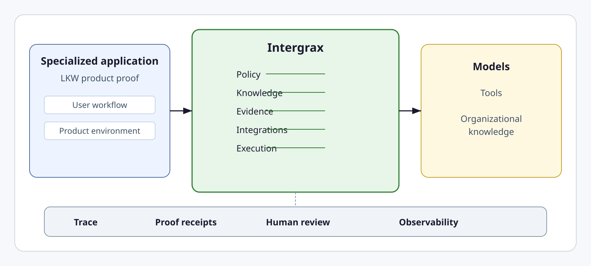
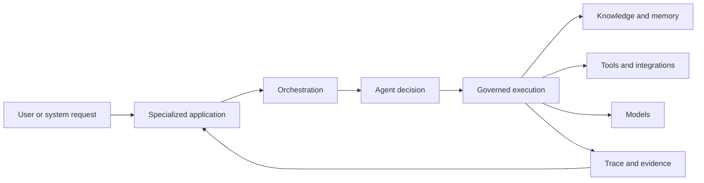
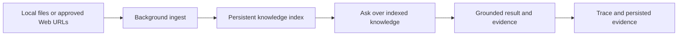

<!--
© Artur Czarnecki. All rights reserved.
Intergrax is source-available under the Intergrax Evaluation and Collaboration License 1.0.
See LICENSE for permitted evaluation, collaboration, and contribution use.
-->

# Intergrax Architecture Overview

A concise view of how Intergrax separates product workflows, orchestration, agent decisions, governed execution, and evidence.

> [!NOTE]
> This document explains **responsibility boundaries** and **system flow**. It is **not** the complete architecture canon or a production-readiness claim. Deep technical readers should use the [Technical Documentation Map](../technical/DOCUMENTATION_MAP.md).

Primary audience: Architect or platform engineer evaluating responsibility boundaries, governance placement and current proof limits.

<picture>
  <source
    media="(prefers-color-scheme: dark)"
    srcset="../assets/public/intergrax-hero-dark.svg"
  >
  <source
    media="(prefers-color-scheme: light)"
    srcset="../assets/public/intergrax-hero-light.svg"
  >
  
</picture>

---

## At a glance

| Part | Owns | Does not own |
| ---- | ---- | ------------ |
| **Specialized application** | User workflow, product context, product permissions, and acceptance criteria | Governed execution internals, provider integration details, or shared evidence infrastructure |
| **Orchestration** | Coordinating work across agents and steps | Domain decisions or product UX |
| **Agent** | Domain decisions inside a bounded session | Policy enforcement, shared tool-execution infrastructure, or cross-product hosting |
| **Governed execution harness** | Execution cycle, policy, budgets, trace, and evidence collection | Product-specific business rules outside shared boundaries |
| **Knowledge, tools and model systems** | Retrieval, integrations, and model access behind shared boundaries | The product workflow or end-user experience |
| **Trace and evidence** | Receipts, observability, and reviewable execution records | Product certification or commercial validation |

---

## Architect review path

| Step | Question | Primary source |
| ---- | -------- | -------------- |
| 1 | Are application, orchestration, agent and governed-execution responsibilities separated clearly? | This Architecture Overview |
| 2 | Which mechanisms and product paths have current bounded evidence? | [PROOFS.md](../proofs/PROOFS.md) |
| 3 | Does a bounded evaluation justify deeper review? | [EVALUATION_GUIDE.md](../builders/EVALUATION_GUIDE.md) |
| 4 | Is deeper implementation-level due diligence required? | [docs/project/technical/DOCUMENTATION_MAP.md](../technical/DOCUMENTATION_MAP.md) |

The primary architect next action after understanding the boundaries is to [review the current proof status](../proofs/PROOFS.md).

---

## The system flow

A specialized application hosts the concrete workflow. Orchestration coordinates work; agents make domain decisions; the harness governs execution, policy, and evidence around knowledge, tools, and models. Trace and evidence return to the application so reviewers can inspect what happened without inferring control flow from ad hoc logs.

This flow describes responsibility boundaries, not every deployment topology or internal component name.

---

## Responsibility boundaries

The architecture uses five clear responsibility boundaries:

- **Applications** own the concrete product environment.
- **Orchestration** coordinates work.
- **Agents** make domain decisions.
- **The harness** controls execution, policy, and evidence.
- **External systems** provide models, tools, and organizational knowledge.

The separation matters because product-specific rules stay in the product; agents do not become hidden operating systems; policy and evidence are execution concerns, not optional decorations; and integrations remain replaceable behind shared boundaries.

---

## Shared foundation versus product ownership

| Intergrax reusable foundation | Product application |
| ----------------------------- | ------------------- |
| Governed execution | User workflow |
| Policy and human approval | Identity and tenant context |
| Trace and evidence | Product permissions |
| Knowledge, retrieval, grounding, and memory | Product configuration |
| Tool and integration boundaries | User experience |
| Model portability | Product acceptance criteria |
| Runtime verification | Product-specific business rules |

Products compose platform capabilities; they do not reimplement the harness for each new workflow.

---

## How LKW uses the architecture

Local Knowledge Workspace (LKW) is the **Primary product proof** at **Backend Product Alpha / MVP** with **PARTIAL** public proof status.

LKW supplies the workspace workflow. Intergrax supplies reusable ingest, knowledge, execution, policy, evidence, and hosting foundations.

LKW does not demonstrate finished SaaS, complete Hybrid Ask, or completed commercial validation. Bounded proof details: [LKW Platform Proof](../proofs/LKW_PLATFORM_PROOF.md).

---

## How Token Optimization fits

Token Optimization is a **Featured platform-capability proof** used within governed execution — a shared platform mechanism for deterministic prompt and context optimization under policy, not a generic prompt-shortening utility. Public status remains **PARTIAL**.

It operates inside the harness execution path alongside policy, protected-region validation, receipts, and observability. Detailed phase status and claim guardrails live in the owning guides — not duplicated here.

**Go deeper:** [Token Optimization guide](../capabilities/token_optimization/README.md) · [Claim guardrails](../capabilities/TOKEN_OPTIMIZATION_CLAIMS.md)

---

## Go deeper

| Topic | Document |
| ----- | -------- |
| Foundation architecture narrative | [INTERGRAX_HARNESS_NARRATIVE.md](../technical/guides/INTERGRAX_HARNESS_NARRATIVE.md) |
| Technical documentation map | [DOCUMENTATION_MAP.md](../technical/DOCUMENTATION_MAP.md) |
| Public proof dashboard | [PROOFS.md](../proofs/PROOFS.md) |
| LKW product proof | [LKW_PLATFORM_PROOF.md](../proofs/LKW_PLATFORM_PROOF.md) |
| Token Optimization | [Token Optimization guide](../capabilities/token_optimization/README.md) |

Primary next action: review current evidence in [PROOFS.md](../proofs/PROOFS.md).

Then choose a bounded evaluation through [EVALUATION_GUIDE.md](../builders/EVALUATION_GUIDE.md), or deep technical review through [docs/project/technical/DOCUMENTATION_MAP.md](../technical/DOCUMENTATION_MAP.md). For a builder-specific route, use [BUILDER_QUICKSTART.md](../builders/BUILDER_QUICKSTART.md) as a secondary path.
