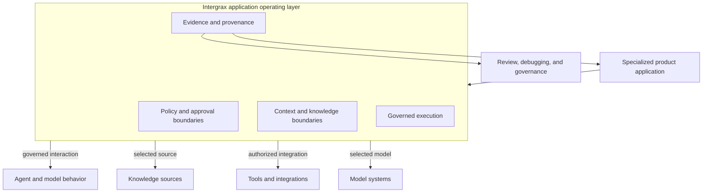
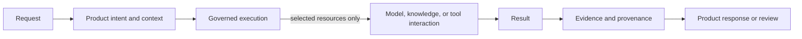

<!--
© Artur Czarnecki. All rights reserved.
Intergrax is source-available under the Intergrax Evaluation and Collaboration License 1.0.
See LICENSE for permitted evaluation, collaboration, and contribution use.
-->

# Intergrax Architecture Overview

How Intergrax separates the specialized product application, its application operating layer, model or agent behavior, governed access to knowledge and tools, and reviewable evidence.

> [!NOTE]
> Intergrax is source-available and in active R&D. This overview explains **responsibility boundaries** and **governed execution**; it is not the complete architecture canon or a production-readiness, security-certification, or commercial-validation claim. For first contact or persona routing, start at the [README](../../../README.md). For intent-based navigation when unsure which document to open, use the [Public Documentation Map](../community/PUBLIC_DOCUMENTATION_MAP.md). Use the [Technical Documentation Map](../technical/DOCUMENTATION_MAP.md) for deep implementation architecture.
>
> **Platform deep-dive route:** This document is the primary public route for understanding **how the Intergrax platform works** - technical mental model, responsibility boundaries, operating model, and platform composition. [Why Intergrax](../overview/WHY_INTERGRAX.md) owns category, problem, strategic fit, and alternatives; [PROOFS](../proofs/PROOFS.md) owns what is actually evidenced today.

**Reader routing:** [Why Intergrax](../overview/WHY_INTERGRAX.md) → why the platform exists · **Architecture Overview** (this page) → how the platform works · [PROOFS](../proofs/PROOFS.md) → what is evidenced today.

Primary audience: external architects, Principal or Staff engineers, CTOs, and technical evaluators comparing application operating boundaries - especially after the basic Intergrax thesis is understood.

---

## At a glance

| Boundary | Responsibility | Ownership limit |
| -------- | -------------- | --------------- |
| **Specialized product application** | Domain workflow, UX, product semantics, required identity and permissions, business acceptance, and deployment choices | Defines the business rule and product outcome; does not need to rebuild shared execution controls |
| **Intergrax application operating layer** | Policy and approval mechanisms, context and knowledge boundaries, governed execution, tool and integration boundaries, runtime controls, recovery, observability, and evidence/provenance | Provides reusable enforcement mechanisms; does not decide the product's business permissions or acceptance criteria |
| **Agent and model behavior** | Reasoning, inference, decision generation, and agent-specific domain behavior | Operates within the supplied context and governed execution; does not own policy, permissions, or evidence |
| **Knowledge, tools, integrations, and model systems** | Source data, remote services, business systems, tool effects, and model access | Are selected behind configured boundaries; they do not own the product workflow or end-user experience |
| **Evidence and provenance** | Receipts, traces, provenance, and records for review, debugging, and governance | Is produced during execution; it does not certify production readiness, security, or commercial validation |

## Why this foundation exists

Specialized AI products repeatedly need governed knowledge access, policy and approval, tools and integrations, context, recovery, evidence and provenance, and observability. Without a shared operating layer, each product rebuilds those boundaries independently. Intergrax centralizes reusable mechanisms for those responsibilities.

For the category problem, strategic fit, and alternatives, see [Why Intergrax](../overview/WHY_INTERGRAX.md).

## What this foundation enables

The current architecture can support - and provides foundations for - product classes such as:

- governed knowledge applications;
- evidence-backed decision support ([`DECISION_SYSTEM.md`](DECISION_SYSTEM.md) - target canon; **CURRENT:** [`CRITIC_VERIFICATION.md`](CRITIC_VERIFICATION.md));
- controlled agent workflows with approvals;
- applications that call external tools and systems under configured authority; and
- reviewable, auditable AI-assisted workflows.

These are intended capability directions, not claims that every class is fully production-proven or that platform-wide coverage is complete.

## Platform leverage across products

Multiple products can reuse shared governed mechanisms instead of rebuilding operating boundaries independently:

| Stage | Illustrative pattern |
| ----- | -------------------- |
| Product A | Uses shared capability X (for example governed execution and evidence) |
| Product B | Reuses X and exposes need for shared capability Y |
| Product C | Reuses accepted X and Y for a new workflow |

Products can reuse existing governed mechanisms, surface missing shared capability gaps, and avoid duplicating policy, integration, and evidence boundaries per application. **Real-user and commercial leverage of that reuse remains to be validated** - a strategic hypothesis, not measured acceleration or cost savings.

## Platform Map

<a href="../assets/public/readme/fullsize/intergrax-platform-map.md">
<picture>
  <source
    media="(prefers-color-scheme: dark)"
    srcset="../assets/public/readme/intergrax-platform-map-dark.png"
  >
  <source
    media="(prefers-color-scheme: light)"
    srcset="../assets/public/readme/intergrax-platform-map-light.png"
  >
  
</picture>
</a>

[View full-size diagram](../assets/public/readme/fullsize/intergrax-platform-map.md)

Use the [Platform Map on the README](../../../README.md#explore-the-intergrax-platform) to choose a platform area, open its canonical domain or feature hub, inspect maturity and evidence, and go deeper only when needed. The map is the visual index; this overview is the mental model behind it.

## The operating model

Intergrax surrounds the application's execution boundaries. A request may use only the model, knowledge source, or tool that its product context and configured controls select; the diagram does not mean every request invokes every resource. Agent or model behavior supplies reasoning and decisions, while the operating layer bounds how that behavior receives context, accesses resources, produces effects, and leaves evidence.

**Harness AI** is useful category shorthand for this operating or execution layer around model and agent behavior. Intergrax is therefore not merely a model provider, an agent reasoning framework, or the product's UX and business workflow.

## Who defines policy and who enforces it?

- **The product team owns** what the business rule means, who should have permission, which actions require approval, the required identity and tenant context, and whether the product outcome is acceptable.
- **Intergrax provides** reusable mechanisms to propagate that identity and context, apply configured policy and approval boundaries, constrain execution and tool access, recover and observe runtime behavior, and record evidence.
- **Agent and model behavior does not replace either responsibility.** It can propose a decision or action, but it does not grant business permission or bypass the governed boundary.

This division lets products keep their domain accountability while sharing an application operating layer instead of rebuilding controls around each workflow.

## Request and evidence flow

The lifecycle is conceptual: the operating layer selects the resources needed for the request, then returns the result with evidence/provenance that can be inspected for debugging, review, and governance. Evidence is a first-class execution output, not an afterthought or an inference reconstructed from ad hoc logs.

## Governed Execution as a platform capability

**Governed Execution** (Governance & Policy Enforcement) is the platform capability that controls what execution may proceed under configured policy.

<a href="../assets/public/readme/fullsize/intergrax-governed-execution.md">
<picture>
  <source
    media="(prefers-color-scheme: dark)"
    srcset="../assets/public/readme/intergrax-governed-execution-dark.png"
  >
  <source
    media="(prefers-color-scheme: light)"
    srcset="../assets/public/readme/intergrax-governed-execution-light.png"
  >
  
</picture>
</a>

[View full-size diagram](../assets/public/readme/fullsize/intergrax-governed-execution.md)

The application defines what the business rule means. Intergrax provides reusable enforcement mechanisms - policy evaluation, boundary enforcement, canonical HITL, and governance evidence on wired paths. Complete platform-wide coverage and production qualification are **not** claimed.

Details belong in the owning [Governed Execution architecture](GOVERNED_EXECUTION.md).

## Decision System inside Nexus execution

The **Decision System** is the platform capability that leads a decision from candidate proposal through optional deliberation, verification, revision, and resolution to an **authoritative lifecycle outcome** - executed as a **Decision Lifecycle model inside Nexus**, not as a second runtime.

| Concern | Owner |
| ------- | ----- |
| Decision correctness (ACCEPTED / REJECTED / UNRESOLVED) | Decision System |
| Execution authorization | Governed Execution / Policy |
| Side effects | Nexus |

**Target canon:** [`DECISION_SYSTEM.md`](DECISION_SYSTEM.md) · [`DECISION_VERIFICATION.md`](DECISION_VERIFICATION.md) · [`DECISION_DELIBERATION.md`](DECISION_DELIBERATION.md). **CURRENT production path:** [`CRITIC_VERIFICATION.md`](CRITIC_VERIFICATION.md) until clean-cut migration. **Not production-qualified** (E0).

## LKW as the active reference product

Local Knowledge Workspace (LKW) is the **Active reference product** at **Backend Product Alpha / MVP** with **PARTIAL** public proof status. Product workflows and proof paths are separate concerns - LKW is a product, not a proof taxonomy label.

| LKW product responsibility | Shared Intergrax foundation |
| -------------------------- | ---------------------------- |
| Workspace workflow, approved-source choice, user-facing Ask, and product acceptance | Ingest and knowledge boundaries, governed Ask execution, evidence/provenance, and hosting/runtime mechanisms |

The accepted indexed path demonstrates bounded ingest, indexed knowledge, grounded Ask, source references, and persisted execution evidence. Mixed indexed + authorized live Hybrid Ask remains incomplete; complete external live-provider access, real-user validation, and commercial validation are not established. See [LKW Platform Proof](../../../applications/local_workspace_application/docs/proof/LKW_PLATFORM_PROOF.md) and the [PROOFS dashboard](../proofs/PROOFS.md).

## How Intergrax is proven

Public evidence is organized in three reader-level layers - [PROOFS](../proofs/PROOFS.md) is the source of truth:

| Layer | What it covers | Example |
| ----- | -------------- | ------- |
| **A. Product-level evidence** | Bounded end-to-end product workflows | LKW product workflows and [LKW Platform Proof](../../../applications/local_workspace_application/docs/proof/LKW_PLATFORM_PROOF.md) paths |
| **B. Capability-level evidence** | Bounded platform capability proofs where accepted | Token Optimization and other capability proofs listed in PROOFS |
| **C. Architecture without dedicated public proof** | Implemented or architecturally mature domains without a dedicated public proof route | Domain hubs describe design and boundaries |

**Distinction:** implemented ≠ bounded public proof ≠ production validation ≠ commercial validation. Absence of a dedicated public proof route does not mean absence of implementation; implementation alone is not a public proof claim.

## Token Optimization as a secondary capability example

Token Optimization is a **Featured platform-capability proof** with **PARTIAL** public status. It operates inside governed execution as a reusable capability for policy-governed context and prompt optimization, protected-region validation, receipts, and observability. It is not a separate product layer, and universal token savings or production-proven savings are not claimed.

Details belong in the owning [Token Optimization guide](../capabilities/token_optimization/README.md) and its [claim guardrails](../capabilities/TOKEN_OPTIMIZATION_CLAIMS.md).

## Strategic directions - intentionally secondary

Intergrax has longer-term architectural directions that may extend the current operating model when product evidence justifies them. These are strategic optionality - not current product proofs and not equivalent to the operating layer, LKW, or bounded capability evidence above.

- **Multiplayer AI** - extends governed execution toward collaboration among multiple principals (humans, agents, services, and eventually external agents). Architectural direction; today's runtime does not complete that evolution. The planned layer coordinates identity, authority, shared work, artifacts, decisions, and context views while reusing existing UCL, context, memory, knowledge/RAG, token optimization, HITL, execution, and evidence mechanisms. Details: [Multiplayer AI architecture](../capabilities/architecture/MULTIPLAYER_AI.md).

- **Platform extensibility / Plugins** - coordinates independently packaged extensions at the package boundary. Domain-specific extension mechanisms already exist across integrations, tools, skills, RAG, Vendor Knowledge, security, policy, host composition, and other domains; multiple cross-cutting extension-platform implementation slices exist while residual Protocol v2 breadth and complete external third-party install-to-runtime E2E qualification remain incomplete. Platform Plugin is **not** a universal `PlatformPlugin.execute()` and does **not** replace IntegrationPlugin, ToolPlugin, SkillPlugin, RAG contracts, Vendor Knowledge contracts, security or policy contracts, RuntimePlugin, or other domain-owned surfaces. Details: [Platform Plugins architecture](PLATFORM_PLUGINS.md).

## Architect review path

Architecture-specific continuation - not a general documentation index.

1. **Architecture Overview** (this page) - platform mental model and responsibility boundaries.
2. **[Platform Map](../../../README.md#explore-the-intergrax-platform)** - choose a platform area and open its canonical domain or feature hub.
3. **Domain / feature hub** - next level after this overview: definition, why it matters, maturity, visual, how it works, boundaries, evidence, and deeper canon (per the documentation design system).
4. **[PROOFS](../proofs/PROOFS.md)** and owning proof documents - inspect bounded evidence for the chosen area; exact proof semantics live in the owning proof doc.
5. **[Technical Documentation Map](../technical/DOCUMENTATION_MAP.md)** and [runtime architecture hub](../architecture/intergrax_runtime_architecture.md) (complete 24-domain index) - implementation-level due diligence, including the [Harness narrative](../technical/guides/INTERGRAX_HARNESS_NARRATIVE.md) when helpful.

Use the [Evaluation Guide](../builders/EVALUATION_GUIDE.md) when you need a bounded technical evaluation of one claim. The overview summarizes the architecture; proof documents establish current evidence; the technical map and runtime hub route deep review. None of these routes turns bounded evidence into a production, security, real-user, or commercial validation claim.
