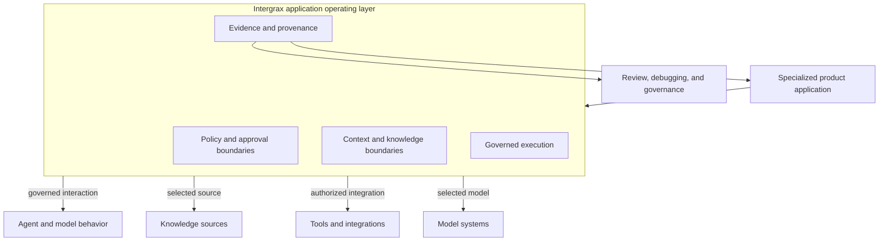
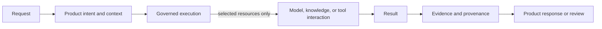
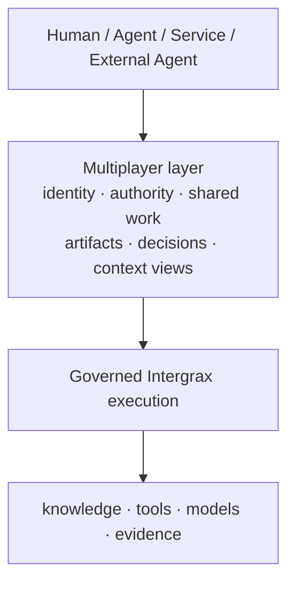
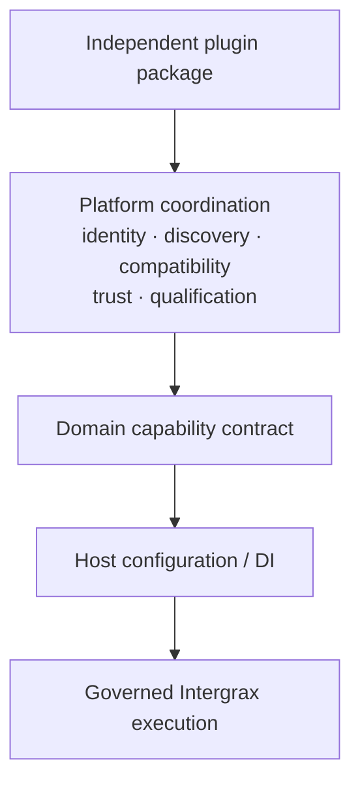

<!--
© Artur Czarnecki. All rights reserved.
Intergrax is source-available under the Intergrax Evaluation and Collaboration License 1.0.
See LICENSE for permitted evaluation, collaboration, and contribution use.
-->

# Intergrax Architecture Overview

How Intergrax separates the specialized product application, its application operating layer, model or agent behavior, governed access to knowledge and tools, and reviewable evidence.

> [!NOTE]
> Intergrax is source-available and in active R&D. This overview explains **responsibility boundaries** and **governed execution**; it is not the complete architecture canon or a production-readiness, security-certification, or commercial-validation claim. For first contact or persona routing, start at the [README](../../../README.md). For intent-based navigation when unsure which document to open, use the [Public Documentation Map](../community/PUBLIC_DOCUMENTATION_MAP.md). Use the [Technical Documentation Map](../technical/DOCUMENTATION_MAP.md) for deep implementation architecture.

Primary audience: external architects, Principal or Staff engineers, CTOs, and technical evaluators comparing application operating boundaries.

---

## At a glance

| Boundary | Responsibility | Ownership limit |
| -------- | -------------- | --------------- |
| **Specialized product application** | Domain workflow, UX, product semantics, required identity and permissions, business acceptance, and deployment choices | Defines the business rule and product outcome; does not need to rebuild shared execution controls |
| **Intergrax application operating layer** | Policy and approval mechanisms, context and knowledge boundaries, governed execution, tool and integration boundaries, runtime controls, recovery, observability, and evidence/provenance | Provides reusable enforcement mechanisms; does not decide the product's business permissions or acceptance criteria |
| **Agent and model behavior** | Reasoning, inference, decision generation, and agent-specific domain behavior | Operates within the supplied context and governed execution; does not own policy, permissions, or evidence |
| **Knowledge, tools, integrations, and model systems** | Source data, remote services, business systems, tool effects, and model access | Are selected behind configured boundaries; they do not own the product workflow or end-user experience |
| **Evidence and provenance** | Receipts, traces, provenance, and records for review, debugging, and governance | Is produced during execution; it does not certify production readiness, security, or commercial validation |

## The operating model



Intergrax surrounds the application's execution boundaries. A request may use only the model, knowledge source, or tool that its product context and configured controls select; the diagram does not mean every request invokes every resource. Agent or model behavior supplies reasoning and decisions, while the operating layer bounds how that behavior receives context, accesses resources, produces effects, and leaves evidence.

**Harness AI** is useful category shorthand for this operating or execution layer around model and agent behavior. Intergrax is therefore not merely a model provider, an agent reasoning framework, or the product's UX and business workflow.

## Who defines policy and who enforces it?

- **The product team owns** what the business rule means, who should have permission, which actions require approval, the required identity and tenant context, and whether the product outcome is acceptable.
- **Intergrax provides** reusable mechanisms to propagate that identity and context, apply configured policy and approval boundaries, constrain execution and tool access, recover and observe runtime behavior, and record evidence.
- **Agent and model behavior does not replace either responsibility.** It can propose a decision or action, but it does not grant business permission or bypass the governed boundary.

This division lets products keep their domain accountability while sharing an application operating layer instead of rebuilding controls around each workflow.

## Request and evidence flow



The lifecycle is conceptual: the operating layer selects the resources needed for the request, then returns the result with evidence/provenance that can be inspected for debugging, review, and governance. Evidence is a first-class execution output, not an afterthought or an inference reconstructed from ad hoc logs.

## Governed Execution as a platform capability

**Governed Execution** (Governance & Policy Enforcement) is the platform capability that controls what execution may proceed under configured policy.

```text
agent / model proposes
→ configured policy evaluates
→ allow / deny / require human / other supported outcome
→ authorized execution
→ evidence
```

The application defines what the business rule means. Intergrax provides reusable enforcement mechanisms — policy evaluation, boundary enforcement, canonical HITL, and governance evidence on wired paths. Complete platform-wide coverage and production qualification are **not** claimed.

Details belong in the owning [Governed Execution architecture](GOVERNED_EXECUTION.md).

## LKW as a product example

Local Knowledge Workspace (LKW) is the **Primary product proof** at **Backend Product Alpha / MVP** with **PARTIAL** public proof status.

| LKW-specific product responsibility | Shared Intergrax foundation |
| ---------------------------------- | ---------------------------- |
| Workspace workflow, approved-source choice, user-facing Ask, and product acceptance | Ingest and knowledge boundaries, governed Ask execution, evidence/provenance, and hosting/runtime mechanisms |

The accepted indexed path demonstrates bounded ingest, indexed knowledge, grounded Ask, source references, and persisted execution evidence. Mixed indexed + authorized live Hybrid Ask remains incomplete; complete live-provider access, real-user validation, and commercial validation are not established. See [LKW Platform Proof](../../../applications/local_workspace_application/docs/proof/LKW_PLATFORM_PROOF.md) and the [PROOFS dashboard](../proofs/PROOFS.md).

## Token Optimization as a secondary capability example

Token Optimization is a **Featured platform-capability proof** with **PARTIAL** public status. It operates inside governed execution as a reusable capability for policy-governed context and prompt optimization, protected-region validation, receipts, and observability. It is not a separate product layer, and universal token savings or production-proven savings are not claimed.

Details belong in the owning [Token Optimization guide](../capabilities/token_optimization/README.md) and its [claim guardrails](../capabilities/TOKEN_OPTIMIZATION_CLAIMS.md).

## Multiplayer AI as a strategic platform direction

Multiplayer AI extends the operating model from a single governed request and execution path toward governed collaboration among multiple principals — humans, agents, services, and eventually external agents. This is architectural direction; today's runtime does not yet complete that evolution.

The planned Multiplayer layer coordinates platform primitives for Principal, Membership, Delegation, Shared Work, Artifacts, Decisions, ContextView, Activity, and AgentDirectory. It reuses existing UCL, Context Engineering, Memory, Knowledge/RAG, Token Optimization, HITL, execution/runtime, and evidence/provenance mechanisms without relabeling them as Multiplayer.



*Conceptual strategic architecture — not an implemented runtime topology.*

Details belong in the [Multiplayer AI architecture](../capabilities/architecture/MULTIPLAYER_AI.md).

## Platform extensibility as a strategic platform direction

Intergrax already exposes multiple real extension mechanisms across integrations, tools, skills, RAG, Vendor Knowledge, security, policy, host composition, and other domains. Platform Plugins is the canonical architecture for coordinating independently packaged extensions at the package boundary — not a universal runtime wrapper that replaces domain contracts.



*Conceptual target architecture — not proof that the full platform-level plugin lifecycle is implemented.*

Platform Plugin is **not** a universal `PlatformPlugin.execute()`; it does **not** replace IntegrationPlugin, ToolPlugin, SkillPlugin, RAG contracts, Vendor Knowledge contracts, security or policy contracts, RuntimePlugin, or other domain-owned surfaces. It is **not** proof that every extension surface is already harmonized.

Details belong in the [Platform Plugins architecture](PLATFORM_PLUGINS.md).

## Architect review path

Architecture-specific continuation — not a general documentation index.

1. Understand this Architecture Overview as the project-level mental model.
2. Explore the [Platform Map](../../../README.md#explore-the-intergrax-platform) for grouped platform areas and domain architecture entry points.
3. Inspect [PROOFS](../proofs/PROOFS.md) for current bounded evidence and open validation gates.
4. Use the [Evaluation Guide](../builders/EVALUATION_GUIDE.md) when you need a bounded technical evaluation of one claim.
5. Go deeper via the [Technical Documentation Map](../technical/DOCUMENTATION_MAP.md) and [runtime architecture hub](../architecture/intergrax_runtime_architecture.md) (complete 24-domain index) — including the [Harness narrative](../technical/guides/INTERGRAX_HARNESS_NARRATIVE.md) when helpful.

The overview summarizes the architecture; proof documents establish current evidence; the technical map and runtime hub route implementation-level due diligence. None of these routes turns bounded evidence into a production, security, real-user, or commercial validation claim.
