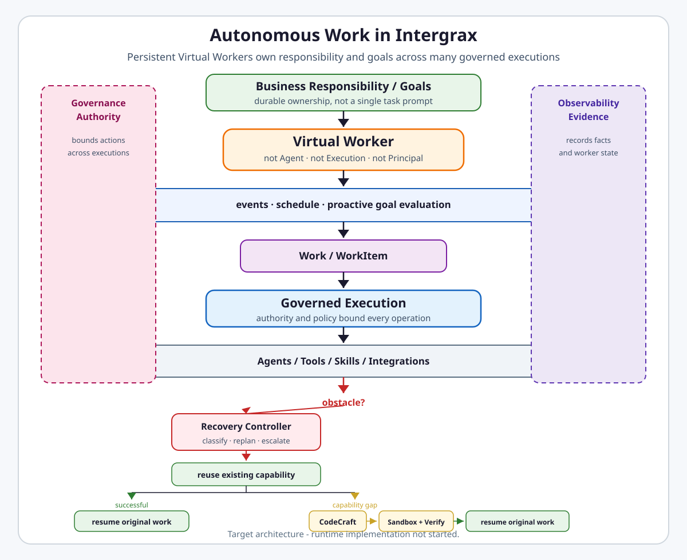

# Autonomous Work

**Autonomous Work** is the Intergrax domain for persistent governed AI workers that own business responsibilities and goals across many executions.

Its primary abstraction is the **Virtual Worker** — a durable operational entity, not an agent, task, execution, or application.

---

## Why it matters

Most agent platforms optimize for **task-oriented execution**: a human or system sends work, an agent runs, and the run ends.

Autonomous Work targets a different problem: **who remains responsible when the work spans days, events, failures, and many runs?**

```text
Agent:
receives work → executes → finishes

Virtual Worker:
owns responsibility → watches goals → accepts/creates work
→ launches governed executions → handles obstacles → remains responsible
```

Intergrax already provides governed execution, agents, tools, policy, evidence, and recovery building blocks. Autonomous Work composes them under one durable worker semantics layer instead of inventing parallel runtimes.

---

## Claim / maturity boundary

> [!IMPORTANT]
> **Canonical target architecture exists. Runtime implementation has not started.**
>
> - Virtual Workforce is **not** a shipped product.
> - Virtual Worker contracts, persistence, control plane, and recovery controller are **not implemented**.
> - CodeCraft / Sandbox production hardening remains required before production-style autonomous generated-code recovery.
>
> Do not present Virtual Workers as production capability until implementation and proof gates say so.

---

## At a glance

| Concern | Summary |
| --- | --- |
| **Responsibility** | Persistent autonomous business responsibility, goals, lifecycle, work intake, and worker-level recovery semantics |
| **Main abstraction** | **Virtual Worker** (`WorkerDefinition` → `WorkerInstance`) |
| **Owns** | Responsibilities, goals, worker lifecycle, wake-up semantics, worker→work/execution correlation, obstacle classification hand-off |
| **Reuses** | Collaborative Principal/authority, WorkItem, Governed Execution, Agents, Tools/Skills/Integrations, CodeCraft, Sandbox, Memory, Observability, Diagnostics, Hosting |
| **Does not own** | Agent cognition, policy engine, execution lifecycle, memory store, generated-code synthesis, evidence truth, application UX |
| **Current maturity** | AW-0 REVIEW GATE — canonical architecture and documentation integration complete; independent audit pending; **runtime not implemented** |
| **First planned proof** | **Autonomous Order Operations Worker** — planned / not implemented |

---

## Flagship architecture visual

<a href="assets/autonomous-work-flagship-light.svg">
<picture>
  <source media="(prefers-color-scheme: dark)" srcset="assets/autonomous-work-flagship-dark.svg">
  <source media="(prefers-color-scheme: light)" srcset="assets/autonomous-work-flagship-light.svg">
  
</picture>
</a>

---

## How it works

1. A **Virtual Worker** exists as a durable responsibility holder — usually **IDLE**, not continuously reasoning.
2. An external **event**, **schedule**, or **goal evaluation** wakes the worker when action is required.
3. The worker **accepts or creates work** in the collaborative work plane.
4. The worker dispatches a canonical **Governed Execution** — it does not replace execution semantics.
5. An **Agent** performs reasoning inside that execution.
6. **Governance** evaluates authority and policy at configured boundaries.
7. When progress stalls or fails, **obstacle classification** precedes any recovery strategy.
8. The worker first tries to **reuse an existing capability**; a true gap may route to **CodeCraft**.
9. Generated code runs through **Sandbox + verification** before resuming the original work item.
10. After execution completes, the **worker remains responsible** — ready for the next wake-up.

Persistent availability is **event-driven and bounded**, not an infinite LLM loop.

---

## Ownership boundaries

```text
Worker != Agent
Worker != Principal
Worker != WorkItem
Worker != Task
Worker != Execution
Worker lifetime != process lifetime
```

| Autonomous Work owns | Autonomous Work does not own |
| --- | --- |
| Worker definition/instance semantics, responsibilities, goals, lifecycle, wake-up, recovery decision semantics | Collaborative identity/authority, Task/Run/Execution lifecycle, agent cognition, tools/skills/integrations, memory stores, CodeCraft synthesis, sandbox substrate, HOS/evidence truth, Tier-3 application UX |

Normative rule: **Capability may grow. Authority may not self-expand.**

---

## Relationship to Intergrax

Autonomous Work sits above governed execution and composes existing domains:

| Neighbor | Relationship |
| --- | --- |
| [Collaborative Work](COLLABORATIVE_WORK.md) | Principal binding, workspace, delegation, future WorkItem/Assignment |
| [Governed Execution](GOVERNED_EXECUTION.md) | Authority, policy enforcement, control-plane gates |
| [Unified Execution Runtime](UNIFIED_EXECUTION_RUNTIME.md) / Nexus | Actual Task/Run/Attempt/Execution lifecycle |
| [Agents](AGENT_CONTRACTS_AND_ASSEMBLY.md) / [Reasoning](REASONING_AND_COGNITION.md) | Cognition inside worker-triggered executions |
| [Code Craft](CODE_CRAFT.md) / Sandbox | Canonical missing-code capability path |
| [Observability](OBSERVABILITY.md) / [Diagnostics](DIAGNOSTICS.md) | Execution truth and obstacle evidence |
| [Application Hosting](APPLICATION_HOSTING.md) | Host process lifetime; worker identity survives restart |
| [Multiplayer AI](../capabilities/architecture/MULTIPLAYER_AI.md) | Future collaboration may compose Multiplayer; neither owns Autonomous Work |

---

## Evidence / proof

**Planned flagship proof:** [Autonomous Order Operations Worker](#reference-enterprise-scenario) — **not implemented**.

No dedicated public Autonomous Work proof route exists at AW-0. Architecture existence does not imply production qualification.

---

## Go deeper

| Depth | Route |
| --- | --- |
| Extended architecture depth | [`satellites/AUTONOMOUS_WORK_extended_depth.md`](satellites/AUTONOMOUS_WORK_extended_depth.md) — domain model, lifecycle, recovery, A0–A4, budgets, observability, control plane, enterprise scenarios |
| Implementation plan | [`../maintainers/plans/AUTONOMOUS_WORK.md`](../maintainers/plans/AUTONOMOUS_WORK.md) |
| ADR | [`ADR-AW-001`](../technical/adr/entries/2026-09-02/ADR-AW-001.md) |
| Audit origin | [`AUTONOMOUS_WORK_VIRTUAL_WORKFORCE_ARCHITECTURE_GAP_AUDIT.md`](../../audit_results/2026-09-02/AUTONOMOUS_WORK_VIRTUAL_WORKFORCE_ARCHITECTURE_GAP_AUDIT.md) · [`..._REVIEW.md`](../../audit_results/2026-09-02/AUTONOMOUS_WORK_VIRTUAL_WORKFORCE_ARCHITECTURE_GAP_AUDIT_REVIEW.md) |
| Product-facing concept | [`../overview/VIRTUAL_WORKFORCE.md`](../overview/VIRTUAL_WORKFORCE.md) |
| Architecture governance | [`INTERGRAX_ARCHITECTURE_PRINCIPLES.md`](INTERGRAX_ARCHITECTURE_PRINCIPLES.md) |
| Engineering canon | Sections below in this file |

---

## Cursor read scope (token budget)

**Do not read this entire file in one session.**

- **Default:** human-facing front through §Go deeper, then §Ownership boundary, §Core model, §Normative invariants, §Integration boundaries. **Do not load the extended-depth satellite by default.**
- **Implementation:** this read-scope block + the active `AW-*` row in [`../maintainers/plans/AUTONOMOUS_WORK.md`](../maintainers/plans/AUTONOMOUS_WORK.md).
- **Recovery / adaptive capability work:** §Adaptive obstacle recovery + [`satellites/AUTONOMOUS_WORK_extended_depth.md`](satellites/AUTONOMOUS_WORK_extended_depth.md) §Recovery Controller, §Capability acquisition, §A0–A4, §CodeCraft recovery + relevant slice of [`CODE_CRAFT.md`](CODE_CRAFT.md) and [`GOVERNED_EXECUTION.md`](GOVERNED_EXECUTION.md).
- **Lifecycle work:** [`satellites/AUTONOMOUS_WORK_extended_depth.md`](satellites/AUTONOMOUS_WORK_extended_depth.md) §Worker lifecycle only.
- **Observability work:** [`satellites/AUTONOMOUS_WORK_extended_depth.md`](satellites/AUTONOMOUS_WORK_extended_depth.md) §Observability + relevant slice of [`OBSERVABILITY.md`](OBSERVABILITY.md).
- **Collaborative identity/work:** §Principal and WorkItem integration + relevant slice of [`COLLABORATIVE_WORK.md`](COLLABORATIVE_WORK.md).

---

## Purpose

Autonomous Work is the Intergrax platform domain that owns the semantics of a **persistent autonomous unit of business responsibility**.

Its primary product-facing abstraction is the **Virtual Worker**.

A Virtual Worker is not an agent, task, execution, application, process, or collaborative Principal. It is a durable operational entity that owns responsibility and goals over time and uses existing Intergrax capabilities to pursue them.

The domain answers:

> What is the persistent worker, what is it responsible for, what goals must it pursue, when is it active or waiting, how does it accept or create work, and how does it resume responsibility after individual executions finish or fail?

It deliberately does **not** answer:

- how an LLM reasons,
- how an AgentDefinition is built,
- how Nexus executes a task,
- how permissions are granted,
- how policy rules are authored or enforced,
- how collaborative membership/delegation is stored,
- how memory is stored,
- how generated code is synthesized,
- how a sandbox isolates code,
- how HOS records execution evidence,
- how a Tier-3 application process is hosted.

Those concerns remain owned by their existing domains.

---

## Core mental model

Traditional task-agent model:

```text
human → task → agent → tools → result → run ends
```

Autonomous Work model:

```text
organization
   ↓
Virtual Worker
   ↓
role + durable responsibility + goals
   ↓
continuous event / schedule / goal evaluation
   ↓
0..N WorkItems over time
   ↓
0..N governed Executions over time
   ↓
Agents / Tools / Integrations / CodeCraft
   ↓
result / obstacle / recovery
   ↓
worker responsibility remains active
```

The key distinction is:

> **An agent executes work. A Virtual Worker remains responsible for ensuring the work is accomplished over time.**

---

## Ownership boundary

### Autonomous Work owns

- `WorkerDefinition` semantics,
- `WorkerInstance` semantics,
- durable `Responsibility`,
- worker-scoped `WorkerGoal`,
- worker lifecycle and state transitions,
- worker work-intake and wake-up semantics,
- proactive goal-evaluation semantics,
- worker → WorkItem / Execution correlation,
- worker-level recovery orchestration semantics,
- obstacle classification hand-off contract,
- capability-acquisition decision semantics,
- worker-level composition references to budget, policy, memory, capability, schedule and risk profiles,
- worker-centric operational state required to project fleet status.

### Autonomous Work does not own

- collaborative identity, membership, delegation or base authority — [`COLLABORATIVE_WORK`](COLLABORATIVE_WORK.md),
- policy evaluation / enforcement / HITL — [`GOVERNED_EXECUTION`](GOVERNED_EXECUTION.md) and [`RELIABILITY_FAILURE_AND_HITL`](RELIABILITY_FAILURE_AND_HITL.md),
- `Task`, `Run`, `Attempt`, `Execution` lifecycle — [`UNIFIED_EXECUTION_RUNTIME`](UNIFIED_EXECUTION_RUNTIME.md), Nexus and orchestration,
- agent cognition — [`AGENT_CONTRACTS_AND_ASSEMBLY`](AGENT_CONTRACTS_AND_ASSEMBLY.md), [`REASONING_AND_COGNITION`](REASONING_AND_COGNITION.md),
- tools / skills / integrations — their owning domains,
- memory/context persistence or composition — Memory/UCL/Context Engineering,
- generated code lifecycle — [`CODE_CRAFT`](CODE_CRAFT.md),
- execution isolation — Sandbox runtime/substrate owned by existing sandbox mechanisms,
- evidence truth — [`OBSERVABILITY`](OBSERVABILITY.md), HOS / RuntimeEvent,
- diagnostic truth — [`DIAGNOSTICS`](DIAGNOSTICS.md),
- host process lifetime — [`APPLICATION_HOSTING`](APPLICATION_HOSTING.md),
- business application UX — Tier-3 application.

---

## Core model

### WorkerDefinition

Reusable definition of a worker role. References domain-owned profiles (governance, budget, memory, capability, CodeCraft, risk, schedule, escalation, collaboration, observability) rather than embedding duplicate configuration.

See [extended depth — Detailed domain model](satellites/AUTONOMOUS_WORK_extended_depth.md#detailed-domain-model) for full entity relationships, profile references and version/revision semantics.

### WorkerInstance

Durable instantiated worker.

```text
WorkerDefinition
      ↓ instantiate
WorkerInstance
      ↓
Principal binding + workspace context
      ↓
Responsibilities / Goals
      ↓
0..N WorkItems
      ↓
0..N Executions
```

`WorkerInstance` survives individual task completion, run failure, host restart and idle periods.

### Responsibility

Persistent area of ownership.

Examples:

- Process incoming customer orders according to company policy.
- Maintain supplier integration continuity inside SLA.
- Investigate qualifying incidents and keep the incident record current until closure.

A Responsibility may exist while no task is running and may create many goals/work items.

### WorkerGoal

Durable measurable outcome, not an LLM prompt. Carries objective, success criteria, metric/SLA refs, cadence and progress projection. A goal may generate multiple WorkItems and Executions.

See [extended depth — Detailed domain model](satellites/AUTONOMOUS_WORK_extended_depth.md#detailed-domain-model) for conceptual field contracts (`WorkerPrincipalBinding`, `WorkerWorkBinding`, `WorkerRecoveryContext`).

---

## Worker is not Principal

Autonomous Work must not introduce a competing identity or permission system.

Canonical composition:

```text
WorkerInstance
      ↓ explicit binding
Collaborative Principal
      ↓
WorkspaceMembership + AuthorityGrant + Delegation
      ↓
Effective authority
      ↓
Governed Execution
```

Responsibilities and goals **never grant authority**.

A worker display role such as `Order Operations Worker` is descriptive business semantics only. It cannot authorize CRM access, production writes, credential use or policy mutation.

If future review proves current Principal taxonomy insufficient, Principal extensions belong to Collaborative Work — not an Autonomous Work-private authority model.

---

## Worker lifecycle

Canonical semantic states are introduced by this domain; concrete enum shape is frozen in AW-1.

Target lifecycle:

```text
PROVISIONING
ACTIVE
IDLE
WORKING
WAITING_EXTERNAL
WAITING_FOR_HUMAN
RECOVERING
DEGRADED
PAUSED
QUARANTINED
STOPPED
```

Key rules:

- `ACTIVE` means the worker is operationally available, not that an LLM is continuously running.
- `IDLE` is normal healthy state.
- a paused Execution does not automatically mean the entire worker is `PAUSED`.
- `QUARANTINED` is a governed containment state.
- host restart must not create a new worker identity.
- Worker lifecycle sits **above** Task/Run/Execution lifecycle.

See [extended depth — Worker lifecycle](satellites/AUTONOMOUS_WORK_extended_depth.md#worker-lifecycle) for transition matrix, pause vs quarantine semantics, and restart/recovery behavior.

---

## Continuous operation without an infinite model loop

A Virtual Worker is persistent, but cognition is event-driven and bounded.

> **Persistent responsibility does not mean persistent compute.**

Forbidden default design:

```text
while true:
    think_with_llm()
    act()
```

Canonical wake-up sources include external events, queues, new WorkItems, schedules, goal evaluation, SLA checkpoints, dependency recovery, human approval, recovery timers and operator actions.

Target flow:

```text
WorkerInstance ACTIVE/IDLE
        ↓ wake-up trigger
work acceptance / goal evaluation
        ↓
create or select WorkItem
        ↓
canonical Execution
        ↓
result / wait / recovery
        ↓
persist worker state
        ↓
IDLE or next bounded work
```

See [extended depth — Wake-up and scheduling semantics](satellites/AUTONOMOUS_WORK_extended_depth.md#wake-up-and-scheduling-semantics) for full wake-up taxonomy and idempotency rules.

---

## Reactive and proactive work

Autonomous Work supports two work-origin classes.

### Reactive

External work arrives:

```text
email / webhook / queue / assignment
        ↓
worker accepts work
        ↓
WorkItem / Execution
```

### Proactive

The worker evaluates a responsibility or goal and detects work without an external task prompt.

Example:

```text
Goal: 99% orders completed <30m
        ↓ scheduled goal check
three orders approaching SLA
        ↓
worker creates/prioritizes required work
```

Proactive goal evaluation is bounded by configured cadence, budget, policy and available authority. It is not unrestricted autonomous exploration.

See [extended depth — Reactive and proactive work](satellites/AUTONOMOUS_WORK_extended_depth.md#reactive-and-proactive-work) for SLA example and Worker vs Agent distinction.

---

## Work plane vs execution plane

Autonomous Work preserves the existing separation:

```text
Business responsibility
   ↓
WorkerGoal
   ↓
Collaborative WorkItem / Assignment
   ↓
Nexus Task / Execution
```

`WorkItem != Task` remains authoritative.

Where Collaborative Work MP-2+ semantics are not implemented yet, Autonomous Work implementation must not create a permanently competing business WorkItem model merely to unblock a proof. Temporary bounded bridges must be explicit and migratable.

---

## Governance and authority composition

Target authority chain:

```text
organization / tenant authorization context
        ↓
worker-bound Principal effective authority
        ↓
Execution effective authority
        ↓
child Execution / Agent
        ↓
Tool / Integration / CodeCraft operation
```

Normative rule:

> **Capability may grow. Authority must not self-expand.**

Recovery may change strategy or synthesize a capability. It may not grant the worker a new credential, broader database scope, new workspace membership, disabled policy, broader egress or unrelated production permission.

Control-plane actions such as activate, pause, quarantine, policy-profile change, budget-profile change and capability promotion are themselves governed mutations.

---

## Adaptive obstacle recovery

Autonomous Work owns the **worker-level decision semantics** for responding to an obstacle. It does not own every underlying recovery mechanism.

Canonical flow:

```text
execution fails / progress stalls
        ↓
canonical evidence + diagnostics
        ↓
Obstacle Classification
        ↓
strategy selection
```

Required base classes:

| Obstacle class | Default strategy |
|---|---|
| transient fault | reliability retry / backoff |
| dependency unavailable | wait / reschedule |
| rate limit | throttle / wait |
| credential revoked/missing | escalate; never synthesize authority |
| policy DENY | stop; never treat as solvable obstacle |
| ambiguous business decision | canonical HITL / collaborative decision path |
| known alternate capability | replan using approved capability |
| schema/API drift | adaptive recovery candidate |
| missing capability | capability acquisition candidate |
| suspicious/malicious input | quarantine / security path |

> **Recovery changes strategy or capability. It does not weaken policy.**

See [extended depth — Recovery Controller](satellites/AUTONOMOUS_WORK_extended_depth.md#recovery-controller) for full obstacle taxonomy (autonomous posture, HITL, forbidden behaviors) and missing-capability vs missing-authority distinction.

---

## Capability acquisition

Missing capability recovery is broader than CodeCraft.

Canonical search order:

```text
existing Tool → Skill → Integration → approved alternate
  → docs/schema inspection → configure existing capability → CodeCraft
```

CodeCraft is the canonical generated-code subsystem, not the default first response.

See [extended depth — Capability acquisition](satellites/AUTONOMOUS_WORK_extended_depth.md#capability-acquisition) for the full nine-step ladder and missing-capability vs missing-authority rules.

---

## Capability autonomy tiers

Autonomous work needs risk-aware capability growth.

| Tier | Example | Autonomous posture |
|---|---|---|
| **A0 — Known Capability** | existing approved tool | normal governed execution |
| **A1 — Ephemeral Safe** | parser / transform / local helper | generate, verify and use ephemerally under hardened isolation |
| **A2 — Scoped Adaptive** | temporary API adapter with restricted egress + scoped secret | narrow autonomous use only if policy permits |
| **A3 — Production Change** | durable connector/workflow update | generate/test/shadow/canary; governed promotion, commonly human approval |
| **A4 — Authority Change** | new credential, broader DB scope, disable policy | **never self-authorized** |

> **A4 = never self-authorized**

Normative direction:

> **SELF-EXTENDING CAPABILITY: conditionally allowed.**  
> **SELF-EXTENDING AUTHORITY: forbidden.**

See [extended depth — A0–A4 capability autonomy tiers](satellites/AUTONOMOUS_WORK_extended_depth.md#a0-a4-capability-autonomy-tiers) for per-tier isolation, governance, HITL and persistence rules.

---

## CodeCraft boundary

Autonomous Work does not create `WorkerCodeCraft`, private subprocess loops or an alternate generated-code path.

Generated executable code uses:

```text
CodeCraft → generation → static gate → governance/HITL
  → approved sandbox → execution/tests → CVL/Critic → bounded result
```

Known current CodeCraft/sandbox limitations remain release blockers for production-style autonomous workers. If a worker risk profile requires hardened container/cloud isolation and that substrate cannot be proven, execution must fail closed.

See [extended depth — CodeCraft and Sandbox recovery](satellites/AUTONOMOUS_WORK_extended_depth.md#codecraft-and-sandbox-recovery) for full recovery flow, explicit prohibitions and production blockers. Full CodeCraft canon: [`CODE_CRAFT.md`](CODE_CRAFT.md).

---

## Durable capability promotion

An ephemeral capability does not automatically become a durable platform tool or production integration.

> **Ephemeral success != production promotion.**

Target promotion lifecycle: proof package → static/security validation → isolated tests → contract/regression tests → shadow → canary → governed promotion decision → versioned publication → rollback path retained.

A3 promotion is a control-plane mutation and must use explicit authorization/evidence.

See [extended depth — Durable capability promotion](satellites/AUTONOMOUS_WORK_extended_depth.md#durable-capability-promotion) for proof package contents.

---

## Memory and context

Virtual Workers need continuity, but Autonomous Work does not own another memory store.

A worker may reference a profile describing permitted continuity:

```text
WorkerMemoryProfile
  responsibility_memory_scope
  allowed_context_sources
  retention_policy_ref
  cross_workitem_recall
  organization_memory_access
  sensitive_context_policy_ref
```

The profile composes Memory, UCL, Context Engineering and Collaborative Work scoping.

---

## Budgets

Worker lifetime exceeds any single Execution; therefore worker-level accounting windows are required, but a second execution-budget engine is forbidden.

Target composition:

```text
Worker budget policy/window
      ↓ constrains
0..N Execution budgets
      ↓
existing durable execution budget mechanisms
```

Worker budget **aggregates / constrains** existing execution budgets. The execution ledger remains the source of truth for individual run expenditure.

See [extended depth — Budgets](satellites/AUTONOMOUS_WORK_extended_depth.md#budgets) for time-window examples (cost/day, tokens, CodeCraft attempts, recovery caps, proactive cadence).

---

## Observability

HOS / RuntimeEvent remain the source of truth for execution facts.

Autonomous Work contributes durable worker-domain state and correlation identifiers, then exposes a **worker-centric projection**:

```text
WorkerInstance → Responsibility / Goal → WorkItem → Task/Run/Attempt/Execution → RuntimeEvent
```

A worker dashboard is a projection, not a second execution history.

See [extended depth — Observability](satellites/AUTONOMOUS_WORK_extended_depth.md#observability) for worker/control-plane fact taxonomy, execution evidence boundaries and operator projection requirements.

---

## Control plane

Enterprise Autonomous Work requires explicit fleet operations:

- register / instantiate, activate, pause / resume, stop,
- quarantine / release,
- assign responsibility, assign/reassign work,
- change allowed profiles,
- inspect state/recoveries,
- revoke worker authority binding,
- controlled termination of active work.

All sensitive control-plane mutations are governed and evidenced.

See [extended depth — Control plane](satellites/AUTONOMOUS_WORK_extended_depth.md#control-plane) for operation/governance matrix.

---

## Application boundary

A Virtual Worker is **not an application**.

A future `Virtual Workforce` Tier-3 application may provide:

- worker builder/configuration,
- fleet dashboard,
- goal/KPI views,
- approval inbox,
- recovery history,
- budget/risk views,
- operator controls.

That application consumes Autonomous Work contracts and other domains. It does not own worker semantics.

A future cross-layer `VIRTUAL_WORKFORCE` feature hub may coordinate Autonomous Work + Collaborative Work + Governance + CodeCraft + Observability + Hosting if/when product composition justifies it. It must not replace this domain pair.

---

## Reference enterprise scenario

### Autonomous Order Operations Worker

Responsibility:

> Continuously process incoming customer orders according to company policy and maintain service continuity within SLA.

Normal path:

```text
email event
→ Worker accepts work
→ WorkItem
→ governed Execution
→ order agent/tools
→ ERP side effect
→ evidence
→ complete
→ worker returns IDLE
```

Extended obstacle and proactive scenarios (unknown attachment, vendor API drift, proactive SLA) are documented in [extended depth — Enterprise examples](satellites/AUTONOMOUS_WORK_extended_depth.md#enterprise-examples).

---

## Normative invariants

- **AW-INV-01 — Worker is not Agent:** `WorkerInstance != AgentDefinition != AgentRun`.
- **AW-INV-02 — Worker is not execution:** `WorkerInstance != Task != Run != Attempt != Execution`.
- **AW-INV-03 — Worker is not Principal:** worker business identity binds to canonical Collaborative Principal; it does not define authority.
- **AW-INV-04 — Responsibility outlives execution:** a responsibility spans zero or many executions and survives host restart.
- **AW-INV-05 — Work plane stays separate:** `WorkItem != Nexus Task`.
- **AW-INV-06 — Persistent does not mean infinite LLM loop:** worker availability is event/schedule/goal driven and cognition is bounded.
- **AW-INV-07 — Capability growth does not imply authority growth:** recovery may synthesize capability but never self-expand effective authority.
- **AW-INV-08 — Code generation has one canonical path:** generated executable code uses CodeCraft + approved sandbox; no agent-private subprocess loop.
- **AW-INV-09 — Isolation requirement is non-downgradable:** required hardened isolation unavailable → fail closed.
- **AW-INV-10 — Governance remains canonical:** no Autonomous Work-private policy or HITL engine.
- **AW-INV-11 — Recovery cannot bypass DENY:** policy denial is not a recoverable capability obstacle.
- **AW-INV-12 — Evidence has one runtime truth:** execution facts derive from HOS/RuntimeEvent; worker dashboard is a projection.
- **AW-INV-13 — Worker lifetime is not host-process lifetime:** restart does not recreate worker identity or responsibility state.
- **AW-INV-14 — Reuse before create:** existing Tool/Skill/Integration/approved alternative precedes CodeCraft.
- **AW-INV-15 — Ephemeral before durable promotion:** generated capability is narrow/ephemeral by default; durable promotion is separate and governed.
- **AW-INV-16 — Proactive work is bounded:** goal evaluation operates only within cadence, budget, authority and policy.
- **AW-INV-17 — Control-plane mutations are governed:** worker state/profile/promotion mutations require explicit authorization and evidence.
- **AW-INV-18 — Application does not own worker semantics:** Tier-3 Virtual Workforce UI consumes the domain.
- **AW-INV-19 — Worker budget composes execution budgets:** no competing execution-budget ledger.
- **AW-INV-20 — Recovery classification precedes capability synthesis:** `on_error → CodeCraft` is forbidden architecture.

See [extended depth — Invariants](satellites/AUTONOMOUS_WORK_extended_depth.md#invariants---extended-explanation) for elaborated meaning of each invariant.

---

## Integration boundaries

| Domain / capability | Autonomous Work relation |
|---|---|
| Collaborative Work | Principal binding, workspace, delegation, future WorkItem/Assignment |
| Governed Execution | authority/policy enforcement, side-effect decisions, control-plane gates |
| Reliability / HITL | retry/backoff and human execution pause semantics |
| Unified Execution Runtime | actual Task/Run/Attempt/Execution lifecycle |
| Nexus / Orchestration | dispatch and child execution, not worker lifetime |
| Agents / Reasoning | cognition used by worker executions |
| Tools / Skills / Integrations | known capability inventory |
| CodeCraft | canonical missing-code capability synthesis |
| Sandbox | isolation substrate reused by CodeCraft |
| Memory / UCL / Context Engineering | worker-scoped continuity and context composition |
| Diagnostics | canonical problem evidence/classification inputs |
| Observability / Proof Receipts | execution truth, evidence and projections |
| Application Hosting | process/runtime hosting; worker identity survives restart |
| Tier-3 Applications | product configuration/UX consumers |
| Multiplayer AI | future Virtual Workforce collaboration may compose Multiplayer capability; neither owns this domain |

---

## Security / production qualification gates

Production-style autonomous workers are blocked until required risk-class gates are satisfied. At minimum:

1. CodeCraft critical identity/authority/HITL defects closed.
2. Requested hardened isolation cannot downgrade to local execution.
3. Real qualified container/cloud isolation exists for generated code.
4. Runtime network egress restrictions are enforceable and evidenced.
5. Generated-code secrets are purpose-scoped/brokered.
6. Control-plane mutation governance covers worker and capability-promotion operations.
7. Worker/recovery/craft correlation is present in canonical evidence.
8. Host restart/recovery preserves worker identity and responsibility state.
9. Recovery abuse/policy-bypass test corpus passes.
10. Quarantine/kill semantics are proven.

Architecture existence does not imply production qualification.

---

## Maturity boundary

Current state at AW-0:

- market/problem class validated strategically,
- repository capability audit completed,
- architecture/gap audit completed,
- independent review completed,
- canonical domain ownership accepted,
- canonical target architecture documented here,
- implementation plan registered,
- runtime contracts **not implemented**,
- worker persistence/lifecycle **not implemented**,
- worker control plane **not implemented**,
- adaptive recovery controller **not implemented**,
- Virtual Workforce product **not implemented**,
- end-to-end public proof **not established**.

Do not present Virtual Workers as shipped production capability until implementation/proof gates say so.

---

## Required proof program

First flagship proof target: **Autonomous Order Operations Worker**.

Minimum chaos corpus:

- normal email/PDF/spreadsheet order,
- unknown/corrupted attachment,
- prompt injection in document,
- missing/contradictory customer data,
- duplicate order,
- transient API timeout,
- rate limit,
- API schema drift / HTTP 410,
- revoked credential,
- supplier outage,
- policy-prohibited action,
- malicious generated-code temptation,
- hardened sandbox unavailable,
- required human business decision,
- host restart during work/recovery.

Minimum metrics:

- goal completion rate,
- autonomous completion rate,
- human intervention rate,
- recovery success rate,
- mean recovery time,
- policy violation rate (**target zero**),
- unauthorized side effect / network egress (**target zero**),
- isolation downgrade count (**target zero**),
- false/missed escalation,
- generated capability pass/rollback rate,
- trace/evidence completeness,
- cost per completed work item,
- SLA adherence,
- duplicate/replayed side effects.

---

## Product vocabulary

Canonical technical domain: **Autonomous Work**.  
Primary product abstraction: **Virtual Worker**.  
Future multi-worker product/cross-layer positioning: **Virtual Workforce**.

Use `Virtual Employee` only as explanatory market language where useful; do not make it the canonical type/domain name.
