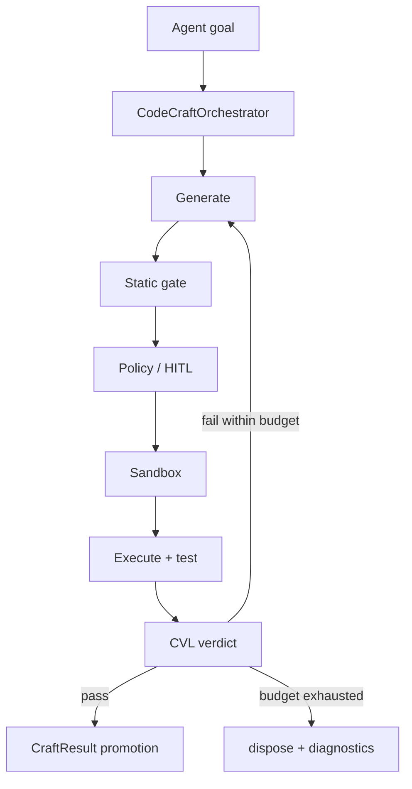

# Ephemeral Code Craft (CodeCraft)

**Intergrax CodeCraft** is a governed ephemeral-code subsystem that lets agents synthesize and verify short-lived executable helpers when catalog tools are insufficient — without bypassing platform policy, sandboxing, or audit.

> **Agent owns the goal. Harness owns how generated code is allowed to run.**

## Why it matters

Without a platform-owned ephemeral codegen path:

- every agent implements a private generate/test/fix loop,
- generated code can bypass `ToolRuntime` and policy,
- iteration budgets are unbounded,
- sandbox substrate is confused with orchestration,
- temporary helpers can pollute the global `ToolRegistry`,
- output ends at stdout with no typed handoff,
- trace and audit fragment across paths,
- promotion has no single contract.

CodeCraft addresses this through `CodeCraftOrchestrator`, typed `CodeCraftProfile`, static gate (L0), governed sandbox execution, bounded iteration, CVL verification, typed promotion via `CraftResult`, and ephemeral lifecycle semantics.

> [!NOTE]
> **Maturity boundary:** Phases **ECC-0…ECC-6** and post-closeout **S7–S11** are **Done** on the harness path, with **Full Harness LC** internal evidence. That is **not** universal production qualification for arbitrary generated-code execution: `local` isolation is workspace-level dev substrate, `container` isolation is not yet a distinct OCI boundary, `network_egress` is a profile contract with **partial** runtime enforcement, and hostile-code / sandbox-escape evidence is not claimed. See [Current maturity](#current-maturity).

**Primary audience:** Principal / Staff engineers, harness integrators, and application authors configuring `CodeCraftProfile` and `codecraft.*` tool access — after the platform overview in the root README.

## At a glance

| Concern | Summary |
| -------- | -------- |
| **Responsibility** | Governed ephemeral codegen: generate → gate → policy/HITL → sandbox → test → verify → promote/dispose |
| **Entry condition** | No suitable catalog tool; `CodeCraftProfile` allows the requested mode |
| **Agent responsibility** | Declares goal, supplies constraints/input; may invoke `codecraft.*` via `ToolRuntime` |
| **Harness responsibility** | Mode/profile selection, limits, gates, sandbox, test/verify loop, trace, promotion eligibility |
| **Orchestrator** | `CodeCraftOrchestrator` — single canonical craft lifecycle entry |
| **Craft session** | `craft_id`-scoped mission: iterations, ephemeral capabilities, verdict, cleanup |
| **Static gate** | L0 AST/import/size/pattern scan **before** execution in autonomous paths |
| **Policy / HITL** | Governed Execution owns authorization semantics; CodeCraft integrates at exec boundary |
| **Sandbox** | Reused execution substrate (`local` / `container` / `cloud`) — not ECC-owned runtime |
| **Test / verification** | `CraftTestRunner` + CVL structural verdict; optional L1 semantic judge |
| **Iteration budget** | `max_iterations`, `max_total_exec_time_s` — agent does not own retry loop |
| **Ephemeral tools** | `EphemeralToolRegistry` — session-scoped; ≠ global `ToolRegistry` |
| **Promotion** | **Promote the verified result** (`CraftResult`) — not automatic durable tool synthesis |
| **Isolation modes** | `local` (dev substrate) · `container` / `cloud` (stronger where configured) — not equivalent tiers |
| **Fail-closed behavior** | Missing profile, sandbox, policy deny, or gate failure → `DENIED` / controlled failure |
| **Tools relation** | `codecraft.*` exposed via `ToolRuntime`; catalog tools preferred when available |
| **Skills relation** | Skills may compose `codecraft.*`; skills do not execute the craft loop |
| **Production boundary** | Harness-proven orchestration — not representative hostile-code production posture |
| **Maturity** | Four-axis statement in [Current maturity](#current-maturity) |

## Flagship architecture visual

<picture>
  <source media="(prefers-color-scheme: dark)" srcset="assets/codecraft-runtime-boundary-dark.svg">
  <source media="(prefers-color-scheme: light)" srcset="assets/codecraft-runtime-boundary-light.svg">
  
</picture>

**Mental model:**

```text
                Agent goal
                    ↓
          CodeCraftOrchestrator
                    ↓
                 Generate
                    ↓
               Static gate
                    ↓
              Policy / HITL
                    ↓
                  Sandbox
                    ↓
              Execute + test
                    ↓
             Critic / CVL verdict
                    ↓
             ┌──────┴──────┐
             ↓             ↓
       bounded retry     promote
             ↓          CraftResult
          dispose
```

> **Generated code never bypasses the Harness execution boundary.**

## When CodeCraft is used

```text
existing Tool available?
    yes → use ToolRuntime
    no  → if CodeCraft allowed → craft ephemeral helper
```

> **Reuse before create.** CodeCraft is not the preferred path over the tool catalog.

## How it works

1. **Open** — agent invokes `codecraft.start` (or `codecraft.run` for lightweight single-shot) with goal, inputs, and constraints.
2. **Generate** — dedicated codegen profile (`codegen_llm_profile_ref`) synthesizes or patches candidate code.
3. **Gate** — `StaticCodeGate` scans structure, imports, size, and forbidden patterns.
4. **Authorize** — `PolicyEngine` / Governed Execution evaluates before exec; supervised mode may require HITL.
5. **Execute** — approved code runs in resolved sandbox substrate (`SandboxSession` or `HostedSandboxSession`).
6. **Test** — optional `CraftTestRunner` runs profile-defined test command.
7. **Verify** — CVL L0/L1 verdict on iteration outcome.
8. **Iterate or finish** — on failure, bounded next iteration; on pass, promote `CraftResult` or return diagnostics.
9. **Dispose** — session, ephemeral registry, and sandbox resources cleaned up.



## CodeCraft ≠ Tool ≠ Sandbox

```text
CodeCraft ≠ Sandbox
CodeCraft ≠ ToolRegistry
CodeCraft ≠ agent-private code loop
```

| | **Tools** | **CodeCraft** |
| --- | --- | --- |
| Capability type | Known reusable capabilities | Temporary generated helper |
| Identity | Stable `tool_id` | `craft_id`-scoped session |
| Catalog | Global / runtime catalog | Ephemeral session |
| Contract | Predefined schema + handler | Generated code + verification |
| Lifetime | Reused across runs | Dies with craft session unless output promoted |

| | **CodeCraft** | **Sandbox** |
| --- | --- | --- |
| Role | Orchestrates generate/test/refine/promotion | Provides execution substrate / isolation |
| Ownership | `intergrax/runtime/codecraft/` | `intergrax/runtime/sandbox/` (reused) |

Sandbox is a **reused substrate**, not an ECC-owned second runtime.

## Agent responsibility vs Harness responsibility

### Agent

- declares goal and domain constraints,
- supplies input artifacts,
- may request `codecraft.*` through `ToolRuntime`.

### Harness

- selects mode and profile,
- enforces iteration and time limits,
- runs static gate and optional `security.scan`,
- controls sandbox resolution and execution,
- performs test/verification loop,
- emits `CODECRAFT_*` trace,
- decides promotion eligibility under policy.

Agents **MUST NOT** implement private subprocess or craft loops outside `CodeCraftOrchestrator`.

## `CodeCraftOrchestrator`

Central public component (`intergrax/runtime/codecraft/orchestrator.py`).

High-level responsibilities:

- open `craft_id` craft session,
- generate or patch candidate code,
- static gate,
- policy / optional HITL,
- sandbox execute,
- run tests,
- CVL / verdict integration,
- promote `CraftResult` or return diagnostics,
- dispose session and ephemeral registry.

Policy integration is **inlined** in the orchestrator plus `codecraft_governance` runtime fragment — there is no standalone `CodeCraftPolicyBridge` module.

## `craft_id` and session lifecycle

```text
open craft_id
→ iterations
→ optional ephemeral capabilities
→ promotion result
→ dispose
```

- task/tenant scoped — not a global registry entry,
- cleanup (`codecraft.dispose`) is part of the lifecycle,
- override per task: `Task.metadata.codecraft_mode` when host profile allows.

## Ephemeral tools

```text
EphemeralToolRegistry ≠ global ToolRegistry
```

- capability exists only for the active `craft_id` / craft session,
- does not persist in the global tool catalog,
- disappears after dispose unless output is explicitly promoted as a separate artifact path,
- introspection: `codecraft.list_ephemeral_tools`.

Generated helpers do **not** automatically become `ToolContract` entries.

## Static gate before execution

> **L0 before exec.**

High-level checks (not a full security proof):

- AST / static structure,
- forbidden imports (profile-extensible),
- size limits (`max_code_bytes`),
- forbidden patterns and secret-like content where configured.

> Static gate reduces obvious risk; it is **not** a full security proof.

Optional `security.scan` complements the gate when `security_scan_before_exec` is enabled — it does not replace sandbox isolation.

## Craft modes

| Mode | Generate | Execute | Approval posture |
| ---- | -------- | ------- | ---------------- |
| `disabled` | no | no | n/a |
| `dry_run` | yes | no | none needed |
| `assist_only` | yes | no | human/agent consumes returned code |
| `supervised` | yes | yes | approval before exec (HITL required) |
| `autonomous` | yes | yes | gates and policy control execution |

`autonomous` is **not** unrestricted — profile limits, static gate, policy, and sandbox substrate still apply.

## Isolation tiers

| Tier | Substrate | Posture |
| ---- | --------- | ------- |
| `local` | `SandboxSession` subprocess in workspace root | Dev/lab substrate — **not** a full production security boundary |
| `container` | Routes to hosted resolver when configured; distinct OCI runner **not** yet separate in as-built | Stronger where hosted path is wired |
| `cloud` | `HostedSandboxSession` via `sandbox_host` integration (`e2b`, `modal`, `daytona`, …) | Provider-backed isolation when configured |

Tiers are **not** equivalent guarantees. Production regulated profiles should prefer `cloud` (or future dedicated `container` runner) over `local`.

### Hosted sandbox boundary

When `isolation_tier` is `cloud` or `container`:

- `sandbox_host` / `IntegrationProfile` selects the backend provider,
- CodeCraft does **not** own vendor SDKs — it resolves substrate through existing integration wiring,
- if requested substrate is unavailable → **fail closed** (no host subprocess fallback).

Cloud sandbox is **not** automatically secure enough for arbitrary hostile code without deployment-specific evidence.

## Generate → test → fix loop

```text
generate
→ gate
→ execute
→ test
→ verify
→ pass?
  yes → promote CraftResult
  no  → bounded next iteration (if budget remains)
→ dispose when done or exhausted
```

Budget controls (profile):

- `max_iterations`,
- `max_total_exec_time_s`,
- no unbounded agent-owned retry loop.

## Verification / CVL boundary

| Owner | Responsibility |
| ----- | -------------- |
| **CodeCraft** | Orchestrates verification steps in the craft loop |
| **Critic / CVL** | Owns evaluation contracts and verdict semantics |

ECC uses `CriticOrchestrator` / L0Gateway — not a parallel critic stack. Optional L1 semantic pass via configured judge profile.

**Judge separation:** `codegen_llm_profile_ref` MUST differ from the producer agent profile (same invariant as CVL). A second LLM does **not** guarantee correctness.

## Promotion and `CraftResult`

> **Promote the verified result, not automatically the generated code itself.**

```text
generated code
→ execution / test evidence
→ CraftResult
→ structured_data / ArtifactStore / pipeline handoff
```

`CraftResult` (high level):

- typed status / verdict,
- output data and artifact references,
- diagnostics and iteration evidence when configured,
- promotion schema validated against `promotion_schema_ref` when set.

In `supervised` mode, explicit `codecraft.promote` may be required after human approval.

## Fail closed

If any of the following hold:

- profile missing or `mode=disabled`,
- sandbox session unavailable for an exec-capable mode,
- policy denies execution,
- required gate unavailable,

then:

```text
DENIED / controlled failure
```

Never:

- host subprocess fallback outside approved substrate,
- direct raw Python execution bypassing sandbox,
- silent downgrade of isolation tier.

## Policy / Governance boundary

```text
generated code intent
   ↓
CodeCraft profile + static gate
   ↓
Governed Execution / policy
   ↓
optional HITL
   ↓
sandbox execution
```

| Owner | Responsibility |
| ----- | -------------- |
| **Governance** | Authorization semantics — allow / deny / require human |
| **CodeCraft** | Orchestration and enforcement integration at craft boundaries |
| **Sandbox** | Execution substrate and isolation primitive |

See [`GOVERNED_EXECUTION.md`](GOVERNED_EXECUTION.md) for the governance plane; CodeCraft does not invent standalone policy modules.

## HITL

- `supervised` mode requires HITL before exec when `require_hitl_before_exec` is set (default posture for supervised),
- `autonomous` may still trigger HITL on policy violation or high-risk paths,
- HITL lifecycle belongs to UER / Governed Execution / `HitlRunner` — not CodeCraft alone.

Not every CodeCraft execution uses HITL.

## Network egress

`CodeCraftProfile.network_egress`: `deny` | `allowlist`.

**Enforcement status:** profile contract and governance fragment wiring exist; **runtime network isolation enforcement is partial** — do not treat the field alone as a complete egress boundary without deployment evidence.

## Forbidden imports and security scan

- profile `forbidden_imports` narrows the static gate deny list,
- optional `security.scan` before exec when enabled,
- static gates and scans complement sandbox isolation — they do not replace it.

## Code generation model separation

When `codegen_llm_profile_ref` is set:

- CodeCraft may use a dedicated generation LLM profile,
- generator role is separate from the producing agent,
- verification/judge profile separation remains explicit.

This document does not define model-routing architecture — see [`LLM_ADAPTERS.md`](LLM_ADAPTERS.md).

## Skills relation

```text
Skill → may enable / reference codecraft.* capability
CodeCraft → executes governed craft lifecycle
```

Skills may bundle `codecraft.*` (e.g. `codecraft.ephemeral_builder`) — skills **compose**; CodeCraft **orchestrates**. Skills **MUST NOT** execute generated code outside `ToolRuntime`.

## Tools relation

`codecraft.*` tools are exposed through `ToolRuntime` like any other catalog capability:

| tool_id | Role |
| ------- | ---- |
| `codecraft.start` | Open session |
| `codecraft.run` | Single-shot generate + gate + exec |
| `codecraft.iterate` | One loop iteration |
| `codecraft.get_state` | Session introspection |
| `codecraft.promote` | Explicit promotion |
| `codecraft.dispose` | Release resources |
| `codecraft.list_ephemeral_tools` | Ephemeral registry introspection |

Low-level `code.exec` / `sandbox.exec` remain substrate primitives — not the conceptual public CodeCraft API.

## Nexus / UER relation

| Layer | Role |
| ----- | ---- |
| **Nexus** | Task / graph flow — routes agent work |
| **UER / UAEP** | Execution lifecycle, HITL/resume, `RuntimeEvent` spine |
| **CodeCraft** | Bounded generated-code subsystem within those flows |

CodeCraft is **not** a separate application runtime.

## Observability

- `CODECRAFT_*` events correlated with `craft_id`, `sandbox_session_id`, `task_id`, `run_id`,
- trace steps: session opened, generation, static gate, exec, test, iteration verdict, HITL requested, promoted, disposed,
- no private per-agent audit store — events join the platform trace spine.

Canon cross-ref: [`OBSERVABILITY.md`](OBSERVABILITY.md) — not duplicated here.

## Public safety boundary {#codecraft-safety-boundary}

```text
Generated code is untrusted input.

Static checks reduce obvious risk.
Policy decides whether execution is permitted.
Sandbox provides the execution boundary.
Tests / CVL evaluate result quality.
None of these alone is sufficient as a complete security proof.
```

Extended allowed/disallowed action matrices and governance-facing execution modes (Lab / Supervised / Governed production): [`satellites/CODE_CRAFT_extended_depth.md`](satellites/CODE_CRAFT_extended_depth.md#codecraft-safety-boundary).

## Current implementation state

| Milestone | Status |
| --------- | ------ |
| ECC-0…ECC-6 | **Done** |
| S7–S11 post-closeout | **Done** |
| P2-ARCH-12 safety boundary | **Done** |
| Full Harness LC | Internal harness evidence |
| `CodeCraftOrchestrator`, profile wiring, static gate, sandbox resolver, bounded loop, test runner, promotion, ephemeral registry, trace, HITL/policy hooks | Present on harness path |

Phase tracker and maintenance queues: [plan](../maintainers/plans/CODE_CRAFT.md) — not duplicated here.

## Current maturity

Architecture maturity: **A4**  
Implementation maturity: **I4**  
Production readiness: **P2**  
Evidence maturity: **E3**

- **A4** — Canonical domain pair; orchestrator/session/profile separation; Tool / Sandbox / Governance / CVL boundaries; fail-closed design; promotion semantics; isolation model documented; P2-ARCH-12 safety boundary ([plan](../maintainers/plans/CODE_CRAFT.md)).
- **I4** — ECC-0…ECC-6 + S7–S11 **Done**: orchestrator, profile wiring, static gate, sandbox execution, bounded loop, test runner, promotion, ephemeral registry, trace, HITL/policy integration on harness path.
- **P2** — Lab/reference hosts and harness CFG exercise CodeCraft paths; **public production qualification for arbitrary generated-code execution not claimed** — `local` tier is workspace isolation, `container` OCI runner not distinct, `network_egress` enforcement partial, no hostile-code or sandbox-escape production evidence.
- **E3** — Unit/gate suite (`check_codecraft_layer.py`, orchestrator and provider tests), Full Harness LC internal evidence. **No** dedicated public proof route in [`docs/project/proofs/PROOFS.md`](../proofs/PROOFS.md) — not E4/E5.

## Evidence / proof

| Evidence class | What exists | What it does not prove |
| -------------- | ----------- | ---------------------- |
| Architecture | This hub, [extended satellite](satellites/CODE_CRAFT_extended_depth.md), [ADR-CODECRAFT-001](../technical/adr/entries/2026-06-10/ADR-CODECRAFT-001.md) | Production hostile-code safety |
| Unit / gate | Static gate, profile validation, session lifecycle, promotion, fail-closed paths, ephemeral registry (`tests/unit/runtime/codecraft/`, `tests/unit/tools/providers/codecraft/`, `check_codecraft_layer.py`) | Every host profile combination |
| Integration | `codecraft.*` via `ToolRuntime`, sandbox substrate, HITL/policy hooks, CVL verdict wiring, hosted sandbox resolver when integration configured | Customer SLOs or universal egress isolation |
| Public product proof | **None** — no dedicated CodeCraft route in [`PROOFS.md`](../proofs/PROOFS.md) | Do not infer from unrelated proofs |
| Production / customer | **None** cited for ECC domain | Not E5 |

**Platform audit:** [`docs/audit_results/AUDIT_PROTOCOL.md`](../../audit_results/AUDIT_PROTOCOL.md).

## Go deeper

| Depth | Route |
| ----- | ----- |
| **Engineering canon** | [Below](#engineering-canon) — §1–§6 spine |
| **Extended depth** | [`satellites/CODE_CRAFT_extended_depth.md`](satellites/CODE_CRAFT_extended_depth.md) — tool surface, iteration sequence, security depth, observability taxonomy, safety matrices |
| **Implementation plan** | [`maintainers/plans/CODE_CRAFT.md`](../maintainers/plans/CODE_CRAFT.md) |
| **ADR** | [`ADR-CODECRAFT-001`](../technical/adr/entries/2026-06-10/ADR-CODECRAFT-001.md) |
| **Tools** | [`TOOLS.md`](TOOLS.md) — `ToolRuntime` boundary |
| **Skills** | [`SKILLS.md`](SKILLS.md) — composition vs orchestration |
| **Sandbox / platform** | [`PLATFORM_FOUNDATION.md`](PLATFORM_FOUNDATION.md) §7.4.9 |
| **Governed Execution** | [`GOVERNED_EXECUTION.md`](GOVERNED_EXECUTION.md) |
| **Critic / CVL** | [`CRITIC_VERIFICATION.md`](CRITIC_VERIFICATION.md) |
| **UER** | [`UNIFIED_EXECUTION_RUNTIME.md`](UNIFIED_EXECUTION_RUNTIME.md) |
| **Maturity taxonomy** | [`MATURITY_TAXONOMY.md`](../technical/guides/MATURITY_TAXONOMY.md) |
| **Target architecture** | [`IDEAL_HARNESS_AI_ARCHITECTURE.md`](../technical/guides/IDEAL_HARNESS_AI_ARCHITECTURE.md) §3.6 |

### Unresolved documentation drift (outside scope)

- Extended satellite header still uses legacy **L3+** wording — hub uses four-axis maturity only.
- Satellite `container` tier table lists OCI runner as future — matches current `sandbox_resolver` routing (hosted with local fallback).
- [`CRITIC_VERIFICATION.md`](CRITIC_VERIFICATION.md) hub retains legacy `L3+` in maintainer header (not edited in DOC-3L).

---

## Maintainer and Cursor context

**Status:** Canonical architecture (domain pair 1:1)  
**Hub:** [`intergrax_runtime_architecture.md`](intergrax_runtime_architecture.md)  
**Plan (1:1):** [`plan/CODE_CRAFT.md`](../maintainers/plans/CODE_CRAFT.md)  
**Target:** [`IDEAL_HARNESS_AI_ARCHITECTURE.md`](../technical/guides/IDEAL_HARNESS_AI_ARCHITECTURE.md) §3.6  
**ADR:** [`adr/entries/2026-06-10/ADR-CODECRAFT-001.md`](../technical/adr/entries/2026-06-10/ADR-CODECRAFT-001.md)  
**Audit layer:** 11b (Ephemeral Code Craft)  
**Platform audit:** [`docs/audit_results/AUDIT_PROTOCOL.md`](../../audit_results/AUDIT_PROTOCOL.md)  
**Implementation:** `intergrax/codecraft` · `intergrax/runtime/codecraft` · `intergrax/tools/providers/codecraft`  
**Last updated:** 2026-08-18 — **DOC-3L** public front modernization; **P2-ARCH-12** safety boundary

### Cursor read scope (token budget)

**Do not read this entire file in one session** (CODE_CRAFT canon).

- **Implement / audit default:** ephemeral codegen loop contracts (engineering canon §1–§6). Extended §7+: [`satellites/CODE_CRAFT_extended_depth.md`](satellites/CODE_CRAFT_extended_depth.md).
- **Use** engineering canon table of contents below — `Read` with offset/limit per §.
- **Plan hub:** [`plan/CODE_CRAFT.md`](../maintainers/plans/CODE_CRAFT.md) (scoped §6 only).
- **Platform audit:** [`docs/audit_results/AUDIT_PROTOCOL.md`](../../audit_results/AUDIT_PROTOCOL.md).
- **Max reads:** at most **one** file >5k tokens per session unless RESUME cites more.

### Architecture satellites (read on demand)

| Satellite | Contents |
| --------- | -------- |
| [`satellites/CODE_CRAFT_extended_depth.md`](satellites/CODE_CRAFT_extended_depth.md) | extended depth — §7+ tool surface, security, observability, safety matrices |

> **Cursor context budget:** read hub read-scope block + **at most one** satellite per session.

### Engineering canon table of contents

| § | Topic |
| - | ----- |
| [§1](#1-purpose) | Purpose |
| [§2](#2-problem-statement) | Problem statement |
| [§3](#3-terminology) | Terminology |
| [§4](#4-design-principles) | Design principles |
| [§5](#5-position-in-the-four-tier-model) | Four-tier model |
| [§6](#6-component-architecture) | Component architecture |

---

## Engineering canon

## 1. Purpose

**Ephemeral Code Craft (ECC)** is the Harness AI subsystem that lets agents **synthesize, execute, test, iteratively refine, and promote** short-lived executable helpers when catalog tools are insufficient.

> **Like a developer writing a helper function not in the spec** — use the result, discard the code.

ECC answers:

- **When** may an agent generate and run code? (profile + policy)
- **How** is code generated, gated, executed, and verified? (orchestrator + CVL)
- **What** returns to the main pipeline? (typed `CraftResult` promotion)
- **Where** does execution run? (sandbox substrate — local, container, or cloud)
- **Who** audits the path? (trace spine + sandbox audit + optional HITL)

**Strategic positioning:** The Harness owns **how** ephemeral code runs; agents own **what goal** to achieve and **when** to invoke `codecraft.*`.

**Not ECC:** permanent tool catalog expansion, Tier-2 agent-local subprocess loops, or a second sandbox runtime.

---

## 2. Problem statement

| Gap (pre-ECC) | Impact |
|---------------|--------|
| No harness-level generate→test→fix loop | Each agent reimplements iteration in UAEP steps |
| `sandbox.refactor_loop` skill is composition only | No `CodeCraftOrchestrator` executor |
| `AUDIT-IDEAL-11.1` covers single-shot sandbox | False sense of completeness for autonomous code synthesis |
| Ephemeral helpers could pollute ToolRegistry | No task-scoped ephemeral tool semantics |
| Local `SandboxSession` is workspace isolation, not OS sandbox | Production risk if treated as full security boundary |
| Weak promotion contract | stdout-only; no typed handoff to `structured_data` / ArtifactStore |

ECC closes these gaps **without** violating tier boundaries or duplicating CVL / sandbox.

---

## 3. Terminology

| Term | Meaning in Intergrax |
|------|----------------------|
| **ECC** | Ephemeral Code Craft — this domain |
| **Code craft session** | `craft_id`-scoped mission: goal, iterations, files, verdict, promotion |
| **Ephemeral tool** | Task-scoped capability visible only inside `craft_id` — not in global catalog |
| **Promotion** | Typed export of craft output to agent pipeline (`CraftResult`) |
| **Substrate** | `SandboxSession` / `HostedSandboxSession` — execution isolation primitive |
| **Static gate (L0)** | AST/import/size/forbidden-pattern scan before execution |
| **Craft mode** | `disabled` \| `dry_run` \| `assist_only` \| `supervised` \| `autonomous` |
| **Isolation tier** | `local` \| `container` \| `cloud` — backend strength for exec |

**Distinction from Application Environment vs Runtime Sandbox:** see [`PLATFORM_FOUNDATION.md`](PLATFORM_FOUNDATION.md) §7.4.9. ECC runs **inside** a Tier-3 host on Tier-1 runtime sandbox — it does not create a new application directory.

---

## 4. Design principles

1. **Reuse before create** — compose `runtime/sandbox`, `ToolRuntime`, CVL L0/L1, `security.scan`, `sandbox_host` integrations.
2. **Harness orchestrates, agents declare goals** — Tier-2 invokes `codecraft.*`; no craft loops in agent modules.
3. **Ephemeral by default** — generated code and virtual tools die with `craft_id` unless explicitly promoted as artifacts.
4. **L0 before exec** — static gate always runs before `run_python` / `run_script` in autonomous modes.
5. **Judge separation** — code-generation LLM profile MUST differ from producer agent profile (same rule as CVL).
6. **Fail closed** — missing profile, missing sandbox session, or policy deny → `DENIED`, never host subprocess fallback.
7. **Trace everything** — `CODECRAFT_*` events correlated with `sandbox_session_id`, `task_id`, `run_id`.
8. **Tier discipline** — Nexus/UAEP orchestrates; Tier-3 selects `CodeCraftProfile`; Tier-2 supplies goals only.

---

## 5. Position in the four-tier model

```text
Tier-3  ApplicationEnvironmentProfile.codecraft_profile
        IntegrationProfile.sandbox_host (optional cloud)
        ToolProfile + SkillProfile (codecraft.* enabled)
        │
Tier-1  CodeCraftOrchestrator          intergrax/runtime/codecraft/
        UAEP BoundToolGateway · PolicyEngine · HitlRunner · CVL hooks
        │
Tier-0  intergrax/codecraft/           engine + codecraft.* tool providers
        intergrax/tools/providers/codecraft/
        │
        ▼ substrate (existing — not ECC-owned)
Tier-1  intergrax/runtime/sandbox/     SandboxSession · SandboxSessionManager
Tier-0  intergrax/tools/providers/sandbox/   code.exec · sandbox.exec
```

**Stack relation:**

```text
Integration (sandbox_host)  →  Sandbox substrate  →  ECC engine  →  codecraft.* tools  →  Agent (UAEP)
```

Skills may bundle `codecraft.*` (e.g. `codecraft.ephemeral_builder`) — skills **compose**, ECC **orchestrates**.

---

## 6. Component architecture

```text
Tier-3  ApplicationEnvironmentProfile
           └── codecraft_profile          CodeCraftProfile (mode, limits, isolation, HITL)

Tier-1  Ephemeral Code Craft Layer
           ├── CodeCraftOrchestrator      ← single entry: start / iterate / run / promote / dispose
           ├── CodeCraftSessionManager    ← craft_id lifecycle per tenant/task
           ├── CodeCraftPolicyBridge      ← profile + PolicyEngine → allow/deny/HITL (inlined: orchestrator + `codecraft_governance` fragment — no standalone module)
           ├── CraftTestRunner            ← pytest or custom command in sandbox
           ├── CraftResultPromoter        ← CraftResult → structured_data / ArtifactStore
           ├── EphemeralToolRegistry      ← task-scoped virtual tools (not global catalog)
           └── CodeCraftTraceEmitter      ← CODECRAFT_* events

Tier-0  Primitives
           ├── StaticCodeGate             ← AST, imports, size, secrets patterns
           ├── CodeGenerationAdapter      ← LLM code gen (separate profile ref)
           ├── tools: codecraft.*         ← LLM-invokable facade
           └── contracts                  ← CodeCraftSession, CraftResult, IterationRecord

Substrate (reuse)
           ├── SandboxSession / HostedSandboxSession
           ├── code.exec / script.run (low-level escape hatch)
           └── security.scan (optional pre-exec)
```

### 6.1 CodeCraftOrchestrator (Tier-1)

**Module:** `intergrax/runtime/codecraft/orchestrator.py` **Done** (ECC-2)

**Responsibilities:**

- Open `craft_id` with goal, input artifacts, constraints.
- Run iteration loop: generate/patch → static gate → policy → optional HITL → sandbox exec → tests → CVL verdict.
- Promote `CraftResult` or return partial diagnostics.
- Dispose session and ephemeral registry entries.

**Non-responsibilities:** Domain business rubrics (Tier-2), permanent tool registration, raw vendor SDK access.

### 6.2 CodeCraftProfile (Tier-3)

Typed profile on `ApplicationEnvironmentProfile`:

| Field | Purpose |
|-------|---------|
| `mode` | `disabled` \| `dry_run` \| `assist_only` \| `supervised` \| `autonomous` |
| `isolation_tier` | `local` \| `container` \| `cloud` |
| `sandbox_host_slug` | `e2b` \| `modal` \| `daytona` when `cloud` |
| `allowed_languages` | Default `["python"]` |
| `forbidden_imports` | Extendable deny list (`os`, `subprocess`, `socket`, …) |
| `max_code_bytes` | Per-iteration size cap |
| `max_iterations` | Loop budget |
| `max_total_exec_time_s` | Cumulative sandbox CPU time |
| `require_tests` | Mandate test command before promotion |
| `test_command_template` | e.g. `pytest {path}` |
| `network_egress` | `deny` \| `allowlist` (profile contract; runtime enforcement partial) |
| `promotion_schema_ref` | Pydantic model id for L0 output validation |
| `codegen_llm_profile_ref` | Separate LLM for generation |
| `require_hitl_before_exec` | Force human gate (supervised default) |
| `security_scan_before_exec` | Invoke `security.scan` when true |

Wiring **Done** (ECC-3): `wire_application_codecraft()` → `RuntimeConfig` → `RuntimePolicyBundle` fragment `codecraft_governance` (`applications/_shared/codecraft_wiring.py`).

### 6.3 Craft modes

| Mode | Generate | Execute | Tests | Promote | HITL |
|------|----------|---------|-------|---------|------|
| `disabled` | — | — | — | — | — |
| `dry_run` | yes | no | simulated | no | optional |
| `assist_only` | yes | no | no | returns code to agent | — |
| `supervised` | yes | after approval | yes | after approval | **required** before exec |
| `autonomous` | yes | auto | auto | auto if gates pass | on policy violation only |

Override per task: `Task.metadata.codecraft_mode` (analogous to `metadata.sandbox`) — **Done** (ECC-MAINT-01); host profile remains default when metadata absent.
