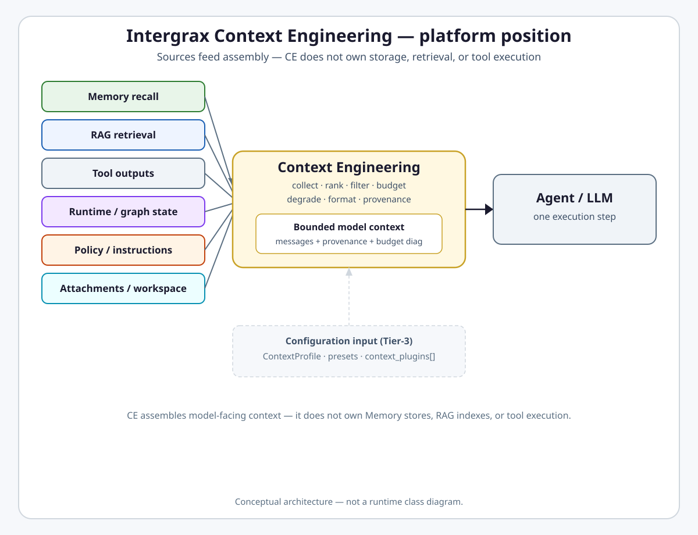
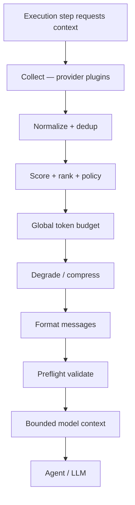

# Context Engineering

**Intergrax Context Engineering** is the platform domain that assembles the right information for each model call — selecting, ranking, and fitting inputs from Memory, RAG, tools, and runtime state into a bounded, attributable model context.

## Why it matters

Large language models have a finite context window. A single execution step can draw on session history, long-term memory, RAG hits, tool outputs, graph priors, policy overlays, attachments, workspace context, and system instructions. You cannot dump everything in, let every agent concatenate prompts by hand, exceed the model window, lose provenance, or skip mandatory policy context.

Context Engineering solves this as a **deterministic, policy-aware assembly pipeline**: collect candidate fragments from source domains, normalize and score them, apply policy and mandatory constraints, allocate a **global input token budget**, degrade or compress on overflow, format model messages, validate preflight, and emit provenance and events.

CE is **not** a memory store, document retriever, prompt registry, LLM adapter, storage layer, or a single `ContextCompiler` class. It **orchestrates** what reaches the model for **this execution step**.

> [!NOTE]
> **Maturity boundary:** Context assembly is **strongly implemented** on ACP and graph hot paths (`ContextCompiler`, `ContextEngine.assemble()`), but coverage is **not uniform** across all execution surfaces. UAEP session `build_context` remains **partial / hybrid**; `ContextOrchestrator` is limited mainly to the codebase preset; **TOKEN-CE-1B** and **TOKEN-CE-2** are **planned**; **CTX-UCL-3** contracts are **READY_FOR_REVIEW** — not full repository lookup or artifact execution. Historical audit labels such as **L3+ engine** or **production-ready** are **not** equivalent to taxonomy **P4** — see [Current maturity](#current-maturity).

**Primary audience:** Principal / Staff engineers, harness integrators, and extension authors wiring context profiles and providers — after the platform overview in the root README.

## At a glance

| Concern | Summary |
| -------- | -------- |
| **Responsibility** | Model-facing context assembly for one execution step — collect, rank, budget, format, provenance |
| **Inputs** | Memory recall, RAG hits, tool outputs, graph/runtime state, policy overlays, attachments, workspace reads, system instructions |
| **Core pipeline** | COLLECT → NORMALIZE → SCORE → FILTER → RANK → BUDGET → COMPRESS/DEGRADE → FORMAT → VALIDATE → EMIT |
| **Budget authority** | One global input token budget per model invocation (derived from adapter window minus output reserve) |
| **Output** | `ChatMessage[]` / `AssembledContext` with provenance, budget diagnostics, assembly events |
| **Provenance** | Every included/excluded fragment traceable to `source_id`, `source_type`, degradation step |
| **Memory relation** | Consumes recall outputs via providers — does not own stores or lifecycle |
| **RAG relation** | Consumes retrieval hits via providers — does not own ingest or indexes |
| **UCL relation** | CE owns model-facing assembly and global budget; UCL owns broader durable lifecycle, revisions, artifact reuse (Nexus-coordinated) |
| **Maturity** | Four-axis statement in [Current maturity](#current-maturity) — uneven hot-path coverage; no public production qualification |
| **Go deeper** | [Engineering canon](#engineering-canon) · [extended satellite](satellites/CONTEXT_ENGINEERING_extended_depth.md) · [plan](../maintainers/plans/CONTEXT_ENGINEERING.md) |

## Flagship architecture visual

<picture>
  <source media="(prefers-color-scheme: dark)" srcset="assets/context-engineering-platform-position-dark.svg">
  <source media="(prefers-color-scheme: light)" srcset="assets/context-engineering-platform-position-light.svg">
  
</picture>

Source domains feed Context Engineering; CE does not own their persistence or retrieval. Tier-3 `ContextProfile` and plugin configuration shape assembly — CE still owns the pipeline.

## Context Engineering vs Memory vs RAG

| System | Core question | Owns |
| ------ | ------------- | ---- |
| **Memory** | What should the system remember across execution boundaries? | Persisted stores, lifecycle, consolidation, retention, recall semantics |
| **RAG** | What approved external knowledge should be retrieved? | Document/corpus ingest, `knowledge` index domain, retrieval service, provider contracts |
| **Context Engineering** | What information should be placed into the model context now? | Fragment collection, budgeting, degradation, provenance on assembly |

```text
Memory              → What should the system remember across execution boundaries?
RAG                 → What approved external knowledge should be retrieved?
Context Engineering → What information should be placed into the model context now?
```

**Hard boundary:** CE consumes Memory and RAG outputs as **fragments** — it does not replace either domain.

## Context Engineering vs Unified Context Lifecycle

These domains cooperate but are **not** interchangeable.

### Context Engineering

Answers: **what information should enter the model context for this execution step**, under budget, ordering, provenance, and policy constraints.

- Collect, select, rank, and format fragments.
- **Single global input budget authority** per model invocation.
- Final model-facing `ChatMessage[]` and preflight validation.
- Assembly provenance and `CONTEXT_ASSEMBLED` events.

### Unified Context Lifecycle (UCL)

Answers: **how durable conversation context is versioned, compacted, and reused** across turns — ledger, revisions, artifact lookup/reservation, durable compaction modes.

- Memory owns durable ledger and revision pointers.
- Nexus coordinates ephemeral assembly and durable compaction decisions.
- Token Optimization executes approved transformations on `CREATE_ARTIFACT`.
- CE supplies `ContextPlan` requirements and deterministic lookup inputs — **CE does not perform artifact repository lookup itself**.

**Rule:** UCL is **not** a replacement for CE, and CE is **not** the owner of the full durable lifecycle. See [`UNIFIED_CONTEXT_LIFECYCLE.md`](UNIFIED_CONTEXT_LIFECYCLE.md) for UCL canon. **CTX-UCL-3** (`ContextPlan`, structured session history) is **READY_FOR_REVIEW** in the CE plan — that status does **not** mean full UCL execution lifecycle is complete from the CE delivery perspective.

## Context Engineering is a compiler, not concatenation

Naive prompt building looks like string joins:

```text
history + rag + tools + prompt
```

Context Engineering runs a **recorded, policy-aware pipeline** (logical stages — not necessarily separate runtime services):

```text
COLLECT
→ NORMALIZE
→ SCORE
→ FILTER
→ RANK
→ BUDGET
→ COMPRESS / DEGRADE
→ FORMAT
→ VALIDATE
→ EMIT
```

Each stage has deterministic semantics: deduplication keys, scoring dimensions, mandatory-first ranking, `DegradationLadder` steps, adapter-aware token preflight, and provenance on include/exclude decisions. Agents and Tier-3 hosts configure **what sources are available**; CE decides **what fits** under the global budget.

## How Context Engineering works

At a high level, every assembly for one model call follows this path:

1. **Request** — an execution step (ACP step, graph node, or transitional UAEP path) requests context via `ContextAssemblyRequest`.
2. **Collect** — registered `ContextSourceProvider` plugins gather candidate `ContextFragment` values from Memory, RAG, tools, graph priors, policy, workspace, and other sources.
3. **Normalize** — schema version, dedup keys, `content_hash`; remove duplicates.
4. **Score and rank** — relevance, freshness, confidence; step-aware boosts; mandatory fragments first.
5. **Policy** — `BEFORE_CONTEXT_BUILD` hooks, thresholds, poisoning rules, required/excluded sources.
6. **Budget** — global token allocation from `llm_adapter.context_window_tokens` minus output reserve.
7. **Degrade / compress** — `DegradationLadder` and optional compression stages handle overflow per implemented semantics.
8. **Format** — `ChatMessage[]` or `AgentContextBundle.message` for the adapter.
9. **Validate** — `verify_context_preflight` — never-overflow boundary before the adapter.
10. **Emit** — `CONTEXT_ASSEMBLED` v2, provenance records, optional OTel spans when wired.



**Hot-path reality (as-built):** ACP uses `ContextCompiler` via `compile_service` before LLM; graph uses full `ContextEngine.assemble()` when engine + `llm_adapter` are wired; UAEP session path remains **partial / hybrid** (not yet universal `assemble()`). Details: [Engineering canon §2](#2-production-readiness-verdict-2026-06-12-post-ce-ext).

## Responsibility boundaries

### Context Engineering owns

- Context assembly request semantics (`ContextAssemblyRequest`, step identity).
- Provider collection orchestration and plugin catalog routing.
- Ranking, scoring, filtering, and mandatory-first selection.
- **Global context budget** allocation and `DegradationLadder` semantics.
- Formatting into model messages and adapter preflight validation.
- Assembly provenance and canonical context-related events (`CONTEXT_ASSEMBLED` v2).
- `ContextPlan` contract surface and budget-policy inputs for UCL integration.

### Context Engineering does not own

- Persistence of Memory stores or consolidation lifecycle — [`MEMORY.md`](MEMORY.md).
- RAG ingestion, indexing, or retrieval service — [`RAG.md`](RAG.md).
- Tool execution or workspace mutation — [`TOOLS.md`](TOOLS.md).
- Business authorization or application policy persistence.
- LLM provider implementation or adapter vendor semantics.
- Durable UCL ledger, revision activation, or artifact repository — [`UNIFIED_CONTEXT_LIFECYCLE.md`](UNIFIED_CONTEXT_LIFECYCLE.md).
- Application business semantics — Tier-3 configures via `ContextProfile`.

### Applications (Tier-3) configure

- `ContextProfile`, `ContextEnginePreset`, `context_plugin_ids`, and host wiring bridges.
- Which builtin and custom providers are enabled per deployment.

## Relationship to Intergrax

| Neighbor | Relationship |
| -------- | ------------- |
| [`MEMORY.md`](MEMORY.md) | Supplies recall fragments; CE assembles under budget |
| [`RAG.md`](RAG.md) | Supplies retrieval hits; CE injects into the LLM window |
| [`UNIFIED_CONTEXT_LIFECYCLE.md`](UNIFIED_CONTEXT_LIFECYCLE.md) | UCL coordinates durable lifecycle; CE owns model-facing assembly and global budget |
| [`TOOLS.md`](TOOLS.md) | Tool outputs enter as fragments via `ToolOutputContextProvider` |
| [`NEXUS_EXECUTION_FLOW.md`](NEXUS_EXECUTION_FLOW.md) | Turn/step narrative; Nexus invokes assembly on hot paths |
| [`UNIFIED_EXECUTION_RUNTIME.md`](UNIFIED_EXECUTION_RUNTIME.md) | Policy overlays and guardrail context |
| [`MODALITY.md`](MODALITY.md) | Attachment / media summaries within budget |
| [`OBSERVABILITY.md`](OBSERVABILITY.md) | Event spine for `CONTEXT_ASSEMBLED` and candidate events |
| [`AGENT_CONTRACTS_AND_ASSEMBLY.md`](AGENT_CONTRACTS_AND_ASSEMBLY.md) | Prompt registry / system instructions provider surface |
| [`intergrax_runtime_architecture.md`](intergrax_runtime_architecture.md) | Platform hub — CE is a Tier-1 domain |

## Extensibility

CE follows the same catalog pattern as other Intergrax plugin libraries:

| Surface | Role | Guide |
| ------- | ---- | ----- |
| `ContextSourceProvider` | Collect fragments per source domain | [`CONTEXT_PLUGIN_AUTHOR_GUIDE.md`](../technical/guides/CONTEXT_PLUGIN_AUTHOR_GUIDE.md) |
| `ContextPlugin` bundle | Providers + optional ranker/allocator/formatter/validator | same |
| `register_context_plugin()` | Host and third-party registration | same |
| `bootstrap_context_catalog()` | Shipped builtin catalog (13 providers) | [`EXTENSION_AUTHOR_GUIDE.md`](../technical/guides/EXTENSION_AUTHOR_GUIDE.md) |
| `ContextProfile` / presets | Tier-3 configuration root | engineering canon §6 |
| Custom `ContextEngine` | Optional full engine override per preset | satellite §8 |

Builtin provider inventory and wiring detail: [`satellites/CONTEXT_ENGINEERING_extended_depth.md`](satellites/CONTEXT_ENGINEERING_extended_depth.md) §8.

## Current maturity

Architecture maturity: **A4**  
Implementation maturity: **I3**  
Production readiness: **P2**  
Evidence maturity: **E3**

- **A4** — Canonical domain pair with normative contracts (`ContextFragment`, `ContextAssemblyRequest`, assembly pipeline), [ADR-CTX-001](../technical/adr/entries/2026-06-12/ADR-CTX-001.md), mapped boundaries to Memory, RAG, and UCL; CE-EXT and CE-ALIGN closeouts ([plan](../maintainers/plans/CONTEXT_ENGINEERING.md)).
- **I3** — Core assembly works on ACP (`ContextCompiler` hot path) and graph (`DefaultNexusContextEngine.assemble()` when wired); unified plugin catalog and CE-PROV-WIRE builtins shipped. **Non-uniform coverage:** UAEP session path **partial / hybrid**; `ContextOrchestrator` **L2** (codebase preset only); **TOKEN-CE-1B** runtime wiring and **TOKEN-CE-2** regression gates **planned**; OTel on compile path **L2.5**. Not I4/I5 domain-wide.
- **P2** — Internal/lab deployment with documented hybrid paths; historical audit **production-ready** wording refers to the **budgeted assembly spine** on qualified hot paths, **not** taxonomy **P4** (no CE-domain production handoff, SLO/runbook package, or public production qualification).
- **E3** — Unit/gate evidence (`evaluate_context_engineering()`, wiring checks, integration tests on ACP/graph paths), audit slice, ADRs. No dedicated public proof route — not E4/E5.

> **Legacy vs taxonomy:** Historical **L3+ engine / L3 control plane** labels in [§2](#2-production-readiness-verdict-2026-06-12-post-ce-ext)–[§3](#3-maturity-score-audit-map-l0l4) map primarily to **A4** and **E2–E3** — they do **not** automatically imply **P4** or uniform **I4**.

### Capability coverage (summary)

| Area | Status |
| ---- | ------ |
| ACP LLM path — `ContextCompiler` | **Live** — `StepLLMRouter` + `compile_service` |
| Graph path — `ContextEngine.assemble()` | **Live** when engine + `llm_adapter` wired |
| UAEP session `build_context` | **Partial / hybrid** — not universal full `assemble()` |
| Plugin catalog + 13 builtins | **Shipped** — CE-PROV-WIRE |
| Step-aware assembly (`step_kind`, events) | **Shipped** on ACP/graph |
| Workspace / codebase preset | **MVP** — workspace provider + orchestrator on codebase preset |
| `ContextOrchestrator` interactive loop | **L2** — codebase preset only |
| TOKEN-CE-1B / TOKEN-CE-2 | **Planned** — helper-only optimizer exists (TOKEN-CE-1A Done) |
| CTX-UCL-3 (`ContextPlan`, session snapshot) | **READY_FOR_REVIEW** — no repository lookup or artifact execution |
| Public production qualification | **Not claimed** — no CE entry in [`docs/project/proofs/`](../proofs/) |

## Evidence / proof

Context Engineering evidence is **engineering- and qualification-oriented** — there is **no** dedicated public proof route in [`docs/project/proofs/`](../proofs/) comparable to RAG's LKW catalog.

| Evidence class | What exists | What it does not prove |
| -------------- | ----------- | ---------------------- |
| Architecture | This hub, ADR-CTX-001, domain pair, audit slice | Production operation |
| Unit / gate | `evaluate_context_engineering()`, wiring scripts, preflight token checks | Full harness E2E on every path |
| Integration / hot-path | ACP compile path, graph assemble tests, CE-PROV-WIRE provider collect | UAEP full parity; universal SLO |
| Public product proof | **None** for CE domain | Do not infer CE qualification from RAG/LKW proofs that merely consume assembled context |
| Production / customer | **None** cited for CE domain | Not E5 |

Audit slice: [`guides/audit_slices/CONTEXT_ENGINEERING.md`](../technical/guides/audit_slices/CONTEXT_ENGINEERING.md).

## Go deeper

| Depth | Route |
| ----- | ----- |
| **Engineering canon** | [Below](#engineering-canon) — pipeline contracts, tier placement, legacy qualification |
| **Extended depth** | [`satellites/CONTEXT_ENGINEERING_extended_depth.md`](satellites/CONTEXT_ENGINEERING_extended_depth.md) — plugin system §8+, wiring maps |
| **Implementation plan** | [`maintainers/plans/CONTEXT_ENGINEERING.md`](../maintainers/plans/CONTEXT_ENGINEERING.md) |
| **ADR** | [ADR-CTX-001](../technical/adr/entries/2026-06-12/ADR-CTX-001.md) · [ADR-MEM-001](../technical/adr/entries/2026-06-08/ADR-MEM-001.md) (Context Compiler budget semantics) |
| **Plugin authoring** | [`CONTEXT_PLUGIN_AUTHOR_GUIDE.md`](../technical/guides/CONTEXT_PLUGIN_AUTHOR_GUIDE.md) |
| **Audit** | [`audit/CONTEXT_ENGINEERING.md`](../maintainers/audit/CONTEXT_ENGINEERING.md) · [audit slice](../technical/guides/audit_slices/CONTEXT_ENGINEERING.md) |
| **Related domains** | [`MEMORY.md`](MEMORY.md) · [`RAG.md`](RAG.md) · [`UNIFIED_CONTEXT_LIFECYCLE.md`](UNIFIED_CONTEXT_LIFECYCLE.md) |
| **Target architecture** | [`IDEAL_HARNESS_AI_ARCHITECTURE.md`](../technical/guides/IDEAL_HARNESS_AI_ARCHITECTURE.md) §16 |

---

## Maintainer and Cursor context

**Status:** Canonical architecture (domain pair 1:1); **CTX-UCL-3** ready for review (`ContextPlan`, structured session history, deterministic lookup inputs — no repository lookup or artifact execution)  
**Hub:** [`intergrax_runtime_architecture.md`](intergrax_runtime_architecture.md)  
**Plan (1:1):** [`plan/CONTEXT_ENGINEERING.md`](../maintainers/plans/CONTEXT_ENGINEERING.md)  
**Target:** [`IDEAL_HARNESS_AI_ARCHITECTURE.md`](../technical/guides/IDEAL_HARNESS_AI_ARCHITECTURE.md) §16  
**Audit layer:** 16 (Context Engineering)  
**Audit instruction:** [`audit/CONTEXT_ENGINEERING.md`](../maintainers/audit/CONTEXT_ENGINEERING.md)  
**ADR:** [`ADR-CTX-001`](../technical/adr/entries/2026-06-12/ADR-CTX-001.md) · [`ADR-MEM-001`](../technical/adr/entries/2026-06-08/ADR-MEM-001.md) (Context Compiler budget semantics)  
**Related:** [`architecture/MEMORY.md`](MEMORY.md) (stores + lifecycle) · [`architecture/UNIFIED_CONTEXT_LIFECYCLE.md`](UNIFIED_CONTEXT_LIFECYCLE.md) (single budget authority + lifecycle) · [`architecture/RAG.md`](RAG.md) (retrieval) · [`architecture/TOOLS.md`](TOOLS.md) (tool outputs) · [`architecture/NEXUS_EXECUTION_FLOW.md`](NEXUS_EXECUTION_FLOW.md) (turn narrative) · [`architecture/OBSERVABILITY.md`](OBSERVABILITY.md) (event spine) · [`guides/AGENT_CREATION_GUIDE.md`](../technical/guides/AGENT_CREATION_GUIDE.md) Appendix L  
**Third-party extension / developer guide:** [`guides/CONTEXT_PLUGIN_AUTHOR_GUIDE.md`](../technical/guides/CONTEXT_PLUGIN_AUTHOR_GUIDE.md) (implementation workflow) · [`guides/EXTENSION_AUTHOR_GUIDE.md`](../technical/guides/EXTENSION_AUTHOR_GUIDE.md) (catalog routing)  
**Implementation (as-built):** `intergrax/context` · `intergrax/runtime/nexus/context` · `intergrax/runtime/architecture/context_engineering.py` · `intergrax/contracts/context_assembly.py` · `applications/_shared/context_*`  
**Last architecture pass:** 2026-06-17 — **Full Harness LC** (re-validates iteration III); CE-LLM-X doc sync

### Cursor read scope (token budget)

**Do not read this entire file in one session** (CONTEXT_ENGINEERING canon).

- **Implement / audit default:** context assembly engine + scoring (§1–§7). Extended §8+: [`satellites/CONTEXT_ENGINEERING_extended_depth.md`](satellites/CONTEXT_ENGINEERING_extended_depth.md).
- **Use** table of contents below — `Read` with offset/limit per §.
- **Plan hub:** [`plan/CONTEXT_ENGINEERING.md`](../maintainers/plans/CONTEXT_ENGINEERING.md) (scoped §6 only).
- **Audit slice:** [`guides/audit_slices/CONTEXT_ENGINEERING.md`](../technical/guides/audit_slices/CONTEXT_ENGINEERING.md).
- **Max reads:** at most **one** file >5k tokens per session unless RESUME cites more.

### Architecture satellites (read on demand)

Large § blocks moved out of the architecture hub to reduce Cursor context use.
Load **only** the satellite matching your task or cited §.

| Satellite | Contents |
|-----------|----------|
| [`satellites/CONTEXT_ENGINEERING_extended_depth.md`](satellites/CONTEXT_ENGINEERING_extended_depth.md) | extended depth (§8+) |

> **Cursor context budget:** read hub read-scope block + **at most one** satellite per session.

---

## Engineering canon

Authoritative technical specification (§1–§7). Public front section above; extended depth in the [satellite](satellites/CONTEXT_ENGINEERING_extended_depth.md) (§8+).

> **Legacy maturity note:** [§2](#2-production-readiness-verdict-2026-06-12-post-ce-ext) and [§3](#3-maturity-score-audit-map-l0l4) use historical **L0–L4 audit-map** labels from the 2026-06-12 qualification pass. They are **not** equivalent to the four-axis **A/I/P/E** statement in [Current maturity](#current-maturity). Translate using [`MATURITY_TAXONOMY.md`](../technical/guides/MATURITY_TAXONOMY.md).

## 1. Purpose

Context Engineering (CE) is the **Tier-1 Harness engine** that decides **what information reaches the LLM** at a given execution step: which fragments to include, in what order, under what token budget, with full provenance and observability.

CE is **not** a memory store. It **consumes** outputs from:

| Source domain | What CE receives |
|---------------|------------------|
| [`MEMORY`](MEMORY.md) | Session history, LTM search hits, task KV reads (via providers) |
| [`RAG`](RAG.md) | Retrieved chunks + citations |
| [`TOOLS`](TOOLS.md) | Tool result blocks, workspace reads |
| [`ORCHESTRATION`](ORCHESTRATION.md) | Graph prior outputs, shared task context, delegation summaries |
| [`UNIFIED_EXECUTION_RUNTIME`](UNIFIED_EXECUTION_RUNTIME.md) | Policy overlays, system instructions, guardrail context |
| [`REASONING_AND_COGNITION`](REASONING_AND_COGNITION.md) | Optional `objective` / plan slice for step-aware ranking |
| [`MODALITY`](MODALITY.md) | Attachment / media summaries within budget |

**Rules:**

- Tier-2 agents MUST NOT hand-assemble production prompts from unbounded history.
- Tier-3 configures CE via `ContextProfile` and optional **plugin registration** — not agent imports of Nexus internals.
- Vendor-specific retrieval stays in Tier-0 (RAG); CE orchestrates **injection into the LLM window**.

```text
Tier-3 ContextProfile + ContextEnginePreset + context_plugins[]
  → context_runtime_bridge / context_wiring
  → ContextEngine.assemble(ContextAssemblyRequest)
  → messages_for_llm + AssembledContext (provenance, budget diag)
  → CoreLLMStep / Agent.run step
```

---

## 2. Production readiness verdict (2026-06-12, post CE-EXT)

> **Taxonomy relabel:** “**production-ready**” in this table describes the **2026-06-12 audit verdict** for the budgeted assembly spine — not taxonomy **P4**. See [Current maturity](#current-maturity) for the four-axis statement.

| Question | Answer |
|----------|--------|
| Is CE **production-ready** as a **budgeted assembly spine**? | **Yes — L3+ engine / L3 control plane** (UAEP/ACP hybrid compile paths remain; see §8.3 satellite) |
| Is **`ContextCompiler` on the production hot path**? | **Yes (ACP)** — `StepLLMRouter` + `compile_service` before LLM; **Yes (graph)** when `ContextEngine` + `llm_adapter` wired; **Partial (UAEP)** — session `build_context` not yet full `assemble()` |
| Is there a **unified plugin catalog**? | **Yes** — `intergrax/context` + `bootstrap_context_catalog()` + `BuiltinContextPlugin` (13 providers) |
| Is **step-aware** assembly implemented? | **Yes (ACP/graph events)** — `step_kind` / `step_index` on `ContextAssemblyRequest` + `context_assembly.v2`; ranker boosts by step |
| Is **workspace/codebase** context production-grade? | **Yes (MVP)** — workspace provider + FORMAT merge + orchestrator on graph codebase preset |
| Observability on assembly path? | **L3** — unified `CONTEXT_ASSEMBLED` v2 (CE-3.11); `CONTEXT_CANDIDATE_*` on engine assemble when `event_bus` wired (CE-9.1); OTel span shim + `check_context_otel_span_registry.py` |
| Can authors register custom providers without forking Nexus? | **Yes** — `register_context_plugin()` + `context_plugin_ids` on `ContextProfile` |

**Remaining:** deferred CE-9.5/9.6, CE-10.4–10.5, CE-12.1–12.3 — see satellite §16.

---

## 3. Maturity score (audit map L0–L4)

> **Not A/I/P/E:** This table uses the historical **audit-map L0–L4** scale. For the canonical four-axis maturity statement, see [Current maturity](#current-maturity).

| Dimension | Score | Notes |
|-----------|-------|-------|
| Control plane (`ContextProfile`, bridges, wiring) | **L3** | CTX + `context_presets.py` + `check_context_engine_wiring.py` |
| Global budget / never-overflow | **L3** | `ContextCompiler` on ACP LLM path + graph engine assemble; UAEP session path hybrid; preflight uses `adapter.count_messages_tokens` (M-LLM-X.3 / CE-LLM-X) |
| Provenance + assembly events | **L3** | `CONTEXT_ASSEMBLED` v2 with `engine_id` + `step_kind`; graph + UAEP aligned (CE-3.11) |
| Quality scoring (relevance/freshness/confidence) | **L3** | `DefaultContextRanker` + `evaluate_context_engineering()` gate (CE-10.1) |
| Plugin extensibility | **L3** | Catalog + FORMAT merge + **CE-PROV-WIRE** live collect for all §8.4 builtins (handle-gated where noted) |
| Step-aware selection | **L3** | ACP `AgentStepContext` + ranker table; graph uses `node.capability` as `step_kind` |
| Codebase-scale preset | **L3** | `CodebaseContextEngine` + workspace provider; 1k-file gate test |
| Interactive multi-hop context loop | **L2** | `ContextOrchestrator` on codebase preset only (CE-8) |
| OTel on compile hot path | **L2.5** | Span registry + engine shim; full OTel SDK wiring optional |
| Regression / drift gates | **L2.5** | `context_regression_benchmark.py`; preset baselines deferred (CE-10.4) |

**Overall:** **L3+ engine / L3 control plane** — CE-EXT S0–S12 complete; **L4** adaptive ranking deferred to [`ADAPTIVE_HARNESS_INTELLIGENCE.md`](ADAPTIVE_HARNESS_INTELLIGENCE.md).

---

## 4. Design principles

| Principle | Meaning in Intergrax |
|-----------|---------------------|
| **Compiler, not concatenation** | CE runs a deterministic pipeline with recorded stages — not string joins in agent code |
| **Budget-first** | Global input token budget derived from `llm_adapter.context_window_tokens` minus output reserve |
| **Step-scoped** | Assembly is keyed by **execution step** (UAEP step index or graph node + phase) — **Done** (CE-4) |
| **Source-agnostic plugins** | Each fragment has a `ContextSourceProvider`; Memory is one provider among many |
| **Provenance everywhere** | Every included/excluded fragment traceable to `source_id`, `source_type`, `degradation_step` |
| **Policy-governed** | `BEFORE_CONTEXT_BUILD` hooks + `pre_context_policy_audit` — no silent policy bypass |
| **Observable by default** | Events, structured logs, spans on collect/rank/budget/format — not optional debug |
| **Environment-driven** | `ContextProfile` on `ApplicationEnvironmentProfile` — Tier-3 owns presets |
| **Fail-safe degradation** | [`DegradationLadder`](MEMORY.md) order normative — never silent overflow |
| **Agents stay dumb about window** | Agents declare *needs* (`required_context_sources` on contract — future); CE satisfies |

---

## 5. Domain boundaries

| Concern | Owner | CE role |
|---------|-------|---------|
| Persist facts | MEMORY | Read via `MemoryContextProvider` |
| Retrieve documents | RAG | Read via `RagContextProvider` |
| Execute actions | TOOLS | Read tool output blocks via `ToolOutputContextProvider` |
| Graph priors | ORCHESTRATION | `ContextManager` / `GraphPriorContextProvider` |
| Prompt assets | AGENT_CONTRACTS (Prompt Registry) | `SystemInstructionsProvider` |
| Policy text | UAEP | `PolicyOverlayProvider` |
| **Compose LLM window** | **CONTEXT_ENGINEERING** | **Owns entire read-path orchestration** |

**Anti-pattern:** documenting CE inside MEMORY Layer C long-term — Layer C spec lives **here**; MEMORY links to this doc for read-path.

---

## 6. Tier placement

```text
Tier-0  intergrax/context/              contracts, plugins, ranker, dedup, orchestrator (CE-1 — shipped)
Tier-1  intergrax/runtime/nexus/context/  DefaultNexusContextEngine, ContextManager, ContextCompiler
Tier-3  applications/_shared/context_*      profile bridges, presets, wiring
```

| Component | Tier | Rationale |
|-----------|------|-----------|
| `ContextEngine`, `DefaultNexusContextEngine`, `CodebaseContextEngine` | 1 | Nexus turn-critical (CE-3 — shipped) |
| `ContextCompiler`, `DegradationLadder` | 1 | Budget allocator on ACP + engine assemble paths |
| `ContextSourceProvider` Protocol | 0 / providers | `intergrax/context/providers` + app entry points |
| `context/quality.py` (scoring) | 0 | Shared types; shim in `context_engineering.py` |
| `ContextProfile` | 3 contract | Environment composition root |

---

## 7. Core domain model

### 7.1 Context fragment lifecycle

```text
ContextAssemblyRequest
  → COLLECT   (providers emit ContextFragment candidates)
  → NORMALIZE (schema_version, dedup keys, content_hash)
  → SCORE     (relevance, freshness, confidence → composite)
  → FILTER    (thresholds, policy, poisoning rules)
  → RANK      (mandatory first, then score desc)
  → BUDGET    (token allocation + degradation ladder)
  → COMPRESS  (summarize tiers, semantic compression flag)
  → FORMAT    (ChatMessage[] or AgentContextBundle.message)
  → VALIDATE  (preflight never-overflow + citation requirements)
  → EMIT      (events, spans, trace records)
```

### 7.2 Primary types (Tier-0 contracts — CE-1 shipped)

```python
# intergrax/context/contracts.py

class ContextFragmentSource(str, Enum):
    TASK_MESSAGE = "task_message"
    SYSTEM_INSTRUCTIONS = "system_instructions"
    SESSION_HISTORY = "session_history"
    SESSION_HISTORY_SEMANTIC = "session_history_semantic"  # MEM-VEC-2.4 — episodic vector recall hits
    LONGTERM_MEMORY = "longterm_memory"
    RAG = "rag"
    WEBSEARCH = "websearch"
    TOOL_OUTPUT = "tool_output"
    GRAPH_PRIOR = "graph_prior"
    SHARED_CONTEXT = "shared_context"
    ATTACHMENT = "attachment"
    POLICY_OVERLAY = "policy_overlay"
    WORKSPACE = "workspace"
    CUSTOM = "custom"

@dataclass(frozen=True)
class ContextFragment:
    fragment_id: str
    source: ContextFragmentSource
    source_id: str              # stable id for provenance
    content: str
    token_estimate: int
    relevance_score: float      # 0..1
    freshness_score: float
    confidence_score: float
    mandatory: bool             # never drop unless hard trim
    metadata: dict[str, Any]    # citations, path, line_range, tool_call_id
    content_hash: str           # dedup

@dataclass(frozen=True)
class ContextAssemblyRequest:
  """What CE needs to assemble context for ONE model call."""
    trace_id: str
    run_id: str
    task_id: str
    tenant_id: str
    # Step identity (CE-4)
    assembly_scope: Literal["uaep_turn", "graph_node", "delegation_child", "acp_step"]
    step_index: int | None
    graph_node_id: str | None
    step_kind: str | None         # e.g. plan | tool_call | synthesize | explore
    objective: str                # current sub-goal (may differ from full task message)
    # Policy
    decision_profile: ContextDecisionProfile
    budget_policy: ContextBudgetPolicy
    assembly_options: TaskContextAssemblyOptions
    # Capability hints
    required_sources: frozenset[ContextFragmentSource]
    excluded_sources: frozenset[ContextFragmentSource]
    # Runtime handles (injected by Nexus — not serialized)
    runtime_config: RuntimeConfig  # via context var / engine ctx — not in logs

@dataclass(frozen=True)
class AssembledContext:
    messages: list[ChatMessage]
    fragments_included: list[ContextFragment]
    fragments_excluded: list[tuple[ContextFragment, str]]  # reason
    provenance: list[ContextProvenance]
    total_tokens: int
    budget_tokens: int
    degradation_steps: tuple[str, ...]
    schema_version: str = "assembled_context.v1"
```

### 7.3 As-built types (today)

| Type | Module | Status |
|------|--------|--------|
| `ContextCandidate` | `context_compiler_models.py` | **Shipped** — message-index based |
| `AgentContextBundle` | `context_manager.py` | **Shipped** — graph path |
| `ContextProvenance` | `context_models.py` | **Shipped** |
| `ContextChunkSignal` | `context_engineering.py` | **Shipped** — quality eval only |
| `ContextAssemblyRequest` | `intergrax/context/contracts.py` | **Shipped** — step fields populated on ACP/graph (CE-4) |
| `ContextFragment` | `intergrax/context/contracts.py` | **Shipped** |
| `ContextPluginRegistry` | `intergrax/context/registry.py` | **Shipped** |
| `AgentContextHints` | `intergrax/contracts/agent_context_hints.py` | **Shipped** (CE-5.1) |

---
