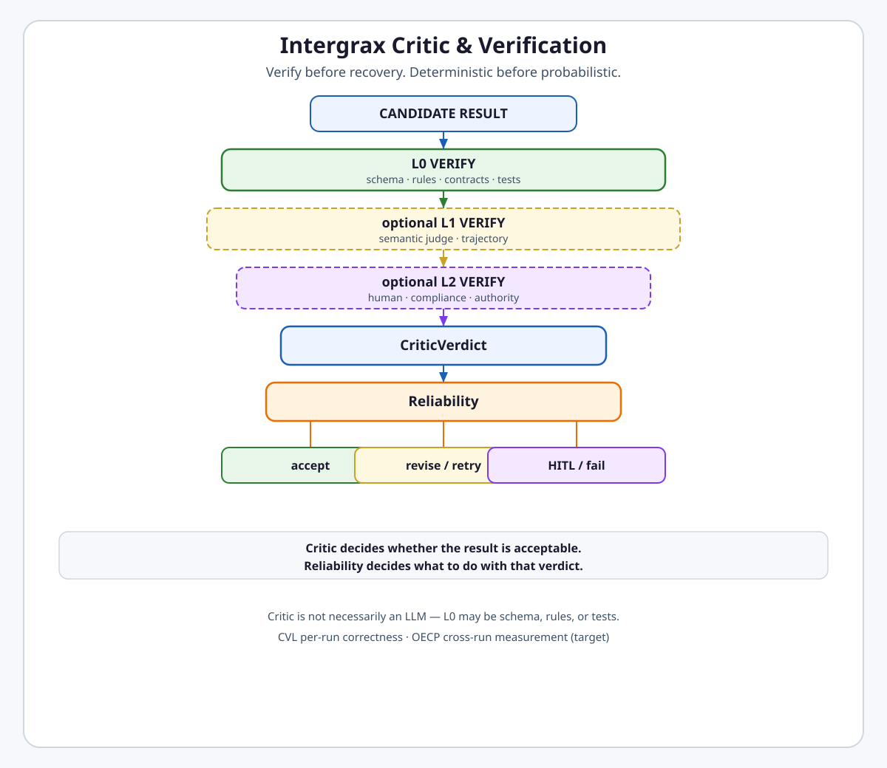
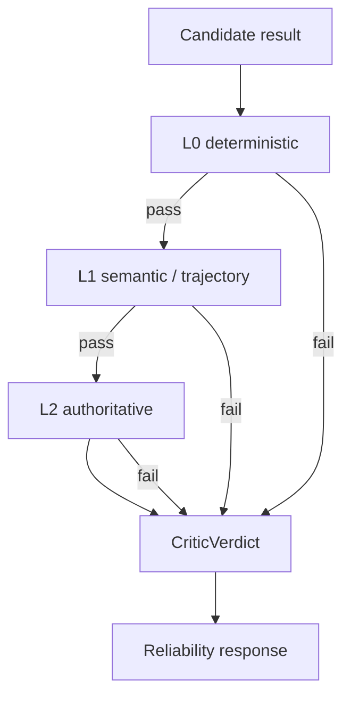

# Critic & Verification

**Intergrax Critic & Verification** is the governed correctness layer that composes deterministic, semantic, and authoritative checks into a typed verdict before the runtime accepts or recovers from an agent result.

The Critic answers **„czy wynik jest poprawny?”** — structurally, procedurally, and (when configured) semantically. It is **not** a synonym for „drugi LLM”: a critic may be a schema validator, rule engine, semantic judge, trajectory scorer, or human authority.

> [!NOTE]
> **Maturity boundary:** Core CVL contracts, `CriticOrchestrator`, L0/L1/L2 composition, `eval.judge`, heuristic `eval.trajectory`, evaluator-loop routing, and graph wiring are **implemented** on the Nexus harness path. Production-grade semantic-judge calibration, durable L2 operator service, LLM trajectory judge in the default runtime path, and OECP code phases are **not** claimed. See [Current maturity](#current-maturity).

**Primary audience:** Principal / Staff engineers, harness integrators, and Tier-2/3 authors configuring critic profiles, rubrics, and evaluation posture.

---

## Why it matters

Without the Critic & Verification Layer (CVL):

- structurally invalid output can look like success,
- the producing agent self-reports correctness,
- expensive LLM judges check what schema validation could reject first,
- business rubrics leak into Nexus core,
- every agent invents its own critic loop,
- the critic itself launches unbounded retry,
- runtime verification mixes with offline benchmarks,
- OECP looks like a second verification runtime,
- human review sampling and runtime HITL are conflated.

CVL provides **typed primitives, orchestration, telemetry, and policy gates** so agents and applications compose domain-specific critics safely.

**Harness owns how verification runs. Domain/application owns what correctness means.**

---

## At a glance

| Concern | Summary |
| -------- | -------- |
| **Verification question** | Is this partial or final output correct? |
| **L0** | Deterministic — schema, rules, contracts, tests (`NexusValidationEngine`) |
| **L1** | Probabilistic semantic — `eval.judge`; heuristic process — `eval.trajectory` (profile-controlled) |
| **L2** | Authoritative — human/compliance gate via `ESCALATE_HITL` (profile-controlled) |
| **Orchestrator** | `CriticOrchestrator` — L0 → optional L1 → optional L2 with short-circuit |
| **Verdict** | `CriticVerdict` — `passed`, per-layer `LayerVerdict`, `recommended_action`, `failure_reasons` |
| **Producer / critic separation** | Canon requires distinct judge LLM; wired when `critic_llm_profile` is set — not runtime-rejected if unset |
| **Activation** | `CriticProfile` (per-run) + `EvaluationProfile` (offline/registry/shadow) |
| **Evaluator loop** | `EvaluatorLoopExecutor` — bounded critique→revise routing, not global retry |
| **Trajectory** | `eval.trajectory` shipped (heuristic); `eval.trajectory_judge` skill-only / backlog |
| **Runtime vs offline** | Graph CVL affects active run; `NexusEvalRunner` / shadow / CI gates do not |
| **OECP boundary** | CVL emits per-run verdicts; OECP cross-run measurement is **target** ([`OBSERVABILITY.md`](OBSERVABILITY.md)) |
| **Reliability boundary** | Critic emits verdict; Reliability chooses accept / revise / retry / HITL / fail |
| **Governance boundary** | Authorization ≠ correctness; passing critic does not authorize forbidden side effects |
| **Observability boundary** | `CriticTraceEmitter` records `critic.*` steps when wired — not every path emits `RuntimeEvent` |
| **Maturity** | **A4 / I4 / P2 / E3** — see [Current maturity](#current-maturity) |

---

## Flagship architecture visual

<picture>
  <source media="(prefers-color-scheme: dark)" srcset="assets/critic-verification-stack-dark.svg">
  <source media="(prefers-color-scheme: light)" srcset="assets/critic-verification-stack-light.svg">
  
</picture>

> **Critic decides whether the result is acceptable. Reliability decides what to do with that verdict.**

```text
Candidate result
      ↓
L0 deterministic verification
schema / rules / contracts / tests
      ↓ pass
optional L1 semantic verification
judge / trajectory / ValidatorAgent
      ↓ pass
optional L2 authoritative verification
human / compliance / HITL
      ↓
CriticVerdict
      ↓
Reliability
├── accept
├── revise / retry
├── HITL
└── fail
```

> **Verify before recovery. Deterministic before probabilistic.**

---

## How verification works

1. **Candidate produced** — agent node, graph finalization, UAEP step, or offline eval case yields output to verify.
2. **L0 always first when enabled** — `CriticOrchestrator` runs `L0Gateway` → `NexusValidationEngine` (and optional guardrail merge). Hard fail short-circuits before L1.
3. **Optional L1** — when `CriticProfile.semantic_judge_enabled` / `trajectory_eval_enabled`, `L1Gateway` invokes `eval.judge` and/or `eval.trajectory` through Tier-0 `ToolRuntime` — never direct vendor SDK bypass on the wired path.
4. **Optional L2** — when `l2_human_required`, `L2Gateway` returns a pending authoritative verdict mapped to `ESCALATE_HITL` (does not block synchronously on human input).
5. **Combined verdict** — `CriticVerdict` with per-layer results and `recommended_action` hint.
6. **Recovery is downstream** — Reliability / graph executor / policy engine respond; CVL does not own unbounded retry.



Not every run enables all layers. Default graph wiring includes L0 when critic scopes are active; L1/L2 are **policy-controlled**.

---

## Responsibility boundaries

| Domain | Owns | Does not own |
| ------ | ---- | ------------ |
| **Critic / CVL** | Correctness verdict, layer orchestration, critic trace steps | Global retry/recovery, authorization, cross-run regression store |
| **Reliability** | Response to verdict — retry, revise route, HITL, fail | Whether output is correct |
| **Governance** | Authorization for consequential actions | Correctness of agent output |
| **Observability / HOS** | Canonical evidence visibility, trace/journal | Critic rubric content |
| **OECP** | Cross-run evaluation / regression / release evidence (**target**) | Per-run critic orchestration |
| **Domain / Tier-2 / Tier-3** | Rubric, validation rules, correctness criteria | How verification layers compose |

```text
Harness  → orchestration, thresholds, evidence hooks, gates
Domain   → rubric, validation rules, correctness criteria
```

### Public invariants

```text
Critic decides correctness. Reliability decides recovery.
```

```text
Governance authorization ≠ verification correctness.
```

```text
Deterministic checks run before probabilistic checks when both are enabled.
```

```text
Critic is not necessarily an LLM.
```

```text
Runtime verification ≠ offline evaluation ≠ shadow evaluation.
```

```text
CVL ≠ OECP.
```

---

## Relationship to Intergrax

| Neighbor | Relationship |
| -------- | ------------- |
| [**Reliability**](RELIABILITY_FAILURE_AND_HITL.md) | Consumes critic fail / quality signals; owns bounded recovery |
| [**Governed Execution**](GOVERNED_EXECUTION.md) | `RuntimePolicyEngine.evaluate_critic_verdict` — DENY when completion critic required and failed |
| [**Observability**](OBSERVABILITY.md) | `CriticTraceEmitter` → trace steps / optional `RuntimeEvent` bridge; OECP consumes HOS |
| [**Nexus Execution Flow**](NEXUS_EXECUTION_FLOW.md) | Graph partial/final validation hooks; profile-driven semantic completion |
| [**Unified Execution Runtime**](UNIFIED_EXECUTION_RUNTIME.md) | Host profiles supply `CriticProfile` / `EvaluationProfile` |
| [**Tools**](TOOLS.md) | `eval.judge`, `eval.trajectory` catalog tools via `ToolRuntime` |

---

## Runtime vs offline vs shadow

| Mode | Affects active run? | Purpose | Primary mechanism |
| ---- | ------------------- | ------- | ----------------- |
| **Runtime CVL** | yes | Current result correctness | `CriticOrchestrator` via `CriticGraphHooks` |
| **Offline eval** | no | Benchmark / system evaluation | `NexusEvalRunner`, golden datasets |
| **Shadow eval** | no | Observe candidate quality without changing outcome | `record_shadow_observation` → `OnlineEvaluationRegistry` |

**Shadow eval** records observations for trend comparison; it does **not** gate the active user run.

---

## CVL vs OECP

| Concern | CVL (this domain) | OECP ([`OBSERVABILITY.md`](OBSERVABILITY.md)) |
| ------- | ----------------- | --------------------------------------------- |
| Scope | Per-run / per-step correctness | Cross-run measurement, regression, release evidence |
| Output | `CriticVerdict`, validation results | Evidence records, eval snapshots (**target**) |
| Persistence | Emits through HOS / trace; optional registry observations | Evidence Ledger + Eval Registry v2 (**planned**) |
| Gating | L0/L1/L2 within a run | Trace completeness, regression gates across runs (**target**) |

CVL **emits** verdicts and observations. OECP **will** store, compare, and gate across runs — it does **not** replace critic orchestration today.

---

## Current maturity

Aligned with [MATURITY_TAXONOMY.md](../technical/guides/MATURITY_TAXONOMY.md):

| Axis | Level | Rationale |
| ---- | ----- | --------- |
| **Architecture (A)** | **A4** | L0/L1/L2 boundaries and Reliability/Governance/OECP ownership stable; producer/critic separation is canon + wiring, not universally enforced |
| **Implementation (I)** | **I4** | Orchestrator, verdict contract, semantic judge, trajectory heuristic, evaluator loop, graph wiring, profiles, registry shipped |
| **Production (P)** | **P2** | Wired on harness path; no durable L2 operator service; human sample queue in-process; CI release gate ≠ live customer verification; FLOW-8 reference host backlog |
| **Evidence (E)** | **E3** | Unit/gate coverage on orchestrator, judge, loop, fail-closed; no representative full-harness E4 proof in public routes |

### Sub-maturity (honest, not averaged)

| Slice | Posture |
| ----- | ------- |
| Runtime L0 verification | Implemented on graph path |
| Semantic L1 (`eval.judge`) | Implemented; quality not production-calibrated |
| L2 / human | Routing to HITL implemented; durable operator workflow not claimed |
| Offline / shadow eval | Implemented with file-backed registry option |
| OECP | Architecture documented; code phases planned |

---

## Evidence / proof

| Class | Artifacts |
| ----- | --------- |
| **Architecture** | This hub · [`satellites/CRITIC_VERIFICATION_extended_depth.md`](satellites/CRITIC_VERIFICATION_extended_depth.md) |
| **Unit / gate** | `tests/unit/runtime/critic/` · `tests/unit/tools/providers/eval/` |
| **Integration** | `tests/unit/runtime/critic/test_critic_graph_wiring.py` · `tests/integration/eval/test_nexus_eval_runner.py` |
| **Public proof** | No dedicated CVL row in [`PROOFS.md`](../proofs/PROOFS.md) — bounded eval paths only |
| **Production / customer** | Not claimed |

---

## Go deeper

| Depth | Route |
| ----- | ----- |
| Engineering canon | [Below](#engineering-canon) |
| Extended depth | [`satellites/CRITIC_VERIFICATION_extended_depth.md`](satellites/CRITIC_VERIFICATION_extended_depth.md) |
| Implementation plan | [`maintainers/plans/CRITIC_VERIFICATION.md`](../maintainers/plans/CRITIC_VERIFICATION.md) |
| Reliability recovery | [`RELIABILITY_FAILURE_AND_HITL.md`](RELIABILITY_FAILURE_AND_HITL.md) |
| Observability / OECP | [`OBSERVABILITY.md`](OBSERVABILITY.md) |
| Governance | [`GOVERNED_EXECUTION.md`](GOVERNED_EXECUTION.md) |
| Maturity taxonomy | [`MATURITY_TAXONOMY.md`](../technical/guides/MATURITY_TAXONOMY.md) |

---

## Engineering canon

### 1. Purpose

Define the **Critic & Verification Layer (CVL)** — the Harness AI subsystem that answers:

> **Is this partial or final agent output actually correct — structurally, procedurally, and (when configured) semantically?**

CVL completes the **Plan → Execute → Verify (PEV)** loop. It **does not** embed domain business rules in Nexus. It provides **typed primitives, orchestration hooks, telemetry, and policy gates** so agents and applications compose domain-specific critics safely.

**Strategic positioning:** The Harness owns **how** verification runs; agents and applications own **what** is verified.

---

### 2. Problem statement (pre-CRIT-V gaps — closed)

| Gap (pre-CRIT-V) | Status |
| ------------------ | ------ |
| No universal semantic judge primitive (`eval.judge`) | **Done** — `tools/providers/eval/judge.py` + `L1Gateway` |
| No trajectory evaluation contract | **Done** — `eval.trajectory` (heuristic process scoring) |
| Evaluator-loop catalog only | **Done** — `EvaluatorLoopExecutor` + graph wiring |
| `NexusEvalRunner` exact-match only | **Done** — optional `semantic_match_enabled` + `eval.judge` |
| L0→L1→L2 stack not explicit | **Done** — `CriticOrchestrator` |
| Evaluation layer maturity L2 only | **Done** — CRIT-V uplift |

**Remaining depth (non-blocking):** L4 adaptive critic thresholds (AHIA), LLM trajectory judge in default runtime path (`eval.trajectory_judge` skill), FLOW-8 product reference host — plan backlog §CVL-Backlog.

---

### 3. Terminology

| Term | Meaning in Intergrax |
| ---- | -------------------- |
| **Critic** | Any component that produces a scored verdict on output or trajectory |
| **Verification** | Harness-orchestrated application of critics with policy consequences |
| **L0 critic** | Deterministic — schema, rules, contract, executable tests |
| **L1 critic** | Probabilistic semantic — LLM-as-judge, trajectory heuristic, ValidatorAgent |
| **L2 critic** | Authoritative — human expert, compliance sign-off, audit gate |
| **Partial verification** | After a graph node, subtask, or UAEP step milestone |
| **Final verification** | Before task terminal state (`COMPLETED`, `PARTIALLY_COMPLETED`) |
| **Evaluator-loop** | Multi-iteration critique→revise pattern until pass or budget exhausted |
| **CVL** | Critic & Verification Layer — platform subsystem (this document) |

**Not CVL:** Adaptive profile promotion (`VerificationLoop` in `runtime/adaptive`) — complementary; consumes CVL/registry signals but serves L4 adaptation, not per-run correctness.

---

### 4. Design principles

1. **Reuse before create** — extend `NexusValidationEngine`, `ValidationResult`, `OnlineEvaluationRegistry`, `EvaluationProfile`, `ReplayEngine`; no parallel eval store.
2. **L0 before L1** — when both are enabled, `CriticOrchestrator` runs L0 first and short-circuits on hard failure. Vendor **llm_guardrail** scans compose into L0 via `merge_guardrail_l0` when `guardrail_scan` is present in critic context ([`INTEGRATIONS.md`](INTEGRATIONS.md)).
3. **Judge separation** — critic LLM profile **should** differ from producer agent profile (`critic_llm_profile` / `critic_llm_profile_ref`). Wired via `resolve_critic_llm_adapter`; falls back to producer adapter when unset.
4. **Opt-in by policy** — LLM-judge never mandatory on every run; `CriticProfile` + `EvaluationProfile` control activation.
5. **Trace when wired** — `CriticTraceEmitter` emits `critic.*` steps to trace writer and optionally `RuntimeEventBus`.
6. **Tier discipline** — Nexus orchestrates; Tier-2 supplies rubrics and ValidatorAgents; Tier-3 selects profiles and datasets.
7. **Fail closed on high risk** — when `require_critic_on_completion` is set and critic unavailable or failed → validation blocked / policy DENY, not silent pass.

---

### 5. Separated competencies (tier model)

#### 5.1 Responsibility matrix

| Concern | Tier-0 Platform | Tier-1 Nexus / CVL | Tier-2 Agent | Tier-3 Application |
| ------- | --------------- | ------------------ | ------------ | ------------------- |
| `ValidationResult` contract | defines | consumes | extends via `validate()` | — |
| Structural validation (L0) | rules engine | `NexusValidationEngine` via `L0Gateway` | `AgentContract.validation_rules` | `NexusPlan.validation_criteria` |
| Semantic judge primitive (L1) | `eval.judge` tool, rubric schema | `CriticOrchestrator` / `L1Gateway` | rubric content, ValidatorAgent | enable + thresholds |
| Trajectory evaluation (L1) | `eval.trajectory` tool | hook after step/graph | domain step expectations | scenario definitions |
| Evaluator-loop execution | pattern + budget types | `EvaluatorLoopExecutor` | revise logic in worker agent | graph_spec nodes |
| Registry & trends | `OnlineEvaluationRegistry` | post-run bridge | — | `EvaluationProfile`, CI baselines |
| Release / adaptive gates | closeout scripts | `VerificationLoop` (L4) | — | `require_baseline_for_release` |
| HITL escalation (L2) | policy primitives | `L2Gateway` → `ESCALATE_HITL` | interrupt reasons | approval policy |
| Golden datasets | runner contracts | `NexusEvalRunner` | eval cases | asset paths |
| Domain correctness | — | — | **primary owner** | orchestration + policy |

#### 5.2 What Harness MUST NOT do

- Encode domain rubrics (“is this legal clause acceptable?”) in Tier-1.
- Force LLM-judge on every run regardless of `CriticProfile`.
- Replace ValidatorAgents with a monolithic platform critic.
- Bypass `NexusValidationEngine` for graph nodes on the wired CVL path.

#### 5.3 What agents/applications MUST NOT do

- Implement parallel verification stores outside `OnlineEvaluationRegistry`.
- Call vendor LLM SDKs directly for judging (use `eval.judge` / `ToolRuntime`).
- Skip L0 validation and rely solely on LLM self-assessment.

---

### 6. Three-layer critic stack (L0 / L1 / L2)

| Layer | Mechanism | Typical latency | When required |
| ----- | --------- | --------------- | ------------- |
| **L0 — Deterministic** | `NexusValidationEngine`, schema, `Agent.validate()`, exec tests, guardrail merge | ms | Default when critic scopes enabled |
| **L1 — Semantic** | `eval.judge` via `L1Gateway` | seconds | `CriticProfile.semantic_judge_enabled` |
| **L1 — Trajectory** | `eval.trajectory` (heuristic trace scoring) | seconds | `CriticProfile.trajectory_eval_enabled` (final scope) |
| **L2 — Authoritative** | `L2Gateway` → `ESCALATE_HITL` | minutes–hours | `l2_human_required` or borderline L1 + policy |

**Combined verdict (as implemented):** orchestrator short-circuits on first failing enabled layer; `CriticVerdict.passed` reflects whether all **enabled** layers passed.

**`NexusValidationEngine` relationship:** remains the structural/deterministic validator. CVL **composes** it through `L0Gateway` — CVL does not replace core Nexus validation.

---

### 7. Core contracts and orchestration

#### 7.1 `CriticOrchestrator`

Canonical CVL entry for partial and final verification when graph hooks are wired.

```text
CriticRequest
  → CriticOrchestrator.verify()
  → L0_DETERMINISTIC → L1_SEMANTIC → L1_TRAJECTORY → L2_HUMAN (enabled layers only)
  → CriticVerdict
```

- Short-circuits on first layer failure.
- Never calls LLM directly — L1 delegates to Tier-0 tools.
- UAEP and offline-case scopes use the same orchestrator with different `CriticScope`.
- Standalone `NexusValidationEngine` calls outside CVL may still exist; they compose into L0 when CVL is active.

#### 7.2 `CriticVerdict`

| Field | Semantics |
| ----- | --------- |
| `scope` | `node_partial`, `graph_final`, `uaep_step`, `offline_case` |
| `passed` | All enabled layers passed |
| `layers` | Per-layer `LayerVerdict` — `layer`, `passed`, `score`, `errors`, `warnings` |
| `recommended_action` | `continue`, `retry`, `revise`, `escalate_hitl`, `fail` — hint for downstream routing |
| `failure_reasons` | Aggregated error strings |

#### 7.3 `CriticProfile` vs `EvaluationProfile`

| Profile | Role |
| ------- | ---- |
| **`CriticProfile`** | Current-run verification posture — scopes, L1/L2 flags, thresholds, `require_critic_on_completion`, `evaluator_loop_max_iterations`, `critic_llm_profile_ref` |
| **`EvaluationProfile`** | Offline/registry/shadow posture — `shadow_eval_enabled`, `online_registry_enabled`, `offline_eval_runner_enabled`, `require_baseline_for_release` |

#### 7.4 `eval.judge`

```text
candidate output + RubricSpec
  → eval.judge (ToolRuntime)
  → structured score / passed / reasons
```

- Input: `EvalJudgeInput` — `output_text`, `rubric_id`, `criteria`, `min_score`, optional `reference_context`.
- Uses `LLMAdapter` from critic tool wiring context (`build_critic_tool_wiring_context`).
- Optional observation append to `OnlineEvaluationRegistry` via `eval.record_observation`.

#### 7.5 Producer / critic LLM separation

```text
producer profile ≠ critic profile   (canon + recommended wiring)
```

- `resolve_critic_llm_adapter` prefers `CriticProfile.critic_llm_profile` when set.
- When unset, judge uses producer adapter — **not** runtime-rejected.
- Assembly validation (`validate_critic_wiring`) checks wiring consistency, not model identity inequality.

#### 7.6 `require_critic_on_completion`

When `CriticProfile.require_critic_on_completion` is true:

| Condition | Behavior |
| --------- | -------- |
| Verdict failed | `critic_completion_blocked` → `ValidationResult.valid=False` |
| Semantic judge enabled but L1 client missing | Same fail-closed path |
| Policy engine | `RuntimePolicyEngine.evaluate_critic_verdict` → `PolicyAction.DENY` |

Does **not** silently accept completion on the high-risk configured path.

#### 7.7 Evaluator loop vs Reliability retry

```text
EvaluatorLoopExecutor  → revise candidate within graph budget
Reliability retry      → recover execution after failure/verdict
```

- `EvaluatorLoopSpec.max_iterations` default **2** (profile `evaluator_loop_max_iterations`, max 16).
- Routes `REVISE` to `revise_node_id` when `recommended_action` is `revise`/`retry` and budget remains.
- `escalate_on_exhaustion` default **true** → HITL when budget exhausted.
- Does **not** replace global `RetryEngine` / `ResiliencePolicy`.

#### 7.8 Trajectory evaluation

| Symbol | State |
| ------ | ----- |
| **`eval.trajectory`** | **Shipped** — heuristic scoring from run trace (tool errors, denials, duplicate patterns) |
| **`eval.trajectory_judge`** | **Skill-only / documented** — `trajectory_judge_skill_id(use_judge=True)`; not default runtime path (CVL-BACKLOG-01) |

Do not describe `eval.trajectory` as an LLM trajectory judge.

#### 7.9 `ValidatorAgent`

Tier-2 semantic critic option — domain-authored rubric and validation logic. Platform supplies orchestration hooks; it does not embed business-domain rubric content.

---

### 8. Evaluation ecosystem (non-runtime primary path)

#### 8.1 `OnlineEvaluationRegistry`

Append-only store for harness online/shadow observations:

- `InMemoryOnlineEvaluationRegistry` — tests
- `FileOnlineEvaluationRegistry` — `build/architecture_hardening/online_evaluation_observations.json`

**Not** the OECP Evidence Ledger. Feeds trend comparison and automated eval reports.

#### 8.2 `NexusEvalRunner`

Offline benchmark runner via `NexusLoop` + `UnifiedTaskRunner`. Optional `semantic_match_enabled` uses the same `eval.judge` client as CVL. Does **not** change an active user run outcome.

#### 8.3 Human review sample queue

`HumanReviewSampleQueue` — **in-process FIFO** for evaluation/shadow sampling workflows (`AUDIT-IDEAL-25.2`). **Not** runtime HITL that gates the current run.

#### 8.4 Context / RAG release gate

`check_product_release_eval_gate.py` — **CI / release evidence** gate running context golden + eval scenario checks (`AUDIT-IDEAL-25.3`). Classify as offline/release evaluation, not per-run CVL.

---

### 9. Verification safety boundaries

Anchor for cross-doc links (e.g. [`NEXUS_EXECUTION_FLOW.md`](NEXUS_EXECUTION_FLOW.md)):

| Boundary | Rule |
| -------- | ---- |
| Critic → Reliability | Verdict only; recovery owned by Reliability |
| Critic → Governance | Correctness ≠ authorization |
| Critic → Observability | Verdict/observations emitted when trace emitter wired |
| CVL → OECP | Per-run evidence now; cross-run store/regression **target** |
| Runtime → offline/shadow | Only runtime CVL may block active completion |

---

### 10. Current implementation state (as-built)

| Component | State |
| --------- | ----- |
| `CriticVerdict` / `CriticRequest` / `LayerVerdict` | Shipped |
| `CriticProfile` / `EvaluationProfile` | Shipped in host profiles |
| `CriticOrchestrator` + L0/L1/L2 gateways | Shipped |
| `NexusValidationEngine` integration | Via `L0Gateway` |
| `eval.judge` | Shipped via `ToolRuntime` |
| Producer/critic separation | Wiring when profile set; fallback allowed |
| `eval.trajectory` | Shipped (heuristic) |
| `eval.trajectory_judge` | Skill manifest + path helper; not default runtime |
| `EvaluatorLoopExecutor` | Shipped |
| Graph critic hooks | `validate_node_with_critic`, `validate_final_with_critic` |
| `require_critic_on_completion` | Fail-closed when configured |
| `OnlineEvaluationRegistry` | Shipped (memory + file) |
| `NexusEvalRunner` + semantic match | Shipped |
| Shadow eval | `record_shadow_observation` |
| Human review sample queue | In-process implementation + gate script |
| Context/RAG release gate | CI gate script |
| OECP code phases | Planned per Observability hub |

---

## Maintainer and Cursor context

**Status:** Canonical architecture (domain pair 1:1)  
**Hub:** [`intergrax_runtime_architecture.md`](intergrax_runtime_architecture.md)  
**Plan (1:1):** [`maintainers/plans/CRITIC_VERIFICATION.md`](../maintainers/plans/CRITIC_VERIFICATION.md)  
**Target:** [`IDEAL_HARNESS_AI_ARCHITECTURE.md`](../technical/guides/IDEAL_HARNESS_AI_ARCHITECTURE.md)  
**Audit layers:** 25 (verify depth)  
**Platform audit:** [`docs/audit_results/AUDIT_PROTOCOL.md`](../../audit_results/AUDIT_PROTOCOL.md)  
**Last updated:** 2026-08-18 — DOC-3R hub modernization; P2-ARCH-08 verification safety boundaries; CRIT-V + CVL-LC slices reconciled

### Cursor read scope (token budget)

**Do not read this entire file in one session.**

- **Implement / audit default:** CVL contracts + orchestrator + wiring (§6–§10). Extended depth: [`satellites/CRITIC_VERIFICATION_extended_depth.md`](satellites/CRITIC_VERIFICATION_extended_depth.md).
- **Plan hub:** [`maintainers/plans/CRITIC_VERIFICATION.md`](../maintainers/plans/CRITIC_VERIFICATION.md) — scoped §6 / open backlog only.
- **Max reads:** at most **one** file >5k tokens per session unless RESUME cites more.

### Architecture satellites (read on demand)

| Satellite | Contents |
| --------- | -------- |
| [`satellites/CRITIC_VERIFICATION_extended_depth.md`](satellites/CRITIC_VERIFICATION_extended_depth.md) | Extended critic/eval depth |

> **Cursor context budget:** read hub read-scope block + **at most one** satellite per session.
