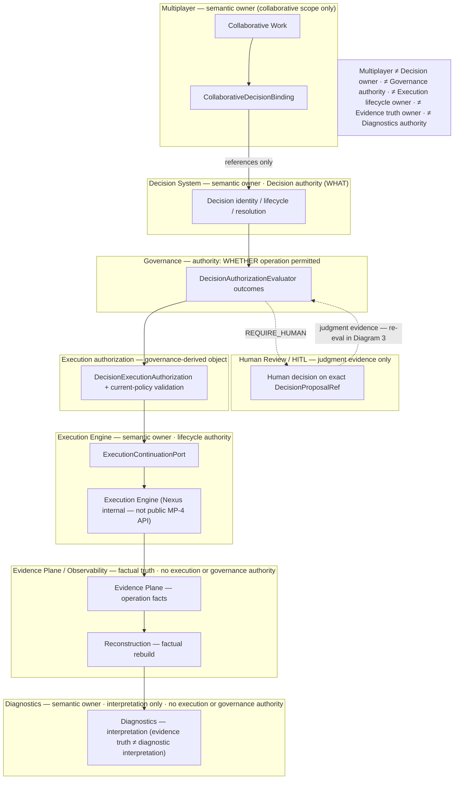
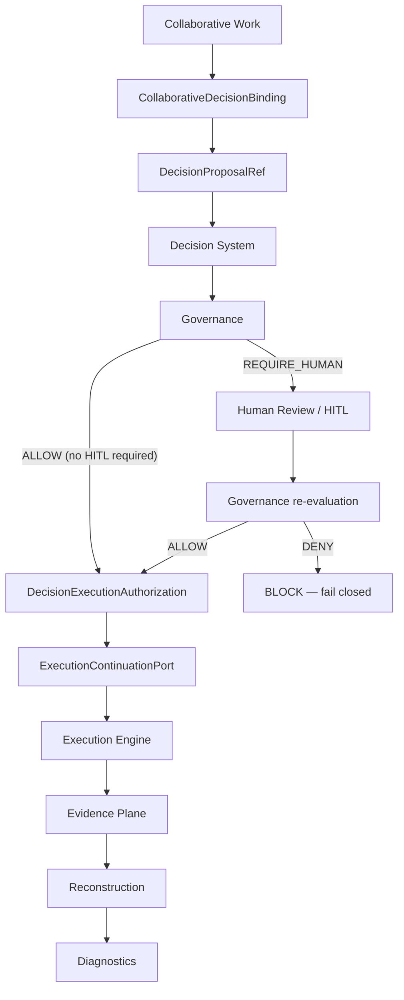
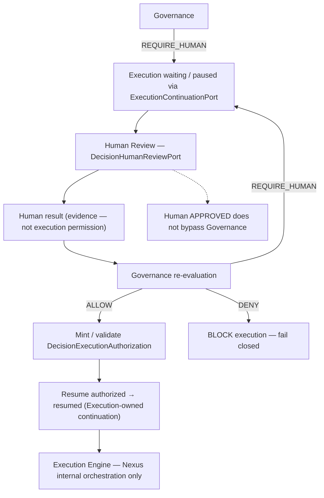
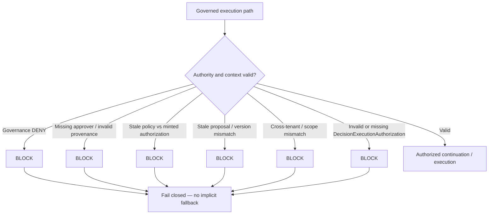
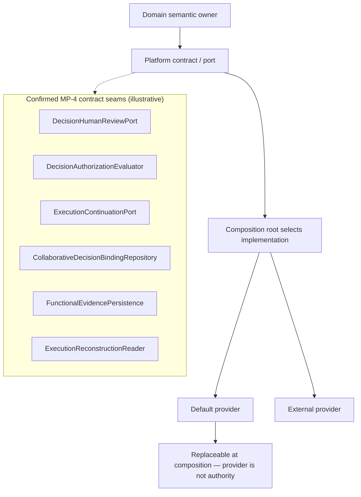

<!--
© Artur Czarnecki. All rights reserved.
Intergrax is source-available under the Intergrax Evaluation and Collaboration License 1.0.
See LICENSE for permitted evaluation, collaboration, and contribution use.
-->

# Decision / Approval / Governance — Multiplayer integration (MP-4)

**Status:** **MP-4 — FORMALLY CLOSED** · **MP-4R0…MP-4R8 CLOSED** · **MP-4D1 — CLOSED** · **MP-4D2 — CLOSED** · **MP-4D3 — CLOSED** · **MP-4D4 — NEXT**
**ADR:** [ADR-MP-009](../technical/adr/entries/2026-09-15/ADR-MP-009.md) (authoritative after MP-4R0) · [ADR-MP-005](../technical/adr/entries/2026-09-08/ADR-MP-005.md) (MP-4A historical; ownership table superseded)
**Feature coordination:** [`MULTIPLAYER_AI`](../capabilities/architecture/MULTIPLAYER_AI.md) · [`COLLABORATIVE_WORK`](COLLABORATIVE_WORK.md)
**Plan (execution/status only):** [`plan/DECISION_APPROVAL_GOVERNANCE.md`](../maintainers/plans/DECISION_APPROVAL_GOVERNANCE.md)

---

## How to read this architecture

**This file is the canonical MP-4 integration architecture entry point (SSOT).** Read it first for ownership, authority chain, contracts, pluginability, E2E qualification scope, and known limitations. Open adjacent domain documents only when you need subsystem internals — not to reconstruct MP-4 from scattered summaries.

| Reader question | Canonical document | Why open it |
| ----------------- | ------------------ | ----------- |
| Decision identity, lifecycle, resolution, finalization | [`DECISION_SYSTEM.md`](DECISION_SYSTEM.md) | Decision System owns Decision truth and lifecycle specification |
| Governance outcomes, HITL workflow, governed execution | [`GOVERNED_EXECUTION.md`](GOVERNED_EXECUTION.md) | Governance/HITL SSOT for ALLOW / DENY / REQUIRE_HUMAN |
| Execution identity, lifecycle, internal Nexus | [`UNIFIED_EXECUTION_ARCHITECTURE.md`](UNIFIED_EXECUTION_ARCHITECTURE.md) | Execution Engine SSOT; Nexus is internal only |
| WorkItem, Assignment, WorkArtifact | [`COLLABORATIVE_WORK.md`](COLLABORATIVE_WORK.md) | Collaborative Work primitives SSOT |
| Evidence Plane facts and persistence contracts | [`OBSERVABILITY.md`](OBSERVABILITY.md) | Factual evidence SSOT |
| Diagnostic interpretation (not authority) | [`DIAGNOSTICS.md`](DIAGNOSTICS.md) | Interpretation SSOT |
| MP-4 program status, slice proof, maintainer tasks | [`plan/DECISION_APPROVAL_GOVERNANCE.md`](../maintainers/plans/DECISION_APPROVAL_GOVERNANCE.md) | Execution plan — not a second architecture SSOT |
| Cross-layer Multiplayer capability summary | [`MULTIPLAYER_AI`](../capabilities/architecture/MULTIPLAYER_AI.md) | Coordination hub — not a copy of this architecture |
| ADR ownership rebase | [ADR-MP-009](../technical/adr/entries/2026-09-15/ADR-MP-009.md) | Normative ownership after MP-4R0 |

**SSOT rules (documentation):**

```text
This file                          → MP-4 integration architecture SSOT
DECISION_SYSTEM.md                 → Decision internals SSOT
GOVERNED_EXECUTION.md              → Governance / HITL SSOT
UNIFIED_EXECUTION_ARCHITECTURE.md  → Execution lifecycle SSOT
OBSERVABILITY.md                   → Evidence Plane SSOT
DIAGNOSTICS.md                     → Diagnostic interpretation SSOT
COLLABORATIVE_WORK.md              → Collaborative primitives SSOT
maintainers/plan DECISION_*        → execution/status plan only
capabilities/MULTIPLAYER_AI*       → capability summary / cross-layer roadmap
```

**Enterprise principle (platform):**

```text
PLATFORM OPERATES ON CONTRACTS, NOT IMPLEMENTATIONS.
```

Every variable mechanism is documented as:

```text
semantic owner → platform contract / port → default implementation → composition point → external replacement seam
```

```text
default implementation ≠ semantic owner
provider ≠ authority
composition selects implementation
contract defines platform boundary
```

---

## MP-4 status and maturity

```text
MP-4 STATUS: FORMALLY CLOSED

R0–R8: CLOSED
Implementation: ENTERPRISE
Architecture: ENTERPRISE
Authority / Security: ENTERPRISE
E2E qualification: CLOSED (architectural / cross-domain — see § E2E qualification)
Documentation certification: MP-4D1–D8 (D2 consolidates this entry point)
```

**MP-4D1–D8** are **documentation and proof-closure stages only**; they **do not reopen** MP-4 implementation.

---

## Purpose

Define how **Multiplayer** integrates with canonical platform authorities for Decision, Human Review, Governance, execution authorization, Execution continuation, Evidence, and Diagnostics — **without** creating parallel lifecycle or truth sources.

MP-4R0–R8 closed the implementation program (ownership rebase, contract convergence, binding, evidence adoption, legacy removal, enterprise E2E qualification, final audit). **MP-4D2** consolidates that closed model into one readable integration architecture.

---

## Scope and non-scope

**In scope (MP-4 integration architecture):**

- Collaborative **association** between Collaborative Work and exact Decision proposals (`CollaborativeDecisionBinding`)
- Contract-first integration with Decision System, Governance/HITL, Execution continuation, Evidence, Diagnostics
- Authority chain from work context through governance to execution and observability
- Pluginability seams, persistence abstraction, fail-closed failure semantics, tenancy, E2E qualification **scope**

**Explicit non-scope (owned elsewhere — link, do not re-own here):**

| Area | Owner | MP-4 role |
| ---- | ----- | --------- |
| Decision lifecycle / resolution / finalization | Decision System | Reference exact `DecisionProposalRef` only |
| Human judgment evidence semantics | Human Review + HITL contracts | Consume ports; no second review authority |
| Governance ALLOW / DENY / REQUIRE_HUMAN | Governance | Consume evaluator outcomes |
| Pause / wait / resume lifecycle | Execution Engine via `ExecutionContinuationPort` | No Multiplayer continuation store |
| Orchestration graph / loop | Nexus (**internal** to Execution) | **No public Nexus dependency** |
| Operation execution facts | Evidence Plane | Emit/link canonical facts (MP-4R5) |
| Factual reconstruction | Evidence reconstruction readers | None — read via contracts |
| Diagnostic interpretation | Diagnostics | Read-only integration |
| Principal / membership / delegation | MP-1 Collaborative Work | Reuse |

**Hard invariants:**

```text
Multiplayer MUST NOT own a second Decision lifecycle.
Multiplayer MUST NOT own a second Approval/HITL authority.
Multiplayer MUST NOT own Execution lifecycle.
Multiplayer MUST NOT expose Nexus as a public MP-4 boundary.
Multiplayer MUST NOT own evidence truth or diagnostic interpretation.
```

---

## Executive mental model (authority chain)

```text
Collaborative Work (WorkItem / Assignment / WorkArtifact)
        ↓
CollaborativeDecisionBinding (association truth only)
        ↓
exact DecisionProposalRef
        ↓
Decision System — Decision answers WHAT (identity / version / lifecycle / resolution / finalization)
        ↓
Governance — WHETHER the operation is permitted (ALLOW / DENY / REQUIRE_HUMAN)
        ↓
Human Review / HITL when required — what a human decided about an exact proposal/version
        ↓
post-human Governance re-evaluation (Human APPROVED ≠ automatic ALLOW)
        ↓
DecisionExecutionAuthorization + current-policy validation
        ↓
ExecutionContinuationPort (pause / waiting for human / resume authorization / resumed)
        ↓
Execution Engine — execution identity + lifecycle (Nexus internal)
        ↓
Evidence Plane — operation facts
        ↓
Factual reconstruction — rebuild facts (not interpretation)
        ↓
Diagnostics — interpret facts (cannot authorize execution)
```

---

## Visual architecture layer (MP-4D3)

Diagrams below are a **visual index** of this SSOT only. They do not introduce new lifecycle stages, contracts, or authority. **Platform operates on contracts, not implementations** (see § Pluginability).

### Diagram 1 — Ownership and authority map

**Legend:** *semantic owner* · **authority** (for its concern) · *(reference only)* · *no execution/governance authority*



Human Review connects to Governance only through **post-human re-evaluation** (Diagram 3); it is not shown as a parallel authority spine on this map.

### Diagram 2 — Canonical success flow

When Governance returns **ALLOW** without **REQUIRE_HUMAN**, Human Review is omitted (straight path).



### Diagram 3 — Human Review, Governance, and continuation

**Invariant:** human approval records judgment evidence; **Human APPROVED ≠ automatic Governance ALLOW**. No public side-channel resume; Multiplayer does not own pause/resume lifecycle.



### Diagram 4 — Fail-closed paths

**Principle:** uncertainty or invalid authority state → **BLOCK EXECUTION** (no guess, fallback, or bypass).



Explicit typed **LOCAL_DEVELOPMENT** provenance may be used only where contracts already allow it; implicit fallback remains forbidden (see § Fail-closed).

### Diagram 5 — Pluginability and contract boundary

Pattern for every replaceable mechanism (examples are **existing platform contracts** from this SSOT — not new names).



Domain and integration code depend on **ports**, not on concrete providers (for example PostgreSQL behind `CollaborativeDecisionBindingRepository`).

---

## Ownership model

Frozen canonical ownership (MP-4R0+). **Multiplayer** owns collaborative binding / projection only; it does **not** own Decision, Governance, Execution lifecycle, Evidence truth, or Diagnostics authority.

| Concern | Canonical owner | Multiplayer role | Contract / surface |
| ------- | ----------------- | ---------------- | ------------------ |
| Decision identity | Decision System | References / bindings only | `DecisionId`, `DecisionVersion`, `DecisionProposalRef` — see [`DECISION_SYSTEM.md`](DECISION_SYSTEM.md) |
| Decision lifecycle | Decision System (+ host for resolution hooks) | None — no second lifecycle | `decision_lifecycle`, `decision_record`, … |
| Human review | Human Review / HITL (Decision-owned handoff semantics) | Bridge via platform ports only | `DecisionHumanReviewPort`, `HumanApproverEvidence` — `intergrax/contracts/decision_human_review.py` |
| Governance | Governance / HITL | Consume outcomes | `DecisionAuthorizationEvaluator`, `DecisionGovernanceDecision` — `intergrax/contracts/decision_authorization.py` |
| Execution authorization | Governance-derived authorization object | Consume minted authorization | `DecisionExecutionAuthorization`, validation helpers — `intergrax/contracts/decision_authorization.py` |
| Execution lifecycle | Execution Engine | `ExecutionProvenanceRef` references only | Execution identity contracts — [`UNIFIED_EXECUTION_ARCHITECTURE.md`](UNIFIED_EXECUTION_ARCHITECTURE.md) |
| Continuation | Execution Engine | None — public boundary is port only | `ExecutionContinuationPort` — `intergrax/contracts/execution_continuation.py` |
| Orchestration | Nexus (**internal**) | **No public dependency** | Not an MP-4 contract |
| Collaborative binding | Multiplayer Collaborative Work | **Owner** of association truth | `CollaborativeDecisionBinding`, `CollaborativeDecisionBindingRepository` |
| WorkItem / Assignment / WorkArtifact | Multiplayer Collaborative Work (MP-2/MP-3) | Owner | [`COLLABORATIVE_WORK.md`](COLLABORATIVE_WORK.md) |
| Evidence facts | Evidence Plane / Observability | Emit/link; not authority | `FunctionalEvidencePersistence`, `PlatformFunctionalEvidence` |
| Reconstruction | Evidence Plane reconstruction | None | `ExecutionReconstructionReader` — `intergrax/contracts/execution_reconstruction.py` |
| Diagnostics | Central Diagnostics | Read via canonical surfaces | [`DIAGNOSTICS.md`](DIAGNOSTICS.md) |

---

## Terminology (use precisely)

| Term | Meaning |
| ---- | ------- |
| **Human Review** | Canonical record of human judgment on an **exact** `DecisionProposalRef` / version — not governance outcome |
| **Governance decision** | Evaluator outcome: **ALLOW**, **DENY**, or **REQUIRE_HUMAN** for an operation under policy |
| **Execution authorization** | **`DecisionExecutionAuthorization`** — distinct object minted after governance path; must pass **current-policy validation** before continuation |
| **Continuation** | Execution-owned pause/wait/resume lifecycle exposed only via **`ExecutionContinuationPort`** |
| **Binding** | **`CollaborativeDecisionBinding`** — immutable **association truth** (WorkItem ↔ proposal); not Decision state |
| **Evidence** | **Operation facts** in the Evidence Plane — not association truth for binding |
| **Diagnostics** | **Interpretation** of reconstructed facts — not authority for execution or governance |

Do not use **approval**, **human approval**, **authorization**, and **execution permission** interchangeably without mapping to the rows above.

---

## Contract map

Primary platform contracts for MP-4 integration (names are authoritative; prefer contracts over implementation classes):

| Contract | Role | Code anchor |
| -------- | ---- | ----------- |
| `DecisionProposalRef` | Exact Decision proposal/version reference for binding and review | `intergrax/contracts/decision_record.py` |
| `DecisionHumanReviewPort` | Request/consume human review for exact proposal | `intergrax/contracts/decision_human_review.py` |
| `DecisionAuthorizationEvaluator` | Pluggable governance evaluation | `intergrax/contracts/decision_authorization.py` |
| `DecisionExecutionAuthorization` | Minted execution authorization under policy context | `intergrax/contracts/decision_authorization.py` |
| `ExecutionContinuationPort` | Pause / wait / resume lifecycle boundary | `intergrax/contracts/execution_continuation.py` |
| `CollaborativeDecisionBinding` | Association record | `intergrax/contracts/collaborative_decision_binding.py` |
| `CollaborativeDecisionBindingRepository` | Persistence port for binding truth | `intergrax/collaborative_work/repository.py` (Protocol) |
| `FunctionalEvidencePersistence` | Persist operational evidence facts | `intergrax/contracts/functional_evidence/persistence.py` |
| `ExecutionReconstructionReader` | Read model for factual reconstruction | `intergrax/contracts/execution_reconstruction.py` |

Diagnostics uses strategy/persistence ports documented in [`DIAGNOSTICS.md`](DIAGNOSTICS.md) — not duplicated here.

---

## Contract-first capability table

| Capability | Platform contract | Default implementation / composition | Replaceable? |
| ---------- | ----------------- | ------------------------------------ | -----------: |
| Decision governance evaluation | `DecisionAuthorizationEvaluator` | Wired via governed execution composition / plugins | yes |
| Human Review handoff | `DecisionHumanReviewPort` | Host/application composition selects adapter | yes |
| Execution continuation | `ExecutionContinuationPort` | Execution Engine implementation | yes (external engine must honor contract) |
| Binding repository | `CollaborativeDecisionBindingRepository` | PostgreSQL-backed provider (production-qualified separately) | yes |
| Evidence persistence | `FunctionalEvidencePersistence` | Platform functional evidence stack | yes |
| Reconstruction | `ExecutionReconstructionReader` | Evidence reconstruction pipeline | yes |
| Diagnostics | Diagnostic strategy / persistence ports | Central Diagnostics modules | yes |

**Composition ownership:** implementation selection happens at runtime **composition roots** (for example `decision_integration_composition.py`, `decision_plugin_composition.py`, collaborative work repository factory, test composition in MP-4R7) — not inside Multiplayer binding semantics.

---

## Decision System integration (WHAT — not full lifecycle spec)

**Decision answers WHAT** — identity, version, proposal material, lifecycle, resolution, and finalization. MP-4 **does not** copy the full Decision lifecycle specification; see [`DECISION_SYSTEM.md`](DECISION_SYSTEM.md).

**Integration view (phases only):**

```text
proposal → deliberation → verification/revision → adjudication → resolution → finalization → terminal
```

Multiplayer holds **`CollaborativeDecisionBinding.decision_proposal: DecisionProposalRef`** — an **exact** reference. Binding does not substitute for Decision state transitions.

Key identifiers (detail in Decision SSOT): **`DecisionId`**, **`DecisionVersion`**, **`DecisionProposalRef`**.

---

## Collaborative decision binding

**`CollaborativeDecisionBinding`** is **association truth** between Collaborative Work and a Decision proposal. It is **not** Decision state, approval state, or execution state.

**Exact references:**

- `work_item_id` (WorkItem)
- optional exact **`WorkArtifactVersionRef`**
- exact **`DecisionProposalRef`**

**Semantics:**

- **Immutable association** once persisted (frozen model)
- **Tenant / workspace scoped** — cross-tenant association is invalid (fail closed)
- **Idempotency** — replay-safe create; semantic conflict vs duplicate semantic dedup are distinct failure modes (`CollaborativeDecisionBindingIdempotencyConflict`, `CollaborativeDecisionBindingDuplicateSemantic`, …)
- **Repository port** — `CollaborativeDecisionBindingRepository` is the **source of association truth**

**Persistence abstraction:** Multiplayer integration documentation describes the **repository contract**. **PostgreSQL** is one **production-qualified provider** behind that port (MP-4R4 real-provider proof) — not “MP-4 uses PostgreSQL directly” as platform authority.

---

## Human Review

**Human Review** answers: *what did a human decide about an exact Decision proposal/version?*

Invariants:

- **Exact proposal** and **exact version** — stale proposal references fail closed
- **Typed approver provenance** (`HumanApproverEvidence`) — no synthetic identity
- **Tenant consistency** and **request correlation** (`DecisionHumanReviewRequestId`, reason codes)

Port: **`DecisionHumanReviewPort`** — see [`GOVERNED_EXECUTION.md`](GOVERNED_EXECUTION.md) and Decision human review contracts.

### Human Review ≠ Governance

```text
Human APPROVED ≠ Governance ALLOW
```

Human Review records judgment evidence. **Governance** decides whether the **operation** is permitted under **current policy**. A human approval does **not** bypass governance evaluation.

### Post-human Governance

After human review completes:

```text
Human APPROVED → post-human Governance re-evaluation → ALLOW | DENY | REQUIRE_HUMAN
```

**Not:**

```text
Human APPROVED → automatic ALLOW
```

---

## Governance

**Governance** answers: *WHETHER the operation is permitted.*

Canonical outcomes:

```text
ALLOW
DENY
REQUIRE_HUMAN
```

The **`DecisionAuthorizationEvaluator`** is **pluginable** at the composition boundary. Governance outcomes are distinct from Human Review records and from **`DecisionExecutionAuthorization`**.

Detail: [`GOVERNED_EXECUTION.md`](GOVERNED_EXECUTION.md).

---

## Execution authorization

**`DecisionExecutionAuthorization`** is a **separate canonical object** (minted under a governance policy context). Execution **must not** start or resume solely because:

```text
Decision reached a terminal state
Human approved
Governance allowed once in the past
```

Authorized continuation requires a **valid minted authorization** plus **current-policy validation**.

### Current-policy validation

```text
authorization minted under policy P1
+
current execution policy P2
→ validation fails → no resume (fail closed)
```

Helpers live with authorization contracts (`mint_validated_execution_authorization`, validation routines in `decision_authorization.py`).

---

## Execution continuation

Public lifecycle boundary: **`ExecutionContinuationPort`** (Execution Engine owns semantics).

Typical governed path:

```text
pause → waiting for human → resume authorized → resumed
```

**Identity continuity** across HITL pause/resume where canonical semantics require continuity:

```text
same TaskId
same RunId
same AttemptId
same ExecutionId
```

Changing attempt or execution identity is a **new execution**, not continuation (see execution continuation contract docstring).

**Nexus:** internal orchestration implementation inside Execution Engine — **not** a public MP-4 integration surface. Multiplayer production modules **must not** depend on Nexus types.

---

## Evidence Plane

| Store | Truth |
| ----- | ----- |
| **`CollaborativeDecisionBindingRepository`** | **Association truth** (WorkItem ↔ `DecisionProposalRef`) |
| **Evidence Plane** | **Operation execution facts** (e.g. binding-create operation outcomes) |

Association truth is **not** reconstructed from Evidence facts as authority.

### Known limitation (non-blocking)

```text
No dedicated Evidence Plane v2 fact kind for WorkItem ↔ DecisionProposalRef association itself.
```

Classification: **NON-BLOCKING PLATFORM LIMITATION** (frozen at MP-4R5). MP-4 adopts **operation outcome** evidence only.

**No semantic workaround:**

```text
no fake OUTPUT_RELATION
no fake ARTIFACT_LINEAGE
```

Future extension belongs to Evidence Plane architecture — not MP-4 reopening.

---

## Reconstruction and Diagnostics

**Factual reconstruction** rebuilds **facts** from the Evidence Plane (`ExecutionReconstructionReader`). **Diagnostics** **interprets** those facts — it does **not** authorize execution or substitute for Governance.

```text
Evidence facts → reconstruction → diagnostics interpretation
```

Diagnostics cannot authorize execution. Detail: [`DIAGNOSTICS.md`](DIAGNOSTICS.md).

---

## Fail-closed and failure precedence

| Condition | Behavior |
| --------- | -------- |
| Governance **DENY** | No execution / no authorized resume |
| Missing approver / invalid provenance | Fail closed |
| Stale policy vs minted authorization | Fail closed — no resume |
| Stale proposal / version mismatch | Fail closed |
| Cross-tenant / scope mismatch | Fail closed |
| Primary domain failure | Takes precedence over secondary evidence failure |

**Local development provenance:** explicit **`LOCAL_DEVELOPMENT`** (or equivalent typed) evidence may be supplied where contracts allow — **implicit fallback is forbidden**.

---

## Security, tenancy, and provenance

- **Tenant isolation** and **workspace scope** on bindings and authoritative references
- **Exact proposal/version binding** for Human Review and authorization correlation
- **Typed approver provenance** — no synthetic identity
- Normative invariants include **MP-INV-09** (Decision ≠ HITL) and **MP-INV-23** (approval/evidence ≠ execution authorization)

---

## Pluginability and replaceability

Replaceable seams (minimum):

```text
DecisionAuthorizationEvaluator
DecisionHumanReviewPort
ExecutionContinuationPort
CollaborativeDecisionBindingRepository
FunctionalEvidencePersistence
ExecutionReconstructionReader
Diagnostics strategy / persistence ports
```

**Anti-pattern — no god orchestrator:** types such as `MultiplayerDecisionManager`, `UnifiedDecisionExecutionService`, or `EnterpriseDecisionCoordinator` must **not** aggregate multiple **semantic authorities** (Decision + Governance + Execution lifecycle + Evidence truth).

---

## Anti-substitution rules

| Forbidden equivalence | Correct model |
| --------------------- | ------------- |
| Decision ≡ WorkArtifact / WorkItem state | Canonical Decision + optional binding |
| Human Review ≡ Governance ALLOW | Separate evidence vs governance outcomes |
| Governance ALLOW ≡ execution without authorization validation | `DecisionExecutionAuthorization` + current-policy validation |
| Evidence / Diagnostics as authority | Facts vs interpretation only |
| Binding ≡ Decision | Binding associates; Decision System owns lifecycle |
| Execution state ≡ approval state | Governance/HITL + continuation port |
| Provider implementation ≡ platform authority | Contract defines boundary; composition selects provider |

---

## E2E qualification scope (MP-4R7 — closed)

**Qualifies** architectural / cross-domain E2E using **canonical production contracts** and **test composition** where configured.

**Does not claim:** full production-deployment E2E on every real provider stack.

**Success path (documented qualification):**

```text
Collaborative Work → Decision → REQUIRE_HUMAN → Human Review → post-human Governance ALLOW
→ DecisionExecutionAuthorization → current-policy validation → ExecutionContinuationPort resume
→ protected operation → Evidence → Diagnostics
```

**Negative scenarios covered at qualification level (not full invariant→test matrix — see MP-4D4):**

```text
Governance DENY
stale policy
Human REJECT
stale proposal
cross-tenant
evidence failure (secondary)
idempotent replay / semantic conflict
process restart / continuity expectations
```

**Separate real-provider proof:** **Collaborative decision binding PostgreSQL qualification** (MP-4R4 — real PostgreSQL, concurrency, idempotency, conflict, semantic dedup).

Proof harness reference: `testing_support/mp4r7_enterprise_integration/` and architecture gates — maintainer plan for command lines.

---

## Known limitations (summary)

| Limitation | Status | Blocking? |
| ---------- | ------ | --------: |
| Binding association lacks dedicated Evidence Plane v2 fact | Accepted platform limitation | NO |
| R7 E2E uses test composition / configured providers | Documented qualification boundary | NO |
| Full provider coverage matrix | Deferred to **MP-4D5** | NO |
| Invariant → exact test matrix | Deferred to **MP-4D4** | NO |

---

## Integration boundaries (allowed cross-domain paths)

| Source | Target | Allowed integration |
| ------ | ------ | ------------------- |
| Collaborative Work | Binding repository | Create/read scoped association |
| Binding | Decision System | Reference `DecisionProposalRef` only |
| Decision / Governance | Human Review port | Exact proposal handoff |
| Governance | Execution authorization | Mint + validate authorization |
| Authorization + continuation port | Execution Engine | Resume governed execution |
| Operations | Evidence persistence | Emit operational facts |
| Evidence / reconstruction | Diagnostics | Read-only interpretation |

Forbidden for new Multiplayer production modules (retained):

- Direct `intergrax.runtime.nexus.*`, `GraphExecutor`, `NexusLoop`, `NexusIntakeRunner`
- New parallel Decision lifecycle engines / `MultiplayerDecisionEngine`
- `MultiplayerHitlEngine`, `ApprovalRuntime`, `HumanReviewRuntime` as authorities
- `EvidenceStore`, `ExecutionReconstructor`, `DiagnosticEngine` as Multiplayer-owned truth

**Reuse (mandatory):** `ExecutionContinuationPort`, Decision System contracts, Governance/HITL contracts, Evidence Plane contracts, Diagnostic read surfaces, MP-1 authority.

---

## MP-4R program roadmap (implementation — closed)

| Slice | Status |
| ----- | ------ |
| **MP-4R0** — Core rebase & supersession gate | **CLOSED** |
| **MP-4R1** — Decision contract convergence | **CLOSED** |
| **MP-4R2** — Human review / Approval convergence | **CLOSED** |
| **MP-4R3** — Execution continuation integration | **CLOSED** |
| **MP-4R4** — Collaborative decision binding | **CLOSED** |
| **MP-4R5** — Evidence Plane adoption | **CLOSED** |
| **MP-4R6** — Legacy removal & migration | **CLOSED** |
| **MP-4R7** — Enterprise integration qualification | **CLOSED** |
| **MP-4R8** — Final closure audit | **CLOSED** |

Execution detail and proof commands: [`plan/DECISION_APPROVAL_GOVERNANCE.md`](../maintainers/plans/DECISION_APPROVAL_GOVERNANCE.md).

---

## Enterprise documentation & proof closure (MP-4D)

**Does not reopen MP-4 implementation.**

| Stage | Status | Purpose |
| ----- | ------ | ------- |
| **MP-4D1** | **CLOSED** | Synchronize documentation state with closed implementation |
| **MP-4D2** | **CLOSED** | Consolidate canonical architecture into this entry point |
| **MP-4D3** | **CLOSED** | Professional visual architecture layer (Mermaid in this SSOT) |
| **MP-4D4** | **NEXT** | E2E proof / invariant-to-test matrix |
| MP-4D5 | NOT STARTED | Provider / persistence qualification matrix |
| MP-4D6 | NOT STARTED | Enterprise pluginability certification (docs) |
| MP-4D7 | NOT STARTED | Documentation regression gates |
| MP-4D8 | NOT STARTED | Final enterprise documentation audit |

Capability roadmap: [`MULTIPLAYER_AI` plan](../capabilities/plan/MULTIPLAYER_AI.md).

---

## Historical — legacy MP-4 slices

| Stary slice | Status |
| ----------- | ------ |
| MP-4A | `SUPERSEDED_BY_MP4R0` |
| MP-4B | `RETIRED` (MP-4R1) |
| MP-4C | `RETIRED` (MP-4R2) |
| MP-4D | `RETIRED` (MP-4R2) |
| MP-4E | `CANCELLED_BEFORE_START` |
| MP-4F | `CANCELLED_REPLACED_BY_EVIDENCE_ADOPTION` |
| MP-4G | `CANCELLED_IN_OLD_FORM` |
| MP-4H | `REPLACED_BY_MP4R8` |

---

## Historical — legacy inventory (post MP-4R1)

| Component | Location | Classification |
| --------- | -------- | -------------- |
| MP-4B Decision contracts (module) | `intergrax/contracts/decision.py` | **REMOVED** (MP-4R1) |
| Decision Integration namespace | `intergrax/contracts/decision/__init__.py` | **KEEP** — integration SPI only |
| Decision Integration Boundary | `intergrax/contracts/decision/integration/**` | **KEEP** |
| Integration composition | `intergrax/runtime/decision_integration_composition.py` | **KEEP** |
| Decision plugin composition | `intergrax/runtime/decision_plugin_composition.py` | **KEEP** |
| MP-4C Approval contracts | `intergrax/contracts/approval.py` | **REMOVED** (MP-4R2) |
| MP-4D Approval service | `intergrax/approval/` | **REMOVED** (MP-4R2) |
| Architecture gates | `test_mp4r0_*`, `test_mp4r1_*`, `test_mp4r2_*`, … | **KEEP** |

Human judgment for Decisions uses `DecisionProposalRef` via **`decision_human_review`**; legacy Approval workflow metadata is not platform authority.

**Decision Integration Boundary — pluginability:** engine depends on adapter/provider protocols; concrete adapters selected at composition roots; unknown provider fails closed via admission/composition policy.

---

## Related architecture documents

| Document | Role |
| -------- | ---- |
| [`DECISION_SYSTEM.md`](DECISION_SYSTEM.md) | Decision internals SSOT |
| [`GOVERNED_EXECUTION.md`](GOVERNED_EXECUTION.md) | Governance / HITL SSOT |
| [`UNIFIED_EXECUTION_ARCHITECTURE.md`](UNIFIED_EXECUTION_ARCHITECTURE.md) | Execution lifecycle; Nexus internal |
| [`OBSERVABILITY.md`](OBSERVABILITY.md) | Evidence Plane SSOT |
| [`DIAGNOSTICS.md`](DIAGNOSTICS.md) | Diagnostic interpretation SSOT |
| [`COLLABORATIVE_WORK.md`](COLLABORATIVE_WORK.md) | MP-1…MP-3 collaborative primitives |
