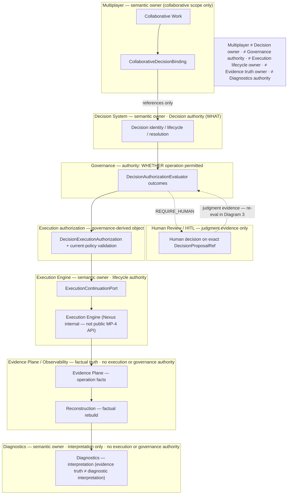
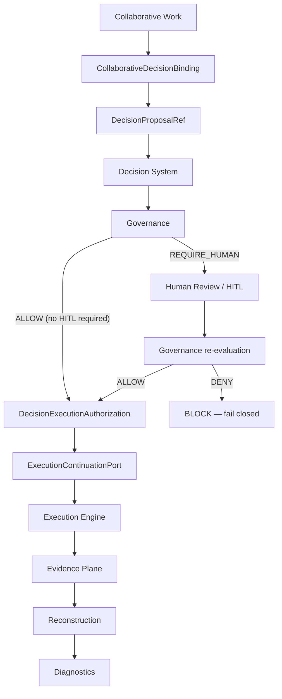
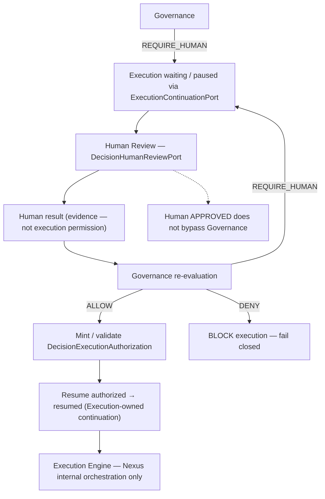
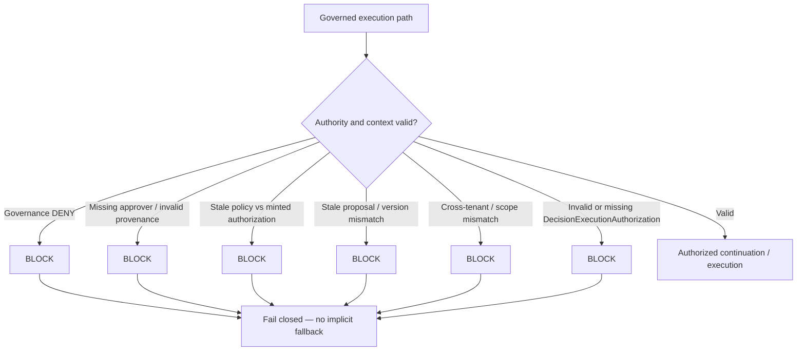
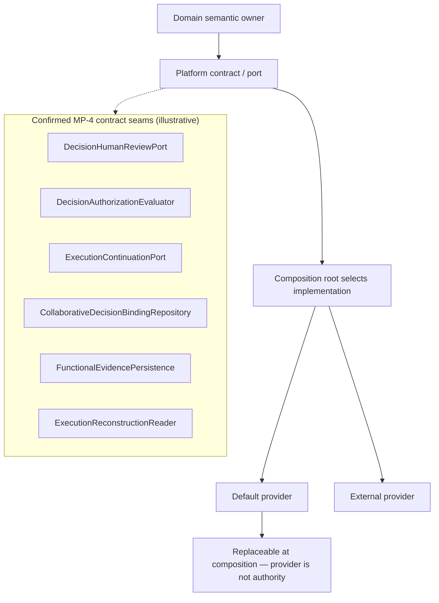

<!--
© Artur Czarnecki. All rights reserved.
Intergrax is source-available under the Intergrax Evaluation and Collaboration License 1.0.
See LICENSE for permitted evaluation, collaboration, and contribution use.
-->

# Decision / Approval / Governance — Multiplayer integration (MP-4)

**Status:** **MP-4 — FORMALLY CLOSED** · **MP-4R0…MP-4R8 CLOSED** · **MP-4D1 — CLOSED** · **MP-4D2 — CLOSED** · **MP-4D3 — CLOSED** · **MP-4D4 — CLOSED** · **MP-4D5 — CLOSED** · **MP-4D6 — NEXT**
**ADR:** [ADR-MP-009](../technical/adr/entries/2026-09-15/ADR-MP-009.md) (authoritative after MP-4R0) · [ADR-MP-005](../technical/adr/entries/2026-09-08/ADR-MP-005.md) (MP-4A historical; ownership table superseded)
**Feature coordination:** [`MULTIPLAYER_AI`](../capabilities/architecture/MULTIPLAYER_AI.md) · [`COLLABORATIVE_WORK`](COLLABORATIVE_WORK.md)
**Plan (execution/status only):** [`plan/DECISION_APPROVAL_GOVERNANCE.md`](../maintainers/plans/DECISION_APPROVAL_GOVERNANCE.md)

---

## How to read this architecture

**This file is the canonical MP-4 integration architecture entry point (SSOT).** Read it first for ownership, authority chain, contracts, pluginability, E2E qualification scope, and known limitations. Open adjacent domain documents only when you need subsystem internals — not to reconstruct MP-4 from scattered summaries.

| Reader question | Canonical document | Why open it |
| ----------------- | ------------------ | ----------- |
| Decision identity, lifecycle, resolution, finalization | [`DECISION_SYSTEM.md`](DECISION_SYSTEM.md) | Decision System owns Decision truth and lifecycle specification |
| Governance outcomes, HITL workflow, governed execution | [`GOVERNED_EXECUTION.md`](GOVERNED_EXECUTION.md) | Governance/HITL SSOT for ALLOW / DENY / REQUIRE_HUMAN |
| Execution identity, lifecycle, internal Nexus | [`UNIFIED_EXECUTION_ARCHITECTURE.md`](UNIFIED_EXECUTION_ARCHITECTURE.md) | Execution Engine SSOT; Nexus is internal only |
| WorkItem, Assignment, WorkArtifact | [`COLLABORATIVE_WORK.md`](COLLABORATIVE_WORK.md) | Collaborative Work primitives SSOT |
| Evidence Plane facts and persistence contracts | [`OBSERVABILITY.md`](OBSERVABILITY.md) | Factual evidence SSOT |
| Diagnostic interpretation (not authority) | [`DIAGNOSTICS.md`](DIAGNOSTICS.md) | Interpretation SSOT |
| MP-4 program status, slice proof, maintainer tasks | [`plan/DECISION_APPROVAL_GOVERNANCE.md`](../maintainers/plans/DECISION_APPROVAL_GOVERNANCE.md) | Execution plan — not a second architecture SSOT |
| Cross-layer Multiplayer capability summary | [`MULTIPLAYER_AI`](../capabilities/architecture/MULTIPLAYER_AI.md) | Coordination hub — not a copy of this architecture |
| ADR ownership rebase | [ADR-MP-009](../technical/adr/entries/2026-09-15/ADR-MP-009.md) | Normative ownership after MP-4R0 |

**SSOT rules (documentation):**

```text
This file                          → MP-4 integration architecture SSOT
DECISION_SYSTEM.md                 → Decision internals SSOT
GOVERNED_EXECUTION.md              → Governance / HITL SSOT
UNIFIED_EXECUTION_ARCHITECTURE.md  → Execution lifecycle SSOT
OBSERVABILITY.md                   → Evidence Plane SSOT
DIAGNOSTICS.md                     → Diagnostic interpretation SSOT
COLLABORATIVE_WORK.md              → Collaborative primitives SSOT
maintainers/plan DECISION_*        → execution/status plan only
capabilities/MULTIPLAYER_AI*       → capability summary / cross-layer roadmap
```

**Enterprise principle (platform):**

```text
PLATFORM OPERATES ON CONTRACTS, NOT IMPLEMENTATIONS.
```

Every variable mechanism is documented as:

```text
semantic owner → platform contract / port → default implementation → composition point → external replacement seam
```

```text
default implementation ≠ semantic owner
provider ≠ authority
composition selects implementation
contract defines platform boundary
```

---

## MP-4 status and maturity

```text
MP-4 STATUS: FORMALLY CLOSED

R0–R8: CLOSED
Implementation: ENTERPRISE
Architecture: ENTERPRISE
Authority / Security: ENTERPRISE
E2E qualification: CLOSED (architectural / cross-domain — see § E2E qualification)
Documentation certification: MP-4D1–D8 (D2 consolidates this entry point)
```

**MP-4D1–D8** are **documentation and proof-closure stages only**; they **do not reopen** MP-4 implementation.

---

## Purpose

Define how **Multiplayer** integrates with canonical platform authorities for Decision, Human Review, Governance, execution authorization, Execution continuation, Evidence, and Diagnostics — **without** creating parallel lifecycle or truth sources.

MP-4R0–R8 closed the implementation program (ownership rebase, contract convergence, binding, evidence adoption, legacy removal, enterprise E2E qualification, final audit). **MP-4D2** consolidates that closed model into one readable integration architecture.

---

## Scope and non-scope

**In scope (MP-4 integration architecture):**

- Collaborative **association** between Collaborative Work and exact Decision proposals (`CollaborativeDecisionBinding`)
- Contract-first integration with Decision System, Governance/HITL, Execution continuation, Evidence, Diagnostics
- Authority chain from work context through governance to execution and observability
- Pluginability seams, persistence abstraction, fail-closed failure semantics, tenancy, E2E qualification **scope**

**Explicit non-scope (owned elsewhere — link, do not re-own here):**

| Area | Owner | MP-4 role |
| ---- | ----- | --------- |
| Decision lifecycle / resolution / finalization | Decision System | Reference exact `DecisionProposalRef` only |
| Human judgment evidence semantics | Human Review + HITL contracts | Consume ports; no second review authority |
| Governance ALLOW / DENY / REQUIRE_HUMAN | Governance | Consume evaluator outcomes |
| Pause / wait / resume lifecycle | Execution Engine via `ExecutionContinuationPort` | No Multiplayer continuation store |
| Orchestration graph / loop | Nexus (**internal** to Execution) | **No public Nexus dependency** |
| Operation execution facts | Evidence Plane | Emit/link canonical facts (MP-4R5) |
| Factual reconstruction | Evidence reconstruction readers | None — read via contracts |
| Diagnostic interpretation | Diagnostics | Read-only integration |
| Principal / membership / delegation | MP-1 Collaborative Work | Reuse |

**Hard invariants:**

```text
Multiplayer MUST NOT own a second Decision lifecycle.
Multiplayer MUST NOT own a second Approval/HITL authority.
Multiplayer MUST NOT own Execution lifecycle.
Multiplayer MUST NOT expose Nexus as a public MP-4 boundary.
Multiplayer MUST NOT own evidence truth or diagnostic interpretation.
```

---

## Executive mental model (authority chain)

```text
Collaborative Work (WorkItem / Assignment / WorkArtifact)
        ↓
CollaborativeDecisionBinding (association truth only)
        ↓
exact DecisionProposalRef
        ↓
Decision System — Decision answers WHAT (identity / version / lifecycle / resolution / finalization)
        ↓
Governance — WHETHER the operation is permitted (ALLOW / DENY / REQUIRE_HUMAN)
        ↓
Human Review / HITL when required — what a human decided about an exact proposal/version
        ↓
post-human Governance re-evaluation (Human APPROVED ≠ automatic ALLOW)
        ↓
DecisionExecutionAuthorization + current-policy validation
        ↓
ExecutionContinuationPort (pause / waiting for human / resume authorization / resumed)
        ↓
Execution Engine — execution identity + lifecycle (Nexus internal)
        ↓
Evidence Plane — operation facts
        ↓
Factual reconstruction — rebuild facts (not interpretation)
        ↓
Diagnostics — interpret facts (cannot authorize execution)
```

---

## Visual architecture layer (MP-4D3)

Diagrams below are a **visual index** of this SSOT only. They do not introduce new lifecycle stages, contracts, or authority. **Platform operates on contracts, not implementations** (see § Pluginability).

### Diagram 1 — Ownership and authority map

**Legend:** *semantic owner* · **authority** (for its concern) · *(reference only)* · *no execution/governance authority*



Human Review connects to Governance only through **post-human re-evaluation** (Diagram 3); it is not shown as a parallel authority spine on this map.

### Diagram 2 — Canonical success flow

When Governance returns **ALLOW** without **REQUIRE_HUMAN**, Human Review is omitted (straight path).



### Diagram 3 — Human Review, Governance, and continuation

**Invariant:** human approval records judgment evidence; **Human APPROVED ≠ automatic Governance ALLOW**. No public side-channel resume; Multiplayer does not own pause/resume lifecycle.



### Diagram 4 — Fail-closed paths

**Principle:** uncertainty or invalid authority state → **BLOCK EXECUTION** (no guess, fallback, or bypass).



Explicit typed **LOCAL_DEVELOPMENT** provenance may be used only where contracts already allow it; implicit fallback remains forbidden (see § Fail-closed).

### Diagram 5 — Pluginability and contract boundary

Pattern for every replaceable mechanism (examples are **existing platform contracts** from this SSOT — not new names).



Domain and integration code depend on **ports**, not on concrete providers (for example PostgreSQL behind `CollaborativeDecisionBindingRepository`).

---

## Ownership model

Frozen canonical ownership (MP-4R0+). **Multiplayer** owns collaborative binding / projection only; it does **not** own Decision, Governance, Execution lifecycle, Evidence truth, or Diagnostics authority.

| Concern | Canonical owner | Multiplayer role | Contract / surface |
| ------- | ----------------- | ---------------- | ------------------ |
| Decision identity | Decision System | References / bindings only | `DecisionId`, `DecisionVersion`, `DecisionProposalRef` — see [`DECISION_SYSTEM.md`](DECISION_SYSTEM.md) |
| Decision lifecycle | Decision System (+ host for resolution hooks) | None — no second lifecycle | `decision_lifecycle`, `decision_record`, … |
| Human review | Human Review / HITL (Decision-owned handoff semantics) | Bridge via platform ports only | `DecisionHumanReviewPort`, `HumanApproverEvidence` — `intergrax/contracts/decision_human_review.py` |
| Governance | Governance / HITL | Consume outcomes | `DecisionAuthorizationEvaluator`, `DecisionGovernanceDecision` — `intergrax/contracts/decision_authorization.py` |
| Execution authorization | Governance-derived authorization object | Consume minted authorization | `DecisionExecutionAuthorization`, validation helpers — `intergrax/contracts/decision_authorization.py` |
| Execution lifecycle | Execution Engine | `ExecutionProvenanceRef` references only | Execution identity contracts — [`UNIFIED_EXECUTION_ARCHITECTURE.md`](UNIFIED_EXECUTION_ARCHITECTURE.md) |
| Continuation | Execution Engine | None — public boundary is port only | `ExecutionContinuationPort` — `intergrax/contracts/execution_continuation.py` |
| Orchestration | Nexus (**internal**) | **No public dependency** | Not an MP-4 contract |
| Collaborative binding | Multiplayer Collaborative Work | **Owner** of association truth | `CollaborativeDecisionBinding`, `CollaborativeDecisionBindingRepository` |
| WorkItem / Assignment / WorkArtifact | Multiplayer Collaborative Work (MP-2/MP-3) | Owner | [`COLLABORATIVE_WORK.md`](COLLABORATIVE_WORK.md) |
| Evidence facts | Evidence Plane / Observability | Emit/link; not authority | `FunctionalEvidencePersistence`, `PlatformFunctionalEvidence` |
| Reconstruction | Evidence Plane reconstruction | None | `ExecutionReconstructionReader` — `intergrax/contracts/execution_reconstruction.py` |
| Diagnostics | Central Diagnostics | Read via canonical surfaces | [`DIAGNOSTICS.md`](DIAGNOSTICS.md) |

---

## Terminology (use precisely)

| Term | Meaning |
| ---- | ------- |
| **Human Review** | Canonical record of human judgment on an **exact** `DecisionProposalRef` / version — not governance outcome |
| **Governance decision** | Evaluator outcome: **ALLOW**, **DENY**, or **REQUIRE_HUMAN** for an operation under policy |
| **Execution authorization** | **`DecisionExecutionAuthorization`** — distinct object minted after governance path; must pass **current-policy validation** before continuation |
| **Continuation** | Execution-owned pause/wait/resume lifecycle exposed only via **`ExecutionContinuationPort`** |
| **Binding** | **`CollaborativeDecisionBinding`** — immutable **association truth** (WorkItem ↔ proposal); not Decision state |
| **Evidence** | **Operation facts** in the Evidence Plane — not association truth for binding |
| **Diagnostics** | **Interpretation** of reconstructed facts — not authority for execution or governance |

Do not use **approval**, **human approval**, **authorization**, and **execution permission** interchangeably without mapping to the rows above.

---

## Contract map

Primary platform contracts for MP-4 integration (names are authoritative; prefer contracts over implementation classes):

| Contract | Role | Code anchor |
| -------- | ---- | ----------- |
| `DecisionProposalRef` | Exact Decision proposal/version reference for binding and review | `intergrax/contracts/decision_record.py` |
| `DecisionHumanReviewPort` | Request/consume human review for exact proposal | `intergrax/contracts/decision_human_review.py` |
| `DecisionAuthorizationEvaluator` | Pluggable governance evaluation | `intergrax/contracts/decision_authorization.py` |
| `DecisionExecutionAuthorization` | Minted execution authorization under policy context | `intergrax/contracts/decision_authorization.py` |
| `ExecutionContinuationPort` | Pause / wait / resume lifecycle boundary | `intergrax/contracts/execution_continuation.py` |
| `CollaborativeDecisionBinding` | Association record | `intergrax/contracts/collaborative_decision_binding.py` |
| `CollaborativeDecisionBindingRepository` | Persistence port for binding truth | `intergrax/collaborative_work/repository.py` (Protocol) |
| `FunctionalEvidencePersistence` | Persist operational evidence facts | `intergrax/contracts/functional_evidence/persistence.py` |
| `ExecutionReconstructionReader` | Read model for factual reconstruction | `intergrax/contracts/execution_reconstruction.py` |

Diagnostics uses strategy/persistence ports documented in [`DIAGNOSTICS.md`](DIAGNOSTICS.md) — not duplicated here.

---

## Contract-first capability table

| Capability | Platform contract | Default implementation / composition | Replaceable? |
| ---------- | ----------------- | ------------------------------------ | -----------: |
| Decision governance evaluation | `DecisionAuthorizationEvaluator` | Wired via governed execution composition / plugins | yes |
| Human Review handoff | `DecisionHumanReviewPort` | Host/application composition selects adapter | yes |
| Execution continuation | `ExecutionContinuationPort` | Execution Engine implementation | yes (external engine must honor contract) |
| Binding repository | `CollaborativeDecisionBindingRepository` | PostgreSQL-backed provider (production-qualified separately) | yes |
| Evidence persistence | `FunctionalEvidencePersistence` | Platform functional evidence stack | yes |
| Reconstruction | `ExecutionReconstructionReader` | Evidence reconstruction pipeline | yes |
| Diagnostics | Diagnostic strategy / persistence ports | Central Diagnostics modules | yes |

**Composition ownership:** implementation selection happens at runtime **composition roots** (for example `decision_integration_composition.py`, `decision_plugin_composition.py`, collaborative work repository factory, test composition in MP-4R7) — not inside Multiplayer binding semantics.

---

## Decision System integration (WHAT — not full lifecycle spec)

**Decision answers WHAT** — identity, version, proposal material, lifecycle, resolution, and finalization. MP-4 **does not** copy the full Decision lifecycle specification; see [`DECISION_SYSTEM.md`](DECISION_SYSTEM.md).

**Integration view (phases only):**

```text
proposal → deliberation → verification/revision → adjudication → resolution → finalization → terminal
```

Multiplayer holds **`CollaborativeDecisionBinding.decision_proposal: DecisionProposalRef`** — an **exact** reference. Binding does not substitute for Decision state transitions.

Key identifiers (detail in Decision SSOT): **`DecisionId`**, **`DecisionVersion`**, **`DecisionProposalRef`**.

---

## Collaborative decision binding

**`CollaborativeDecisionBinding`** is **association truth** between Collaborative Work and a Decision proposal. It is **not** Decision state, approval state, or execution state.

**Exact references:**

- `work_item_id` (WorkItem)
- optional exact **`WorkArtifactVersionRef`**
- exact **`DecisionProposalRef`**

**Semantics:**

- **Immutable association** once persisted (frozen model)
- **Tenant / workspace scoped** — cross-tenant association is invalid (fail closed)
- **Idempotency** — replay-safe create; semantic conflict vs duplicate semantic dedup are distinct failure modes (`CollaborativeDecisionBindingIdempotencyConflict`, `CollaborativeDecisionBindingDuplicateSemantic`, …)
- **Repository port** — `CollaborativeDecisionBindingRepository` is the **source of association truth**

**Persistence abstraction:** Multiplayer integration documentation describes the **repository contract**. **PostgreSQL** is one **production-qualified provider** behind that port (MP-4R4 real-provider proof) — not “MP-4 uses PostgreSQL directly” as platform authority.

---

## Human Review

**Human Review** answers: *what did a human decide about an exact Decision proposal/version?*

Invariants:

- **Exact proposal** and **exact version** — stale proposal references fail closed
- **Typed approver provenance** (`HumanApproverEvidence`) — no synthetic identity
- **Tenant consistency** and **request correlation** (`DecisionHumanReviewRequestId`, reason codes)

Port: **`DecisionHumanReviewPort`** — see [`GOVERNED_EXECUTION.md`](GOVERNED_EXECUTION.md) and Decision human review contracts.

### Human Review ≠ Governance

```text
Human APPROVED ≠ Governance ALLOW
```

Human Review records judgment evidence. **Governance** decides whether the **operation** is permitted under **current policy**. A human approval does **not** bypass governance evaluation.

### Post-human Governance

After human review completes:

```text
Human APPROVED → post-human Governance re-evaluation → ALLOW | DENY | REQUIRE_HUMAN
```

**Not:**

```text
Human APPROVED → automatic ALLOW
```

---

## Governance

**Governance** answers: *WHETHER the operation is permitted.*

Canonical outcomes:

```text
ALLOW
DENY
REQUIRE_HUMAN
```

The **`DecisionAuthorizationEvaluator`** is **pluginable** at the composition boundary. Governance outcomes are distinct from Human Review records and from **`DecisionExecutionAuthorization`**.

Detail: [`GOVERNED_EXECUTION.md`](GOVERNED_EXECUTION.md).

---

## Execution authorization

**`DecisionExecutionAuthorization`** is a **separate canonical object** (minted under a governance policy context). Execution **must not** start or resume solely because:

```text
Decision reached a terminal state
Human approved
Governance allowed once in the past
```

Authorized continuation requires a **valid minted authorization** plus **current-policy validation**.

### Current-policy validation

```text
authorization minted under policy P1
+
current execution policy P2
→ validation fails → no resume (fail closed)
```

Helpers live with authorization contracts (`mint_validated_execution_authorization`, validation routines in `decision_authorization.py`).

---

## Execution continuation

Public lifecycle boundary: **`ExecutionContinuationPort`** (Execution Engine owns semantics).

Typical governed path:

```text
pause → waiting for human → resume authorized → resumed
```

**Identity continuity** across HITL pause/resume where canonical semantics require continuity:

```text
same TaskId
same RunId
same AttemptId
same ExecutionId
```

Changing attempt or execution identity is a **new execution**, not continuation (see execution continuation contract docstring).

**Nexus:** internal orchestration implementation inside Execution Engine — **not** a public MP-4 integration surface. Multiplayer production modules **must not** depend on Nexus types.

---

## Evidence Plane

| Store | Truth |
| ----- | ----- |
| **`CollaborativeDecisionBindingRepository`** | **Association truth** (WorkItem ↔ `DecisionProposalRef`) |
| **Evidence Plane** | **Operation execution facts** (e.g. binding-create operation outcomes) |

Association truth is **not** reconstructed from Evidence facts as authority.

### Known limitation (non-blocking)

```text
No dedicated Evidence Plane v2 fact kind for WorkItem ↔ DecisionProposalRef association itself.
```

Classification: **NON-BLOCKING PLATFORM LIMITATION** (frozen at MP-4R5). MP-4 adopts **operation outcome** evidence only.

**No semantic workaround:**

```text
no fake OUTPUT_RELATION
no fake ARTIFACT_LINEAGE
```

Future extension belongs to Evidence Plane architecture — not MP-4 reopening.

---

## Reconstruction and Diagnostics

**Factual reconstruction** rebuilds **facts** from the Evidence Plane (`ExecutionReconstructionReader`). **Diagnostics** **interprets** those facts — it does **not** authorize execution or substitute for Governance.

```text
Evidence facts → reconstruction → diagnostics interpretation
```

Diagnostics cannot authorize execution. Detail: [`DIAGNOSTICS.md`](DIAGNOSTICS.md).

---

## Fail-closed and failure precedence

| Condition | Behavior |
| --------- | -------- |
| Governance **DENY** | No execution / no authorized resume |
| Missing approver / invalid provenance | Fail closed |
| Stale policy vs minted authorization | Fail closed — no resume |
| Stale proposal / version mismatch | Fail closed |
| Cross-tenant / scope mismatch | Fail closed |
| Primary domain failure | Takes precedence over secondary evidence failure |

**Local development provenance:** explicit **`LOCAL_DEVELOPMENT`** (or equivalent typed) evidence may be supplied where contracts allow — **implicit fallback is forbidden**.

---

## Security, tenancy, and provenance

- **Tenant isolation** and **workspace scope** on bindings and authoritative references
- **Exact proposal/version binding** for Human Review and authorization correlation
- **Typed approver provenance** — no synthetic identity
- Normative invariants include **MP-INV-09** (Decision ≠ HITL) and **MP-INV-23** (approval/evidence ≠ execution authorization)

---

## Pluginability and replaceability

Replaceable seams (minimum):

```text
DecisionAuthorizationEvaluator
DecisionHumanReviewPort
ExecutionContinuationPort
CollaborativeDecisionBindingRepository
FunctionalEvidencePersistence
ExecutionReconstructionReader
Diagnostics strategy / persistence ports
```

**Anti-pattern — no god orchestrator:** types such as `MultiplayerDecisionManager`, `UnifiedDecisionExecutionService`, or `EnterpriseDecisionCoordinator` must **not** aggregate multiple **semantic authorities** (Decision + Governance + Execution lifecycle + Evidence truth).

---

## Anti-substitution rules

| Forbidden equivalence | Correct model |
| --------------------- | ------------- |
| Decision ≡ WorkArtifact / WorkItem state | Canonical Decision + optional binding |
| Human Review ≡ Governance ALLOW | Separate evidence vs governance outcomes |
| Governance ALLOW ≡ execution without authorization validation | `DecisionExecutionAuthorization` + current-policy validation |
| Evidence / Diagnostics as authority | Facts vs interpretation only |
| Binding ≡ Decision | Binding associates; Decision System owns lifecycle |
| Execution state ≡ approval state | Governance/HITL + continuation port |
| Provider implementation ≡ platform authority | Contract defines boundary; composition selects provider |

---

## E2E qualification scope (MP-4R7 — closed)

**Qualifies** architectural / cross-domain E2E using **canonical production contracts** and **test composition** where configured.

**Does not claim:** full production-deployment E2E on every real provider stack.

**Success path (documented qualification):**

```text
Collaborative Work → Decision → REQUIRE_HUMAN → Human Review → post-human Governance ALLOW
→ DecisionExecutionAuthorization → current-policy validation → ExecutionContinuationPort resume
→ protected operation → Evidence → Diagnostics
```

**Negative scenarios covered at qualification level (not full invariant→test matrix — see MP-4D4):**

```text
Governance DENY
stale policy
Human REJECT
stale proposal
cross-tenant
evidence failure (secondary)
idempotent replay / semantic conflict
process restart / continuity expectations
```

**Separate real-provider proof:** **Collaborative decision binding PostgreSQL qualification** (MP-4R4 — real PostgreSQL, concurrency, idempotency, conflict, semantic dedup).

Proof harness reference: `testing_support/mp4r7_enterprise_integration/` and architecture gates — maintainer plan for command lines.

---

## E2E Proof & Qualification Matrix (MP-4D4)

**Purpose:** auditable mapping from MP-4 integration invariants to **existing** executable proof. Test files remain SSOT for assertion semantics; this table states **qualification level only**.

**Qualification model:** each matrix row has exactly one **Primary Qualification** (strongest proof level that covers the **full** invariant in that row, without inflating status) plus optional **Supporting Proof Types** for additional proof that applies only to a sub-scope or a separate surface.

| Primary Qualification | Meaning |
| --------------------- | ------- |
| **DIRECT TEST** | Runtime/unit test directly asserts the invariant |
| **E2E TEST** | Multi-step qualification scenario (may use test composition — not full production deployment) |
| **PROVIDER QUALIFIED** | Real production provider implementation exercised for the **entire** invariant claim in the row (not contract-only proof) |
| **ARCHITECTURAL / STATIC** | Import/AST/structure gates — no runtime E2E for that claim |
| **PARTIAL** | No single proof class covers the full invariant on the MP-4 surface |
| **NOT QUALIFIED** | No sufficient proof located for MP-4 integration surface |

**Supporting Proof Types** list additional labels (`DIRECT TEST`, `E2E TEST`, `ARCHITECTURAL / STATIC`, `PROVIDER QUALIFIED`) when present; use **—** when none apply. Provider qualification in Supporting never generalizes beyond the scoped provider surface (see Limitation).

**Scope column:** **contract** = port/protocol behavior; **R7 composition** = `testing_support/mp4r7_enterprise_integration/` with in-memory binding/evidence stores and wired canonical continuation; **decision-flow unit** = `intergrax/runtime/decision_flow.py` harness; **PostgreSQL provider** = MP-4R4 live DB qualification only.

| Invariant / capability | Existing proof | Scope | Primary Qualification | Supporting Proof Types | Limitation |
| ---------------------- | -------------- | ----- | --------------------- | ---------------------- | ---------- |
| **A. Multiplayer does not own Decision lifecycle** | `test_mp4r1_no_multiplayer_decision_repository_in_collaborative_work`; `test_mp4r0_multiplayer_production_defines_no_duplicate_platform_authority_classes` | production `collaborative_work` tree | **ARCHITECTURAL / STATIC** | — | Does not runtime-exercise every Decision host path |
| **A. Binding references exact `DecisionProposalRef` (not a second Decision lifecycle)** | `test_binding_contract_uses_decision_proposal_ref`; `test_binding_contract_has_no_decision_outcome_fields`; `test_decision_runtime_does_not_import_collaborative_binding`; `test_exact_decision_version_preserved_after_new_version_exists` | contract gates + `test_decision_binding_service.py` | **DIRECT TEST** | **ARCHITECTURAL / STATIC** | Service tests use in-memory/SQLite repo, not PostgreSQL |
| **B. Human Review ≠ Governance authority** | `test_mp4r2_human_review_outcome_is_not_execution_authorization_type`; `test_mp4r2_multiplayer_does_not_define_approval_hitl_authority` | contracts + production scan | **DIRECT TEST** | **ARCHITECTURAL / STATIC** | Does not prove all host adapters |
| **B. Human APPROVED ≠ automatic execution ALLOW** | `test_mp4r7_human_approve_governance_deny_prevents_continuation_and_operation`; `test_resume_after_human_approve_uses_governance_evaluator_not_synthetic_allow` (`test_decision_flow.py`); `test_mp4r7_decision_flow_resume_does_not_synthesize_governance_allow` | R7 composition + decision-flow unit + AST gate on `decision_flow.py` | **E2E TEST** | **DIRECT TEST**, **ARCHITECTURAL / STATIC** | R7 uses qualification composition, not production deployment |
| **B. Post-human Governance re-evaluation** | `test_mp4r7_human_approve_governance_deny_*` (post-human `DENY`); `test_mp4r7_success_e2e` (post-human `ALLOW` path); `test_resume_after_governance_human_approve_reaches_terminal` | R7 composition + decision-flow unit | **E2E TEST** | **DIRECT TEST** | No single test named “re-evaluate only”; behavior inferred from deny/allow paths |
| **C. Governance outcomes ALLOW / DENY / REQUIRE_HUMAN** | `test_governance_deny_blocks_action_without_rejecting_accepted_decision`; `test_governance_allow_mints_authorization`; `test_governance_require_human_with_port_pending`; `test_mp4r2_governance_require_human_leaves_authorization_none` | decision-flow unit + MP-4R2 gate | **DIRECT TEST** | — | Evaluator plugins beyond test harness not exhaustively qualified |
| **C. DENY → no execution** | `test_mp4r7_human_approve_governance_deny_prevents_continuation_and_operation` (no auth, no resume, no op evidence); `test_governance_deny_blocks_action_without_rejecting_accepted_decision` | R7 composition + decision-flow unit | **E2E TEST** | **DIRECT TEST** | R7 composition only |
| **D. `DecisionExecutionAuthorization` + validation before execution** | `test_mp4r7_success_e2e` (`execution_authorization_present` / `validated`); `test_mp4r7_stale_current_policy_blocks_execution_after_human_approval`; `test_mp4r7_scenario_enforces_execution_authorization_before_resume`; `test_governance_allow_mints_authorization` | R7 composition + gates + decision-flow unit | **E2E TEST** | **DIRECT TEST**, **ARCHITECTURAL / STATIC** | Authorization helpers qualified in R7 harness, not every production composition root |
| **E. Stale policy → BLOCK (fail-closed)** | `test_mp4r7_stale_current_policy_blocks_execution_after_human_approval` | R7 composition | **E2E TEST** | — | In-memory providers; not PostgreSQL/full stack |
| **F. Stale proposal / version mismatch → BLOCK** | `test_mp4r7_stale_proposal_fail_closed`; `test_mp4r2_stale_human_review_decision_rejected_for_revised_proposal` | R7 composition + MP-4R2 async gate | **E2E TEST** | **DIRECT TEST** | R7 stale path is scenario-specific |
| **G. Missing / invalid approver & provenance → fail-closed** | `test_mp4r6_persistence_deserialization_does_not_map_user_id_to_approver`; `test_mp4r6_sqlite_human_decision_store_read_path_does_not_synthesize_approver`; `test_mp4r3_identity_mismatch_qualification`; `test_mp4r3_governed_correlation_mismatch_fail_closed` | legacy restore + continuation qualification | **PARTIAL** | **DIRECT TEST** | Strong unit qualification; not re-run inside `test_mp4r7_*` success path |
| **H. Cross-tenant / scope isolation** | `test_mp4r7_cross_tenant_fail_closed`; `test_cross_tenant_decision_rejected`; `test_tenant_isolation_on_get` (`test_decision_binding_service.py`); `test_postgresql_decision_binding_tenant_isolation` | R7 composition + contract service + PostgreSQL provider | **E2E TEST** | **DIRECT TEST**, **PROVIDER QUALIFIED** | Execution-flow cross-tenant proof is R7 composition only; **PROVIDER QUALIFIED** applies to binding repository isolation only |
| **I. `ExecutionContinuationPort` public boundary; Multiplayer does not own pause/resume** | `test_mp4r3_no_multiplayer_continuation_repository`; `test_mp4r3_no_duplicate_continuation_lifecycle_authority`; `test_mp4r7_scenario_uses_public_continuation_port`; `test_mp4r7_process_restart_resume` | production scan + R7 composition | **E2E TEST** | **ARCHITECTURAL / STATIC** | `test_mp4r3_multiplayer_has_no_production_continuation_port_caller` — no production MP caller today |
| **I. No side-channel resume (approval → resume shortcut)** | `test_mp4r3_no_approval_to_resume_shortcut_in_multiplayer`; `test_mp4r7_scenario_does_not_resume_on_terminal_alone` | production scan + R7 scenario structure | **ARCHITECTURAL / STATIC** | — | Does not prove all future host code paths |
| **J. Nexus internal to Execution; no public MP-4 Nexus dependency** | `test_mp4r0_multiplayer_production_has_no_public_nexus_dependency`; `test_mp4r3_multiplayer_production_has_no_public_nexus_dependency`; `test_binding_modules_do_not_import_execution_or_nexus_runtime`; `test_collaborative_work_has_no_nexus_dependency` | production `collaborative_work` | **ARCHITECTURAL / STATIC** | — | Static import scan — not runtime Nexus isolation across entire platform |
| **K. `CollaborativeDecisionBinding` + repository port** | `test_decision_binding_service.py` (round-trip, idempotency, isolation); `test_mp4r4_*` gates; `test_postgresql_decision_binding_*` (8 tests) | contract service + gates + PostgreSQL | **DIRECT TEST** | **ARCHITECTURAL / STATIC**, **PROVIDER QUALIFIED** | PostgreSQL proof **does not** qualify governance/execution E2E; **PROVIDER QUALIFIED** is binding adapter only |
| **L. Evidence Plane — facts not authority** | `test_mp4r5_evidence_plane_adoption_gates.py` (persistence contract only, no MP evidence store); `test_success_emits_single_operation_outcome`; `test_decision_binding_service_does_not_emit_evidence_on_read_paths` | collaborative_work + gates | **DIRECT TEST** | **ARCHITECTURAL / STATIC** | Association fact gap documented in MP-4R5 gates |
| **M. Primary domain failure > secondary evidence failure** | `test_mp4r7_evidence_failure_preserves_primary`; `test_application_boundary_preserves_primary_failure_when_secondary_evidence_emission_fails`; `test_mp4r7_scenario_does_not_fabricate_primary_error_in_evidence_handler` | R7 composition + application boundary + AST gate | **E2E TEST** | **DIRECT TEST**, **ARCHITECTURAL / STATIC** | R7 uses injected failing persistence in composition |
| **N. `ExecutionReconstructionReader` — factual reconstruction** | *(no MP-4-scoped test referencing this port found)* | — | **NOT QUALIFIED** | — | Contract listed in SSOT; reconstruction behavior qualified outside MP-4D4 matrix (platform observability suites) |
| **O. Diagnostics reads/interprets evidence; cannot authorize execution** | `test_mp4r7_success_e2e` (`diagnostics.operation_outcome_check_status == proven_pass` after operation); `test_collaborative_work_does_not_import_diagnostics` (MP-4R5 gate) | R7 composition + import gate | **PARTIAL** | **DIRECT TEST**, **ARCHITECTURAL / STATIC** | No MP-4 test proving Diagnostics APIs cannot mint `DecisionExecutionAuthorization` or call `ExecutionContinuationPort` |

### Primary Qualification summary (MP-4D4 matrix rows)

| Primary Qualification | Count |
| --------------------- | ----: |
| **E2E TEST** | 9 |
| **DIRECT TEST** | 5 |
| **PROVIDER QUALIFIED** | 0 |
| **ARCHITECTURAL / STATIC** | 3 |
| **PARTIAL** | 2 |
| **NOT QUALIFIED** | 1 |
| **TOTAL** | 20 |

**Proof commands (representative, not exhaustive):**

```bash
uv run pytest tests/unit/mp4r7/test_enterprise_integration_qualification.py
uv run pytest tests/unit/runtime/architecture/test_mp4r7_enterprise_integration_gates.py
uv run pytest tests/unit/runtime/architecture/test_mp4r4_collaborative_decision_binding_gates.py
uv run pytest tests/unit/runtime/architecture/test_mp4r5_evidence_plane_adoption_gates.py
uv run pytest tests/integration/collaborative_work/test_postgresql_decision_binding_qualification.py -m "integration and network"
```

### Qualification boundaries

| Label | What it proves | What it does **not** prove |
| ----- | -------------- | --------------------------- |
| **Contract proof** | Port/protocol semantics, service behavior against a test double or in-memory provider | That every production provider implementation is qualified |
| **R7 test-composition E2E** | Cross-domain flow on **canonical production contracts** with `open_mp4r7_enterprise_integration_composition()` (in-memory binding repo, in-memory functional evidence, wired `ExecutionContinuationPort`) | Full production deployment E2E on all real providers |
| **PostgreSQL provider qualification (MP-4R4)** | `CollaborativeDecisionBindingRepository` production PostgreSQL adapter (concurrency, idempotency, tenant isolation) | Decision governance, human review, execution authorization, or diagnostics |
| **Full production E2E** | *Not claimed by MP-4 closed program* | Would require real providers for every port in one run — deferred to **MP-4D5** / explicit future qualification |

**PLATFORM OPERATES ON CONTRACTS, NOT IMPLEMENTATIONS:** a green **PROVIDER QUALIFIED** row for PostgreSQL binding does **not** generalize to all `CollaborativeDecisionBindingRepository` implementations.

### Known proof gaps (MP-4D4)

| Gap | Meaning | Blocking? |
| --- | ------- | --------: |
| No MP-4-scoped proof for `ExecutionReconstructionReader` factual read model | Reconstruction is an integration contract in this SSOT but not exercised in MP-4R7/R4/R5 qualification tests | NO (MP-4D5/D6 may extend) |
| Diagnostics authority isolation | Import gates + success-path diagnostic **read** proven; no runtime test that Diagnostics cannot authorize execution on MP-4 surface | NO |
| Approver/provenance fail-closed | Strong MP-4R3/MP-4R6 unit qualification; not duplicated in MP-4R7 E2E matrix | NO |
| R7 E2E provider stack | Binding/evidence stores are in-memory in R7; PostgreSQL binding qualified only via separate MP-4R4 integration module | NO (documented boundary) |

---

## Provider & Persistence Qualification Matrix (MP-4D5)

**Purpose:** auditable mapping from **MP-4 integration persistence seams** to **contract**, **implementation**, **durability**, **composition**, **qualification level**, **proof**, and **known limitations**. This answers *which provider is production-qualified under which contract* — not *which invariant is proven* (see **MP-4D4**).

**Enterprise principle (reinforced):**

```text
semantic owner → platform contract / port → composition root → selected provider
provider ≠ authority · provider ≠ semantic owner · contract is replaceable
```

**Durability classes (matrix column *Persistence type*):**

| Class | Meaning |
| ----- | ------- |
| **DURABLE** | Provider persists authoritative state across process lifetime with production-intent backing |
| **NON-DURABLE** | In-process / test-only store; no production durability claim |
| **EXTERNALLY DURABLE** | Durability simulated or hosted outside the MP-4 seam (e.g. qualification export/restore of Execution-owned state) |
| **READ-ONLY** | Reader port; durable source owned elsewhere |
| **STATELESS** | No persistence responsibility on this MP-4 surface |

**Production qualification taxonomy (per implementation row — never per contract alone):**

| Level | Meaning |
| ----- | ------- |
| **PRODUCTION QUALIFIED** | Named production implementation exercised by real-provider qualification proof |
| **CONTRACT QUALIFIED** | Contract behavior proven; not every production provider on the MP-4 path |
| **TEST / QUALIFICATION ONLY** | Harness, in-memory, or local dev implementation for tests/composition |
| **ARCHITECTURAL ONLY** | Boundary confirmed statically or by type model; no durable provider proof on MP-4 surface |
| **NOT QUALIFIED** | Insufficient proof for the claimed scope |

**Replaceability:** domain/integration modules under `intergrax/collaborative_work/` decision-binding paths depend on **`CollaborativeDecisionBindingRepository`** (protocol), not PostgreSQL types. PostgreSQL adapters are selected only in **`open_postgresql_collaborative_work_repositories`** (`intergrax/collaborative_work/persistence.py`). No **ENTERPRISE BOUNDARY VIOLATION** found on MP-4 binding domain seams at D5 close.

### Matrix (MP-4 integration surface)

| Concern | Platform contract | Implementation / provider | Persistence type | Persistence owner | Composition | Qualification | Proof (scope) | Limitation / proof does **not** cover |
| ------- | ----------------- | ------------------------- | ---------------- | ----------------- | ----------- | ------------- | ------------- | ------------------------------------- |
| Collaborative decision binding | `CollaborativeDecisionBindingRepository` | `PostgreSQLCollaborativeDecisionBindingRepository` | **DURABLE** | Collaborative Work (association truth) | `open_postgresql_collaborative_work_repositories` · `build_collaborative_decision_binding_application_from_artifacts_bundle` | **PRODUCTION QUALIFIED** | `tests/integration/collaborative_work/test_postgresql_decision_binding_qualification.py` (8 tests): round-trip, tenant/workspace isolation, idempotent replay, idempotency conflict, semantic dedup, concurrent semantic duplicate, concurrent idempotency conflict | Governance, Human Review, execution authorization, continuation, Evidence E2E, Diagnostics; **does not** qualify other repository implementations |
| Collaborative decision binding (test/default) | `CollaborativeDecisionBindingRepository` | `InMemoryCollaborativeDecisionBindingRepository` | **NON-DURABLE** | Collaborative Work | `open_mp4r7_enterprise_integration_composition` · unit/service tests · `test_decision_binding_service.py` | **TEST / QUALIFICATION ONLY** | `tests/unit/collaborative_work/test_decision_binding_service.py`; MP-4R7 composition | Not a production durability or PostgreSQL substitute |
| Human Review handoff (canonical port) | `DecisionHumanReviewPort` | `Mp4R7RecordingHumanReviewPort` (qualification) | **NON-DURABLE** | Human Review / HITL (judgment semantics) | `testing_support/mp4r7_enterprise_integration/decision_helpers.py` · `decision_flow` capabilities injection | **TEST / QUALIFICATION ONLY** | MP-4R7 E2E (`test_mp4r7_*`); `test_decision_flow.py` with injected ports | Not a durable human-review store; not host production adapter qualification |
| Human judgment evidence persistence (adjacent seam) | `HumanDecisionPersistence` | `InMemoryHumanDecisionPersistence` | **NON-DURABLE** | Human runtime / tooling (not Governance authorization) | Tooling & integration opens — **not** MP-4R7 default | **TEST / QUALIFICATION ONLY** | Unit/integration harness paths that open in-memory human decision store | No production durability; not MP-4R7 E2E provider; distinct from `DecisionHumanReviewPort` handoff |
| Human judgment evidence persistence (adjacent seam) | `HumanDecisionPersistence` | `SQLiteHumanDecisionStore` | **DURABLE** | Human runtime / tooling (not Governance authorization) | `open_human_decision_store`, sqlite provider — **not** MP-4R7 default | **CONTRACT QUALIFIED** | `test_mp4r6_sqlite_human_decision_store_read_path_does_not_synthesize_approver`; `test_mp4r6_persistence_deserialization_does_not_map_user_id_to_approver` (read/deserialize paths) | MP-4R7 does not run full canonical flow on SQLite; **not PRODUCTION QUALIFIED** for MP-4 E2E; distinct from `DecisionHumanReviewPort` handoff |
| Governance evaluation | `DecisionAuthorizationEvaluator` | Test harness evaluators (`Mp4R7RequireHumanGovernanceEvaluator`, `Mp4R7PostHumanDenyGovernanceEvaluator`, decision-flow test doubles) | **STATELESS** | Governance (outcome semantics) | `decision_flow` / MP-4R7 scenario wiring · governed execution composition (platform) | **CONTRACT QUALIFIED** | `test_decision_flow.py`; `test_mp4r7_human_approve_governance_deny_*`; `test_governance_*` | Evaluator **plugin** implementations beyond harness not exhaustively production-qualified |
| Execution authorization object | `DecisionExecutionAuthorization` (+ validation helpers) | Minted in-memory value objects | **STATELESS** | Governance-derived authorization (not a store) | `decision_flow` · `intergrax/runtime/decision_authorization.py` | **CONTRACT QUALIFIED** | `test_mp4r7_success_e2e`; `test_mp4r7_stale_current_policy_*`; `test_governance_allow_mints_authorization` | **Not** a durable domain record; no separate authorization database on MP-4 surface |
| Execution continuation lifecycle | `ExecutionContinuationPort` | Execution Engine continuation service (wired via `wire_execution_engine_continuation_dependencies`) | **NON-DURABLE** | **Execution Engine** — Multiplayer **must not** own a second store | `testing_support/mp4r7_enterprise_integration/composition.py` · `intergrax/runtime/execution/continuation/composition.py` (default R7 in-memory stack) | **CONTRACT QUALIFIED** | `test_mp4r7_success_e2e`; MP-4R3 architecture gates; restart semantics when wired with durable store — see store/backing rows | Port durability follows selected `ExecutionContinuationStateStore`; export/restore restart proof on **EXTERNALLY DURABLE** store/backing rows — not a production DB adapter on MP-4 path |
| Continuation state store (Execution-owned) | `ExecutionContinuationStateStore` | `InMemoryExecutionContinuationStateStore` | **NON-DURABLE** | **Execution Engine** | `wire_execution_continuation_state_store` · MP-4R7 default composition | **TEST / QUALIFICATION ONLY** | MP-4R7 default wiring; continuation contract tests with in-memory store | **Not** Multiplayer persistence; no MP-owned continuation repository |
| Continuation state store (Execution-owned) | `ExecutionContinuationStateStore` | `BackingExecutionContinuationStateStore` | **EXTERNALLY DURABLE** | **Execution Engine** | `wire_execution_continuation_state_store` over qualification backing · restart qualification wiring | **CONTRACT QUALIFIED** | `test_mp4r7_process_restart_resume` (`durable_continuation=True`); `test_gr5_r5_restart_exact_identity.py` (export/restore restart) | Backing is qualification reference — see `ExecutionContinuationDurableBacking` row; **not** a named production DB adapter |
| Continuation state store (Execution-owned) | `ExecutionContinuationStateStore` | `ReconstructedDurableExecutionContinuationStateStore` | **EXTERNALLY DURABLE** | **Execution Engine** | Reconstruction path over qualification durable backing | **CONTRACT QUALIFIED** | Same restart/export-restore qualification family as `BackingExecutionContinuationStateStore` | **Not** Multiplayer persistence; reconstructed view over qualification backing only |
| Continuation durable backing (qualification reference) | *(Execution continuation backing seam)* | `ExecutionContinuationDurableBacking` | **EXTERNALLY DURABLE** | **Execution Engine** | Qualification/export-restore harness — **not** MP-4 production DB provider | **TEST / QUALIFICATION ONLY** | Used by restart qualification tests (`durable_continuation=True`) | **Reference qualification only** — not production-qualified persistence; no named production DB adapter on MP-4 path |
| Operational evidence facts | `FunctionalEvidencePersistence` | `InMemoryFunctionalEvidencePersistence` | **NON-DURABLE** | **Evidence Plane** — MP-4 emits via adoption, **no duplicate Evidence store** | MP-4R7 composition · `decision_binding_composition` evidence adoption | **TEST / QUALIFICATION ONLY** | `test_mp4r7_success_e2e`; `test_decision_binding_application_evidence.py` | R7 E2E provider only; association fact gap unchanged (MP-4R5) |
| Operational evidence facts | `FunctionalEvidencePersistence` | `DocumentStoreFunctionalEvidencePersistence` | **DURABLE** | **Evidence Plane** — platform wiring, **not** MP-4R7 E2E default | `functional_evidence_runtime_wiring.py` · platform/diagnostics composition | **CONTRACT QUALIFIED** | Platform DIAG functional tests (document store); not MP-4R7 success-path proof | R7 E2E does **not** use this provider; **not PRODUCTION QUALIFIED** on MP-4 surface; association fact gap unchanged (MP-4R5) |
| Factual reconstruction (read model) | `ExecutionReconstructionReader` | Default: `ExecutionReconstructor` (Evidence Plane) | **READ-ONLY** | Evidence Plane / observability reconstruction | Application diagnostic wiring (`diagnostic_read_wiring.py`) — not Multiplayer | **NOT QUALIFIED** (MP-4-scoped) | *(none on MP-4 qualification path)* | Reconstruction qualified in observability/diagnostics programs — see MP-4D4 row N |
| Diagnostics interpretation | Diagnostic read strategy + `FunctionalEvidencePersistence` / `ExecutionReconstructionReader` inputs | Central Diagnostics modules | **READ-ONLY** (inputs) | Diagnostics (interpretation only) | Application composition roots | **ARCHITECTURAL ONLY** (MP-4 surface) | `test_collaborative_work_does_not_import_diagnostics`; R7 success path reads diagnostic projection | Does **not** persist execution authorization; does **not** own binding truth |

**Provider qualification does not generalize:** **PRODUCTION QUALIFIED** on `PostgreSQLCollaborativeDecisionBindingRepository` applies **only** to that adapter under `CollaborativeDecisionBindingRepository`, not to Human Review, Governance, continuation, or Evidence providers.

### Primary qualification summary (implementation rows above)

| Qualification | Count |
| ------------- | ----: |
| **PRODUCTION QUALIFIED** | 1 |
| **CONTRACT QUALIFIED** | 7 |
| **TEST / QUALIFICATION ONLY** | 6 |
| **ARCHITECTURAL ONLY** | 1 |
| **NOT QUALIFIED** | 1 |
| **TOTAL** | 16 |

### Retired / legacy providers (MP-4 matrix scope)

| Item | Status |
| ---- | ------ |
| Legacy `DecisionBindingEvidenceRepository` / MP-4B evidence store | **Retired** (MP-4R6) — not a supported MP-4 seam |
| `SQLiteHumanDecisionStore` legacy disposition tooling | Local/dev and migration tooling — **not** claimed as MP-4 production E2E provider |

### Known Provider / Persistence Qualification Gaps

| Gap | Meaning | Blocking? |
| --- | ------- | --------: |
| No MP-4-scoped production proof wiring `DocumentStoreFunctionalEvidencePersistence` through full MP-4R7 success path | Evidence contract qualified in platform/diagnostics suites; MP-4 E2E uses in-memory provider only | NO |
| No MP-4-scoped `ExecutionReconstructionReader` provider proof | Read-only contract on MP-4 surface; factual reconstruction proof lives under observability | NO |
| Human review durable store not exercised in MP-4R7 composition | Canonical port qualified in-memory; `HumanDecisionPersistence` SQLite paths partially qualified (MP-4R6) | NO |
| Continuation restart proof uses qualification durable backing, not a named production persistence adapter in one MP-4 run | Execution-owned; GR5/R7 prove contract restart semantics | NO |
| Full single-run production E2E across all durable providers | Deferred by design (MP-4 closed program boundary) | NO |

**Relation to MP-4D4:** D4 maps **invariants → proof**; D5 maps **contract → provider → durability → qualification**. Cross-reference D4 **Supporting Proof Types** `PROVIDER QUALIFIED` only for PostgreSQL binding isolation/concurrency claims.

---

## Known limitations (summary)

| Limitation | Status | Blocking? |
| ---------- | ------ | --------: |
| Binding association lacks dedicated Evidence Plane v2 fact | Accepted platform limitation | NO |
| R7 E2E uses test composition / configured providers | Documented qualification boundary | NO |
| Full single-run production E2E on every durable provider | Documented in **MP-4D5** — not claimed | NO |
| Invariant → exact test matrix | **MP-4D4** (§ E2E Proof & Qualification Matrix) | NO |

---

## Integration boundaries (allowed cross-domain paths)

| Source | Target | Allowed integration |
| ------ | ------ | ------------------- |
| Collaborative Work | Binding repository | Create/read scoped association |
| Binding | Decision System | Reference `DecisionProposalRef` only |
| Decision / Governance | Human Review port | Exact proposal handoff |
| Governance | Execution authorization | Mint + validate authorization |
| Authorization + continuation port | Execution Engine | Resume governed execution |
| Operations | Evidence persistence | Emit operational facts |
| Evidence / reconstruction | Diagnostics | Read-only interpretation |

Forbidden for new Multiplayer production modules (retained):

- Direct `intergrax.runtime.nexus.*`, `GraphExecutor`, `NexusLoop`, `NexusIntakeRunner`
- New parallel Decision lifecycle engines / `MultiplayerDecisionEngine`
- `MultiplayerHitlEngine`, `ApprovalRuntime`, `HumanReviewRuntime` as authorities
- `EvidenceStore`, `ExecutionReconstructor`, `DiagnosticEngine` as Multiplayer-owned truth

**Reuse (mandatory):** `ExecutionContinuationPort`, Decision System contracts, Governance/HITL contracts, Evidence Plane contracts, Diagnostic read surfaces, MP-1 authority.

---

## MP-4R program roadmap (implementation — closed)

| Slice | Status |
| ----- | ------ |
| **MP-4R0** — Core rebase & supersession gate | **CLOSED** |
| **MP-4R1** — Decision contract convergence | **CLOSED** |
| **MP-4R2** — Human review / Approval convergence | **CLOSED** |
| **MP-4R3** — Execution continuation integration | **CLOSED** |
| **MP-4R4** — Collaborative decision binding | **CLOSED** |
| **MP-4R5** — Evidence Plane adoption | **CLOSED** |
| **MP-4R6** — Legacy removal & migration | **CLOSED** |
| **MP-4R7** — Enterprise integration qualification | **CLOSED** |
| **MP-4R8** — Final closure audit | **CLOSED** |

Execution detail and proof commands: [`plan/DECISION_APPROVAL_GOVERNANCE.md`](../maintainers/plans/DECISION_APPROVAL_GOVERNANCE.md).

---

## Enterprise documentation & proof closure (MP-4D)

**Does not reopen MP-4 implementation.**

| Stage | Status | Purpose |
| ----- | ------ | ------- |
| **MP-4D1** | **CLOSED** | Synchronize documentation state with closed implementation |
| **MP-4D2** | **CLOSED** | Consolidate canonical architecture into this entry point |
| **MP-4D3** | **CLOSED** | Professional visual architecture layer (Mermaid in this SSOT) |
| **MP-4D4** | **CLOSED** | E2E proof / invariant-to-test matrix |
| **MP-4D5** | **CLOSED** | Provider / persistence qualification matrix |
| **MP-4D6** | **NEXT** | Enterprise pluginability certification (docs) |
| MP-4D7 | NOT STARTED | Documentation regression gates |
| MP-4D8 | NOT STARTED | Final enterprise documentation audit |

Capability roadmap: [`MULTIPLAYER_AI` plan](../capabilities/plan/MULTIPLAYER_AI.md).

---

## Historical — legacy MP-4 slices

| Stary slice | Status |
| ----------- | ------ |
| MP-4A | `SUPERSEDED_BY_MP4R0` |
| MP-4B | `RETIRED` (MP-4R1) |
| MP-4C | `RETIRED` (MP-4R2) |
| MP-4D | `RETIRED` (MP-4R2) |
| MP-4E | `CANCELLED_BEFORE_START` |
| MP-4F | `CANCELLED_REPLACED_BY_EVIDENCE_ADOPTION` |
| MP-4G | `CANCELLED_IN_OLD_FORM` |
| MP-4H | `REPLACED_BY_MP4R8` |

---

## Historical — legacy inventory (post MP-4R1)

| Component | Location | Classification |
| --------- | -------- | -------------- |
| MP-4B Decision contracts (module) | `intergrax/contracts/decision.py` | **REMOVED** (MP-4R1) |
| Decision Integration namespace | `intergrax/contracts/decision/__init__.py` | **KEEP** — integration SPI only |
| Decision Integration Boundary | `intergrax/contracts/decision/integration/**` | **KEEP** |
| Integration composition | `intergrax/runtime/decision_integration_composition.py` | **KEEP** |
| Decision plugin composition | `intergrax/runtime/decision_plugin_composition.py` | **KEEP** |
| MP-4C Approval contracts | `intergrax/contracts/approval.py` | **REMOVED** (MP-4R2) |
| MP-4D Approval service | `intergrax/approval/` | **REMOVED** (MP-4R2) |
| Architecture gates | `test_mp4r0_*`, `test_mp4r1_*`, `test_mp4r2_*`, … | **KEEP** |

Human judgment for Decisions uses `DecisionProposalRef` via **`decision_human_review`**; legacy Approval workflow metadata is not platform authority.

**Decision Integration Boundary — pluginability:** engine depends on adapter/provider protocols; concrete adapters selected at composition roots; unknown provider fails closed via admission/composition policy.

---

## Related architecture documents

| Document | Role |
| -------- | ---- |
| [`DECISION_SYSTEM.md`](DECISION_SYSTEM.md) | Decision internals SSOT |
| [`GOVERNED_EXECUTION.md`](GOVERNED_EXECUTION.md) | Governance / HITL SSOT |
| [`UNIFIED_EXECUTION_ARCHITECTURE.md`](UNIFIED_EXECUTION_ARCHITECTURE.md) | Execution lifecycle; Nexus internal |
| [`OBSERVABILITY.md`](OBSERVABILITY.md) | Evidence Plane SSOT |
| [`DIAGNOSTICS.md`](DIAGNOSTICS.md) | Diagnostic interpretation SSOT |
| [`COLLABORATIVE_WORK.md`](COLLABORATIVE_WORK.md) | MP-1…MP-3 collaborative primitives |
