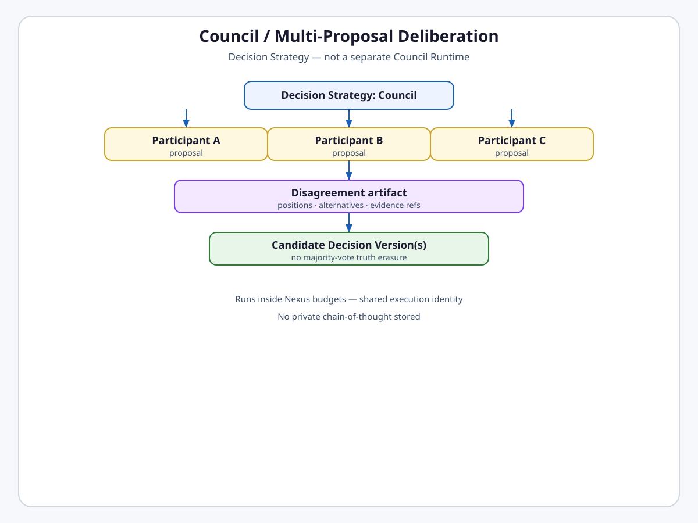
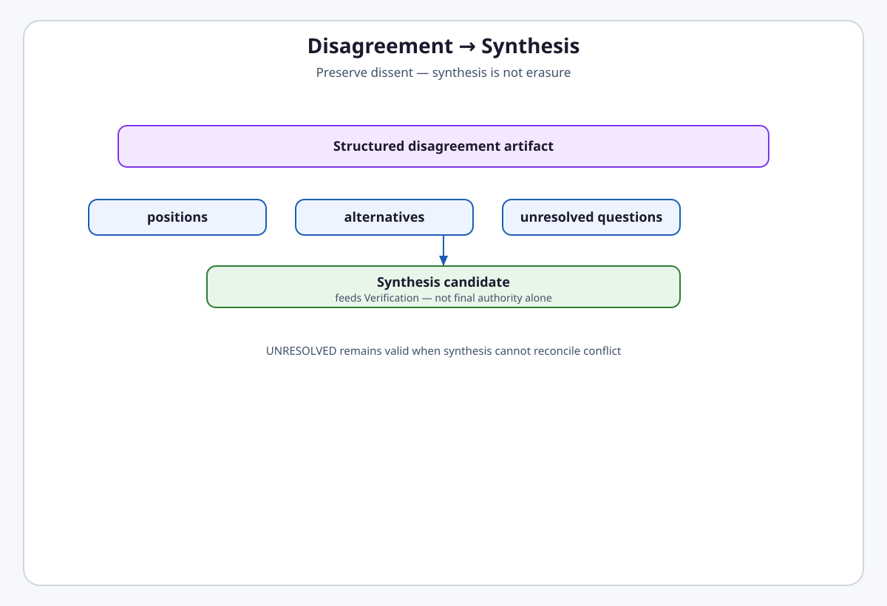

# Decision Deliberation

**Intergrax Decision Deliberation** describes how **Decision Strategies** — including **Council** — produce **Candidate Decisions** through optional multi-participant deliberation, parallel proposals, structured disagreement, and bounded synthesis.

Deliberation answers **„jakie kandydackie propozycje i niezgodności powstały przed weryfikacją?”** Council is **only** a strategy implementation — **not** the Decision System, **not** a Council Runtime, and **not** mandatory for every decision.

> [!IMPORTANT]
> **Maturity boundary:**
>
> - **Architecture:** **TARGET CANON — FROZEN**.
> - **Implementation:** Council runtime **NOT STARTED** — no separate engine shipped.
> - **Production:** Single-model / graph agent paths are **CURRENT**; Council is target strategy only.

**Primary audience:** Principal / Staff engineers designing multi-model deliberation, participant roles, disagreement artifacts, and strategy registration.

---

## Why it matters

Without explicit deliberation architecture:

- Council becomes a second runtime with hidden scheduler and retry,
- majority vote erases structurally important dissent,
- private chain-of-thought substitutes for auditable disagreement,
- parallel proposals collapse to last-write-wins,
- strategy selection hard-codes giant `if council ...` branches in lifecycle code.

Decision Deliberation defines **strategy contracts, participant independence, disagreement artifacts, bounded rounds, and hosting Execution budget consumption** — Decision Strategy runs inside hosting Execution; ORCHESTRATION may route through Nexus when required.

---

## At a glance

| Concern | Summary |
| -------- | -------- |
| **Role** | `DecisionStrategy` — produces candidate(s) + optional disagreement artifact |
| **Council** | One strategy — multi-participant deliberation |
| **Other strategies** | Single Model · Rule-Based · Hybrid · future registered |
| **Participants** | Configured roles — not hard-coded persona names in platform core |
| **Independence** | Meaningful model/provider separation — or explicit non-independent mode |
| **Parallel proposals** | Supported — branches preserved in lineage |
| **Disagreement** | First-class structured artifact — not erased by synthesis |
| **Synthesis** | Produces candidate for verification — not final authority alone |
| **Rounds** | Bounded — deliberation continuation owned by strategy |
| **Budget** | Council/deliberation consumes the hosting Execution budget — no separate Council budget engine |
| **Runtime** | **No** Council Runtime — Council is a Decision Strategy hosted through canonical Execution |

---

## Flagship architecture visual

<a href="assets/fullsize/decision-deliberation-council.md">
<picture>
  <source media="(prefers-color-scheme: dark)" srcset="assets/decision-deliberation-council-dark.svg">
  <source media="(prefers-color-scheme: light)" srcset="assets/decision-deliberation-council-light.svg">
  
</picture>
</a>

> **Council is a Decision Strategy. Execution System hosts strategy work. Verification and Lifecycle finalize authority.**

```text
Decision Strategy (e.g. Council)
      ↓
Participants (configured roles)
      ↓
Parallel proposals + disagreement artifact
      ↓
Optional synthesis candidate
      ↓
Candidate Decision Version(s) → Verification Pipeline
```

---

## DecisionStrategy role

A **DecisionStrategy** implements:

| Responsibility | Output |
| -------------- | ------ |
| Execute deliberation / proposal logic | One or more **Candidate Decisions** |
| Record participant identities | Auditable participant profile refs |
| Preserve disagreement | Structured **Disagreement Artifact** when applicable |
| Respect budget / round limits | Strategy-local continuation policy |

The **Decision Lifecycle** invokes strategies through a **stable strategy contract**. It does **not** embed Council-specific logic.

### Strategy kinds (extensible)

| Strategy | Summary |
| -------- | ------- |
| **Single Model** | One producer → candidate version |

Single Model declares a **logical inference profile** requirement in strategy configuration. **Execution System** owns profile → adapter resolution and provider invocation; Decision Strategy does not construct adapters or import provider SDKs.
| **Council** | Multi-participant proposals + disagreement + optional synthesis |
| **Rule-Based** | Deterministic selection / transformation |
| **Hybrid** | Composed strategies behind registration |
| **Future registered** | Plugin-registered strategies — typed contracts |

---

## Participant roles

Participant roles are **user-defined opaque string identifiers**. Platform core does **not** define proposer/skeptic/synthesizer role enums — those names appear only as configuration examples. Role semantics come from the host-supplied **instruction** on each `ParticipantRoleDefinition`; `role_id` itself carries no platform meaning.

| Concept | Rule |
| ------- | ---- |
| **Role definition** | `ParticipantRoleDefinition` — opaque `role_id` + semantic `instruction` |
| **Participant binding** | `ParticipantBinding` — maps `participant_id` + `role_id` → logical `InferenceProfileId` |
| **Context visibility** | Per-role policy — what each participant may see (DS-DELIB-05) |

```text
RoleDefinition
    │
    ├─ role_id: "sceptyk"          (user-defined opaque string)
    └─ instruction                 (semantic role instruction)
            │
            ↓
ParticipantBinding
    ├─ participant_id
    ├─ role_id
    └─ inference_profile_id
            │
            ↓
Execution System
            │
            ↓
InferenceProfileResolver
            │
            ↓
LLMAdapter
```

One `RoleDefinition` may bind to many `ParticipantBinding` entries (e.g. three skeptics with different profiles). The same `InferenceProfileId` may appear across different roles. Unused role definitions without bindings are allowed — runtime strategy may select a subset later.

**Model resolution:** Decision System declares only `InferenceProfileId`. **Execution System** resolves `InferenceProfileId` → `LLMAdapter` via host-owned `InferenceProfileResolver` — Decision Strategy does not construct adapters.

<a href="assets/fullsize/decision-deliberation-independence.md">
<picture>
  <source media="(prefers-color-scheme: dark)" srcset="assets/decision-deliberation-independence-dark.svg">
  <source media="(prefers-color-scheme: light)" srcset="assets/decision-deliberation-independence-light.svg">
  
</picture>
</a>

**Meaningful independence:** distinct model/provider profiles where assurance requires. Shared producer/verifier profile must be **explicitly labeled** non-independent.

---

## Context visibility

Each participant receives only the context their **role visibility policy** allows. Visibility is **per-role**, auditable configuration — not implicit full transcript sharing. Role names and context channel identifiers remain **opaque user-defined strings**; the platform does not hardcode proposer/skeptic vocabulary or a fixed context catalog.

| Rule | Detail |
| ---- | ------ |
| **Policy unit** | `ParticipantContextVisibilityPolicy` — one allowlist per `ParticipantRoleId` |
| **Default** | **Default-deny** — context not explicitly listed is not visible |
| **Active roles** | Every role referenced by a `ParticipantBinding` must have an explicit policy |
| **Unused roles** | Role definitions without bindings do not require a policy |
| **Instruction** | Role `instruction` is always supplied separately — not part of `visible_contexts` |
| **Private CoT** | Not stored — no chain-of-thought / scratchpad context channels |
| **Tool results** | Tool-derived context may appear as a configured channel; **visibility ≠ execution authorization** |

```text
ParticipantRoleId("sceptyk")
        │
        ↓
ParticipantContextVisibilityPolicy
        │
        ├── "problem"
        ├── "evidence"
        └── "peer-proposals"
                 │
                 ↓
       future context materializer
                 │
                 ↓
            participant
```

Contract: `intergrax/contracts/decision_context_visibility.py` — `DeliberationContextId`, `ParticipantContextVisibilityPolicy`, `ParticipantContextVisibilityConfiguration`.

**Private chain-of-thought is not stored** — only structured positions, alternatives, evidence refs, and unresolved questions may appear as explicitly configured context surfaces.

---

## Model / provider constraints

Strategies must use Tier-0 ToolRuntime / LLM adapter paths ([`LLM_ADAPTERS.md`](LLM_ADAPTERS.md), [`TOOLS.md`](TOOLS.md)) — no direct vendor SDK bypass on wired platform paths.

---

## Parallel proposals

```text
       → candidate v2A
proposal v1
       → candidate v2B
```

Both branches enter version lineage. Finalization requires verification, adjudication, or **UNRESOLVED** — never silent overwrite.

---

## Disagreement artifact

Council / multi-model deliberation **must not** lose dissent through simple majority vote or opaque synthesis.

<a href="assets/fullsize/decision-deliberation-disagreement.md">
<picture>
  <source media="(prefers-color-scheme: dark)" srcset="assets/decision-deliberation-disagreement-dark.svg">
  <source media="(prefers-color-scheme: light)" srcset="assets/decision-deliberation-disagreement-light.svg">
  
</picture>
</a>

Structured fields include:

- **positions** — participant stance summaries (no private CoT),
- **alternatives** — competing options,
- **disagreement** — explicit conflict records,
- **evidence refs** — shared evidentiary pointers,
- **unresolved questions** — open items for adjudication or UNRESOLVED.

Disagreement binds exact proposals within one canonical Decision identity boundary;
proposal references pair `DecisionIdentity` with `DecisionLineageRef` so sibling
branches from different decisions, tenants, or scopes cannot be mixed.

---

## Synthesis

**Synthesis** produces a **candidate** Decision Version (or refinement) for the Verification Pipeline. Synthesis is **not**:

- automatic truth by majority,
- final **Authoritative Decision** without lifecycle gates,
- authorization to execute.

When synthesis cannot reconcile conflict → lifecycle may adjudicate or resolve **UNRESOLVED**.

---

## Bounded rounds

<a href="assets/fullsize/decision-deliberation-bounded-rounds.md">
<picture>
  <source media="(prefers-color-scheme: dark)" srcset="assets/decision-deliberation-bounded-rounds-dark.svg">
  <source media="(prefers-color-scheme: light)" srcset="assets/decision-deliberation-bounded-rounds-light.svg">
  
</picture>
</a>

| Loop kind | Owner | Trigger |
| --------- | ----- | ------- |
| **Deliberation continuation** | Decision Strategy | Another council round within budget |
| **Decision revision** | Decision Lifecycle | Verification challenge |
| **Technical retry** | Execution / Reliability appropriate to failing operation | Provider / tool failure |

Deliberation rounds consume the **hosting Execution budget** with verification and revision — no separate Council scheduler or budget engine. ORCHESTRATION may route through Nexus when required.

---

## No separate Council Runtime

**Hard rules:**

- Council does **not** own scheduler, retry, checkpoint, or execution identity.
- Council does **not** finalize authoritative decisions.
- Council does **not** perform verification (feeds candidates **to** Verification Pipeline).
- Decision Strategy runs inside hosting Execution; ORCHESTRATION may route through Nexus when required.

**Never:** `Council Runtime` as peer to Nexus.

---

## No majority-vote truth assumption

Majority aggregation may inform synthesis candidates but **cannot** delete disagreement artifacts or bypass verification. A slim majority with unresolved evidence should yield challenge, adjudication, or **UNRESOLVED** — not silent **ACCEPTED**.

---

## Relationship to Decision System

| Phase | Deliberation role |
| ----- | ----------------- |
| **Proposal / Deliberation** | Strategy produces candidates |
| **Verification** | Independent of strategy internals |
| **Revision** | May follow verification challenge — not strategy round |
| **Adjudication** | May resolve deadlocked Council or competing branches |
| **Resolution** | Lifecycle owns `ACCEPTED` / `REJECTED` / `UNRESOLVED` — separate from execution termination |

---

## Public invariants

```text
Council is a Decision Strategy — not the Decision System.
```

```text
Disagreement is an artifact — not private chain-of-thought.
```

```text
Synthesis produces candidates — not authoritative decisions alone.
```

```text
No separate Council Runtime.
```

---

## Current maturity

| Axis | Level |
| ---- | ----- |
| **Architecture** | **A4** frozen target |
| **Implementation** | **I0** — no Council strategy shipped |
| **Production** | **P0** for Council — agent/graph paths only |

---

## Go deeper

| Depth | Route |
| ----- | ----- |
| **Extended engineering model** | [`satellites/DECISION_DELIBERATION_extended_depth.md`](satellites/DECISION_DELIBERATION_extended_depth.md) — Council, independence, bounded execution |
| Decision Lifecycle | [`DECISION_SYSTEM.md`](DECISION_SYSTEM.md) |
| Verification | [`DECISION_VERIFICATION.md`](DECISION_VERIFICATION.md) |
| Implementation plan | [`maintainers/plans/DECISION_DELIBERATION.md`](../maintainers/plans/DECISION_DELIBERATION.md) |
| Reasoning | [`REASONING_AND_COGNITION.md`](REASONING_AND_COGNITION.md) |

---

## Engineering canon — Cursor read scope

**Default:** strategy role + Council diagram + disagreement section.

- **Implement deliberation:** this file + [`maintainers/plans/DECISION_DELIBERATION.md`](../maintainers/plans/DECISION_DELIBERATION.md) hub.
- **Architecture satellite:** [`satellites/DECISION_DELIBERATION_extended_depth.md`](satellites/DECISION_DELIBERATION_extended_depth.md) on demand.
