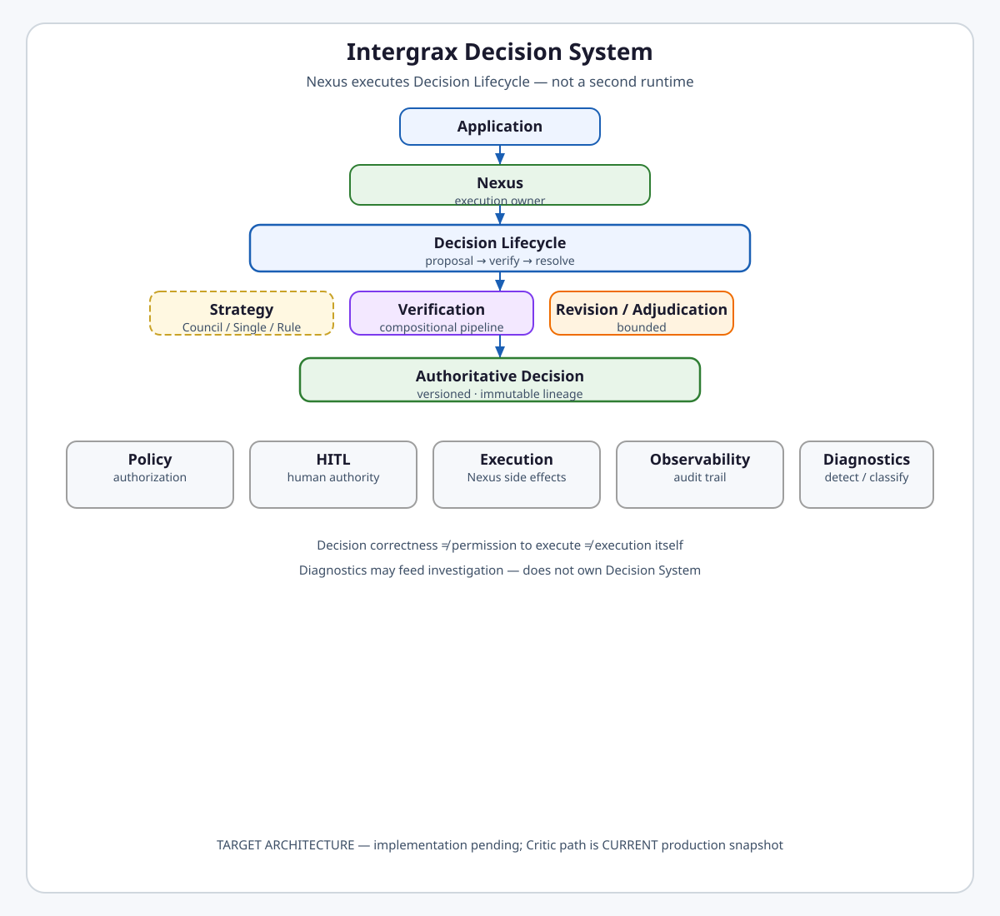
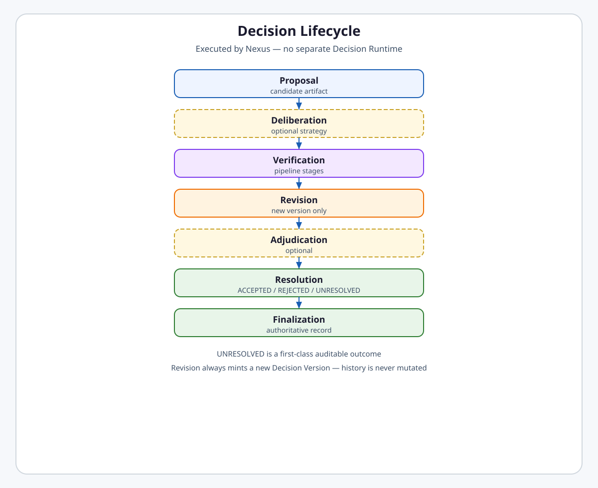
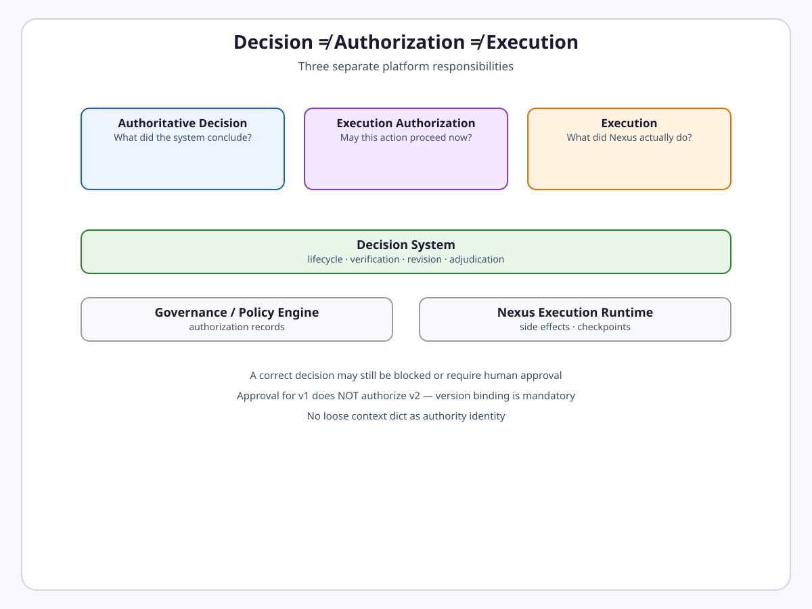
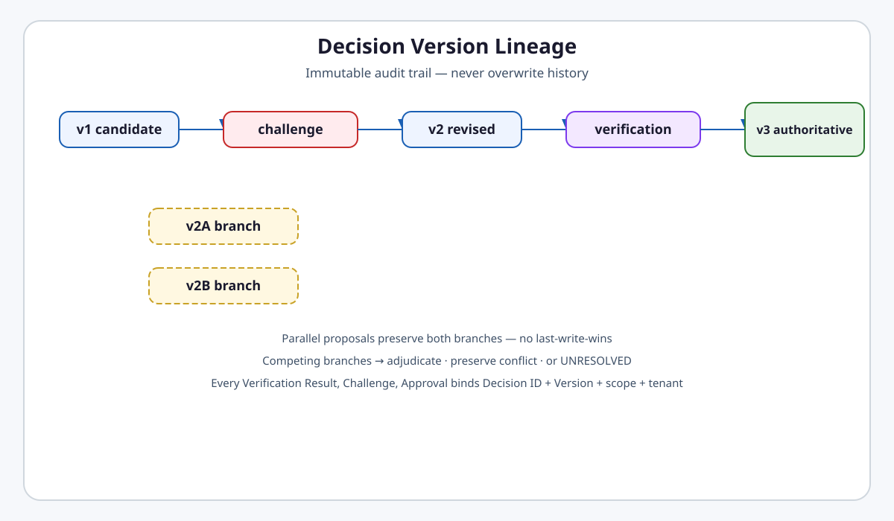
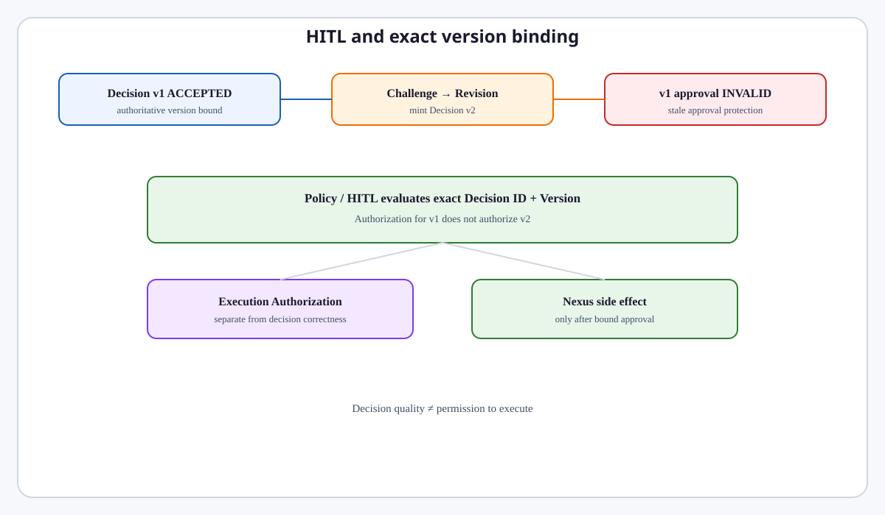
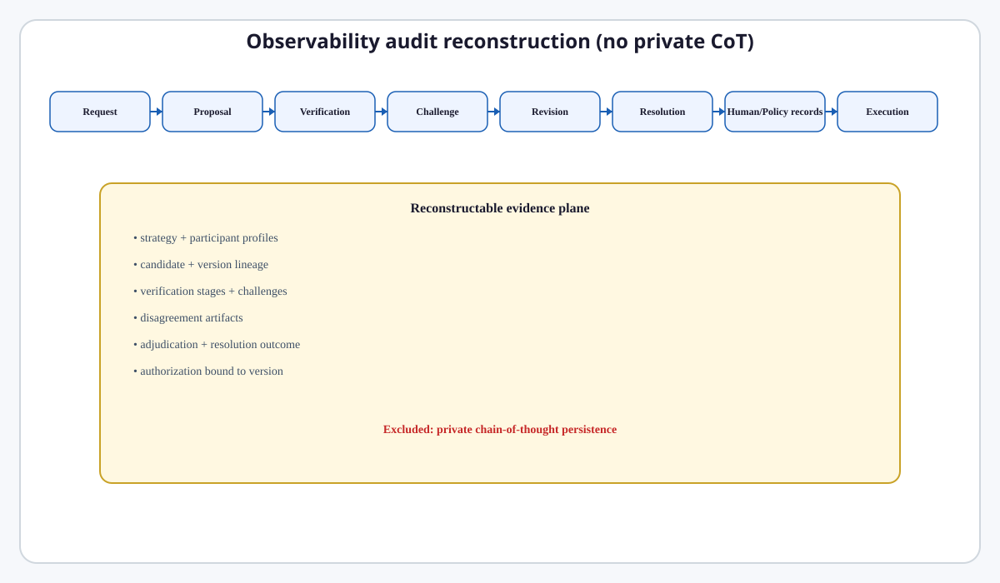
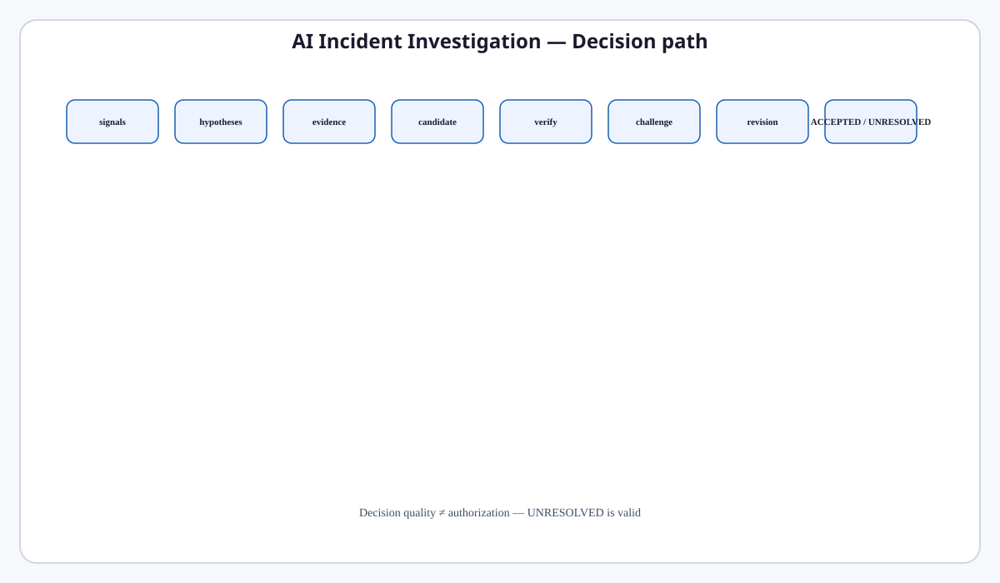
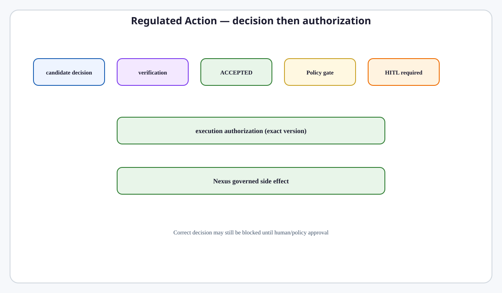
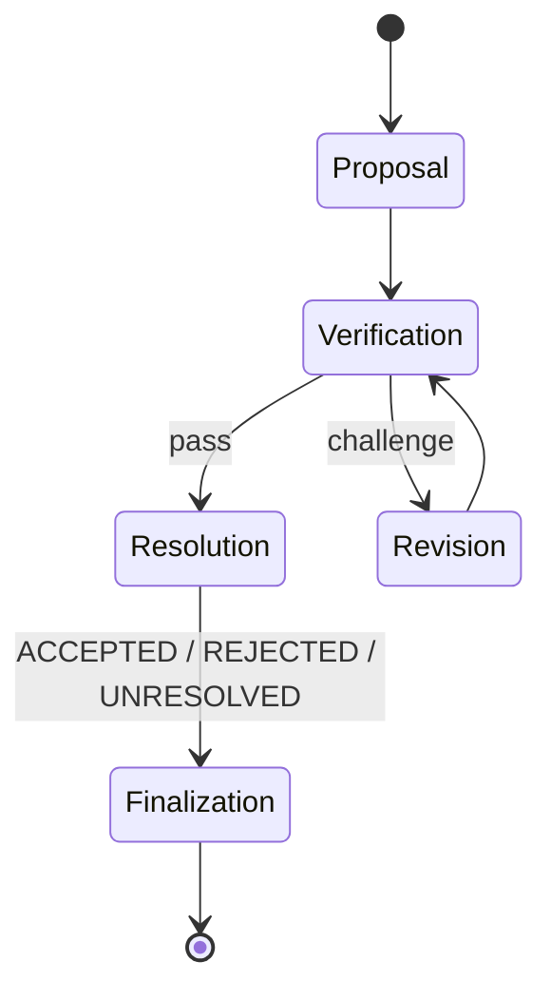

# Decision System

**Intergrax Decision System** is the platform capability that leads a decision from proposal through optional deliberation, verification, revision, optional adjudication, resolution, and finalization to an **authoritative lifecycle outcome** — executed entirely as a **Decision Lifecycle model inside Nexus**, not as a second runtime.

The Decision System answers **„jaki jest autorytatywny wynik decyzji?”** — classification, recommendation, selection, plan, approval, finding, or evidence-backed conclusion. It is **not** an „ulepszony Critic”, **not** Council Runtime, and **not** a parallel execution engine.

> [!IMPORTANT]
> **Maturity boundary (frozen target vs current production):**
>
> - **Architecture:** **TARGET CANON — FROZEN** (this document and paired [`DECISION_VERIFICATION.md`](DECISION_VERIFICATION.md) · [`DECISION_DELIBERATION.md`](DECISION_DELIBERATION.md)).
> - **Implementation:** **NOT YET MIGRATED** — no Decision System runtime classes shipped.
> - **Production:** **CURRENT** correctness path remains [`CRITIC_VERIFICATION.md`](CRITIC_VERIFICATION.md) (`CriticOrchestrator`, CVL) until clean-cut migration.
> - **Evidence:** Decision System E2E not yet qualified — no production-ready claim.

**Primary audience:** Principal / Staff engineers, harness integrators, and Tier-2/3 authors configuring decision strategies, verification posture, and adjudication flows.

---

## Why it matters

Without a single platform Decision System:

- verification, deliberation, revision, and human authority collapse into ad-hoc critic loops,
- Council becomes a second runtime with its own scheduler and retry,
- candidate outputs are mistaken for authoritative decisions,
- version history is mutated instead of appended,
- policy authorization is confused with decision correctness,
- parallel proposals race to last-write-wins finalization,
- crash resume can mint duplicate authoritative outcomes or expand budgets,
- diagnostics and decision-making compete for the same ownership.

The Decision System provides **typed lifecycle semantics, version lineage, compositional verification, extensible strategies, and audit surfaces** so applications compose domain decisions safely while Nexus remains the sole execution owner.

**Nexus executes Decision Lifecycle. Domain/application owns what is being decided.**

---

## At a glance

| Concern | Summary |
| -------- | -------- |
| **Core question** | What is the authoritative decision outcome for this scope? |
| **Execution owner** | **Nexus only** — Decision Lifecycle is a model, not a runtime |
| **Lifecycle** | Proposal → optional Deliberation → Verification → Revision → optional Adjudication → Resolution → Finalization |
| **Decision Resolution** | `ACCEPTED` · `REJECTED` · **`UNRESOLVED`** — merytoryczny wynik lifecycle; oddzielny od termination wykonania |
| **Strategy** | Pluggable `DecisionStrategy` — Single Model, Council, Rule-Based, Hybrid, future registered strategies |
| **Artifact** | Typed `Decision Artifact` family — not universal `payload: dict[str, Any]` |
| **Candidate vs authoritative** | Candidates are proposals; **ACCEPTED** binds a specific **Decision Version**; terminal **REJECTED** / **UNRESOLVED** persist an authoritative **resolution record** without a fake accepted version |
| **Verification** | Compositional **Verification Pipeline** — see [`DECISION_VERIFICATION.md`](DECISION_VERIFICATION.md) |
| **Deliberation** | Optional strategy capability — see [`DECISION_DELIBERATION.md`](DECISION_DELIBERATION.md) |
| **UNRESOLVED** | First-class auditable outcome when material is insufficient or conflict is irresolvable |
| **Decision ≠ Authorization ≠ Execution** | Three separate platform responsibilities — see [below](#decision--authorization--execution) |
| **Version binding** | Every verification result, challenge, approval, adjudication, and authorization record binds **Decision ID + Decision Version + scope + tenant + execution identity** |
| **Concurrency** | Parallel proposal branches preserve lineage; no duplicate authoritative decisions per scope |
| **Crash / resume** | Uses Nexus checkpoint/persistence — **no** Decision checkpoint engine |
| **Retry boundaries** | Technical retry (Nexus) · decision revision (Lifecycle) · deliberation rounds (Strategy) — never one generic loop |
| **HITL** | Invokes platform HITL — does not implement Human Engine |
| **Policy** | Cross-cutting authorization — Decision System does not own Runtime Policy Engine |
| **Diagnostics** | May feed investigation — does not own Decision System |
| **Observability** | Full decision audit trail — no private chain-of-thought |
| **Maturity** | **A4 target / I0 / P0 / E0** for Decision System — see [Current maturity](#current-maturity) |

---

## Flagship architecture visual

<a href="assets/fullsize/decision-system-flagship.md">
<picture>
  <source media="(prefers-color-scheme: dark)" srcset="assets/decision-system-flagship-dark.svg">
  <source media="(prefers-color-scheme: light)" srcset="assets/decision-system-flagship-light.svg">
  
</picture>
</a>

> **Nexus executes Decision Lifecycle. Decision correctness ≠ permission to execute ≠ execution itself.**

```text
Application intent
      ↓
Nexus (sole execution owner)
      ↓
Decision Lifecycle
├── optional Decision Strategy (Council / Single / Rule / Hybrid)
├── Verification Pipeline
├── Revision (bounded)
└── optional Adjudication
      ↓
Authoritative lifecycle outcome (accepted decision or resolution record)
      ↓
Policy / HITL may gate consequential execution
      ↓
Nexus Execution (side effects)
```

---

## Responsibility model

| Domain | Owns | Does not own |
| ------ | ---- | ------------ |
| **Decision System** | Lifecycle, candidate/authoritative semantics, version lineage, resolution (incl. UNRESOLVED), strategy orchestration contract | Global retry, authorization, side effects, diagnostics classification, private CoT |
| **Verification Pipeline** | Check correctness of a **Decision Version** — stages, challenges, fail-closed rules | Finalize authoritative decision, mutate versions, policy, HITL, global retry |
| **Decision Strategy** | Deliberation rounds, parallel proposals, disagreement artifacts, synthesis candidates | Separate runtime, scheduler, checkpoint engine, authorization |
| **Nexus** | Execute lifecycle stages, budgets, checkpoints, technical retry, persistence | Domain rubric content, business permission meaning |
| **Governance / Policy** | Execution authorization for consequential actions | Whether a decision artifact is correct |
| **HITL** | Human approver / adjudicator / escalation records | Decision lifecycle orchestration |
| **Reliability** | Technical retry on provider/tool failure | Semantic revision loops |
| **Observability** | Audit evidence for decision events | Decision rubric or strategy content |
| **Diagnostics** | Detect/classify platform problems | Own decision lifecycle |

```text
Harness  → lifecycle orchestration, verification composition, evidence hooks
Domain   → artifact types, rubrics, strategy selection, correctness criteria
```

### Public invariants

```text
Nexus executes Decision Lifecycle — never Nexus → second Decision Runtime.
```

```text
Decision correctness ≠ permission to execute ≠ execution itself.
```

```text
Candidate Decision ≠ Authoritative Decision — history is never overwritten.
```

```text
UNRESOLVED is a valid, auditable resolution outcome.
```

```text
Decision Resolution ≠ Lifecycle / Execution Termination.
```

```text
Execution = FAILED does not imply Decision Resolution = REJECTED.
```

```text
Verification checks. Verification does not authorize, execute, or finalize alone.
```

```text
Approval for v1 does NOT authorize v2.
```

---

## Decision Lifecycle

The lifecycle is a **state machine model** executed by Nexus using existing scheduler, retry, checkpoint, budget, and execution identity infrastructure.

<a href="assets/fullsize/decision-lifecycle.md">
<picture>
  <source media="(prefers-color-scheme: dark)" srcset="assets/decision-lifecycle-dark.svg">
  <source media="(prefers-color-scheme: light)" srcset="assets/decision-lifecycle-light.svg">
  
</picture>
</a>

| Stage | Purpose |
| ----- | ------- |
| **Proposal** | Mint initial **Candidate Decision** with typed **Decision Artifact** |
| **Deliberation** | Optional — strategy produces one or more candidates (e.g. Council) |
| **Verification** | Compositional pipeline evaluates a specific **Decision Version** |
| **Revision** | Explicit process mints **new Decision Version** when verification challenges |
| **Adjudication** | Optional — resolve competing proposals, verifier conflict, deadlocked Council, or human adjudication |
| **Resolution** | `ACCEPTED` · `REJECTED` · **`UNRESOLVED`** — bounded, auditable **Decision Resolution** |
| **Finalization** | Persist authoritative **lifecycle outcome** — accepted decision version or terminal resolution record |

Council is **only** a Decision Strategy implementation — not a mandatory stage.

---

## Decision Resolution

**Decision Resolution** answers: *jaki jest merytoryczny wynik procesu decyzyjnego dla tego scope?*

| Outcome | Meaning |
| ------- | ------- |
| **`ACCEPTED`** | A specific **Decision Version** satisfied required lifecycle gates and is the accepted decision for the scope |
| **`REJECTED`** | Lifecycle executed correctly, but **no** proposed version was accepted as the right decision |
| **`UNRESOLVED`** | The system lacks sufficient basis for a responsible resolution — not a synthetic pass/fail |

Proposal history, disagreement artifacts, and verification lineage **remain preserved** for all three outcomes.

### Decision Resolution ≠ Lifecycle / Execution Termination

**Decision Resolution** and **lifecycle / execution termination** are **independent axes**:

| Axis | Question |
| ---- | -------- |
| **Decision Resolution** | What is the substantive decision outcome? |
| **Lifecycle / Execution Termination** | How did the hosting execution end? (e.g. completed, failed, cancelled, timed out, budget stop, provider outage) |

```text
Decision Resolution = UNRESOLVED
Execution = COMPLETED
```

is a **valid** result — the system ran correctly and responsibly refused an artificial resolution.

```text
Execution = FAILED
```

does **not** automatically imply:

```text
Decision Resolution = REJECTED
```

Infrastructure failure, cancellation, timeout, and budget stop are **execution/lifecycle termination** events — not substitutes for merytoryczne `REJECTED` or `UNRESOLVED`.

---

## Finalization

**Finalization** persists the terminal **authoritative lifecycle outcome** for a decision scope.

| Decision Resolution | Finalization artifact |
| ------------------- | --------------------- |
| **`ACCEPTED`** | **Authoritative Accepted Decision** — binds the accepted **Decision Version** and its typed artifact |
| **`REJECTED`** | **Authoritative Resolution Record** — terminal lifecycle outcome with `REJECTED`; **no** accepted Decision Version is minted |
| **`UNRESOLVED`** | **Authoritative Resolution Record** — terminal lifecycle outcome with `UNRESOLVED`; **no** accepted Decision Version is minted |

There is **no** `fake decision` workaround. Candidate versions and proposal history remain in auditable lineage after finalization.

For a given decision scope, **at most one** terminal authoritative lifecycle outcome may exist — either one **Authoritative Accepted Decision** or one terminal **Authoritative Resolution Record**.

---

## Decision Artifacts

A **Decision Artifact** is the typed, contract-bound payload a decision carries. Examples:

| Artifact kind | Illustrative use |
| ------------- | ---------------- |
| Classification | incident severity, intent label |
| Recommendation | strategic option ranking |
| Selection | chosen tool, plan branch, hypothesis |
| Plan | structured action proposal |
| Approval | sign-off artifact (distinct from Execution Authorization) |
| Finding | audit or review finding |
| Evidence-backed conclusion | structured conclusion with evidence refs |

**Evidence Claims** remain a valuable, reusable artifact family for evidence-backed decisions ([`PROOF_RECEIPTS.md`](PROOF_RECEIPTS.md) · evidence architecture). Not every decision is an `EvidenceClaimSet`.

Extensibility is **typed and contractual** — registered artifact kinds and schema contracts, not `payload: dict[str, Any]`.

---

## Candidate vs Authoritative Decision

| Concept | Meaning |
| ------- | ------- |
| **Candidate Decision** | A proposed decision version — may fail verification or remain non-final |
| **Authoritative Accepted Decision** | The specific **Decision Version** that satisfied required lifecycle gates — only when Decision Resolution is **`ACCEPTED`** |
| **Authoritative Resolution Record** | Terminal lifecycle outcome for **`REJECTED`** or **`UNRESOLVED`** — authoritative without an accepted Decision Version |
| **Decision Version** | Immutable identity in lineage — `v1 → challenge → v2 → verification → v3 authoritative` |

v1 and v2 remain in auditable lineage after v3 is authoritative. **Never mutate** a prior version in place.

---

## Decision ≠ Authorization ≠ Execution

<a href="assets/fullsize/decision-authorization-execution.md">
<picture>
  <source media="(prefers-color-scheme: dark)" srcset="assets/decision-authorization-execution-dark.svg">
  <source media="(prefers-color-scheme: light)" srcset="assets/decision-authorization-execution-light.svg">
  
</picture>
</a>

| Responsibility | Question |
| -------------- | -------- |
| **Authoritative Accepted Decision / Resolution Record** | What did the system finally conclude, recommend, find — or explicitly refuse to resolve? |
| **Execution Authorization** | May this specific action execute in this authority/policy context? |
| **Execution** | What did Nexus actually execute? |

A correct **Authoritative Decision** may still be **blocked**, **deferred**, or **require human approval** before side effects. Policy evaluates at configured execution points — not solely as one post-decision gate ([`GOVERNED_EXECUTION.md`](GOVERNED_EXECUTION.md)).

The Decision System does **not** own Governance, Runtime Policy Engine, Execution Authority, or HITL infrastructure.

---

## Version binding / security

Every:

- Verification Result,
- Challenge,
- Human approval,
- Adjudication Result,
- Policy / authorization record,

**must** bind to exact:

- **Decision ID**
- **Decision Version**
- decision scope
- tenant
- execution identity (`TaskId` / `RunId` / `AttemptId` / **TARGET** `ExecutionId`)

Approval for `v1` does **not** pass to `v2`. Authorization for `v1` does **not** authorize `v2`. Loose context dicts are **not** authority identity.

<a href="assets/fullsize/decision-version-lineage.md">
<picture>
  <source media="(prefers-color-scheme: dark)" srcset="assets/decision-version-lineage-dark.svg">
  <source media="(prefers-color-scheme: light)" srcset="assets/decision-version-lineage-light.svg">
  
</picture>
</a>

---

## Nexus boundary

**Hard rule:** `Nexus executes Decision Lifecycle`.

The Decision Lifecycle:

- is **not** a separate runtime,
- has **no** own scheduler / retry / checkpoint / budget / execution identity,
- uses Nexus infrastructure for all execution mechanics.

**Never:** `Nexus → second Decision Runtime`.

---

## Policy boundary

Verification quality **is not** authorization. The Runtime Policy Engine remains a cross-cutting platform responsibility ([`GOVERNED_EXECUTION.md`](GOVERNED_EXECUTION.md)). Policy may allow, deny, or require human decision for actions flowing from a valid **Authoritative Decision**.

---

## HITL boundary

The legacy **L2 Human Critic** concept is **removed** from the target model. Humans may act as:

- approver,
- adjudicator,
- domain authority,
- policy-required authority,
- escalation target.

The Decision System **invokes** the existing HITL mechanism ([`RELIABILITY_FAILURE_AND_HITL.md`](RELIABILITY_FAILURE_AND_HITL.md)) — it does **not** implement a Human Engine.

<a href="assets/fullsize/decision-hitl-version-binding.md">
<picture>
  <source media="(prefers-color-scheme: dark)" srcset="assets/decision-hitl-version-binding-dark.svg">
  <source media="(prefers-color-scheme: light)" srcset="assets/decision-hitl-version-binding-light.svg">
  
</picture>
</a>

---

## Diagnostics boundary

| System | Role |
| ------ | ---- |
| **Diagnostics** | Detect / classify platform operation problems |
| **Decision System** | Lead decision process from proposal to authoritative outcome |

Diagnostics may pass data into investigation / decision flows. Diagnostics is **not** owner of Decision System. Decision System is **not** owner of Diagnostics ([`OBSERVABILITY.md`](OBSERVABILITY.md) DIAG semantics).

---

## Observability / audit

The Decision System must support full reconstruction of:

- decision request,
- selected strategy,
- participant identities / profiles,
- candidate IDs,
- decision versions,
- disagreement artifacts,
- evidence refs,
- verification stages / results,
- challenges,
- revision requests,
- revisions,
- adjudication,
- budget stop,
- escalation,
- human authority record,
- resolution (ACCEPTED / REJECTED / UNRESOLVED),
- authoritative accepted decision ID (when ACCEPTED),
- authoritative resolution record ID (when REJECTED / UNRESOLVED),
- authorization relation to bound version.

**Do not** persist private chain-of-thought.

<a href="assets/fullsize/decision-observability-audit-reconstruction.md">
<picture>
  <source media="(prefers-color-scheme: dark)" srcset="assets/decision-observability-audit-reconstruction-dark.svg">
  <source media="(prefers-color-scheme: light)" srcset="assets/decision-observability-audit-reconstruction-light.svg">
  
</picture>
</a>

---

## Budgets

Decision Strategy, Verification, Revision, and Adjudication share the **Nexus execution budget** for the hosting execution. Deliberation continuation, revision loops, and verification stages must respect configured ceilings. Resume **cannot** increase a previously granted budget ceiling.

---

## Insufficient material and UNRESOLVED

The system must **not** be forced into synthetic `ACCEPTED` / `REJECTED` when:

- evidence is insufficient,
- verifiers conflict irreconcilably,
- parallel branches remain legitimately competing.

**`UNRESOLVED`** is a first-class, auditable **Decision Resolution** outcome — distinct from execution failure.

---

## Concurrency

Parallel proposals are supported:

```text
       → v2A
v1
       → v2B
```

Both branches preserve history. **No last-write-wins** for finalization.

For a given decision scope, **at most one** terminal authoritative lifecycle outcome may exist. Competing valid branches require **adjudication**, **preserved conflict artifact**, or **`UNRESOLVED`** resolution.

---

## Crash / resume

Decision state must be recoverable via **existing Nexus checkpoint / persistence** — **no** Decision checkpoint engine.

<a href="assets/fullsize/decision-crash-concurrency.md">
<picture>
  <source media="(prefers-color-scheme: dark)" srcset="assets/decision-crash-concurrency-dark.svg">
  <source media="(prefers-color-scheme: light)" srcset="assets/decision-crash-concurrency-light.svg">
  
</picture>
</a>

| Requirement | Rule |
| ----------- | ---- |
| Durability | Lifecycle stage, version lineage, finalize guard state |
| Resume | Continue from persisted stage — not full deliberation restart without cause |
| Crash safety | Cannot mint duplicate authoritative decision |
| Budget | Resume cannot expand prior granted budget |

---

## Retry boundaries

| Kind | Trigger | Owner |
| ---- | ------- | ----- |
| **Technical retry** | Model / tool / provider failure | Nexus Reliability |
| **Decision revision** | Semantically insufficient decision content | Decision Lifecycle |
| **Deliberation continuation** | Another Council / strategy round | Decision Strategy |

Do **not** merge these into one generic retry loop.

---

## Plugin / extension posture

- **Decision Strategy** — registered strategies behind stable strategy contract; lifecycle unaware of Council internals.
- **Verification stages** — compositional plugins with typed stage contracts ([`DECISION_VERIFICATION.md`](DECISION_VERIFICATION.md)).
- **Decision Artifact kinds** — typed registration — not reflection over loose dicts.

Platform plugin architecture applies at extension boundaries ([`PLATFORM_PLUGINS.md`](PLATFORM_PLUGINS.md)).

---

## Cross-scenario validation

| Scenario | Decision System path |
| -------- | -------------------- |
| **Incident Investigation** | hypotheses → evidence → verification → revision → supported / **UNRESOLVED** conclusion |
| **Strategic Decision** | parallel proposals → disagreement → synthesis → verification → authoritative recommendation |
| **Contract Review** | findings → deterministic + semantic verification → human authority when required |
| **Cyber Incident** | multiple hypotheses → evidence conflicts → verification / adjudication → **UNRESOLVED** possible |
| **Regulated Action** | decision quality accepted → policy requires human → execution authorization → Nexus side effect |

No scenario requires a special-case exception to the frozen fundamentals above.

### Scenario walkthrough — AI Incident Investigation

<a href="assets/fullsize/decision-scenario-incident-investigation.md">
<picture>
  <source media="(prefers-color-scheme: dark)" srcset="assets/decision-scenario-incident-investigation-dark.svg">
  <source media="(prefers-color-scheme: light)" srcset="assets/decision-scenario-incident-investigation-light.svg">
  
</picture>
</a>

### Scenario walkthrough — Regulated Action

<a href="assets/fullsize/decision-scenario-regulated-action.md">
<picture>
  <source media="(prefers-color-scheme: dark)" srcset="assets/decision-scenario-regulated-action-dark.svg">
  <source media="(prefers-color-scheme: light)" srcset="assets/decision-scenario-regulated-action-light.svg">
  
</picture>
</a>



---

## Relationship to Intergrax

| Neighbor | Relationship |
| -------- | ------------- |
| [**Nexus Execution Flow**](NEXUS_EXECUTION_FLOW.md) | Hosts Decision Lifecycle execution |
| [**Unified Execution Runtime**](UNIFIED_EXECUTION_RUNTIME.md) | Profiles, budgets, checkpoint ports |
| [**Decision Verification**](DECISION_VERIFICATION.md) | Compositional verification pipeline |
| [**Decision Deliberation**](DECISION_DELIBERATION.md) | Strategy / Council / deliberation |
| [**Governed Execution**](GOVERNED_EXECUTION.md) | Execution authorization — separate from decision correctness |
| [**Reliability / HITL**](RELIABILITY_FAILURE_AND_HITL.md) | Technical retry; canonical HITL invocation |
| [**Observability**](OBSERVABILITY.md) | Decision audit evidence |
| [**CRITIC_VERIFICATION**](CRITIC_VERIFICATION.md) | **CURRENT IMPLEMENTATION SNAPSHOT** — pending clean-cut DELETE |

---

## Current maturity

Aligned with [`MATURITY_TAXONOMY.md`](../technical/guides/MATURITY_TAXONOMY.md):

| Axis | Level | Rationale |
| ---- | ----- | --------- |
| **Architecture (A)** | **A4** | Frozen target canon established; boundaries to Nexus, Policy, HITL, Diagnostics explicit |
| **Implementation (I)** | **I0** | No Decision System runtime migration shipped |
| **Production (P)** | **P0** | Production path remains CVL / Critic until clean cut |
| **Evidence (E)** | **E0** | No Decision System Docker E2E qualification completed |

---

## Evidence / proof

| Class | Artifacts |
| ----- | --------- |
| **Architecture** | This hub · [`DECISION_VERIFICATION.md`](DECISION_VERIFICATION.md) · [`DECISION_DELIBERATION.md`](DECISION_DELIBERATION.md) |
| **Implementation plan** | [`maintainers/plans/DECISION_SYSTEM.md`](../maintainers/plans/DECISION_SYSTEM.md) |
| **CURRENT production** | [`CRITIC_VERIFICATION.md`](CRITIC_VERIFICATION.md) |
| **Public proof** | Not claimed — pending DS-E2E Docker qualification phase |

### Production qualification boundary

The Decision System is **not** production-qualified after:

- unit tests,
- integration tests,
- mocked E2E.

**Production qualification** requires completion of the real **Docker E2E qualification phase** ([`maintainers/plans/DECISION_SYSTEM.md`](../maintainers/plans/DECISION_SYSTEM.md) — Phase DS-E2E).

---

## Go deeper

| Depth | Route |
| ----- | ----- |
| **Extended engineering model** | [`satellites/DECISION_SYSTEM_extended_depth.md`](satellites/DECISION_SYSTEM_extended_depth.md) — identity, versioning, lifecycle, authority, concurrency, recovery, platform boundaries |
| Verification pipeline | [`DECISION_VERIFICATION.md`](DECISION_VERIFICATION.md) |
| Deliberation / Council | [`DECISION_DELIBERATION.md`](DECISION_DELIBERATION.md) |
| Implementation plan | [`maintainers/plans/DECISION_SYSTEM.md`](../maintainers/plans/DECISION_SYSTEM.md) |
| CURRENT Critic snapshot | [`CRITIC_VERIFICATION.md`](CRITIC_VERIFICATION.md) |
| Governance | [`GOVERNED_EXECUTION.md`](GOVERNED_EXECUTION.md) |
| Reliability / HITL | [`RELIABILITY_FAILURE_AND_HITL.md`](RELIABILITY_FAILURE_AND_HITL.md) |
| Maturity taxonomy | [`MATURITY_TAXONOMY.md`](../technical/guides/MATURITY_TAXONOMY.md) |

---

## Engineering canon

### Cursor read scope (token budget)

**Default:** this hub read-scope block + at-a-glance + one cited diagram section.

- **Implement Decision System:** read this file + [`maintainers/plans/DECISION_SYSTEM.md`](../maintainers/plans/DECISION_SYSTEM.md) hub only.
- **Architecture satellite:** [`satellites/DECISION_SYSTEM_extended_depth.md`](satellites/DECISION_SYSTEM_extended_depth.md) on demand — one per session unless RESUME cites more.
- **Verification slice:** add [`DECISION_VERIFICATION.md`](DECISION_VERIFICATION.md) + [`maintainers/plans/DECISION_VERIFICATION.md`](../maintainers/plans/DECISION_VERIFICATION.md).
- **Deliberation slice:** add [`DECISION_DELIBERATION.md`](DECISION_DELIBERATION.md) + [`maintainers/plans/DECISION_DELIBERATION.md`](../maintainers/plans/DECISION_DELIBERATION.md).
- **Skip** full [`CRITIC_VERIFICATION.md`](CRITIC_VERIFICATION.md) unless auditing CURRENT implementation or migration disposition.
