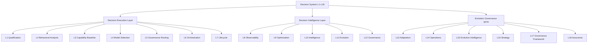
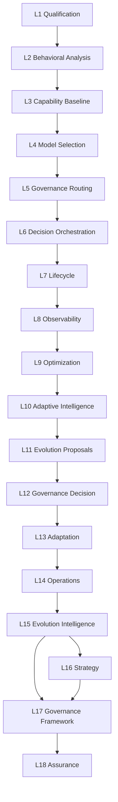
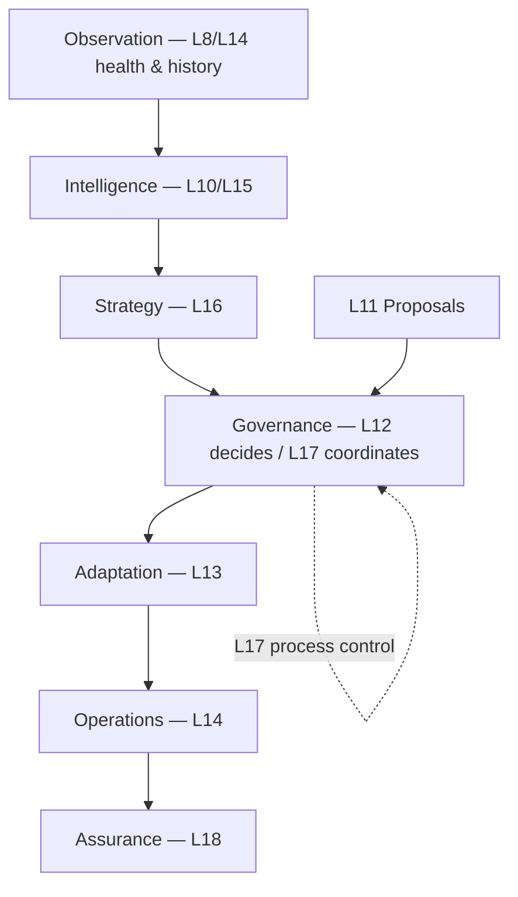

# Decision System — Enterprise Architecture Reference (L1–L18)

**Status:** Reference documentation aligned to repository code as of the DS-E2E-15J closeout track.  
**Audience:** Enterprise architects, principal engineers, qualification integrators.  
**Scope:** Describes **existing** architecture only — no target-state invention.

> [!IMPORTANT]
> **Two complementary surfaces (do not conflate):**
>
> | Surface | Role | Primary code |
> | ------- | ---- | ------------ |
> | **Platform Decision System** | Authoritative decision **lifecycle** inside canonical Execution (proposal → verification → resolution). | `intergrax/contracts/decision_*`, `intergrax/runtime/decision_*`, [`DECISION_SYSTEM.md`](DECISION_SYSTEM.md) |
> | **DS-E2E-15J model matrix (L1–L18)** | Layered **qualification → routing → orchestration → evolution** stack with plugin engines for enterprise E2E proof and product reference. | `testing_support/decision_e2e/model_matrix/`, `testing_support/decision_e2e/local_*` |
>
> This document is the **single reference for L1–L18** and how those layers compose. Lifecycle verification, deliberation, and platform plugin entry points remain canon in [`DECISION_SYSTEM.md`](DECISION_SYSTEM.md), [`DECISION_VERIFICATION.md`](DECISION_VERIFICATION.md), and [`DECISION_DELIBERATION.md`](DECISION_DELIBERATION.md).

**Implementation plan (status):** [`maintainers/plans/DECISION_SYSTEM.md`](../maintainers/plans/DECISION_SYSTEM.md)

---

## 1. Executive Summary

**Decision System** (in the enterprise L1–L18 sense) is the platform’s structured path from **model and behavior qualification** through **governed selection and orchestration** to **observable decision history**, **optimization and intelligence**, and finally **controlled evolution** with **governance, operations, strategy, framework control, and assurance**.

It answers: *How does Intergrax qualify, choose, control, execute, observe, improve, and evolve AI-mediated decisions in an auditable, plugin-extensible way without uncontrolled autonomy?*

**Main responsibility:** Separate **recommendation**, **governance disposition**, **execution**, and **lifecycle/evolution** concerns; bind every stage to **typed contracts**, **provider plugins**, and **immutable audit metadata**.

**Platform lifecycle** (authoritative outcomes for a decision scope) is hosted by Execution — see [`DECISION_SYSTEM.md`](DECISION_SYSTEM.md). **L6–L7** in the matrix mirror that separation at the E2E qualification layer; wiring to full Execution is via injectable providers, not hard-coded coupling inside layer engines.

---

## 2. Fundamental architecture principles

### 2.1 Abstraction first

Every significant mechanism follows:

```text
Contract (Protocol / typed request-result)
        ↓
Provider (plugin surface)
        ↓
Implementation (default or custom)
```

Engines orchestrate injected providers; they do **not** embed domain policy branches for each extension point.

**Anti-pattern (not used):** `Engine → concrete class` with inline `if policy == …`.

### 2.2 Plugin architecture

```text
+-----------------------------+
|          Engine             |
|  (orchestration only)       |
+-----------------------------+
              |
              v
+-----------------------------+
|   Contracts + protocol.py   |
+-----------------------------+
              |
              v
+-----------------------------+
|          Plugins            |
| Default | Custom | External |
+-----------------------------+
```

**Platform Decision plugins** (strategies, verification stages, artifact kinds) use Platform Plugin discovery and `intergrax/runtime/decision_plugin_composition.py` — explicit `discover_entry_points=True`, fail-closed admission.

**L1–L18 matrix plugins** are **constructor-injected** Python `Protocol` implementations (see per-layer `protocol.py`). No matrix engine imports plugin discovery.

### 2.3 Dependency inversion

- Engines depend on **protocols**, not implementations.
- Default providers live beside engines (`default_*`, `*_providers.py`); hosts/DI assemble graphs.
- Extending behavior does **not** require editing engine control flow.

### 2.4 Auditability

- **Sources:** `source_references`, `data_source_refs`, qualification outcome IDs, governance decision IDs.
- **References:** task IDs (`DS-E2E-15J-L*`), `provider_id` / `provider_version`, policy IDs.
- **Versioning:** per-layer `*_VERSION` constants in `contracts.py`.
- **Evidence:** audit metadata dataclasses; assurance validators check lineage — no silent mutation.

---

## 3. High-level architecture



**Code root:** `testing_support/decision_e2e/model_matrix/<layer_package>/` (L2–L18 packages). **L1** additionally spans `testing_support/decision_e2e/local_qualification_session/`, `controlled_alignment/`, `natural_alignment/`, and `qualification_execution_pipeline.py`.

**Platform anchor (lifecycle authority):** `intergrax/runtime/decision_flow.py` composes canonical contracts — orthogonal but composable with L6–L7 providers.

---

## 4. Layers L1–L18

Convention for each layer: **package** = primary module path; **task id** = stable proof identifier from `contracts.py`.

---

### L1 — Qualification

> Kwalifikuje modele i scenariusze zachowania w kontrolowanych kohortach, emitując dowody do dalszych warstw.

**Odpowiedzialność**

- Rejestr profili kwalifikacji, plan kohort, wykonanie multi-model (`qualification_execution_pipeline`, `qualification_cohort_executor`).
- Sesje lokalne i artefakty behawioralne (`local_qualification_session/`, `local_ai_incident_qualification.py`).
- Zamrożenia źródeł dowodowych (`source_freeze.py`, controlled/natural alignment).

**Czego NIE robi**

- Nie wykonuje analizy porównawczej L2 ani profili L3.
- Nie wybiera modelu ani nie routuje produkcyjnie.

**Wejścia:** `ModelQualificationContract`, profile registry, środowisko wykonania (np. Ollama base URL).  
**Wyjścia:** `ModelQualificationOutcome`, artefakty kohort, `matrix_version`.  
**Punkty rozszerzeń:** `ModelExecutionProvider`, kontrakty kohort w `model_qualification_contract.py`.  
**Granice:** `testing_support/decision_e2e/model_matrix/` + `local_*`; taski `DS-E2E-15J-L1.R*`, `L1.R6-LIVE`.

---

### L2 — Cross-Model Behavioral Analysis

> Porównuje wyniki kwalifikacji bez ponownego wykonywania testów.

**Odpowiedzialność:** `CrossModelBehavioralAnalysisEngine` + `BehaviorAnalyzer` plugins.  
**Czego NIE robi:** Nie kwalifikuje modeli; nie mutuje runtime.  
**Wejścia:** `CrossModelBehavioralAnalysisRequest` (`ModelQualificationOutcome` rows).  
**Wyjścia:** `BehavioralComparisonResult`.  
**Punkty rozszerzeń:** `BehaviorAnalyzer` (`protocol.py`).  
**Granice:** `cross_model_behavioral_analysis/` — see [README](../../../testing_support/decision_e2e/model_matrix/cross_model_behavioral_analysis/README.md).  
**Task id:** `DS-E2E-15J-L2.CROSS-MODEL-BEHAVIORAL-ANALYSIS`.

---

### L3 — Model Capability Baseline

> Buduje faktyczne profile zdolności z kwalifikacji i opcjonalnej analizy L2.

**Odpowiedzialność:** `CapabilityProfileEngine`, `CapabilityExtractor` plugins.  
**Czego NIE robi:** Nie rankinguje biznesowo; nie routuje ani nie wykonuje modeli.  
**Wejścia:** `CapabilityProfileBuildRequest` (outcomes + optional `BehavioralComparisonResult`).  
**Wyjścia:** `ModelCapabilityProfile`.  
**Punkty rozszerzeń:** `CapabilityExtractor` (`extractors.py`).  
**Granice:** `model_capability_baseline/`.  
**Task id:** `DS-E2E-15J-L3.MODEL-CAPABILITY-BASELINE`.

---

### L4 — Model Selection Recommendation

> Rekomenduje model na podstawie profili L3 i wymagań zadania.

**Odpowiedzialność:** `ModelSelectionEngine` + `SelectionStrategy` plugins.  
**Czego NIE robi:** Nie wykonuje modelu; nie zatwierdza governance.  
**Wejścia:** `ModelSelectionRequest` (`TaskRequirements`, profiles, constraints).  
**Wyjścia:** `ModelSelectionRecommendation` + audit metadata.  
**Punkty rozszerzeń:** `SelectionStrategy` (`strategies.py`).  
**Granice:** `model_selection_recommendation/`.  
**Task id:** `DS-E2E-15J-L4` (selection task constants in `contracts.py`).

---

### L5 — Governance-Controlled Model Routing

> Ocenia rekomendację L4 względem polityk — **nie wybiera** modelu.

**Odpowiedzialność:** `GovernanceEvaluationEngine` + `PolicyEvaluator` plugins.  
**Czego NIE robi:** Nie orchestruje wykonania; nie zastępuje platform Policy Engine dla ogólnego runtime.  
**Wejścia:** `GovernanceEvaluationRequest` (recommendation, `GovernanceTaskContext`, policy refs, evidence).  
**Wyjścia:** `GovernanceDecision` (`ALLOW` | `BLOCK` | `REQUIRE_APPROVAL`).  
**Punkty rozszerzeń:** `PolicyEvaluator` (`policies.py`).  
**Granice:** `governance_controlled_model_routing/`.  
**Task id:** `DS-E2E-15J-L5.GOVERNANCE-CONTROLLED-MODEL-ROUTING`.

**Platform parallel:** `intergrax/contracts/decision_authorization.py` (`DecisionGovernancePolicyContext`) — used by `decision_flow.py`, not imported by L5 engine.

---

### L6 — Production Decision Orchestration

> Koordynuje selekcję, governance i wykonanie jako sekwencję audytowalnych etapów.

**Odpowiedzialność:** `DecisionOrchestrator` — `DecisionSelectionProvider`, `GovernanceDecisionProvider`, `ExecutionProvider`.  
**Czego NIE robi:** Nie implementuje logiki polityk ani strategii selekcji wewnątrz orchestratora.  
**Wejścia:** `DecisionOrchestrationRequest`.  
**Wyjścia:** `DecisionOrchestrationResult`, lifecycle metadata stages.  
**Punkty rozszerzeń:** `production_decision_orchestration/protocol.py`; domyślne mostki: `EngineBackedSelectionProvider`, `EngineBackedGovernanceProvider`, `RecordingExecutionProvider` (`default_providers.py`).  
**Granice:** Domyślny execution provider **rejestruje referencję** — pełne Execution wymaga własnego `ExecutionProvider`.  
**Task id:** `DS-E2E-15J-L6` (`ORCHESTRATION_TASK_ID`).

**Platform parallel:** `intergrax/runtime/decision_flow.py` — pełny gate lifecycle platformy.

---

### L7 — Enterprise Decision Lifecycle

> Utrzymuje rekord i przejścia stanów decyzji enterprise z audytem.

**Odpowiedzialność:** `DecisionLifecycleEngine` + transition/audit/clock/identity providers.  
**Czego NIE robi:** Nie jest to sam mechanizm co `intergrax/contracts/decision_lifecycle.py` (różne typy, ten sam koncept odpowiedzialności).  
**Wejścia:** `DecisionType`, `DecisionSourceReference`, actor, reason.  
**Wyjścia:** `DecisionLifecycleRecord`, `DecisionLifecycleEvent`.  
**Punkty rozszerzeń:** `DecisionStateTransitionProvider`, `DecisionAuditProvider`, … (`protocol.py`).  
**Granice:** `enterprise_decision_lifecycle/`.  
**Task id:** `DS-E2E-15J-L7.ENTERPRISE-DECISION-LIFECYCLE`.

---

### L8 — Decision Observability and Analytics

> Metryki i raporty nad historią decyzji i lifecycle — bez mutacji stanu.

**Odpowiedzialność:** `DecisionObservabilityEngine` + metrics/reporter providers.  
**Czego NIE robi:** Nie zastępuje platform Observability spine dla całego runtime.  
**Wejścia:** Kontekst analityczny, źródła lifecycle/ orchestration.  
**Wyjścia:** Raporty, metryki, audit metadata.  
**Punkty rozszerzeń:** `protocol.py` (`MetricsProvider`, `ReportProvider`).  
**Granice:** `decision_observability_analytics/`.  
**Task id:** `DS-E2E-15J-L8`.

---

### L9 — Decision Optimization Learning Loop

> Wykrywa wzorce i sugeruje optymalizacje — **tylko sugestie**.

**Odpowiedzialność:** `DecisionOptimizationEngine` + insight generators / pattern detectors.  
**Czego NIE robi:** Nie stosuje zmian produkcyjnych automatycznie.  
**Wejścia:** `DecisionOptimizationContext`, źródła danych optymalizacji.  
**Wyjścia:** `DecisionOptimizationResult`, `DecisionOptimizationSuggestion`.  
**Punkty rozszerzeń:** `protocol.py`.  
**Granice:** `decision_optimization_learning_loop/`.  
**Task id:** `DS-E2E-15J-L9`.

---

### L10 — Adaptive Decision Intelligence

> Doradcza inteligencja nad kontekstem decyzyjnym i historią.

**Odpowiedzialność:** `AdaptiveDecisionIntelligenceEngine` + context/intelligence/recommendation providers.  
**Czego NIE robi:** Nie podejmuje autorytatywnych decyzji; nie mutuje konfiguracji.  
**Wejścia:** `AdaptiveDecisionIntelligenceInput`, context providers.  
**Wyjścia:** `AdaptiveDecisionIntelligenceResult`, insights, recommendations.  
**Punkty rozszerzeń:** `context_providers.py`, `protocol.py`.  
**Granice:** `adaptive_decision_intelligence/`.  
**Task id:** `DS-E2E-15J-L10.ADAPTIVE-DECISION-INTELLIGENCE`.

---

### L11 — Autonomous Decision Evolution

> Formułuje **kontrolowane propozycje** ewolucji decyzji i eksperymentów.

**Odpowiedzialność:** `AutonomousDecisionEvolutionEngine`, approval providers, evaluation plugins.  
**Czego NIE robi:** Nie wdraża adaptacji L13 bez governance L12.  
**Wejścia:** `AutonomousDecisionEvolutionInput`, kryteria oceny.  
**Wyjścia:** `DecisionEvolutionProposal`, `ControlledEvolutionRecord`.  
**Punkty rozszerzeń:** `approval_providers.py`, `protocol.py`.  
**Granice:** `autonomous_decision_evolution/`.  
**Task id:** `DS-E2E-15J-L11.AUTONOMOUS-DECISION-EVOLUTION`.

---

### L12 — Enterprise Self-Improvement Governance

> **Decyduje** o dopuszczeniu ewolucji (approve / reject / review / more evidence).

**Odpowiedzialność:** `SelfImprovementGovernanceEngine` — policy evaluators, risk evaluators, optional approval provider.  
**Czego NIE robi:** Nie wykonuje adaptacji; nie zastępuje L17 (kontrola procesu) ani L18 (assurance).  
**Wejścia:** `SelfImprovementGovernanceRequest`, `EvolutionRiskContext`, policy refs.  
**Wyjścia:** `SelfImprovementGovernanceDecision`, `SelfImprovementGovernanceStatus`.  
**Punkty rozszerzeń:** `SelfImprovementPolicyEvaluator`, `EvolutionRiskEvaluator`, `SelfImprovementApprovalProvider`.  
**Granice:** `self_improvement_governance/`.  
**Task id:** `DS-E2E-15J-L12.ENTERPRISE-SELF-IMPROVEMENT-GOVERNANCE`.

---

### L13 — Controlled Enterprise Adaptation

> Stosuje **zatwierdzone** ewolucje z dowodem governance.

**Odpowiedzialność:** `EnterpriseAdaptationEngine` + adaptation providers.  
**Czego NIE robi:** Nie obchodzi L12; nie planuje strategii L16.  
**Wejścia:** `GovernanceApprovalReference`, `ControlledEvolutionRecord` (from L11).  
**Wyjścia:** Status wykonania adaptacji (`AdaptationExecutionStatus`).  
**Punkty rozszerzeń:** `adaptation_providers.py`, `protocol.py`.  
**Granice:** `autonomous_enterprise_adaptation/`.  
**Task id:** `DS-E2E-15J-L13.AUTONOMOUS-ENTERPRISE-ADAPTATION`.

---

### L14 — Enterprise Evolution Operations

> Monitoruje i administruje **zatwierdzone** adaptacje w operacji.

**Odpowiedzialność:** `EnterpriseEvolutionOperationsEngine`, health observation providers.  
**Czego NIE robi:** Nie zatwierdza ewolucji; nie definiuje strategii.  
**Wejścia:** Kontekst operacji, referencje adaptacji.  
**Wyjścia:** Wyniki operacji, obserwacje zdrowia.  
**Punkty rozszerzeń:** `operations_providers.py`, `health_observation_providers.py`.  
**Granice:** `enterprise_evolution_operations/`.  
**Task id:** `DS-E2E-15J-L14.ENTERPRISE-EVOLUTION-OPERATIONS`.

---

### L15 — Enterprise Evolution Intelligence

> Analiza historii adaptacji — **tylko odczyt**.

**Odpowiedzialność:** `EnterpriseEvolutionIntelligenceEngine` — analyzers, metrics, insights, recommendations.  
**Czego NIE robi:** Nie wykonuje adaptacji; nie zatwierdza governance.  
**Wejścia:** Kontekst intelligence, źródła danych ewolucji.  
**Wyjścia:** `EnterpriseEvolutionIntelligenceResult`.  
**Punkty rozszerzeń:** `analyzer_providers.py`, `metric_providers.py`, …  
**Granice:** `enterprise_evolution_intelligence/`.  
**Task id:** `DS-E2E-15J-L15.ENTERPRISE-EVOLUTION-INTELLIGENCE`.

---

### L16 — Enterprise Evolution Strategy

> Analizuje możliwe kierunki rozwoju systemu.

**Odpowiedzialność:** `EnterpriseEvolutionStrategyEngine` — strategy/scenario/impact/recommendation providers.  
**Czego NIE robi:** **Nie** wybiera automatycznie strategii; **nie** mutuje runtime.  
**Wejścia:** `EvolutionStrategyContext`, `EvolutionStrategyDataSourceRef`.  
**Wyjścia:** `EvolutionStrategyResult`, `EvolutionStrategicRecommendation`.  
**Punkty rozszerzeń:** `StrategyAnalyzerProvider`, `ScenarioProvider`, `EnterpriseEvolutionStrategyProvider` (`protocol.py`).  
**Granice:** `enterprise_evolution_strategy/`.  
**Task id:** `DS-E2E-15J-L16.ENTERPRISE-EVOLUTION-STRATEGY`.

---

### L17 — Enterprise Evolution Governance Framework

> **Koordynuje i kontroluje proces** governance ewolucji — bez wydawania approval L12.

**Odpowiedzialność:** `EnterpriseEvolutionGovernanceFrameworkEngine` — lifecycle governance, policy plugins, technical consistency controls.  
**Czego NIE robi:** Nie zastępuje decyzji L12; nie wykonuje L13.  
**Wejścia:** `EvolutionGovernanceFrameworkContext` (m.in. wyniki L15/L16).  
**Wyjścia:** `EvolutionGovernanceFrameworkResult`, issues ze severity.  
**Punkty rozszerzeń:** `EvolutionGovernancePolicyProvider`, `EvolutionGovernanceControlProvider`, `EvolutionLifecycleGovernanceProvider`.  
**Granice:** `enterprise_evolution_governance_framework/`.  
**Task id:** `DS-E2E-15J-L17.ENTERPRISE-EVOLUTION-GOVERNANCE-FRAMEWORK`.

---

### L18 — Enterprise Evolution Assurance

> **Waliduje jakość procesu** ewolucji — read-only assurance.

**Odpowiedzialność:** `EnterpriseEvolutionAssuranceEngine` — quality, compliance, evidence validators.  
**Czego NIE robi:** Nie approve/reject ewolucji; nie mutuje stanu.  
**Wejścia:** `EvolutionAssuranceContext` (artefakty L11–L17).  
**Wyjścia:** `EvolutionAssuranceResult`, `EvolutionAssuranceFinding`.  
**Punkty rozszerzeń:** `EvolutionQualityValidatorProvider`, `EvolutionComplianceValidatorProvider`, `EvolutionEvidenceValidatorProvider`, `EnterpriseEvolutionAssuranceProvider`.  
**Granice:** `enterprise_evolution_assurance/`.  
**Task id:** `DS-E2E-15J-L18.ENTERPRISE-EVOLUTION-ASSURANCE`.

---

## 5. Decision flow (L1 → L18)



**Uwaga:** W praktyce dowolna warstwa może być wywołana z wstrzykniętym kontekstem (np. test jednostkowy L18 bez pełnego L1). Diagram opisuje **logiczną** kolejność dowodzenia DS-E2E, nie jeden monolityczny runtime entrypoint.

---

## 6. Evolution lifecycle



- **L11** dostarcza propozycje przed **L12**.
- **L17** ocenia kompletność procesu i spójność techniczną **po** intelligence/strategy.
- **L18** zamyka pętlę jakościowo — bez wykonania zmian.

---

## 7. Plugin architecture (shared pattern)

```text
Engine (frozen orchestration)
   |
   | reads/writes only typed contracts
   v
protocol.py  —  Provider Protocols
   |
   v
*_providers.py / policies.py / strategies.py
   |
   +-- Default implementations (in-repo)
   +-- Custom implementations (injected at composition root)
   +-- External packages (platform plugins for Decision *domain* only)
```

| Example domain | Protocol / role | Default location |
| -------------- | ----------------- | ---------------- |
| Model selection | `SelectionStrategy` | `model_selection_recommendation/strategies.py` |
| Governance routing | `PolicyEvaluator` | `governance_controlled_model_routing/policies.py` |
| Evolution analysis | `EvolutionStrategyAnalyzerProvider` | `enterprise_evolution_strategy/analyzer_providers.py` |
| Assurance | `EvolutionQualityValidatorProvider` | `enterprise_evolution_assurance/quality_validator_providers.py` |

**Platform Decision plugins** (separate from matrix injection):

| Capability | Entry point group | Composition |
| ---------- | ----------------- | ----------- |
| `DecisionStrategy` | `EP_DECISION_STRATEGIES` | `decision_plugin_composition.py` |
| Verification stage | `EP_DECISION_VERIFICATION_STAGES` | same |
| Artifact kind | `EP_DECISION_ARTIFACT_KINDS` | same |

---

## 8. Governance boundaries (L12 · L17 · L18)

| Layer | Verb | Responsibility |
| ----- | ---- | ---------------- |
| **L12** | **decides** | Whether a self-improvement / evolution request is approved, rejected, needs review, or needs more evidence (`SelfImprovementGovernanceStatus`). |
| **L17** | **coordinates** | Whether the **evolution governance process** is complete, consistent, and policy-aligned — issues without substituting L12 approval. |
| **L18** | **validates** | Whether evidence, lifecycle completeness, and framework alignment meet assurance thresholds — findings only. |

```text
L12: APPROVED / REJECTED / REQUIRES_REVIEW  → gates L13
L17: PROCESS_OK / ISSUES_FOUND              → meta-governance
L18: ASSURED / GAPS_FOUND                   → audit & quality sign-off
```

**Do not mix:** L12 approval ≠ L17 process pass ≠ L18 quality pass. A flow may be L17-clean yet L12-rejected, or L12-approved yet L18-failed on evidence.

---

## 9. Enterprise architecture rules

**Dozwolone**

- Typed contracts and frozen dataclasses for requests/results.
- `Protocol` provider surfaces and explicit DI at composition roots.
- Platform plugin discovery for **Decision domain** capabilities (strategies, verifiers, artifact kinds).
- Immutable audit metadata and append-only style evidence references.
- Fail-closed provider missing errors (`*ProviderMissingError`).

**Niedozwolone**

- Direct engine → concrete policy/ strategy coupling (branching inside engines for each extension).
- Hidden global singletons for governance or selection.
- Runtime bypass of L12 before L13 adaptation.
- Automatic uncontrolled execution of evolution proposals.
- Silent mutation of qualification or governance records without audit events.

---

## 10. Extension guide

### 10.1 Matrix layer (L2–L18)

1. **Define or extend contracts** in `contracts.py` (request/result, task id, version).
2. **Declare a `Protocol`** in `protocol.py` with stable `provider_id` / `provider_version` where applicable.
3. **Implement provider** in `*_providers.py` (or sibling module) — no engine edits.
4. **Wire via DI:** pass provider tuple into `*Engine(...)` or `default_*_engine()` factory at application/proof root.
5. **Add tests** under `tests/unit/testing_support/decision_e2e/model_matrix/` (existing pattern).
6. **Preserve audit:** populate audit metadata; reference source IDs from upstream layers.

### 10.2 Platform Decision plugins

Follow [`DECISION_SYSTEM.md`](DECISION_SYSTEM.md) plugin section and [`PLATFORM_PLUGINS.md`](PLATFORM_PLUGINS.md): register entry points, run composition with explicit discovery, satisfy qualification/admission when `require_manifest_capability_binding=True`.

---

## 11. Architectural notes (code review — not fixed in this doc)

| Observation | Location | Impact | Recommendation |
| ----------- | -------- | ------ | -------------- |
| L1–L18 engines live under `testing_support/` | `testing_support/decision_e2e/model_matrix/` | Tier boundary: not imported by `intergrax/` production tree | Keep matrix as qualification reference; promote to `intergrax/` only via explicit product decision |
| L6 default execution is recording-only | `production_decision_orchestration/default_providers.py` | E2E proofs do not imply full Execution routing | Supply custom `ExecutionProvider` binding to Execution for production |
| L7 types ≠ platform `decision_lifecycle` | matrix `enterprise_decision_lifecycle/` vs `intergrax/contracts/decision_lifecycle.py` | Integrators must map boundaries explicitly | Adapter at composition root if unified API needed |
| Two “governance” layers (L5 vs L12) | L5 model routing vs L12 evolution | Name collision risk in conversations | Use full layer names in runbooks |

---

## 12. Related documentation

| Document | Purpose |
| -------- | ------- |
| [`DECISION_SYSTEM.md`](DECISION_SYSTEM.md) | Platform authoritative decision lifecycle canon |
| [`DECISION_VERIFICATION.md`](DECISION_VERIFICATION.md) | Verification pipeline |
| [`DECISION_DELIBERATION.md`](DECISION_DELIBERATION.md) | Deliberation / council strategies |
| [`PLATFORM_PLUGINS.md`](PLATFORM_PLUGINS.md) | Plugin discovery and admission |
| [`E2E_SCENARIO_FRAMEWORK_AUDIT.md`](E2E_SCENARIO_FRAMEWORK_AUDIT.md) | Relationship of `decision_e2e` to platform proofs |
| [`maintainers/qualification/DS-E2E-15J-DECISION-SYSTEM-FINAL-ARCHITECTURE-CLOSURE.md`](../maintainers/qualification/DS-E2E-15J-DECISION-SYSTEM-FINAL-ARCHITECTURE-CLOSURE.md) | Final architecture closure certification (DS-E2E-15J) |
| [`maintainers/qualification/DS-E2E-15J-DECISION-SYSTEM-PRODUCTION-QUALIFICATION.md`](../maintainers/qualification/DS-E2E-15J-DECISION-SYSTEM-PRODUCTION-QUALIFICATION.md) | Production qualification (Decision → Execution integrated flow) |

---

## 13. Operational enablement (integration boundary)

**Task:** `DS-E2E-15J-DECISION-SYSTEM-OPERATIONAL-ENABLEMENT`. This section describes **existing** production operations for the **Decision System Integration Boundary** — reference L7 artifacts mapped to platform lifecycle contracts. It does **not** add a second runtime, execution lifecycle, or platform-wide observability stack.

### 13.1 Configuration model

```text
Environment / host wiring (explicit parameters)
        ↓
Decision Integration Composition Root
  intergrax/runtime/decision_integration_composition.py
        ↓
DecisionIntegrationCompositionProvider + DecisionIntegrationCompositionSpec
        ↓
DecisionSystemIntegrationFactory
        ↓
DecisionSystemIntegrationEngine
```

- **Production defaults:** `production_decision_integration_composition_provider()` and `production_decision_system_integration()` — recording audit, plugin admission, lifecycle adapter plugins injected at the root only.
- **Environment separation:** hosts pass `audit_sink`, `plugin_admission_provider`, and optional custom `DecisionIntegrationCompositionProvider`; the engine has no environment variables or hidden singletons.
- **Platform Decision plugins** (strategies, verifiers, artifact kinds) remain composed via `decision_plugin_composition.py`; integration boundary composition is a **separate** explicit root (`compose_decision_system_integration_from_platform()`).

Contract README: `intergrax/contracts/decision/integration/README.md`.

### 13.2 Diagnostics and audit (why this decision?)

Integration answers operational reconstruction at the **mapping** boundary:

| Field | Source |
| ----- | ------ |
| Decision id | `ReferenceDecisionLifecycleReference.decision_id` on `DecisionIntegrationResult.source` |
| Adapter / provider id + version | `DecisionAdapterMetadata` (`adapter_id`, `adapter_version`, `mapping_version`) |
| Integration outcome | `DecisionIntegrationStatus` + `detail` |
| Audit stamp | `RecordingDecisionIntegrationAuditProvider` → `DecisionIntegrationAuditEnvelope` (`provider_metadata`, full `DecisionIntegrationAuditRecord`) |
| Correlation to Execution | Platform lifecycle observability and diagnostics use `DecisionExecutionCorrelation` / `DecisionContextProvider` — **Execution** owns execution telemetry; Decision publishes decision identity and audit evidence only |

No per-module loggers inside integration contracts; audit flows **Contract → `DecisionIntegrationAuditProvider` → `DecisionAuditSink`**.

### 13.3 Observability boundary

- **Decision integration:** append-only audit envelopes (decision reference, adapter metadata, status).
- **Execution Engine:** runtime metrics, traces, checkpoint telemetry ([`OBSERVABILITY.md`](OBSERVABILITY.md)).
- **Unified operations:** correlate via shared execution / decision identity fields — do not add a second trace or metrics backend inside `intergrax/contracts/decision/integration/`.

### 13.4 Change management

Reconstructable production state at decision time:

- `DecisionIntegrationCompositionSpec` (active lifecycle source types, audit flag),
- admitted plugin descriptors (`DecisionIntegrationPluginDescriptor`: `plugin_id`, `version`, `source`, `manifest_id`),
- audit provider id/version on each envelope,
- adapter `mapping_version` on each result.

Hosts version and deploy composition providers; there is no separate Decision release manager.

### 13.5 Plugin lifecycle (integration adapters)

```text
Registered (composition root wires DecisionIntegrationAdapterProvider)
        ↓
Validated (DecisionPluginAdmissionProvider.evaluate)
        ↓
Composed (DecisionSystemIntegrationFactory.filter_admitted_adapter_providers)
        ↓
Executed (DecisionSystemIntegrationEngine.integrate_lifecycle)
        ↓
Audited (optional DecisionIntegrationAuditProvider)
```

Identity: `DecisionIntegrationPluginIdentifiable.integration_plugin_descriptor()` or deterministic fallback in `resolve_integration_plugin_descriptor()`.

### 13.6 Failure handling

| Scenario | Behavior |
| -------- | -------- |
| Missing adapter | `DecisionIntegrationStatus.FAILED`, explicit detail — no silent fallback |
| Plugin admission deny | Adapters filtered out → same FAILED path when none remain |
| Adapter exception | FAILED + `adapter_execution_error:*` + audit when enabled |
| Invalid composition wiring | `TypeError` at provider construction (fail at startup / assembly) |

### 13.7 Security and governance operations

Operational tools must not call Execution directly to bypass Decision or governance. Integration boundary performs **lifecycle reference mapping only** — it does not execute Nexus side effects or authorize runtime operations. Admission and platform plugin manifest binding remain fail-closed at their respective composition roots.

### 13.8 Proof tests (operational enablement)

`tests/unit/contracts/decision/test_decision_system_operational_enablement.py` (acceptance bundle) plus existing DS-E2E-15J integration / production hardening tests under `tests/unit/runtime/` and `tests/unit/contracts/decision/`.

---

## 14. Production qualification (DS-E2E-15J integrated flow)

**Task:** `DS-E2E-15J-DECISION-SYSTEM-PRODUCTION-QUALIFICATION`  
**Status:** **QUALIFIED WITH OBSERVATIONS** (in-repo bundle; Docker distributed E2E not claimed).

```text
                    Decision System
                           ↓
                 Governance Authorization
                           ↓
                    Execution Engine
                           ↓
                       Runtime
                           ↓
                     Audit Evidence
```

| Layer | Qualification evidence |
| ----- | ---------------------- |
| Decision → contract mapping | `test_decision_system_production_qualification.py` · integration boundary tests |
| Governance gate | L6 `DecisionOrchestrator` — ALLOW / BLOCK / REQUIRE_APPROVAL |
| Execution boundary | Integration composition root excludes `intergrax.runtime.execution`; NPSC-5C/R3 decision→execution E2E gate |
| Lifecycle correlation | L6 `DecisionOrchestrationLifecycleMetadata`; platform `DecisionExecutionCorrelation` (DIAG R4) |
| Evidence chain | Integration audit envelopes + execution result references |
| Composition root | `production_decision_integration_composition_provider()` |

Full report: [`maintainers/qualification/DS-E2E-15J-DECISION-SYSTEM-PRODUCTION-QUALIFICATION.md`](../maintainers/qualification/DS-E2E-15J-DECISION-SYSTEM-PRODUCTION-QUALIFICATION.md).

---

*© Artur Czarnecki. Architecture reference for Intergrax Decision System L1–L18 (DS-E2E-15J).*
