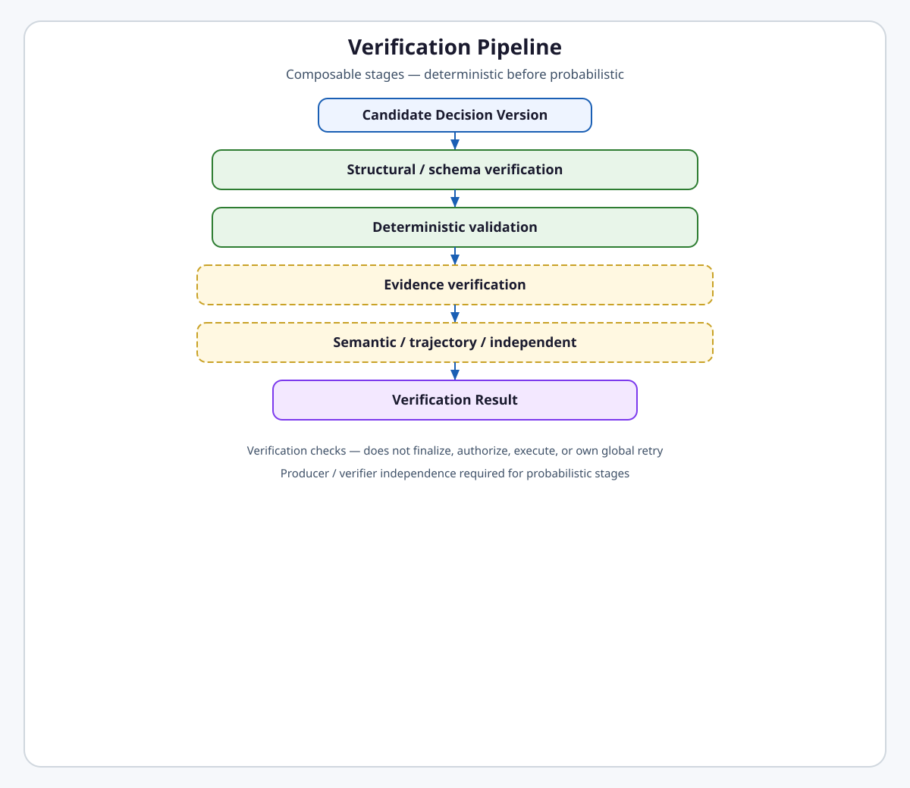
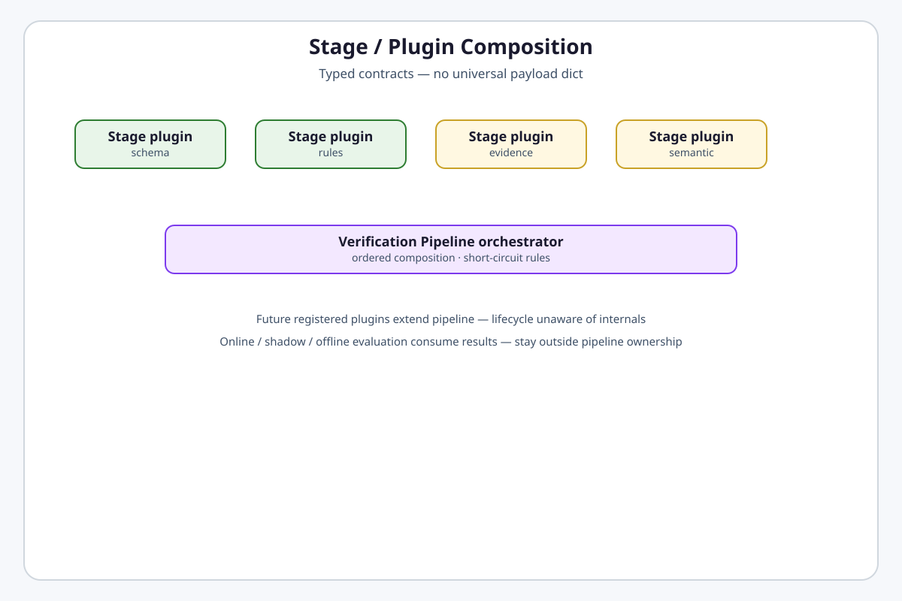
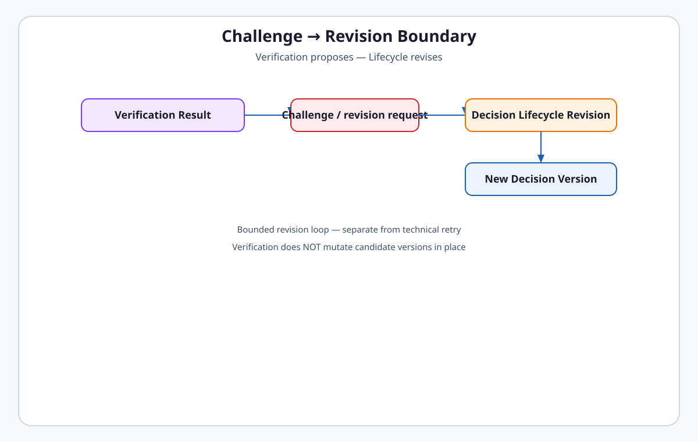
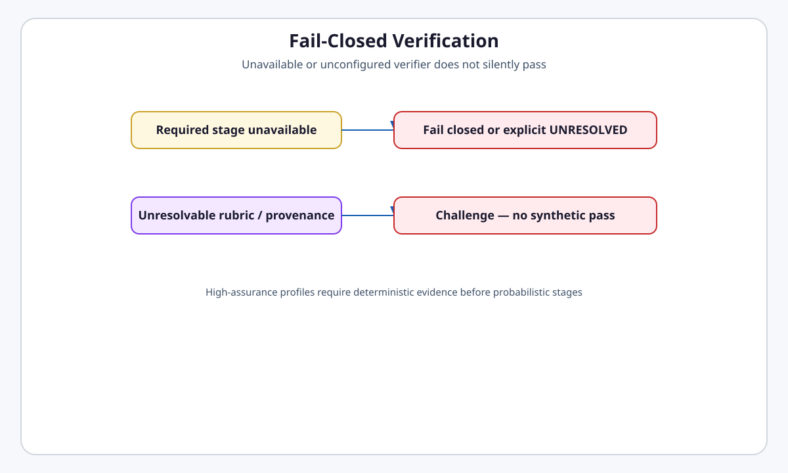

# Decision Verification

**Intergrax Decision Verification** is the compositional **Verification Pipeline** that evaluates a specific **Decision Version** through typed stages — replacing the monolithic Critic model with explicit stage ownership, challenge semantics, and fail-closed rules.

Verification answers **„czy ta wersja decyzji spełnia wymagania poprawności?”** — structurally, deterministically, evidentially, and (when configured) semantically. Verification is **not** authorization, **not** HITL, **not** revision, and **not** finalization of an **Authoritative Decision**.

> [!IMPORTANT]
> **Maturity boundary:**
>
> - **Architecture:** **TARGET CANON — FROZEN** (paired with [`DECISION_SYSTEM.md`](DECISION_SYSTEM.md)).
> - **Implementation:** **NOT YET MIGRATED** — production uses CVL / [`CRITIC_VERIFICATION.md`](CRITIC_VERIFICATION.md).
> - **Production:** `CriticOrchestrator` L0/L1/L2 stack is **CURRENT** until clean cut.

**Primary audience:** Principal / Staff engineers configuring verification stages, rubric provenance, producer/verifier independence, and challenge → revision handoff.

---

## Why it matters

Without compositional verification:

- a single monolithic „critic” owns check, revise, escalate, and policy hints,
- expensive semantic judges run before cheap deterministic rejection,
- producer and verifier share models without explicit non-independent labeling,
- challenges mutate candidates in place,
- unavailable verifiers silently pass,
- offline/shadow evaluation is confused with runtime gating.

Decision Verification provides **ordered stage composition, typed stage contracts, challenge semantics, and producer/verifier independence rules** inside the Decision Lifecycle.

**Verification checks. Decision Lifecycle revises and finalizes.**

---

## At a glance

| Concern | Summary |
| -------- | -------- |
| **Question** | Does this **Decision Version** pass configured correctness gates? |
| **Model** | Compositional **Verification Pipeline** — not `CriticOrchestrator` monolith |
| **Ordering** | Deterministic before probabilistic where both apply |
| **Stages** | Structural/schema · deterministic validation · evidence · semantic · trajectory · independent/domain · future plugins |
| **Output** | **Verification Result** — may include **Challenge** / revision request |
| **Does not** | Side effects · authorize · finalize authoritative decision · own global retry · own HITL |
| **Producer / verifier** | Meaningful independence required; self-judge modes explicit |
| **Fail-closed** | Missing rubric provenance, unavailable required stage → no synthetic pass |
| **Evaluation boundary** | Online / shadow / offline eval **outside** pipeline ownership |
| **Maturity** | **A4 target / I0** — see [`DECISION_SYSTEM.md`](DECISION_SYSTEM.md#current-maturity) |

---

## Flagship architecture visual

<a href="assets/fullsize/decision-verification-pipeline.md">
<picture>
  <source media="(prefers-color-scheme: dark)" srcset="assets/decision-verification-pipeline-dark.svg">
  <source media="(prefers-color-scheme: light)" srcset="assets/decision-verification-pipeline-light.svg">
  
</picture>
</a>

> **Deterministic before probabilistic. Verification proposes challenges — Lifecycle mints new versions.**

```text
Decision Version (candidate)
      ↓
Structural / schema verification
      ↓
Deterministic validation
      ↓ pass
optional Evidence verification
      ↓ pass
optional Semantic / trajectory / independent verification
      ↓
Verification Result
├── pass → continue lifecycle
└── challenge → Revision (new Decision Version)
```

---

## Verification Pipeline composition

<a href="assets/fullsize/decision-verification-stages.md">
<picture>
  <source media="(prefers-color-scheme: dark)" srcset="assets/decision-verification-stages-dark.svg">
  <source media="(prefers-color-scheme: light)" srcset="assets/decision-verification-stages-light.svg">
  
</picture>
</a>

The pipeline orchestrator:

- orders enabled stages,
- applies short-circuit rules (hard fail stops probabilistic work),
- aggregates **Verification Result** with per-stage records,
- emits challenges without mutating the evaluated version.

Stages are **plugins behind typed contracts** — not a giant `if strategy == ...` inside lifecycle code.

### Stage responsibilities

| Stage | Responsibility | Typical mechanisms |
| ----- | -------------- | ------------------ |
| **Structural / schema** | Artifact shape, required fields, contract conformance | JSON Schema, Pydantic contracts, agent output schema |
| **Deterministic validation** | Rules, invariants, executable tests | rule engine, `NexusValidationEngine` patterns |
| **Evidence verification** | Evidence refs resolve, claims support conclusion | Evidence Claims family, provenance checks |
| **Semantic verification** | Rubric-scored judgment of content | `eval.judge` via ToolRuntime — independent profile |
| **Trajectory verification** | Process / step sequence quality | `eval.trajectory`, future trajectory judge skill |
| **Independent / domain verification** | Domain authority or third verifier | ValidatorAgent, domain plugin stage |
| **Future plugins** | Registered stage kinds | platform plugin boundary |

---

## Evidence verification

Evidence-backed **Decision Artifacts** may require:

- resolvable evidence references,
- claim provenance and authority,
- consistency between conclusion and cited evidence.

Evidence Claims remain a reusable typed artifact family — verification consumes them; it does not redefine evidence storage ([`PROOF_RECEIPTS.md`](PROOF_RECEIPTS.md)).

---

## Semantic verification

Semantic stages:

- use **independent** model/provider profile when assurance requires it,
- resolve rubric refs to versioned criteria with provenance **before** judging,
- structurally isolate trusted rubric/instructions from untrusted candidate content,
- support adversarial verification tests for high-assurance profiles.

Unresolvable configured rubric → **fail closed** (challenge / UNRESOLVED path) — no silent skip.

---

## Trajectory verification

Trajectory stages evaluate whether the **process** that produced the decision met domain step expectations. Heuristic trajectory scoring and future LLM trajectory judge skills are **evaluation tools** invoked through ToolRuntime — not a second orchestration runtime.

Relation to **offline / shadow** evaluation: trajectory benchmarks and shadow observations **consume** verification posture; they do **not** gate the active run unless explicitly wired as runtime stages.

---

## Independent verification

**Producer / verifier independence** is a security and assurance property:

| Mode | Requirement |
| ---- | ----------- |
| **Independent verification** | Distinct profiles/providers prove separation at runtime |
| **Self-judge / shared profile** | Explicitly labeled non-independent — cannot claim independence |

No vendor hard-coding in platform contracts.

---

## Challenge / revision semantics

<a href="assets/fullsize/decision-verification-challenge-revision.md">
<picture>
  <source media="(prefers-color-scheme: dark)" srcset="assets/decision-verification-challenge-revision-dark.svg">
  <source media="(prefers-color-scheme: light)" srcset="assets/decision-verification-challenge-revision-light.svg">
  
</picture>
</a>

| Concept | Owner |
| ------- | ----- |
| **Challenge** | Verification — documents what failed and why |
| **Revision request** | Verification output artifact bound to **Decision Version** |
| **Revision** | Decision Lifecycle — mints **new Decision Version** |
| **Revision loop** | Bounded by lifecycle policy — separate from Reliability retry |

Verification **never** mutates the challenged version in place.

---

## Fail-closed rules

<a href="assets/fullsize/decision-verification-fail-closed.md">
<picture>
  <source media="(prefers-color-scheme: dark)" srcset="assets/decision-verification-fail-closed-dark.svg">
  <source media="(prefers-color-scheme: light)" srcset="assets/decision-verification-fail-closed-light.svg">
  
</picture>
</a>

| Condition | Behavior |
| --------- | -------- |
| Required stage unavailable | Fail closed or explicit **UNRESOLVED** — not silent pass |
| Unresolvable rubric / provenance | Challenge — no synthetic pass |
| High-assurance profile | Deterministic / evidence stages before probabilistic |
| Tenant-scoped read without authority | Fail closed |

---

## Plugin boundary

Verification stages extend through **typed stage registration** aligned with [`PLATFORM_PLUGINS.md`](PLATFORM_PLUGINS.md). Plugins supply stage implementation; the pipeline owns ordering and aggregation. Lifecycle code does not branch on plugin internals.

---

## Rubric / provenance security

- Named rubric refs must resolve to actual versioned criteria with provenance evidence before semantic stages run.
- Judge construction must isolate trusted instructions from untrusted candidate payload.
- Adversarial semantic verification tests required for high-assurance profiles.
- Reuse existing prompt/rubric registry authority — **no** second domain rule engine.

---

## Relation to online / offline / shadow evaluation

| Mode | Affects active Decision Lifecycle? | Owner |
| ---- | ---------------------------------- | ----- |
| **Runtime verification stages** | yes | Decision Verification Pipeline |
| **Offline eval** | no | `NexusEvalRunner`, datasets, CI |
| **Shadow eval** | no | observation registry — trend only |

Runtime verification ≠ offline benchmark ≠ shadow observation.

---

## Relation to Decision Lifecycle

```text
Lifecycle submits Decision Version → Pipeline
Pipeline returns Verification Result → Lifecycle
Challenge → Lifecycle Revision → new Decision Version → Pipeline (bounded)
Pass → Lifecycle continues Resolution / Finalization
```

Verification does **not** choose `ACCEPTED` / `REJECTED` / `UNRESOLVED` alone — it informs lifecycle resolution under policy.

---

## Responsibility boundaries

| Domain | Owns | Does not own |
| ------ | ---- | ------------ |
| **Verification Pipeline** | Stage composition, Verification Result, challenges | Authorization, HITL, revision minting, authoritative finalize |
| **Decision Lifecycle** | Revision, adjudication trigger, resolution | Stage internals |
| **Reliability** | Technical retry on infra failure | Semantic revision |
| **Governance** | Execution authorization | Correctness verdict |
| **OECP / offline eval** | Cross-run measurement | Per-version pipeline orchestration |

---

## Public invariants

```text
Verification checks. It does not authorize, execute, finalize, or own global retry.
```

```text
Deterministic before probabilistic when both enabled.
```

```text
Challenges bind Decision ID + Decision Version + execution identity.
```

```text
Producer / verifier independence is proven or explicitly waived.
```

---

## Current implementation snapshot (CVL)

Until migration, production verification maps approximately:

| TARGET stage | CURRENT CVL |
| ------------ | ----------- |
| Structural / deterministic | `L0Gateway` / `NexusValidationEngine` |
| Semantic / trajectory | `L1Gateway` / `eval.judge` / `eval.trajectory` |
| Human authority | `L2Gateway` → **moving to HITL** (not verification) |
| Orchestrator | `CriticOrchestrator` → **REPLACE** with pipeline |

See disposition matrix in [`maintainers/plans/DECISION_SYSTEM.md`](../maintainers/plans/DECISION_SYSTEM.md).

---

## Go deeper

| Depth | Route |
| ----- | ----- |
| **Extended engineering model** | [`satellites/DECISION_VERIFICATION_extended_depth.md`](satellites/DECISION_VERIFICATION_extended_depth.md) |
| Pipeline / stage architecture | [`satellites/DECISION_VERIFICATION_pipeline_stages.md`](satellites/DECISION_VERIFICATION_pipeline_stages.md) |
| Security / independence | [`satellites/DECISION_VERIFICATION_security_independence.md`](satellites/DECISION_VERIFICATION_security_independence.md) |
| Revision / failure semantics | [`satellites/DECISION_VERIFICATION_revision_failure_semantics.md`](satellites/DECISION_VERIFICATION_revision_failure_semantics.md) |
| Decision Lifecycle | [`DECISION_SYSTEM.md`](DECISION_SYSTEM.md) |
| Deliberation | [`DECISION_DELIBERATION.md`](DECISION_DELIBERATION.md) |
| Implementation plan | [`maintainers/plans/DECISION_VERIFICATION.md`](../maintainers/plans/DECISION_VERIFICATION.md) |
| CURRENT CVL | [`CRITIC_VERIFICATION.md`](CRITIC_VERIFICATION.md) |
| Tools | [`TOOLS.md`](TOOLS.md) |

---

## Engineering canon — Cursor read scope

**Default:** pipeline diagram + stage table + challenge boundary only.

- **Implement verification:** this file + [`maintainers/plans/DECISION_VERIFICATION.md`](../maintainers/plans/DECISION_VERIFICATION.md) hub.
- **Architecture satellite:** at most **one** [`satellites/`](satellites/) file per session.
- **Plan satellite:** [`maintainers/plans/satellites/DECISION_VERIFICATION_implementation_pipeline.md`](../maintainers/plans/satellites/DECISION_VERIFICATION_implementation_pipeline.md) on demand.
- **Audit CURRENT code:** add [`CRITIC_VERIFICATION.md`](CRITIC_VERIFICATION.md) snapshot sections only.
