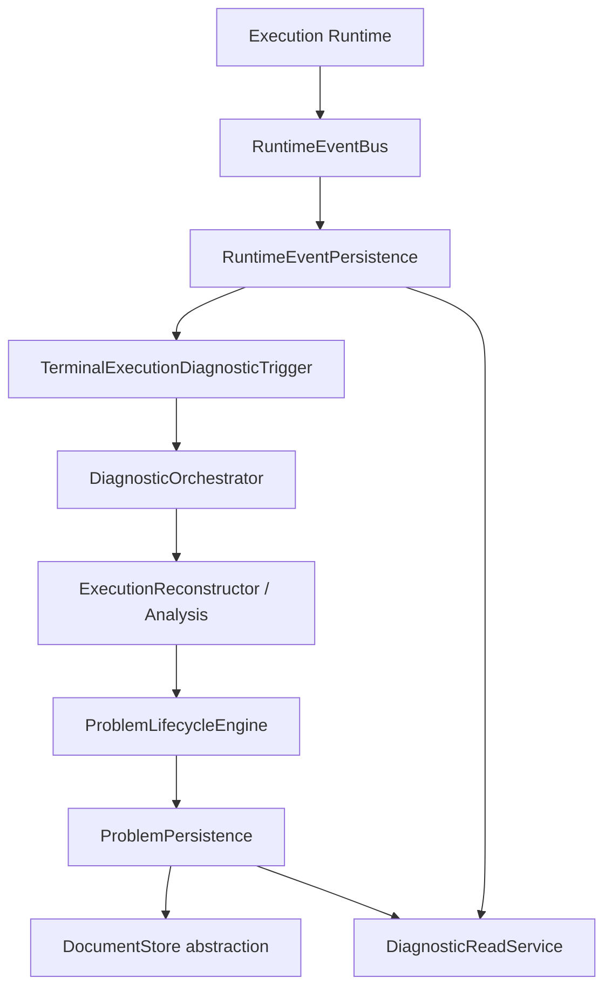
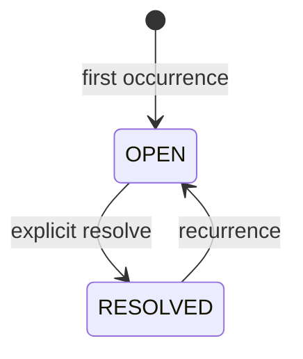
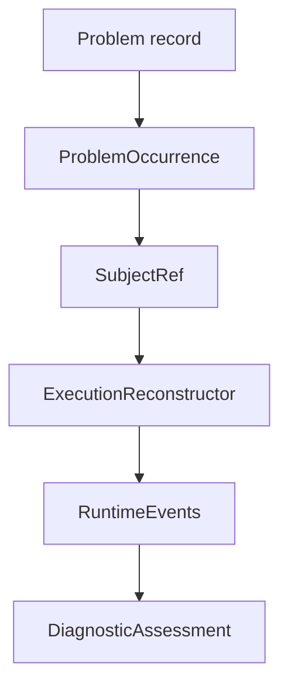

# Intergrax Central Diagnostics

**Intergrax Central Diagnostics** is the **one** canonical deterministic diagnostic engine for the platform. It interprets persisted platform facts — primarily `RuntimeEvent` execution evidence — into tenant-scoped `Problem` state, bounded operator read models, and optional investigation inputs. It does **not** mint execution identity, own observability export, or treat vendor telemetry or AI conclusions as truth.

**Persisted platform facts are truth. AI is not truth.**

| Canonical architecture | Maintainer plan | Qualification |
| ---------------------- | --------------- | ------------- |
| This document | [`docs/project/maintainers/plans/OBSERVABILITY.md`](../maintainers/plans/OBSERVABILITY.md) (DIAG slices) | Engine: [`DIAGNOSTIC_E2E_MATRIX_HARDEN_4A.md`](../maintainers/qualification/DIAGNOSTIC_E2E_MATRIX_HARDEN_4A.md) · [`DIAGNOSTIC_HARDENING_CLOSEOUT.md`](../maintainers/qualification/DIAGNOSTIC_HARDENING_CLOSEOUT.md) · Platform: [`DIAGNOSTIC_PLATFORM_ADOPTION_MATRIX.md`](../maintainers/qualification/DIAGNOSTIC_PLATFORM_ADOPTION_MATRIX.md) · [`DIAGNOSTIC_MULTI_SCENARIO_E2E_MATRIX.md`](../maintainers/qualification/DIAGNOSTIC_MULTI_SCENARIO_E2E_MATRIX.md) |

**Observability companion:** execution evidence recording, HOS, and export are documented in [`OBSERVABILITY.md`](OBSERVABILITY.md). Diagnostics **consumes** canonical evidence; observability **records** and **projects** it.

**Primary audience:** Principal / Staff engineers, harness integrators, and operators wiring diagnostic persistence, terminal triggers, or read APIs.

---

## Flagship architecture visual

<a href="assets/fullsize/diagnostics-flagship.md">
<picture>
  <source media="(prefers-color-scheme: dark)" srcset="assets/diagnostics-flagship-dark.svg">
  <source media="(prefers-color-scheme: light)" srcset="assets/diagnostics-flagship-light.svg">
  
</picture>
</a>

**Primary mental model:**

```text
Applications · Scenarios · Workers
        ↓ shared runtime (HarnessHostRuntime / ScenarioRuntimeBaseline)
RuntimeEvent = canonical execution evidence
        ↓ terminal trigger
Central Diagnostics (intergrax.runtime.diagnostics)
        ↓
Problem Store + DiagnosticReadService
Observability export = derived (parallel consumer — not authority)
```

Deep backbone map: [`diagnostics-platform-backbone.md`](assets/fullsize/diagnostics-platform-backbone.md) · adoption paths: [`diagnostics-platform-adoption.md`](assets/fullsize/diagnostics-platform-adoption.md).

---

## What central diagnostics is

Central diagnostics answers:

> **What did the platform deterministically detect and persist as a recurring operational Problem?**

It is implemented under `intergrax/runtime/diagnostics/` as a **single spine**:

- `ExecutionReconstructor` — factual reconstruction from canonical evidence
- `LifecycleAnomalyAnalyzer` + `DiagnosticAssessmentBuilder` — deterministic assessment
- `ProblemGroupingEngine` — structural grouping hypotheses
- `ProblemLifecycleEngine` — stable `Problem` identity and lifecycle
- `DiagnosticOrchestrator` — canonical write/process entry point
- `DiagnosticReadService` — canonical read/reconstruction entry point

There is **no** scenario-local, proof-local, or AI-incident-specific canonical diagnostic authority.

---

## Authority model

```text
CANONICAL
  RuntimeEvent / persisted platform facts
  Problem durable state (derived, but platform-owned)

DERIVED
  ExecutionReconstruction / DiagnosticAssessment
  Observability export envelopes
  Fine-grained OTel spans (RAG / context only — see OBSERVABILITY)

NON-CANONICAL
  AI investigation conclusions
  Vendor dashboards / OTLP backends
  Operator interpretation without canonical backing
```

| Fact class | Authority | Notes |
| ---------- | --------- | ----- |
| `RuntimeEvent` | **Canonical execution evidence** | Persisted before derived observability/export where persist-first contract applies |
| `Problem` | **Derived / reconciled diagnostic state** | Durable operational pattern; rebuildable from evidence + grouping |
| Observability export | **Derived projection** | Export failure does not alter canonical truth |
| Vendor backend | **Not authority** | Missing telemetry ≠ missing platform truth |
| AI investigation output | **Non-canonical interpretation** | May consume bounded typed projections; cannot create or override canonical `Problem` truth |

**Frozen invariants:**

```text
RuntimeEvent = canonical execution evidence
Problem = derived/reconciled diagnostic state
Observability export = derived projection
Vendor backend = not authority
AI investigation output = non-canonical interpretation
```

---

## Diagnostics ≠ Observability

| System | Question |
| ------ | -------- |
| **Diagnostics** | What did the platform deterministically detect and maintain as a `Problem`? |
| **Observability** | How do we record, project, and export platform behavior for operators and vendors? |

They share infrastructure (HOS, `RuntimeEvent` persistence) but are **not** one system. Observability outage may cause **missing telemetry** but **cannot** alter platform truth or a correct business result. See [`OBSERVABILITY.md`](OBSERVABILITY.md) for export boundary, exporter health, and vendor neutrality.

---

## Business result vs diagnostic state

```text
business result != diagnostic state
```

```text
diagnostic failure must not destroy a correct business result
```

A successful governed execution remains successful even when Problem persistence fails, diagnostic post-processing throws, or observability export is degraded. Diagnostic subsystem failures may themselves be recorded as canonical runtime failure evidence — without recursive observability dependency loops.

---

## Canonical RuntimeEvent flow

Production order on the terminal execution path:

```text
runtime operation
  → RuntimeEventBus publish/record
  → RuntimeEventPersistence append          # canonical evidence first
  → terminal diagnostic trigger (when wired)
  → DiagnosticOrchestrator
  → ProblemLifecycleEngine.reconcile
  → ProblemPersistence
  → DiagnosticReadService (read path)
```



**Persist-first:** canonical `RuntimeEvent` evidence is persisted before derived observability export on paths where that contract applies. Vendor export is **not** part of execution truth.

---

## How a Problem is created

1. Terminal execution (or explicit orchestration) supplies bounded scope: `tenant_id` + `TaskId` + `RunId` (execution subjects) and/or `application_id` + `instance_id` (application-instance subjects).
2. `ExecutionReconstructor` rebuilds factual execution evidence from `RuntimeEventPersistence` (+ optional causal evidence).
3. `LifecycleAnomalyAnalyzer` and `DiagnosticAssessmentBuilder` produce deterministic findings — or **no findings** on clean paths (M1).
4. `ProblemGroupingEngine` proposes grouping candidates (deterministic strategy in production).
5. `ProblemLifecycleEngine.reconcile` mints or updates a stable `ProblemId` from reconciliation key + subject refs.

`Problem` represents a **logical recurring issue**, not a single raw event.

---

## Problem identity

| Concept | Contract |
| ------- | -------- |
| **Deterministic signature** | `DeterministicProblemSignature` + strategy id/version |
| **Reconciliation key** | `tenant_id` + strategy metadata + signature — finds same logical Problem |
| **Stable `problem_id`** | Opaque minted id — same Problem across occurrences |
| **Occurrences** | Distinct accepted execution (or signal) attachments |
| **`first_seen_at` / `last_seen_at`** | Min/max of accepted occurrence `observed_at` |
| **Tenant scope** | Problem identity is **tenant-scoped** — same logical issue in tenant A and B are separate Problems |

Cross-tenant direct `problem_id` read **must not** reveal another tenant's Problem.

---

## Lifecycle

```text
OPEN
 │
 │ explicit resolve (ProblemLifecycleEngine.resolve)
 ▼
RESOLVED
 │
 │ recurrence (same reconciliation key / subject)
 ▼
OPEN (same problem_id)
```



- Same `problem_id` on recurrence
- Occurrence history preserved; `first_seen_at` preserved
- New occurrence appended; `occurrence_count` increments
- **No** auto-resolve when a pattern is absent from a later batch

---

## Problem Store architecture

Mongo is a **provider**, not part of the central diagnostics contract:

```text
IntegrationProfile
  → DocumentStore abstraction
  → ConditionalDocumentStore capability
  → DocumentStoreProblemPersistence
  → ProblemLifecycleEngine
```

Do **not** document `Diagnostics → MongoDB` as production architecture. The engine is **vendor-neutral** — no Mongo-specific API, OTel API, or Datadog dependency in central semantics.

---

## Diagnostic read / reconstruction

`DiagnosticReadService` is **not** a separate source of truth. It composes reads over `ProblemPersistence`, `RuntimeEventPersistence`, and causal evidence where applicable.

```text
Problem
  → occurrence
  → SubjectRef
  → ExecutionReconstructor
  → RuntimeEvents
  → DiagnosticAssessment (derived at read time)
```



**Missing evidence branch:**

```text
Problem exists
+ RuntimeEvent evidence unavailable
→ Problem remains
→ occurrence reconstruction = UNAVAILABLE
→ reason = EXECUTION_EVIDENCE_UNAVAILABLE
→ assessment = absent

missing evidence ≠ fabricated diagnosis
```

---

## Application-instance subjects

`DiagnosticSubjectKind` supports:

| Kind | Scope | Reconstruction |
| ---- | ----- | -------------- |
| `EXECUTION` | `tenant_id` + `TaskId` + `RunId` | Full execution-style reconstruction when evidence exists |
| `APPLICATION_INSTANCE` | `tenant_id` + `application_id` + `instance_id` | Bounded signal assessment — **not** full execution-style reconstruction unless evidence contract provides it |

HOST-DIAG-3 may project hosting failures into central non-execution diagnostics when product composition supplies tenant binding. Hosting lifecycle does **not** synthesize `TaskId`/`RunId`.

---

## M22 — no typed unsupported scope outcome

Central diagnostics does **not** expose a typed valid-but-unsupported scope result.

| Input | Outcome |
| ----- | ------- |
| Supported scope, no violations | `has_findings=False` — clean semantics (M1) |
| Supported scope, violations | Findings → Problem reconciliation |
| Invalid orchestration input | Rejected before analysis (e.g. empty request) |

There is **no** separate `unsupported scope` typed outcome. Qualification status: **M22 = NOT_APPLICABLE**.

---

## M21 — AI not canonical authority

AI-assisted investigation (e.g. scenario conclusions, `InvestigationConclusion`) may interpret canonical facts but **cannot** create, override, or prove canonical `Problem` truth. Qualification status: **M21 = NOT_APPLICABLE**.

---

## Failure isolation

```text
Business result ─────────────→ SUCCESS

             │
             ▼
       diagnostics
             │
      Problem Store DOWN
             │
             ▼
 subsystem failure evidence

Business result unchanged
```

| Scenario | Behavior |
| -------- | -------- |
| Problem Store UP | Problem persists durably |
| Problem Store DOWN | Business survives; RuntimeEvents survive; Problem write fails visibly |
| Problem Store UP again (same process) | Subsequent Problem writes work |
| Outage occurrence | **Not** automatically replayed |

```text
Problem persistence failure does not create an implicit replay queue.
failed write = no automatic replay
```

Problem Store failure **cannot** change execution truth.

<a href="assets/fullsize/diagnostics-failure-isolation.md">
<picture>
  <source media="(prefers-color-scheme: dark)" srcset="assets/diagnostics-failure-isolation-dark.svg">
  <source media="(prefers-color-scheme: light)" srcset="assets/diagnostics-failure-isolation-light.svg">
  
</picture>
</a>

---

## Cross-process durability and OCC

**Qualified behavior (not unlimited deployment guarantees):**

- Durable Problem survives process restart; another process can read it (M9)
- Mongo-backed concurrent occurrence and lifecycle updates use optimistic concurrency / CAS
- Conflicts converge through bounded retry per implementation (M10/M11)

---

## Execution identity correlation

| Field | Role |
| ----- | ---- |
| `tenant_id` | Isolation boundary for Problems and reads |
| `task_id` (`TaskId`) | Work intent — authoritative from Execution Runtime |
| `run_id` (`RunId`) | One governed lifecycle — authoritative from Execution Runtime |
| `attempt_id` (`AttemptId`) | Global try of the run — on `RuntimeEvent`; do not conflate with `RunId` |
| `execution_id` (`ExecutionId`) | **TARGET** schedulable unit — not yet on all `RuntimeEvent` paths |

Do not mix `RunId`, `ExecutionId`, or `AttemptId` in diagnostic contracts.

---

## What central diagnostics does not do

- Mint `TaskId` / `RunId` / `AttemptId` / `ExecutionId`
- Use vendor telemetry as runtime truth
- Automatically replay failed Problem writes
- Fabricate diagnosis when evidence is missing
- Auto-resolve Problems when patterns disappear
- Provide a typed unsupported-scope outcome (M22 N/A)
- Treat AI conclusions as canonical Problems (M21 N/A)
- Depend on Mongo, OTel, or any specific vendor in its contract

---

## Host wiring (summary)

Product harness hosts wire through shared `document_store` capabilities:

- `wire_problem_persistence` → `DocumentStoreProblemPersistence`
- `RuntimeEventPersistence` on harness runtime
- `try_build_terminal_execution_diagnostic_trigger` after terminal `RuntimeEvent` persist
- `DiagnosticReadService` for operator/dashboard read path

### Scalable Problem list reads (DIAG-ENTERPRISE-1)

Operator list reads are **bounded** at persistence:

```text
DiagnosticReadService.list_problems(limit, cursor?)
  → ProblemPersistence.query_problems(...)
  → derived list index query (DocumentStore row_key prefix)
  → bounded canonical Problem fetch per index row
```

Ordering invariant: `last_seen_at DESC`, `problem_id ASC` tie-break. Optional `ProblemStatus` filter uses status-scoped derived indexes (`list:open:` / `list:resolved:` / `list:all:`) so filtering does not scan unrelated Problems.

`total_count` is populated only when the full tenant result fits in one page (`cursor is None` and `has_more is False`). Larger tenants return `total_count=None` rather than forcing a full scan.

Qualification: [`DIAGNOSTIC_ENTERPRISE_SCALE_MATRIX.md`](../maintainers/qualification/DIAGNOSTIC_ENTERPRISE_SCALE_MATRIX.md) § E1.

### Concurrent read-index semantics (DIAG-ENTERPRISE-1-R1)

Canonical `Problem` records remain truth; `list:{scope}:…` rows are **derived projections** only.

| Transition window | Reader behavior |
|---|---|
| Index visible, canonical missing (create in flight) | Skip entry; bounded overfetch |
| Index `record_version` > canonical (update in flight) | Skip entry |
| Index `record_version` < canonical (stale projection) | Skip entry |
| Same `record_version`, metadata mismatch | `ProblemPersistenceIntegrityError` (corruption) |
| Index `problem_id` ≠ canonical | `ProblemPersistenceIntegrityError` (corruption) |

List-index rows carry minimal metadata: `problem_id`, `record_version`, `last_seen_at`, `status`. Readers reconcile projection vs canonical with bounded work (`limit × 16` index rows examined max per page).

Crash recovery: incomplete create/update leaves skippable projections; subsequent idempotent `create` / `update` repair paths converge indexes (`_repair_indexes_for_record`, `_ensure_list_indexes`).

### Projection reconciliation (DIAG-ENTERPRISE-1-R2 / R3)

Derived `list:{scope}:…` rows can become **proven stale** or **proven orphan** only via explicit bounded maintenance — never in the hot read path.

| Classification | Meaning | Hot read | Maintenance (`reconcile_list_indexes`) |
|---|---|---|---|
| `CONSISTENT` | Index matches canonical at same `record_version` | Return Problem | No-op; v1 rows may upgrade to v2 metadata |
| `TRANSIENT_OR_UNCERTAIN` | Active transition, missing `projection_written_at`, below safety age, or future-dated projection | Skip | No delete/repair |
| `PROVEN_STALE` | Mismatch persists and projection age `> MIN_SAFE_PROJECTION_AGE` | Skip | Repair from canonical (conditional replace/delete) |
| `PROVEN_ORPHAN` | Canonical missing and projection age `> MIN_SAFE_PROJECTION_AGE` | Skip | Conditional delete |
| `CORRUPT` | Same-version metadata/id mismatch | `ProblemPersistenceIntegrityError` | Count only; no silent repair |

List-index schema v2 adds `projection_written_at` (UTC, writer clock). v1 rows remain readable; reconciliation upgrades consistent v1 rows to v2. Writers emit v2 only.

**Safety-age contract (R3):** `MIN_SAFE_PROJECTION_AGE = 5 minutes` (aligned with platform 300s lease convention). Callers pass `minimum_projection_age` (relative); the reconciler computes `safe_cutoff = now - effective_age` using its injected clock. Callers cannot request an age below the platform minimum (`ProblemListIndexReconciliationError`). Future-dated `projection_written_at` (clock skew) is always `TRANSIENT_OR_UNCERTAIN` — never destructive.

Maintenance contract:

```text
DocumentStoreProblemPersistence.reconcile_list_indexes(
  tenant_id, minimum_projection_age?, scope?, limit, cursor?
) → ProblemListIndexReconciliationPage
```

Bounded by `limit` index rows per call; continuation via document-store cursor. No scheduler/daemon — callable maintenance seam for admin/tests/future lifecycle.

**Projection health (R3):** cumulative telemetry counters (`repaired_projection`, `deleted_orphan_projection`, skip counters) remain historical and are not reset to recover health. Current health reflects the latest completed maintenance cycle (`last_completed_cycle_had_issues`), in-progress cycle issues, read skip threshold, and unresolved same-version corruption (`same_version_integrity_failure > 0`). Health recovers to `HEALTHY` only after a full maintenance traversal (`has_more=False`) with zero issues on that cycle, and only when corruption counters are zero. A clean scan of one tenant does not mask corruption detected on another tenant (process-local global health).

### List cursor trust model (DIAG-ENTERPRISE-1-R1 / R2)

Production hosts authenticate continuation cursors with HMAC-SHA256 over a tenant- and status-filter-bound payload. Secret enters only through composition (`INTERGRAX_DIAGNOSTIC_PROBLEM_LIST_CURSOR_SECRET` via `resolve_problem_list_cursor_secret()`). **Minimum 32 UTF-8 bytes** (random 256-bit recommended). **No static default secret in production.** Restart with a new secret invalidates previously issued cursors (documented limitation; no transparent rotation in this slice).

### Production persistence contract

Full-tenant Problem listing is **not** part of the production `ProblemPersistence` contract. Callers must use `query_problems` with bounded pages. Test/conformance helpers may materialize via paginated `query_all_problems_for_tenant`.

Full hosting composition: [`APPLICATION_HOSTING.md`](APPLICATION_HOSTING.md).

---

## Qualification summary

**Engine qualification** — HARDEN-1 through HARDEN-5 **complete**.

```text
Engine HARDEN: M1–M24 PROVEN=22 NOT_APPLICABLE=2
```

**Platform adoption qualification** — DIAG-PLATFORM **complete** (see [`DIAGNOSTIC_PLATFORM_QUALIFICATION_CLOSEOUT.md`](../maintainers/qualification/DIAGNOSTIC_PLATFORM_QUALIFICATION_CLOSEOUT.md)).

```text
Platform adoption: NATIVE production surfaces = 4 PRODUCT hosts + 1 initialized scenario
BYPASS = 0 · true P3 flows = 4 · true P4 platform E2E = 2 · P4 persistence = 1
```

Execution System owns root execution authority. Nexus = orchestration participant, not execution authority.

Evidence indexes:

- Engine matrix: [`DIAGNOSTIC_E2E_MATRIX_HARDEN_4A.md`](../maintainers/qualification/DIAGNOSTIC_E2E_MATRIX_HARDEN_4A.md)
- Adoption inventory: [`DIAGNOSTIC_PLATFORM_ADOPTION_MATRIX.md`](../maintainers/qualification/DIAGNOSTIC_PLATFORM_ADOPTION_MATRIX.md)
- Multi-scenario E2E: [`DIAGNOSTIC_MULTI_SCENARIO_E2E_MATRIX.md`](../maintainers/qualification/DIAGNOSTIC_MULTI_SCENARIO_E2E_MATRIX.md)
- Proof map visual: [`diagnostics-proof-map.md`](assets/fullsize/diagnostics-proof-map.md)

---

## Related deep reference

Detailed DIAG-1..7 slice semantics, causal evidence, grouping, and orchestration contracts remain in [`OBSERVABILITY.md`](OBSERVABILITY.md) § DIAG subsystem. This document is the **primary entry point** for diagnostics architecture; OBSERVABILITY owns observability-specific export, HOS, and journal semantics.

**Decision System boundary:** Diagnostics may observe Decision System failures and feed investigation flows — it does **not** resolve Decision Resolution, execute Revision, or own verification rubrics. See [`DECISION_SYSTEM.md`](DECISION_SYSTEM.md).
