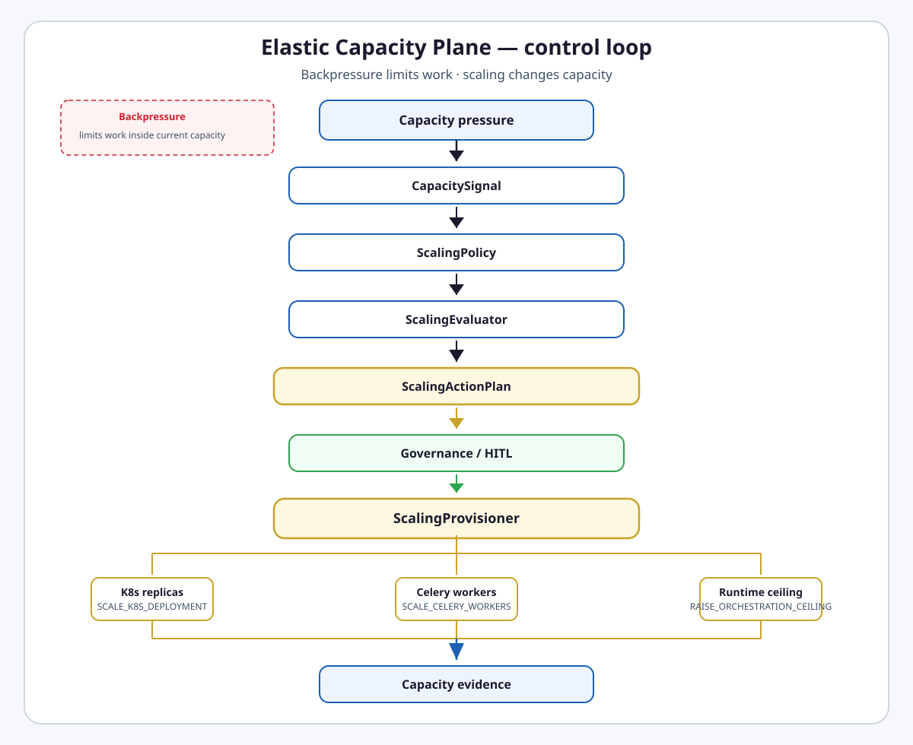

# Elastic Capacity and Scaling

**Intergrax Elastic Capacity Plane (ECP)** converts harness pressure signals into governed, typed capacity actions across runtime concurrency, worker pools, and infrastructure backends — without taking ownership of orchestration semantics.

> **Backpressure limits work. Scaling changes capacity.**

Orchestration decides **how** work runs inside available capacity. ECP decides **how much** capacity is available. Raising the orchestration concurrency ceiling changes logical runtime parallelism; it does **not** add CPU, RAM, or host replicas.

> [!NOTE]
> **Maturity boundary:** Contracts, collector → evaluator → scheduler → provisioner, live `GRAPH_BACKPRESSURE` bridge, HITL queue, and mocked K8s/Celery adapter paths are **implemented** on the harness path when `ScalingProfile.policy.enabled=true`. That is **not** proven production cloud autoscaling: reference host wiring injects ceiling patcher only; K8s/Celery backends require separate product adapter wiring; graceful scale-down/drain is incomplete. See [Current maturity](#current-maturity).

> [!IMPORTANT]
> **Implemented scaling backends ≠ proven production autoscaling deployment.** Protocol adapters, REST clients, and gate probes do not by themselves qualify as customer cluster evidence.

**Primary audience:** Principal / Staff engineers and Tier-3 host authors configuring capacity posture — after the platform overview in the root README.

## Why it matters

Without ECP:

- backpressure only throttles overload inside fixed capacity,
- queue depth does not lead to a controlled capacity response,
- each host risks ad-hoc cloud SDK calls,
- worker count changes happen outside an audit trail,
- scale-up/down can flap without cooldown, hysteresis, or rate limits,
- scaling can bypass HITL and policy gates,
- concurrency ceiling is confused with adding infrastructure,
- Kubernetes HPA and Celery autoscale are duplicated instead of complemented.

ECP is the Harness **capacity architecture and governed scaling layer** — not an agent planner, graph scheduler, cloud autoscaler replacement, or general infrastructure orchestrator.

## At a glance

| Concern | Summary |
| -------- | -------- |
| **Responsibility** | Normalize capacity pressure → evaluate policy → govern → provision typed capacity actions |
| **Pressure signals** | `graph_backpressure_rate`, `queue_depth`; optional Prometheus query helper (env-driven, not auto-wired to collector) |
| **Collector** | `CapacitySignalCollector` + live `CapacityEventBridge` on `GRAPH_BACKPRESSURE` when host passes `event_bus` |
| **Evaluator** | `ScalingEvaluator` — rule match, hysteresis, per-rule cooldown, `max_actions_per_hour` |
| **Policy** | `ScalingPolicy` on `ScalingProfile` — explicit opt-in (`enabled=false` default) |
| **Scheduler** | `CapacityScheduler` — async ticks **outside** Nexus hot path |
| **HITL** | Optional `require_hitl_for_scale_up` → in-memory `CapacityApprovalQueue` |
| **Provisioner** | `ScalingProvisioner` → K8s / Celery / orchestration ceiling backends |
| **K8s backend** | REST `KubernetesDeploymentScaleClient` + protocol; reference `wire_application_scaling()` does **not** inject it |
| **Celery backend** | `CeleryProductionAdapter` records intents; reference wiring does **not** inject it |
| **Runtime ceiling** | `BoundedOrchestrationCeilingPatcher` — in-process, bounded raise; not durable across restart |
| **Scale-down safety** | No guaranteed graceful drain for external workers/replicas in ECP core |
| **HPA / Celery autoscale** | Complementary infrastructure mechanisms — ECP does not replace them by default |
| **AHI boundary** | AHI may propose ceiling deltas; ECP owns scaling action execution |
| **Tenant fairness** | UAEP / resource governance owns quotas; ECP consumes/respects limits |
| **Maturity** | A4 · I3 · P2 · E3 — [Current maturity](#current-maturity) |

## Flagship architecture visual

<a href="assets/fullsize/elastic-capacity-loop.md">
<picture>
  <source media="(prefers-color-scheme: dark)" srcset="assets/elastic-capacity-loop-dark.svg">
  <source media="(prefers-color-scheme: light)" srcset="assets/elastic-capacity-loop-light.svg">
  
</picture>
</a>

## How it works

```text
capacity saturated
    → backpressure (immediate — limits/suspends additional work)

persistent / eligible pressure
    → CapacitySignalCollector
    → ScalingEvaluator + ScalingPolicy
    → ScalingActionPlan
    → CapacityActionGate / optional HITL
    → ScalingProvisioner
    → K8s replicas | Celery workers | runtime ceiling
    → capacity evidence (RuntimeEvent spine + metrics)
```

1. **Observe** — runtime events (`GRAPH_BACKPRESSURE` via `CapacityEventBridge`), task-index queue depth (when `kv_store` provided), optional host overrides.
2. **Evaluate** — `ScalingEvaluator` matches `ScalingRule` thresholds with hysteresis (`scale_up_threshold` > `scale_down_threshold`), per-rule cooldown, and hourly action cap.
3. **Govern** — `CapacityActionGate` (`BEFORE_CAPACITY_ACTION` hook when configured); scale-up may require operator approval via `CapacityApprovalQueue`.
4. **Provision** — `ScalingProvisioner` applies typed `ScalingActionKind` to configured backends; missing backend **fails visibly** (no silent success).
5. **Evidence** — `platform.capacity.*` events and `harness_scale_actions_total` metrics; Observability remains evidence owner.

ECP reacts to **sustained/eligible pressure**, not every raw metric sample — cooldown, hysteresis, and `max_actions_per_hour` are anti-flapping bounds.

## Backpressure vs scaling

| Mechanism | Effect | Owner emphasis |
| --------- | ------ | ---------------- |
| **Backpressure** | Limits or suspends additional work **inside** current capacity | Orchestration emits `GRAPH_BACKPRESSURE` at inflight cap; ECP may **consume** it as a signal |
| **Scaling** | Changes **available** capacity (replicas, workers, ceiling) | ECP evaluator → provisioner path |

```text
Backpressure  → limits work inside current capacity
Scaling       → changes available capacity
```

Do not conflate throttling with provisioning.

## Capacity types

| Capacity type | What changes | What does NOT change |
| ------------- | ------------ | -------------------- |
| **Runtime concurrency** | `max_inflight_nodes` via `RAISE_ORCHESTRATION_CEILING` | physical replicas, CPU/RAM |
| **Worker pool** | worker count via `SCALE_CELERY_WORKERS` | graph topology, agent roster |
| **Host replicas** | deployment replicas via `SCALE_K8S_DEPLOYMENT` | agent logic, orchestration structure |

Exact action kinds: `SCALE_K8S_DEPLOYMENT`, `SCALE_CELERY_WORKERS`, `RAISE_ORCHESTRATION_CEILING`, `REQUEST_HITL`.

## Responsibility boundaries

| Concern | Owner |
| ------- | ----- |
| Capacity signal observation | ECP collector + Observability spine |
| Scaling recommendation / typed actions | ECP |
| Graph scheduling within capacity | [`ORCHESTRATION.md`](ORCHESTRATION.md) |
| Agent topology / plan structure | Orchestration + Reasoning |
| Backpressure at inflight cap | Orchestration (`GRAPH_BACKPRESSURE`) |
| Retry / recovery of failed execution | [`RELIABILITY_FAILURE_AND_HITL.md`](RELIABILITY_FAILURE_AND_HITL.md) |
| Future profile improvement proposals | [`ADAPTIVE_HARNESS_INTELLIGENCE.md`](ADAPTIVE_HARNESS_INTELLIGENCE.md) |
| Tenant CPU/memory/concurrency quotas / fairness | UAEP / resource governance — ECP **respects**, does not own |
| Evidence recording / audit reconstruction | [`OBSERVABILITY.md`](OBSERVABILITY.md) |
| K8s/Celery integration clients | [`INTEGRATIONS.md`](INTEGRATIONS.md) |
| Tier-3 enablement defaults | [`TIER3_APPLICATION_ENVIRONMENT.md`](TIER3_APPLICATION_ENVIRONMENT.md) · `ScalingProfile` |

### Allowed ECP actions

ECP **MAY**: observe capacity metrics; recommend scale up/down; emit typed `ScalingAction` / `ScalingActionPlan`; apply actions through approved backends when enabled; integrate with observability; provide evidence for governed scaling decisions.

### Disallowed ECP actions

ECP **MUST NOT**: decide agent topology; modify Nexus plans; bypass runtime policy; call cloud SDKs outside integrations; silently mutate production capacity; claim HPA/Celery/cloud autoscaler equivalence without evidence; replace Orchestration or Reliability retry policy.

## Relationship to adjacent domains

| Domain | Relationship |
| ------ | ------------ |
| **Orchestration** | Schedules work **within** available capacity; emits backpressure ECP may consume |
| **Reliability** | Recovers failed execution; retry storms may surface as pressure but ECP does not own retry policy |
| **AHI** | Proposes future configuration; `ahi_bridge` maps approved ceiling proposals to `RAISE_ORCHESTRATION_CEILING` — ECP remains action owner |
| **Observability** | Records capacity decisions/actions; not a separate capacity audit authority |
| **Governed Execution** | `CapacityActionGate` is a local gate + optional `BEFORE_CAPACITY_ACTION` hook — not full Governance catalog coverage |
| **Integrations** | K8s REST scale client and cloud platform bundle supply external backends |
| **Cost** | Policy may constrain scaling; ECP does not globally optimize cost — tradeoff is **capacity ↔ latency ↔ cost** within policy |

```text
Orchestration → schedules work within available capacity
ECP           → adjusts capacity envelope / backends

Reliability   → recover failed execution
ECP           → respond to sustained capacity pressure

ECP           → capacity response now
AHI           → future profile/config improvement
```

## ECP vs Kubernetes HPA and Celery autoscale

| Mechanism | Role |
| --------- | ---- |
| **Kubernetes HPA** | Infrastructure-native autoscaling (CPU/memory/custom metrics on pods) |
| **Celery autoscale** | Broker/worker pool autoscaling native to Celery deployment |
| **ECP** | Harness-aware capacity decision, typed actions, governance/HITL, harness-specific signals |

ECP **complements** native autoscalers. It understands harness signals (`GRAPH_BACKPRESSURE`, task-index queue depth) and governance paths. Do not market ECP as an automatic replacement for HPA or Celery autoscale unless production evidence proves a deliberate integration strategy.

## Provisioning backends (honest matrix)

| Backend | Contract implemented? | Concrete adapter? | Reference `wire_application_scaling()`? | Production evidence? |
| ------- | --------------------- | ----------------- | --------------------------------------- | ---------------------- |
| **K8s replicas** | `KubernetesScaler` protocol | `KubernetesDeploymentScaleClient` REST; `InMemoryKubernetesScaler` for CI | **No** — inject via host or `production_adapters_enabled` path | Mock/REST unit tests; live cluster **not** established in public proofs |
| **Celery workers** | `CeleryScaler` protocol | `CeleryProductionAdapter` (intent counter) | **No** | Gate tests only |
| **Orchestration ceiling** | `OrchestrationCeilingPatcher` | `BoundedOrchestrationCeilingPatcher` | **Yes** | Gate tests; in-memory only |

**Missing backend behavior:** when `ScalingProvisioner` receives `SCALE_K8S_DEPLOYMENT` or `SCALE_CELERY_WORKERS` without a configured backend, it records failure (`kubernetes backend not configured` / `celery backend not configured`), emits `platform.capacity.scale_failed`, and returns `False` — **no silent success**.

Product hosts may enable `ScalingProfile.production_adapters_enabled` on `ApplicationProfile.PRODUCT` via `resolve_production_capacity_wiring()` — separate from default shared wiring.

## Scale-down safety (current limitation)

ECP core does **not** fully guarantee safe graceful scale-down of active external workers or replicas:

- K8s path sets `replicas=max(0, current + delta)` without drain/lease semantics,
- Celery adapter enforces `worker_count >= 1` on scale-down delta,
- ceiling patcher ignores non-positive deltas (no automatic ceiling reduction).

Treat production scale-down as requiring operator runbooks, native autoscaler safeguards, or future ECP hardening — not as automatically safe today.

## Current maturity

Four-axis statement per [`MATURITY_TAXONOMY.md`](../technical/guides/MATURITY_TAXONOMY.md):

| Axis | Level | Rationale |
| ---- | ----- | --------- |
| **Architecture (A)** | **A4** | Stable contracts, typed actions, governance/HITL path, backend boundaries explicit; scale-down safety requirements stated but not fully met |
| **Implementation (I)** | **I3** | End-to-end loop shipped; live backpressure bridge; reference wiring = ceiling + gate only; K8s/Celery adapters exist off default path |
| **Production readiness (P)** | **P2** | Disabled-by-default; no graceful drain; adapter ≠ host wiring ≠ cluster deployment |
| **Evidence (E)** | **E3** | Unit/gate + integration tests with mocked K8s; no dedicated public ECP proof route in [`PROOFS.md`](../proofs/PROOFS.md) |

### Sub-maturity (do not average)

| Slice | I | P | E |
| ----- | - | - | - |
| In-process ceiling scaling | I3 | P2 | E3 |
| Worker scaling (Celery adapter) | I2 | P1 | E2 |
| K8s scaling (REST client) | I2 | P1 | E2 |
| Governance / HITL queue | I3 | P2 | E3 |
| Scale-down safety | I1 | P1 | E1 |

**Safe summary:** ECP is canonical Harness capacity architecture with a working control loop on the harness path when explicitly enabled — not a finished production autoscaler comparable to K8s HPA + Celery autoscale.

## Evidence / proof

| Layer | Artifacts |
| ----- | --------- |
| **Architecture** | This hub · [`satellites/ELASTIC_CAPACITY_AND_SCALING_extended_depth.md`](satellites/ELASTIC_CAPACITY_AND_SCALING_extended_depth.md) · [ADR-SCALE-001](../technical/adr/entries/2026-06-08/ADR-SCALE-001.md) · [ADR-SCALE-002](../technical/adr/entries/2026-06-08/ADR-SCALE-002.md) |
| **Unit / gate** | `tests/unit/runtime/capacity/test_ecp_depth_gate.py` · `test_capacity_events_gate.py` · `test_kubernetes_scale_client.py` |
| **Integration** | `tests/integration/runtime/test_ecp_backpressure_scale.py` (sustained backpressure → mocked K8s) |
| **Public proof** | No dedicated ECP row in [`PROOFS.md`](../proofs/PROOFS.md) — bounded harness tests only |
| **Production / customer** | Not inferred — requires external deployment evidence |

## Go deeper

| Depth | Route |
| ----- | ----- |
| Engineering canon | [Below](#engineering-canon) in this file |
| Extended depth | [`satellites/ELASTIC_CAPACITY_AND_SCALING_extended_depth.md`](satellites/ELASTIC_CAPACITY_AND_SCALING_extended_depth.md) |
| Implementation plan | [`maintainers/plans/ELASTIC_CAPACITY_AND_SCALING.md`](../maintainers/plans/ELASTIC_CAPACITY_AND_SCALING.md) |
| Orchestration / backpressure | [`ORCHESTRATION.md`](ORCHESTRATION.md) |
| Observability spine | [`OBSERVABILITY.md`](OBSERVABILITY.md) |
| Governance | [`GOVERNED_EXECUTION.md`](GOVERNED_EXECUTION.md) |
| AHI | [`ADAPTIVE_HARNESS_INTELLIGENCE.md`](ADAPTIVE_HARNESS_INTELLIGENCE.md) |
| Integrations | [`INTEGRATIONS.md`](INTEGRATIONS.md) |
| Tier-3 profiles | [`TIER3_APPLICATION_ENVIRONMENT.md`](TIER3_APPLICATION_ENVIRONMENT.md) |
| Maturity vocabulary | [`MATURITY_TAXONOMY.md`](../technical/guides/MATURITY_TAXONOMY.md) |

---

## Engineering canon

Technical contracts, module map, and as-built reconciliation. Public sections above state qualification boundaries; this section holds exact semantics.

### Table of contents

1. [Purpose and production boundary](#1-purpose-and-production-boundary)
2. [Terminology](#2-terminology)
3. [Design principles](#3-design-principles)
4. [Signal model and collector](#4-signal-model-and-collector)
5. [ScalingPolicy and ScalingEvaluator](#5-scalingpolicy-and-scalingevaluator)
6. [ScalingActionPlan and scheduler](#6-scalingactionplan-and-scheduler)
7. [Governance, HITL, and action gate](#7-governance-hitl-and-action-gate)
8. [ScalingProvisioner and backends](#8-scalingprovisioner-and-backends)
9. [Host wiring and opt-in](#9-host-wiring-and-opt-in)
10. [Observability and metrics](#10-observability-and-metrics)
11. [Failure taxonomy and anti-flapping](#11-failure-taxonomy-and-anti-flapping)
12. [As-built vs target matrix](#12-as-built-vs-target-matrix)
13. [Code map](#13-code-map)
14. [Related documents](#14-related-documents)

### 1. Purpose and production boundary

ECP answers:

> When load grows, how does the platform add execution capacity — runners, workers, replicas — in a governed, observable way?

**Core invariant:** capacity mutations MUST flow through typed `ScalingAction` contracts and integration backends — never ad-hoc SDK calls from `NexusLoop` or agents.

**Strategic positioning:** the Harness owns signals, rules, actions, and audit; infrastructure vendors remain replaceable integrations; Tier-3 applications own deployment manifests and `ScalingProfile` defaults.

Cross-refs: [`SYSTEM_INVARIANTS.md`](../technical/guides/SYSTEM_INVARIANTS.md) §9 · [`NEXUS_EXECUTION_FLOW.md`](NEXUS_EXECUTION_FLOW.md) §12.2 (S8).

#### Production readiness statement

Treat ECP as capacity architecture and governed scaling scaffold unless implementation, tests, and deployment evidence prove otherwise. For production deployments:

- continue proven infrastructure autoscaling (HPA, Celery autoscale) where available,
- use ECP as observability/recommendation/governance layer unless explicitly enabled,
- do not advertise ECP as production autoscaler below **P4/E4** per maturity taxonomy.

### 2. Terminology

| Term | Meaning |
| ---- | ------- |
| **Capacity** | Execution slots: host replicas, async workers, modality pools, tenant concurrency budget |
| **ECP** | Elastic Capacity Plane — this domain |
| **CapacitySignal** | Normalized sample: `target`, `metric_name`, `value`, `collected_at` |
| **ScalingPolicy** | `enabled`, `require_hitl_for_scale_up`, `max_actions_per_hour`, `rules` |
| **ScalingRule** | Per-metric thresholds, `action_kind`, `delta`, `cooldown_seconds` |
| **Backpressure** | In-process throttle at inflight cap — **not** provisioning |
| **Provisioner** | `ScalingProvisioner` executing `ScalingAction` via backends |
| **Flapping** | Rapid oscillation — prevented by cooldown + hysteresis + hourly cap |

**Not ECP:** agent roster in `NexusPlan`, RAG sharding, trace store migration (see [`OBSERVABILITY.md`](OBSERVABILITY.md)).

### 3. Design principles

| Principle | Meaning |
| --------- | ------- |
| **Async control plane** | `CapacityScheduler` outside Nexus hot path |
| **Integrations not SDKs** | K8s/Celery via `intergrax/integrations` and provisioner injection |
| **Policy before provision** | `CapacityActionGate` + optional HITL before apply |
| **Idempotent effective step** | Cooldown window limits repeat actions per rule |
| **Hysteresis** | `scale_up_threshold` > `scale_down_threshold` per rule |
| **Tier-3 profiles** | `ScalingProfile` on `ApplicationEnvironmentProfile` |
| **Complement native autoscalers** | Coordinate with HPA/Celery; do not duplicate CPU/memory logic by default |
| **Fail safe** | Provisioner errors visible via `scale_failed` events |
| **Trace everything** | `platform.capacity.*` on Observability spine |

### 4. Signal model and collector

#### CapacitySignal contract

```python
# intergrax/runtime/capacity/contracts.py (abridged)
class CapacitySignal(BaseModel):
    target: ScalingTarget          # nexus_host | celery_pool | modality_pool | orchestration_ceiling
    metric_name: str
    value: float
    collected_at: datetime
```

**As-built metric names** (do not invent CPU/memory fields):

| `metric_name` | Source | `ScalingTarget` |
| ------------- | ------ | --------------- |
| `graph_backpressure_rate` | Collector counter / optional override | `ORCHESTRATION_CEILING` (signal) — may trigger `SCALE_K8S_DEPLOYMENT` per rule |
| `queue_depth` | Task index pending count (`celery` provider default) | `CELERY_POOL` |

#### Collector and live bridge

```text
runtime events / queue index / optional host providers
        → CapacitySignalCollector.collect()
        → list[CapacitySignal]
```

- **`CapacityEventBridge`** subscribes to `RuntimeEventType.GRAPH_BACKPRESSURE` and calls `collector.record_backpressure()` when `wire_application_scaling(..., event_bus=...)` attaches it (lab host passes Nexus `event_bus`).
- **Queue depth:** `make_queue_depth_provider(kv_store, tenant_id)` counts `TaskStatus.PENDING` rows for provider `celery`.
- **Prometheus:** `prometheus_bridge.query_gauge()` reads `INTERGRAX_PROMETHEUS_URL` — standalone helper; **not** automatically merged into collector samples today.

On collect, optional `publish` emits `platform.capacity.capacity_signal_collected`.

### 5. ScalingPolicy and ScalingEvaluator

#### ScalingPolicy fields

| Field | Default | Role |
| ----- | ------- | ---- |
| `enabled` | `false` | Master opt-in |
| `require_hitl_for_scale_up` | `false` | Scale-up plans → `hitl_required` |
| `max_actions_per_hour` | `6` | Global anti-flap deny |
| `rules` | `[]` | `ScalingRule` list |

#### ScalingRule / evaluator semantics

```text
CapacitySignal[] + ScalingPolicy
        → ScalingEvaluator.evaluate()
        → ScalingActionPlan
```

- Match `signal.metric_name` to `rule.metric_name`.
- **Scale up** when `value >= scale_up_threshold`.
- **Scale down** when `value <= scale_down_threshold` (negative `delta`).
- **Hysteresis:** dead band between thresholds prevents oscillation — not ML adaptation.
- **Cooldown:** per `rule_id`, `cooldown_seconds` blocks repeat trigger.
- **Rate limit:** `max_actions_per_hour` → `evaluation_status=denied`.
- **HITL:** when `require_hitl_for_scale_up` and any action has `delta > 0` → `hitl_required` without recording cooldown until approved apply path.

### 6. ScalingActionPlan and scheduler

#### ScalingActionPlan

| Field | Values / role |
| ----- | ------------- |
| `plan_id` | Stable plan identifier |
| `actions` | Ordered tuple of `ScalingAction` |
| `evaluation_status` | `noop` · `planned` · `denied` · `hitl_required` |

#### CapacityScheduler tick

```text
tick
  → drain approved plans from CapacityApprovalQueue
  → collector.collect()
  → evaluator.evaluate()
  → if hitl_required: queue.submit + scale_requested event
  → if planned: provisioner.apply each action
```

Runs on asyncio interval (default 30s); lab host registers scheduler in factory lifespan when scaling enabled.

### 7. Governance, HITL, and action gate

#### HITL flow

```text
hitl_required plan → CapacityApprovalQueue (in-memory)
  → operator approve/deny (governance helpers)
  → drain_approved on next tick → provisioner
```

`CapacityApprovalQueue` is **in-process only** — not a durable production approval workflow; pending plans do not survive process restart.

HITL applies when `require_hitl_for_scale_up=true` and plan contains scale-up (`delta > 0`). Scale-down and noop paths do not automatically require human approval.

#### CapacityActionGate

- Default: **allow** when no `before_action` hook configured.
- Optional: `before_action(action, HookPoint.BEFORE_CAPACITY_ACTION)` → deny before provisioner.
- Local gate — not full Governed Execution catalog coverage.

### 8. ScalingProvisioner and backends

#### Action kinds → backends

| `ScalingActionKind` | Backend | Reference wiring |
| ------------------- | ------- | ---------------- |
| `SCALE_K8S_DEPLOYMENT` | `KubernetesScaler.scale_workload` | Not injected by default |
| `SCALE_CELERY_WORKERS` | `CeleryScaler.scale_workers` | Not injected by default |
| `RAISE_ORCHESTRATION_CEILING` | `BoundedOrchestrationCeilingPatcher.raise_ceiling` | Injected |
| `REQUEST_HITL` | No-op at provisioner | — |

#### Kubernetes implementation classes

| Component | Role |
| --------- | ---- |
| `KubernetesScaler` (Protocol) | Contract in `provisioner.py` |
| `KubernetesDeploymentScaleClient` | REST GET/PATCH deployment replicas |
| `KubernetesCloudPlatform` | Integration wrapper |
| `InMemoryKubernetesScaler` | CI/deterministic when `INTERGRAX_KUBERNETES_URL` unset |
| `resolve_kubernetes_backend()` | Live when env URL set |

#### Celery implementation

`CeleryProductionAdapter` adjusts an in-memory `worker_count` — records scale **intent** for gates/probes; not broker-autoscale by itself.

#### Orchestration ceiling patcher

`BoundedOrchestrationCeilingPatcher`:

- in-memory `max_inflight_nodes`,
- `max_raise_percent` cap (default 15%),
- `delta <= 0` returns current without lowering,
- **not** restart-persistent or wired to live Nexus semaphore without host integration.

#### AHI bridge

`scaling_action_from_ahi_proposal()` maps approved AHI ceiling proposal → `RAISE_ORCHESTRATION_CEILING` action. ECP executes; AHI does not provision directly.

### 9. Host wiring and opt-in

#### ScalingProfile path

`ApplicationEnvironmentProfile.scaling_profile` → `ScalingProfile.policy` (`ScalingPolicy`).

`ApplicationEnvironmentProfile.lab_defaults()` → `policy.enabled=false` (all wiring `None`).

#### wire_application_scaling()

When `policy.enabled=true`:

| Component | Injected |
| --------- | -------- |
| `CapacitySignalCollector` | Yes |
| `CapacityEventBridge` | Yes, if `event_bus` provided |
| `ScalingEvaluator` | Yes |
| `ScalingProvisioner` | Yes — `CapacityActionGate` + `BoundedOrchestrationCeilingPatcher` only |
| `CapacityScheduler` | Yes |
| `CapacityApprovalQueue` | If `require_hitl_for_scale_up` |

Returns all `None` when disabled — scaling is **not** an invisible side effect.

#### Production adapter path (separate)

`resolve_production_capacity_wiring(env)` when `application_profile=PRODUCT` and `production_adapters_enabled=true` builds `build_production_capacity_adapters()` with K8s + Celery — **not** merged into `wire_application_scaling()` automatically.

### 10. Observability and metrics

| Event kind | Phase |
| ---------- | ----- |
| `platform.capacity.capacity_signal_collected` | STEP_EXECUTION |
| `platform.capacity.scale_evaluated` | STEP_EXECUTION |
| `platform.capacity.scale_requested` | HUMAN_APPROVAL |
| `platform.capacity.scale_approved` / `scale_denied` | HUMAN_APPROVAL |
| `platform.capacity.scale_applied` | STEP_EXECUTION |
| `platform.capacity.scale_failed` | STEP_EXECUTION |

Orchestration `GRAPH_BACKPRESSURE` remains on orchestration spine; ECP consumes it via bridge.

Metrics: `harness_scale_actions_total`, replica gauge (`capacity/metrics.py`).

### 11. Failure taxonomy and anti-flapping

| Failure | Behavior |
| ------- | -------- |
| Policy disabled | `noop` plan |
| Rate limit exceeded | `denied` plan |
| No rule match | `noop` |
| Action gate deny | `scale_failed`, provisioner returns `False` |
| Missing backend | Explicit failure string, `scale_failed` |
| Backend exception | Captured, `scale_failed` |
| HITL pending | No apply until approved |

Anti-flapping: hysteresis band + per-rule cooldown + `max_actions_per_hour`.

### 12. As-built vs target matrix

| Component | As-built (code truth) | Target / gap |
| --------- | --------------------- | ------------ |
| Live `GRAPH_BACKPRESSURE` bridge | Wired when `event_bus` passed | — |
| Queue depth signal | Wired when `kv_store` passed | More providers |
| Prometheus SLI in collector | Helper only | Auto-wired optional signals |
| K8s on reference host | Not in `wire_application_scaling` | Host-specific injection |
| Celery on reference host | Not in `wire_application_scaling` | Product adapter path |
| Graceful scale-down | Not guaranteed | Drain/lease semantics |
| Durable HITL queue | In-memory | Durable workflow optional |
| nginx/ingress scale | Deferred (ADR-SCALE-002) | Future slug decision |

**Reconciled contradiction:** closed loop **can run** when policy enabled + host wires scheduler + backends; it is **not** closed for K8s/Celery on default shared wiring, and **not** production-qualified end-to-end.

### 13. Code map

| Module | Role |
| ------ | ---- |
| `intergrax/runtime/capacity/contracts.py` | Signals, policy, actions, plan |
| `intergrax/runtime/capacity/collector.py` | `CapacitySignalCollector` |
| `intergrax/runtime/capacity/event_bridge.py` | `CapacityEventBridge` |
| `intergrax/runtime/capacity/queue_depth.py` | Task index depth provider |
| `intergrax/runtime/capacity/prometheus_bridge.py` | Optional Prometheus query |
| `intergrax/runtime/capacity/evaluator.py` | `ScalingEvaluator` |
| `intergrax/runtime/capacity/scheduler.py` | `CapacityScheduler` |
| `intergrax/runtime/capacity/provisioner.py` | `ScalingProvisioner`, protocols |
| `intergrax/runtime/capacity/production_adapters.py` | K8s/Celery product adapters |
| `intergrax/runtime/capacity/ceiling_patcher.py` | `BoundedOrchestrationCeilingPatcher` |
| `intergrax/runtime/capacity/action_gate.py` | `CapacityActionGate` |
| `intergrax/runtime/capacity/approval_queue.py` | `CapacityApprovalQueue` |
| `intergrax/runtime/capacity/governance.py` | Approve/deny helpers |
| `intergrax/runtime/capacity/ahi_bridge.py` | AHI proposal mapping |
| `intergrax/applications/_shared/scaling_wiring.py` | `wire_application_scaling` |
| `intergrax/applications/_shared/production_capacity_wiring.py` | Product adapter resolution |

### 14. Related documents

| Document | Role |
| -------- | ---- |
| [`ORCHESTRATION.md`](ORCHESTRATION.md) | Graph parallelism, `GRAPH_BACKPRESSURE` |
| [`OBSERVABILITY.md`](OBSERVABILITY.md) | Event spine, SLIs |
| [`GOVERNED_EXECUTION.md`](GOVERNED_EXECUTION.md) | Policy catalog boundary |
| [`ADAPTIVE_HARNESS_INTELLIGENCE.md`](ADAPTIVE_HARNESS_INTELLIGENCE.md) | Adaptive proposals |
| [`INTEGRATIONS.md`](INTEGRATIONS.md) | K8s integration surface |
| [`TIER3_APPLICATION_ENVIRONMENT.md`](TIER3_APPLICATION_ENVIRONMENT.md) | Host profiles |
| [`REASONING_AND_COGNITION.md`](REASONING_AND_COGNITION.md) | Agent topology (dimension B) |
| [`intergrax_runtime_architecture.md`](intergrax_runtime_architecture.md) | Runtime hub |
| [`IDEAL_HARNESS_AI_ARCHITECTURE.md`](../technical/guides/IDEAL_HARNESS_AI_ARCHITECTURE.md) | Target alignment §0.3, §3.8, §12 |

---

## Protocol v2 elastic capacity and scaling target invariants (2026-08-18)

Protocol v2 audit **FAIL** at `d2b65885ad1b472bf48254a1e7314dc6a53ca677` — six accepted HIGH findings. This section records **target invariants** for remediation; it does **not** claim they are implemented. Historical ECP delivery facts, backpressure vs scaling boundary, HPA/Celery complementary positioning, opt-in policy default, graceful scale-down limitation, and current **A4 · I3 · P2 · E3** maturity remain unchanged.

### 1. Signal identity

- Canonical capacity signal identity is **`(target, metric_name, required scope)`**, not metric name alone.
- `ScalingEvaluator` MUST index and match signals under that composite identity.
- A rule MUST consume only signals whose `target` (and scope, when present) exactly matches the rule.
- Same metric name on different targets MUST NOT collide in evaluation.

### 2. Scaling contract integrity

- `ScalingRule` MUST reject at construction/validation time:
  - `scale_up_threshold <= scale_down_threshold`
  - non-positive base delta where positive delta is required
  - incompatible `action_kind` / `target` pairs
  - scale-down triggers for action kinds that do not support scale-down
- Backend apply outcome MUST distinguish **`APPLIED`**, **`NO_CHANGE`**, and **`FAILED`**.
- Capacity evidence (`SCALE_APPLIED`, metrics, audit events) MUST reflect **actual** capacity effect — a no-op backend result MUST NOT masquerade as applied success.

### 3. Governance authority

- Capacity-mutating production posture MUST have explicit authority semantics on the action gate.
- When production policy requires Governed Execution approval, missing/unavailable required Governance authority MUST **fail closed**.
- Reuse canonical [`GOVERNED_EXECUTION`](GOVERNED_EXECUTION.md) — do **not** introduce a second permission engine parallel to the platform spine.
- Reference host wiring that omits Governance callback is an **accepted gap** for lab posture only; production target state requires bound authority.

### 4. HITL authority

- HITL-gated capacity actions MUST consume canonical approval evidence bound to:
  - exact plan and actions
  - scope / tenant / environment
  - approver identity
  - policy / version
  - decision time and expiry where applicable
- Local `plan_id` approval without authoritative human decision evidence is **not** production-qualified.
- Reuse canonical Governance / HITL approval authority — do not treat in-memory queue possession as proof of human decision.

### 5. Distributed anti-flapping

- Production cooldown and `max_actions_per_hour` bounds MUST survive process restart and multi-host execution via a **shared scope-aware state authority** or equivalent version-fenced coordination contract.
- Lifecycle MUST distinguish **planned**, **approved**, **attempted**, **applied**, and **failed** — rate-limit accounting MUST NOT advance on plan generation alone when execution is deferred, denied, or fails.
- Restart or horizontal scale-out MUST NOT silently reset global policy bounds.

### 6. Plan consistency

- Multi-action `ScalingActionPlan` execution MUST produce authoritative **per-action** and **plan-level** outcomes: **`COMPLETE`**, **`PARTIAL`**, **`FAILED`** as appropriate.
- Partial plans MUST create deterministic compensation / reconciliation obligations.
- A distributed physical transaction is not required; **logical consistency and recoverability** are.

---

## Maintainer and Cursor context

**Status:** Canonical architecture (domain pair 1:1)  
**Hub:** [`intergrax_runtime_architecture.md`](intergrax_runtime_architecture.md)  
**Plan (1:1):** [`maintainers/plans/ELASTIC_CAPACITY_AND_SCALING.md`](../maintainers/plans/ELASTIC_CAPACITY_AND_SCALING.md)  
**Target:** [`IDEAL_HARNESS_AI_ARCHITECTURE.md`](../technical/guides/IDEAL_HARNESS_AI_ARCHITECTURE.md) §0.3, §3.8, §12  
**Audit layers:** 30 (Operational Excellence) · cross-ref 9 (orchestration backpressure), 21 (observability SLIs)  
**Platform audit:** [`docs/audit_results/AUDIT_PROTOCOL.md`](../../audit_results/AUDIT_PROTOCOL.md)  
**ADR:** [ADR-SCALE-001](../technical/adr/entries/2026-06-08/ADR-SCALE-001.md) · [ADR-SCALE-002](../technical/adr/entries/2026-06-08/ADR-SCALE-002.md)  
**Last updated:** 2026-08-18 — DOC-3T design-system modernization; reconciled loop/back-end wiring truth

### Document topology

```text
ELASTIC_CAPACITY_AND_SCALING.md          → public front + engineering hub (this file)
satellites/ELASTIC_CAPACITY_AND_SCALING_extended_depth.md → advanced depth
maintainers/plans/ELASTIC_CAPACITY_AND_SCALING.md         → implementation state
```

### Cursor read scope (token budget)

**Do not read this entire file in one session.**

- **Implement / audit default:** engineering canon §4–§9 (signals → provisioner).
- **Extended §:** [`satellites/ELASTIC_CAPACITY_AND_SCALING_extended_depth.md`](satellites/ELASTIC_CAPACITY_AND_SCALING_extended_depth.md).
- **Plan hub:** scoped open rows only in [`plan/ELASTIC_CAPACITY_AND_SCALING.md`](../maintainers/plans/ELASTIC_CAPACITY_AND_SCALING.md).
- **Max reads:** at most **one** satellite per session unless RESUME cites more.

### Architecture satellites (read on demand)

| Satellite | Contents |
| --------- | -------- |
| [`satellites/ELASTIC_CAPACITY_AND_SCALING_extended_depth.md`](satellites/ELASTIC_CAPACITY_AND_SCALING_extended_depth.md) | Extended capacity/scaling depth |

### Public invariants

```text
Backpressure limits work. Scaling changes capacity.
Orchestration decides how work runs. ECP decides how much capacity is available.
Concurrency ceiling ≠ physical infrastructure.
Scaling actions are typed and governed.
Missing backend must fail visibly.
ECP complements native autoscalers; it does not automatically replace them.
ECP responds to capacity now. AHI improves future configuration.
```

### Cursor review checklist

Before modifying ECP behavior, verify:

- Is this capacity management, not orchestration or agent topology?
- Is the scaling action typed and traceable?
- Is production auto-scaling explicitly enabled on the host profile?
- Are infrastructure mutations routed through provisioner backends?
- Are scale-down and in-flight work risks stated honestly?
- Is maturity stated on four axes per [`MATURITY_TAXONOMY.md`](../technical/guides/MATURITY_TAXONOMY.md)?
- Does the change avoid HPA/Celery/cloud autoscaler equivalence without evidence?

### Unresolved drift outside this hub (report only)

- Plan rows mark AUDIT-IDEAL-30.4 Celery/K8s adapters **Done** — accurate for adapter **implementation**, not for default reference host wiring or production cluster evidence (reconciled in this hub).
- Satellite may contain extended production-gate detail — verify against code before citing operational runbooks; do not duplicate satellite into hub.
