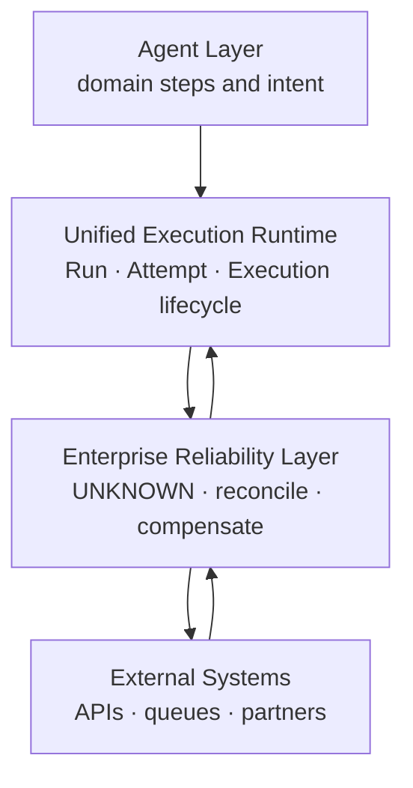
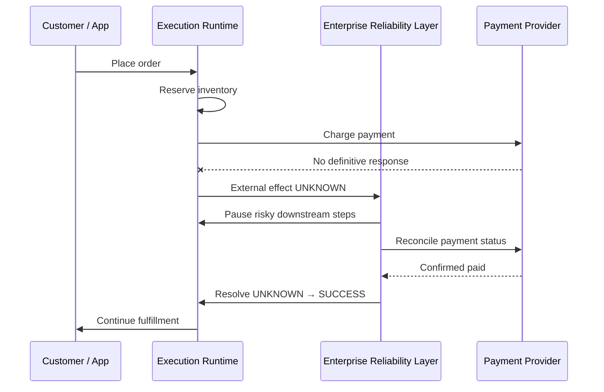
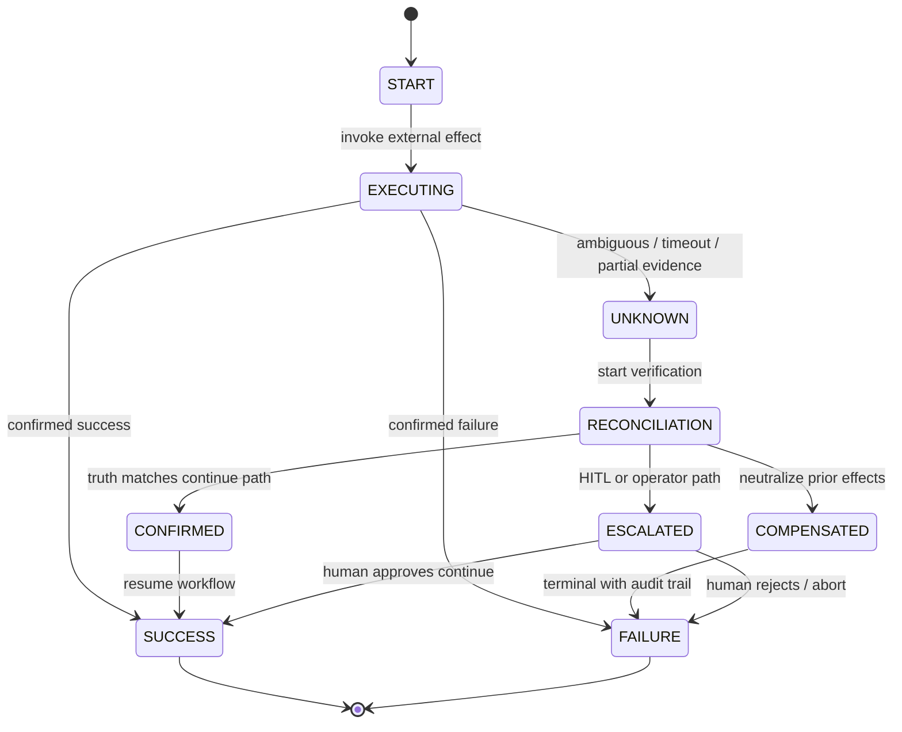

<!--
© Artur Czarnecki. All rights reserved.
Intergrax is source-available under the Intergrax Evaluation and Collaboration License 1.0.
See LICENSE for permitted evaluation, collaboration, and contribution use.
-->

# Enterprise Reliability Layer

**Intergrax Enterprise Reliability Layer (ERL)** is the platform capability that treats **uncertainty about external reality** as a first-class execution concern: pause risky work, verify truth in external systems, then continue, compensate, or escalate—without guessing success or failure.

ERL does **not** execute business logic. It **protects execution correctness** when distributed enterprise dependencies are slow, ambiguous, or temporarily unreachable.

> [!NOTE]
> Intergrax is source-available and in active R&D. This document defines **target architecture** for Enterprise Reliability Layer. It is **not** a claim that ERL is fully implemented, production-qualified, or covered by public proof routes. Implementation planning is a separate roadmap step.

**Primary audience:** Principal / Staff architects, enterprise integration leads, operators, and auditors evaluating how Intergrax handles ambiguous external effects.

**Subordinate architecture hubs:**

| Hub | Role |
|-----|------|
| [`UNCERTAINTY_MANAGEMENT.md`](UNCERTAINTY_MANAGEMENT.md) | UNKNOWN state model, lifecycle, decision rules |
| [`RECONCILIATION.md`](RECONCILIATION.md) | Verifying external truth before the next step |
| [`EXTERNAL_EFFECT_CONTRACTS.md`](EXTERNAL_EFFECT_CONTRACTS.md) | Declared safety properties for external operations |
| [`RECOVERY_AND_COMPENSATION.md`](RECOVERY_AND_COMPENSATION.md) | Continue, compensate, escalate, or HITL after uncertainty |

---

## Purpose

Enterprise systems operate where **outcomes are not immediately knowable**:

- external APIs time out or return ambiguous responses,
- networks partition mid-request,
- providers accept work asynchronously,
- distributed replicas disagree until reconciliation completes.

If the platform treats every timeout as failure or every retry as safe, workflows **double-charge**, **double-ship**, or **orphan** business state. Applications then re-implement ad hoc polling, manual ops runbooks, and brittle compensations.

ERL converts uncertainty into a **controlled platform process**: explicit **UNKNOWN** state, bounded reconciliation, orchestrated recovery, and audit-grade evidence—so autonomous and long-running execution remains trustworthy.

**Business meaning:** fewer incidents, less manual cleanup, safer autonomous execution, and higher trust in cross-system workflows.

---

## Architectural position

```text
Intergrax Platform
        │
   Agent Layer (Tier-2 domain behavior; recovery intent only)
        │
        ▼
   Execution Runtime (UER / Nexus — lifecycle, identity, pause/resume)
        │
        ▼
   Enterprise Reliability Layer (uncertainty, reconciliation, effect safety)
        │
        ▼
   External Systems (payments, ERP, CRM, carriers, identity, …)
```



| Boundary | Owns | Does not own |
| -------- | ---- | ------------ |
| **Agent Layer** | Business steps, domain state transitions, emitting recovery **intent** | Final external truth, unbounded retry loops, compensation business rules without platform contracts |
| **Execution Runtime** | Lifecycle IDs, pause/resume/cancel, checkpoint hooks, emitting lifecycle facts | Guessing whether a payment succeeded |
| **Enterprise Reliability Layer** | UNKNOWN classification, reconciliation orchestration, effect-safety gates, recovery paths for ambiguous external ops | Product UX, business policy definitions, orchestration topology (Nexus) |
| **External Systems** | Authoritative business records | Intergrax execution correctness |

---

## Core principles

### 1. UNKNOWN is a first-class state

| State | Meaning |
| ----- | ------- |
| **SUCCESS** | The operation completed; external effect is confirmed per contract. |
| **FAILURE** | The operation failed; no successful external effect (or effect was explicitly voided). |
| **UNKNOWN** | The platform does not yet know the final external result. |

**UNKNOWN is not an error.** It is a **managed state** that requires a controlled resolution path (reconciliation, bounded wait, compensation policy, or escalation)—documented in [`UNCERTAINTY_MANAGEMENT.md`](UNCERTAINTY_MANAGEMENT.md).

### 2. Never guess external reality

The platform must not assume:

- `timeout` ⇒ failure,
- `retry` ⇒ safe,
- `HTTP 5xx` ⇒ no side effect,
- `no response` ⇒ success.

It must **verify reality** through reconciliation and declared external-effect contracts—see [`RECONCILIATION.md`](RECONCILIATION.md) and [`EXTERNAL_EFFECT_CONTRACTS.md`](EXTERNAL_EFFECT_CONTRACTS.md).

### 3. Platform-level responsibility

Applications should not each implement bespoke idempotency stores, payment-status pollers, or “stuck order” scanners. Intergrax provides **reusable mechanisms** coordinated with existing Reliability, Governance, and Observability boundaries.

---

## Main capabilities

```text
Enterprise Reliability Layer
│
├── Uncertainty Management      — UNKNOWN admission, lifecycle, gating risky steps
├── Reconciliation              — read authoritative external state before deciding
├── Recovery Orchestration      — coordinate pause, resume, and resolution with UER
├── Compensation Handling       — neutralize prior effects when reality demands rollback
├── External Effect Contracts   — idempotency, reconcile, compensate declarations
└── Audit Evidence              — durable record of uncertainty and resolution
```

| Capability | Simple explanation | Architectural meaning |
| ---------- | ------------------ | --------------------- |
| **Uncertainty Management** | “We don’t know yet—stop assuming.” | Gates downstream side effects until UNKNOWN is resolved or explicitly accepted risk is governed. |
| **Reconciliation** | “Ask the system of record.” | Provider-specific verification behind one platform reconciliation pattern. |
| **Recovery Orchestration** | “Resume safely when truth is known.” | Plugin `RecoveryStrategy` → `RecoveryDecision`; UER applies lifecycle via `ExecutionLifecyclePort` — see [`RECOVERY_AND_COMPENSATION.md`](RECOVERY_AND_COMPENSATION.md#recovery-lifecycle-boundary-erl-foundation). Not a second runtime. |
| **Governance Evaluation** | “May this run without a human?” | Plugin `GovernanceStrategy` → `GovernanceDecision` (`allow`, `deny`, `approval_required`); HITL owns approval workflows — see [`RECOVERY_AND_COMPENSATION.md`](RECOVERY_AND_COMPENSATION.md#governance-evaluation-boundary-erl-foundation). Does not execute or self-approve. |
| **Compensation Handling** | “Undo or offset what already happened.” | Planning (`CompensationPlan`) and bounded execution (`CompensationExecutionRequest` → plugin gateway → `CompensationExecutionResult`) — see [`RECOVERY_AND_COMPENSATION.md`](RECOVERY_AND_COMPENSATION.md#compensation-execution-boundary-erl-foundation). |
| **External Effect Contracts** | “Declare how safe this operation is.” | Integrations/tools declare idempotency and reconciliation hooks—architecture only until implementation. |
| **Audit Evidence** | “Prove what we knew and when.” | Emitted on the Observability spine; Reliability/ERL own behavior, Observability owns persistence. |

---

## Integration with existing Intergrax architecture

ERL **extends** existing domains; it does not replace them. Use the linked hubs for detailed contracts.

| Neighbor | Relationship |
| -------- | ------------- |
| [**Unified Execution Runtime**](UNIFIED_EXECUTION_RUNTIME.md) | Pause/resume, Execution identity, lifecycle transitions when UNKNOWN blocks progress. |
| [**Unified Execution Architecture**](UNIFIED_EXECUTION_ARCHITECTURE.md) | Cross-domain identity and Execution Tree semantics for resolution and fencing. |
| [**Reliability / HITL**](RELIABILITY_FAILURE_AND_HITL.md) | Failure classification, retry layers (R0–R4), compensation queue, HITL escalation—ERL adds **uncertainty-before-classification** paths; Reliability still owns bounded retry taxonomy. |
| [**Governed Execution**](GOVERNED_EXECUTION.md) | Policy and authority before consequential continue/compensate; ERL **governance evaluation** returns allow/deny/approval-required before execution lifecycle proceeds. |
| [**HITL**](RELIABILITY_FAILURE_AND_HITL.md#how-recovery-works) | Human decision when reconciliation is inconclusive or risk exceeds autonomy—`HumanApprovalRequirement` carries platform-level approval need; HITL owns workflow, not ERL. |
| [**Observability**](OBSERVABILITY.md) | UNKNOWN entered, reconciliation attempts, resolution outcome on `RuntimeEvent` / journal spine. |
| [**Integrations**](INTEGRATIONS.md) | Transport and provider adapters; reconciliation reads flow through integration boundaries. |
| [**Tools**](TOOLS.md) | Tool invocations with external side effects participate in effect contracts. |
| [**Decision System**](DECISION_SYSTEM.md) | Semantic decisions remain separate from **external effect truth**; ERL resolves operational uncertainty, not decision correctness. |

---

## Enterprise example: online laptop purchase

| Step | What happens |
| ---- | ------------- |
| 1 | Customer places order (application workflow). |
| 2 | Inventory is reserved (local committed step). |
| 3 | Payment request is sent to provider. |
| 4 | Network failure: no definitive payment response. |
| 5 | Platform classifies payment result as **UNKNOWN**—not failure. |
| 6 | ERL **pauses** risky steps (e.g. shipment, final capture). |
| 7 | **Reconciliation** queries provider status APIs / settlement feed. |
| 8 | Provider confirms **paid**. |
| 9 | Workflow **continues**; reservation converts to fulfillment. |

**Without ERL:** operators chase “stuck” orders, or automation retries payment and double-charges.

**With ERL:** uncertainty is explicit, evidence is recorded, and continuation requires verified truth.



---

## State machine (uncertainty resolution)

Conceptual states for an external-effect operation under ERL (not every execution step):



Details: [`UNCERTAINTY_MANAGEMENT.md`](UNCERTAINTY_MANAGEMENT.md) · [`RECOVERY_AND_COMPENSATION.md`](RECOVERY_AND_COMPENSATION.md).

---

## Current maturity

| Axis | Boundary |
| ---- | -------- |
| **Architecture** | ERL capability canon defined in this hub and subordinate documents (**TARGET**). |
| **Implementation** | **NOT STARTED** as a dedicated layer—related behaviors partially overlap Reliability, Integrations, and external-operation contracts elsewhere. |
| **Proof** | No dedicated public ERL proof route. |
| **Plan** | Implementation roadmap is **NEXT** (roadmap step 5)—no 1:1 maintainer plan pair yet. |

---

## Engineering canon

| Document | Use when |
| -------- | -------- |
| [`UNCERTAINTY_MANAGEMENT.md`](UNCERTAINTY_MANAGEMENT.md) | Modeling UNKNOWN and gating rules |
| [`RECONCILIATION.md`](RECONCILIATION.md) | Designing verification flows |
| [`EXTERNAL_EFFECT_CONTRACTS.md`](EXTERNAL_EFFECT_CONTRACTS.md) | Declaring integration safety properties |
| [`RECOVERY_AND_COMPENSATION.md`](RECOVERY_AND_COMPENSATION.md) | Post-uncertainty outcomes |
| [`RELIABILITY_FAILURE_AND_HITL.md`](RELIABILITY_FAILURE_AND_HITL.md) | Retry, HITL, compensation queue (existing) |
| [`intergrax_runtime_architecture.md`](intergrax_runtime_architecture.md) | Platform hub index |
