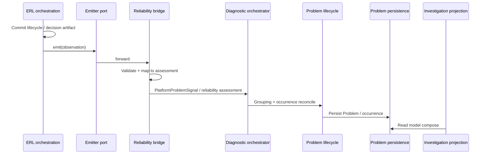
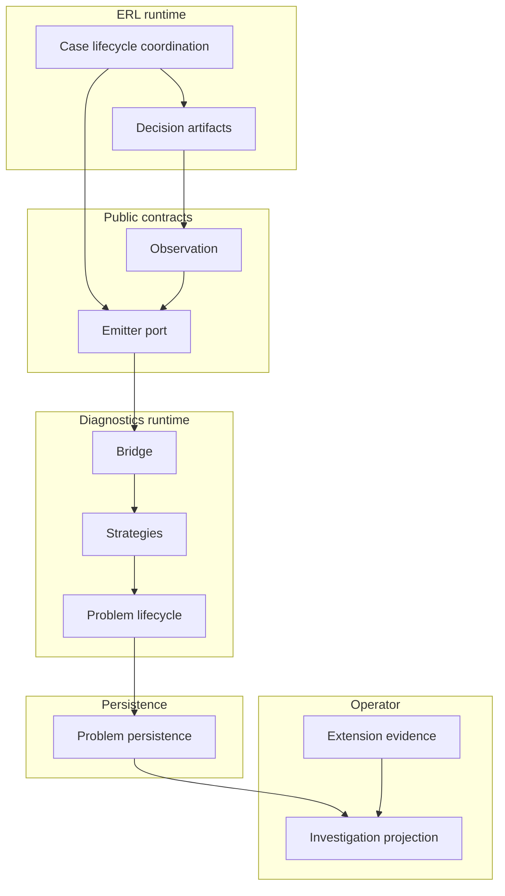

<!--
© Artur Czarnecki. All rights reserved.
Intergrax is source-available under the Intergrax Evaluation and Collaboration License 1.0.
See LICENSE for permitted evaluation, collaboration, and contribution use.
-->

# ERL-DIAG-001 — External-Effect Reliability Operator Diagnostics Architecture

**Task:** ERL-DIAG-001  
**Status:** Architecture design (implementation not in scope)  
**Qualification instance:** ERL-QUAL-004 (`enterprise_payment_uncertainty_recovery`)  
**Branch target:** `development`

**Related artifacts:**

| Artifact | Role |
| --- | --- |
| [`ENTERPRISE_RELIABILITY_LAYER.md`](ENTERPRISE_RELIABILITY_LAYER.md) | ERL boundaries |
| [`ERL_QUAL_004_PLATFORM_CAPABILITY_GAP_ANALYSIS.md`](ERL_QUAL_004_PLATFORM_CAPABILITY_GAP_ANALYSIS.md) | Capability gap |
| [`docs/ERL_QUAL_004_DIAGNOSTICS_PLATFORM_GAP.md`](../../../ERL_QUAL_004_DIAGNOSTICS_PLATFORM_GAP.md) | Diagnostics integration gap |
| `intergrax.contracts.diagnostics` | Problem persistence spine |
| `intergrax.contracts.diagnostic_investigation` | Operator read vocabulary |
| `intergrax.contracts.diagnostic_extension_evidence` | Domain enrichment SPI |
| `intergrax.contracts.enterprise_reliability.*` | Reliability facts and decisions |
| `intergrax.contracts.execution_evidence.persistence_reliability_diagnostics_contract` | Precedent emission observer pattern |

---

## 1. Executive summary

Intergrax can execute the Enterprise Reliability Layer (ERL) lifecycle and record chronological trace events, but it cannot yet project **operator-meaningful reliability diagnostics** into the central **Problem / investigation spine** through a stable, domain-neutral public contract.

This design introduces a **generic reliability diagnostics pipeline**:

```text
ERL authoritative facts (case lifecycle + decision artifacts)
        ↓
Public emission port (domain-neutral observations)
        ↓
Diagnostics bridge (runtime — maps observations → assessments)
        ↓
Plugin strategies (grouping, severity, recommendation, enrichment)
        ↓
Problem lifecycle + existing persistence
        ↓
Investigation read projection (+ extension evidence for domain wording)
```

Payment is the qualification instance; the architecture is **not** payment-specific. Diagnostics **never** hold execution authority. Hosted and proof/lab execution **share the same public emission boundary**.

---

## 2. Business problem

Enterprise workflows invoke external systems of record where outcomes can be **UNKNOWN** after communication loss. Operators must understand:

- what reliability problem exists,
- why it matters for automation safety,
- what evidence supports the posture,
- whether external truth is known,
- what governance decided,
- what recovery posture applies,
- what action is required next.

Tracing answers **what happened**. Diagnostics must answer **why this matters** and **what the operator should do next**, on the same durable Problem spine used elsewhere (incidents, execution failures, persistence reliability).

---

## 3. Existing architecture

### 3.1 Public diagnostics spine

| Component | Location | Capability |
| --- | --- | --- |
| Problem identity / status | `intergrax.contracts.diagnostics.problem_identity` | `ProblemId`, `ProblemStatus` |
| Subject ref port | `intergrax.contracts.diagnostics.subject_ref` | `ProblemGroupingSubjectRef` (`tenant_id`, `index_token`) |
| Persistence ports | `intergrax.contracts.diagnostics.problem_persistence`, `diagnostic_repository`, `diagnostic_read_model` | Read/write Problem rows |
| Investigation enums | `intergrax.contracts.diagnostic_investigation` | Severity, recommendation kinds (execution-centric today) |
| Extension SPI | `intergrax.contracts.diagnostic_extension_evidence` | Post-Problem enrichment |

### 3.2 ERL contracts

| Area | Location |
| --- | --- |
| Reliability case lifecycle | `intergrax.contracts.enterprise_reliability.case_lifecycle` — `case_id`, `correlation_id`, `ReliabilityCaseLifecycleRecord` |
| Semantic observability facts | `intergrax.contracts.enterprise_reliability.observability` — admission, reconciliation, resolution facts (contracts; emitter maturity varies) |
| Evidence, reconciliation, governance, recovery | `evidence.py`, `reconciliation.py`, `governance_decision.py`, `recovery_decision.py` |
| Plugin SPI | `plugin_spi.py` |

### 3.3 Runtime (internal — not a public application boundary)

`DiagnosticOrchestrator`, `ProblemLifecycleEngine`, `PlatformProblemSignal`, `TerminalExecutionDiagnosticTrigger`, problem grouping strategies (`intergrax.runtime.diagnostics.problem_grouping`), investigation projections.

### 3.4 Observability spine (Plane B)

`intergrax.contracts.tracing` — `TraceEvent`, `DiagnosticPayload` for chronology; used heavily by ERL-QUAL-004 proof today.

### 3.5 Precedent: persistence reliability diagnostics

`PersistenceReliabilityDecisionObserver` + `PersistenceReliabilityDiagnostic` — typed diagnostic view, pluggable sink, **no execution mutation**. This design mirrors that pattern at ERL scope.

---

## 4. Gap

There is **no** public contract or documented bridge that:

1. Emits operator-meaningful reliability findings from ERL phases (admission → reconciliation → evidence → resolution → governance → recovery).
2. Maps those facts into durable `Problem` / occurrence records with remediation hints **without** distorting execution-centric `DiagnosticFindingKind`.
3. Allows proof executors (direct ERL API, no UER terminal trigger) and hosted applications to use the **same** path.

---

## 5. Design goals

| ID | Goal |
| --- | --- |
| G1 | Generic, domain-neutral reliability → Problem diagnostics |
| G2 | Contract-first; every variable mechanism pluginable with safe defaults |
| G3 | Single central Problem spine; no parallel diagnostic stores |
| G4 | Facts before interpretation; no payment prose in platform core |
| G5 | Strong correlation model (business, execution, case, problem identities separated) |
| G6 | Idempotent emissions; replay-safe |
| G7 | Failure-safe: diagnostics failure must not alter ERL business semantics |
| G8 | Same mechanism for hosted execution and proof/lab runs |
| G9 | No diagnostics execution authority |
| G10 | Multi-tenant isolation and evidence/trace reference discipline |

---

## 6. Non-goals

- Implementing contracts, runtime bridge, or plugins (follow-on tasks).
- Payment-specific grouping, severity, or wording in `intergrax/`.
- Replacing ERL orchestration or governance evaluation.
- Using trace as the diagnostics database.
- New reliability diagnostics database or scenario-local Problem engines.
- Automatic recovery, compensation, or governance approval via diagnostics.

---

## 7. Architecture principles

| Principle | Decision |
| --- | --- |
| Facts before interpretation | **DECIDED** — ERL emits structured facts; platform classifies; domain enriches wording |
| Platform operates on contracts | **DECIDED** — emission port + strategy SPIs in `intergrax.contracts.*` |
| One Problem spine | **DECIDED** — reuse `ProblemPersistence` |
| No execution authority | **DECIDED** — recommendations are hints only |
| Trace ≠ diagnostics truth | **DECIDED** — trace is supporting chronology |
| No scenario runtime imports | **DECIDED** — Tier-3 uses public ports only |

---

## 8. Source of truth

### 8.1 Candidate evaluation

| Candidate | Verdict |
| --- | --- |
| A. Direct ERL lifecycle emissions | **Supporting** — transport into diagnostics, not sole authority |
| B. Canonical ERL journal / case lifecycle record | **Authoritative** — `ReliabilityCaseLifecycleRecord` + immutable transition log |
| C. Decision artifacts (`GovernanceDecision`, `RecoveryDecision`, evidence verdicts) | **Authoritative** — content of observations |
| D. Trace events | **Supporting evidence only** — chronology, not Problem truth |
| E. Execution terminal state | **Supporting** — correlation anchor for UER-hosted runs |
| F. Hybrid | **DECIDED — chosen model** |

### 8.2 Authoritative model (DECIDED)

**Primary source of truth for reliability diagnostic content:**

1. **Reliability case identity and lifecycle position** — `ReliabilityCaseLifecycleRecord` (`case_id`, `correlation_id`, `lifecycle_state`, `refs.*`).
2. **Typed ERL decision artifacts** already produced by orchestration (evidence verdict refs, reconciliation disposition, resolution platform action, governance disposition, recovery disposition) — referenced by `refs` and/or stable artifact URIs, not re-derived in diagnostics.

**Supporting (non-authoritative):**

- Trace events and `DiagnosticPayload` on the observability spine.
- Execution identity tuples (`execution_id`, `run_id`, `task_id`, `attempt_id`).
- Extension evidence contributions (wording, risk explanation).

**Replay / reconstruction:**

- Observations are built from **immutable artifact refs** at emission time. Replaying diagnostics re-emits from the same artifact set with the same idempotency keys; it does not re-read trace as authority.
- If journal persistence for case transitions is added in implementation, it becomes the replay source; until then, orchestration emits observations **at transition commit** (same moment facts are considered committed in ERL).

**Duplicate avoidance:**

- Stable `observation_id` + idempotent Problem occurrence reconciliation (see §17).

---

## 9. Public contracts

### 9.1 Package placement (DECIDED — OQ-1)

Canonical public surface: **`intergrax.contracts.enterprise_reliability.diagnostics`**.

Rejected alternative: `intergrax.contracts.diagnostics.reliability` — would split ERL-sourced facts from the ERL contract spine and risk coupling central diagnostics persistence into the emission contract graph.

Rationale: emission is ERL-sourced but consumed by central diagnostics; colocating with ERL facts avoids circular imports while keeping diagnostics persistence in `intergrax.contracts.diagnostics`.

### 9.2 Core types (names subject to repository convention review)

| Concept | Proposed name | Notes |
| --- | --- | --- |
| Material unit emitted | `ExternalEffectReliabilityObservation` | One fact-bearing diagnostic unit |
| Signal taxonomy | `ExternalEffectReliabilitySignalKind` | Domain-neutral enum (see below) |
| Emission port | `ExternalEffectReliabilityDiagnosticEmitter` | Void/best-effort `emit` |
| Null sink | `NullExternalEffectReliabilityDiagnosticEmitter` | Default no-op |
| Correlation bundle | `ReliabilityDiagnosticCorrelation` | Structured fields, not one string |
| Subject for grouping | `ReliabilityCaseSubjectRef` | Implements `ProblemGroupingSubjectRef` |

### 9.3 `ExternalEffectReliabilitySignalKind` (domain-neutral, DECIDED)

Illustrative set (versioned schema `external_effect_reliability_signal_kind.v1`):

| Kind | Meaning |
| --- | --- |
| `UNCERTAINTY_ADMITTED` | External effect UNKNOWN admitted |
| `RECONCILIATION_ATTEMPTED` | Probe executed; links evidence_ref |
| `TRUTH_ESTABLISHED` | Authoritative external truth known |
| `TRUTH_UNAVAILABLE` | Reconciliation exhausted / cannot establish |
| `EVIDENCE_INSUFFICIENT` | Evidence cannot support safe automation |
| `EVIDENCE_SUFFICIENT` | Evidence supports resolution posture |
| `RESOLUTION_POSTURE` | Resolution decision recorded |
| `GOVERNANCE_POSTURE` | Governance disposition recorded (consume fact) |
| `RECOVERY_POSTURE` | Recovery disposition recorded (consume fact) |
| `AUTOMATION_SAFETY_LIMIT` | Platform declares continuation unsafe (derived default classification) |

No payment semantics in enum literals.

### 9.4 Observation payload (sketch)

Frozen Pydantic/dataclass with `extra="forbid"`, explicit `schema_version`:

- `observation_id: str` (idempotency key, see §17)
- `tenant_id: str`
- `signal_kind: ExternalEffectReliabilitySignalKind`
- `recorded_at: datetime`
- `reliability_case_id: str`
- `correlation: ReliabilityDiagnosticCorrelation`
- `lifecycle_state: ReliabilityCaseLifecycleState` (snapshot at emit)
- `artifact_refs: ReliabilityDiagnosticArtifactRefs` (evidence, governance, recovery, resolution — optional fields)
- `execution_safety_hint: AutomationSafetyHint` (enum: `SAFE`, `UNSAFE`, `UNKNOWN`) — factual hint from ERL, not operator prose
- `trace_refs: tuple[str, ...]` (optional, bounded)
- `source_transition_id: str | None` (journal line id when available)

### 9.5 Emission port (DECIDED pattern)

Mirror `PersistenceReliabilityDecisionObserver`:

```python
class ExternalEffectReliabilityDiagnosticEmitter(Protocol):
    def emit(self, observation: ExternalEffectReliabilityObservation) -> None:
        """Best-effort; must not mutate ERL or execution state."""
```

Composition registers a **runtime bridge implementation** that forwards to internal orchestration; applications and proofs depend only on the port.

---

## 10. Correlation model

Four **distinct** identity classes — **DECIDED: never collapse into one string**.

| Class | Fields | Purpose |
| --- | --- | --- |
| **Business correlation** | `correlation_id` (ERL), optional business entity refs in extension | Tie to business workflow |
| **Execution identity** | `tenant_id`, `task_id`, `run_id`, `attempt_id`, `execution_id` | UER / hosting scope |
| **Reliability case identity** | `reliability_case_id` (`case_id` in lifecycle record) | ERL case spine |
| **Diagnostic problem identity** | `ProblemId`, `occurrence_id` | Central diagnostics spine |

`ReliabilityDiagnosticCorrelation` struct:

```text
tenant_id
correlation_id
reliability_case_id
external_effect_contract_id   # from ReliabilityCaseLifecycleRefs.contract_id
execution_id | None
run_id | None
task_id | None
trace_id | None
idempotency_key | None        # business idempotency when declared
observation_id              # diagnostic emission idempotency
```

**ProblemId** remains allocated by Problem lifecycle engine after grouping — not equal to `reliability_case_id` (many observations → one Problem).

---

## 11. Problem identity and grouping

### 11.1 One diagnostic occurrence (DECIDED)

One **occurrence** = one accepted `ExternalEffectReliabilityObservation` that passes validation and is reconciled into Problem lifecycle (may update an existing Problem aggregate).

Not every trace event. Not every reconciliation retry as a new Problem — retries may be **timeline entries** on the same Problem.

### 11.2 One Problem (DECIDED)

One **Problem** = operator-facing aggregate for a stable **grouping subject** under a **grouping strategy**, carrying rolling severity, recommendations, and linked occurrences.

### 11.3 Subject model (DECIDED)

**Do not** introduce `ExternalEffectReliabilitySubject` as a parallel taxonomy.

**Extend** via `ReliabilityCaseSubjectRef` implementing existing `ProblemGroupingSubjectRef`:

- `tenant_id`
- `index_token` = `erl:case:{reliability_case_id}` (deterministic, documented format)

Rationale: `ProblemGroupingSubjectRef` is intentionally minimal; reliability case id is the natural ERL operator unit. Business entity grouping is a **strategy override**, not a new subject protocol.

### 11.4 Grouping strategy (DECIDED — pluginable)

New public SPI: **`ExternalEffectReliabilityProblemGroupingStrategy`** (contracts), implemented in runtime, registered via existing diagnostics strategy composition (same registry patterns as `ProblemGroupingStrategy` — **DECIDED: extend strategy family**, not a sixth global singleton registry).

**Default strategy (DECIDED):** `ReliabilityCaseDefaultGroupingStrategy`

- **Basis:** `reliability_case_id` + `tenant_id`
- **Method:** `DETERMINISTIC`
- **Rationale:** One ERL case → one operator Problem aggregate unless tenant configures composite strategy

**Override examples (plugin):**

- Group by `correlation_id` when multiple cases represent one business saga
- Group by `external_effect_contract_id` + business entity ref (from extension context)
- Composite key strategies for multi-tenant SaaS

Platform **must not** hard-code payment keys in `intergrax/`.

---

## 12. Strategy / plugin model

| # | Mechanism | SPI location | Reuse |
| --- | --- | --- | --- |
| 1 | Problem grouping | `ExternalEffectReliabilityProblemGroupingStrategy` | Extends grouping infrastructure |
| 2 | Severity classification | `ReliabilityDiagnosticSeverityStrategy` | New; inputs observation + optional `SeverityContext` |
| 3 | Recommendation derivation | `ReliabilityDiagnosticRecommendationStrategy` | New; outputs `DiagnosticRecommendationKind` + optional structured codes |
| 4 | Diagnostic enrichment | `ReliabilityDiagnosticEnrichmentContributor` | May wrap `DiagnosticExtensionEvidence` |
| 5 | Domain wording | `DiagnosticExtensionEvidenceContributor` | **Existing SPI — sufficient** with schema ids |
| 6 | Evidence augmentation | `DiagnosticExtensionEvidenceContributor` | **Existing** — add refs, not blobs |

**DECIDED:** Do not create six separate registries. One **composition root** (`ReliabilityDiagnosticStrategyBundle` or diagnostics wiring) resolves strategies by `strategy_id` with explicit version pins.

### 12.1 Severity (DECIDED)

- **Default:** deterministic mapping from `signal_kind` + `automation_safety_hint` + `lifecycle_state` (conservative).
- **Strategy input:** `SeverityContext` — optional business risk attributes (amount tier, SLA class) supplied by application/scenario via **public context port**, never hard-coded payment fields in platform.
- **Fallback:** `DiagnosticInvestigationSeverity.UNKNOWN` on strategy failure.

### 12.2 Recommendations (DECIDED)

Platform semantic categories (extend `DiagnosticRecommendationKind` in a **versioned additive** way):

| Platform kind | Operator meaning |
| --- | --- |
| `OBSERVE` | Wait / monitor |
| `RETRY_RECONCILIATION` | Safe to re-probe external truth |
| `REQUEST_APPROVAL` | Governance requires human gate |
| `INVESTIGATE` | Evidence gap |
| `ESCALATE` | Recovery posture demands escalation |
| `MANUAL_REMEDIATION` | Operator action outside automation |
| (existing kinds) | Still valid for execution-centric problems |

Domain **wording** ("retry may double-charge") via `DiagnosticExtensionEvidence` only.

---

## 13. Default implementations

| Mechanism | Default | Properties |
| --- | --- | --- |
| Emitter | `NullExternalEffectReliabilityDiagnosticEmitter` | No-op |
| Bridge | Wired in composition when diagnostics enabled | Forwards to orchestrator |
| Grouping | `ReliabilityCaseDefaultGroupingStrategy` | case_id + tenant |
| Severity | `ConservativeReliabilitySeverityStrategy` | signal_kind table |
| Recommendation | `ConservativeReliabilityRecommendationStrategy` | maps posture → kind |
| Enrichment | none | Extension plugins optional |

All defaults: deterministic, conservative, auditable, domain-neutral.

---

## 14. Hosted execution integration

**Integration point (DECIDED):** ERL runtime **lifecycle coordination** (case transition commit hooks) invokes `ExternalEffectReliabilityDiagnosticEmitter.emit` **after** authoritative facts are committed.

Secondary anchor for execution-centric correlation:

- **UER terminal path:** `TerminalExecutionDiagnosticTrigger` remains for **execution failure** diagnostics; reliability observations **also** carry `execution_id` when present. No merge of signal types.
- **Hosted applications:** `HostedApplicationDiagnosticEventPublisher` path unchanged for app events; ERL phase wiring registers the same emitter instance in DI/composition.

```text
ERL orchestration (case_lifecycle_coordination, reconciliation, resolution, …)
        ↓ emit(observation)
ExternalEffectReliabilityDiagnosticEmitter (public)
        ↓
ReliabilityDiagnosticBridge (runtime internal)
        ↓
DiagnosticOrchestrator / ProblemLifecycleEngine
```

**Phase B (ERL-DIAG-001B) ownership:** `intergrax/runtime/diagnostics/reliability/` — `ReliabilityDiagnosticHandoff` → `PlatformProblemSignal` (`platform.external_effect_reliability`) + `DiagnosticSignalSubjectScope` (`application_id=erl`, `instance_id=reliability_case_id`); orchestration via injected `ReliabilityDiagnosticOrchestrationPort` only (no direct persistence).

**Phase B semantic transport (001B-H):** `error_code` = stable fact-type classifier (`external_effect_reliability.<signal_kind>`); `event_id` = `observation_id` (source occurrence identity); `application_attributes.observation_id` mirrors the same id. Bridge does **not** map business severity from `signal_kind` — it leaves `PlatformProblemSignal.severity` at the platform model default until Phase classify plugins (001D).

**REJECTED:** Observer-only on trace tail without lifecycle commit (race + incomplete facts).

---

## 15. Proof / lab integration

**DECIDED:** Proof executors (`platform_proofs/.../erl_reliability_phase.py` and similar) receive an `ExternalEffectReliabilityDiagnosticEmitter` via **composition** (test harness or scenario container), same interface as production.

- No `intergrax.runtime.diagnostics.*` imports in scenario code.
- No special "proof mode" diagnostics architecture.
- Trace payloads (`ErlQual004LifecycleStepDiagV1`) may remain for chronology; **operator Problems** must come from observations.

---

## 16. Diagnostics lifecycle



Stages:

1. **Emit** — fact snapshot
2. **Validate** — schema, tenant, required refs
3. **Classify** — severity + recommendation strategies
4. **Group** — strategy → subject ref
5. **Reconcile occurrence** — idempotent
6. **Project** — investigation view + extension evidence

---

## 17. Idempotency

**DECIDED** stable inputs:

```text
observation_id = hash(
  tenant_id,
  reliability_case_id,
  signal_kind,
  source_artifact_ref | source_transition_id,
  artifact_fingerprint
)
```

- **Problem reconciliation:** same `observation_id` → update occurrence metadata, do not create duplicate Problem.
- **Replay:** re-emit with same id → no duplicate rows; optional monotonic `sequence` for timeline ordering within Problem.

Grouping reconciliation policy aligns with existing `ProblemLifecycleEngine` occurrence retry semantics.

---

## 18. Failure model

| Failure | Behavior | Affects ERL execution? |
| --- | --- | --- |
| `emit` throws | Catch at bridge; log meta-telemetry | **No** |
| Persistence failure | Retry with bounded backoff; surface diagnostics-health event | **No** |
| Malformed observation | Reject; meta-telemetry; no Problem write | **No** |
| Plugin timeout | Use default severity/recommendation; record limitation on Problem | **No** |
| Malformed plugin output | Discard plugin output; defaults + limitation | **No** |
| Duplicate emission | Idempotent reconcile | **No** |

**DECIDED:** Diagnostics failure **must not** silently alter business semantics; ERL continues unless ERL itself decides otherwise.

### 18.1 Observability of diagnostics (DECIDED)

Meta-events on **Plane B tracing** with dedicated payload schema `diagnostics_pipeline_health.v1` — **not** recursive Problem emission for the same failure path.

Separate channel: metrics/logger for bridge failures.

---

## 19. Persistence

**DECIDED:** No new reliability diagnostics database.

Flow: observation → assessment → **existing** `ProblemPersistence` / diagnostic repository.

Additional stored data:

| Need | Approach |
| --- | --- |
| Reliability signal kind | Problem extension field or namespaced occurrence metadata (versioned) |
| Case / contract refs | Occurrence correlation block |
| Evidence refs | Store refs only, not blobs |
| Governance / recovery | Ref + disposition enum snapshot at emit time |

If public `PersistedProblem` needs extension → **versioned** optional block `reliability_diagnostic.v1` on occurrence records (**OPEN** exact field layout in implementation task).

---

## 20. Investigation projection

Operator view composition (existing `DiagnosticInvestigationView` patterns + extensions):

| Section | Source |
| --- | --- |
| Title | Platform-neutral template from `signal_kind` + lifecycle |
| Why it matters | Classification output + extension evidence |
| Evidence | Linked `evidence_ref` list with confidence |
| Truth status | From `TRUTH_*` signals |
| Governance | Disposition enum from artifact ref (no re-eval) |
| Recovery | Recovery disposition from artifact ref |
| Recommended action | `DiagnosticRecommendationKind` + extension wording |
| Timeline | Ordered observations + optional trace links |

Storage remains domain-neutral; payment strings only in extension payloads.

---

## 21. Evidence relationship

**DECIDED:**

- Observations carry **required** `evidence_ref` when signal kind implies evidence (e.g. reconciliation attempt).
- Multiple refs allowed (bounded tuple).
- **Stale evidence:** occurrence records `artifact_fingerprint` or `recorded_at`; projection shows staleness warning via read model policy — does not re-fetch evidence in diagnostics core.
- **Provenance:** `plugin_id`, `probe_ref` from ERL artifacts.

Prefer refs over copying blobs into Problem rows.

---

## 22. Trace relationship

| Concern | Role |
| --- | --- |
| Trace | Chronology, debugging, correlation |
| Diagnostics | Material operator Problem |
| Link | `trace_refs` on observation (optional, bounded) |

**DECIDED:** Diagnostics do not duplicate full trace history; investigation timeline may link "open trace" without ingesting all events.

---

## 23. Governance relationship

**DECIDED:** Diagnostics **consumes** `GovernanceDecision` (or governance result ref + disposition snapshot at emit). **No** governance re-evaluation in diagnostics.

Example mapping:

- `GovernanceDisposition.APPROVAL_REQUIRED` → signal `GOVERNANCE_POSTURE` + recommendation `REQUEST_APPROVAL` + neutral explanation template.

---

## 24. Recovery relationship

**DECIDED:** Diagnostics **consumes** `RecoveryDecision` / recovery artifact ref. Does not invoke recovery handlers.

Recovery disposition drives `RECOVERY_POSTURE` signal and recommendation kinds (`ESCALATE`, `OBSERVE`, etc.).

---

## 25. Security / multi-tenancy

| Topic | Design |
| --- | --- |
| Tenant isolation | `tenant_id` on every observation; persistence queries scoped |
| Sensitive diagnostics | Classification strategies may elevate visibility; access control on read ports (existing) |
| Evidence access | Ref resolution through authorized evidence services — diagnostics store refs only |
| Plugin leakage | Extension evidence scoped by `DiagnosticEvidenceScope` |
| PII / redaction | Domain plugins redact extension text; platform stores enums + refs |
| Trace/evidence exposure | Read model filters refs by operator role (**OPEN** policy integration with authz) |

---

## 26. Scaling

| Concern | Mitigation |
| --- | --- |
| High-volume external effects | Emit only **material** state transitions, not every probe log line |
| Diagnostic spam | Grouping reduces Problems; reconciliation attempts roll into timeline |
| Async projection | Bridge may enqueue to orchestrator (bounded queue) — **OPEN** sync vs async default |
| Backpressure | Drop-to-meta-telemetry after bound; never block ERL |
| Retries | Idempotent persistence |

---

## 27. Compatibility / versioning

| Layer | Rule |
| --- | --- |
| Observation schema | `schema_version` field; additive optional fields only in minor |
| Signal kinds | Enum extension with unknown handling in read model |
| Strategies | `strategy_id` + `strategy_version` pinned per tenant/deployment |
| Plugins | Contract version negotiation via existing plugin metadata |
| Problem extensions | Namespaced `reliability_diagnostic.v1` |

**REJECTED:** Unversioned opaque `dict` payloads for core observations.

---

## 28. Contract ownership matrix

| Contract / component | Owner | Public / internal | Pluginable? | Default impl? | Scenario may implement? | Persistence | Execution authority? |
| --- | --- | --- | --- | --- | --- | --- | --- |
| `ExternalEffectReliabilityObservation` | Platform contracts (ERL diagnostics) | Public | No | N/A | No (consume only) | No | No |
| `ExternalEffectReliabilityDiagnosticEmitter` | Platform contracts | Public | Yes (sink impl) | Null emitter | No (wire only) | No | No |
| ERL lifecycle / decision artifacts | ERL contracts | Public | Via ERL plugins | ERL runtime | ERL plugins only | ERL stores refs | Yes (ERL) |
| `ReliabilityDiagnosticBridge` | Runtime | Internal | No | Yes | No | No | No |
| `ExternalEffectReliabilityProblemGroupingStrategy` | Contracts + runtime | Public SPI | Yes | Case id default | Yes (register) | No | No |
| `ReliabilityDiagnosticSeverityStrategy` | Contracts + runtime | Public SPI | Yes | Conservative | Yes | No | No |
| `ReliabilityDiagnosticRecommendationStrategy` | Contracts + runtime | Public SPI | Yes | Conservative | Yes | No | No |
| `DiagnosticExtensionEvidenceContributor` | Contracts | Public SPI | Yes | None | Yes | Extension store | No |
| `ProblemPersistence` | Contracts | Public | Adapter | SQL/etc. | Adapter only | Yes | No |
| `ProblemLifecycleEngine` | Runtime | Internal | Policy hooks | Yes | No | Via ports | No |
| Investigation read model | Runtime | Internal | Composers | Yes | No | Read | No |
| Trace `DiagnosticPayload` | Contracts tracing | Public | Schema ids | N/A | Scenario schemas | Trace store | No |

---

## 29. API sketches (interfaces only)

```python
# intergrax.contracts.enterprise_reliability.diagnostics (sketch)

class ExternalEffectReliabilityDiagnosticEmitter(Protocol):
    def emit(self, observation: ExternalEffectReliabilityObservation) -> None: ...


class ReliabilityCaseSubjectRef(ProblemGroupingSubjectRef):
    @property
    def reliability_case_id(self) -> str: ...


class ExternalEffectReliabilityProblemGroupingStrategy(Protocol):
    @property
    def strategy_id(self) -> str: ...
    @property
    def strategy_version(self) -> str: ...

    def group(
        self,
        observation: ExternalEffectReliabilityObservation,
    ) -> ReliabilityCaseSubjectRef: ...


class ReliabilityDiagnosticSeverityStrategy(Protocol):
    def classify(
        self,
        observation: ExternalEffectReliabilityObservation,
        context: SeverityContext | None,
    ) -> DiagnosticInvestigationSeverity: ...


class ReliabilityDiagnosticRecommendationStrategy(Protocol):
    def derive(
        self,
        observation: ExternalEffectReliabilityObservation,
        severity: DiagnosticInvestigationSeverity,
    ) -> DiagnosticRecommendationKind: ...


# Runtime internal (sketch)

class ReliabilityDiagnosticBridge(Protocol):
    def on_observation(
        self,
        observation: ExternalEffectReliabilityObservation,
    ) -> None: ...
```

---

## 30. Dependency diagrams

### 30.1 Layering (DECIDED)

```text
applications / platform_proofs
        │  (public contracts only)
        ▼
intergrax.contracts.enterprise_reliability.diagnostics
intergrax.contracts.diagnostics.*
intergrax.contracts.diagnostic_investigation
intergrax.contracts.diagnostic_extension_evidence
        ▲
        │ implements / consumes
intergrax.runtime.enterprise_reliability
        │
        ▼
intergrax.runtime.diagnostics (bridge, orchestrator, lifecycle)
        │
        ▼
Problem persistence adapters
```

**Forbidden:** `applications` → `intergrax.runtime.diagnostics.*`

### 30.2 Data flow



---

## 31. Rejected alternatives

| # | Alternative | Reason |
| --- | --- | --- |
| 1 | Scenario-local `PaymentDiagnosticEngine` | Duplicates Problem spine; violates qualification gates |
| 2 | TraceEvent as diagnostics database | Trace is observability, not durable Problem truth |
| 3 | Scenario imports `DiagnosticOrchestrator` | Couples Tier-3 to internal runtime |
| 4 | Hard-coded payment grouping | Violates contract-first / pluginable grouping |
| 5 | Diagnostics invoke recovery | Execution authority leak |
| 6 | Diagnostics recompute governance | Duplicates authority; drift risk |
| 7 | One mandatory vendor implementation | Violates replaceable strategy model |
| 8 | Global singleton registry for all six plugins | Prefer composed strategy bundle + existing grouping registry patterns |

---

## 32. Open questions

| ID | Question | Status |
| --- | --- | --- |
| OQ-1 | Package name: `enterprise_reliability.diagnostics` vs `diagnostics.reliability` | **DECIDED** — `intergrax.contracts.enterprise_reliability.diagnostics` |
| OQ-2 | Sync vs async bridge default for orchestrator handoff | **DECIDED FOR MVP** — synchronous `ReliabilityDiagnosticBridge.on_observation` → `DiagnosticOrchestrator.run` (bounded, failure-contained) |
| OQ-3 | Exact `PersistedProblem` / occurrence extension schema | **OPEN** (implementation) |
| OQ-4 | Read model authz integration for evidence ref resolution | **OPEN** |
| OQ-5 | Whether ERL case transition journal persistence is required before replay-from-store | **OPEN** (emit-at-commit sufficient for MVP) |
| OQ-6 | Additive `DiagnosticRecommendationKind` values — single PR vs alias mapping | **OPEN** |

All other major decisions in this document are **DECIDED**.

---

## 33. Implementation phases

| Phase | ID | Deliverable |
| --- | --- | --- |
| 1 | ERL-DIAG-001A | Public observation types, emitter port, correlation structs, schema versioning |
| 2 | ERL-DIAG-001B | Runtime `ReliabilityDiagnosticBridge` + orchestrator integration |
| 3 | ERL-DIAG-001C | Grouping SPI + default case-id strategy + lifecycle occurrence idempotency |
| 4 | ERL-DIAG-001D | Severity + recommendation strategy SPIs + conservative defaults |
| 5 | ERL-DIAG-001E | Investigation projection fields for reliability timeline |
| 6 | ERL-DIAG-001F | ERL lifecycle coordination emit hooks + composition wiring |
| 7 | ERL-DIAG-001G | Hosted + proof harness emitter wiring (shared port) |
| 8 | ERL-DIAG-001H | Unit + integration tests; diagnostics pipeline health telemetry |
| 9 | ERL-QUAL-004-DIAG | Scenario re-qualification via public emitter only |

Dependencies: A → B → C/D (parallel) → E → F → G → H → qualification.

---

## 34. ERL-QUAL-004 requalification plan

1. Register production-like `ExternalEffectReliabilityDiagnosticEmitter` in proof composition root (in-memory or test Problem store).
2. Remove reliance on trace-only operator semantics for acceptance criteria tied to Problems.
3. Scenario implements `DiagnosticExtensionEvidenceContributor` for payment risk wording (double-charge, SoR verification).
4. Optional: retain `TraceEvent` lifecycle payloads for chronology proofs.
5. Acceptance tests assert:
   - UNKNOWN admission creates/updates Problem with correct correlation
   - Reconciliation exhaustion sets truth-unavailable posture + recommendation
   - Governance block surfaces approval-required without re-eval
   - Recovery escalate maps to recommendation
   - Idempotent replay does not duplicate Problems
   - No `intergrax.runtime.diagnostics` imports in `platform_proofs/...` orchestration

---

## 35. Acceptance criteria (design)

Design is acceptable when reviewers confirm:

- [x] Generic, not payment-specific
- [x] Public-contract-first
- [x] Variable mechanisms pluginable with safe defaults
- [x] No execution authority in diagnostics
- [x] No scenario runtime imports
- [x] One Problem spine
- [x] Same mechanism for hosted and proof runs
- [x] Strong correlation model (four identity classes)
- [x] Evidence linkage by ref
- [x] Governance/recovery consume-only
- [x] Idempotent + failure-safe
- [x] Multi-tenant + scaling considerations documented
- [x] Implementation phases and qualification plan defined
- [x] Critical boundaries explicit (source of truth, integration point, rejection list)

---

## Decision log (summary)

| Topic | Status |
| --- | --- |
| Hybrid source of truth (case lifecycle + decision artifacts) | **DECIDED** |
| Trace as sole diagnostics truth | **REJECTED** |
| Public emitter port pattern | **DECIDED** |
| `ReliabilityCaseSubjectRef` over new subject taxonomy | **DECIDED** |
| Pluginable grouping / severity / recommendation | **DECIDED** |
| Extension evidence for domain wording | **DECIDED** |
| Integration at ERL lifecycle commit | **DECIDED** |
| Diagnostics never block ERL | **DECIDED** |
| Central Problem persistence only | **DECIDED** |
