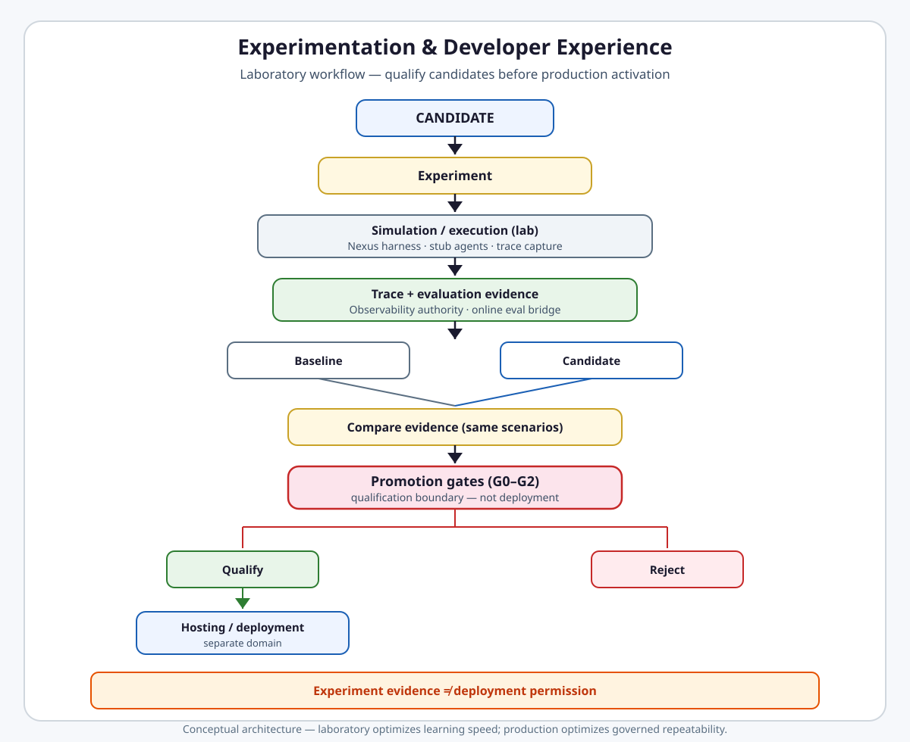

# Experimentation & Developer Experience

**Intergrax Experimentation & Developer Experience** provides repeatable laboratory workflows to simulate, replay, evaluate, compare, and qualify candidate harness changes before production promotion.

> **Experiment evidence ≠ deployment permission.**

> **Laboratory optimizes learning speed. Production optimizes governed repeatability.**

## Why it matters

Without a dedicated experimentation layer, harness changes become one-off scripts: results are not comparable, baselines stay implicit, replay is confused with live execution, and candidates reach production on intuition rather than evidence. Product KPIs and user satisfaction signals never join the comparison loop; developers build parallel trace/eval stacks; and optional lab HTTP endpoints start to look like a product API.

Intergrax DX is a **laboratory workflow** — not a production runtime, deployment system, second evaluator runtime, or generic CI platform. It orchestrates how engineers test candidates against scenarios and evidence, then qualify them at promotion gates. Actual activation and exposure belong to [Application Hosting](APPLICATION_HOSTING.md).

> [!NOTE]
> **Maturity boundary:** MVP-EVOL.1–7 tooling is **Done** on the harness path (simulation CLI, trace replay, promotion gate script, KPI registry, satisfaction bridge, lab HTTP exposure). That is **not** universal production qualification: every product host, every promotion path at scale, and customer operational evidence still require separate proof. See [Current maturity](#current-maturity).

**Primary audience:** Platform and harness engineers running lab experiments, comparing candidates to baselines, and qualifying changes before hosting — after the platform overview in the root README.

## At a glance

| Concern | Summary |
| -------- | -------- |
| **Lab purpose** | Repeatable hypothesis → scenario → evidence → compare → qualify workflow |
| **Experiment / session** | `ExperimentSession` — register hypothesis, run via Nexus, link trace, decide outcome |
| **Scenarios** | Per-experiment fields + harness CFG integration fixtures — no central scenario registry |
| **Simulation** | `intergrax mvp simulate` — runs harness CFG pytest slice with real Nexus wiring + stub agents |
| **Replay** | `intergrax mvp replay` — reconstructs persisted trace evidence; does **not** re-execute agents |
| **Baseline / candidate** | Same scenarios → comparable trace/eval evidence; no single synthetic score |
| **Evaluation** | Consumes Observability trace store + `OnlineEvaluationRegistry` — does not duplicate them |
| **KPI / satisfaction** | Tenant-scoped KPI file registry; satisfaction events bridge to online eval |
| **Promotion gate** | G0–G2 script — infrastructure readiness checks; qualifies, does not deploy |
| **CLI** | **Canonical** developer interface for simulate/replay |
| **Lab HTTP** | Optional `POST /v1/mvp/*` when `LAB_HARNESS=true` on lab host |
| **Production boundary** | Lab host + harness profile; governed repeatability is hosting/runtime |
| **Maturity** | Four-axis statement in [Current maturity](#current-maturity) — no dedicated public DX proof route |

## Flagship architecture visual

<a href="assets/experimentation-promotion-loop-light.svg">
<picture>
  <source media="(prefers-color-scheme: dark)" srcset="assets/experimentation-promotion-loop-dark.svg">
  <source media="(prefers-color-scheme: light)" srcset="assets/experimentation-promotion-loop-light.svg">
  
</picture>
</a>

## Laboratory workflow

```text
candidate
    ↓
experiment
    ↓
simulate / execute (lab)
    ↓
trace + evaluation
    ↓
compare with baseline
    ↓
promotion gates
   ┌──────┴──────┐
   ↓             ↓
qualify        reject
   ↓
hosting / runtime  (separate domain)
```

1. **Define candidate / hypothesis** — register via `RegisterExperimentRequest` or prepare a harness CFG profile change.
2. **Choose scenarios / baseline** — explicit validation fields, expected output, and/or fixed CFG acceptance fixtures.
3. **Simulate or execute in lab** — `intergrax mvp simulate` or `ExperimentSession.run()` through Nexus with trace capture.
4. **Collect trace / evaluation evidence** — Observability trace store, `summarize_trace`, online eval observations.
5. **Replay / inspect if needed** — `intergrax mvp replay` for historical reconstruction (not live re-execution).
6. **Compare candidate vs baseline** — same scenario dimensions: correctness checks, trace stats, eval scores, KPI/satisfaction where registered.
7. **Run promotion gates** — `scripts/gates/check_mvp_promotion_gates.py` G0–G2.
8. **Qualify or reject** — `ExperimentDecision` on the session; gate script exit code for infrastructure readiness.
9. **Actual activation** — [Application Hosting](APPLICATION_HOSTING.md) / Tier-3 host lifecycle — **outside DX ownership**.

## Laboratory vs production

```text
LAB
→ optimize hypothesis / learning speed
→ harness profiles, stub agents, local SQLite trace stores
→ CLI-first; optional lab HTTP under LAB_HARNESS guard

promotion gates
→ qualification boundary (G0–G2 infrastructure readiness today)

PRODUCTION
→ governed repeatability
→ hosted application lifecycle, policy enforcement, operational SLOs
```

**Isolation model (current):** laboratory work runs through the **lab application host** (`applications/lab_application`) with `LAB_HARNESS=true`, harness integration profile, and optional `/v1/mvp/*` routes behind harness auth. Production hosts use Tier-3 `ApplicationEnvironmentProfile` + Application Hosting lifecycle — DX does not activate them.

> **Candidate performs better ≠ candidate becomes production.** Promotion qualification and hosting activation are separate responsibilities.

## Experiment session and result

`ExperimentSession` (`intergrax/experiments/workflow.py`) wraps experiment registry + NexusLoop + trace persistence:

| Field / step | Contract |
| ------------ | -------- |
| **Input** | `RegisterExperimentRequest`: `hypothesis`, `capability`, optional `agent_id`, `expected_output`, `validation_criteria`, `notes` |
| **Run** | `run()` executes a `Task` through wired `NexusLoop`; auto-links `run_id` to experiment record |
| **Evidence** | `ExperimentRunOutcome`: task result, trace event count, `checks` dict from `evaluate_against_criteria` |
| **Trace inspect** | `summarize_trace(run_id)` reads SQLite trace store when configured |
| **Decision** | `decide(experiment_id, ExperimentDecision, notes=…)` persists laboratory verdict |
| **Persistence** | SQLite experiment store + optional SQLite trace DB paths |

**`ExperimentDecision` values (exact):** `pending`, `keep`, `improve`, `pause`, `delete` — not a binary KEEP/DISCARD enum.

**Lightweight checks** (`evaluate_against_criteria`): `completed`, `validation_valid`, `non_empty_answer`, optional `expected_output_substring` when `expected_output` is set.

## Scenarios

Public model:

```text
scenario + baseline + candidate → comparable execution evidence
```

**Current catalogs (no central registry):**

| Source | What it is |
| ------ | ---------- |
| `RegisterExperimentRequest` | Per-experiment hypothesis, capability, expected output, validation criteria |
| `tests/integration/runtime/test_orchestration_cfg_simulation.py` | Harness CFG fixtures (CFG-04, 06, 07, 08, 17, 18, 20) with `UaepPipelineStubAgent` stubs |
| Online eval `scenario_id` | e.g. `user_satisfaction:thumbs_up` from satisfaction bridge |

Scenarios are **code fixtures and runtime objects**, not a platform-wide golden-dataset registry.

## Simulation

**Command:** `intergrax mvp simulate` (default: `pytest tests/integration/runtime/ -k test_orchestration_cfg_simulation -q`).

| Does | Does not |
| ---- | -------- |
| Invoke **real** Nexus/runtime components via `build_nexus_loop_from_environment` | Emulate production traffic or customer workloads |
| Run harness CFG integration tests with stub agents | Provide infrastructure digital twin or arbitrary fault injection |
| Cover sequential, parallel, swarm, strict multi-agent, routing CFG cases | Replace product-specific acceptance suites |

Supported harness CFG scenarios (shipped in code): **CFG-04** rules routing, **CFG-06** two-agent sequential pipeline, **CFG-07** three-agent sequential, **CFG-08** three-agent parallel, **CFG-17** swarm parallel, **CFG-18** single-route vs graph seed, **CFG-20** strict multi-agent with critic profile.

## Replay

**Command:** `intergrax mvp replay --tenant-id <t> --run-id <r> --trace-db <path>`.

| Behavior | Detail |
| -------- | ------ |
| **Source of truth** | SQLite trace store (`SQLiteRunTraceStore`) |
| **Action** | Reads persisted events, converts to replay DTOs, prints metadata summary |
| **Re-execution** | **No** — does not invoke agents, tools, or Nexus loop |
| **Side effects** | **No external side-effect replay** — reconstruction/inspection only |

```text
trace replay        → reconstruct / inspect historical execution
deterministic re-execution → separate concept; not claimed by current replay CLI
```

> **Replay ≠ external side-effect replay.** Current implementation reconstructs evidence; it does not silently replay provider calls.

## Baseline vs candidate

```text
Baseline  ─┐
           ├→ same scenarios → compare evidence
Candidate ─┘
```

| Comparison surface | Mechanism |
| ------------------ | --------- |
| Experiment session | `expected_output` / validation checks vs actual `TaskResult` |
| Harness simulation | Fixed stub-agent graph profiles — compare CFG behavior across profile changes |
| Online evaluation | `OnlineEvaluationRegistry` observations (incl. satisfaction bridge) |
| AHI adaptive loop | `VerificationLoop` candidate vs baseline — **AHI domain**, not DX orchestration |

DX does **not** reduce evidence to one synthetic score. Dimensions include correctness/eval, latency/cost from trace stats, reliability from harness checks, satisfaction, and registered KPIs where present.

## Promotion gates

**Script:** `scripts/gates/check_mvp_promotion_gates.py` — MVP-EVOL.1.

| Gate | What it proves (current) | Enforcement |
| ---- | ------------------------ | ----------- |
| **G0** | Runnable baseline artifacts exist (scaffold CLI, doctor, run, lab host factory) | Script exit code 1 on missing files |
| **G1** | Evaluation control-plane modules exist (`evaluation_automation`, `online_evaluation_registry`, harness eval wiring checker) | Script exit code 1 on missing files |
| **G2** | Policy modules exist (`resilience_policy`, `autonomy_level`, `autonomy_resolver`, resilience policy checker) | Script exit code 1 on missing files |

Optional `--with-doctor` runs `intergrax.cli.doctor` smoke after G0–G2 pass.

**Enforcement state:** script returns non-zero on failure; registered in `scripts/ci/script_paths.py`. **Not** found wired into GitHub workflow definitions at audit time — treat as **operator/manual or certification-catalog** invocation unless your pipeline explicitly calls it. G4/G5 promotion/evidence gates are **future** — owned by Phase V / W-OPS / OECP per plan, not DX G0–G2.

```text
promotion gate  → qualifies candidate infrastructure readiness
Application Hosting / deployment → makes candidate active
```

## Product feedback evidence

### KPI registry (MVP-EVOL.4)

- **Contract:** `ProductKpiDefinition` + `ProductKpiObservation` in `product_kpi_registry.py`
- **Persistence:** file-backed JSON at `build/mvp_evolution/product_kpi_registry.json` (default)
- **Scope:** tenant-scoped definitions and observations; `export_tenant(tenant_id)`
- **Ownership:** Tier-3/product defines business KPI meaning; DX provides registration/evidence workflow

### User satisfaction (MVP-EVOL.5)

- **Schema:** `UserSatisfactionEvent` — `thumbs_up`, `thumbs_down`, `csat`, `nps` signals with score and comment
- **Bridge:** `record_user_satisfaction` → `OnlineEvaluationObservation` in `OnlineEvaluationRegistry`
- **Boundary:** user satisfaction signal **≠** HITL approval — feedback is evidence, not governance authorization

## CLI and lab HTTP

| Surface | Role |
| ------- | ---- |
| **CLI** (`intergrax mvp simulate` / `replay`) | **Canonical** developer workflow |
| **Lab HTTP** (`POST /v1/mvp/simulate`, `POST /v1/mvp/replay`) | Optional exposure on lab host when `LAB_HARNESS=true`; behind `require_harness_auth` |
| **Product API** | Outside DX ownership — Tier-3 application routes |

Lab routes mount from `applications/lab_application/host/factory.py` only when `settings.harness` is true. CLI remains the reliable, fully-parameterized surface. **MVP-EVOL.7** delivered route **exposure** (mount + harness auth); Protocol-v2 **DX-06** records residual functional defect — HTTP wrappers invoke argparse-bound CLI functions without arguments until a shared service layer exists.

## DX vs surrounding domains

| Domain | Owns |
| ------ | ---- |
| **Experimentation / DX** | Lab workflow, simulate/replay/compare, promotion qualification tooling, developer ergonomics |
| **CVL** | Correctness of the **current active run** — not offline candidate comparison |
| **Observability** | Execution evidence authority (trace store, journal, HOS) |
| **OECP** | Cross-run eval/control-plane target capability per Observability maturity — not a DX duplicate runtime |
| **AHI** | Adaptive proposals; may consume experiment evidence — does **not** auto-apply from DX |
| **Governance** | Authorization, policy outcomes, HITL authority |
| **Application Hosting** | Production activation, lifecycle, exposure, OS/deployment posture |
| **Orchestration** | Collaboration structure CFG profiles exercised by harness simulation |

### Boundary invariants

```text
CVL              → correctness of current active run
Experimentation  → compare candidates across controlled scenarios

Observability    → evidence authority
DX               → inspect / replay / compare evidence (no duplicate trace store)

Evaluation       → computes / records eval evidence
DX               → orchestrates developer comparison workflow

Experimentation  → produces candidate evidence
AHI              → may use evidence to propose future adaptive changes (no auto-apply)

User satisfaction ≠ HITL approval
Promotion qualification ≠ production activation
CLI is canonical DX surface; lab HTTP is optional exposure
```

## Architecture conformance gates (compact)

Repository architecture conformance — not the public DX story:

| Gate | Checker | CI (per plan) |
| ---- | ------- | ------------- |
| **LCI-0B** LangChain boundary | `scripts/maintenance/check_langchain_boundary.py` | PR smoke + governance |
| **LCI-1D** Knowledge document conformance | `scripts/maintenance/check_knowledge_document_conformance.py` | PR smoke + governance |

## Current implementation state

| Capability | Status |
| ---------- | ------ |
| `ExperimentSession` | Shipped — register/run/decide/summarize_trace |
| Scenario model | Per-request fields + CFG pytest fixtures |
| `intergrax mvp simulate` | Shipped — pytest harness CFG slice |
| `intergrax mvp replay` | Shipped — trace reconstruction only |
| Replay safety | No agent/tool re-execution; no external side effects |
| Promotion G0–G2 | Shipped — file-existence gates + optional doctor |
| CI enforcement | Script catalogued; workflow wiring not verified |
| KPI registry | Shipped — file persistence; unit tests deferred |
| Satisfaction bridge | Shipped — `test_user_satisfaction.py` |
| Lab HTTP `/v1/mvp/*` | Shipped — `LAB_HARNESS` + harness auth guard |
| Visual trace UI | **Not shipped** — CLI trace summary + replay metadata only |

## Current maturity

| Axis | Rating | Rationale |
| ---- | ------ | --------- |
| **Architecture (A)** | **A4** | Lab/production, promotion/hosting, Observability/eval ownership, and legacy guidance demotion are documented; G4/G5 and full OECP remain adjacent |
| **Implementation (I)** | **I3** | End-to-end path exists (session → simulate → evidence → replay → gates); HTTP exposure partial; KPI tests deferred; gates are existence checks |
| **Production (P)** | **P2** | Developer tooling — safe lab isolation, guarded routes, repeatable CLI workflows, documented replay limits; not customer SaaS qualification |
| **Evidence (E)** | **E3** | Unit/gate tests (`test_experiment_workflow`, satisfaction, CFG simulation integration); no E4 full-harness experiment→compare→gate public bundle |

**Sub-maturity (honest, not averaged):**

| Slice | I | E |
| ----- | - | - |
| Simulation | I3 | E3 |
| Replay | I3 | E3 |
| Promotion G0–G2 | I2 | E2 |
| KPI registry | I3 | E2 |
| Satisfaction bridge | I3 | E3 |
| Lab HTTP | I2 | E2 |

## Evidence / proof

| Layer | Artifacts |
| ----- | --------- |
| **Architecture** | This hub · [`satellites/`](satellites/) · [`plan`](../maintainers/plans/EXPERIMENTATION_AND_DEVELOPER_EXPERIENCE.md) |
| **Unit / gate** | `tests/unit/experiments/test_experiment_workflow.py` · `tests/unit/runtime/architecture/test_user_satisfaction.py` · LCI-0B/LCI-1D checkers |
| **Integration** | `tests/integration/runtime/test_orchestration_cfg_simulation.py` · `intergrax mvp replay` trace read path |
| **Promotion** | `scripts/gates/check_mvp_promotion_gates.py` |
| **Public proof** | **No dedicated Experimentation/DX route** in [`PROOFS.md`](../proofs/PROOFS.md) at audit time |
| **External usage** | Not claimed |

## Go deeper

| Depth | Route |
| ----- | ----- |
| Engineering canon | [Below](#engineering-canon) — ownership, MVP tooling contracts |
| Extended experimentation depth | [`satellites/EXPERIMENTATION_AND_DEVELOPER_EXPERIENCE_extended_depth.md`](satellites/EXPERIMENTATION_AND_DEVELOPER_EXPERIENCE_extended_depth.md) |
| Production / promotion gates | [`satellites/EXPERIMENTATION_AND_DEVELOPER_EXPERIENCE_production_gates.md`](satellites/EXPERIMENTATION_AND_DEVELOPER_EXPERIENCE_production_gates.md) |
| Implementation plan | [`plan/EXPERIMENTATION_AND_DEVELOPER_EXPERIENCE.md`](../maintainers/plans/EXPERIMENTATION_AND_DEVELOPER_EXPERIENCE.md) |
| Observability / eval evidence | [`OBSERVABILITY.md`](OBSERVABILITY.md) |
| Active-run critic | [`CRITIC_VERIFICATION.md`](CRITIC_VERIFICATION.md) |
| Adaptive proposals | [`ADAPTIVE_HARNESS_INTELLIGENCE.md`](ADAPTIVE_HARNESS_INTELLIGENCE.md) |
| Governance / HITL | [`GOVERNED_EXECUTION.md`](GOVERNED_EXECUTION.md) |
| Orchestration CFG simulation | [`ORCHESTRATION.md`](ORCHESTRATION.md) |
| Tier-3 host profile | [`TIER3_APPLICATION_ENVIRONMENT.md`](TIER3_APPLICATION_ENVIRONMENT.md) |
| Production activation | [`APPLICATION_HOSTING.md`](APPLICATION_HOSTING.md) |
| Maturity vocabulary | [`MATURITY_TAXONOMY.md`](../technical/guides/MATURITY_TAXONOMY.md) |
| Repo agent guides | [`AGENTS.md`](../../../AGENTS.md) · [`AGENT_INSTRUCTIONS.md`](../technical/guides/AGENT_INSTRUCTIONS.md) |

---

## Maintainer metadata

**Status:** Canonical architecture (domain pair 1:1)  
**Hub:** [`intergrax_runtime_architecture.md`](intergrax_runtime_architecture.md)  
**Plan (1:1):** [`plan/EXPERIMENTATION_AND_DEVELOPER_EXPERIENCE.md`](../maintainers/plans/EXPERIMENTATION_AND_DEVELOPER_EXPERIENCE.md)  
**Target:** [`IDEAL_HARNESS_AI_ARCHITECTURE.md`](../technical/guides/IDEAL_HARNESS_AI_ARCHITECTURE.md)  
**Audit layers:** 25–27, 30  
**Platform audit:** [`docs/audit_results/AUDIT_PROTOCOL.md`](../../audit_results/AUDIT_PROTOCOL.md)  
**Last updated:** 2026-08-18 — **DOC-3U** public front + MVP-EVOL reconciliation

### Document topology

```text
EXPERIMENTATION_AND_DEVELOPER_EXPERIENCE.md
→ public front + engineering hub

satellites/EXPERIMENTATION_AND_DEVELOPER_EXPERIENCE_extended_depth.md
→ advanced experimentation/DX depth

satellites/EXPERIMENTATION_AND_DEVELOPER_EXPERIENCE_production_gates.md
→ deeper release/promotion gates

maintainers/plans/EXPERIMENTATION_AND_DEVELOPER_EXPERIENCE.md
→ implementation state
```

## Cursor read scope (token budget)

**Do not read this entire file in one session** (EXPERIMENTATION_AND_DEVELOPER_EXPERIENCE canon).

- **Human / architecture default:** public front through [Go deeper](#go-deeper).
- **Implement / audit default:** [Engineering canon](#engineering-canon) + MVP tooling sections. Extended depth: [`satellites/EXPERIMENTATION_AND_DEVELOPER_EXPERIENCE_extended_depth.md`](satellites/EXPERIMENTATION_AND_DEVELOPER_EXPERIENCE_extended_depth.md). Production gates: [`satellites/EXPERIMENTATION_AND_DEVELOPER_EXPERIENCE_production_gates.md`](satellites/EXPERIMENTATION_AND_DEVELOPER_EXPERIENCE_production_gates.md).
- **Plan hub:** [`plan/EXPERIMENTATION_AND_DEVELOPER_EXPERIENCE.md`](../maintainers/plans/EXPERIMENTATION_AND_DEVELOPER_EXPERIENCE.md) (scoped §6 only).
- **Max reads:** at most **one** satellite per session unless RESUME cites more.

## Architecture satellites (read on demand)

| Satellite | Contents |
|-----------|----------|
| [`satellites/EXPERIMENTATION_AND_DEVELOPER_EXPERIENCE_extended_depth.md`](satellites/EXPERIMENTATION_AND_DEVELOPER_EXPERIENCE_extended_depth.md) | extended depth |
| [`satellites/EXPERIMENTATION_AND_DEVELOPER_EXPERIENCE_production_gates.md`](satellites/EXPERIMENTATION_AND_DEVELOPER_EXPERIENCE_production_gates.md) | production gates |

> **Cursor context budget:** read hub public front + **at most one** satellite per session.

---

## Engineering canon

### Experimentation / DX architecture owns

This layer **may** describe:

- experiment definitions,
- evaluation scenarios,
- developer feedback loops,
- local/lab execution ergonomics,
- smoke/e2e evidence collection,
- harness playgrounds,
- trace review workflows,
- test data and scenario catalogs,
- comparison of runs,
- documentation of evidence,
- developer-facing observability views,
- repeatable validation loops.

### Experimentation / DX architecture does not own

This architecture **MUST NOT** own:

- Tier-0/Tier-1/Tier-2/Tier-3 responsibility boundaries,
- agent runtime lifecycle,
- Nexus orchestration semantics,
- production policy decisions,
- HITL authority,
- tool side-effect gateway,
- integration access paths,
- context assembly rules,
- memory/RAG ownership,
- CodeCraft safety rules,
- AHI auto-apply decisions,
- ECP production scaling decisions.

It **may reference** those documents, but **must not redefine** them.

### MVP evolution tooling (MVP-EVOL.1–7)

Shipped harness tooling cross-reference (canon lives in plan rows):

| ID | Module / surface |
| -- | ---------------- |
| MVP-EVOL.1 | `scripts/gates/check_mvp_promotion_gates.py` |
| MVP-EVOL.2 | `intergrax/cli/mvp_evolution.py` → `intergrax mvp simulate` |
| MVP-EVOL.3 | `intergrax/cli/mvp_evolution.py` → `intergrax mvp replay` |
| MVP-EVOL.4 | `intergrax/runtime/architecture/product_kpi_registry.py` |
| MVP-EVOL.5 | `intergrax/runtime/architecture/user_satisfaction.py` |
| MVP-EVOL.6 | `guides/AGENT_CREATION_GUIDE.md` Appendix X |
| MVP-EVOL.7 | `intergrax/applications/_shared/mvp_evolution_routes.py` · lab `/v1/mvp/*` |

### Cursor / implementation rules placement

Cursor-specific implementation rules **SHOULD** live in:

- [`AGENTS.md`](../../../AGENTS.md) — repo-wide coding agent behavior,
- [`LAYER_COMPLETION_MODE.md`](../technical/guides/LAYER_COMPLETION_MODE.md) — layer completion workflow,
- [`AGENT_AUTHOR_MINIMAL_PATH.md`](../technical/guides/AGENT_AUTHOR_MINIMAL_PATH.md) — agent authoring,
- [`TIER3_PRODUCT_HYPOTHESIS_CONTRACT.md`](../technical/guides/TIER3_PRODUCT_HYPOTHESIS_CONTRACT.md) — Tier-3 product hypothesis,
- [`SYSTEM_INVARIANTS.md`](../technical/guides/SYSTEM_INVARIANTS.md) — cross-layer invariants.

This architecture document **may link** to these guides, but **should not duplicate** their full content.

### Recommended document placement

| Content type | Canonical location |
|---|---|
| Cross-layer invariants | [`docs/project/technical/guides/SYSTEM_INVARIANTS.md`](../technical/guides/SYSTEM_INVARIANTS.md) |
| Maturity wording | [`docs/project/technical/guides/MATURITY_TAXONOMY.md`](../technical/guides/MATURITY_TAXONOMY.md) |
| Cursor layer workflow | [`docs/project/technical/guides/LAYER_COMPLETION_MODE.md`](../technical/guides/LAYER_COMPLETION_MODE.md) |
| Repo-wide coding agent behavior | [`AGENTS.md`](../../../AGENTS.md) |
| Agent authoring shortcut | [`docs/project/technical/guides/AGENT_AUTHOR_MINIMAL_PATH.md`](../technical/guides/AGENT_AUTHOR_MINIMAL_PATH.md) |
| Tier-3 product hypothesis | [`docs/project/technical/guides/TIER3_PRODUCT_HYPOTHESIS_CONTRACT.md`](../technical/guides/TIER3_PRODUCT_HYPOTHESIS_CONTRACT.md) |
| Experiment definitions/evidence loops | [`docs/project/architecture/EXPERIMENTATION_AND_DEVELOPER_EXPERIENCE.md`](EXPERIMENTATION_AND_DEVELOPER_EXPERIENCE.md) |
| Subsystem architecture | [`docs/project/architecture/*.md`](.) |
| Implementation plan | [`docs/project/maintainers/plans/*.md`](../maintainers/plans) |

### Cursor review checklist

Before modifying Experimentation / DX documentation, Cursor **must** verify:

- Is this architecture or implementation workflow guidance?
- If it is repo-wide coding behavior, should it be in [`AGENTS.md`](../../../AGENTS.md)?
- If it is layer-completion process, should it be in [`LAYER_COMPLETION_MODE.md`](../technical/guides/LAYER_COMPLETION_MODE.md)?
- If it is a subsystem rule, should it stay in the subsystem architecture document?
- Does this document redefine rules already owned by [`SYSTEM_INVARIANTS.md`](../technical/guides/SYSTEM_INVARIANTS.md)?
- Does this document accidentally override Nexus, ToolRuntime, Context, Memory, RAG, CVL, CodeCraft, AHI, or ECP boundaries?
- Are maturity claims expressed through [`MATURITY_TAXONOMY.md`](../technical/guides/MATURITY_TAXONOMY.md)?
- Are implementation examples clearly marked as examples, not architecture mandates?

---

## Legacy implementation guidance

> **Historical placement** — §39–§41 below predate the public-front split. They contain **Cursor implementation rules**, **minimal first implementation**, and **minimal runtime flow** — operational guidance for early bootstrap, **not** Experimentation/DX subsystem architecture.
>
> **Canonical repo-agent behavior:** [`AGENTS.md`](../../../AGENTS.md) · [`AGENT_INSTRUCTIONS.md`](../technical/guides/AGENT_INSTRUCTIONS.md). Do not treat §39–§41 as current platform architecture truth where they conflict with shipped platform capabilities.

### Migration note (§39–§41 legacy placement)

Sections **§39–§41** below predate this boundary split.

**TODO (future doc pass):** migrate §39–§41 to [`AGENT_INSTRUCTIONS.md`](../technical/guides/AGENT_INSTRUCTIONS.md) / [`AGENTS.md`](../../../AGENTS.md) without losing cross-refs from [`PLATFORM_FOUNDATION.md`](PLATFORM_FOUNDATION.md) and other domain pairs. Until then, treat §39–§41 as **legacy canonical copies**; do not add new Cursor workflow rules here.

# 39. Implementation Rules For Cursor AI

> **Legacy placement** — see [Legacy implementation guidance](#legacy-implementation-guidance). Prefer [`AGENTS.md`](../../../AGENTS.md) and [`AGENT_INSTRUCTIONS.md`](../technical/guides/AGENT_INSTRUCTIONS.md) for repo-wide coding agent behavior.

When Cursor AI or an LLM coding agent implements Intergrax, it MUST follow these rules.

## 39.1 Always Preserve Layer Boundaries

Do not put orchestration logic into adapters.

Do not put business agent logic into Nexus.

Do not put platform lifecycle logic into agents.

---

## 39.2 Prefer Contracts Over Hardcoding

Use contracts, registries and schemas.

Avoid direct hardcoded branching such as:

```text
if task contains "vendor": run VendorAgent
```

Prefer capability matching.

---

## 39.3 Build Minimal Useful Runtime First

Initial implementation should focus on:

- AgentContract
- AgentRegistry
- Task object
- Nexus execution loop
- basic ToolRegistry
- basic TraceLogger
- simple adapter model
- one or two example agents

Do not build the entire platform prematurely.

---

## 39.4 Every New Agent Must Be Runnable Through Nexus

Agents should not be executed as standalone scripts except for isolated unit tests.

The normal path is:

```text
Task -> Nexus -> Agent -> Result -> Nexus
```

---

## 39.5 Every Agent Must Produce Structured Output

Agents must not return only raw text.

Raw text may exist as summary, but structured data is required for evaluation.

---

## 39.6 Every Execution Must Be Traceable

No hidden execution.

Every meaningful decision should produce a trace event or structured log.

---

## 39.7 Prefer Simple Internal UI

If a UI is needed, build a minimal debug/inspection surface.

Do not build a polished SaaS frontend at this stage. **DX-MAINT-04:** this remains an explicit harness non-goal — product UI belongs to Tier-3 hosts or Phase K, not the DX control plane.

---

## 39.8 Reuse Tier-0 — Never Duplicate Universal Mechanisms

Before writing code, Cursor AI and implementation agents MUST:

1. Identify whether the needed capability **already exists** in Tier-0 (§5.2.2).
2. Use the **canonical entry point** (LLM adapters, logging, tools, RAG, trace, memory, queues).
3. Implement **orchestration and domain logic only** in Tier-1 / Tier-2 / Tier-3.
4. **STOP and ask the human** if a new universal Tier-0 mechanism appears necessary (§5.2.4).

Cursor AI MUST NOT:

- add parallel LLM client wrappers,
- create agent-local logging or tracing systems,
- introduce duplicate tool registries or adapter facades,
- add new PostgreSQL/Redis/file clients in agents when Tier-0 adapters exist,
- implement §42 scaffold as standalone replacements for existing Nexus trace/tool/LLM paths.

When wiring §42 (events, hooks, UAEP), **integrate with** existing `RunTraceWriter`, `ToolRuntime`, `AgentEngine` — do not fork them.

---

# 40. Recommended Minimal First Implementation

> **Legacy / historical** — early bootstrap milestone guidance. Shipped platform exceeds this skeleton; see MVP-EVOL and adjacent domain hubs for current truth.

The first implementation milestone should include:

```text
core/
    AgentContract
    AgentRegistry
    Task
    TaskState
    NexusRuntime
    ExecutionContext
    AgentExecutionResult
    ValidationResult
    TraceLogger

components/
    LlmProviderAdapter
    SlackAdapter interface placeholder
    TeamsAdapter interface placeholder
    StorageAdapter
    QueueAdapter placeholder

agents/
    EchoAgent
    ResearchAgent prototype
    ProblemRadarAgent prototype

applications/
    legal_application/          # host + serving + env config (composes agents/legal)
    <name>_application/         # future execution environments

runtime/
    NexusLoop
    TaskClassifier
    Planner
    AgentRouter
    ExecutionGraph
```

This is enough to validate the architecture.

Do not start with too many agents.

---

# 41. Minimal Runtime Flow

> **Legacy / historical** — validates the original skeleton; Nexus execution flow canon is now in [`NEXUS_EXECUTION_FLOW.md`](NEXUS_EXECUTION_FLOW.md).

The first usable flow should be:

```text
1. User submits task
2. Nexus creates Task object
3. Nexus classifies task
4. Nexus creates simple plan
5. Nexus selects agent from registry
6. Nexus executes agent
7. Agent returns structured result
8. Nexus validates result
9. Nexus logs full trace
10. Nexus returns final response
```

This validates the entire skeleton.

---

<a id="protocol-v22-provider-backend-abstraction-target-invariants-2026-08-18"></a>

## Protocol v2.2 provider/backend abstraction target invariants (2026-08-18)

Accepted Protocol v2.2 audit layer [`PROVIDER_BACKEND_ABSTRACTION`](../../audit_results/2026-08-18/PROVIDER_BACKEND_ABSTRACTION.md) (**FAIL**, 5 ACCEPTED findings). Canonical evidence: [`docs/audit_results/2026-08-18/`](../../audit_results/2026-08-18/README.md). Target state only — **not implemented**:

1. **Experiment persistence port** — reusable `ExperimentSession`/business workflow depends on a provider-neutral `ExperimentPersistence`/`ExperimentStore`-style port ([`AUDIT-20260818-PROVIDER_BACKEND_ABSTRACTION-05`](../../audit_results/2026-08-18/PROVIDER_BACKEND_ABSTRACTION.md)).
2. **Lab composition** — SQLite remains a valid default lab provider selected at composition ([`AUDIT-20260818-PROVIDER_BACKEND_ABSTRACTION-05`](../../audit_results/2026-08-18/PROVIDER_BACKEND_ABSTRACTION.md)).
3. **Trace abstractions** — trace access continues through existing `RunTraceReader`/`RunTraceWriter`-style abstractions ([`AUDIT-20260818-PROVIDER_BACKEND_ABSTRACTION-05`](../../audit_results/2026-08-18/PROVIDER_BACKEND_ABSTRACTION.md)).
4. **Substitutability over provider count** — do not require multiple production experiment-store providers merely to satisfy abstraction count; meaningful substitutability is the target ([`AUDIT-20260818-PROVIDER_BACKEND_ABSTRACTION-05`](../../audit_results/2026-08-18/PROVIDER_BACKEND_ABSTRACTION.md)).
5. **Debug/HTTP typing** — debug/HTTP consumers should type against the port rather than `SQLiteExperimentStore` ([`AUDIT-20260818-PROVIDER_BACKEND_ABSTRACTION-05`](../../audit_results/2026-08-18/PROVIDER_BACKEND_ABSTRACTION.md)).

**Qualification:** MVP-EVOL and laboratory workflow maturity claims remain historical; the accepted audit gap above records target state only.

Remediation tracked as **PBA-FIX-D** in [plan PBA-FIX-D](../maintainers/plans/EXPERIMENTATION_AND_DEVELOPER_EXPERIENCE.md#protocol-v22-pba-fix-d--experiment-persistence-port-2026-08-18). **Not implemented** by audit persistence.

<a id="protocol-v2-experimentation-and-developer-experience-target-invariants-2026-08-18"></a>

## Protocol v2 experimentation and developer experience target invariants (2026-08-18)

Accepted Protocol v2 audit layer [`EXPERIMENTATION_AND_DEVELOPER_EXPERIENCE`](../../audit_results/2026-08-18/EXPERIMENTATION_AND_DEVELOPER_EXPERIENCE.md) (**FAIL**, 7 ACCEPTED findings at `84b2477571650ade894f2d52a6b5398aa86922cc`). Canonical evidence: [`docs/audit_results/2026-08-18/`](../../audit_results/2026-08-18/README.md). Target state only — **not implemented**:

1. **Experiment ownership** — experiment and run evidence are tenant-scoped; every registry operation (`register`, `get`, `list`, `link_run`, `set_decision`) validates canonical tenant scope; cross-tenant experiment↔run linkage is impossible. Cross-link [`IDENTITY_TRUST`](IDENTITY_TRUST.md) — do not create DX-specific identity authority ([`AUDIT-20260818-EXPERIMENTATION_AND_DEVELOPER_EXPERIENCE-01`](../../audit_results/2026-08-18/EXPERIMENTATION_AND_DEVELOPER_EXPERIENCE.md)).
2. **Criteria authority** — active validation criteria are executable, versioned, and typed; stored criteria cannot silently be ignored by `evaluate_against_criteria`; either resolve criteria into canonical evaluation assets, use typed check specifications, or clean-cut unsupported fields ([`AUDIT-20260818-EXPERIMENTATION_AND_DEVELOPER_EXPERIENCE-02`](../../audit_results/2026-08-18/EXPERIMENTATION_AND_DEVELOPER_EXPERIENCE.md)).
3. **Evaluation identity** — satisfaction and online-evaluation bridges preserve canonical tenant + TaskId + RunId (+ AttemptId where required); no adaptive/evaluation aggregation consumes observations whose tenant ownership was discarded ([`AUDIT-20260818-EXPERIMENTATION_AND_DEVELOPER_EXPERIENCE-03`](../../audit_results/2026-08-18/EXPERIMENTATION_AND_DEVELOPER_EXPERIENCE.md)).
4. **KPI identity** — KPI definition identity is at least `tenant_id + kpi_id`; observations reference same-tenant definitions with validated linkage; cross-tenant definition collision is impossible ([`AUDIT-20260818-EXPERIMENTATION_AND_DEVELOPER_EXPERIENCE-04`](../../audit_results/2026-08-18/EXPERIMENTATION_AND_DEVELOPER_EXPERIENCE.md)).
5. **Run identity** — missing canonical RunId is an evidence-linkage failure; never synthesize or fallback RunId from TaskId; reuse canonical execution identity contracts ([`AUDIT-20260818-EXPERIMENTATION_AND_DEVELOPER_EXPERIENCE-05`](../../audit_results/2026-08-18/EXPERIMENTATION_AND_DEVELOPER_EXPERIENCE.md)).
6. **CLI/HTTP service boundary** — common typed service API; CLI and HTTP are adapters around the same service; HTTP routes must be executable with typed parameters — not direct invocation of argparse-bound CLI functions ([`AUDIT-20260818-EXPERIMENTATION_AND_DEVELOPER_EXPERIENCE-06`](../../audit_results/2026-08-18/EXPERIMENTATION_AND_DEVELOPER_EXPERIENCE.md)). Preserve CLI as canonical developer interface; MVP-EVOL.7 route exposure remains a historical delivery fact.
7. **Evidence persistence** — lab evidence stores have explicit concurrency semantics (lock/CAS/transaction/version) or explicit single-process constraint; reuse provider-neutral persistence ports — cross-link **PBA-FIX-D**, do not duplicate persistence architecture ([`AUDIT-20260818-EXPERIMENTATION_AND_DEVELOPER_EXPERIENCE-07`](../../audit_results/2026-08-18/EXPERIMENTATION_AND_DEVELOPER_EXPERIENCE.md)).

**Preserved boundaries (not reopened by audit):** Experimentation vs Application Hosting; Observability evidence ownership; replay reconstruction-only semantics; CLI-first model; G0–G2 honest infrastructure-readiness scope; A4/I3/P2/E3 maturity honesty; no remediation implementation claim.

Remediation tracked in [plan Protocol v2 remediation](../maintainers/plans/EXPERIMENTATION_AND_DEVELOPER_EXPERIENCE.md#protocol-v2-remediation-2026-08-18--accepted--planned). **Not implemented** by audit persistence.
