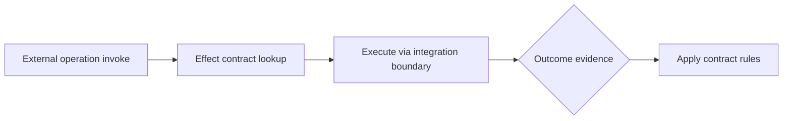

<!--
© Artur Czarnecki. All rights reserved.
Intergrax is source-available under the Intergrax Evaluation and Collaboration License 1.0.
See LICENSE for permitted evaluation, collaboration, and contribution use.
-->

# External Effect Contracts

**External Effect Contracts** describe how external operations declare **safety properties** so Enterprise Reliability Layer can manage uncertainty without application-specific hacks.

Parent hub: [`ENTERPRISE_RELIABILITY_LAYER.md`](ENTERPRISE_RELIABILITY_LAYER.md).

> [!NOTE]
> This document defines **architecture concepts only**—not code interfaces, schemas, or runtime modules. Implementation belongs to a future planning and delivery phase.

**Primary audience:** Platform architects, integration owners, and security reviewers defining how tools and integrations participate in governed execution.

---

## Purpose

Every meaningful call that can change external state (pay, book, file, send, commit) should declare:

- how repetition behaves,
- how ambiguity is resolved,
- how prior success can be neutralized.

**Architectural meaning:** the platform applies one reliability model across providers; applications supply **configuration and business identifiers**, not bespoke recovery frameworks.

---

## Core concepts

### Idempotency (safe repetition)

**Simple explanation:** Repeating the same logical operation does not create duplicate side effects.

**Architectural meaning:** When UNKNOWN occurs, the platform may safely **retry or reconcile using the same idempotency key** only if the contract says repetition is safe. Without idempotency, UNKNOWN must gate mutations and prefer read-style reconciliation.

**Example:** Payment “charge order 8842” with key `order-8842-capture`—provider returns same result on duplicate submit.

### Reconciliation support

**Simple explanation:** The integration exposes a **verifiable read path** to learn final state.

**Architectural meaning:** Effect contracts list which reconcile strategies apply (status API, webhook, batch file, admin query). ERL orchestration selects among declared strategies—[`RECONCILIATION.md`](RECONCILIATION.md).

**Example:** Shipping label creation declares `carrier_label_status(reference_id)` as authoritative.

### Compensation support

**Simple explanation:** If local workflow assumed success but external truth differs—or business rules require rollback—the platform can invoke a **declared compensating operation**.

**Architectural meaning:** Compensation is **not** universal database rollback; it is a **named, governed external action** (void, refund, release hold, cancel shipment) with its own effect contract.

**Example:** `void_authorization(payment_id)` after reconcile shows duplicate capture risk.

---

## Contract dimensions (architecture)

| Dimension | Question the contract answers |
| --------- | ------------------------------ |
| **Effect class** | Read-only vs mutating vs financial vs regulatory |
| **Idempotency scope** | Key source, TTL, provider semantics |
| **Ambiguity signals** | Timeout, 202, empty body, conflicting codes → UNKNOWN |
| **Reconcile strategies** | Ordered probes; which are read-only |
| **Compensation pairs** | Which operation neutralizes which forward effect |
| **Autonomy ceiling** | Auto-continue vs mandatory HITL after reconcile |
| **Evidence requirements** | Minimum fields for audit (provider refs, amounts, timestamps) |

Contracts are **bound to integration/tool definitions** at configuration time—not reimplemented per agent—[`TOOLS.md`](TOOLS.md) · [`INTEGRATIONS.md`](INTEGRATIONS.md).

---

## Platform behavior (conceptual)

| Evidence | Contract-driven behavior |
| -------- | ------------------------- |
| Definitive success/failure | Terminal per Reliability + Observability |
| Ambiguous | UNKNOWN + gate per [`UNCERTAINTY_MANAGEMENT.md`](UNCERTAINTY_MANAGEMENT.md) |
| UNKNOWN + idempotent | Allow bounded reconcile/retry per contract |
| UNKNOWN + non-idempotent | Reconcile-only or escalate |
| Confirmed duplicate effect | Compensate or branch per compensation support |

---

## Governance and policy

Effect contracts declare **what is possible**; Governance decides **what is allowed** for a tenant, product, or execution—[`GOVERNED_EXECUTION.md`](GOVERNED_EXECUTION.md).

Example: contract allows auto-refund on duplicate capture; policy may require HITL above a monetary threshold.

---

## Agents and applications

- **Agents** emit business intent and identifiers; they do **not** own contract enforcement loops—[`AGENT_CONTRACTS_AND_ASSEMBLY.md`](AGENT_CONTRACTS_AND_ASSEMBLY.md).
- **Applications** configure which integrations and risk profiles apply; Intergrax enforces contracts at execution boundaries.

---

## Further reading

- [`UNCERTAINTY_MANAGEMENT.md`](UNCERTAINTY_MANAGEMENT.md)
- [`RECONCILIATION.md`](RECONCILIATION.md)
- [`RECOVERY_AND_COMPENSATION.md`](RECOVERY_AND_COMPENSATION.md)
- [`RELIABILITY_FAILURE_AND_HITL.md`](RELIABILITY_FAILURE_AND_HITL.md) — idempotency keys and compensation queue (existing Reliability concepts)
