<!--
© Artur Czarnecki. All rights reserved.
Intergrax is source-available under the Intergrax Evaluation and Collaboration License 1.0.
See LICENSE for permitted evaluation, collaboration, and contribution use.
-->

# Governed Execution

**Governance & Policy Enforcement** - reusable platform mechanisms that enforce configured execution boundaries around **every Execution** and its meaningful operations.

Every Execution enters governance with canonical identity, tenant/scope, effective authority, execution requirements, and relevant action/effect context. Governance answers whether an Execution or operation is allowed under effective authority and policy. UER/Execution Runtime applies the lifecycle consequence (allow, deny, pause, terminate, resume).

Agent and model behavior are common **examples** of inner evaluation points - not the scope boundary of governance. The product or application owns business rules; Intergrax supplies reusable mechanisms that carry identity and context, evaluate configured policy, enforce decisions, pause for human approval when required, and record governance evidence.

**Applications define the rules; Intergrax enforces the execution boundaries.**

> [!NOTE]
> Intergrax is source-available and in active R&D. This document describes the **Governed Execution** platform capability and its conceptual governance plane. It is **not** a production-readiness, enterprise-readiness, security-certification, or complete platform-wide enforcement claim.

Primary audience: Principal / Staff engineers, architects, CTOs, security and governance evaluators, and builders integrating an application with Intergrax.

**This file is the canonical architecture SSOT for the entire Governance Plane** (admission, inner evaluation, policy, HITL permission semantics, meaningful-side-effect authorization). It does **not** compete with [`DECISION_APPROVAL_GOVERNANCE.md`](DECISION_APPROVAL_GOVERNANCE.md) (Decision / Approval / MP-4 integration SSOT) or [`ENTERPRISE_RELIABILITY_LAYER.md`](ENTERPRISE_RELIABILITY_LAYER.md) (post-admission reliability). Implementation roadmap and auditable gap status: [`maintainers/plans/GOVERNED_EXECUTION.md`](../maintainers/plans/GOVERNED_EXECUTION.md) · [`GOVERNANCE_ARCHITECTURE_REBASE_GAP_LEDGER.md`](../maintainers/qualification/GOVERNANCE_ARCHITECTURE_REBASE_GAP_LEDGER.md).

**GOV-FINAL-1 reconciliation (code truth on `development`):** documentation status below was synchronized to production paths and qualification tests; **enterprise certification of the full Governance Layer is not claimed.**

---

## Governance implementation truth (GOV-FINAL-1)

Read this section before the historical G-stage narrative. **Target architecture ≠ current coverage.**

### GOV-FINAL-2 runtime blockers (GR-3 / GR-4 architecture gates)

- **GR-3:** `authorize_and_execute` production adapters are allowlist-gated; `DecisionGovernedSideEffectCoordinator` (`decision_governed_side_effect.py`) validates Decision provenance then delegates to `MeaningfulSideEffectAuthorizationBoundary` only (no alternate governance semantics).
- **GR-4:** `MeaningfulSideEffectAuthorizationBoundary` policy core has no Nexus import; HITL pause wiring uses `apply_governed_continuation_pause` (Execution continuation composition / active store), not `InternalOrchestrationContinuation` in the policy module.
- **Not closed by this slice:** GR-8 evaluation-point adoption (GR-10/GR-13), **GR-12** residual control-plane qualification (overall **IN PROGRESS**), full GR-13 enterprise qualification.

### A. Enterprise architecture target

Unchanged platform intent: contract-first evaluation at named **Governance Evaluation Points**; **Governance** answers permission; **Execution Runtime** owns lifecycle; **Reliability** owns post-admission uncertainty; **Decision System** owns decision truth (integration via GR-6 material, not governance substitution). **CONTROL_PLANE_MUTATION** is a required taxonomy extension distinct from **MEANINGFUL_SIDE_EFFECT** (GR-10 execution-plane governance covers identity, MSE, execution policy, continuation/HITL — not control-plane mutation). **Historical (pre–GR-12-A2):** platform live coverage was **GAP** until domain executors shared one authority context. **Current:** shared CLA-04 control-plane governance spine is **implemented**; core canonical paths are **qualified**; G3B platform row remains **GAP** until residual paths and final GR-12 qualification close. Full target invariants: UEA-INV-021, ADR-GOVERNED-EXECUTION-001/002, Protocol v2.2 / control-plane sections below.

### B. Implemented enterprise-certified mechanisms

**None at Governance-Plane-wide scope.** Individual slices are regression-gated (GR-1 identity binding, GR-4 policy core gates, GR-6 architecture gates, GR-7 reliability boundary gates) but **GR-13 / GR-16 enterprise qualification is open**.

### C. Implemented — qualification open

| Mechanism | Code / contract anchor | Qualification evidence (non-exhaustive) | Enterprise CLOSED? |
| --------- | ------------------------ | --------------------------------------- | ------------------ |
| Execution identity on grants / side effects | `MeaningfulSideEffectRequest`, `GovernedContinuationApprovalGrant` | GR-1, GR-1-R1 tests | **Yes** (GR-1 scope) |
| Root execution admission | `RuntimeExecutionPolicyAdmissionPort`, MODEL C1 gates | `test_gr2_*`, `test_gr2_r3_*` | **No** (GR-2 candidate; audit pending) |
| Inner enforcement / task scope | `CanonicalInnerExecutionGuardPort`, composition modules | `test_gr3_*`, architecture AST gates | **No** (GR-3 candidate) |
| Policy resolution / catalog core | `RuntimePolicyEngine`, `PolicyCatalog`, PG-FIX-B/D behavior | `test_pg_fix_b_*`, `test_pg_fix_d_*`, `test_gr4_policy_core_architecture_gates.py` | **No** (GR-4 candidate; GR-4-R1 assembly decouple open) |
| HITL continuation contract + UER integration | `ExecutionContinuationPort`, ADR-GR-5-001 | `test_gr5_*`, MP-4 SSOT cross-checks, GR-10-R11 | **Yes** (ORCHESTRATION HITL QUALIFIED; Continuation row remains PARTIAL) |
| Decision → Governance at meaningful effects | `DecisionRequirementPolicy`, `DecisionGovernanceMaterialRef`, canonical boundary | `test_gr6_*`, governed contractor host GR-6 suites | **No** (host-qualified paths; not all strategies/effects) |
| External effect reliability boundary | `ProviderInvocation` store, ERL repeat/recovery/reconciliation, reliability evidence | `test_gr7_*`, governed contractor GR-7 host suites | **No** (Reliability ≠ Governance authority; not universal) |

### D. Remaining platform gaps (explicit)

- **Governance Evidence (GR-8):** public contract **frozen** — [ADR-GR-8-001](../technical/adr/entries/2026-09-17/ADR-GR-8-001.md); spine **CANDIDATE CLOSED — PUBLIC CONTRACT FROZEN** (independent final audit before CLOSED); **evaluation-point adoption** (AGENT_DECISION, INTERRUPT, PRE_MODEL, TOOL*, PRE_OUTPUT, POST_RUN, CONTROL_PLANE_MUTATION, fresh post-human re-evaluation) remains **open** under **GR-10 / GR-13**.
- **Strategy coverage (GR-10):** **FINAL CLOSED within formally defined GR-10 scope** (typed matrix §9 + `tests/qualification/governance/strategy/`; SSOT `GR10_*_FORMAL_CLOSURE` in `catalog.py`; **GR-10-R7** residual matrix requalification retained as qualification artifact). **INFERENCE:** **CLOSED** — PRE_MODEL **QUALIFIED** on `InferenceExecutor` structured path (**GR-10-R2-C1/R1** — [ADR-GR-10-001](../technical/adr/entries/2026-09-18/ADR-GR-10-001.md)); root admission **NOT_APPLICABLE** (**GR-10-R4**); Inner Governance **NOT_APPLICABLE** (**GR-10-R5**); Governance Evidence **QUALIFIED** (**GR-10-R6 / R6-R1**); remaining INFERENCE blockers **NONE**. **ORCHESTRATION:** **FINAL CLOSED** — R8–R15 qualification slices; per-GEP GR-8 fact adoption **DEFERRED_TO_GR13** where typed ([ADR-GR-10-003](../technical/adr/entries/2026-09-21/ADR-GR-10-003-gr10-gr13-governance-evidence-certification-scope.md)). **AGENTIC:** **FINAL CLOSED** — P-UAEP canonical ([ADR-GR-10-004](../technical/adr/entries/2026-09-21/ADR-GR-10-004-agentic-execution-model-uaep-canonical.md)); `acp.session.v1` explicit opt-in only; Governance Evidence capability **PARTIAL** (mandatory spine qualified; per-GEP facts **GR-13**). **Next governance milestone:** **GR-12** control-plane mutation (not GR-10 scope).
- **Control-plane mutation (GR-12):** **IN PROGRESS** — shared `ControlPlaneMutationAuthorizationBoundary` (CLA-04) spine implemented and mandatory composition **FINAL CLOSED** (A2); core production surfaces **FINAL CLOSED** qualified (A3); residual classification **CLOSED** (A4). Residual qualification: catalog **WIRED_NOT_QUALIFIED**, Vector/Memory **ARCHITECTURE_DECISION_REQUIRED**, final GR-12 certification open. Not an extension of `MeaningfulSideEffectRequest`.
- **Plugin enterprise certification (GR-11)** and **full proof matrix (GR-13)** open.
- **Transitional Task/Nexus coupling** on some pause bridges — Execution owns lifecycle target; port integration incomplete on non-orchestration strategies.
- **Human APPROVED ≠ Governance ALLOW** — fresh DENY still applies; resume requires scoped authorization (see HITL section).

### GR-12 CURRENT STATUS (GR-12-DOC-R1)

```text
GR-12 CURRENT STATUS

A1 — CLOSED
A2 — FINAL CLOSED
A3 — FINAL CLOSED
A4 classification — CLOSED

Catalog — WIRED_NOT_QUALIFIED
Vector — ADR_REQUIRED
Memory — ADR_REQUIRED

GR-12 overall — IN PROGRESS
```

**Canonical control-plane model (unchanged target):** shared **CONTROL_PLANE_MUTATION** authority context → canonical **CLA-04** authorization boundary → **domain owner** executes its own mutation. No universal mutation executor, no global `GovernanceEngine`, no second permission engine.

| Residual path | Applicability | Documentation status |
| ------------- | ------------- | -------------------- |
| `CP-PLUGIN-CATALOG-HOT-RELOAD` | APPLICABLE | **WIRED_NOT_QUALIFIED** |
| `CP-VECTOR-INDEX-ADMIN` | REQUIRES_ARCHITECTURE_DECISION | **ARCHITECTURE_DECISION_REQUIRED** |
| `CP-MEM-SPECIALIZED-MUTATION` | REQUIRES_ARCHITECTURE_DECISION | **ARCHITECTURE_DECISION_REQUIRED** |
| `CP-BOOT-PLUGIN-REGISTER` | NOT_APPLICABLE | **NOT_APPLICABLE** (startup/bootstrap registry population ≠ live governed hot reload) |

**Catalog — wired candidate (not enterprise-qualified):** `CatalogHotReloadService`, CLA-04 request construction, deterministic state digest, candidate catalog materialization, CAS primitive, no automatic reload during composition, external evaluator injection, fail-closed decisions. **Qualification blockers:** authoritative revision SSOT across canonical catalog state; ABA protection; explicit per-invocation `RequestIdentity`; removal of synthetic identity fallback.

**Approved catalog revision decisions (embedded; no new ADR in DOC-R1):** (1) `CatalogRevision` describes entire canonical Integration Catalog state; (2) state + generation + digest + lock share one internal owner in Integration Registry; (3) hot reload uses explicit `RequestIdentity` per invocation; (4) `CatalogHotReloadService` orchestrates only — mutation owner remains Integration Registry.

**Memory boundary:** `MemoryGovernanceEvaluationRequest` and `MemorySecurityGovernanceService` remain memory-native policy/evidence semantics — **not** described as migrated under CLA-04.

**Vector boundary:** `VectorIndexAdministration` remains the canonical provider-neutral port — **not** described as CLA-04-governed until **GR-12-A4-R2** ADR.

**GR-10:** **FINAL CLOSED** within formally defined GR-10 scope (unchanged).

---

## Visual Architecture Layer (GOV-FINAL-3)

**Purpose:** diffable, contract-first diagrams for the **current** Governance Plane — ownership, ports, fail-closed paths, strategy coverage honesty, and open gaps. **Not** a second SSOT; extends this file only. Decision depth: [`DECISION_APPROVAL_GOVERNANCE.md`](DECISION_APPROVAL_GOVERNANCE.md). Reliability depth: [`ENTERPRISE_RELIABILITY_LAYER.md`](ENTERPRISE_RELIABILITY_LAYER.md). Gap ledger: [`GOVERNANCE_ARCHITECTURE_REBASE_GAP_LEDGER.md`](../maintainers/qualification/GOVERNANCE_ARCHITECTURE_REBASE_GAP_LEDGER.md). HITL continuation: [ADR-GR-5-001](../technical/adr/entries/2026-09-15/ADR-GR-5-001.md).

**Mini-audit rule (per diagram):** every node maps to a contract, port, or documented gap; ownership arrows match code-truth tables in § Governance implementation truth; **TARGET** labels are never drawn as live **COVERED**.

### Status legend (text + diagram labels)

| Status | Meaning |
| ------ | ------- |
| **COVERED** | Fail-closed enforcement demonstrated on named production-class paths (not platform-wide enterprise claim). |
| **PARTIAL** | Mechanism exists; strategy, host, or qualification scope incomplete. |
| **GAP** | Required capability missing or taxonomy-only. |
| **TARGET** | Documented future architecture — not current live enforcement. |
| **NOT_APPLICABLE** | Strategy or evaluation point legitimately out of scope for that row. |

### 1. Governance Plane — visual entry map

| # | Topic | Diagram below |
| - | ----- | ------------- |
| 1 | Semantic ownership | §2 Ownership map |
| 2 | Root admission vs inner governance | §3 |
| 3 | Meaningful side effects | §4 |
| 4 | Decision → Governance → Execution | §5 |
| 5 | HITL / continuation | §6 |
| 6 | Governance → Reliability handoff | §7 |
| 7 | Fail-closed negative paths | §8 |
| 8 | Strategy coverage | §9 |
| 9 | Evidence / Diagnostics | §10 |
| 10 | Control-plane mutation | §11 TARGET |
| 11 | Pluginability (ports) | §12 |
| 12 | Open gaps (visual index) | §13 |

### 2. Governance ownership map (Diagram #1)

**Question answered:** Who owns which *kind* of truth — without a single “god engine”?

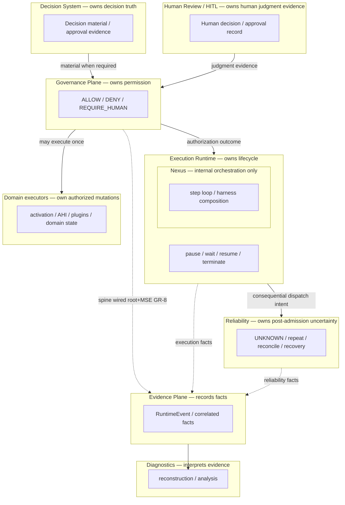

No layer above substitutes another: **Governance ≠ Decision truth**; **Evidence ≠ authority**; **Diagnostics ≠ authority**.

### 3. Root admission vs inner governance (Diagram #2)

**Question answered:** How is **ROOT_EXECUTION_ADMISSION** separated from **inner** evaluation?

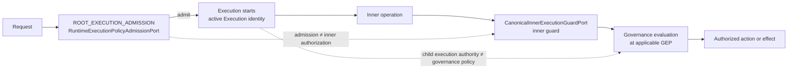

**Admission** gates whether a **root** Execution may start. **Inner** points evaluate operations **inside** an already-admitted Execution. Neither replaces the other.

### 4. Meaningful side effect flow (Diagram #3)

**Question answered:** What is the canonical path before a consequential external effect runs?

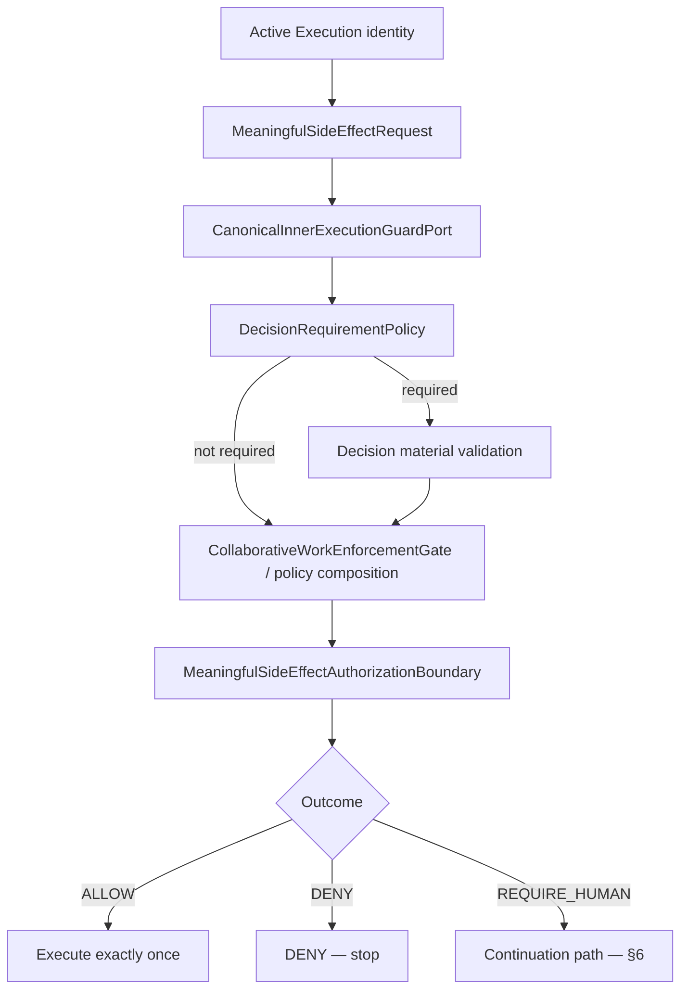

Provider / domain dispatch occurs **only** after **ALLOW** (GR-3 / GR-6 composition).

### 5. Decision → Governance → Execution (Diagram #4)

**Question answered:** Why is **Decision accepted ≠ Governance ALLOW**?

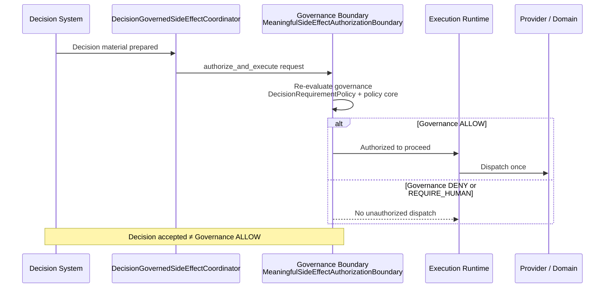

Full MP-4 integration: [`DECISION_APPROVAL_GOVERNANCE.md`](DECISION_APPROVAL_GOVERNANCE.md).

### 6. HITL / continuation ownership (Diagram #5)

**Question answered:** Who pauses, who judges, who re-authorizes?

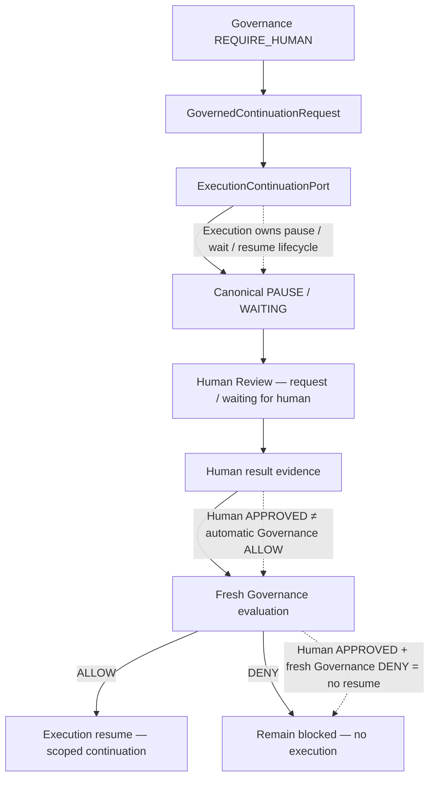

Execution establishes and owns canonical pause/wait/resume state. Human Review supplies judgment evidence while the Execution is paused. Human approval never substitutes fresh Governance authorization.

**Canonical lifecycle order:** REQUIRE_HUMAN → GovernedContinuationRequest → ExecutionContinuationPort → PAUSE / WAITING → Human Review → Human result → fresh Governance evaluation → ALLOW/DENY → resume scoped work / remain blocked.

ADR-GR-5-001 defines continuation contracts; Nexus orchestration stays **inside** Execution (not HITL owner).

### 7. Governance → Reliability handoff (Diagram #6)

**Question answered:** Where does permission end and outcome uncertainty begin?

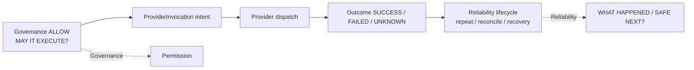

**UNKNOWN** is Reliability semantics — not a Governance evaluation failure. Depth: [`ENTERPRISE_RELIABILITY_LAYER.md`](ENTERPRISE_RELIABILITY_LAYER.md).

### 8. Fail-closed negative paths (Diagram #7)

**Question answered:** Which conditions deny execution without substituting Reliability?

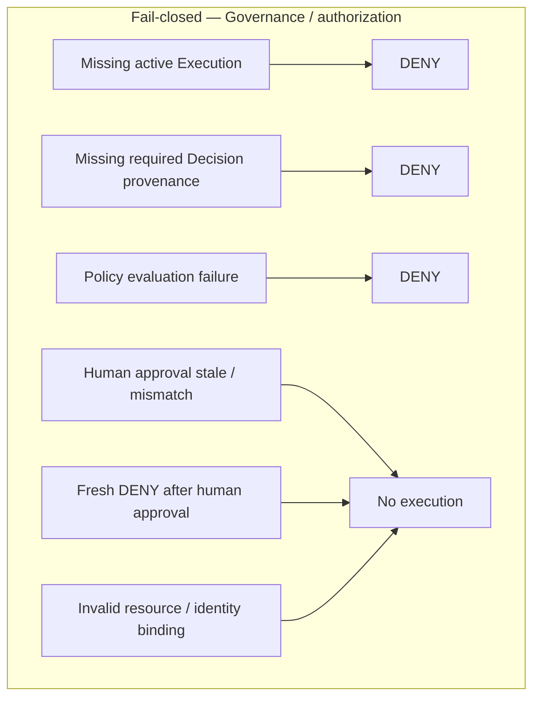

Reliability **UNKNOWN** handling is **out of scope** for this diagram (see §7).

### 9. Strategy coverage (Diagram #8)

**Question answered:** Which strategies are qualified at which governance capabilities?

Aligned with § Strategy coverage matrix (GOV-FINAL-1); statuses are **text** in cells (not color-only).

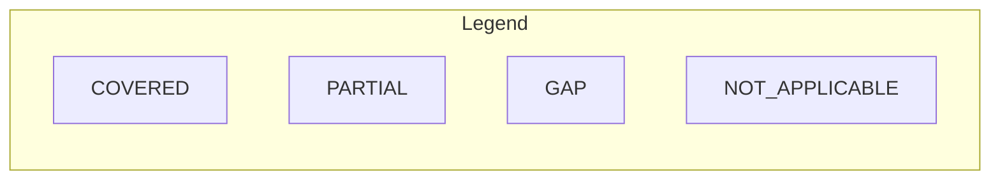

| Capability | INFERENCE | AGENTIC | ORCHESTRATION |
| ---------- | --------- | ------- | ------------- |
| Root admission | NOT_APPLICABLE | QUALIFIED | QUALIFIED |
| Inner guard | NOT_APPLICABLE | PARTIAL | PARTIAL |
| Policy evaluation (GEP) | QUALIFIED | PARTIAL | QUALIFIED |
| Meaningful side effect spine | NOT_APPLICABLE | PARTIAL | PARTIAL |
| Decision-bound MSE (GR-6) | NOT_APPLICABLE | QUALIFIED | QUALIFIED |
| HITL continuation (GR-5) | NOT_APPLICABLE | QUALIFIED | QUALIFIED |
| Continuation (GR-5 port) | NOT_APPLICABLE | QUALIFIED | PARTIAL |
| Reliability boundary (GR-7) | NOT_APPLICABLE | QUALIFIED | PARTIAL |
| Governance Evidence (GR-8) | QUALIFIED | PARTIAL | PARTIAL |
| Control-plane mutation | NOT_APPLICABLE (execution spine) | NOT_APPLICABLE | NOT_APPLICABLE — **GR-12 IN PROGRESS** (G3B platform row **GAP**) |

GR-10 qualification suite (`tests/qualification/governance/strategy/`) encodes this matrix; status **PARTIAL** — independent audit required before CLOSED.

### 10. Evidence / Diagnostics (Diagram #9)

**Question answered:** How do facts flow without becoming authority?

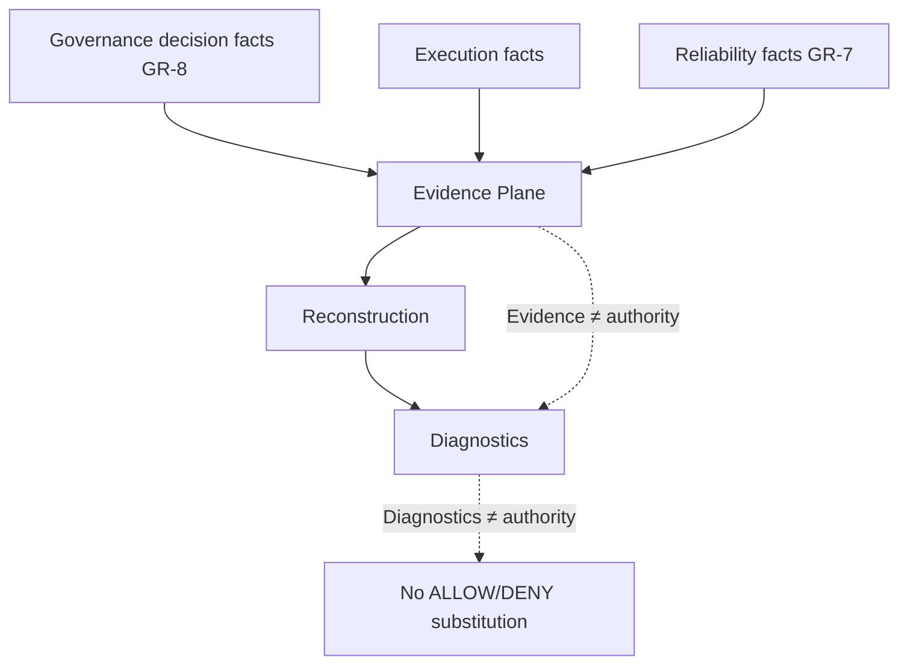

**Governance Evidence spine (GR-8):** typed ``GovernanceDecisionEvidenceFact`` projected through ``GovernanceEvidencePersistencePort`` (default: ``RuntimeEvent`` + ``EvidencePersistencePort`` when five-ID correlation is present). **CANDIDATE CLOSED — awaiting independent GitHub audit.** Evidence does not return or alter ``PolicyDecision``; persistence failure does not flip DENY/REQUIRE_HUMAN into ALLOW.

**INFERENCE PRE_MODEL (GR-10-R6 / R6-R1):** legal governed structured inference is composed via ``build_governed_inference_executor`` with a **required** replaceable ``GovernanceEvidencePersistencePort`` (``InferenceExecutor`` itself stays evidence-neutral). ``GovernanceDecisionEvidenceFact.decision`` records the **source** ``PolicyDecision`` from ``PolicyEngine.evaluate_pre_llm``; effective fail-closed runtime may synthesize DENY for unsupported PRE_MODEL actions (REQUIRE_HUMAN, ESCALATE, MODIFY) without rewriting the fact. ESCALATE/MODIFY emit **no** GR-8 fact (frozen fact builder accepts ALLOW/DENY/REQUIRE_HUMAN only).

**Scope honesty:** GR-8 closure applies to **evidence infrastructure** (immutable fact contract, pluginable persistence port, default durable adapter, root admission + meaningful-side-effect emission). **Evaluation-point adoption coverage** across all GEP rows in §G3B is **not** GR-8 — residual wiring and strategy qualification are owned by **GR-10** and **GR-13**.

**GR-10 vs GR-13 certification (ADR-GR-10-003):** GR-10 strategy qualification may mark the **Governance Evidence** capability **QUALIFIED** when mandatory orchestration paths in `GR10_ORCHESTRATION_GOVERNANCE_EVIDENCE_INVENTORY` are **QUALIFIED** (root admission, MSE, inner-guard DENY spine, decision-bound / post-HITL correlation). Per-GEP GR-8 fact adoption for applicable policy GEPs (e.g. PRE_MODEL, TOOL_PLAN_OR_ACCESS, TOOL_INVOCATION_POLICY, PRE_OUTPUT, POST_RUN) is typed **`DEFERRED_TO_GR13`** — not `NOT_APPLICABLE`. GR-13 owns the full per-GEP proof matrix. SSOT: `GR10_ORCHESTRATION_GEP_SEMANTICS` + `GR13_ORCHESTRATION_GOVERNANCE_EVIDENCE_DEFERRED` in `tests/qualification/governance/strategy/catalog.py`.

```text
Governance evaluation → PolicyDecision (authority)
  → GovernanceDecisionEvidenceFact (immutable)
  → GovernanceEvidencePersistencePort
  → EvidencePersistencePort / custom plugin
  → reconstruction / diagnostics (non-authoritative)
```

### 11. Control-plane mutation — TARGET only (Diagram #10)

**Question answered:** What is the *target* model for platform mutations (not live unified enforcement)?

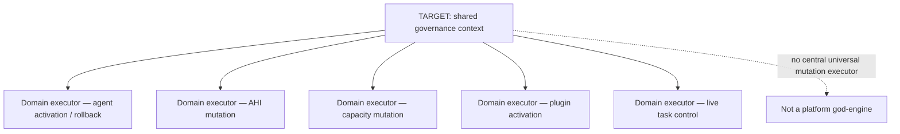

**G3B platform row:** **CONTROL_PLANE_MUTATION** remains **GAP** until final GR-12 closure (architecture honesty gate). **GR-12 program:** **IN PROGRESS** — shared CLA-04 spine wired; core paths qualified; catalog **WIRED_NOT_QUALIFIED**; not platform-wide **COVERED**; enterprise qualification not claimed.

### 12. Pluginability — contract → composition → implementation (Diagram #11)

**Question answered:** How may hosts replace governance *mechanisms* without moving semantic ownership?

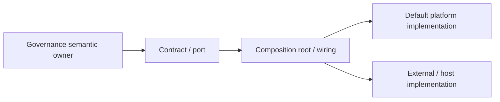

| Port / policy surface | Owner | Default role |
| --------------------- | ----- | ------------ |
| `RuntimeExecutionPolicyAdmissionPort` | Governance plane | Root admission before Execution |
| `CanonicalInnerExecutionGuardPort` | Governance + Execution composition | Inner operation guard |
| `DecisionRequirementPolicy` | Governance | Decision provenance requirement |
| `ExecutionContinuationPort` | Execution Runtime | Pause / resume lifecycle |
| `ProviderInvocationStore` | Reliability (ERL) | Durable invocation facts |
| `RuntimePolicyEngine` / catalog evaluators | Governance | Policy evaluation at GEPs |
| `MeaningfulSideEffectAuthorizationBoundary` | Governance | MSE ALLOW/DENY/REQUIRE_HUMAN |

Concrete providers are **not** platform authority — only ports and composed boundaries are.

### Architecture boundary table (visual companion)

| Boundary | Owner | Contract | Replaceable? | Concrete implementation allowed in core? |
| -------- | ----- | -------- | -----------: | ---------------------------------------: |
| Root Execution admission | Governance plane | `RuntimeExecutionPolicyAdmissionPort` | Yes (host wiring) | Yes — gated launcher / MODEL C1 adapters |
| Inner operation guard | Governance + Execution | `CanonicalInnerExecutionGuardPort` | Yes | Yes — composition modules |
| Meaningful side effect authorization | Governance | `MeaningfulSideEffectAuthorizationBoundary` | Policy/gate injection | Yes — default boundary in policy runtime |
| Decision material at MSE | Decision + Governance | `DecisionRequirementPolicy`, `DecisionGovernanceMaterialRef` | Host policies | Coordinator in Execution Engine |
| HITL continuation | Execution Runtime | `ExecutionContinuationPort`, `GovernedContinuationRequest` | Yes | Yes — UER integration |
| Live policy evaluation | Governance | `RuntimePolicyEngine`, `DeclarativePolicyEnforcer` | Handlers/plugins via catalog | Yes — core evaluators |
| Post-admission provider outcomes | Reliability | `ProviderInvocation`, `ProviderInvocationStore` | Store backend | Yes — ERL contracts |
| Control-plane mutations (GR-12) | Domain executors + CLA-04 boundary | `ControlPlaneMutationAuthorizationBoundary` — **IN PROGRESS** (G3B **GAP**) | Per domain | Domain-owned executors only |
| Governance evidence emission | Governance → Evidence | `GovernanceEvidencePersistencePort`, `GovernanceDecisionEvidenceFact` | `RuntimeEventGovernanceEvidencePersistence` | **CANDIDATE CLOSED (GR-8)** — independent audit pending |

### 13. Current gaps shown in this visual layer

| Gap | Visual status |
| --- | ------------- |
| GR-8 Governance Evidence integration | CANDIDATE CLOSED in §10 — awaiting independent audit |
| GR-10 Strategy coverage qualification | **FINAL CLOSED** within formally defined GR-10 scope |
| GR-11 Plugin enterprise certification | Pluginability §12 — qual open (after GR-12) |
| GR-12 Control-plane mutation | §11 + § GR-12 CURRENT STATUS — **IN PROGRESS** (G3B **GAP** until final qualification) |
| GR-13 Full proof matrix | Not claimed — see maintainer plan |
| GR-14 LKW integration | Planned |
| GR-15 Governance UX / app contract | Planned |
| GR-16 Enterprise qualification & claims | Planned — no full-plane enterprise claim |
| Transitional HITL / Task–Nexus bridge coupling | §6 limitation note |

---

## At a glance

| Concern | What Intergrax provides |
| -------- | --------------------- |
| **Policy definition** | Built-in, application-configured, and plugin-extensible policy rules bound to evaluation contexts |
| **Policy enforcement** | Evaluation at configured boundaries before or after meaningful execution steps (per Execution and inner operation) |
| **Approval / HITL** | One canonical human-in-the-loop path when policy requires human decision |
| **Tool and action boundaries** | Controlled tool invocation and meaningful side-effect authorization on demonstrated paths |
| **Evidence / provenance** | Governance decisions correlated with execution evidence where mechanisms are wired |
| **Extension** | Policy handlers through the existing platform plugin / policy architecture - not a second plugin framework |

---

## Responsibility boundary

### Application / organization owns

- Business rules and what permission means in product terms
- Approval requirements and organizational risk policy
- Required identity, tenant, and product context
- Acceptance criteria for product outcomes

### Intergrax owns reusable mechanisms for

- Carrying identity and execution context into policy evaluation
- Evaluating configured policy at supported evaluation points
- Enforcing policy decisions (allow, deny, require human, and other supported outcomes)
- Preventing unauthorized execution on wired paths
- Pausing for canonical HITL and scoped governed continuation
- Recording governance evidence where mechanisms are connected

### Agent / model (examples)

- Proposes reasoning, decisions, and actions within supplied context on agentic paths
- Does **not** grant business permission or bypass configured boundaries

Agent/model paths illustrate inner governance evaluation points; governance scope is **Execution-centric**, not agent-only.

Intergrax does **not** decide business permissions on behalf of the application.

---

## Execution-centric governance

**TARGET ARCHITECTURE** (aligned with [`UNIFIED_EXECUTION_ARCHITECTURE.md`](UNIFIED_EXECUTION_ARCHITECTURE.md) §12, §20, **UEA-INV-009**, **UEA-INV-021**)

Every Execution enters the canonical Execution Boundary with:

- canonical runtime identity (`TaskId`/`RunId`/`AttemptId`/`ExecutionId` context)
- tenant/scope
- effective authority (narrowed from parent when applicable)
- execution requirements and strategy context
- relevant action/effect context for admission

| Question | Owner |
| -------- | ----- |
| Is this Execution / operation allowed under effective authority and policy? | **Governance** |
| What lifecycle consequence follows (RUNNING, PAUSED, FAILED, RESUMED, …)? | **UER / Execution Runtime** |

No strategy - inference, agentic, orchestration, distributed worker, or future executor - may bypass governance admission or applicable inner evaluation points merely because it runs inside another Execution.

---

## Execution admission vs inner evaluation points

Two levels - do **not** conflate them.

### A. Execution admission / effective authority

Per-Execution platform guarantee at the canonical Execution Boundary:

- establish effective authority
- bind policy context and tenant scope
- apply applicable admission restrictions
- coordinate with budget reservation where required

### B. Inner governance evaluation points

Conditional boundaries **inside** an Execution when applicable:

- pre-model
- agent decision
- tool plan/access
- tool invocation
- meaningful external side effect
- output
- control-plane mutation
- post-run

Not every inner point executes for every strategy (simple inference may have no tool invocation boundary). No strategy may **bypass** an applicable inner point. Inner evaluation remains reachable only through platform-owned boundaries - no executor-local private governance engine and no competing general systems such as `InferenceGuardrailRuntime`, `AgentGuardrailRuntime`, or `NexusGuardrailRuntime`.

---

## Authority inheritance

**TARGET ARCHITECTURE**

```text
Run/root authority
  ↓
Execution
  ↓
child Execution
  ↓
Agent
  ↓
Tool
```

**Invariant:** child effective authority ≤ parent effective authority. Child may narrow; child **MUST NOT** expand authority because Nexus scheduled it, another worker executes it, another agent is selected, HITL resumed it, or transport redelivered it. Human approval does not implicitly expand unrelated authority.

---

## Policy, guardrails, and enforcement

**Governance/policy** = decision authority (ALLOW, DENY, REQUIRE_HUMAN, …).

**Guardrails** = one class of enforcement mechanisms/constraints - not a parallel policy system. Applicable guardrails participate at model, tool, input/output, side-effect, or other platform-owned boundaries. They must be reached through those boundaries; they do not replace governance admission.

---

## Governance plane

Conceptual platform model - not a single runtime class or universal wrapper:

```text
                         GOVERNED EXECUTION
                                |
                   +------------+-------------+
                   |                          |
            POLICY DEFINITION          POLICY ENFORCEMENT
                   |                          |
          +--------+---------+                |
          |        |         |                |
       built-in   app     plugin              |
       policies policies  policies            |
          |        |         |                |
          +--------+---------+                |
                   |                          |
                   +------------+-------------+
                                |
                         evaluation point
                                |
             input / model / decision / tool /
                 output / side effect / post-run
                                |
                         policy decision
                                |
          ALLOW / DENY / MODIFY / ESCALATE /
                        REQUIRE_HUMAN
                                |
                    canonical HITL when needed
                                |
                     governed continuation
                                |
                            evidence
```

This is the **governance plane** mental model. Live enforcement, HITL, evidence, and post-run governance remain specialized owners; they are not collapsed into one implementation component.

---

## Policy outcomes

Existing runtime vocabulary (`intergrax.contracts.runtime_policy.PolicyAction`):

| Outcome | Meaning |
| -------- | -------- |
| **ALLOW** | Proceed under configured constraints |
| **DENY** | Block the governed step |
| **MODIFY** | Replace or adjust the proposed decision where supported |
| **ESCALATE** | Route to a higher enforcement or review path where wired |
| **REQUIRE_HUMAN** | Pause for canonical HITL before governed continuation |

Each decision may carry **advisory** or **mandatory** enforcement level. Mandatory enforcement blocks or redirects execution on wired paths; advisory outcomes may surface warnings without stopping execution, depending on host configuration.

**MODIFY**, **ESCALATE**, and uniform mandatory enforcement are **not** claimed at every evaluation boundary. Support is evaluation-point-specific.

---

## Evaluation boundaries

Conceptual boundary classes in the governance plane model. These are **inner evaluation points** (level B) where policy may apply inside an Execution - not substitutes for Execution admission (level A). Coverage varies by strategy; applicable boundaries must not be bypassed.

| Boundary class | Role |
| -------------- | ---- |
| **Model / LLM boundary** | Policy around model invocation and guardrail composition |
| **Agent decision boundary** | Policy on agent-proposed decisions before execution |
| **Tool invocation** | Declarative and runtime policy before tool handlers run |
| **Meaningful external side effect** | Authorization for effects that leave the bounded runtime |
| **Output** | Pre-output policy bridges where wired |
| **Replay / post-run governance** | Post-run evaluation, metrics, and guard mechanisms |
| **Control-plane mutation** | Authorization/evidence for state-changing control-plane operations (activation, rollback, capacity, live task control, plugin/config admission) — CLA-04 spine **implemented** on core paths; **GR-12 IN PROGRESS**; G3B platform row **GAP** until final qualification |

These classes describe **where policy may apply** in the platform model. **Current implementation coverage varies by boundary.** Do not infer a uniform evaluation-point API or complete platform-wide coverage from this list.

---

## Governance Evaluation Points and ownership

Frozen architecture (G1A): [ADR-GOVERNED-EXECUTION-001](../technical/adr/entries/2026-08-16/ADR-GOVERNED-EXECUTION-001.md).

A **Governance Evaluation Point** is a named execution boundary at which Intergrax evaluates configured governance state before, during, or after a meaningful execution operation and produces an explicit governance outcome according to that boundary's contract. It is **not** one class, method, enum, or middleware stack.

**One governance plane, multiple enforcement owners.** Governed Execution composes specialized owners - authorization (`ToolAccessPolicy`, `ToolScopePolicy`), live policy (`RuntimePolicyEngine`, `PolicyEngine` facade for live + replay evaluators), declarative tool policy (`DeclarativePolicyEnforcer`), canonical HITL, post-run governance (`GovernanceService`, `ExecutionGuard`), and evidence/observability - without a universal `GovernanceEngine`.

| Concern | Question |
| ------- | -------- |
| **Authorization** | May this principal / capability reach this execution surface? |
| **Policy enforcement** | Given this request, may this execution proceed, change, escalate, or require human approval? |
| **Post-run governance** | Was completed execution acceptable, and what follow-up is required? |

These compose sequentially; they are **not** interchangeable. Authorization ALLOW does not imply policy ALLOW; post-run BLOCK is not retroactive pre-execution DENY.

**Typed context rule:** critical live evaluation points must move toward explicit typed request/context contracts. Opaque `dict[str, Any]` semantic bags are not the target architecture for security-sensitive enforcement. Plugin/domain extension payloads may exist at ingestion boundaries only behind domain-owned validation ([Platform Plugins](PLATFORM_PLUGINS.md)).

**Failure posture:** security-sensitive indeterminate outcomes at meaningful external side effects and explicitly restricted authorization paths **fail closed**. Declarative `AUDIT_ONLY` may record would-deny without blocking. Other boundaries are evaluation-point-specific (see ADR).

**Reference pattern (not universal topology):** `DeclarativePolicyEnforcer` at `RuntimeToolInvoker` - typed context, deterministic precedence, provenance, enforcement mode, block before handler, scoped HITL. Other boundaries should match this contract quality where critical, not necessarily this implementation path.

**PolicyEngine** is a facade over live `RuntimePolicyEngine` and optional replay `ExecutionPolicyEngine` - **not** the whole of Governed Execution. It does not own tool access/scope, declarative enforcer, HITL, or evidence.

Contract hardening (**G1B**) - **implemented core** on owned live paths (not platform-wide coverage):

- **G1B-1:** typed live policy evaluation contexts for agent decision, pre-model, and critic governance; unused pre-output semantic context removed. Security-sensitive live evaluation on these owned paths no longer depends on opaque `dict` bags.
- **G1B-2:** typed meaningful-side-effect runtime rules (`MeaningfulSideEffectPolicyRule`, explicit `rule_id`, existing `PolicyAction`); `RuntimePolicyEngine` does not parse dynamic type/decision/id strings; fail-closed semantics preserved.
- **G1B-3:** hardened `PolicyDecision` - immutable, extra fields forbidden, explicit canonical provenance; bundle provenance either absent or complete; sha256 digest structurally validated; `audit_payload` remains diagnostic/non-authoritative. `EvaluatedPolicyDecision` remains the bundle-backed typed evidence contract; no duplicate evidence framework.

Not closed by this core: `RuntimePolicyBundle.domain_fragments` hardening, `MeaningfulSideEffectRequest` context/correlation hardening, remaining facade terminology, universal rule catalog, universal evaluation-point coverage, `decision_id` on every policy producer, or durable evidence persistence.

### G3B - Governance Evaluation Point execution coverage (GOV-FINAL-1)

Status vocabulary: **COVERED** (wired enforcement on demonstrated production-class paths), **PARTIAL**, **GAP**, **NOT_APPLICABLE**. **COVERED** requires a fail-closed enforcement path — not merely an interface. **ENTERPRISE** is not used here; see § Governance implementation truth.

| Evaluation point | Status | Canonical owner | Canonical contract / port | Enforcement boundary | Strategy coverage | Enterprise qualification | Remaining limitation |
| ---------------- | ------ | --------------- | ------------------------- | -------------------- | ----------------- | ------------------------ | -------------------- |
| **ROOT_EXECUTION_ADMISSION** | **PARTIAL** | Governance plane | `RuntimeExecutionPolicyAdmissionPort` | Root launcher + MODEL C1 AST gates before root Execution | ORCHESTRATION/AGENTIC/INFERENCE entry paths gated in qualification suite; legacy harness entries explicitly classified | GR-2-R3 tests; independent audit pending | Not every historical launcher path enterprise-qualified |
| **AGENT_DECISION** | **COVERED** | Governance | `RuntimePolicyEngine.evaluate_decision` | `UAEPExecutor` / interrupt handler — `GovernanceResolution.should_block_execution` | **AGENTIC** primary; INFERENCE N/A | UAEP regression gates | Custom hosts outside UAEP unqualified |
| **INTERRUPT** | **COVERED** | Governance | `RuntimePolicyEngine.evaluate_interrupt` | `ExecutionInterruptHandler` on UAEP **AGENTIC** paths | **AGENTIC** primary; **ORCHESTRATION** topology uses cancellation lifecycle (not INTERRUPT GEP) | Interrupt + HITL bridge tests | Inference-only runs typically N/A; GR-10-R15 ORCHESTRATION N/A |
| **PRE_MODEL** | **PARTIAL** → **QUALIFIED (INFERENCE identity)** | Governance | `PolicyEngine.evaluate_pre_llm` (`principal_id` required — [ADR-GR-10-001](../technical/adr/entries/2026-09-18/ADR-GR-10-001.md); **GR-10-R2-C1** contract revision) | `PlanningRunner`, `PolicyEnforcingLLMRouter`, `enforce_pre_model_before_structured_inference` | **ORCHESTRATION**, **AGENTIC** (ACP); **INFERENCE** | Planning/agent/inference LLM gates; **GR-10-R2-R1** removes lineage/Evidence/Task principal fallbacks; live triple from `ActiveExecutionGovernanceIdentity` | Architecture identity source: `principal_id` + optional roster `agent_id` per ADR; projection consistency checks only; Evidence/Diagnostics do not supply principal; direct adapter bypass = host gap |
| **TOOL_PLAN_OR_ACCESS** | **COVERED** | Governance | `ToolAccessPolicy` / bundle scope | `tool_runtime.execute_plan` | **ORCHESTRATION** | Tool runtime authority closure tests | Planners outside `tool_runtime` unqualified |
| **TOOL_INVOCATION_AUTHORIZATION** | **COVERED** | Governance + tool runtime | `RuntimeToolInvoker` authorization gate | Pre-handler in `RuntimeToolInvoker` | **ORCHESTRATION**, **AGENTIC** | `test_tool_runtime_authority_closure` | — |
| **TOOL_INVOCATION_POLICY** | **COVERED** | Governance | `DeclarativePolicyEnforcer` | `RuntimeToolInvoker` before handler | **ORCHESTRATION**, **AGENTIC** | Declarative policy regression | REQUIRE_HITL tool path host-qualified |
| **MEANINGFUL_SIDE_EFFECT** | **PARTIAL** | Governance | `MeaningfulSideEffectAuthorizationBoundary`, `DecisionRequirementPolicy` (GR-6) | `authorize` / `authorize_and_execute`; provider dispatch only after authorization | External Work + collaborative-work production compositions; not all strategies | GR-1 identity **CLOSED**; GR-6 host suites; GR-3 inner guard | Not every effect path injected; inner-op (A) caller discipline still open on some adapters |
| **PRE_OUTPUT** | **COVERED** | Governance | `PolicyEngine.evaluate_pre_output` | Harness terminal / Nexus finish paths | **ORCHESTRATION**, **AGENTIC** harness | Kernel/Nexus post-check tests | Non-terminal steps by design |
| **POST_RUN** | **COVERED** | Governance | `PostRunGovernanceService` / `GovernanceService` | `invoke_post_run_governance` at Nexus/UAEP finish; `production_mode` requires service | **ORCHESTRATION**, **AGENTIC** when wired | Post-run integration tests; GR-10-R15 | Lab harness may omit service; strict production fail-closed |
| **CONTROL_PLANE_MUTATION** | **GAP** | Domain executors + `ControlPlaneMutationAuthorizationBoundary` (CLA-04) | `ControlPlaneMutationPolicyEvaluator` + per-domain mutation owner | Shared boundary on qualified core paths; residuals open | **NOT_APPLICABLE** at platform spine for enterprise **COVERED** | Core AD/AHI/ECP/Task Control **QUALIFIED** (GR-12-A3); catalog **WIRED_NOT_QUALIFIED**; Vector/Memory **ADR_REQUIRED** | GR-12 **IN PROGRESS** — G3B **GAP** until final qualification; cannot mark GR-12 CLOSED |

### Strategy coverage matrix (production entry points, GOV-FINAL-1)

| Governance capability | INFERENCE | AGENTIC | ORCHESTRATION |
| --------------------- | --------- | ------- | ------------- |
| Root admission (GR-2) | NOT_APPLICABLE (GR-10-R4 — no independent production root; internal `StrategyExecutionRouter` delegate only) | QUALIFIED (`HostTaskExecution` + launcher) | QUALIFIED (same host path) |
| Inner guard / MSE spine (GR-3) | NOT_APPLICABLE (GR-10-R5 — no MSE/tool inner spine; PRE_MODEL is Policy evaluation row) | PARTIAL | PARTIAL (primary proofs) |
| Tool invoke policy | NOT_APPLICABLE | COVERED | COVERED |
| Decision-required MSE (GR-6) | NOT_APPLICABLE | QUALIFIED (MP-4R7 / governed contractor) | PARTIAL (External Work host) |
| HITL continuation port (GR-5) | NOT_APPLICABLE (no strategy-path REQUIRE_HUMAN) | QUALIFIED (MP-4R7) | QUALIFIED (GR-10-R11 — MSE HITL gate + governed continuation) |
| Provider reliability boundary (GR-7) | NOT_APPLICABLE (not a GR-7 external effect) | QUALIFIED (governed contractor GR-7) | PARTIAL (External Work) |

### Decision → Governance (GR-6 result model)

Governance **authorizes** consequential effects; Decision System supplies **material** when policy requires it. At the canonical meaningful-side-effect boundary:

- **`DecisionRequirementPolicy`** classifies whether Decision provenance is required per action/kind.
- **`DecisionGovernanceMaterialRef`** binds decision subject, canonical action identity, and resource scope (GR-6-ARCH / GR-6-RS1).
- **`DecisionGovernedSideEffectCoordinator`** (Execution Engine) sequences decision material with **`authorize_and_execute`** — Governance evaluation remains in the boundary; provider invocation runs only after authorization (fail-closed).
- Production composition: governed contractor host wires policy + collaborative governance (`GR-6-WIRE`, `GR-6-CW1`, `GR-6-R2`); dynamic clock (GR-6-T1).
- **GR-10-R10-R2 (orchestration MSE):** each strict production Tier-3 host owns `DecisionRequirementPolicy` semantics in `host/orchestration_decision_requirement_policy.py` (or equivalent) and injects it into `build_harness_host_runtime(..., orchestration_decision_requirement_policy=...)`. Generic harness runtime does not invent domain rules; missing policy with `execution_mode=strict` fails closed at production MSE composition (GR-10-R10-R1). Product scaffolds emit the same seam.

Full Decision / Approval integration SSOT: [`DECISION_APPROVAL_GOVERNANCE.md`](DECISION_APPROVAL_GOVERNANCE.md). Task history: gap ledger — not duplicated here.

### External effect / Reliability boundary (GR-7 result model)

**Reliability ≠ Governance authority.** Governance decides whether an effect may execute; **Enterprise Reliability Layer** manages durable intent/outcome (`ProviderInvocation`), **SUCCESS / FAILED / UNKNOWN**, repeat eligibility, reconciliation probes, controlled recovery, HITL escalation for ambiguity, and **reliability evidence** projections (GR-7-A8) — without substituting ALLOW/DENY.

Logical effect identity is distinct from physical provider invocation; recovery/repeat ports are governed and fail-closed. Depth: [`ENTERPRISE_RELIABILITY_LAYER.md`](ENTERPRISE_RELIABILITY_LAYER.md). **GR-7 reliability evidence ≠ platform-wide Governance Evidence (GR-8).**

---

## Human-in-the-loop

Intergrax has **one canonical HITL system**. **Governance owns permission semantics** (ALLOW / DENY / REQUIRE_HUMAN). **Human Review** (Decision / collaborative flows) owns human judgment evidence where wired. **Execution Runtime owns pause / wait / resume lifecycle** via `ExecutionContinuationPort` (ADR-GR-5-001). **Nexus is internal Execution Engine orchestration**, not a public lifecycle authority. Reliability may recommend or escalate to HITL after admission; it does **not** grant execution permission.

**Non-negotiable semantics (GR-5 / MP-4 aligned):**

- **Human APPROVED ≠ automatic Governance ALLOW** — post-human governance re-evaluation can still DENY.
- Human approval cannot bypass a fresh **DENY**.
- **Resume requires valid scoped authorization** (grant / continuation contract), not merely stored approval evidence.
- Some production bridges remain **transitional** for **Continuation** (Task-shaped pause materialization) — GR-10-R12; **ORCHESTRATION HITL** permission boundary is **QUALIFIED** (GR-10-R11).

`REQUIRE_HUMAN` connects conceptually to:

```text
Execution → governance REQUIRE_HUMAN
  → UER PAUSED / WAITING_FOR_HUMAN
  → canonical HITL decision store / evidence
  → authorized decision
  → UER resumes SAME Execution identity
  → strategy continues
```

Canonical owners and invariants:

- Human decision is **not** a retry, new Attempt, new Run, or automatic authority expansion
- Human approval does **not** generically bypass **DENY**
- Authorization and continuation must remain **scoped** to the governed request
- HITL is **not** a generic tool failure or retry substitute
- Do **not** introduce a second HITL runtime

Deeper specification: [RELIABILITY_FAILURE_AND_HITL.md](RELIABILITY_FAILURE_AND_HITL.md) (failure, retry, HITL, governed continuation). Platform plugin admission for policy extensions: [ADR-PLATFORM-PLUGIN-001](../technical/adr/entries/2026-08-14/ADR-PLATFORM-PLUGIN-001.md) (policy handler surface; full third-party production qualification **not** claimed).

---

## Policy extensibility

Policy handlers participate through the **existing** platform plugin and policy architecture:

- Reuse [Platform Plugins](PLATFORM_PLUGINS.md) coordination and domain-owned contracts
- **No second plugin framework** for governance
- Plugin admission, allowlisting, and provenance exist in meaningful slices
- Full production qualification of third-party policy plugins is **not** established

Maintainer roadmap context (not public proof): [PLATFORM_PLUGIN_ENTERPRISE_ROADMAP.md](../maintainers/plans/PLATFORM_PLUGIN_ENTERPRISE_ROADMAP.md).

---

## Policy Catalog

Frozen architecture (G2A): [ADR-GOVERNED-EXECUTION-002](../technical/adr/entries/2026-08-17/ADR-GOVERNED-EXECUTION-002.md).

The **Policy Catalog** is the canonical registry of policy **definitions** available for application selection. It answers *what governance capabilities can this application select?* It is **not** implemented as a runtime catalog in G2A - this section freezes identity and ownership only.

| Question | Concept | Identity |
| -------- | ------- | -------- |
| What can I choose? | Policy Catalog → Policy Definition | `policy_id` + definition version |
| What did this application configure? | Configured rule instance | `rule_id` |
| What policy state is active? | Runtime / immutable bundle | bundle id + bundle version |
| What implements evaluation? | Policy handler | `handler_id` |
| Where is it enforced? | Governance Evaluation Point | point-specific contract (G1A) |

**Frozen flow:**

```text
Policy Catalog
    ↓
Policy Definition (policy_id + version)
    ↓
configured rule (rule_id)
    ↓
runtime bundle
    ↓
handler (handler_id)
    ↓
evaluation point
    ↓
PolicyDecision
```

**Identity separation:** `policy_id` ≠ `rule_id` ≠ `handler_id`.

The catalog describes capability; bundles carry what was configured; handlers execute; evaluation points enforce. Catalog metadata does **not** prove runtime coverage.

**Catalog is not:** `PolicyRuleRegistry`, `RuntimePolicyBundle`, `ImmutableRuntimePolicyBundle`, `PolicyEngine`, `RuntimePolicyEngine`, enforcer, HITL, evidence persistence, or a second plugin framework.

**Catalog vs bundle:** the catalog holds what **can** be selected (e.g. `external_commitment_approval` v2); a configured rule is what the application **did** select (e.g. `finance.contracts.require_cfo`); a runtime bundle is the **active** composed policy state containing that rule. Policy definition version and bundle version are separate - one definition version may appear in many bundles.

**G2B typed contract:** `intergrax.contracts.policy_catalog` implements immutable `PolicyDefinition` metadata - `policy_id`, definition `version`, `display_name`, `description`, `handler_id`, `configuration_contract_id`, and `source` (`built_in` / `plugin`). This answers *what policy capability exists* at the contract level only.

**G2C-1 resolution core:** `intergrax.runtime.policy.catalog.PolicyCatalog` implements deterministic exact `PolicyDefinition` resolution by `(policy_id, version)` - multi-version coexistence, explicit unknown-policy failure, explicit unsupported-version failure, deterministic duplicate conflict rejection, and **no** latest/fallback/downgrade behavior. `PolicyCatalog` does **not** resolve `handler_id` or `configuration_contract_id`; plugin discovery/admission is outside this module.

**G2C-2A rule / handler identity separation:** on the declarative runtime path, `rule_id` is configured rule instance identity and `handler_id` is runtime handler implementation identity. `PolicyRuleRegistry` resolves handlers by `handler_id`; evidence and outcomes attribute decisions to `rule_id`. G2C-2A-R1 completed active caller and fixture migration after the initial core identity split.

**G2C-2B first built-in policy - Tool Invocation Control:** canonical built-in catalog and typed composition for one real policy capability:

```text
PolicyDefinition (policy_id = tool_invocation_control, version = 1, source = built_in)
    ↓
ToolInvocationControlConfig (tool_id + action; configuration_contract_id = tool_invocation_control.v1)
    ↓
configured DeclarativePolicyRule (rule_id = application identity; handler_id = deny_tool)
    ↓
PolicyRuleRegistry
    ↓
DeclarativePolicyEnforcer (ALLOW / DENY / REQUIRE_HITL)
```

- First canonical built-in policy: `tool_invocation_control@1` via `intergrax.runtime.policy.builtin_catalog`.
- Typed config is immutable; arbitrary `conditions` are **not** exposed through this contract.
- `handler_id = deny_tool` is a historical runtime implementation name; the product capability is Tool Invocation Control.
- Broader built-in policy inventory, platform-wide coverage, and production qualification are **not** claimed.

---

## Existing implementation map

Conceptual pieces mapped to existing mechanisms - **without** blanket maturity claims:

| Concept | Existing mechanism | Notes |
| -------- | ------------------- | ----- |
| Runtime policy contracts | `intergrax.contracts.runtime_policy` - `PolicyAction`, `PolicyDecision`, `EnforcementLevel` | Typed decision vocabulary |
| Policy facade | `intergrax.runtime.policy.PolicyEngine` | Facade over runtime and replay-oriented evaluators |
| Runtime evaluation | `intergrax.runtime.policy.RuntimePolicyEngine` | Interrupt, side-effect, and runtime-bound evaluation |
| Declarative tool-path enforcement | `DeclarativePolicyEnforcer`, declarative policy rules / bundles | DENY and REQUIRE_HITL before tool handler on wired paths |
| Meaningful side effects | `meaningful_side_effect.py`, `meaningful_side_effect_authorization.py` | Side-effect authorization composition |
| Canonical HITL | Nexus interrupt + HITL runtime (see REL canon) | `REQUIRE_HUMAN` / governed continuation |
| Post-run governance | `GovernanceService`, `ExecutionGuard` | Post-run replay, metrics, guard evaluation |
| Policy plugins / handlers | Platform plugin policy surface | Extends definition; enforcement stays at evaluation points |

Owner boundaries stay with each module and domain pair. This table is an orientation map, not an implementation dump.

---

## Current maturity

| Area | Status |
| ---- | ------ |
| Runtime policy decision contracts | **Implemented** - `PolicyDecision` / `PolicyAction` vocabulary |
| Policy facade and runtime engine | **Implemented slices** - bounded evaluation paths |
| Declarative policy on tool path | **Implemented slices** - DENY before handler; REQUIRE_HITL on demonstrated paths |
| Meaningful side-effect authorization | **Implemented mechanism** - not universal every-effect coverage |
| Canonical HITL integration | **Implemented** - bounded paths; not every evaluation point |
| Policy plugin / handler infrastructure | **Implemented slices** - admission / provenance partial |
| Post-run governance | **Implemented mechanisms** - `GovernanceService` / `ExecutionGuard` |
| Governance Evaluation Point architecture (G1A) | **Accepted** - [ADR-GOVERNED-EXECUTION-001](../technical/adr/entries/2026-08-16/ADR-GOVERNED-EXECUTION-001.md) |
| Contract hardening across critical runtime paths (G1B) | **Implemented core** - typed live contexts, typed meaningful-side-effect rules, immutable `PolicyDecision` and explicit bundle provenance invariants |
| Uniform evaluation-point runtime enum / god engine | **Rejected** - multiple owners preserved |
| Policy Catalog architecture (G2A) | **Accepted** - [ADR-GOVERNED-EXECUTION-002](../technical/adr/entries/2026-08-17/ADR-GOVERNED-EXECUTION-002.md) |
| Typed Policy Catalog contracts (G2B) | **Implemented** - immutable `PolicyDefinition` identity/source/configuration-contract metadata |
| Policy Catalog resolution core (G2C-1) | **Implemented** - exact `(policy_id, version)` resolution and deterministic conflict rejection |
| Declarative rule / handler identity separation (G2C-2A) | **Implemented** - configured rule identity and handler implementation identity are distinct on the declarative runtime path; G2C-2A-R1 completed active caller and fixture migration |
| Canonical built-in policy catalog | **Implemented core** - first canonical built-in policy `tool_invocation_control@1`; broader policy inventory and qualification ongoing |
| Complete platform-wide coverage | **Not claimed** |
| Dedicated accepted public Governed Execution proof | **Not established** |
| Production qualification | **Not established** |

**Safe summary:** meaningful governance mechanisms and a hardened runtime core exist; coverage, policy catalog, qualification, and accepted public proof remain open.

---

<a id="protocol-v22-policy-governance-target-invariants-2026-08-18"></a>

## Protocol v2.2 policy/governance target invariants (2026-08-18)

Accepted [`POLICY_GOVERNANCE`](../../audit_results/2026-08-18/POLICY_GOVERNANCE.md) findings **01–05** (layer audited 2026-08-19). **Target state** unchanged. **GR-0 / H9.2C (2026-09):** PG-FIX-A–D **mechanisms are implemented** on current `development` with targeted verification tests; **enterprise CLOSED** and platform-wide qualification are **not** claimed — see [`GOVERNANCE_ARCHITECTURE_REBASE_GAP_LEDGER.md`](../maintainers/qualification/GOVERNANCE_ARCHITECTURE_REBASE_GAP_LEDGER.md) and maintainer plan PG-FIX status table. Audit persistence alone did not implement remediation.

1. **One canonical meaningful-side-effect authorization spine** - product adapters may adapt domain requests but must not own an independent policy semantics path (**PG-FIX-A**).
2. **Composable effective authorization** - principal/effective authority, tenant/workspace, resource, external target, effect kind, operation/action, and exact side-effect scope id/digest (**PG-FIX-A**).
3. **Explicit deterministic policy resolution** - broad ALLOW must not accidentally shadow a more-specific DENY because of list order (**PG-FIX-B**).
4. **Scoped human approval grant** - canonical grant authorizes exactly the approved continuation/operation; neither global ALLOW nor mere untrusted evidence (**PG-FIX-C**).
5. **Explicit policy matching** - critical matching uses typed fields; no hidden `rule_id` suffix dispatch (**PG-FIX-D**).

Remediation blocks: **PG-FIX-A**, **PG-FIX-B**, **PG-FIX-C**, **PG-FIX-D** in [`plan/GOVERNED_EXECUTION.md`](../maintainers/plans/GOVERNED_EXECUTION.md).

<a id="protocol-v2-control-plane-mutation-target-invariants-2026-08-18"></a>

## Protocol v2 control-plane mutation target invariants (2026-08-18)

Accepted Protocol v2 audit layer [`CROSS_LAYER_ARCHITECTURE`](../../audit_results/2026-08-18/CROSS_LAYER_ARCHITECTURE.md) (**FAIL**, CLA-04). **Target state** - remediation **ACCEPTED / PLANNED**. **Historical:** audit persistence task AUDIT-20260818-CROSS-LAYER-ARCHITECTURE-PERSIST did not implement CLA-04. **Current (GR-12-A2+):** shared CLA-04 control-plane boundary and mandatory composition are **implemented** on named paths; **GR-12 overall IN PROGRESS** — residual catalog/Vector/Memory and final qualification remain open.

1. **CONTROL_PLANE_MUTATION evaluation class** - extend Governance Evaluation Point taxonomy with state-changing control-plane mutations distinct from in-run tool/side-effect and post-run governance paths.
2. **Minimum shared authority context** - principal; tenant/scope; resource identity; current revision/state; requested target revision/state; risk; approval evidence; mutation/idempotency identity.
3. **Specialized domain executors** - Agent Distribution activation/rollback, AHI apply/rollback, ECP capacity mutations, live task autonomy changes, plugin/config activation/admission remain domain-owned - no universal `GovernanceEngine` or universal mutation executor.
4. **Coverage honesty** - G3B marks **CONTROL_PLANE_MUTATION** as **GAP** until **final GR-12 qualification** closes the platform row; core paths may be qualified while the row stays **GAP**; do not claim platform-wide **COVERED** or GR-12 **CLOSED**.

Remediation: **CLA-CONTROL-PLANE-GOVERNANCE-INTEGRITY** in [`plan/GOVERNED_EXECUTION.md`](../maintainers/plans/GOVERNED_EXECUTION.md). Cross-link **E2E-CONTROL-AUTHORITY-INTEGRITY**, **AHI-***, **ECP-GOVERNED-ACTION-INTEGRITY**, Agent Distribution activation, Platform Plugins admission - coordinate; do not duplicate.

---

## Relationship to adjacent capabilities

| Capability | Relationship |
| ---------- | ------------- |
| **Decision System** | Decides **what the system concluded** (`ACCEPTED` / `REJECTED` / `UNRESOLVED`) — **canonical decision authority**; **separate from** execution authorization; see [`DECISION_SYSTEM.md`](DECISION_SYSTEM.md) · historical Critic snapshot: [`CRITIC_VERIFICATION.md`](CRITIC_VERIFICATION.md) |
| **Governed Execution** | Controls **what execution may proceed** under configured policy |
| **Observability & Auditability** | Records and reconstructs **what happened** - complementary, not interchangeable |
| **Token Optimization** | Optimizes selected context / prompt paths **under policy** |
| **Platform Extensibility** | Packages independent capability extensions, including policy extensions |
| **HITL** | One governance mechanism inside Governed Execution - not the whole capability |

---

## Verify / inspect implementation

### Evidence

No dedicated public domain proof is established today. [`PROOFS.md`](../proofs/PROOFS.md) lists **bounded** LKW proofs (for example Governed Evidence Decision Proof) that exercise policy-derived obligations on controlled paths - **not** a full Governed Execution domain qualification.

### Core implementation

Orientation map: [Existing implementation map](#existing-implementation-map). Canonical code entry points:

- [`PolicyDecision` / `PolicyAction` contracts](../../../intergrax/contracts/runtime_policy.py)
- [`RuntimePolicyEngine`](../../../intergrax/runtime/policy/runtime_policy_engine.py)
- [`DeclarativePolicyEnforcer`](../../../intergrax/runtime/policy/declarative_enforcer.py)
- [`PolicyEngine` facade](../../../intergrax/runtime/policy/policy_engine.py)
- [Canonical HITL runner](../../../intergrax/runtime/nexus/orchestration/hitl_runner.py)
- [`GovernanceService` (post-run)](../../../intergrax/runtime/governance/service.py)

### Go deeper

- [ADR-GOVERNED-EXECUTION-001](../technical/adr/entries/2026-08-16/ADR-GOVERNED-EXECUTION-001.md) · [ADR-GOVERNED-EXECUTION-002](../technical/adr/entries/2026-08-17/ADR-GOVERNED-EXECUTION-002.md)
- [Maintainer plan](../maintainers/plans/GOVERNED_EXECUTION.md)
- [Reliability / HITL](RELIABILITY_FAILURE_AND_HITL.md) · [Platform plugins](PLATFORM_PLUGINS.md)

---

## Review / deeper routes

| Topic | Canonical owner |
| ----- | ---------------- |
| Failure, retry, HITL, governed continuation | [RELIABILITY_FAILURE_AND_HITL.md](RELIABILITY_FAILURE_AND_HITL.md) |
| Governance Evaluation Points and enforcement ownership | [ADR-GOVERNED-EXECUTION-001](../technical/adr/entries/2026-08-16/ADR-GOVERNED-EXECUTION-001.md) |
| Policy Catalog identity and ownership | [ADR-GOVERNED-EXECUTION-002](../technical/adr/entries/2026-08-17/ADR-GOVERNED-EXECUTION-002.md) |
| Platform plugins and policy handler admission | [PLATFORM_PLUGINS.md](PLATFORM_PLUGINS.md) · [ADR-PLATFORM-PLUGIN-001](../technical/adr/entries/2026-08-14/ADR-PLATFORM-PLUGIN-001.md) |
| Observability and evidence spine | [OBSERVABILITY.md](OBSERVABILITY.md) · [PROOF_RECEIPTS.md](PROOF_RECEIPTS.md) |
| Public architecture overview | [ARCHITECTURE_OVERVIEW.md](ARCHITECTURE_OVERVIEW.md) |
| Current bounded evidence | [PROOFS.md](../proofs/PROOFS.md) |
| Runtime architecture hub | [intergrax_runtime_architecture.md](intergrax_runtime_architecture.md) |

Do not treat this document as a replacement for domain pair canon or maintainer plans.

---

## Documentation regression gates (GOV-FINAL-1 / GOV-FINAL-3 / GOV-FINAL-4)

Semantic gates (no snapshot / line-number coupling) in `tests/unit/runtime/architecture/test_gov_final_1_documentation_regression_gates.py` guard:

- this file remains the sole Governance Plane architecture SSOT;
- maintainer plan + gap ledger do not regress GR-6 / GR-7 to **Planned** when implementation exists;
- **Reliability ≠ Governance authority** and **Human APPROVED ≠ automatic ALLOW** remain explicit;
- **CONTROL_PLANE_MUTATION** cannot read as enterprise **CLOSED** without an explicit qualification marker.

`tests/unit/runtime/architecture/test_gov_final_3_visual_architecture_gates.py` guards the **Visual Architecture Layer** (required sections, Mermaid presence, authority semantics, strategy-gap honesty, no competing visual SSOT file).

**GOV-FINAL-4 (E2E qualification matrix):** enterprise proof catalog and scenario/failure matrices live in [`maintainers/qualification/GOVERNANCE_FINAL_E2E_QUALIFICATION.md`](../maintainers/qualification/GOVERNANCE_FINAL_E2E_QUALIFICATION.md); executable evidence under `tests/qualification/governance/` with doc gates in `test_gov_final_4_documentation_regression_gates.py`. **Full Governance Plane enterprise certification is not claimed.**

**GOVERNANCE-FINAL (enterprise certification decision):** final certification record — [`maintainers/qualification/GOVERNANCE_FINAL_ENTERPRISE_CERTIFICATION.md`](../maintainers/qualification/GOVERNANCE_FINAL_ENTERPRISE_CERTIFICATION.md) (audited SHA, test re-run, **NOT CERTIFIED — ENTERPRISE BLOCKERS REMAIN** on latest audit). Does not replace this architecture SSOT.
