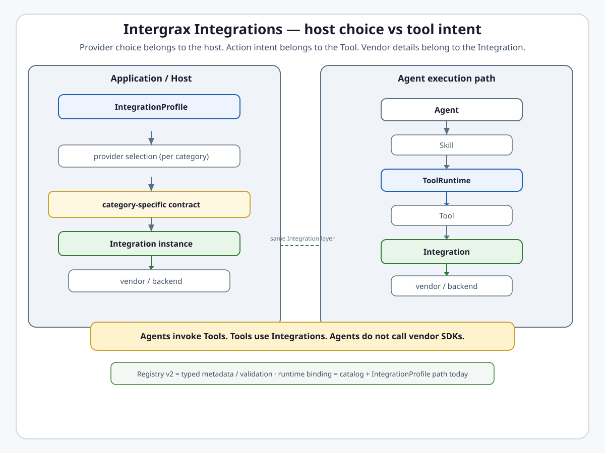
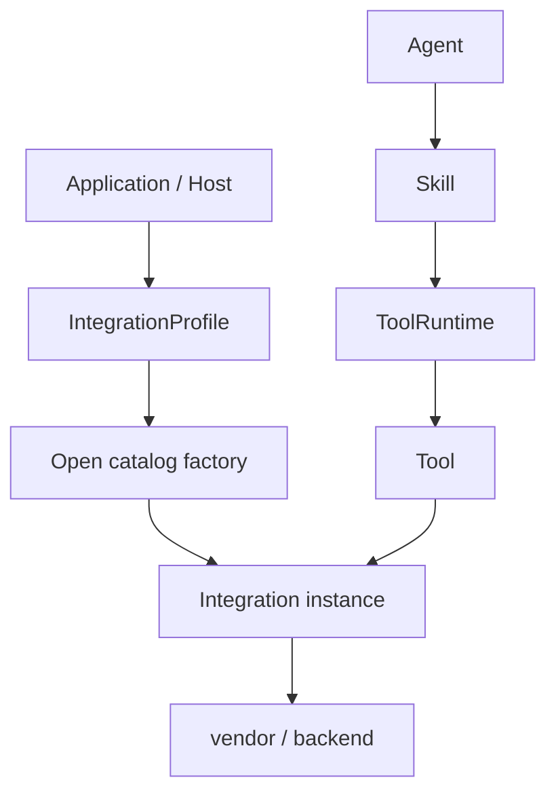

# Intergrax Integrations

**Intergrax Integrations** are typed provider boundaries that connect platform capabilities to concrete backends — databases, caches, vector stores, observability vendors, collaboration suites, and similar — **without exposing vendor SDK details to agents or application logic**.

## Why it matters

Without an Integration layer:

- Tools import vendor SDKs directly,
- agent and application logic know which backend is wired,
- changing Jira to another issue tracker forces agent rewrites,
- provider config and secrets scatter across the codebase,
- health, capabilities, and security posture lack a shared contract,
- provider classes grow into multi-category monoliths,
- and provider compatibility is hard to gate uniformly.

Integrations address this through **`PlatformIntegrationContract`**, category-specific contracts, provider/category identity, **`IntegrationProfile`** host selection, typed provider classes, a single public entrypoint per category, and a plugin/catalog model with safe config and security boundaries.

> [!NOTE]
> **Maturity boundary:** Broad **contract migration** and **runtime cutover** exist across **186** provider/category slugs (gate-tested), with **9** deferred `llm_guardrail` slugs. That is **not** 186 production-qualified vendor deployments. Catalog scale ≠ production qualification. See [Current maturity](#current-maturity) and [Evidence / proof](#evidence--proof).

**Primary audience:** Principal / Staff engineers, harness integrators, and extension authors wiring `IntegrationProfile`, provider packages, or third-party `IntegrationPlugin` paths — after the platform overview in the root README.

## At a glance

| Concern | Summary |
| -------- | -------- |
| **Responsibility** | Typed provider/backend binding behind platform capabilities |
| **Host selection** | Tier-3 `IntegrationProfile` chooses provider per category — not the agent |
| **Public base contract** | `PlatformIntegrationContract` — identity, typed config, capabilities, security posture, health, safe `public_view()` |
| **Category contract** | One contract per provider category (e.g. `VectorStoreIntegrationContract`) |
| **Provider identity** | `provider_id` — shared backend/vendor identity (e.g. `elasticsearch`) |
| **Category identity** | `integration_kind` / folder category — role (e.g. `vector_store`, `observability_vendor`) |
| **Integration identity** | `integration_id` = `{provider_id}:{integration_kind}` |
| **Runtime resolution** | `IntegrationProfile` → open catalog `get_entry` / factory → Integration instance |
| **Registry v2** | Additive typed metadata registry — **not** universal runtime binding authority |
| **INTEGRATIONS-3B** | **Planned** — explicit registry-backed runtime binding not shipped |
| **Plugin extension** | `IntegrationPlugin` → catalog registration → profile enablement → factory construction |
| **Default enablement** | Contract config `enabled=false` by default; profile selection is explicit host opt-in |
| **Secrets / diagnostics** | Secrets stay in provider wiring; `public_view()` must not expose secrets |
| **Health** | Contract may expose health snapshot — readiness signal, not production SLO proof |
| **Failure semantics** | Category/policy dependent — observability export may be isolated; critical data paths may surface failure |
| **Tools relation** | `ToolRuntime` → handler → Integration → vendor |
| **Skills relation** | Skill → `tool_ids` → Tool → Integration — no vendor SDK in Skill |
| **RAG relation** | RAG owns retrieval semantics; Integrations supply vector/graph/search/parser backends |
| **Observability relation** | Sanitized export envelope → `ObservabilityVendorIntegrationContract` → OTLP/Langfuse/etc. |
| **Provider scale** | **195** catalog slugs · **186** runtime cutover slugs · **9** deferred `llm_guardrail` |
| **Deferred scope** | Nine `llm_guardrail` slugs (shared bundles layout; per-slug packages deferred) |
| **Maturity** | Four-axis statement in [Current maturity](#current-maturity) |

## Flagship architecture visual

<picture>
  <source media="(prefers-color-scheme: dark)" srcset="assets/integration-boundary-dark.svg">
  <source media="(prefers-color-scheme: light)" srcset="assets/integration-boundary-light.svg">
  
</picture>

**Mental model:**

```text
Provider choice belongs to the host.
Action intent belongs to the Tool.
Vendor details belong to the Integration.
```

```text
Agent
  ↓
Skill
  ↓
ToolRuntime
  ↓
Tool
  ↓
category-specific Integration contract
  ↓
Integration implementation
  ↓
vendor / backend
```

```text
Application / Host
       ↓
IntegrationProfile
       ↓
provider selection
       ↓
Integration instance
```

> **Agents invoke Tools. Tools use Integrations.**

> **Agents do not call vendor SDKs.**

## Integration ≠ Tool ≠ Skill ≠ Agent

| Concept | Meaning |
| ------- | ------- |
| **Integration** | Concrete backend/vendor binding for a platform category |
| **Tool** | Executable platform operation (`tool_id`, schema, handler) |
| **Skill** | Reusable capability requirements and tool composition |
| **Agent** | Reasoning/decision module — proposes tool intent, not vendor calls |

**Example:**

```text
Jira Integration
  → jira.search_tasks Tool
  → issue_triage Skill
  → Support Agent
```

The agent does **not** invoke a Jira client directly.

> **Same provider, different category → different Integration class.**

## How it works

### Host provider selection

1. Tier-3 application or host composes an **`IntegrationProfile`** with typed category slots (manifest, plugin class, slug, or pre-built instance).
2. **`IntegrationProfile.resolve(category)`** calls **`resolve_from_profile`** → open catalog resolution.
3. Resolution order for slug selection: **explicit slug** → **profile binding** → **cloud-platform defaults (when configured)** → **`INTERGRAX_INTEGRATION_<CATEGORY>` env** → **configuration error**.
4. Catalog **`get_entry(slug)`** validates category membership and invokes the provider **`factory`** (compatibility shim delegating to the Integration class).
5. Tool handlers receive wired Integration instances through **`ToolWiringContext`** — not through agent code.

### Agent-side effects

1. Agent proposes tool intent (via Skill bindings and `AgentContract`).
2. **`ToolRuntime`** enforces policy, validation, and trace.
3. Tool handler uses the resolved Integration for backend-specific behavior.



### Registry v2 (metadata path)

**`IntegrationRegistry` v2** (`intergrax/runtime/integrations/registry_v2.py`, INTEGRATIONS-3A) registers typed **`(provider_id, category)`** metadata — contract class, integration class, factory reference, capabilities, security posture — for validation and inspection.

> **Registry v2 is not automatically the runtime binding authority.**

Runtime construction today remains:

```text
IntegrationProfile
  → existing open catalog / factory resolution
  → Integration instance
```

**INTEGRATIONS-3B** (explicit registry-backed runtime binding) is **planned** — not shipped. Do not assume `registry_v2` replaces `IntegrationProfile` + catalog factories until 3B lands.

## Responsibility boundaries

### Integrations own

- Vendor/backend protocol adaptation behind category contracts,
- typed provider config and capability declaration,
- security posture and safe operator-facing `public_view()`,
- health/diagnostic snapshots where declared,
- translation of backend errors into platform error types,
- one Integration class per `(provider_id, category)` role.

### Integrations do not own

- Agent reasoning or orchestration loops,
- Tool permission policy (Tools + Governance),
- RAG retrieval ranking semantics (RAG domain),
- LLM model invocation protocol (LLM Adapters),
- business/product workflow decisions,
- direct agent invocation surfaces.

### Host / Tier-3 owns

- Which provider slug or plugin is selected per category,
- secrets and operator credentials (never in manifests or plugin metadata),
- production deployment, SLO, and runbook qualification.

## Relationship to Intergrax

| Neighbor | Boundary |
| -------- | -------- |
| [**Tools**](TOOLS.md) | Tool owns operation semantics; Integration owns provider-specific backend behavior behind handlers |
| [**Skills**](SKILLS.md) | Skill composes `tool_ids`; must not depend on vendor SDK or raw provider client |
| [**RAG**](RAG.md) | RAG owns ingest/retrieval semantics; Integrations supply vector store, graph store, search, parser, reranker backends |
| [**Observability**](OBSERVABILITY.md) | Observability pipeline → sanitized `ObservabilityExportEnvelope` → vendor Integration; export failure isolation is observability-specific |
| [**LLM Adapters**](LLM_ADAPTERS.md) | LLM Adapters own model invocation; Integrations own platform backend categories — separate catalogs |
| [**CodeCraft**](CODE_CRAFT.md) / Sandbox | `sandbox_host` Integration supplies hosted sandbox backend; CodeCraft owns craft lifecycle |
| [**Governed Execution**](GOVERNED_EXECUTION.md) | Policy/HITL on tool and side-effect paths; Integrations do not grant business permission |

**RAG mental model:**

```text
RAG        → semantic retrieval subsystem
Integration → provider substrate (vector store, parser, search, …)
```

**Observability example:**

```text
Observability pipeline
  → sanitized export envelope
  → ObservabilityVendorIntegrationContract
  → OTLP / Langfuse / Elasticsearch / …
```

## Extensibility

### First-party providers

Canonical package layout under `intergrax/integrations/providers/<category>/<slug>` — see [Provider package pattern](#provider-package-pattern-integrations-2b-follow-up) in engineering canon.

### Third-party plugins

| Item | Value |
| ---- | ----- |
| Protocol | `IntegrationPlugin` (`intergrax.integrations.core.plugin`) |
| Manifest | `IntegrationManifest` |
| Register | `register_integration_plugin()` · EP group `intergrax.integrations` |
| Enablement | Host `IntegrationProfile` slot + secrets — import/discovery ≠ automatic runtime enablement |
| Registry v2 | Metadata built from first-party package conventions today; third-party drop-in registry binding **not** automatic |

```text
external IntegrationPlugin
  → catalog registration
  → IntegrationProfile binding
  → profile.resolve → catalog factory path
```

Quickstart: [`EXTENSION_AUTHOR_GUIDE.md`](../technical/guides/EXTENSION_AUTHOR_GUIDE.md) §2 · example: `intergrax/integrations/examples/custom_memory_kv/`

## Current implementation state

| Track | Status |
| ----- | ------ |
| **INTEGRATIONS-1A** `PlatformIntegrationContract` | **Done** |
| **INTEGRATIONS-1B** observability vendor category | **Done** |
| **INTEGRATIONS-2A** category contracts (31 `SLUG_CATEGORY` folders) | **Done** |
| **INTEGRATIONS-2B–2D** provider package + contract migration | **Done** (9 `llm_guardrail` deferred) |
| **INTEGRATIONS-2E** single public Integration entrypoint / runtime cutover | **Done** — **186** slugs; legacy factories are shims |
| **INTEGRATIONS-3A** registry v2 metadata | **In progress** — additive registry shipped; not runtime authority |
| **INTEGRATIONS-3B** explicit runtime binding | **Planned** — not implemented |
| **IntegrationProfile** + catalog factory resolution | **Active canonical runtime path** |
| **Plugin path** | `IntegrationPlugin` + profile resolution — proven in unit tests |
| **INT-P8** dynamic selection / MCP gateway / workspace store | **Planned** — architecture only |

**Conformance gates:** `test_provider_runtime_cutover.py` (`CUTOVER_SLUGS`), `test_provider_category_contract_migration.py`, `test_contract_registry_v2.py`, config safety and public API/shim guards.

## Current maturity

Architecture maturity: **A4**  
Implementation maturity: **I4**  
Production readiness: **P2**  
Evidence maturity: **E3**

- **A4** — Clear Tool/Integration/Skill/Agent boundary; `PlatformIntegrationContract` + category contracts; `(provider_id, category)` identity; multi-category class discipline; `IntegrationProfile` host selection; provider package conventions; adjacent-domain boundaries documented; cutover and registry gates enforce architecture at scale. Not A5 — deferred `llm_guardrail` category, INT-P8 planned surfaces, and registry/runtime split remain.
- **I4** — Category contracts; **186**-slug runtime cutover; single public Integration entrypoint; active catalog/profile resolution; registry v2 additive metadata; plugin path; representative category runtime implementations. Not I5 — INTEGRATIONS-3B not shipped; registry v2 does not own runtime binding; nine `llm_guardrail` slugs deferred; multi-category metadata vs single-slug catalog paths coexist.
- **P2** — Harness/lab qualification on representative provider construction and Tool→Integration wiring; not representative customer production deployments, universal vendor SLO evidence, or runbook-backed operations (not P4).
- **E3** — Unit/gate tests (contract inheritance, registry v2, cutover completeness, config safety, plugin path, IntegrationProfile resolution). No dedicated Integrations-domain public proof in [`PROOFS.md`](../proofs/PROOFS.md); LKW exercises integrations only in **bounded** supporting-foundation scope.

### Catalog scale vs production qualification

| Contract / catalog proven (representative) | Not claimed as universal production qualification |
| -------------------------------------------- | ------------------------------------------------- |
| **186** runtime cutover slugs (gate-tested) | **186** live vendor deployments |
| **195** catalog slugs in `SLUG_CATEGORY` | Every slug operator-qualified in production |
| Category contract migration across 30 categories | Deferred **9** `llm_guardrail` per-slug packages |
| Registry v2 **190** `(provider_id, category)` metadata rows | Registry v2 as runtime resolver |
| OTLP/Langfuse/Qdrant/etc. harness paths | All providers customer-qualified |

> **Provider catalog scale ≠ production qualification.**

## Evidence / proof

| Evidence class | What exists | What it does not prove |
| -------------- | ----------- | ---------------------- |
| Architecture | This hub, [`satellites/INTEGRATIONS_provider_catalog.md`](satellites/INTEGRATIONS_provider_catalog.md), [`PROVIDER_CATEGORY_CONTRACTS.md`](../maintainers/plans/PROVIDER_CATEGORY_CONTRACTS.md) plan, extension guide | Production operation |
| Unit / gate | Contract inheritance, registry v2, `CUTOVER_SLUGS` cutover, completeness, config safety, public API/shim guards, `test_external_plugin.py` | Every provider live-qualified |
| Integration | `IntegrationProfile` resolution, representative provider construction, Tool→Integration wiring in harness tests | Full-harness Integration lifecycle at product scale |
| Public proof | **None** dedicated in [`PROOFS.md`](../proofs/PROOFS.md) | Integrations-domain E4/E5 |
| Production / customer | **None** cited for full domain qualification | Not E5 |

**Platform audit:** [`docs/audit_results/AUDIT_PROTOCOL.md`](../../audit_results/AUDIT_PROTOCOL.md).

## Go deeper

| Depth | Route |
| ----- | ----- |
| Engineering canon | [Below](#engineering-canon) |
| Provider catalog inventory | [`satellites/INTEGRATIONS_provider_catalog.md`](satellites/INTEGRATIONS_provider_catalog.md) |
| Implementation plan | [`maintainers/plans/INTEGRATIONS.md`](../maintainers/plans/INTEGRATIONS.md) |
| Provider-category contracts | [`maintainers/plans/PROVIDER_CATEGORY_CONTRACTS.md`](../maintainers/plans/PROVIDER_CATEGORY_CONTRACTS.md) |
| Extension author | [`EXTENSION_AUTHOR_GUIDE.md`](../technical/guides/EXTENSION_AUTHOR_GUIDE.md) §2 |
| Tools | [`TOOLS.md`](TOOLS.md) |
| Skills | [`SKILLS.md`](SKILLS.md) |
| RAG | [`RAG.md`](RAG.md) |
| Observability | [`OBSERVABILITY.md`](OBSERVABILITY.md) |
| LLM Adapters | [`LLM_ADAPTERS.md`](LLM_ADAPTERS.md) |
| CodeCraft | [`CODE_CRAFT.md`](CODE_CRAFT.md) |
| Maturity taxonomy | [`MATURITY_TAXONOMY.md`](../technical/guides/MATURITY_TAXONOMY.md) |
| Proofs | [`PROOFS.md`](../proofs/PROOFS.md) |

---

---

<a id="protocol-v22-provider-backend-abstraction-target-invariants-2026-08-18"></a>

## Protocol v2.2 provider/backend abstraction target invariants (2026-08-18)

Accepted Protocol v2.2 audit layer [`PROVIDER_BACKEND_ABSTRACTION`](../../audit_results/2026-08-18/PROVIDER_BACKEND_ABSTRACTION.md) (**FAIL**, 5 ACCEPTED findings). Canonical evidence: [`docs/audit_results/2026-08-18/`](../../audit_results/2026-08-18/README.md). Target state only — **not implemented**:

**Finding 02 — observability export boundary**

1. All external observability vendor I/O from platform/domain consumers flows through the canonical sanitized observability export/provider boundary or an explicitly equivalent canonical contract ([`AUDIT-20260818-PROVIDER_BACKEND_ABSTRACTION-02`](../../audit_results/2026-08-18/PROVIDER_BACKEND_ABSTRACTION.md)).
2. RAG/parser telemetry must not directly call Sentry/Langfuse/vendor APIs ([`AUDIT-20260818-PROVIDER_BACKEND_ABSTRACTION-02`](../../audit_results/2026-08-18/PROVIDER_BACKEND_ABSTRACTION.md)).
3. `source`/`error` metadata must cross the normal observability safety/export boundary before vendor delivery ([`AUDIT-20260818-PROVIDER_BACKEND_ABSTRACTION-02`](../../audit_results/2026-08-18/PROVIDER_BACKEND_ABSTRACTION.md)).

**Finding 03 — guardrail configuration ownership**

4. Generic host/platform guardrail profiles remain provider-neutral ([`AUDIT-20260818-PROVIDER_BACKEND_ABSTRACTION-03`](../../audit_results/2026-08-18/PROVIDER_BACKEND_ABSTRACTION.md)).
5. Vendor-specific configuration belongs to provider-owned typed configuration selected/resolved in composition ([`AUDIT-20260818-PROVIDER_BACKEND_ABSTRACTION-03`](../../audit_results/2026-08-18/PROVIDER_BACKEND_ABSTRACTION.md)).
6. `LlmGuardrailBackend` remains the behavior contract ([`AUDIT-20260818-PROVIDER_BACKEND_ABSTRACTION-03`](../../audit_results/2026-08-18/PROVIDER_BACKEND_ABSTRACTION.md)).
7. Do not encode new vendor-specific fields into generic shared profiles ([`AUDIT-20260818-PROVIDER_BACKEND_ABSTRACTION-03`](../../audit_results/2026-08-18/PROVIDER_BACKEND_ABSTRACTION.md)).

**Finding 04 — vendor-boundary governance**

8. Vendor-boundary governance must inspect high-level consumers rather than bless known vendor-call files through broad filename exceptions ([`AUDIT-20260818-PROVIDER_BACKEND_ABSTRACTION-04`](../../audit_results/2026-08-18/PROVIDER_BACKEND_ABSTRACTION.md)).
9. Explicit exceptions must correspond to genuine provider-owned boundaries or narrowly justified provider-specific tooling ([`AUDIT-20260818-PROVIDER_BACKEND_ABSTRACTION-04`](../../audit_results/2026-08-18/PROVIDER_BACKEND_ABSTRACTION.md)).
10. Proof must cover direct vendor imports/calls sufficiently to prevent the confirmed parser-trace bypass class ([`AUDIT-20260818-PROVIDER_BACKEND_ABSTRACTION-04`](../../audit_results/2026-08-18/PROVIDER_BACKEND_ABSTRACTION.md)).

The invariant is ownership-aware boundary enforcement — not a giant universal SDK blacklist as architecture.

Remediation tracked as **PBA-FIX-B** (findings 02, 04) and **PBA-FIX-C** (finding 03) in [plan](../maintainers/plans/INTEGRATIONS.md#protocol-v22-providerbackend-abstraction-remediation-2026-08-18). **Not implemented** by audit persistence.

## Engineering canon

**Status:** Canonical architecture (domain pair 1:1)  
**Hub:** [`intergrax_runtime_architecture.md`](intergrax_runtime_architecture.md)  
**Plan (1:1):** [`plan/INTEGRATIONS.md`](../maintainers/plans/INTEGRATIONS.md)  
**Target:** [`IDEAL_HARNESS_AI_ARCHITECTURE.md`](../technical/guides/IDEAL_HARNESS_AI_ARCHITECTURE.md)  
**Audit layers:** 13–14  
**Platform audit:** [`docs/audit_results/AUDIT_PROTOCOL.md`](../../audit_results/AUDIT_PROTOCOL.md)

### Cursor read scope (token budget)

**Do not read this entire file in one session** (INTEGRATIONS canon).

- **Implement / audit default:** IntegrationLayer contract + wiring + checklists (hub). Provider catalog: [`satellites/INTEGRATIONS_provider_catalog.md`](satellites/INTEGRATIONS_provider_catalog.md).
- **Use** table of contents below — `Read` with offset/limit per §.
- **Plan hub:** [`plan/INTEGRATIONS.md`](../maintainers/plans/INTEGRATIONS.md) (scoped §6 only).
- **Platform audit:** [`docs/audit_results/AUDIT_PROTOCOL.md`](../../audit_results/AUDIT_PROTOCOL.md).
- **Max reads:** at most **one** file >5k tokens per session unless RESUME cites more.

### Architecture satellites (read on demand)

Large § blocks moved out of the architecture hub to reduce Cursor context use.
Load **only** the satellite matching your task or cited §.

| Satellite | Contents |
|-----------|----------|
| [`satellites/INTEGRATIONS_provider_catalog.md`](satellites/INTEGRATIONS_provider_catalog.md) | provider catalog |

> **Cursor context budget:** read hub read-scope block + **at most one** satellite per session.

### Platform integration contract (Tier-1 runtime)

**Code:** `intergrax/runtime/integrations/contracts.py` · **Task:** INTEGRATIONS-1A  
**Observability vendor category:** `intergrax/runtime/integrations/observability.py` · **Task:** INTEGRATIONS-1B  
**Provider category contracts:** `intergrax/runtime/integrations/categories` · **Task:** INTEGRATIONS-2A

All integration categories derive from or align with the generic **`PlatformIntegrationContract`**. Vendor adapters (Langfuse, Arize, Phoenix, Elasticsearch, OTLP backends, and future custom backends) are **integrations**, not isolated ad-hoc exporters or one-off SDK wrappers.

#### Core types

| Type | Role |
|------|------|
| **`PlatformIntegrationContract`** | Generic typed base contract |
| **`PlatformIntegrationConfig`** | Explicit opt-in config (`enabled=false` by default) |
| **`PlatformIntegrationKind`** | Integration category discriminator |
| **`PlatformIntegrationCapability`** | Declared capability tokens |
| **`PlatformIntegrationSecurityPosture`** | Default-safe exposure rules |
| **`PlatformIntegrationHealth`** | Lightweight health/check snapshot |

Shared concerns on the base contract: identity (`integration_id`, `provider_id`, `integration_kind`), typed config, capabilities, security posture, health/diagnostics, safe `public_view()`, and default disabled posture on generic config objects.

#### Provider identity vs integration kind

**`provider_id`** identifies the shared vendor or backend (for example `elasticsearch`). **`integration_kind`** identifies the category role (for example `observability_vendor`, `vector_store`, `search_provider`). They are **separate**:

- Same **`provider_id`** may appear in many categories.
- Each category gets its **own integration class** and **`integration_id`** (`{provider_id}:{integration_kind}`).
- **Do not** build one multi-category “monster” class that inherits unrelated category contracts.

**Example (Elasticsearch):**

| Integration class | `provider_id` | `integration_kind` |
|-------------------|---------------|-------------------|
| `ElasticsearchObservabilityIntegration` | `elasticsearch` | `observability_vendor` |
| `ElasticsearchVectorStoreIntegration` | `elasticsearch` | `vector_store` |
| `ElasticsearchSearchIntegration` | `elasticsearch` | `search_provider` |

Category-specific contracts (for example **`ObservabilityVendorIntegrationContract`**, **`VectorStoreIntegrationContract`**) **derive from** **`PlatformIntegrationContract`** — they do not replace it.

**Mental model:**

```text
PlatformIntegrationContract
       ↓
VectorStoreIntegrationContract
       ↓
PineconeVectorStoreIntegration
```

#### Observability vendor integration category (INTEGRATIONS-1B)

**Code:** `intergrax/runtime/integrations/observability.py`

Observability backends (Langfuse, Arize, Phoenix, Elasticsearch, OTLP-oriented vendors, custom sinks) are **observability vendor integrations** — not ad-hoc exporters or one-off SDK wrappers. Concrete adapters must subclass **`ObservabilityVendorIntegrationContract`**, which **derives from** **`PlatformIntegrationContract`**.

| Type | Role |
|------|------|
| **`ObservabilityVendorIntegrationContract`** | Category base contract; satisfies **`ObservabilityExporter`** via `export()` |
| **`ObservabilityVendorIntegrationConfig`** | Typed opt-in config (`enabled=false` by default) |
| **`ObservabilityVendorSignal`** | Declared signal families (`events`, `logs`, `traces`, `metrics`, `llm_events`) |
| **`ObservabilityVendorPayload`** | Vendor-neutral payload mapped from policy-sanitized envelopes |
| **`ObservabilityVendorMappingResult`** | Envelope → payload mapping result |

**Input boundary:** vendor integrations accept only **`ObservabilityExportEnvelope`** records that have already passed **`ObservabilityExportPolicy`** / **`try_export_observability_envelope`**. They consume **`sanitized_application_attributes`** only — never raw **`application_attributes`**, never **`RuntimeEvent`** raw payloads, and never bypass export policy.

**Why not ad-hoc exporters:** **`OtlpObservabilityIntegration`** (INTEGRATIONS-1C) is the first concrete observability vendor integration — it subclasses **`ObservabilityVendorIntegrationContract`** and wraps the lower-level **`OtlpObservabilityExporter`** / **`OtlpTransport`** delivery path. Future Langfuse/Arize/Phoenix/Elasticsearch adapters share identity, capabilities, health, failure isolation posture, and mapping through this contract — one integration class per category, not scattered SDK calls from runtime hot paths.

**JSONL classification:** **`JsonlObservabilityExporter`** is a **local file export sink**, not a remote observability vendor integration. It remains a transport-oriented exporter until a separate local-sink integration contract is introduced (if needed). Do not classify JSONL as **`ObservabilityVendorIntegrationContract`**.

**OTLP concrete integration (INTEGRATIONS-1C):**

| Type | Role |
|------|------|
| **`OtlpObservabilityIntegration`** | First concrete observability vendor integration; `provider_id=otlp` |
| **`OtlpObservabilityIntegrationConfig`** | Typed opt-in config for OTLP integration |
| **`OtlpObservabilityExporter`** | Lower-level OTLP mapper/exporter (implementation detail behind integration) |
| **`OtlpTransport`** / **`OtlpHttpTransport`** | Lower-level OTLP delivery (implementation detail behind integration) |

Explicit operator wiring (**`build_otlp_observability_integration`**, **`build_otlp_observability_exporter`**, **`build_otlp_observability_export_runtime_plugin`**) constructs the integration-backed OTLP path — no global bootstrap registration.

#### Provider category contract layer (INTEGRATIONS-2A)

**Code:** `intergrax/runtime/integrations/categories` · **Registry:** `PROVIDER_CATEGORY_CONTRACT_REGISTRY`  
**Taxonomy source:** `intergrax/integrations/providers/layout.py` (`SLUG_CATEGORY`)

Each provider folder under `intergrax/integrations/providers/<category>` maps to a **category-specific integration contract** in Tier-1 runtime. Contracts derive from **`PlatformIntegrationContract`** and declare category-appropriate default capabilities. Config remains **disabled by default**; **`public_view()`** must not expose secrets.

| Module | Categories covered |
|--------|-------------------|
| `categories/data.py` | `relational_store`, `document_store`, `key_value_cache`, `graph_store` |
| `categories/messaging.py` | `message_bus`, `notification_channel`, `conversation_channel` — background task execution model: [`BACKGROUND_TASKS.md`](BACKGROUND_TASKS.md); conversation semantics: [`CONVERSATION_CHANNEL_CONTRACT.md`](CONVERSATION_CHANNEL_CONTRACT.md) (`slack` has Socket Mode/Web API runtime; other conversation providers remain unbound) |
| `categories/search.py` | `search_provider`, `rerank_provider` |
| `categories/storage.py` | `object_storage`, `vector_store` |
| `categories/devops.py` | `ci_cd`, `security_scanner`, `sandbox_host`, `workflow_orchestrator`, `cloud_platform` |
| `categories/collaboration.py` | `collaboration_suite`, `issue_tracker`, `wiki_knowledge` |
| `categories/ai.py` | `document_parser`, `vision_serving`, `ml_inference_host`, `model_serving_runtime`, `llm_guardrail`, `speech_provider` |
| `categories/security.py` | `secrets_store`, `identity_provider`, `feature_flag` |
| `categories/automation.py` | `browser_automation`, `billing_meter`, `crm` |

**Provider identity vs integration kind (mandatory):**

- **`provider_id`** — catalog slug (for example `elasticsearch`, `pinecone`).
- **`integration_kind`** — provider category string (for example `vector_store`, `observability_vendor`).
- **`integration_id`** — `{provider_id}:{integration_kind}` via `derive_platform_integration_id`.
- One provider may appear in **multiple categories** through **separate integration classes** — never one multi-category “monster” class.

**Observability backend alias (engineering note):** provider folder `observability_backend` aligns with **`ObservabilityVendorIntegrationContract`** (INTEGRATIONS-1B). Registry maps `observability_backend` → **`ObservabilityVendorIntegrationContract`**; runtime **`integration_kind`** remains `observability_vendor`. **`PlatformIntegrationKind.OBSERVABILITY_BACKEND`** documents the folder taxonomy; **`OBSERVABILITY_VENDOR`** remains the runtime integration kind.

**`PlatformIntegrationKind`:** extended with all `SLUG_CATEGORY` folder names. Legacy shorthand values (`search`, `storage`, `notification`) remain for backward compatibility.

**Removed category:** `interaction_surface` (INTERACTIONS-TAXONOMY-1). Non-vendor adapters (`lab_json`, `slash_command`) live under `intergrax/runtime/interactions`. Mailgun is `notification_channel`. Ollama is `model_serving_runtime` — see [`OLLAMA_PROVIDER_CLASSIFICATION.md`](OLLAMA_PROVIDER_CLASSIFICATION.md). Near-real-time bidirectional chat vendors use `conversation_channel` — see [`CONVERSATION_CHANNEL_CONTRACT.md`](CONVERSATION_CHANNEL_CONTRACT.md). Do not recreate a generic `interaction_surface`.

**Conversation vs notification (architecture example):** `notification_channel` = one-way/outbound event style; `conversation_channel` = bidirectional human↔app interaction. Slack may participate in both via **separate** Integration classes per category.

**Scope boundary (INTEGRATIONS-2A):** category contracts only — no concrete provider migration, no vendor SDK imports, no registry/bootstrap wiring in the 2A task itself.

**Provider package migration pattern (INTEGRATIONS-2B pilot):** adapt existing provider packages by adding a contract-based integration class (for example **`LangfuseObservabilityIntegration`**) inside the same slug folder. Do **not** duplicate providers or create parallel adapter packages. Keep legacy provider facades (for example **`ObservabilityBackend`** query APIs) backward-compatible when possible.

#### Provider package pattern (INTEGRATIONS-2B follow-up)

Canonical layout under `intergrax/integrations/providers/<category>/<slug>`:

| File | Responsibility |
|------|----------------|
| `integration.py` | **Hand-edited only** — concrete contract-based integration class, provider config, transport protocol, `provider_id`, supported signals/capabilities. No registry, manifest, bootstrap, or SDK imports unless isolated and optional. |
| `bundle.py` | **Factory facade** — exports legacy catalog factory and contract-based factory (`create_<slug>_integration`). May import `integration.py` types only to construct factories. No registry or network I/O. |
| `manifest.py` | **Metadata only** — slug, categories, status, `env_prefix`, description. No provider logic or client creation. |
| `register.py` | **Registry hook** — catalog registration via legacy factory; registry v2 metadata is built separately (INTEGRATIONS-3A) and does not replace this hook. |
| `__init__.py` | **Lazy public API** — factories and optional public integration types via `__getattr__`; no heavy imports or SDK loads. |
| `USAGE.md` | Operator docs — legacy facade vs contract-based integration, opt-in and transport requirements. |

**Generated vs hand-edited boundary:** maintenance provider shell generators (`wire_p2` through `wire_p7`) may (re)generate thin legacy shells for unmigrated providers. When `integration.py` exists, all canonical files are **preserved** — generators must not overwrite `integration.py` or strip contract factory exports from `bundle.py` / `__init__.py`. Migrated providers are safe from legacy scaffold overwrite.

**Rules:**

- One integration class per category — no multi-category monster classes.
- No duplicate provider adapters or parallel packages for the same slug.
- `enabled=True` without required transport/client must fail at construction time (`IntegrationConfigurationError`), not during export.
- Langfuse pilot (`observability_backend/langfuse`) is the reference implementation.

**INTEGRATIONS-2C (batch migration — Done):** all existing `observability_backend` provider packages migrated using the Langfuse pattern — no duplicate provider adapters or parallel packages. `integration.py` holds contract-based provider logic; `register.py` remains legacy catalog hook; `manifest.py` metadata-only. Legacy **`ObservabilityBackend`** factories and **`register_<slug>_integration`** hooks remain backward-compatible. Injectable transport only in contract path; no vendor SDK imports in `integration.py`; no production network transports in the migration task.

**INTEGRATIONS-2D (remaining categories — Done):** all non-`observability_backend` slugs with per-slug provider packages now follow the same layout — existing provider package + contract-based integration class in `integration.py`; legacy catalog factory preserved in `bundle.py`; **`register.py`** remains catalog hook. No duplicate provider adapters. Nine `llm_guardrail` slugs deferred (shared `bundles` layout). Completeness tests derive expected slugs from `SLUG_CATEGORY`.

**INTEGRATIONS-2E (runtime cutover — Done):** each provider/category exposes exactly **one** public entrypoint: `<ProviderPascal><CategoryPascal>Integration` in `integration.py`. Legacy catalog factories in `bundle.py` remain as **compatibility shims** that delegate to the Integration class; they must not return parallel public adapter/facade types. Former public adapters (e.g. `adapter.py` classes sharing the Integration name) are **removed or privatized** (`_ProviderRuntime`, `_ProviderBridge`). Private SDK clients, bridges, and mappers are allowed as implementation details only. Cut-over completeness tracked in `test_provider_runtime_cutover.py` (`CUTOVER_SLUGS` — **186** slugs derived from `SLUG_CATEGORY`, excluding 9 deferred `llm_guardrail` slugs).

**Mental model:**

```text
ProviderCategoryIntegration
  → canonical public provider class

legacy factory
  → compatibility shim
  → same Integration class
```

**Provider inline cutover (all categories):** after category contract migration, each `<category>/<slug>/integration.py` **owns** category catalog behavior. Public Integration classes must not hide catch-all runtime delegates behind `_backend`/`_runtime`, `__pydantic_private__`, or `__getattr__` runtime fallback. Historical factory names may remain as compatibility shims, but they must construct the Integration through typed clients/transports/bridges (`from_client()`, `from_store()`), not parallel private backend facades. Regression: `test_observability_legacy_delegation_removed.py` (observability) and `test_provider_legacy_delegation_removed.py` (remaining categories). **Deferred:** nine `llm_guardrail` slugs (shared bundles layout). Vector store integrations may use a typed `_inner: VectorStore | None` bridge via `from_store()` when wrapping existing RAG store implementations. This is an intentional category bridge, not a legacy runtime delegate, provided `_inner` is typed as `VectorStore`, no `__getattr__` fallback exists, no `_require_runtime()` exists, and public vector methods are explicit on the Integration class.

#### Contract registry v2 (INTEGRATIONS-3A)

**Code:** `intergrax/runtime/integrations/registry_v2.py`

Additive, contract-aware metadata registry. **Does not:**

- replace the existing open catalog,
- bootstrap providers globally,
- resolve runtime bindings for hosts,
- load secrets,
- or construct vendor clients at registration time.

**Does:**

- register **`(provider_id, category)`** identity,
- validate contract class / integration class / factory metadata,
- prevent duplicate registrations,
- reject `default_enabled=true` registrations,
- expose deterministic list/get inspection,
- build snapshots via `build_contract_registry()` (**190** rows today — multi-category providers register multiple categories).

**Deferred from registry v2 completeness:** nine `llm_guardrail` slugs until package normalization (INTEGRATIONS-2F).

**INTEGRATIONS-3B:** explicit integration binding / registry-backed profile resolution — **planned**, not implemented. Runtime remains **`IntegrationProfile` + open catalog factory** path.

#### Default safety and opt-in rules

- Integrations are **explicit opt-in** at the contract config layer — `PlatformIntegrationConfig.enabled=false` by default.
- Tier-3 **`IntegrationProfile`** selecting a provider slug/plugin is itself **explicit host configuration** — distinct from auto-enabled registry objects.
- **`PlatformIntegrationSecurityPosture`** defaults: no secret exposure, no raw payload exposure, sanitized diagnostics.
- **`public_view()`** on contract/config must remain safe for logs and operator UIs.
- **`expects_failure_isolation`** on **`PlatformIntegrationContract`** defaults to `true` as **declared posture metadata** — not automatic swallowing of every backend failure. Semantics are **category/policy dependent**:
  - observability export integrations align with export-policy isolation (`try_export_observability_envelope`),
  - critical relational/document store failures may surface to the caller and fail the task,
  - callers and category contracts own whether failure is isolated, retried, or propagated.
- Tier-0 catalog integrations (`intergrax/integrations`) remain separate; runtime category contracts compose platform behavior without duplicating the slug catalog.

### Third-party integration extension (developer path)

**Task:** PLATFORM-PLUGIN-DOCS-3 · **Quickstart:** [`EXTENSION_AUTHOR_GUIDE.md`](../technical/guides/EXTENSION_AUTHOR_GUIDE.md) §2 · **Example:** `intergrax/integrations/examples/custom_memory_kv/`

#### What Integration is (vs Tool)

Integrations are **infrastructure/provider backends** — databases, caches, object storage, vector stores, message buses, observability vendors, and similar. They supply typed clients to the host and to tools via `ToolWiringContext`. They are **not** agent-invokable operations (that is the **Tool** surface).

#### Public contract — third-party path only

| Item | Value |
|------|-------|
| Protocol | `IntegrationPlugin` (`intergrax.integrations.core.plugin`) |
| Manifest | `IntegrationManifest` (`intergrax.integrations.core.manifest`) |
| Methods | `integration_manifest()` · `create_integration(**kwargs)` |
| Register | `register_integration_plugin()` |
| EP group | `intergrax.integrations` |
| Runtime | `IntegrationProfile.resolve(IntegrationCategory.…)` |

**Not the third-party path:** first-party shipped providers use internal `manifest.py` + `create_*` factory + `register_from_manifest` bootstrap at scale. External authors implement `IntegrationPlugin` only.

#### Delivery modes

| Mode | Registration | When |
|------|--------------|------|
| External package | setuptools EP + discovery | Reusable pip-distributed provider |
| Host-embedded | `register_integration_plugin(cls)` | Single-application integration |

Same contract; different delivery. `pip install` ≠ discovered ≠ enabled ≠ production-qualified.

#### Configuration, secrets, and `env_prefix`

- Host selects provider per category on `IntegrationProfile` (plugin class, manifest, slug, or instance).
- Options: `IntegrationProfile.options={slug: {…}}` merged into factory kwargs.
- **Secrets:** host-owned — never in manifest, EP values, or plugin metadata.
- **`IntegrationManifest.env_prefix`:** domain-specific exception — factory may read env vars under that prefix. Do **not** generalize to Tool/Skill plugins.

#### Runtime resolution

```python
from intergrax.integrations.registry.profile import IntegrationProfile
from intergrax.integrations.contracts.base import IntegrationCategory
from intergrax.tools.registry.wiring import ToolWiringContext

profile = IntegrationProfile(key_value_cache=MyIntegrationPlugin)
cache = profile.resolve(IntegrationCategory.KEY_VALUE_CACHE)
ctx = ToolWiringContext.from_integration_profile(profile)
```

Resolution order (slug selection): explicit slug → profile binding → env → configuration error. Instance bindings bypass slug resolution and return the pre-built object directly.

#### Lifecycle ownership

No generic Platform Plugin shutdown API. The host owns process lifetime; integration factories may return pooled clients — document and perform category-specific cleanup in the adapter when required.

#### Failure and troubleshooting (summary)

| Issue | Error / signal |
|-------|----------------|
| Duplicate slug | `ValueError` from `register_integration` |
| Discovery off | `UnknownIntegrationError` at resolve |
| EP load failure | `PluginLoadError` |
| Unconfigured category | `IntegrationConfigurationError` |
| Category mismatch | `IntegrationCategoryMismatchError` |
| Qualification | Host gate — semantic approval, not attestation |

Full matrix: EXTENSION_AUTHOR_GUIDE §2 · tests: `tests/unit/integrations/test_external_plugin.py`

### Allowed integration responsibilities

Integrations **MAY**:

- wrap vendor SDKs or protocols,
- normalize request/response transport details,
- manage backend-specific authentication handoff,
- expose typed low-level operations to tools/platform services,
- translate backend errors into platform error types,
- support health checks,
- support capability discovery where appropriate,
- provide low-level clients for platform-owned services,
- handle retry only when it is backend/protocol-level and does not conflict with runtime retry policy.

Integration retries are **R0 — Backend/protocol** layer — [`RELIABILITY_FAILURE_AND_HITL.md`](RELIABILITY_FAILURE_AND_HITL.md#retry-layers). Must not duplicate R1–R4 retries or hide semantic failures from the Attempt Ledger.

### Disallowed integration responsibilities

Integrations **MUST NOT**:

- be invoked directly by agents,
- be invoked directly by Nexus graph nodes as side effects,
- decide which agent should run,
- manage global task lifecycle,
- own orchestration loops,
- own HITL approval,
- own business/product decisions,
- own prompt construction,
- own LLM calls unless the integration itself is explicitly an LLM provider adapter under the LLM adapter layer,
- write agent memory directly,
- emit private trace pipelines outside the observability spine,
- bypass ToolRuntime for agent-invokable side effects,
- implement product-specific workflows.

### Integration access paths

Correct access paths for integration use:

#### Agent-invokable side effects

```text
Agent -> Tool / Skill -> ToolRuntime -> Integration
```

#### Application intake / external surface

```text
External system -> Integration adapter -> Tier-3 intake surface -> UnifiedTaskRunner.run_task()
```

#### Platform service backend

```text
Platform service -> Integration adapter
```

**Examples:**

- RAG service may use a vector database integration.
- Memory service may use a database integration.
- Observability sink may use OTEL/Sentry/log integration.
- ToolRuntime may use Slack/Google/GitHub integration through a tool.

### Slack / Teams / collaboration adapters

Intergrax supports Slack and Teams as **interaction surfaces** — examples of collaboration adapters, not the definition of the integration layer.

Slack and Teams adapters **may** normalize external messages into tasks and send approved outputs back, but they **must not** own runtime orchestration.

They may provide:

- task intake
- notifications
- approval requests
- progress updates
- final responses
- interactive buttons
- user context
- channel context

#### Google Workspace knowledge direction (`GOOGLE-WORKSPACE-KNOWLEDGE-ARCH-1`)

`GoogleWorkspaceCollaborationSuiteIntegration` (`provider_id: google_workspace`, category: `collaboration_suite`) is the single public Google entrypoint. Knowledge use adds typed read surfaces and thin Vendor Knowledge adapters per source kind (`drive`, `docs`, `sheets`, `calendar`, `slides`, `mail`, `chat`) — not parallel public integrations. Architecture: [`KNOWLEDGE_SOURCE_INTEGRATIONS.md`](KNOWLEDGE_SOURCE_INTEGRATIONS.md) §13.8. Provider usage: [`../../intergrax/integrations/providers/collaboration_suite/google_workspace/USAGE.md`](../../../intergrax/integrations/providers/collaboration_suite/google_workspace/USAGE.md). Runtime tasks are **PLANNED**; execution follows the complete Slack Knowledge vertical.

**Correct:**

```text
Slack event -> integration adapter -> application intake -> UnifiedTaskRunner.run_task()
    -> Nexus Runtime -> Agent execution -> Nexus final result -> integration adapter sends response
```

**Incorrect:**

```text
Slack bot -> direct agent call -> private memory -> direct tool execution
Slack bot contains orchestration logic
Slack bot directly manages agents
Slack bot stores global task state
```

### Cursor review checklist

Before adding or modifying an integration, Cursor must verify:

- [ ] Is this truly an integration, not a tool, skill, agent or application?
- [ ] Is the integration backend/vendor-facing rather than agent-facing?
- [ ] Are side effects exposed to agents only through ToolRuntime?
- [ ] Are secrets handled through approved config/policy mechanisms?
- [ ] Does the integration avoid orchestration, HITL and product workflow ownership?
- [ ] Are backend errors normalized?
- [ ] Is observability routed through the platform spine ([`OBSERVABILITY.md`](OBSERVABILITY.md#observability-event-spine), [event ownership rules](OBSERVABILITY.md#event-ownership-rules))?
- [ ] Is retry limited to protocol/backend concerns and compatible with runtime retry?
- [ ] Is the integration wired through Tier-3 profile/config where required?
- [ ] Are maturity claims expressed through [`guides/MATURITY_TAXONOMY.md`](../technical/guides/MATURITY_TAXONOMY.md)?

### Adapter implementation checklist

Before implementing a new adapter, answer:

```text
1. What external system does it connect to?
2. What operations does it expose?
3. What permissions are required?
4. Is it read-only or write-capable?
5. What are risk levels?
6. What errors can happen?
7. What timeout/retry policy is needed?
8. What data should be logged?
9. What data must be protected?
10. Which tools or platform services may use it (not agents directly)?
```

Adapters should be generic and reusable.

### Phase INT-P8 — Dynamic Integration Selection & Agent Workspace Gateways (Planned)

**Status:** Architecture & plan only — **not shipped**  
**Plan (1:1):** [`plan/INTEGRATIONS.md`](../maintainers/plans/INTEGRATIONS.md) — Phase INT-P8  
**Catalog (planned slugs):** [`satellites/INTEGRATIONS_provider_catalog.md`](satellites/INTEGRATIONS_provider_catalog.md) — §INT-P8 planned categories

**Purpose:** Extend the mature integration catalog (**195** shipped slugs per `layout.py` · `SLUG_CATEGORY`, Full Harness LC **Done**) with **selection metadata**, **gateway-style connectors**, and **agent workspace backends** — without expanding the vendor catalog for its own sake.

#### Why INT-P8 (product value, not catalog padding)

| Mechanism | Need |
|-----------|------|
| Dynamic selection metadata + selection engine | Harness chooses provider by capability, risk, cost, locality, and task intent — not slug alone |
| `tool_protocol_gateway` / `mcp` | Controlled access to MCP ecosystem tools/resources through ToolRuntime |
| `api_connector` / `openapi_http` | Universal REST attachment without one provider per vendor |
| `workspace_store` / `local_workspace` | Policy-scoped agent working directory (distinct from `filesystem` object storage) |
| `code_repository` / `local_git` | Local repo analysis and controlled patches/commits without GitHub/GitLab dependency |
| `code_intelligence` / `sourcegraph` | Enterprise cross-repo code search (GitHub issue tracker ≠ code intelligence) |
| Tier-3 presets (INT-P8.9) | Composable stacks for local workspace, coding agents, enterprise API, MCP gateway |

#### Architectural boundaries (unchanged)

INT-P8 **does not** change tier boundaries or access paths:

```text
Agent -> Tool / Skill -> ToolRuntime -> Integration
```

- Integrations remain **backend/vendor-facing**; agents **MUST NOT** invoke integrations directly.
- MCP tools, OpenAPI write methods, workspace writes, git commits/patches — **all** side effects through **ToolRuntime** with policy/approval gates.
- INT-P8 **MUST NOT** add LLM providers, vector DBs, observability vendors, browser automation, or project-management SaaS without a product driver.

#### Invariants preserved by INT-P8

| Invariant | INT-P8 enforcement |
|-----------|-------------------|
| No direct agent → integration | MCP/OpenAPI/workspace/git exposed only via catalog tools + ToolRuntime |
| HITL on destructive / external write | `requires_human_approval`, `side_effect_level`, unsafe HTTP methods blocked by default |
| Explainable integration choice | Selection engine returns reason, ranked candidates, trace/diagnostic payload |
| Safe refusal | Engine may refuse when no safe integration matches constraints |
| Audit trail | All side effects logged through existing ToolRuntime / observability spine |
| Catalog honesty | Planned categories/slugs documented as **Planned** — not registered in `layout.py` until implementation PRs |

#### Planned new categories (summary)

| Category | First provider (planned) | Role |
|----------|-------------------------|------|
| `tool_protocol_gateway` | `mcp` | MCP server discovery, tool/resource listing, schema fetch, gated invocation |
| `api_connector` | `openapi_http` | OpenAPI-driven REST connector with schema validation and method risk classification |
| `workspace_store` | `local_workspace` | Root-scoped local workspace with path policy and gated writes |
| `code_repository` | `local_git` | Local Git read ops + approval-gated patch/commit (backend); Wave 2 `git.*` tools read-only only |
| `code_intelligence` | `sourcegraph` (optional later: `github_code`) | Read-only enterprise code search |

Selection metadata fields (INT-P8.1): `capabilities`, `operations`, `read_write`, `auth_type`, `required_scopes`, `data_sensitivity`, `latency_class`, `cost_class`, `locality`, `deterministic`, `side_effect_level`, `supported_task_intents`, `suitable_agent_types`, `supports_dry_run`, `supports_rollback`, `requires_human_approval`, `rate_limit_class`, `testability`, `selection_hints`, `risk`.

#### Product mapping (INT-P8 consumers)

| Product / agent class | INT-P8 mechanisms |
|----------------------|-------------------|
| Local Knowledge Workspace | `local_workspace_stack` — workspace + git + parser + vector |
| Dispute Simulation Workspace | workspace + document parser + local vector |
| Research agents | `openapi_http`, search/RAG slots (existing), selection metadata |
| Coding agents | `coding_agent_stack` — git + workspace + code intelligence + security scanner |
| Automation agents | `openapi_http`, MCP gateway, enterprise API stack |
| Enterprise assistant | `enterprise_api_stack`, identity, secrets, observability |
| Repo architecture audit agents | `local_git`, `sourcegraph`, semgrep (existing) |
| Document intelligence agents | workspace + document parser (existing) |

#### Explicit non-goals (INT-P8)

- No new LLM, vector DB, observability/eval, or browser automation providers
- No new project-management SaaS without product
- No LangChain/LlamaIndex/Zapier/Make.com integrations in first wave
- No Git **push** in first wave
- No direct agent invocation of MCP tools or OpenAPI write methods without ToolRuntime approval

**Implementation:** deferred to Phase INT-P8 tasks in [`plan/INTEGRATIONS.md`](../maintainers/plans/INTEGRATIONS.md) — architecture update first; no runtime catalog changes until per-task PRs.
