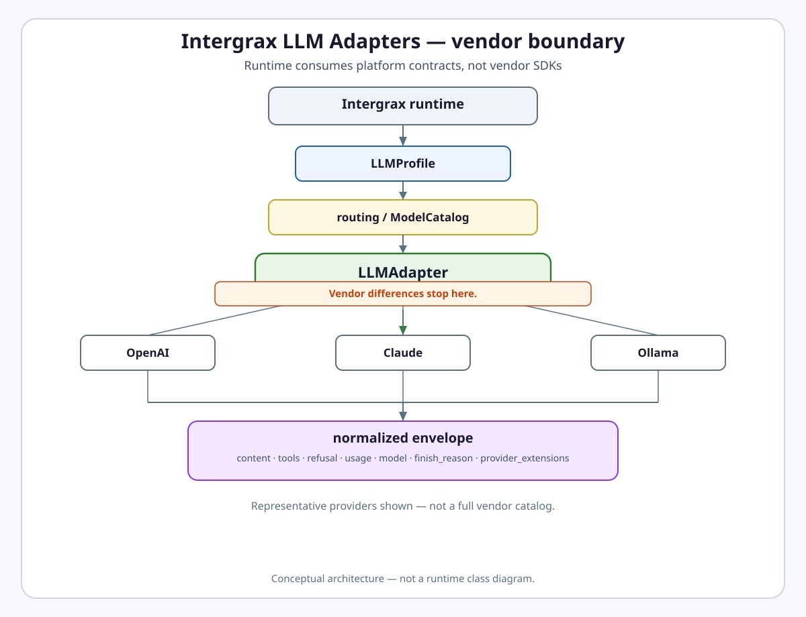
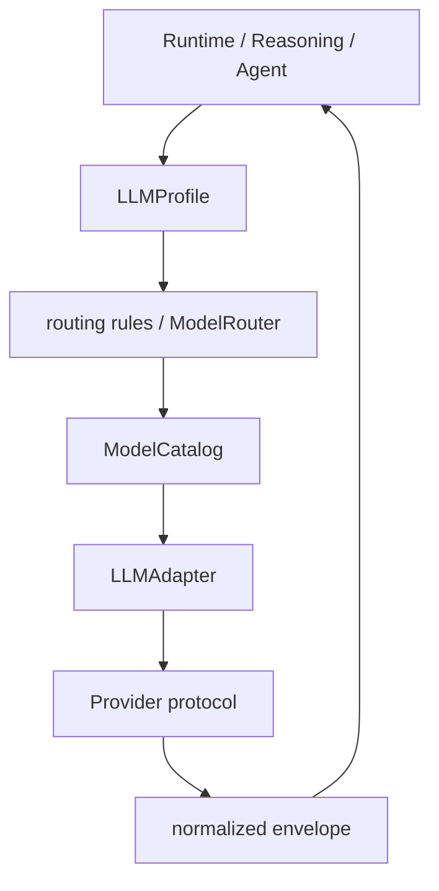

# Intergrax LLM Adapters

**Intergrax LLM Adapters** is the provider-neutral model boundary that normalizes generation, streaming, tool calls, structured outputs, refusals, usage, and model metadata behind one runtime contract.

## Why it matters

Without an adapter boundary, every agent imports a vendor SDK, every provider exposes different DTOs, tool calls use incompatible formats, finish reasons diverge, refusals can disappear, usage accounting differs, model switching requires agent changes, failover becomes provider-specific, and replay/observability lack a stable contract.

LLM Adapters solve this with a typed ABI, a normalized response envelope, a provider registry, profiles and routing, central model metadata (`ModelCatalog`), and conformance gates. **Vendor differences stop at the adapter boundary** — Reasoning, Context Engineering, Token Optimization, and agents consume platform contracts, not vendor-specific types.

> [!NOTE]
> **Maturity boundary:** Typed adapter ABI, `ModelCatalog`, routing/failover, native Ollama default, and conformance gates are **implemented** on the harness path (AUDIT-IDEAL §6 **Done**, M-LLM LC baseline **Done**). That is **not** universal production qualification: not every provider/model combination is production-qualified, streaming and tool parity vary by provider, unknown models may miss catalog metadata, and customer operational evidence is limited. See [Current maturity](#current-maturity).

**Primary audience:** Principal / Staff engineers, harness integrators, and extension authors wiring `LLMProfile`, routing rules, and custom adapters — after the platform overview in the root README.

## At a glance

| Concern | Summary |
| -------- | -------- |
| **Responsibility** | Provider-neutral model protocol — generate, stream, tools, structured output, usage, metadata |
| **Adapter ABI** | `generate_messages`, `generate_with_tools`, `stream_messages`, `stream_with_tools`, `generate_structured` |
| **Response envelope** | `LLMAdapterResponse` — content, finish_reason, usage, model/provider, refusal, tool_calls, provider_extensions |
| **Structured output** | `LLMStructuredResult[T]` — canonical Pydantic model is final validation contract |
| **Streaming** | `LLMStreamEvent` at same boundary; provider parity may differ |
| **Tool calls** | Provider-native calls mapped to `LLMToolCall`; execution belongs to Tools/ToolRuntime |
| **Provider selection** | `LLMProvider` built-ins + `LLMAdapterRegistry` lazy factories / `register()` extensions |
| **Model selection** | `LLMProfile.model` free string; profile = configured choice; routing selects between profiles |
| **Routing / failover** | `LLMRoutingEvaluator` → `ModelRouter`; `FailoverLLMAdapter` on retriable provider errors |
| **ModelCatalog** | Central `model_id` → context window, capabilities, cost/metadata signals |
| **Usage / cost** | `LLMTokenUsage` on envelope; aggregation/metrics consume envelope — not billing-grade by default |
| **Resilience** | Per-call timeout, retry, circuit breaker, quota; separate from profile failover chain |
| **Extension model** | Runtime `LLMAdapterRegistry.register(...)` **implemented**; full provider plugin ecosystem **planned** |
| **Reasoning relation** | Reasoning decides roles and which profile; adapters execute provider protocol |
| **Token / context relation** | Adapters supply tokenizer counts, context window, usage; CE/Token Opt consume signals |
| **Production boundary** | Harness-proven core path; bounded LKW model-runtime proof — not universal SLO evidence |
| **Maturity** | Four-axis statement in [Current maturity](#current-maturity) |
| **Go deeper** | [Engineering canon](#engineering-canon) · satellites · [plan](../maintainers/plans/LLM_ADAPTERS.md) |

## Flagship architecture visual

<picture>
  <source media="(prefers-color-scheme: dark)" srcset="assets/llm-adapter-boundary-dark.svg">
  <source media="(prefers-color-scheme: light)" srcset="assets/llm-adapter-boundary-light.svg">
  
</picture>

Runtime and agents call `LLMAdapter` — not OpenAI, Anthropic, or Ollama SDKs directly.

## How it works

At a high level, every model invocation follows this path:

1. **Profile** — Tier-3 `ApplicationEnvironmentProfile.llm_profile`, `ReasoningProfile.planner_llm_profile`, or env/host resolver yields an `LLMProfile` (provider + model + options).
2. **Routing** — optional `LLMRoutingProfile` rules and `ModelRouter` select or adjust the active profile from `RoutingContext` signals (budget, task class, step index, model hint).
3. **Catalog** — `ModelCatalog` resolves context window and capability metadata for budgeting and capability overlays (`CatalogCapabilityAdapter`).
4. **Adapter** — `LLMAdapterRegistry` creates the vendor adapter; vendor protocol maps to platform ABI.
5. **Call** — generation, streaming, tools, or structured output returns typed envelopes — never bare `str`.
6. **Failover** — on retriable provider failure, `FailoverLLMAdapter` may advance to the next profile in `fallback_profiles` (deterministic chain — not all error types).
7. **Consume** — runtime, observability, Context Engineering preflight, and Token Optimization read envelope usage and adapter metadata.



**Mental model:**

```text
provider = how to call
model    = what model to use
profile  = configured choice / policy
routing  = how runtime selects between profiles
```

## Adapter contract (public)

`LLMAdapter` does not return “just text.” Main method families:

| Family | Return |
| ------ | ------ |
| `generate_messages` | `LLMAdapterResponse` |
| `generate_with_tools` | `LLMAdapterResponse` |
| `stream_messages` / `stream_with_tools` | `Iterable[LLMStreamEvent]` |
| `generate_structured` | `LLMStructuredResult[T]` |

Vendor implementations in `intergrax/llm_adapters/providers/*` map provider protocol to this ABI. Agents and Tier-2 code must not import vendor LLM SDKs directly.

## Response envelope

`LLMAdapterResponse` normalizes completion metadata:

| Field | Role |
| ----- | ---- |
| `content` | Assistant text |
| `finish_reason` | Normalized `LLMFinishReason` (`REFUSAL`, `CONTENT_FILTER`, `LENGTH`, `TOOL_CALLS`, …) |
| `usage` | `LLMTokenUsage` per-call accounting |
| `model` / `provider` | Identity metadata |
| `refusal` | Provider-native safety/refusal text when present |
| `tool_calls` | `tuple[LLMToolCall, ...]` |
| `provider_extensions` | Tagged optional vendor slices (usage source, vendor fields) |

Normalization enables consistent observability, replay, quota, and downstream budgeting. **Feature parity is not identical** across providers — the contract is stable; capabilities vary.

## Structured output

```text
output_model[T]
      ↓
provider constrained / JSON response
      ↓
parse
      ↓
canonical validation
      ↓
LLMStructuredResult[T]
```

The canonical Pydantic `output_model` remains the **final validation contract**. Provider-specific schema projection may be generation-only (for example Ollama `json_schema` compilation). Certified paths use `generate_structured` — not manual `json.loads` on bare strings. Constrained generation improves grammar safety; it does **not** guarantee semantic correctness.

## Streaming

Streaming uses `LLMStreamEvent` at the same adapter boundary as non-stream paths. Provider streaming parity **may differ** — audit conformance marks streaming/tool-call streaming as **Partial** where provider-specific gaps remain. Do not claim full streaming parity across all providers.

## Tool calling boundary

```text
LLM Adapter  → describes tool call (LLMToolCall)
ToolRuntime  → executes tool
```

Provider-native tool calls map to `LLMToolCall`. Tool execution, policy, and sandboxing belong to [`TOOLS.md`](TOOLS.md) / `ToolRuntime` — the adapter normalizes the provider response; it does not run tools.

## Refusal and safety finish reasons

Adapters surface provider safety outcomes via `finish_reason` (`REFUSAL`, `CONTENT_FILTER`, …) and optional `refusal` text. **Governance/Policy** decides the platform response — the adapter reports the provider result; it does not own policy enforcement (except optional Tier-3 guardrail middleware when configured).

## Provider vs model vs profile vs routing

| Concept | Meaning |
| ------- | ------- |
| **Provider** | Transport/protocol integration (`LLMProvider` slug or registry extension) |
| **Model** | Free-string vendor model identifier on `LLMProfile.model` — no platform-wide model enum |
| **Profile** | `LLMProfile(provider, model, options)` — declarative configured choice |
| **Routing** | `LLMRoutingEvaluator` + `ModelRouter` select profile from rules and signals |

Several providers share OpenAI-compatible transport via `create_openai_compat_adapter()` — provider config stays explicit. Full provider table: [`satellites/LLM_ADAPTERS_providers_catalog.md`](satellites/LLM_ADAPTERS_providers_catalog.md).

## ModelCatalog

Central Tier-0 registry (**implemented** — AUDIT-IDEAL-6.3 **Done**):

```text
model id → ModelCatalog → context window → capabilities → cost/metadata signals
```

`resolve_context_window_tokens(provider, model, profile_options)` is the unified resolution path. Unknown or prefix-only matches may fall back to provider defaults — `ModelCatalogMissDiagV1` records misses for observability. The catalog is **not** a complete registry of every model in the world; operators can override via `LLMProfile.options["context_window_tokens"]`.

## Native Ollama vs LangChain compatibility

| Path | Status |
| ---- | ------ |
| **`NativeOllamaAdapter`** | **Canonical default** — `LLMProvider.OLLAMA` resolves here (LCI-6D cutover) |
| **`LangChainOllamaAdapter`** | **Optional compatibility** — `llm-langchain-ollama` extra; parity baseline and tests |

Live parity proof exists in **bounded scope** — partial/unreproducible rows in the parity matrix must not become universal parity claims. See feature satellite [`OLLAMA_NATIVE_ADAPTER_PARITY_MATRIX.md`](../capabilities/architecture/satellites/OLLAMA_NATIVE_ADAPTER_PARITY_MATRIX.md).

## Extension without core fork

```python
from intergrax.llm_adapters import LLMAdapterRegistry

LLMAdapterRegistry.register("my_gateway", my_factory, override=False)
```

Custom runtime adapter registration is supported today. This is **separate** from the planned full provider plugin layer (`LLMProviderRegistration`, deterministic discovery, health/security metadata, package registration — **Planned / Backlog**).

```text
Runtime adapter extensibility     → implemented
Full provider plugin ecosystem    → planned
```

## Responsibility boundaries

### LLM Adapters owns

- `LLMAdapter` ABI and typed response envelopes
- Provider registry and vendor mapping in `providers/*`
- `LLMProfile`, `ModelRouter`, routing rules, failover adapter
- `ModelCatalog`, context window resolution, capability overlays
- Token counting, per-call usage envelope, resilience hooks on adapter calls
- Conformance gates and vendor-import boundaries

### LLM Adapters does not own

- Tool execution — [`TOOLS.md`](TOOLS.md)
- Context assembly policy — [`CONTEXT_ENGINEERING.md`](CONTEXT_ENGINEERING.md)
- Token optimization policy — [`TOKEN_OPTIMIZATION.md`](../capabilities/architecture/TOKEN_OPTIMIZATION.md)
- Reasoning strategy and planner semantics — [`REASONING_AND_COGNITION.md`](REASONING_AND_COGNITION.md)
- Platform governance response to refusals — Governed Execution / Policy
- Billing-grade cost accounting without explicit evidence

### Applications (Tier-3) configure

- `ApplicationEnvironmentProfile.llm_profile`, `LLMRoutingProfile`, env defaults
- Optional `ReasoningProfile.planner_llm_profile` for separate planner adapter

## Planner ≠ producer

Model roles are separable:

- Primary producer → `RuntimeConfig.llm_adapter`
- Planner → optional `ReasoningProfile.planner_llm_profile` → `resolve_planner_llm_adapter()`
- Critic/judge → separate `LLMProfile` on critic paths ([`CRITIC_VERIFICATION.md`](CRITIC_VERIFICATION.md))

Reasoning owns **which role** and **which profile hint**; LLM Adapters own **provider-neutral execution**.

## Reasoning vs LLM Adapters

| Reasoning | LLM Adapters |
| --------- | ------------ |
| Decides what/why and which profile/model role | Executes provider-neutral model protocol |
| Planner/classifier semantics | Generation/stream/tools/structured ABI |
| Reasoning policy | Provider integration |

## ACP vs LLM Adapters

ACP hosts may request model hints within allowed boundaries; `StepLLMRouter` resolves hints against catalog and allowlists (AUDIT-IDEAL-6.6 **Done**). LLM Adapters resolve and call the provider via ABI — agents do not import vendor SDKs.

## Context Engineering vs LLM Adapters

Context Engineering decides **what context** enters the request. LLM Adapters count/serialize/send per provider protocol and expose `context_window_tokens` and `count_messages_tokens()` for preflight. Do not duplicate tokenizer logic in CE.

## Token Optimization vs LLM Adapters

Token Optimization consumes tokenizer-consistent counts, context window, usage envelope, cache signals, and model/cost metadata from adapters. Adapters should not implement feature-specific token optimization policy. **TOKEN-LLM-1** (guardrail that Token Opt consumes existing contracts only) remains **Planned**.

## Current maturity

Architecture maturity: **A4**  
Implementation maturity: **I4**  
Production readiness: **P2**  
Evidence maturity: **E3**

- **A4** — Stable provider-neutral ABI; routing/catalog/failover model; adjacent-domain boundaries; extension model documented; ADR-LLM-001..003; provider limitations represented in conformance and audit register.
- **I4** — AUDIT-IDEAL §6 **Done**; M-LLM LC baseline **Done**; `ModelCatalog` + `CatalogCapabilityAdapter`; live routing (M-LLM-X.9–16); profile failover (LC-3); `StepLLMRouter`; native Ollama cutover (LCI-6D); conformance gates. Not I5 — universal provider parity, full plugin ecosystem, and TOKEN-LLM-1 guardrail remain open.
- **P2** — Harness and lab qualification on core paths; bounded LKW model-runtime portability proof — not representative customer production qualification or universal SLO/cost evidence (not P4).
- **E3** — Unit/conformance gates, routing/failover tests, integration paths (resolver, planner adapter, context preflight, native Ollama parity in bounded scope), audit slice. Bounded public proof `LKW-MODEL-RUNTIME` — not E4 full-harness adapter-role proof across all surfaces; not E5.

> **Legacy vs taxonomy:** Audit-register labels such as **L4 enterprise** or **L5 strict** describe routing/catalog delivery waves — they are **not** taxonomy **P4** or public proof claims.

### Harness-proven vs production-qualified

| Harness-proven (representative) | Not claimed as universal production qualification |
| ------------------------------- | ------------------------------------------------- |
| Typed ABI, structured output, provider registry | Every provider/model combination production-qualified |
| ModelCatalog, context/token integration | Universal streaming parity |
| Routing, failover, quotas/resilience | Universal tool parity |
| Native Ollama default, multi-provider adapters | Every model known to ModelCatalog |
| Conformance gates | Universal SLO/cost evidence |
| | Customer production evidence |

## Evidence / proof

| Evidence class | What exists | What it does not prove |
| -------------- | ----------- | ---------------------- |
| Architecture | This hub, satellites (partial — see topology note), ADR-LLM-001..003 | Production operation |
| Unit / conformance | Typed returns, vendor import guard, structured output, provider conformance, routing/failover gates | Full harness on every path |
| Integration | Runtime resolver, planner separate adapter, context preflight token path, failover, native Ollama parity (bounded) | Universal provider parity |
| Public proof | **Bounded** — `LKW-MODEL-RUNTIME` in [`PROOFS.md`](../proofs/PROOFS.md) (Ollama/vLLM portability) | Dedicated LLM-adapters-only public proof route — **none** |
| Production / customer | **None** cited for full domain qualification | Not E5 |

**Platform audit:** [`docs/audit_results/AUDIT_PROTOCOL.md`](../../audit_results/AUDIT_PROTOCOL.md).

## Go deeper

| Depth | Route |
| ----- | ----- |
| Engineering canon | [Below](#engineering-canon) in this file |
| Routing / failover depth | [`satellites/LLM_ADAPTERS_routing_failover.md`](satellites/LLM_ADAPTERS_routing_failover.md) |
| Providers catalog | [`satellites/LLM_ADAPTERS_providers_catalog.md`](satellites/LLM_ADAPTERS_providers_catalog.md) |
| Audit register | [`satellites/LLM_ADAPTERS_audit_register.md`](satellites/LLM_ADAPTERS_audit_register.md) |
| Plan | [`maintainers/plans/LLM_ADAPTERS.md`](../maintainers/plans/LLM_ADAPTERS.md) |
| Developer USAGE | [`intergrax/llm_adapters/USAGE.md`](../../../intergrax/llm_adapters/USAGE.md) |
| Reasoning | [`REASONING_AND_COGNITION.md`](REASONING_AND_COGNITION.md) |
| Context Engineering | [`CONTEXT_ENGINEERING.md`](CONTEXT_ENGINEERING.md) |
| Token Optimization | [`TOKEN_OPTIMIZATION.md`](../capabilities/architecture/TOKEN_OPTIMIZATION.md) |
| Critic | [`CRITIC_VERIFICATION.md`](CRITIC_VERIFICATION.md) |
| ADR | [ADR-LLM-001](../technical/adr/entries/2026-06-06/ADR-LLM-001.md) · [ADR-LLM-002](../technical/adr/entries/2026-06-14/ADR-LLM-002.md) · [ADR-LLM-003](../technical/adr/entries/2026-06-19/ADR-LLM-003.md) |

---

## Engineering canon

**Status:** Canonical architecture (domain pair 1:1)  
**Hub:** [`intergrax_runtime_architecture.md`](intergrax_runtime_architecture.md)  
**Plan (1:1):** [`plan/LLM_ADAPTERS.md`](../maintainers/plans/LLM_ADAPTERS.md)  
**Target:** [`IDEAL_HARNESS_AI_ARCHITECTURE.md`](../technical/guides/IDEAL_HARNESS_AI_ARCHITECTURE.md) §3.5  
**Platform audit:** [`docs/audit_results/AUDIT_PROTOCOL.md`](../../audit_results/AUDIT_PROTOCOL.md).
**Platform audit:** [`docs/audit_results/AUDIT_PROTOCOL.md`](../../audit_results/AUDIT_PROTOCOL.md)**Developer guide:** [`intergrax/llm_adapters/USAGE.md`](../../../intergrax/llm_adapters/USAGE.md)  
**ADR:** [ADR-LLM-001](../technical/adr/entries/2026-06-06/ADR-LLM-001.md) (envelope) · [ADR-LLM-002](../technical/adr/entries/2026-06-14/ADR-LLM-002.md) (ModelCatalog) · [ADR-LLM-003](../technical/adr/entries/2026-06-19/ADR-LLM-003.md) (routing rules)

### Cursor read scope (token budget)

**Do not read this entire file in one session** (LLM_ADAPTERS canon).

- **Implement / audit default:** public front + adapter envelope + routing summary in this hub.
- **Failover / routing depth:** [`satellites/LLM_ADAPTERS_routing_failover.md`](satellites/LLM_ADAPTERS_routing_failover.md).
- **Providers:** [`satellites/LLM_ADAPTERS_providers_catalog.md`](satellites/LLM_ADAPTERS_providers_catalog.md).
- **Audit register:** [`satellites/LLM_ADAPTERS_audit_register.md`](satellites/LLM_ADAPTERS_audit_register.md).
- **Plan hub:** [`plan/LLM_ADAPTERS.md`](../maintainers/plans/LLM_ADAPTERS.md) (scoped §6 / open rows only).
- **Platform audit:** [`docs/audit_results/AUDIT_PROTOCOL.md`](../../audit_results/AUDIT_PROTOCOL.md).
- **Max reads:** at most **one** satellite per session unless RESUME cites more.

### Architecture satellites (read on demand)

| Satellite | Contents | Status |
| --------- | -------- | ------ |
| [`satellites/LLM_ADAPTERS_audit_register.md`](satellites/LLM_ADAPTERS_audit_register.md) | Audit register, routing wave maturity, open gaps | Present |
| [`satellites/LLM_ADAPTERS_providers_catalog.md`](satellites/LLM_ADAPTERS_providers_catalog.md) | Provider catalog (19 slugs), env wiring, observability | Present |
| [`satellites/LLM_ADAPTERS_routing_failover.md`](satellites/LLM_ADAPTERS_routing_failover.md) | Routing / failover depth | Present |

> **Cursor context budget:** read hub read-scope block + **at most one** satellite per session.

### Layer map

```text
Tier-3  ApplicationEnvironmentProfile.llm_profile  →  LLMProfile.create_adapter()
        LLMRoutingProfile.rules (M-LLM-X.9)          →  custom/built-in LLMRoutingRule classes
        ReasoningProfile.planner_llm_profile         →  separate planner adapter (COG-PROD)
        resolve_llm_adapter() precedence             →  agent > env > INTERGRAX_LLM_*

Tier-1  RuntimeConfig.llm_adapter                    →  single primary adapter per Nexus run
        LLMRoutingEvaluator (M-LLM-X.9)              →  first-match rule → ModelRouter
        context_preflight / engine_history_layer     →  adapter.context_window_tokens
        ModelRouter                                  →  selects profile before adapter create

Tier-0  LLMAdapterRegistry                           →  lazy provider factories
        ModelCatalog                                 →  model_id → context, capabilities
        providers/*                                  →  vendor SDK + envelope mapping
        tracking/ governance/ _shared/               →  metrics, quota, resilience, conformance
```

---

## Response envelope (M-LLM-R)

All adapter completion methods return typed envelopes — **not** bare `str` or untyped dicts.

| Method | Return type |
|--------|-------------|
| `generate_messages` | `LLMAdapterResponse` |
| `generate_with_tools` | `LLMAdapterResponse` |
| `stream_messages` / `stream_with_tools` | `Iterable[LLMStreamEvent]` |
| `generate_structured` | `LLMStructuredResult[T]` |

### `LLMAdapterResponse`

| Field | Type | Notes |
|-------|------|-------|
| `content` | `str` | Assistant text (alias: `.text`) |
| `finish_reason` | `LLMFinishReason` | Includes `CONTENT_FILTER`, `REFUSAL`, `LENGTH`, `TOOL_CALLS` — normalized via `parse_finish_reason()` |
| `usage` | `LLMTokenUsage` | Per-call token accounting |
| `model` / `provider` | `str` | Identity metadata |
| `response_id` | `str \| None` | Provider correlation id |
| `refusal` | `str \| None` | Provider-native safety/refusal text when present |
| *(post-adapter)* | `GuardrailScanResult` | Optional Tier-3 `llm_guardrail` via middleware (`AFTER_LLM_OUTPUT`) — [`INTEGRATIONS.md`](INTEGRATIONS.md) §47 |
| `tool_calls` | `tuple[LLMToolCall, ...]` | Native tool calls |
| `provider_extensions` | `LLMProviderExtensions` | Tagged optional slices (usage source, vendor fields) |

### Structured output (AUDIT-IDEAL-6.1 — Done)

`generate_structured(..., output_model: type[T])` returns `LLMStructuredResult[T]`. Adapters parse provider JSON and validate with Pydantic via `_validate_with_model()`. Reference agents and certified paths MUST use this method — not manual `json.loads` on bare strings. Gate: `check_agents_llm_adapter_response.py` + conformance tests under `tests/unit/llm_adapters`.

**Ollama generation schema projection:** the canonical Pydantic `model_json_schema()` remains the final validation contract. Native and compatibility adapters may pass a provider-compatible generation projection for constrained generation (see `intergrax/llm_adapters/providers/_ollama_schema.py`). The projection is generic, provider-specific, and may relax generation-only constraints. Returned payloads are always revalidated with the original `output_model`. The projection does not guarantee semantic correctness — only grammar-safe constrained generation.

**Ollama model-aware tool capabilities (TOKEN-9 / TOKEN-9-R1):** `NativeOllamaAdapter` and `LangChainOllamaAdapter` reflect installed model capabilities via `intergrax/llm_adapters/providers/ollama_capabilities.py` (no static model-name allowlist). Capability resolution is lazy, cached per adapter instance, and fail-closed. Unresolved capability state never enters structured-output fallback — Token Optimization router returns `CAPABILITY_RESOLUTION_FAILED`. Structured output remains fallback only for **resolved** models that genuinely lack `tools`. Ollama does not enforce `tool_choice`; the router still requires exactly one valid tool call. Not every Ollama model declares `tools` — there is no universal Ollama-tools claim.

**LCI-6A parity matrix:** [`OLLAMA_NATIVE_ADAPTER_PARITY_MATRIX.md`](../capabilities/architecture/satellites/OLLAMA_NATIVE_ADAPTER_PARITY_MATRIX.md) freezes native vs compatibility proof boundaries.

Example:

```python
from intergrax.llm_adapters import LLMAdapter, LLMAdapterResponse

completion: LLMAdapterResponse = adapter.generate_messages(messages, run_id=run_id)
answer = completion.content
if completion.usage:
    print(completion.usage.total_tokens)
for tc in completion.tool_calls:
    plan_args = tc.arguments_json
```

Build helpers: `intergrax/llm_adapters/_shared/adapter_response_builders.py`.  
Call lifecycle: `LLMCallLifecycle` in `intergrax/llm_adapters/_shared/call_lifecycle.py`.

### Trace and replay bridge (M-LLM-R.7.2)

- `intergrax/runtime/replay/trace_replay_bridge.py` — `serialized_trace_events_to_replay_dtos`
- `intergrax/runtime/replay/llm_call_mapper.py` — `llm_call_info_from_adapter_response`

### Adaptive harness hook (M-LLM-R.7.5)

Optional `LLMCallSummary` on `SignalAssemblyInput.last_llm_call` → `HarnessOutcomeSignal.last_llm_*`.

### CI guards

| Script | Purpose |
|--------|---------|
| `scripts/maintenance/check_llm_adapter_typed_returns.py` | ABC public methods must not return bare `str` / dict |
| `scripts/maintenance/check_agents_llm_adapter_response.py` | Tier-2 agents must not annotate adapter returns as `str` |
| `scripts/maintenance/check_agents_vendor_imports.py` | Tier-2 agents must not import vendor LLM SDKs directly |

### M-LLM-R as-built conformance (audit dimensions)

Re-validate per [`audit/LLM_ADAPTERS.md`](../../audit_results/LLM_ADAPTERS.md) §3:

| # | Dimension | Status | Evidence |
|---|-----------|--------|----------|
| 1 | Typed envelope (`LLMAdapterResponse` / `LLMStructuredResult`) | **Yes** | §Response envelope; `check_llm_adapter_typed_returns.py` |
| 2 | Agents do not treat LLM returns as bare `str` | **Yes** | `check_agents_llm_adapter_response.py` |
| 3 | Vendor SDK only inside `providers/*` | **Yes** | `check_agents_vendor_imports.py`; tier boundary §Design principles |
| 4 | Refusal / content filter surfaced | **Yes** | `refusal` field + `LLMFinishReason.CONTENT_FILTER` / `REFUSAL` |
| 5 | Streaming parity with non-stream paths | **Partial** | `LLMStreamEvent` contract; provider-specific tool-call streaming gaps |
| 6 | `LLMProfile` drives model selection | **Yes** | §Model selection; `resolve_llm_adapter()` |
| 7 | Token/cost on envelope + run aggregation | **Yes** | §Token accounting; Prometheus + `LLMUsageTracker` |
| 8 | Retries, timeout, circuit breaker | **Yes** | `LLMCallConfig`; §Resilience |
| 9 | Structured output schema validation | **Yes** | `generate_structured` + Pydantic; AUDIT-IDEAL-6.1 |
| 10 | Guardrail middleware when profile set | **Yes** | `AFTER_LLM_OUTPUT`; INTEGRATIONS §47 |
| 11 | Tenant scope + hard quota | **Yes** | `llm_tenant_scope`; `INTERGRAX_LLM_TENANT_MAX_TOKENS` |
| 12 | Metrics export on task complete | **Yes** | `runtime.llm_metrics_export` plugin; `/metrics/llm` |
| 13 | Attachments respect `ModalityProfile.max_media_bytes` | **Yes** | §Modality attachments |
| 14 | Capability flags from catalog when `ModelRecord` known | **Yes** | `CatalogCapabilityAdapter` + registry wire · M-LLM-X.14.1 |
| 15 | Secrets via `llm/<provider>/api_key` | **Yes** | §Secrets; `create_adapter_from_secrets_store()` |
| 16 | Replay bridge maps trace → adapter calls | **Yes** | §Trace and replay bridge |

**Planner ≠ producer (COG-PROD):** **Done** — `ReasoningProfile.planner_llm_profile` → `resolve_planner_llm_adapter()` (not an LLM-AUDIT open gap).

---

## Provider selection

### Mechanism

| Step | Component | Behavior |
|------|-----------|----------|
| 1 | `LLMProvider` enum | Canonical slug (`openai`, `claude`, `openrouter`, …) — 19 built-ins |
| 2 | `LLMAdapterRegistry` | Lazy import of adapter class; `register()` for extensions |
| 3 | `LLMProfile(provider=..., model=..., options=...)` | Declarative Tier-3 selection |
| 4 | Env defaults | `INTERGRAX_LLM_PROVIDER`, `INTERGRAX_LLM_MODEL` via `llm_profile_from_env()` |
| 5 | Host resolver | `resolve_llm_adapter(env, agent_override)` — agent factory > env profile > platform env |

### OpenAI-compatible cluster

Ten slugs share `OpenAIChatCompletionsAdapter` via `create_openai_compat_adapter()`:

`groq`, `vllm`, `together`, `fireworks`, `openrouter`, `deepseek`, `xai`, `llama_cpp`, `cohere`, `azure_ai_inference`

Each declares `OpenAICompatProviderConfig` (API key env, base URL, default model, optional per-model context map).

### Extension without forking core

```python
from intergrax.llm_adapters import LLMAdapterRegistry

LLMAdapterRegistry.register("my_gateway", my_factory, override=False)
profile = LLMProfile(provider="my_gateway", model="vendor/model-id")
```

Custom provider slugs validate against `LLMAdapterRegistry.registered_providers()` — no enum edit required (**M-LLM-X.14.3**).

### Provider plugin layer (planned — LLM-PROVIDER-PLUGIN-1)

Today's `LLMAdapterRegistry.register()` factory hook is sufficient for runtime extension but is **not** a full provider plugin system (no deterministic metadata snapshot, config/health/security posture contract, or package discovery parity with runtime integrations registry v2).

**Planned (Backlog, P2):** add a thin **`LLMProviderRegistration` / metadata contract** layer above `LLMAdapter` that registers provider packages, exposes safe public metadata, and factories `LLMAdapter` instances. **`LLMAdapter` remains the execution contract**; `LLMProvider` enum stays for stable built-ins. See plan [`LLM-PROVIDER-PLUGIN-1`](../maintainers/plans/LLM_ADAPTERS.md#phase-llm-provider-plugin--provider-plugin-registration-layer-backlog).

### When to use `openrouter`

`openrouter` is the **multi-vendor escape hatch**: one provider slug, arbitrary upstream model strings (`anthropic/claude-opus-4`, …). Context windows resolve via bundled **`ModelCatalog`**, optional **`fetch_gateway_metadata`** merge, or profile override. When no **exact** catalog entry matches, **`ModelCatalogMissDiagV1`** is recorded (including `provider_default` for unknown OpenRouter ids) on Plane A trace (`llm_catalog_miss`), runtime bus (`LLM_CALL`), and Prometheus (`intergrax_llm_catalog_miss_total` when metrics enabled).

### Ollama default path (LCI-6D / LCI-6E)

| Adapter | Resolution |
| ------- | ---------- |
| `NativeOllamaAdapter` | **Default** for `LLMProvider.OLLAMA` registry entry |
| `LangChainOllamaAdapter` | Explicit construction; `llm-langchain-ollama` optional extra |

Provider catalog satellite may lag native cutover — hub and plan LCI-6 rows are authoritative for default path.

---

## Model selection

### Rules

- **`LLMProfile.model`** is a **free string** — no platform model enum.
- New vendor models work **immediately** for API calls; **context budgeting** depends on catalog resolution (§Model catalog).
- Per-step hints (ACP): `StepLLMRouter.resolve_model(model_hint)` backed by catalog + `LLMAdapter` (**Done** — AUDIT-IDEAL-6.6 / M-LLM-X.5.4).
- Planner ≠ producer: `ReasoningProfile.planner_llm_profile` → `resolve_planner_llm_adapter()` in `nexus_factory.py`.

### Precedence (single Nexus run)

```text
1. RuntimeConfig.llm_adapter          — primary producer (one instance today)
2. resolve_planner_llm_adapter()      — optional separate planner adapter
3. CriticProfile / EvaluationProfile  — separate LLMProfile for judge paths (CRITIC_VERIFICATION)
4. ModelRouter + fallback_profiles    — runtime selection before adapter create (Done — M-LLM-X.4)
```

---

## Routing and failover

### Routing (current)

```text
candidate profiles / rules
      ↓
RoutingContext snapshot (budget, task_class, step_index, model_hint, …)
      ↓
LLMRoutingEvaluator (first-match rule)
      ↓
ModelRouter
      ↓
selected LLMProfile
      ↓
adapter create
```

Live cost/latency/quality routing on AHI product paths is **wired** (AUDIT-IDEAL-6.2 **Done**) — routing uses **declarative rules and approved profiles**, not autonomous “pick best model” without policy. `RoutingEvaluatingLLMAdapter` re-evaluates before calls on core Nexus/UAEP paths (M-LLM-X.11–12 **Done**).

**ADR:** [ADR-LLM-003](../technical/adr/entries/2026-06-19/ADR-LLM-003.md). Built-in rule catalog + custom `LLMRoutingRule` Protocol (M-LLM-X.9–10 **Done**). Deep rule register: audit register satellite.

### Failover (current)

```text
primary profile
      ↓
adapter call
      ↓
retriable provider failure? (e.g. 429, 502, 503, timeout)
   yes ↓
fallback profile (ordered chain)
```

`FailoverLLMAdapter` + `LLMProfile.create_adapter_with_failover()` (**Done** — AUDIT-IDEAL-6.5 / LC-3). Failover applies to **retriable provider errors** on the profile chain — not every failure type. Non-retriable errors must not be masked. Policy/order is deterministic and profile-driven.

**Separate layers:** per-call resilience (`LLMCallConfig` retry/timeout/circuit breaker) vs profile failover chain — do not merge.

---

## Model catalog and context window

### Current architecture — `ModelCatalog` (AUDIT-IDEAL-6.3 — Done)

Central Tier-0 registry:

```text
intergrax/llm_adapters/registry/model_catalog.py   — resolve API
intergrax/llm_adapters/registry/model_catalog.yaml — bundled defaults
intergrax/llm_adapters/registry/context_window.py  — resolve_context_window_tokens
```

#### `ModelRecord` (frozen)

| Field | Type | Required | Notes |
|-------|------|----------|-------|
| `model_id` | `str` | yes | Exact or normalized id |
| `context_window_tokens` | `int` | yes | Input + output budget for Nexus |
| `supports_vision` | `bool` | no | Default false |
| `supports_tools` | `bool` | no | Default true for chat models |
| `supports_structured_output` | `bool` | no | |
| `provider_hints` | `tuple[str, ...]` | no | Slugs where this id is valid |
| `family_prefix` | `str \| None` | no | For prefix rules |

`CatalogCapabilityAdapter` overlays catalog capability flags on the concrete adapter returned by `LLMAdapterRegistry.create()` but does not erase provider-specific `model_capabilities` on the inner adapter. Consumers that need concrete capability state (for example Token Optimization router preflight) call `unwrap_catalog_capability_adapter()` for inspection only and keep using the outer wrapper for generation, tool calling, structured output, and usage accounting.

#### Resolution order (deterministic)

```text
1. LLMProfile.options["context_window_tokens"]     — operator override (authoritative)
2. ModelCatalog exact match on model_id
3. ModelCatalog prefix rules (family: claude-*, gpt-*, gemini-*, anthropic.*, meta-llama/*)
4. Provider adapter legacy dict (deprecated; shrink over time)
5. Provider family default from catalog (e.g. claude_default: 200_000)
6. Safe conservative default (documented per provider; emit diagnostic once)
```

All adapters call **`resolve_context_window_tokens(provider, model, profile_options)`** at construction — **one code path**.

**Honest limitations:** unknown models may hit prefix or provider defaults; operator override remains authoritative. Catalog miss diagnostics (`ModelCatalogMissDiagV1`) feed trace and metrics (M-LLM-X.15–16 **Done**).

#### OpenRouter / dynamic metadata (M-LLM-X.2 — Done)

Optional fetch from OpenRouter `/api/v1/models` (or compatible gateway) with TTL cache; merge into catalog for session. Fail closed to prefix rules + profile override.

#### Operator override (required for self-hosted)

```python
LLMProfile(
    provider=LLMProvider.VLLM,
    model="my-custom-70b",
    options={"context_window_tokens": 131_072},
)
```

Profile `context_window_tokens` override propagates through unified resolution — not Ollama-only.

### Nexus consumers (unchanged contract, better input)

These read `adapter.context_window_tokens` — they **automatically benefit** from catalog accuracy:

- `resolve_input_budget_tokens()` — `context_budget.py`
- `verify_context_preflight()` — `context_preflight.py`
- `engine_history_layer` — history compression budget

**Context path rule:** Messages passed to `LLMAdapter.generate_messages` / `stream_messages` in production **SHOULD** originate from `ContextCompiler` / `ContextEngine` (or an explicitly approved equivalent) — not ad-hoc agent concatenation. See [`CONTEXT_ENGINEERING.md`](CONTEXT_ENGINEERING.md) §12 Context Path Unification.

**Tokenizer-consistent preflight (AUDIT-IDEAL-6.4 — Done):** `verify_context_preflight` defaults to **`adapter.count_messages_tokens`** when adapter is in scope.

---

## Token accounting

### Per-call (source of truth)

- `LLMAdapterResponse.usage` → `LLMTokenUsage` (prefer SDK counts; `provider_extensions.usage_source` when estimated)
- `LLMAdapter.count_messages_tokens()` → tiktoken with `model_name_for_token_estimation` hint

### Run / tenant aggregation

| Layer | Type | Owner |
|-------|------|-------|
| Adapter | `LLMAdapterUsageLog` | Per adapter instance |
| Runtime | `LLMUsageTracker` on `RuntimeState` | Nexus finalize |
| Metrics | Prometheus counters | `tracking/metrics.py` |
| Quota | `check_llm_tenant_quota` | `governance/quota.py` |

### Consistency rule

| Path | Behavior |
|------|----------|
| `verify_context_preflight` | **`adapter.count_messages_tokens`** (default) |
| `ContextBudgetPolicy` | **`from_adapter()`** factory available for Nexus compile paths |

**Rule:** Budgeting and preflight MUST use the same tokenizer path as the adapter when an `LLMAdapter` is in scope. Not billing-grade accounting unless explicitly qualified.

---

## Resilience

**Per-call (LLMCallConfig):** retries, timeout, in-process rate limit, circuit breaker, optional Redis distributed limit — `intergrax/llm_adapters/_shared/resilience.py`, `call_config.py`.

**Profile failover:** ordered `fallback_profiles` chain on retriable provider errors — §Routing and failover. These are **different layers**.

**Quota / tenant:** `check_llm_tenant_quota`, `INTERGRAX_LLM_TENANT_MAX_TOKENS` — hard stop; separate from adapter retry.

Detail: providers catalog satellite §Resilience & secrets; observability §Prometheus in same satellite.

---

## `LLMProfile` and Tier-3 wiring

```python
from intergrax.llm_adapters.registry import LLMProfile, llm_profile_from_env
from intergrax.llm_adapters.contracts.llm_provider import LLMProvider

profile = LLMProfile(
    provider=LLMProvider.GROQ,
    model="llama-3.3-70b-versatile",
    options={
        "max_retries": 2,
        "context_window_tokens": 128_000,
    },
)
llm = profile.create_adapter(secrets={"api_key": key})
```

### Profile fields (M-LLM-X.4 — Done)

| Field | Purpose |
|-------|---------|
| `provider` | `LLMProvider` or string slug |
| `model` | Vendor model id |
| `options` | Passed to adapter ctor + `LLMCallConfig` |
| `fallback_profiles` | Ordered list for failover chain |
| `routing_policy_hint` | `balanced` \| `cheapest` \| `fastest` \| `quality` |

### Secrets

- Env: per-provider keys (`OPENAI_API_KEY`, …) — see providers catalog satellite
- Vault: `llm/<provider>/api_key` via `SecretsStore` — `create_adapter_from_secrets_store()`
- Agents should not fetch API keys directly — use profile/secrets store wiring

---

## Prompt-cache provider capabilities (TOKEN-10 / TOKEN-LLM-2 / TOKEN-LLM-3)

**Cross-feature — Token Optimization:** [`features/architecture/TOKEN_OPTIMIZATION.md`](../capabilities/architecture/TOKEN_OPTIMIZATION.md) · [`features/plan/TOKEN_OPTIMIZATION.md`](../capabilities/plan/TOKEN_OPTIMIZATION.md). `LLM_ADAPTERS` owns provider-specific prompt-cache behavior; Token Optimization consumes signals through approved adapter paths and must not create a parallel tokenizer or private vLLM client.

### Ownership

| Owner | Responsibility |
|-------|----------------|
| `LLM_ADAPTERS` | Provider prompt-cache capabilities; automatic prefix caching; explicit cache breakpoints; cache keys; retention/TTL where available; session/replica affinity; request parameters; cache usage mapping; `cached_input_tokens` accounting; latency/cost interpretation; health and capability discovery |
| `TOKEN_OPTIMIZATION` | Cache-stable prompt strategy; stable prefix/dynamic tail; append-only policy; tool-envelope stability; cache-aware execution policy; orchestration with deterministic pipeline; proof configuration |
| `OBSERVABILITY` | Approved HOS/domain-signal emission for cache and content-reduction metrics |

### Claude vs vLLM distinction

- **Managed providers** (e.g. Anthropic Claude-style prompt caching): explicit breakpoints, billing semantics, provider TTL — adapter-owned.
- **vLLM self-hosted** (`LLMProvider.VLLM`, `VllmChatAdapter`, `infra/docker/vllm/docker-compose.yml`): automatic prefix caching, KV reuse, prefix-cache metrics — **not** Claude billing discounts or identical TTL semantics.

Do not hard-code vLLM release numbers or CLI flags in architecture; pin at implementation time per proof TOML.

### Implementation rows

| ID | Scope | Status |
|----|-------|--------|
| **TOKEN-LLM-1** | Guardrail — Token Optimization consumes existing token/usage contracts | **Planned** |
| **TOKEN-LLM-2** | Prompt-cache provider capability and usage contract integration | Implemented / Ready for review |
| **TOKEN-LLM-3** | vLLM prefix-cache request/metrics proof path | Implemented / Ready for review |

Reuse: `LLMAdapterResponse.usage`, `LLMTokenUsage.cached_input_tokens`, `LLMAdapterRegistry`, OpenAI-compatible vLLM adapter path.

---

## Unresolved drift (outside this task scope)

| Item | Note |
| ---- | ---- |
| `scripts/docs/generate_architecture_read_scopes.py` | Links routing_failover satellite — verify on next arch-scope maintenance pass |
