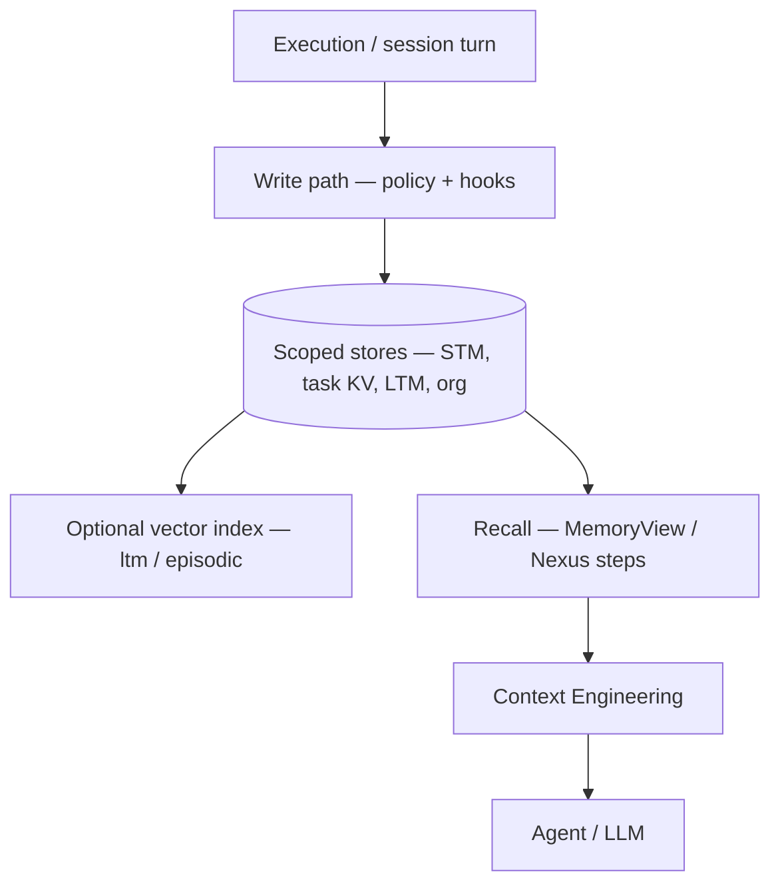
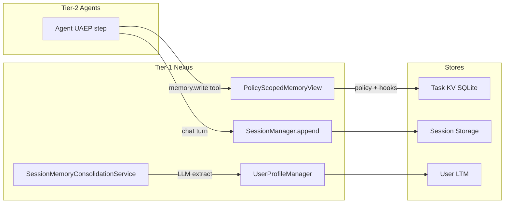
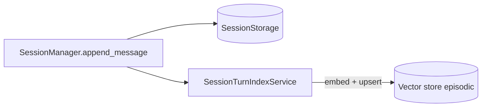
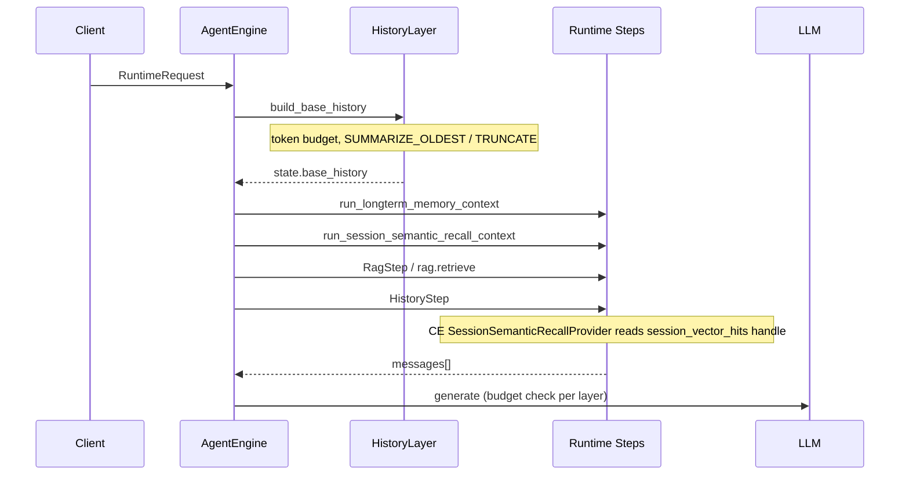

# Memory

**Intergrax Memory** is the platform domain that governs **what the harness remembers** — session turns, task-scoped state, user and organization profiles, and durable long-term facts — across execution boundaries, with explicit stores, write policies, and recall contracts.

## Why it matters

A single prompt or context window cannot hold everything an agent needs across turns, tasks, or return visits. Chat history alone is not memory: durable facts need scoped stores, governed write paths, retention rules, and recall APIs that Context Engineering can assemble under budget.

Memory gives the platform and applications:

- **Continuity** — users and tasks pick up where they left off without re-explaining context every turn.
- **Scoped persistence** — session, task, user, and org state with explicit boundaries instead of implicit side effects.
- **Governed writes** — policy hooks and consolidation paths before sensitive long-term facts are stored.
- **Retrieval-ready recall** — semantic indexes where wired, always secondary to primary stores as source of truth.

Memory **does not** decide what the model sees on a given turn — that is Context Engineering. It **does not** own document corpus retrieval — that is RAG.

> [!NOTE]
> **Maturity boundary:** Core memory stores, lifecycle, and LTM/episodic vector indexes are built in the runtime (plan phases MEM, MEM-DEPTH, MEM-VEC — **Done** as delivery states, not P-axis claims). See [Current maturity](#current-maturity) for the four-axis statement. This is **not** a production-qualification claim comparable to the RAG domain's bounded proof catalog, nor a claim of universal enterprise memory, fully distributed durability, or a versioned procedural memory store. Procedural memory remains **minimal** in the current runtime.

**Primary audience:** Principal / Staff engineers, harness integrators, and extension authors wiring memory stores — after the platform overview in the root README.

## At a glance

| Concern | Summary |
| -------- | -------- |
| **Responsibility** | Persisted, scoped memory stores; write lifecycle; recall APIs consumed by Nexus and Context Engineering |
| **Memory scopes** | Session (STM), task KV, user LTM, org profile, episodic index, immutable trace; knowledge retrieval owned by RAG |
| **Persistence model** | Explicit stores (SQLite bundle, Mongo document store, in-memory fallbacks) — relational/document primary; vector indexes are retrieval indexes, not source of truth |
| **Retrieval model** | `MemoryView` / Nexus steps; optional `ltm` and `episodic` vector domains when host wires the RAG integration stack |
| **Context Engineering** | Consumes memory recall outputs; owns final context assembly, budgeting, and provenance |
| **RAG** | Owns external/document knowledge retrieval (`knowledge` index domain); distinct from user LTM and session episodic memory |
| **Maturity** | Four-axis statement in [Current maturity](#current-maturity) — procedural memory **minimal**; public production qualification **not claimed** |
| **Go deeper** | [Engineering canon](#engineering-canon) · [extended satellite](satellites/MEMORY_extended_depth.md) · [plan](../maintainers/plans/MEMORY.md) |

## Flagship architecture visual

<picture>
  <source media="(prefers-color-scheme: dark)" srcset="assets/memory-platform-position-dark.svg">
  <source media="(prefers-color-scheme: light)" srcset="assets/memory-platform-position-light.svg">
  
</picture>

Memory sits between **execution state** and **model-facing context**. It remembers; Context Engineering selects; RAG retrieves external knowledge. None of the three are interchangeable.

## Memory vs RAG vs Context Engineering

| System | Core question | Owns |
| ------ | ------------- | ---- |
| **Memory** | What should the system remember across execution boundaries? | Stores, lifecycle, consolidation, retention, recall semantics |
| **RAG** | What external knowledge should be retrieved? | Document/corpus ingest, `knowledge` vector domain, retrieval service |
| **Context Engineering** | What information should be placed into the model context now? | Fragment collection, budgeting, degradation, provenance on assembly |

**Hard boundary:** Knowledge (RAG) ≠ user LTM ≠ episodic session turns. Vector indexes for `ltm` and `episodic` share the integration stack with RAG but remain separate logical domains with distinct metadata, write triggers, and CE read paths.

## How Memory works

At a high level, every memory interaction follows the same pattern:

1. **Produce** — execution produces turns, tool results, or explicit write requests.
2. **Store** — Nexus and approved paths write to scoped stores under `MemoryWritePolicy` and hooks.
3. **Index** — where enabled, vector indexes upsert or tombstone against the primary store (never replacing it).
4. **Recall** — Nexus steps and `MemoryView` expose search and history APIs.
5. **Assemble** — Context Engineering collects recall hits as attributable fragments under budget.
6. **Retain / forget** — `retention_days`, logical deletes, consolidation, and TTL mechanisms apply per store.



Consolidation (`SessionMemoryConsolidationService`) extracts durable facts from session history on configurable triggers. Semantic session recall uses the episodic index; cross-session facts use LTM extraction and the `ltm` index — see [§6 Write path](#6-write-path--memory-lifecycle) and [§7 Read path summary](#71-read-path--context-assembly-today-summary).

## Responsibility boundaries

### Memory owns

- Explicit memory stores, scopes, and write paths (session, task KV, user LTM, org profile, shared handoff).
- Memory lifecycle semantics: consolidation triggers, dedup, retention, forget/TTL, logical delete + vector tombstones.
- Storage and index abstractions where canonical (`UserProfileStore`, `SessionStorage`, `SessionTurnIndexService`, pluggable store entry points).
- Recall/retrieval semantics for memory domains (`ltm`, `episodic`) and `MemoryView` agent access contracts.
- Immutable execution trace as read-only audit — not agent-mutable memory.

### Memory does not own

- External document/corpus retrieval — [`RAG.md`](RAG.md).
- Final context composition, token budgeting, and degradation ladder — [`CONTEXT_ENGINEERING.md`](CONTEXT_ENGINEERING.md).
- Application business semantics — Tier-3 configures via `MemoryProfile` and host wiring.
- Generic database operations outside memory store contracts.
- Graph RAG document knowledge graphs as user/episodic entity memory.

### Applications (Tier-3) configure

- `MemoryProfile` flags, retention, consolidation mode, vector index namespaces.
- Wiring the RAG integration stack into `UserProfileManager` and episodic index facades.
- Store backend selection via plugins — see [Extensibility](#extensibility).

## Relationship to Intergrax

| Neighbor | Relationship |
| -------- | ------------- |
| [`CONTEXT_ENGINEERING.md`](CONTEXT_ENGINEERING.md) | Consumes memory recall; owns what reaches the LLM |
| [`RAG.md`](RAG.md) | Parallel retrieval path for `knowledge` domain; shared vector stack, separate index semantics |
| [`UNIFIED_CONTEXT_LIFECYCLE.md`](UNIFIED_CONTEXT_LIFECYCLE.md) | MEMORY owns durable ledger/revisions; separates retention from model-facing compaction |
| [`intergrax_runtime_architecture.md`](intergrax_runtime_architecture.md) | Platform hub — Memory is a Tier-1 domain |
| Nexus / runtime | Session coordinator, consolidation, memory read steps |
| Agents (Tier-2) | Consume via `MemoryView` and approved tools — no direct store access |

## Extensibility

Memory exposes pluggable store surfaces for hosts that need non-default backends:

| Surface | Entry point group | Guide |
| ------- | ----------------- | ----- |
| `UserProfileStorePlugin` | `intergrax.memory_stores` | [`MEMORY_STORE_PLUGIN_AUTHOR_GUIDE.md`](../technical/guides/MEMORY_STORE_PLUGIN_AUTHOR_GUIDE.md) |
| `SessionStoragePlugin` | `intergrax.memory_stores` | same |
| `SessionTurnIndexStorePlugin` | `intergrax.memory_stores` | same |

Tier-3 hosts wire the integration RAG stack (`EmbeddingManager`, `VectorstoreManager`, `RetrievalService`) into memory facades — agents never open vector databases directly. Routing overview: [`EXTENSION_AUTHOR_GUIDE.md`](../technical/guides/EXTENSION_AUTHOR_GUIDE.md) §9.

## Current maturity

Architecture maturity: **A4**  
Implementation maturity: **I4**  
Production readiness: **P2**  
Evidence maturity: **E3**

- **A4** — Canonical domain pair with normative store/lifecycle contracts, ADRs (MEM-001, MEM-002), and mapped cross-layer boundaries (CE, RAG, UCL); Post-L3 audit baseline **32/32 L3** and AUDIT-IDEAL memory rows closed ([plan](../maintainers/plans/MEMORY.md)).
- **I4** — Core stores, consolidation, and vector recall paths wired through Nexus / `MemoryView`; phases MEM, MEM-DEPTH, MEM-VEC **Done** ([plan](../maintainers/plans/MEMORY.md) · audit history satellite). Procedural memory remains **minimal**; LCI-4D **READY_FOR_REVIEW** — not I5.
- **P2** — Lab/reference profiles and sqlite integration bundle ([audit history](../maintainers/plans/satellites/MEMORY_audit_history.md)); **public production qualification not claimed** — no Memory entry in the public proof catalog ([Evidence / proof](#evidence--proof)).
- **E3** — Gate suite and integration paths (vector LTM wiring, acceptance) cited in plan closeout; ADRs and audit slice. No dedicated public proof route — not E4/E5.

> **Phase vs maturity:** MEM / MEM-DEPTH / MEM-VEC **Done** are **plan delivery states**, not production-readiness (P) claims.

### Capability coverage

| Area | Status |
| ---- | ------ |
| **Session, task KV, user LTM, org profile** | Implemented — phases MEM, MEM-DEPTH **Done** |
| **Consolidation and auto jobs** | Implemented — `SessionMemoryConsolidationService`, `MemoryConsolidationJob` |
| **LTM + episodic vector indexes** | Implemented — phase MEM-VEC P0–P1 **Done**; host wiring contract in §6.4–§6.5 |
| **Entity graph / episodic taxonomy** | Implemented — `MemoryKind` uplift, MEM-DEPTH **Done** |
| **Procedural memory** | **Minimal** — `system_instructions` and Prompt Registry; no versioned procedural store |
| **MemorySummaryCompressor** | Helper-only **Done** (TOKEN-MEM-1) — no live store overwrite in that slice |
| **LCI-4D vector identity** | **READY_FOR_REVIEW** — see [plan](../maintainers/plans/MEMORY.md) |
| **Public production qualification** | **Not claimed** — no Memory-domain entry in the public proof catalog comparable to RAG |

Backlog rows, open gaps, and phase trackers live in the [Memory plan](../maintainers/plans/MEMORY.md) — not duplicated here.

## Evidence / proof

Memory evidence is currently **engineering- and qualification-oriented**:

- As-built wiring and contracts documented in this hub (§5–§7) and validated through unit/integration test paths cited in the plan.
- Audit slice: [`guides/audit_slices/MEMORY.md`](../technical/guides/audit_slices/MEMORY.md).
- ADRs: [ADR-MEM-001](../technical/adr/entries/2026-06-08/ADR-MEM-001.md) (Context Compiler / consolidation), [ADR-MEM-002](../technical/adr/entries/2026-06-14/ADR-MEM-002.md) (vector catalog).

There is **no** dedicated public proof route in [`docs/project/proofs/`](../proofs/) for the Memory domain at this time. Do not infer production qualification from RAG or unrelated proof artifacts.

## Go deeper

| Depth | Route |
| ----- | ----- |
| **Engineering canon** | [Below](#engineering-canon) — stores, lifecycle, write/read paths |
| **Extended depth** | [`satellites/MEMORY_extended_depth.md`](satellites/MEMORY_extended_depth.md) — compression matrix, strategy selection, authoring guides (§8+) |
| **Implementation plan** | [`maintainers/plans/MEMORY.md`](../maintainers/plans/MEMORY.md) |
| **ADRs** | [ADR-MEM-001](../technical/adr/entries/2026-06-08/ADR-MEM-001.md) · [ADR-MEM-002](../technical/adr/entries/2026-06-14/ADR-MEM-002.md) |
| **Store plugins** | [`MEMORY_STORE_PLUGIN_AUTHOR_GUIDE.md`](../technical/guides/MEMORY_STORE_PLUGIN_AUTHOR_GUIDE.md) |
| **Audit** | [`audit/MEMORY.md`](../maintainers/audit/MEMORY.md) · [`audit_slices/MEMORY.md`](../technical/guides/audit_slices/MEMORY.md) |
| **Target architecture** | [`IDEAL_HARNESS_AI_ARCHITECTURE.md`](../technical/guides/IDEAL_HARNESS_AI_ARCHITECTURE.md) |

---

## Maintainer and Cursor context

**Status:** Canonical architecture (domain pair 1:1)  
**Hub:** [`intergrax_runtime_architecture.md`](intergrax_runtime_architecture.md)  
**Plan (1:1):** [`plan/MEMORY.md`](../maintainers/plans/MEMORY.md)  
**Target:** [`IDEAL_HARNESS_AI_ARCHITECTURE.md`](../technical/guides/IDEAL_HARNESS_AI_ARCHITECTURE.md)  
**Audit layer:** 15 (Memory)  
**Audit instruction:** [`audit/MEMORY.md`](../maintainers/audit/MEMORY.md)  
**Context assembly (Layer C):** [`architecture/CONTEXT_ENGINEERING.md`](CONTEXT_ENGINEERING.md) · [`plan/CONTEXT_ENGINEERING.md`](../maintainers/plans/CONTEXT_ENGINEERING.md)  
**Unified lifecycle:** [`architecture/UNIFIED_CONTEXT_LIFECYCLE.md`](UNIFIED_CONTEXT_LIFECYCLE.md) · [`plan/UNIFIED_CONTEXT_LIFECYCLE.md`](../maintainers/plans/UNIFIED_CONTEXT_LIFECYCLE.md) · [`ADR-UCL-001`](../technical/adr/entries/2026-08-01/ADR-UCL-001.md) — `ConversationLedger`, `SessionContextRevision`, `OptimizationArtifactRepository`, `InMemoryOptimizationArtifactRepository` (CTX-UCL-2 reference), single-flight `ArtifactCreationReservation`, CAS activation; separates retention from model-facing compaction; reuse-before-create  
**Related:** [`architecture/RAG.md`](RAG.md) — Tier-0 retrieval engine; this doc covers **memory stores, lifecycle**, and the **Knowledge vs LTM** boundary.  
**Third-party extension / developer guide:** [`guides/MEMORY_STORE_PLUGIN_AUTHOR_GUIDE.md`](../technical/guides/MEMORY_STORE_PLUGIN_AUTHOR_GUIDE.md) (factory protocols, bootstrap semantics, wiring) · [`guides/EXTENSION_AUTHOR_GUIDE.md`](../technical/guides/EXTENSION_AUTHOR_GUIDE.md) §9 (routing)  
**ADR:** [ADR-MEM-001](../technical/adr/entries/2026-06-08/ADR-MEM-001.md) (Context Compiler) · [ADR-MEM-002](../technical/adr/entries/2026-06-14/ADR-MEM-002.md) (vector catalog)  
**Last updated:** 2026-06-17 — **Full Harness LC** (re-validates layer completion); MEM-VEC + MEM-DEPTH **Done**

### Cursor read scope (token budget)

**Do not read this entire file in one session** (MEMORY canon).

- **Implement / audit default:** LTM store contracts + scope model (§1–§7). Extended §8+: [`satellites/MEMORY_extended_depth.md`](satellites/MEMORY_extended_depth.md).
- **Use** table of contents below — `Read` with offset/limit per §.
- **Plan hub:** [`plan/MEMORY.md`](../maintainers/plans/MEMORY.md) (scoped §6 only).
- **Audit slice:** [`guides/audit_slices/MEMORY.md`](../technical/guides/audit_slices/MEMORY.md).
- **Max reads:** at most **one** file >5k tokens per session unless RESUME cites more.

### Architecture satellites (read on demand)

Large § blocks moved out of the architecture hub to reduce Cursor context use.
Load **only** the satellite matching your task or cited §.

| Satellite | Contents |
|-----------|----------|
| [`satellites/MEMORY_extended_depth.md`](satellites/MEMORY_extended_depth.md) | extended depth (§8+ compression, strategy selection, authoring) |

> **Cursor context budget:** read hub read-scope block + **at most one** satellite per session.

---

## Engineering canon

Authoritative technical specification (§2–§7). Public front section above; extended depth in the [satellite](satellites/MEMORY_extended_depth.md) (§8+).

## 2. Design principles

| Principle | Meaning in Intergrax |
|-----------|---------------------|
| **Explicit stores** | Memory is never an implicit side effect of chat history alone. Every durable fact has a store, scope, and write path. |
| **Tier-1 ownership** | Nexus owns session history, consolidation triggers, and memory read APIs. Agents consume via `MemoryView` — no direct DB access. **Context assembly** is [`CONTEXT_ENGINEERING`](CONTEXT_ENGINEERING.md). |
| **Bounded by default** | FIFO session limits, token budgets, LTM top_k, retention_days, namespace isolation. Unbounded growth is a defect. |
| **Separation of concerns** | **Memory** = persisted state. **Context** = what the model sees this turn. **Knowledge** = document RAG (agent-mutable only via explicit tools). **Trace** = immutable audit. |
| **Retrieval-first for scale** | Large corpora (documents, codebase, long history) enter context via retrieval, summarization, or delegation — not full dumps. |
| **Policy-governed writes** | Sensitive LTM writes pass `BEFORE_MEMORY_WRITE` hooks and `MemoryWritePolicy`. |
| **Provenance on read** | Memory reads consumed by CE MUST be attributable — see [`CONTEXT_ENGINEERING.md`](CONTEXT_ENGINEERING.md) §12. |
| **Graph RAG ≠ agent memory** | Document knowledge graphs (`intergrax/rag/graph`) are retrieval infrastructure — not user entity / episodic memory (Zep-style). |
| **Vector index ≠ primary store** | Relational / document stores remain the source of truth for session turns and LTM entries. Vector backends are **retrieval indexes** — optional, scoped, and tombstoned on delete. |
| **Harness-owned vector wiring** | Tier-3 hosts MUST wire the integration RAG stack into memory facades (`UserProfileManager`, session turn index) — agents never open vector DBs directly. |

**Context path:** Memory reads for LLM-facing context **MUST** go through `MemoryView` / approved memory services and be injected via Context Engineering — not direct store reads or ad-hoc history joins. See [`CONTEXT_ENGINEERING.md`](CONTEXT_ENGINEERING.md) §12 Context Path Unification.

---

## 3. Three-layer memory model

Production-grade Harness AI separates three cooperating layers:

```text
┌─────────────────────────────────────────────────────────────────────────┐
│  LAYER A — Memory Stores (persisted, scoped, governed)                   │
│  STM │ Task KV │ User LTM │ Org Profile │ Knowledge (RAG) │ Trace       │
└───────────────────────────────┬─────────────────────────────────────────┘
                                │ write path
┌───────────────────────────────▼─────────────────────────────────────────┐
│  LAYER B — Memory Lifecycle (when and how to persist)                    │
│  extract → score → dedup → store → index → forget/TTL                   │
└───────────────────────────────┬─────────────────────────────────────────┘
                                │ read API (MemoryView, session, LTM search)
                                ▼
              ┌─────────────────────────────────────────┐
              │  LAYER C — Context Engineering         │
              │  (separate domain — see CONTEXT_ENGINEERING.md) │
              └─────────────────────────────────────────┘
```

| Layer | Phase MEM (Done) | Phase MEM-DEPTH (Done) | Phase MEM-VEC (P0–P1 Done) |
|-------|------------------|------------------------|----------------------------|
| **A — Stores** | Four operational stores + trace + RAG wired | Mongo session parity + entity graph store | LTM + episodic vector indexes wired |
| **B — Lifecycle** | Manual/scheduled consolidation service | Auto job, dedup, episodic, structured summaries | Episodic index on `append_message` |
| **C — Context Engineering** | Documented under MEMORY (legacy) | **Split to [`CONTEXT_ENGINEERING.md`](CONTEXT_ENGINEERING.md)** — `ContextCompiler` delivery Done | CE `SESSION_HISTORY_SEMANTIC` + Nexus recall handles |

---

## 4. Cognitive taxonomy vs Intergrax runtime

Industry systems (LangMem, Mem0, Zep, Letta, CoALA) use a cognitive taxonomy. Intergrax maps it as follows:

| Cognitive type | Purpose | Intergrax store / mechanism | Maturity |
|----------------|---------|----------------------------|----------|
| **Working memory** | Active turn context | `state.base_history` + injected LTM/RAG/tool blocks + `AgentContextBundle` | Strong — `ContextCompiler` |
| **Episodic** | Specific past events / trajectories | `EPISODIC_EVENT` + `SESSION_SUMMARY`; **session turn vector index** (MEM-VEC-2) | Strong — episodic index + CE recall |
| **Semantic** | Stable facts and preferences | `USER_FACT`, `PREFERENCE`, `ORG_FACT` + **LTM vector index** | Strong — LTM wiring + semantic search |
| **Procedural** | How the system should behave | `system_instructions` (user/org profile); Prompt Registry | Minimal — no versioned procedural store |
| **Knowledge** | Document / corpus truth | RAG vectorstore; Graph RAG (documents) | Strong |
| **Task-scoped** | Per-run scratch state | `TaskMemory` + `PolicyScopedMemoryView` | Strong |
| **Trace** | Audit, not agent-mutable | `RunTraceWriter` / `RuntimeEvent` | Strong |

### 4.1 `MemoryKind` tags (entry classification)

```python
# intergrax/memory/user_profile_memory.py
USER_FACT | PREFERENCE | SESSION_SUMMARY | ORG_FACT | POLICY
EPISODIC_EVENT | PROCEDURAL | OTHER
```

These tags classify **LTM entries** — semantic vs episodic vs procedural at the **entry** level (AUDIT-IDEAL-15.2 Done). Temporal validity (`valid_from` / `valid_until`) enforced on retrieval (MEM-DEPTH-5.2 **Done**, 2026-06-17).

---

## 5. Canon §27 → operational stores

Architecture canon §27 defines **five memory types**. Runtime implements **four mutable stores** plus knowledge retrieval and immutable trace:

```text
Canon §27 type              Runtime implementation
──────────────────────────────────────────────────────────────────
1. Task Memory              TaskMemory SQLite KV → MemoryView
2. Agent Local Memory       Same KV under agent/delegation namespaces
3. User / Organization      UserProfileManager + OrganizationProfileManager
4. Long-Term Knowledge      RAG vectorstore (+ Graph RAG for documents)
5. Execution Trace          RunTraceWriter (immutable — not agent memory)

+ Short-term (operational):  SessionManager + SessionStorage (turn-by-turn chat)
```

### 5.1 Store catalog

| Store | Scope key | Module | Agent access | Default persistence |
|-------|-----------|--------|--------------|---------------------|
| **Session (STM)** | `session_id` | `runtime/nexus/session` | Via Nexus history steps only | SQLite bundle, in-memory fallback, or Mongo `DocumentStoreSessionStorage` (MEM-DEPTH-2.1) |
| **Task KV** | `tenant_id` + `task_id` + namespace | `runtime/task_memory` | `memory.*` tools via `MemoryView` | SQLite (`INTERGRAX_TASK_MEMORY_DB`) |
| **User LTM** | `tenant_id` + `user_id` | `intergrax/memory` | Nexus `UserLongtermMemoryStep` | SQLite bundle / Mongo document_store |
| **Org profile** | `org_id` | `runtime/organization` | Nexus profile steps | SQLite bundle |
| **Shared handoff** | `task_id` | `SharedTaskContext` | `ContextManager` | Task metadata + KV bridge |
| **Knowledge (RAG)** | collection + metadata filters | `intergrax/rag` | `rag.retrieve` tool / `rag.retrieve` (catalog) | Vector store per integration profile |
| **Session episodic index** | `tenant_id` + `session_id` (+ `user_id`) | `intergrax/memory` (`SessionTurnIndexService`) | Nexus `run_session_semantic_recall_context` + CE `SessionSemanticRecallProvider` | Vector store — index over session turns, not a replacement for `SessionStorage` |
| **Trace** | `run_id` | `runtime/nexus/tracing` | Read-only debug APIs | SQLite |

### 5.2 Session vs checkpoint vs task KV

| Concept | Intergrax | Use when |
|---------|-----------|----------|
| **Thread / session** | `SessionManager` + `session_id` | Multi-turn chat in one conversation |
| **Checkpointer** | `SQLiteTaskCheckpointStore` | Resumable UAEP / long-running loops |
| **Scoped KV** | `TaskMemory` + `MemoryView` | Per-task agent scratch, delegation state |

Do **not** store conversational turns in task KV or checkpoint cursors in session storage.

### 5.3 Vector memory index catalog (normative)

Intergrax uses **one vector integration stack** (`EmbeddingManager`, `VectorstoreManager`, optional `RetrievalService` from [`RAG.md`](RAG.md)) but **three logical index domains**. Each domain has distinct metadata, write triggers, and CE read paths. Hosts MUST NOT mix domains in a single undifferentiated collection.

| Index domain | Indexed payload | Primary store (source of truth) | Metadata filter keys (minimum) | Write trigger |
|--------------|-----------------|--------------------------------|--------------------------------|---------------|
| **`knowledge`** | Document / corpus chunks | RAG ingest pipelines | `tenant_id`, collection, `workspace_id`, … | `rag.ingest`, attachment ingest |
| **`ltm`** | `UserProfileMemoryEntry.content` | `UserProfileStore` (SQLite / Mongo) | `user_id`, `entry_id`, `kind`, `deleted` | `add_memory_entry`, consolidation, `ltm.write_fact` |
| **`episodic`** | Session turn text (user / assistant) | `SessionStorage` (SQLite / Mongo) | `tenant_id`, `session_id`, `user_id`, `entry_id`, `role`, `deleted` | `SessionManager.append_message` (MEM-VEC-2.2) |

**Rules:**

1. **Knowledge ≠ LTM ≠ episodic** — document RAG must not silently absorb user facts; episodic turns must not replace LTM extraction for stable cross-session facts.
2. **Collection isolation** — `MemoryProfile.vector_index_namespace` or integration-profile defaults derive separate collection names per domain; lab hosts use `"{tenant_id}:ltm"` and `"{tenant_id}:episodic"` unless overridden.
3. **Tombstones** — logical deletes in the primary store MUST propagate vector tombstones (`deleted=1` or `delete(ids)`).
4. **Agents** — Tier-2 agents consume semantic memory only via Nexus steps, `ltm.search`, or future `memory.semantic_search` skill runtime — never via direct vector SDK calls.

**As-built (2026-06-17):** LTM and episodic vector indexes wired via `memory_vector_wiring.py`; `retrieval_service` injected into `UserProfileManager`; `vector_index_namespace` enforced via `collection_name` metadata; Tier-3 hosts inject RAG stack into profile manager and episodic index.

**Pluggable store surfaces:** `UserProfileStorePlugin`, `SessionStoragePlugin`, and `SessionTurnIndexStorePlugin` share entry point group `intergrax.memory_stores`. Authoring workflow, bootstrap semantics (count-only), and runtime resolution paths are documented in [`MEMORY_STORE_PLUGIN_AUTHOR_GUIDE.md`](../technical/guides/MEMORY_STORE_PLUGIN_AUTHOR_GUIDE.md) — not duplicated here.

---

## 6. Write path — memory lifecycle

### 6.1 Write paths by store



| Store | Who writes | Policy |
|-------|------------|--------|
| Task KV | Agent via `memory.write` / UAEP | `MemoryWritePolicy`, `BEFORE_MEMORY_WRITE` hook, `scope_boundary` |
| Session | Nexus after each turn | Session lifecycle coordinator |
| User LTM | `SessionMemoryConsolidationService` or explicit API | LLM extraction; **LTM vector index upsert when RAG stack wired** |
| Session episodic index | Nexus after `append_message` (MEM-VEC-2.2) | Embed + upsert turn; tombstone on message delete |
| Org profile | `OrganizationProfileManager` | Admin / consolidation paths |
| RAG knowledge | Ingest pipelines / tools | Not agent-silent mutation of user profile |

### 6.2 Consolidation flow

`SessionMemoryConsolidationCoordinator` triggers `SessionMemoryConsolidationService`:

| Trigger | Condition |
|---------|-----------|
| `MID_SESSION` | Every N user turns (configurable interval + cooldown) |
| `CLOSE_SESSION` | Session close when `user_id` present |

Extraction produces up to `max_facts` `USER_FACT`, `max_preferences` `PREFERENCE`, optional `SESSION_SUMMARY`. May regenerate `system_instructions` via `UserProfileInstructionsService`.

**As-built:** `MemoryConsolidationJob` + `consolidation_mode` (`manual` \| `scheduled` \| `auto`) on `MemoryProfile`. ADR: [`ADR-MEM-001`](../technical/adr/entries/2026-06-08/ADR-MEM-001.md).

### 6.3 Retention and forget

| Mechanism | Applies to |
|-----------|------------|
| `MemoryProfile.retention_days` | Session + task stores |
| `should_forget_stm_record` | Task KV namespaces prefixed `stm:` |
| `UserProfileMemoryEntry.deleted` | Logical delete + vector index tombstone |
| Session purge | Storage backend TTL (when configured) |
| Episodic index purge | `retention_days` + session delete cascades tombstone all `entry_id` for `session_id` (MEM-VEC-2.2) |

### 6.4 LTM vector index write path (as-built — MEM-VEC-1)

When `UserProfileManager.is_longterm_rag_enabled()` is true, every durable LTM mutation upserts or tombstones the **`ltm`** index domain:

```text
add_memory_entry / update_memory_entry / remove_memory_entry
  → UserProfileStore (source of truth)
  → UserProfileManager._index_upsert_entry | _index_delete_entry
  → VectorstoreManager (metadata: user_id, entry_id, kind, deleted)
```

**Normative Tier-3 contract (MEM-VEC-1.1):** if `MemoryProfile.enable_long_term_memory` is true **and** the host integration profile resolves a vector store + embedding manager, `build_session_manager_from_environment()` **MUST** construct:

```python
UserProfileManager(
    store,
    embedding_manager=rag_stack.embedding_manager,
    vectorstore_manager=rag_stack.vectorstore_manager,
    retrieval_service=rag_stack.retrieval_service,  # preferred — shared metadata scope with RAG
)
```

The **same** `UserProfileManager` instance MUST be exposed on `ToolWiringContext.user_profile_manager` for `ltm.search` / `ltm.write_fact` (MEM-VEC-1.2).

### 6.5 Session turn vector index write path (as-built — MEM-VEC-2)

Session messages remain in `SessionStorage`. When `MemoryProfile.enable_session_vector_index` is true, Nexus additionally indexes each appended turn into the **`episodic`** domain:



| Field | Requirement |
|-------|-------------|
| Chunk unit | One `ChatMessage` per index row (no cross-turn merge at write time) |
| `entry_id` | Stable id from `session_messages.entry_id` — upsert key |
| Roles indexed | `user`, `assistant` by default; `system` / `tool` configurable via `MemoryProfile.session_index_roles` |
| Async | Indexing is **synchronous** on `append_message` in the default adapter; CE tolerates empty episodic hits with `session_vector_recall_reason=no_hits` |

Consolidation (`SessionMemoryConsolidationService`) remains the path for **cross-session semantic facts**; episodic index answers **“what was said in this or prior sessions?”** without waiting for consolidation.

---

## 7. Read path — context assembly (moved)

> **Canonical spec:** [`architecture/CONTEXT_ENGINEERING.md`](CONTEXT_ENGINEERING.md) §7–§14.  
> This section retains a **summary** for MEMORY↔CE navigation only.

## 7.1 Read path — context assembly today (summary)

### 7.1 Nexus session turn pipeline



| Runtime invocation | Source | Injection |
|------|--------|-----------|
| `run_longterm_memory_context` | `UserProfileManager.search_longterm_memory` — **`ltm`** index | LTM block via prompt builder; CE `LONGTERM_MEMORY` fragments |
| `run_session_semantic_recall_context` | `SessionManager.search_session_semantic_recall` — **`episodic`** index | Populates `session_vector_hits` for CE `SessionSemanticRecallProvider` |
| `rag.retrieve` (catalog) | `RetrievalService` — **`knowledge`** index | Evidence chunks |
| `HistoryStep` / `HistoryLayer` | `state.base_history` — chronological session store | Conversation turns (recent tail) |
| Websearch | `websearch.query` | Evidence (when enabled) |

Legacy doc names `UserLongtermMemoryStep` / `SessionSemanticRecallStep` map to the runtime functions above plus CE providers (CE-VEC-1).

### 7.1.1 Semantic session recall vs chronological history

| Mechanism | Data source | Selection strategy | When used |
|-----------|-------------|-------------------|-----------|
| **Chronological history** | `SessionStorage` via `HistoryLayer` | Recent turns + token budget; `SUMMARIZE_OLDEST` / `TRUNCATE_OLDEST` | Default; short sessions |
| **LTM semantic search** | `ltm` vector index | Query = current user message; top_k + score threshold | Cross-session facts; user returns after days |
| **Episodic semantic recall** | `episodic` vector index | Query = current user message; filter `session_id` and/or `user_id`; top_k | Long sessions; prior sessions when `include_cross_session_episodic` |
| **RAG knowledge** | `knowledge` vector index | Corpus retrieval with tenant/workspace filters | Document Q&A |

**Context Engineering contract:** semantic recall hits MUST enter assembly as attributable fragments (`ContextFragmentSource.SESSION_HISTORY_SEMANTIC` or `LONGTERM_MEMORY`) with `source_id` = `entry_id` — see [`CONTEXT_ENGINEERING.md`](CONTEXT_ENGINEERING.md) §7.2, §14.2. `HistoryLayer` remains the chronological fallback; CE degradation ladder drops lowest-scored optional fragments before mandatory user turn.

**Pipeline order (as-built):** `run_longterm_memory_context` → `run_session_semantic_recall_context` → `rag.retrieve` (catalog) → `HistoryStep` → `CompileContextStep` / CE collect.

### 7.2 Graph node context (`ContextManager`)

For multi-agent `ExecutionGraph` nodes, `ContextManager.build_agent_context()` assembles:

- Task message and node spec
- Prior dependency outputs (`TaskContextAssemblyOptions` summary tier)
- Shared context reads (`SharedTaskContext`)
- `ContextBudgetPolicy` trim on composed message
- Provenance in `AgentContextBundle`

### 7.3 Budgeting — global allocator vs per-step caps

**Global allocator (Done — ADR-MEM-001):** `ContextCompiler` + degradation ladder in [`CONTEXT_ENGINEERING.md`](CONTEXT_ENGINEERING.md) §10 before agent LLM step.

**Per-step local caps (still apply before CE collect):**

| Layer | Limit mechanism |
|-------|-----------------|
| `HistoryLayer` | ~⅔ input budget for history; `history_compression_strategy` |
| `run_longterm_memory_context` | `max_longterm_entries_per_query`, `max_longterm_tokens` |
| `ContextBudgetPolicy` | `max_chars` + token estimate; char-cut fallback |
| `TaskContextAssemblyOptions` | `max_prior_chars`, summary tiers |

**AUDIT-IDEAL-16.1 / 16.2** (drift monitoring, semantic compression profile flags) — owner: [`CONTEXT_ENGINEERING.md`](CONTEXT_ENGINEERING.md) §11; status **Done** in master register.
