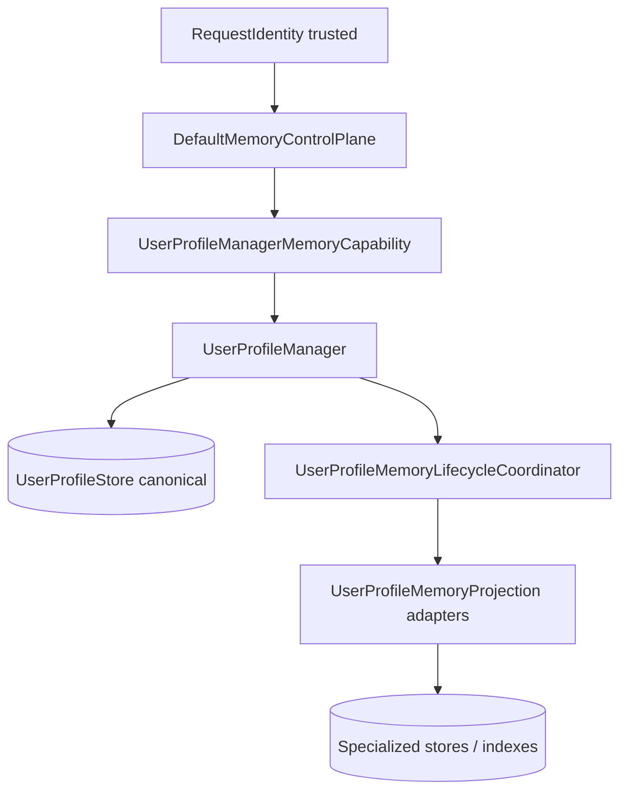
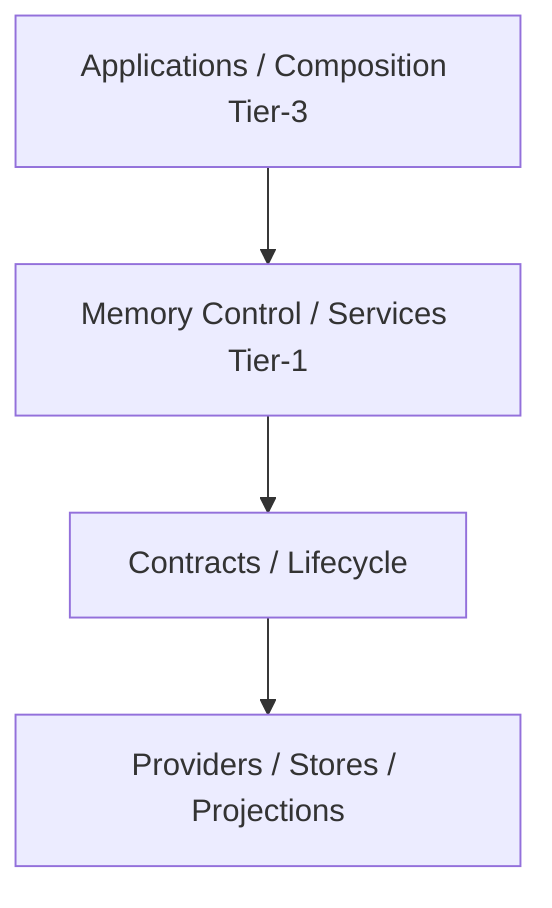
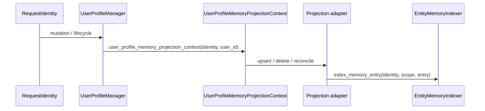
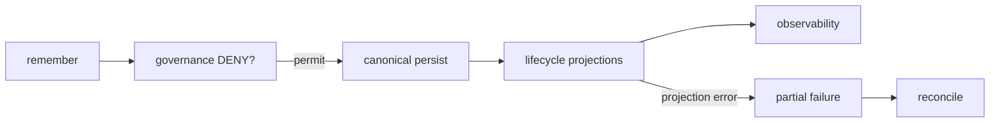
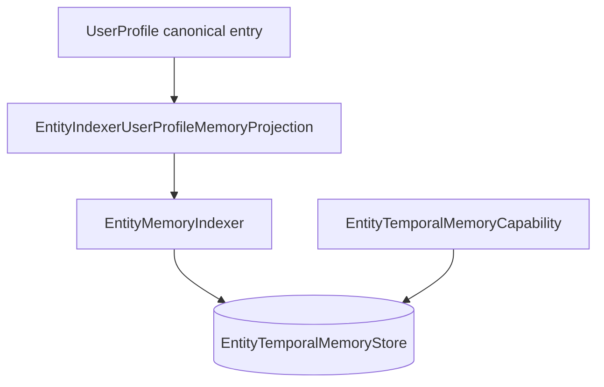
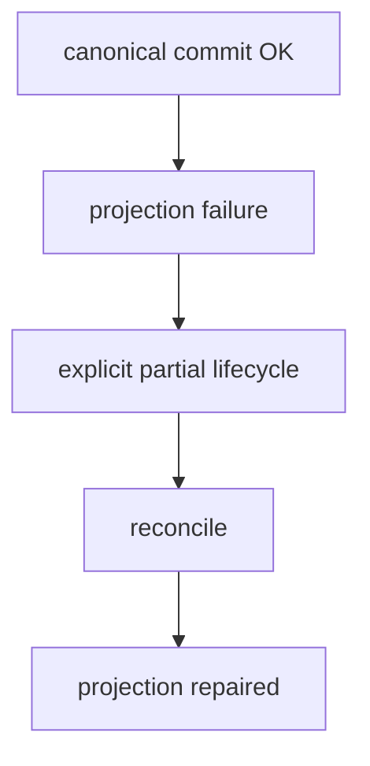
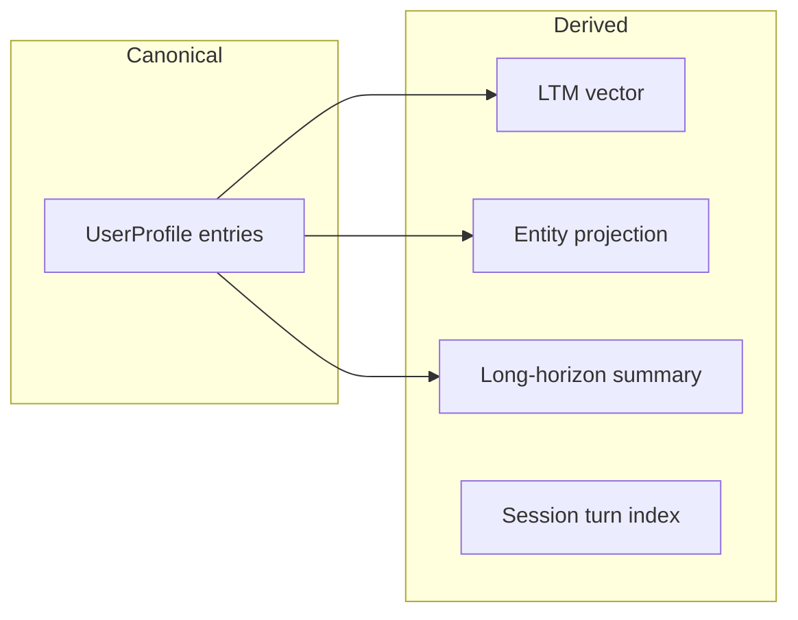

# Memory — Enterprise architecture (MEM-ENT closeout)

**Status:** canonical architecture for the Memory core delivered in MEM-ENT-1…15  
**Audience:** engineers extending stores, projections, strategies, or Tier-3 wiring  
**Domain hub (product overview):** [`MEMORY.md`](MEMORY.md)  
**Plan hub:** [`../maintainers/plans/MEMORY.md`](../maintainers/plans/MEMORY.md)

This document describes **what the code actually does** at `development` HEAD after enterprise hardening. It is not an aspirational target design.

## Glossary

| Term | Meaning |
| ---- | ------- |
| **Canonical source** | Durable truth for a memory scope; mutations go here first |
| **Derived projection** | Secondary representation updated after canonical commit; never authority |
| **Specialized store** | Durable/query surface for a memory domain (entity, procedural, long-horizon) |
| **Capability** | Governed read/disclosure (and sometimes mutation) API over a store |
| **Indexer** | Mutation/indexing port from canonical lifecycle into a specialized store |
| **Control Plane** | Single semantic entry (`remember` / `recall` / `forget` / `reconcile` / supersession) |
| **Provider** | Replaceable implementation behind a platform contract, discovered and qualified by the host |

### Hard invariant (EN / PL)

**Derived projection is never canonical authority.**  
**Projekcja pochodna nigdy nie jest kanonicznym źródłem prawdy.**

Summaries, vector indexes, entity graph projections, and long-horizon compacted views are **derived** — not canonical user memory.

---

## Architectural model

```text
ONE SEMANTIC MEMORY CONTROL PLANE
+
MANY SPECIALIZED MEMORY STORES / PROJECTIONS
```

Canonical user facts live in **UserProfile** (`UserProfileStore` + `UserProfileManager`). Specialized memories (entity temporal, procedural, long-horizon) have their own stores but **user-profile entries remain canonical** for cross-cutting lifecycle where wired.

### Diagram 1 — System overview



### Layer boundaries



**Dependency rule:** `contracts` are imported by implementations and composition adapters — not the reverse. Memory domain code under `intergrax/memory/` does not import Tier-3 applications.

| Composition owner (Tier-3) | Role |
| -------------------------- | ---- |
| `resolve_memory_platform_wiring` | Session + profile stores, entity indexer/capability, plugin catalog |
| `build_user_profile_manager` | Projections (entity, LTM vector) from `MemoryProfile` flags |
| `build_default_memory_control_plane` | `DefaultMemoryControlPlane` over injected capabilities |
| `entity_user_profile_memory_projection` | `EntityIndexerUserProfileMemoryProjection` bridge |

---

## Identity authority

**RequestIdentity = trusted authority** for user-scoped memory mutations and reconciliation.

- `identity.user_id` is **required** for user memory scope operations.
- Target `user_id` must **match** `identity.user_id` before mutation (`UserProfileManager._require_user_identity_match`).
- **DO NOT** construct `RequestIdentity` from raw `user_id` / `tenant_id` strings inside Memory.

### Identity through projections



No reconstruction of identity inside projection adapters — they consume typed context only.

### Identity matrix

| Boundary | Receives RequestIdentity? | May reconstruct identity? |
| -------- | ------------------------: | ------------------------: |
| `MemoryControlPlane` | YES | NO |
| `UserProfileManager` | YES | NO |
| `UserProfileMemoryLifecycleCoordinator` | YES | NO |
| `UserProfileMemoryProjection` | via context | NO |
| `EntityMemoryIndexer` | YES | NO |
| `EntityTemporalMemoryCapability` | YES | NO |
| LTM tool (`ltm.write_fact`) | YES (required for durable path) | NO |

---

## Control Plane API

Implementation: `DefaultMemoryControlPlane` (`intergrax/memory/default_memory_control_plane.py`).  
Contract: `MemoryControlPlane` (`intergrax/memory/contracts/memory_control.py`).

| Operation | Implemented | Notes |
| --------- | ----------- | ----- |
| `remember` | YES | USER scope via `UserProfileManager`; governance **before** mutation |
| `recall` | YES | Pipeline + strategies; disclosure governance |
| `forget` | YES | Canonical delete + projection lifecycle |
| `reconcile` | YES | Projection repair vs canonical active set |
| `apply_memory_supersession` | YES | Lineage preserved; higher revision wins |
| `recall_session_turns` | Minimal | `EpisodicMemoryCapability` placeholder surface |

Task memory uses separate `TaskMemoryCapability` when injected; not all hosts wire it.

---

## Core flow

```text
RequestIdentity
→ MemoryControlPlane
→ capability (e.g. UserProfileManagerMemoryCapability)
→ UserProfileManager (or specialized service owner)
→ canonical mutation (UserProfileStore)
→ UserProfileMemoryLifecycleCoordinator
→ projections
→ MemoryDiagnosticEmitter (terminal outcomes)
```

Governance: `MemorySecurityGovernanceService.evaluate` — **DENY before mutation** for `REMEMBER`, `FORGET`, supersession (`_enforce_governance` in control plane).

### Diagram 2 — Write lifecycle



---

## Mutation ownership

```text
Strategy → typed decision
Service → orchestration
Lifecycle / manager / control boundary → mutation
Store / projection → durability / derived representation
```

Strategies (`intergrax/memory/strategies/`) produce recall/ranking/conflict decisions — they do not write stores directly.

---

## UserProfile memory (canonical)

| Concern | Owner | Code anchor |
| ------- | ----- | ----------- |
| Canonical store | `UserProfileStore` | `sqlite_user_profile_store`, `in_memory_user_profile_store`, plugins |
| Mutation orchestration | `UserProfileManager` | `user_profile_manager.py` |
| Projection lifecycle | `UserProfileMemoryLifecycleCoordinator` | `user_profile_memory_lifecycle.py` |
| Partial failure | `UserProfileMemoryLifecyclePartialError` | primary applied; projections may fail |
| Reconciliation | `reconcile_memory_projections` | compares authoritative active IDs vs projections |

**Memory entries** carry `entry_id`, `revision`, temporal fields (`valid_from` / `valid_until`), deletion/supersession flags — validated via `memory_temporal` and enterprise record helpers.

### Revision semantics (as implemented)

- **Higher revision wins** when applying updates and supersession.
- **Stale revision cannot regress** active canonical state (store/manager checks).
- **Same-revision** behavior is defined per operation in store contracts and certification tests — do not assume merge semantics without reading the specific path.

### Temporal semantics

- `valid_from` / `valid_until` parsed as ISO-8601 (`enterprise_memory_record.parse_memory_record_timestamp`).
- Activity filtering: `is_memory_entry_active` / `filter_active_memory_entries` (timezone-aware when offsets present).
- Chronology contracts: `contracts/temporal_chronology.py`.

### Supersession

Intent: `MemorySupersessionIntent` → `apply_memory_supersession`.  
**A superseded by B:** history retained, **B** is active authority, lineage fields on enterprise record (`MemoryRecordLineage`).

---

## Enterprise Memory Record

Semantics (not full class dump): `intergrax/memory/contracts/enterprise_memory_record.py`

| Field group | Role |
| ----------- | ---- |
| `memory_id` / entry identity | Stable id per logical memory |
| revision | Monotonic per entry lifecycle |
| timestamps | ISO validation; naive vs aware preserved |
| provenance | `MemoryProvenance` — source type, session/run/strategy refs |
| trust | `MemoryRecordTrust` — trust class, optional confidence |
| governance | `MemoryRecordGovernance` — data classification |
| lineage | supersedes / superseded-by links |
| evidence refs | validated claim ids where attached |

---

## Entity / temporal memory

| Role | Type | Package |
| ---- | ---- | ------- |
| Persistence primitive | `EntityTemporalMemoryStore` | `stores/in_memory_entity_temporal_memory_store.py`, plugins |
| Governed read surface | `EntityTemporalMemoryCapability` | `entity_temporal_memory_service.py` |
| Indexing port | `EntityMemoryIndexer` | `entity_memory_indexing.py` |
| Projection bridge | `EntityIndexerUserProfileMemoryProjection` | `applications/_shared/entity_user_profile_memory_projection.py` |

**Store vs capability vs indexer**

| Layer | Responsibility |
| ----- | -------------- |
| **Store** | Durability and query primitives |
| **Capability** | Governed disclosure / entity lookup |
| **Indexer** | Mutations driven from canonical UserProfile lifecycle |
| **Projection adapter** | Maps `UserProfileMemoryProjection` → indexer |

### Diagram 3 — Entity projection



**Production flow:** canonical upsert/delete → lifecycle → projection → `index_memory_entry` / `remove_memory_entry`.

**Delete flow:** canonical forget/delete → projection delete → `EntityMemoryIndexer.remove_memory_entry`.

**Reconciliation:** canonical active entries → `EntityTemporalMemoryCapability.get_entity` → stale/missing → `index_memory_entry` repair (`reconcile` on projection).

Enabled when `MemoryProfile.enable_entity_graph_memory` and indexer + capability are wired (`memory_vector_wiring.build_user_profile_manager`).

---

## Procedural memory

- **Canonical source:** user-profile memory entries (promotion/indexing from source id + revision).
- **Store:** `ProceduralMemoryStore` (in-memory default + plugin).
- **Service:** `procedural_memory_service.py` — `remember_procedure`, `recall_procedures`, `apply_supersession` when store supports it.
- Steps and temporal/lifecycle invariants are enforced in service + store contracts (`contracts/procedural_memory.py`).

---

## Long-horizon memory

- **Canonical source authority:** underlying user-profile (or explicit source refs) — compaction produces **derived** summaries.
- **Not canonical memory:** LH summaries/compactions are derived; do not treat them as primary user facts.
- **Service:** `long_horizon_memory_service.py` — compaction, `recall` over derived state with source refs and temporal coverage.
- Contract: `contracts/long_horizon_memory.py`.

---

## SessionTurnIndex

| Piece | Role |
| ----- | ---- |
| `SessionTurnIndexStore` | Episodic/session vector index store contract |
| Typed adapters | `session_turn_index_rag_adapters`, `VectorSessionTurnIndexStore` |
| RAG-facing managers | Wired via `build_session_turn_index_store` when `enable_session_vector_index` |

**Certification gap:** MEM-ENT-15 E2E certification **did not include** SessionTurnIndex end-to-end. Boundary is documented; E2E proof is out of scope for MEM-ENT-15.

---

## Provider / plugin architecture

```text
contracts → discovery → qualification → materialization → configured provider → Memory composition
```

| Stage | Code |
| ----- | ---- |
| Discovery | `resolver/discovery.py`, `EP_MEMORY_STORES` |
| Classification | `resolver/classifier.py` |
| Materialization | `resolver/materialization.py`, `MemoryStoreMaterializationContext` |
| Resolution | `resolver/resolver.py`, `memory_wiring.resolve_memory_platform_wiring` |
| Qualification | `provider_qualification/runner.py`, per-store checks |

### Qualification types

| Kind | Meaning |
| ---- | ------- |
| Contract qualification | Protocol shape and required methods |
| Behavioral qualification | Semantic tests against reference behavior |
| Durable qualification | Restart/reopen evidence (SQLite reference path) |
| Adapter recreation only | In-memory re-instantiation — not durable reopen |
| Real durable reopen | Proven via SQLite harness (MEM-ENT-13C) |

**External vendors:** Mongo/document paths exist in integration wiring; **full external durable vendor E2E is not certified** in MEM-ENT-15 (simulated/blocked paths in qualification where applicable). **SQLite** is the real durable local qualification/reference proof for user profile store.

**Persistence abstraction:** persistence is accessed through platform contracts/providers. Domain services must not branch on vendor implementation details.

**CAS:** `ConditionalDocumentStore` ownership stays in **Integration** — Memory does not own that contract.

### Diagram 4 — Provider pipeline


Platform code depends on **contracts**; provider implementations are **replaceable**.

---

## Partial failure and reconciliation

**Canonical write can succeed while projection fails.**

Then:

- Canonical remains authority.
- Lifecycle disposition is explicit (`MemoryLifecycleDisposition`, projection evidence).
- `UserProfileMemoryLifecyclePartialError` may surface to callers.
- **Reconciliation** repairs derived state from canonical active entries.

**Who calls reconcile:** `MemoryControlPlane.reconcile` → `UserProfileManager.reconcile_memory_projections` → per-projection `reconcile` with `UserProfileMemoryReconciliationContext` (profile snapshot + authoritative active ids).

**Reconciliation cannot:** change canonical truth to match a stale projection; it only repairs derived views.

### Diagram 5 — Failure / recovery



### Failure matrix

| Failure | Canonical state | Projection state | User-visible result | Recovery |
| ------- | --------------- | ---------------- | ------------------- | -------- |
| Governance DENY | unchanged | unchanged | DENIED diagnostic | fix policy / request |
| Store error on primary | rollback / error | not run | FAILED | retry per store semantics |
| Primary OK, projection fail | committed | inconsistent | PARTIAL / exception | `reconcile` |
| Recall disclosure DENY | unchanged | n/a | empty / DENIED | governance |

---

## Concurrency and retry (MEM-ENT-14)

| Claim | Evidence |
| ----- | -------- |
| Per-instance `RLock` on `InMemoryEntityTemporalMemoryStore` | implementation-level only |
| Thread concurrency proofs | reference in-memory entity store tests |
| Async tenant isolation | controlled certification tests |
| Protocol-wide thread safety | **NOT** universally guaranteed |

**DO NOT** document “Memory is fully thread-safe.”  
**DO NOT** introduce a global Memory asyncio/thread lock as generic policy.

Retry: idempotency and ambiguous-commit handling are documented per path in MEM-ENT-14 tests — there is **no** global retry engine.

---

## Observability

- `MemoryDiagnosticEmitter` + `MemoryObservabilitySink`
- Terminal outcomes: SUCCESS / DENIED / FAILED / PARTIAL / reconcile semantics
- Sink failure isolation (MEM-ENT-14) — diagnostics **are not** business authority

---

## Governance matrix

| Operation | Governance stage | Before mutation? |
| --------- | ---------------- | ---------------- |
| remember | `MemoryGovernanceOperation.REMEMBER` | YES |
| forget | FORGET | YES |
| supersession | supersession ops | YES |
| recall | disclosure evaluation | before return (not mutation) |
| specialized mutation | `memory_specialized_mutation_governance` | YES where wired |

Source governance authority: `canonical_memory_governance_source_authority.py`.

---

## Environment configuration (`MemoryProfile`)

Real flags (`applications/contracts/environment_profile/sub_profiles.py`):

| Flag | Effect (wiring) |
| ---- | ---------------- |
| `enable_user_memory` | `UserProfileManager` |
| `enable_long_term_memory` | LTM vector projection + RAG stack needs |
| `enable_entity_graph_memory` | Entity projection when indexer+capability present |
| `enable_procedural_memory` | Procedural service/store resolution |
| `enable_long_horizon_memory` | Long-horizon service/store |
| `enable_session_vector_index` | Session turn index store |
| `enable_org_memory` | Organization profile store when integrated |
| `enable_task_memory` | Task KV (host-dependent) |
| `*_store_plugin_id` | Plugin selection for each store surface |

Entity graph: **enabled** → projection wired in `build_user_profile_manager`; **disabled** → no entity projection (MEM-ENT-15 R3 certification).

---

## Production wiring

```text
resolve_memory_platform_wiring(env)
  → user_profile_store, entity_store, entity_memory_indexer, entity_temporal_memory_capability
build_user_profile_manager(store, env, …, entity_memory_indexer, entity_temporal_memory_capability)
  → UserProfileManager + projections
build_default_memory_control_plane(user_profile_manager=…)
  → DefaultMemoryControlPlane
```

LTM tool: `ltm.write_fact` requires trusted `RequestIdentity` via control plane or explicit extras — **fails closed** without it (`MemoryControlAccessDenied`).

`ctx.extras` for control plane / identity is an **integration detail**, not the preferred public API for new hosts.

---

## Pluginability map

| Mechanism | Contract | Default implementation | Replaceable? | Composition owner |
| --------- | -------- | ---------------------- | ------------ | ----------------- |
| UserProfile store | `UserProfileStore` / plugin | In-memory, SQLite bundle | YES | `memory_wiring` |
| Entity store | `EntityTemporalMemoryStore` | In-memory + plugin | YES | `entity_graph_wiring` |
| Entity indexer | `EntityMemoryIndexer` | `DefaultEntityMemoryIndexer` | YES | `memory_wiring` |
| Entity capability | `EntityTemporalMemoryCapability` | service over store | YES | `entity_graph_wiring` |
| Projections | `UserProfileMemoryProjection` | entity + LTM vector | YES | `memory_vector_wiring` |
| Qualification checks | per-store check modules | bundled suite | YES (plugins) | host runner |
| Long-horizon | `LongHorizonMemoryStore` | in-memory plugin | YES | wiring + service |
| Procedural | `ProceduralMemoryStore` | in-memory plugin | YES | wiring + service |
| SessionTurnIndex | `SessionTurnIndexStore` | vector adapter | YES | `memory_vector_wiring` |
| Observability sink | `MemoryObservabilitySink` | default emitter | YES | `memory_observability_wiring` |
| Recall strategies | `MemoryRecallStrategySet` | defaults bundle | YES | control plane injection |

---

## Hard invariants vs replaceable strategies

### Hard invariants

- Trusted identity — no synthetic `RequestIdentity` in Memory
- Scope isolation (tenant/user)
- Revision monotonicity and timestamp validity
- Canonical source authority
- No projection-as-authority
- No layer bypass (control → manager → lifecycle → store)
- Governance DENY before mutation (user paths)

### Replaceable

- Store/provider implementations
- Projection implementations
- Indexers
- Strategy implementations
- Observability sinks
- Qualification plugins

---

## Public API table

| API / Contract | Responsibility | Canonical? | Pluggable? |
| -------------- | -------------- | ---------- | ---------- |
| `MemoryControlPlane` | Semantic ops | orchestrates canonical | implementation injectable |
| `UserProfileStore` | User profile durability | YES (user facts) | YES |
| `UserProfileManager` | CRUD + lifecycle | owns canonical mutations | wiring |
| `UserProfileMemoryProjection` | Derived sync | NO | YES |
| `EntityTemporalMemoryStore` | Entity persistence | specialized | YES |
| `EntityTemporalMemoryCapability` | Governed entity read | NO (view) | YES |
| `EntityMemoryIndexer` | Entity write path | NO | YES |
| `ProceduralMemoryStore` | Procedure storage | specialized | YES |
| `LongHorizonMemoryStore` | Compacted derived | derived | YES |
| `MemorySecurityGovernanceService` | Policy | n/a | YES |
| `MemoryDiagnosticEmitter` | Diagnostics | n/a | YES |

---

## Store matrix

| Store | Scope | Authority / projection | Durable options | Qualification |
| ----- | ----- | ---------------------- | --------------- | ------------- |
| UserProfileStore | user/tenant | **canonical** | SQLite, Mongo doc, in-memory, plugin | user_profile_store checks |
| EntityTemporalMemoryStore | entity/temporal | specialized + **derived from profile** when projected | in-memory, plugin | entity_temporal checks |
| ProceduralMemoryStore | procedural | specialized | in-memory, plugin | procedural checks |
| LongHorizonMemoryStore | long-horizon | **derived** summary | in-memory, plugin | long_horizon checks |
| SessionTurnIndexStore | session episodic | **projection/index** | vector-backed | session_turn_index checks |
| LTM vector index | user LTM | **projection** | integration vector | behavioral + wiring |

---

## Authority map

| Mechanism | Canonical / Derived |
| --------- | ------------------- |
| UserProfile memory entries | **Canonical** |
| UserProfileStore | **Canonical** durability |
| LTM vector projection | Derived |
| Entity graph from profile projection | Derived |
| EntityTemporalMemoryStore content | Specialized derived representation |
| Procedural indexed procedures | Specialized (source refs to profile) |
| Long-horizon compaction | Derived |
| SessionTurnIndex | Derived index |
| Memory diagnostics | Neither (observability only) |

### Diagram 6 — Authority map (optional)



---

## Extension guides

| Guide | Path |
| ----- | ---- |
| New UserProfile / store provider | [`MEMORY_PROVIDER_EXTENSION_GUIDE.md`](MEMORY_PROVIDER_EXTENSION_GUIDE.md) · [`MEMORY_STORE_PLUGIN_AUTHOR_GUIDE.md`](../technical/guides/MEMORY_STORE_PLUGIN_AUTHOR_GUIDE.md) |
| New projection | [`MEMORY_PROJECTION_EXTENSION_GUIDE.md`](MEMORY_PROJECTION_EXTENSION_GUIDE.md) |

### Developer onboarding — “If you are adding…”

- **Provider:** implement contract → register plugin → pass qualification → wire via `MemoryProfile` plugin id.
- **Projection:** implement `UserProfileMemoryProjection`; accept `UserProfileMemoryProjectionContext`; support reconcile.
- **Strategy:** implement recall/promotion strategy bundle hooks; no direct store writes.
- **New memory type:** define contract, authority, lifecycle owner, projection role, governance, qualification, observability, recovery (checklist in projection guide).

### Extension checklist

| Question | Required answer |
| -------- | ---------------- |
| Contract exists? | YES |
| Who owns canonical truth? | Named store/manager |
| Projection or authority? | One clear role |
| Pluginable? | Via contract + qualification |
| Identity propagated? | `RequestIdentity` end-to-end |
| Scope enforced? | tenant/user guards |
| Failure represented? | lifecycle disposition / errors |
| Reconciliation? | For derived surfaces |
| Provider qualified? | Host runner evidence |
| Observed? | Diagnostic terminal events |
| Tests? | unit + integration path |

---

## Anti-patterns (DO NOT)

| DO NOT | Why |
| ------ | --- |
| Construct `RequestIdentity` from `user_id`/`tenant_id` strings inside Memory | Breaks trusted identity model |
| Import vendor store/client into Memory service/domain logic | Violates persistence abstraction |
| Treat entity/vector/procedure/LH projection as canonical | Derived projection is never authority |
| Bypass lifecycle/control/manager to mutate stores directly | Breaks governance and partial-failure semantics |
| Use `getattr`/`setattr`/`hasattr` for typed platform architecture | Use contracts |
| External access to private owner state | Encapsulation |
| New `dict[str, Any]` in public Memory contracts | Prefer typed models |
| Global Memory lock as generic concurrency policy | Not guaranteed; per-store only |
| `ContextVar` / thread-local / global identity cache for authority | Hidden side channel |

---

## E2E certification scope (MEM-ENT-15)

### Certified (within documented scope)

Control Plane lifecycle, trusted identity, governance, entity projection, revision, temporal, procedural, long-horizon, reconciliation, observability, SQLite durable restart, plugin contract replaceability, scope isolation, resilience paths exercised in certification suite.

Use phrase **“Memory core and certified paths”** — not “fully certified” without scope.

### Explicitly not certified

| Area | Status |
| ---- | ------ |
| SessionTurnIndex E2E | Not in MEM-ENT-15 suite |
| Real external durable vendor (production Mongo/etc.) | Not E2E certified |
| Distributed failover | Not certified |
| Load / performance | Not certified |
| Cross-layer Memory × CE × Tools × RAG | **MEM-XINT-1** |

### Certification evidence map

| Claim | Evidence test area |
| ----- | ------------------ |
| Identity propagation | MEM-ENT-15 E2E, MEM-ENT-1R* |
| Concurrency | MEM-ENT-14 |
| Durable reopen | MEM-ENT-13C, MEM-ENT-15 |
| Provider replaceability | MEM-ENT-13, MEM-ENT-15 |
| Entity projection | MEM-ENT-7, MEM-ENT-15 |
| Production wiring | MEM-ENT-15 R3, `test_reference_hosts_memory_bridge` |

---

## PR review checklist

- [ ] contract exists
- [ ] canonical authority defined
- [ ] identity explicit
- [ ] no vendor coupling
- [ ] governance enforced
- [ ] failure semantics explicit
- [ ] reconciliation path exists
- [ ] observability exists
- [ ] qualification exists
- [ ] tests exist

---

## Final architecture status

**Memory core architecture:** enterprise-certified **within the scope documented above** (MEM-ENT-1…15).

**Cross-layer integration** with Context Engineering, RAG, and Tools is evaluated separately under **MEM-XINT-1**.

---

## Appendix — audited milestones

| Milestone | Baseline commit (operator pin) |
| --------- | ------------------------------ |
| MEM-ENT-15 public composition certification | `b7497564eb43050b93fa5eed00e83008b00278cb` |
| MEM-ENT-16 documentation closeout | documented at commit applying this file |

Code paths remain authoritative over commit SHAs.
