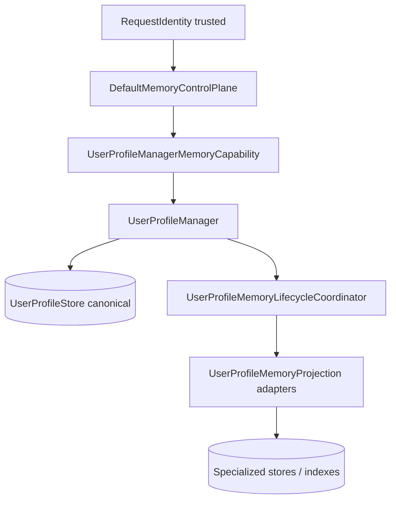
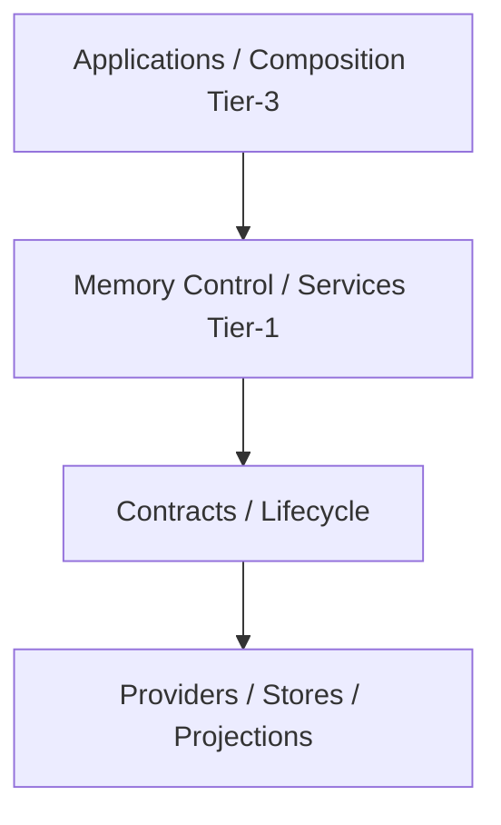
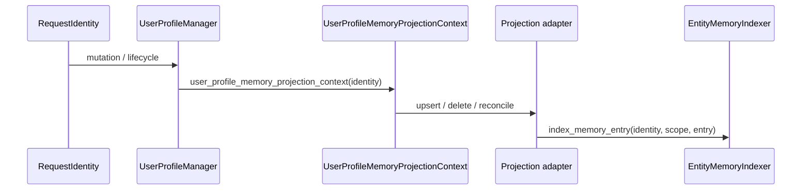
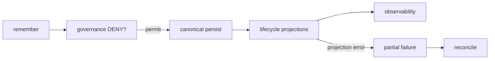
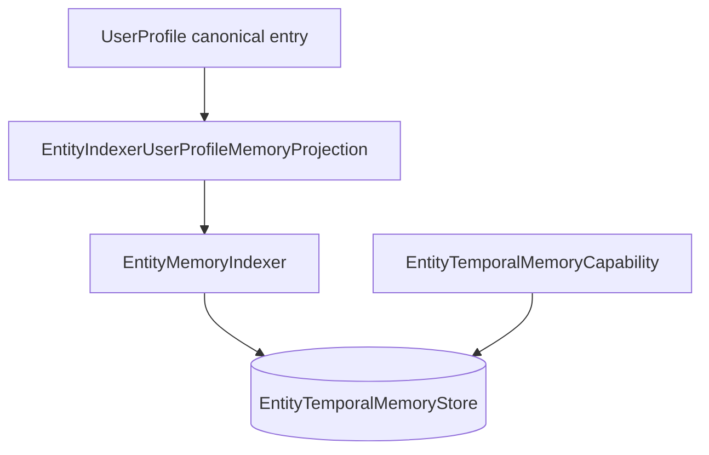
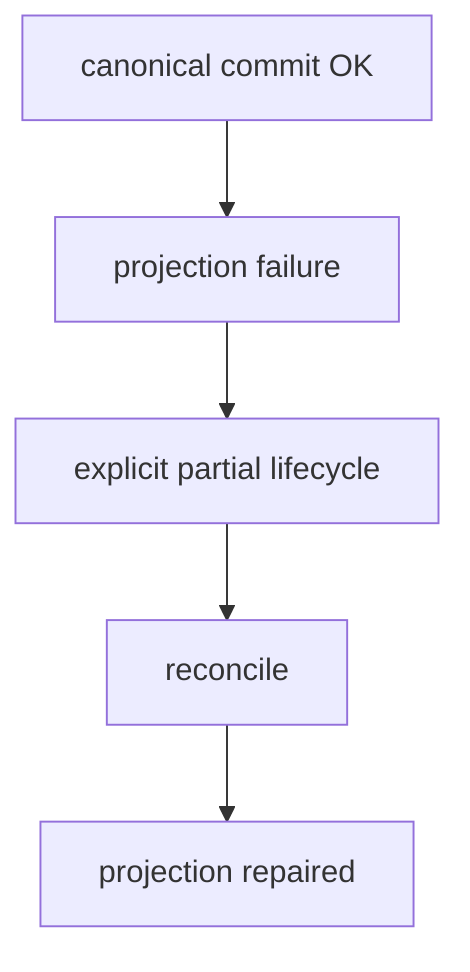
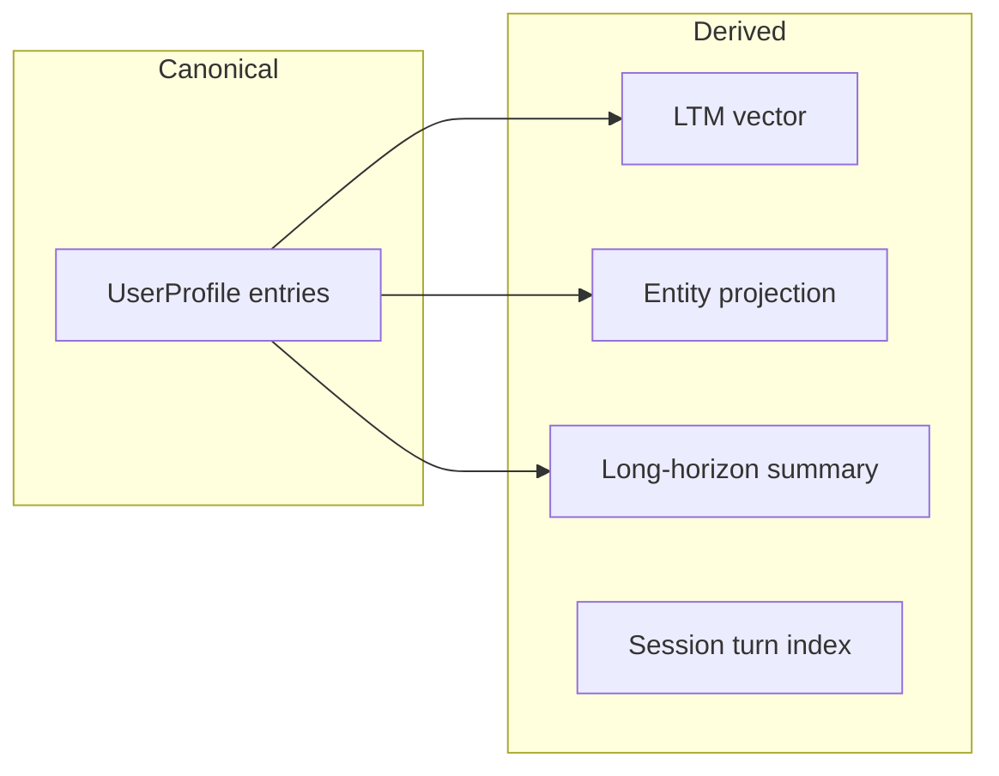

# Memory — Enterprise architecture

**This document is the canonical maintainer-level architecture reference for the Integrax Memory layer.**

**Status:** **ENTERPRISE CERTIFIED / CLOSED** at **`4db4bb69671c7f6091284e448e2d09094ebd54cd`** (**MEM-ENTERPRISE-CLOSURE**). Prior **MEM-FINAL-AUDIT-7-R2** documentation certification and **MEM-FINAL-ZERO-GAP-AUDIT-R2** (`PASS — ZERO MATERIAL GAPS FOUND`) remain in the qualification ledger. Bounded certified surface and non-certified boundaries: [`MEMORY_FINAL_ENTERPRISE_AUDIT.md`](../maintainers/qualification/MEMORY_FINAL_ENTERPRISE_AUDIT.md) § MEM-ENTERPRISE-CLOSURE.
**Audience:** engineers extending stores, projections, strategies, or Tier-3 wiring  
**Domain hub (product overview):** [`MEMORY.md`](MEMORY.md)  
**Plan hub:** [`../maintainers/plans/MEMORY.md`](../maintainers/plans/MEMORY.md)  
**Diagrams (sequences & topology):** [`MEMORY_ARCHITECTURE_DIAGRAMS.md`](MEMORY_ARCHITECTURE_DIAGRAMS.md)  
**Qualification ledger:** [`../maintainers/qualification/MEMORY_FINAL_ENTERPRISE_AUDIT.md`](../maintainers/qualification/MEMORY_FINAL_ENTERPRISE_AUDIT.md) · [`../maintainers/qualification/MEMORY_PROVIDER_VENDOR_QUALIFICATION_MATRIX.md`](../maintainers/qualification/MEMORY_PROVIDER_VENDOR_QUALIFICATION_MATRIX.md)

This document describes **what the code actually does** at current `development` HEAD. It is not an aspirational target design. Git is the version source of truth (no hand-maintained doc version numbers).

## Glossary

| Term | Meaning |
| ---- | ------- |
| **Canonical source** | Authoritative source of truth for a memory scope; mutations go here first (**independent of provider durability**) |
| **Durable provider** | Provider whose persisted state survives a **certified** reopen/restart boundary for that capability (see durability matrix) |
| **Derived projection** | Secondary representation updated after canonical commit; never authority |
| **Specialized store** | Durable/query surface for a memory domain (entity, procedural, long-horizon) |
| **Capability** | Governed read/disclosure (and sometimes mutation) API over a store |
| **Indexer** | Mutation/indexing port from canonical lifecycle into a specialized store |
| **Control Plane** | Single semantic entry (`remember` / `recall` / `forget` / `reconcile` / supersession) |
| **Provider** | Replaceable implementation behind a platform contract, discovered and qualified by the host |

### Hard invariants (literal)

- **Projection is not authority.** Derived projections (LTM vector, entity indexer output, long-horizon compaction) never override canonical primary stores.
- **RAG is not Memory authority.** Document/corpus retrieval does not define remembered user state.
- **SessionTurnIndex is not USER Memory authority.** Episodic/session index is authoritative for its own `SessionTurnIndexStore` capability domain, not for user-profile canonical facts.
- **Context Engineering is final model-context authority.** Memory supplies recall outputs; CE assembles the prompt/context budget.

**PL:** Projekcja pochodna nigdy nie jest kanonicznym źródłem prawdy; RAG nie jest źródłem prawdy Memory; STI nie zastępuje UserProfile; CE decyduje o finalnym kontekście modelu.

Summaries, vector indexes, entity graph projections, and long-horizon compacted views are **derived** — not canonical user memory. Shared vector infrastructure with RAG does **not** imply shared authority.

**Authority ≠ durability:** `InMemoryUserProfileStore` may be the **canonical authority** for a lab/test runtime composition while **not** durable across process restart. Canonical source names *who owns truth*; durability names *whether the selected provider survives reopen/restart* (provider-specific, matrix-backed).

| Property | Question |
| -------- | -------- |
| **Authority** | Which component is the source of truth for a scope? |
| **Durability** | Does the **selected** provider survive certified reopen/restart boundaries? |
| **Projection** | Is the representation derived from authority? |
| **Admission** | Is the provider trusted for PRODUCT use (evidence-bound)? |

**Qualification ≠ admission:** qualification records demonstrated behavior; admission is host/profile permission to use a provider in PRODUCT composition (fail-closed when required evidence is missing).

---

## Architectural model

```text
ONE SEMANTIC MEMORY CONTROL PLANE
+
MANY SPECIALIZED MEMORY STORES / PROJECTIONS
```

Canonical user facts live in **UserProfile** (`UserProfileStore` + `UserProfileManager`). Specialized memories (entity temporal, procedural, long-horizon) have their own stores but **user-profile entries remain canonical** for cross-cutting lifecycle where wired.

### Diagram 1 — System overview



### Layer boundaries



**Dependency rule:** `contracts` are imported by implementations and composition adapters — not the reverse. Memory domain code under `intergrax/memory/` does not import Tier-3 applications.

| Composition owner (Tier-3) | Role |
| -------------------------- | ---- |
| `resolve_memory_platform_wiring` | Session + profile stores, entity indexer/capability, plugin catalog |
| `build_user_profile_manager` | Projections (entity, LTM vector) from `MemoryProfile` flags |
| `build_default_memory_control_plane` | `DefaultMemoryControlPlane` over injected capabilities |
| `entity_user_profile_memory_projection` | `EntityIndexerUserProfileMemoryProjection` bridge |

---

## Identity authority

**RequestIdentity = trusted authority** for user-scoped memory mutations and reconciliation.

- `identity.user_id` is **required** for user memory scope operations.
- Target `user_id` must **match** `identity.user_id` before mutation (`UserProfileManager._require_user_identity_match`).
- **DO NOT** construct `RequestIdentity` from raw `user_id` / `tenant_id` strings inside Memory.

### Identity through projections



`UserProfileMemoryProjectionContext` carries `identity` only; `context.user_id` is derived from `context.identity.user_id`. No reconstruction of identity inside projection adapters — they consume typed context only.

### Identity matrix

| Boundary | Receives RequestIdentity? | May reconstruct identity? |
| -------- | ------------------------: | ------------------------: |
| `MemoryControlPlane` | YES | NO |
| `UserProfileManager` | YES | NO |
| `UserProfileMemoryLifecycleCoordinator` | YES | NO |
| `UserProfileMemoryProjection` | via context | NO |
| `EntityMemoryIndexer` | YES | NO |
| `EntityTemporalMemoryCapability` | YES | NO |
| LTM tool (`ltm.write_fact`) | YES (required for durable path) | NO |

---

## Control Plane API

Implementation: `DefaultMemoryControlPlane` (`intergrax/memory/default_memory_control_plane.py`).  
Contract: `MemoryControlPlane` (`intergrax/memory/contracts/memory_control.py`).

| Operation | Implemented | Notes |
| --------- | ----------- | ----- |
| `remember` | YES | USER scope via `UserProfileManager`; governance **before** mutation |
| `recall` | YES | Pipeline + strategies; disclosure governance |
| `forget` | YES | Canonical delete + projection lifecycle |
| `reconcile` | YES | Projection repair vs canonical active set |
| `apply_memory_supersession` | YES | Lineage preserved; higher revision wins |
| `recall_session_turns` | Minimal | `EpisodicMemoryCapability` placeholder surface |

Task memory uses separate `TaskMemoryCapability` when injected; not all hosts wire it.

### Scope × operation matrix (`DefaultMemoryControlPlane`)

Authority gate on every operation: `RequestIdentity` + `MemoryControlScopeRef` → `assert_memory_scope_authorized` (`intergrax/memory/memory_scope_authority.py`).

| Scope | remember | recall | forget | supersession (`apply_memory_supersession`) | reconcile |
| ----- | -------: | -----: | -----: | -----------------------------------------: | --------: |
| **USER** | YES | YES | YES | YES | YES |
| **TASK** | YES | **NO** (raises `MemoryControlUnsupportedScope`) | YES | NO | NO |
| **SESSION** | NO | YES (session episodic path) | NO | NO | NO |

**TASK recall nuance:** `MemoryControlPlane.recall` does **not** support TASK scope. Durable task reads use **`TaskMemoryCapability.read`** (and runtime `TaskMemoryCoordinator` / `TaskMemoryPersistence`) — parallel domain, not the semantic USER recall pipeline.

**SESSION remember:** not routed through USER lifecycle; episodic capture uses SessionTurnIndex / session wiring when enabled.

### Reference-read port (MP-5F-B1 — CLOSED)

**Ownership:** Memory owns read/retrieval semantics. The public reference-read capability exposes scoped canonical references only. ContextView adapters consume it but do not own it.

Contract: `MemoryReferenceReadPort` (`intergrax/memory/contracts/memory_reference_read.py`). Default enumeration (user-profile surface, no payload hydration): `DefaultMemoryReferenceReader` (`intergrax/memory/default_memory_reference_reader.py`).

| Concern | Behavior |
| ------- | -------- |
| Scope | `MemoryReferenceReadScope` — mandatory `tenant_id` + `workspace_id`; optional `user_id` and neutral `MemoryScopedResourceRef` |
| Workspace authority | `DefaultMemoryReferenceReader` requires `MemoryReferenceReadCapabilityBinding` when user-profile capability is configured; identity, request scope, and binding tenant/workspace must align (fail-closed) |
| Shared enforcement | Control plane and reference-read surfaces share Memory-owned scope/governance primitives (`memory_scope_authority.py`) |
| Result | `MemoryRecordCanonicalRef` (`tenant_id`, `memory_id`, `revision`) — reference-first only |
| Control plane | **Not** an extension of `MemoryControlPlane` recall (which returns hydrated items); separate replaceable read port |
| MP-5 | No ContextView types in Memory; future MP-5F adapter maps refs to `ContextViewMemorySourceRef` |
| Async | Port is **async**; MP-5D source ports are sync — MP-5F adapter integration requires an explicit sync/async composition decision (not a B1 blocker) |

---

## Core flow

```text
RequestIdentity
→ MemoryControlPlane
→ capability (e.g. UserProfileManagerMemoryCapability)
→ UserProfileManager (or specialized service owner)
→ canonical mutation (UserProfileStore)
→ UserProfileMemoryLifecycleCoordinator
→ projections
→ MemoryDiagnosticEmitter (terminal outcomes)
```

Governance: `MemorySecurityGovernanceService.evaluate` — **DENY before mutation** for `REMEMBER`, `FORGET`, supersession (`_enforce_governance` in control plane).

### Diagram 2 — Write lifecycle



*Conceptual flow:* terminal observability (`MemoryDiagnosticEmitter`) is owned by the lifecycle/control boundary (see write path above); this diagram does not depict every internal emission site.

---

## Mutation ownership

```text
Strategy → typed decision
Service → orchestration
Lifecycle / manager / control boundary → mutation
Store / projection → durability / derived representation
```

Strategies (`intergrax/memory/strategies/`) produce recall/ranking/conflict decisions — they do not write stores directly.

---

## UserProfile memory (canonical)

| Concern | Owner | Code anchor |
| ------- | ----- | ----------- |
| Canonical store | `UserProfileStore` | `sqlite_user_profile_store`, `in_memory_user_profile_store`, plugins |
| Mutation orchestration | `UserProfileManager` | `user_profile_manager.py` |
| Projection lifecycle | `UserProfileMemoryLifecycleCoordinator` | `user_profile_memory_lifecycle.py` |
| Partial failure | `UserProfileMemoryLifecyclePartialError` | primary applied; projections may fail |
| Reconciliation | `reconcile_memory_projections` | compares authoritative active IDs vs projections |

**Memory entries** carry `entry_id`, `revision`, temporal fields (`valid_from` / `valid_until`), deletion/supersession flags — validated via `memory_temporal` and enterprise record helpers.

### Revision semantics (as implemented)

- **Higher revision wins** when applying updates and supersession.
- **Stale revision cannot regress** active canonical state (store/manager checks).
- **Same-revision** behavior is defined per operation in store contracts and certification tests — do not assume merge semantics without reading the specific path.

### Temporal semantics

- `valid_from` / `valid_until` parsed as ISO-8601 (`enterprise_memory_record.parse_memory_record_timestamp`).
- Activity filtering: `is_memory_entry_active` / `filter_active_memory_entries` (timezone-aware when offsets present).
- Chronology contracts: `contracts/temporal_chronology.py`.

### Supersession

Intent: `MemorySupersessionIntent` → `apply_memory_supersession`.  
**A superseded by B:** history retained, **B** is active authority, lineage fields on enterprise record (`MemoryRecordLineage`).

---

## Enterprise Memory Record

Semantics (not full class dump): `intergrax/memory/contracts/enterprise_memory_record.py`

| Field group | Role |
| ----------- | ---- |
| `memory_id` / entry identity | Stable id per logical memory |
| revision | Monotonic per entry lifecycle |
| timestamps | ISO validation; naive vs aware preserved |
| provenance | `MemoryProvenance` — source type, session/run/strategy refs |
| trust | `MemoryRecordTrust` — trust class, optional confidence |
| governance | `MemoryRecordGovernance` — data classification |
| lineage | supersedes / superseded-by links |
| evidence refs | validated claim ids where attached |

---

## Entity / temporal memory

| Role | Contract | Default implementation | Composition owner |
| ---- | -------- | ---------------------- | ----------------- |
| Persistence primitive | `EntityTemporalMemoryStore` — `contracts/entity_temporal_memory.py` | `InMemoryEntityTemporalMemoryStore` — `stores/in_memory_entity_temporal_memory_store.py` (+ plugins) | `entity_graph_wiring` |
| Governed read surface | `EntityTemporalMemoryCapability` — `contracts/entity_temporal_memory.py` | `EntityTemporalMemoryService` — `entity_temporal_memory_service.py` | `entity_graph_wiring` |
| Indexing port | `EntityMemoryIndexer` — `contracts/entity_temporal_memory.py` | `DefaultEntityMemoryIndexer` — `entity_memory_indexing.py` | `memory_wiring` |
| Projection adapter | `UserProfileMemoryProjection` — `contracts/memory_lifecycle.py` | `EntityIndexerUserProfileMemoryProjection` — `applications/_shared/entity_user_profile_memory_projection.py` | `memory_vector_wiring` |

**Store vs capability vs indexer**

| Layer | Responsibility |
| ----- | -------------- |
| **Store** | Durability and query primitives |
| **Capability** | Governed disclosure / entity lookup |
| **Indexer** | Mutations driven from canonical UserProfile lifecycle |
| **Projection adapter** | Maps `UserProfileMemoryProjection` → indexer |

### Diagram 3 — Entity projection



**Production flow:** canonical upsert/delete → lifecycle → projection → `index_memory_entry` / `remove_memory_entry`.

**Delete flow:** canonical forget/delete → projection delete → `EntityMemoryIndexer.remove_memory_entry`.

**Reconciliation:** canonical active entries → `EntityTemporalMemoryCapability.get_entity` → stale/missing → `index_memory_entry` repair (`reconcile` on projection).

Enabled when `MemoryProfile.enable_entity_graph_memory` and indexer + capability are wired (`memory_vector_wiring.build_user_profile_manager`).

---

## Procedural memory

- **Canonical source:** user-profile memory entries (promotion/indexing from source id + revision).
- **Store:** `ProceduralMemoryStore` (in-memory default + plugin).
- **Service:** `procedural_memory_service.py` — `remember_procedure`, `recall_procedures`, `apply_supersession` when store supports it.
- Steps and temporal/lifecycle invariants are enforced in service + store contracts (`contracts/procedural_memory.py`).

---

## Long-horizon memory

- **Canonical source authority:** underlying user-profile (or explicit source refs) — compaction produces **derived** summaries.
- **Not canonical memory:** LH summaries/compactions are derived; do not treat them as primary user facts.
- **Service:** `long_horizon_memory_service.py` — compaction, `recall` over derived state with source refs and temporal coverage.
- Contract: `contracts/long_horizon_memory.py`.

---

## SessionTurnIndex

| Piece | Role |
| ----- | ---- |
| `SessionTurnIndexStore` | Episodic/session vector index store contract |
| Typed adapters | `session_turn_index_rag_adapters`, `VectorSessionTurnIndexStore` |
| RAG-facing managers | Wired via `build_session_turn_index_store` when `enable_session_vector_index` |

**Qualification:** MEM-FINAL-AUDIT-5D–5F closed **real-vendor reconnect** for Qdrant, pgvector, and Chroma STI paths. MEM-ENT-15 did not include full STI product E2E; behavioral SESSION scenarios exist in audit 6. STI remains **indexed episodic authority**, not USER canonical memory.

---

## Provider / plugin architecture

```text
contracts → discovery → qualification → materialization → configured provider → Memory composition
```

| Stage | Code |
| ----- | ---- |
| Discovery | `resolver/discovery.py`, `EP_MEMORY_STORES` |
| Classification | `resolver/classifier.py` |
| Materialization | `resolver/materialization.py`, `MemoryStoreMaterializationContext` |
| Resolution | `resolver/resolver.py`, `memory_wiring.resolve_memory_platform_wiring` |
| Qualification | `provider_qualification/runner.py`, per-store checks |

### Qualification types

| Kind | Meaning |
| ---- | ------- |
| Contract qualification | Protocol shape and required methods |
| Behavioral qualification | Semantic tests against reference behavior |
| Durable qualification | Restart/reopen evidence per [`MEMORY_PROVIDER_VENDOR_QUALIFICATION_MATRIX.md`](../maintainers/qualification/MEMORY_PROVIDER_VENDOR_QUALIFICATION_MATRIX.md) |
| Adapter recreation only | In-memory re-instantiation — not durable reopen |
| Real durable reopen / reconnect | SQLite reference (MEM-FINAL-AUDIT-5B V5) and **qualified real-vendor paths** (e.g. Mongo UserProfile 5C/5C-R, STI 5D–5F V6 reconnect) |

**Mongo-backed UserProfile (current):** `DocumentStoreUserProfileStore` → Integration `DocumentStore` → MongoDB provider. Qualified in **MEM-FINAL-AUDIT-5C / 5C-R** as **V6 REAL-VENDOR DURABILITY/RECONNECT QUALIFIED** for composite identity `provider_id=document_store.user_profile`, `backing_provider_id=mongodb`. Proof covers **provider/client recreation and reconnect** (`REAL_VENDOR_RECONNECT`); it does **not** certify Mongo **service restart**, HA/failover, crash recovery, or power-loss recovery. Evidence is **not** transferable to other DocumentStore backings.

**Historical (MEM-ENT-15):** at that milestone, external durable vendor E2E was **not** in the MEM-ENT-15 suite — **superseded** by MEM-FINAL-AUDIT-5C/5C-R and the provider matrix. **SQLite** remains the **reference** durable local harness for UserProfile (5B V5); it is not the only qualified durable/reconnect UserProfile path.

**Persistence abstraction:** persistence is accessed through platform contracts/providers. Domain services must not branch on vendor implementation details.

**CAS:** `ConditionalDocumentStore` ownership stays in **Integration** — Memory does not own that contract.

### Diagram 4 — Provider pipeline


Platform code depends on **contracts**; provider implementations are **replaceable**.

---

## Partial failure and reconciliation

**Canonical write can succeed while projection fails.**

Then:

- Canonical remains authority.
- Lifecycle disposition is explicit (`MemoryLifecycleDisposition`, projection evidence).
- `UserProfileMemoryLifecyclePartialError` may surface to callers.
- **Reconciliation** repairs derived state from canonical active entries.

**Who calls reconcile:** `MemoryControlPlane.reconcile` → `UserProfileManager.reconcile_memory_projections` → per-projection `reconcile` with `UserProfileMemoryReconciliationContext` (profile snapshot + authoritative active ids).

**Reconciliation cannot:** change canonical truth to match a stale projection; it only repairs derived views.

### Diagram 5 — Failure / recovery



### Failure matrix

| Failure | Canonical state | Projection state | User-visible result | Recovery |
| ------- | --------------- | ---------------- | ------------------- | -------- |
| Governance DENY | unchanged | unchanged | DENIED diagnostic | fix policy / request |
| Store error on primary | rollback / error | not run | FAILED | retry per store semantics |
| Primary OK, projection fail | committed | inconsistent | PARTIAL / exception | `reconcile` |
| Recall disclosure DENY | unchanged | n/a | empty / DENIED | governance |

---

## Concurrency and retry (MEM-ENT-14)

| Claim | Evidence |
| ----- | -------- |
| Per-instance `RLock` on `InMemoryEntityTemporalMemoryStore` | implementation-level only |
| Thread concurrency proofs | reference in-memory entity store tests |
| Async tenant isolation | controlled certification tests |
| Protocol-wide thread safety | **NOT** universally guaranteed |

**DO NOT** document “Memory is fully thread-safe.”  
**DO NOT** introduce a global Memory asyncio/thread lock as generic policy.

Retry: idempotency and ambiguous-commit handling are documented per path in MEM-ENT-14 tests — there is **no** global retry engine.

---

## Observability

```text
Canonical execution identity (TaskId / RunId / AttemptId / ExecutionId) — platform authority
        ↓ optional projection (never minted by Memory)
Memory operation
        ↓
MemoryDiagnosticEvent (event_id ≠ execution_id)
        ↓
MemoryObservabilitySink (pluggable; not vendor-specific)
```

- `MemoryDiagnosticEmitter` + `MemoryObservabilitySink`
- Terminal outcomes: SUCCESS / DENIED / FAILED / PARTIAL / reconcile semantics
- Optional execution correlation fields on `MemoryDiagnosticEvent`: `task_id`, `run_id`, `attempt_id`, `execution_id` (MEM-HARDEN-FINAL-2). Standalone Memory outside execution flow leaves them `None`.
- **W3C trace propagation on Memory diagnostic events:** **NOT INTEGRATED** (no `traceparent` on `MemoryDiagnosticEvent`). Platform/runtime may emit W3C tracing separately.
- Sink failure isolation (MEM-ENT-14) — diagnostics **are not** business authority

---

## Governance matrix

| Operation | Governance stage | Before mutation? |
| --------- | ---------------- | ---------------- |
| remember | `MemoryGovernanceOperation.REMEMBER` | YES |
| forget | FORGET | YES |
| supersession | supersession ops | YES |
| recall | disclosure evaluation | before return (not mutation) |
| specialized mutation | `memory_specialized_mutation_governance` | YES where wired |

Source governance authority: `canonical_memory_governance_source_authority.py`.

---

## Environment configuration (`MemoryProfile`)

Real flags (`applications/contracts/environment_profile/sub_profiles.py`):

| Flag | Effect (wiring) |
| ---- | ---------------- |
| `enable_user_memory` | `UserProfileManager` |
| `enable_long_term_memory` | LTM vector projection + RAG stack needs |
| `enable_entity_graph_memory` | Entity projection when indexer+capability present |
| `enable_procedural_memory` | Procedural service/store resolution |
| `enable_long_horizon_memory` | Long-horizon service/store |
| `enable_session_vector_index` | Session turn index store |
| `enable_org_memory` | Organization profile store when integrated |
| `enable_task_memory` | Task KV (host-dependent) |
| `*_store_plugin_id` | Plugin selection for each store surface |

Entity graph: **enabled** → projection wired in `build_user_profile_manager`; **disabled** → no entity projection (MEM-ENT-15 R3 certification).

---

## Production wiring

```text
resolve_memory_platform_wiring(env)
  → user_profile_store, entity_store, entity_memory_indexer, entity_temporal_memory_capability
  → specialized_memory: procedural/long-horizon stores (flag-gated); capabilities when canonical authorities injected
wire_application_environment(env)
  → ApplicationEnvironmentWiring.specialized_memory (stores; capabilities only with authority injection)
build_user_profile_manager(store, env, …, entity_memory_indexer, entity_temporal_memory_capability)
  → UserProfileManager + projections
build_default_memory_control_plane(user_profile_manager=…)
  → DefaultMemoryControlPlane
```

Entity temporal, procedural, and long-horizon **default** providers are in-memory reference implementations — **not** durable production stores. Production admission for persistent USER/LTM/STI does not transfer to these specialized surfaces without matrix-backed vendor evidence.

LTM tool: `ltm.write_fact` requires trusted `RequestIdentity` via control plane or explicit extras — **fails closed** without it (`MemoryControlAccessDenied`).

`ctx.extras` for control plane / identity is an **integration detail**, not the preferred public API for new hosts.

---

## Pluginability map

| Mechanism | Contract | Default implementation | Replaceable? | Composition owner |
| --------- | -------- | ---------------------- | ------------ | ----------------- |
| UserProfile store | `UserProfileStore` / plugin | In-memory, SQLite bundle | YES | `memory_wiring` |
| Entity store | `EntityTemporalMemoryStore` (`contracts/entity_temporal_memory.py`) | `InMemoryEntityTemporalMemoryStore` + plugins | YES | `entity_graph_wiring` |
| Entity indexer | `EntityMemoryIndexer` (`contracts/entity_temporal_memory.py`) | `DefaultEntityMemoryIndexer` (`entity_memory_indexing.py`) | YES | `memory_wiring` |
| Entity capability | `EntityTemporalMemoryCapability` (`contracts/entity_temporal_memory.py`) | `EntityTemporalMemoryService` (`entity_temporal_memory_service.py`) | YES | `entity_graph_wiring` |
| Projections | `UserProfileMemoryProjection` | entity + LTM vector | YES | `memory_vector_wiring` |
| Qualification checks | per-store check modules | bundled suite | YES (plugins) | host runner |
| Long-horizon | `LongHorizonMemoryStore` | in-memory plugin (NON-DURABLE REFERENCE) | YES | `specialized_memory_wiring` + `memory_wiring` |
| Procedural | `ProceduralMemoryStore` | in-memory plugin (NON-DURABLE REFERENCE) | YES | `specialized_memory_wiring` + `memory_wiring` |
| SessionTurnIndex | `SessionTurnIndexStore` | vector adapter | YES | `memory_vector_wiring` |
| Observability sink | `MemoryObservabilitySink` | default emitter | YES | `memory_observability_wiring` |
| Recall strategies | `MemoryRecallStrategySet` | defaults bundle | YES | control plane injection |

---

## Hard invariants vs replaceable strategies

### Hard invariants

- Trusted identity — no synthetic `RequestIdentity` in Memory
- Scope isolation (tenant/user)
- Revision monotonicity and timestamp validity
- Canonical source authority
- No projection-as-authority
- No layer bypass (control → manager → lifecycle → store)
- Governance DENY before mutation (user paths)

### Replaceable

- Store/provider implementations
- Projection implementations
- Indexers
- Strategy implementations
- Observability sinks
- Qualification plugins

---

## Public API table

| API / Contract | Responsibility | Canonical? | Pluggable? |
| -------------- | -------------- | ---------- | ---------- |
| `MemoryControlPlane` | Semantic ops | orchestrates canonical | implementation injectable |
| `UserProfileStore` | User profile durability | YES (user facts) | YES |
| `UserProfileManager` | CRUD + lifecycle | owns canonical mutations | wiring |
| `UserProfileMemoryProjection` | Derived sync | NO | YES |
| `EntityTemporalMemoryStore` | Entity persistence | specialized | YES |
| `EntityTemporalMemoryCapability` | Governed entity read | NO (view) | YES |
| `EntityMemoryIndexer` | Entity write path | NO | YES |
| `ProceduralMemoryStore` | Procedure storage | specialized | YES |
| `LongHorizonMemoryStore` | Compacted derived | derived | YES |
| `MemorySecurityGovernanceService` | Policy | n/a | YES |
| `MemoryDiagnosticEmitter` | Diagnostics | n/a | YES |

---

## Store matrix

| Store | Scope | Authority / projection | Durable options | Qualification |
| ----- | ----- | ---------------------- | --------------- | ------------- |
| UserProfileStore | user/tenant | **canonical** | SQLite, Mongo doc, in-memory, plugin | user_profile_store checks |
| EntityTemporalMemoryStore | entity/temporal | specialized + **derived from profile** when projected | in-memory, plugin | entity_temporal checks |
| ProceduralMemoryStore | procedural | specialized | in-memory, plugin | procedural checks |
| LongHorizonMemoryStore | long-horizon | **derived** summary | in-memory, plugin | long_horizon checks |
| SessionTurnIndexStore | session episodic | **projection/index** | vector-backed | session_turn_index checks |
| LTM vector index | user LTM | **projection** | integration vector | behavioral + wiring |

---

## Authority model (concern → canonical authority)

| Concern | Canonical authority |
| ------- | ------------------- |
| USER identity | `RequestIdentity` (trusted; not reconstructed from payload) |
| Tenant / workspace scope | `RequestIdentity` + `MemoryControlScopeRef.tenant_id` alignment |
| USER Memory truth | `UserProfileStore` via `UserProfileManager` |
| SESSION episodic retrieval | `SessionTurnIndexStore` / episodic capability (STI domain) |
| TASK durable state | `TaskMemoryPersistence` (+ `TaskMemoryCoordinator` runtime) |
| Organization state | `OrganizationProfileStore` / `OrganizationProfileManager` |
| Model context | Context Engineering (Nexus context assembly) |
| Semantic LTM projection | Derived; never canonical |
| RAG evidence | Evidence retrieval; never Memory authority |

**Tenant isolation:** identical `user_id` in two tenants is **not** the same memory scope (`assert_memory_scope_authorized` enforces `scope.tenant_id == identity.tenant_id`).

**Organization mapping (runtime):** `session.tenant_id` is passed as `organization_id` when loading org profile instructions (`intergrax/runtime/nexus/session/session_profile_instructions.py`). The org store does not infer organization authority from payloads alone.

**TASK keys (durable):** `tenant_id`, task identity in outer persistence model, `namespace`, `key` on `TaskMemoryPersistence` — distinct from `MemoryControlPlane` TASK scope refs (orchestration layer).

## Authority map

| Mechanism | Canonical / Derived |
| --------- | ------------------- |
| UserProfile memory entries | **Canonical** |
| UserProfileStore | **Canonical** authority (durability depends on selected provider — see durability matrix) |
| LTM vector projection | Derived |
| Entity graph from profile projection | Derived |
| EntityTemporalMemoryStore content | Specialized derived representation |
| Procedural indexed procedures | Specialized (source refs to profile) |
| Long-horizon compaction | Derived |
| SessionTurnIndex | Derived index |
| Memory diagnostics | Neither (observability only) |

### Diagram 6 — Authority map (optional)



---

## Extension guides

| Guide | Path |
| ----- | ---- |
| New UserProfile / store provider | [`MEMORY_PROVIDER_EXTENSION_GUIDE.md`](MEMORY_PROVIDER_EXTENSION_GUIDE.md) · [`MEMORY_STORE_PLUGIN_AUTHOR_GUIDE.md`](../technical/guides/MEMORY_STORE_PLUGIN_AUTHOR_GUIDE.md) |
| New projection | [`MEMORY_PROJECTION_EXTENSION_GUIDE.md`](MEMORY_PROJECTION_EXTENSION_GUIDE.md) |

### Developer onboarding — “If you are adding…”

- **Provider:** implement contract → register plugin → pass qualification → wire via `MemoryProfile` plugin id.
- **Projection:** implement `UserProfileMemoryProjection`; accept `UserProfileMemoryProjectionContext`; support reconcile.
- **Strategy:** implement recall/promotion strategy bundle hooks; no direct store writes.
- **New memory type:** define contract, authority, lifecycle owner, projection role, governance, qualification, observability, recovery (checklist in projection guide).

### Extension checklist

| Question | Required answer |
| -------- | ---------------- |
| Contract exists? | YES |
| Who owns canonical truth? | Named store/manager |
| Projection or authority? | One clear role |
| Pluginable? | Via contract + qualification |
| Identity propagated? | `RequestIdentity` end-to-end |
| Scope enforced? | tenant/user guards |
| Failure represented? | lifecycle disposition / errors |
| Reconciliation? | For derived surfaces |
| Provider qualified? | Host runner evidence |
| Observed? | Diagnostic terminal events |
| Tests? | unit + integration path |

---

## Anti-patterns (DO NOT)

| DO NOT | Why |
| ------ | --- |
| Construct `RequestIdentity` from `user_id`/`tenant_id` strings inside Memory | Breaks trusted identity model |
| Import vendor store/client into Memory service/domain logic | Violates persistence abstraction |
| Treat entity/vector/procedure/LH projection as canonical | Derived projection is never authority |
| Bypass lifecycle/control/manager to mutate stores directly | Breaks governance and partial-failure semantics |
| Use `getattr`/`setattr`/`hasattr` for typed platform architecture | Use contracts |
| External access to private owner state | Encapsulation |
| New `dict[str, Any]` in public Memory contracts | Prefer typed models |
| Global Memory lock as generic concurrency policy | Not guaranteed; per-store only |
| `ContextVar` / thread-local / global identity cache for authority | Hidden side channel |

---

## E2E certification scope

### MEM-ENT-15 suite (historical baseline)

Within the **MEM-ENT-15** qualification suite: control plane lifecycle, trusted identity, governance, entity projection, revision, temporal, procedural, long-horizon, reconciliation, observability, SQLite durable restart, plugin contract replaceability, scope isolation, resilience paths exercised in that suite.

Use phrase **“Memory core and MEM-ENT-15 certified paths”** — not “fully certified” without scope.

**Superseded vendor status:** MEM-FINAL-AUDIT-5B–5G and MEM-FINAL-AUDIT-6-R2 extend evidence beyond MEM-ENT-15. **Current** provider qualification is in [Current certified provider status](#current-certified-provider-status) and the [provider matrix](../maintainers/qualification/MEMORY_PROVIDER_VENDOR_QUALIFICATION_MATRIX.md).

### Explicitly not certified (current)

| Area | Status |
| ---- | ------ |
| Mongo UserProfile **service restart / HA / power loss** | NOT TESTED (5C reconnect ≠ service restart) |
| STI Qdrant/pgvector/Chroma **service restart / HA / power loss** | NOT TESTED (5D–5F reconnect qualified) |
| Distributed failover | Not certified |
| Load / performance | Not certified |
| Cross-layer Memory × CE × Tools × RAG | **MEM-XINT-1** |

### Certification evidence map

| Claim | Evidence test area |
| ----- | ------------------ |
| Identity propagation | MEM-ENT-15 E2E, MEM-ENT-1R* |
| Concurrency | MEM-ENT-14 |
| Durable reopen | MEM-ENT-13C, MEM-ENT-15 |
| Provider replaceability | MEM-ENT-13, MEM-ENT-15 |
| Entity projection | MEM-ENT-7, MEM-ENT-15 |
| Production wiring | MEM-ENT-15 R3, `test_reference_hosts_memory_bridge` |

---

## PR review checklist

- [ ] contract exists
- [ ] canonical authority defined
- [ ] identity explicit
- [ ] no vendor coupling
- [ ] governance enforced
- [ ] failure semantics explicit
- [ ] reconciliation path exists
- [ ] observability exists
- [ ] qualification exists
- [ ] tests exist

---

## Final architecture status

**Memory control plane:** behaviorally qualified (MEM-FINAL-AUDIT-6-R2). **Architecture narrative:** **MEMORY ARCHITECTURE — DOCUMENTATION CERTIFIED** (MEM-FINAL-AUDIT-7-R2). Use **certified behaviors / documented guarantees / known limitations** — not marketing claims (HA, horizontal scale, universal thread-safety, power-loss).

**Cross-layer integration** with Context Engineering, RAG, and Tools remains **MEM-XINT-1** (out of MEM-FINAL-AUDIT-7 scope).

---

## MEM-FINAL-AUDIT-7 — certification overlay

### Source-of-truth hierarchy

1. Contracts (`intergrax/memory/contracts/`)
2. Canonical Memory Control Plane (`DefaultMemoryControlPlane`)
3. Canonical primary stores (`UserProfileStore`, `TaskMemoryPersistence`, `OrganizationProfileStore`)
4. Projection contracts (`UserProfileMemoryProjection`, STI as indexed episodic store)
5. Provider abstractions + qualification descriptors
6. Provider implementations (`intergrax/memory/stores/`, runtime task/org stores)
7. Vendor integrations (SQLite file, Mongo `DocumentStore`, Qdrant/pgvector/Chroma via vector ports)
8. Composition roots (`applications/_shared/memory_*_wiring.py`, `resolve_memory_platform_wiring`)
9. Application / runtime consumers (CE, Nexus, tools)

### One host-owned control plane

Production hosts wire **one** canonical `MemoryControlPlane` instance (`build_default_memory_control_plane`). Duplicate planes are not normal architecture.

### Conflict vs supersession

| Situation | Semantics |
| --------- | --------- |
| Two active contradictory facts without lineage | Recall conflict strategies may surface **unresolved conflict** (behavioral scenarios) |
| Explicit `apply_memory_supersession` | **Resolved:** old record superseded; new record current; lineage on enterprise record |

### Projection lifecycle outcomes (actual enums)

| Primary | Projection | `MemoryLifecycleDisposition` / reconciliation |
| ------- | ---------- | --------------------------------------------- |
| success | success | `CONSISTENT` |
| success | fail | `PARTIAL_PROJECTION_FAILURE` → reconcile required |
| delete success | projection delete fail | `PARTIAL_PROJECTION_FAILURE` |
| reconcile repaired projection | — | `MemoryProjectionReconciliationDisposition.REPAIRED` / aggregate `MemoryReconciliationDisposition.REPAIRED` |
| already consistent | — | `CONSISTENT` |
| reconcile failed | — | `MemoryReconciliationDisposition.FAILED` |

**Hard rule:** reconciliation repairs **derived** state from canonical active IDs; it never promotes projection to authority.

### Temporal states (code-backed)

Active filtering uses `memory_temporal.is_memory_entry_active` / enterprise record flags (active, validity window, deleted, superseded lineage). Do not claim states that lack fields in `UserProfileMemoryEntry` / enterprise record helpers.

### Provider materialization boundary

```text
domain/service code in intergrax/memory/ DOES NOT instantiate concrete vendors
```

Selection happens in **integration**, **provider materialization** (`resolver/materialization.py`), and **composition roots**. `ConditionalDocumentStore` belongs to **Integration**, not Memory core.

### Provider composite identity

`MemoryProviderDescriptor` (`provider_qualification.py`): `provider_id`, capability, `provider_version`, optional `backing_provider_id` / `backing_provider_version`. Qualification evidence is bound to **exact** identity — Qdrant STI evidence does not qualify pgvector/Chroma.

### STI vendor qualification (isolated)

| Semantic capability | Backing vendor | Qualification |
| -------------------- | -------------- | ------------- |
| `vector.session_turn_index` | qdrant | MEM-FINAL-AUDIT-5D — V6 reconnect qualified |
| `vector.session_turn_index` | pgvector | MEM-FINAL-AUDIT-5E — V6 reconnect qualified |
| `vector.session_turn_index` | chroma | MEM-FINAL-AUDIT-5F — V6 reconnect qualified (`REAL_VENDOR_RECONNECT` ≠ service restart proof) |

Topology: `SessionTurnIndexStore` → `VectorSessionTurnIndexStore` → neutral vector ports → `VectorstoreManager` → vendor integration. See diagrams doc § STI.

### UserProfile / Task / Organization topology (summary)

| Domain | Path |
| ------ | ---- |
| USER canonical | `UserProfileStore` ← `InMemoryUserProfileStore` · `SQLiteUserProfileStore` · `DocumentStoreUserProfileStore` (Mongo via Integration; composite qual identity `document_store.user_profile` + `mongodb`) |
| TASK durable | `TaskMemoryCoordinator` → `TaskMemoryPersistence` → `SQLiteTaskMemoryStore` (5G V5 reopen qualified) |
| Organization | `OrganizationProfileManager` → `OrganizationProfileStore` → `SQLiteOrganizationProfileStore` (5G V5) |

### Forbidden dependencies

| Forbidden dependency | Status |
| -------------------- | ------ |
| Memory core → chromadb | forbidden (guarded) |
| Memory core → qdrant SDK | forbidden |
| Memory core → psycopg/pgvector vendor | forbidden |
| Domain service → concrete SQLite provider | forbidden (composition only) |
| Projection → canonical authority override | forbidden |
| SessionTurnIndex → USER Memory authority | forbidden |
| RAG → Memory authority | forbidden |

### PRODUCT vs LAB (reachability)

| Capability / path | PRODUCT | LAB / test | Notes |
| ----------------- | ------: | ---------: | ----- |
| DefaultMemoryControlPlane + UserProfileManager | when host wires | unit/integration | Requires trusted identity |
| SQLite UserProfile durable | profile-dependent | 5B harness | Fail-closed admission when durable required |
| InMemory UserProfile | fallback in some integration profiles | default in tests | **Not** silent substitute when durable required + admission enforced |
| Mongo UserProfile | wiring exists; PRODUCT admission evidence-bound | 5C/5C-R V6 reconnect qualified (pymongo) | Not service-restart qualified; suite excluded when pymongo unavailable |
| STI Qdrant/pgvector/Chroma | `enable_session_vector_index` + RAG stack | 5D–5F suites | Client reconnect proved; service restart not universally certified |
| Task/Org SQLite | env/db paths | 5G E2E | Parallel to control plane |
| Fixture external memory plugins | STRICT overlay | qual only | Not normal PRODUCT path |

### Provider admission (trusted)

```text
provider identity → qualification evidence → admission evaluation → production composition
```

PRODUCT persistent USER paths: behavioral + **trusted durability evidence** (`MemoryProviderTrustedDurabilityStatus.DURABLE`); missing evidence → **fail-closed** (see qualification ledger MEM-FINAL-AUDIT-5A-R3).

### Fail-open vs fail-closed

| Concern | Mode |
| ------- | ---- |
| Identity / scope mismatch | fail closed (`MemoryControlAccessDenied`) |
| Missing required PRODUCT provider evidence | fail closed |
| Governance deny | fail closed |
| Projection failure after primary commit | primary preserved + `PARTIAL` / partial lifecycle |
| Observability sink failure | isolated (not business authority) |
| Optional LAB capability | per `MemoryProfile` / host profile |

### Failure taxonomy

| Failure | Expected behavior |
| ------- | ------------------- |
| Authority mismatch | DENIED |
| Governance deny | DENIED |
| Canonical store fail | FAILED |
| Projection fail after primary success | PARTIAL / `PARTIAL_PROJECTION_FAILURE` |
| Projection reconcile failure | FAILED reconciliation |
| Missing required provider | fail closed at materialization/admission |
| Observability sink failure | isolated per contract |
| Vendor unavailable | explicit provider/integration failure |

### Durability guarantee matrix (audit evidence only)

Full matrix: [`MEMORY_PROVIDER_VENDOR_QUALIFICATION_MATRIX.md`](../maintainers/qualification/MEMORY_PROVIDER_VENDOR_QUALIFICATION_MATRIX.md). Use **YES / NO / NOT TESTED / N/A** only with cited proofs.

| Capability | Provider | Persistence | Reopen / fresh provider | Process restart | Service restart | Power loss |
| ---------- | -------- | ----------- | ----------------------- | --------------- | --------------- | ---------- |
| UserProfile | SQLite | YES | YES (5B V5) | partial (composition 5B) | NOT TESTED | NOT TESTED |
| UserProfile | Mongo DocumentStore | YES (5C) | YES client reconnect | NOT TESTED | NOT TESTED | NOT TESTED |
| STI | Qdrant/pgvector/Chroma | vendor-dependent | YES reconnect (5D–5F) | NOT TESTED | NOT TESTED | NOT TESTED |
| Task memory | SQLite | YES | YES (5G V5) | subprocess 5G | NOT TESTED | NOT TESTED |
| Organization | SQLite | YES | YES (5G V5) | subprocess 5G | NOT TESTED | NOT TESTED |

### Current certified provider status

Summary only — proofs and identity binding: [`MEMORY_PROVIDER_VENDOR_QUALIFICATION_MATRIX.md`](../maintainers/qualification/MEMORY_PROVIDER_VENDOR_QUALIFICATION_MATRIX.md) · [`MEMORY_FINAL_ENTERPRISE_AUDIT.md`](../maintainers/qualification/MEMORY_FINAL_ENTERPRISE_AUDIT.md).

| Path | Current qualification (high level) |
| ---- | ------------------------------------ |
| SQLite UserProfile | V5 durable restart/reopen qualified (5B reference harness) |
| Mongo UserProfile (`document_store.user_profile` + `mongodb`) | **V6 REAL-VENDOR DURABILITY/RECONNECT QUALIFIED** (5C/5C-R); composite adapter/backing identity enforced; **not** service-restart qualified |
| Qdrant / pgvector / Chroma STI | **V6 REAL-VENDOR DURABILITY/RECONNECT QUALIFIED** (5D–5F); production admission enforced where applicable; service restart / HA **not** certified |
| SQLite Task memory | V5 durable restart/reopen qualified (5G) |
| SQLite Organization profile | V5 durable restart/reopen qualified (5G) |
| Memory Control Plane behavior | **BEHAVIORALLY QUALIFIED** (6-R2): 34 real scenarios, zero hard violation counters |

Cross-vendor evidence reuse is **forbidden** (Mongo DocumentStore proof does not qualify other backings; Qdrant STI proof does not qualify pgvector/Chroma).

### Behavioral qualification (MEM-FINAL-AUDIT-6-R2)

**Memory Control Plane — Behaviorally Qualified:** 34 real behavioral scenarios, shared `BehaviorEvalContext`, zero hard violation counters, two deterministic aggregate runs, semantic smoke metrics **n=2** (not production-scale semantic benchmark).

Hard invariant counters (must remain 0 in qual runs): `cross_tenant_leaks`, `cross_user_leaks`, `deleted_resurrections`, `superseded_as_current`, `projection_only_ghosts`, `identity_authority_violations`.

### Security attack examples

| Attack | Result |
| ------ | ------ |
| User A identity + user B scope | DENIED |
| Tenant A identity + tenant B scope | DENIED |
| Same user ID across tenants | Isolated scopes |
| Stale projection after delete | Filtered by canonical authority on recall |

### Data ownership

| Data | Owner |
| ---- | ----- |
| USER canonical profile/memory | UserProfile domain |
| SESSION episodic turns | SessionTurnIndex / episodic capability |
| TASK state | Task memory domain |
| Organization profile | Organization domain |
| Vector embeddings (LTM/STI) | projection / provider layer |
| Final model context | Context Engineering |

### Lifecycle ownership

- **Primary mutation:** `UserProfileManager` + store contracts
- **Projection lifecycle:** `UserProfileMemoryLifecycleCoordinator`
- **Reconciliation:** `reconcile` / `reconcile_memory_projections` (USER scope only on plane)

### Retry / consistency

- **No global retry engine** in Memory; provider-local behavior only where implemented.
- Distinguish **canonical store consistency**, **projection eventual repair**, and **vector projection consistency** — no blanket “strongly consistent” claim.

### Governance ≠ identity

`assert_memory_scope_authorized` enforces **scope authorization**; `MemorySecurityGovernanceService` enforces **memory governance policies** (remember/recall/forget/supersession). Both fail closed on deny.

### Pluginability (contract-level)

| Capability | Contract | Default | Replaceable externally |
| ---------- | -------- | ------- | ---------------------- |
| UserProfile store | `UserProfileStore` | SQLite / InMemory / DocumentStore | YES |
| Task memory | `TaskMemoryPersistence` | SQLite when configured | YES |
| Organization profile | `OrganizationProfileStore` | SQLite bundle | YES |
| STI vector backing | `SessionTurnIndexStore` | Vector adapter | YES |
| Projections | `UserProfileMemoryProjection` | LTM vector + entity | YES |
| Recall strategies | `MemoryRecallStrategySet` | defaults bundle | YES |
| Governance strategies | policy inject on `MemorySecurityGovernanceService` | defaults | partial (invariants fixed) |
| Diagnostics sink | `MemoryObservabilitySink` | default emitter | YES |

**Hard platform invariants (not strategies):** trusted identity, tenant/user scope authority, canonical primary authority, projection-not-authority, lineage integrity, governance envelope, revision/timestamp validity.

### Extension — new provider (safe)

1. Implement platform contract  
2. Expose canonical `MemoryProviderDescriptor` identity  
3. Register materialization / discovery  
4. Add qualification evidence  
5. Map admission for PRODUCT paths  
6. Add contract tests (+ real-vendor tests if external)  
7. Do **not** change Memory domain logic  

If adding a provider requires editing semantic/domain logic → **stop and redesign the boundary.**

### Change impact matrix

| Change | Mandatory regression |
| ------ | -------------------- |
| `MemoryControlPlane` contract | behavioral + application composition |
| `UserProfileManager` | USER / lifecycle / projection |
| Vector store abstraction (STI) | vendor qual suites 5D–5F |
| Provider identity / admission | 5A + affected vendors |
| Task / Organization store | 5G |
| Recall pipeline | behavioral 6 |
| Governance | security behavioral gates |
| Projection lifecycle | lifecycle + reconcile gates |

### Maintainer onboarding — If you modify Memory, start here

1. Identify owning **contract**  
2. Identify **canonical authority** (table above)  
3. Identify **composition root**  
4. Check provider / projection implications  
5. Check **qualification impact**  
6. Run relevant audit / regression suites  

### Architecture invariants (checklist)

- Platform depends on contracts, not vendor implementations  
- Concrete vendors never imported in Memory core  
- `RequestIdentity` is trusted authority  
- Tenant/user scope enforced before semantic action  
- Canonical store wins over projections  
- Projections cannot resurrect deleted canonical data  
- Superseded records cannot become current truth without proper lineage  
- RAG does not become Memory authority  
- Provider evidence bound to exact provider identity  
- Production admission fails closed when evidence missing  
- Provider failure cannot silently select the wrong durable backend (where admission applies)  

### KNOWN NON-GUARANTEES / NOT CERTIFIED

- Power-loss recovery **not certified**  
- HA / cluster failover **not certified**  
- Qdrant / pgvector / Chroma **service restart** not universally certified (client reconnect ≠ service restart)  
- **TASK recall via `MemoryControlPlane` unsupported**  
- Mongo 5C cannot be rerun in CI without `pymongo`  
- Cross-lingual semantic quality **not** production-benchmarked  
- Semantic metric dataset is small (**n=2** smoke)  
- Distributed / load / performance claims **not** certified  
- `product_defaults` PostgreSQL-only integration may fall through to InMemory UserProfile when memory flags on — **documented P1 risk** in provider matrix  

### File index (maintainer map)

| Concern | Main files |
| ------- | ---------- |
| Control plane | `default_memory_control_plane.py`, `contracts/memory_control.py` |
| Scope authority | `memory_scope_authority.py` |
| Contracts | `contracts/*.py` |
| UserProfile | `user_profile_manager.py`, `user_profile_store.py`, `stores/*user_profile*` |
| Recall | `recall/pipeline.py`, `recall_strategy_bundle.py`, `strategies/` |
| Lifecycle | `user_profile_memory_lifecycle.py`, `contracts/memory_lifecycle.py` |
| Security / governance | `memory_security_governance_service.py`, `contracts/memory_security_governance.py` |
| Observability | `memory_diagnostic_emitter.py`, `contracts/memory_observability.py` |
| Task | `intergrax/runtime/task_memory/**` |
| Organization | `intergrax/runtime/organization/**` |
| SessionTurnIndex | `session_turn_index_service.py`, `contracts/session_turn_index.py` |
| Vector providers | `applications/_shared/memory_vector_wiring.py`, integration RAG stack |
| Composition roots | `applications/_shared/memory_wiring.py`, `memory_control_wiring.py` |
| Qualification | `provider_qualification/**`, `tests/qualification/memory_behavior/**` |

### Qualification evidence index (stages 1–7)

| Stage | Status | Evidence |
| ----- | ------ | -------- |
| MEM-FINAL-AUDIT-1 | inventory closed | [`MEMORY_FINAL_ENTERPRISE_AUDIT.md`](../maintainers/qualification/MEMORY_FINAL_ENTERPRISE_AUDIT.md) §1 |
| MEM-FINAL-AUDIT-2 | contracts / layers | same ledger §2 |
| MEM-FINAL-AUDIT-3 | security / lifecycle | same ledger §3 |
| MEM-FINAL-AUDIT-4 | provider matrix | [`MEMORY_PROVIDER_VENDOR_QUALIFICATION_MATRIX.md`](../maintainers/qualification/MEMORY_PROVIDER_VENDOR_QUALIFICATION_MATRIX.md) |
| MEM-FINAL-AUDIT-5A–5G | vendor / admission / durable | ledger §5A–5G |
| MEM-FINAL-AUDIT-6-R2 | behavioral | ledger §6-R2 · `VERIFIED_SHA` `957045d86d48d0dfab8c77384f1427e2d46ea95a` |
| MEM-FINAL-AUDIT-7 | documentation (7-R reconciliation) | this document + diagrams doc + ledger §7 / §7-R |

### Restart terminology glossary

| Term | Meaning |
| ---- | ------- |
| **reopen** | Same process, new store/provider instance on same path |
| **fresh provider** | New materialized implementation object |
| **fresh client** | New SDK/client handle (reconnect qual) |
| **fresh process** | Subprocess / new PID (5G proofs) |
| **service restart** | Vendor daemon/container restart — largely **NOT TESTED** for Memory qual |
| **cluster failover** | **NOT CERTIFIED** |
| **power-loss recovery** | **NOT CERTIFIED** |

### Zero direct vendor coupling

The Memory semantic layer must never require knowledge of a concrete vendor implementation. Custom providers must not require domain logic changes.

---

## Appendix — audited milestones

| Milestone | Baseline commit (operator pin) |
| --------- | ------------------------------ |
| MEM-ENT-15 public composition certification | `b7497564eb43050b93fa5eed00e83008b00278cb` |
| MEM-FINAL-AUDIT-6-R2 behavioral qualification | `957045d86d48d0dfab8c77384f1427e2d46ea95a` |
| MEM-FINAL-AUDIT-7 documentation certification | see qualification ledger `VERIFIED_SHA` |

Code paths remain authoritative over commit SHAs.

**Documentation status:** **MEMORY ARCHITECTURE — DOCUMENTATION CERTIFIED** (MEM-FINAL-AUDIT-7-R2 exact-SHA closure). Prior **MEM-FINAL-AUDIT-7-R** truth reconciliation preserved at `a24c251c0768c42b1c100e1228d7e4a67eb98cd9`.
