# Memory — Visual architecture (Mermaid)

**Canonical narrative:** [`MEMORY_ARCHITECTURE.md`](MEMORY_ARCHITECTURE.md)  
**Audience:** maintainers verifying flows against code at `development` HEAD.

Labels: **CANONICAL** · **CONTRACT** · **PROJECTION** · **PROVIDER** · **VENDOR** · **COMPOSITION** · **AUTHORITY**

---

## 1. Layer architecture

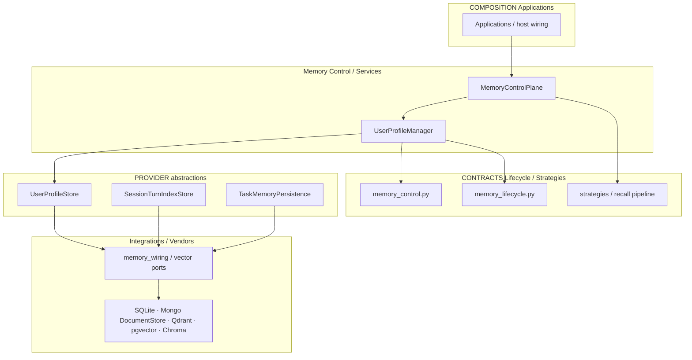

Upper layers depend on **contracts**; lower layers **implement** contracts. Memory core does not import vendor SDKs.

---

## 2. Authority map (canonical vs derived)

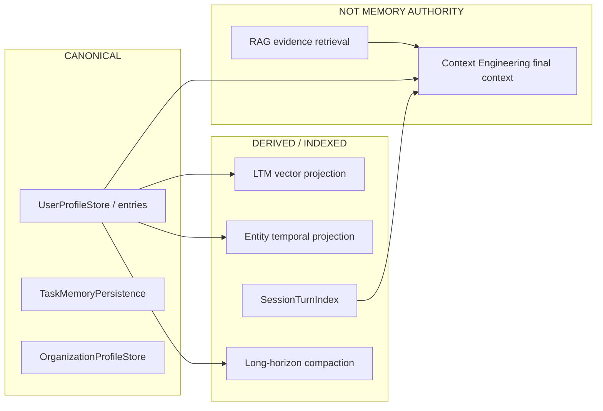

**SessionTurnIndex** is authoritative for episodic index reads in its domain; it is **not** USER Memory canonical authority.

---

## 3. USER canonical flow

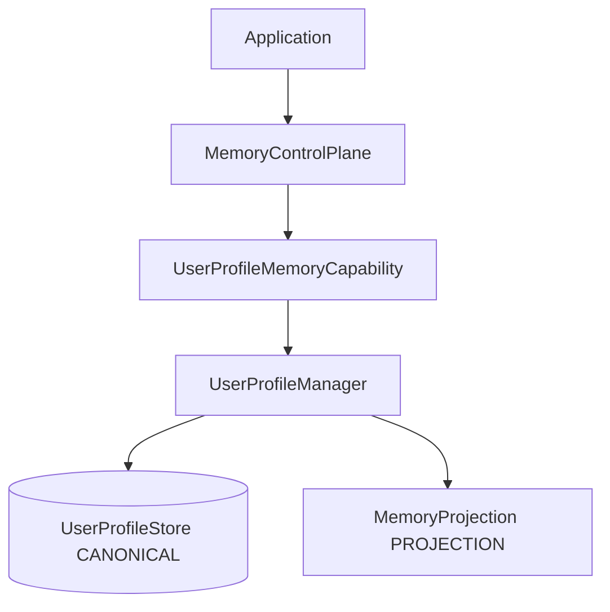

---

## 4. USER remember (sequence)

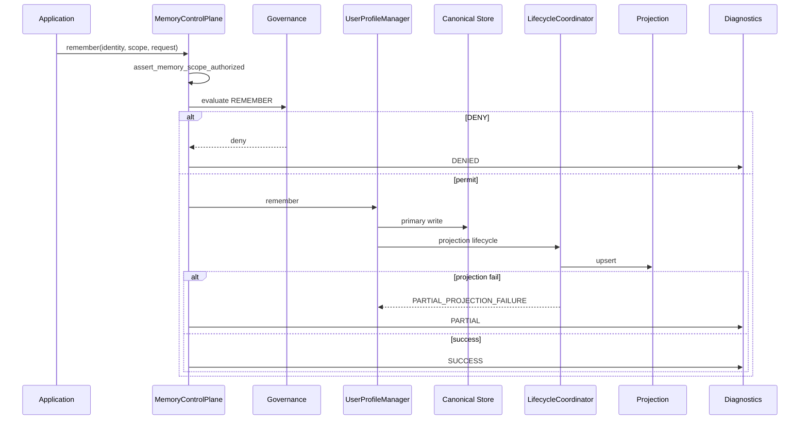

---

## 5. USER recall (sequence)

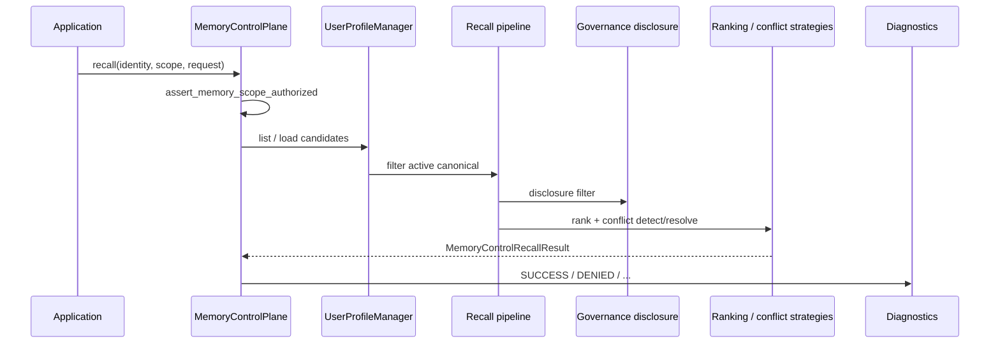

---

## 6. USER forget (sequence)

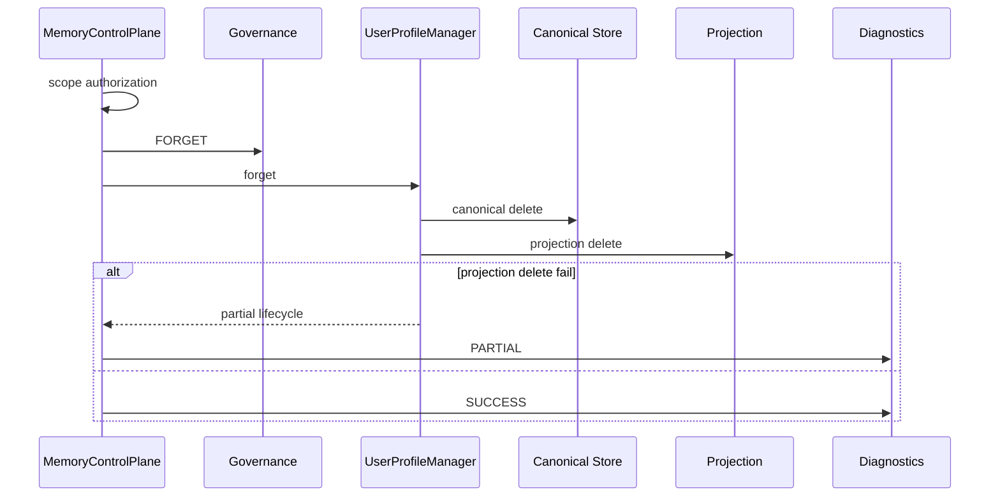

---

## 7. Supersession

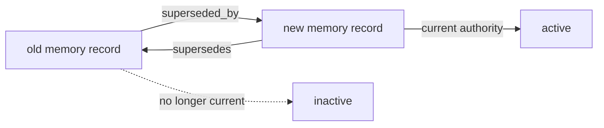

---

## 8. Projection failure and reconcile

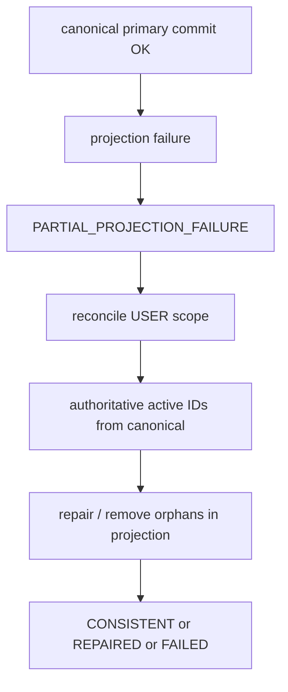

Reconciliation never flips authority to projection.

---

## 9. SESSION recall (sequence)

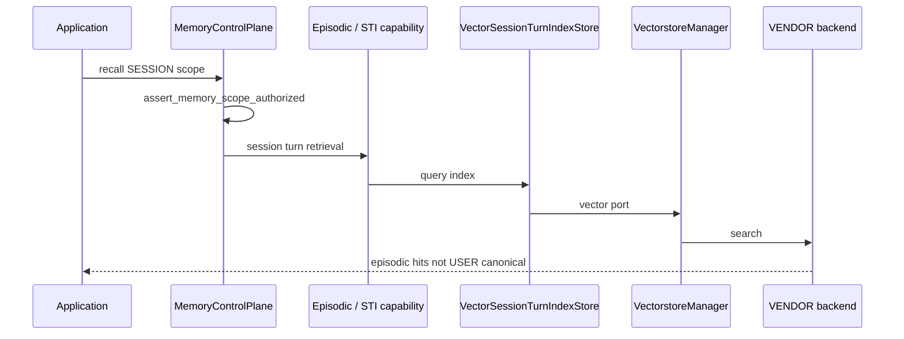

---

## 10. TASK write / forget (sequence)

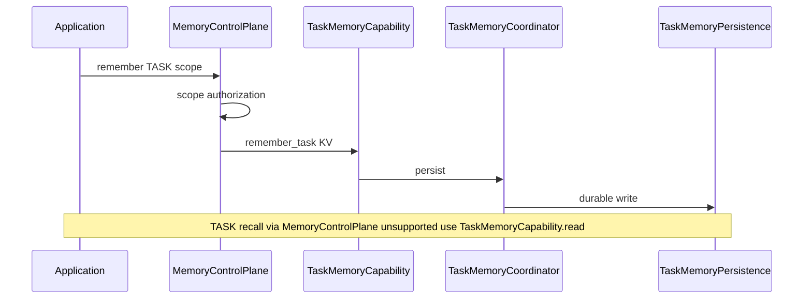

---

## 11. Organization read / write

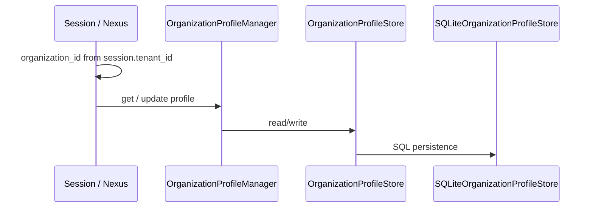

Organization authority is host-scoped (`organization_id`); store does not infer it from arbitrary payloads.

---

## 12. SessionTurnIndex vendor topology

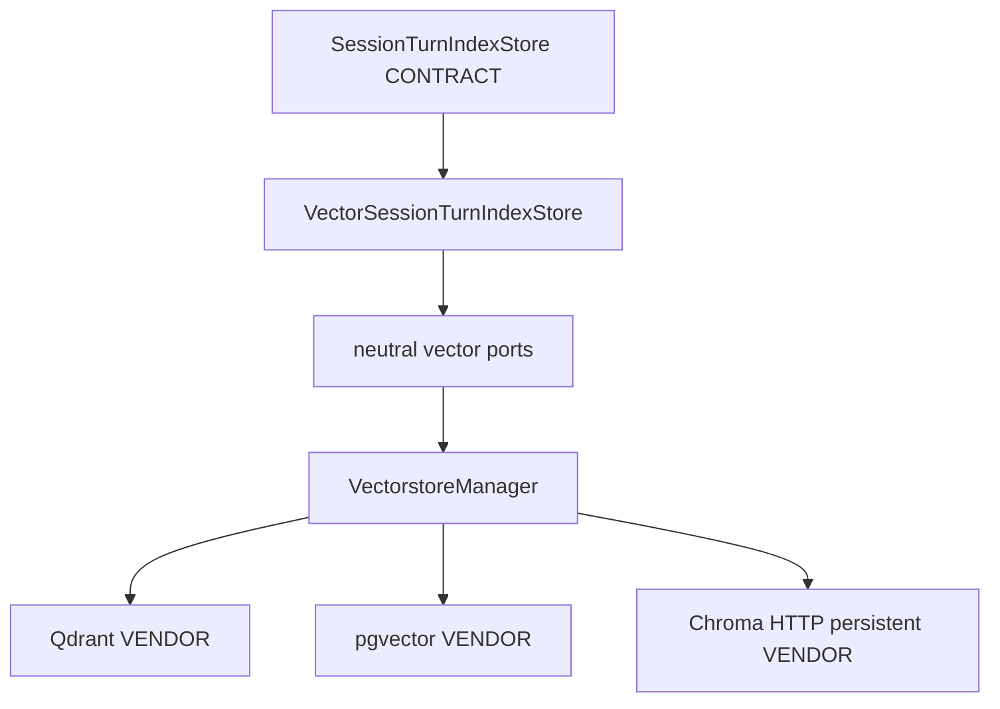

Chroma qual: HTTP persistent server, `IS_PERSISTENT=TRUE`, Docker volume, fresh `HttpClient` reconnect — **REAL_VENDOR_RECONNECT ≠ service restart proof**.

---

## 13. Task / Organization durable topology

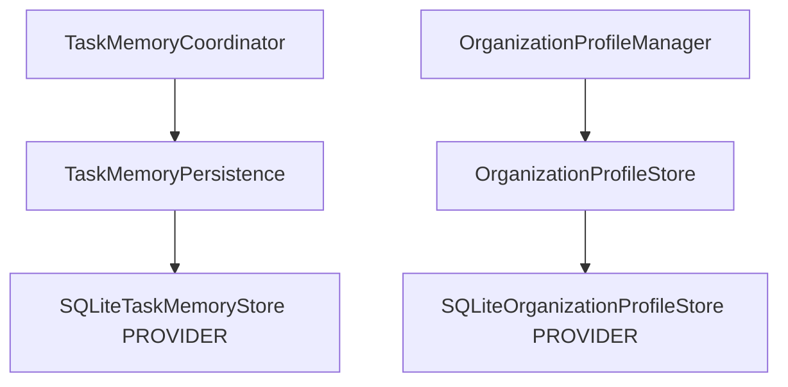

---

## 14. Provider qualification / admission

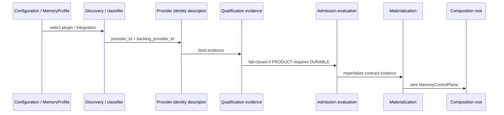

---

## 15. Security path

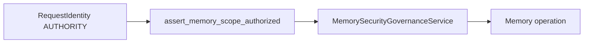

---

## 16. Observability (not authority)

Outcomes include `SUCCESS`, `DENIED`, `FAILED`, `PARTIAL`, reconcile-related failures. Sink failure does not change Memory business outcomes.

---

## 17. Context Engineering integration

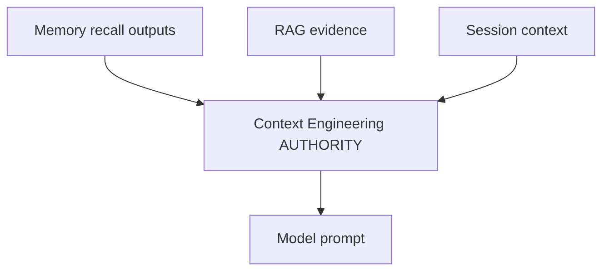

RAG retrieves documents; Memory retains canonical remembered state. Shared vector infrastructure ≠ shared authority.

---

## 18. Provider abstraction (VectorstoreManager)

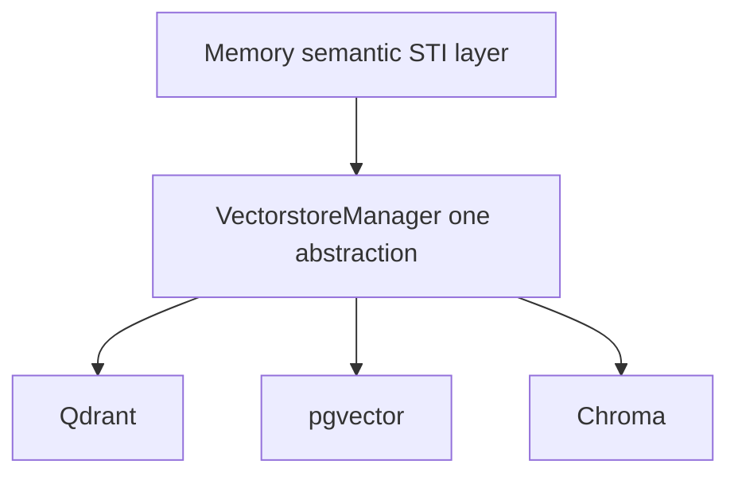

---

## Diagram count

18 Mermaid diagrams (layer, authority, flows, topology, admission, CE, observability, security). Validate syntax when editing; no screenshots.
