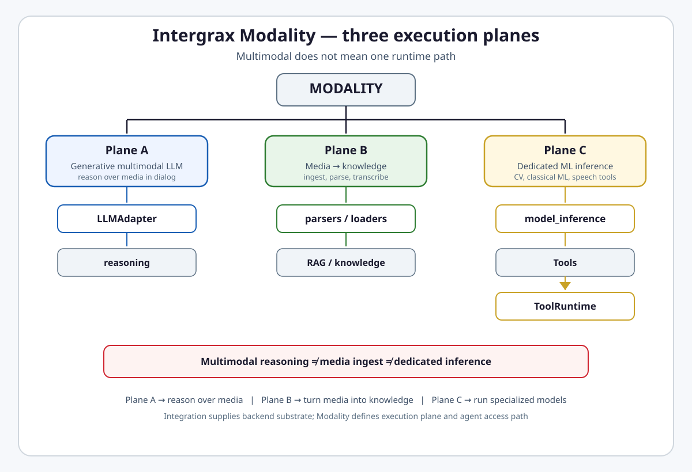

# Intergrax Modality

**Intergrax Modality** is a cross-layer architecture that separates multimodal reasoning, media-to-knowledge ingestion, and dedicated model inference into distinct governed execution planes.

## Why it matters

Without a three-plane split, everything collapses into “multimodal AI”: OCR mixes with reasoning, RAG ingest mixes with CV inference, vendor speech/vision providers mix with LLM adapters, and agents can appear to invoke models directly. Maturity on one capability wrongly transfers to the whole subsystem; heavy models can enter runtime paths without resource policy; media provenance and knowledge boundaries blur.

The three-plane model assigns clear ownership:

- **Plane A** answers whether the model can reason over image/audio/text in conversation.
- **Plane B** answers how media becomes indexable knowledge.
- **Plane C** answers how specialized models run outside generic LLM reasoning.

> [!NOTE]
> **Maturity boundary:** W-ML.0–W-ML.8 and MODALITY-LC are **Done** on the harness path — typed contracts, `model_inference`, tools, profiles, and modality metrics exist. That is **not** universal production qualification: Plane C remote serving is adapter + harness E2E, not live customer deployment proof; heavy local models require explicit execution profiles; not every backend family is shipped. Production readiness is scored **per plane** — see [Current maturity](#current-maturity).

**Primary audience:** Principal / Staff engineers, harness integrators, and extension authors wiring multimodal LLM, ingest, or dedicated inference — after the platform overview in the root README.

## At a glance

| Plane | Primary question | Owner | Agent access | Typical I/O | Runtime boundary | Provider relation | Maturity (A/I/P/E) | Main limitation |
|-------|------------------|-------|--------------|-------------|------------------|-------------------|--------------------|-----------------|
| **A — Generative LLM** | Can the model reason over media in dialog? | LLM Adapters, `LLMProfile`, attachment mapping | Nexus → `LLMProfile` → `LLMAdapter` | Multimodal messages / attachments → model response | `intergrax/llm_adapters` | Vendor multimodal APIs via adapter — **not** Integration slugs | A4 / I3 / P2 / E3 | Not every provider/model supports vision/audio; not OCR/RAG ingest |
| **B — Media → knowledge** | How does media become indexable knowledge? | Parsers/loaders, RAG ingest, knowledge boundary | Tools (`rag.ingest_document`, parsers) — not direct SDK | File/URL/audio → normalized `KnowledgeDocument` → index | `document_parser`, smart loaders, `rag/ingest` | Parser integrations (`whisper`, `docling`, …) | A4 / I3 / P2 / E3 | Extracted text ≠ semantic understanding; ingest limits vary by parser |
| **C — Dedicated inference** | How do we run specialized models outside LLM reasoning? | `model_inference`, Integration hosts, ToolRuntime | `vision.*` / `ml.*` / `speech.*` → ToolRuntime | Bytes/URI → typed detection/prediction/audio | `intergrax/model_inference` + tools | `vision_serving`, `ml_inference_host`, `speech_provider` | A4 / I2 / P1 / E2 | Remote adapters stub-fallback without URL/key; Celery may fall back locally |

**Public shortcuts:** Plane A → reason over media · Plane B → turn media into knowledge · Plane C → run specialized models.

## Flagship architecture visual

<picture>
  <source media="(prefers-color-scheme: dark)" srcset="assets/modality-planes-dark.svg">
  <source media="(prefers-color-scheme: light)" srcset="assets/modality-planes-light.svg">
  
</picture>

**Mental model:**

```text
                        MODALITY
                           │
          ┌────────────────┼────────────────┐
          ↓                ↓                ↓
       Plane A          Plane B          Plane C
    Generative LLM    Media ingest      Dedicated ML
          │                │                │
     LLMAdapter       parser/loaders    model_inference
          │                │                │
      reasoning       RAG / knowledge     Tools
                                           │
                                       ToolRuntime
```

> **Multimodal does not mean one runtime path.**

> **Public invariants**
>
> - Multimodal reasoning ≠ media ingest ≠ dedicated inference.
> - Plane A uses LLM Adapters. Plane B creates knowledge. Plane C uses specialized inference behind governed runtime paths.
> - One mature plane does not make all Modality production-ready.
> - Integration may supply a provider backend, but does not define the Modality plane.
> - Agent-invokable dedicated inference crosses **ToolRuntime** — Plane A LLM calls do not.

## How it works

1. **Host configures capability** — `ModalityProfile` (allowed planes, tool allowlist, media limits) intersects `ToolAccessPolicy` before any agent tool path runs.
2. **Plane A** — Agent/Nexus selects `LLMProfile`; multimodal attachments map through `LLMAdapter` to vendor content parts when capability flags are true.
3. **Plane B** — Media enters parsers or smart loaders; output is a canonical `KnowledgeDocument` with scope and provenance, then RAG ingest indexes it.
4. **Plane C** — Agent invokes `vision.*`, `ml.*`, or `speech.*` tools; ToolRuntime routes to `model_inference` registry/adapters with execution placement (in-process, thread pool, Celery, or remote HTTP adapter).
5. **Observability** — Plane A costs attribute to `llm_metrics`; Plane B to `rag_metrics`/parser trace; Plane C to per-tool `modality_metrics` on the runtime event spine.

## Responsibility boundaries

| Domain | Modality owns | Modality does **not** own |
|--------|---------------|---------------------------|
| **Modality** | Three-plane ownership index, agent access paths, `ModalityProfile` intersection, Plane C execution placement | Second LLM runtime, second tool engine, RAG indexing logic, Integration catalog |
| **LLM Adapters** | Plane A runtime mechanics | Plane B ingest, Plane C detectors |
| **RAG** | Indexing, retrieval, evidence after ingest | Multimodal LLM calls, CV bounding boxes |
| **Integrations** | Provider/backend substrate (`speech_provider`, `vision_serving`, `ml_inference_host`) | Which plane an capability belongs to |
| **Tools** | ToolRuntime enforcement for Plane C agent paths | Plane A adapter routing |
| **Context Engineering** | How media-derived text enters compiled context | Media parsing, model inference |
| **Tier-3 applications** | Host profiles, deployment choice, policy | Platform modality contracts |

## Relationship to Intergrax

| Neighbor | Relationship |
|----------|--------------|
| [`LLM_ADAPTERS.md`](LLM_ADAPTERS.md) | **Plane A** — multimodal flags, `AttachmentRef`, vendor mapping |
| [`RAG.md`](RAG.md) | **Plane B** — ingest, chunk, index after loaders produce `KnowledgeDocument` |
| [`INTEGRATIONS.md`](INTEGRATIONS.md) | Backend substrate for parsers, speech, remote inference hosts |
| [`TOOLS.md`](TOOLS.md) | **Plane C** agent-invokable path — `ToolRuntime` is mandatory |
| [`CONTEXT_ENGINEERING.md`](CONTEXT_ENGINEERING.md) | Media-derived content must pass normal context composition — loaders do not inject raw text into model context |
| [`OBSERVABILITY.md`](OBSERVABILITY.md#observability-event-spine) | `modality_metrics`, `llm_metrics`, `rag_metrics` on shared spine |

### Modality vs Integration

```text
Modality     → execution / semantic plane (A, B, or C)
Integration  → provider / backend substrate
```

Examples: `speech_provider` supplies TTS/STT SaaS; `vision_serving` supplies Triton HTTP; `ml_inference_host` supplies managed endpoints. Integration supplies backend; Modality defines how capability is used and which agent path applies.

### Modality vs RAG

```text
Plane B  → extracts / normalizes media into KnowledgeDocument
RAG      → chunks / indexes / retrieves / evidences knowledge
```

### Hugging Face role separation

| Role | Layer | Example |
|------|-------|---------|
| Embeddings | `rag/embedding` | `HFEmbeddingProvider` |
| Sparse / rerank | `rag` or integrations | SPLADE, `jina_rerank` |
| Hub artifacts | Governance | Pin revision, license scan |
| Hosted inference | Plane C / Integration | HF Inference API via `huggingface_inference` adapter |

HF Hub ≠ Nexus hot path. Heavy weights load in workers or remote hosts.

## Extensibility

| Surface | Extension path |
|---------|----------------|
| Plane A multimodal | New `LLMAdapter` + capability flags — see [`LLM_ADAPTERS.md`](LLM_ADAPTERS.md) |
| Plane B ingest | `document_parser` Integration plugins, smart loaders |
| Plane C vision | `VisionAdapterRegistry.register()` or built-in `VisionProvider` slug |
| Plane C speech | `IntegrationPlugin` category `speech_provider` — open catalog slug, not closed enum |
| Plane C classical ML | `ModelInferenceAdapter` + `ml.predict` tool |
| Execution | `ModalityExecutionProfile` env (`INTERGRAX_MODALITY_EXECUTION`) |
| Host governance | `ModalityProfile` on `RuntimeConfig` |

## Current maturity

Scores use [`MATURITY_TAXONOMY.md`](../technical/guides/MATURITY_TAXONOMY.md). **Evaluate each plane separately.**

| Plane | A | I | P | E | Notes |
|-------|--:|--:|--:|--:|-------|
| A — multimodal LLM | 4 | 3 | 2 | 3 | Contract + conformance tests; not universal model coverage |
| B — media ingest | 4 | 3 | 2 | 3 | Loaders + LCI-4D native document boundary; production limits vary by parser |
| C — dedicated inference | 4 | 2 | 1 | 2 | Registry/adapters shipped; remote = harness E2E, not live deployment proof |

**Conservative domain aggregate** (weakest plane pulls headline down):

| Axis | Score |
|------|------:|
| Architecture maturity | **A4** |
| Implementation maturity | **I2** |
| Production readiness | **P1** |
| Evidence maturity | **E2** |

The domain headline uses the weakest-plane value on each maturity axis. Plane C therefore currently caps implementation at I2, production readiness at P1, and evidence at E2 — one mature plane does not make all Modality production-ready.

## Evidence / proof

| Layer | Artifacts |
|-------|-----------|
| **Architecture** | This hub, [`satellites/MODALITY_tool_surface_detail.md`](satellites/MODALITY_tool_surface_detail.md), [ADR-MOD-001](../technical/adr/entries/2026-06-19/ADR-MOD-001.md) |
| **Unit / gate** | `tests/unit/llm_adapters` (multimodal flags), `tests/unit/model_inference/*` (registry, OpenCV, Celery, remote adapters, profile), `ModalityProfile` + `ToolAccessPolicy` intersection |
| **Integration** | ToolRuntime → modality tools; multimedia loader → `KnowledgeDocument` → RAG; Triton/HF adapter HTTP paths with stub fallback |
| **Public proof** | No dedicated Modality row in [`docs/project/proofs/PROOFS.md`](../proofs/PROOFS.md) — bounded harness proofs only |
| **Production / customer** | Not inferred |

## Go deeper

| Depth | Route |
|-------|-------|
| Engineering canon | [Below](#engineering-canon) |
| Tool surface detail | [`satellites/MODALITY_tool_surface_detail.md`](satellites/MODALITY_tool_surface_detail.md) |
| Implementation state | [`maintainers/plans/MODALITY.md`](../maintainers/plans/MODALITY.md) |
| LLM multimodal | [`LLM_ADAPTERS.md`](LLM_ADAPTERS.md) |
| Ingest / retrieval | [`RAG.md`](RAG.md) |
| Provider catalog | [`INTEGRATIONS.md`](INTEGRATIONS.md) |
| Tool enforcement | [`TOOLS.md`](TOOLS.md) |
| Context assembly | [`CONTEXT_ENGINEERING.md`](CONTEXT_ENGINEERING.md) |
| Telemetry | [`OBSERVABILITY.md`](OBSERVABILITY.md) |
| Maturity vocabulary | [`MATURITY_TAXONOMY.md`](../technical/guides/MATURITY_TAXONOMY.md) |

---

## Engineering canon

### Modality Production Boundary

Modality in Intergrax is **not** a single monolithic capability. Support is split into **distinct planes** with separate owners, access paths, maturity claims, and production constraints.

**Normative rule:** A component **MUST NOT** be treated as production-ready for all modalities only because one plane is implemented.

Multimodal behavior **MUST NOT** be conflated with Integration Library adapters, RAG ingest, ToolRuntime side effects, LLM adapter routing, or dedicated inference without deployment/resource profiles.

Agents and Tier-3 applications consume modality through **approved planes only**.

**Cross-refs:** [`SYSTEM_INVARIANTS.md`](../technical/guides/SYSTEM_INVARIANTS.md) · [`MATURITY_TAXONOMY.md`](../technical/guides/MATURITY_TAXONOMY.md)

---

### Plane A — Generative multimodal LLM

**Question:** “Can the model reason over image/audio/text in the conversation?”

**Owner:** LLM adapter layer + model routing/profile.

**Agent path:**

```text
Agent / Nexus → LLMProfile → LLMAdapter → multimodal provider/model
```

**Allowed:** image/audio/document inputs when provider/model supports them; multimodal output; capability declarations; token/cost/context controls.

**Must not:** bypass `LLMAdapter`; be treated as OCR/RAG ingest; own media storage; be modeled as Integration provider merely because vendor supports vision/audio.

**Implementation (as-built):**

- **Module:** `intergrax/llm_adapters` only.
- **Capabilities:** `supports_vision`, `supports_audio_input`, `supports_audio_output` on `LLMAdapter`.
- **Messages:** `intergrax/llm/messages.py` — `AttachmentRef` (`image`, `audio`, `video`, …); adapters map attachments to vendor content parts when flags are true.
- **When to use:** interactive reasoning, captioning in chat, tool planning with visual context.

Do **not** register OpenAI/Gemini/Claude as `integration` slugs.

---

### Plane B — Media/document ingest and indexing

**Question:** “How does media become indexable knowledge?”

**Mental model:**

```text
file / image / audio / video
  → parser / loader / transcription
  → normalized KnowledgeDocument
  → provenance + scope
  → RAG ingest
  → knowledge index
```

**Owner:** Document/media ingestion services, RAG ingest, parser integrations, approved tools.

**Allowed:** OCR, document parsing, audio transcription, image metadata extraction, media-to-text normalization, chunking/indexing, provenance preservation.

**Must not:** write directly to agent memory; bypass RAG ingest; bypass provenance; be treated as a general CV reasoning engine. Do not call extracted text “semantic understanding.”

**Implementation (as-built):**

| Slug / component | Role |
|------------------|------|
| `whisper`, `yt_dlp` | Audio → transcript (ingest) |
| `docling`, `pypdf`, … | Document parsers |
| `ImageSmartLoader`, `VideoSmartLoader`, audio loaders | OCR/caption/transcript → text for index |
| `HFEmbeddingProvider` | Local SentenceTransformers |
| `splade` sparse encoder | Optional hybrid sparse |

**Rule:** ingest output is **text (or embeddings)** in the knowledge layer — not a substitute for Plane C detectors in safety-critical paths unless policy allows.

#### Native document boundary (LCI-4D)

Multimedia smart loaders (image, audio, video) emit canonical `KnowledgeDocument` values with:

- deterministic `document_id` / `root_document_id` (content-addressed identity),
- `scope`: `tenant_id`, `namespace`, `workspace_id`,
- `provenance`: `source_kind`, `source_id`, plus loader metadata.

```text
media source → canonical KnowledgeDocument boundary → RAG ingest
```

OCR, caption, transcription, MIME, and frame behavior are unchanged — LCI-4D adds identity/lineage/scope consistency, not new extraction formats.

---

### Plane C — Dedicated inference / CV / classical ML

**Question:** “How do we run specialized models outside generic LLM calls?”

**Mental model:**

```text
input → model profile/registry → specialized adapter → execution placement → typed result
```

**Owner:** `intergrax/model_inference` (Tier-0, **implemented** W-ML.3+) + Integration hosts + ToolRuntime.

**Allowed:** object detection, segmentation, OCR regions, classifiers, rerankers (when configured as dedicated inference), custom ML models, GPU/remote inference hosts when configured.

**Must not:** run as hidden agent-local code; bypass ToolRuntime when agent-invokable; bypass deployment/resource profiles; silently load heavy local models in production.

#### C.1 Vision inference engine

**Module:** `intergrax/model_inference` — contracts, registry, adapters, execution layer.

**Contract:** `VisionInferenceAdapter` — uniform API over heterogeneous backends.

**Registry pattern:**

```text
VisionModelProfile / VisionProfile
  → VisionAdapterRegistry / ModelInferenceRegistry
  → VisionInferenceAdapter
  → backend
```

Structured outputs (tool-friendly): `VisionInferenceResult` (detections), `VisionSegmentationResult`, `VisionOcrResult`, `InferenceResult` (ML) — JSON-schema friendly; traces store model slug, version, latency — not raw bytes by default.

##### Shipped vision backends

| Backend | Adapter slug | `VisionProvider` | Notes |
|---------|--------------|------------------|-------|
| Stub | `stub` | `stub` | Harness default / fallback |
| OpenCV contours | `onnxruntime` | `onnxruntime` | Local lightweight CV; golden fixture tests |
| Ultralytics YOLO | `yolo_ultralytics` | `yolo_ultralytics` | Optional extra; heavy slug |
| Triton HTTP | `vision_serving` | `vision_serving` | `INTERGRAX_TRITON_URL`; stub fallback when unset |
| HF Inference API | `huggingface_inference` | `huggingface_inference` | `HUGGINGFACE_API_KEY`; stub fallback when unset |

##### Architectural extension targets (not shipped as built-in adapters)

ONNX Runtime generic, OpenVINO, TensorRT, TorchScript `.pt`, TorchServe, SageMaker — extend via `VisionAdapterRegistry.register()` or Integration `ml_inference_host` plugins. Do not list these as shipped inventory.

`replicate` is registered under Integration `ml_inference_host` — catalog substrate, not a built-in vision adapter slug.

#### C.2 Classical ML (non-CV)

**Contract:** `ModelInferenceAdapter` — sklearn stub, ONNX classifiers.

| Concern | Approach |
|---------|----------|
| Artifact | `ModelArtifact`: id, version, schema, metadata |
| Invocation | `ml.predict` / `ml.batch_predict` / `ml.explain` |
| Versioning | SemVer + immutable artifact URI |

**Out of scope:** online training, AutoML platform, feature store as product — use observability integrations for **eval linkage** only.

#### C.3 Execution placement

`ModalityExecutionProfile` controls **where** adapter code runs (not which remote server — that is adapter configuration).

| Mode | Enum | Behavior |
|------|------|----------|
| **In-process** | `IN_PROCESS` | Default; lightweight adapters (e.g. OpenCV) |
| **Thread pool** | `THREAD_POOL` | Offloads slugs in `heavy_adapter_slugs` (`yolo_ultralytics`, `vision_serving`, `huggingface_inference`) to bounded `ThreadPoolExecutor` |
| **Celery** | `CELERY` | Dispatches heavy slugs via `intergrax.modality.run_job` when broker URL configured |
| **Remote endpoint** | *(adapter-level)* | Triton/HF HTTP clients inside adapter; not a separate `ModalityExecutionMode` |

**Env:** `INTERGRAX_MODALITY_EXECUTION` (`in_process` | `thread_pool` | `celery`), `INTERGRAX_MODALITY_EXECUTION_WORKERS`, `INTERGRAX_MODALITY_CELERY_BROKER_URL`, `INTERGRAX_MODALITY_CELERY_EAGER`.

##### Celery fallback semantics

When `CELERY` mode is selected:

```text
CELERY requested + heavy slug + broker registered
  → Celery dispatch
broker missing / task unregistered / dispatch exception
  → ThreadPoolModalityInferenceExecutor (same profile)
```

> **Celery configuration does not guarantee remote execution** if fallback is enabled. Treat as operational limitation. `ml.predict` is not Celery-dispatched — always uses the fallback delegate path.

#### C.4 Triton / HF live path status

| Item | Status |
|------|--------|
| Adapters | `TritonVisionServingAdapter`, `HuggingFaceInferenceVisionAdapter` — HTTP clients implemented |
| Tests | `tests/unit/model_inference/test_remote_vision_adapters.py` — HTTP parse + stub fallback |
| Product worker E2E | AUDIT-IDEAL-29.2 **Done** — harness worker-pool path |
| Live external deployment | **Not claimed** — adapter + E2E harness ≠ production deployment |

Without `INTERGRAX_TRITON_URL` or `HUGGINGFACE_API_KEY`, adapters return stub detections.

---

### ModalityProfile

**Module:** `intergrax/runtime/modality/modality_profile.py`

**Mental model:**

```text
Host / Application → ModalityProfile → allowed capability / limits → ToolAccessPolicy → ToolRuntime
```

| Field | Semantics |
|-------|-----------|
| `profile_id` | Host profile identifier |
| `allowed_planes` | `generative_llm`, `media_ingest`, `dedicated_inference` — gates tool prefix families |
| `allowed_tool_ids` | Explicit allowlist (intersects plane prefixes) |
| `vision_model_ids` | Allowlist of registered CV model artifact IDs |
| `max_media_bytes` | Upload / attachment cap enforcement |
| `tts_voice_id` | Default voice for `speech.synthesize` |
| `require_deterministic_cv` | Restricts vision tools toward `vision.detect` unless explicitly allowed |

`ToolAccessPolicy.apply_modality_profile()` intersects tool invocation plans — **agent cannot expand modality capability beyond host/profile/policy.**

`ModalityProfile` does not enforce GPU quotas or full resource policy by itself — execution placement and host configuration carry that burden.

---

### Tool boundary (Plane C)

```text
Agent → ToolRuntime → vision.* / ml.* / speech.* → model/provider backend
```

> **Agent-invokable dedicated inference crosses ToolRuntime.**

Plane A multimodal LLM calls go through `LLMAdapter`, not ToolRuntime.

Shipped tools — see [`satellites/MODALITY_tool_surface_detail.md`](satellites/MODALITY_tool_surface_detail.md).

---

### Speech boundary

#### Plane B — ingest transcription

```text
audio file → document_parser / Whisper → KnowledgeDocument → RAG
```

#### Plane C — runtime speech capability

```text
IntegrationProfile.speech_provider
  → Integration binding
  → SpeechProviderBackend bridge
  → speech.synthesize / speech.transcribe
  → ToolRuntime
```

| Rule | Detail |
|------|--------|
| **Single path** | Tier-3 resolves `IntegrationProfile.speech_provider` — manifest, plugin, slug, or pre-built instance |
| **Open catalog** | Speech provider is an Integration **slug**, not a closed platform enum — `SpeechProvider` enum removed (MOD-SPEECH-ARCH) |
| **Env** | `INTERGRAX_SPEECH_PROVIDER=<slug>` resolves against integration catalog |
| **Plane B vs C** | File transcription for RAG uses parsers; dialog/runtime STT uses `speech.transcribe` tool |

Shipped slugs: `elevenlabs`, `deepgram` (stub when API key unset).

---

### Vision provider model

`VisionProvider` (**active**, Plane C) — harness enum mapping vision backend slugs for `VisionProfile` / `VisionAdapterRegistry`. This is **not** the removed `SpeechProvider` enum; speech uses Integration open catalog.

| `VisionProvider` | Adapter slug | Role |
|------------------|--------------|------|
| `STUB` | `stub` | Harness / fallback |
| `OPENCV` | `onnxruntime` | Local OpenCV adapter |
| `YOLO_ULTRALYTICS` | `yolo_ultralytics` | Optional Ultralytics |
| `TRITON` | `vision_serving` | Remote Triton HTTP |
| `HUGGINGFACE_INFERENCE` | `huggingface_inference` | Remote HF Inference API |

Asymmetry with speech is intentional: vision uses typed `VisionProfile` + registry; speech uses Integration catalog slugs.

---

### Integration categories (modality-related)

| Category | Contract | Shipped slugs | Extension |
|----------|----------|---------------|-----------|
| **speech_provider** | `SpeechProviderBackend` | `elevenlabs`, `deepgram` | `IntegrationPlugin` — slug identity ([ADR-MOD-001](../technical/adr/entries/2026-06-19/ADR-MOD-001.md)) |
| **vision_serving** | Remote CV server HTTP | `triton` | Open catalog |
| **ml_inference_host** | Managed model endpoint | `replicate`, `huggingface_inference` | Open catalog |

**Planned / not yet registered:** `azure_speech`, `openai_tts`, `torchserve`, `roboflow`, `sagemaker`, `azure_ml`, `vertex_prediction`.

**Non-modality-C:** `document_parser` (Plane B ingest), `rerank_provider`, observability slugs for eval.

---

### Modality responsibility boundary

| Concern | Owner |
|---------|-------|
| Multimodal model call | LLMAdapter / model profile |
| Model capability declaration | Model catalog / LLM profile |
| Document/media parsing | Parser integration / ingest service |
| RAG indexing | RAG ingest / knowledge service |
| Memory write | Memory service / policy |
| Agent decision using media-derived context | Tier-2 agent |
| Agent-invokable media processing | ToolRuntime + approved tool |
| Dedicated CV/ML inference | `model_inference` / approved integration |
| Media artifact storage | Storage integration / application profile |
| Provenance and traceability | RuntimeEvent / observability spine |
| Product workflow | Tier-3 application + agents |

---

### Observability

```text
modality invocation → tool_invocation_end modality_metrics → TASK_COMPLETED aggregation → observability spine
```

`ModalityMetricsPayload` fields: `inference_ms`, `media_bytes`, `tts_characters`, `vision_detections`, `ml_predictions`.

Plane A uses `llm_metrics`; Plane B uses `rag_metrics` / parser trace. No separate modality telemetry architecture.

---

### Resource / safety boundary

- Heavy local models should not silently load in production — use `ModalityExecutionProfile` and host wiring.
- Execution placement must respect host/profile configuration.
- Raw media should not be dumped into traces by default.
- Media retention, privacy, and access rules remain product/policy concerns — not fully enforced by Modality alone.

---

### Disallowed modality patterns

Intergrax components **MUST NOT**:

- treat all modality support as one layer with one maturity level,
- call provider multimodal APIs directly from agents,
- call OCR/CV libraries directly from agents in production,
- store media-derived facts into LTM without policy and provenance,
- mix RAG knowledge indexes with user/session memory indexes,
- bypass ContextCompiler when adding media-derived context to LLM calls,
- bypass ToolRuntime for agent-invokable media side effects,
- run heavy local inference in production without deployment/resource profile,
- treat parsing as proof of semantic understanding,
- describe modality as production-ready without plane-specific maturity/evidence.

---

### Current implementation state (summary)

| Surface | Status |
|---------|--------|
| Plane A multimodal contracts | **Shipped** — W-ML.1 |
| Plane B multimedia loaders | **Shipped** — parsers + smart loaders |
| LCI-4D native document boundary | **Shipped** — image/audio/video → `KnowledgeDocument` |
| Plane C `model_inference` | **Shipped** — registry, adapters, execution layer |
| Vision registry/adapters | **Shipped** — stub, OpenCV, Ultralytics, Triton, HF |
| Speech open catalog | **Shipped** — MOD-SPEECH-ARCH hard cutover |
| Classical ML tools | **Shipped** — `ml.predict`, `ml.batch_predict`, `ml.explain` |
| Execution modes | **Shipped** — in-process, thread pool, Celery + fallback |
| ModalityProfile + policy | **Shipped** — W-ML.6 |
| Modality metrics | **Shipped** — W-ML.7 |
| Capability graph | **Shipped** — W-ML.8 |
| Triton/HF | **Adapter + harness E2E** — not live deployment proof |
| Maintenance queue | MOD-MAINT-01…05 **Done** per plan |

Remaining incremental depth: remote serving operational hardening (MOD-MAINT-04 backlog row) — register only; no online training scope.

---

## Protocol v2 Modality target invariants (2026-08-18)

Accepted Protocol v2 audit layer [`MODALITY`](../../audit_results/2026-08-18/MODALITY.md) (**FAIL**, 5 ACCEPTED findings). Canonical evidence: [`docs/audit_results/2026-08-18/`](../../audit_results/2026-08-18/README.md). Target state only — **not implemented**:

**Finding 01 — media trust boundary**

1. Agent-facing modality tools consume an **authorized scoped media reference**, not an unrestricted local filesystem pointer ([`AUDIT-20260818-MODALITY-01`](../../audit_results/2026-08-18/MODALITY.md)).
2. Local bytes crossing a remote provider boundary require explicit authorized provenance and egress semantics — tenant/scope ownership, allowed source schemes/types, permitted sandbox roots where local paths are supported, MIME/content validation, size accounting ([`AUDIT-20260818-MODALITY-01`](../../audit_results/2026-08-18/MODALITY.md)).
3. Remote providers must never receive bytes originating from an arbitrary caller-supplied host path ([`AUDIT-20260818-MODALITY-01`](../../audit_results/2026-08-18/MODALITY.md)).
4. Reuse an existing canonical resource/evidence authority — do not create a Modality-specific duplicate authorization subsystem ([`AUDIT-20260818-MODALITY-01`](../../audit_results/2026-08-18/MODALITY.md)).

**Finding 02 — ModalityProfile authority**

5. No allowed plane means **no modality plane authority** — fail-closed empty profile semantics ([`AUDIT-20260818-MODALITY-02`](../../audit_results/2026-08-18/MODALITY.md)).
6. No explicit tool allowlist must not silently become wildcard; wildcard/all semantics, if ever supported, must be explicit ([`AUDIT-20260818-MODALITY-02`](../../audit_results/2026-08-18/MODALITY.md)).
7. ModalityProfile only **narrows** an already-authorized capability set — never silently means "no restriction" ([`AUDIT-20260818-MODALITY-02`](../../audit_results/2026-08-18/MODALITY.md)).
8. Plane A must not be represented by an unrelated `websearch.*` tool prefix — Plane A remains LLMAdapter-owned ([`AUDIT-20260818-MODALITY-02`](../../audit_results/2026-08-18/MODALITY.md)).
9. Cross-link TOOLS authority findings — do not add a second permission system ([`AUDIT-20260818-MODALITY-02`](../../audit_results/2026-08-18/MODALITY.md)).

**Finding 03 — deterministic CV**

10. Determinism is an explicit capability/property of the effective adapter/model/artifact execution tuple — not inferred from tool ID ([`AUDIT-20260818-MODALITY-03`](../../audit_results/2026-08-18/MODALITY.md)).
11. When deterministic CV is required: selected adapter and artifact/model must be certified/declared compatible; incompatible caller-selected adapter/artifact must fail closed ([`AUDIT-20260818-MODALITY-03`](../../audit_results/2026-08-18/MODALITY.md)).
12. Caller-provided `adapter_slug` cannot override host determinism requirements ([`AUDIT-20260818-MODALITY-03`](../../audit_results/2026-08-18/MODALITY.md)).

**Finding 04 — placement integrity**

13. Separate **mandatory offload** from **preference with permitted fallback** — e.g. REQUIRED_OFFLOAD / CELERY_REQUIRED fails closed when unavailable; PREFER_OFFLOAD_ALLOW_LOCAL permits local fallback explicitly ([`AUDIT-20260818-MODALITY-04`](../../audit_results/2026-08-18/MODALITY.md)).
14. A host must be able to guarantee heavyweight adapters never execute in the application process when resource/isolation policy forbids it ([`AUDIT-20260818-MODALITY-04`](../../audit_results/2026-08-18/MODALITY.md)).
15. Placement fallback must be observable and policy-controlled ([`AUDIT-20260818-MODALITY-04`](../../audit_results/2026-08-18/MODALITY.md)).

**Finding 05 — provider truthfulness**

16. Production-capable provider slugs represent the provider they name — no silent Stub substitution ([`AUDIT-20260818-MODALITY-05`](../../audit_results/2026-08-18/MODALITY.md)).
17. Missing credentials/config → fail closed / explicit unavailable state; provider errors → typed provider failure ([`AUDIT-20260818-MODALITY-05`](../../audit_results/2026-08-18/MODALITY.md)).
18. Legitimate zero detection → legitimate empty result; invalid response → validation failure ([`AUDIT-20260818-MODALITY-05`](../../audit_results/2026-08-18/MODALITY.md)).
19. Stub adapters remain only as explicitly selected lab/test adapters with identifiable synthetic/test evidence ([`AUDIT-20260818-MODALITY-05`](../../audit_results/2026-08-18/MODALITY.md)).
20. Clean-cut legacy `MlInferenceHostAdapter` compatibility façade rather than retaining a misleading remote slug ([`AUDIT-20260818-MODALITY-05`](../../audit_results/2026-08-18/MODALITY.md)).

Historical W-ML/MODALITY-LC delivery facts, three-plane model, LLM/RAG/Tools/Integration ownership, and conservative plane-specific maturity claims above are preserved — remediation of these findings is **PLANNED**, not shipped.

---

### Maintainer and Cursor context

**Status:** Canonical architecture (domain pair 1:1)  
**Hub:** [`intergrax_runtime_architecture.md`](intergrax_runtime_architecture.md)  
**Plan (1:1):** [`maintainers/plans/MODALITY.md`](../maintainers/plans/MODALITY.md)  
**Target:** [`IDEAL_HARNESS_AI_ARCHITECTURE.md`](../technical/guides/IDEAL_HARNESS_AI_ARCHITECTURE.md)  
**Audit layers:** 29  
**Platform audit:** [`docs/audit_results/AUDIT_PROTOCOL.md`](../../audit_results/AUDIT_PROTOCOL.md)  
**Last updated:** 2026-08-18 — DOC-3O Modality hub modernization (design system public front; current-state reconciliation)

#### Cursor read scope (token budget)

**Do not read this entire file in one session.**

- **Implement / audit default:** this hub § Engineering canon. Tool surface: [`satellites/MODALITY_tool_surface_detail.md`](satellites/MODALITY_tool_surface_detail.md).
- **Plan hub:** [`maintainers/plans/MODALITY.md`](../maintainers/plans/MODALITY.md) — scoped §6 / open rows only.
- **Max reads:** at most **one** satellite per session unless RESUME cites more.

#### Architecture satellites (read on demand)

| Satellite | Contents |
|-----------|----------|
| [`satellites/MODALITY_tool_surface_detail.md`](satellites/MODALITY_tool_surface_detail.md) | Tool surface detail, ops runbook, execution env |
