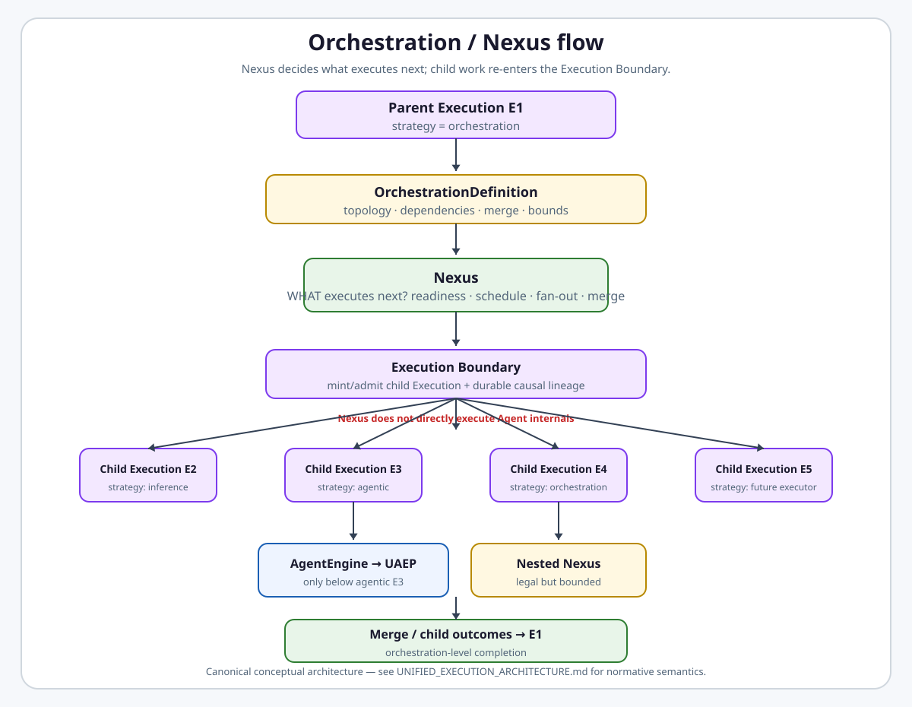
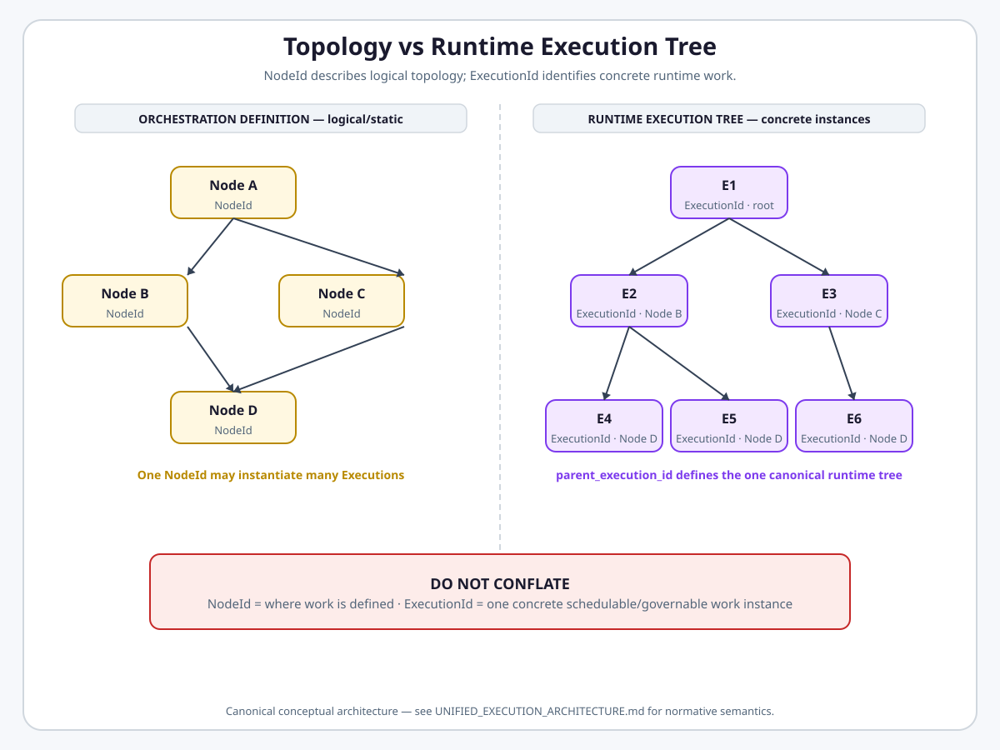
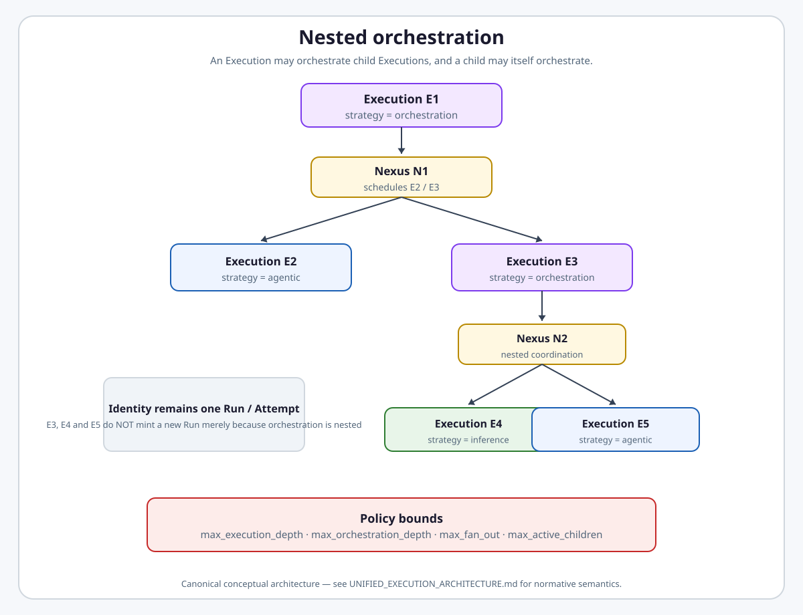
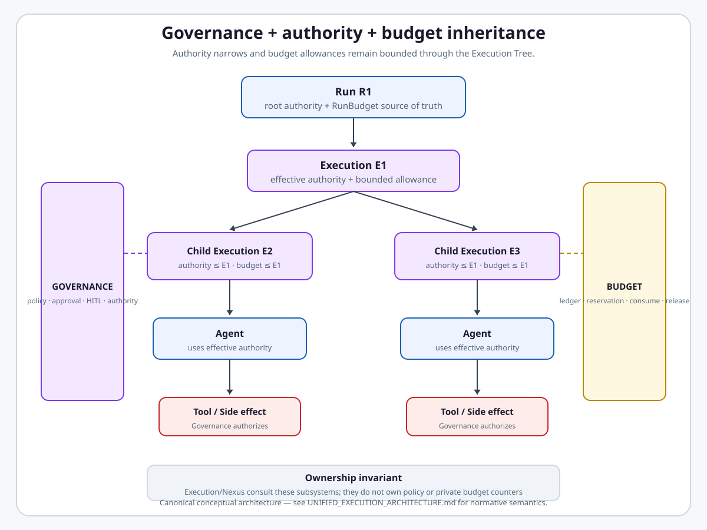
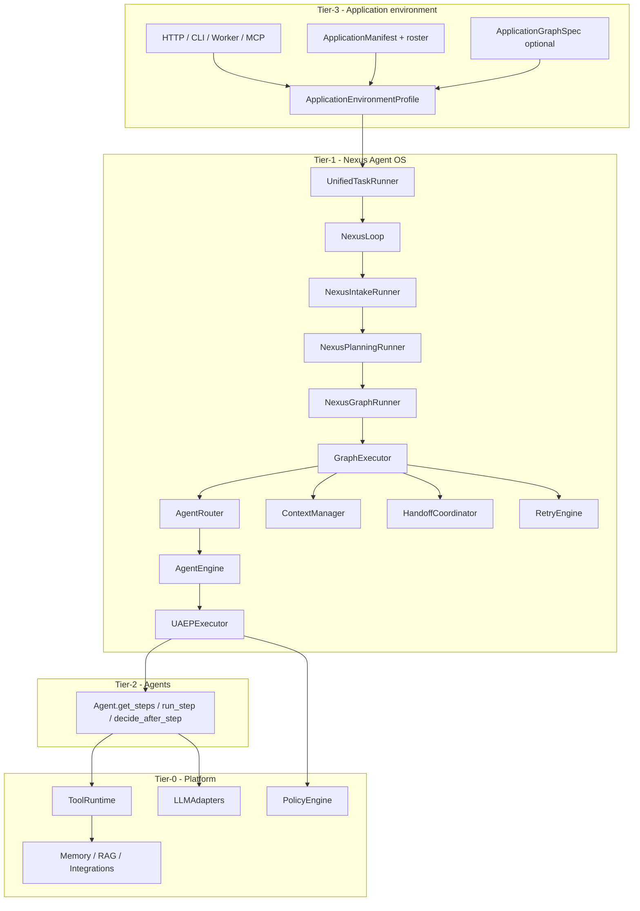
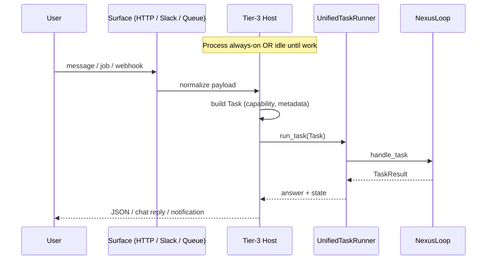
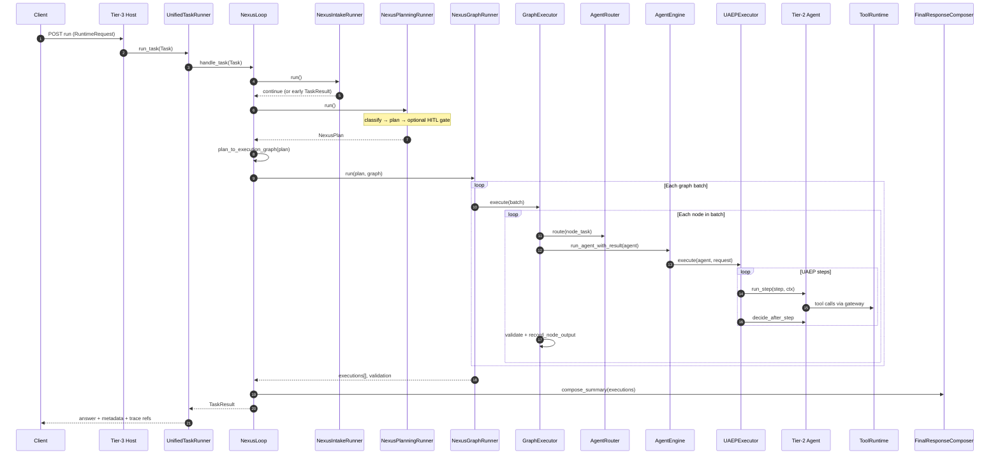
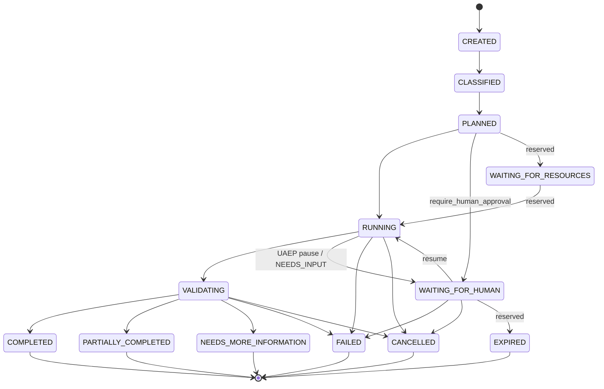
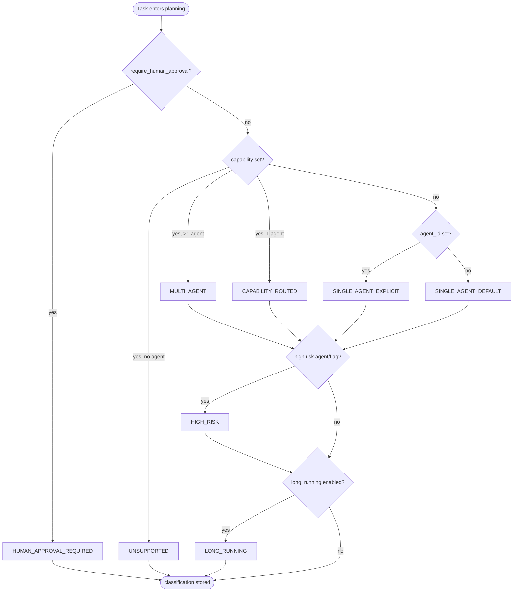

# Nexus Execution Flow

**Intergrax Nexus Execution Flow** is the canonical architecture for the Nexus orchestration control plane: traversal of accepted orchestration topology, dependency readiness, scheduling of child Executions, fan-out/fan-in, delegation/handoff coordination, and orchestration-level failure decisions.

> **Orchestration defines HOW work is structured. Nexus decides WHAT EXECUTES NEXT. Unified Execution Runtime owns HOW each Execution behaves.**

**Semantic authority:** Subordinate to frozen [`UNIFIED_EXECUTION_ARCHITECTURE.md`](UNIFIED_EXECUTION_ARCHITECTURE.md) (UEA). Where Nexus docs and UEA conflict, **UEA wins**.

Nexus is **not** a second UER, an `AgentEngine` replacement, a tool planner, a context engine, a business agent, or the mandatory entry for every platform workload. It operates when a parent **Execution** uses **orchestration strategy**.

## Why it matters

Without a single Nexus control plane for orchestration strategy, each path could invent its own topology interpretation, scheduling model, merge semantics, and recovery behavior. That produces inconsistent orchestration, duplicate lifecycle ownership, hidden agent-centric bypasses, and execution trees that compete with the canonical Execution Tree.

Nexus centralizes **orchestration runtime control** - what logical work is ready, which child Executions to request, and how topology-level fan-in and failure propagate - while UER owns Execution lifecycle and the Execution Boundary owns child admission.

## At a glance

| Concern | Summary |
| -------- | -------- |
| **Core question** | What executes next? (Orchestration = structure; UER = Execution behavior) |
| **Activation** | Parent Execution with **orchestration strategy** → Nexus interprets accepted topology |
| **Canonical output** | Child **Execution** requests through Execution Boundary - not direct `AgentEngine` calls as target abstraction |
| **Topology vs runtime** | `NodeId` ≠ `ExecutionId` - one node may materialize many Executions |
| **Planning planes** | Nexus topology/control-flow · UAEP steps (inside agentic child) · tool planner (inside step) |
| **Direct paths** | Inference and ordinary agentic Executions do **not** require Nexus |
| **Nested orchestration** | Child orchestration Executions under same Run/Attempt - no `OrchestrationRunId` |
| **UER relation** | Nexus schedules; UER owns Run/Attempt/Execution lifecycle and retry/cancel identity |
| **Production boundary** | Harness FLOW Done ≠ Execution-centric target implemented; product multi-agent not universally qualified |
| **Maturity** | Four-axis statement in [Current maturity](#current-maturity) |
| **Go deeper** | [Engineering canon](#engineering-canon) · [runtime extended](satellites/NEXUS_EXECUTION_FLOW_extended_depth.md) · [plan](../maintainers/plans/NEXUS_EXECUTION_FLOW.md) · [Orchestration](ORCHESTRATION.md) · [UEA](UNIFIED_EXECUTION_ARCHITECTURE.md) · [UER](UNIFIED_EXECUTION_RUNTIME.md) |

> [!NOTE]
> **Maturity boundary:** UC-1–UC-6 and Phase FLOW (**18/18 harness Done**) prove the **CURRENT** harness spine in lab and gate tests. That is **not** universal production qualification, **not** proof that child Execution admission or Execution-centric Nexus is implemented, and **not** proof that every future Execution strategy must pass Nexus. See [Current maturity](#current-maturity).

**Primary audience:** Principal / Staff engineers, harness integrators, and Tier-3 host authors - after the platform overview in the root README.

## Flagship architecture visual

**TARGET ARCHITECTURE** - orchestration-strategy Executions: Nexus schedules **child Executions** at the Execution Boundary. Nexus does not execute Agent internals as the canonical abstraction.

<a href="UNIFIED_EXECUTION_ARCHITECTURE.md">
<picture>
  <source media="(prefers-color-scheme: dark)" srcset="assets/unified-execution-orchestration-nexus-flow-dark.svg">
  <source media="(prefers-color-scheme: light)" srcset="assets/unified-execution-orchestration-nexus-flow-light.svg">
  
</picture>
</a>

**CURRENT IMPLEMENTATION / migration state:** Many harness workloads still enter via `UnifiedTaskRunner` → `NexusLoop` → `GraphExecutor` → `AgentRouter` → `AgentEngine` / UAEP. That agent-centric graph-node wiring is implementation debt - not the frozen target abstraction.

## Mental model - TARGET ARCHITECTURE

```text
TASK
  ↓
RUN
  ↓
ATTEMPT
  ↓
PARENT EXECUTION (strategy = orchestration)
        ↓
       NEXUS
        ↓
Execution Boundary
        ↓
child Execution(s)
```

A child Execution may use:

- **inference** strategy
- **agentic** strategy → `AgentEngine` → UAEP
- **orchestration** strategy → nested Nexus → further child Executions

Nexus **requests/schedules** child Executions. The Execution Boundary / UER owns child Execution lifecycle admission.

### Topology NodeId ≠ runtime ExecutionId

| Concept | Role |
| ------- | ---- |
| **NodeId** | Definition slot in accepted topology - stable logical position; may instantiate zero, one, or many times |
| **ExecutionId** | Runtime instance - independently schedulable/governable work in the canonical Execution Tree |

Fan-out example: `NodeId = researcher` may produce `Execution E2`, `E3`, `E4` - same node, different Executions.

**Do not use** “graph node = one agent execution unit” as target architecture. Where that phrase appears in engineering canon, it is **CURRENT implementation** terminology.

<a href="UNIFIED_EXECUTION_ARCHITECTURE.md">
<picture>
  <source media="(prefers-color-scheme: dark)" srcset="assets/unified-execution-topology-vs-execution-tree-dark.svg">
  <source media="(prefers-color-scheme: light)" srcset="assets/unified-execution-topology-vs-execution-tree-light.svg">
  
</picture>
</a>

### One canonical Execution Tree

Runtime lineage: `ExecutionId` + `parent_execution_id`. This is the **one** canonical Execution Tree.

Nexus may maintain topology state, readiness state, scheduling state, and orchestration projections - but **MUST NOT** maintain a competing canonical runtime execution tree. No `NexusRunTree`, no `OrchestrationRunId`, no graph-node runtime identity replacing `ExecutionId`.

### Nested orchestration

```text
Execution E1 (orchestration)
  → Nexus N1
      → E2 (agentic)
      → E3 (orchestration)
           → Nexus N2
               → E4
               → E5
```

Same Run / Attempt unless a lifecycle boundary explicitly changes them. Safety limits (max execution depth, orchestration depth, fan-out, active children, budgets) are conceptual guardrails - exact config names are not frozen here.

<a href="UNIFIED_EXECUTION_ARCHITECTURE.md">
<picture>
  <source media="(prefers-color-scheme: dark)" srcset="assets/unified-execution-nested-orchestration-dark.svg">
  <source media="(prefers-color-scheme: light)" srcset="assets/unified-execution-nested-orchestration-light.svg">
  
</picture>
</a>

## Nexus vs Orchestration vs UER

| Layer | Core question | Owns |
| ----- | ------------- | ---- |
| **Orchestration** | How is work **structured**? | Accepted topology / `OrchestrationDefinition`, profile configuration, planner proposal → acceptance |
| **Nexus** | What executes **next**? | Topology traversal, readiness, scheduling child Executions, fan-out/fan-in, orchestration-level failure coordination |
| **UER** | How does an **Execution** behave? | Run/Attempt lifecycle, Execution identity, strategy resolution mechanics, retry/cancel/checkpoint identity |

```text
Orchestration → topology / collaboration structure (definition)
Nexus         → interpret topology → schedule child Executions
UER           → Execution lifecycle and behavior
```

Full UER boundary: [`UNIFIED_EXECUTION_RUNTIME.md`](UNIFIED_EXECUTION_RUNTIME.md). Orchestration configuration: [`ORCHESTRATION.md`](ORCHESTRATION.md).

## Nexus owns (TARGET)

- Traversal and interpretation of **accepted** orchestration topology
- Dependency readiness and deciding which logical work is ready
- Scheduling / **requesting** child Executions (fan-out, parallel readiness)
- Delegation and handoff **topology** decisions (bounded child work, not agent-to-agent calls)
- Merge / fan-in coordination over **child Execution results**
- Orchestration-level failure handling (alternative branch, skip/partial, authorized replan)
- Nested orchestration coordination
- Requesting child work through the Execution Boundary

## Nexus does not own

- Generic Run/Attempt lifecycle - UER
- Canonical `ExecutionId` authority - UER / execution lifecycle
- Generic retry identity semantics - UER ([`RELIABILITY_FAILURE_AND_HITL.md`](RELIABILITY_FAILURE_AND_HITL.md))
- `AgentEngine` internals, UAEP, provider/model execution - agentic child Executions
- Governance authority, policy ownership - [`GOVERNED_EXECUTION.md`](GOVERNED_EXECUTION.md)
- Budget ledger / reservations - Budget subsystem
- Observability persistence, DIAG, checkpoint persistence - respective domains
- Queue transport identity, canonical cancellation tree - UER + transport

No second UER inside Nexus.

## Agent is not Nexus's fundamental unit

**TARGET:** Nexus → Execution Boundary → child Execution. Only when a child resolves to **agentic** strategy: Execution → `AgentEngine` → UAEP.

**CURRENT IMPLEMENTATION:** `GraphExecutor` → `AgentRouter` → `AgentEngine` on harness paths - label as migration wiring only.

Direct agentic execution (`Execution` → agentic → `AgentEngine` → UAEP) does **not** require Nexus. Orchestration with one logical node is possible but is **not** the definition of single-agent execution.

## Multi-agent vs orchestration

**Multi-agent is not synonymous with orchestration.** Orchestration is topology/control-flow. It may coordinate multiple agents, multiple direct inference Executions, nested orchestrations, or mixed executor strategies. Agents are one executor type among others.

## Three planning planes

| Plane | Decides | Owner |
| ----- | ------- | ----- |
| **Nexus topology** | Which logical work is ready, order, dependencies, parallelism | Nexus (orchestration strategy) |
| **UAEP steps** | Steps inside an **agentic** child Execution | `AgentEngine` / UAEP |
| **Tool planner** | Tool calls inside a UAEP step | Tool planner + `ToolRuntime` |

```text
Nexus:        which child Execution / topology position / when
UAEP:         what steps inside an agentic Execution
Tool planner: what tool calls inside the step
```

Do not conflate **Execution StrategyResolver** (“does this Execution need inference, agentic, orchestration?”) with **orchestration planning** (“what topology should orchestration strategy execute?”). StrategyResolver must not silently invent topology.

## Delegation vs handoff

| Mechanism | TARGET | CURRENT IMPLEMENTATION |
| --------- | ------ | ---------------------- |
| **Delegation** | Bounded sub-work → child Execution via topology decision | `DELEGATES_TO`, `DelegationSpec`, graph expansion |
| **Handoff** | Runtime discovery → route to another child Execution / topology position | `HandoffCoordinator` dynamic graph node insertion |
| **Agent-to-agent call** | **Anti-pattern** - not target architecture | - |

Delegation and handoff must not transfer canonical runtime identity by replacing the parent Execution, create hidden agent-to-agent calls, or bypass child Execution admission.

## Merge / fan-in

Nexus owns orchestration-level fan-in. Merge consumes **child Execution results** - not “combine agent answers” only; outputs may be heterogeneous (inference + agentic + nested orchestration).

`FinalResponseComposer` and profile `merge_strategy` values are **CURRENT IMPLEMENTATION** - not necessarily the frozen universal contract.

## Retry, partial results, and failure

- **Orchestration-level recovery** - Nexus may choose alternative branch, skip/partial, authorized replan; must request lifecycle action through runtime boundary
- **Identity / Attempt semantics** - UER owns; do **not** state “graph retry creates new AttemptId” as a Nexus rule
- **`allow_partial_result`** - orchestration policy posture; UER/REL own detailed semantics

Detail: [runtime extended §14](satellites/NEXUS_EXECUTION_FLOW_extended_depth.md#14-retry-failure-and-abandonment).

## Cancellation

Canonical cancellation follows the **Execution Tree**: Run cancel → whole tree; Execution cancel → subtree. Nexus may stop scheduling topology work and coordinate orchestration consequence - it does not own a separate cancellation tree.

## HITL

Governance/HITL owns human **decision**. UER owns pause/wait/resume lifecycle. Nexus owns where orchestration continues or replans after the decision. Nexus is not an approval engine.

## Governance, budget, observability, checkpoint

| Concern | Authority | Nexus role |
| ------- | --------- | ------------ |
| **Governance** | Policy / HITL domains | Coordinate flow per policy results; child authority resolved at mandatory Execution authority checkpoint by configured `ExecutionAuthorityPolicy` (platform default: `DefaultStrictAuthorityPolicy`) |
| **Budget** | Budget subsystem; `RunBudget` root | Schedule only within effective reservation; not private cost counters |
| **Observability** | Observability persistence | Emit orchestration facts on canonical event path; tie to relevant `ExecutionId` once it exists |
| **Checkpoint** | Checkpoint domain + UER | Orchestration state is a **component** of canonical Run checkpoint - no separate Nexus checkpoint tree |

### Pluggable child Execution authority

Nexus decides **what** child work to request next; **authority resolution belongs to Execution**, not Nexus.

```text
Parent Execution
      ↓
Nexus decides WHAT executes next
      ↓
child Execution request
      ↓
mandatory authority checkpoint
      ↓
configured ExecutionAuthorityPolicy
      ↓
Execution Boundary
      ↓
Child Execution
```

- **Mandatory checkpoint:** every child Execution passes authority resolution before admission; developers cannot disable it.
- **Pluggable strategy:** the engine invokes `ExecutionAuthorityPolicy` and receives `ChildAuthorityResolution`; the algorithm is replaceable, the checkpoint is not.
- **Platform default:** when unconfigured, `DefaultStrictAuthorityPolicy` applies UE-8A strict narrowing (monotonic narrowing against immediate parent - not a universal platform law).
- **Plugin resolution (composition-time, once):** explicit instance override → entry-point id from `intergrax.execution_authority_policies` → `DefaultStrictAuthorityPolicy`. Missing/invalid explicit plugin id fails closed - no silent fallback.
- **Nexus boundaries:** Nexus does **not** implement, load, select, or bypass `ExecutionAuthorityPolicy`; it routes child work through the mandatory checkpoint owned by the execution lifecycle layer.

**CURRENT IMPLEMENTATION (UE-8P2 / UE-8P2R1):** policy Protocol, default strict policy, instance override, entry-point plugins, `RuntimeConfig` → `build_nexus_loop_from_environment` → `resolve_execution_authority_policy_from_runtime_config` → `NexusLoop` → `GraphExecutor` → `ChildExecutionRunner`.

**TARGET / FUTURE:** governed-elevation and richer strategies when explicitly implemented - not current contracts.

<a href="UNIFIED_EXECUTION_ARCHITECTURE.md">
<picture>
  <source media="(prefers-color-scheme: dark)" srcset="assets/unified-execution-governance-budget-inheritance-dark.svg">
  <source media="(prefers-color-scheme: light)" srcset="assets/unified-execution-governance-budget-inheritance-light.svg">
  
</picture>
</a>

## Nexus-specific invariants (NEXUS-INV-*)

NEXUS-INV specialize frozen UEA for the Nexus domain. Full cross-domain set: [UEA §24](UNIFIED_EXECUTION_ARCHITECTURE.md#24-architectural-invariants-uea-inv).

| ID | Invariant |
| -- | --------- |
| **NEXUS-INV-001** | Nexus operates only when an Execution uses orchestration strategy |
| **NEXUS-INV-002** | Nexus schedules/requests child Executions; it does not execute Agent internals as the canonical abstraction |
| **NEXUS-INV-003** | Topology `NodeId` is never runtime `ExecutionId` |
| **NEXUS-INV-004** | Nexus does not own generic Run/Attempt/Execution lifecycle |
| **NEXUS-INV-005** | Nexus does not maintain a competing canonical execution tree |
| **NEXUS-INV-006** | Nested orchestration is represented through child Executions, not `OrchestrationRunId` |
| **NEXUS-INV-007** | Delegation and handoff create/route bounded child work through the canonical Execution boundary |
| **NEXUS-INV-008** | Nexus coordinates merge/fan-in over child Execution results |
| **NEXUS-INV-009** | Governance/Budget/Observability/Checkpoint remain external subsystem authorities |
| **NEXUS-INV-010** | Direct inference and ordinary agentic execution do not require Nexus |
| **NEXUS-INV-011** | Nexus MUST route child work through the mandatory Execution authority checkpoint and MUST NOT implement, bypass, or dynamically select `ExecutionAuthorityPolicy` itself |

## CURRENT IMPLEMENTATION - harness spine

Today's primary harness path (not frozen target):

```text
Task → UnifiedTaskRunner → NexusLoop
      → planning / classification → ExecutionGraph / NexusPlan
      → GraphExecutor → AgentRouter → AgentEngine / UAEP (per graph node)
      → TaskResult
```

HTTP, MCP, workers, schedulers, and lab harnesses on this path normalize to `Task` and invoke `UnifiedTaskRunner` → `NexusLoop`. Modules: [Engineering canon §3](#3-entry-points--how-tasks-appear).

**Tier-3 Host vs Nexus (CURRENT wiring):** hosts wire profile, register agents, invoke `UnifiedTaskRunner`. Application hosts **should not** add parallel orchestration runtimes that bypass platform boundaries - target admission is through Execution Boundary, not ad-hoc `NexusLoop` reconstruction per surface.

## Harness-proven vs not automatically production-qualified

### Harness-proven (lab / gate) - CURRENT spine

Orchestrated harness path; multi-agent graph mechanics; delegation; LLM-backed planner; merge; partial-result policy; graph retries; `max_inflight_nodes` backpressure.

### Not automatically production-qualified

- Execution-centric child admission **implemented**
- Every product host deployment at operational scale
- Nested orchestration production-qualified
- **18/18 harness FLOW Done ≠** target architecture implemented
<a id="protocol-v22-task-intake-execution-convergence-target-invariants-2026-08-18"></a>

## Protocol v2.2 task-intake execution convergence target invariants (2026-08-18)

Accepted [`INTERFACE_TASK_INTAKE`](../../audit_results/2026-08-18/INTERFACE_TASK_INTAKE.md) findings **02, 03, 05** (2026-08-18). **Target state** - remediation **ACCEPTED / PLANNED**; **not implemented** by audit persistence task AUDIT-20260818-INTERFACE-TASK-INTAKE-PERSIST.

> **Architecture clarification (UE-DOC-0.5):** Remediation **ITI-FIX-C** preserves runner guarantees on supported surfaces during migration. The **frozen UEA target** does **not** require every future Execution strategy to pass through Nexus - only that supported intake surfaces converge through canonical runner guarantees where orchestration/harness paths apply.

1. Supported execution surfaces **MUST** converge through the canonical public execution boundary before `NexusLoop` on **CURRENT orchestrated intake paths**.
2. Intended canonical path (CURRENT harness):

```text
surface-specific edge parsing
  → canonical normalized intake
  → Task
  → UnifiedTaskRunner
  → NexusLoop
  → TaskResult
```

3. `TaskId` and `RunId` are distinct canonical identities. A `RunId` **MUST NOT** be passed as `Task.task_id`.
4. Direct `NexusLoop` execution is **not** an equivalent supported production intake path unless an explicitly documented public abstraction proves equivalent runner guarantees (`ActiveTaskRegistry`, `llm_tenant_scope`, canonical runner-level identity/resume handling).
5. Critical executor capabilities such as prepared-task execution must be expressed as typed Protocol/interface contracts-not `hasattr` / string / reflection discovery.

Remediation blocks: **ITI-FIX-B** (identity), **ITI-FIX-C** (runner convergence + typed executor). Cross-reference Tier-3 intake normalization (**ITI-FIX-A**) in [`TIER3_APPLICATION_ENVIRONMENT`](TIER3_APPLICATION_ENVIRONMENT.md).

<a id="protocol-v22-delegated-authority-target-invariants-2026-08-18"></a>

## Protocol v2.2 delegated authority target invariants (2026-08-18)

Accepted [`IDENTITY_TRUST`](../../audit_results/2026-08-18/IDENTITY_TRUST.md) finding **02** (2026-08-18). **Target state** - remediation **ACCEPTED / PLANNED**; **not implemented** by audit persistence task AUDIT-20260818-IDENTITY-TRUST-PERSIST.

1. Delegated authority **MUST** be ≤ parent effective authority.
2. Declared `permission_scopes` must become enforced effective child authority, not observability-only metadata.
3. Child tool/memory/integration/side-effect capabilities must respect effective delegated authority where applicable.
4. `DELEGATION_GRANTED` must describe effective enforced authority.
5. Reuse existing platform authority/policy mechanisms where possible rather than inventing a second private authority engine.

Remediation block: **IDT-FIX-B**. Positive reference pattern: `CollaborativeWorkAuthorityResolver` (do not silently merge models).

<a id="protocol-v22-llm-inference-target-invariants-2026-08-18"></a>

## Protocol v2.2 LLM inference target invariants (2026-08-18)

Accepted [`LLM_ADAPTERS`](../../audit_results/2026-08-18/LLM_ADAPTERS.md) findings **01–06** (layer audited 2026-08-19). **Target state** - **ACCEPTED / PLANNED**; **not implemented** by audit persistence.

1. Every actual provider-bound inference, including classifier and planner retries, crosses canonical inference/PRE_MODEL boundary.
2. Planning/model decision, execution candidate, and trace identity agree on provider/model and `RunId`/`AttemptId`.

Remediation: **LLM-FIX-A/B/C/D** in [`plan/NEXUS_EXECUTION_FLOW.md`](../maintainers/plans/NEXUS_EXECUTION_FLOW.md) and [`plan/TIER3_APPLICATION_ENVIRONMENT.md`](../maintainers/plans/TIER3_APPLICATION_ENVIRONMENT.md).

<a id="protocol-v22-reasoning-planning-target-invariants-2026-08-18"></a>

## Protocol v2.2 reasoning/planning target invariants (2026-08-18)

Accepted [`REASONING_PLANNING`](../../audit_results/2026-08-18/REASONING_PLANNING.md) findings **01–06** (layer audited 2026-08-19). **Target state** - **ACCEPTED / PLANNED**; **not implemented** by audit persistence.

1. `NexusPlan` is fully structurally validated before PLAN_CREATED/PLANNED.
2. Planning agent eligibility uses the same effective routability semantics as execution.
3. Task-level replan is a typed runtime/Nexus transition, distinct from local cognition replan.

Remediation: **RPL-FIX-A/B/C** in matching plans.

<a id="protocol-v2-end-to-end-system-target-invariants-2026-08-18"></a>

## Protocol v2 END_TO_END_SYSTEM target invariants (2026-08-18)

Accepted [`END_TO_END_SYSTEM`](../../audit_results/2026-08-18/END_TO_END_SYSTEM.md) findings **02, 03, 05** (2026-08-21). **Target state** - remediation **ACCEPTED / PLANNED**; **not implemented** by audit persistence task AUDIT-20260818-END-TO-END-SYSTEM-PERSIST.

> **Architecture clarification (UE-DOC-0.5):** Invariant 4 below records **then-current** harness spine evidence. Frozen UEA target allows direct inference and agentic Executions without Nexus; remediation preserves runner/enricher parity during migration - not universal Nexus mandate for all future strategies.

1. Supported surfaces consume one **configured task execution service** - same mandatory host-owned `task_enricher` and runner guarantees - not independent `UnifiedTaskRunner(nexus_loop)` reconstruction per surface. Cross-link **E2E-EXECUTION-CONTEXT-INTEGRITY** and **ITI-FIX-C** (direct-Nexus bypass is a separate recorded defect; this invariant is **equal enricher semantics**).
2. `ActiveTaskRegistry` registration is **ownership-aware**: bind `TaskId` to concrete execution identity (`RunId`/attempt/registration token) or treat duplicate `TaskId` as explicit conflict; `unregister` removes only the owned registration - no silent overwrite. Cross-link **E2E-CONTROL-AUTHORITY-INTEGRITY**.
3. Autonomy and other security-sensitive task-control mutations cross **canonical Governance authorization** (authenticated principal + Task/Run + requested transition → authorized transition evidence → runtime application). Do not create a second task-control policy engine. Cross-link **POLICY_GOVERNANCE**, **SECURITY_BOUNDARIES**.
4. Preserve one Nexus execution spine on **CURRENT orchestrated harness paths** (`Task` → `UnifiedTaskRunner` → `NexusLoop` → `TaskResult`); no second end-to-end runtime subsystem - **does not** freeze Nexus as mandatory for all Execution strategies.

Historical harness FLOW Done facts and existing **ITI-FIX-***, **IDT-FIX-***, **LLM-FIX-*** remediation remain **PLANNED** - coordinate; do not duplicate.

## Scenario capability (summary)

| Capability | State |
| ---------- | ----- |
| Orchestrated harness path (CURRENT) | **Harness-proven** (UC-1–UC-3, S1) |
| Multi-agent sequential | **Harness-proven** (UC-4, acceptance) |
| Multi-agent parallel | **Harness-proven** (UC-5, CFG simulation) |
| Delegation | **Harness-proven** (FLOW-2/14, ADR-FLOW-001) |
| LLM-backed planning | **Harness-proven** (FLOW-1, `engine` planner) |
| Retry / partial result | **Harness-proven** ([§14](satellites/NEXUS_EXECUTION_FLOW_extended_depth.md#14-retry-failure-and-abandonment)) |
| HITL | **Controlled / lab** - production queue profile-driven (S7) |
| Child Execution admission (TARGET) | **Not implemented** |
| Production multi-agent product flow | **Bounded / deferred** - FLOW-8 harness Done; product host **Deferred** plan §6.3 |

Full S1–S8 matrix: [runtime extended §12.2](satellites/NEXUS_EXECUTION_FLOW_extended_depth.md#122-scenario-production-status).

## Current maturity

Architecture maturity: **A4** *(target aligned with UEA)*
Implementation maturity: **I3–I4** *(CURRENT harness I4; Execution-centric Nexus not implemented)*
Production readiness: **P2**
Evidence maturity: **E3**

- **A4 (target)** - Nexus/Orchestration canon aligned with frozen UEA; NEXUS-INV closure on hub.
- **I3–I4** - Phase FLOW **18/18 harness Done** on **CURRENT** agent-centric spine. Child Execution admission, neutral orchestration boundary, and Execution-centric graph executor are **target / planned** - not I5.
- **P2** - Harness and reference-host proven; `execution_mode=strict` is posture, not **P4**. Product multi-agent (FLOW-8) requires explicit product decision.
- **E3** - Unit/gate and integration evidence. **No dedicated public Nexus proof route** in [`PROOFS.md`](../proofs/PROOFS.md).

Harness FLOW/ORCH **Done** does **not** mean: Execution-centric target implemented; nested orchestration production-qualified; child Execution admission implemented.

## Evidence / proof

### Architecture

- This hub · [runtime extended](satellites/NEXUS_EXECUTION_FLOW_extended_depth.md) · [UEA](UNIFIED_EXECUTION_ARCHITECTURE.md)
- ADR-FLOW-001…005 ([`technical/adr/README.md`](../technical/adr/README.md))

### Unit / gate

- Cycle detection, topological ordering, delegation depth, partial-result behavior, planner fail-fast

### Integration

- `tests/integration/runtime/test_orchestration_cfg_simulation.py`
- Multi-agent acceptance suites
- UAEP integration on **CURRENT** graph path

### Public proof

**No dedicated Nexus-domain entry** in [`PROOFS.md`](../proofs/PROOFS.md).

## Relationship to Intergrax

| Neighbor | Relationship |
| -------- | ------------- |
| [`UNIFIED_EXECUTION_ARCHITECTURE.md`](UNIFIED_EXECUTION_ARCHITECTURE.md) | Semantic authority - identity, Execution Tree, Nexus placement |
| [`UNIFIED_EXECUTION_RUNTIME.md`](UNIFIED_EXECUTION_RUNTIME.md) | Execution lifecycle; child admission boundary (target) |
| [`ORCHESTRATION.md`](ORCHESTRATION.md) | Accepted topology configuration - Nexus interprets |
| [`AGENT_CONTRACTS_AND_ASSEMBLY.md`](AGENT_CONTRACTS_AND_ASSEMBLY.md) | Agent contracts consumed by **agentic** child Executions |
| [`CONTEXT_ENGINEERING.md`](CONTEXT_ENGINEERING.md) | Context assembly on hot paths - not owned by Nexus |
| [`TOOLS.md`](TOOLS.md) | Third planning plane |
| [`GOVERNED_EXECUTION.md`](GOVERNED_EXECUTION.md) | Policy at flow boundaries |
| [`RELIABILITY_FAILURE_AND_HITL.md`](RELIABILITY_FAILURE_AND_HITL.md) | Retry ownership, Attempt Ledger, HITL semantics - approval binds exact Decision Version (**TARGET:** [`DECISION_SYSTEM.md`](DECISION_SYSTEM.md)) |
| [`DECISION_SYSTEM.md`](DECISION_SYSTEM.md) | **TARGET:** Nexus hosts Decision Lifecycle; Nexus owns scheduling/checkpoint/retry - Lifecycle owns semantic decision progression |
| [`OBSERVABILITY.md`](OBSERVABILITY.md) | Event spine - Nexus emits, Observability persists |
| [`APPLICATION_HOSTING.md`](APPLICATION_HOSTING.md) | Tier-3 bootstrap wires **CURRENT** `NexusLoop` |

## Extensibility

Configuration surfaces (not frozen internal class APIs):

- `ApplicationGraphSpec` / `AgentGraph` - **CURRENT** declarative graphs
- `OrchestrationProfile` - planner, classifier, merge, parallelism, resilience
- Planners (`TaskPlanner`, `EngineBackedNexusPlanner`, graph-spec seeding)
- Merge policy / `FinalResponseComposerProfile`
- Host wiring (`nexus_factory`, `orchestration_wiring`)

Authoring: [`satellites/ORCHESTRATION_production_gates.md`](satellites/ORCHESTRATION_production_gates.md#56-platform-interaction--multi-agent-configuration-canon) §56.

## Go deeper

| Depth | Route |
| ----- | ----- |
| **Engineering canon** | [Below](#engineering-canon) - §1–§8 boundaries, **CURRENT** sequences, entry points |
| **Runtime extended** | [`satellites/NEXUS_EXECUTION_FLOW_extended_depth.md`](satellites/NEXUS_EXECUTION_FLOW_extended_depth.md) - §9+ |
| **Implementation plan** | [`maintainers/plans/NEXUS_EXECUTION_FLOW.md`](../maintainers/plans/NEXUS_EXECUTION_FLOW.md) |
| **Orchestration config** | [`ORCHESTRATION.md`](ORCHESTRATION.md) |
| **UER / REL / Governance** | [`UNIFIED_EXECUTION_RUNTIME.md`](UNIFIED_EXECUTION_RUNTIME.md) · [`RELIABILITY_FAILURE_AND_HITL.md`](RELIABILITY_FAILURE_AND_HITL.md) · [`GOVERNED_EXECUTION.md`](GOVERNED_EXECUTION.md) |

### Documentation layout (hub / satellite)

| Layer | Owns | Notes |
| ----- | ---- | ----- |
| Hub public front | TARGET + CURRENT + NEXUS-INV | Default read scope |
| [Runtime extended satellite](satellites/NEXUS_EXECUTION_FLOW_extended_depth.md) | §9+ | **CURRENT** implementation depth |
| Engineering canon §1–§8 | Sequences, entry points | Label CURRENT where agent-centric |

## Implementation readiness

For future implementation sessions - derive slices without making new architecture decisions.

### 1. TARGET STATE

Frozen UEA + this document: Nexus behind orchestration strategy only; schedules child Executions; `NodeId` ≠ `ExecutionId`; one Execution Tree; no competing Nexus runtime tree; external Governance/Budget/Obs/Obs/Checkpoint authorities.

### 2. CURRENT STATE

`UnifiedTaskRunner` → `NexusLoop` de facto entry for many tasks; `GraphExecutor` → `AgentRouter` → `AgentEngine`; topology nodes treated as agent execution units on harness path; orchestration events not fully tied to canonical `ExecutionId`.

### 3. GAPS

Child Execution request/admission boundary; Execution-centric graph executor; topology metadata on Execution evidence; lifecycle/retry/cancel at UER boundary; delegation/handoff as child Execution semantics; nested orchestration via child orchestration Executions.

### 4. DEPENDENCIES

- UEA frozen semantics (authority)
- UER `ExecutionId` / Execution Boundary ([`UNIFIED_EXECUTION_RUNTIME.md`](UNIFIED_EXECUTION_RUNTIME.md))
- Orchestration accepted topology contract ([`ORCHESTRATION.md`](ORCHESTRATION.md))
- Observability `ExecutionId` on events
- Detailed code mapping: **UE-DOC-0.9**

### 5. MIGRATION ORDER (high level)

1. Introduce canonical child Execution request/admission boundary
2. Stop treating `AgentRouter`/`AgentEngine` as Nexus's canonical target
3. Map topology `NodeId` → child Execution creation
4. Preserve topology metadata on Execution evidence
5. Move generic lifecycle/retry/cancel identity to UER boundary
6. Migrate delegation/handoff to child Execution semantics
7. Align merge with Execution results
8. Support nested orchestration through child orchestration Executions
9. Remove direct agent-centric bypasses / duplicate lifecycle ownership

### 6. DO NOT VIOLATE

- NEXUS-INV-* and UEA-INV-* without explicit architecture reopen
- Nexus as mandatory path for direct inference or ordinary agentic execution
- `OrchestrationRunId` or competing execution trees
- Agent == Execution or Node == Execution
- Nexus as budget/governance/observability authority

### 7. ACCEPTANCE CONDITIONS

- Nexus activates only for orchestration strategy Executions (target paths)
- Child work admitted as Executions through canonical boundary
- Topology scheduling distinct from Execution Tree identity
- Orchestration events causally tied to relevant `ExecutionId`
- TARGET/CURRENT labeled where implementation lags

---
## Maintainer and Cursor context

**Status:** Canonical architecture (domain pair 1:1)
**Hub:** [`intergrax_runtime_architecture.md`](intergrax_runtime_architecture.md)
**Plan (1:1):** [`plan/NEXUS_EXECUTION_FLOW.md`](../maintainers/plans/NEXUS_EXECUTION_FLOW.md)
**Target:** [`IDEAL_HARNESS_AI_ARCHITECTURE.md`](../technical/guides/IDEAL_HARNESS_AI_ARCHITECTURE.md)
**Audit layers:** 8, 9, 10 (flow narrative) · cognition depth: [`REASONING_AND_COGNITION.md`](REASONING_AND_COGNITION.md) §7–§10
**Platform audit:** [`docs/audit_results/AUDIT_PROTOCOL.md`](../../audit_results/AUDIT_PROTOCOL.md)  
**Last updated:** 2026-08-26 - UE-DOC-0.5 alignment with frozen UEA (NEXUS-INV, Execution-centric target)

### Cursor read scope (token budget)

**Do not read this entire file in one session** (NEXUS_EXECUTION_FLOW canon).

- **Implement / audit default:** §1–§8 flow spine (purpose → classification → planning). Extended §9+: [`satellites/NEXUS_EXECUTION_FLOW_extended_depth.md`](satellites/NEXUS_EXECUTION_FLOW_extended_depth.md).
- **Use** table of contents below - `Read` with offset/limit per §.
- **Plan hub:** [`plan/NEXUS_EXECUTION_FLOW.md`](../maintainers/plans/NEXUS_EXECUTION_FLOW.md) (scoped §6 only).
- **Platform audit:** [`docs/audit_results/AUDIT_PROTOCOL.md`](../../audit_results/AUDIT_PROTOCOL.md).
- **Max reads:** at most **one** file >5k tokens per session unless RESUME cites more.

### Architecture satellites (read on demand)

Large § blocks moved out of the architecture hub to reduce Cursor context use.
Load **only** the satellite matching your task or cited §.

| Satellite | Contents |
|-----------|----------|
| [`satellites/NEXUS_EXECUTION_FLOW_extended_depth.md`](satellites/NEXUS_EXECUTION_FLOW_extended_depth.md) | runtime extended (§9+) - graph, UAEP, UC-*, retry, tools, governance, observability |

> **Cursor context budget:** read hub read-scope block + **at most one** satellite per session when the satellite exists.

---

## Engineering canon

Authoritative technical specification (§1–§8). Public front section above; extended depth in the [runtime extended satellite](satellites/NEXUS_EXECUTION_FLOW_extended_depth.md) (§9+).

## 1. Purpose and boundaries

### 1.1 What this document covers

- Full **control-flow** from task appearance to `TaskResult`
- **Data-flow** between tiers (`Task`, `SharedTaskContext`, artifacts, memory)
- **Decision ownership** - who decides agent selection, completion, retry, tools, policy
- **Orchestration variants** - single agent, multi-agent, declarative graph, handoff, HITL
- **Edge cases** - early exits, cancellation, unsupported, resume
- **Governance timeline** - when policies and hooks fire
- **Observability** - events, trace, metrics, debug APIs
- **Known runtime gaps** - honest docs↔code deltas for plan scheduling
- **Lab vs production** posture per flow variant - four-axis matrix [§12.2](satellites/NEXUS_EXECUTION_FLOW_extended_depth.md#122-scenario-production-status)
- **Evaluation hooks** - quality signals, registry, baselines
- **Expected telemetry** per pipeline stage

### 1.2 What this document does not cover

- Full `AgentContract` field reference → canon §12, Appendix N
- Integration/tool/skill catalogs → `architecture/INTEGRATIONS.md`, `architecture/TOOLS.md`, `architecture/SKILLS.md`
- Business product agents (Phase K) → plan §6.3
- L4 adaptive closed loops → AHIA + canon §54

### 1.3 Three planning planes (do not confuse)

Intergrax has **three independent planning/orchestration planes**:

| Plane | Owner | Decides | Example |
|-------|-------|---------|---------|
| **Nexus graph** | Tier-1 `NexusLoop` | Which **agent** runs, order, parallelism | PM → UX → Legal |
| **UAEP steps** | Tier-2 agent + `AgentEngine` | **Steps** inside one **agentic** child Execution (**CURRENT:** one graph node) | gather → analyze → summarize |
| **Tool planner** | Tier-1 `CatalogToolPlanner` | Which **tools** LLM invokes in a step loop | `rag.retrieve`, `websearch.query` |

All three converge through `ToolRuntime` for side effects and `PolicyEngine` for governance on UAEP decisions.

### 1.4 Laboratory vs production execution

| Dimension | Laboratory (`execution_mode=balanced`, lab defaults) | Production (`execution_mode=strict`) |
|-----------|------------------------------------------------------|-------------------------------------|
| `production_mode` on Nexus | `False` | `True` |
| Agent routability | Relaxed (experimental agents allowed) | `AgentRegistry.is_routable` enforced |
| Policy / security | `harness_lab.yaml`, relaxed bundles | Full `RuntimePolicyBundle` + V-SEC middleware |
| HITL | Debug APIs, manual resume | Operator queue + audit trail |
| Evaluation | `shadow_eval_enabled=True`, observe-only adaptive | `require_baseline_for_release`, trend gates (when CI enforced) |
| Merge / final answer | `FinalResponseComposer` string concat OK | Needs `MergePolicy` for multi-agent (FLOW-7) |
| Planner | Deterministic `TaskPlanner` | LLM `engine` planner expected (FLOW-1) |
| Proof level | Gate + acceptance tests | Product graph apps + ops evidence (W-OPS) |

**Rule:** UC-1–UC-6 are **harness-proven** in lab; **production-ready** multi-agent product flows (UC-5 at scale, §42.43) remain **Phase K / FLOW-8** until explicit product decision.

**Production-ready checklist (FLOW-MAINT-02):**

| Gate | Strict / product host | Evidence |
|------|----------------------|----------|
| `execution_mode=strict` | Required | `ApplicationEnvironmentProfile` |
| W-OPS SLO hooks | Trace + task lifecycle events persisted | `observability_profile` + OTEL slug |
| Reference host presets | `harness_production_stack` or product manifest | `applications/*/manifest.py` |
| Planner fail-fast | `planner_kind=engine` requires `llm_adapter` in wiring context | `test_orchestration_wiring.py` |
| Partial results policy | `ResiliencePolicy.allow_partial_result` honored in graph runner | `test_graph_runner_resilience.py::test_graph_runner_honors_allow_partial_result_lifecycle` |
| Queue worker (optional) | `INCLUDE_QUEUE_WORKER=true` for async intake | ORCH-MAINT-01 lab scaffold default |

---

## 2. Layer model at runtime

**CURRENT IMPLEMENTATION** - harness wiring diagram. **TARGET:** orchestration parent Execution → Nexus → child Executions; agentic children → `AgentEngine` / UAEP below the Execution boundary.



**Dependency rule:** `intergrax` must not import `agents` or `applications`. Applications wire agents into `AgentRegistry` at bootstrap.

---

## 3. Entry points - how tasks appear

**CURRENT IMPLEMENTATION** - orchestrated harness intake converges on `UnifiedTaskRunner` → `NexusLoop`. **TARGET:** not every Execution strategy requires this path (see hub [CURRENT IMPLEMENTATION - harness spine](#current-implementation--harness-spine)).

| Entry | Module | Same path as HTTP? |
|-------|--------|-------------------|
| HTTP `POST /runs` or `/v1/*/run` | `NexusTaskExecutionAdapter` → `UnifiedTaskRunner` | Baseline |
| Lab harness | `lab_fastapi.py` | Yes |
| MCP server | `mcp_nexus_server.py` | Yes |
| Eval runner | `nexus_eval_runner.py` | Yes |
| Long-running scheduler resume | `long_running/scheduler.py` | Yes (resume token) |
| Scaffold `new-agent` smoke | `scaffold/new_agent.py` | Yes (direct `handle_task`) |
| Debug HITL service | `debug/hitl_service.py` | Yes |

```text
RuntimeRequest / HTTP payload
    → task_from_runtime_request()  (or Task built directly)
    → UnifiedTaskRunner.run_task(task)
    → NexusLoop.handle_task(task)
```

**Tenant scope:** `UnifiedTaskRunner` wraps execution in `llm_tenant_scope(task.tenant_id)` for LLM metering.

**Bootstrap path (Tier-3):**

```text
ApplicationManifest
    → wire_application_environment()
    → AgentRegistry.register(agents…)
    → build_nexus_loop_from_environment(registry, env, …)
    → UnifiedTaskRunner(nexus_loop)
```

Key wiring: `intergrax/applications/_shared/nexus_factory.py`, `orchestration_wiring.py`, `harness_host_runtime.py`.

### 3.1 Application interaction scenarios (CURRENT orchestrated harness path)

Every scenario below uses **`UnifiedTaskRunner.run_task()`** on the **CURRENT** harness spine. Differences are **host posture** and **profile orchestration**. **TARGET:** direct agentic Executions may bypass Nexus when strategy is not orchestration.

| Scenario | Host posture | Task creation | Orchestration config | Execution (**CURRENT**) |
|----------|--------------|---------------|----------------------|-------------------------|
| **S1 - Single reactive Q&A** | HTTP/MCP on demand | `POST …/run` builds `Task` with `capability` | `planner_kind=default`, 1 agent | One graph node → `AgentRouter` → UAEP |
| **S2 - Free-text chat** | Daemon + intake | Slack/HTTP; capability from adapter or classifier | `classifier_kind=rules` (ORCH-CONFIG.1) or COG-3 LLM when done | As S1 or pipeline |
| **S3 - Multi-agent sequential** | On demand | `capability=*.pipeline` or orchestration token | `graph_spec` `DEPENDS_ON` chain | Nodes A→B→C sequentially |
| **S4 - Multi-agent parallel** | On demand | One `Task`, graph with independent nodes | `max_parallel_nodes`, `merge_strategy` | Batch gather in `GraphExecutor` |
| **S5 - Background batch** | Always-on worker | Queue/scheduler enqueues `Task` | `long_running_enabled`, checkpoints | Same graph rules; notify on complete |
| **S6 - Hybrid daemon** | Always-on + workers | Interactive tasks + cron index jobs | Separate capabilities per job type | Independent Nexus runs per `Task` |
| **S7 - HITL pause/resume** | Any | Agent `REQUEST_HUMAN` or planning gate | `require_human_approval`, critic L2 | `WAITING_FOR_HUMAN` → resume token → same path |

**Harness proof (CFG-06 / S3):** `tests/integration/runtime/test_orchestration_cfg_simulation.py` · canon [`satellites/ORCHESTRATION_production_gates.md`](satellites/ORCHESTRATION_production_gates.md#56-platform-interaction--multi-agent-configuration-canon) §56.13.



**Continuous vs reactive clarification:**

| Component | Continuous? | Reactive? |
|-----------|-------------|-----------|
| Tier-3 host process (uvicorn, worker) | Can be always-on | Accepts work on demand |
| `NexusLoop` | Loaded at bootstrap | Invoked per `Task` |
| Tier-2 agent instances in registry | Registered at bootstrap | Executed per graph node (**CURRENT** agent-centric mapping) |
| Background index / queue consumer | Separate `Task` triggers | N/A |

**Routing:** configuration cases **CFG-*** [`satellites/ORCHESTRATION_production_gates.md`](satellites/ORCHESTRATION_production_gates.md#56-platform-interaction--multi-agent-configuration-canon) §56.7 · Tier-3 summary [`TIER3_APPLICATION_ENVIRONMENT.md`](TIER3_APPLICATION_ENVIRONMENT.md) §23 · routing modes [`REASONING_AND_COGNITION.md`](REASONING_AND_COGNITION.md) §9.4.

**Completion:** structural validation (`non_empty_summary`) is always applied; semantic completion (critic, HITL) is profile-driven - **CURRENT:** [`CRITIC_VERIFICATION.md`](CRITIC_VERIFICATION.md#verification-safety-boundaries) · **TARGET:** [`DECISION_SYSTEM.md`](DECISION_SYSTEM.md) (Nexus executes Decision Lifecycle).

---

## 4. Master sequence - happy path



---

## 5. NexusLoop phases (implementation map)

`NexusLoop._handle_task_impl()` - `intergrax/runtime/nexus/nexus_loop.py`

| Step | Runner / function | Output |
|------|-------------------|--------|
| 1 | `resolve_nexus_lifecycle()` | `TaskLifecycle`, `TaskTraceEmitter` |
| 2 | `NexusIntakeRunner.run()` | `early_result?` |
| 3 | `NexusPlanningRunner.run()` | `plan` or `early_result?` |
| 4 | `plan_to_execution_graph(plan)` | `ExecutionGraph` |
| 5 | `NexusGraphRunner.run()` | `executions` or `early_result?` |
| 6 | `_finish_task()` + `FinalResponseComposer` | `TaskResult` |

### 5.1 Orchestration package (`intergrax/runtime/nexus/orchestration`)

| Module | Responsibility |
|--------|----------------|
| `intake_runner.py` | Resume, long-running restore, early HITL verdicts |
| `planning_runner.py` | Classify → plan → pre-graph human gate |
| `graph_runner.py` | GraphExecutor, final validation, terminal states |
| `hitl_runner.py` | Human pause/reject/escalate, lifecycle hooks |
| `task_finisher.py` | Build `TaskResult` + cleanup |
| `lifecycle_bridge.py` | Lifecycle + trace persistence |
| `long_running_bridge.py` | Checkpoint on pause/progress |
| `task_events.py` | `RuntimeEvent` publication |
| `graph_trace_callbacks.py` | Per-node trace |
| `human_response.py` | Persist human decisions |
| `workspace_cleanup.py` | Shadow/sandbox cleanup |

---

## 6. Task lifecycle state machine

`TaskLifecycle` - `intergrax/runtime/task/task_lifecycle.py`



| State | Set by (typical) | Meaning |
|-------|------------------|---------|
| `CREATED` | Intake reset on resume | Fresh or restored task |
| `CLASSIFIED` | `NexusPlanningRunner` after classifier | Routing label assigned |
| `PLANNED` | After `planner.plan()` | `NexusPlan` exists |
| `WAITING_FOR_HUMAN` | Planning gate or graph `NEEDS_INPUT` | HITL queue |
| `RUNNING` | Before graph execution | Agents executing |
| `VALIDATING` | `NexusGraphRunner` post-graph | Final validation |
| `COMPLETED` | Validation OK, all nodes OK | Success |
| `PARTIALLY_COMPLETED` | Some nodes failed, policy allows | Partial success |
| `NEEDS_MORE_INFORMATION` | Validation requests more input | Soft stop |
| `FAILED` | Unsupported, hook block, graph fail | Hard fail |
| `CANCELLED` | `CancellationCoordinator` | User/system cancel |

**Reserved states (not implemented - do not use in product design until scheduled):**

| State | Status | Plan action |
|-------|--------|-------------|
| `WAITING_FOR_RESOURCES` | **Reserved v1** - valid transitions; Nexus graph runner does not enter this state; see [ADR-FLOW-002](../technical/adr/entries/2026-06-07/ADR-FLOW-002.md) | Long-running / scheduler band |
| `EXPIRED` | **Reserved v1** - intended for HITL/scheduler timeout; see [ADR-FLOW-002](../technical/adr/entries/2026-06-07/ADR-FLOW-002.md) | Long-running / scheduler band |

Until implemented, operators should assume only the states in the diagram above are reachable from Nexus.

---

## 7. Classification - first orchestration decision

> **Canonical depth:** [`REASONING_AND_COGNITION.md`](REASONING_AND_COGNITION.md) §9 - this section is the **flow narrative** summary only.

`TaskClassifier` / `ClassifyingTaskClassifier` - `intergrax/runtime/nexus/task_classifier.py`

**Classifier does not mutate `Task.state`** - only `task.runtime.classification`. `TaskLifecycle` owns state.



| Classification | Planner behavior |
|----------------|------------------|
| `SINGLE_AGENT_*` | One `PlanStep` |
| `CAPABILITY_ROUTED` | One step; agent from capability match |
| `MULTI_AGENT` | Sequential steps for **all** agents with capability |
| `UNSUPPORTED` | Empty plan → immediate FAILED |
| `HUMAN_APPROVAL_REQUIRED` | Plan created; pause before graph if not resumed |
| `HIGH_RISK` | Label only (planner uses underlying class) |
| `LONG_RUNNING` | Label; checkpoint store if scheduler enabled |

**Wiring:** `OrchestrationProfile.classifier_kind` → only `default` today (`orchestration_wiring.py`).

---

## 8. Planning - graph topology before execution

> **Canonical depth:** [`REASONING_AND_COGNITION.md`](REASONING_AND_COGNITION.md) §10–§11 - this section is the **flow narrative** summary only.

### 8.1 Planner selection

| `planner_kind` | Implementation | LLM used? |
|----------------|----------------|-----------|
| `null` / `default` | `TaskPlanner()` | No |
| `engine` | `EngineBackedNexusPlanner` → `build_nexus_plan_from_llm()` | **Yes** (LLM JSON parse; falls back to `TaskPlanner` on failure) |
| unknown | - | `OrchestrationWiringError` at bootstrap |

**Note:** `planner_kind=engine` requires `llm_adapter` at factory bootstrap. Parsed plan steps must reference routable `agent_id` values from the registry.

If `ApplicationEnvironmentProfile.graph_spec.nodes` is non-empty:

```text
GraphSpecSeedingPlanner wraps inner planner
    if should_seed_plan_from_graph_spec(task):  # no plan_id on task
        application_graph_spec_to_nexus_plan(spec, task)
    else
        inner.plan(task, registry)
```

### 8.2 TaskPlanner strategies

`intergrax/runtime/nexus/planning/task_planner.py`

| Trigger | Plan shape |
|---------|------------|
| Default / single | 1 step, `agent_id` or first registry/capability match |
| `MULTI_AGENT` | N sequential steps, `depends_on` chain |
| `research.pipeline` or `intent=research_summarize` | 2 steps: web_search → summarize |
| `UNSUPPORTED` | 0 steps |

### 8.3 Declarative graph (`ApplicationGraphSpec`)

`graph_spec_to_plan.py` mapping:

| Edge kind | Effect on `NexusPlan` |
|-----------|----------------------|
| `DEPENDS_ON` | Target step `depends_on` source step |
| `DELEGATES_TO` | Child step `depends_on` parent; `DelegationSpec` on **child** via `SubtaskContract` (ADR-FLOW-001) |

Fluent builder: `AgentGraph` - `intergrax/applications/contracts/graph_builder.py`

```python
AgentGraph()
    .add(PMAgent).add(UXAgent)
    .edge("PMAgent", "UXAgent")           # DEPENDS_ON
    .delegates_to("PMAgent", "Research")  # DelegationSpec on PMAgent step
```

### 8.4 Plan → ExecutionGraph

`plan_to_execution_graph()` - `intergrax/runtime/nexus/execution/graph_builder.py`

Each `PlanStep` → `ExecutionNode` with `depends_on`, optional `delegation`.
