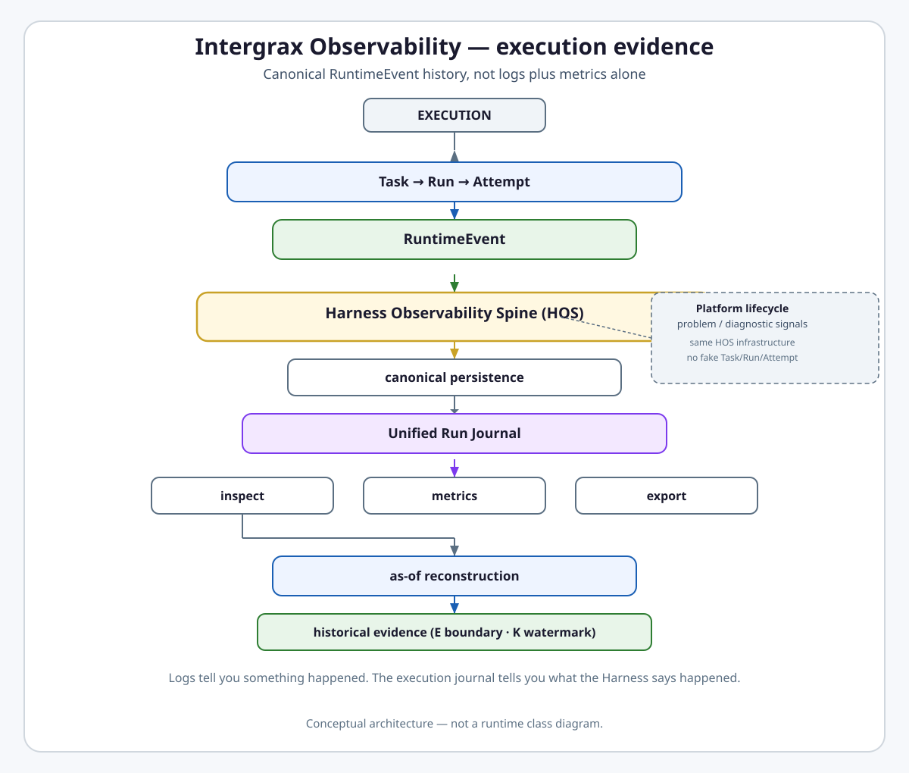
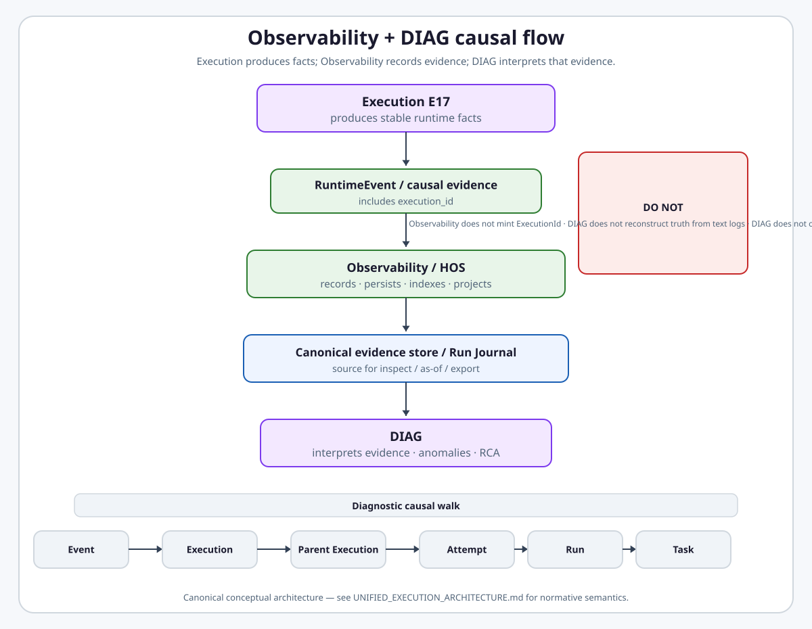
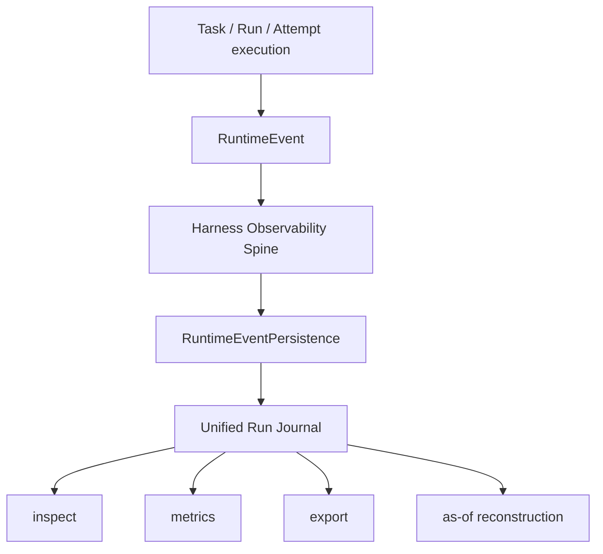

# Intergrax Observability

**Intergrax Observability** is the canonical execution evidence layer that **records** runtime identity and lifecycle facts on durable evidence, reconstructs runs deterministically from persisted envelopes, and exports policy-safe projections to operators and external telemetry systems. Execution Runtime establishes canonical identity; Observability persists it; central diagnostics ([`DIAGNOSTICS.md`](DIAGNOSTICS.md)) interprets persisted evidence - no layer below may recreate runtime truth.

## Why it matters

Without the Harness Observability Spine (HOS):

- agents keep private loggers and side-effect histories,
- retries and attempts blur together,
- vendor trace UIs become accidental sources of truth,
- operators cannot tell which event belongs to which run or attempt,
- historical execution state cannot be reconstructed deterministically,
- metrics do not explain why execution terminated,
- platform lifecycle forces fake execution IDs,
- evaluation builds a separate telemetry stack.

Observability addresses this through canonical identity **recording** on `RuntimeEvent`, HOS, strict persistence, the Unified Run Journal, deterministic execution positions, as-of projection, canonical knowledge revision ordering, embedded DIAG interpretation, and policy-safe export.

> [!NOTE]
> **Maturity boundary:** Core execution evidence (TRACE-1A–1C, ASOF-1/2, BITEMP-1/3) is **implemented and closed** on the harness path. Canonical `ExecutionId`, `RuntimeEvent.execution_id`, and Execution Tree foundations exist on migrated paths; full five-ID coverage convergence remains **PARTIAL**. Canonical revision ordering provider (**TRACE-BITEMP-2**) is an **implemented slice - acceptance in review**. Full **E + K + Valid Time + System Time** query semantics, public as-of query API, OECP code phases, and **OBS-VENDOR** production hardening remain **planned**. External sinks visualize Intergrax evidence - they do **not** define Intergrax execution semantics. Observability records identity minted by UER; it does **not** own Execution identity.

**Meta-architecture (frozen):** [`UNIFIED_EXECUTION_ARCHITECTURE.md`](UNIFIED_EXECUTION_ARCHITECTURE.md) - semantic authority for execution identity and lifecycle. [`UNIFIED_EXECUTION_RUNTIME.md`](UNIFIED_EXECUTION_RUNTIME.md) · [`NEXUS_EXECUTION_FLOW.md`](NEXUS_EXECUTION_FLOW.md) · [`ORCHESTRATION.md`](ORCHESTRATION.md) are synchronized domain authorities. **Central diagnostics** canonical entry point: [`DIAGNOSTICS.md`](DIAGNOSTICS.md). This document owns HOS, persistence, journal, and export; DIAG slice detail below links to that entry point.

**Persisted platform facts are truth. AI is not truth.**

## Domain topology and identity ownership

```text
Execution Runtime establishes runtime identity and lifecycle facts
        ↓
Observability records canonical evidence
        ↓
DIAG interprets that evidence
```

| Layer | Owns | Must not |
| ----- | ---- | -------- |
| **Execution Runtime** | Task/Run/Attempt/Execution lifecycle coordination; `ExecutionId` / `parent_execution_id` runtime lineage; mint at lifecycle boundaries | Delegate identity minting to Observability or DIAG |
| **Observability** | Record IDs on `RuntimeEvent`/evidence; validate required evidence contracts; persist/index/project/export | Mint `ExecutionId` as observability semantics; become competing execution-tree authority |
| **DIAG** | Reference canonical IDs; reconstruct/analyze/group over persisted evidence | Mint Task/Run/Attempt/Execution identity; maintain competing canonical Execution Tree; infer lineage from free-text logs |

**Frozen principle:** Observability records execution truth; it does not invent execution truth.

**Local identities are not canonical runtime IDs:** `node_id`, `agent_id`, `step_id`, `tool_call_id`, `correlation_id`, `message_id`, broker transport task id, worker id, and provider request id are topology/transport/component identities. They **must not** substitute `TaskId`, `RunId`, `AttemptId`, `ExecutionId`, or `EventId`. `NodeId` ≠ `ExecutionId`. Transport task id ≠ `TaskId` merely because strings match. Forbidden competing run identities: `NodeRunId`, `AgentRunId`, `StepRunId`, `OrchestrationRunId`, `WorkerRunId`.

**Primary audience:** Principal / Staff engineers, harness integrators, and extension authors wiring observability profiles, export policies, or domain signals - after the platform overview in the root README.

## Diagnostics ≠ Observability

| System | Question |
| ------ | -------- |
| **Diagnostics** ([`DIAGNOSTICS.md`](DIAGNOSTICS.md)) | What did the platform deterministically detect and persist as a `Problem`? |
| **Observability** (this document) | How do we record, project, and export platform behavior? |

```text
RuntimeEvent (canonical) → HOS → export boundary → provider adapter → OTLP / vendor
                              ↘
                               central diagnostics (derived Problem state)
```

**Not:** `runtime → OTel → diagnostics`. Vendor telemetry is **derived** - never execution truth.

**Observability failure invariant:** observability outage may cause missing telemetry but **cannot** alter platform truth or a correct business result. Export failure marks exporter health **DEGRADED**; canonical `RuntimeEvent` remains truth.

## At a glance

| Concern | Summary |
| -------- | -------- |
| **Canonical execution envelope** | `RuntimeEvent` - meaningful execution transition with full typed identity |
| **Identity** | **TARGET:** full five-ID spine on every canonical path; **CURRENT:** `ExecutionId` + `parent_execution_id` on migrated paths; coverage convergence **PARTIAL** |
| **Execution scope** | `RuntimeEvent` is execution-scoped only - **CURRENT:** `TaskId` + `RunId` + `AttemptId` + `EventId` required; `execution_id` on migrated paths; full five-ID convergence **PARTIAL** |
| **Non-execution signals** | Platform observability signal - lifecycle without synthetic execution identity |
| **Persistence** | `RuntimeEventPersistence` - canonical persisted evidence authority for accepted `RuntimeEvent`s |
| **Read model** | Unified Run Journal - derived chronological view, not a second source of truth |
| **Historical coordinate (E)** | `ExecutionEventPosition` + inclusive `AsOfBoundary` - not timestamp-only ordering |
| **As-of reconstruction** | `RunExecutionAsOfProjection` via pure reducer at boundary **E** - **Done** (TRACE-ASOF-2) |
| **Knowledge ordering (K)** | `RevisionOrderingAuthority` + finalized watermark - contracts **Done**; durable provider **in review** |
| **K-only reconstruction** | `HistoricalKnowledgeProjection` at watermark **K** - **Done**; not full bitemporal |
| **Bitemporal scope** | E and K shipped slices; Valid/System Time + combined E+K query **planned** |
| **Problem plane** | `PlatformProblemSignal` - classified operator attention; not execution history |
| **Causal evidence** | `PlatformCausalEvidence` - cross-boundary transport→execution relation; not execution history |
| **Redaction** | `DiagnosticPayload.redact()` + export policy - strongest on canonical/export paths |
| **Export** | HOS → policy-safe envelope → Integration vendor backend |
| **External sinks** | OTLP, Langfuse, Sentry, Phoenix, Datadog - destinations, not semantic owners |
| **Evaluation / OECP** | Consumes HOS evidence - architecture **documented**; code phases **planned** |
| **Maturity** | A4 · I4 · P2 · E3 - see [Current maturity](#current-maturity) |

## Flagship architecture visual

<a href="assets/fullsize/observability-evidence-spine.md">
<picture>
  <source media="(prefers-color-scheme: dark)" srcset="assets/observability-evidence-spine-dark.svg">
  <source media="(prefers-color-scheme: light)" srcset="assets/observability-evidence-spine-light.svg">
  
</picture>
</a>

**Cross-domain causal view (TARGET ARCHITECTURE):** Execution produces facts; Observability records; DIAG interprets along the canonical causal chain.

<a href="UNIFIED_EXECUTION_ARCHITECTURE.md">
<picture>
  <source media="(prefers-color-scheme: dark)" srcset="assets/unified-execution-observability-diag-causal-flow-dark.svg">
  <source media="(prefers-color-scheme: light)" srcset="assets/unified-execution-observability-diag-causal-flow-light.svg">
  
</picture>
</a>

**TARGET observability spine (full five-ID convergence **PARTIAL**):**

```text
Task
 ↓
Run
 ↓
Attempt
 ↓
Execution Tree          # parent_execution_id lineage - CURRENT on migrated paths
 ↓
RuntimeEvents
 ↓
Harness Observability Spine
 ↓
canonical persistence
 ↓
Unified Run Journal / projections / export
 ↓
DIAG interpretation
```

**CURRENT implementation spine (TRACE-1A–1C + migrated Execution identity):**

```text
Task → Run → Attempt → [Execution Tree on migrated paths] → RuntimeEvents → HOS → persistence → journal → inspect / reconstruct / export
```

> **Logs tell you something happened. The execution journal tells you what the Harness says happened.**

**Signal families:**

```text
RuntimeEvent  → canonical persisted execution evidence (lifecycle fact recorded)
TraceEvent    → diagnostic / read-model detail
Logs          → local diagnosis (not canonical execution evidence)
Metrics       → aggregates
External sink → destination (not semantic owner)
```

> **One spine. Multiple signal families. No private observability stacks.**

## How it works

1. **Emit** - meaningful execution transitions publish through HOS (`RuntimeEventBus`, approved emit paths).
2. **Normalize** - `trace_bridge`, payload registry, schema guard align envelopes to contracts.
3. **Persist** - `RuntimeEventPersistence` stores canonical execution history; `RunTraceWriter` holds Plane B diagnostic detail.
4. **Read** - `build_unified_run_journal()` reconstructs a strict chronological operator view.
5. **Reconstruct** - positioned prefix + `AsOfBoundary` **E** or knowledge watermark **K** yield deterministic projections.
6. **Export** - policy-safe `ObservabilityExportEnvelope` routes to optional vendor Integrations.



Platform lifecycle, problem, and diagnostic signals use the **same HOS infrastructure** with their own envelope families - no synthetic `TaskId`/`RunId`/`AttemptId`.

## Task → Run → Attempt → Execution → Event

**TARGET hierarchy:**

```text
TaskId
  → RunId
    → AttemptId
      → ExecutionId (+ parent_execution_id)
        → EventId
```

**CURRENT persisted event spine:** `TaskId` + `RunId` + `AttemptId` + `EventId`; + `ExecutionId` on migrated paths. Full five-ID coverage convergence **PARTIAL**.

```text
Task
└── Run
    ├── Attempt 1
    │   ├── Event
    │   └── Event
    └── Attempt 2
        ├── Event
        └── Event
```

| Level | Meaning |
| ----- | ------- |
| **Task** | User or system work intent (`TaskId`) |
| **Run** | One full governed lifecycle of the Task (`RunId`) |
| **Attempt** | One global try of the Run (`AttemptId`) |
| **Execution** | One independently schedulable/governable work unit inside the Attempt (`ExecutionId`; root: `parent_execution_id = None`) - **TARGET** |
| **Event** | One runtime fact / transition (`EventId`) |

> **One arbitrary signal ≠ one Attempt.** Attempt identity tracks global execution tries - not every log line, tool retry, or diagnostic row.

Identity is **structural** on the canonical contract - not best-effort metadata fallback (TRACE-1C strict journal). Execution Runtime establishes and propagates identity; Observability **records** it on evidence; DIAG **consumes** it.

## RuntimeEvent ≠ TraceEvent ≠ logs ≠ metrics

| Signal | Role | Must not become |
| ------ | ---- | --------------- |
| **`RuntimeEvent`** | Canonical execution history on `RuntimeEventBus` | Optional add-on beside private agent logs |
| **`TraceEvent`** | Compatibility / diagnostic / read-model detail (Plane B) | Second event authority or private audit store |
| **Logs** | Local diagnostic output (stdlib, host, integration transport) | Canonical execution evidence |
| **Metrics** | Aggregated operational signals (Prometheus, OTLP counters) | Substitute for the unified run journal |
| **External sinks** | Destinations for normalized export | Semantic owners of Intergrax event vocabulary |

## Harness Observability Spine (HOS)

HOS is shared platform infrastructure:

```text
emit → normalize → persist → read → export
```

Applications and agents **configure and extend** HOS - they do **not** create private observability buses.

**Envelope families on one spine:**

```text
HOS
├── RuntimeEvent
├── Platform observability signal
├── PlatformProblemSignal
├── DiagnosticPayload
└── export projections (ObservabilityExportEnvelope)
```

Semantic contract ≠ transport. HOS does **not** mean one universal envelope type.

### Execution vs platform signal (example)

| Fact | Envelope | Identity |
| ---- | -------- | -------- |
| Tool invocation during a run | `RuntimeEvent` | `TaskId` + `RunId` + `AttemptId` + `EventId`; + `ExecutionId` on migrated paths |
| Application instance started | Platform observability signal | No fake `TaskId`/`RunId`/`AttemptId` |

Hosting lifecycle routes through `ObservabilityHostedApplicationEventPublisher` on the canonical platform path (TRACE-1B-HOS-FIX **Done**).

## Unified Run Journal

```text
canonical persisted RuntimeEvents
        ↓
strict reconstruction (build_unified_run_journal)
        ↓
Unified Run Journal
```

The journal is a **derived read model** - chronological operator view, attempt-aware ordering, foundation for Execution Story surfaces. It is **not** a new persistence authority.

**Source chain:** runtime lifecycle facts → canonical persisted `RuntimeEvent`s/evidence → Unified Run Journal. The journal does **not** mint runtime identity, repair missing lineage by guessing, or become execution lifecycle authority.

## Historical execution coordinate and as-of projection

**ExecutionEventPosition** assigns deterministic order within a run - **not** timestamp-only ordering.

```text
Run history
  → exact boundary E (AsOfBoundary)
  → positioned prefix through E
  → RunExecutionAsOfProjection as-of E
```

Question: **“What had happened by execution position E?”** - reconstruction/projection, not live replay.

`project_run_execution_as_of` is a **pure reducer** over a positioned prefix: attempt-aware, provenance to source events, exact boundary must exist; incomplete pagination fails closed (TRACE-ASOF-1/2 **Done**).

## Knowledge revision ordering and K-only reconstruction

Second historical axis - canonical knowledge corrections:

```text
KnowledgeRevision
  → RevisionOrderingAuthority (semantic contract)
  → canonical K position + watermark
```

**Watermark (no silent gaps):**

```text
K1 accepted · K2 accepted · K3 accepted → finalized through K3
K1 accepted · K2 unresolved · K3 accepted → cannot claim finalized through K3
```

**K-only reconstruction (TRACE-BITEMP-3 Done):**

```text
Knowledge watermark K
  → finalized prefix
  → accepted revision IDs
  → KnowledgeRevisionReader
  → pure reducer
  → HistoricalKnowledgeProjection
```

> **K-only knowledge reconstruction is not full E + K + Valid Time + System Time reconstruction.**

## Bitemporal model and current implementation boundary

Four coordinates (do not collapse):

| Axis | Meaning |
| ---- | ------- |
| **E** | Execution history position |
| **K** | Canonical knowledge revision boundary (watermark) |
| **Valid Time** | When a fact is true in the domain/world |
| **System Time** | When the system recorded or knew it |

| Capability | State |
| ---------- | ----- |
| Typed bitemporal contracts | **Done** (TRACE-BITEMP-1) |
| `RevisionOrderingAuthority` contract | **Done** (TRACE-BITEMP-1) |
| Durable provider (`CanonicalRevisionOrderingProvider` / SQLite) | **Implemented slice - Planned / In Review** (TRACE-BITEMP-2) |
| K-only reconstruction | **Done** (TRACE-BITEMP-3) |
| E as-of reconstruction | **Done** (TRACE-ASOF-1/2) |
| Combined E + K query | **Planned** (TRACE-BITEMP-4) |
| Valid / System Time query semantics | **Planned** (TRACE-BITEMP-4) |
| Materialized historical projections | **Planned / conditional** (TRACE-ASOF-3) |
| Public execution-as-of query API at E | **Planned** (TRACE-ASOF-4) |

```text
RevisionOrderingAuthority  → semantic contract (backend-independent)
SQLite provider            → one first-party implementation (TRACE-BITEMP-2)
```

**Fencing:** scoped authority generation prevents stale resolution writers from rewriting newer canonical revision ordering (TRACE-BITEMP-ARCH-SYNC-R6/R7 canon).

## Problem plane and DiagnosticPayload

| Signal | Answers |
| ------ | ------- |
| **`RuntimeEvent`** | What happened in execution |
| **`PlatformProblemSignal`** | What requires operator attention |

`DiagnosticPayload` supplies typed detail (`payload_schema_id`, `redact()`) on trace or domain-signal envelopes - not an independent lifecycle channel.

## Redaction and external sinks

```text
diagnostic / event payload
  → redact / policy-safe projection
  → persistence / export
```

Platform contracts require redaction before persistence and export; enforcement coverage is **strongest** on canonical payload and export paths - not claimed universal across every ad-hoc log path.

```text
HOS
  → normalized / policy-safe export
  → OTLP / Langfuse / Sentry / Phoenix / Datadog / …
```

> **External telemetry systems visualize Intergrax evidence. They do not define Intergrax execution semantics.**

Observability owns observability signal/event semantics, canonical persisted evidence authority for accepted evidence, journal/read-model/projection semantics, and export policy. Execution Runtime owns canonical runtime identity (`ExecutionId`, `parent_execution_id`) and lifecycle structure. Integration owns transport/backend ([`INTEGRATIONS.md`](INTEGRATIONS.md)).

## Relationship to Intergrax

| Neighbor | Boundary |
| -------- | -------- |
| [**UER**](UNIFIED_EXECUTION_RUNTIME.md) | Execution lifecycle; Observability records transitions with typed identity |
| [**Nexus**](NEXUS_EXECUTION_FLOW.md) | Orchestration emits through HOS - no private trace bus |
| [**Tools**](TOOLS.md) | Tool invocations emit `TOOL_*` transitions; Tools must not keep private side-effect history |
| [**Integrations**](INTEGRATIONS.md) | Vendor backends are export sinks; Integrations do not own event semantics |
| [**Reliability / HITL**](RELIABILITY_FAILURE_AND_HITL.md) | Reliability owns behavior; Observability owns evidence of retries, attempts, handoff, terminal reason |
| [**Governed Execution**](GOVERNED_EXECUTION.md) | Governance authorizes; Observability records decision and provenance |
| [**Critic / Decision**](CRITIC_VERIFICATION.md) | **CURRENT:** Critic owns verification verdict; **TARGET:** [`DECISION_SYSTEM.md`](DECISION_SYSTEM.md) lifecycle audit - Decision ID, Decision Version, lifecycle/verification events, resolution, authorization correlation; Observability records, does not own decision semantics |

## Observability & Evaluation Control Plane (OECP)

```text
HOS evidence
  → OECP
  → eval snapshots / evidence ledger / regression gates (target)
```

> **OECP consumes the spine. It does not create another spine.**

| Area | State |
| ---- | ----- |
| Architecture canon (OBS-ECP-0) | **Done** - hub + extended satellite + plan |
| Trace Completeness Contract | **Planned** |
| Evidence Ledger | **Planned** - target eval-ready layer derived from HOS |
| Eval Registry v2 | **Planned** |
| Metric / eval plugins, CI gates, workbench UX | **Planned** |

Depth: [`satellites/OBSERVABILITY_extended_depth.md`](satellites/OBSERVABILITY_extended_depth.md) · plan [`OBSERVABILITY_eval_control_plane.md`](../maintainers/plans/satellites/OBSERVABILITY_eval_control_plane.md).

## Public invariants

**OBS-INV (Observability):**

| ID | Invariant |
| -- | --------- |
| **OBS-INV-001** | Observability records execution truth; it does not invent execution truth. |
| **OBS-INV-002** | **TARGET:** execution-scoped `RuntimeEvent` carries `TaskId`, `RunId`, `AttemptId`, `ExecutionId`, `EventId`. **CURRENT:** five-ID on migrated paths; full coverage convergence **PARTIAL**. |
| **OBS-INV-003** | `parent_execution_id` (execution lineage) and `parent_event_id` (event causality) are distinct relation types - do not collapse or derive one from the other. |
| **OBS-INV-004** | Observability projections/read models may project the Execution Tree but may not become competing identity/tree authority. |
| **OBS-INV-005** | Canonical persisted evidence retains structural links to runtime identity; free-text/log heuristics are not identity authority. |
| **OBS-INV-006** | Required causal/audit evidence and optional telemetry have distinct durability semantics. |
| **OBS-INV-007** | Unified Run Journal and as-of/bitemporal views are derived from persisted evidence and do not create new runtime facts. |
| **OBS-INV-008** | External observability vendors are sinks/projections, never semantic authorities. |

**DIAG-INV (embedded diagnostics subsystem):**

| ID | Invariant |
| -- | --------- |
| **DIAG-INV-001** | DIAG interprets canonical evidence; it does not create runtime truth. |
| **DIAG-INV-002** | DIAG never mints canonical Task/Run/Attempt/Execution identity. |
| **DIAG-INV-003** | DIAG never maintains a competing canonical Execution Tree. |
| **DIAG-INV-004** | Diagnostic reconstruction distinguishes execution lineage, event causality, topology association, transport relations, and side-effect evidence. |
| **DIAG-INV-005** | Free-text logs/correlation strings are not authoritative runtime identity. |
| **DIAG-INV-006** | Incomplete evidence yields explicit limitations/uncertainty - never invented lineage or certainty. |
| **DIAG-INV-007** | Diagnostic findings/groupings/root-cause hypotheses retain provenance to canonical evidence. |
| **DIAG-INV-008** | Model-assisted diagnostics consume bounded typed projections; model strategies do not independently query canonical persistence or vendor backends. |
| **DIAG-INV-009** | Grouping/incident hypotheses do not rewrite canonical facts or prove shared root cause merely because subjects are grouped. |
| **DIAG-INV-010** | Nested/distributed causality is reconstructed through canonical Execution lineage plus typed transport/external relations. |

Canonical runtime identity invariants remain owned by UEA/UER - not duplicated here as ID-INV-*.

## Target vs current (identity and evidence)

| Area | TARGET | CURRENT (HEAD) |
| ---- | ------ | -------------- |
| Identity spine | `TaskId` → `RunId` → `AttemptId` → `ExecutionId` → `EventId` on every canonical path | Canonical `ExecutionId` on migrated paths; full adoption **PARTIAL** |
| Execution Tree | `ExecutionId` + `parent_execution_id` - one canonical tree | `ExecutionTreeSnapshot` + lineage on migrated runtime/checkpoint paths; journal/DIAG projection convergence **PARTIAL** |
| `RuntimeEvent` IDs | Five-ID envelope + optional `parent_event_id` | Five-ID on migrated paths; four-ID minimum elsewhere until converged |
| `RuntimeExecutionRef` | `TaskId` + `RunId` + `AttemptId` + `ExecutionId` | Execution-aware projection **PARTIAL** |
| Causal evidence target | Canonical `ExecutionId` on execution side | Joins `TaskId`/`RunId`/`AttemptId`; `ExecutionId` on migrated paths |
| Journal / projections | Execution Tree projections derived from persisted evidence | Task/Run/Attempt/Event spine; Execution Tree projections **PARTIAL** |
| DIAG reconstruction | Event → Execution → parent Executions → Attempt → Run → Task | Run-scoped reconstruction primary; Execution-aware paths **PARTIAL** |
| Background worker bootstrap | Same `ExecutionId` on transport redelivery of same logical work | `resolve_background_execution` mints **new `AttemptId` on every worker boundary** - **implementation debt** vs frozen UEA redelivery semantics |

Do **not** claim a gap is fixed unless repository evidence at HEAD proves it.

## Implementation readiness

For future implementation sessions - derive slices without making new architecture decisions. Detailed code-file mapping: **UE-DOC-0.9**.

### 1. TARGET STATE

Frozen UEA + this document: Execution-centric five-ID evidence spine; canonical Execution Tree via `parent_execution_id`; Observability records identity minted by Execution Runtime; DIAG interprets persisted evidence and typed projections; journal/tree projections remain derived.

### 2. CURRENT STATE

Closed TRACE-1A–1C event spine; `RuntimeEvent.execution_id` on migrated paths; active DIAG-1..5D implementation; as-of and K-only reconstruction integrated; full five-ID and Execution Tree projection convergence **PARTIAL**.

### 3. GAPS

See [Target vs current](#target-vs-current-identity-and-evidence). Primary: five-ID coverage convergence, Execution-aware DIAG reconstruction, causal evidence on all paths, background worker AttemptId minting on redelivery.

### 4. DEPENDENCIES

- UEA frozen semantics (authority)
- UER Execution boundary / lifecycle mint ownership
- Nexus/Orchestration child Execution admission (distributed causal admission)
- Detailed code mapping: **UE-DOC-0.9**

### 5. MIGRATION ORDER (high level)

Foundational `ExecutionId` contract and `RuntimeEvent.execution_id` **exist** on migrated paths - remaining work is convergence:

1. ~~Introduce canonical `ExecutionId` / `parent_execution_id` in execution contracts~~ → **DONE** (converge coverage)
2. Propagate `ExecutionId` to all `RuntimeEvent` / evidence carriers
3. Extend `RuntimeExecutionRef` / causal evidence to full Execution awareness
4. Persist/index Execution-scoped evidence without breaking Task/Run/Attempt lineage
5. Project Execution Tree in Unified Run Journal/read models
6. Update DIAG reconstruction to Execution-aware references on all surfaces
7. Update lifecycle analysis/assessment/grouping subjects where Execution specificity is required
8. Align distributed causal admission/redelivery semantics
9. Remove identity fallbacks / log-derived reconstruction paths
10. Migrate external/export projections without making vendors authorities

### 6. DO NOT VIOLATE

- UEA-INV-* / UER-INV-* without explicit architecture reopen
- Observability or DIAG minting canonical Execution identity
- Competing execution trees (diagnostic tree, HOS-owned tree, journal-owned identity tree, log-derived tree)
- `correlation_id` promoted to canonical lineage
- Model/grouping strategies querying `RuntimeEventPersistence` or vendor backends directly

### 7. ACCEPTANCE CONDITIONS

- `ExecutionId` on target execution-scoped evidence paths when UER delivers contracts
- DIAG reconstruction path Event → Execution → lineage without inventing identity
- Retry/redelivery semantics match frozen UEA taxonomy (labeled CURRENT debt until migrated)
- TARGET/CURRENT labeled where implementation lags
- DIAG-5C-A architecture preserved under ownership framing

## Current maturity

| Axis | Level | Rationale |
| ---- | ----- | --------- |
| **Architecture (A)** | **A4** | Validated canon: identity, HOS families, source-of-truth boundaries, E/K model coherent; full bitemporal query surface still planned |
| **Implementation (I)** | **I4** | HOS, strict identity/journal, platform signals, as-of, K reconstruction integrated; BITEMP-2 provider slice in review; OECP code not shipped |
| **Production (P)** | **P2** | SQLite defaults, export boundary partial, OBS-VENDOR hardening planned - not distributed production qualification |
| **Evidence (E)** | **E3** | Unit/gate proofs on identity, journal, as-of, revision store, reconstruction, export; bounded LKW platform proof partial - not E4 full-harness E2E |

| Sub-area | Implementation | Evidence |
| -------- | -------------- | -------- |
| Core execution observability | **I4** - closed TRACE-1A–1C | Gate tests + journal proofs |
| Historical reconstruction (E, K) | **I4** - ASOF-1/2, BITEMP-3 closed; BITEMP-2 in review | Reducer + provider qualification tests |
| External export / vendors | **I3** - export boundary done; vendor adapters partial | Export policy tests; full vendor hardening open |
| OECP | **I1** - architecture only | OBS-ECP-0 docs; code phases planned |

## Verify / inspect implementation

### Evidence

| Layer | Artifacts |
| ----- | --------- |
| **Architecture** | This hub · [`OBSERVABILITY_extended_depth.md`](satellites/OBSERVABILITY_extended_depth.md) · TRACE / bitemporal canon in engineering section |
| **Unit / gate** | Identity, strict journal, platform signal path, as-of, bitemporal contracts, revision store, K reconstruction, redaction/export tests under `tests/unit/runtime/observability/` and `tests/unit/contracts/` |
| **Integration** | Representative Task → Run → Attempt → journal paths; tool/HITL visibility in harness proofs |
| **Public proof** | [`PROOFS.md`](../proofs/PROOFS.md) - LKW Core Platform Proof (**partial** bounded proof; Elasticsearch/Kibana export closed for platform proof, not production hardening) |
| **Production / customer** | **Not established** |

Bounded public proof routes: [`PROOFS.md`](../proofs/PROOFS.md) - LKW Core Platform Proof (**partial**; Elasticsearch/Kibana export closed for platform proof, not production hardening or universal observability qualification).

### Core implementation

- [`RuntimeEvent`](../../../intergrax/runtime/events/runtime_event.py) · [`RuntimeEventBus`](../../../intergrax/runtime/events/event_bus.py)
- [`RuntimeEventPersistence` contract](../../../intergrax/runtime/events/persistence_contract.py)
- [`build_unified_run_journal`](../../../intergrax/runtime/events/unified_run_journal.py)
- [Observability export boundary](../../../intergrax/runtime/observability/export_boundary.py)

### Go deeper

| Depth | Route |
| ----- | ----- |
| Engineering canon | [Below - §1–§10](#engineering-canon) in this file |
| Extended depth (OECP target) | [`satellites/OBSERVABILITY_extended_depth.md`](satellites/OBSERVABILITY_extended_depth.md) |
| Implementation plan | [`maintainers/plans/OBSERVABILITY.md`](../maintainers/plans/OBSERVABILITY.md) |
| OECP plan | [`maintainers/plans/satellites/OBSERVABILITY_eval_control_plane.md`](../maintainers/plans/satellites/OBSERVABILITY_eval_control_plane.md) |
| UER · Nexus · Reliability · Governance · Tools · Integrations · Critic | Neighbor hubs linked above |
| Maturity taxonomy | [`MATURITY_TAXONOMY.md`](../technical/guides/MATURITY_TAXONOMY.md) |
| Public proofs | [`PROOFS.md`](../proofs/PROOFS.md) |

---

## Maintainer metadata

**Status:** Canonical architecture (domain pair 1:1)  
**Hub:** [`intergrax_runtime_architecture.md`](intergrax_runtime_architecture.md)  
**Plan (1:1):** [`maintainers/plans/OBSERVABILITY.md`](../maintainers/plans/OBSERVABILITY.md)  
**Target:** [`IDEAL_HARNESS_AI_ARCHITECTURE.md`](../technical/guides/IDEAL_HARNESS_AI_ARCHITECTURE.md)  
**Audit layers:** 21, 30  
**Platform audit:** [`docs/audit_results/AUDIT_PROTOCOL.md`](../../audit_results/AUDIT_PROTOCOL.md)  
**Last updated:** 2026-08-26 - UE-DOC-0.6 identity/DIAG alignment with frozen UEA · DIAG-5C-A-R1 preserved · TRACE-BITEMP-3 K-only **Done** · TRACE-ASOF-2 **Done** · TRACE-BITEMP-2 provider **Planned / In Review** · TRACE-1C **Done**

## Cursor read scope (token budget)

**Do not read this entire file in one session** (OBSERVABILITY canon).

- **Implement / audit default:** trace spine + HOS + signal planes (§1–§4); execution identity + journal + as-of + bitemporal state (§5–§10). Extended depth: [`satellites/OBSERVABILITY_extended_depth.md`](satellites/OBSERVABILITY_extended_depth.md).
- **Use** table of contents below - `Read` with offset/limit per §.
- **Plan hub:** [`maintainers/plans/OBSERVABILITY.md`](../maintainers/plans/OBSERVABILITY.md) (scoped §6 only).
- **Platform audit:** [`docs/audit_results/AUDIT_PROTOCOL.md`](../../audit_results/AUDIT_PROTOCOL.md).
- **Max reads:** at most **one** file >5k tokens per session unless RESUME cites more.

## Architecture satellites (read on demand)

Large § blocks moved out of the architecture hub to reduce Cursor context use. Load **only** the satellite matching your task or cited §.

| Satellite | Contents |
| --------- | ---------- |
| [`satellites/OBSERVABILITY_extended_depth.md`](satellites/OBSERVABILITY_extended_depth.md) | Extended depth · **OECP** target architecture (Evidence Ledger, Eval Registry v2, custom telemetry, L5–L7) |

> **Cursor context budget:** read hub read-scope block + **at most one** satellite per session.

---

## Engineering canon

## 1. Purpose and scope

### 1.1 What this document defines

This is the **canonical architecture authority** for how observability and embedded DIAG semantics work across the Intergrax Harness - not the runtime lifecycle owner of execution identity (UEA/UER):

- **Harness (Tier-0 / Tier-1)** - Nexus, AgentEngine, ToolRuntime, policy, critic, adaptive loops
- **Applications (Tier-3)** - composition roots that wire stores and profiles; no parallel telemetry stack
- **Agents (Tier-2)** - domain logic that **extends** platform contracts; never implements a private trace pipeline

### 1.2 What observability must answer

For every user interaction (question → answer), an operator MUST be able to reconstruct:

| Question | Required evidence |
|----------|-------------------|
| What entered the system? | Intake events, ingestion, normalized task |
| How was the agent chosen? | Agent selection record (capability, score, fallback) |
| What plan was produced? | Plan events + planner diagnostics |
| What context was assembled? | Context/RAG/memory events (metadata; content redacted in prod) |
| What did each step do? | Step start/complete/fail, tool calls, LLM calls |
| What did policy/critic decide? | Policy decisions, validation layers, verdicts |
| What failed or retried? | Error taxonomy, retry schedule/start, handoff |
| What did it cost? | Token/cost aggregation per run |
| Why did the run stop? | Terminal event + reason codes |

### 1.3 Non-goals

- Replacing external APM (Datadog, Honeycomb) as the **only** store - Intergrax owns the canonical journal; external systems are **optional sinks**
- Storing raw prompts/completions in production traces (redaction is mandatory)
- Per-agent custom SQLite trace databases
- Raw `dict` payloads without `payload_schema_id` / registry (see §8.2 residual evolution)

---

## 2. Design principles

| Principle | Meaning |
|-----------|---------|
| **Harness-provided spine** | One observability mechanism ships with the platform. Applications and agents **configure and extend** it - they do not rebuild it. |
| **Event-first** | `RuntimeEvent` is the primary audit signal (canon §42.1). Traces and metrics are derived views. |
| **Typed extension** | Platform steps use `DiagnosticPayload` subclasses with stable `schema_id`. Domain extensions inherit the same contract. |
| **Emit at the boundary** | Signals are recorded where the Harness enforces policy (ToolRuntime, AgentRouter, GraphExecutor) - not inside ad-hoc agent helpers. |
| **Correlation by construction** | `TaskId`, `RunId`, `AttemptId`, `EventId` (and **TARGET** `ExecutionId`) are established by Execution Runtime and recorded by the spine - not passed manually in business code. `correlation_id` and `parent_event_id` are operational/causal metadata - not substitutes for execution lineage. |
| **Redact before persist** | `DiagnosticPayload.redact()` + `production_mode` run before any store append. |
| **Pluggable persistence** | SQLite default; Cassandra/Elasticsearch/OTLP as integration profiles - same API, different backend. |
| **Read-model unification** | Operators consume **one chronological journal** per run (`build_unified_run_journal`) - a derived read model, not the persistence source of truth (§6). |
| **Modular sinks** | Metrics, logs, and external trace UIs subscribe to the bus or journal - they do not fork emission. |

---

## 3. The Harness Observability Spine (HOS)

The **Harness Observability Spine** is the universal “bus” through which all tiers publish execution signals.

```text
┌─────────────────────────────────────────────────────────────────────────┐
│                    HARNESS OBSERVABILITY SPINE (HOS)                     │
├─────────────────────────────────────────────────────────────────────────┤
│  EMIT (write)                                                            │
│    ObservabilityEmitter.emit_step()     ← single developer-facing API    │
│    RuntimeState.trace_event()           ← pipeline internal (today)      │
│    RuntimeEventBus.record() / publish() ← canonical envelope             │
├─────────────────────────────────────────────────────────────────────────┤
│  NORMALIZE                                                               │
│    trace_bridge                         TraceEvent → RuntimeEvent        │
│    payload_registry + schema_guard      schema_id → typed payload        │
├─────────────────────────────────────────────────────────────────────────┤
│  PERSIST (write path)                                                    │
│    RunTraceWriter                       TraceEvent timeline (SQLite…)    │
│    RuntimeEventPersistence              RuntimeEvent journal (SQLite…)     │
├─────────────────────────────────────────────────────────────────────────┤
│  READ (query path)                                                       │
│    build_unified_run_journal()          merged chronological timeline      │
│    export_run_metrics()                 aggregates per run                 │
│    Debug API / CLI                      operator inspection                │
├─────────────────────────────────────────────────────────────────────────┤
│  SINKS (optional, subscribe/export)                                      │
│    journal_export plugin                unified journal OTLP snapshot      │
│    OTLP / Prometheus                    LLM/RAG metrics plugins            │
│    ObservabilityBackend tools           Langfuse, Sentry, Phoenix…         │
│    Custom RuntimeEventBus handlers      alerting, webhooks               │
└─────────────────────────────────────────────────────────────────────────┘
```

**Key rule:** Harness, applications, and agents all use the **same spine**. Differences are only in **which steps emit** and **which `DiagnosticPayload` schemas** are registered - not in transport or storage mechanics.

---

## Observability Event Spine

**Normative rule:** `RuntimeEvent` is the canonical runtime event and audit envelope for meaningful execution transitions.

The Harness Observability Spine (§3) is the write/read/export path; this section defines **what each signal type owns** so agents, tools, integrations, and applications do not fork parallel observability pipelines.

| Signal | Role | Must not become |
|--------|------|-----------------|
| **`RuntimeEvent`** | Canonical event/audit envelope on `RuntimeEventBus`; primary persisted execution evidence for lifecycle, policy, HITL, and operator reconstruction | An optional add-on beside private agent logs |
| **`TraceEvent`** | Compatibility / read-model / diagnostic view (Plane B); fine-grained timeline via `RuntimeState.trace_event()` and `RunTraceWriter`; bridged to the bus by `trace_bridge` | A competing event bus or private audit store |
| **Logs** | Local diagnostic output (stdlib logging, host logs, integration transport traces) | Canonical audit evidence or execution history |
| **Metrics** | Aggregated operational signals (Prometheus, OTLP counters, SLO ratios) derived from events or counters | A substitute for the unified run journal |
| **External sinks** | Destinations for normalized events, logs, or metrics (Langfuse, Sentry, Datadog, OTLP export) | Semantic owners of Intergrax event vocabulary |
| **`DiagnosticPayload`** | Typed payload detail carried by Plane B trace rows or domain-signal envelopes (`payload_schema_id` + `redact()`) | An independent lifecycle channel with its own persistence contract |
| **`PlatformProblemSignal`** | Vendor-neutral problem/error plane for classified failures requiring operator attention; exported via `ObservabilityExportPolicy` | A substitute for `RuntimeEvent` execution history or a generic lifecycle channel |
| **Platform observability signal** | Non-execution platform/domain lifecycle signal on HOS (application instance, component, infrastructure) with its own identity and correlation - **no** `TaskId`/`RunId`/`AttemptId` | A `RuntimeEvent` with synthetic execution identity |

**Implementation detail:** Plane A/B/C breakdown, field catalog, and bridge mechanics - §4. Correlation identifiers - §6 and [Required correlation fields](#required-correlation-fields) below. Layered `event_type` / `event_kind` governance - §4.4 and [Event type governance](#event-type-governance) below.

**Cross-layer canon:** [`SYSTEM_INVARIANTS.md`](../technical/guides/SYSTEM_INVARIANTS.md) §7 · [`UNIFIED_EXECUTION_RUNTIME.md`](UNIFIED_EXECUTION_RUNTIME.md) §42.1 · [`NEXUS_EXECUTION_FLOW.md`](NEXUS_EXECUTION_FLOW.md) §12.2 · [`RELIABILITY_FAILURE_AND_HITL.md`](RELIABILITY_FAILURE_AND_HITL.md#attempt-ledger) · [`TOOLS.md`](TOOLS.md) · [`INTEGRATIONS.md`](INTEGRATIONS.md) · [`AGENT_CONTRACTS_AND_ASSEMBLY.md`](AGENT_CONTRACTS_AND_ASSEMBLY.md) §31 · [`CRITIC_VERIFICATION.md`](CRITIC_VERIFICATION.md#boundary-with-observability--evaluation-control-plane-oecp) · [`ADAPTIVE_HARNESS_INTELLIGENCE.md`](ADAPTIVE_HARNESS_INTELLIGENCE.md#governance-boundary) · [`ELASTIC_CAPACITY_AND_SCALING.md`](ELASTIC_CAPACITY_AND_SCALING.md#scaling-action-governance) · [`CODE_CRAFT.md`](CODE_CRAFT.md#codecraft-safety-boundary)

---

## Observability & Evaluation Control Plane

Intergrax observability is **not** limited to traces and metrics. The **Harness Observability Spine (HOS)** remains the **only** canonical observability spine. **Observability & Evaluation Control Plane (OECP)** operates **above** HOS - it consumes `RuntimeEvent`, `TraceEvent`, unified journal, and evidence refs; it **must not** create a parallel trace system.

OECP transforms spine data into eval-grade artifacts: **evidence ledger** records, **eval snapshots**, **metric results**, **regression gates**, and **perturbation suites**. External workbenches (Langfuse, LangSmith, OTLP, Sentry, Phoenix, Braintrust, Datadog, …) are optional sinks - not semantic owners.

**Target architecture:** [`satellites/OBSERVABILITY_extended_depth.md`](satellites/OBSERVABILITY_extended_depth.md) (OECP sections). **Plan:** [`plan/satellites/OBSERVABILITY_eval_control_plane.md`](../maintainers/plans/satellites/OBSERVABILITY_eval_control_plane.md). **Audit source:** [`audit/OBSERVABILITY_EVALUATION_CONTROL_PLANE_AUDIT.md`](../../audit_results/legacy/OBSERVABILITY_EVALUATION_CONTROL_PLANE_AUDIT.md).

---

## Event ownership rules

| Rule | Requirement |
|------|-------------|
| Runtime emission | New runtime components **SHOULD** emit meaningful execution transitions through `RuntimeEventBus` or the approved observability spine (§3). |
| Agent trace stores | Agents **MUST NOT** create private trace stores. |
| Agent logging pipelines | Agents **MUST NOT** create private logging pipelines for execution state. |
| Tool side effects | Tools **MUST NOT** bypass runtime observability for side effects - `TOOL_*` and bridged diagnostics **MUST** be visible through the spine ([`TOOLS.md`](TOOLS.md)). |
| Integration diagnostics | Integrations **MAY** log transport/backend diagnostics; they **MUST NOT** own harness execution trace semantics ([`INTEGRATIONS.md`](INTEGRATIONS.md)). |
| Application summaries | Applications **MAY** add product-level summaries (e.g. `ApplicationRunSummary`); they **MUST NOT** replace runtime event history. |
| External sinks | External sinks **MUST** receive normalized signals; they **MUST NOT** define canonical Intergrax event semantics. |
| Secrets | Event payloads **MUST NOT** contain secrets. |
| Redaction | Redaction **MUST** happen before persistence or external export where required (`DiagnosticPayload.redact()`, `production_mode`). |
| Domain extension | Domain-specific events **SHOULD** use namespaced `event_kind` / payload schemas instead of expanding platform lifecycle enums unnecessarily (§4.4). |

Audit stores (`RuntimeEventPersistence`, `RunTraceWriter`) persist spine-normalized records - they are **not** alternate semantic owners. Custom `RuntimeEventBus` handlers and journal export plugins are subscribers/sinks, not parallel buses.

---

## Execution-scoped vs non-execution observability signals

**Normative rule:** `RuntimeEvent` is **execution-scoped only**. Every canonical `RuntimeEvent` **MUST** carry full execution identity: `TaskId`, `RunId`, `AttemptId`, and `EventId` - all required, none optional, no synthetic placeholders to admit unrelated signals.

The Harness Observability Spine (HOS) is **broader** than `RuntimeEvent`. HOS is the single approved write/read/export path; it carries **multiple semantic envelope families** through the same spine infrastructure. Semantic contract and transport/storage/export mechanism are separate concerns - **one spine, not two buses**.

```text
Harness Observability Spine (HOS)
├── Execution event          → RuntimeEvent (TaskId + RunId + AttemptId + EventId)
├── Platform observability   → non-execution platform/domain lifecycle signal
├── Problem plane            → PlatformProblemSignal (failures / operator attention)
├── Diagnostic detail        → DiagnosticPayload (payload on trace or domain-signal envelopes)
├── Read model               → TraceEvent (Plane B compatibility / reconstruction)
└── Export projection        → ObservabilityExportEnvelope (policy-safe export record)
```

### A. Execution-scoped signals (`RuntimeEvent`)

| Property | Requirement |
|----------|-------------|
| Scope | Meaningful **execution** transitions inside a Task → Run → Attempt lifecycle |
| Identity | `event_id`, `task_id`, `run_id`, `attempt_id` - all required (**CURRENT**); **TARGET:** + `execution_id` |
| `AttemptId` semantics | One global try inside a Run; local tool/provider/step retries do **not** mint new `AttemptId` (frozen UEA) |
| Persisted execution evidence | `RuntimeEventPersistence` is the canonical persisted evidence authority for accepted `RuntimeEvent`s; lifecycle facts originate from execution producers; Unified Run Journal reconstructs from persisted events |
| Forbidden | Optional execution identity; multiplexed identity modes; synthetic `TaskId`/`RunId`/`AttemptId` for non-execution events |

`emit_domain_signal()` and `RuntimeEventType.DOMAIN_SIGNAL` are **execution-attached** in practice: both require `EmitContext` with validated `TaskId`, `RunId`, and `AttemptId`. A domain signal on the bus is a `RuntimeEvent` carrying a namespaced `event_kind` and typed payload **within an active execution correlation** - not a generic non-execution lifecycle channel. Platform lifecycle facts that occur **during** execution (for example `platform.adaptive.*` on `DOMAIN_SIGNAL`) remain execution-scoped because they are correlated to a real attempt.

### B. Non-execution platform observability signals

**Platform observability signal** is the canonical semantic family for observable platform/domain lifecycle facts that do **not** belong to Task/Run/Attempt execution history.

| Property | Requirement |
|----------|-------------|
| Scope | Application hosting lifecycle, component health, instance acquisition/release, infrastructure lifecycle, and similar platform facts **outside** execution attempt boundaries |
| Identity | Signal-local `event_id` (or equivalent), `correlation_id`, `causation_id`, source/component identity (`application_id`, `instance_id`, … as applicable), typed payload, severity/category |
| Execution identity | **MUST NOT** include `TaskId`, `RunId`, or `AttemptId`; **MUST NOT** mint `AttemptId` per signal |
| Source of truth | Describes platform/application observability - **not** execution history; does not replace Unified Run Journal reconstruction |
| Transport | Published through the **existing HOS spine/export path** - not a second bus, not `RuntimeEventBus.record()` with fake execution identity |

`ObservabilityExportEnvelope` is an **export projection / transport envelope** only (`record_kind`, sanitized fields). It is **not** the semantic owner of platform lifecycle facts - do not promote it to domain semantics.

`DiagnosticPayload` is **payload detail** (`schema_id`, `redact()`) carried by Plane B `TraceEvent` rows or execution-attached `DOMAIN_SIGNAL` envelopes. It is **not** an independent non-execution lifecycle channel.

`TraceEvent` remains a **compatibility / read-model / diagnostic view** (Plane B). It **MUST NOT** become the canonical non-execution signal bus or substitute for persisted execution evidence.

`PlatformProblemSignal` remains the specialized **problem/error plane** (`what broke / requires attention`). It **MUST NOT** be abused for routine hosting lifecycle events.

### C. Application hosting classification

`HostedApplicationEvent` (`intergrax/hosting/contracts/events.py`) is the typed authoring envelope for **application-hosting platform observability signals**. Its semantics are:

| Lifecycle | Examples |
|-----------|----------|
| Application instance | `APPLICATION_STARTING`, `APPLICATION_READY`, `APPLICATION_STOPPED`, `APPLICATION_FAILED` |
| Component | `COMPONENT_STARTED`, `COMPONENT_HEALTH_CHANGED`, `COMPONENT_FAILED` |
| Instance guard | `INSTANCE_ACQUIRED`, `INSTANCE_RELEASED`, `INSTANCE_STALE_RECOVERED` |
| Restart / hooks / plugins | `RESTART_*`, `HOOK_*`, `PLUGIN_*` |

These events describe **hosted application/platform lifecycle** - not Intergrax Task, Run, or Attempt lifecycle. `HostedApplicationEvent` already carries the correct non-execution identity (`event_id`, `correlation_id`, `causation_id`, `application_id`, `instance_id`).

**Target (canonical):**

```text
HostedApplicationEvent
  → platform observability signal (hosting domain)
  → existing HOS spine / export infrastructure
```

**Shipped (TRACE-1B-HOS-FIX Done):** `ObservabilityHostedApplicationEventPublisher` (`intergrax/hosting/eventing.py`) routes `HostedApplicationEvent` through the canonical platform observability path on the existing HOS spine/export infrastructure (`ExportRecordKind.PLATFORM_SIGNAL`). The legacy `RuntimeSpineHostedApplicationEventPublisher` adapter that synthesized `TaskId`, `RunId`, and per-event `AttemptId` is **removed** - no compatibility alias or dual path.

**HOST-DIAG-3:** `PLATFORM_SIGNAL` export remains the normal path for all hosting lifecycle events. `APPLICATION_FAILED` may additionally project into central non-execution diagnostics when product composition supplies explicit `HostedDiagnosticTenantBinding` and a shared `DiagnosticOrchestrator` via `HostedApplicationDiagnosticEventPublisher` - observability export always runs first.

### D. Author decision supplement (see also §4.4.1)

```text
Need a new signal?
├── No Task/Run/Attempt lifecycle (hosting, infra, app instance)?
│     → platform observability signal on HOS (not RuntimeEvent)
├── Debug / reconstruction only?     → DiagnosticPayload (Plane B)
├── Product/domain fact during execution? → emit_domain_signal (requires real EmitContext)
├── Nexus lifecycle transition?      → emit_platform_event (requires real EmitContext)
└── Classified failure / operator attention? → PlatformProblemSignal (problem plane)
```

---

## Problem signal emission boundary

**Normative rule:** `RuntimeEvent` answers **what happened**; `PlatformProblemSignal` answers **what broke and requires attention**. Problem signals are an explicit semantic classification at an **owned emission boundary** - not an automatic conversion from every `RuntimeEvent` or exception.

`ProblemReporter` / `report_problem` (`intergrax/runtime/observability/problem_reporter.py`) is the developer-facing helper for building and exporting problems through the existing observability export path (`PlatformProblemSignal` → `ObservabilityExportEnvelope` → `ObservabilityExportPolicy` → `try_export_observability_envelope`). This section defines **where** that helper may be called. It does **not** add automatic runtime emission, routing/fanout, Sentry, Elastic, OTLP, or vendor-specific behavior.

### A. ProblemSignal role

| Property | Requirement |
|----------|-------------|
| Semantic model | `PlatformProblemSignal` is the vendor-neutral problem/error signal model (`problem_signal.py`). |
| Not a replacement for `RuntimeEvent` | Execution/audit history remains on the spine; problems are a separate explicit plane. |
| Not a generic log record | Problems require classified taxonomy fields - not unstructured diagnostic text. |
| Not vendor-specific | No Sentry/Elastic/OTLP semantics in the platform model; vendors project sanitized envelopes only. |
| Attention signal | Represents a classified failure/problem requiring operator or developer attention. |

### B. Allowed emitters

Problem signals **MAY** be emitted only from boundaries that **own failure classification** for a run/task and can preserve correlation identifiers:

| Boundary | Examples |
|----------|----------|
| **Application** | Tier-3 endpoint handler, command handler, pipeline boundary, or composition root that owns product-level failure classification. |
| **Runtime** | Runtime executor, graph boundary, agent run boundary, tool runtime wrapper, or policy-enforced runtime boundary. |
| **Integration** | Platform integration wrapper that classifies a provider/backend failure into a platform problem without leaking vendor SDK details. |
| **Explicit tool wrapper** | `ToolRuntime` or an approved wrapper around tool execution - **not** arbitrary tool internals. |

The owning boundary **SHOULD** call `report_problem(...)` or `ProblemReporter(...).report(...)` once it has decided the failure is reportable and has stable `problem_kind`, `severity`, `source_layer`, `source_component`, and `error_code` when available.

### C. Discouraged or forbidden emitters

| Location | Rule |
|----------|------|
| Low-level utility functions | **MUST NOT** own platform problem taxonomy. |
| Raw model/provider client code | **MUST NOT** emit `PlatformProblemSignal`; raise typed errors or return structured failures instead. |
| Ad-hoc agent helper functions | **MUST NOT** report problems outside an agent run boundary that owns classification. |
| LKW-only private logging code | **MUST NOT** define an LKW-only issue model or bypass the platform helper. |
| Vendor provider internals | **MUST NOT** be semantic owners of platform problems or platform taxonomy. |
| External sink/provider code | **MUST NOT** define Intergrax problem kinds or severities. |
| Code without run/task/correlation ownership | **MUST NOT** call `report_problem` - use `ProblemReportContext` with available correlation fields at the owning boundary. |

### D. Duplicate prevention

| Rule | Detail |
|------|--------|
| One owner per failure | One failure **SHOULD** have one owning emission boundary. |
| Lower layers raise, upper layers classify | Lower layers **MAY** raise typed errors or attach typed context; they **SHOULD NOT** double-report if a higher boundary owns classification. |
| Correlation preservation | The boundary that reports **MUST** populate `run_id`, `task_id`, `correlation_id`, and related fields when available (`ProblemReportContext`). |
| Export failure isolation | `try_export_observability_envelope` failure isolation **MUST NOT** recursively create an unbounded chain of problem signals - export failures are isolated; optional single observability-plane report is a separate explicit decision at an observability boundary. |

### E. RuntimeEvent relationship

| Rule | Detail |
|------|--------|
| No automatic conversion | Not every `RuntimeEvent` becomes a `PlatformProblemSignal`. |
| No automatic exception mapping | Not every exception automatically becomes a problem signal. |
| Retries/fallbacks | Not every retry or fallback is a problem - only semantically classified failures. |
| Required classification | A problem signal **MUST** include explicit taxonomy: `problem_kind`, `severity`, `source_layer`, `source_component`, and `error_code` when available. |
| Spine remains canonical | `RuntimeEvent` remains the canonical execution/audit history on `RuntimeEventBus`. |
| Export plane | `PlatformProblemSignal` is the explicit problem/error plane exported via `ObservabilityExportPolicy` and existing envelope mapping (`problem_export.py`). |

A boundary **MAY** correlate a problem to a spine `event_id` when both exist; correlation does **not** imply automatic creation from the event.

### F. Safety rules

Problem signals and their export envelopes **MUST** follow the same content-safety posture as observability export:

| Forbidden | Required alternative |
|-----------|---------------------|
| Raw exception serialization (stack traces, `str(exc)` bodies) | `error_code`, `exception_type` (class name only) when applicable |
| Raw prompt/query/content/chunks/tool_args | Typed `ApplicationObservabilityAttributes` with declared safe fields only |
| Raw local file paths | `ObservabilityArtifactReference` (`artifact_ref`, `sha256`, `safe_relative_path`, `schema_id`) |
| Raw `dict` payload/context/details/metadata | Typed attributes and reference-only artifacts |
| Secrets | Never - policy drops or hashes forbidden fields |

`ObservabilityExportPolicy` owns redaction/sanitization before export. Vendor providers receive **only** policy-safe envelopes.

### G. Developer-facing examples

**Application boundary - explicit classification:**

```python
from intergrax.runtime.observability.problem_reporter import ProblemReportContext, report_problem
from intergrax.runtime.observability.problem_signal import PROBLEM_SOURCE_LAYER_APPLICATION

context = ProblemReportContext(
    run_id="run-fake-001",
    task_id="task-fake-001",
    correlation_id="corr-fake-001",
    agent_id="agent-lkw",
    capability="local.workspace.search",
)

await report_problem(
    context=context,
    problem_kind="lkw.retrieve_failed",
    severity="error",
    error_code="LKW_RETRIEVE_FAILED",
    source_layer=PROBLEM_SOURCE_LAYER_APPLICATION,
    source_component="local_workspace_search_handler",
    tool_id="rag.retrieve",
)
```

**Runtime/tool boundary - bound reporter:**

```python
from intergrax.runtime.observability.problem_reporter import ProblemReportContext, ProblemReporter
from intergrax.runtime.observability.problem_signal import PROBLEM_SOURCE_LAYER_TOOL

reporter = ProblemReporter(
    context=ProblemReportContext(
        run_id="run-fake-002",
        task_id="task-fake-002",
        correlation_id="corr-fake-002",
    ),
)

await reporter.report(
    problem_kind="platform.tool_failure",
    severity="error",
    error_code="TOOL_EXECUTION_FAILED",
    source_layer=PROBLEM_SOURCE_LAYER_TOOL,
    source_component="tool_runtime_wrapper",
    tool_id="web.search",
)
```

### H. Anti-examples (do not)

- Do **not** call `sentry_sdk` (or any vendor SDK) from runtime, application, agent, or tool code.
- Do **not** map LKW or domain code directly to Sentry, Elastic, or OTLP - use the platform export envelope and policy.
- Do **not** emit the same failure from tool internals, agent helper, **and** endpoint (pick one owning boundary).
- Do **not** serialize raw exception objects, raw context dicts, or query/content into problem fields.
- Do **not** turn every `RuntimeEvent` (or every `ObservabilityEmitter.emit_step`) into a `PlatformProblemSignal`.
- Do **not** add `ObservabilityEmitter.emit_problem`, automatic global exception hooks, or `RuntimeEventBus` subscribers that auto-emit problems (deferred / out of scope for OBS-PROBLEM-3).

**Code references:** `problem_signal.py` · `problem_export.py` · `problem_reporter.py` · `export_boundary.py` · `export_policy.py`. **Plan:** OBS-PROBLEM-3 in [`plan/OBSERVABILITY.md`](../maintainers/plans/OBSERVABILITY.md).

### DIAG subsystem (analytical over canonical evidence)

> **Canonical entry point:** [`DIAGNOSTICS.md`](DIAGNOSTICS.md) - authority model, lifecycle, failure isolation, qualification summary. This section retains slice-level implementation detail.

DIAG is **one** canonical diagnostic engine/subsystem (`intergrax/runtime/diagnostics/`). It consumes canonical evidence and typed derived projections. It does **not** own execution lifecycle, mint Task/Run/Attempt/Execution identity, maintain a competing canonical Execution Tree, infer canonical identity from free-text logs, independently query arbitrary vendor observability stores as runtime truth, or silently repair missing causal lineage.

**Canonical reconstruction path (TARGET):**

```text
Event → Execution → parent Execution(s) → Attempt → Run → Task
```

plus optional typed associations: Execution/Event ↔ `NodeId`; Execution ↔ transport relation; Execution/Event ↔ side-effect/integration evidence.

Diagnostic projections (`ExecutionReconstruction`, `LifecycleAnalysis`, `DiagnosticAssessment`, problem grouping candidates, future incident/root-cause projections) are **derived analytical/read models**. If DIAG needs an investigation graph, it is explicitly a **diagnostic relation/projection graph** - not the canonical Execution Tree. Every diagnostic conclusion retains provenance to canonical evidence.

**Incomplete evidence:** missing evidence does **not** authorize DIAG to invent lineage - represent truncation/limitation, retain uncertainty, do not guess parent Execution, do not promote `correlation_id` to lineage, do not claim root cause as proven.

**Functional evidence boundary (DIAG-FUNCTIONAL-1 / R1–R2):** Observability records and exports typed functional/AI pipeline evidence (`PlatformFunctionalEvidence`) and problem signals carrying `FunctionalValidationEvidence`. Observability does **not** own functional diagnosis - it records facts such as `candidate rank=17 selected=False`; central DIAG interprets meaning. Functional evidence is correlated to execution identity but stored outside `RuntimeEvent` payloads. Direct inline `upstream_evidence_ids` are bounded (`MAX_DIRECT_UPSTREAM_EVIDENCE_REFS`); `relation_summary` is a safe bounded summary only. `PlatformProblemSignal` enforces functional-validation correlation invariants at model construction. Observability does **not** emit functional root-cause conclusions (`wrong_tool_selected`, `bad_retrieval`, `bad_model_choice`, etc.) - those belong to central DIAG interpretation. **Persistence qualification (R2):** `InMemoryFunctionalEvidencePersistence` is the conformance/reference provider only (correctness + contract semantics; not durable; not scale-qualified). Production durability and scale remain pending on a future DocumentStore/Mongo functional-evidence backend. See [`DIAGNOSTICS.md`](DIAGNOSTICS.md) § Functional diagnostics.

### Causal evidence plane (DIAG-1)

`PlatformCausalEvidence` records an immutable, tenant-scoped causal fact between existing identity domains - for example a provider-neutral async transport task (`MessageBusTaskRef`) that **triggered** canonical runtime execution (`RuntimeExecutionRef` with `TaskId` / `RunId` / `AttemptId`; **TARGET:** + `ExecutionId`). It does **not** extend `RuntimeEvent`, mint synthetic execution identity, redefine `ExecutionId`, duplicate the Execution Tree, or replace `RuntimeEvent` history.

`MessageBusTaskRef.task_id` is opaque transport identity (`str`); `RuntimeExecutionRef.task_id` is canonical `TaskId`. Identical text may appear on both sides without collapsing domains - isolation is enforced by typed contracts, not lexical format rules.

**Canonical persistence (P1):** **contract DONE** - `CausalEvidencePersistence` defines the platform-owned, backend-neutral append/read contract for typed non-execution causal evidence (`append`, `list_for_execution`, `list_for_transport_task`). `InMemoryCausalEvidencePersistence` is the reference implementation for tests and conformance only. **Production durable backend: DONE** - `DocumentStoreCausalEvidencePersistence` (requires `ConditionalDocumentStore`) is wired through `wire_causal_evidence_persistence(document_store=...)`. `DistributedKVStore` is **not** supported for causal evidence persistence (no prefix-query primitives for indexed reads). **Writer integration: DONE** for supported background execution paths (DIAG-1I). Queue-enabled Tier-3 hosts must supply platform `DistributedKVStore` identity persistence and `ConditionalDocumentStore` causal evidence persistence via host composition (`resolve_host_queue_execution_dependencies`); inline-only hosts remain unaffected. `RuntimeEventPersistence` remains execution-scoped only and is unchanged.

**Canonical record vs indexes (DIAG-1D-R1):** `record:<evidence_id>` is the **only** authoritative store for full `PlatformCausalEvidence`. Secondary `exec:` / `transport:` rows are discovery references (`evidence_id` only) and are never authoritative copies. Queries resolve index → canonical record → scope validation and return results deterministically ordered by `(recorded_at, evidence_id)` ascending - independent of physical backend insertion order. `append` succeeds only after the canonical record and both required indexes are present; partial writes fail closed and identical retries repair missing indexes.

**Required vs optional durability (BG-EXEC-3):** Intergrax distinguishes optional telemetry from required audit evidence. Failure to persist evidence required to establish an execution boundary fails closed before business execution begins. The initial required fact is `TRANSPORT_TASK_TRIGGERED_EXECUTION` (transport ref → canonical execution identity). `RuntimeEventBus` best-effort persistence is not the admission mechanism for this causal evidence; admission is platform-owned via `admit_background_execution_handler` in `required_audit_evidence.py`, invoked at all supported worker boundaries before `execute_logical_task`. Exporter failure does not invalidate already-persisted required evidence.

**Causal admission (frozen UEA):** every independently schedulable child Execution must establish durable causal lineage before meaningful work begins - mint/adopt canonical child `ExecutionId` → persist required parent/causal relation → admit → execute. For distributed work, transport relation → canonical Execution must be durable when classified as required audit evidence.

**Retry / redelivery identity (frozen UEA taxonomy):**

| Scenario | TaskId | RunId | AttemptId | ExecutionId |
| -------- | ------ | ----- | --------- | ----------- |
| A. Provider/tool/internal-step retry | same | same | same | same |
| B. Execution retry (same logical execution) | same | same | same | same (+ retry generation/index) |
| C. Whole-Run retry | same | same | **new** | **new** instances |
| D. Pause/resume | same | same | same | same |
| E. Worker crash / broker redelivery (same logical work) | same | same | same | same |

Transport redelivery alone must **not** create new runtime identity.

**CURRENT implementation debt:** `resolve_background_execution` in `background_execution/bootstrap.py` mints a **new `AttemptId` on every worker boundary invocation**, including transport redelivery of the same logical work - this conflicts with row E above and is a migration gap (remediation tracked in UE-DOC-0.7 / distributed slices; not rewritten here). Required causal evidence may still be appended per delivery until admission semantics align.

**Optional export projection:** `envelope_from_causal_evidence` maps to `ExportRecordKind.DIAGNOSTIC` with typed `CausalEvidenceExportSource` on `ObservabilityExportEnvelope` - a **lossless export projection**, not canonical persistence. Export backends (Sentry, Datadog, OTLP, `InMemoryObservabilityExporter`) are optional sinks; the causal fact must not depend on them.

**Evidence identity:** `PlatformCausalEvidence.evidence_id` currently uses `EventId` (`evt_…`), which may be execution-event scoped - dedicated `CausalEvidenceId` is a deferred decision point if non-execution evidence persistence lands.

**Code references:** `causal_evidence.py` · `causal_evidence_persistence.py` · `memory_causal_evidence_persistence.py` · `document_store_causal_evidence_persistence.py` · `causal_evidence_record_codec.py` · `causal_evidence_export.py` · `export_boundary.py`.

### Execution reconstruction (DIAG-2)

**Canonical persisted evidence (sources for reconstruction):**

| Store | Role |
|-------|------|
| `RuntimeEventPersistence` | Canonical persisted evidence authority - accepted `RuntimeEvent` history with persistence-owned `ExecutionEventPosition` |
| `CausalEvidencePersistence` | Canonical persisted relation evidence authority - immutable `PlatformCausalEvidence` linking transport to execution |

**Derived read model (NOT persisted, NOT a source of truth):** `ExecutionReconstruction` is computed at read time by `ExecutionReconstructor.reconstruct_execution(tenant_id, task_id, run_id)`. It joins causal evidence and positioned runtime events for one canonical execution scope. No diagnosis, anomaly classification, or root-cause semantics - factual reconstruction only (DIAG-3+).

**Ordering rules (do not mix):**

| Dimension | Canonical order |
|-----------|-----------------|
| Runtime events | `ExecutionEventPosition` via `RuntimeEventPersistence.list_positioned_for_run` - **not** `timestamp` |
| Causal evidence | `(recorded_at, evidence_id)` ascending - persistence contract |
| Attempts (projection) | First `ExecutionEventPosition` per attempt when runtime events exist; otherwise earliest causal `(recorded_at, evidence_id)` - display order only, not identity |

**Attempt set:** union of `AttemptId` values from causal evidence targets **and** from runtime events (no inner join). Evidence-only and event-only attempts are retained without anomaly labeling.

**Completeness:** runtime history pagination doubles `limit` until the batch is smaller than `limit` or `max_limit` is reached with a full batch; `runtime_history_completeness` is `complete` or `truncated`. Reconstruction must not claim complete history when truncated.

**Integrity:** facts returned outside the requested `tenant_id` / `TaskId` / `RunId` scope fail closed with `ExecutionReconstructionIntegrityError` - no silent filtering.

**Code references:** `intergrax/runtime/diagnostics/execution_reconstruction.py`.

### Lifecycle anomaly analysis (DIAG-3)

**Input:** `ExecutionReconstruction` from DIAG-2 - no independent persistence reads.

**Derived read model (NOT persisted, NOT a source of truth):** `LifecycleAnalysis` is computed at read time by `LifecycleAnomalyAnalyzer.analyze(reconstruction)`. It reports deterministic factual invariant violations on the reconstruction. No diagnosis, root cause, confidence, remediation, LLM, or event emission.

**Implemented anomaly kinds (v1):**

| Kind | Scope | Condition |
|------|-------|-----------|
| `CAUSAL_ATTEMPT_WITHOUT_RUNTIME_HISTORY` | attempt | `has_transport_evidence` and not `has_runtime_events` |
| `RUNTIME_ATTEMPT_WITHOUT_CAUSAL_EVIDENCE` | attempt | execution has transport evidence elsewhere; attempt has runtime events but no causal evidence |
| `RUNTIME_HISTORY_TRUNCATED` | execution | `runtime_history_completeness == truncated` |
| `MULTIPLE_TERMINAL_OUTCOMES` | attempt or execution | conflicting final lifecycle events per TRACE-ASOF-2 reducer semantics |
| `EVENT_AFTER_TERMINAL` | attempt or execution | lifecycle event after final `COMPLETED`/`CANCELLED` per TRACE-ASOF-2 reducer semantics |
| `DISALLOWED_AFTER_FAILED` | attempt or execution | disallowed lifecycle transition while run is `FAILED` and before a valid `RETRY_STARTED` per TRACE-ASOF-2 reducer semantics |

**Lifecycle semantics source:** reuse `intergrax/runtime/events/asof_projection.py` (`apply_lifecycle_event`) - do not invent parallel state machines. Retry attempts (`A1` failed + `A2` completed) are evaluated on the canonical positioned stream; cross-attempt contradictions are not flagged when retry semantics allow them.

**Typed structural transition:** TRACE-ASOF lifecycle violations retain a typed `LifecycleViolationTransition` on `LifecycleAnomaly` (`violation_kind`, `prior_status`, `violating_event_type`). DIAG-4 `DiagnosticFinding` and DIAG-5A `ProblemGroupingSubjectFinding` normalization pass it through unchanged - enabling defensible structural incident grouping without re-reading raw events.

**Truncation safety:** when history is truncated, only violations provable from the visible prefix are reported; missing terminal events beyond truncation are not inferred.

**Ordering:** findings sorted for presentation by earliest supporting `ExecutionEventPosition`, else earliest causal `(recorded_at, evidence_id)`, then kind, then `AttemptId`.

**Code references:** `intergrax/runtime/diagnostics/lifecycle_analysis.py`.

### Operator diagnostic assessment (DIAG-4)

**Inputs:** `ExecutionReconstruction` (DIAG-2) and `LifecycleAnalysis` (DIAG-3) for the same `tenant_id` / `TaskId` / `RunId` - **no independent persistence reads**.

**Derived read model (NOT persisted, NOT a source of truth):** `DiagnosticAssessment` is computed at read time by `DiagnosticAssessmentBuilder.assess(reconstruction, lifecycle)`. It answers what the platform can **prove** to an operator from canonical facts - not root-cause guessing.

| Layer | Question answered |
|-------|-------------------|
| DIAG-2 | What canonical facts exist? |
| DIAG-3 | Which lifecycle invariants do those facts violate? |
| DIAG-4 | What can the operator conclude from those violations? |

**Certainty contract (v1):** `DiagnosticCertainty.PROVEN` for emitted findings; `INSUFFICIENT_EVIDENCE` reserved for future use. No numeric confidence scores.

**Findings vs limitations:**

| Output | Role |
|--------|------|
| `DiagnosticFinding` | Evidence-backed operator conclusion with provenance |
| `DiagnosticLimitation` | Factual constraint preventing stronger conclusions (e.g. truncated history) |

**v1 mapping (deterministic, no LLM, no payload heuristics):**

| Lifecycle anomaly | Diagnostic output | Certainty |
|-------------------|-------------------|-----------|
| `CAUSAL_ATTEMPT_WITHOUT_RUNTIME_HISTORY` | `DiagnosticFinding` | PROVEN |
| `RUNTIME_ATTEMPT_WITHOUT_CAUSAL_EVIDENCE` | `DiagnosticFinding` | PROVEN |
| `RUNTIME_HISTORY_TRUNCATED` | `DiagnosticLimitation` | n/a (limitation) |
| `MULTIPLE_TERMINAL_OUTCOMES` | `DiagnosticFinding` | PROVEN |
| `EVENT_AFTER_TERMINAL` | `DiagnosticFinding` | PROVEN |
| `DISALLOWED_AFTER_FAILED` | `DiagnosticFinding` | PROVEN |

Each `DiagnosticFinding` retains `source_anomaly_kind: LifecycleAnomalyKind` for auditability (`canonical facts → anomaly → operator conclusion`). Scope mismatch between reconstruction and lifecycle raises `DiagnosticAssessmentIntegrityError` (fail closed).

**Explicit non-goals (v1):** no root-cause inference (worker crash, network, broker loss, etc. unless canonically proven elsewhere); no “healthy execution” positive diagnosis when anomalies are absent; no remediation suggestions; no event emission back to `RuntimeEventBus`; no persistence layer; no LLM/agent interpretation (future DIAG-8 may consume typed `DiagnosticAssessment` output without rewriting canonical evidence).

**Future boundary:** richer root-cause interpretation may consume `DiagnosticAssessment` plus additional typed observability facts - it must never rewrite canonical evidence.

**Code references:** `intergrax/runtime/diagnostics/diagnostic_assessment.py`.

### Deterministic structural grouping (DIAG-5B)

**First production grouping strategy:** `DeterministicProblemGroupingStrategy` (`strategy_id=intergrax.diagnostics.structural.v1`, `strategy_version=1`) answers *"which executions have exactly the same typed diagnostic structure?"* - conservative, high-precision baseline.

**Exact typed structural equality:** subjects group iff their `DeterministicProblemSignature` (typed `DeterministicFindingSignature` + `DeterministicLimitationSignature` tuples) are equal. No opaque fingerprint string, no fuzzy similarity, no ML, no LLM, no semantic inference.

**`lifecycle_transition` participates:** `LifecycleViolationTransition` (`violation_kind`, `prior_status`, `violating_event_type`) is part of each finding signature - e.g. `COMPLETED → RETRY_SCHEDULED` and `COMPLETED → TASK_FAILED` do **not** group even when other finding fields match.

**Findings order-independent:** canonical sort by typed enum/descriptor fields before signature construction; presentation order does not change structural class.

**Multiplicity preserved:** sorted tuples, not sets - one `EVENT_AFTER_TERMINAL` vs two produce different signatures.

**Limitations participate:** same positive finding plus `RUNTIME_HISTORY_TRUNCATED` on one subject only → different signatures. Limitation-only subjects (no findings) remain ungrouped.

**Singleton eligibility:** one subject with at least one real finding may emit a grouping candidate. A stable `Problem` therefore represents an operational diagnostic pattern observed once or more - not proof that recurrence was already established in the same batch. `occurrence_count` tracks distinct accepted executions; recurrence means `occurrence_count > 1`. Singleton membership does **not** imply root cause.

**Empty subjects remain ungrouped:** no findings → no candidate; DIAG-4 does not prove health.

**Algorithm:** O(n) bucket grouping by signature hash/equality; candidate order = first input appearance of each signature; members preserve input order.

**Strategy semantics versioned:** changing signature field semantics requires `strategy_version` bump - do not silently alter v1 meaning.

**Explicit non-goals (DIAG-5B):** no embeddings, ML, LLM, persistence, `ProblemId`, or default engine strategy selection. Future **DIAG-5C** may discover semantic similarity beyond exact signature.

**Code references:** `intergrax/runtime/diagnostics/deterministic_problem_grouping.py`, `intergrax/runtime/diagnostics/problem_grouping.py` (`DeterministicProblemSignature`, `DeterministicProblemGroupingBasis`).

### Model-assisted grouping architecture (DIAG-5C-A)

**Scope:** contracts and architecture only - no live LLM calls, prompts, embeddings execution, vector DB, or persistence.

**Key decision - current semantic sufficiency:** **NO.** `ProblemGroupingSubject` (DIAG-5A/B) exposes only lifecycle-structural enums (`DiagnosticFindingKind`, `LifecycleAnomalyScope`, `LifecycleAnomalyKind`, optional `LifecycleViolationTransition`, `DiagnosticLimitationKind`). That is sufficient for exact structural equality (DIAG-5B) but **not** for meaningful semantic/root-cause similarity. Missing feature classes that exist elsewhere in the platform but are **not yet projected into the diagnostic grouping spine**:

| Missing semantic dimension | Platform facts exist today? | In DIAG-4 / grouping subject? |
|----------------------------|------------------------------|--------------------------------|
| Component / subsystem identity (`source_component`, `source_layer`) | Yes - `PlatformProblemSignal` | **No** - problem signals are a parallel observability plane, not joined in DIAG-2..5 |
| Integration / provider identity | Yes - runtime trace payloads, problem signals | **No** - not projected into `DiagnosticAssessment` |
| Tool / operation identity (`tool_id`, `capability`) | Yes - problem signals, runtime events | **No** |
| Normalized failure / error code (`error_code`, `problem_kind`) | Yes - `PlatformProblemSignal` | **No** |
| Bounded sanitized diagnostic text | Yes - `DiagnosticFinding.claim`, `DiagnosticLimitation.factual_message` | **Stripped** by `normalize_assessment` - present on assessment, absent from subject |
| Causal relation type beyond lifecycle enums | Partial - `PlatformCausalEvidence` in reconstruction | **No** - lifecycle analysis consumes reconstruction but grouping subject does not retain causal descriptors |
| Configuration / policy context | Partial - application observability attributes | **No** - not in diagnostic spine |
| Raw logs | Upstream ingestion may exist | **Must not** enter grouping subject - bounded derived evidence only |

**Implication:** do **not** implement `LLMProblemGroupingStrategy` that serializes existing enum fields to an LLM - that adds cost and non-determinism without additional signal. First model slice requires upstream feature projection (below) and, for richer similarity, future DIAG work to join typed problem-signal facts into the diagnostic projection boundary.

#### Facts vs model features vs hypotheses (A / B / C)

| Layer | Role | Mutability |
|-------|------|------------|
| **A - canonical facts** | `DiagnosticAssessment`, reconstruction, lifecycle analysis | Immutable source; model output must never rewrite |
| **B - semantic representation** | `ProblemGroupingFeatureSet` + `ProblemGroupingRepresentationVersion` | Derived, versioned, bounded; disposable for reprojection |
| **C - grouping hypothesis** | `ProblemGroupingCandidate` + typed `ProblemGroupingBasis` | Analytical output only; not canonical problem identity |

`ProblemGroupingSubject` remains the structural view inside every `ProblemGroupingInput`. Model strategies consume `ProblemGroupingInput` (`subject` + optional `features`) projected by `ProblemGroupingEngine`; deterministic strategies use only `input.subject` and ignore `input.features`.

#### Feature projection boundary (one-spine invariant)

Strategies **must not** independently query `RuntimeEventPersistence`, `CausalEvidencePersistence`, raw log stores, or observability backends. The diagnostic spine prepares grouping representation upstream.

```text
DiagnosticAssessment[]
  → ProblemGroupingEngine
  → normalize ProblemGroupingSubject
  → optional ProblemGroupingFeatureProjector.project(assessment, subject)
  → ProblemGroupingInput[]                         # subject + features
  → validate feature coherence + strategy requirements
  → ProblemGroupingStrategy.group(inputs)
       OR future model strategy internal pipeline:
         SemanticCandidateGenerator               # cheap neighborhoods
         → ProblemGroupingAdjudicator             # expensive per-neighborhood decision
  → ProblemGroupingStrategyResult → engine validation → ProblemGroupingResult
```

**Owner:** `ProblemGroupingFeatureProjector` (or equivalent) - injected into `ProblemGroupingEngine`, not another diagnostic engine. v1 reference projection: `project_assessment_features()` maps assessment + normalized subject → `ProblemGroupingFeatureSet` with `subject_ref`, deterministic `structural_signature` (link to DIAG-5B), and bounded `ProblemGroupingTextEvidence` from `DiagnosticFinding.claim` and `DiagnosticLimitation.factual_message` with typed `ProblemGroupingTextEvidenceSourceKind` and supporting event/evidence ids. v2 (DIAG-5C-B) extends the envelope with typed execution/component/operation/integration/failure/causal tuples - empty until DIAG-5C-C population. No `dict[str, Any]`, no metadata bags, no raw logs. Strategies declaring `requires_features=True` fail closed when no projector is configured.

**Representation versioning:** `ProblemGroupingRepresentationVersion` (v1 = `"1"` structural+text only; v2 = `"2"` full typed envelope). `representation_version` is an **enforced shape/semantics contract**, not informational metadata - v1 instances **must** keep all extended tuples (`execution_context`, `component_context`, `operation_context`, `integration_context`, `failure_context`, `causal_context`) empty; v2 allows them. Supported versions are closed to `{v1, v2}`; unknown values fail closed via `ProblemGroupingFeatureIntegrityError`. Changing projection semantics requires a version bump - model inputs must not change silently.

**Canonical platform enums:** where upstream contracts exist, grouping features preserve them - `ProblemGroupingExecutionFeature.event_type` is `RuntimeEventType | None`; `ProblemGroupingCausalFeature.relation_kind` is `CausalRelationKind`. Extensible provider/component identifiers (`source_component`, `provider`, `integration_id`, `namespace`, `tool_id`, `capability`, `operation`, `problem_kind`, `error_code`, `exception_type`, `severity`, causal `source_ref_kind` / `target_ref_kind`) remain validated semantic strings because no reusable platform enum is intended for those namespaces.

#### Candidate generation vs adjudication

| Stage | Responsibility | Scale characteristic |
|-------|----------------|----------------------|
| **Candidate generation** (`SemanticCandidateGenerator`) | Narrow search space - embedding NN, coarse signature, ML classifier, structural pre-bucket | O(n) or O(n log n); cheap |
| **Adjudication** (`ProblemGroupingAdjudicator`) | Decide whether one neighborhood truly shares a recurring problem pattern | O(k) neighborhoods, not O(n²) pairs |

Architecture **forbids** all-pairs LLM comparison at scale. Flow: N subjects → cheap neighborhoods → bounded expensive adjudication only for candidates.

**Future hybrid end-state** (`HybridProblemGroupingStrategy`, not implemented here):

```text
DeterministicProblemGroupingStrategy   # exact structural buckets (DIAG-5B baseline)
  + SemanticCandidateGenerator         # cross-bucket / residual similarity
  + ProblemGroupingAdjudicator         # LLM or rules over one neighborhood
```

Composes **inside** one `ProblemGroupingStrategy` implementation. `ProblemGroupingEngine` supplies `ProblemGroupingInput[]` including optional projected features.

#### Platform LLM reuse

Future LLM adjudication **must** use existing `LLMAdapter` via `intergrax/llm_adapters/` (`LLMAdapter.generate_messages`, structured output where applicable, tenant quota/resilience). **No** direct OpenAI/Anthropic clients or ad-hoc HTTP in diagnostics. Strategy holds an injected adjudicator port; engine does not call models.

#### Embedding reuse

**Unsafe** for diagnostics to depend on RAG internals (`EmbeddingEngine`, bound `EmbeddingProvider`, vectorstore managers) for incident grouping. `EmbeddingProvider` ABC lives under `intergrax/rag/embedding/` and is RAG-orchestrated even though the interface is small.

**Smallest prerequisite (future platform slice, not DIAG-5C-A):** extract a neutral `TextEmbeddingPort` (or relocate `EmbeddingProvider` to a non-RAG contracts module) that RAG providers implement - diagnostics inject the port, not `intergrax.rag.*` retrieval stack. Vector index remains disposable/rebuildable analytical infrastructure, not canonical truth.

#### Model basis and provenance (future)

Reuse existing `ProblemGroupingBasis` / `ProblemGroupingProvenance` - engine validation unchanged. Future typed basis examples (documented, not all implemented):

| Basis type | Records |
|------------|---------|
| `SemanticProblemGroupingBasis` | `representation_version`, embedding provider/model id, neighbor refs, similarity metric + typed score |
| `LLMProblemGroupingBasis` | `representation_version`, adapter provider/model, prompt/schema version, bounded evidence refs, adjudication rationale ref |
| `HybridProblemGroupingBasis` | deterministic signature + semantic/LLM sub-basis |

No universal `confidence: float`. Deterministic match, embedding distance, classifier probability, and LLM judgement are distinct - strategy-specific typed fields only. Model strategies declare `deterministic=False` in `ProblemGroupingStrategyCharacteristics`; provenance must identify strategy version, model identity, config version, candidate-generation mechanism, and input `representation_version`. Byte-identical LLM reproducibility is not promised.

#### Tenant scope and indexing

DIAG-5A single-tenant invocation remains mandatory. Semantic features and any future per-tenant semantic index are tenant-scoped - no cross-tenant ANN by accident. Vector persistence is out of scope for DIAG-5C-A; architecture must not prevent later rebuildable semantic indexes over derived representations.

#### Root-cause boundary

Grouping proposes **"these incidents are likely related under this method"** - not **"same root cause proven."** Even hybrid semantic + LLM grouping is a recurring-pattern hypothesis. Root-cause investigation (DIAG-8) consumes grouped evidence later; it must not rewrite canonical facts.

#### Recommended first model implementation slice

**Direction:** hybrid end-state; **first implemented slice:** **semantic candidate generation** (after embedding port prerequisite), not direct all-pairs LLM.

| Option | Scale | Cost | Auditability | Readiness |
|--------|-------|------|--------------|-----------|
| A - embedding neighborhoods | Good at large N | Low per subject | High (typed basis + refs) | Blocked on neutral embedding port |
| B - direct LLM | Poor at large N | High | Medium | `LLMAdapter` ready, but O(n²) unacceptable |
| C - hybrid | Best | Adjudication cost bounded | Highest | Requires A + selective B |

**Smallest next task:** DIAG-5C-B - implement `AssessmentFeatureProjector` (concrete `ProblemGroupingFeatureProjector`) + unit tests; optionally extend projection with typed problem-signal joins once a diagnostic-side join contract exists.

**Explicit non-goals (DIAG-5C-A):** live models, prompts, embeddings execution, vector DB, `HybridProblemGroupingStrategy`, problem-signal join, persistence, `ProblemId`. Engine input-contract wiring is DIAG-5C-A-R1.

**Code references:** `intergrax/runtime/diagnostics/problem_grouping_features.py`, `intergrax/runtime/diagnostics/problem_grouping.py`, `intergrax/llm_adapters/contracts/llm_adapter.py`, `intergrax/rag/embedding/contracts/embedding_provider.py`.

### Future-proof typed strategy data envelope (DIAG-5C-B)

**Scope:** contracts, validation, and tests only - no second grouping strategy, no model calls, no feature population from `RuntimeEvent` / `PlatformProblemSignal` yet (DIAG-5C-C).

**Production grouping strategies after this slice:** **1** - `DeterministicProblemGroupingStrategy` only. No `SemanticProblemGroupingStrategy`, `MLProblemGroupingStrategy`, `LLMProblemGroupingStrategy`, or `HybridProblemGroupingStrategy`.

`ProblemGroupingEngine` now exposes a complete typed strategy data envelope via `ProblemGroupingFeatureSet` (representation v2 = `"2"`). v1 (`"1"`) is enforced as `structural_signature` + `text_evidence` only - extended tuples are rejected at validation when `representation_version` is v1. v2 adds optional typed tuples; supported versions are `{v1, v2}` only.

**Enforced representation contract (DIAG-5C-B-R1):** `validate_problem_grouping_feature_set` rejects unknown `representation_version` values and v1 envelopes that carry v2 feature categories. Canonical upstream enums (`RuntimeEventType`, `CausalRelationKind`) are preserved on typed fields; plugin-extensible identifiers remain validated semantic strings.

| Envelope field | Typed category | Upstream source (future projector) |
|----------------|----------------|-------------------------------------|
| `subject_ref` | execution identity anchor | `ProblemGroupingSubject` normalization |
| `representation_version` | version gate | projector contract |
| `structural_signature` | exact structural diagnostic facts | DIAG-5B deterministic signature |
| `execution_context` | `ProblemGroupingExecutionFeature` | `RuntimeEvent` phase/category/type, retry shape |
| `component_context` | `ProblemGroupingComponentFeature` | `PlatformProblemSignal.source_layer` / `source_component` |
| `operation_context` | `ProblemGroupingOperationFeature` | problem signals, runtime events, `ApplicationObservabilityAttributes.operation` |
| `integration_context` | `ProblemGroupingIntegrationFeature` | causal `MessageBusTaskRef.provider`, integration identifiers |
| `failure_context` | `ProblemGroupingFailureFeature` | `PlatformProblemSignal` problem_kind / severity / error_code / exception_type |
| `causal_context` | `ProblemGroupingCausalFeature` | `PlatformCausalEvidence` relation_kind + bounded ref-kind shape |
| `text_evidence` | `ProblemGroupingTextEvidence` | assessment claims/limitations; future `safe_message` |

**Current deterministic strategy:** uses `input.subject` only - ignores all extended feature fields. No strategy version bump.

**Default projector (`project_assessment_features`):** populates `structural_signature` and `text_evidence` only; extended tuples default to empty. Proves backward deterministic operation while exposing future capability.

**Tuple order:** analytical context in source presentation order - not canonical sequence and not grouping equality semantics.

**Raw data boundary:** strategies never receive `RuntimeEvent` payloads, raw logs, `dict[str, Any]`, or `PlatformProblemSignal` objects. Projectors map platform facts → bounded typed descriptors.

**Scenario-stage future strategy:** consumes the same `ProblemGroupingInput` without `ProblemGroupingEngine` redesign.

**Explicit non-goals (DIAG-5C-B):** embeddings, LLM, vector DB, persistence queries, second strategy, `ProblemId`, population from raw events/signals (DIAG-5C-C).

**Code references:** `intergrax/runtime/diagnostics/problem_grouping_features.py` (`ProblemGroupingFeatureSet`, `validate_problem_grouping_feature_set`, `REPRESENTATION_VERSION_V2`).

### Typed feature projection from platform facts (DIAG-5C-C)

**Scope:** populate `ProblemGroupingFeatureSet` v2 extended tuples from typed upstream facts already collected by diagnostic orchestration - no persistence queries, no second grouping engine, no problem-signal store.

**Production grouping strategies after this slice:** **1** - `DeterministicProblemGroupingStrategy` only.

**Source-fact delivery:** per-assessment `ProblemGroupingAssessmentInput` carries `DiagnosticAssessment` plus optional `ProblemGroupingFeatureSourceFacts` - an **explicitly tenant/task/run-scoped** bundle (`tenant_id: str`, `task_id: TaskId`, `run_id: RunId`, optional `reconstruction`, optional `problem_signals`). When no source facts exist, `feature_source_facts=None`. `ProblemGroupingEngine.group(assessment_inputs, strategy_id=...)` validates bundle scope against the assessment and nested reconstruction/signal ids fail-closed **before** invoking the projector.

**Scope authority:** `PlatformProblemSignal` may omit its own `task_id` / `run_id` when the observability contract permits empty values; diagnostic grouping inherits execution scope from the enclosing validated `ProblemGroupingFeatureSourceFacts` bundle. Populated signal ids must agree with the bundle. No cross-tenant or cross-execution fact mixing.

**Production projector:** `DiagnosticProblemGroupingFeatureProjector` - representation v2, no models, no grouping decisions, no persistence reads.

**Pipeline:**

```text
DiagnosticAssessment + ProblemGroupingFeatureSourceFacts (optional)
  → ProblemGroupingEngine (scope validation)
  → normalize ProblemGroupingSubject
  → DiagnosticProblemGroupingFeatureProjector.project(assessment, subject, source_facts=...)
  → ProblemGroupingFeatureSet
  → ProblemGroupingStrategy.group(ProblemGroupingInput[])
```

**Runtime event selection (deterministic):** from `reconstruction.positioned_events` in source order, include an event when `event_type` is failure/anomaly-relevant (`PLAN_FAILED`, `*_FAILED`, `TOOL_DENIED`, `INTERRUPT_ESCALATED`, `HUMAN_APPROVAL_TIMEOUT`, `GUARDRAIL_BLOCKED`, `BUDGET_EXCEEDED`, …), retry-related (`RETRY_SCHEDULED`, `RETRY_STARTED`), or `event_id` is referenced by `DiagnosticFinding.supporting_event_ids` / `DiagnosticLimitation.supporting_event_ids`. Informational events matching none of the above are excluded.

**Problem signals:** optional supplied observability facts only - no `ProblemSignalPersistence`, no exporter queries. When absent, component/failure/operation/text tuples from signals remain empty.

**Raw-data boundary:** strategies receive only `ProblemGroupingInput` (`subject` + optional `ProblemGroupingFeatureSet`). No `ExecutionReconstruction`, `RuntimeEvent`, `PlatformProblemSignal`, `PlatformCausalEvidence`, payloads, or raw logs reach strategies. Projector performs no `.payload` access.

**Deterministic strategy:** `DeterministicProblemGroupingStrategy` still consumes `input.subject` only - ignores all feature fields; `strategy_version` remains `"1"`.

**Explicit non-goals (DIAG-5C-C):** semantic/ML/LLM/hybrid strategies, embeddings, vector DB, problem-signal persistence, payload parsing.

**Code references:** `intergrax/runtime/diagnostics/diagnostic_problem_grouping_feature_projector.py`, `intergrax/runtime/diagnostics/problem_grouping.py` (`ProblemGroupingAssessmentInput`, `validate_feature_source_facts_scope`), `intergrax/runtime/diagnostics/problem_grouping_features.py` (`ProblemGroupingFeatureSourceFacts`).

### Stable Problem identity and lifecycle (DIAG-5D)

**Scope:** reconcile validated grouping hypotheses into tenant-scoped stable `ProblemId` records - without changing grouping algorithms, assessment semantics, or canonical execution truth.

**Production grouping strategies after this slice:** **1** - `DeterministicProblemGroupingStrategy` only. Intelligent semantic/ML/LLM/hybrid grouping remains **scenario-stage** (future strategy plugins supply their own typed reconciliation keys).

**Three concepts (never collapse):**

| Concept | Meaning |
|---------|---------|
| **A - candidate membership** | Ephemeral `ProblemGroupingCandidate` from one invocation - hypothesis only |
| **B - stable Problem identity** | Opaque minted `ProblemId` - tracked operational diagnostic pattern observed one or more times |
| **C - root cause** | Evidence-backed causal conclusion - **not** implied by grouping or Problem persistence |

`ProblemId` denotes **B** only. Grouping remains hypothesis-producing; root-cause proof is future DIAG-8 / evidence work.

**Pipeline:**

```text
DiagnosticAssessment[]
  → ProblemGroupingEngine
  → ProblemGroupingResult              # validated, ephemeral hypotheses
  → ProblemLifecycleEngine.reconcile(observed_at=...)
  → stable ProblemId / Problem records
```

**`ProblemLifecycleEngine` owns:** reconciliation-key extraction (via registered `ProblemReconciliationPolicy` per `ProblemGroupingBasisKind`), lookup, create/update, occurrence history, conflict detection, and persistence. It does **not** re-run grouping logic or mutate `ProblemGroupingEngine`.

**Deterministic recurrence key (v1):** `DeterministicProblemReconciliationKey` = `tenant_id` + `strategy_id` + `strategy_version` + `DeterministicProblemSignature`. This is **not** `ProblemId` - only conservative auditable evidence to find the same tracked Problem. A different `strategy_version` must not silently attach to Problems established under prior semantics.

**Matching rules (conservative):** attach to an existing Problem when reconciliation key matches **or** a `ProblemGroupingSubjectRef` already belongs to that Problem; fail closed when one subject would attach to incompatible Problems in the same operation or across conflicting keys.

**Problem record:** persisted **derived diagnostic state** - rebuildable in principle from canonical evidence plus validated grouping output. `RuntimeEvent` / causal evidence remain canonical facts.

**Status (minimal):** `OPEN` (default), `RESOLVED` (explicit `ProblemLifecycleEngine.resolve` only). New accepted occurrence on a `RESOLVED` Problem returns status to `OPEN`. **No** auto-resolve when a pattern is absent from a later grouping invocation.

**Occurrence timestamps:** `first_seen_at` and `last_seen_at` are derived from accepted `ProblemOccurrence.observed_at` values (min / max). They reflect observation time, not reconciliation or resolution processing time. `occurrence_count` is the number of distinct accepted executions attached to the Problem; recurrence is `occurrence_count > 1` and is separate from candidate membership cardinality. Out-of-order delivery is handled correctly: a later reconciliation with an older `observed_at` on a new subject lowers `first_seen_at`; replaying an already-known `subject_ref` does not change timestamps or `occurrence_count`. `resolve()` changes status and `record_version` only - it does not advance `last_seen_at`.

**Persistence:** `ProblemPersistence` protocol with optimistic `record_version` CAS on update, idempotent create, and subject-ref / reconciliation-key indexes for tenant isolation and concurrency safety. **Durable backend (DIAG-STORAGE):** `DocumentStoreProblemPersistence` (requires `ConditionalDocumentStore`) is wired through `wire_problem_persistence(document_store=...)`. `InMemoryProblemPersistence` is test/local reference only.

```text
ProblemLifecycleEngine
  ↓
ProblemPersistence
  ↓
DocumentStoreProblemPersistence
  ↓
ConditionalDocumentStore
  ↓
vendor adapter (Cassandra / MongoDB / DynamoDB / …)
```

Stable Problem state is **derived, durable operational state** - rebuildable from canonical evidence plus validated grouping output. The persistence backend is replaceable; CAS semantics and structural tenant isolation are mandatory. Reconciliation and subject rows are internal persistence indexes (`ProblemReconciliationKey.index_token()` is not public identity). Diagnostic Engine semantics are independent of backend choice.

**Canonical record vs indexes:** `record:<problem_id>` is the only authoritative store for the full `Problem`. `reconcile:` and `subject:` rows hold `problem_id` references only. Reads resolve index → canonical record → scope validation. `create` claims reconciliation and subject indexes before the canonical record; identical retries repair missing indexes after partial writes.

**Explicit non-goals (DIAG-5D):** Problem merge/split, auto-resolve-on-absence, root-cause fields, second production grouping strategy, LLM/embeddings/vector/confidence.

**Roadmap:** **DIAG-5C complete.** **DIAG-5D complete.** **DIAG-6 complete.** **DIAG-7** - cross-run canonical diagnostic orchestration (this slice). **DIAG-8 / scenario** - intelligent grouping + root-cause investigation consuming typed assessments without rewriting canonical evidence (scenario-stage).

**Code references:** `intergrax/runtime/diagnostics/problem_lifecycle.py`, `intergrax/runtime/diagnostics/problem_persistence.py`, `intergrax/runtime/diagnostics/in_memory_problem_persistence.py`, `intergrax/runtime/diagnostics/document_store_problem_persistence.py`, `intergrax/runtime/diagnostics/problem_record_codec.py`, `intergrax/runtime/diagnostics/deterministic_problem_reconciliation.py`.

### Operator diagnostic read surface (DIAG-6)

**Scope:** one read-only operator-facing composition layer over persisted Problems and the existing DIAG-2→4 reconstruction spine - without HTTP/CLI/UI transport, without new diagnostic truth, and without root-cause inference.

**Canonical entry point:** `DiagnosticReadService` - orchestrates Problem reads and bounded occurrence reconstruction. Operators should not query `ProblemPersistence`, `ExecutionReconstructor`, `RuntimeEventPersistence`, or `CausalEvidencePersistence` directly to assemble Problem views.

**Operator read path:**

```text
ProblemPersistence
  ↓
DiagnosticReadService
  ├── list_problems()          # cheap summaries - Problem records only
  └── get_problem()            # bounded detail
        ProblemOccurrence
          ↓
        ExecutionReconstructor
          ↓
        LifecycleAnomalyAnalyzer
          ↓
        DiagnosticAssessmentBuilder
```

**Read model:** ephemeral operator projection - `DiagnosticProblemSummary`, `DiagnosticProblemDetail`, `DiagnosticProblemOccurrenceView`. `DiagnosticAssessment` is derived at read time for detail; it is **not** persisted by this slice.

**List semantics:** tenant-scoped, optional `ProblemStatus` filter, deterministic order (`last_seen_at` descending, `problem_id` tie-break), explicit `limit` / `is_truncated`. **No** execution reconstruction on list.

**Detail semantics:** snapshot of the Problem record at request start (`record_version`); occurrences ordered newest-first; `occurrence_limit` with explicit `total_occurrence_count` / `is_occurrences_truncated`. Occurrence tenant mismatch fails closed (`DiagnosticReadIntegrityError`). Expected missing canonical execution evidence surfaces as `DiagnosticOccurrenceReadStatus.UNAVAILABLE` - structural corruption fails closed.

**Explicit non-goals (DIAG-6):** HTTP/REST/GraphQL/CLI/UI, cache/materialized views, semantic search, root-cause fields (`root_cause`, `confidence`, `likely_root_cause`), raw `RuntimeEvent.payload` / logs / tracebacks / prompts / documents, `get_execution_diagnostic` (deferred **DIAG-6B** - full `ExecutionReconstruction` would expose raw event payloads).

**Roadmap:** **DIAG-6B** - execution lookup via the same read surface without raw payload exposure. **DIAG-7 complete** - cross-run canonical diagnostic orchestration. **DIAG-8 / scenario** - intelligent grouping + root-cause investigation.

**Code references:** `intergrax/runtime/diagnostics/diagnostic_read_service.py`, `intergrax/runtime/diagnostics/diagnostic_read_models.py`.

**Product observability dashboard (ONE-SPINE-1 / ONE-SPINE-2):** Tier-3 product hosts expose `ProductObservabilityDashboard` via GOV-PROD.1 wiring. Host composition (`wire_harness_product_observability_dashboard`) resolves the central `DiagnosticReadService` from shared platform persistence on the harness runtime - `wire_problem_persistence`, harness `RuntimeEventPersistence`, and `wire_causal_evidence_persistence` over the same `document_store` - then injects it into `resolve_product_observability_dashboard_wiring`. The `diagnostics` pane (`DiagnosticOperationsPane`) projects tenant-scoped `problem_count` / `open_problem_count`; `ready=True` means the central read service is connected to that shared diagnostic persistence, not a dashboard-local store. No synthetic causal chains, bootstrap run/task identities, or direct `ProblemPersistence` / `CausalEvidencePersistence` reads from dashboard code. `PlatformCausalEvidence` remains canonical relationship truth; the Diagnostic Engine is the only diagnostic interpretation spine.

**Production terminal diagnostic trigger (ONE-SPINE-3):** After Nexus terminal execution truth is persisted (`NexusLoop._publish_terminal_runtime_event` → `NexusRuntimeEventPublisher.publish_terminal` → `RuntimeEventBus.publish`), harness hosts with shared `document_store` capabilities wire `TerminalExecutionDiagnosticTrigger` via `try_build_terminal_execution_diagnostic_trigger` / `diagnostic_runtime_wiring.py`. The trigger submits one bounded `DiagnosticOrchestrationRequest` per terminal execution scope to the canonical `DiagnosticOrchestrator` using the deterministic grouping strategy. Diagnostic post-processing failures are logged through `IntergraxLogging` (`component="diagnostics"`) and must not alter already-established business execution outcomes. Background MessageBus workers inherit this path when handlers execute through the same harness `NexusLoop`.

**DIAG-FINAL-E2E external OTLP proof (slice only):** `tests/integration/runtime/test_diag_final_external_otel_e2e.py` exercises a PRODUCT harness host (`create_governed_contractor_backend_app` → HTTP `/run`) with SQLite `RuntimeEvent` persistence, `DocumentStore` Problem persistence, central `DiagnosticReadService`, and explicit `ObservabilityExportOperatorConfig` → real local OpenTelemetry Collector (Docker). The proof verifies Intergrax canonical truth independently of collector receipt and repeats execution with the collector stopped to show vendor outage does not erase RuntimeEvent/Problem truth. **Proven:** execution → RuntimeEvent → terminal diagnostics → Problem → optional OTLP export to an external collector; restart over shared storage paths. **Not proven:** full OBS-VENDOR qualification matrix, alternate observability vendors, or production deployment topologies beyond this governed-contractor host slice.

```text
business execution completes
  ↓
terminal RuntimeEvent persisted (canonical)
  ↓
invoke_terminal_execution_diagnostics(...)
  ↓
DiagnosticOrchestrator (derived)
  ↓
ProblemPersistence (shared document_store)
  ↓
DiagnosticReadService / dashboard read path
```

**Code references:** `intergrax/runtime/diagnostics/terminal_execution_diagnostic_trigger.py`, `intergrax/runtime/diagnostics/terminal_execution_diagnostic_bridge.py`, `intergrax/applications/_shared/diagnostic_runtime_wiring.py`, `intergrax/runtime/nexus/nexus_loop.py`.

**Code references:** `intergrax/runtime/observability/product_observability_dashboard.py`, `intergrax/applications/_shared/product_observability_dashboard_wiring.py`, `intergrax/applications/_shared/diagnostic_read_wiring.py`.

### Cross-run diagnostic orchestration (DIAG-7)

**Scope:** one canonical synchronous composition layer that runs the existing DIAG-2→5 spine across multiple execution scopes for a single tenant - without schedulers, daemons, queues, background workers, or new diagnostic truth.

**Canonical entry point:** `DiagnosticOrchestrator` - explicit multi-execution diagnostic processing. Operators and applications should not manually compose `ExecutionReconstructor` → `LifecycleAnomalyAnalyzer` → `DiagnosticAssessmentBuilder` → `ProblemGroupingEngine` → `ProblemLifecycleEngine` at call sites.

**Write/process path:**

```text
DiagnosticExecutionScope[]  +  DiagnosticSignalSubjectScope[]  (at least one)
  ↓
DiagnosticOrchestrator.run(DiagnosticOrchestrationRequest)
  ↓
[execution] ExecutionReconstructor → LifecycleAnomalyAnalyzer → DiagnosticAssessmentBuilder
[signal]    SignalDiagnosticAssessmentBuilder (PlatformProblemSignal → bounded facts)
  ↓
ProblemGroupingEngine.group(strategy_id=...)   # typed DiagnosticSubjectRef subjects meet here
  ↓
ProblemLifecycleEngine.reconcile(observed_at=...)
```

**Typed diagnostic subjects (HOST-DIAG-2):** ONE spine does not mean one identity model. Canonical truths remain: `RuntimeEvent` = execution truth; `HostedApplicationEvent` = hosting truth (projection slice HOST-DIAG-3); `PlatformProblemSignal` = bounded operational problem signal. The Diagnostic Engine consumes multiple tenant-scoped subject domains via explicit `DiagnosticSubjectRef` (`execution`: `tenant_id` + `TaskId` + `RunId`; `application_instance`: `tenant_id` + `application_id` + `instance_id`). Non-execution subjects do not synthesize `TaskId`/`RunId`. `intergrax/runtime/diagnostics/` does not import `intergrax.hosting.*`.

**Operator read path (unchanged):**

```text
ProblemPersistence
  ↓
DiagnosticReadService
```

**Request contract:** `DiagnosticOrchestrationRequest` - one `tenant_id`, optional `executions: DiagnosticExecutionScope[]` (canonical `TaskId` / `RunId`, optional `problem_signals`), optional `signal_subjects: DiagnosticSignalSubjectScope[]` (`application_id` + `instance_id` + `problem_signals`; tenant explicit), explicit `grouping_strategy_id`, timezone-aware `observed_at`. At least one execution or signal subject required. One invocation = one tenant; mixed-tenant or duplicate scopes fail closed **before** reconstruction. Batch size per family: `1..MAX` (100).

**Result contract:** `DiagnosticOrchestrationResult` - bounded `DiagnosticExecutionAnalysis[]`, `DiagnosticSignalSubjectAnalysis[]`, plus `ProblemGroupingResult` and `ProblemLifecycleResult`. No raw `RuntimeEvent.payload`, causal evidence objects, logs, or root-cause fields.

**Mutation boundary:** DIAG-2→4 and grouping remain read/derived. The only persistence mutation is `ProblemLifecycleEngine.reconcile`, and it runs only after **all** execution analyses succeed and grouping validates. No per-execution Problem writes. No auto-resolve.

**Atomic failure model:** either all requested execution assessments complete and grouping/lifecycle run, or the operation fails before grouping/lifecycle (reconstruction integrity errors, assessment errors, grouping errors). No partial success bags in this slice.

**Cost model:** O(N) reconstruction/assessment per execution scope plus grouping strategy cost. Synchronous - no asyncio/thread pools in DIAG-7.

**Explicit non-goals (DIAG-7):** scheduler/daemon/queue/cron/event subscriber, `DiagnosticReadService` for analysis, direct `RuntimeEventPersistence` / `CausalEvidencePersistence` reads in orchestrator, root-cause inference (`root_cause`, `confidence`), raw payload output, partial grouping on failed execution analysis, default magic grouping strategy.

**Roadmap:** **DIAG-7 complete.** **DIAG-8 / scenario** - intelligent grouping + root-cause investigation. Real external/vendor E2E remains mandatory after orchestration closure.

**Code references:** `intergrax/runtime/diagnostics/diagnostic_orchestrator.py`, `intergrax/runtime/diagnostics/diagnostic_orchestration_models.py`, `intergrax/runtime/diagnostics/diagnostic_subject.py`, `intergrax/runtime/diagnostics/signal_diagnostic_assessment.py`.

### Multi-execution problem grouping (DIAG-5A)

**Inputs:** `ProblemGroupingAssessmentInput[]` (each bundles one `DiagnosticAssessment` plus optional `ProblemGroupingFeatureSourceFacts`) from DIAG-4 + upstream reconstruction/signal collection - **no** re-run of reconstruction, lifecycle analysis, or assessment inside the engine.

**Derived analytical output (NOT persisted, NOT canonical problem identity):** `ProblemGroupingEngine.group(assessments, strategy_id=...)` answers which executions a **selected strategy** proposes as sharing a recurring problem pattern. A candidate means *"strategy says these subjects are related under this grouping method"* - **not** *"platform has proven identical root cause"*.

| Layer | Question answered |
|-------|-------------------|
| DIAG-4 | What can the operator conclude for one execution? |
| DIAG-5A | Which executions does a strategy propose as the same recurring problem? |

**Pipeline:**

```text
ProblemGroupingAssessmentInput[]
  → ProblemGroupingEngine
  → validate feature_source_facts scope (fail-closed)
  → normalize ProblemGroupingSubject
  → optional DiagnosticProblemGroupingFeatureProjector
  → ProblemGroupingInput[]              # subject + optional features
  → ProblemGroupingStrategy             # explicit strategy_id selection
  → ProblemGroupingStrategyResult       # raw plugin output
  → platform validation
  → ProblemGroupingResult               # candidates + ungrouped_subjects
```

**Plugin-capable strategy layer:** one `ProblemGroupingStrategy` Protocol, many implementations behind `ProblemGroupingStrategyRegistry` (explicit register/resolve - no reflection, no entry-point discovery in DIAG-5A). Production deterministic structural grouping is DIAG-5B; future strategies may be semantic/embedding, ML clustering, LLM, or hybrid - all behind the same contract.

**Strategy selection:** explicit - `engine.group(..., strategy_id=ProblemGroupingStrategyId(...))`. No silent default strategy.

**Tenant isolation:** one invocation must contain subjects with a single `tenant_id`; mixed tenants fail closed with `ProblemGroupingIntegrityError` before strategy invocation.

**Overlap semantics:** overlapping candidates are **allowed** in grouping (one execution may appear in multiple proposed groups). `ProblemLifecycleEngine` reconciles them fail-closed when a subject would attach to incompatible stable Problems.

**Ungrouped subjects:** `ProblemGroupingResult.ungrouped_subjects` lists input subjects not present in any validated candidate.

**Provenance:** each `ProblemGroupingCandidate` carries `ProblemGroupingProvenance` with `strategy_id`, `strategy_version`, `method` (`ProblemGroupingMethod`), `supporting_subject_refs`, and optional typed `basis` implementing `ProblemGroupingBasis` (discriminated by `ProblemGroupingBasisKind`; e.g. `DeterministicProblemGroupingBasis` for DIAG-5B). Platform validates `method`, `supporting_subject_refs` (set-equal to `members`, tenant-scoped, input-bound, no duplicates), and basis kind coherence fail-closed. Future ML/LLM strategies attach strategy-specific basis evidence without altering the engine.

**No universal numeric confidence:** deterministic exact match, embedding similarity, classifier probability, and LLM self-report are not semantically equivalent - strategy-specific scores belong in typed basis/evidence, not a platform-wide `confidence: float`.

**Canonical boundary:** no `ProblemId`, no persistence, no `RuntimeEvent` emission, no mutation of `DiagnosticAssessment`. Model output can never rewrite canonical evidence.

**Explicit non-goals (DIAG-5A):** no embeddings, ML, LLM, clustering libraries, vector DB, background jobs, or stable problem lifecycle (delivered in DIAG-5D).

**Code references:** `intergrax/runtime/diagnostics/problem_grouping.py`.

---

## Problem signal routing/fanout boundary

**Normative rule:** routing operates only on **policy-safe** `ObservabilityExportEnvelope` records - typically after `ObservabilityExportPolicy` and `try_export_observability_envelope`. Routing selects logical destinations; it does **not** decide problem semantics, sanitize raw data, or call vendor SDKs.

### A. Routing role

| Property | Requirement |
|----------|-------------|
| Input plane | Policy-safe envelopes only - not raw `PlatformProblemSignal`, exceptions, or unsanitized attributes. |
| No semantic classification | Routing **MUST NOT** decide `problem_kind`, severity, or error taxonomy. |
| No sanitization | Routing **MUST NOT** apply redaction or replace `ObservabilityExportPolicy`. |
| No vendor SDKs | Routing **MUST NOT** import or call Sentry, Elastic, OTLP, or other vendor clients. |
| Post-policy selection | Operator/platform wiring selects destinations **after** policy has allowed export. |

### B. Ownership split

| Owner | Responsibility |
|-------|----------------|
| **Producer** | Semantic signal - `problem_kind`, severity, source context, correlation. |
| **Policy** | Safety/redaction - `ObservabilityExportPolicy`, sanitized attributes, forbidden-field drops. |
| **Operator routing** | Destination selection - which logical routes receive a policy-safe envelope. |
| **Vendor provider** | Delivery format/projection - Sentry issue, Elastic document, OTLP span, etc. (future tasks). |

### C. Routing criteria

Allowed route filters (empty filter tuple = match all):

| Criterion | Source |
|-----------|--------|
| `record_kind` | Envelope `record_kind` (e.g. `problem_signal`). |
| `problem_kind` | Envelope `problem_kind`. |
| `problem_severity` | Envelope `problem_severity`. |
| `problem_error_code` | Envelope `problem_error_code`. |
| Source fields | Envelope fields already present (`run_id`, `agent_id`, `capability`, `tool_id`, …). |
| `source_layer` / `source_component` | Only when present on envelope or a future envelope extension. |
| `tenant_id` / `workspace_id` | Only after policy allows them. |
| Operator config flags | Later tasks - not routing module construction. |

### D. Fanout behavior

| Rule | Detail |
|------|--------|
| One input | One policy-safe envelope fans out to zero/one/many selected routes. |
| Disabled routes | `enabled=False` routes are skipped. |
| Filter skip | Non-matching filters skip a route without error. |
| Per-route isolation | Exporter failure on one route **MUST NOT** block other routes. |
| No propagation | Fanout exporter failures **MUST NOT** raise to callers by default. |
| No recursive problems | Fanout **MUST NOT** recursively emit new `problem_signal` records by default. |

Platform contract: `FanoutObservabilityExporter` + `ObservabilityExportRoute` (`export_routing.py`). Operators that need per-route diagnostics may call `FanoutObservabilityExporter.export_with_result(...)`; `export(...)` remains the `ObservabilityExporter`-compatible method.

### E. Vendor boundary

Sentry is a **provider-owned projection** for `ObservabilityVendorPayload` with `ObservabilityVendorSignal.PROBLEMS`: the Sentry provider maps policy-safe problem metadata to Sentry issue-shaped events. **Sentry SDK is used only inside Sentry provider transport/client/factory code** (`intergrax/integrations/providers/observability_backend/sentry`). Runtime, LKW, agents, and tools **MUST NOT** import or call `sentry_sdk`.

Elastic, OTLP, Langfuse, and similar backends are operator-selectable projections that receive policy-safe envelopes from configured route exporters. Runtime, application, agent, tool, and LKW code **MUST NOT** choose vendor destinations directly.

Problem/error/issue information flows through the shared `ObservabilityVendorIntegrationContract`: vendors receive policy-safe `ObservabilityVendorPayload` with platform problem metadata (`problem_kind`, `problem_severity`, `problem_error_code`). Sentry projects problems to Sentry issues; Elasticsearch projects problems to indexed error/problem documents. The producer does not choose the backend - operator routing decides whether `problem_signal` goes to Sentry, Elasticsearch, both, or another backend; the vendor provider decides delivery projection.

**Deferred:** LKW endpoint proof, docker compose, live Sentry proof, and operator bootstrap wiring are separate follow-on tasks.

### F. Out of scope (this boundary)

- No runtime automatic problem emission.
- No `ObservabilityEmitter.emit_problem`.
- No `RuntimeEventBus` subscriber for problems.
- No LKW endpoint wiring or operator bootstrap config.

### G. Exporter health (HARDEN-3 qualified)

Process-local `ObservabilityExporterHealthRegistry` tracks per-exporter / per-route health. This is **operator visibility state** - not canonical durable platform truth.

| Status | Meaning |
| ------ | ------- |
| `HEALTHY` | Recent export succeeded for the exporter id |
| `DEGRADED` | Export failure recorded; canonical events already persisted remain truth |

**Qualified recovery semantics (M15):** collector/provider DOWN → export failure → health DEGRADED; provider UP → subsequent export succeeds → health HEALTHY → `recovery_count` increases. **Failed telemetry during outage is not automatically replayed.**

```text
canonical RuntimeEvent persisted
  → export attempt
  → exporter failure
  → exporter health DEGRADED
canonical event remains platform truth
```

Immutable health snapshots; per-route fanout isolation; recovery tracking via `export_health.py`.

### H. Specialized OTel tracing exception

The **only** approved direct OpenTelemetry instrumentation bypasses HOS for fine-grained spans in:

- `intergrax/runtime/rag/tracking/rag_spans.py`
- `intergrax/runtime/context/tracking/context_spans.py`

These spans are **derived observability** - not platform truth. No additional direct OTel paths are qualified without explicit architecture approval.

**Code references:** `export_routing.py` · `export_boundary.py` · `export_policy.py` · `export_health.py`. **Plan:** OBS-ROUTING-0 in [`plan/OBSERVABILITY.md`](../maintainers/plans/OBSERVABILITY.md).

---

## Required correlation fields

Meaningful runtime events **SHOULD** preserve all correlation identifiers available at the emission boundary.

**Canonical runtime IDs (established by Execution Runtime, recorded by Observability):**

| Field | Purpose |
|-------|---------|
| `task_id` (`TaskId`) | Work intent - **WHAT** task |
| `run_id` (`RunId`) | One full governed lifecycle - **WHICH** run |
| `attempt_id` (`AttemptId`) | One global try of the run - **WHICH** attempt |
| `execution_id` (`ExecutionId`) | Independently schedulable work unit - **CURRENT** on migrated paths |
| `parent_execution_id` | Parent Execution in canonical Execution Tree; `None` for root Execution - **CURRENT** on migrated paths |
| `event_id` (`EventId`) | Unique runtime event - **WHICH** event |
| `parent_event_id` | Causal parent **event** - event causality graph; **not** execution lineage |

**Local / topology / transport IDs (not canonical runtime identity):**

| Field | Purpose |
|-------|---------|
| `node_id` | Graph topology placement - **not** `ExecutionId` |
| `agent_id` | Responsible agent |
| `step_id` | UAEP / pipeline step |
| `tool_call_id` | Tool invocation chain (when applicable) |
| `correlation_id` | Cross-agent/tool operational chain (default: `task_id`) - **not** canonical lineage |
| `timestamp` | UTC ordering |
| `schema_version` | Envelope version (e.g. `runtime_event.v1`) |

**Canonical relation types (do not collapse):**

| Type | Meaning | Key |
| ---- | ------- | --- |
| **EXECUTION LINEAGE** | Execution → parent Execution | `parent_execution_id` |
| **EVENT CAUSALITY** | Event → parent Event | `parent_event_id` |
| **TOPOLOGY ASSOCIATION** | Execution/Event → `NodeId` | logical definition placement only |
| **TRANSPORT RELATION** | message/broker task → Execution | typed `PlatformCausalEvidence` |
| **EXTERNAL/SIDE-EFFECT** | execution/event → tool/integration/provider/artifact evidence | typed causal/side-effect evidence where applicable |

**One canonical Execution Tree:** only `ExecutionId` + `parent_execution_id` defines the runtime Execution Tree. Observability may build projections; DIAG may build diagnostic projection graphs - neither may become a second execution-tree authority. Forbidden: diagnostic execution tree as runtime authority; HOS-owned competing tree; journal-owned identity tree; reconstruction-owned runtime identity; log-derived canonical execution tree.

`EmitContext` and `TraceScope` (§6.2) populate available fields by construction on approved emit paths. A component that **drops** correlation identifiers **MUST** document **why** and **what observability is lost** (e.g. in PR description or module docstring).

---

## Event type governance

| Rule | Detail |
|------|--------|
| Spine rarity | New high-level lifecycle `RuntimeEventType` members **SHOULD** be rare - publication budget ~56 (§4.4.13). |
| Domain detail | Prefer namespaced `event_kind` or typed payload schemas (`emit_domain_signal`) for domain-specific detail. |
| Platform changes | Adding a new platform-level spine `event_type` requires updating this document (§4.4), `EventCatalogEntry`, relevant ADR, and observability checks if they exist (`check_event_catalog.py`, `check_observability_gates.py`). |
| No product-only categories | Do **not** create new event categories only to support one product-specific use case. |
| Product payloads | Product-specific events **SHOULD** remain in product/domain payloads (`agents.*`, `applications.*` kinds) unless they represent a general harness lifecycle concept. |

See also §4.4.6 anti-patterns and [`UNIFIED_EXECUTION_RUNTIME.md`](UNIFIED_EXECUTION_RUNTIME.md) §42.1.7.

---

## Cursor review checklist

Before adding or modifying observability behavior, Cursor **MUST** verify:

- [ ] Is this a meaningful execution transition?
- [ ] Should it be represented as `RuntimeEvent` (direct bus emit or trace bridge)?
- [ ] Are correlation identifiers preserved (`EmitContext` / `TraceScope`)?
- [ ] Are secrets redacted before persistence/export?
- [ ] Is this a platform lifecycle `event_type` or a domain-specific `event_kind`/payload?
- [ ] Does this create a parallel private trace/log system?
- [ ] Are tool side effects visible through the runtime spine?
- [ ] Are integration/backend logs clearly separated from harness execution events?
- [ ] Are metrics derived from events or operational counters rather than replacing event history?
- [ ] Are external sinks treated as destinations, not semantic owners?

---

## 4. Three signal planes

Intergrax observability deliberately separates three planes (pattern: event sourcing + structured logging + metrics).

### 4.1 Plane A - Canonical events (`RuntimeEvent`)

| Field | Role |
|-------|------|
| `event_type` | `RuntimeEventType` enum - **spine** lifecycle vocabulary (§4.4) |
| `event_kind` | Namespaced semantic id - **primary for domain extensions** (defaults to `event_type.value`) |
| `event_category` | Derived ops grouping (`tool`, `agent`, `plan`, …) - §4.4.2 |
| `phase` | `ExecutionPhase` - where in the Nexus lifecycle |
| `severity` | `EventSeverity` - alert routing |
| `task_id` | Logical work unit (user request scope) - **target:** `TaskId` |
| `run_id` | Single execution of the task - **target:** `RunId`; whole-Run retry mints new `AttemptId` under same `RunId` (§5.4) |
| `attempt_id` | Global try within the run - **target:** `AttemptId` on every canonical `RuntimeEvent` (§5) |
| `execution_id` | Independently schedulable work unit - **TARGET:** on every canonical `RuntimeEvent` |
| `correlation_id` | Cross-agent/tool operational chain (default: `task_id`) - not canonical lineage |
| `parent_event_id` | Causal parent event (**target:** populated by `TraceScope`) - distinct from `parent_execution_id` |
| `node_id` / `agent_id` / `step_id` | Graph and UAEP placement |
| `payload` | Structured facts (**today:** `dict`; **target:** typed `RuntimeEventPayload`) |
| `schema_version` | Envelope version (`runtime_event.v1`) |

**Code:** `intergrax/runtime/events/runtime_event.py`, `phase_coverage.py`, `event_bus.py`

**Catalog:** **56** `RuntimeEventType` spine members (publication budget; OBS-EVOL-9.7). Platform adaptive/capacity/hook/recovery signals emit on `DOMAIN_SIGNAL` + `platform.*` `event_kind` - see §4.4.13.

### 4.4 Layered event identity (P1-ARCH-02 · OBS-EVOL-9)

**Status:** Architecture **accepted** (2026-06-17) · implementation **Done** (OBS-EVOL-9 register) · **ADR:** [`ADR-OBS-003`](../technical/adr/entries/2026-06-17/ADR-OBS-003.md) · **SAR:** accepted 2026-06-17 (§4.4.7–4.4.13)

HOS uses **three levels of identity** so the spine scales without forcing developers through platform enum changes:

```text
RuntimeEvent
├── event_type      RuntimeEventType   # spine - platform lifecycle (~50 at publication)
├── event_kind      str                # semantic - namespaced domain id (unbounded)
├── event_category  EventCategory      # derived - ops/metrics/hook grouping
├── phase           ExecutionPhase     # when in Nexus lifecycle
├── ops_hint        str                # trace/alert routing token
└── payload         envelope           # payload_schema_id + data (registry-backed)
```

| Level | Owner | Examples | Growth |
|-------|-------|----------|--------|
| **Spine** `event_type` | Platform (Tier-0/1) | `TASK_CREATED`, `TOOL_COMPLETED`, `HUMAN_APPROVAL_REQUESTED`, `DOMAIN_SIGNAL` | Frozen ~50; ADR to add |
| **Kind** `event_kind` | Platform + agents + apps | `agents.legal.clause_flagged`, `platform.adaptive.signal_recorded` | Unbounded; registry |
| **Trace** Plane B | Agents (preferred for debug) | `agents.legal.diag.clause_parse` | Unbounded; extension SDK |

**Default rule:** `event_kind` defaults to `event_type.value` for spine events.

#### 4.4.1 Author decision tree

```text
Need a new signal?
├── Debug / reconstruction only?     → DiagnosticPayload (Plane B)
├── Product/domain fact on bus?      → emit_domain_signal(kind, payload)
│                                      event_type = DOMAIN_SIGNAL
├── Nexus lifecycle transition?      → emit_platform_event(event_type, payload)
│                                      (platform PR + EventCatalog entry + ADR if new spine)
└── Must trigger platform HITL?      → Tier-3 adapter maps kind → existing spine
                                       (e.g. kind → HUMAN_APPROVAL_REQUESTED)
```

#### 4.4.2 `EventCategory` (derived, not a second enum root)

Categories group kinds for subscribers and metrics - **not** a replacement for `event_type`:

| Category | Spine examples | Kind prefix examples |
|----------|----------------|----------------------|
| `task` | `TASK_*` | `platform.task.*` |
| `plan` | `PLAN_*` | `platform.plan.*` |
| `tool` | `TOOL_*` | `agents.*.tool_*` |
| `agent` | `AGENT_SELECTED`, `STEP_*` | `agents.<slug>.*` |
| `context` | `CONTEXT_*`, `MEMORY_*` | `platform.context.*` |
| `human` | `HUMAN_*`, `PAUSE_*` | - |
| `policy` | `POLICY_DECISION`, `GUARDRAIL_BLOCKED` | `platform.policy.*` |
| `platform` | `DOMAIN_SIGNAL` carrier | `platform.adaptive.*`, `platform.capacity.*` |

Ops subscribes to `ops_hint` and `event_category`; developers subscribe to `kind_prefix`.

#### 4.4.3 Target spine at publication (pre-release consolidation)

Before external v1, consolidate **non-lifecycle** enum members into `DOMAIN_SIGNAL` + `platform.*` kinds:

| Keep on spine | Consolidate to `DOMAIN_SIGNAL` + kind |
|---------------|---------------------------------------|
| `TASK_*`, `PLAN_*`, `STEP_*` | - |
| `TOOL_*`, `VALIDATION_*`, `DECISION_EMITTED` | - |
| `HUMAN_*`, `INTERRUPT_*`, `PAUSE_*`, `RETRY_*` | - |
| `CONTEXT_*`, `MEMORY_*`, `SKILL_*`, `INGESTION_FAILED` | - |
| `HANDOFF_*`, `DELEGATION_GRANTED`, `GRAPH_BACKPRESSURE` | - |
| `POLICY_DECISION`, `GUARDRAIL_BLOCKED`, `BUDGET_*` | - |
| `TASK_PROGRESS`, `LLM_CALL`, `TRACE_PERSISTED` | - |
| `RUNTIME_HANDLER_FAILED`, `CANCELLED`, `CANCELLATION_REQUESTED` | - |
| - | `ADAPTIVE_*` → `platform.adaptive.*` |
| - | `SCALE_*`, `CAPACITY_*`, `AUTONOMY_*` → `platform.capacity.*` |
| - | `HOOK_*` → `platform.hook.*` |
| - | `RECOVERY_REBOOT` → `platform.recovery.reboot` |

**Code target:** `intergrax/runtime/events/event_catalog.py` (single registry); `phase_coverage.py` becomes a view until removed.

#### 4.4.4 Public emit APIs (target)

```python
# Tier-2/3 - primary extension path
emit_domain_signal(ctx, kind="agents.legal.clause_flagged", payload=LegalClauseFlaggedPayloadV1(...))

# Platform only - lifecycle spine
emit_platform_event(ctx, event_type=RuntimeEventType.TOOL_COMPLETED, payload=ToolPayloadV1(...))
```

Tier-2 agents **must not** import `RuntimeEventType` for product semantics.

#### 4.4.5 Bus subscription (additive)

```python
bus.subscribe(handler, event_types={RuntimeEventType.TOOL_COMPLETED})  # legacy
bus.subscribe(handler, categories={EventCategory.TOOL})                # preferred
bus.subscribe(handler, kind_prefix="agents.legal.")                     # product hooks
```

#### 4.4.6 Anti-patterns

| ID | Anti-pattern | Correct |
|----|--------------|---------|
| EVT-AP-01 | Tier-2 adds `RuntimeEventType` member | `emit_domain_signal` + extension payload |
| EVT-AP-02 | Raw dict on bus without `payload_schema_id` | `RuntimeEventPayload.to_envelope()` |
| EVT-AP-03 | Per-agent trace SQLite | Plane B via `AgentEngine` |
| EVT-AP-04 | Duplicate semantics in enum and kind | Kind is authoritative for domain; spine for lifecycle |
| EVT-AP-05 | High-cardinality `event_kind` in Prometheus labels | Aggregate by `event_category`; kind in journal only |
| EVT-AP-06 | Reuse `event_kind` name for LLM stream chunks and HOS bus signals | Stream: `intergrax.llm.stream.*`; bus: `platform.llm.*` / `agents.*` |

#### 4.4.7 Production metadata (`EventCatalogEntry` · SAR accepted)

Each spine type is described by a single **`EventCatalogEntry`** in `event_catalog.py` (SSOT):

| Field | Role |
|-------|------|
| `phase` | `ExecutionPhase` - Nexus lifecycle placement |
| `ops_hint` | Stable ops scrape / alert routing token |
| `category` | `EventCategory` - subscriber and metrics grouping |
| `preferred_payload_schema_id` | Merged from payload registry |
| `sample_rate` | `1.0` default; `<1.0` for high-volume types (`TASK_PROGRESS`) - enforced at bus persist (OBS-EVOL-9.6) |
| `retention_class` | `operational` \| `audit` \| `debug` - ties to data classification retention (IDEAL-23.5) |
| `consolidation_kind` | Target `platform.*` kind when spine member moves to `DOMAIN_SIGNAL` (OBS-EVOL-9.7) |

`phase_coverage.py` is a **deprecated view** - import catalog helpers instead.

#### 4.4.8 `EmitContext` (OBS-EVOL-9.3)

All public emit APIs accept a typed **`EmitContext`** carrying `task_id`, `run_id`, `attempt_id` (target), `tenant_id`, `correlation_id`, and active `TraceScope` - correlation by construction (SAR-01). **Target:** `TaskId`/`RunId`/`AttemptId` typed carriers (§5.3).

#### 4.4.9 Domain signal redaction (OBS-EVOL-9.3)

`emit_domain_signal()` **must** call `payload.redact()` and respect `production_mode` before `RuntimeEventBus.record` - same bar as Plane B `DiagnosticPayload` (SAR-09).

#### 4.4.10 `JournalQuery` (OBS-EVOL-9.5)

Read-model API over unified journal:

```python
query_journal(run_id, categories={EventCategory.TOOL}, kind_prefix="agents.legal.")
```

Replaces ad-hoc enum-list filtering in debug tooling (SAR-07).

#### 4.4.11 Declarative profile subscriptions (OBS-EVOL-9.10)

`ObservabilityProfile.event_subscriptions: list[EventSubscriptionSpec]` - Tier-3 declares `kind_prefix`, `categories`, `ops_hints`, and/or `event_types` plus a `handler_id`. Handlers register via `register_event_subscription_handler()`; `wire_observability_event_subscriptions()` attaches them at host bootstrap (`harness_host_runtime`). **Code:** `sub_profiles.py`, `event_subscription_registry.py`, `observability_wiring.py`.

#### 4.4.12 W3C Trace Context (OBS-EVOL-9.11)

Optional `traceparent` / `tracestate` on `RuntimeEvent` for external APM correlation. `EmitContext` propagates inbound headers; `NexusRuntimeEventPublisher` injects per-event spans from task metadata; OTLP journal export prefers W3C trace/span ids when present. **Code:** `w3c_trace_context.py`, `journal_export.py`, `export_bridge.py`.

#### 4.4.13 Spine consolidation shim (OBS-EVOL-9.7)

Nineteen legacy flat spine members (adaptive, capacity/scale, autonomy, recovery, hook) were removed from `RuntimeEventType`. Emitters use `build_platform_signal_event()` → `DOMAIN_SIGNAL` + namespaced `platform.*` kind. Persisted journals with legacy `event_type` values are coerced on read via `migrate_legacy_spine_payload()` (payload retains `legacy_spine_type`). Publication gate: `assert_publication_spine_budget()` (max 56). **Code:** `spine_consolidation.py`, `scripts/maintenance/check_event_catalog.py`.

### 4.2 Plane B - Diagnostic trace (`TraceEvent` + `DiagnosticPayload`)

Fine-grained, append-only timeline optimized for **reconstruction** and **evaluation**.

| Field | Role |
|-------|------|
| `seq` | Monotonic per `run_id` |
| `component` | `TraceComponent` (ENGINE, TOOLS, RAG, CRITIC, …) |
| `step` | Stable step identifier (e.g. `tool_invocation_start`, `critic.l1_judge`) |
| `payload` | `DiagnosticPayload` instance (typed, `schema_id`, `redact()`) |
| `tags` | Correlation metadata (`tenant_id`, `task_id`, `agent_id`) |

**Code:** `intergrax/runtime/nexus/tracing/trace_models.py`, `RuntimeState.trace_event()`

**Guard:** Non-`DiagnosticPayload` payloads are rejected at emission (gate: `test_runtime_state_trace_event_payload_guard.py`).

### 4.3 Plane C - Metrics and aggregates

| Source | What | When |
|--------|------|------|
| `RunStats.llm_usage` | Tokens, cost per run | Run finalize |
| `export_run_metrics()` | Behavioral ratios, modality summary | Debug `/metrics` |
| LLM metrics collector | Prometheus / OTLP JSON | `TASK_COMPLETED` plugin |
| RAG metrics | Retrieval latency, hit rate | `TASK_COMPLETED` / RAG plugin |
| Modality metrics | Vision/audio/tool modality counters | Trace payload aggregation |

Metrics are **third** in priority (canon §42.24): derived from events/trace, not a substitute for the journal.

---

## 5. Canonical execution identity (TRACE-ARCH-SYNC-1 · UE-DOC-0.6)

**Status:** **TARGET** full five-ID hierarchy (**accepted** frozen UEA) · **CURRENT** `ExecutionId` on migrated paths (P0A as-built) · TRACE-1A–1C event spine **Done / Closed**
**Plan:** [`plan/OBSERVABILITY.md`](../maintainers/plans/OBSERVABILITY.md) - Phase TRACE  
**Cross-layer:** [`UNIFIED_EXECUTION_ARCHITECTURE.md`](UNIFIED_EXECUTION_ARCHITECTURE.md) · [`UNIFIED_EXECUTION_RUNTIME.md`](UNIFIED_EXECUTION_RUNTIME.md) §42.1.8 (identity ownership)

### 5.1 Identity hierarchy

**TARGET (frozen UEA):**

```text
TaskId
  → RunId
    → AttemptId
      → ExecutionId (+ parent_execution_id)
        → EventId
```

| Identifier | Meaning |
|------------|---------|
| `TaskId` | Work intent |
| `RunId` | One full governed lifecycle of the Task |
| `AttemptId` | One global try of the Run |
| `ExecutionId` | One independently schedulable/governable work unit inside the Attempt |
| `EventId` | One runtime fact / transition |

Root Execution: `parent_execution_id = None`. Only `ExecutionId` + `parent_execution_id` defines the canonical runtime Execution Tree.

**CURRENT:** every canonical `RuntimeEvent` carries `TaskId`, `RunId`, `AttemptId`, `EventId`; `execution_id` and `parent_execution_id` on migrated paths. Full five-ID coverage convergence **PARTIAL**.

### 5.2 Strong typing (target canon)

Canonical in-process identifiers **`TaskId`**, **`RunId`**, **`AttemptId`**, and **`ExecutionId`** **MUST** be non-interchangeable typed identifiers on migrated paths.

**Normative implementation pattern:**

```python
TaskId = typing.NewType("TaskId", str)
RunId = typing.NewType("RunId", str)
AttemptId = typing.NewType("AttemptId", str)
ExecutionId = typing.NewType("ExecutionId", str)
```

Wire representation remains a flat string. `EventId` is the unique identity of a single persisted runtime event.

### 5.3 Identity carrier matrix

Canonical identity **MUST NOT** come from metadata. Forbidden patterns include `metadata["run_id"]`, `task_id or run_id`, `run_id or task_id`, fallback of one identity into another, dynamic identity binding, and `dict[str, Any]` as the canonical identity carrier.

| Carrier | `TaskId` | `RunId` | `AttemptId` | `ExecutionId` |
|---------|----------|---------|-------------|---------------|
| Task | REQUIRED | NOT PRESENT | NOT PRESENT | NOT PRESENT |
| `RuntimeRequest` execute boundary | REQUIRED | REQUIRED | NOT PRESENT | NOT PRESENT |
| `RuntimeExecutionContext` | REQUIRED | REQUIRED | REQUIRED | **CURRENT** on migrated paths |
| `EmitContext` | REQUIRED | REQUIRED | REQUIRED | **CURRENT** on migrated paths |
| `RuntimeEvent` | REQUIRED | REQUIRED | REQUIRED | **CURRENT** on migrated paths; full coverage **PARTIAL** |

**Mint ownership (Execution Runtime - not Observability):**

| Identifier | Minted by |
|------------|-----------|
| `TaskId` | Task lifecycle owner (UER) |
| `RunId` | Run lifecycle owner (UER) |
| `AttemptId` | Attempt lifecycle owner at defined attempt boundaries (UER) - e.g. whole-Run retry |
| `ExecutionId` | Execution boundary / child admission (UER) |
| `EventId` | Runtime event creation owner |

The observability spine **records and propagates** canonical identity on evidence - it does **not** mint `TaskId`, `RunId`, `AttemptId`, or `ExecutionId` as lifecycle owner. Carriers receive identity by construction - not by ad-hoc metadata lookup.

### 5.4 Attempt lifecycle, retry, resume, replay (frozen UEA)

**AttemptId** is minted only at defined **whole-Run retry** and similar global attempt boundaries - not on every local tool/provider/step retry, execution-level retry of the same logical Execution, pause/resume, or transport redelivery of the same logical work.

| Scenario | `TaskId` | `RunId` | `AttemptId` | `ExecutionId` |
|----------|----------|---------|-------------|---------------|
| A. Provider/tool/internal-step retry | same | same | same | same |
| B. Execution retry (same logical execution) | same | same | same | same (+ retry generation) |
| C. **Whole-Run retry** | same | same | **new** | **new** instances |
| D. Pause/resume | same | same | same | same |
| E. Worker crash / broker redelivery (same work) | same | same | same | same |
| Explicit new Run for same Task | same | **new** | new A1 | new instances |

```text
Whole-Run retry (C):
  same TaskId + RunId
  new AttemptId A2
  new Execution instances under A2
```

Replay semantics are attempt-scoped: reconstruction and as-of projections respect attempt boundaries (§7). TRACE-ASOF-2 `RETRY_STARTED` semantics align with **whole-Run retry** (new Attempt) - not local retries.

**CURRENT implementation debt:** background worker `resolve_background_execution` mints new `AttemptId` per worker boundary - see [DIAG-1](#causal-evidence-plane-diag-1) and [Target vs current](#target-vs-current-identity-and-evidence).

### 5.5 `TASK_CREATED` semantics

`TASK_CREATED` is the **first runtime journal event** inside Run R1 / Attempt A1. It does **not** denote the moment the `Task` object was created in memory or registered in a product store.

### 5.6 Implementation boundary (documentation truth)

**TRACE-1A–TRACE-1C (Done / Closed)** delivered the strict journal on the harness path. Canonical `ExecutionId`, `parent_execution_id`, and Execution Tree foundations exist on migrated paths (P0A as-built). Execution Tree journal projections and Execution-scoped DIAG on all surfaces remain **PARTIAL**.

Known **PARTIAL** gaps at documentation time:

- five-ID coverage not yet universal on every canonical path
- `RuntimeExecutionRef` Execution-aware projection incomplete on some surfaces
- causal evidence joins Task/Run/Attempt without Execution target
- DIAG reconstruction remains run-scoped (`task_id`, `run_id`)
- background worker bootstrap mints `AttemptId` on redelivery (UEA conflict)
- node/agent/correlation metadata exist but are not Execution identity

Do **not** treat CURRENT runtime behavior as satisfying frozen UEA **TARGET** semantics without explicit TARGET/CURRENT labeling.

### 5.7 Pre-production clean-cut policy

Intergrax is **pre-production** - there are no active production platform users. Canonical TRACE delivery therefore uses a **clean cut** to target architecture:

```text
Unused legacy contracts are removed rather than preserved.
```

**Consequences for identity, journal, and checkpoint paths:**

- no compatibility aliases for unused legacy identity
- no dual canonical schemas (old + new)
- no deprecated-but-supported identity contracts kept indefinitely
- no migrations for unused persisted formats (including old `RuntimeCheckpoint` shapes)
- no fallback to old metadata identity
- no silent interpretation of old identity semantics
- no permanent parallel old/new ownership

If an old capability is still genuinely used by the current repo runtime, tests, or product path: migrate that live code directly to the canonical contract, then **delete** the old path. Do **not** preserve both.

Temporary recognition of legacy shapes is acceptable only during a bounded implementation step when technically unavoidable - it is **not** target architecture.

---

## 6. Unified Run Journal (canonical run read model)

The **Unified Run Journal** is the canonical **run-scoped read model** for operator reconstruction and downstream narrative surfaces.

```text
RuntimeEvent / persistence
        ↓
Unified Run Journal
        ↓
query / derived read models
```

| Property | Requirement |
|----------|-------------|
| Role | Chronological derived execution timeline - **WHAT happened** |
| Source of truth | **NOT** - persistence of `RuntimeEvent` remains authoritative |
| Replaces event store | **MUST NOT** |
| Scope | Composes chronological history per run (attempt-aware ordering) |
| Execution Story | Canonical foundation for Execution Story read surfaces (§10) |
| Construction | `build_unified_run_journal()` merges spine-normalized events into one timeline |

The journal is a **derived view**. Metrics, external APM, and product summaries subscribe to or export from it - they do not fork a competing timeline.

---

## 7. First-class as-of projections (TRACE-ARCH-SYNC-1)

**Status:** Target canon (**accepted** 2026-08-15) · **TRACE-ASOF-1** execution position + `AsOfBoundary` **Done / Closed** (`02462d96897daa4ea19d96dce776768a03cbbf53`) · **TRACE-ASOF-2** run execution lifecycle projection **Done / Closed** (`d0cfad1eeecbf3167e3955b93d4a2ef82de09b4f`) · query/materialization surfaces **Planned** (TRACE-ASOF-3–TRACE-ASOF-4) · compatible with bitemporal knowledge basis (§8)

**TRACE-ASOF-1 evidence chain:** `ae618fc81817497dbbcf018d92c95856f2d44115` → `d88253dbcfaa470597f93d91eec6a80a30e77007` → `98a2d186d9b512048c01024b67f1e707d72240ee` → `a7a931c6a5c4356e9bd49d7d9f8b5787e9a826b6` → `02462d96897daa4ea19d96dce776768a03cbbf53`.

### 7.1 Capability definition

A **First-Class As-Of Projection** is a typed, deterministic reconstruction of execution state at an explicit historical execution boundary.

> Typowana, deterministyczna rekonstrukcja stanu wykonania dokładnie na wskazanej granicy historycznej.

### 7.2 Journal vs as-of

| Surface | Question |
|---------|----------|
| **Unified Run Journal** | **WHAT happened?** - chronological facts |
| **As-Of Projection** | **WHAT did this execution see / do by boundary X?** - execution state at a deterministic journal boundary |
| **Bitemporal State** (§8) | **WHAT was valid, according to knowledge recorded by system time S?** - valid-time + system-time basis only (execution boundary is separate, §7) |

Conceptual example (Run R1):

```text
Attempt A1
  E1 intake
  E2 agent = Agent-A
  E3 context revision = C12
  E4 policy = ALLOW
  E5 tool
  E6 validation = FAILED
  E7 retry

Attempt A2
  E8 agent = Agent-B
  E9 validation = PASS
```

`as-of(E6)` may represent:

```text
Task = T1
Run = R1
Attempt = A1
Agent = Agent-A
ContextRevision = C12
Policy = ALLOW
Validation = FAILED
```

**TRACE-ASOF-2** freezes the first canonical logical projection contract in §7.3.1.

### 7.3.1 Run execution lifecycle projection (`TRACE-ASOF-2`)

**Status:** **Done / Closed** (`d0cfad1eeecbf3167e3955b93d4a2ef82de09b4f`).

| Concept | Type / API | Owner | Semantics |
|---------|------------|-------|-----------|
| **Projection result** | `RunExecutionAsOfProjection` | `intergrax.runtime.events.asof_projection` | Immutable run-scoped execution/lifecycle state at inclusive `AsOfBoundary` |
| **Lifecycle status** | `RunExecutionLifecycleStatus` | same | Closed enum derived from `RuntimeEventType` only - `CREATED`, `RUNNING`, `PAUSE_REQUESTED`, `PAUSED`, `CANCELLATION_REQUESTED`, `COMPLETED`, `FAILED`, `CANCELLED` |
| **Attempt summary** | `AttemptAsOfSummary` | same | Per-attempt first/last position + event count reconstructed from prefix |
| **Source provenance** | `HistoricalEventReference` | same | `EventId` + `ExecutionEventPosition` + `AttemptId` + `RuntimeEventType` - no payload copies |
| **Pure reducer** | `project_run_execution_as_of(...)` | same | Deterministic fold over positioned prefix; no persistence, clock, or live state |
| **Read orchestration** | `reconstruct_run_execution_as_of(...)` | same | Tenant-scoped load via `load_positioned_run_journal_through` then reducer |
| **Positioned journal load** | `load_positioned_run_journal_through(...)` | `unified_run_journal` | Single authority for prefix completeness and exact boundary existence; paginates by increasing `limit` until prefix complete |

**Rules (TRACE-ASOF-2):**

1. Canonical input is `list_positioned_through(boundary)` semantics - `position <= boundary.position`, strict increasing positions, same `RunId`.
2. Reducer **MUST NOT** parse `RuntimeEvent.payload` or use timestamp ordering.
3. `PAUSE_REQUESTED` ≠ `PAUSED`; `CANCELLATION_REQUESTED` ≠ `CANCELLED`; `HUMAN_APPROVAL_REQUESTED` does not imply run failure.
4. Attempt history is first-seen execution-position order; `RETRY_STARTED` introduces a new `AttemptId`; `RESUMED` preserves attempt identity.
5. `AsOfBoundary` is a **stable historical coordinate**: reconstruction is valid only when the boundary position corresponds to an accepted `PositionedRuntimeEvent` in canonical history. A nonexistent future position **MUST** fail (`RunExecutionBoundaryNotFoundError`). On success, `last_included_position == boundary.position`.
6. Unknown run with no positioned history **MUST** fail (`RunExecutionHistoryNotFoundError`) - not an empty projection.
7. Prefix reads **MUST NOT** silently truncate: incomplete reads fail closed (`RunExecutionHistoryTruncatedError`).
8. Logical-only - **no** projection persistence, store, or materialized view (TRACE-ASOF-3).
9. **No** `KnowledgeRevisionPosition` / bitemporal types in the execution reducer - E-only reconstruction.
10. `TASK_COMPLETED` and `CANCELLED` are irreversible run-terminal statuses; `TASK_FAILED` / `PLAN_FAILED` represent the current retryable failure state (not canonical finality); `RETRY_SCHEDULED` preserves `FAILED`; `RETRY_STARTED` transitions `FAILED` → `RUNNING`.
11. `RunExecutionAsOfProjection.is_terminal` is `True` only for `COMPLETED` and `CANCELLED`. `FAILED` is **not** terminal - canonical runtime permits `FAILED` → `RETRY_SCHEDULED` → `RETRY_STARTED` → `RUNNING`. There is currently **no** distinct canonical `RuntimeEventType` for final non-retryable run failure (e.g. retries exhausted); if one is introduced later, projection finality may be extended under a separately reviewed contract change.

**Forbidden:** `dict[str, Any]` projection fields; dynamic projection registry; payload-key lifecycle inference; timestamp-ordered reducer input; second source of truth.

### 7.3 Execution position and as-of boundary (`AsOfBoundary`)

Canonical execution-history ordering is **not** timestamp-based. For one accepted `RunId`, every persisted `RuntimeEvent` receives exactly one **execution position** at the persistence acceptance boundary.

| Concept | Type | Owner | Semantics |
|---------|------|-------|-----------|
| **Execution position** | `ExecutionEventPosition` | `RuntimeEventPersistence.append` | Positive, immutable, tenant + run-scoped, unique among accepted events, strictly monotonic acceptance order, stable after acceptance, gap-tolerant, non-recyclable |
| **Positioned event** | `PositionedRuntimeEvent` | persistence read APIs | Semantic `RuntimeEvent` + authoritative position - position is **not** stored on `RuntimeEvent` |
| **As-of boundary** | `AsOfBoundary` | query / projection callers | `RunId` + inclusive execution position (`<= position`) |

**Rules (TRACE-ASOF-1):**

1. Scope is **per `RunId`** (tenant-scoped store partition) - not global across runs.
2. Producers own `EventId`, identity fields, and semantic `timestamp`; persistence owns position allocation.
3. Idempotent append on the same `EventId` returns the **same** position - no duplicate allocation.
4. Concurrent acceptance for the same run yields one total order with distinct positions (store-level transaction/lock semantics).
5. `AttemptId` does **not** reset position - retries and resumes continue the run-level sequence.
6. `EventId` is identity only - **not** ordering authority.
7. `RuntimeEvent.timestamp` remains diagnostic/display - it does **not** define canonical execution order.
8. Execution position is independent of valid-time and system-time (§8) - do **not** call it bitemporal.
9. **Monotonic** means strictly increasing for accepted events - it does **not** mean contiguous. Positions **may** contain gaps (for example P1 → accepted event, P2 → unused reservation, P3 → accepted event). An unused position is **never** recycled.
10. Gaps may occur when concurrent duplicate `EventId` acceptance races allocate a candidate position before one writer wins, when candidate acceptance fails after allocation, or when backend retries/reservations consume sequence slots without producing an accepted event.

**Persistence contract (minimum):**

- `append(...) -> PositionedRuntimeEvent`
- `list_positioned_for_run(..., through: ExecutionEventPosition | None = None)` - oldest position first; `through` selects the inclusive prefix for `AsOfBoundary`
- `list_for_run` derives event order from positioned reads

**Forbidden:** `AsOfBoundary(timestamp=...)`, `ORDER BY RuntimeEvent.timestamp`, `(timestamp, event_id)` tie-break as authoritative order, producer-side position minting, exposing backend row ids as the public position type.

Execution position + boundary semantics are **TRACE-ASOF-1**. Run execution lifecycle logical reconstruction is **TRACE-ASOF-2** (§7.3.1).

### 7.4 Projection properties

Canonical as-of projection **MUST** be:

- derived
- deterministic
- typed
- run-scoped
- attempt-aware
- immutable as a historical result
- reconstructable from canonical history
- traceable back to source `RuntimeEvent` references
- free from metadata identity fallback

**MUST NOT** be:

- a new source of truth
- a new event store
- an arbitrary mutable snapshot
- `dict[str, Any]`
- dynamic projection binding

Projection **MUST NOT** be named or classified as proof or evidence. Projection **SHOULD** contain or enable resolution to source event references.

### 7.5 Logical vs materialized projection

| Kind | Meaning |
|------|---------|
| **Logical projection** | Deterministically derived from `RuntimeEvent` history |
| **Materialized projection** | Optional performance optimization - **MUST NOT** change semantics; **MUST** be rebuildable; **MUST NOT** become a competing source of truth |

Materialization is **not** mandatory for as-of capability (TRACE-ASOF-3 is conditional).

### 7.6 Revision / supersedes (materialized only)

For **persisted / materialized** projection revisions only (not every `RuntimeEvent`):

```text
If an as-of projection is persisted/materialized,
each materialized revision SHOULD have explicit immutable revision identity
and MAY reference the revision it supersedes.
```

```text
ProjectionRevision P1
   ↓ superseded by
ProjectionRevision P2
   ↓ superseded by
ProjectionRevision P3
```

Goals: projection history is not overwritten; operators can audit which revision was available; the current revision does not destroy earlier ones. Field-level schema is deferred to TRACE-ASOF-3.

### 7.7 Relationship to bitemporal state (§8)

As-of projections and bitemporal historical state answer **different questions**. Execution as-of is accepted and planned (this section). Bitemporal valid-time / system-time semantics are also **accepted target capability** with **planned implementation** (§8, TRACE-BITEMP-1–TRACE-BITEMP-5). Neither replaces the other.

---

## 8. First-class bitemporal historical state (TRACE-BITEMP-ARCH-SYNC)

**Status:** Target canon (**accepted** 2026-08-15; acceptance linearization + fenced-out/orphaned durable commit semantics **TRACE-BITEMP-ARCH-SYNC-R7** 2026-08-17; unresolved position resolution / lease / fencing / auditable terminalization **TRACE-BITEMP-ARCH-SYNC-R6** 2026-08-17; watermark finality / gap semantics **TRACE-BITEMP-ARCH-SYNC-R5** 2026-08-16; revision-ordering authority / provider contract **TRACE-BITEMP-ARCH-SYNC-R4** 2026-08-16) · **TRACE-BITEMP-1** typed contracts **Done / Closed** (`d68c72177403fb634fd4ede2d0252e9814d7adee`) · **TRACE-BITEMP-2** canonical provider **Planned / In Review** · **TRACE-BITEMP-3** K-only knowledge reconstruction at finalized watermark **Done / Closed** (`5c2eedca75fc32101ea7a35e332c2abb3af24985`) · **TRACE-BITEMP-4** temporal query/audit (Valid Time + System Time, T→K, optional E+K composition) **Planned** · TRACE-BITEMP-5 **Planned**

### 8.1 Capability definition

**Bitemporal Historical State** (also: **Bitemporal Knowledge Reconstruction**) is a typed, deterministic, immutable-history-oriented capability for selecting and reconstructing facts using **both** temporal axes. It is correction-preserving, queryable across valid-time and system-time, provenance-linked, compatible with as-of projections (§7), rebuildable where derived, and never dependent on mutable current state alone.

Bitemporality is a **semantic model** - not merely two datetime fields. TRACE-BITEMP-1 freezes the typed bases in `intergrax.contracts.bitemporal_knowledge`: `ValidTimeBasis` and `SystemTimeBasis` (instant or half-open interval; `end is None` = open-ended; timezone-aware instants only). This is **not** a storage schema.

### 8.2 Valid time

**Valid time** (`ValidTimeBasis`) answers: **when was a fact actually valid / effective in the modeled domain?**

Domain/effective truth - independent of when Intergrax learned or recorded it. Supports retrospective corrections, backdating, and future-effective changes without collapsing “what was true on date D” into “when we wrote it down.”

### 8.3 System time

**System time** (`SystemTimeBasis`) answers: **when did Intergrax know, record, or accept that version of the fact?**

Recorded/known-by-Intergrax truth - the knowledge history of the platform. A later correction **must not** destroy what Intergrax previously believed; queries must eventually distinguish **history as currently known** from **history as believed at system-time S1**.

Conceptual example:

```text
Aug 10 - Intergrax records Policy P1 (valid from Aug 1)
Aug 15 - correction Policy P2 (actually valid from Jul 28)

A) "What did Intergrax believe on Aug 10?"  → system-time historical truth
B) "What do we now know was valid on Aug 10?" → valid-time truth using current knowledge
```

Where deterministic knowledge ordering is required, a wall-clock system-time question **SHOULD** resolve to an authoritative knowledge/revision watermark (§8.4) **before** reconstruction. Wall-clock time remains the query input / temporal basis; it does **not** define acceptance order.

### 8.4 Independent reconstruction coordinates and ordering primitives

Architecture distinguishes **independent reconstruction coordinates and ordering primitives** - do **not** collapse them:

| Primitive | Kind | Question |
|-----------|------|----------|
| **Execution AsOfBoundary** (§7) | Execution-history position | **WHERE** in this run / journal are we reconstructing? (`AsOfBoundary` = `RunId` + inclusive `ExecutionEventPosition`) |
| **Valid time** | Bitemporal temporal axis (`ValidTimeBasis`) | **WHEN** was this fact actually effective / true in the modeled domain? |
| **System time** | Bitemporal temporal axis (`SystemTimeBasis`) | **WHEN** did Intergrax know / record / accept this version of the fact? |
| **KnowledgeRevisionWatermark** | Authoritative **finalized contiguous** knowledge-order upper bound | Reconstruct using accepted knowledge/revisions **up to** finalized watermark K; not highest allocated |

**Bitemporal state** means **only** valid-time + system-time - **two** temporal axes. It does **not** include execution boundary. **KnowledgeRevisionWatermark** / **KnowledgeRevisionPosition** is **not** a third temporal axis. **Execution AsOfBoundary** is **not** part of bitemporality. Ordering positions and watermarks are deterministic reconstruction/order primitives.

Conceptual structure (TRACE-BITEMP-1 frozen types):

```text
BitemporalKnowledgeBasis
    ├── Valid-Time Basis
    └── System-Time Basis
```

and separately:

```text
Execution AsOfBoundary
```

Higher-level historical reconstruction may combine:

```text
HistoricalExecutionBasis (conceptual)
    ├── Execution AsOfBoundary E
    ├── KnowledgeRevisionWatermark K
    └── BitemporalKnowledgeBasis
        ↓
Historically Reproducible Execution State
```

The combined result is **not** “bitemporal state”. **E** and **K** remain different semantic coordinates/boundaries.

#### Semantic questions (distinct)

| # | Question |
|---|----------|
| 1 | What happened by execution boundary E42? |
| 2 | What was valid at domain time V? |
| 3 | What did Intergrax know at system time S? (wall-clock query input - resolve to watermark K where deterministic knowledge ordering is required) |
| 4 | What did execution E42 operate against, using facts valid at V and known by S (at watermark K)? |

Question 4 is **combined historical execution reconstruction** - not bitemporal state alone.

#### Difference from Execution As-Of (§7)

| Surface | Axis / primitive | Question |
|---------|------------------|----------|
| **Execution As-Of** (`AsOfBoundary`) | Execution history | What did this execution see / do by boundary X? |
| **Valid time** | Domain effectiveness (bitemporal axis) | What was valid / effective at time T? |
| **System time** | Platform knowledge (bitemporal axis) | What did Intergrax know / record at time S? |
| **Knowledge/revision watermark** (`KnowledgeRevisionWatermark`) | Authoritative knowledge-order upper bound | Reconstruct using accepted revisions **up to** K - **not** “all records whose producer timestamp ≤ T” |
| **Bitemporal state** | Valid time + System time | What was valid, according to knowledge recorded by system time S? |
| **Historically reproducible execution state** | Execution boundary + knowledge watermark + bitemporal knowledge basis | What did execution E42 operate against, using facts valid at V and known by S at watermark K? |

```text
RuntimeEvent history
        ↓
Execution AsOfBoundary
        ↓
"What did this execution see / do by boundary X?"

Bitemporal fact history
        ↓
authoritative knowledge/revision ordering (K1 → K2 → K3)
        ↓
KnowledgeRevisionWatermark K
        ↓
Valid-Time Basis + System-Time Basis
        ↓
"What was valid, according to knowledge recorded by system time S, reconstructed at K?"

Execution AsOfBoundary E + KnowledgeRevisionWatermark K + BitemporalKnowledgeBasis
        ↓
Historically Reproducible Execution State
```

Do **not** merge **Execution AsOfBoundary E** with **KnowledgeRevisionWatermark K**. Do **not** merge these into one generic timestamp. Do **not** call the combined result “bitemporal state”.

#### Knowledge / revision ordering (distinct from execution ordering)

For **bitemporal-capable immutable fact/revision history**, every accepted correction/revision that participates in bitemporal historical state **MUST** have a deterministic position in an **authoritative knowledge/revision ordering**.

The purpose of this ordering is to make the **history of corrections itself auditable**. It must support deterministic answers when:

- two services have clock skew;
- several corrections arrive close together;
- corrections are ingested concurrently;
- an old domain fact is corrected after its effective date;
- several corrections supersede or refine the same prior fact;
- system-time timestamps are equal, ambiguous, or not trustworthy for total ordering.

**Critical semantic rule:** **System time is a temporal axis, not sufficient by itself as authoritative correction ordering.** Architecture **MUST NOT** define correction ordering as timestamp-only semantics (e.g. `ORDER BY system_time` or equivalent). A stable ordering position / cursor / sequence / revision position is required; the exact typed contract belongs to **TRACE-BITEMP-1**.

Knowledge/revision ordering is **not** a third bitemporal time axis. Bitemporal state remains **valid time + system time** only (§8.2–§8.3).

Conceptually, execution ordering, knowledge/revision ordering, and the two bitemporal temporal axes are **independent**:

```text
Execution history:   E1 → E2 → E3 → E4
Knowledge history:   K1 → K2 → K3 → K4
Valid time:          V
System time:         S
```

A correction accepted at knowledge position **K20** after execution **E42**:

- **MUST NOT** be retroactively inserted into E42's original execution sequence;
- **MUST NOT** rewrite what execution E42 actually knew at that boundary;
- **MUST** receive its own deterministic position in knowledge/revision history;
- **MAY** alter what the platform **now knows** was valid at an earlier valid time;
- **MUST** preserve the previous system-time belief.

Higher-level historically reproducible execution reconstruction may therefore conceptually combine:

```text
Execution AsOfBoundary E
+ KnowledgeRevisionWatermark K
+ Valid-Time Basis
+ System-Time Basis
```

TRACE-BITEMP-1 freezes the exact runtime types in `intergrax.contracts.bitemporal_knowledge`. Do **not** merge **E** with **K**.

#### Semantic questions (extended)

| # | Question |
|---|----------|
| 5 | Which correction/revision was accepted before/after knowledge/revision position K? |
| 6 | In what authoritative order were corrections K1 → K2 → K3 accepted? |
| 7 | What do we now know was valid at the time of execution E42? |
| 8 | What did the system believe was valid when E42 executed? |
| 9 | What was the authoritative knowledge watermark at system time S? |
| 10 | What revisions were accepted up to watermark K, and what was known at K? |
| 11 | What did execution E operate against using knowledge watermark K? |

Questions 5–6 and 9–10 require knowledge/revision ordering - **not** timestamp replay alone. Questions 7–8 and 11 require combined reconstruction (execution boundary + watermark + bitemporal knowledge basis) without mutating E42's execution history.

#### Knowledge / revision watermark

**KnowledgeRevisionWatermark** is the frozen TRACE-BITEMP-1 type for a **stable authoritative finalized contiguous upper boundary** in knowledge/revision ordering (see §8 revision position lifecycle and §8.11).

Conceptually:

```text
K1 → K2 → K3 → K4 → K5
```

Watermark **K3** means: reconstruct using knowledge/revisions accepted **up to the authoritative knowledge position K3**.

It **MUST NOT** mean: all records whose producer timestamp `<=` some timestamp.

The watermark is based on **authoritative accepted revision ordering**, not producer/service wall-clock timestamps.

#### Revision position lifecycle and watermark finality (TRACE-BITEMP-ARCH-SYNC-R5)

Revision-order positions have a **provider-independent lifecycle**. Frozen type: `KnowledgeRevisionPositionLifecycle` (`ALLOCATED`, `ACCEPTED`, `UNRESOLVED`, `TERMINAL_NON_COMMITTED`).

| Conceptual state | Meaning |
|------------------|---------|
| **ALLOCATED** | An authoritative position has been reserved/assigned but is **not** yet known to be safely visible as accepted knowledge |
| **COMMITTED / ACCEPTED** | The revision has reached the canonical accepted state and is durably associated with its authoritative position |
| **UNRESOLVED / IN_FLIGHT** | The position may still become committed/accepted; readers **cannot** safely advance a stable knowledge watermark past it |
| **TERMINAL_NON_COMMITTED** | The position can **never** become an accepted revision and has reached a durable terminal outcome (e.g. explicit VOID / ABORTED / RETIRED semantics) |

**Allocated position ≠ accepted revision.** Revision position allocation and revision acceptance **may** be separate internal provider steps. Canonical semantics expose acceptance only after the contract's atomic acceptance requirements are satisfied. An allocated-but-unaccepted position **MUST NOT** appear as accepted knowledge - regardless of whether the canonical implementation later uses one DB transaction, sequencer + durable acceptance, CAS, or another mechanism.

**KnowledgeRevisionWatermark MUST NOT mean highest allocated position.** A provider may allocate **K** before the corresponding revision is durably accepted. Examples: transaction allocates a sequence value then rolls back; external sequencer allocates **K** but the acceptance write fails; process crashes between allocation and durable acceptance; concurrent acceptance remains unresolved. Highest-allocated may therefore expose a boundary that contains unresolved knowledge history. Canonical readers **MUST NOT** infer completeness from allocation alone.

**Finalized contiguous watermark semantics.** **KnowledgeRevisionWatermark K** represents the highest authoritative position such that **every position ≤ K** within the applicable ordering scope has reached a **durable terminal outcome** and **no unresolved/in-flight allocation remains below K**.

A terminal outcome may be:

- **accepted/committed** revision, **or**
- **explicit durable terminal non-committed** outcome

Do **not** define the watermark as "highest contiguous committed" if that would make a permanent rollback gap block advancement forever. Instead:

```text
FINALIZED = COMMITTED/ACCEPTED  OR  DURABLY TERMINAL-NON-COMMITTED
```

Example - watermark **may** advance across a permanent terminal gap:

```text
K1 COMMITTED
K2 TERMINAL_NON_COMMITTED
K3 COMMITTED
K4 COMMITTED
→ watermark MAY advance to K4
```

Example - unresolved gap **blocks** advancement:

```text
K1 COMMITTED
K2 UNRESOLVED
K3 COMMITTED
K4 COMMITTED
→ watermark MUST NOT advance beyond K1
```

**No invisible gaps below watermark.** There **MUST NOT** be an unresolved or semantically unknown gap below a published **KnowledgeRevisionWatermark**. Every position ≤ watermark **MUST** be deterministically classifiable. Readers **MUST** be able to distinguish accepted revision positions from terminal non-committed positions without reconstructing provider-specific allocation behavior. A provider-specific "missing row" is **not** sufficient canonical semantics - absence alone **MUST NOT** ambiguously mean rolled back, still pending, never allocated, lost write, or provider bug. **TRACE-BITEMP-1** **MUST** define how terminal non-committed positions are represented semantically; **TRACE-BITEMP-2** chooses physical persistence representation. Architecture freezes terminal-non-committed **semantics**, not necessarily a physical "void record" implementation - future providers may use tombstone/void revision state, allocator ledger, transactional status row, sequencer finalization metadata, or another provider-specific representation behind the canonical contract.

**Idempotent acceptance / dedup identity.** Every logical revision acceptance **MUST** have a stable idempotency/dedup identity. Conceptually:

```text
accept(revision_id R, acceptance_key A) → position K

retry accept(same revision_id R, same acceptance_key A)
  → same accepted semantic result
  → same authoritative position K

accept(same acceptance_key A, different revision_id R2)
  → RevisionAcceptanceConflictError
  → MUST NOT return K for R1
```

`KnowledgeRevisionId` (`krev_` + 32 hex) identifies **what** immutable logical revision is being accepted. It is minted by the knowledge revision lifecycle **before** `accept_revision` - the ordering authority **consumes** it and **MUST NOT** mint revision identity during acceptance. `RevisionAcceptanceKey` identifies **which** logical acceptance operation / retry identity. `KnowledgeRevisionPosition` is **where** acceptance sits in authoritative tenant-scoped knowledge order. These roles are distinct from `EventId`, `RunId`, and `supersedes` lineage.

A retry **MUST NOT** create a second accepted revision merely because the original caller did not receive the response. A retry **MUST NOT** consume a semantically different authoritative position for the same already-accepted logical operation. Exact typed key/name and ownership/scope belong to **TRACE-BITEMP-1** - architecture does **not** assume the key is generated by the client.

**Failure / crash semantics (contract requirements).** **TRACE-BITEMP-1** **MUST** define behavior for at least:

| Scenario | Required eventual outcome |
|----------|---------------------------|
| **A** Position allocated; acceptance succeeds | Accepted/committed at **K** |
| **B** Position allocated; acceptance rolls back | Terminal non-committed or explicit unresolved until resolved |
| **C** Position allocated; process crashes before acceptance outcome is known | Remains explicitly unresolved until classified, or becomes accepted/terminal non-committed |
| **D** Acceptance durably commits; caller times out before response | Accepted at **K**; retry returns same semantic result |
| **E** Retry occurs after **D** | Same semantic **K** - no duplicate accepted revision |
| **F** Sequencer/provider issued **K** but durable revision write never commits | Terminal non-committed or explicitly unresolved - watermark cannot advance past unresolved **K** |
| **G** Provider recovers after restart with unresolved positions | Each position eventually becomes accepted/committed **or** terminal non-committed, or remains explicitly unresolved such that watermark cannot advance past it |

No silent ambiguous state.

#### Unresolved position resolution, lease/fencing, and auditable terminalization (TRACE-BITEMP-ARCH-SYNC-R6)

R5 freezes lifecycle states and finalized-contiguous watermark semantics. R6 freezes **who may resolve** `UNRESOLVED` positions, **how stale writers are fenced**, **how terminalization is audited**, and **how watermark liveness is preserved** without sacrificing safety.

**Resolution semantic ownership.** The transition:

```text
UNRESOLVED → TERMINAL_NON_COMMITTED
```

is a **governed lifecycle resolution** owned semantically by the Observability / Bitemporal domain through **`RevisionOrderingAuthority`**. Applications, agents, arbitrary business logic, and generic Platform Plugin wrappers **MUST NOT** independently declare knowledge revision positions void. Resolution is a **sub-capability** of `RevisionOrderingAuthority` - not a second unrelated authority and not application-owned semantics. Exact runtime method/type names belong to **TRACE-BITEMP-2** unless already frozen in TRACE-BITEMP-1.

**Semantic authority vs resolution trigger.** Architecture distinguishes:

| Role | Meaning |
|------|---------|
| **Semantic authority** | The canonical contract deciding whether a lifecycle transition is valid |
| **Trigger / source** | What initiated a resolution attempt |

Possible triggers **MAY** include: recovery after restart; lease-expiry reaper; failed-transaction recovery; provider reconciliation; explicit operator/governance action. Triggers **MUST NOT** invent their own lifecycle semantics. Every resolution **MUST** pass through one canonical resolution rule set on `RevisionOrderingAuthority`.

```text
Recovery / Reaper / Operator
        |
        v
RevisionOrderingAuthority (canonical resolution rules)
        |
        v
validate ownership + fencing + durable state
        |
        +--> ACCEPTED
        |
        +--> TERMINAL_NON_COMMITTED
        |
        +--> remain UNRESOLVED
```

**Bounded resolution / liveness invariant.** An `UNRESOLVED` knowledge revision position **MUST NOT** be allowed to pin a tenant `KnowledgeRevisionWatermark` indefinitely without an active bounded resolution path. Every unresolved position **MUST** eventually:

- become `ACCEPTED`, **or**
- become `TERMINAL_NON_COMMITTED`, **or**
- remain explicitly `UNRESOLVED` while an active bounded recovery/resolution process continues.

The system **MUST NOT** rely on indefinite manual intervention as the default production mechanism. Manual/operator/governance action **MAY** exist as exceptional fallback. Exact timeout/SLA duration is **not** frozen here - **TRACE-BITEMP-2** owns concrete timing/configuration.

**Watermark safety and liveness (both required).**

| Property | Requirement |
|----------|-------------|
| **Safety** | Watermark **MUST NOT** pass an unresolved `K` (R5) |
| **Liveness** | Stale unresolved positions are actively driven toward a terminal outcome under bounded resolution |

Do **not** sacrifice one for the other.

**Lease semantics (conceptual).** When in-flight acceptance requires bounded ownership, architecture requires a **lease / ownership mechanism**:

- a writer/resolver temporarily owns authority to complete a particular acceptance/resolution operation;
- ownership is bounded;
- stale ownership can be superseded under canonical rules.

**Lease expiry alone MUST NOT automatically prove that a revision is safe to void.** Architecture **explicitly rejects**:

```text
lease expired → blind TERMINAL_NON_COMMITTED
```

An old writer might still be alive or might later resume. Lease expiry is a **trigger for recovery/resolution**, not sufficient proof of terminal non-commitment.

**Fencing (required).** Once recovery/resolution authority supersedes an old writer, the old writer **MUST NOT** be able to later commit or mutate the lifecycle outcome for that position. Conceptually:

```text
Writer A owns generation/fence F1
        |
        | lease/recovery superseded
        v
Recovery authority owns F2
        |
        +--> finalizes/recovers K
        |
        v
late Writer A using F1 attempts commit → MUST be rejected
        or, if already in-flight and cannot be physically cancelled,
        → durable outcome MUST NOT become canonical ACCEPTED (R7)
```

Architecture **MUST** guarantee newer authority supersedes older authority. The platform **SHOULD** prevent stale physical commit where the provider/storage allows it. But even where an already-in-flight storage transaction cannot be physically cancelled, fencing **MUST** prevent that durable outcome from becoming canonical **ACCEPTED** knowledge. Provider qualification **MUST** test both: (1) prevention where possible, and (2) safe semantic isolation where prevention is impossible. Do **not** claim every storage engine can cancel an in-flight transaction. Exact representation (fencing token, generation, epoch, version, or equivalent) belongs to **TRACE-BITEMP-2**.

**Void is not a new knowledge revision position.** Resolving existing position **K** from `UNRESOLVED` → `TERMINAL_NON_COMMITTED` **MUST NOT** allocate a new `KnowledgeRevisionPosition` merely to express that lifecycle transition.

**Forbidden:**

```text
K17 UNRESOLVED
K18 = "void K17"
```

**Correct:**

```text
K17 lifecycle: UNRESOLVED → TERMINAL_NON_COMMITTED
+ separate immutable resolution/audit record
```

The terminalization decision finalizes the **existing K**. It is **not** a new accepted knowledge revision.

**Immutable resolution record (conceptual).** Every transition to `TERMINAL_NON_COMMITTED` **MUST** be auditable via an immutable resolution record. Exact runtime type/name belongs to **TRACE-BITEMP-2**. The record **SHOULD** capture canonical safe metadata such as:

- target ordering scope / tenant
- target `KnowledgeRevisionPosition` **K**
- prior lifecycle state
- resulting lifecycle state
- resolution reason code
- resolution source (recovery; lease expiry/reaper; provider reconciliation; operator/governance; other canonical source)
- authority/fencing generation or equivalent reference
- system-time of the resolution decision
- actor/service/operator identity where applicable
- provenance/evidence reference supporting the decision
- correlation/idempotency identity where applicable

Raw payload/content is **not** required in the resolution record. The record **MUST** be immutable/audit-preserving.

**Resolution record ≠ knowledge revision.**

| Artifact | Role |
|----------|------|
| **Knowledge revision** | Changes accepted knowledge / domain fact history |
| **Resolution record** | Records how/why an existing revision position lifecycle was finalized |

The resolution record:

- **MUST NOT** receive a new knowledge revision **K** merely because it exists;
- **MUST NOT** change valid-time semantics of the underlying domain fact;
- **MUST NOT** become a new bitemporal knowledge revision by default;
- **MAY** carry system-time/audit metadata describing when platform resolution occurred;
- **MUST** remain queryable for audit/provenance.

Do **not** collapse resolution history into revision lineage.

**Late commit after terminalization (fail-closed).** Once **K** is durably `TERMINAL_NON_COMMITTED` under a newer valid resolution/fencing authority, a stale writer **MUST NOT** later transition **K** to `ACCEPTED`. `TERMINAL_NON_COMMITTED` is **terminal**. A late write using stale ownership/fence **MUST** fail canonical acceptance - and if it nevertheless becomes physically durable, it **MUST** be treated as a fenced-out/orphaned durable write (R7), not as resurrection of **K**. **`TERMINAL_NON_COMMITTED → ACCEPTED` is forbidden.** Reconciliation **MUST NOT** rewrite canonical historical meaning toward a stale durable outcome. If product/domain semantics require a later correction, it **MUST** be a new logical acceptance with a new `RevisionAcceptanceKey` and new **K** - do **not** reuse terminal **K**.

**Race: original writer vs recovery.** **TRACE-BITEMP-2** **MUST** handle writer/recovery races on the same **K**. Canonical rule: exactly one valid lifecycle outcome wins under current authoritative fencing/ownership at the authoritative linearization point (R7). **No timestamp-based winner selection.**

| Case | Outcome |
|------|---------|
| **A** Canonical acceptance linearizes before recovery obtains newer authority | `ACCEPTED`; recovery **MUST** observe `ACCEPTED` and **cannot** terminalize/void **K** |
| **B** Recovery terminalization linearizes before stale writer | `TERMINAL_NON_COMMITTED`; late writer rejected or orphaned if physically durable |
| **C** State remains ambiguous | `UNRESOLVED`; watermark remains pinned; bounded resolution continues |

**Recovery / reaper role (conceptual).** Architecture **SHOULD** define a production path such as an unresolved scanner / recovery worker / reaper responsible for:

- finding stale `UNRESOLVED` positions;
- obtaining current resolution authority/fence;
- verifying durable acceptance state;
- attempting safe recovery;
- classifying terminal state;
- writing immutable resolution record;
- enabling watermark advancement when finalized.

Process topology (daemon vs background task, scheduler, queue, cron, DB implementation) belongs to **TRACE-BITEMP-2** / operational design.

**Governance / manual action (exception path).** Explicit governance/operator terminalization **MAY** exist only as a controlled exception. It **MUST**:

- use the same canonical resolution authority on `RevisionOrderingAuthority`;
- obey the same fencing rules;
- produce the same immutable resolution record;
- never bypass unresolved-state validation;
- be fully auditable.

Manual action **MUST NOT** be a magic override that ignores current authoritative writer ownership. Force-resolution semantics, if ever allowed, require **TRACE-BITEMP-2** or a later ADR with authorization and evidence requirements. RBAC details are **not** frozen here.

**In-doubt / 2PC positions (provider-independent).** If a provider uses 2PC or another protocol capable of producing in-doubt operations:

- in-doubt **K** is `UNRESOLVED`;
- watermark **MUST NOT** pass it;
- recovery **MUST** use provider-specific evidence behind canonical resolution semantics;
- lease expiry alone is insufficient;
- resolution **MUST** eventually classify the position or keep it explicitly unresolved;
- provider-specific 2PC terminology **MUST NOT** leak into canonical reader semantics.

Architecture does **not** select or require 2PC for the canonical provider merely because this scenario is documented.

#### Acceptance linearization and fenced-out/orphaned durable commits (TRACE-BITEMP-ARCH-SYNC-R7)

R6 freezes resolution ownership, lease/fencing, and auditable terminalization. R7 freezes **authoritative acceptance/finalization linearization**, the distinction between **physical durability** and **canonical acceptance**, and production-safe semantics when a stale/fenced-out writer's in-flight persistence transaction becomes physically durable **after** a newer fencing generation has already authoritatively finalized the corresponding position **K** as `TERMINAL_NON_COMMITTED`.

**Physical durability ≠ canonical acceptance.** A physical/durable write existing in storage is **not**, by itself, sufficient to make a knowledge revision canonically `ACCEPTED`. Canonical acceptance requires:

- valid current `RevisionOrderingAuthority` ownership/fencing
- successful canonical acceptance transition
- authoritative `KnowledgeRevisionPosition` association
- lifecycle state `ACCEPTED` under the winning authority

```text
PHYSICAL DURABILITY  !=  CANONICAL ACCEPTANCE
```

A provider **MUST NOT** infer `ACCEPTED` solely because bytes/rows/documents exist in the underlying persistence layer.

**Authoritative linearization point.** Architecture **MUST** guarantee exactly one authoritative linearization point for each position lifecycle outcome. Linearization is the single canonical concurrency point that determines which outcome won: `ACCEPTED` **or** `TERMINAL_NON_COMMITTED`. **No timestamp ordering.**

| Case | Canonical rule |
|------|----------------|
| **A - acceptance-first** | Valid writer acceptance linearizes first → **K** = `ACCEPTED` → later recovery **MUST** observe `ACCEPTED` and **cannot** void **K** |
| **B - terminalization-first** | Newer fencing authority terminalization linearizes first → **K** = `TERMINAL_NON_COMMITTED` → late stale writer **cannot** canonically accept **K** → any later physical write from stale writer is fenced-out/orphaned |

The exact transactional/CAS/storage primitive belongs to **TRACE-BITEMP-2**. Do **not** freeze vendor-specific mechanics here.

**Terminalization remains authoritative.** Once **K** = `TERMINAL_NON_COMMITTED` has authoritatively linearized under the winning/newer fencing generation, that result **MUST** remain canonical. A later durable write produced under an older/stale authority **MUST NOT** cause `TERMINAL_NON_COMMITTED → ACCEPTED`. Architecture **MUST NOT** reconcile canonical lifecycle state toward a stale durable outcome. Otherwise historical watermarks could change meaning after publication.

**Historical watermark immutability.** Example:

```text
K16 ACCEPTED
K17 TERMINAL_NON_COMMITTED
K18 ACCEPTED
K19 ACCEPTED
→ watermark = K19
```

A reader reconstructing at **K19** **MUST** permanently observe **K17** as containing no accepted knowledge revision. If an old F1 persistence transaction later becomes physically durable, that **MUST NOT** retroactively alter the meaning of watermark **K19**. Canonical historical reconstruction at the same **K** **MUST** remain deterministic before and after orphan discovery.

**Fenced-out / orphaned durable write (conceptual).** Exact runtime type/name belongs to **TRACE-BITEMP-2**. Meaning: data physically reached durable persistence, but did so without valid canonical acceptance authority because its writer had already been superseded/fenced out.

```text
Writer A owns fence F1
        ↓
starts persistence transaction

Recovery obtains F2
        ↓
authoritatively finalizes K17 as TERMINAL_NON_COMMITTED
        ↓
watermark may later advance

old F1 transaction nevertheless reaches durable storage
        ↓
physical data exists
        ↓
canonical K17 remains TERMINAL_NON_COMMITTED
        ↓
late write = FENCED_OUT_DURABLE_WRITE / ORPHANED_DURABLE_WRITE
```

Such a write:

- **MUST NOT** become accepted knowledge
- **MUST NOT** resurrect `TERMINAL_NON_COMMITTED` **K**
- **MUST NOT** affect `KnowledgeRevisionWatermark`
- **MUST NOT** participate in canonical reconstruction
- **MUST** be detectable/auditable
- **MUST** enter a controlled reconciliation/quarantine path

Prefer keeping canonical **K** lifecycle unchanged and representing the storage anomaly separately. Do **not** define it as a new lifecycle value for `KnowledgeRevisionPosition` unless implementation design later proves this is necessary.

**Quarantine / reconciliation.** An orphaned/fenced-out durable write **MUST** be isolated from canonical knowledge reads:

```text
physical durable write
        +
stale fencing authority
        ↓
orphan detection
        ↓
quarantine / reconciliation
        ↓
audit + operator/recovery visibility
```

It **MUST NOT** silently enter canonical projections. Possible implementation actions **MAY** include quarantine marker, storage reconciliation record, provider-specific isolation, cleanup/garbage collection, or another safe mechanism. Physical implementation is **not** frozen here.

**Orphan / integrity evidence record (conceptual).** A detected orphaned/fenced-out durable write **MUST** produce immutable audit/integrity evidence distinct from knowledge revision lineage. Exact runtime type/name belongs to **TRACE-BITEMP-2**. The record **SHOULD** capture:

- tenant/ordering scope
- target **K**
- stale fencing generation
- winning fencing generation
- canonical lifecycle outcome
- provider/storage reference
- detection source
- reason classification
- system-time detected
- evidence/provenance reference
- reconciliation disposition/status where applicable

Raw knowledge payload is **not** required. The orphan record **MUST NOT** become a knowledge revision. Architecture **MUST NOT** allocate a new **K** merely to record the anomaly.

**Commit-before-finalization vs finalization-before-commit.** Both cases are frozen explicitly. Timestamp ordering **MUST NOT** decide which case occurred - canonical concurrency/fencing/transaction authority decides.

| Case | Sequence | Canonical outcome |
|------|----------|-------------------|
| **A** | Writer F1 canonical acceptance succeeds → **K** = `ACCEPTED` → Recovery F2 starts later | Recovery **MUST** observe `ACCEPTED`; **cannot** terminalize/void **K** |
| **B** | Recovery F2 terminalizes first → **K** = `TERMINAL_NON_COMMITTED` → old F1 transaction later becomes physically durable | **K** remains `TERMINAL_NON_COMMITTED`; late write = fenced-out/orphaned durable write → quarantine/reconciliation |

**No reconciliation by resurrection.** Architecture **explicitly rejects**: "storage contains durable revision, therefore change **K** back to `ACCEPTED`" after terminalization has linearized. If the orphaned content is still logically valid and should be accepted, create a **new** logical acceptance: new `RevisionAcceptanceKey` → new **K_new** → normal acceptance flow. Do **not** reuse terminal **K**. Do **not** mutate historical terminal outcome.

**Atomicity requirement refinement.** The canonical provider **SHOULD** coordinate acceptance key, position allocation, lifecycle transition, durable accepted revision, and fencing/generation validation inside the strongest available atomic boundary (§8.11). However architecture **MUST** still define orphan behavior because:

- qualified alternative providers may have different persistence topology
- crashes/network partitions may produce ambiguous client outcomes
- external or distributed persistence may permit physical writes after authority loss
- future provider implementations must preserve canonical semantics

Transactional default does **not** eliminate the need for explicit orphan semantics.

**Provider observational equivalence.** Every qualified provider **MUST** preserve the same winning canonical lifecycle outcome, watermark semantics, and historical reconstruction regardless of whether its persistence layer can physically prevent a late stale write.

| Provider behavior | Canonical reader observation |
|-------------------|---------------------------|
| **A** Late stale write physically rejected | Same as B |
| **B** Late stale write physically lands but is quarantined as orphaned | Same as A |

**Audit vs knowledge history.** Keep separate:

| Stream | Role |
|--------|------|
| **A** Canonical knowledge history | Accepted domain facts |
| **B** Position lifecycle history | `ALLOCATED` / `ACCEPTED` / `UNRESOLVED` / `TERMINAL_NON_COMMITTED` |
| **C** Resolution audit history | `ResolutionRecord` per terminalization |
| **D** Storage-integrity / orphan evidence | Fenced-out/orphaned durable write detection |

An orphaned durable write is a storage/integrity event. It is **not** accepted knowledge, a knowledge revision, a new **K**, revision lineage, or a valid-time correction. It **MAY** be linked to `ResolutionRecord`, provider diagnostics, integrity incident/problem signal, or operator audit surfaces.

**Production-derived decision input (now selected in §8.11).** Transactional allocation is the canonical default because revision position allocation and durable acceptance are coordinated within the same transactional boundary. Alternatives remain valid as qualified providers behind `RevisionOrderingAuthority`.

#### Wall-clock query vs reconstruction boundary

Architecture distinguishes:

| | Surface | Role |
|---|----------|------|
| **A** | Auditor/user wall-clock question | Query input / temporal basis. Example: "What did the platform know at 2026-08-10T14:00?" |
| **B** | Canonical reconstruction boundary | Authoritative `KnowledgeRevisionWatermark` K in accepted knowledge/revision order |

```text
Wall-clock system-time query T
        ↓
resolve authoritative KnowledgeRevisionWatermark K
        ↓
reconstruct knowledge state at K
        ↓
optionally combine with Execution AsOfBoundary E
        ↓
historically reproducible execution state
```

Wall-clock time is a **query input / temporal basis**. It **MUST NOT** replace deterministic revision ordering. Where deterministic knowledge ordering is required, historical reads **SHOULD** resolve time-oriented questions onto an authoritative revision boundary **before** combining with execution reconstruction.

A wall-clock system-time query ("What did the system know at time **T**?") **MAY** resolve to a **KnowledgeRevisionWatermark K** only if **K** satisfies the **finalized contiguous boundary** semantics (§8 revision position lifecycle). The resolver **MUST NOT** return a highest-allocated position containing unresolved gaps. If knowledge positions beyond the safe watermark were already allocated or even partially processed, they remain outside the canonical stable boundary until their lower gaps are finalized.

This resolution is **semantic**. Architecture does **not** claim that materialization, indexes, or a runtime resolver already exist.

#### Bounded resolution vs unbounded full-history replay

Historical audit queries **SHOULD NOT** require replaying an unbounded complete event/revision history merely because the user supplied wall-clock time.

The query model **MUST** allow bounded, indexable, or materializable resolution strategies **without changing canonical semantics**. Logical reconstruction remains **authoritative and rebuildable**. Materialization, indexes, and checkpoints remain **implementation/performance** concerns - not a competing source of truth, and **not** claimed to exist yet.

Architecture does **not** promise O(1), O(log n), database-index complexity, or any other specific performance bound before implementation design exists.

#### Revision ordering authority - domain-owned semantic contract (TRACE-BITEMP-ARCH-SYNC-R4)

Revision-ordering **semantics** are canonical platform/domain invariants. They are **not** configurable per application and **MUST NOT** be delegated to application business logic or to Platform Plugin runtime wrappers.

The Observability / Bitemporal domain **MUST** own the authoritative revision-ordering semantic contract. Frozen public type: **`RevisionOrderingAuthority`** (`intergrax.contracts.bitemporal_knowledge`).

The contract owns semantic guarantees such as:

- allocate / accept an authoritative revision position
- classify position lifecycle state (allocated, accepted, unresolved, terminal non-committed)
- **resolve** `UNRESOLVED` positions to `ACCEPTED` or `TERMINAL_NON_COMMITTED` under canonical rules (resolution sub-capability - applications **MUST NOT** void positions independently)
- enforce bounded ownership/lease and fencing so stale writers cannot commit after supersession; where physical prevention is impossible, stale durable outcomes **MUST NOT** become canonical `ACCEPTED` (R7)
- emit immutable resolution/audit records for every `TERMINAL_NON_COMMITTED` transition
- preserve monotonic ordering within the declared scope
- expose / reconstruct **KnowledgeRevisionWatermark** using finalized contiguous boundary semantics
- deterministic concurrent acceptance
- atomic association of acceptance and position
- idempotent retry semantics keyed by stable acceptance/dedup identity
- failure-safe acceptance semantics
- auditability
- deterministic historical reads
- provider-independent observational equivalence for all qualified providers

The contract **MUST NOT** delegate semantic ownership to an application, agent/model, or plugin runtime layer.

Concrete serialization **implementation** is provided behind this domain-owned typed provider contract. Provider variation is **implementation** variation - **not** semantic variation.

```text
RevisionOrderingAuthority (domain-owned semantic contract)
        |
        +-- CanonicalRevisionOrderingProvider      <-- Intergrax first-party default
        |
        +-- QualifiedAlternativeProvider
        |
        +-- QualifiedAlternativeProvider
```

#### Canonical production default provider

Intergrax **MUST** ship one canonical first-party production-grade default provider (conceptually **CanonicalRevisionOrderingProvider** - TRACE-BITEMP-2 implements it). Canonical strategy is frozen in §8.11: tenant-scoped transactional allocation + acceptance.

Architecture **selects the canonical strategy** in §8.11. **TRACE-BITEMP-2** implements the first-party provider behind `RevisionOrderingAuthority` without exposing vendor types on the public contract.

The canonical default **MUST**:

- give operators a safe out-of-the-box baseline
- avoid requiring applications to design distributed revision serialization
- serve as the reference implementation of **RevisionOrderingAuthority**
- be the recommended baseline for documentation and proof gates

Canonical default **≠** hardcoded implementation lock-in. Intergrax remains **opinionated enough to work out of the box** while preserving a stable extension boundary for environments with different scale, availability, persistence, or infrastructure characteristics:

```text
OPINIONATED DEFAULT
+
CONTRACT-DRIVEN EXTENSIBILITY
+
SEMANTIC INVARIANCE
```

#### Qualified alternative providers

A host/deployment **MAY** select a qualified alternative provider when deployment requirements differ. Every alternative **MUST** implement the **same** **RevisionOrderingAuthority** contract and preserve exactly the same ordering, watermark, concurrency, audit, failure, and reconstruction semantics.

**Provider-independent observational equivalence.** Provider A may allocate transactionally; Provider B may use a dedicated sequencer; Provider C may use another production-grade allocator. Canonical readers **MUST** see the same semantics for revision acceptance, authoritative position, position finality, gaps, watermark, historical reconstruction, retry/idempotency, and failure visibility. Provider swap **MUST NOT** change the meaning of **KnowledgeRevisionWatermark**. Implementation-specific allocation gaps **MUST** remain below the semantic abstraction. **R7:** providers that physically reject late stale writes and providers that quarantine landed late writes as orphaned **MUST** yield identical canonical reader state.

Examples of future implementation strategies **MAY** include (unselected here):

- transactional / storage-native sequencing
- dedicated sequencer
- distributed sequencer
- scoped sequencer
- optimistic concurrency / CAS-backed allocator
- another equivalent production-grade mechanism

Provider extensibility **MUST NOT** allow:

- timestamp-based ordering instead of authoritative ordering
- disabling monotonicity
- weakening concurrency guarantees
- changing **KnowledgeRevisionWatermark** semantics
- weakening failure atomicity
- destructive historical overwrite
- changing bitemporal valid-time / system-time semantics
- application-specific interpretation of acceptance order

Do **not** treat the list above as a selection. Kafka partitions, PostgreSQL sequences, Redis counters, Snowflake-like IDs, Lamport/vector/HLC clocks, a specific transaction model, and a specific database are likewise **unselected**.

#### Host / deployment provider selection

Provider selection is **host/deployment configuration + dependency injection** - **not** per-request behavior and **not** arbitrary application business logic.

```text
Application / Deployment Host
        |
        +-- configuration / profile
        |
        +-- DI / composition
        |
        v
RevisionOrderingAuthority
        |
        v
Selected qualified provider
```

Provider selection **MUST NOT** be:

- chosen dynamically per request
- selected by agents/models
- scattered across business application code
- independently selected by arbitrary features
- changed in a way that changes historical semantics

A specialized application **MAY** cause its deployment/host configuration to select a qualified provider for infrastructural reasons. An application **MUST NOT** define its own revision-ordering semantics.

**Forbidden model:**

```text
App A -> timestamp ordering
App B -> sequencer
App C -> weak custom ordering
```

**Correct model:**

```text
App/host deployment chooses provider P
        ↓
P implements the same RevisionOrderingAuthority contract
        ↓
same KnowledgeRevisionPosition / KnowledgeRevisionWatermark semantics everywhere
```

Applications consume the canonical semantic contract. The variation is infrastructural; the contract remains interoperable.

#### Provider vs ordering scope - independent decisions

Ordering **scope** and provider **implementation** are separate architecture decisions. TRACE-BITEMP-1 freezes them separately in §8.11: scope = **TENANT**; canonical strategy = transactional allocation + acceptance.

Do **not** encode scope into provider identity. Do **not** assume one provider supports only one scope unless future implementation evidence requires it.

| Ordering scope (example) | Provider (example) | Decision |
|--------------------------|-------------------|----------|
| TENANT | CanonicalTransactionalProvider | scope decision A + provider decision X |
| TENANT | DistributedSequencerProvider | scope decision A + provider decision Y |
| GLOBAL | DistributedSequencerProvider | scope decision B + provider decision Y |

#### Serialization contract (provider qualification criteria)

Every provider used for production-capable bitemporal ordering **MUST** be qualified against canonical invariant tests/proofs. **Qualified** **MUST NOT** mean merely loadable/discoverable.

TRACE-BITEMP-1 freezes the canonical default mechanism in §8.11 against these invariants. Canonical and alternative providers **MUST** pass the same semantic suite:

1. **Uniqueness** - every accepted bitemporal correction/revision gets one unambiguous authoritative position within its ordering scope.
2. **Monotonicity** - later accepted revisions cannot appear before earlier accepted revisions within that scope.
3. **Concurrency determinism** - concurrent accepted corrections resolve to deterministic distinct positions.
4. **Clock independence** - producer/service wall-clock timestamps cannot define authoritative ordering.
5. **Atomic acceptance** - a revision must not become "accepted" without its authoritative position being durably associated with that acceptance; allocated-but-unaccepted positions must not appear as accepted knowledge.
6. **Retry / idempotency** - retrying the same logical acceptance (same stable acceptance/dedup identity) must not create duplicate accepted revisions or consume semantically different positions incorrectly; retry must return the same semantic accepted result and authoritative position.
7. **Failure semantics** - partial failure between persistence and ordering allocation must not create ambiguous accepted history; no half-accepted revision; each position must eventually become accepted/committed, terminal non-committed, or remain explicitly unresolved blocking watermark advancement.
8. **Auditability** - auditors can determine the acceptance order without reconstructing it from timestamps.
9. **Lineage independence** - `supersedes` remains causal lineage and does **not** substitute for total/order position.
10. **Deterministic watermark resolution** - wall-clock system-time queries resolve deterministically to the correct **finalized contiguous** knowledge boundary; watermark must not mean highest allocated; no unresolved gaps below published watermark; permanent terminal gaps may be crossed.
11. **Deterministic repeated reconstruction** - same E/K/temporal basis returns deterministic equivalent state.
12. **Scope definition** - the exact ordering scope is **TENANT** (`KnowledgeOrderingScope`). Cross-scope composition is a `KnowledgeRevisionWatermarkSet`, not a global `K`.
13. **Selected ordering-scope correctness** - proof matches the scope chosen in TRACE-BITEMP-1.
14. **Cross-scope semantics** - where ordering is partitioned, composition semantics are deterministic and documented.
15. **Historical immutability** - accepted corrections are never destructively overwritten.
16. **Stale writer fencing** - once recovery/resolution authority supersedes an old writer, late commits using stale ownership/fence **MUST** be rejected; where physical prevention is impossible, late durable writes **MUST** be quarantined as orphaned and **MUST NOT** become canonical `ACCEPTED` (R7).
17. **Bounded unresolved-position resolution** - every `UNRESOLVED` position has an active bounded resolution path; indefinite manual intervention is **not** the default production mechanism.
18. **Deterministic race resolution** - writer vs recovery races resolve to exactly one valid lifecycle outcome under current authoritative fencing/ownership at the authoritative linearization point; no timestamp-based winner.
19. **No late commit after terminalization** - `TERMINAL_NON_COMMITTED` is terminal; `TERMINAL_NON_COMMITTED → ACCEPTED` is forbidden; orphaned durable writes **MUST NOT** resurrect terminal **K**.
20. **Immutable resolution audit trail** - every `TERMINAL_NON_COMMITTED` transition produces an immutable, queryable resolution record distinct from knowledge revision lineage.
21. **Watermark unpins after safe terminalization** - terminalization of a blocking gap **MAY** allow watermark advancement per finalized-contiguous rules; unresolved positions remain visible until legitimately resolved.
22. **Lease expiry is not void proof** - lease expiry may trigger recovery but **MUST NOT** alone justify blind `TERMINAL_NON_COMMITTED`.
23. **Lifecycle voiding does not allocate new K** - resolving `UNRESOLVED → TERMINAL_NON_COMMITTED` finalizes the existing position; it does **not** mint a new knowledge revision position for void semantics.
24. **Physical durability ≠ canonical acceptance** - storage presence alone **MUST NOT** imply `ACCEPTED`; canonical acceptance requires valid authority, successful transition, position association, and winning lifecycle state (R7).
25. **Authoritative linearization** - exactly one lifecycle outcome (`ACCEPTED` or `TERMINAL_NON_COMMITTED`) wins per **K**; acceptance-first blocks later void; terminalization-first blocks later canonical acceptance (R7).
26. **Historical watermark immutability** - orphan discovery **MUST NOT** retroactively change reconstruction at the same finalized watermark **K** (R7).
27. **Orphan quarantine** - fenced-out/orphaned durable writes **MUST** be isolated from canonical reads and produce immutable integrity evidence; **MUST NOT** affect watermark or allocate new **K** (R7).
28. **No reconciliation by resurrection** - legitimate later acceptance of orphaned content **MUST** use new `RevisionAcceptanceKey` + new **K** (R7).

#### Ordering scope / scalability decision boundary

A **globally** monotonic revision position gives stronger/simpler global watermark semantics but may introduce unnecessary coordination.

A **narrower** ordering scope may scale better but affects the semantics of:

- wall-clock → watermark resolution
- cross-domain reconstruction
- cross-tenant isolation
- global audit questions

TRACE-BITEMP-1 freezes these separately from provider selection (§8.11):

- ordering scope = **TENANT**
- authority owner = Observability / bitemporal domain (`RevisionOrderingAuthority`)
- consistency = unique monotonic positions per tenant; finalized-contiguous watermark
- one watermark represents one tenant, not the whole platform
- cross-tenant queries return `KnowledgeRevisionWatermarkSet` - no canonical cross-tenant total order

#### Relationship to Platform Plugins

This follows canonical **COMMON PLATFORM COORDINATION + DOMAIN-OWNED CAPABILITY CONTRACTS** (see [`PLATFORM_PLUGINS.md`](PLATFORM_PLUGINS.md)).

Platform Plugin infrastructure **MAY** eventually coordinate for externally packaged **RevisionOrderingAuthority** implementations:

- package identity
- discovery
- compatibility metadata
- trust
- qualification metadata

Platform Plugin **MUST NOT** own:

- revision ordering semantics
- acceptance semantics
- watermark semantics
- temporal semantics
- provider runtime contract

There is **no** `PlatformPlugin.execute()` or universal plugin runtime abstraction for revision ordering.

```text
Platform package / discovery coordination
        ↓
domain-owned RevisionOrderingAuthority provider
        ↓
host composition / DI
        ↓
governed bitemporal runtime
```

Runtime execution flows through **domain contracts and host composition** - not through a Platform Plugin runtime wrapper.

### 8.5 Correction semantics

Corrections are **additive** and **immutable-history-preserving**:

- correction history is **immutable** - accepted corrections are never destructively overwritten;
- corrections do **not** destructively overwrite previous belief;
- every accepted correction is **independently addressable**;
- every accepted correction has **deterministic authoritative ordering** relative to other accepted revisions/corrections;
- a revision **MUST NOT** become accepted without its authoritative position being durably associated with that acceptance;
- ordering does **not** depend solely on wall-clock timestamps;
- causal lineage (`revision_id`, `supersedes`) and authoritative ordering are **complementary** - `supersedes` alone does **not** define total correction ordering;
- valid time, system time, and ordering position / watermark are **distinct semantics** - position and watermark are **not** temporal axes.

A later revision that changes valid-time applicability **must preserve** prior system-time belief. Operators and auditors must be able to reconstruct:

- what Intergrax believed at an earlier system time (resolved to an authoritative knowledge/revision watermark where deterministic ordering is required);
- what is now known to have been valid at an earlier valid time;
- what Intergrax believed was valid at an earlier system time;
- in what authoritative order corrections were accepted - without reconstructing that order from timestamps.

Destructive overwrite of historical belief is **forbidden** for bitemporal-capable facts.

### 8.6 Relationship to `revision_id` / `supersedes` / ordering position (§7.6)

Revision lineage, temporal axes, execution boundary, knowledge/revision ordering, and watermark are **complementary, not identical**:

| Mechanism | Responsibility |
|-----------|----------------|
| **`revision_id`** | Immutable revision identity |
| **`supersedes`** | Causal/version lineage between revisions - **not** total/order position |
| **Knowledge/revision position** | Deterministic authoritative ordering of accepted revisions/corrections |
| **KnowledgeRevisionWatermark** | Stable authoritative **finalized contiguous** upper bound in that ordering; not highest allocated; type frozen in TRACE-BITEMP-1 |
| **Valid time** | Domain effectiveness (bitemporal axis) |
| **System time** | When the platform knew/recorded the revision (bitemporal axis) |
| **Execution AsOfBoundary** | Position inside execution history - independent of knowledge ordering |

A revision **may** carry temporal semantics where appropriate. `supersedes` alone is **not** sufficient for bitemporal queries or total correction ordering. Do **not** add `supersedes` to every `RuntimeEvent`.

### 8.7 Relationship to provenance / evidence / proof

| Artifact | Role |
|----------|------|
| **Provenance** | Where a fact/revision came from |
| **Evidence** | Supporting persisted evidence |
| **Proof / Receipt** | Attested / verifiable claim |
| **Bitemporal state** | Selected historical truth along valid-time and system-time - **not** proof, **not** evidence |

### 8.8 Opt-in scope - not every `RuntimeEvent`

**Critical:** bitemporality does **not** require every `RuntimeEvent` to carry `valid_from` / `valid_to`.

`RuntimeEvent` remains the canonical fact that an **execution transition** happened. System/event ordering of `RuntimeEvent` is separate from whether the **domain fact** referenced by that event has valid-time semantics.

Bitemporality **should** apply - with explicit opt-in ownership - to facts/revisions where both axes are meaningful, for example potentially:

- policy revisions
- configuration revisions
- context / knowledge facts
- external integration state
- business-domain facts
- effective permissions / rules
- versioned projections where corrections or backdating matter

This list is **not exhaustive**. Do **not** convert every Intergrax persistence model into a temporal table. Do **not** turn `RuntimeEvent` into a bitemporal or revision-sequenced universal row. The capability is reusable with explicit opt-in - not universal.

### 8.9 Persistence vendor neutrality

Architecture defines semantics and capability. TRACE-BITEMP-1 **does** freeze ordering scope (**TENANT**) and canonical provider **strategy** (single durable transactional boundary - §8.11). **No** database vendor (XTDB, PostgreSQL temporal extensions, SQL Server temporal tables, Datomic, Redis, Cassandra, etc.) is selected on the public contract. Qualified alternative providers remain allowed behind `RevisionOrderingAuthority`. Physical store implementation belongs to TRACE-BITEMP-2.

### 8.10 Implementation status

Accepted architecture · **TRACE-BITEMP-1** typed contracts **Done / Closed** in `intergrax.contracts.bitemporal_knowledge` · **TRACE-BITEMP-2** canonical first-party provider **Planned / In Review** (`CanonicalRevisionOrderingProvider` over durable SQLite via `open_revision_ordering_authority`) · acceptance linearization + fenced-out/orphaned durable commit semantics canon **TRACE-BITEMP-ARCH-SYNC-R7** · unresolved position resolution / lease / fencing / auditable terminalization canon **TRACE-BITEMP-ARCH-SYNC-R6**. Delivery: [`plan/OBSERVABILITY.md`](../maintainers/plans/OBSERVABILITY.md) TRACE-BITEMP-1–TRACE-BITEMP-5.

### 8.11 TRACE-BITEMP-1 frozen contracts

Module: `intergrax.contracts.bitemporal_knowledge`. Opt-in capability - **not** added to `RuntimeEvent`.

| Decision | Frozen type / value |
|----------|---------------------|
| Valid time | `ValidTimeBasis` (`ValidTimeBoundKind.INSTANT` \| `INTERVAL`); half-open `[start, end)`; `end is None` = open-ended; timezone-aware only; no sentinel datetime |
| System time | `SystemTimeBasis` (same instant/interval shape); **not** ordering authority |
| Bitemporal state | `BitemporalKnowledgeBasis(valid_time, system_time)` only - no `AsOfBoundary`, no `KnowledgeRevisionPosition`, no `KnowledgeRevisionWatermark` |
| Revision identity | `KnowledgeRevisionId` (`krev_` + 32 hex); owner = knowledge revision lifecycle; minted **before** `accept_revision`; authority **consumes** only - **MUST NOT** mint revision identity during acceptance; distinct from `RevisionAcceptanceKey`, `KnowledgeRevisionPosition`, `EventId`, `RunId`, `supersedes` |
| Acceptance identity | `RevisionAcceptanceKey` (`rack_` + 32 hex); owner = logical revision-acceptance operation; unique within `KnowledgeOrderingScope`; same `revision_id` + same key → same `K`; same key + different `revision_id` → `RevisionAcceptanceConflictError` |
| Position | `KnowledgeRevisionPosition(scope, value)` - `value >= 1`, clock-independent; **not** `ExecutionEventPosition` |
| Lifecycle | `KnowledgeRevisionPositionLifecycle`: `ALLOCATED`, `ACCEPTED`, `UNRESOLVED`, `TERMINAL_NON_COMMITTED`. Allocated ≠ accepted. Missing row is **not** a state |
| Watermark | `KnowledgeRevisionWatermark(scope, finalized_through_value)`; `0` = empty prefix; finalized = `ACCEPTED` **or** `TERMINAL_NON_COMMITTED`; unresolved/allocated below `K` **blocks**; terminal gap does **not** block |
| Ordering scope | **TENANT** via `KnowledgeOrderingScope.tenant_id` |
| Cross-scope | No total order across tenants. Cross-scope queries return `KnowledgeRevisionWatermarkSet`. Comparing tenant K12 with tenant K20 as one sequence is forbidden (`CrossScopeKnowledgeOrderError`) |
| Authority | `RevisionOrderingAuthority` (ABC): `accept_revision`, `position_lifecycle`, `watermark`, `records_through`, `unresolved_positions`, `acquire_resolution_authority`, `resolve_unresolved_position`. Host/DI selects provider via `open_revision_ordering_authority`. Applications **MUST NOT** invent ordering semantics or independently void positions |
| Resolution audit | `KnowledgeRevisionResolutionRecord` - immutable audit per `TERMINAL_NON_COMMITTED` transition; **not** a knowledge revision |
| Orphan / integrity evidence | `OrphanedDurableRevisionRecord` - immutable integrity evidence per fenced-out/orphaned durable write; **not** a knowledge revision; **MUST NOT** allocate new **K** (R7) |
| Canonical provider strategy | **Transactional / storage-native allocation + acceptance**: one durable transactional boundary atomically coordinating `KnowledgeRevisionId`, acceptance key, position allocation, durable acceptance/reference, lifecycle/finality, and fencing/generation validation where feasible. Explicit orphan semantics still required when physical prevention is impossible (R7). Public type remains `RevisionOrderingAuthority` only |

**Scope rationale (TENANT selected).** Intergrax persistence, isolation, deletion, and execution reconstruction are already tenant-partitioned. A tenant-scoped `K` is the natural unit of “what did Intergrax know for this tenant?” Global reconstruction is compositional: a `KnowledgeRevisionWatermarkSet`, **not** one invented global `K`.

| Alternative | Decision |
|-------------|----------|
| **GLOBAL** | Rejected - invents a cross-tenant total order the product does not require; couples tenant deletion/isolation; extra coordination without stronger reconstructability than a watermark set |
| **DOMAIN** | Rejected - splits one tenant’s knowledge history so a tenant-wide system-time question cannot resolve to a single `K` |
| **AGGREGATE / FACT STREAM** | Rejected - same fragmentation; `supersedes` already covers per-fact causal lineage |

**Provider strategy rationale (transactional selected).** Strongest production architecture that actually protects required invariants (atomic accept, stable idempotent retry, no half-accepted revision, crash-safe classification, contiguous finalized watermark) **without** an extra sequencer that creates allocation-without-acceptance gaps by default. Vendor-neutral: strategy ≠ PostgreSQL/SQLite type in the public contract.

| Alternative | Decision |
|-------------|----------|
| Dedicated sequencer | Rejected as canonical default - extra failure modes (F) without stronger uniqueness/monotonicity than a transactional boundary |
| Distributed / scoped sequencer | Rejected as default - extra coordination; valid later as a **qualified alternative** behind the same ABC |
| CAS / optimistic allocation | Rejected as default - weaker atomic accept+allocate; contention and crash windows harder to classify |
| Reuse `ExecutionEventPosition` / `IdempotencyStore` / `SystemTimeProvider` / context CAS | Rejected - different semantic roles |

**Failure matrix (canonical semantic outcomes):**

| | Expected state | Watermark | Retry | Audit |
|---|----------------|-----------|-------|-------|
| **A** Position allocated; acceptance succeeds | `ACCEPTED` at `K` | May include `K` once all `<= K` are finalized | n/a | Accepted revision at `K` |
| **B** Position allocated; acceptance rolls back | `TERMINAL_NON_COMMITTED` at that `K` (or never-visible if the allocator rolled back without consuming `K`) | Terminal gap does not block | New logical op gets a new key / new `K` | Classifiable terminal (not missing) if `K` was consumed |
| **C** Crash before acceptance outcome known | `UNRESOLVED` until classified | Must not pass this `K` | Recovery classifies to `ACCEPTED` or `TERMINAL_NON_COMMITTED` | Explicit unresolved |
| **D** Commit succeeds; caller times out | `ACCEPTED` at `K` | May include `K` | See **E** | Accepted; caller timeout is not a second revision |
| **E** Retry after **D** | Same `ACCEPTED` `K` | Unchanged | Same `revision_id` + same `RevisionAcceptanceKey` → same `K` | No duplicate accepted revision |
| **F** Sequencer/allocator issued `K`; durable write fails | `TERMINAL_NON_COMMITTED` or `UNRESOLVED` | Unresolved blocks; terminal does not | Same key must not accept a different `revision_id` or different `K` | No accepted revision at failed `K` |
| **G** Restart with unresolved positions | Each remains `UNRESOLVED` until classified | Cannot advance past lowest unresolved | Recovery/classification required | Unresolved list is queryable |
| **H** Duplicate acceptance concurrent | One accepted revision; same `K` | Same as single accept | Same key collapses to one `K` | One audit row |
| **I** Two distinct revisions concurrent | Distinct `K` values, deterministic tenant order | Advances only through finalized prefix | Independent keys | Auditable K1 → K2 order without timestamps |
| **J** Terminal non-committed gap below later accepted revisions | Lower `K` stays `TERMINAL_NON_COMMITTED`; later `ACCEPTED` | Watermark **may** advance across the gap | n/a | Gap is classifiable, not invisible |

**TRACE-BITEMP-2 boundary:** **Planned / In Review** - implemented slice: `CanonicalRevisionOrderingProvider` + `RevisionOrderingSQLiteStore` + `UnresolvedRevisionRecovery` + `open_revision_ordering_authority`. Atomic linearization via SQLite `BEGIN IMMEDIATE` transactions coordinating acceptance bindings, position lifecycle, and per-tenant `RevisionFencingGeneration`. Canonical acceptance requires `canonical_accepted=1` on `knowledge_position_states` - physical payload rows in `knowledge_physical_payloads` are quarantined and never promoted to `ACCEPTED` by presence alone. Known limitations: alternate providers not qualified (TRACE-BITEMP-5); K-only historical knowledge reconstruction **Done** (TRACE-BITEMP-3); temporal query/audit surface not implemented (TRACE-BITEMP-4); execution-as-of query surface not implemented (TRACE-ASOF-4).

### 8.12 TRACE-BITEMP-2 delivered implementation mapping

| Area | Delivered type / path |
|------|------------------------|
| Canonical provider | `intergrax.runtime.observability.canonical_revision_ordering_provider.CanonicalRevisionOrderingProvider` |
| Durable store | `intergrax.runtime.observability.revision_ordering_store.RevisionOrderingSQLiteStore` |
| Recovery | `intergrax.runtime.observability.unresolved_revision_recovery.UnresolvedRevisionRecovery` |
| Host DI | `intergrax.runtime.observability.composition.open_revision_ordering_authority` (`INTERGRAX_REVISION_ORDERING_DB`) |
| Fencing | `RevisionFencingGeneration` per tenant scope; `ResolutionAuthority` from `acquire_resolution_authority`; `writer_fencing_generation` preserves original writer authority; `canonical_fencing_generation` records winning canonical lifecycle authority (acceptance or terminalization) |
| Resolution API | `resolve_unresolved_position` → `KnowledgeRevisionResolutionRecord`; terminalization persists `canonical_fencing_generation` = recovery authority generation |
| Orphan evidence | `OrphanedDurableRevisionRecord` + `knowledge_orphan_records` / quarantined `knowledge_physical_payloads`; requires modeled physical durability - stale canonical acceptance rejection alone does **not** create orphan evidence |
| Watermark | `compute_finalized_watermark` over durable `knowledge_position_states` |
| Revision reference | `KnowledgeRevisionId` bound in `knowledge_acceptance_bindings` - no untyped knowledge payload bucket |

**TRACE-BITEMP-2 boundary (requirements):** implement `RevisionOrderingAuthority` with the selected strategy; persist lifecycle; authoritative resolution path (`UNRESOLVED → ACCEPTED` / `TERMINAL_NON_COMMITTED`); lease/ownership and fencing where required; bounded unresolved scanner/recovery; immutable resolution records; authoritative acceptance/finalization linearization primitive; validate current fencing generation at canonical acceptance; detect/quarantine/isolate orphaned durable writes where physical stale-commit prevention is impossible; persist immutable orphan/integrity evidence; advance watermark; recovery of unresolved positions; stale-writer rejection; distinguish committed-and-canonically-accepted vs unresolved vs terminal vs orphaned physical residue; idempotent recovery; manual/governance fallback through same authority; host DI. **MUST NOT** infer `ACCEPTED` from physical storage presence alone; **MUST NOT** resurrect `TERMINAL_NON_COMMITTED`; **MUST NOT** allocate new **K** for lifecycle voiding or orphan detection; **MUST NOT** invent types, change TENANT scope, weaken finalized-contiguous semantics, add valid/system time onto `RuntimeEvent`, or select a vendor type as the public contract.

### 8.13 TRACE-BITEMP-3 K-only reconstruction (delivered) and downstream ownership

**TRACE-BITEMP-3** - **Done / Closed** (`5c2eedca75fc32101ea7a35e332c2abb3af24985`). Provider-independent deterministic reconstruction of canonical accepted knowledge at finalized **`KnowledgeRevisionWatermark K`**.

```text
finalized KnowledgeRevisionWatermark K
        ↓
complete finalized prefix 1..K (RevisionOrderingAuthority.records_through)
        ↓
canonical ACCEPTED K → KnowledgeRevisionId
        ↓
typed KnowledgeRevisionReader
        ↓
pure deterministic reducer (knowledge_reconstruction.py)
        ↓
immutable HistoricalKnowledgeProjection + typed K → revision provenance
```

Question answered: **What canonical knowledge state resulted from accepted revisions exactly at K?**

Closure does **not** yet deliver - downstream ownership; **not** unresolved TRACE-BITEMP-3 gaps:

| Capability | Downstream owner |
|------------|------------------|
| `ValidTimeBasis` filtering/selection | TRACE-BITEMP-4 |
| `SystemTimeBasis` filtering/selection | TRACE-BITEMP-4 |
| wall-clock **T → finalized K** resolution | TRACE-BITEMP-4 |
| combined **E + K** projection | TRACE-BITEMP-4 |
| combined **E + K + Valid Time + System Time** query | TRACE-BITEMP-4 |
| public temporal/audit API | TRACE-BITEMP-4 |
| execution-as-of **query contract** at boundary **E** | TRACE-ASOF-4 |

**TRACE-ASOF-4** (planned) owns the historical **execution-as-of query contract** at boundary **E** - **What was execution state at E?** plus provenance to execution events. It does **not** own full **E + K + Valid Time + System Time** semantics.

**TRACE-BITEMP-4** (planned) owns temporal knowledge query/audit:

- **ValidTimeBasis** selection/filtering - when a fact was effective in the modeled domain
- **SystemTimeBasis** selection/filtering - when Intergrax knew/recorded a version
- bitemporal selection - **Valid Time + System Time** only (**K** is **not** a third temporal axis)
- wall-clock **T → finalized K** before reconstruction/query when deterministic ordering is required (timestamp does **not** replace **K**)
- combined historical query/audit composition - **E + K + ValidTimeBasis + SystemTimeBasis** → **Historically Reproducible Execution State** where the question requires it

Read-side delivery ownership:

```text
TRACE-BITEMP-3  → stable K-only reconstruction                    → CLOSED
TRACE-ASOF-4    → execution-as-of query at E
TRACE-BITEMP-4  → temporal knowledge query/audit
                  Valid Time + System Time · T→K · optional E+K composition
```

Execution ordering **E** ≠ knowledge ordering **K** ≠ Valid Time ≠ System Time. Do **not** name the combined result “bitemporal execution state”.

---

## 9. Semantic separation of observability artifacts

| Artifact | Role |
|----------|------|
| **`RuntimeEvent`** | Canonical fact that something happened |
| **Unified Run Journal** | Chronological derived execution timeline |
| **As-Of Projection** | Derived execution state at a deterministic journal boundary |
| **Valid time** (`ValidTimeBasis`) | When a fact is effective in the modeled domain |
| **System time** (`SystemTimeBasis`) | When Intergrax recorded / knew a fact version |
| **Bitemporal state** (`BitemporalKnowledgeBasis`) | State selected using valid-time + system-time basis only |
| **Knowledge/revision ordering** | Deterministic authoritative ordering of accepted corrections/revisions - **not** a bitemporal axis; **not** execution ordering |
| **RevisionOrderingAuthority** | Domain-owned semantic contract for authoritative revision ordering; host/DI selects provider; semantics **not** per-application configurable |
| **CanonicalRevisionOrderingProvider** | Intergrax first-party default implementing `RevisionOrderingAuthority`; strategy = tenant-scoped transactional allocation + acceptance (TRACE-BITEMP-2 implements) |
| **KnowledgeRevisionWatermark** | Stable authoritative **finalized contiguous** upper bound in knowledge/revision ordering; not highest allocated; **not** a temporal axis |
| **`HistoricalKnowledgeProjection`** | Immutable K-only knowledge reconstruction output (`reconstruct_knowledge_at_watermark`) - TRACE-BITEMP-3 **Done / Closed** |
| **Historically reproducible execution state** | Combined reconstruction: execution boundary E + knowledge watermark K + bitemporal knowledge basis - **not** “bitemporal state”; owned by TRACE-BITEMP-4 query/audit composition |
| **Provenance** | Origin / lineage of relevant inputs and references |
| **Evidence** | Persisted supporting evidence |
| **Proof / Receipt** | Attested / verifiable claim |

Projection and bitemporal state are read-side historical reconstruction - not proof, not evidence, not a substitute for the event store.

---

## 10. Execution Story relationship

As-of projections and bitemporal historical state are part of the **read side** of Execution Story - not new runtime domains. No new Execution Story domain or event store is introduced by TRACE-ARCH-SYNC-1 or TRACE-BITEMP-ARCH-SYNC.

```text
RuntimeEvent history
       ↓
Execution AsOfBoundary E               Bitemporal fact / revision history
       │                                          ↓
       │                              Knowledge/revision ordering (K1 → K2 → K3)
       │                                          ↓
       │                              KnowledgeRevisionWatermark K
       │                                          ↓
       │                              Valid-Time Basis + System-Time Basis
       │                                          ↓
       ├── as-of execution reconstruction (§7)    └── bitemporal knowledge reconstruction (§8)
       │
       └── Unified Run Journal → Execution Story (chronological narrative)
```

Execution ordering and knowledge/revision ordering are **independent**. A correction accepted at **K20** after **E42** does **not** rewrite E42's execution sequence and is **not** retroactively inserted into E42 execution history.

Wall-clock audit questions that require deterministic knowledge ordering resolve **T → K** first, then optionally combine with **E**. Wall-clock time does **not** replace revision ordering.

Combined historical execution reconstruction (not “bitemporal state”):

```text
Execution AsOfBoundary E
+ KnowledgeRevisionWatermark K
+ BitemporalKnowledgeBasis (valid time + system time)
       ↓
Historically Reproducible Execution State
```

**Roadmap delivery ownership (temporal capabilities preserved downstream):**

```text
TRACE-BITEMP-3  → K-only reconstruction at finalized K           → CLOSED (5c2eedca...)
TRACE-ASOF-4    → execution-as-of query at E
TRACE-BITEMP-4  → temporal knowledge query/audit
                  Valid Time + System Time · T→K · optional E+K composition
```

**E** ordering ≠ **K** ordering ≠ Valid Time ≠ System Time. Combined reconstruction is **Historically Reproducible Execution State** - not “bitemporal state” and not “bitemporal execution state”.

---

## Protocol v2 Observability evidence target invariants (2026-08-18)

Accepted Protocol v2 audit layer [`OBSERVABILITY_EVIDENCE`](../../audit_results/2026-08-18/OBSERVABILITY_EVIDENCE.md) (**FAIL**, 6 ACCEPTED findings). Canonical evidence: [`docs/audit_results/2026-08-18/`](../../audit_results/2026-08-18/README.md). Target state only - **not implemented**:

**Finding 01 - evidence durability**

1. Canonical evidence durability policy is **explicit** - persistence acceptance is distinct from in-memory bus history and subscriber dispatch ([`AUDIT-20260818-OBSERVABILITY_EVIDENCE-01`](../../audit_results/2026-08-18/OBSERVABILITY_EVIDENCE.md)).
2. Support authoritative modes such as **evidence-required** / **audit-required** where persistence failure fails the execution or terminal evidence transition ([`AUDIT-20260818-OBSERVABILITY_EVIDENCE-01`](../../audit_results/2026-08-18/OBSERVABILITY_EVIDENCE.md)).
3. Explicitly **best-effort** mode may allow execution to continue, but run/evidence state **must** be marked incomplete and observable - never silently equivalent to successful canonical acceptance ([`AUDIT-20260818-OBSERVABILITY_EVIDENCE-01`](../../audit_results/2026-08-18/OBSERVABILITY_EVIDENCE.md)).
4. Harden the existing HOS spine/store path - **do not** create a second event bus or store ([`AUDIT-20260818-OBSERVABILITY_EVIDENCE-01`](../../audit_results/2026-08-18/OBSERVABILITY_EVIDENCE.md)).

**Finding 02 - EventId idempotency**

5. `EventId` replay is idempotent **only** when canonical event identity and content match the originally accepted event ([`AUDIT-20260818-OBSERVABILITY_EVIDENCE-02`](../../audit_results/2026-08-18/OBSERVABILITY_EVIDENCE.md)).
6. Same `EventId` + different canonical event (tenant, task, run, attempt, type, payload) → explicit conflict / fail closed ([`AUDIT-20260818-OBSERVABILITY_EVIDENCE-02`](../../audit_results/2026-08-18/OBSERVABILITY_EVIDENCE.md)).
7. Equivalence semantics are part of `RuntimeEventPersistence` conformance - all durable providers remain observationally equivalent ([`AUDIT-20260818-OBSERVABILITY_EVIDENCE-02`](../../audit_results/2026-08-18/OBSERVABILITY_EVIDENCE.md)).

**Finding 03 - export safety**

8. Every journal/log/vendor observability projection passes through one canonical content-safety/redaction policy ([`AUDIT-20260818-OBSERVABILITY_EVIDENCE-03`](../../audit_results/2026-08-18/OBSERVABILITY_EVIDENCE.md)).
9. Journal export may emit references, safe envelopes, counts, and safe attributes - **must not** bypass `ObservabilityExportEnvelope` by serializing arbitrary `RuntimeEvent.payload` ([`AUDIT-20260818-OBSERVABILITY_EVIDENCE-03`](../../audit_results/2026-08-18/OBSERVABILITY_EVIDENCE.md)).
10. Do **not** weaken the existing safe export boundary ([`AUDIT-20260818-OBSERVABILITY_EVIDENCE-03`](../../audit_results/2026-08-18/OBSERVABILITY_EVIDENCE.md)).

**Finding 04 - journal completeness**

11. A canonical full-run journal is either **proven complete**, **explicitly paginated** with continuation semantics, or **explicitly marked / fails** as truncated ([`AUDIT-20260818-OBSERVABILITY_EVIDENCE-04`](../../audit_results/2026-08-18/OBSERVABILITY_EVIDENCE.md)).
12. Reuse positioned completeness machinery (`load_positioned_run_journal_through` semantics) - do **not** build another journal authority ([`AUDIT-20260818-OBSERVABILITY_EVIDENCE-04`](../../audit_results/2026-08-18/OBSERVABILITY_EVIDENCE.md)).
13. Retain existing strict as-of prefix authority from TRACE-ASOF-1/2 - completeness gap is distinct from identity delivery already closed by TRACE-1C ([`AUDIT-20260818-OBSERVABILITY_EVIDENCE-04`](../../audit_results/2026-08-18/OBSERVABILITY_EVIDENCE.md)).

**Finding 05 - tenant identity**

14. Canonical persistence has **one tenant truth** ([`AUDIT-20260818-OBSERVABILITY_EVIDENCE-05`](../../audit_results/2026-08-18/OBSERVABILITY_EVIDENCE.md)).
15. When both explicit persistence scope tenant and event tenant are supplied they **must** match exactly or fail ([`AUDIT-20260818-OBSERVABILITY_EVIDENCE-05`](../../audit_results/2026-08-18/OBSERVABILITY_EVIDENCE.md)).
16. Prefer eventually deriving persistence scope from one trusted canonical tenant authority rather than independently writable values ([`AUDIT-20260818-OBSERVABILITY_EVIDENCE-05`](../../audit_results/2026-08-18/OBSERVABILITY_EVIDENCE.md)).

**Finding 06 - ordering**

17. Run-local `ExecutionEventPosition` is **not** a task-global ordering coordinate ([`AUDIT-20260818-OBSERVABILITY_EVIDENCE-06`](../../audit_results/2026-08-18/OBSERVABILITY_EVIDENCE.md)).
18. Choose an explicit contract: task query groups runs and preserves canonical run-local order, defines a real task-level position/order, or clearly documents weaker ordering semantics ([`AUDIT-20260818-OBSERVABILITY_EVIDENCE-06`](../../audit_results/2026-08-18/OBSERVABILITY_EVIDENCE.md)).

HOS single-spine architecture, `RuntimeEvent` / platform signal separation, Unified Run Journal read-model ownership, E/K/bitemporal boundaries, TRACE historical delivery facts, conservative A4/I4/P2/E3 honesty, and no universal distributed claims beyond existing evidence are preserved - remediation of these findings is **PLANNED**, not shipped.

---
