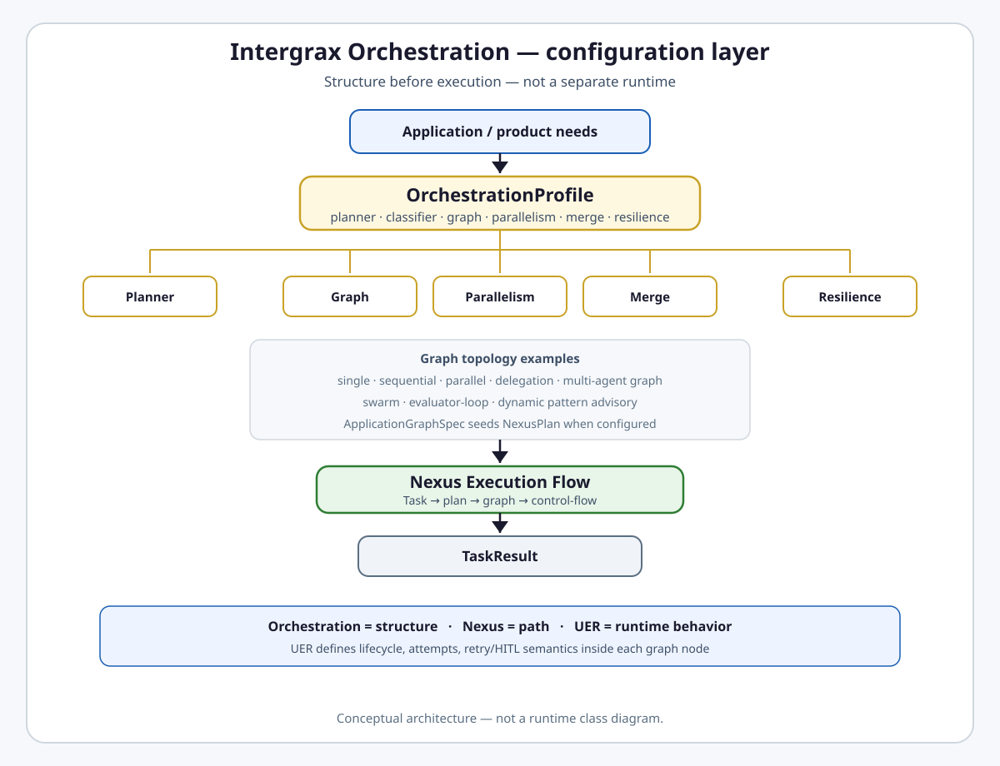

# Orchestration

**Intergrax Orchestration** is the platform configuration and strategy layer that defines how agents are organized, selected, sequenced, parallelized, delegated, merged, and constrained before Nexus executes a concrete `Task`.

> **Orchestration defines the structure of work. Nexus executes a concrete task through that structure. UER defines how execution behaves.**

Orchestration is **not** a second runtime, a private agent thread mechanism, or a place for product-specific orchestration code. Tier-3 hosts declare an `OrchestrationProfile` and optional `ApplicationGraphSpec`; Nexus consumes the wired result through the canonical `UnifiedTaskRunner → NexusLoop` path.

## Why it matters

Without a central orchestration model, each application could implement its own planner selection, classifier, graph topology, parallelism, delegation, merge, resilience, and long-running behavior. That leads to custom pipelines, application-specific orchestration code, incomparable agent behavior, weak governance, difficult testing, and low reuse.

Intergrax moves collaboration structure into **platform contracts and profiles** so every host configures the same dimensions — planner, classifier, graph, parallelism, merge, resilience — and Nexus executes them consistently.

> [!NOTE]
> **Maturity boundary:** Phase ORCH, ORCH-STRAT, ORCH-CONFIG, ORCH-5, and ORCH-6 are **Done** on the harness path (planner/classifier wiring, graph-spec seeding, parallel caps, strategy catalog, CFG simulation, queue adapter). That is **not** universal production qualification: every product graph, every strategy at scale, all queue backends, and customer operational windows still require separate evidence. Protocol v2 audit (2026-08-18 campaign) accepted residual contract/architecture gaps beyond prior closeout — see [Protocol v2 orchestration target invariants](#protocol-v2-orchestration-target-invariants-2026-08-18). See also [Current maturity](#current-maturity) and [Harness-proven vs production-qualified](#harness-proven-vs-not-automatically-production-qualified).

**Primary audience:** Principal / Staff engineers and Tier-3 host authors configuring multi-agent collaboration — after the platform overview in the root README.

## At a glance

| Concern | Summary |
| -------- | -------- |
| **Responsibility** | Collaboration **structure** — planner/classifier selection, graph topology, parallelism caps, merge, resilience posture |
| **Configuration object** | `OrchestrationProfile` on `ApplicationEnvironmentProfile`; optional `ApplicationGraphSpec` |
| **Strategies** | Single-agent, sequential pipeline, parallel fan-out/fan-in, declarative graph, delegation, handoff, evaluator-loop, swarm — see [Strategy catalog](#strategy-catalog-summary) |
| **Planner / classifier** | Orchestration **selects** kinds; Reasoning owns implementation semantics |
| **Graph** | `ApplicationGraphSpec` → platform plan seed → Nexus `GraphExecutor` |
| **Parallelism** | `max_parallel_nodes`, `max_inflight_nodes`, delegation depth — graph-level caps, not infra replicas |
| **Merge** | `merge_strategy` on profile; fan-out requires fan-in through `FinalResponseComposer` |
| **Resilience** | Profile policies for retry posture, partial results, checkpoint/long-running — lifecycle semantics in REL/UER |
| **Nexus relation** | Nexus **executes** configured structure; does not duplicate full Orchestration canon |
| **UER relation** | UER defines **how** execution behaves inside each graph node |
| **Production boundary** | Harness CFG simulation Done; product host parity and operational SLOs **not** automatic |
| **Maturity** | Four-axis statement in [Current maturity](#current-maturity) — no dedicated public Orchestration proof route |
| **Go deeper** | [Engineering canon](#engineering-canon) · [production gates satellite](satellites/ORCHESTRATION_production_gates.md) · [plan](../maintainers/plans/ORCHESTRATION.md) · [Nexus](NEXUS_EXECUTION_FLOW.md) · [UER](UNIFIED_EXECUTION_RUNTIME.md) |

## Flagship architecture visual

<a href="assets/orchestration-control-plane-light.svg">
<picture>
  <source media="(prefers-color-scheme: dark)" srcset="assets/orchestration-control-plane-dark.svg">
  <source media="(prefers-color-scheme: light)" srcset="assets/orchestration-control-plane-light.svg">
  
</picture>
</a>

Tier-3 profiles shape orchestration; Orchestration still owns the configuration contract. Agents do not create private orchestration runtimes.

## How configuration reaches Nexus

At a high level, every task inherits collaboration structure from the host profile before Nexus control-flow begins:

```text
Application requirements
        ↓
OrchestrationProfile (+ optional ApplicationGraphSpec)
        ↓
planner_kind · classifier_kind · graph topology · parallelism · merge · resilience · long-running posture
        ↓
build_nexus_loop_from_environment() wires planner/classifier instances
        ↓
Nexus Execution Flow (classify → plan → graph → merge)
        ↓
TaskResult
```

1. **Profile resolution** — Tier-3 `ApplicationEnvironmentProfile` carries `OrchestrationProfile` defaults and optional `graph_spec`.
2. **Kind wiring** — `planner_kind` and `classifier_kind` resolve to platform planner/classifier implementations at Nexus bootstrap (**fail-fast** on unknown kinds).
3. **Plan seeding** — when no plan id exists, `ApplicationGraphSpec` can seed a `NexusPlan` via `GraphSpecSeedingPlanner` (ORCH-2).
4. **Graph execution** — Nexus `GraphExecutor` honors topology, parallelism caps, delegation, and merge from the wired profile.
5. **Completion** — `FinalResponseComposer` applies `merge_strategy`; resilience events follow REL/UER semantics.

Step-by-step runtime narrative: [`NEXUS_EXECUTION_FLOW.md`](NEXUS_EXECUTION_FLOW.md).

## Orchestration vs Nexus vs UER

| Layer | Core question | Owns |
| ----- | ------------- | ---- |
| **Orchestration** | How should work be structured? | Strategy, `OrchestrationProfile`, `ApplicationGraphSpec`, parallelism/merge/resilience **configuration** |
| **Nexus** | What executes next for this `Task`? | Runtime control-flow — intake, planning runner, graph execution, routing, delegation/handoff coordination, merge invocation |
| **UER** | How does execution behave? | Lifecycle, attempts, `RuntimeEvent` emission, UAEP enforcement, run-level retry/HITL semantics |

```text
Orchestration → configuration / structure
Nexus         → task control-flow
UER           → execution semantics
```

Nexus **consumes** orchestration configuration; it is not a substitute for declaring collaboration structure in the host profile.

## Orchestration vs Reasoning / Planning

Do not collapse these planes:

| Concern | Owner |
| ------- | ----- |
| **Planner/classifier selection** (`planner_kind`, `classifier_kind`, graph seed rules) | Orchestration profile configuration |
| **Planner/classifier implementation** (`TaskPlanner`, `EngineBackedNexusPlanner`, `LlmTaskClassifier`, `NexusPlan` production) | [`REASONING_AND_COGNITION.md`](REASONING_AND_COGNITION.md) |
| **Concrete generated plan** for a task | Nexus planning runner consumes configured planner |
| **Tool planning inside a step** | Third planning plane — [`TOOLS.md`](TOOLS.md), not Orchestration |

**Rule:** config selection ≠ reasoning implementation. Orchestration chooses **which** planner/classifier strategy the host uses; Reasoning owns **how** classification and planning produce `NexusPlan`.

## OrchestrationProfile

Real configurable dimensions on the platform profile (as-built contract):

| Dimension | Profile surface | Notes |
| --------- | --------------- | ----- |
| Planner strategy | `planner_kind` | `default` → `TaskPlanner`; `engine` → engine-backed Nexus planner; **unknown kinds fail fast** at bootstrap |
| Classifier strategy | `classifier_kind` | `default` → `ClassifyingTaskClassifier`; `rules` \| `llm` + `IntentRoute` (ORCH-CONFIG.1) |
| Graph topology | `ApplicationGraphSpec` / `graph_spec` on environment | Declarative nodes, edges, `trigger_capabilities`, `*.pipeline` suffix convention |
| Parallel cap (batch) | `max_parallel_nodes` | Semaphore on concurrent nodes in one topological batch (ORCH-3) |
| Global inflight cap | `max_inflight_nodes` | Semaphore across graph execution; emits `GRAPH_BACKPRESSURE` |
| Tenant / host concurrency | `AgentEngine` / host runtime concurrency policy | Cross-task fairness via harness host |
| Merge | `merge_strategy` | `concat`, `last_wins`, `structured_json`, `citation_preserving` (ORCH-5.4) |
| Resilience / partial results | `allow_partial_result`, graph retry policy fields | Policy configuration — retry engine semantics in REL |
| Long-running posture | `long_running_enabled` + task defaults helper | Checkpoint/schedule posture; queue plane for async work |
| Delegation depth | `max_delegation_depth` | Limits nested subagent expansion |
| Intent routing | `intent_routes` | Free-text → orchestration token when classifier enabled |
| Coordination metadata | `coordination_pattern` on plan metadata | Trace/audit explicit pattern id (ORCH-5.2) |

Author wiring detail: AGENT_CREATION_GUIDE Appendix I (control plane map). Full CFG matrices: [satellite §56](satellites/ORCHESTRATION_production_gates.md#56-platform-interaction--multi-agent-configuration-canon).

## Strategy catalog (summary)

Public summary — full pattern catalog, anti-patterns, and CFG register live in [satellite §50](satellites/ORCHESTRATION_production_gates.md#50-orchestration-strategies-catalog). Maturity varies by pattern; **Done** in plan does not mean every strategy is production-qualified at scale.

| Strategy | When to use | Structure change |
| -------- | ----------- | ---------------- |
| **Single-agent** | One capability suffices | One graph node; default planner |
| **Sequential pipeline** | Each step depends on prior output | `depends_on` chain in `NexusPlan` / `graph_spec` |
| **Parallel fan-out / fan-in** | Independent subtasks | Topological batches + merge strategy |
| **Declarative graph** | Stable multi-agent product topology | `ApplicationGraphSpec` seeds plan; agent does not invent private graph |
| **Delegation** | Parent assigns bounded sub-work to child agent | `DELEGATES_TO` / `DelegationSpec` graph structure |
| **Handoff** | Runtime discovers next specialist | Dynamic node insertion via `AgentDecision.HANDOFF` — Nexus control-flow, not profile-only |
| **Evaluator / critic loop** | Quality gate before finalize | `CoordinationPattern.EVALUATOR_LOOP` + CVL executor |
| **Swarm / peer-to-peer** | Many lightweight explorers under budget | Parallel batches + swarm guard + cost/step caps (ORCH-5.1) |
| **Dynamic strategy selection** | Advisory pattern pick from constraints | `select_coordination_pattern()` helper + planning trace (AUDIT-IDEAL-9.3 **Done**) — bounded; production hosts should prefer explicit `graph_spec` |

Agents **must not** call each other directly — collaboration flows through graph nodes, `SharedTaskContext`, and artifacts.

## Declarative graph

`ApplicationGraphSpec` is the platform declarative collaboration contract:

```text
ApplicationGraphSpec  →  graph_spec_to_plan()  →  NexusPlan seed  →  GraphExecutor  →  TaskResult
```

- Graph config belongs to the platform/application profile — not inside Tier-2 agent code.
- Topology declares dependencies, parallelism, and delegation edges.
- Seeding respects `trigger_capabilities` and `*.pipeline` suffix guard (ADR-FLOW-004).
- Nexus owns runtime graph execution; this domain owns **what** topology is configured.

Do not duplicate full Nexus graph executor canon here — see [`NEXUS_EXECUTION_FLOW.md`](NEXUS_EXECUTION_FLOW.md) graph sections.

## Parallelism and backpressure

Independent graph nodes may run in parallel within a topological batch. More registered agents does **not** mean “run everything at once”:

| Control | Effect |
| ------- | ------ |
| `max_parallel_nodes` | Semaphore on concurrent nodes in one topological batch |
| `max_inflight_nodes` | Semaphore across graph execution; emits `GRAPH_BACKPRESSURE` |
| Tenant / host concurrency | `AgentEngine` / host runtime policy — cross-task fairness |
| `max_delegation_depth` | Limits nested delegation expansion |

**Boundary:** [`ELASTIC_CAPACITY_AND_SCALING.md`](ELASTIC_CAPACITY_AND_SCALING.md) owns infrastructure replicas, workers, and provisioning signals. Orchestration owns **graph-level** concurrency posture. ECP may **consume** `GRAPH_BACKPRESSURE` as a signal — it does not replace orchestration caps.

## Merge

Fan-out requires fan-in. Multi-agent output passes through `OrchestrationProfile.merge_strategy` and `FinalResponseComposer`:

| Strategy | Behavior |
| -------- | -------- |
| `concat` | Concatenate agent summaries (common default) |
| `last_wins` | Last successful node summary |
| `structured_json` | JSON payload with per-agent status |
| `citation_preserving` | Structured merge preserving citations (ORCH-5.4) |

Not every merge strategy has the same production maturity. Semantic LLM synthesis and conflict-aware HITL merge remain IDEAL extensions.

## Resilience (high level)

Orchestration **configures** resilience posture on the profile; REL/UER own detailed lifecycle semantics:

- **Graph retry policy** — alternate agent, validation-driven retry (R3 layer)
- **Partial results** — `allow_partial_result` on graph outcome
- **Checkpoint / long-running** — persistent state, resumability, scheduled execution
- **HITL** — pause points configured at plan/policy boundaries; Nexus routes continue/replan

Do not treat profile fields as a private retry engine — agents may express recovery intent; runtime owns global retry policy ([`RELIABILITY_FAILURE_AND_HITL.md`](RELIABILITY_FAILURE_AND_HITL.md)).

## Delegation, handoff, and specialization

| Concept | Meaning | Layer |
| ------- | ------- | ----- |
| **Specialization** | Agents declare capabilities; Nexus routes by capability match | Registry + classifier + router |
| **Delegation** | Structural sub-work assignment in the collaboration graph | Orchestration graph / `DelegationSpec` |
| **Handoff** | Runtime transfer when the next specialist is discovered during execution | Nexus control-flow (`HandoffCoordinator`) |
| **Agent-to-agent custom calls** | **Anti-pattern** — does not create a second orchestration plane |

Delegation shapes **structure**; handoff is **runtime transfer** behavior under Nexus.

## Dynamic strategy selection

AUDIT-IDEAL-9.3 is **Done**: `select_coordination_pattern()` provides a **bounded advisory** helper using risk/latency/cost/complexity inputs. Lab hosts may emit coordination advisory in the planning trace (ORCH-5.3).

This is **not** full autonomous swarm intelligence. Production hosts should override with explicit `graph_spec` and declared `CoordinationPattern` metadata.

## Queue / async boundary (summary)

Long-running and asynchronous work uses the **platform queueing plane** (`intergrax/queueing`) — not ad-hoc agent threads. ORCH-6 ships `run_async` dispatch, profile presets, and queue consumer wiring on lab/reference hosts; product exposure varies by host (satellite §57, §59.2).

Production queue adapter beyond SQLite scaffold: AUDIT-IDEAL-9.1 **Done** — universal backend qualification is still host-specific.

## Interaction postures (simplified)

| Posture | Orchestration touchpoint |
| ------- | ------------------------ |
| **Reactive** | Default sync `Task` through wired profile |
| **Daemon / background** | Profile + optional scheduler/interaction flags |
| **Scheduled** | Queue/scheduler plane + `long_running` posture |
| **Long-running** | Checkpoint-friendly profile + durable task index |
| **HITL** | Plan/policy pause points; Nexus resumes canonical path |

Full posture × pattern matrix: [satellite §55](satellites/ORCHESTRATION_production_gates.md#55-interaction-posture--orchestration-matrix).

## Responsibility boundaries

### Orchestration owns

- `OrchestrationProfile` configuration semantics and strategy catalog.
- Declarative `ApplicationGraphSpec` → plan seeding contract.
- Planner/classifier **kind** selection and fail-fast wiring.
- Graph-level parallelism, merge strategy, and resilience **policy** fields.
- Coordination pattern catalog and CFG authoring rules (satellite §56).

### Orchestration does not own

- Nexus runtime control-flow execution — [`NEXUS_EXECUTION_FLOW.md`](NEXUS_EXECUTION_FLOW.md).
- UAEP lifecycle, attempts, run-level retry — [`UNIFIED_EXECUTION_RUNTIME.md`](UNIFIED_EXECUTION_RUNTIME.md).
- Planner/classifier implementation and `NexusPlan` reasoning semantics — [`REASONING_AND_COGNITION.md`](REASONING_AND_COGNITION.md).
- Infrastructure autoscaling — [`ELASTIC_CAPACITY_AND_SCALING.md`](ELASTIC_CAPACITY_AND_SCALING.md).
- Tool invocation patterns inside a node — [`TOOLS.md`](TOOLS.md).

### Applications (Tier-3) configure

- `ApplicationEnvironmentProfile.orchestration` and `graph_spec`.
- Host presets (`strict_multi_agent_defaults`, `async_batch_defaults`, long-running helpers).
- Which capabilities and graphs the product exposes — via profile, not bespoke orchestration code.

## Relationship to Intergrax

| Neighbor | Relationship |
| -------- | ------------- |
| [`NEXUS_EXECUTION_FLOW.md`](NEXUS_EXECUTION_FLOW.md) | Executes wired orchestration — Task → TaskResult control-flow |
| [`UNIFIED_EXECUTION_RUNTIME.md`](UNIFIED_EXECUTION_RUNTIME.md) | Execution semantics inside each graph node |
| [`REASONING_AND_COGNITION.md`](REASONING_AND_COGNITION.md) | Classification/planning implementation behind configured kinds |
| [`APPLICATION_HOSTING.md`](APPLICATION_HOSTING.md) | Tier-3 bootstrap wires profile → Nexus loop |
| [`RELIABILITY_FAILURE_AND_HITL.md`](RELIABILITY_FAILURE_AND_HITL.md) | Retry layers, HITL, attempt ledger |
| [`ELASTIC_CAPACITY_AND_SCALING.md`](ELASTIC_CAPACITY_AND_SCALING.md) | Infra scaling vs graph backpressure |
| [`GOVERNED_EXECUTION.md`](GOVERNED_EXECUTION.md) | Policy evaluation on orchestration hot paths |
| [`intergrax_runtime_architecture.md`](intergrax_runtime_architecture.md) | Platform hub — Orchestration is Tier-1 configuration |

## Extensibility

Real extension surfaces — not a plugin marketplace for bypassing Nexus:

| Surface | Role |
| ------- | ---- |
| `OrchestrationProfile` fields | Host-level collaboration defaults |
| `ApplicationGraphSpec` | Declarative multi-agent topology |
| `planner_kind` / `classifier_kind` registries | Platform planner/classifier selection |
| `CoordinationPattern` + merge strategies | Named collaboration patterns |
| `intent_routes` + orchestration tokens | Classifier-driven routing (§56.13 in satellite) |
| Queue/async helpers | `run_async`, `QueuedNexusExecutionAdapter` on supported hosts |

Do not expose private graph executors or agent-to-agent RPC as public orchestration APIs.

## Harness-proven vs not automatically production-qualified

### Harness / platform implemented

- Planner/classifier wiring (ORCH-1) with fail-fast on unknown kinds
- `ApplicationGraphSpec` → `NexusPlan` seed (ORCH-2)
- `max_parallel_nodes` parallel cap (ORCH-3)
- Strategy catalog, CFG simulation, swarm runtime, citation-preserving merge (ORCH-STRAT, ORCH-5)
- Dynamic coordination advisory helper (AUDIT-IDEAL-9.3)
- Production queue adapter scaffold + lab async dispatch (AUDIT-IDEAL-9.1, ORCH-6)

### Not automatically production-qualified

- Every product `graph_spec` and host wiring matrix (FLOW-8 product host **Deferred**)
- Every coordination pattern at operational scale
- All queue backends and durable index deployments
- Universal SLO/capacity evidence
- Customer operational windows and runbooks

`execution_mode=strict` and harness CFG **Done** rows are posture/evidence — not taxonomy **P4**.

## Current maturity

Architecture maturity: **A4**  
Implementation maturity: **I4**  
Production readiness: **P2**  
Evidence maturity: **E3**

- **A4** — Clear ownership vs Nexus/UER/Reasoning; strategy catalog and CFG canon in production-gates satellite; `OrchestrationProfile` contract; adjacent-domain boundaries validated (ECP, REL, COG).
- **I4** — ORCH-1–4, ORCH-STRAT, ORCH-CONFIG (11/11), ORCH-5, ORCH-6 **Done**; wiring, graph-spec conversion, parallel caps, swarm guard, classifier/planner kinds shipped. **Blocks I5:** uneven Tier-3 host adoption, product host deferrals (§59.2 satellite), and Protocol v2 residual contract gaps (graph identity, typed config, profile ownership, static cycle validation, delegation provenance) — **not implemented**.
- **P2** — Harness/lab/reference profiles and strict-mode posture; **no** universal production handoff, operational SLO package, or per-customer qualification — `production_mode` ≠ **P4**.
- **E3** — Unit/gate tests (`test_orchestration_wiring.py`, `test_graph_spec_to_plan.py`, `test_graph_executor_parallel_cap.py`) and bounded integration (`test_orchestration_cfg_simulation.py`). **No dedicated public Orchestration proof route** in [`PROOFS.md`](../proofs/PROOFS.md) — not E4/E5.

> **Legacy vs taxonomy:** Historical **L3–L4** labels in [satellite §54](satellites/ORCHESTRATION_production_gates.md#54-maturity-and-gap-register) map primarily to **A4** and **E2–E3** — they do **not** automatically imply **P4** or uniform **I5**.

### Protocol v2 orchestration target invariants (2026-08-18)

Accepted Protocol v2 audit layer [`ORCHESTRATION`](../../audit_results/2026-08-18/ORCHESTRATION.md) (**FAIL**, 5 ACCEPTED findings). Canonical evidence: [`docs/audit_results/2026-08-18/`](../../audit_results/2026-08-18/README.md). Prior Phase ORCH / ORCH-STRAT / ORCH-CONFIG / ORCH-5 / ORCH-6 **Done** rows remain historical delivery facts — not rewritten. Target state only:

1. **Canonical graph-node executable identity** — each graph node MUST resolve once into one canonical executable agent identity before plan construction; `contract_id` and `agent_id` semantics MUST NOT diverge between roster validation and `PlanStep` emission ([`AUDIT-20260818-ORCHESTRATION-01`](../../audit_results/2026-08-18/ORCHESTRATION.md)).
2. **Typed fail-fast orchestration configuration** — execution-affecting settings (`merge_strategy`, `multi_agent_order`, `retry_policy_name`, and peers with execution effect) MUST be typed and fail-fast; unknown values MUST NOT silently change execution semantics ([`AUDIT-20260818-ORCHESTRATION-02`](../../audit_results/2026-08-18/ORCHESTRATION.md)).
3. **Exact delegation-edge provenance** — delegation parent identity, contract, budget, and provenance MUST derive from the exact `DelegationEdge`; unsupported multi-parent delegation MUST fail static validation rather than be resolved by dependency ordering ([`AUDIT-20260818-ORCHESTRATION-03`](../../audit_results/2026-08-18/ORCHESTRATION.md)).
4. **Single canonical `OrchestrationProfile` ownership** — one owner for orchestration configuration semantics; if two profile types are genuinely required, responsibilities MUST be explicitly different and bridged through a typed mapping contract — not duplicate same-purpose schemas ([`AUDIT-20260818-ORCHESTRATION-04`](../../audit_results/2026-08-18/ORCHESTRATION.md)).
5. **Static graph cycle rejection** — `ApplicationGraphSpec` MUST reject cyclic topology before the host serves traffic / before task execution ([`AUDIT-20260818-ORCHESTRATION-05`](../../audit_results/2026-08-18/ORCHESTRATION.md)).

Orchestration still owns collaboration **structure**; Nexus executes tasks through that structure; UER owns per-node execution behavior — unchanged.

Remediation: **ORCH-CONTRACT-INTEGRITY** (01, 02, 04, 05) and **ORCH-DELEGATION-INTEGRITY** (03) in [plan](../maintainers/plans/ORCHESTRATION.md). **Not implemented** by audit persistence.

## Evidence / proof

| Evidence class | What exists | What it does not prove |
| -------------- | ----------- | ---------------------- |
| Architecture | This hub, production-gates satellite, ADR-FLOW-001/004 | Production operation |
| Unit / gate | Orchestration wiring, graph spec → plan, parallel cap, config doc checks | Every host topology |
| Integration | `test_orchestration_cfg_simulation.py`, multi-agent acceptance, Nexus graph integration | Universal product qualification |
| Public product proof | **None** for Orchestration domain | Do not infer from LKW or other domain proofs |
| Production / customer | **None** cited for Orchestration domain | Not E5 |

**Platform audit:** [`docs/audit_results/AUDIT_PROTOCOL.md`](../../audit_results/AUDIT_PROTOCOL.md).

## Go deeper

| Depth | Route |
| ----- | ----- |
| **Engineering canon** | [Below](#engineering-canon) — Nexus loop fundamentals (§9–§26) |
| **Production gates & strategy depth** | [`satellites/ORCHESTRATION_production_gates.md`](satellites/ORCHESTRATION_production_gates.md) — §47–§59 (catalog §50+, CFG §56+, audit §59) |
| **Implementation plan** | [`maintainers/plans/ORCHESTRATION.md`](../maintainers/plans/ORCHESTRATION.md) |
| **Nexus flow** | [`NEXUS_EXECUTION_FLOW.md`](NEXUS_EXECUTION_FLOW.md) |
| **UER** | [`UNIFIED_EXECUTION_RUNTIME.md`](UNIFIED_EXECUTION_RUNTIME.md) |
| **Reasoning** | [`REASONING_AND_COGNITION.md`](REASONING_AND_COGNITION.md) |
| **Reliability / HITL** | [`RELIABILITY_FAILURE_AND_HITL.md`](RELIABILITY_FAILURE_AND_HITL.md) |
| **Application hosting** | [`APPLICATION_HOSTING.md`](APPLICATION_HOSTING.md) |
| **Platform audit** | [`AUDIT_PROTOCOL.md`](../../audit_results/AUDIT_PROTOCOL.md) · [`audit_results/`](../../audit_results/README.md) |

---

## Maintainer and Cursor context

**Status:** Canonical architecture (domain pair 1:1)  
**Hub:** [`intergrax_runtime_architecture.md`](intergrax_runtime_architecture.md)  
**Plan (1:1):** [`plan/ORCHESTRATION.md`](../maintainers/plans/ORCHESTRATION.md)  
**Target:** [`IDEAL_HARNESS_AI_ARCHITECTURE.md`](../technical/guides/IDEAL_HARNESS_AI_ARCHITECTURE.md)  
**Audit layers:** 3, 9 · multi-agent patterns: audit layer 10 (cross-ref satellite §50)  
**Platform audit:** [`docs/audit_results/AUDIT_PROTOCOL.md`](../../audit_results/AUDIT_PROTOCOL.md)  
**Reasoning / planning canon:** [`REASONING_AND_COGNITION.md`](REASONING_AND_COGNITION.md) (audit layer 7)  
**Elastic capacity:** [`ELASTIC_CAPACITY_AND_SCALING.md`](ELASTIC_CAPACITY_AND_SCALING.md#production-boundary) (infra capacity signals and scaling — **not** graph scheduling, agent topology or orchestration brain)

### Cursor read scope (token budget)

**Do not read this entire file in one session** (ORCHESTRATION canon).

- **Implement / audit default:** public front + engineering canon §9–§26 below.
- **Strategy / CFG / production depth:** [`satellites/ORCHESTRATION_production_gates.md`](satellites/ORCHESTRATION_production_gates.md) §47+ only.
- **Plan hub:** [`plan/ORCHESTRATION.md`](../maintainers/plans/ORCHESTRATION.md) (scoped §6 only).
- **Platform audit:** [`docs/audit_results/AUDIT_PROTOCOL.md`](../../audit_results/AUDIT_PROTOCOL.md).
- **Max reads:** at most **one** file >5k tokens per session unless RESUME cites more.

### Document roles (read order)

| Document | Role |
|----------|------|
| **This file (`ORCHESTRATION.md`)** | Public front + engineering canon §9–§26 (loop/graph fundamentals) |
| [`satellites/ORCHESTRATION_production_gates.md`](satellites/ORCHESTRATION_production_gates.md) | Production gates, strategy catalog §50+, master CFG §56+, audit §59 |
| [`NEXUS_EXECUTION_FLOW.md`](NEXUS_EXECUTION_FLOW.md) | **Runtime narrative** — sequence diagrams, UC-*, edge cases, code paths |
| [`REASONING_AND_COGNITION.md`](REASONING_AND_COGNITION.md) | Classification, planning implementation |
| AGENT_CREATION_GUIDE Appendix I | Author control plane (`OrchestrationProfile`, wiring) |

**Rule:** strategy **names and configuration** — satellite §50–§56; step-by-step runtime truth — **NEXUS_EXECUTION_FLOW**.

### Architecture satellites (read on demand)

| Satellite | Contents |
|-----------|----------|
| [`satellites/ORCHESTRATION_production_gates.md`](satellites/ORCHESTRATION_production_gates.md) | §47–§59 — production gates, strategy catalog, CFG canon, execution audit |

> **Cursor context budget:** read hub public front + **at most one** satellite per session.

### Table of contents (engineering canon & satellite routes)

| § | Location | Topic |
|---|----------|--------|
| [§9–§26](#engineering-canon) | **Hub** | Nexus loop, responsibilities, lifecycle, graph fundamentals |
| [§47+](satellites/ORCHESTRATION_production_gates.md) | Satellite | Production gates, intake, queueing |
| [§50](satellites/ORCHESTRATION_production_gates.md#50-orchestration-strategies-catalog) | Satellite | Coordination pattern catalog |
| [§51](satellites/ORCHESTRATION_production_gates.md#51-parallelism-merge-and-backpressure) | Satellite | Parallelism, merge, backpressure |
| [§52](satellites/ORCHESTRATION_production_gates.md#52-resilience-in-orchestration) | Satellite | Retry, checkpoint, failover, partial |
| [§53](satellites/ORCHESTRATION_production_gates.md#53-specialization-and-agent-collaboration) | Satellite | Capability routing, delegation, handoff |
| [§54](satellites/ORCHESTRATION_production_gates.md#54-maturity-and-gap-register) | Satellite | Legacy L0–L4 scorecard (historical) |
| [§55](satellites/ORCHESTRATION_production_gates.md#55-interaction-posture--orchestration-matrix) | Satellite | Posture × pattern matrix |
| [§56](satellites/ORCHESTRATION_production_gates.md#56-platform-interaction--multi-agent-configuration-canon) | Satellite | **Master configuration canon** |
| [§57](satellites/ORCHESTRATION_production_gates.md#57-synchronous-and-asynchronous-execution-postures) | Satellite | Sync vs async dispatch |
| [§58](satellites/ORCHESTRATION_production_gates.md#58-platform-runtime-capabilities-index) | Satellite | Cross-cutting runtime index |
| [§59](satellites/ORCHESTRATION_production_gates.md#59-platform-execution-audit---gaps-technical-debt-discrepancies) | Satellite | Execution-surface audit |

**Authoring rule:** Tier-3 host design starts at **satellite §56**; runtime step-by-step truth remains in **NEXUS_EXECUTION_FLOW**.

### Documentation topology note

Hub §9–§26 preserve loop and graph **fundamentals**. Strategy catalog, CFG matrices, and production gates (§47–§59) live in the **production-gates satellite** — not duplicated here. Prior hub TOC anchors for §50+ pointed at missing in-file sections; routes now target the satellite.

---

## Engineering canon

# 9.1 Global Nexus Loop

The Nexus loop is mandatory.

The Nexus loop controls global execution.

Responsibilities:

- receive user task
- classify task (see [`REASONING_AND_COGNITION.md`](REASONING_AND_COGNITION.md) §9)
- determine complexity
- create or update plan (see [`REASONING_AND_COGNITION.md`](REASONING_AND_COGNITION.md) §10)
- select agents
- prepare context
- execute agents
- evaluate results
- decide next step
- handle retries
- coordinate parallel work
- coordinate sequential work
- request human approval when required
- finalize output

**Detailed runtime narrative** (sequence diagrams, decision matrix, `FLOW-GAP.*` plan rows): [`NEXUS_EXECUTION_FLOW.md`](NEXUS_EXECUTION_FLOW.md) §4–§18.

Pseudo-flow:

```text
while task.status not in [completed, failed, cancelled]:

    current_state = load_task_state(task_id)

    reasoning_result = reason_about_current_state(current_state)

    next_action = determine_next_action(reasoning_result)

    if next_action.type == "execute_agent":
        result = execute_agent(next_action.agent, next_action.input)
        store_result(result)

    if next_action.type == "execute_parallel_agents":
        results = execute_agents_in_parallel(next_action.agents)
        store_results(results)

    if next_action.type == "ask_human":
        pause_and_request_human_input()

    if next_action.type == "retry":
        execute_retry_policy()

    validation_result = validate_current_state()

    update_task_state(validation_result)
```

---

# 9.2 Local Agent Loop

Agents MAY have local loops — but loops MUST be **runtime-controlled** (§42.32, §42.33).

Local loops are allowed when an agent requires multiple internal steps.

The agent loop MUST be bounded by:

- the input contract
- the output contract
- max steps
- max time
- max cost
- allowed tools
- validation rules

Pseudo-flow:

```text
while local_goal_not_completed and limits_not_exceeded:

    local_state = inspect_local_state()

    local_next_step = decide_local_next_step(local_state)

    local_result = execute_local_step(local_next_step)

    validate_local_result(local_result)

    update_local_state(local_result)

return agent_output_artifact
```

---

# 9.3 Why Both Loops Are Required

If only Nexus has a loop:

- Nexus becomes too large
- Nexus micromanages every domain
- domain-specific logic leaks into the runtime
- implementation becomes rigid

If only agents have loops:

- global orchestration becomes chaotic
- agents become mini-platforms
- state becomes fragmented
- retries become inconsistent
- final output becomes unpredictable

Correct decision:

> Nexus has the global loop. Agents may have bounded local loops.

---


---

# 10. Nexus Responsibilities

Nexus is responsible for the following areas.

## 10.1 Task Intake

Nexus receives tasks from:

- chat interface
- Slack
- Teams
- API
- CLI
- internal scheduler
- webhook
- event trigger

Task intake normalizes input into a standard Task object.

---

## 10.2 Task Classification

Nexus classifies the task.

Possible classifications:

- simple question
- single-agent task
- multi-agent task
- long-running workflow
- monitoring task
- scheduled task
- human-approval-required task
- unsafe task
- unsupported task

---

## 10.3 Planning

Nexus creates a plan when needed.

A plan may include:

- steps
- dependencies
- agent assignments
- required tools
- expected artifacts
- validation criteria
- human approval points
- risk level

---

## 10.4 Agent Selection

Nexus selects agents based on:

- task intent
- agent registry
- declared capabilities
- required tools
- previous performance
- cost
- availability
- risk level

---

## 10.5 Execution Graph

Nexus manages the execution graph.

The execution graph defines:

- nodes
- dependencies
- parallel branches
- sequential branches
- waiting states
- retry states
- failed states
- completed states

---

## 10.6 State Management

Nexus owns global task state.

Global state includes:

- task id
- run id
- user input
- normalized task
- current plan
- execution graph
- agent outputs
- tool outputs
- validation results
- human messages
- final result
- status

---

## 10.7 Context Management

Nexus decides what context is passed to each agent.

Agents MUST receive only the context needed for their bounded task.

Nexus prevents uncontrolled context growth.

---

## 10.8 Tool And Adapter Access Policy

Nexus defines which tools and adapters an agent may use.

Agents should not automatically receive access to every integration.

Tool access should be explicit.

---

## 10.9 Validation

Nexus validates whether the global task is complete.

Validation can include:

- schema validation
- rule validation
- secondary agent validation
- tests
- consistency checks
- human approval

---

## 10.10 Final Response

Nexus composes the final response to the user.

Agents produce artifacts.

Nexus decides how artifacts are presented.

---


---

# 23. Task Lifecycle

Every task should move through explicit states.

Recommended lifecycle:

```text
created
    -> classified
    -> planned
    -> waiting_for_resources
    -> running
    -> waiting_for_human
    -> validating
    -> completed
```

Failure states:

```text
failed
cancelled
expired
partially_completed
needs_more_information
```

Every transition should be logged.

---


---

# 24. Execution Graph

Complex tasks should be represented as execution graphs.

An execution graph contains:

- nodes
- dependencies
- execution status
- assigned agent
- input
- output
- validation result
- retry count

Example:

```text
Task: Find business partner for AI logistics project

Node 1: Analyze project description
Node 2: Define partner criteria
Node 3: Search companies
Node 4: Enrich company profiles
Node 5: Score companies
Node 6: Validate ranking
Node 7: Generate final recommendation
```

Some nodes may run sequentially.

Some nodes may run in parallel.

---


---

# 25. Sequential And Parallel Execution

Nexus decides whether execution is sequential or parallel.

Sequential execution is preferred when:

- later steps depend on previous outputs
- task risk is high
- context must be controlled
- quality is more important than speed

Parallel execution is allowed when:

- subtasks are independent
- agents work on separate data
- research can be split
- validation can run independently

Nexus must merge parallel results.

---


---

# 26. Long Running Tasks

Intergrax must support long-running tasks.

Examples:

- monitor Reddit for problem signals for 30 days
- onboard new employees for 2 weeks
- analyze monthly sales data
- audit vendors over multiple stages
- review a large document set

Long-running tasks require:

- persistent state
- resumability
- scheduled execution
- progress updates
- failure recovery
- human interruption
- partial results

---


---
