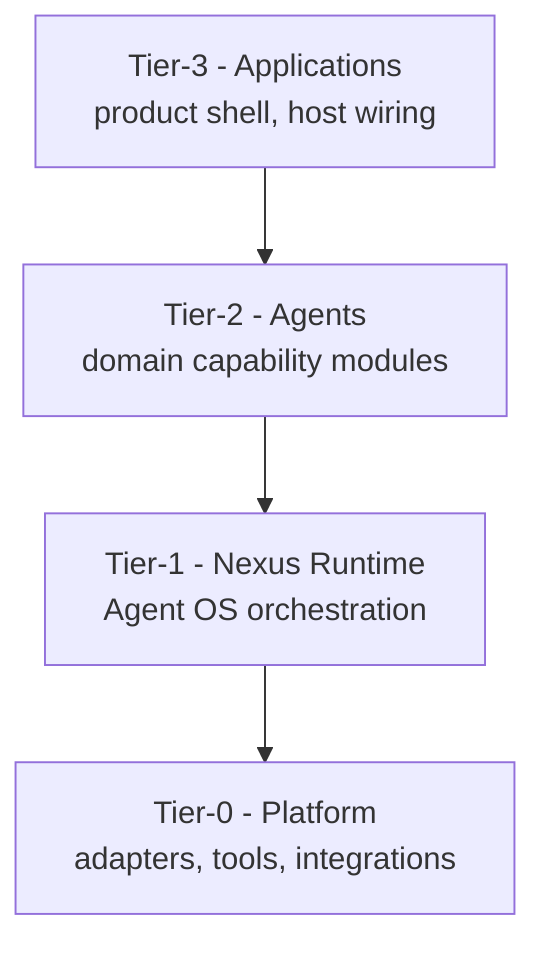

# Platform Foundation

**Intergrax Platform Foundation** is the domain that owns the platform's **four-tier topology**, strict dependency direction, cross-layer invariants, tier-boundary enforcement posture, and spine verification gates - the structural rules every other domain builds on.

## Why it matters

Without a canonical tier model and enforced dependency direction, every team could place orchestration in agents, business logic in Tier-0 adapters, or product wiring in runtime packages. That produces import cycles, untestable hosts, policy bypass, and incompatible deployment stories.

Platform Foundation gives architects and implementers one spine: **Tier-3 composes; Tier-2 decides domain work; Tier-1 orchestrates; Tier-0 supplies adapters** - with CI gates and qualification records that prove the spine stays intact.

> [!NOTE]
> **Maturity boundary:** The four-tier model and dependency rules are **canonical** in this hub. Tier-boundary **enforcement proof** is **not closed** - see [Tier-boundary enforcement qualification](#tier-boundary-enforcement-qualification) and plan [§6.1ax](../maintainers/plans/PLATFORM_FOUNDATION.md#61ax-pf-tier-enforcement--production-tier-boundary-qualification). Gate-green maintenance mode does **not** mean every package is mechanically classified or every forbidden import path is proven.

> [!IMPORTANT]
> **Capability ownership policy** lives in [`INTERGRAX_ARCHITECTURE_PRINCIPLES.md`](INTERGRAX_ARCHITECTURE_PRINCIPLES.md). Platform Foundation owns spine topology, invariants, and verification gates - not domain feature canon.

**Primary audience:** Principal / Staff engineers, harness integrators, and auditors validating tier boundaries - after the platform overview in the root README.

## At a glance

| Concern | Summary |
| -------- | -------- |
| **Responsibility** | Four-tier topology, dependency direction, cross-layer invariants, tier-boundary enforcement posture, platform gate spine |
| **Tier model** | Tier-0 Platform → Tier-1 Nexus → Tier-2 Agents → Tier-3 Applications |
| **Dependency rule** | Higher tiers import lower tiers only - see [Dependency Direction](#dependency-direction-strict) |
| **Invariants** | [`SYSTEM_INVARIANTS.md`](../technical/guides/SYSTEM_INVARIANTS.md) - `SYS-INV-*` index |
| **Enforcement** | CI import guards + open qualification [§6.1ax](../maintainers/plans/PLATFORM_FOUNDATION.md#61ax-pf-tier-enforcement--production-tier-boundary-qualification) |
| **Maturity** | Qualification boundaries in [Current maturity](#current-maturity) - no single headline A/I/P/E score in this hub |
| **Go deeper** | [Engineering canon](#engineering-canon) · [extended satellite](satellites/PLATFORM_FOUNDATION_extended_depth.md) · [plan](../maintainers/plans/PLATFORM_FOUNDATION.md) |

## Flagship architecture visual - dependency direction

**Allowed dependency / import direction** (not runtime execution):



Dependency direction is Tier-3 → Tier-2 → Tier-1 → Tier-0. Runtime execution differs: Tier-3 intake enters Nexus (Tier-1), which invokes Tier-2 agents using Tier-0 services.

Applications compose agents; agents run inside Nexus; Nexus consumes Tier-0 services under policy. **Tier-3 composes the platform; it does not fork it.**

## How the tier model works

1. **Tier-3 Application** - deployable host: manifest, profiles, surfaces, agent roster wiring.
2. **Tier-2 Agent** - bounded domain module implementing `Agent` + `AgentContract`; local step loop only.
3. **Tier-1 Nexus** - global orchestration: task intake, graph, policy, tool gateway, trace coordination.
4. **Tier-0 Platform** - integrations, tools, skills, LLM adapters, memory/RAG stores - no orchestration.

Execution flow: user/API (Tier-3) → Nexus intake (Tier-1) → selected agents (Tier-2) → Tier-0 services under Nexus policy → response to application host.

## Responsibility boundaries

### Platform Foundation owns

- Canonical Tier-0..3 definitions, repository placement, and dependency direction.
- Cross-layer invariant index and tier-boundary enforcement qualification posture.
- Platform spine verification gates (`intergrax doctor --ci`, `pytest -m gate`) as documented in the plan.

### Platform Foundation does not own

- Per-domain capability architecture (Memory, RAG, Orchestration, etc.) - see domain pairs in [`intergrax_runtime_architecture.md`](intergrax_runtime_architecture.md).
- Capability ownership and adoption policy - [`INTERGRAX_ARCHITECTURE_PRINCIPLES.md`](INTERGRAX_ARCHITECTURE_PRINCIPLES.md).
- Product business logic - Tier-2 agents and Tier-3 hosts.

### Applications (Tier-3) configure

- Which agents, integrations, and profiles compose a deployable product - [`TIER3_APPLICATION_ENVIRONMENT.md`](TIER3_APPLICATION_ENVIRONMENT.md).

## Relationship to Intergrax

| Neighbor | Relationship |
| -------- | ------------- |
| [`intergrax_runtime_architecture.md`](intergrax_runtime_architecture.md) | Platform hub - indexes all domain pairs |
| [`INTERGRAX_ARCHITECTURE_PRINCIPLES.md`](INTERGRAX_ARCHITECTURE_PRINCIPLES.md) | Meta-governance for capability ownership and proof order |
| [`UNIFIED_EXECUTION_RUNTIME.md`](UNIFIED_EXECUTION_RUNTIME.md) | Execution semantics inside Tier-1 runs |
| [`NEXUS_EXECUTION_FLOW.md`](NEXUS_EXECUTION_FLOW.md) | Nexus control-flow narrative |
| [`TIER3_APPLICATION_ENVIRONMENT.md`](TIER3_APPLICATION_ENVIRONMENT.md) | Tier-3 composition contracts |
| [`APPLICATION_HOSTING.md`](APPLICATION_HOSTING.md) | Deployment lifecycle around Tier-3 hosts |

## Current limitations

- Tier-boundary enforcement is **partial** - scanner roots are manually enumerated; full package→tier classification is tracked as open work ([§6.1ax](../maintainers/plans/PLATFORM_FOUNDATION.md#61ax-pf-tier-enforcement--production-tier-boundary-qualification)).
- Protocol v2 audits [`TIER_LAYER_BOUNDARIES`](../../audit_results/2026-08-18/TIER_LAYER_BOUNDARIES.md) and [`PLATFORM_FOUNDATION`](../../audit_results/2026-08-18/PLATFORM_FOUNDATION.md) record **target invariants only** - remediation not implemented by audit persistence alone.
- Foundation proof runners (`intergrax doctor --ci`, umbrella gates) have known path-resolution and fail-open gaps - tracked as **PF-PROOF-INTEGRITY** in plan; these are proof-runner defects, not reasons to redesign the four-tier model.
- Extended platform depth and production gate registers live in satellites - not required for first-contact reading.

## Current maturity

This hub does **not** publish a single headline four-axis **A/I/P/E** score. Use the boundaries below with the [plan](../maintainers/plans/PLATFORM_FOUNDATION.md) for delivery rows:

| Axis | Current boundary |
| ---- | ---------------- |
| **Architecture** | Four-tier model, dependency rules, and `SYS-INV-*` cross-layer invariants are canonical |
| **Implementation** | Platform spine and Band-1 gate maintenance are active; feature backlog closed per plan §6.1 |
| **Production** | Tier-boundary enforcement qualification **open** - verdict `CONDITIONALLY SOUND - ENFORCEMENT REMEDIATION REQUIRED` |
| **Evidence** | CI gate suite, `uv run intergrax doctor --ci`, HEP smoke path - **not** universal production qualification |

## Evidence / proof

Platform Foundation evidence is **gate- and audit-oriented**:

- **CI gates:** `uv run pytest -m gate -q` · `uv run intergrax doctor --ci` (plan §6.1 default).
- **Tier import guards:** `scripts/check_no_upward_application_imports.py`, `scripts/maintenance/check_intergrax_no_applications_imports.py`, `scripts/maintenance/check_agents_no_tier3_imports.py`.
- **Harness evidence pack:** [`HARNESS_EVIDENCE_PACK.md`](../maintainers/plans/HARNESS_EVIDENCE_PACK.md) - smoke audit and artifact checker closeouts.
- **Tier-boundary audits:** PF-TIER snapshot `4c92e0a` · Protocol v2 [`TIER_LAYER_BOUNDARIES`](../../audit_results/2026-08-18/TIER_LAYER_BOUNDARIES.md) · [`PLATFORM_FOUNDATION`](../../audit_results/2026-08-18/PLATFORM_FOUNDATION.md).
- **Platform audit protocol:** [`docs/audit_results/AUDIT_PROTOCOL.md`](../../audit_results/AUDIT_PROTOCOL.md).

Gate green does **not** substitute for closed tier-enforcement qualification or customer production evidence.

## Go deeper

| Depth | Route |
| ----- | ----- |
| **Engineering canon** | [Below](#engineering-canon) - tier definitions, harness alignment, high-level diagram |
| **Extended depth** | [`satellites/PLATFORM_FOUNDATION_extended_depth.md`](satellites/PLATFORM_FOUNDATION_extended_depth.md) |
| **Production gates** | [`satellites/PLATFORM_FOUNDATION_production_gates.md`](satellites/PLATFORM_FOUNDATION_production_gates.md) |
| **Implementation plan** | [`maintainers/plans/PLATFORM_FOUNDATION.md`](../maintainers/plans/PLATFORM_FOUNDATION.md) |
| **Architecture governance** | [`INTERGRAX_ARCHITECTURE_PRINCIPLES.md`](INTERGRAX_ARCHITECTURE_PRINCIPLES.md) |
| **System invariants** | [`SYSTEM_INVARIANTS.md`](../technical/guides/SYSTEM_INVARIANTS.md) |
| **Target architecture** | [`IDEAL_HARNESS_AI_ARCHITECTURE.md`](../technical/guides/IDEAL_HARNESS_AI_ARCHITECTURE.md) |

---

## Maintainer and Cursor context

**Status:** Canonical architecture (domain pair 1:1)  
**Hub:** [`intergrax_runtime_architecture.md`](intergrax_runtime_architecture.md)  
**Plan (1:1):** [`plan/PLATFORM_FOUNDATION.md`](../maintainers/plans/PLATFORM_FOUNDATION.md)  
**Target:** [`IDEAL_HARNESS_AI_ARCHITECTURE.md`](../technical/guides/IDEAL_HARNESS_AI_ARCHITECTURE.md)  
**Audit layers:** 1–2, 32  
**Platform audit:** [`docs/audit_results/AUDIT_PROTOCOL.md`](../../audit_results/AUDIT_PROTOCOL.md)  
**Architecture governance:** [`INTERGRAX_ARCHITECTURE_PRINCIPLES.md`](INTERGRAX_ARCHITECTURE_PRINCIPLES.md) - platform evolution rules; Platform Foundation owns implementation gates and spine verification, not capability-ownership policy.

### Cursor read scope (token budget)

**Do not read this entire file in one session** (PLATFORM_FOUNDATION canon).

- **Implement / audit default:** §1–§6 platform spine. Extended §7+: [`satellites/PLATFORM_FOUNDATION_extended_depth.md`](satellites/PLATFORM_FOUNDATION_extended_depth.md). §43+: [`satellites/PLATFORM_FOUNDATION_production_gates.md`](satellites/PLATFORM_FOUNDATION_production_gates.md).
- **Use** table of contents below - `Read` with offset/limit per §.
- **Plan hub:** [`plan/PLATFORM_FOUNDATION.md`](../maintainers/plans/PLATFORM_FOUNDATION.md) (scoped §6 only).
- **Platform audit:** [`docs/audit_results/AUDIT_PROTOCOL.md`](../../audit_results/AUDIT_PROTOCOL.md).
- **Max reads:** at most **one** file >5k tokens per session unless RESUME cites more.

### Architecture satellites (read on demand)

Large § blocks moved out of the architecture hub to reduce Cursor context use.
Load **only** the satellite matching your task or cited §.

| Satellite | Contents |
|-----------|----------|
| [`satellites/PLATFORM_FOUNDATION_extended_depth.md`](satellites/PLATFORM_FOUNDATION_extended_depth.md) | extended depth |
| [`satellites/PLATFORM_FOUNDATION_production_gates.md`](satellites/PLATFORM_FOUNDATION_production_gates.md) | production gates |

> **Cursor context budget:** read hub read-scope block + **at most one** satellite per session.

---

## Engineering canon

## Tier-1 - Nexus Runtime (Agent Operating System)

**Role:** the **Agent OS** - orchestrates agents the way an operating system orchestrates applications.

Nexus uses Tier-0 components to create a **controlled execution environment** for agents: lifecycle, routing, policy, shared services, and observability.

**Includes:**

- Global Nexus loop (`NexusLoop`, task intake, classification, planning); implementation split under `runtime/nexus/orchestration` (`intake_runner`, `planning_runner`, `graph_runner`, `hitl_runner`, `task_events`, `lifecycle_bridge`, …) - loop file orchestrates only
- Agent registry and capability routing (`AgentRegistry`, `AgentRouter`)
- Task lifecycle and state machine (`Task`, `TaskLifecycle`)
- Execution graph and multi-agent coordination (`ExecutionGraph`, `GraphExecutor`)
- Context management and memory coordination policy
- Tool runtime gateway and adapter access policy
- Validation, retry, failure handling, human-in-the-loop gates
- Contracts: `AgentContract`, `AgentExecutionResult`, `ValidationResult`
- Trace system integration at task level
- `AgentEngine` bridge (Nexus → agent local loop)

**Analogy:** Nexus is to agents what an OS kernel + scheduler is to applications. Agents **run inside** Nexus; they do not replace it.

**Rules:**

- Tier-1 MUST remain **domain-agnostic** (no Legal logic, no UX logic inside Nexus).
- Tier-1 MUST NOT implement concrete agent business workflows.
- Tier-1 owns **global** orchestration; agents own **local** bounded execution.

**Repository:** `intergrax/runtime`, `intergrax/contracts`, `intergrax/agents` (framework ABC only - **not** concrete agents).

---

## Tier-2 - Agents (Specialized Capability Modules)

**Role:** fully functional, domain-specialized modules that perform **concrete business or technical work**.

Each agent is a bounded capability: researcher, UX designer, PM, tester, marketer, legal reviewer, vendor discovery, etc.

**Includes per agent (`agents/<name>`):**

- Agent class implementing `Agent` + `AgentContract`
- Declared capabilities (e.g. `research.web_search`, `legal.contract_review`)
- Local processing loop: pipeline, steps, prompts, domain models
- Agent-local governance and validation rules
- Agent-local tracing helpers
- Optional local tool bridge (via Tier-1 `ToolRuntime`, not raw Tier-0 bypass)

**Rules:**

- Agents MUST implement shared contracts (`get_contract()`, `can_handle()`, `build_context()`, `validate()`).
- Agents MAY have **bounded local loops** (multi-step domain execution).
- Agents MUST NOT own global orchestration, global routing, or HTTP host wiring.
- Agents consume Tier-0 **through** Tier-1 policies (not uncontrolled direct access in production).
- Agents MUST be runnable via Nexus without starting an HTTP server.

**Repository:** `agents` at repository root (`agents/legal`, `agents/research`, `agents/echo`, …).

---

## Tier-3 - Applications (Ready-Made Environments)

**Role:** **isolated, configured environments** that compose Nexus + a selected set of agents + rules + integrations for a specific context.

An application is not an agent. It is the **product shell** - the “Cursor AI for X” pattern: a ready environment for a defined industry, company type, or use case.

**Includes per application (`applications/<name>`):**

- Host entrypoint (`main.py`, `factory.py`, `settings.py`, `wiring.py`)
- HTTP/CLI serving layer (routes, auth, tenant config)
- **Self-contained operational configuration** - own `.env` and `.env.example` (application-prefixed variables; see §7.4.8)
- Environment profiles (dev/staging/prod), SKU rules, feature flags
- Agent registry wiring: which agents are registered, with which IDs and policies
- `IntegrationProfile` composition - which Tier-0 backends this environment uses
- Orchestration config: default capabilities, routing hints, multi-agent topologies
- **Deployment package** - `docker` (Dockerfile, optional `docker-compose.yml`) sufficient to build an image and push to production (see §7.4.8)

**Self-sufficiency rule:** A Tier-3 application is a **runnable, deployable environment** on its own. A developer MUST be able to start the host and build a container using **only** files under `applications/<name>` plus the monorepo Python dependencies (`pyproject.toml` / `uv` at repository root). Application-specific secrets and toggles MUST NOT live only in the repository-root `.env.example`.

**Example environments:**

- `legal_application` - legal review for law firms (Legal agent + compliance rules)
- `research_application` - research → summarize pipeline for analysts
- `intergrax_assistant_application` - harness-native conversational lab (hub agent + swappable LLM + optional specialist delegation) - see §7.4.11
- `local_workspace_application` - Local Knowledge Workspace (LKW)
- `dispute_sim_application` - Dispute Simulation Workspace (DSW)
- Future: `agency_application`, `saas_pm_application`, `ecommerce_ux_application`

**Rules:**

- Applications MUST NOT contain agent domain logic (pipeline steps, prompts).
- Applications compose Tier-2 agents; they do not reimplement them.
- Multiple applications MAY reuse the same Tier-2 agent with different config.
- Applications are the only layer that binds **product-specific** env vars and deployment.

**Repository:** `applications` at repository root.

---

## Tier Mapping Summary

| Tier | Name | Role | Analogy | Repository |
|------|------|------|---------|------------|
| **0** | Platform | Universal components & adapters | Drivers, network stack, libc | `intergrax` (non-orchestration packages) |
| **1** | Nexus Runtime | Agent OS - orchestration & policy | Operating system | `intergrax/runtime`, `intergrax/contracts`, `intergrax/agents` (ABC) |
| **2** | Agents | Specialized capability modules | Applications / programs | `agents/<name>` |
| **3** | Applications | Configured environments | IDE product, industry workspace | `applications/<name>` |

### Evidence-backed claim contracts (GAP-1A)

**Code:** `intergrax/contracts/evidence_claims.py`

| Owner | Responsibility |
|-------|----------------|
| **Applications / domains** | Claim meaning, ``claim_kind`` vocabulary, optional ``defect_code`` values, acceptance criteria |
| **Platform contracts** | Typed ``EvidenceBackedClaim``, ``EvidenceChallenge``, identity carriers, structural invariants |
| **Decision System / Verification** *(TARGET)* | May produce or evaluate challenges - does **not** own the contract - **CURRENT:** Critic |
| **Observability** | Records execution evidence - does **not** define semantic claim truth |
| **Attestation** | May seal exported claim artifacts - does **not** define claim semantics |
| **Platform Proof Evidence** | Future projection consumer (GAP-1B) - adapts to this contract, not vice versa |

Follow-up evidence requirements (typed information requests) are **deferred** to a later slice; challenges and claim resolution states are sufficient for GAP-1A.

## Dependency Direction (Strict)

```text
Tier-3 Applications  →  Tier-2 Agents  →  Tier-1 Nexus  →  Tier-0 Platform
```

- Higher tiers import lower tiers only.
- Tier-0 MUST NOT import agents or applications.
- Tier-1 MUST NOT import concrete agents or applications.
- Tier-2 MUST NOT import applications.

**Cross-layer invariants (canonical):** [`guides/SYSTEM_INVARIANTS.md`](../technical/guides/SYSTEM_INVARIANTS.md#cross-layer-system-invariants) (P2-ARCH-01) - MUST/MUST NOT rules across all tiers; `SYS-INV-*` index links to this §5 and domain pairs.

**Enforcement (FAUDIT-TIER, 2026-06-06 · extended 2026-06-27):** Lower layers (`intergrax/agents`, `intergrax/runtime`, `intergrax/contracts`, `agents`, …) MUST NOT import `intergrax.applications` or `applications`. Tier-3 manifest metadata for harness capability-graph seeding lives in `intergrax/applications/reference/harness_manifest_catalog.py`; runtime uses neutral `ApplicationCapabilityCatalogEntry` (`intergrax/contracts/capability_graph_catalog.py`) via `intergrax/runtime/architecture/harness_capability_catalog.py`. Application hosts map Tier-3 profiles/bindings to neutral contracts in `intergrax/applications/_shared/runtime_boundary_adapters.py`.

CI guards (no grandfather exceptions):

- `scripts/check_no_upward_application_imports.py` - manually enumerated lower-tier roots (`SCAN_ROOTS`); does not automatically cover every current/future lower-tier package
- `scripts/maintenance/check_intergrax_no_applications_imports.py`
- `scripts/maintenance/check_agents_no_tier3_imports.py`

### Tier-boundary enforcement qualification

**Audit snapshot:** `4c92e0a08f92341f559408c234d213a8ac482d76`  
**Verdict:** `CONDITIONALLY SOUND - ENFORCEMENT REMEDIATION REQUIRED`  
No confirmed current upward Tier-3 import violation was found in the audited scope.

The Tier-0..3 dependency direction above remains canonical and strict. This subsection qualifies **enforcement and proof quality** only - it is **not** a redesign of the tier model.

- **Partial enforcement today:** audited implementation provides boundary checks focused mainly on Tier-3 / application imports; proof coverage of the full forbidden upward dependency matrix is incomplete.
- **Manual enumeration:** current scanner roots are manually maintained; they MUST NOT be described as a complete proof of tier compliance across all production packages.
- **Production-grade target:** one authoritative package→tier classification model feeding automated enforcement; newly introduced or unclassified production packages MUST fail closed.
- **Semantic validation:** enforcement SHOULD validate semantic dependency/import relationships, not rely solely on textual regex matching (which can miss relative or dynamic import forms). This records an enforcement weakness - not a claim of confirmed current violations.
- **CI alignment:** canonical tier-boundary enforcement MUST run on the active integration path; plan↔CI drift (three documented guards vs narrower CI invocation) is tracked in plan **[§6.1ax](../maintainers/plans/PLATFORM_FOUNDATION.md#61ax-pf-tier-enforcement--production-tier-boundary-qualification)**.

<a id="protocol-v2-tier-boundary-target-invariants-2026-08-18"></a>

### Protocol v2 tier-boundary target invariants (2026-08-18)

Accepted Protocol v2 audit layer [`TIER_LAYER_BOUNDARIES`](../../audit_results/2026-08-18/TIER_LAYER_BOUNDARIES.md) (**FAIL**, 5 ACCEPTED findings). Canonical evidence: [`docs/audit_results/2026-08-18/`](../../audit_results/2026-08-18/README.md). Prior PF-TIER-ENFORCEMENT audit (`4c92e0a`) remains historical - not rewritten. Target state only:

1. **Authoritative classification** - every production package/source ownership unit has one authoritative Tier classification ([`AUDIT-20260818-TIER_LAYER_BOUNDARIES-01`](../../audit_results/2026-08-18/TIER_LAYER_BOUNDARIES.md)).
2. **Fail closed** - new/unclassified production packages MUST fail closed ([`AUDIT-20260818-TIER_LAYER_BOUNDARIES-01`](../../audit_results/2026-08-18/TIER_LAYER_BOUNDARIES.md)).
3. **Complete matrix** - the complete forbidden Tier dependency matrix is mechanically and semantically enforced; application-only regex checks are not sufficient as universal proof ([`AUDIT-20260818-TIER_LAYER_BOUNDARIES-01`](../../audit_results/2026-08-18/TIER_LAYER_BOUNDARIES.md)).
4. **Integration-path enforcement** - canonical boundary enforcement runs on the actual integration path relied on for development/PR qualification ([`AUDIT-20260818-TIER_LAYER_BOUNDARIES-01`](../../audit_results/2026-08-18/TIER_LAYER_BOUNDARIES.md)).
5. **Consumer static-contract coverage** - static-contract/dynamic-reflection governance MUST cover material production consumer boundaries, including Tier-3 `applications/`, or have explicit typed exception ownership ([`AUDIT-20260818-TIER_LAYER_BOUNDARIES-05`](../../audit_results/2026-08-18/TIER_LAYER_BOUNDARIES.md)).

Remediation tracked as **TL-FIX-A** in [plan §6.1ax TL-FIX-A](../maintainers/plans/PLATFORM_FOUNDATION.md#61ax-tl-fix-a--executable-tier-ownership-protocol-v221-2026-08-18). **Not implemented** by audit persistence.

<a id="protocol-v2-platform-foundation-target-invariants-2026-08-18"></a>

### Protocol v2 platform foundation target invariants (2026-08-18)

Accepted Protocol v2 audit layer [`PLATFORM_FOUNDATION`](../../audit_results/2026-08-18/PLATFORM_FOUNDATION.md) (**FAIL**, 6 ACCEPTED findings). Canonical evidence: [`docs/audit_results/2026-08-18/`](../../audit_results/2026-08-18/README.md). Prior PF-TIER-ENFORCEMENT audit (`4c92e0a`) and [`TIER_LAYER_BOUNDARIES`](../../audit_results/2026-08-18/TIER_LAYER_BOUNDARIES.md) remain historical - not rewritten. Target state only:

1. **Authoritative package→tier classification** - one canonical source feeds semantic forbidden-edge enforcement; unclassified production packages fail closed ([`AUDIT-20260818-PLATFORM_FOUNDATION-01`](../../audit_results/2026-08-18/PLATFORM_FOUNDATION.md)); reuse **TL-FIX-A** / §6.1ax - no competing remediation architecture.
2. **Fail-closed foundation proof runners** - `intergrax doctor --ci` and equivalent required checks MUST resolve scripts through one canonical path registry (or equivalent strongly owned mechanism) and MUST NOT treat missing required scripts as PASS-like skip ([`AUDIT-20260818-PLATFORM_FOUNDATION-02`](../../audit_results/2026-08-18/PLATFORM_FOUNDATION.md)).
3. **Complete umbrella gate execution** - umbrella gates resolve canonical script paths and execute the full intended check set, collecting failure state without short-circuiting remaining checks ([`AUDIT-20260818-PLATFORM_FOUNDATION-03`](../../audit_results/2026-08-18/PLATFORM_FOUNDATION.md)).
4. **Active integration-path protection** - the shared integration branch relied on for development MUST receive appropriate automated regression/tier protection; exact workflow design remains flexible ([`AUDIT-20260818-PLATFORM_FOUNDATION-04`](../../audit_results/2026-08-18/PLATFORM_FOUNDATION.md)).
5. **Gate-contract parity** - documented harness PR gate contract and actual CI wiring MUST describe the same required enforcement; do not weaken the target to match current CI subset ([`AUDIT-20260818-PLATFORM_FOUNDATION-05`](../../audit_results/2026-08-18/PLATFORM_FOUNDATION.md)).
6. **Legacy tier label cleanup** - remove `DeploymentTier.PRODUCT` / `TIER_PRODUCT` when revalidation confirms no production consumer ([`AUDIT-20260818-PLATFORM_FOUNDATION-06`](../../audit_results/2026-08-18/PLATFORM_FOUNDATION.md)).

PF-02 and PF-03 are **proof-runner integrity** defects. They do **not** invalidate the four-tier topology or justify redesigning tier ownership.

Remediation: **TL-FIX-A** / §6.1ax (PF-01, PF-04) and **PF-PROOF-INTEGRITY** (PF-02, PF-03, PF-05) in [plan](../maintainers/plans/PLATFORM_FOUNDATION.md). **Not implemented** by audit persistence.

<a id="protocol-v2-persistence-topology-target-invariants-2026-08-18"></a>

### Protocol v2 persistence topology target invariants (2026-08-18)

Accepted Protocol v2 audit layer [`PERSISTENCE_CONCURRENCY_MULTIHOST`](../../audit_results/2026-08-18/PERSISTENCE_CONCURRENCY_MULTIHOST.md) (**FAIL**, PCM-01 and PCM-06). Cross-layer invariant - Platform Foundation coordinates topology qualification; Reliability owns recovery mechanisms. **Target state only** - **not implemented**:

1. **Domain store interfaces own semantics** - conditional mutation/CAS, lease/claim, transactional commit boundaries, and required isolation belong on domain persistence ports, not on a minimal backend facade alone ([`PCM-06`](../../audit_results/2026-08-18/PERSISTENCE_CONCURRENCY_MULTIHOST.md)).
2. **Provider catalog supplies implementations** - a provider adapter MAY implement a domain port only when it can satisfy that port's guarantees; `intergrax/integrations/contracts/relational_store.py` may remain a basic backend facade ([`PROVIDER_BACKEND_ABSTRACTION`](../../audit_results/2026-08-18/PROVIDER_BACKEND_ABSTRACTION.md)).
3. **Production topology qualification** - declare persistence capability classes (`PROCESS_LOCAL`, `DURABLE_SINGLE_HOST`, `SHARED_MULTI_HOST`); STRICT/multi-host composition MUST verify required durability/concurrency capability per mechanism ([`PCM-01`](../../audit_results/2026-08-18/PERSISTENCE_CONCURRENCY_MULTIHOST.md)).
4. **Provider swap ≠ concurrency semantics** - replacing SQLite with PostgreSQL (or Redis, etc.) does not create CAS/transaction/claim semantics when the domain port does not describe them.
5. **Reuse existing CAS/revision patterns** - cross-link Agent Distribution `serving_pointer_revision` CAS, `binding_revision` optimistic locking, and atomic activation boundary precedent ([`AGENT_DISTRIBUTION.md`](AGENT_DISTRIBUTION.md) §§23–25, §34) - do not create a universal ORM or platform transaction manager.

Platform Foundation MUST NOT become a persistence implementation domain. Remediation: **PCM-PERSISTENCE-TOPOLOGY-INTEGRITY** in [plan](../maintainers/plans/PLATFORM_FOUNDATION.md). Recovery-side invariants: [Reliability persistence/concurrency invariants](RELIABILITY_FAILURE_AND_HITL.md#protocol-v2-persistence-concurrency-multihost-target-invariants-2026-08-18).

<a id="protocol-v2-cross-layer-meta-architecture-target-invariants-2026-08-18"></a>

### Protocol v2 cross-layer meta-architecture target invariants (2026-08-18)

Accepted Protocol v2 audit layer [`CROSS_LAYER_ARCHITECTURE`](../../audit_results/2026-08-18/CROSS_LAYER_ARCHITECTURE.md) (**FAIL**, CLA-01, CLA-02, CLA-06). **Target state only** - **not implemented** by audit persistence:

1. **Authoritative owner topology** - runtime hub maintains a complete architecture artifact classification register (DOMAIN / FEATURE / META_ARCHITECTURE / SUPPORTING_MODEL) and does not advertise a partial list as complete ([`AUDIT-20260818-CROSS_LAYER_ARCHITECTURE-01`](../../audit_results/2026-08-18/CROSS_LAYER_ARCHITECTURE.md)).
2. **SYSTEM_INVARIANTS synchronization** - compact cross-layer index reflects current durable concerns; new cross-layer rules MUST be indexed there after domain canon updates ([`AUDIT-20260818-CROSS_LAYER_ARCHITECTURE-02`](../../audit_results/2026-08-18/CROSS_LAYER_ARCHITECTURE.md)).
3. **Remediation DAG requirement** - campaign rollup MUST produce one cross-layer remediation dependency graph with relation vocabulary `depends_on`, `shares_authority_with`, `merge_into`, `supersedes`, `can_parallelize_with`, `verified_by` before normal campaign implementation ([`AUDIT-20260818-CROSS_LAYER_ARCHITECTURE-06`](../../audit_results/2026-08-18/CROSS_LAYER_ARCHITECTURE.md)).

Remediation: **CLA-CANON-TOPOLOGY-INTEGRITY** and **CLA-REMEDIATION-DAG-INTEGRITY** in [plan](../maintainers/plans/PLATFORM_FOUNDATION.md). **Not implemented** by audit persistence.

## Relationship To “Layer 1 / 2 / 3” Naming

Earlier sections and diagrams may refer to **Layer 1 / 2 / 3**. Mapping:

| Legacy layer name | Canonical tier |
|-------------------|----------------|
| Layer 1 - Components / Adapters | **Tier-0** Platform |
| Layer 2 - Nexus Runtime | **Tier-1** Nexus (Agent OS) |
| Layer 3 - Agents | **Tier-2** Agents |
| *(not in old 3-layer model)* | **Tier-3** Applications |

**Always prefer Tier-0..3 terminology** in new code and documentation.

## Code Labels (`DeploymentTier`)

The package `intergrax.agent_kit.tiers` exposes `DeploymentTier` enum labels aligned with this model:

- `PLATFORM` (0) → Tier-0
- `FRAMEWORK` (1) → Tier-1
- `AGENT` (2) → Tier-2
- `APPLICATION` (3) → Tier-3

(`PRODUCT` is a deprecated alias for `AGENT` in legacy metadata.)

---

## 5.3 Harness AI Alignment (Conceptual Model)

Intergrax is a **Harness AI environment** (Agent OS). Industry harness literature uses vocabulary that maps to Intergrax as follows.

### 5.3.0 Terminology (Harness vs Application vs Agent)

| Term | Tier | Role |
|------|------|------|
| **Platform / Tier-0** | 0 | Catalogs: integrations, tools, skills, LLM adapters, modality inference |
| **Nexus / Runtime** | 1 | Orchestration loop, policy engine, trace, context, graph execution |
| **Agent** | 2 | Autonomous business logic: UAEP steps, `AgentContract`, prompts (`agents`) |
| **Application** | 3 | Deployable **environment**: manifest, `ApplicationEnvironmentProfile`, host wiring (`applications`) |
| **Harness (practical)** | 1+3+0 | Nexus + application wiring + platform catalogs - not a single Python package |
| **Product** | - | Business offering composed of Tier-3 app + selected Tier-2 agents |

IDEAL chain: `Harness → Runtime → Agents → Applications → Products`. Intergrax **Application** = Tier-3 host (IDEAL “environment”), not the Tier-2 agent module.

### 5.3.1 Core mapping

| Harness AI term | Intergrax implementation |
|-----------------|---------------------------|
| **Scaffold** | `python -m intergrax.scaffold` (`new-agent`, `new-application`, `new-stack`, `new-skill`) |
| **Harness** | Tier-1 **Nexus** + Tier-0 platform + Tier-3 **Application** wiring (policy, tools, integrations, trace) |
| **LLM** | Tier-0 `intergrax/llm_adapters` - invoked per step/plan; not embedded inside Tier-2 agent class |
| **Agent** | Tier-2 module (`agents/<name>`) implementing `Agent` + `AgentContract` + UAEP |
| **Runnable agent instance** | Harness + selected agent + `LLMProfile` + resolved `skill_ids` / `allowed_tools` + `RuntimePolicyBundle` for one run |
| **Tool** | Tier-0 atomic `ToolContract` - LLM/MCP/FastAPI invocable (§7.1.6) |
| **Skill** | Tier-0 composable **`SkillManifest`** - tools + prompts + policy fragment (§7.1.8) |
| **Context engineering** | Tier-1 `ContextManager` + `TaskContextAssemblyOptions` + `MemoryView` + `ContextBudgetPolicy` (§28.1) |
| **Subagent** | **Graph delegation** - Nexus `ExecutionGraph` child node, not nested OS (§42.14.3) |
| **Policy** | `PolicyEngine`, `ToolAccessPolicy`, budgets, HITL, org profiles - composed as `RuntimePolicyBundle` (§42.11.4); meaningful external side effects via `evaluate_meaningful_side_effect` / `MeaningfulSideEffectRequest` (GEC-5 · ADR-POLICY-SIDE-EFFECT-001); post-execution descriptive proof via `GovernedProofProfile` (GEC-6 · ADR-GOVERNED-PROOF-001) - not a receipt or authorization mechanism |
| **Guardrails** | Cross-cutting enforcement vector of Policy & Governance - not a separate tier. Hook-time checks (prompt, tool, output, cost, time) mapped in UAEP §42.11.6; optional vendor engines via Integration category `llm_guardrail` ([`INTEGRATIONS.md`](INTEGRATIONS.md) §47) |
| **Modality / ML** | Planes B+C via **tools** + optional **`ModalityProfile`** (§7.1.9); generative vision/audio via **`LLMProfile`** (Plane A); never vendor SDKs in agents |

### 5.3.2 Agent composition (not harness + LLM only)

```text
Harness (Nexus + app wiring)
    → runs Tier-2 Agent
        → composes SkillManifest(s)  →  resolves tool_ids, prompts, policy fragments
        → AgentEngine / UAEP steps
        → ToolRuntime.invoke(tool_id)  →  Integration adapters
        → LLM adapters (per step / planner)
        → Modality tools (vision.detect, speech.*, ml.predict)  →  Plane C registry / speech_provider
```

Agents MUST NOT call integrations directly. Agents MUST NOT import CV/ML SDKs (`ultralytics`, `torch`, `onnxruntime`, …) when a catalog tool or adapter exists (§7.1.9). Skills MUST NOT replace `ToolRuntime` or appear as fake `ToolContract` entries.

### 5.3.3 Architectural decision: Skill layer (ADR)

| Option | Description | Verdict |
|--------|-------------|---------|
| **1 - Skills = tools** | Encode instructions + multi-tool workflows as oversized tools | **Rejected** - breaks atomic LLM function schema, MCP export, risk/idempotency per operation, and external tool ecosystems |
| **2 - Skill Library** | Fourth layer: Integration → Tool → **Skill** → Agent | **Adopted** - **MVP Done**; importers for external formats (e.g. Cursor `SKILL.md`) after manifest validation |

Implementation tracker: [`plan/PLATFORM_FOUNDATION.md`](../maintainers/plans/PLATFORM_FOUNDATION.md) Appendix E · catalog [`SKILLS.md`](SKILLS.md).

---


---

# 6. High Level Architecture

Intergrax consists of **four platform tiers** (see §5.1). The diagram below shows Tier-0 through Tier-3.

```text
+--------------------------------------------------------------+
|                      TIER-3 - APPLICATIONS                   |
|              Ready-made configured environments              |
|--------------------------------------------------------------|
| legal_application          research_application              |
| agency_workspace           saas_pm_environment   (future)  |
|  • host + serving + env config + agent registry wiring       |
|  • industry rules, roles, interaction topology               |
+--------------------------------------------------------------+

+--------------------------------------------------------------+
|                        TIER-2 - AGENTS                       |
|           Specialized capability modules (domain)            |
|--------------------------------------------------------------|
| LegalAgent    ResearchAgent    UXAgent       PMAgent         |
| TesterAgent   MarketerAgent    VendorDiscoveryAgent (future K) ... |
|  • contracts, pipelines, steps, local loops                  |
|  • business logic; runs inside Nexus                         |
+--------------------------------------------------------------+

+--------------------------------------------------------------+
|                   TIER-1 - NEXUS RUNTIME                     |
|                    Agent Operating System                    |
|--------------------------------------------------------------|
| NexusLoop          AgentRegistry       TaskLifecycle         |
| ExecutionGraph     AgentRouter         ContextManager        |
| ValidationEngine   RetryEngine         ToolRuntime           |
| AgentEngine        Trace coordination  Human approval        |
|  • global orchestration; domain-agnostic                     |
+--------------------------------------------------------------+

+--------------------------------------------------------------+
|                    TIER-0 - PLATFORM                         |
|              Universal components & adapters                 |
|--------------------------------------------------------------|
| LLM Providers    Memory / History    RAG / Vector Store      |
| PostgreSQL       Redis               Queue / Kafka           |
| Web Search       File Storage        Logging / Errors        |
| Slack / Teams    Browser             Sandbox executor        |
|  • no orchestration; no agent business logic                 |
+--------------------------------------------------------------+
```

**Execution flow:**

```text
User / API (Tier-3)
    → Nexus intake (Tier-1)
    → select & run agents (Tier-2)
    → agents call platform services (Tier-0) under Nexus policy
    → Nexus validates, traces, composes response
    → Application returns result (Tier-3)
```

---


---
