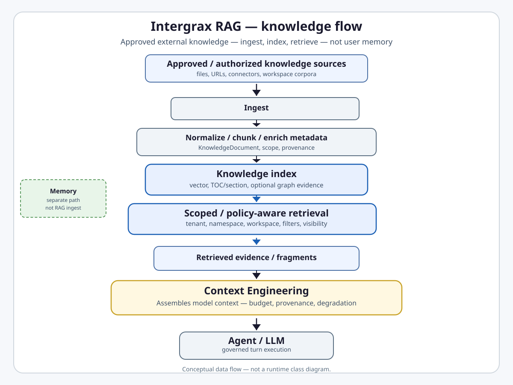
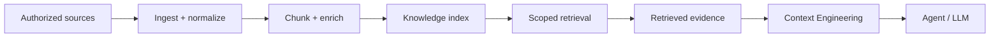

# RAG and Retrieval

**Intergrax RAG** is the platform domain that governs **how approved external and organizational knowledge is ingested, indexed, and retrieved** - scoped documents, corpora, and connected sources - so agents can ground answers in attributable evidence instead of model parametric memory alone.

## Why it matters

Foundation models do not automatically hold your organization's current, private, or tenant-specific knowledge. Dumping entire document libraries into every prompt does not scale, cannot enforce tenant or workspace boundaries, and cannot attach reliable provenance to what the model sees.

Intergrax RAG addresses that gap with a native path from **authorized sources** through **scoped indexes** to **policy-aware retrieval**:

- **Knowledge enters through governed ingest** - loaders, parsers, and connectors produce scoped `KnowledgeDocument` values with provenance, not opaque text blobs.
- **Retrieval is bounded** - `tenant_id`, `namespace`, `workspace_id`, metadata filters, publication-generation visibility, and host policy gates constrain what can be returned.
- **Evidence is attributable** - retrieval hits carry document identity, scope, and provenance semantics so Context Engineering and downstream surfaces can cite or degrade honestly.
- **It is not a correctness guarantee** - retrieval improves grounding when sources are good and scope is right; it does not prove answer quality, security authorization for every source, or production scale by itself.

> [!NOTE]
> **Internal qualification status - not external certification.** Global status **`PRODUCTION_QUALIFIED_WITH_LIMITATIONS`** is an **Intergrax internal engineering qualification status**, based on bounded internal evidence and documented deployment contracts ([handoff](../maintainers/qualification/RAG_PRODUCTION_HANDOFF.md)). It is **not** third-party certification, regulatory or compliance certification, unrestricted production readiness, or enterprise-grade operational proof. Public LKW proofs exercise **indexed** RAG paths only; they do not qualify every provider, GraphRAG live backend, or mixed live+indexed Hybrid Ask. See [Current maturity](#current-maturity) and [Evidence / proof](#evidence--proof).

**Primary audience:** Principal / Staff engineers, harness integrators, and extension authors wiring ingest, vector backends, or retrieval profiles - after the platform overview in the root README.

## At a glance

| Concern | Summary |
| -------- | -------- |
| **Responsibility** | External/document knowledge ingest, knowledge indexes, retrieval contracts, provider abstraction |
| **Knowledge sources** | Files, URLs, workspace corpora, integration connectors - authorized and scoped by the host |
| **Ingest** | Parser/loader → `KnowledgeDocument` normalization → native chunking → embedding → index write |
| **Index / stores** | Vector backends (Qdrant, PgVector, Chroma live-qualified; others cataloged with limits), optional TOC/section and graph evidence indexes |
| **Retrieval** | `RetrievalService` - dense, hybrid, hierarchical, graph-augmented strategies under `VectorStoreScope` |
| **Scope / policy** | Tenant + namespace + workspace isolation; source ownership; generation visibility; host/policy gates on retrieve |
| **Context Engineering** | Consumes retrieval hits as fragments; owns final model-context assembly and budgeting |
| **Memory** | Parallel domain - session/LTM/episodic recall; `knowledge` index domain is RAG-owned |
| **Maturity** | Four-axis statement in [Current maturity](#current-maturity) - **`PRODUCTION_QUALIFIED_WITH_LIMITATIONS`** |
| **Go deeper** | [Engineering canon](#engineering-canon) · [pipeline satellite](satellites/RAG_pipelines_detail.md) · [plan](../maintainers/plans/RAG.md) · [proofs](../proofs/PROOFS.md) |

## Flagship architecture visual

<a href="assets/fullsize/rag-platform-position.md">
<picture>
  <source media="(prefers-color-scheme: dark)" srcset="assets/rag-platform-position-dark.svg">
  <source media="(prefers-color-scheme: light)" srcset="assets/rag-platform-position-light.svg">
  
</picture>
</a>

RAG works on **knowledge sources** and produces **retrieval evidence** for Context Engineering. It is not user/session Memory and not the final context assembler.

## RAG vs Memory vs Context Engineering

| System | Core question | Owns |
| ------ | ------------- | ---- |
| **Memory** | What should the system remember across execution boundaries? | Persisted stores, lifecycle, consolidation, retention, recall semantics |
| **RAG** | What approved external knowledge should be retrieved? | Document/corpus ingest, `knowledge` index domain, retrieval service, provider contracts |
| **Context Engineering** | What information should be placed into the model context now? | Fragment collection, budgeting, degradation, provenance on assembly |

**Hard boundary:** Knowledge (RAG) ≠ user LTM ≠ episodic session turns. Vector indexes for `ltm` and `episodic` may share integration machinery with RAG but remain separate logical domains with distinct metadata, write triggers, and CE read paths - see [`MEMORY.md`](MEMORY.md).

```text
Memory     → What should the system remember across execution boundaries?
RAG        → What external / approved knowledge should be retrieved?
Context Engineering → What information should enter the model context now?
```

## How RAG works

A typical native path (provider-specific adapters may vary at the edges):

1. **Source authorization / selection** - host or application selects an authorized source and scope (`tenant_id`, `namespace`, `workspace_id`).
2. **Ingest** - parser/loader reads the source into scoped documents.
3. **Normalize / chunk** - native chunking produces derivative documents with lineage preserved.
4. **Enrich metadata / provenance** - scope fields and `provenance.source_id` establish ownership identity.
5. **Index** - embeddings write `VectorStoreRecord` values; optional TOC/section and graph publication.
6. **Retrieve under scope / filter / policy** - `RetrievalService` queries within `VectorStoreScope`, applies visibility and strategy layers.
7. **Return evidence / fragments** - hits with logical vector IDs, citations, and provenance semantics.
8. **Context Engineering assembles model-facing context** - fragments enter the budgeted LLM window with attribution.



Module-level pipeline detail and extension surfaces: [`satellites/RAG_pipelines_detail.md`](satellites/RAG_pipelines_detail.md).

## RAG is more than vector search

Intergrax RAG is **not** only `embedding → vector DB → nearest neighbors`. The native stack also includes:

- **Source adapters** - parsers, loaders, and integration connectors behind explicit plugin boundaries.
- **Document normalization** - `KnowledgeDocument` ABI with immutable identity, scope, and provenance.
- **Metadata and scope** - system-owned tenant/namespace/workspace fields; ownership keyed by `provenance.source_id`.
- **Alternate retrieval channels** - hybrid dense+lexical fusion, hierarchical TOC/section routing, graph-augmented evidence where configured.
- **Filtering and visibility** - publication-generation fencing, inactive-record filtering before exposure.
- **Policy / security boundary** - scope validation before provider calls; host policy on retrieve paths; fail-closed replacement when ownership lookup is unavailable.
- **Host profiles** - `RagProfile`, registries, and `RetrievalService` compose ingest and retrieve behavior per deployment.

Vector similarity remains the dense baseline; the platform treats retrieval as a **governed knowledge operation**, not a single embedding call.

## Responsibility boundaries

### RAG owns

- External/document knowledge ingestion and source-scoped reingest lifecycles.
- Knowledge indexes (`knowledge` vector domain; optional TOC and graph evidence channels).
- Retrieval contracts - `RetrievalService`, retriever/reranker plugin surfaces, hit/result ABIs.
- Provider and integration abstraction - embedding providers, vector backends, graph indexer ports where supported.
- Metadata, filter, provenance, and scope semantics on knowledge documents and vector records.
- Graph/vector retrieval composition for canonical harness and qualified live backends.

### RAG does not own

- User/session memory stores or episodic recall semantics - [`MEMORY.md`](MEMORY.md).
- Final model-context assembly, token budgeting, or degradation ladder - [`CONTEXT_ENGINEERING.md`](CONTEXT_ENGINEERING.md).
- Generic filesystem or database permissions outside knowledge contracts.
- Application business authorization policy - Tier-3 governance and policy layers gate usage.
- Model response correctness, hallucination guarantees, or answer assembly quality.
- Unrelated systems of record (CRM, ERP, operational DBs) except through explicit connectors.

### Applications (Tier-3) configure

- `RagProfile`, connector selection, index namespaces, and retrieval strategy per host.
- Wiring ingest jobs, workspace sync, and Ask/Hybrid paths that **consume** retrieval output.
- Provider backend choice from the catalog - see [`INTEGRATIONS.md`](INTEGRATIONS.md).

## Relationship to Intergrax

| Neighbor | Relationship |
| -------- | ------------- |
| [`MEMORY.md`](MEMORY.md) | Parallel recall path; shared vector machinery possible; `knowledge` domain owned by RAG |
| [`CONTEXT_ENGINEERING.md`](CONTEXT_ENGINEERING.md) | Consumes retrieval hits; owns what reaches the LLM |
| [`INTEGRATIONS.md`](INTEGRATIONS.md) | Provider catalog taxonomy - catalog status ≠ RAG qualification |
| [`UNIFIED_CONTEXT_LIFECYCLE.md`](UNIFIED_CONTEXT_LIFECYCLE.md) | UCL owns durable ledger/revisions; RAG supplies retrievable knowledge fragments |
| [`LANGCHAIN_INDEPENDENCE.md`](../capabilities/architecture/LANGCHAIN_INDEPENDENCE.md) | Native ABI is LangChain-independent; optional compatibility adapters |
| LKW (product) | Bounded **proof consumer** of indexed ingest/retrieve - not architectural owner of RAG |
| Nexus / runtime | `rag.retrieve`, ingest orchestration, observability on hot paths |

## Extensibility

Hosts and extension authors plug into documented surfaces - not ad hoc imports of provider internals:

| Surface | Role | Guide |
| ------- | ---- | ----- |
| Parser / loader | Source → `KnowledgeDocument` | [`RAG_EXTENSION_GUIDE.md`](../technical/guides/RAG_EXTENSION_GUIDE.md) |
| Metadata enricher | Scoped metadata before index | same |
| Chunker | Native derivative documents + lineage | same |
| Embedding provider | Ordered vectors, identity preserved | same |
| Vector backend | `VectorStoreRecord` / `VectorStoreScope` ABI | same · [`INTEGRATIONS.md`](INTEGRATIONS.md) |
| Retriever / reranker | Strategy and fusion layers | same |
| Graph indexer | Entity/relationship evidence linked to vector IDs | same · pipeline satellite |

Tier routing via `RagProfile` is **cost/latency routing**, not autonomous MIME-based algorithm selection.

## Current maturity

Architecture maturity: **A5**  
Implementation maturity: **I4**  
Production readiness: **P3**  
Evidence maturity: **E4**

- **A5** - Canonical domain pair with normative contracts (`KnowledgeDocument`, `VectorStoreScope`, ownership/replacement semantics), closed qualification tracks (RAG-FINAL, RAG-PROD, RAG-LIVE, RAG-ENT), and enforced invariants - global **`PRODUCTION_QUALIFIED_WITH_LIMITATIONS`** ([§8](#8-live-claim-boundary-and-roadmap) below). Protocol v2 audit (2026-08-18) documents **accepted residual contract gaps** on canonical `RetrievalService` scope authority, `RetrievalHit` ABI enforcement, and resource-policy validation - target invariants in [Protocol v2 RAG target invariants (2026-08-18)](#protocol-v2-rag-target-invariants-2026-08-18); **not** a maturity-axis downgrade of bounded qualification evidence.
- **I4** - Native ingest → index → retrieve path integrated through Nexus, `RetrievalService`, plugin registries, and host wiring; M-RAG-CONVERGE closeout - plan frozen at L3 control plane ([plan](../maintainers/plans/RAG.md)). Beta catalog providers and unsupported replacement paths remain explicit limits - not I5. Protocol v2 accepted findings constrain **canonical service contract enforcement** (scope-required retrieval, single `RetrievalHit` ABI, bounded profile/request policy) - remediation **PLANNED**, not shipped.
- **P3** - Controlled production candidate: production deployment is approved only under explicit documented constraints and deployment controls ([`RAG_PRODUCTION_HANDOFF.md`](../maintainers/qualification/RAG_PRODUCTION_HANDOFF.md), [`RAG_OPERATOR_GUIDE.md`](../technical/guides/RAG_OPERATOR_GUIDE.md)); qualified providers have bounded environment-specific live evidence; operators must repeat qualification in their actual production infrastructure before making deployment-specific SLO claims. This is not P4 operational production evidence and not P5 enterprise evidence.
- **E4** - Executable qualification evidence: RAG-PROD-13, RAG-LIVE-15A–15E live backend gates, offline/harness matrices in this hub. Public LKW proofs add **bounded** indexed-path E4 scenarios - scope does not cover the full RAG domain ([Evidence / proof](#evidence--proof)). No E5 production/customer evidence window claimed.

> **Qualification status vs P-axis:** **`PRODUCTION_QUALIFIED_WITH_LIMITATIONS`** answers *"May this surface be deployed under the documented contract?"* Taxonomy **P3** answers *"What level of real production operational maturity has been evidenced?"* Those are separate concepts - qualification approval does not automatically imply taxonomy **P4**.

> **Phase vs maturity:** RAG-FINAL / RAG-PROD / RAG-LIVE **Done** and **CLOSED** rows are **delivery and qualification states**, not automatic P5 or domain-wide E5 claims.

### Capability coverage (summary)

| Area | Status |
| ---- | ------ |
| Native ingest → retrieval E2E | Qualified - offline/harness ([§7](#7-canonical-current-state-qualification-matrix)) |
| Dense / hybrid / hierarchical retrieval | Qualified with documented limits |
| Dual-index + source replacement | Qualified with limitations - non-atomic TOC/vector publication |
| GraphRAG canonical harness | Qualified - `InMemoryGraphStore`; Neo4j live baseline + generation fencing live-qualified |
| Stable vector providers (Qdrant, PgVector, Chroma) | **LIVE_QUALIFIED** under environment-specific gates |
| Beta vector providers (Weaviate, LanceDB, …) | Catalog **BETA** - source replacement unsupported or fail-closed |
| LangChain independence | Native path qualified; optional compatibility adapters |
| Public product proof (LKW indexed) | Bounded proof - indexed scope only ([`PROOFS.md`](../proofs/PROOFS.md)) |

Full qualification matrix: [§7 Canonical current-state qualification matrix](#7-canonical-current-state-qualification-matrix) in engineering canon below.

## Verify / inspect implementation

### Evidence

Bounded public proof routes exercise **indexed** LKW ingest/retrieve paths only ([`PROOFS.md`](../proofs/PROOFS.md)) - not full RAG domain qualification. Mixed indexed + authorized live Hybrid Ask is **not** established.

**Engineering qualification (domain-internal)**

| Proof / evidence | Demonstrates | Does not demonstrate |
| ---------------- | ------------ | -------------------- |
| RAG-PROD-13 + RAG-PROD-14 handoff | Qdrant live qualification: scope isolation, ownership, replacement, logical-ID parity | All vector backends; universal SLO; unrestricted production |
| RAG-LIVE-15A-R2 (PgVector) | Live PgVector contract against repo-owned qualification environment | Other deployments; enterprise scale |
| RAG-LIVE-15B-R2 (Chroma) | Live Chroma HTTP contract (1.4.1 env) | Universal Chroma compatibility |
| RAG-LIVE-15C/D (Neo4j) | Live GraphRAG baseline + publication-generation fencing | Zero stale physical records; distributed transactions |
| RAG-FINAL-10A–10D harness | Offline/harness dual-index, GraphRAG harness, plugin gates | Live provider parity for every beta adapter |
| RAG-ENT-3 enterprise handoff | Enterprise readiness closeout under stated limits | Regulated multi-tenant operational proof (E5) |

Authoritative records: [`RAG_PRODUCTION_QUALIFICATION.md`](../maintainers/qualification/RAG_PRODUCTION_QUALIFICATION.md) · [`RAG_LIVE_BACKEND_CLOSEOUT.md`](../maintainers/qualification/RAG_LIVE_BACKEND_CLOSEOUT.md) · [`RAG_ENTERPRISE_HANDOFF.md`](../maintainers/qualification/RAG_ENTERPRISE_HANDOFF.md).

### Public proof routes (bounded product paths)

LKW exercises **indexed** RAG ingest and retrieval - not the full RAG qualification surface:

| Public path | Demonstrates | Does not demonstrate |
| ----------- | ------------ | -------------------- |
| LKW Product Quick Start / indexed Ask V1 | Managed sample → index → grounded indexed Ask with citation path | Hybrid live+indexed; all providers; production/commercial validation |
| LKW indexed Hybrid Ask (`indexed_only`) | Production indexed branch; retrieval even when answer assembly returns `insufficient_evidence` | Mixed authorized-live Hybrid Ask |
| LKW Web URL intake (`LKW-WEB-URL-INDEXED-ASK`) | WEB_URL capture → tenant/workspace Qdrant scope → indexed retrieval | Arbitrary external sites; complete external live-provider access |
| LKW Trusted Ask / Core Platform proofs | Durable workspace indexed path through real runtime stack | Universal provider certification |

Catalog: [`docs/project/proofs/PROOFS.md`](../proofs/PROOFS.md) · LKW detail: [`LKW_PLATFORM_PROOF.md`](../../../applications/local_workspace_application/docs/proof/LKW_PLATFORM_PROOF.md).

**Not established by current public or qualification evidence:** mixed indexed + authorized live Hybrid Ask; complete external live-provider access; real-user validation; commercial validation; transactional exactly-once replacement across stores.

### Core implementation

- [`KnowledgeDocument`](../../../intergrax/knowledge/contracts/document.py)
- [`RetrievalService`](../../../intergrax/rag/retrieval/retrieval_service.py)
- [`VectorStoreScope`](../../../intergrax/rag/vectorstore/contracts/native_vectorstore.py)
- [`IngestPipeline`](../../../intergrax/rag/ingest/ingest_pipeline.py)

### Go deeper

| Depth | Route |
| ----- | ----- |
| **Engineering canon** | [Below](#engineering-canon) - contracts, architecture, qualification matrices |
| **Pipeline / module detail** | [`satellites/RAG_pipelines_detail.md`](satellites/RAG_pipelines_detail.md) |
| **Implementation plan** | [`maintainers/plans/RAG.md`](../maintainers/plans/RAG.md) |
| **Operator / deployment** | [`RAG_OPERATOR_GUIDE.md`](../technical/guides/RAG_OPERATOR_GUIDE.md) |
| **Extension authoring** | [`RAG_EXTENSION_GUIDE.md`](../technical/guides/RAG_EXTENSION_GUIDE.md) |
| **KnowledgeDocument ABI** | [`LANGCHAIN_INDEPENDENCE_native_document_contract.md`](../capabilities/architecture/satellites/LANGCHAIN_INDEPENDENCE_native_document_contract.md) |
| **Qualification artifacts** | [`qualification/RAG_PRODUCTION_HANDOFF.md`](../maintainers/qualification/RAG_PRODUCTION_HANDOFF.md) and linked LIVE/ENT records |
| **Platform audit** | [`AUDIT_PROTOCOL.md`](../../audit_results/AUDIT_PROTOCOL.md) |
| **Related domains** | [`MEMORY.md`](MEMORY.md) · [`CONTEXT_ENGINEERING.md`](CONTEXT_ENGINEERING.md) · [`INTEGRATIONS.md`](INTEGRATIONS.md) |
| **Public proofs** | [`proofs/PROOFS.md`](../proofs/PROOFS.md) |

---

## Maintainer and Cursor context

**Status:** Canonical architecture · **`PRODUCTION_QUALIFIED_WITH_LIMITATIONS`**
**Scope:** native Intergrax RAG architecture and qualification boundary after RAG-FINAL-10A–10D
**Implementation:** `intergrax/rag`
**Plan/history:** [`../maintainers/plans/RAG.md`](../maintainers/plans/RAG.md)
**Production handoff:** [`RAG_PRODUCTION_HANDOFF.md`](../maintainers/qualification/RAG_PRODUCTION_HANDOFF.md)
**Hub:** [`intergrax_runtime_architecture.md`](intergrax_runtime_architecture.md)

The accepted RAG-PROD-13 result and the closed RAG-PROD-14 production handoff are recorded here and in the linked qualification artifacts.

### Navigation and documentation inventory

| Classification | File | Ownership |
|---|---|---|
| **CANONICAL** | `docs/project/architecture/RAG.md` | Current RAG architecture and qualification |
| **OPERATOR / DEPLOYMENT** | [`../technical/guides/RAG_OPERATOR_GUIDE.md`](../technical/guides/RAG_OPERATOR_GUIDE.md) | Production deployment, health, observability, recovery and incident response |
| **DEVELOPER GUIDE** | [`../technical/guides/RAG_EXTENSION_GUIDE.md`](../technical/guides/RAG_EXTENSION_GUIDE.md) | RAG extension topology, chunker/retriever/reranker authoring, `RagProfile` runtime path |
| **QUALIFICATION RECORD** | [`../maintainers/qualification/RAG_PRODUCTION_QUALIFICATION.md`](../maintainers/qualification/RAG_PRODUCTION_QUALIFICATION.md) | RAG-PROD-13 executable production evidence |
| **LIVE QUALIFICATION** | [`../maintainers/qualification/RAG_PGVECTOR_LIVE_QUALIFICATION.md`](../maintainers/qualification/RAG_PGVECTOR_LIVE_QUALIFICATION.md) | RAG-LIVE-15A-R2 PgVector live evidence |
| **LIVE QUALIFICATION** | [`../maintainers/qualification/RAG_CHROMA_LIVE_QUALIFICATION.md`](../maintainers/qualification/RAG_CHROMA_LIVE_QUALIFICATION.md) | RAG-LIVE-15B-R2 Chroma live evidence |
| **LIVE QUALIFICATION** | [`../maintainers/qualification/RAG_NEO4J_LIVE_BASELINE_QUALIFICATION.md`](../maintainers/qualification/RAG_NEO4J_LIVE_BASELINE_QUALIFICATION.md) | RAG-LIVE-15C-R2 Neo4j GraphRAG baseline |
| **LIVE QUALIFICATION** | [`../maintainers/qualification/RAG_NEO4J_GENERATION_FENCING_QUALIFICATION.md`](../maintainers/qualification/RAG_NEO4J_GENERATION_FENCING_QUALIFICATION.md) | RAG-LIVE-15D-R2 Neo4j generation fencing |
| **LIVE CLOSEOUT** | [`../maintainers/qualification/RAG_LIVE_BACKEND_CLOSEOUT.md`](../maintainers/qualification/RAG_LIVE_BACKEND_CLOSEOUT.md) | RAG-LIVE-15E multi-backend live qualification closeout |
| **FINAL HANDOFF** | [`../maintainers/qualification/RAG_PRODUCTION_HANDOFF.md`](../maintainers/qualification/RAG_PRODUCTION_HANDOFF.md) | RAG-PROD-14 final production decision and deployment contract |
| **ENTERPRISE HANDOFF** | [`../maintainers/qualification/RAG_ENTERPRISE_HANDOFF.md`](../maintainers/qualification/RAG_ENTERPRISE_HANDOFF.md) | RAG-ENT-3 enterprise readiness closeout |
| **SATELLITE** | [`satellites/RAG_pipelines_detail.md`](satellites/RAG_pipelines_detail.md) | Pipeline/module detail; current status points here |
| **SATELLITE** | [`../capabilities/architecture/satellites/LANGCHAIN_INDEPENDENCE_native_document_contract.md`](../capabilities/architecture/satellites/LANGCHAIN_INDEPENDENCE_native_document_contract.md) | `KnowledgeDocument` ABI |
| **HISTORICAL / PLAN** | [`../maintainers/plans/RAG.md`](../maintainers/plans/RAG.md) | Implementation history and roadmap; not runtime truth |
| **HISTORICAL / PLAN** | `../maintainers/plans/satellites/RAG_implementation_history.md` | Detailed historical implementation register (audit evidence archived under docs/audit_results/legacy/plan-audit-history/) |
| **RELATED OWNER** | `../capabilities/architecture/LANGCHAIN_INDEPENDENCE.md` | LangChain boundary and optionality |
| **RELATED PLAN** | `../capabilities/plan/LANGCHAIN_INDEPENDENCE.md` | LangChain migration history |
| **CATALOG OWNER** | [`INTEGRATIONS.md`](INTEGRATIONS.md) | Provider catalog taxonomy, not RAG qualification |
| **NAVIGATION ONLY** | [`../../audit_results/legacy/2026-06-18/RAG.md`](../../audit_results/legacy/2026-06-18/RAG.md) | Read-scope and audit entry point |

Older current-state passages in the architecture hub and pipeline satellite were superseded by RAG-FINAL-10A–10D and are not retained as competing truth. Historical evidence remains in the plan and audit-history documents.

### Cursor read scope (token budget)

**Do not read this entire file in one session** (RAG canon).

- **Implement / audit default:** human-facing front + engineering canon §1–§7. Pipeline detail: [`satellites/RAG_pipelines_detail.md`](satellites/RAG_pipelines_detail.md).
- **Use** `Read` with offset/limit per § below.
- **Plan hub:** [`plan/RAG.md`](../maintainers/plans/RAG.md) (scoped status § only).
- **Platform audit:** [`docs/audit_results/AUDIT_PROTOCOL.md`](../../audit_results/AUDIT_PROTOCOL.md).
- **Max reads:** at most **one** satellite per session unless RESUME cites more.

---

## Engineering canon

Authoritative technical specification (§1–§10). Public front section above; pipeline module map in the [satellite](satellites/RAG_pipelines_detail.md).

## 1. Canonical contracts and identity

### KnowledgeDocument ABI

`KnowledgeDocument` is the canonical portable document ABI. RAG owns its
semantics; the neutral Tier-0 implementation is
`intergrax/knowledge/contracts/document.py`, imported as:

```python
from intergrax.knowledge.contracts import KnowledgeDocument
```

The document carries immutable identity, scope, content, metadata and
provenance. `tenant_id`, `namespace` and `workspace_id` are system-owned
scope fields. `provenance.source_id` is the authoritative source identity;
same basenames, paths or display names do not establish ownership.
The full field and lineage contract is the linked `KnowledgeDocument` satellite.

### VectorStoreScope and native vector ABI

`VectorStoreScope` is the explicit routing boundary:

```text
tenant_id + namespace + workspace_id
```

The native vector ABI uses `VectorStoreRecord`, `VectorStoreHit` and the
provider boundary for add, query, ownership enumeration and delete. Scope is
validated before provider calls; user metadata cannot override it.

The frozen portable ID invariant is:

```text
VectorStoreRecord.vector_id
  == logical portable persisted vector ID
  == ADD result IDs
  == QUERY.vector_id
  == OWNERSHIP IDs
  == DELETE input IDs
```

Provider physical IDs are internal implementation details. They are never
ownership IDs, delete inputs or a fallback when the logical ID is absent.

## 2. Canonical architecture

The native path is:

```text
source
  → parser/loader
  → KnowledgeDocument normalization and provenance
  → native chunking
  → embedding provider
  → VectorStoreRecord / vector backend
  → RetrievalService
  → optional reranker and graph channel
```

- **Chunking:** native recursive chunking is the core baseline. Semantic,
  parent-child and provider/plugin strategies are selectable. Hierarchical
  retrieval uses child chunks plus a section/TOC index; it does not promise
  reconstruction of a parent document.
- **Embeddings:** a provider-neutral embedding contract returns vectors in
  input order and preserves document identity, scope and provenance.
- **Vector retrieval:** dense similarity is the native base. Hybrid retrieval
  may combine dense and lexical/sparse channels; fusion and reranking are
  optional strategy layers.
- **Hierarchical retrieval:** `DualIndexStrategy` maintains the main chunk
  index and a TOC/section index. The TOC is a section index, not a second
  full-document copy.
- **GraphRAG:** graph indexing links entities, relationships and chunk
  evidence to canonical vector IDs. Retrieval seeds from vector results,
  traverses graph relations and fuses graph evidence with retrieval channels.
- **Profiles and routing:** `RagProfile`, registries and `RetrievalService`
  compose the path. Tier routing is cost/latency routing, not autonomous
  MIME-based algorithm selection.
- **Extensibility:** supported surfaces are parser/loader, metadata enricher,
  chunker, embedding provider, vector backend, retriever, reranker and graph
  indexer where the selected graph path supports it. Authoring topology and
  dependency semantics are documented in the
  [`RAG extension guide`](../technical/guides/RAG_EXTENSION_GUIDE.md).

The pipeline satellite contains module-level flow and extension detail; it
does not own current qualification.

## 3. Source ownership and replacement

The canonical ownership selector is:

```text
tenant_id + namespace + workspace_id + provenance.source_id
```

`list_source_record_ids(source_id, scope)` means exact persisted ownership
enumeration inside the supplied `VectorStoreScope`. It is not semantic
search, top-k retrieval or basename lookup. Equal basenames do not imply
equal source ownership.

### Single-index replacement

The qualified lifecycle is:

```text
old ownership snapshot
  → prepare
  → publish current version
  → determine current ownership
  → stale = old - current
  → cleanup stale
```

There is no delete-before-publish step. Preparation/embedding failure before
publication preserves the old visible version. A post-publication cleanup
failure is a failed/incomplete replacement requiring retry or recovery, not a
successful transaction.

### Dual-index replacement

Main-index and TOC ownership are snapshotted and handled coherently. Main
publication precedes TOC publication; after publication both stores are
enumerated and only source-scoped stale IDs are removed from each store.
TOC publication and cleanup are not distributed atomic operations.

### GraphRAG replacement

For the canonical harness, the new graph publication occurs before stale
graph chunk unlink. Shared entities and relationships remain when valid
active evidence from another source supports them. Stale-only evidence is
removed or made inactive before it can influence canonical retrieval.

## 4. Failure and atomicity semantics

The lifecycle is deliberately **not called transactional**. It does not
guarantee:

- a distributed transaction across vector, TOC and graph stores;
- exactly-once ingestion;
- automatic rollback of every partial publication; or
- a cross-store atomic commit.

Partial vector, TOC or GraphRAG publication can remain after failure and
requires explicit retry/recovery. A provider without exact ownership lookup
must fail closed for changed-source replacement rather than append blindly.

## 5. Concurrency, generations and visibility

### Three distinct controls

1. **Source operation lease** controls which operation owns the replacement
   lifecycle.
2. **Publication generation** controls which prepared version is active.
3. **Retrieval visibility** filters inactive or unresolved generations before
   results are exposed.

The canonical source operation key is exactly:

```text
tenant_id + namespace + workspace_id + source_id
```

The default coordinator is process-local and thread-safe. It does not provide
multi-worker or multi-process safety. Production composition uses a durable
`ConditionalDocumentStore` CAS-backed lease/coordinator.

A lease records owner/token/expiry for publish, release and cleanup. A lease
alone cannot fence a backend write that was already in flight when the lease
expired. Therefore every replacement receives a publication generation; a
newer generation can supersede an older one. Vector and TOC reads filter by
the exact active generation. Stale physical records may exist temporarily,
but remain inactive/non-queryable and reclaimable.

The same generation-aware evidence rule applies to canonical harness GraphRAG
nodes, edges and chunk evidence. Traversal ignores inactive or unresolved
versioned evidence and retains shared graph facts supported by another active
generation. This graph evidence fence is qualified for
`InMemoryGraphStore`; live Neo4j publication fencing and live backend
reingest remain outside DOCS-11.

## 6. Provider capability and qualification

The matrix follows the catalog taxonomy and describes the native ABI, not
live service proof.

| Provider | Catalog status | Source replacement | Evidence |
|---|---|---|---|
| Qdrant | **STABLE** | supported by native contract | **QUALIFIED_OFFLINE_CONTRACT + LIVE_QUALIFIED** |
| PgVector | **STABLE** | supported by native contract | **QUALIFIED_OFFLINE_CONTRACT + LIVE_QUALIFIED** |
| Chroma | **STABLE** | supported by native contract | **QUALIFIED_OFFLINE_CONTRACT + LIVE_QUALIFIED** |
| Weaviate | **BETA** | **UNSUPPORTED_FOR_SOURCE_REPLACEMENT** | no live claim |
| LanceDB | **BETA** | **UNSUPPORTED_FOR_SOURCE_REPLACEMENT** | no live claim |
| Typesense | **BETA** | **UNSUPPORTED_FOR_SOURCE_REPLACEMENT** | no live claim |
| Pinecone | **BETA** | **UNSUPPORTED_FOR_SOURCE_REPLACEMENT** | no live claim |
| Milvus | **BETA** | **UNSUPPORTED_FOR_SOURCE_REPLACEMENT** | no live claim |
| Vespa | **BETA** | **UNSUPPORTED_FOR_SOURCE_REPLACEMENT** | no live claim |
| InMemory | **BETA** (catalog taxonomy) | harness use only | canonical test harness |

`QUALIFIED_OFFLINE_CONTRACT` means that native records, scope, logical IDs
and exact ownership behavior are covered by offline/fake-provider contract
evidence. `LIVE_QUALIFIED` means accepted live service evidence. RAG-PROD-13
qualified Qdrant against a real local service for tenant, namespace, workspace
and combined scope isolation, exact ownership lookup, logical-ID parity,
replacement, scoped delete, foreign-scope preservation and bounded soak.
Chroma is live-qualified against the repository-owned Chroma 1.4.1 HTTP
qualification environment recorded by RAG-LIVE-15B-R2. PgVector is
live-qualified only against the repository-owned PostgreSQL + pgvector
qualification environment recorded by RAG-LIVE-15A-R2.

`BETA` means the catalog supports an adapter or capability under qualification
limits; it does not promote the provider to stable or prove source
replacement. `UNSUPPORTED_FOR_SOURCE_REPLACEMENT` requires fail-closed
behavior for changed sources, not append behavior.

## 7. Canonical current-state qualification matrix

| Capability | Status | Evidence level | Remaining limitation |
|---|---|---|---|
| Native recursive chunking | Qualified | native harness | provider-specific strategies remain optional |
| Native E2E ingest → retrieval | Qualified | native offline gate | not a live provider qualification |
| Dense retrieval | Qualified | native contract/harness | provider SLOs remain outside this gate |
| Hybrid retrieval | Qualified | native in-memory/harness | backend-specific live parity is not claimed |
| Hierarchical retrieval | Qualified | explicit parent-child + TOC gate | no parent-content reconstruction promise |
| Dual-index reingest | Qualified with limitations | RAG-FINAL-10A | non-atomic TOC/vector publication |
| GraphRAG canonical harness | Qualified with limitations | canonical harness | `InMemoryGraphStore` scope |
| GraphRAG source replacement | Qualified with limitations | generation-aware harness + RAG-LIVE-15C-R2 baseline + RAG-LIVE-15D-R2 fencing | stale physical records need reclamation |
| Neo4j GraphRAG baseline | `LIVE_QUALIFIED_BASELINE` | RAG-LIVE-15C-R2 live baseline | baseline does not claim universal backend SLO |
| Neo4j publication-generation fencing | `LIVE_QUALIFIED` | RAG-LIVE-15D-R2 live gate | stale physical records need reclamation |
| Same-source serialization | Qualified with limitations | source-key coordinator | default coordinator is process-local |
| Publication generation fencing | Qualified with limitations | vector/TOC + graph harness + RAG-LIVE-15D-R2 Neo4j live evidence | stale physical records need reclamation |
| Source ownership | Qualified | exact scoped enumeration | providers without lookup fail closed |
| Stable vector providers | Qdrant, PgVector and Chroma live-qualified | RAG-PROD-13 Qdrant gate, RAG-LIVE-15A-R2 PgVector gate, RAG-LIVE-15B-R2 Chroma gate and native contracts | qualification is environment-specific; no universal backend SLO claim |
| Namespace/workspace isolation | Contract-qualified; Qdrant, PgVector and Chroma live-qualified | native scope/harness, RAG-PROD-13, RAG-LIVE-15A-R2 and RAG-LIVE-15B-R2 gates | qualification is environment-specific |
| Plugins | Qualified extension surface | native registry/plugin gate | [`RAG_EXTENSION_GUIDE.md`](../technical/guides/RAG_EXTENSION_GUIDE.md) |
| LangChain optionality | Qualified architecture | native ABI and boundary docs | optional compatibility paths remain |

Live Neo4j GraphRAG baseline is `LIVE_QUALIFIED_BASELINE`; live Neo4j
publication-generation fencing is `LIVE_QUALIFIED` by RAG-LIVE-15D-R2.
Canonical harness qualification plus these live gates does not imply universal
backend SLO or distributed-transaction claims.

## 8. Live-claim boundary and roadmap

The current evidence still does **not** claim:

- transactional or exactly-once source replacement;
- zero stale physical graph records;
- multi-process coordinator durability without a durable coordinator.

The global status remains **PRODUCTION_QUALIFIED_WITH_LIMITATIONS**.
RAG-PROD-13 evidence, the closed RAG-PROD-14 handoff, the append-only
RAG-LIVE-15A-R2 PgVector, RAG-LIVE-15B-R2 Chroma, RAG-LIVE-15C-R2 Neo4j
baseline and RAG-LIVE-15D-R2 Neo4j generation-fencing evidence, and the
RAG-LIVE-15E closeout are recorded in the linked qualification artifacts.
The **RAG-LIVE track is CLOSED**; there is no next RAG-LIVE task. The
**RAG enterprise track is CLOSED** (RAG-ENT-3); see the
[enterprise handoff](../maintainers/qualification/RAG_ENTERPRISE_HANDOFF.md).

## 9. LangChain boundary

The canonical core RAG ABI and native path are Intergrax-native and do not
require LangChain. LangChain may remain as an optional provider,
compatibility implementation, or specific loader/splitter/embedding adapter
behind explicit plugin/compatibility boundaries. The correct claim is not
that Intergrax contains no LangChain code; the correct claim is that core RAG
contracts and the canonical native path do not require it.

## 10. Qualification evidence boundary

The accepted evidence includes offline/contract and canonical-harness evidence
from RAG-FINAL-10A–10D, the executable RAG-PROD-13 record and the
RAG-LIVE-15A-R2 PgVector, RAG-LIVE-15B-R2 Chroma and RAG-LIVE-15C-R2 Neo4j
live records linked above.
This document records what the system does, what is qualified, what is
offline-only, what is beta, and the closed RAG-LIVE qualification boundary.

<a id="protocol-v2-rag-target-invariants-2026-08-18"></a>

## Protocol v2 RAG target invariants (2026-08-18)

Accepted Protocol v2 audit layer [`RAG`](../../audit_results/2026-08-18/RAG.md) (**FAIL**, 6 ACCEPTED findings). Canonical evidence: [`docs/audit_results/2026-08-18/`](../../audit_results/2026-08-18/README.md). Target state only - **not implemented**:

**Finding 01 - canonical production scope authority**

1. Canonical production `RetrievalService` must require an authoritative `VectorStoreScope` before provider retrieval - absence of scope is not an ambient valid production state ([`AUDIT-20260818-RAG-01`](../../audit_results/2026-08-18/RAG.md)).
2. Unscoped evaluation/lab retrieval, if retained, must use an explicitly non-production/test surface or typed execution mode ([`AUDIT-20260818-RAG-01`](../../audit_results/2026-08-18/RAG.md)).
3. Do not create a second `RetrievalService` ([`AUDIT-20260818-RAG-01`](../../audit_results/2026-08-18/RAG.md)).
4. `rag.retrieve` and Nexus `ContextBuilder` already require tenant scope - canonical service must match that invariant at the Tier-0 authority boundary ([`AUDIT-20260818-RAG-01`](../../audit_results/2026-08-18/RAG.md)).

**Finding 02 - one native retriever result ABI**

5. One canonical retriever result ABI: `RetrievalHit` → `RetrievalChunk` with provenance preserved ([`AUDIT-20260818-RAG-02`](../../audit_results/2026-08-18/RAG.md)).
6. All production/native `RetrieverManager` implementations return `RetrievalHit` or fail contract validation ([`AUDIT-20260818-RAG-02`](../../audit_results/2026-08-18/RAG.md)).
7. Remove or segregate `_candidates_to_chunks` duck-typed legacy adaptation on production retrieval - reranker configuration must not determine provenance strictness ([`AUDIT-20260818-RAG-02`](../../audit_results/2026-08-18/RAG.md)).

**Finding 03 - bounded resource-policy contracts**

8. `RagProfile` and `RetrievalRequest` are fail-fast resource-policy contracts with explicit production-safe ranges and cross-field invariants (`prefetch >= final`, positive limits, bounded hops/iterations, finite thresholds) ([`AUDIT-20260818-RAG-03`](../../audit_results/2026-08-18/RAG.md)).
9. Invalid explicit env configuration fails startup/config validation - not silent dangerous runtime values ([`AUDIT-20260818-RAG-03`](../../audit_results/2026-08-18/RAG.md)).
10. Do not silently clamp arbitrary production configuration in scattered runtime callers ([`AUDIT-20260818-RAG-03`](../../audit_results/2026-08-18/RAG.md)).

**Finding 04 - production preset naming honesty**

11. Production-named public presets must reflect production-qualified security/durability posture ([`AUDIT-20260818-RAG-04`](../../audit_results/2026-08-18/RAG.md)).
12. Rename or remove the in-memory harness preset currently exposed as `production_rag_profile()` - durable GraphRAG production posture is `production_graph_rag_profile()` ([`AUDIT-20260818-RAG-04`](../../audit_results/2026-08-18/RAG.md)).
13. Do not preserve misleading compatibility aliases without a real consumer requirement ([`AUDIT-20260818-RAG-04`](../../audit_results/2026-08-18/RAG.md)).

**Finding 05 - GraphRAG production binding qualification**

14. Production GraphRAG readiness proves consistency of requested `RagProfile` graph backend, actual `IntegrationProfile` graph-store binding, and approved provider qualification ([`AUDIT-20260818-RAG-05`](../../audit_results/2026-08-18/RAG.md)).
15. A configuration string alone is not evidence of a bound durable graph provider ([`AUDIT-20260818-RAG-05`](../../audit_results/2026-08-18/RAG.md)).
16. Coordinate with [`INTEGRATIONS-RUNTIME-BINDING-INTEGRITY`](INTEGRATIONS.md#protocol-v2-integrations-target-invariants-2026-08-18) - do not invent a parallel integration resolver ([`AUDIT-20260818-RAG-05`](../../audit_results/2026-08-18/RAG.md)).

**Finding 06 - retrieval telemetry scope identity**

17. Observability tenant identity derives from canonical execution scope - `request.scope.tenant_id` for scoped retrieval ([`AUDIT-20260818-RAG-06`](../../audit_results/2026-08-18/RAG.md)).
18. Explicit non-tenant label only for intentionally unscoped lab/evaluation execution ([`AUDIT-20260818-RAG-06`](../../audit_results/2026-08-18/RAG.md)).
19. Do not duplicate tenant identity as another independently writable `RetrievalRequest` field ([`AUDIT-20260818-RAG-06`](../../audit_results/2026-08-18/RAG.md)).

**Transitional boundary (preserved)**

20. Bounded RAG-PROD / RAG-LIVE qualification evidence and **`PRODUCTION_QUALIFIED_WITH_LIMITATIONS`** global status remain valid within documented bounds - Protocol v2 findings are residual contract defects, not qualification retraction ([§10](#10-qualification-evidence-boundary)).
21. Historical plan **Done** rows and handoff artifacts are preserved - not rewritten as current runtime claims ([plan](../maintainers/plans/RAG.md)).

Remediation tracked as **RAG-SCOPE-CONTRACT-INTEGRITY** (findings 01–02), **RAG-CONFIGURATION-QUALIFICATION-INTEGRITY** (findings 03–05), and **RAG-OBSERVABILITY-IDENTITY** (finding 06) in [plan](../maintainers/plans/RAG.md#protocol-v2-rag-remediation-2026-08-18). **Not implemented** by audit persistence.
