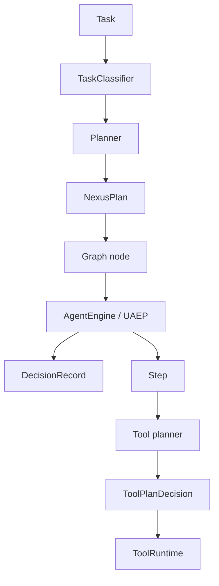

# Reasoning and Cognition

**Intergrax Reasoning & Cognition** is the typed decision layer that transforms an incoming task and runtime context into validated plans, agent decisions, and tool selections before side effects execute.

Reasoning in Intergrax is **not** “call an LLM and hope the executor understands the prose.” The platform structures cognition into **three planes**, each answering a distinct question and returning a **typed contract** the runtime can validate, observe, and policy-check before `GraphExecutor`, UAEP, or `ToolRuntime` commit work.

## Why it matters

Without a central cognition layer:

- every planner can return a different shape,
- an LLM can emit free-text plans,
- decisions are hard to audit,
- an agent can hide routing and tool choices,
- the runtime must guess what output means,
- reasoning and execution blur together,
- policy has no stable place to govern decisions.

The Reasoning and Cognition Layer (RCL) addresses this through **typed contracts**, **explicit ownership boundaries**, **traceable decisions**, **model and prompt governance**, and **validation before side effects**.

> [!NOTE]
> **Maturity boundary:** Core typed planning, classifier/planner wiring, `ReasoningProfile`, `DecisionRecord`, failure taxonomy, parse retries, and bounded dynamic replan are **implemented** on the harness path (phases COG-DEPTH, COG-PROD, COG-LC — **Done** as delivery states, not P-axis claims). That is **not** universal production qualification: every host reasoning profile, every planner/model combination, production latency/cost SLO evidence, and customer operational windows require separate evidence. See [Current maturity](#current-maturity).

**Primary audience:** Principal / Staff engineers, harness integrators, and Tier-3 host authors configuring `OrchestrationProfile` and `ReasoningProfile` — after the platform overview in the root README.

## At a glance

| Concern | Summary |
| -------- | -------- |
| **Responsibility** | Typed decisions — classification, task planning, step cognition, tool selection — before side effects |
| **Plane 1** | Nexus task cognition: `Task` → classify → plan → `NexusPlan` |
| **Plane 2** | UAEP step cognition: graph node → `AgentEngine` / UAEP → `DecisionRecord` |
| **Plane 3** | Tool cognition: step → tool planner → `ToolPlanDecision` → `ToolRuntime` |
| **Primary contracts** | `NexusPlan`, `PlanStep`, `DecisionRecord`, `ToolPlanDecision`, `TaskClassification` |
| **Planner / classifier** | `TaskPlanner`, `EngineBackedNexusPlanner`, graph-spec seed; `classifier_kind` rules/llm — semantics owned here; **kind selection** owned by Orchestration |
| **Prompt / model selection** | `ReasoningProfile` prompt ids + optional `planner_llm_profile`; vendor protocol in [`LLM_ADAPTERS.md`](LLM_ADAPTERS.md) |
| **Failure handling** | `ReasoningFailureKind` enum on trace/metadata; profile-driven parse retries; deterministic planner fallback on LLM parse paths |
| **Orchestration relation** | Orchestration defines collaboration **structure/config**; RCL decides **what/why** inside configured strategies |
| **Nexus relation** | RCL produces plans/decisions; Nexus **runs** the task through the plan |
| **Critic relation** | RCL proposes action/plan; Critic **verifies** outputs and trajectory |
| **Production boundary** | Harness gates and acceptance paths **Done**; product host parity and operational SLOs **not** automatic |
| **Maturity** | Four-axis statement in [Current maturity](#current-maturity) |
| **Go deeper** | [Engineering canon](#engineering-canon) · [extended satellite](satellites/REASONING_AND_COGNITION_extended_depth.md) · [plan](../maintainers/plans/REASONING_AND_COGNITION.md) |

## Flagship architecture visual

<picture>
  <source media="(prefers-color-scheme: dark)" srcset="assets/reasoning-cognition-planes-dark.svg">
  <source media="(prefers-color-scheme: light)" srcset="assets/reasoning-cognition-planes-light.svg">
  
</picture>

Plane 3 (tool planner → `ToolPlanDecision` → `ToolRuntime`) follows the same typed-contract pattern inside each step — see [Tool cognition](#tool-cognition).

## Mental model — ownership boundaries

```text
Reasoning      → what / why
Orchestration  → structure / configuration
Nexus          → task control-flow
UER            → execution semantics
Critic         → verify outcome
```

**Reasoning & Cognition decides what should happen next. Orchestration defines the collaboration structure. Nexus executes the resulting plan. UER governs execution semantics.**

Do not merge planner ownership with graph scheduling, UAEP lifecycle, or critic verification.

## Three cognition planes

Intergrax implements cognition at **three nested scopes**. All three converge on policy engines for governance and on `ToolRuntime` for tool side effects — but **decide** at different boundaries:

| Plane | Question | Typed output | Consumer |
| ----- | -------- | ------------ | -------- |
| **1 — Nexus task** | Which agents, in what order, with what dependencies? | `NexusPlan` | `plan_to_execution_graph()` / `GraphExecutor` |
| **2 — UAEP step** | What does this agent do inside one graph node? | `AgentExecutionResult`, `DecisionRecord` | Node completion, handoff |
| **3 — Tool** | Which tools does this step invoke this iteration? | `ToolPlanDecision` | `ToolRuntime.execute` |

```text
PLANE 1   Task → classification → planner → NexusPlan
PLANE 2   Graph node → AgentEngine / UAEP → DecisionRecord
PLANE 3   Step → tool planner → ToolPlanDecision → ToolRuntime
```

**Rule:** Do not collapse planes — Nexus MUST NOT micromanage tool-level loops; agents MUST NOT rewrite global multi-agent topology without Nexus delegation contracts.

## Core architectural principle

```text
Think → typed decision → validate → execute
```

**Not:**

```text
Think → free-text plan → executor guesses what it means
```

Every cognition plane emits an explicit, validatable artifact. Executors consume contracts — not unparsed LLM prose.

## How cognition works

1. **Intake** — any surface normalizes to `Task`; Orchestration profile selects planner/classifier **kinds** (fail-fast on unknown kinds).
2. **Plane 1 — classify** — `TaskClassifier` assigns `TaskClassification` labels that constrain planner strategies.
3. **Plane 1 — plan** — configured planner produces `NexusPlan` (`TaskPlanner`, `EngineBackedNexusPlanner`, or graph-spec seed wrapper).
4. **Validate** — plan shape, agent roster, policy hooks; LLM paths may retry parse per `ReasoningProfile.planner_parse_retries`.
5. **Graph execution** — Nexus runs nodes; each node invokes `AgentEngine` / UAEP (Plane 2).
6. **Plane 2 — step loop** — agent decisions inside UAEP bounds; `DECISION_EMITTED` with `DecisionRecord`.
7. **Plane 3 — tool loop** — tool planner selects tools; `ToolRuntime` executes side effects.
8. **Downstream** — validation, critic verification, merge — outside RCL ownership.



End-to-end narrative and UC-* scenarios: [`NEXUS_EXECUTION_FLOW.md`](NEXUS_EXECUTION_FLOW.md). Extended sequence detail: [satellite §20](satellites/REASONING_AND_COGNITION_extended_depth.md#20-end-to-end-cognition-flow).

## Typed cognition outputs

| Contract | Plane | Role |
| -------- | ----- | ---- |
| `NexusPlan` | 1 | Task-level agent topology and step graph before `GraphExecutor` |
| `PlanStep` | 1 | One planned node — agent id, dependencies, metadata |
| `DecisionRecord` | 2 (+ planning boundary) | Typed rationale/metadata for model, tool, or planning choices (`decision_record.v1`) — **not** private chain-of-thought |
| `ToolPlanDecision` | 3 | Selected tool calls for one tool-loop iteration |

Each contract is **explicit**, **validatable**, **observable**, and suitable for **policy enforcement**. `NexusPlan`, `PlanStep`, and `DecisionRecord` are Pydantic models; `ToolPlanDecision` is a typed dataclass boundary in the tool engine.

## Task classification

```text
Task → TaskClassifier → TaskClassification → planner constraints
```

Classification is the **first cognition decision** on every Nexus task. It constrains planner behavior but does **not** mutate `Task.state` — `TaskLifecycle` owns lifecycle state.

| Label (examples) | Meaning |
| ---------------- | ------- |
| `SINGLE_AGENT_DEFAULT` / `SINGLE_AGENT_EXPLICIT` | One agent step |
| `CAPABILITY_ROUTED` | One agent matches requested capability |
| `MULTI_AGENT` | Multiple agents share the **same** capability |
| `UNSUPPORTED` | No agent for capability → empty plan / terminal FAILED |
| `HUMAN_APPROVAL_REQUIRED` | Governance pause before graph when not resumed |
| `HIGH_RISK` / `LONG_RUNNING` | Risk or long-running overlays on underlying strategy |

**TaskClassification ≠ collaboration topology.** Labels describe how many agents match a capability, not pipeline shape across different roles.

Wiring: `OrchestrationProfile.classifier_kind` → `default` | `rules` | `llm` with optional `IntentRoute`. Full label matrix and decision flow: [satellite §9](satellites/REASONING_AND_COGNITION_extended_depth.md#9-task-classification).

## Classification ≠ multi-agent graph

`MULTI_AGENT` classification does **not** mean:

> “I have two different agents, so the system automatically builds a pipeline.”

True multi-role topology comes from:

- `ApplicationGraphSpec` on the profile,
- `*.pipeline` capability conventions,
- `EngineBackedNexusPlanner` (`planner_kind=engine`),
- explicit orchestration configuration.

```text
WRONG:  two agents (docs + web) → MULTI_AGENT chains them automatically
RIGHT:  graph_spec DEPENDS_ON chain, *.pipeline, or engine planner
```

Detail and symptom/fix table: [satellite §9.4](satellites/REASONING_AND_COGNITION_extended_depth.md#94-orchestration-routing-modes-do-not-confuse-with-taskclassification).

## Planner

```text
classification + task + registry + profile → planner → NexusPlan
```

The planner **does not** execute the graph. `GraphExecutor` / Nexus consume the result.

| Planner path | When |
| ------------ | ---- |
| **Deterministic `TaskPlanner`** | Default / fallback when LLM parse or validation fails |
| **`EngineBackedNexusPlanner`** | `planner_kind=engine` — LLM JSON → `NexusPlan` via unified parse bridge |
| **Graph-spec seed wrapper** | `ApplicationGraphSpec` when task has no pre-set `plan_id` |

**`EnginePlan` is retired** — `NexusPlan` is the sole task-level plan contract (ACP-CLOSE-LEG-5). Legacy trace types may remain historically; do not treat `EnginePlan` as an active runtime contract.

## Step cognition and DecisionRecord

`AgentEngine` / UAEP executes each graph node. Inside UAEP bounds the agent (or engine planner hooks) makes step-level choices; governed paths emit **`DecisionRecord`** on `DECISION_EMITTED`.

- `DecisionRecord` is a **typed rationale/metadata artifact** — auditable decision surface, not exposure of private LLM chain-of-thought.
- Planning boundary also emits enriched planning-phase `DecisionRecord` (classification + policy metadata — COG-PROD.3).
- Plane 2 runs inside UAEP bounds governed by [`UNIFIED_EXECUTION_RUNTIME.md`](UNIFIED_EXECUTION_RUNTIME.md).

## Tool cognition

Tool planning is the **third cognition plane**:

```text
Step → tool planner → ToolPlanDecision → ToolRuntime
```

- LLM or catalog tool planner selects tools for **this iteration**.
- Output is `ToolPlanDecision`; **side effects** execute only through `ToolRuntime`.
- Nexus does **not** plan tool loops — UAEP owns the step/tool iteration boundary.

Aligned with [`TOOLS.md`](TOOLS.md) — cognition Plane 3 vs `AgentDecision` / tool engine enforcement.

## Reasoning vs Orchestration

| Reasoning & Cognition | Orchestration |
| --------------------- | ------------- |
| Decides **what / why** | Defines collaboration **structure / configuration** |
| Produces plan / decision contracts | Selects / configures strategy and profile |
| Planner / classifier **semantics** | `planner_kind` / `classifier_kind` **selection** |
| Typed decision contracts | Graph / profile contracts (`ApplicationGraphSpec`, merge, resilience) |

**Rule:** config selection ≠ reasoning implementation. Orchestration chooses **which** planner/classifier strategy the host uses; RCL owns **how** classification and planning produce `NexusPlan`.

## Reasoning vs Nexus

| Reasoning & Cognition | Nexus Execution Flow |
| --------------------- | -------------------- |
| Produces classification, `NexusPlan`, step decisions | Runs the task through the plan to `TaskResult` |
| Owns cognition **depth** (three planes) | Owns control-flow **narrative** (intake → graph → merge) |
| `NexusPlanningRunner` is a phase inside Nexus — not a separate runtime | Consumes planner output; does not duplicate planner semantics |

## Reasoning vs UER

| Reasoning & Cognition | Unified Execution Runtime |
| --------------------- | --------------------------- |
| **Decides** next structured action | **Governs** lifecycle and execution semantics |
| Planes 1 and 3 before / beside UAEP | UAEP mandatory sequence inside nodes |
| Emits `DecisionRecord` | Enforces hooks, events, retry/HITL interpretation |

## Reasoning vs Critic

| Reasoning & Cognition | Critic / Verification |
| --------------------- | --------------------- |
| Proposes plan / action | Verifies outputs and trajectory |
| Pre-side-effect decisions | Post-execution correctness checks |
| Planner / classifier / tool planner | `NexusValidationEngine`, `eval.judge`, critic orchestration |

Do not merge planner and judge into one ownership layer. Profile-level model separation (planner LLM vs producer agent) aligns with critic judge separation where policy requires.

## Prompt governance

- Planner and classifier prompts **should** use Prompt Registry ids (`ReasoningProfile.planner_prompt_id`, `classifier_prompt_id`, `tool_planner_prompt_id`).
- Ad-hoc hardcoded prompt strings are technical debt when registry contracts exist for the host profile.
- Prompt configuration is **cognition input** — assembled by the prompt composition layer — not itself a reasoning output.
- Shipped defaults include `nexus_task_planner` with registry-backed `user_template` (COG-PROD.2).

## Model selection

`ReasoningProfile` (COG-5.1 · COG-PROD.1) wires cognition model choice separately from the producer agent:

| Field | Role |
| ----- | ---- |
| `planner_llm_profile` / `planner_llm_profile_id` | Optional separate LLM for task-level planner (and classifier when llm-backed) |
| `denied_planner_model_ids` | Deny gate for planner model selection (COG-5.3) |
| `planner_parse_retries` | Profile-driven retry budget on unified LLM parse path |

Model choice may reflect risk, cost, latency, and quality constraints via `LLMProfile` — vendor protocol and adapter behavior belong to [`LLM_ADAPTERS.md`](LLM_ADAPTERS.md). **Autonomous model optimization** is not claimed; adaptive planner promotion remains observe-only AHI scope by default.

## Parse and validation failure

On **LLM-backed Nexus planner paths** (`build_nexus_plan_unified`):

1. LLM output must parse and validate against the `NexusPlan` contract.
2. `ReasoningProfile.planner_parse_retries` controls retry attempts (0–8).
3. On persistent parse failure, empty steps, or unknown `agent_id` in plan → **deterministic `TaskPlanner` fallback** with `ReasoningFailureKind` metadata (`planner_parse_failed`, `planner_validation_failed`, or `planner_fallback`).
4. Policy blocks at planning boundary → terminal path with `planner_policy_blocked`.

LLM classifier paths fall back to deterministic rules on parse failure (`classifier_fallback`). Do not generalize fallback semantics to unrelated surfaces without evidence.

## Reasoning failure taxonomy

Reasoning failures are **typed and observable** — not only exception strings.

| `ReasoningFailureKind` | Typical cause |
| ---------------------- | ------------- |
| `planner_parse_failed` | LLM JSON invalid after retries |
| `planner_validation_failed` | Unknown agent id or invalid plan shape |
| `planner_fallback` | Fallback to deterministic `TaskPlanner` |
| `planner_policy_blocked` | Pre-plan policy interrupt |
| `classifier_fallback` | LLM classifier → rules fallback |
| `classifier_unsupported` | Rules path / unsupported capability |

Architecture codes (e.g. `COG-PLAN-PARSE`) map to this enum on `plan_metadata`, task metadata, and `DECISION_EMITTED` payloads. Full matrix: [satellite §17](satellites/REASONING_AND_COGNITION_extended_depth.md#17-reasoning-failure-taxonomy).

## Dynamic replan

When `OrchestrationProfile.allow_dynamic_replan` is enabled, a **bounded** replan path exists (AUDIT-IDEAL-7.2 · COG-LC):

- Replan policy metadata (`replan_policy.v1`) flows into UAEP / interrupt handling.
- Budget and exhaustion are bounded — not unlimited autonomous self-replanning.
- Exhaustion surfaces as typed failure (`COG-REPLAN-EXHAUST` in extended taxonomy).

## Observability

Planning, classification, and decision transitions emit trace/events through the platform observability spine — RCL does **not** create a separate logging stack.

| Phase | Typical signal |
| ----- | -------------- |
| Classification | Planning hook diagnostics; `classification` in payload |
| Planning | `PLAN_CREATED`; `DECISION_EMITTED` (planning phase) |
| UAEP step | `STEP_STARTED` / `STEP_COMPLETED`; `DECISION_EMITTED` (step_execution) |
| Tool plan | Tool planner traces under `ops:tools` |

`DecisionRecord` and classification metadata are auditable. Detailed SLO hooks and debug APIs: [satellite §18](satellites/REASONING_AND_COGNITION_extended_depth.md#18-observability-and-trace-contracts) and [`OBSERVABILITY.md`](OBSERVABILITY.md).

## Harness-proven vs not automatically production-qualified

### Harness / platform implemented

- Typed task planning (`NexusPlan` sole contract)
- Planner / classifier strategies and wiring
- `DecisionRecord` on UAEP and planning boundary
- `ReasoningFailureKind` taxonomy
- `ReasoningProfile` + separate planner LLM adapter
- Prompt registry binding for planner/classifier/tool planner
- Profile-driven parse retries
- Bounded dynamic replan path

### Not automatically production-qualified

- Every host `ReasoningProfile` combination in the field
- Every planner / model pairing at scale
- Production latency, cost, and SLO evidence
- Customer operational windows
- Universal model-routing quality evidence

> **Phase vs maturity:** COG-DEPTH / COG-PROD / COG-LC **Done** are **plan delivery states**, not taxonomy **P4** or public proof claims.

## Current maturity

Architecture maturity: **A4**  
Implementation maturity: **I4**  
Production readiness: **P2**  
Evidence maturity: **E3**

- **A4** — Canonical domain pair; three-plane model; typed contracts; adjacent-domain boundaries (Orchestration, Nexus, UER, Critic, Tools); `ReasoningFailureKind` taxonomy; Post-L3 audit baseline and AUDIT-IDEAL Band 7 rows closed ([plan](../maintainers/plans/REASONING_AND_COGNITION.md)).
- **I4** — COG-DEPTH + COG-PROD + COG-LC **Done**: `ReasoningProfile`, planner/classifier wiring, `DecisionRecord` enrichment, dynamic replan, failure taxonomy, parse retries, prompt registry binding, separate planner LLM adapter. L4 adaptive planner selection remains AHI observe-only scope — not I5.
- **P2** — Harness CFG simulation and lab/reference hosts exercise reasoning paths; **public production qualification not claimed** — no dedicated Reasoning/Cognition entry in the public proof catalog.
- **E3** — Unit/gate suite (`check_reasoning_gates.py`, `check_reasoning_failure_taxonomy.py`), planner/classifier integration tests, acceptance replan proof (`test_cog_maint_replan.py`). No representative full-harness public proof route — not E4/E5.

### Capability coverage (summary)

| Area | Status |
| ---- | ------ |
| Deterministic classification + `TaskPlanner` | **Implemented** |
| LLM Nexus planner (`planner_kind=engine`) | **Implemented** — unified parse bridge + fallback |
| Graph-spec seeding | **Implemented** — ORCH-2 |
| Rules / LLM classifier | **Implemented** — ORCH-CONFIG.1, COG-3.* |
| `DecisionRecord` (UAEP + planning) | **Implemented** — FLOW-12, COG-4.*, COG-PROD.3 |
| `ReasoningProfile` + planner LLM separation | **Implemented** — COG-5.1, COG-PROD.1 |
| Failure taxonomy | **Implemented** — COG-6.* |
| Prompt registry on planners | **Implemented** — COG-2.*, COG-PROD.2 |
| Bounded dynamic replan | **Implemented** — AUDIT-IDEAL-7.2 |
| `EnginePlan` | **Retired** — legacy trace only |
| Public production qualification | **Not claimed** |

Backlog and phase trackers: [plan](../maintainers/plans/REASONING_AND_COGNITION.md) — not duplicated here. Legacy L3/L4 scorecard detail: [satellite §21](satellites/REASONING_AND_COGNITION_extended_depth.md#21-maturity-scorecard-and-gap-register).

## Evidence / proof

| Evidence class | What exists | What it does not prove |
| -------------- | ----------- | ---------------------- |
| Architecture | This hub, extended satellite §8+, domain pair | Production operation |
| Unit / gate | Planner/classifier tests, `check_reasoning_gates.py`, failure taxonomy gate | Every host profile |
| Integration | Nexus planning integration, engine planner bridge, orchestration CFG when exercising reasoning | Customer SLOs |
| Public product proof | **None** — no dedicated Reasoning/Cognition route in [`docs/project/proofs/PROOFS.md`](../proofs/PROOFS.md) | Do not infer from unrelated proofs |
| Production / customer | **None** cited for RCL domain | Not E5 |

**Platform audit:** [`docs/audit_results/AUDIT_PROTOCOL.md`](../../audit_results/AUDIT_PROTOCOL.md).

## Go deeper

| Depth | Route |
| ----- | ----- |
| **Engineering canon** | [Below](#engineering-canon) — §1–§7 spine |
| **Extended depth** | [`satellites/REASONING_AND_COGNITION_extended_depth.md`](satellites/REASONING_AND_COGNITION_extended_depth.md) — §8+ boundaries, classification matrix, planning detail, failure taxonomy, code map |
| **Implementation plan** | [`maintainers/plans/REASONING_AND_COGNITION.md`](../maintainers/plans/REASONING_AND_COGNITION.md) |
| **Orchestration** | [`ORCHESTRATION.md`](ORCHESTRATION.md) — profile and kind selection |
| **Nexus flow** | [`NEXUS_EXECUTION_FLOW.md`](NEXUS_EXECUTION_FLOW.md) — Task → `TaskResult` narrative |
| **UER** | [`UNIFIED_EXECUTION_RUNTIME.md`](UNIFIED_EXECUTION_RUNTIME.md) — UAEP enforcement |
| **Tools** | [`TOOLS.md`](TOOLS.md) — `ToolRuntime` boundary |
| **LLM adapters** | [`LLM_ADAPTERS.md`](LLM_ADAPTERS.md) — provider abstraction |
| **Critic** | [`CRITIC_VERIFICATION.md`](CRITIC_VERIFICATION.md) — verification ownership |
| **Platform audit** | [`AUDIT_PROTOCOL.md`](../../audit_results/AUDIT_PROTOCOL.md) · [`audit_results/`](../../audit_results/README.md) |
| **Target architecture** | [`IDEAL_HARNESS_AI_ARCHITECTURE.md`](../technical/guides/IDEAL_HARNESS_AI_ARCHITECTURE.md) §3.5 |

---

## Maintainer and Cursor context

**Status:** Canonical architecture (domain pair 1:1)  
**Hub:** [`intergrax_runtime_architecture.md`](intergrax_runtime_architecture.md)  
**Plan (1:1):** [`plan/REASONING_AND_COGNITION.md`](../maintainers/plans/REASONING_AND_COGNITION.md)  
**Target:** [`IDEAL_HARNESS_AI_ARCHITECTURE.md`](../technical/guides/IDEAL_HARNESS_AI_ARCHITECTURE.md) §3.5  
**Audit layers:** 7 (Reasoning, Planning and Cognition) · cross-ref 17 (Prompt Registry input)  
**Platform audit:** [`docs/audit_results/AUDIT_PROTOCOL.md`](../../audit_results/AUDIT_PROTOCOL.md)

### Cursor read scope (token budget)

**Do not read this entire file in one session** (REASONING_AND_COGNITION canon).

- **Implement / audit default:** DecisionRecord + planner/classifier spine (engineering canon §1–§7).
- **Extended §8+:** [`satellites/REASONING_AND_COGNITION_extended_depth.md`](satellites/REASONING_AND_COGNITION_extended_depth.md).
- **Plan hub:** [`plan/REASONING_AND_COGNITION.md`](../maintainers/plans/REASONING_AND_COGNITION.md) (scoped §6 only).
- **Platform audit:** [`docs/audit_results/AUDIT_PROTOCOL.md`](../../audit_results/AUDIT_PROTOCOL.md).
- **Max reads:** at most **one** file >5k tokens per session unless RESUME cites more.

### Architecture satellites (read on demand)

| Satellite | Contents |
| --------- | -------- |
| [`satellites/REASONING_AND_COGNITION_extended_depth.md`](satellites/REASONING_AND_COGNITION_extended_depth.md) | Extended depth §8+ |

> **Cursor context budget:** read hub read-scope block + **at most one** satellite per session.

### Engineering canon table of contents

1. [Purpose](#1-purpose)
2. [Problem statement](#2-problem-statement)
3. [Terminology](#3-terminology)
4. [Design principles](#4-design-principles)
5. [Three cognition planes](#5-three-cognition-planes)
6. [Ideal Cognition Layer alignment](#6-ideal-cognition-layer-alignment)
7. [Tier placement and responsibility matrix](#7-tier-placement-and-responsibility-matrix)

---

## Engineering canon

## 1. Purpose

Define the **Reasoning and Cognition Layer (RCL)** — the Harness AI subsystem that answers:

> **What should happen next — which agents, tools, and steps — before side effects execute?**

RCL completes the **Think → Plan → Decide** path that precedes orchestrated execution and verification. It **does not** own graph scheduling, retries, HITL queues, or final correctness proofs — those belong to [`ORCHESTRATION.md`](ORCHESTRATION.md), [`NEXUS_EXECUTION_FLOW.md`](NEXUS_EXECUTION_FLOW.md), and [`CRITIC_VERIFICATION.md`](CRITIC_VERIFICATION.md) respectively.

**Strategic positioning:** The Harness owns **how** reasoning is structured, observable, and separated from execution; agents and applications own **domain-specific** step logic inside UAEP bounds.

**Core invariant:** Reasoning outputs MUST be **typed contracts** (`NexusPlan`, `PlanStep`, `ToolPlanDecision`, `DecisionRecord`) — never opaque free-text plans consumed directly by executors without validation. (`EnginePlan` retired — legacy trace types only; see extended satellite §12.)

---

## 2. Problem statement

Intergrax already implements substantial cognition mechanics, but until this domain pair they were **documented only as fragments** across orchestration flow, UAEP, LLM adapters, and prompt registry docs. Gaps vs production-grade Harness AI and FAUDIT-32 §7:

| Gap (pre-RCL) | Status after COG-DEPTH / COG-PROD |
|-----|--------|
| No single canon for cognition plane | **Closed** — this domain pair (COG-DOC) |
| `planner_kind=engine` ad-hoc LLM prompt | **Closed** — `nexus_task_planner` registry id (COG-2.1); user context via template (COG-PROD.2) |
| Dual planner stacks (`NexusPlan` vs `EnginePlan`) | **Closed** — `EnginePlan` retired (ACP-CLOSE-LEG-5); `NexusPlan` is sole task contract; legacy trace types only |
| Nexus-level `DecisionRecord` | **Closed** — `PLAN_CREATED` + `DECISION_EMITTED` at planning boundary (COG-4.*); enriched metadata (COG-PROD.3) |
| Reasoning failure taxonomy | **Closed** — `ReasoningFailureKind` enum + trace metadata (COG-6.*) |
| Classifier surface | **Done** — `classifier_kind=rules|llm` + `IntentRoute` (ORCH-CONFIG.1, COG-3.*) |
| Model routing for reasoning | **Done** — deny gate (COG-5.3); separate planner adapter via `ReasoningProfile.planner_llm_profile` (COG-PROD.1) |
| `planner_parse_retries` on profile | **Done** — COG-PROD.2 — wired on unified LLM parse path |
| `resolve_engine_planner_prompt_config()` | **Done** — COG-PROD.3 — agent-level engine prompt binding |

Runtime depth uplift: Phase **COG-DEPTH** (closed 2026-06-09) · production hardening: Phase **COG-PROD** · lifecycle closeout: **COG-LC** in [`plan/REASONING_AND_COGNITION.md`](../maintainers/plans/REASONING_AND_COGNITION.md).

---

## 3. Terminology

| Term | Meaning in Intergrax |
|------|----------------------|
| **Reasoning** | Any deterministic or LLM-backed process that selects the next structured action without committing side effects |
| **Cognition** | Reasoning plus its inputs: assembled prompts, memory injections, policy overlays, model choice |
| **Classification** | First routing label on a Nexus task (`TaskClassification`) — constrains planner strategies |
| **Planning** | Production of `NexusPlan` — agent topology and step graph **before** `GraphExecutor` |
| **Tool planning** | Selection of tool calls inside a UAEP step loop (`ToolPlanDecision`) |
| **Step planning** | Internal UAEP step sequencing (`StepPlanner`, agent `get_steps`) |
| **DecisionRecord** | Typed rationale artifact for a model/tool/subagent choice (`decision_record.v1`) |
| **Engine planner (retired)** | Removed with ACP-CLOSE-LEG-5 — use Nexus `EngineBackedNexusPlanner` or agent `on_next_step` |
| **Nexus planner** | Task-level `NexusPlan` producer (`TaskPlanner`, `EngineBackedNexusPlanner`, graph seed wrapper) |
| **Graph seeding** | Mapping declarative `ApplicationGraphSpec` → `NexusPlan` when task has no pre-set `plan_id` |
| **RCL** | Reasoning and Cognition Layer — this document |

**Not RCL:** Graph batch scheduling, checkpoint resume, merge policies, critic verification, adaptive profile promotion.

---

## 4. Design principles

| Principle | Meaning in Intergrax |
|-----------|---------------------|
| **Reasoning before side effects** | Classifiers and planners run in `NexusPlanningRunner` before `GraphExecutor` mutates external state |
| **Typed plan contracts** | `NexusPlan`, `PlanStep`, `ToolPlanDecision`, `DecisionRecord` are validated contract boundaries — executors reject invalid shapes |
| **Separation from execution** | UAEP steps 3–8 (`UNIFIED_EXECUTION_RUNTIME` §42.5) isolate context build, step loop, validation from Nexus graph scheduling |
| **Observable decisions** | Every UAEP step emits `DECISION_EMITTED` with `DecisionRecord` payload (FLOW-12 / FAUDIT-COG.1) |
| **Explicit strategies** | `planner_kind`, `classifier_kind`, `multi_agent_order`, graph seed rules — no hidden planner selection |
| **Fail safe on LLM parse** | LLM Nexus planners fall back to deterministic `TaskPlanner` on parse/validation failure (unified bridge path) |
| **Prompt governance** | Cognition prompts SHOULD use Prompt Registry ids via `ReasoningProfile` — ad-hoc strings are technical debt |
| **Judge separation (cross-domain)** | When reasoning invokes LLM for planning, profile SHOULD differ from producer agent where policy requires — aligns with CVL judge separation |
| **Tier discipline** | Tier-1 owns universal planners/classifiers/decision contracts; Tier-2 owns domain step content; Tier-3 selects profiles |

---

## 5. Three cognition planes

Intergrax implements cognition at **three nested scopes**. All three converge on `ToolRuntime` for side effects and `PolicyEngine` for governance — but **decide** at different boundaries:

```text
┌─────────────────────────────────────────────────────────────────────────┐
│  PLANE 1 — Nexus task cognition (global)                                 │
│  Classify task → produce NexusPlan → validation_criteria                 │
│  Modules: TaskClassifier, TaskPlanner, EngineBackedNexusPlanner,         │
│           GraphSpecSeedingPlanner, NexusPlanningRunner                   │
└───────────────────────────────┬─────────────────────────────────────────┘
                                │ plan steps
┌───────────────────────────────▼─────────────────────────────────────────┐
│  PLANE 2 — UAEP step cognition (per agent node)                          │
│  build_context → step loop → AgentDecision → DecisionRecord              │
│  Modules: AgentEngine, UAEP, StepPlanner, agent.get_steps()              │
└───────────────────────────────┬─────────────────────────────────────────┘
                                │ tool requests
┌───────────────────────────────▼─────────────────────────────────────────┐
│  PLANE 3 — Tool cognition (per step tool loop)                           │
│  LLM selects tools → ToolPlanDecision → ToolRuntime                      │
│  Modules: CatalogToolPlanner, ToolPlanningService, ToolPlanDecision      │
└─────────────────────────────────────────────────────────────────────────┘
```

| Plane | Question answered | Primary output | Orchestration consumes |
|-------|-------------------|----------------|------------------------|
| **1 — Nexus task** | Which agents, in what order, with what dependencies? | `NexusPlan` | `plan_to_execution_graph()` |
| **2 — UAEP step** | What does this agent do inside one graph node? | `AgentExecutionResult`, `DecisionRecord` | Node completion, handoff |
| **3 — Tool** | Which tools does the LLM invoke this iteration? | `ToolPlanDecision` | `ToolRuntime.execute` |

**Rule:** Do not collapse planes — Nexus MUST NOT micromanage tool-level loops; agents MUST NOT rewrite global multi-agent topology without Nexus delegation contracts.

**Flow narrative (sequence diagrams):** [`NEXUS_EXECUTION_FLOW.md`](NEXUS_EXECUTION_FLOW.md) §4–§8; UC-* scenarios and extended sequence — [`satellites/NEXUS_EXECUTION_FLOW_extended_depth.md`](satellites/NEXUS_EXECUTION_FLOW_extended_depth.md) §9+ — RCL owns cognition **depth**; FLOW owns end-to-end **narrative**.

---

## 6. Ideal Cognition Layer alignment

[`IDEAL_HARNESS_AI_ARCHITECTURE.md`](../technical/guides/IDEAL_HARNESS_AI_ARCHITECTURE.md) §3.5 defines:

- LLM provider abstraction → [`LLM_ADAPTERS.md`](LLM_ADAPTERS.md)
- Prompt compiler (context + policy + memory) → extended satellite §15 + [`AGENT_CONTRACTS_AND_ASSEMBLY.md`](AGENT_CONTRACTS_AND_ASSEMBLY.md) §17
- Model selection (cost, latency, risk, quality) → `ReasoningProfile` + `LLMProfile` via [`LLM_ADAPTERS.md`](LLM_ADAPTERS.md)
- Structured output contracts → `NexusPlan`, `ToolPlanDecision`, `DecisionRecord`

Ideal execution spine (§3.5 flow):

```text
Policy allows → Orchestrator creates plan → Cognition selects model + builds context
    → Capability executes → Memory enriches → …
```

Intergrax maps **Orchestrator creates plan** to Plane 1 (`NexusPlanningRunner`) and **Cognition selects model + builds context** to Planes 2–3 plus `ContextManager` ([`MEMORY.md`](MEMORY.md) §7).

---

## 7. Tier placement and responsibility matrix

### 7.1 Responsibility matrix

| Concern | Tier-0 | Tier-1 RCL / Nexus | Tier-2 Agent | Tier-3 Application |
|---------|--------|---------------------|--------------|-------------------|
| `DecisionRecord` contract | defines | emits on UAEP paths | supplies step rationale metadata | — |
| `NexusPlan` / `PlanStep` | — | `TaskPlanner`, LLM planners, graph seed | — | `graph_spec`, `OrchestrationProfile` |
| `TaskClassification` | enum | `TaskClassifier` | — | governance flags on task |
| Tool planning | `ToolRegistry` | `CatalogToolPlanner` | tool allowlists via contract | `ToolProfile` |
| Prompt layers for planning | `YamlPromptRegistry` | planner prompt ids via `ReasoningProfile` | agent prompt ids | `PromptProfile` |
| Plan validation criteria | — | `NexusValidationEngine` consumes | `Agent.validate()` | `validation_criteria` on plan |
| Domain step logic | — | UAEP loop only | **primary owner** | agent roster |
| Dynamic replan | — | `allow_dynamic_replan` flag + `replan_policy.v1` metadata (AUDIT-IDEAL-7.2) | replan hooks in engine path | profile toggle |
| `ReasoningProfile` | defines contract | consumes via wiring | — | host environment profile |

### 7.2 What RCL MUST NOT do

- Schedule parallel graph batches or enforce `max_inflight_nodes` — [`ORCHESTRATION.md`](ORCHESTRATION.md)
- Prove output correctness — [`CRITIC_VERIFICATION.md`](CRITIC_VERIFICATION.md)
- Persist memory or assemble full context budget — [`MEMORY.md`](MEMORY.md)
- Encode domain business rules inside universal planners
- Call vendor LLM SDKs outside `LLMAdapter`

### 7.3 What agents/applications MUST NOT do

- Bypass `NexusPlanningRunner` to run multi-agent workflows privately
- Emit untyped plan dicts directly to `GraphExecutor`
- Skip `DecisionRecord` emission on governed decision paths
- Hardcode planner prompts when registry ids exist for the host profile
