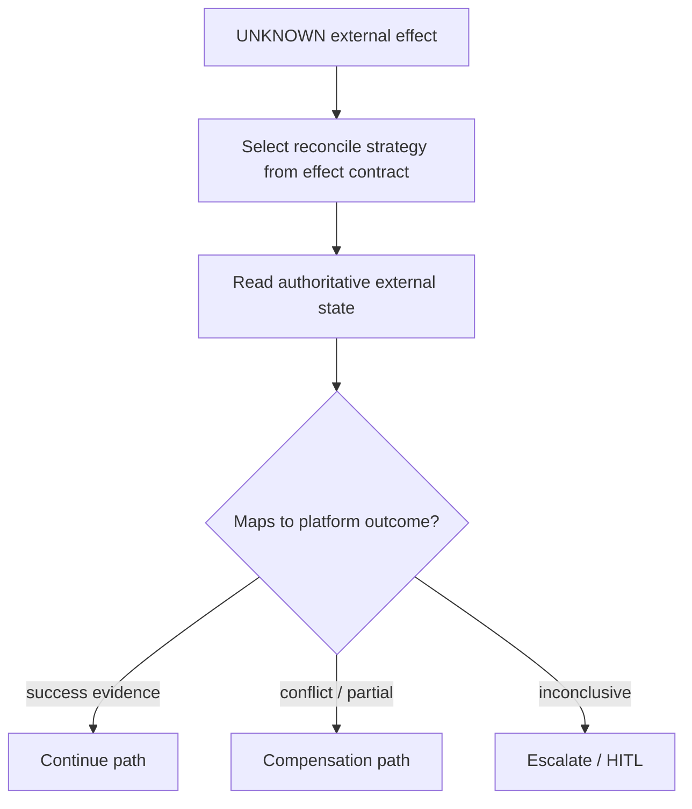

<!--
© Artur Czarnecki. All rights reserved.
Intergrax is source-available under the Intergrax Evaluation and Collaboration License 1.0.
See LICENSE for permitted evaluation, collaboration, and contribution use.
-->

# Reconciliation

**Reconciliation** is the Enterprise Reliability Layer practice of **checking the real state in the external system of record** before deciding what happens next.

Parent hub: [`ENTERPRISE_RELIABILITY_LAYER.md`](ENTERPRISE_RELIABILITY_LAYER.md).

> [!NOTE]
> Target architecture. Provider-specific reconciliation adapters and platform orchestration are **planned**; some observability and recovery concepts reference provider reconciliation at the evidence layer—[`OBSERVABILITY.md`](OBSERVABILITY.md).

**Primary audience:** Integration architects, SREs, and compliance reviewers tracing cross-system consistency.

---

## Definition

**Reconciliation means:** given an **UNKNOWN** or disputed external effect, the platform gathers **authoritative external evidence** and maps it to a controlled resolution (continue, fail, compensate, escalate)—never assuming local timeout or retry outcome.

| Not reconciliation | Reconciliation |
| ------------------ | -------------- |
| Blind retry of the same mutation | Status query, settlement file, webhook replay, idempotent GET-by-key |
| Logging “probably failed” | Recording provider transaction id and verified state |
| Application sleep-and-hope | Bounded, policy-driven verification with evidence |

---

## Examples

### Payment verification

After an ambiguous charge request, reconciliation calls the provider’s **payment status API** or reads a **settlement batch** using the idempotency / correlation key issued at invoke time.

- **Architectural meaning:** money movement is confirmed only from the provider’s ledger—not from socket success.

### Inventory verification

After a WMS API timeout, reconciliation queries **hold id** or **order line state** in the warehouse system.

- **Example outcome:** hold exists → treat as SUCCESS for reservation; no hold → release local reservation or escalate.

### Shipment verification

Carrier label purchase returns UNKNOWN; reconciliation polls **tracking / label status** with the carrier reference.

- **Business value:** avoids duplicate labels or shipping unpaid orders.

### CRM synchronization

Bulk upsert returns async job id; reconciliation polls **job completion** and per-record error reports.

- **Architectural meaning:** sync workflows complete only when CRM truth matches declared completion criteria.

---

## Reconciliation flow

---

## Platform boundaries

| Owner | Responsibility |
| ----- | -------------- |
| **Integration / provider adapters** | How to call status APIs, parse feeds, normalize provider codes—[`INTEGRATIONS.md`](INTEGRATIONS.md) |
| **External Effect Contracts** | Which reconcile strategies exist per operation—[`EXTERNAL_EFFECT_CONTRACTS.md`](EXTERNAL_EFFECT_CONTRACTS.md) |
| **ERL orchestration** | When to reconcile, backoff, max attempts, gating |
| **Governance** | Whether continue/compensate is **allowed** after truth is known—[`GOVERNED_EXECUTION.md`](GOVERNED_EXECUTION.md) |
| **Observability** | Persist reconcile attempts and outcomes |

Reconciliation **does not** replace Nexus orchestration topology; it informs **whether** the next orchestrated step may run.

---

## Decision quality rules

1. **Use stable correlation keys** — reconciliation must target the same logical operation as the original invoke.
2. **Prefer read-only probes** — verify before repeating mutations.
3. **Bound attempts** — inconclusive reconcile escalates; no infinite polling in agents.
4. **Record evidence** — each attempt links provider payload references to Execution identity.
5. **Fail closed on risk** — if shipment or settlement would compound UNKNOWN, remain gated.

---

## Relationship to Uncertainty Management

UNKNOWN triggers reconciliation; reconciliation **resolves** UNKNOWN to SUCCESS, FAILURE, or an escalated path—[`UNCERTAINTY_MANAGEMENT.md`](UNCERTAINTY_MANAGEMENT.md).

---

## Further reading

- [`RECOVERY_AND_COMPENSATION.md`](RECOVERY_AND_COMPENSATION.md) — actions after reconcile results
- [`RELIABILITY_FAILURE_AND_HITL.md`](RELIABILITY_FAILURE_AND_HITL.md) — compensation queue and HITL
