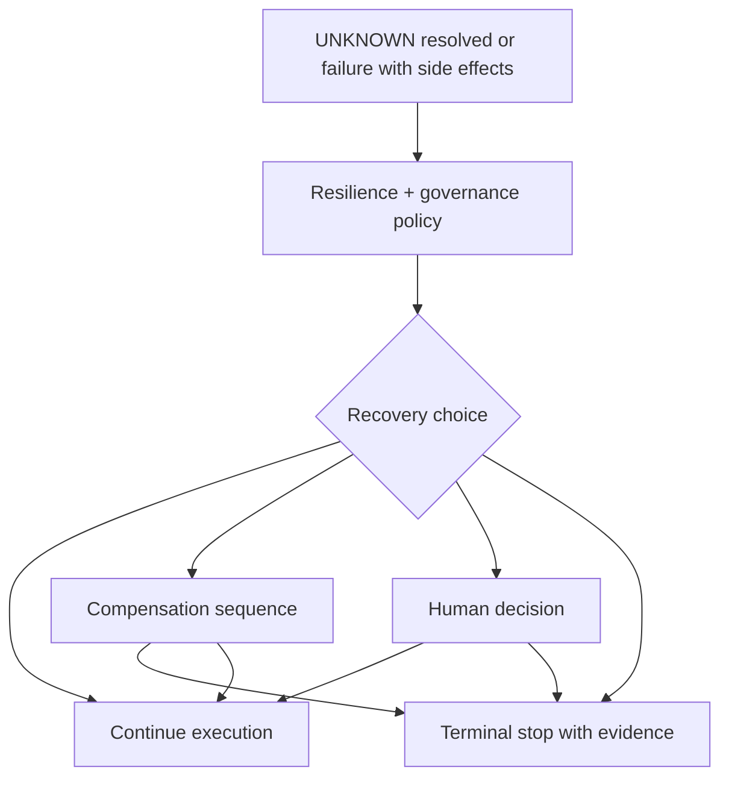

<!--
© Artur Czarnecki. All rights reserved.
Intergrax is source-available under the Intergrax Evaluation and Collaboration License 1.0.
See LICENSE for permitted evaluation, collaboration, and contribution use.
-->

# Recovery and Compensation

**Recovery and Compensation** describes what the platform does **after** uncertainty or failure—once Reliability and Enterprise Reliability Layer have classified state and gathered external truth.

Parent hub: [`ENTERPRISE_RELIABILITY_LAYER.md`](ENTERPRISE_RELIABILITY_LAYER.md).

> [!NOTE]
> Many recovery mechanisms exist today under **Reliability / HITL** (retry layers, compensation queue, HITL). ERL recovery paths **compose** with those mechanisms; this document emphasizes **post-UNKNOWN** and **effect-safe** outcomes.

**Primary audience:** Operators, architects, and auditors defining enterprise-safe continuation rules.

---

## Purpose

Enterprise workflows must answer: **now that we know (or still do not know) what happened externally, what should execution do?**

Possible answers:

| Outcome | Simple explanation | When it applies |
| ------- | ------------------ | --------------- |
| **Continue** | Resume gated steps with verified SUCCESS | Reconciliation confirms intended external effect |
| **Compensate** | Run declared neutralizing operations | Prior local commit conflicts with external truth or business rollback rules |
| **Escalate** | Route to HITL or operator queue | Inconclusive reconcile, policy block, or high risk |
| **Request human decision** | Canonical interrupt; human approves/rejects continuation | Ambiguous business judgment or regulated action |

**Architectural meaning:** recovery is **orchestrated** with Execution Runtime pause/resume and Reliability budgets—not unbounded agent loops.

---

## Recovery orchestration

| Layer | Role |
| ----- | ---- |
| **ERL** | Recommends continue vs compensate based on external truth and effect contracts |
| **Reliability** | Executes bounded retry/degrade/compensation queue actions—[`RELIABILITY_FAILURE_AND_HITL.md`](RELIABILITY_FAILURE_AND_HITL.md) |
| **UER** | Applies pause/resume/cancel and checkpoint continuity—[`UNIFIED_EXECUTION_RUNTIME.md`](UNIFIED_EXECUTION_RUNTIME.md) |
| **Governance** | Authorizes consequential continue or compensation—[`GOVERNED_EXECUTION.md`](GOVERNED_EXECUTION.md) |
| **Observability** | Records recovery decisions and outcomes—[`OBSERVABILITY.md`](OBSERVABILITY.md) |

---

## Continue

**Continue** means downstream orchestration may proceed because external effect truth matches workflow preconditions.

**Example:** UNKNOWN payment resolved to **paid** → release shipment node in Nexus graph.

**Requirements:**

- Reconciliation evidence attached to Execution lineage.
- Gated steps explicitly unblocked by platform—not by agent assumption.
- Policy allows the next consequential effect.

---

## Compensate

**Compensate** means executing **declared** rollback or neutralization operations—void, refund, release inventory, cancel label—not implicit DB undo.

**Example:** Local order marked paid but reconcile shows **no charge** → fail order path and release inventory hold.

Compensation operations have their own **external effect contracts**—[`EXTERNAL_EFFECT_CONTRACTS.md`](EXTERNAL_EFFECT_CONTRACTS.md). Reliability’s compensation queue remains the execution-oriented owner for enqueue and evidence—[`RELIABILITY_FAILURE_AND_HITL.md`](RELIABILITY_FAILURE_AND_HITL.md).

### Compensation execution boundary (ERL foundation)

ERL separates **planning** from **execution**:

| Artifact | Owner | Meaning |
| -------- | ----- | ------- |
| `CompensationPlan` | Compensation planning | Non-executing intent — plugin selection and strategy advice snapshot |
| `CompensationExecutionRequest` | Compensation runtime | Approved intent plus contract-scoped context for one bounded invoke |
| `CompensationExecutionResult` | Compensation runtime | Immutable platform outcome (`completed`, `failed`, `escalated`, `unavailable`) |

**Lifecycle:** validate plan is executable and governance preconditions hold → materialize execution request → invoke `CompensationExecutionStrategy` through the ERL plugin gateway → map plugin-neutral result to platform outcome. No hidden transitions.

**Ownership:** runtime coordinates; **plugins** own external mutations and provider logic. Core must not embed SAP, payment, or API-specific rollback.

**Failure model (fail closed):** invalid or non-`invoke_plugin` plans do not call plugins; missing executor yields `unavailable`; plugin faults surface as `failed` or typed orchestration errors before invoke; no silent retry or swallow.

### Recovery lifecycle boundary (ERL foundation)

After resolution and optional compensation execution, ERL recommends **what should happen to execution lifecycle** — not a second workflow engine.

| Artifact | Owner | Meaning |
| -------- | ----- | ------- |
| `RecoveryDecision` | Recovery contract | Domain-neutral lifecycle action (`continue`, `pause`, `escalate`, `terminate`, `wait`) |
| `RecoveryStrategy` | ERL plugin SPI | Evaluates resolution + compensation outcomes and proposes `RecoveryDecision` |
| `ExternalEffectRecoveryRecommendation` | Recovery runtime | Immutable bundle for observability and handoff |
| `RecoveryLifecycleIntent` | Execution lifecycle port | Consumed by UER adapters — ERL does not apply lifecycle mutations |

**Lifecycle:** materialize strategy context from uncertainty state and evidence → invoke `RecoveryStrategy` through the ERL plugin gateway → map to `RecoveryDecision`. No hidden transitions.

**Ownership split:** ERL recovery **recommends**; **Unified Execution Runtime** owns pause, resume, terminate, and HITL routing via `ExecutionLifecyclePort` implementations. Recovery must not bypass governance or HITL.

**Failure model (fail closed):** missing recovery strategy yields `escalate` (never automatic `continue`); strategy abstention yields `wait` (unresolved); no silent success.

### Governance evaluation boundary (ERL foundation)

After recovery recommends lifecycle posture, ERL evaluates **whether execution may proceed automatically** — a control boundary before the execution lifecycle.

| Artifact | Owner | Meaning |
| -------- | ----- | ------- |
| `GovernanceDecision` | Governance contract | `allow`, `deny`, or `approval_required` — no domain-specific approval types |
| `HumanApprovalRequirement` | HITL contract surface | Platform-level signal that human approval is required (refs and correlation — not users or UI) |
| `GovernanceStrategy` | ERL plugin SPI | Evaluates recovery, resolution, and compensation context; proposes `GovernanceDecision` |
| `ExternalEffectGovernanceEvaluation` | Governance runtime | Immutable bundle for observability and handoff to execution |

**Lifecycle:** materialize strategy context from uncertainty state and evidence → invoke `GovernanceStrategy` through the ERL plugin gateway → map to `GovernanceDecision`. No hidden transitions.

**Ownership split:** ERL governance **evaluates permission**; **Unified Execution Runtime** owns actual execution after governance and HITL boundaries; ERL must not execute actions, approve itself, or bypass governance.

**Failure model (fail closed):** missing governance strategy yields `approval_required` (never automatic `allow`); strategy abstention or invalid outcome yields `approval_required` or `deny`; no silent allow.

### Lifecycle execution handoff boundary (ERL foundation)

After governance approves (or blocks) lifecycle posture, ERL may emit a **handoff intent** for the execution subsystem — still without mutating execution state.

| Artifact | Owner | Meaning |
| -------- | ----- | ------- |
| `RecoveryLifecycleHandoffRequest` | ERL handoff contract | Lifecycle action, correlation identity, `execution_ref`, decision context refs, optional governance result ref — not a duplicate of `RecoveryDecision` / `GovernanceDecision` |
| `RecoveryLifecycleHandoffResult` | Handoff runtime | `handed_off`, `blocked`, `approval_required`, `escalated`, or `port_unavailable` — typed outcome before/at port invoke |
| `RecoveryLifecycleIntent` | Execution lifecycle port | Consumed by UER adapters when handoff is allowed and port is wired |
| `ExecutionLifecyclePort` | Unified Execution Runtime | Sole authority to apply pause, resume, terminate, and related lifecycle mutations |

**Lifecycle:** validate `GovernanceDecision` is `allow` → materialize `RecoveryLifecycleHandoffRequest` → invoke `ExecutionLifecyclePort.apply_recovery_lifecycle_intent` with `RecoveryLifecycleIntent`. No direct execution mutation in ERL runtime.

**Governance requirement:** `deny`, `approval_required`, or recovery `escalate` without allow **must not** invoke the port; outcomes remain typed (`blocked`, `approval_required`, `escalated`).

**Failure model (fail closed):** missing or unwired port yields `port_unavailable`; no silent continue.

### Reliability case lifecycle coordination (ERL foundation)

Capabilities (reconciliation, evidence, resolution, compensation, recovery, governance, handoff) answer **how** each step is performed. **Case lifecycle coordination** answers **where** the reliability case is in the platform journey.

| Artifact | Owner | Meaning |
| -------- | ----- | ------- |
| `ReliabilityCaseLifecycleState` | Lifecycle contract | Platform-neutral phases (`UNKNOWN_DETECTED` … `HANDOFF_READY` → `CLOSED`) — not domain states such as payment or order outcomes |
| `ReliabilityCaseLifecycleRefs` | Lifecycle contract | Correlation-scoped references to upstream artifacts; no duplicated decision or evidence payloads |
| `ReliabilityCaseLifecycleRecord` | Lifecycle contract | Case identity, correlation identity, current state, refs |
| `transition_reliability_case_lifecycle` | Lifecycle runtime | Validates explicit transitions and required refs; returns updated record only |

**Boundary:** the coordinator does **not** schedule work, call plugins, execute external effects, or mutate Unified Execution Runtime lifecycle. Existing orchestrators remain authoritative; the coordinator records progression when callers report capability outcomes.

**Failure model (fail closed):** illegal transitions raise `ReliabilityCaseLifecycleTransitionError`; missing refs for the target state raise `ReliabilityCaseLifecycleContextError`; no silent skip (for example `UNKNOWN_DETECTED` → `CLOSED` without the governed path).

---

## Escalate and human decision

When reconcile is inconclusive, amounts exceed autonomy, or policy demands review:

1. Execution **interrupts** (pause) with explicit reason.
2. HITL or operator workflow presents evidence bundle.
3. Human **approve** → continue (possibly with revised parameters) or **reject** → terminal failure.

Decision System handles **semantic** decision quality; HITL here handles **operational** risk and authority—[`DECISION_SYSTEM.md`](DECISION_SYSTEM.md) · [`RELIABILITY_FAILURE_AND_HITL.md`](RELIABILITY_FAILURE_AND_HITL.md).

---

## Enterprise payment scenario (recovery view)

| Stage | Recovery posture |
| ----- | ---------------- |
| UNKNOWN entered | Pause capture and shipment; no compensation yet |
| Reconcile → paid | **Continue** fulfillment |
| Reconcile → not charged | **Continue** alternate payment path or **stop** order |
| Reconcile → duplicate charge | **Compensate** void/refund per contract + escalate if over limit |
| Reconcile inconclusive | **Escalate** to operations with correlation ids |

---

## Audit-friendly outcomes

Every recovery path should leave an inspectable trail:

- prior state (UNKNOWN / SUCCESS / FAILURE),
- reconciliation summary references,
- policy and governance decisions,
- compensation operations invoked,
- final terminal state and reason.

---

## Further reading

- [`ENTERPRISE_RELIABILITY_LAYER.md`](ENTERPRISE_RELIABILITY_LAYER.md) — flagship scenario and state machine
- [`UNCERTAINTY_MANAGEMENT.md`](UNCERTAINTY_MANAGEMENT.md)
- [`RECONCILIATION.md`](RECONCILIATION.md)
