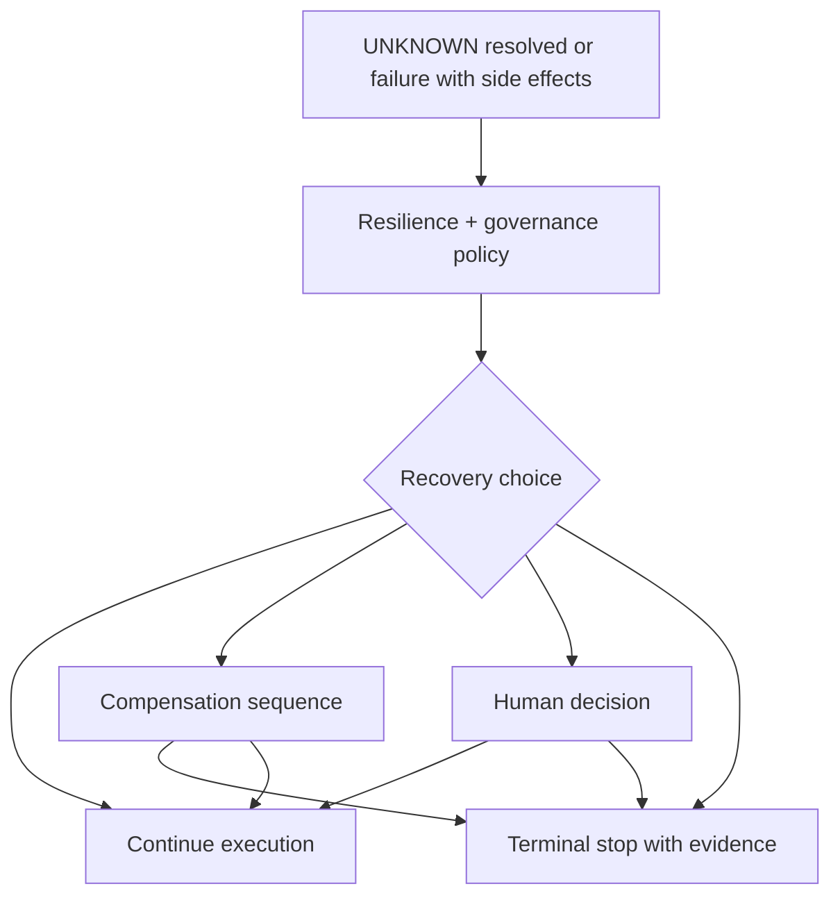

<!--
© Artur Czarnecki. All rights reserved.
Intergrax is source-available under the Intergrax Evaluation and Collaboration License 1.0.
See LICENSE for permitted evaluation, collaboration, and contribution use.
-->

# Recovery and Compensation

**Recovery and Compensation** describes what the platform does **after** uncertainty or failure—once Reliability and Enterprise Reliability Layer have classified state and gathered external truth.

Parent hub: [`ENTERPRISE_RELIABILITY_LAYER.md`](ENTERPRISE_RELIABILITY_LAYER.md).

> [!NOTE]
> Many recovery mechanisms exist today under **Reliability / HITL** (retry layers, compensation queue, HITL). ERL recovery paths **compose** with those mechanisms; this document emphasizes **post-UNKNOWN** and **effect-safe** outcomes.

**Primary audience:** Operators, architects, and auditors defining enterprise-safe continuation rules.

---

## Purpose

Enterprise workflows must answer: **now that we know (or still do not know) what happened externally, what should execution do?**

Possible answers:

| Outcome | Simple explanation | When it applies |
| ------- | ------------------ | --------------- |
| **Continue** | Resume gated steps with verified SUCCESS | Reconciliation confirms intended external effect |
| **Compensate** | Run declared neutralizing operations | Prior local commit conflicts with external truth or business rollback rules |
| **Escalate** | Route to HITL or operator queue | Inconclusive reconcile, policy block, or high risk |
| **Request human decision** | Canonical interrupt; human approves/rejects continuation | Ambiguous business judgment or regulated action |

**Architectural meaning:** recovery is **orchestrated** with Execution Runtime pause/resume and Reliability budgets—not unbounded agent loops.

---

## Recovery orchestration

| Layer | Role |
| ----- | ---- |
| **ERL** | Recommends continue vs compensate based on external truth and effect contracts |
| **Reliability** | Executes bounded retry/degrade/compensation queue actions—[`RELIABILITY_FAILURE_AND_HITL.md`](RELIABILITY_FAILURE_AND_HITL.md) |
| **UER** | Applies pause/resume/cancel and checkpoint continuity—[`UNIFIED_EXECUTION_RUNTIME.md`](UNIFIED_EXECUTION_RUNTIME.md) |
| **Governance** | Authorizes consequential continue or compensation—[`GOVERNED_EXECUTION.md`](GOVERNED_EXECUTION.md) |
| **Observability** | Records recovery decisions and outcomes—[`OBSERVABILITY.md`](OBSERVABILITY.md) |

---

## Continue

**Continue** means downstream orchestration may proceed because external effect truth matches workflow preconditions.

**Example:** UNKNOWN payment resolved to **paid** → release shipment node in Nexus graph.

**Requirements:**

- Reconciliation evidence attached to Execution lineage.
- Gated steps explicitly unblocked by platform—not by agent assumption.
- Policy allows the next consequential effect.

---

## Compensate

**Compensate** means executing **declared** rollback or neutralization operations—void, refund, release inventory, cancel label—not implicit DB undo.

**Example:** Local order marked paid but reconcile shows **no charge** → fail order path and release inventory hold.

Compensation operations have their own **external effect contracts**—[`EXTERNAL_EFFECT_CONTRACTS.md`](EXTERNAL_EFFECT_CONTRACTS.md). Reliability’s compensation queue remains the execution-oriented owner for enqueue and evidence—[`RELIABILITY_FAILURE_AND_HITL.md`](RELIABILITY_FAILURE_AND_HITL.md).

---

## Escalate and human decision

When reconcile is inconclusive, amounts exceed autonomy, or policy demands review:

1. Execution **interrupts** (pause) with explicit reason.
2. HITL or operator workflow presents evidence bundle.
3. Human **approve** → continue (possibly with revised parameters) or **reject** → terminal failure.

Decision System handles **semantic** decision quality; HITL here handles **operational** risk and authority—[`DECISION_SYSTEM.md`](DECISION_SYSTEM.md) · [`RELIABILITY_FAILURE_AND_HITL.md`](RELIABILITY_FAILURE_AND_HITL.md).

---

## Enterprise payment scenario (recovery view)

| Stage | Recovery posture |
| ----- | ---------------- |
| UNKNOWN entered | Pause capture and shipment; no compensation yet |
| Reconcile → paid | **Continue** fulfillment |
| Reconcile → not charged | **Continue** alternate payment path or **stop** order |
| Reconcile → duplicate charge | **Compensate** void/refund per contract + escalate if over limit |
| Reconcile inconclusive | **Escalate** to operations with correlation ids |

---

## Audit-friendly outcomes

Every recovery path should leave an inspectable trail:

- prior state (UNKNOWN / SUCCESS / FAILURE),
- reconciliation summary references,
- policy and governance decisions,
- compensation operations invoked,
- final terminal state and reason.

---

## Further reading

- [`ENTERPRISE_RELIABILITY_LAYER.md`](ENTERPRISE_RELIABILITY_LAYER.md) — flagship scenario and state machine
- [`UNCERTAINTY_MANAGEMENT.md`](UNCERTAINTY_MANAGEMENT.md)
- [`RECONCILIATION.md`](RECONCILIATION.md)
