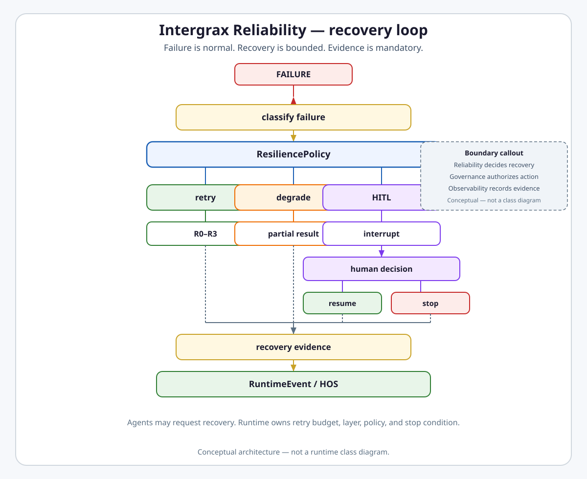

<!--
© Artur Czarnecki. All rights reserved.
Intergrax is source-available under the Intergrax Evaluation and Collaboration License 1.0.
See LICENSE for permitted evaluation, collaboration, and contribution use.
-->

# Reliability, Failure Model, and Human-in-the-Loop

**Intergrax Reliability** is the governed recovery layer that classifies execution failures and chooses bounded retry, degradation, compensation, human escalation, or termination — without letting agents own uncontrolled recovery loops.

Failure, timeout, invalid output, and policy blocks are **normal execution states**, not exceptional side paths. Reliability decides **how to recover**; Governance decides **whether a consequential action is allowed**; Observability records **what actually happened**.

> [!NOTE]
> Intergrax is source-available and in active R&D. This document describes the **Reliability / HITL** platform capability. It is **not** a production-qualification, HA, or durable long-running operator-workflow claim.

**Primary audience:** Principal / Staff engineers, harness integrators, operators tuning recovery posture, and architects evaluating failure boundaries.

---

## Why it matters

Without a platform-owned reliability layer:

- agents retry on their own in hidden loops,
- HTTP clients, ToolRuntime, AgentEngine, and Nexus multiply the same action,
- side effects can execute twice,
- validation failures disappear in final narrative,
- human approval becomes a second workflow engine,
- provider failover is confused with workflow recovery,
- operators cannot reconstruct why execution stopped,
- every application invents its own resilience policy.

Reliability keeps recovery **bounded**, **layered**, and **evidence-backed**.

---

## At a glance

| Concern | Summary |
| -------- | -------- |
| **Failure classifier** | Raw exceptions and runtime codes → `ErrorClassifier` / `FailureClass` → recovery policy input |
| **Recovery policy** | Host `ReliabilityProfile.resilience_policy` (`ResiliencePolicy`) → `FailureResponse` actions |
| **Retry taxonomy** | Semantic layers **R0–R4**; every retry maps to exactly one layer |
| **Agent authority** | Agent may emit `AgentDecision.RETRY` / `REQUEST_HUMAN` **intent**; runtime owns budget, layer, and stop condition |
| **Retry budgets** | Per-layer `max_attempts`, `max_run_retries`, graph retry policy — no unbounded loops |
| **Attempt Ledger** | Logical reconstruction from `RuntimeEvent`, retry metadata, pause/checkpoint records — **not** a second source of truth |
| **Side-effect safety** | Idempotency keys, compensation queue, explicit policy, or HITL before blind retry |
| **Compensation** | Business/runtime neutralization of earlier successful side effects — not universal ACID rollback |
| **Partial / degraded** | Legitimate terminal outcomes via `allow_partial_result` and degrade paths where wired |
| **HITL** | `ExecutionInterrupt` → decision store → approve / reject / escalate → resume or stop |
| **Autonomy** | `AutonomyLevel` steers recovery independence within policy — **not** permission |
| **Governance boundary** | Reliability recommends recovery; Governance authorizes consequential action |
| **Observability boundary** | Reliability emits transitions; Observability owns journal and as-of history |
| **Critic boundary** | Critic emits verdict; Reliability chooses response — Critic does not own retry loop |
| **Production state** | Core retry/HITL/compensation wired on Nexus harness path; durable operator queue and production chaos **not** claimed |
| **Maturity** | **A5 / I4 / P2 / E3** — see [Current maturity](#current-maturity) |

---

## Flagship architecture visual

<a href="assets/reliability-recovery-loop-light.svg">
<picture>
  <source media="(prefers-color-scheme: dark)" srcset="assets/reliability-recovery-loop-dark.svg">
  <source media="(prefers-color-scheme: light)" srcset="assets/reliability-recovery-loop-light.svg">
  
</picture>
</a>

> **Reliability decides recovery. Observability records recovery. Governance authorizes consequential actions.**

```text
failure / timeout / invalid output / policy block
                     ↓
              classify failure
                     ↓
              ResiliencePolicy
          ┌──────────┼──────────┐
          ↓          ↓          ↓
        retry     degrade      HITL
          ↓          ↓          ↓
      R0–R3      partial      pause
                              ↓
                      human decision
                       ↓          ↓
                    resume       stop

every meaningful recovery decision
              ↓
        RuntimeEvent / HOS
```

> **Failure is normal. Recovery is bounded. Evidence is mandatory.**

---

## How recovery works

1. **Failure occurs** — dependency timeout, validation rejection, policy denial, tool error, critic fail, human rejection, or side-effect uncertainty.
2. **Classify** — `ErrorClassifier` maps exceptions to `RuntimeErrorCode`; policy resolution uses `FailureClass` (`USER_ERROR`, `POLICY_ERROR`, `DEPENDENCY_ERROR`, `RUNTIME_ERROR`, `QUALITY_ERROR`). Taxonomy is **extensible** — not a closed public enum of every future failure.
3. **Resolve policy** — `ReliabilityProfile` supplies `ResiliencePolicy`; `resolve_failure_action` returns a bounded `FailureResponse`.
4. **Execute recovery** — retry at the correct **R-layer**, degrade/partial result, enqueue compensation, escalate to HITL, or terminate with explicit stop reason.
5. **Record evidence** — `RETRY_SCHEDULED`, `RETRY_STARTED`, HITL records, compensation events, and related `RuntimeEvent`s on the observability spine.

Agents **must not** implement `for attempt in range(n)` against adapters or tools. They return decisions; the runtime enforces policy.

---

## Failure model

Public grouping (mapping is illustrative — runtime codes remain authoritative):

| Category | Typical sources | Recovery posture |
| -------- | ---------------- | ---------------- |
| **Dependency / transient** | `ConnectionError`, rate limits, provider blips | R0/R2 retry when idempotent; bounded backoff |
| **Quality / validation** | Malformed output, schema fail, critic reject | R2/R3 retry, alternate agent, replan |
| **Policy / security** | Guardrail BLOCK, permission deny, budget policy | Usually no blind retry; HITL or stop |
| **Resource / budget / time** | `BudgetExceededError`, `TimeoutError` | Stop, degrade, or policy-specific retry |
| **Human / operator** | Rejection, cancellation, HITL timeout | R4 human-mediated continuation or terminal stop |
| **Side-effect / consistency** | Mutation succeeded; later step failed | Idempotency, compensation, explicit policy — not blind retry |

---

## Recovery choices

| Choice | Role | As-built note |
| ------ | ---- | ------------- |
| **retry** | Repeat at the same semantic layer with budget | R0–R3 via `RetryEngine`, run-level retry, `RetryCoordinator` events |
| **alternate agent** | Switch agent on validation/quality failure | `RetryEngine` + `retry_alternate_agent` / `FailureResponse.RETRY_ALTERNATE` |
| **replan** | Graph-level replan or reboot | `RebootStrategy`, `RECOVERY_REBOOT` |
| **degrade** | Lower-capability path to completion | `FailureResponse.DEGRADE` where policy and graph support it |
| **partial result** | Some intended work intentionally returned | `allow_partial_result` on `ResiliencePolicy` — wired in graph runner |
| **compensate** | Neutralize earlier successful side effect | `CompensationQueueStore` + step-failure enqueue — not universal coverage |
| **ask human** | Pause for operator decision | `REQUEST_HUMAN`, `ExecutionInterrupt`, HITL store |
| **stop** | Terminal failure with explicit stop reason | Fail closed when budgets exhausted or policy denies |

---

## Retry taxonomy R0–R4

> **A retry belongs to one semantic layer. Layers may compose, but must not unknowingly multiply the same action.**

| Layer | Owner | Typical purpose |
| ----- | ------------------- | ----------------------------------- |
| **R0** | Integration / backend client | Protocol-safe retry (transport, retry-after) |
| **R1** | ToolRuntime / idempotency policy | Retryable tool execution with `idempotency_key` and ledger dedupe |
| **R2** | AgentEngine / HarnessKernel (run-level) | Agent-step recovery — validation, transient LLM/tool errors inside one run |
| **R3** | Nexus / graph (`RetryEngine`, `graph_runner`) | Graph/node retry, alternate agent, whole-run graph retry, partial lifecycle |
| **R4** | HITL runtime | Human correction, approval, rejection, mediated re-run |

### Two concrete mechanisms vs five semantic layers

Intergrax documents **both**:

- **R0–R4** — normative semantic taxonomy (what kind of retry this is).
- **Two primary runtime mechanisms** — graph/validation (`RetryEngine`, ≈ **R3**) and run-level (`AgentEngine` / `HarnessKernel`, ≈ **R2**), plus R0 backend retries and R1 idempotency guards.

These are **not contradictory**: mechanisms are implementations mapped into R2/R3 (and R0/R1 where applicable).

### Nested retry hazard

Illustrative compounding — **not** default Intergrax configuration:

```text
backend 3×  ×  ToolRuntime 3×  ×  Agent 3×  ×  Nexus 3×  =  81 possible executions
```

Configure each layer explicitly; prefer trace-visible, bounded values. Retry layers must be **explicit and observable**.

---

## Retry lifecycle

On wired Nexus graph paths, `RetryCoordinator` publishes:

```text
failure → retry decision → RETRY_SCHEDULED → RETRY_STARTED → success / failure
```

`RETRY_STARTED` mints a new `AttemptId` (see [`OBSERVABILITY.md`](OBSERVABILITY.md)). Run-level retries use the same event vocabulary with `scope: "run"` or `scope: "agent"`.

---

## Attempt Ledger

Logical view — **not** a separate physical source of truth:

```text
retry / failure / HITL evidence
  → RuntimeEvents + retry metadata + pause/checkpoint records
  → Attempt Ledger (reconstructed operator view)
```

Example reconstruction:

```text
Attempt 1 → failure → retry decision (R3, validation_failed)
Attempt 2 → HITL pause → human approve
Attempt 3 → success
```

> **Attempt Ledger is not another source of truth.** Canonical execution evidence remains `RuntimeEvent` / HOS ([`OBSERVABILITY.md`](OBSERVABILITY.md#observability-event-spine)).

Sources include (non-exhaustive): `RetryRecord`, `PauseRecord`, `RuntimeCheckpoint`, `RETRY_*` / `TOOL_*` / HITL events, `ToolCallTrace`, validation and critic payloads, correlation fields on the observability spine.

---

## Side-effect retry safety

> **High-risk or irreversible side effects must not be blindly retried.**

| Mechanism | Role |
| --------- | ---- |
| **Idempotency keys** | `IdempotentInvoker` + ledger dedupe on mutating tools when `idempotency_key` present |
| **ReliabilityProfile** | `idempotency_enabled`, circuit breaker thresholds |
| **Policy / HITL** | REQUIRE_HUMAN or DENY before retry of meaningful external effects |
| **Compensation** | Enqueue reverse/neutralize action when later step fails after successful mutation |

```text
retry read-only operation   → usually safe
retry irreversible mutation → unsafe unless idempotency / compensation / policy / HITL
```

Not all tools are idempotent by default.

---

## Compensation

```text
side effect A succeeded → later step failed → compensation may reverse/neutralize A
```

**Compensation is business/runtime recovery, not database ACID rollback.** Implemented via `CompensationQueueStore`, step-failure enqueue in `HarnessKernel`, and host wiring — **not** universal transactional rollback across all tools.

Distinction:

```text
retry        → try the action again
compensation → neutralize an earlier successful action
```

---

## Partial and degraded results

```text
partial  → some requested work intentionally returned (graph may end PARTIALLY_COMPLETED)
degraded → completed through lower-quality / lower-capability path
```

Controlled by `ResiliencePolicy.allow_partial_result` and degrade responses where graph/policy support them. Legitimate terminal outcomes — not hidden success.

---

## HITL

```text
execution → ExecutionInterrupt → HITL store / HumanDecisionRecord
         → approve | reject | escalate | correct
         → resume or terminate
```

Nexus manages human approval. Agents use `AgentDecision.REQUEST_HUMAN` or interrupt decisions — **not** ad-hoc approval channels.

`HumanResponseVerdict`: `approve`, `reject`, `escalate`. Store: `SQLiteHumanDecisionStore` (durable records; **not** a full production operator workflow or distributed queue).

Checkpoints (`checkpoint_on_pause`) support resume — distinct from a durable async scheduler.

---

## Governed Continuation

High-level composition — **not** a new runtime:

```text
ExecutionInterrupt → governance decision / evidence → Nexus resume
```

> **Governed Continuation composes existing interrupt / HITL / resume primitives.** Forbidden: `ContinuationRuntime`.

Platform reference: [`governed_external_execution.md`](../technical/platform/governed_external_execution.md) · [ADR-GOVERNED-CONTINUATION-001](../technical/adr/entries/2026-07-20/ADR-GOVERNED-CONTINUATION-001.md).

---

## Human decision vs Governance

> **Human approval is evidence/decision in the governance flow; it does not automatically grant unrelated permissions.**

```text
REQUIRE_HUMAN → human decision → continuation evidence → policy/runtime continuation rules
```

Continuation evidence still requires policy ALLOW unless architecture defines a trusted final authorization artifact (not assumed here). Human approval does **not** generically bypass **DENY**.

---

## ResiliencePolicy

Host-configured modular fault-tolerance (`intergrax.contracts.resilience_policy`):

```text
FailureClass → ResiliencePolicy.action_for() → FailureResponse
```

| `FailureClass` | Default response (harness default policy) |
| -------------- | ---------------------------------------- |
| `USER_ERROR` | `FAIL` |
| `POLICY_ERROR` | `REQUEST_HUMAN` |
| `DEPENDENCY_ERROR` | configurable (`on_dependency_error`, default `RETRY`) |
| `QUALITY_ERROR` | configurable (`on_quality_error`, default `RETRY_ALTERNATE`) |
| `RUNTIME_ERROR` | configurable (`on_runtime_error`, default `RECOVERY_REBOOT`) |

`FailureResponse` vocabulary (use only these — do not invent actions): `RETRY`, `RETRY_ALTERNATE`, `CIRCUIT_BREAK`, `FAIL`, `DEGRADE`, `REQUEST_HUMAN`, `PARTIAL`, `RETRY_RUN`, `RETRY_GRAPH`, `RECOVERY_REBOOT`, `ESCALATE`.

`resolve_failure_action` escalates when `attempt >= max_attempts` for retry-class responses.

---

## ReliabilityProfile

```text
Application / Host → ReliabilityProfile → ResiliencePolicy → runtime recovery behavior
```

Key fields: `resilience_policy`, `idempotency_enabled`, circuit breaker, checkpoint posture, `default_autonomy_level`, `tenant_autonomy_ceiling`. Wired at host assembly via `reliability_runtime_bridge` and `HarnessKernel` session reliability.

The Agent does **not** self-expand resilience posture — host configuration controls it.

---

## Autonomy

Exact enum (`intergrax.contracts.autonomy_level`):

| `AutonomyLevel` | Meaning |
| ----------------- | ------- |
| `MANUAL` | Minimal independent recovery; human confirmation expected |
| `ASK` | Default — confirm sensitive recovery paths |
| `AUTONOMOUS` | Broader independent recovery **within existing policy** |

```text
autonomy       → degree of independent recovery
authorization  → what actions are permitted
```

> **More autonomy does not mean more permission.** They are orthogonal.

Effective autonomy resolves from request, agent risk, execution mode, and tenant ceiling (`autonomy_resolver`). **Mid-run control:** operators may change effective autonomy on an active task (`set_task_autonomy` / harness task routes) — this tightens or relaxes recovery independence **without rewriting authorization policy**.

---

## Stop reasons

> **Architectural vocabulary — not necessarily a runtime enum.**

Representative terminal reasons: `completed`, `validation_failed`, `policy_denied`, `timeout`, `max_attempts_exceeded`, `human_rejected`, `partial_result_returned`, `degraded_result_returned`, `cancelled`, `unsafe_side_effect_risk`. Full table in [Engineering canon §30](#30-failure-model).

---

## Responsibility boundaries

| Domain | Owns | Does not own |
| ------ | ---- | ------------- |
| **Reliability** | Failure classification input, recovery choice, retry layer, budgets, HITL pause/resume semantics, compensation enqueue | Business permission rules, journal persistence, critic rubrics |
| **Governance** | ALLOW / DENY / REQUIRE_HUMAN on consequential actions | Retry loop execution, attempt history |
| **Observability** | `RuntimeEvent` journal, as-of reconstruction, export | Recovery policy decisions |
| **Critic** | Verdict on correctness | Retry orchestration — Reliability responds to verdict |
| **LLM adapters** | Provider/model failover on retriable provider errors | Workflow-level graph retry (separate concern) |

### Meaningful side effects (high level)

```text
Reliability     → recovery recommendation
Governance      → ALLOW / DENY / REQUIRE_HUMAN
Tool/Integration → executes approved action
Observability   → records evidence
```

Do not treat this hub as the Governance hub — see [`GOVERNED_EXECUTION.md`](GOVERNED_EXECUTION.md).

---

## Relationship to Intergrax

| Neighbor | Relationship |
| -------- | ------------- |
| [`UNIFIED_EXECUTION_RUNTIME.md`](UNIFIED_EXECUTION_RUNTIME.md) | UER emits lifecycle/retry events; Reliability owns recovery semantics |
| [`NEXUS_EXECUTION_FLOW.md`](NEXUS_EXECUTION_FLOW.md) | Nexus orchestrates graph retry, alternate agents, partial completion |
| [`OBSERVABILITY.md`](OBSERVABILITY.md) | Attempt identity, `RETRY_*` projection rules, HOS |
| [`GOVERNED_EXECUTION.md`](GOVERNED_EXECUTION.md) | Policy authorization vs recovery |
| [`CRITIC_VERIFICATION.md`](CRITIC_VERIFICATION.md) | Verdict → Reliability response |
| [`TOOLS.md`](TOOLS.md) | Tool idempotency, side-effect contracts |
| [`LLM_ADAPTERS.md`](LLM_ADAPTERS.md) | Profile failover — provider routing, not workflow retry |

---

## Current maturity

Four-axis statement ([`MATURITY_TAXONOMY.md`](../technical/guides/MATURITY_TAXONOMY.md)):

| Axis | Level | Rationale |
| ---- | ----- | ----------- |
| **Architecture (A)** | **A5** | R0–R4 taxonomy, retry ownership invariants, Reliability/Governance/Observability boundaries stable in canon |
| **Implementation (I)** | **I4** | `ResiliencePolicy`, resolver, `RetryCoordinator`, `RetryEngine`, HITL store, compensation queue, autonomy wired on Nexus harness path |
| **Production (P)** | **P2** | Advanced HITL store ≠ full operator workflow; checkpoints ≠ durable scheduler; no HA/distributed queue claim |
| **Evidence (E)** | **E3** | Unit/gate tests (`test_policy_resolver`, `test_retry_coordinator`, `test_rel_maint_depth`, chaos simulation gate) — not dedicated public E4 recovery proof route |

### Sub-maturity (informative — not averaged)

| Slice | I | P | E |
| ----- | - | - | - |
| Retry / recovery core | I4 | P2 | E3 |
| HITL | I3 | P2 | E3 |
| Side-effect compensation | I3 | P2 | E3 |
| Autonomy / operator control | I4 | P2 | E3 |

**Safe summary:** bounded recovery is implemented and tested on the harness path; production operator workflow, universal compensation coverage, and customer evidence remain open.

---

## Current implementation state

| Mechanism | State |
| --------- | ----- |
| Failure taxonomy | `ErrorClassifier` → `RuntimeErrorCode`; policy `FailureClass` enum |
| R0–R4 mapping | Semantic taxonomy enforced in canon; R2 run-level + R3 graph primary |
| Concrete retry | `RetryEngine`, `AgentEngine`/`HarnessKernel` run retry, `graph_runner` whole-run retry |
| **`RetryCoordinator`** | **Shipped** — `intergrax.runtime.nexus.retry.coordinator`; used in `graph_runner`; emits `RETRY_SCHEDULED` / `RETRY_STARTED` |
| **`ResiliencePolicy` / `ReliabilityProfile`** | Shipped — host profile + resolver |
| Compensation | `CompensationQueueStore`, step-failure enqueue — reference hosts wired |
| Partial results | `allow_partial_result` honored in graph runner |
| HITL | `ExecutionInterrupt`, `HumanDecisionRecord`, SQLite store, Nexus reject/escalate |
| **`AutonomyLevel`** | `MANUAL` / `ASK` / `AUTONOMOUS` + mid-run API |
| Product-host parity | REL-ADV.7 / REL-MAINT-02 — resilience enricher + HTTP on opt-in hosts |
| Long-running / durable | `long_running_scheduler_enabled` opt-in; not default production queue |

---

## Evidence / proof

| Class | Artifacts |
| ----- | --------- |
| **Architecture** | This hub · satellites · ADR-GOVERNED-CONTINUATION-001 · REL ADR policy |
| **Unit / gate** | `test_policy_resolver.py`, `test_retry_coordinator.py`, `test_autonomy_resolver.py`, `test_rel_maint_depth.py`, `check_harness_resilience_policy.py` |
| **Integration** | Graph runner retry events · compensation enqueue · HITL store · partial result graph tests |
| **Public proof** | No dedicated Reliability row in [`PROOFS.md`](../proofs/PROOFS.md) — do not claim customer/production recovery evidence |
| **Production / customer** | Not inferred |

---

## Go deeper

| Depth | Route |
| ----- | ----- |
| Engineering canon | [Below](#engineering-canon) — failure model, retry layers, GEC composition |
| Extended depth | [`satellites/RELIABILITY_FAILURE_AND_HITL_extended_depth.md`](satellites/RELIABILITY_FAILURE_AND_HITL_extended_depth.md) |
| Production gates | [`satellites/RELIABILITY_FAILURE_AND_HITL_production_gates.md`](satellites/RELIABILITY_FAILURE_AND_HITL_production_gates.md) |
| Implementation plan | [`maintainers/plans/RELIABILITY_FAILURE_AND_HITL.md`](../maintainers/plans/RELIABILITY_FAILURE_AND_HITL.md) |
| Observability | [`OBSERVABILITY.md`](OBSERVABILITY.md) |
| Governance | [`GOVERNED_EXECUTION.md`](GOVERNED_EXECUTION.md) |
| UER / Nexus | [`UNIFIED_EXECUTION_RUNTIME.md`](UNIFIED_EXECUTION_RUNTIME.md) · [`NEXUS_EXECUTION_FLOW.md`](NEXUS_EXECUTION_FLOW.md) |
| Tools / LLM / Critic | [`TOOLS.md`](TOOLS.md) · [`LLM_ADAPTERS.md`](LLM_ADAPTERS.md) · [`CRITIC_VERIFICATION.md`](CRITIC_VERIFICATION.md) |
| Maturity / proofs | [`MATURITY_TAXONOMY.md`](../technical/guides/MATURITY_TAXONOMY.md) · [`PROOFS.md`](../proofs/PROOFS.md) |

---

## Public invariants

```text
Failure is expected. Recovery is bounded.
Agents may request recovery. Runtime owns retry policy.
Every retry belongs to one semantic retry layer.
Attempt Ledger is reconstructable evidence, not a second source of truth.
High-risk side effects are not blindly retried.
More autonomy does not mean more permission.
Reliability decides recovery. Governance authorizes. Observability records.
```

---

## Engineering canon

Maintainer metadata, extended registers, and composition modules preserved below.

**Status:** Canonical architecture (domain pair 1:1)  
**Hub:** [`intergrax_runtime_architecture.md`](intergrax_runtime_architecture.md)  
**Plan (1:1):** [`plan/RELIABILITY_FAILURE_AND_HITL.md`](../maintainers/plans/RELIABILITY_FAILURE_AND_HITL.md)  
**Target:** [`IDEAL_HARNESS_AI_ARCHITECTURE.md`](../technical/guides/IDEAL_HARNESS_AI_ARCHITECTURE.md)  
**Audit layers:** 22  
**Platform audit:** [`docs/audit_results/AUDIT_PROTOCOL.md`](../../audit_results/AUDIT_PROTOCOL.md)  
**Last updated:** 2026-08-18 — **DOC-3Q** design-system modernization; RetryCoordinator reconciliation; A/I/P/E

---

## Cursor read scope (token budget)

**Do not read this entire file in one session** (RELIABILITY_FAILURE_AND_HITL canon).

- **Implement / audit default:** public front + §30–§32 failure + retry + HITL core. Extended §33+: [`satellites/RELIABILITY_FAILURE_AND_HITL_extended_depth.md`](satellites/RELIABILITY_FAILURE_AND_HITL_extended_depth.md). Production gates: [`satellites/RELIABILITY_FAILURE_AND_HITL_production_gates.md`](satellites/RELIABILITY_FAILURE_AND_HITL_production_gates.md).
- **Use** table of contents — `Read` with offset/limit per §.
- **Plan hub:** [`plan/RELIABILITY_FAILURE_AND_HITL.md`](../maintainers/plans/RELIABILITY_FAILURE_AND_HITL.md) (scoped §6 only).
- **Max reads:** at most **one** file >5k tokens per session unless RESUME cites more.

---

## Architecture satellites (read on demand)

| Satellite | Contents |
|-----------|----------|
| [`satellites/RELIABILITY_FAILURE_AND_HITL_extended_depth.md`](satellites/RELIABILITY_FAILURE_AND_HITL_extended_depth.md) | extended depth |
| [`satellites/RELIABILITY_FAILURE_AND_HITL_production_gates.md`](satellites/RELIABILITY_FAILURE_AND_HITL_production_gates.md) | production gates |

> **Cursor context budget:** read hub read-scope block + **at most one** satellite per session.

---

# 30. Failure Model

Failures are expected. The system must treat failure as normal.

Failure types (engineering register — extensible):

- agent failure
- tool failure
- adapter failure
- timeout
- invalid output
- missing data
- low confidence
- unsafe action
- guardrail denial (`LlmGuardrailMiddleware` BLOCK at input/output/tool hooks — composes with HITL when policy escalates; see [`INTEGRATIONS.md`](INTEGRATIONS.md) §47)
- human rejection
- incomplete result

Failure handling options:

- retry same step
- retry with different agent
- ask human
- degrade gracefully
- return partial result
- stop execution
- mark as failed

---

# 31. Retry Policy

Retries must be controlled. Every retry should have: reason, retry count, changed strategy if possible, stop condition. Do not retry endlessly. Retries should be visible in traces.

### 31.1 Runtime retry mechanisms (mapped to R2 / R3)

Intergrax has **two primary runtime retry mechanisms** plus protocol-level (R0) and idempotency (R1) guards. Configure each explicitly.

| Mechanism | Location | Scope | Maps to |
|-----------|----------|-------|---------|
| **Graph / validation** | `RetryEngine` · `graph_runner` + `RetryCoordinator` | Nexus graph after validation fails; alternate agent; `RETRY_SCHEDULED` / `RETRY_STARTED` | **R3** |
| **Run-level** | `AgentEngine` / `HarnessKernel` | Transient LLM or tool failures inside one agent run | **R2** |

**`RetryCoordinator`** (`runtime/nexus/retry/coordinator.py`) — **shipped**: unifies run retry policy checks and retry event emission; used from `graph_runner`. It does **not** replace layer ownership — it coordinates scheduling evidence across run/graph scopes.

Agents emit **intent** (`AgentDecision.RETRY`); runtime executes policy — no agent-internal unbounded loops.

**Full retry-layer taxonomy (R0–R4):** [Attempt Ledger](#attempt-ledger) below.

---

## Attempt Ledger

**Attempt Ledger** is the logical runtime record of execution attempts, retries, failures, escalations, degradations, HITL pauses and terminal stop reasons.

It does not have to be a single physical class. It is an **architectural invariant**: every meaningful retry/failure decision must be reconstructable from runtime events and retry metadata.

**Cross-refs:** [`SYSTEM_INVARIANTS.md`](../technical/guides/SYSTEM_INVARIANTS.md) §8 · [`NEXUS_EXECUTION_FLOW.md`](NEXUS_EXECUTION_FLOW.md) §14 · [`UNIFIED_EXECUTION_RUNTIME.md`](UNIFIED_EXECUTION_RUNTIME.md) §42.34 · [`OBSERVABILITY.md`](OBSERVABILITY.md#observability-event-spine) · [`CRITIC_VERIFICATION.md`](CRITIC_VERIFICATION.md) · [`TOOLS.md`](TOOLS.md) · [`INTEGRATIONS.md`](INTEGRATIONS.md) · [`AGENT_CONTRACTS_AND_ASSEMBLY.md`](AGENT_CONTRACTS_AND_ASSEMBLY.md) · [`ADAPTIVE_HARNESS_INTELLIGENCE.md`](ADAPTIVE_HARNESS_INTELLIGENCE.md) · [`CODE_CRAFT.md`](CODE_CRAFT.md)

---

## Attempt Ledger responsibilities

Attempt Ledger **SHOULD** allow an operator to reconstruct:

- `task_id` / `run_id` / `node_id` / `agent_id` / `step_id` involved,
- attempt number,
- original trigger,
- failure type,
- failure source,
- retry policy used,
- retry layer,
- whether retry was allowed or denied,
- backoff / delay decision if applicable,
- idempotency key if applicable,
- side effects already performed,
- validation result,
- critic / verification result if applicable,
- HITL request / approval / rejection if applicable,
- degradation decision,
- final stop reason,
- terminal outcome.

---

## Retry ownership rules

- Agents **MAY** request recovery intent, but **MUST NOT** own global retry policy.
- Agents **MUST NOT** implement unbounded retry loops.
- Tools **MAY** expose retryable failure metadata, but **MUST NOT** silently retry high-risk side effects beyond backend/protocol-safe retry rules.
- Integrations **MAY** perform protocol-level retries only when safe and compatible with runtime retry policy.
- Nexus / runtime owns orchestration-level retry, escalation, HITL and terminal stop decisions.
- Validation / critic failures must be recorded as retry inputs, not hidden inside final narrative.
- Retry decisions must be traceable through `RuntimeEvent` / observability spine.
- High-risk side effects require idempotency or explicit policy exception before retry.
- A retry layer **MUST** be identifiable for every retry attempt.

---

## Retry layers

Normative retry layers — every retry attempt **MUST** map to exactly one layer. Layers compose; they do not duplicate uncontrolled retries at the same semantic step.

### R0 — Backend/protocol retry

**Owner:** Integration or low-level client.

**Use:** Transient transport failure, rate limit retry-after, safe idempotent backend call.

**Limits:** Must not hide semantic failure. Must not retry unsafe side effects unless idempotency and policy allow it.

### R1 — ToolRuntime retry

**Owner:** ToolRuntime / idempotency policy (`IdempotentInvoker`, ledger stores).

**Use:** Agent-requested tool side effect failed in a retryable way; dedupe via idempotency key.

**Limits:** Must preserve `tool_call_id` / idempotency / attempt metadata. Must not bypass policy or observability.

### R2 — Agent step retry

**Owner:** AgentEngine / runtime policy.

**Use:** Agent step failed validation, malformed output, recoverable local step issue.

**Limits:** Agent may produce a new decision, but runtime owns retry count and stop conditions. Maps to §31.1 **run-level** retry and NEXUS §14.1 **Layer B**.

### R3 — Graph / Nexus retry

**Owner:** Nexus / graph runtime (`RetryEngine`, `RetryCoordinator`, `graph_runner`).

**Use:** Node failure, alternate agent, graph-level degradation, partial result, replan, whole-run graph retry.

**Limits:** Must not duplicate side effects without idempotency / policy clearance. Maps to §31.1 **graph/validation** retry, NEXUS §14.1 **Layer A**, and whole-run **Layer C** when enabled.

### R4 — HITL / human-mediated retry

**Owner:** Nexus / HITL runtime.

**Use:** Human corrects input, approves continuation, rejects output, requests re-run.

**Limits:** Human decision must be traceable.

---

## Stop reasons

Terminal outcomes **SHOULD** include a clear **stop reason** (architectural vocabulary — not a code enum). Use the most specific reason that explains why execution ended.

| Stop reason | Meaning |
|-------------|---------|
| `completed` | Task/run reached successful terminal state |
| `validation_failed` | Deterministic validation rejected output; retries exhausted or denied |
| `policy_denied` | PolicyEngine or guardrail blocked continuation |
| `budget_exceeded` | Cost, token, tool-call or time budget exhausted |
| `timeout` | Step, tool, or run timeout reached |
| `max_attempts_exceeded` | Retry budget for the applicable layer exhausted |
| `human_rejected` | Operator rejected output or action via HITL |
| `human_timeout` | HITL queue item expired without decision |
| `unsafe_side_effect_risk` | Retry or continuation blocked due to irreversible side-effect risk |
| `missing_required_context` | Required context or dependency unavailable |
| `tool_unavailable` | Tool registry miss, deny, or hard tool failure |
| `integration_unavailable` | Backend/provider unavailable after safe retries |
| `partial_result_returned` | Run stopped with explicit partial completion policy |
| `degraded_result_returned` | Run returned degraded output per resilience policy |
| `cancelled` | Operator or system cancellation |

**Related taxonomy:** failure classes · abandonment triggers [`NEXUS_EXECUTION_FLOW.md`](NEXUS_EXECUTION_FLOW.md) §14.2 · terminal `RuntimeEvent` / `ops:completion` filters [`UNIFIED_EXECUTION_RUNTIME.md`](UNIFIED_EXECUTION_RUNTIME.md) §42.1.

---

## Governed Continuation (composition — GEC-4)

**Platform reference:** [`governed_external_execution.md`](../technical/platform/governed_external_execution.md).

**Capability:** reusable pause-for-governance → decision → continuation evidence → resume.

**Not** a new runtime. Composes existing Nexus `ExecutionInterrupt` / `ExecutionInterruptHandler`, HITL `HumanDecisionRecord`, and ACP/UAEP resume. Contract helpers: `intergrax.contracts.governed_continuation` ([ADR-GOVERNED-CONTINUATION-001](../technical/adr/entries/2026-07-20/ADR-GOVERNED-CONTINUATION-001.md)).

```text
execution → surface GovernedContinuationRequest → ExecutionInterrupt
         → governance decision (policy / HITL) → continuation evidence → Nexus resume
```

| Concept | Owner |
|---------|--------|
| `ContinuationReason` (generic: quote, security, legal, …) | Platform contracts |
| Interrupt / pause / resume | Nexus + HITL |
| Approval / deny | Policy + human decision |
| Surface blocker + forward evidence | Tier-2 adapter (mapping only) |
| First consumer | External Work (`ContinuationReason.QUOTE` + `QuoteAcceptanceEvidence`) |

**Reuse audit (GEC-4):** platform already supported continuation via interrupt + HITL + resume; only a generic reason discriminator and composition helpers were added. Forbidden: `ContinuationRuntime`, `QuoteLifecycleEngine`, quote-specific interrupt types.

**Deferred:** quote UX, receipt persistence, provider transport.

---

## Meaningful side-effect policy (composition — GEC-5)

**Capability:** authorize proposed external actions that may create commitments, mutations, disclosures, or irreversible consequences **before** provider-bound execution.

**Not** a quote-approval engine, payment policy, or second policy runtime. Reuses `PolicyDecision` / `PolicyAction` and `PolicyEngine` / `RuntimePolicyEngine.evaluate_meaningful_side_effect`. Request contract: `intergrax.contracts.meaningful_side_effect` ([ADR-POLICY-SIDE-EFFECT-001](../technical/adr/entries/2026-07-20/ADR-POLICY-SIDE-EFFECT-001.md)).

```text
proposed external action → MeaningfulSideEffectRequest → policy evaluate
  → ALLOW → execute  |  DENY → stop  |  REQUIRE_HUMAN → GovernedContinuationRequest
```

| Rule | Detail |
|------|--------|
| Fail closed | Missing evaluator, principal, run identity, or indeterminate → DENY (no silent allow) |
| Quote receipt | Observational — not a side-effect gate |
| Quote acceptance | Meaningful — policy before `submit_quote_acceptance` |
| Evidence ≠ allow | Continuation evidence still requires policy ALLOW unless architecture defines a trusted final authorization artifact (not assumed here) |
| First consumer | External Work (`CREATE_EXTERNAL_WORK` / `ACCEPT_QUOTE` / `CANCEL_EXTERNAL_WORK`) |

**Composition with GEC-4:** REQUIRE_HUMAN maps to existing Governed Continuation / Nexus interrupt — policy does not resume Nexus.

**Composition with GEC-6:** after ALLOW + successful side effect, consumers **must** compose a descriptive `GovernedProofProfile` that **references** this policy outcome (does not recompute it). Platform consolidation: [`governed_external_execution.md`](../technical/platform/governed_external_execution.md).

**Deferred:** product policy packs, spend thresholds, payment/wallet, ProofReceipt persistence.

---

## Governed proof profile (composition — GEC-6)

**Capability:** describe the minimum facts required to prove that a governed external side effect occurred under proper platform governance.

> A proof profile is a description of governed execution, not a receipt, not an audit log, and not an authorization mechanism.

**Not** persistence, signatures, cryptography, receipts, audit storage, or a verification engine. Contract: `intergrax.contracts.governed_proof` ([ADR-GOVERNED-PROOF-001](../technical/adr/entries/2026-07-20/ADR-GOVERNED-PROOF-001.md)).

```text
ALLOW + side effect succeeds → compose GovernedProofProfile
  (principal, task/run, action, resource, provider, PolicyAction refs,
   governance evidence refs, correlation/idempotency, optional ContinuationReason)
```

| Rule | Detail |
|------|--------|
| Descriptive only | Never authorizes, resumes, evaluates policy, signs, stores, or publishes |
| Policy | Records `PolicyAction` / rule refs — does not recompute |
| Evidence | References artifacts (e.g. `QuoteAcceptanceEvidence` by id) — does not embed payloads |
| Identity | Preserves existing `task_id` / `run_id` / `correlation_id` / `idempotency_key` |
| Provider neutrality | No SDK objects, HTTP/REST/JSON-RPC payloads, or transport headers |
| First consumer | External Work (Tier-2 composes; does not own receipt product) |

**Deferred:** ProofReceipt persistence, signing, audit databases, verification/replay engines.

---

## Cursor review checklist

Before adding or modifying retry/failure/HITL behavior, Cursor must verify:

- [ ] Which retry layer is this?
- [ ] Is the attempt recorded or reconstructable?
- [ ] Is there a max attempt / stop condition?
- [ ] Are side effects idempotent or protected by policy?
- [ ] Is the failure type explicit?
- [ ] Is the failure source explicit?
- [ ] Are validation and critic failures visible to the runtime?
- [ ] Is HITL handled by Nexus / HITL runtime, not an agent-local flow?
- [ ] Are `RuntimeEvent` / observability identifiers preserved?
- [ ] Is the terminal stop reason explicit?
- [ ] Does this create duplicate retries across layers?

---

# 32. Human In The Loop

Human approval may be required for:

- sending external messages
- modifying external systems
- deleting data
- financial actions
- legal conclusions
- risky automation
- uncertain results

Nexus manages human approval.

Agents may request approval via `AgentDecision.REQUEST_HUMAN`, but Nexus controls the approval flow (§42.10).

Agents MUST NOT implement ad-hoc human gates or send approval messages directly.

---

---

<a id="protocol-v22-provider-backend-abstraction-target-invariants-2026-08-18"></a>

## Protocol v2.2 provider/backend abstraction target invariants (2026-08-18)

Accepted Protocol v2.2 audit layer [`PROVIDER_BACKEND_ABSTRACTION`](../../audit_results/2026-08-18/PROVIDER_BACKEND_ABSTRACTION.md) (**FAIL**, 5 ACCEPTED findings). Canonical evidence: [`docs/audit_results/2026-08-18/`](../../audit_results/2026-08-18/README.md). Target state only — **not implemented**:

1. **Port consumption** — generic Nexus/long-running checkpoint consumers depend on `TaskCheckpointPersistence` / `TaskCheckpointReader`, never `SQLiteTaskCheckpointStore` ([`AUDIT-20260818-PROVIDER_BACKEND_ABSTRACTION-01`](../../audit_results/2026-08-18/PROVIDER_BACKEND_ABSTRACTION.md)).
2. **Composition ownership** — provider/backend construction belongs to controlled host/composition wiring ([`AUDIT-20260818-PROVIDER_BACKEND_ABSTRACTION-01`](../../audit_results/2026-08-18/PROVIDER_BACKEND_ABSTRACTION.md)).
3. **Provider-neutral construction** — checkpoint model construction is provider-neutral runtime/domain behavior, not a method owned by a SQLite implementation ([`AUDIT-20260818-PROVIDER_BACKEND_ABSTRACTION-01`](../../audit_results/2026-08-18/PROVIDER_BACKEND_ABSTRACTION.md)).
4. **Lab/reference backend** — SQLite may remain a lab/reference implementation ([`AUDIT-20260818-PROVIDER_BACKEND_ABSTRACTION-01`](../../audit_results/2026-08-18/PROVIDER_BACKEND_ABSTRACTION.md)).
5. **Substitutability** — another backend must be substitutable without editing generic Nexus orchestration semantics ([`AUDIT-20260818-PROVIDER_BACKEND_ABSTRACTION-01`](../../audit_results/2026-08-18/PROVIDER_BACKEND_ABSTRACTION.md)).

Remediation tracked as **PBA-FIX-A** in [plan PBA-FIX-A](../maintainers/plans/RELIABILITY_FAILURE_AND_HITL.md#protocol-v22-pba-fix-a--long-running-checkpoint-port-consumption-2026-08-18). **Not implemented** by audit persistence.

<a id="protocol-v22-human-decision-provenance-target-invariants-2026-08-18"></a>

## Protocol v2.2 human decision provenance target invariants (2026-08-18)

Accepted [`IDENTITY_TRUST`](../../audit_results/2026-08-18/IDENTITY_TRUST.md) findings **03, 04** (2026-08-18). **Target state** — remediation **ACCEPTED / PLANNED**; **not implemented** by audit persistence task AUDIT-20260818-IDENTITY-TRUST-PERSIST.

1. Exact `task_id` + `pause_id` + `human_request_id` correlation remains mandatory (preserve existing G5C fail-closed guarantees).
2. Canonical human decision evidence must additionally preserve verified approver principal provenance.
3. Do not persist secrets/tokens in decision evidence.
4. All supported resume surfaces must reconstruct exact pause/request correlation from authoritative checkpoint/pause state.
5. Raw response text/verdict alone must never become equivalent to canonical approval evidence.

Remediation block: **IDT-FIX-C**.

<a id="protocol-v22-uer-resume-cancel-target-invariants-2026-08-18"></a>

## Protocol v2.2 UER resume/cancel target invariants (2026-08-18)

Accepted [`EXECUTION_RUNTIME`](../../audit_results/2026-08-18/EXECUTION_RUNTIME.md) findings **03, 05, 06** (layer audited 2026-08-19). **Target state** — **ACCEPTED / PLANNED**; **not implemented** by audit persistence.

1. Checkpoint contains enough identity to restore same `AttemptId` on non-retry resume.
2. Cancellation reaches already-running ACP work via shared cooperative cancellation authority.
3. Cancellation is checked at meaningful boundaries (iteration, LLM/tool/side-effect execution).
4. Cancellation invalidates or tombstones resumable checkpoint authority.
5. Cancelled checkpoint cannot later be treated as ordinary resumable state without a new explicit authorized transition.

Remediation: **UER-FIX-C**, **UER-FIX-E** in matching plans.

<a id="protocol-v2-persistence-concurrency-multihost-target-invariants-2026-08-18"></a>

## Protocol v2 persistence/concurrency multihost target invariants (2026-08-18)

Accepted Protocol v2 audit layer [`PERSISTENCE_CONCURRENCY_MULTIHOST`](../../audit_results/2026-08-18/PERSISTENCE_CONCURRENCY_MULTIHOST.md) (**FAIL**, 7 ACCEPTED findings, 2026-08-21). Canonical evidence: [`docs/audit_results/2026-08-18/`](../../audit_results/2026-08-18/README.md). **Target state only** — **not implemented**:

1. **Persistence topology classes** — declare `PROCESS_LOCAL`, `DURABLE_SINGLE_HOST`, and `SHARED_MULTI_HOST` capability classes; each stateful recovery mechanism (idempotency, compensation, checkpoints, scheduled resume) declares required capability for its deployment topology; STRICT/multi-host composition MUST mechanically reject process-local or otherwise insufficient stores ([`PCM-01`](../../audit_results/2026-08-18/PERSISTENCE_CONCURRENCY_MULTIHOST.md), [`PCM-06`](../../audit_results/2026-08-18/PERSISTENCE_CONCURRENCY_MULTIHOST.md)); cross-link [Platform Foundation persistence topology invariants](PLATFORM_FOUNDATION.md#protocol-v2-persistence-topology-target-invariants-2026-08-18).
2. **Idempotency uncertainty** — model execution uncertainty explicitly (claim/owner/fence, stale/uncertain state, reconciliation path); do not retry an uncertain irreversible effect blindly; do not claim exactly-once unless the complete external-effect protocol proves it ([`PCM-02`](../../audit_results/2026-08-18/PERSISTENCE_CONCURRENCY_MULTIHOST.md)).
3. **Compensation claim semantics** — durable compensation consumption uses atomic claim: PENDING → CLAIMED/RUNNING(owner, lease/fence) → COMPLETED / RETRYABLE / FAILED; reuse canonical worker/message-bus primitives when suitable — no second generic queue engine ([`PCM-03`](../../audit_results/2026-08-18/PERSISTENCE_CONCURRENCY_MULTIHOST.md)).
4. **Checkpoint monotonic/CAS semantics** — checkpoint mutation is version-fenced or monotonic (expected revision CAS, expected prior step/revision, or monotonic step assertion); stale writer receives explicit conflict; cross-link Agent Distribution `serving_pointer_revision` / binding revision CAS pattern — do not invent a separate locking architecture ([`PCM-04`](../../audit_results/2026-08-18/PERSISTENCE_CONCURRENCY_MULTIHOST.md)).
5. **Scheduler single-host vs multi-host boundary** — keep existing single-process `LongRunningScheduler` adapter explicit and documented; shared/multi-host topology requires atomic due-item claim/lease/fence or canonical distributed worker/message bus with equivalent semantics ([`PCM-05`](../../audit_results/2026-08-18/PERSISTENCE_CONCURRENCY_MULTIHOST.md)).
6. **Schema migration failure posture** — distinguish expected idempotent migration conditions from real persistence failures; unexpected migration/storage failure fails closed; eventual production schema evolution uses versioned migration authority rather than ad-hoc unconditional ALTER in store constructors ([`PCM-07`](../../audit_results/2026-08-18/PERSISTENCE_CONCURRENCY_MULTIHOST.md)).

**Preserved boundaries:** Reliability owns recovery choice and side-effect coordination semantics — not storage backend implementation; Governance owns permission; Observability owns evidence; no universal ACID rollback claim; historical REL Done rows remain delivery facts; existing **PBA-FIX-A** / **IDT-FIX-C** remain **PLANNED**; process-local and durable-single-host stores remain valid for their declared topology.

Remediation: **PCM-SIDE-EFFECT-COORDINATION-INTEGRITY**, **PCM-CHECKPOINT-SCHEDULER-INTEGRITY**, **PCM-SCHEMA-EVOLUTION-INTEGRITY** in [plan](../maintainers/plans/RELIABILITY_FAILURE_AND_HITL.md). **PCM-PERSISTENCE-TOPOLOGY-INTEGRITY** cross-linked to [Platform Foundation plan](../maintainers/plans/PLATFORM_FOUNDATION.md). **Not implemented** by audit persistence.

<a id="protocol-v2-end-to-end-system-asynccontrol-target-invariants-2026-08-18"></a>

## Protocol v2 END_TO_END_SYSTEM async/control target invariants (2026-08-18)

Accepted [`END_TO_END_SYSTEM`](../../audit_results/2026-08-18/END_TO_END_SYSTEM.md) findings **04, 05, 06** (2026-08-21). **Target state** — remediation **ACCEPTED / PLANNED**; **not implemented** by audit persistence task AUDIT-20260818-END-TO-END-SYSTEM-PERSIST.

1. **Durable async terminal outcome** — durable async status includes durable terminal-outcome reachability: `TaskId` + `RunId` → durable `TaskResult` / result reference / execution-journal projection. The async index may store a reference rather than duplicate full result payload. After restart a completed task remains retrievable as a completed user outcome, not status-only evidence. Cross-link [`OBSERVABILITY_EVIDENCE`](OBSERVABILITY_EVIDENCE.md) / Unified Run Journal where a durable canonical result projection already exists — do not duplicate observability durability defects.
2. **Safe external async errors** — separate internal diagnostic evidence from external error contract. External: stable `reason_code`, safe message, correlation/run identifier. Internal observability: full controlled exception detail per redaction policy. Cross-link **SECURITY_BOUNDARIES**, **OBSERVABILITY_EVIDENCE** — do not duplicate either subsystem.
3. **Control operations bind exact active execution** — task-control cancel/autonomy and registry unregister target the registration owned by the concrete execution identity. Cross-link **E2E-CONTROL-AUTHORITY-INTEGRITY** in [`NEXUS_EXECUTION_FLOW`](NEXUS_EXECUTION_FLOW.md).

Historical REL Done rows and existing **PCM-***, **UER-FIX-*** remediation remain delivery facts / **PLANNED** — coordinate; do not duplicate PCM checkpoint CAS/multi-host defects.

## Unresolved documentation drift (outside this edit)

Report only — not fixed in DOC-3Q scope:

| Drift | Location | Note |
| ----- | -------- | ---- |
| IDEAL-22.3–22.6 **Planned (W2)** | Plan §6.1 legacy row | Contradicts REL-MAINT-01 **Done** — plan row stale |
| **Future RetryCoordinator** | [`UNIFIED_EXECUTION_RUNTIME.md`](UNIFIED_EXECUTION_RUNTIME.md) retry section | Coordinator shipped; adjacent hub not updated |
| Durable async / Slack long-running | Satellites / ORCH cross-refs | Opt-in only; not default production |
| No Reliability public proof route | [`PROOFS.md`](../proofs/PROOFS.md) | By design until bounded E4 scenario published |

---
