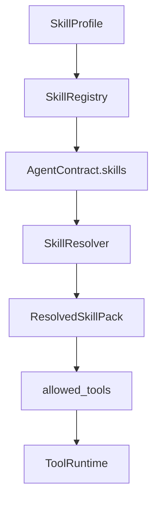

# Intergrax Skills

**Intergrax Skills** are declarative, reusable capability packages that compose tool requirements, prompt references, policy metadata, and skill dependencies into an agent’s effective capability set.

## Why it matters

Without Skills:

- agent authors copy tool ID lists by hand,
- prompt and policy dependencies drift between agents,
- capability composition is not reusable,
- dependency resolution is manual,
- plugin packs are hard to ship consistently,
- agent capability declarations lack one typed contract,
- the host cannot centrally control which capability packs are available.

Skills address this through `SkillManifest`, catalog + runtime registry, `SkillProfile`, `SkillResolver`, transitive `requires_skills`, merge into `AgentContract`, plugin/import paths, and environment consistency checks.

> [!NOTE]
> **Maturity boundary:** SK-EXP through SK-EXP5 and the first-party catalog are **shipped and gate-tested** (**153** skills · **43** bundles - authoritative gate/register count; plan header drift tracked as [`AUDIT-20260818-SKILLS-06`](../../audit_results/2026-08-18/SKILLS.md)). That proves composition scale on the harness path - **not** universal production qualification, not end-to-end prompt/policy bridge consumption on every host, not permission to bypass `ToolRuntime` or Governance, and not closure of Protocol v2 authority/version/provenance gaps - see [Protocol v2 skills target invariants](#protocol-v2-skills-target-invariants-2026-08-18) and [Current maturity](#current-maturity).

**Primary audience:** Principal / Staff engineers, harness integrators, and extension authors wiring `SkillProfile`, plugins, and agent skill declarations - after the platform overview in the root README.

## At a glance

| Concern | Summary |
| -------- | -------- |
| **Responsibility** | Declarative capability composition - tool IDs, prompt refs, policy fragments, dependencies |
| **Skill contract** | `SkillManifest` - stable `skill_id`, version, `tool_ids`, metadata |
| **Host availability** | `SkillProfile` - which bundles/skills the host enables |
| **Agent declaration** | `AgentContract.skills[]` - manifest objects the agent requires |
| **Resolution time** | Agent bind / registration (`AgentRegistry.register`) - not LLM-invoked |
| **Resolver** | `SkillResolver` - deterministic registry lookup, no LLM |
| **Dependencies** | `requires_skills` - transitive expansion, cycle rejection |
| **Tool requirements** | Union of resolved `tool_ids` → `AgentContract.allowed_tools` |
| **Prompt refs** | `prompt_instruction_ids` - SK-BRIDGE.1 helper shipped; **not** universal runtime consumption |
| **Policy refs** | `policy_fragment_id` - SK-BRIDGE.2 helper shipped; **not** universal runtime merge |
| **Risk metadata** | Per-skill `risk_tier`; pack uses effective max tier |
| **Dynamic selection** | Optional AHI hook - `RECOMMEND` proposals from profile or default candidate bundles; does not auto-enable |
| **Plugins** | `SkillPlugin` → catalog → `SkillProfile` → registry |
| **External import** | Cursor `SKILL.md` / LangGraph pack → validated manifest → explicit registry attach |
| **Tools relation** | Skills **compose** `tool_ids`; Tools **execute** via `ToolRuntime` |
| **Agent relation** | Agent declares Skills; Skill is not a mini-agent |
| **Integrations relation** | Skill → Tool → Integration - no direct vendor SDK dependency |
| **CodeCraft relation** | Skills may include `codecraft.*` tool IDs; CodeCraft owns codegen lifecycle |
| **Catalog scale** | Gate-tested **153** skills · **43** shipped bundles |
| **Maturity** | Four-axis statement in [Current maturity](#current-maturity) |

## Flagship architecture visual

<a href="assets/fullsize/skill-resolution-boundary.md">
<picture>
  <source media="(prefers-color-scheme: dark)" srcset="assets/skill-resolution-boundary-dark.svg">
  <source media="(prefers-color-scheme: light)" srcset="assets/skill-resolution-boundary-light.svg">
  
</picture>
</a>

**Mental model:**

```text
SkillProfile
    ↓
SkillRegistry
    ↓
AgentContract.skills[]
    ↓
SkillResolver
    ↓
ResolvedSkillPack
   ├── tool_ids
   ├── prompt refs
   ├── policy refs
   └── risk / dependencies
    ↓
AgentContract.allowed_tools
    ↓
ToolProfile / runtime policy
    ↓
ToolRuntime
```

> **Skills compose capabilities. Tools execute actions.**

## How it works

1. **Catalog bootstrap** - shipped and plugin bundles register `SkillManifest` rows into `SkillCatalog`.
2. **Host enablement** - Tier-3 `SkillProfile` selects which bundles enter the runtime `SkillRegistry`.
3. **Agent declaration** - `AgentContract.skills[]` lists required `SkillManifest` objects (not string IDs alone at the contract boundary).
4. **Resolve** - `SkillResolver` expands `requires_skills`, merges `tool_ids`, prompt refs, policy refs, and risk metadata into `ResolvedSkillPack`.
5. **Contract merge** - `resolve_contract_tools()` unions skill tools with `extra_tools` and **replaces** `allowed_tools`.
6. **Environment narrow** - `ToolProfile`, `RuntimePolicyBundle`, and Governance intersect what may actually execute.
7. **Execute** - only resolved, policy-allowed tools run through `ToolRuntime`.



**Rule:** Skills are **not** invoked by the LLM. The runtime resolves them at agent bind time.

## Skill ≠ Tool ≠ Agent ≠ Integration

| Concept | Meaning |
| ------- | ------- |
| **Integration** | Backend/vendor connection |
| **Tool** | Concrete executable capability (`tool_id` via `ToolRuntime`) |
| **Skill** | Reusable capability package - requirements, not execution |
| **Agent** | Runtime decision-making module using composed capabilities |

**Example:**

```text
Jira Integration
  → jira.search_tasks / jira.add_comment Tools
  → issue_triage Skill
  → Support Agent
```

A Skill does **not** execute backend calls, install permissions, or bypass `ToolRuntime`.

## SkillCatalog vs SkillRegistry vs SkillProfile

Do not collapse these layers:

```text
SkillCatalog
  → all registered bundle metadata (bootstrap / plugins)

SkillProfile
  → which bundles/skills the host enables for this environment

SkillRegistry
  → runtime-visible skill_id → RegisteredSkill lookup set
```

| Layer | Role |
| ----- | ---- |
| **SkillCatalog** | Process-wide bundle metadata (`register_skill_bundle`, `iter_bundles`) |
| **SkillProfile** | Host policy - `enabled_bundles`, `enabled`, `register_all_catalog_bundles` |
| **SkillRegistry** | Runtime lookup used by `SkillResolver` and validation |

## AgentContract.skills and allowed_tools

- Agents declare **`SkillManifest` objects** on `AgentContract.skills[]`.
- `allowed_tools` is a **derived output**, not independent authority.
- `extra_tools` may add `ToolContract` refs beyond the skill union.
- Resolution happens at **`AgentRegistry.register`** when `skill_registry` is provided.

Canonical merge (`resolve_contract_tools()`):

```text
AgentContract.skills
+ extra_tools
    ↓
resolve_contract_tools()
    ↓
AgentContract.allowed_tools   (replaces pre-declared author list)
```

Pre-declared `allowed_tools` on the author contract are **not** preserved. Environment intersection happens later via `ToolProfile` / `ToolAccessPolicy`.

## SkillResolver and ResolvedSkillPack

`SkillResolver` performs **pure registry lookups** - deterministic, **no LLM calls**.

```text
ResolvedSkillPack
├── resolved_skills    (immutable ResolvedSkillRef evidence, deps-first order)
├── skill_ids          (projection from resolved_skills)
├── tool_ids
├── prompt_instruction_ids
├── policy_fragment_ids
├── risk_tier          (max tier across merged skills)
└── snapshot_digest    (deterministic sha256 identity over resolved evidence)
```

Each `ResolvedSkillRef` records:

```text
ResolvedSkillRef
├── skill_id
├── version
├── qualified_id
├── resolution_mode    (PINNED | MATERIALIZED)
└── role               (ROOT | TRANSITIVE)
```

| Behavior | Detail |
| -------- | ------ |
| `requires_skills` | Topological expansion; cycle → `SkillResolutionError` |
| Tool validation | When `tool_registry` provided, every `tool_id` must exist |
| Unknown skill | `SkillResolutionError` at resolve / validate |
| Authority | Resolver **composes contracts**; it does not make autonomous policy decisions |
| Root version identity | **Agent-declared `SkillManifest` roots are PINNED** — `skill_id` + `version` must equal the materialized `SkillRegistry` manifest |
| Transitive `requires_skills` | **MATERIALIZED** — logical `skill_id` resolves to the registry materialized version; exact version captured in `resolved_skills` |
| Root/transitive conflict | Fail closed when a pinned root version disagrees with registry materialization reachable via the graph |
| Provenance retention | `AgentRegistry.register()` stores immutable `ResolvedSkillPack` via `get_resolved_skill_pack(agent_id)`; snapshots do not auto-refresh after `register_or_replace()` |

## requires_skills

```text
advanced_skill
  → requires base_a
  → requires base_b
```

The resolver expands transitively, orders dependencies before parents, and rejects cycles. This is **manifest composition**, not runtime recursive execution of Skills.

## Skill does not grant execution permission

```text
Skill requires tool_ids
       ↓
resolved allowed_tools
       ↓
ToolProfile / environment availability
       ↓
runtime policy / Governance
       ↓
ToolRuntime
```

> **A Skill can require a Tool; it cannot bypass ToolRuntime or Governance.**

**Invariant:** skill-required `tool_ids` must be ⊆ host `ToolProfile` availability; Tier-3 composition validates requirements via `assert_skill_tool_requirements_for_profile()` and fails closed with actionable diagnostics when not (`skills/registry/tool_requirements.py`).

## Prompt and policy bridges (current as-built)

| Bridge | Helper | Runtime wiring |
| ------ | ------ | -------------- |
| **SK-BRIDGE.1** | `skill_prompt_metadata(pack)` | **Helper only** - no production call sites outside unit tests; agents typically wire prompts in UAEP steps or Prompt Registry explicitly |
| **SK-BRIDGE.2** | `merge_skill_policy_fragments(bundle, pack)` | **Helper only** - not merged universally into every host `RuntimePolicyBundle` path |

Declare `prompt_instruction_ids` and `policy_fragment_id` for governance and traceability. Where bridges are not wired, consume prompts and policy through explicit agent/host paths. Skill policy metadata **feeds** Governance where wired; it does **not** replace Governance.

## Risk tier

Each `SkillManifest` may declare `risk_tier` (`low` · `medium` · `high` · `critical`). `ResolvedSkillPack` uses the **maximum** tier across merged skills. Risk metadata informs policy and qualification; it does **not** itself execute denial.

## Dynamic skill selection

Optional AHI hook (AUDIT-IDEAL-12.2): `resolve_skill_selection_hook()` + `SkillSelectionEngine`.

```text
explicit SkillProfile.enabled_bundles
        ↓
candidate set
        ┐
        │
empty enabled_bundles
        ↓
default candidates (rag, workspace, memory)
        ┘
        ↓
SkillSelectionEngine (when adaptive ROUTING_TUNING enabled)
        ↓
RECOMMEND proposal (AdaptationProposalCandidate / ProfileVersionDraft)
        ↓
no automatic Skill enablement / permission grant
```

| Property | Semantics |
| -------- | --------- |
| **Candidate bundles** | `SkillProfile.enabled_bundles` when non-empty; when empty, `resolve_skill_selection_hook()` falls back to `("rag", "workspace", "memory")` - fallback candidates are **not** implied host-enabled |
| **Default** | **Off** unless product profile + adaptive profile enabled + `ROUTING_TUNING` loop enabled |
| **Authority** | `RECOMMEND` - emits `AdaptationProposalCandidate` / `ProfileVersionDraft`; does not register, enable, install, authorize, or execute Skill bundles |
| **Behavior** | Rule-based bundle recommendation from task-class utility signals |

> **Recommendations do not automatically enable Skills** - host/runtime enablement and policy boundaries still apply before a capability becomes usable. Selection is not installation or permission expansion.

**Known limitation:** strict "dynamic selection can only ever propose explicitly `SkillProfile.enabled_bundles`" is **not** the current invariant - empty profiles use default candidate bundles. Tighter bounded-candidate semantics, if desired, is a separate AHI/Skills implementation decision (not prescribed here).

## Plugin model and external import

```text
external package
  → SkillPlugin (entry point intergrax.skills)
  → SkillCatalog
  → SkillProfile enablement
  → SkillRegistry
```

External Cursor `SKILL.md`:

```text
external SKILL.md
  → import_cursor_skill_file()
  → validated SkillManifest
  → SkillRegistry.register()   (explicit - not automatic catalog/global enablement)
```

LangGraph-compatible JSON packs map through `LangGraphSkillPackImporter` (AUDIT-IDEAL-12.1) - an import surface, not the conceptual center of Skills.

Invalid imports fail without partial attach (`CursorSkillImportError` / `LangGraphSkillImportError`).

## Relationship to Intergrax

| Neighbor | Relationship |
| -------- | ------------- |
| [**Tools**](TOOLS.md) | Skills compose `tool_ids`; Tools own execution, validation, policy, trace |
| [**Agent Contracts**](AGENT_CONTRACTS_AND_ASSEMBLY.md) | `AgentContract.skills[]` input; `allowed_tools` derived output |
| [**Integrations**](INTEGRATIONS.md) | Skill → Tool → Integration; Skills should not depend on vendor SDKs directly |
| [**CodeCraft**](CODE_CRAFT.md) | Skills may reference `codecraft.*` tools; CodeCraft owns generated-code lifecycle |
| [**Governed Execution**](GOVERNED_EXECUTION.md) | Skill may contribute policy fragments where wired; Governance owns allow/deny/HITL |
| [**Adaptive Harness Intelligence**](../maintainers/plans/ADAPTIVE_HARNESS_INTELLIGENCE.md) | Dynamic skill selection hook (optional recommendations) |

## Catalog scale and qualification boundary

Gate-tested shipped catalog: **153** skills across **43** first-party bundles (`SHIPPED_SKILL_PLUGINS`, `test_sk_exp_skill_bundles.py`).

```text
many shipped Skills
≠
production qualification
```

Catalog size proves composition-model scale - not P4/E4 platform maturity.

## Current implementation state

| Area | State |
| ---- | ----- |
| SK-EXP … SK-EXP5 | **Done** - catalog expansion shipped |
| Registry / resolver / contract merge | **Done** - bind-time resolution |
| Skill tool requirement validation | **Done** - `assert_skill_tool_requirements_for_profile` in Tier-3 `wire_application_environment` |
| Plugin path + external import | **Done** |
| AUDIT-IDEAL-12.1 LangGraph import | **Done** |
| AUDIT-IDEAL-12.2 dynamic selection hook | **Done** - optional recommend-only hook |
| SK-BRIDGE.1 prompt metadata | **Partial** - helper shipped, not end-to-end on all hosts |
| SK-BRIDGE.2 policy merge | **Partial** - helper shipped, not end-to-end on all hosts |

## Current maturity

Architecture maturity: **A4**  
Implementation maturity: **I4**  
Production readiness: **P2**  
Evidence maturity: **E3**

- **A4** - Clear Skill / Tool / Agent / Integration boundary; stable `SkillManifest`; catalog vs registry vs profile split; deterministic resolver; dependency semantics; plugin/import model; adjacent-domain boundaries validated.
- **I4** - Resolver, registry/profile wiring, contract merge, tool validation, plugin/import, dynamic selection hook, conformance/gates. Not I5 - SK-BRIDGE helpers are not universally consumed end-to-end; not every host path merges skill policy into runtime bundles automatically.
- **P2** - Harness and lab qualification on core resolution paths; not representative customer production qualification or runbook-backed operations (not P4).
- **E3** - Unit/gate tests (resolver, cycles, missing tools, contract merge, profile/registry, plugin/import, usage-docs gate, catalog counts). No dedicated Skills public proof route in [`PROOFS.md`](../proofs/PROOFS.md).

### Catalog-proven vs production-qualified

| Catalog-proven (representative) | Not claimed as universal production qualification |
| ----------------------------- | ------------------------------------------------- |
| 153-skill / 43-bundle gate-tested catalog | Every skill bundle customer-qualified |
| Deterministic `SkillResolver` at agent bind | Universal prompt/policy bridge on every host |
| Plugin + external import paths | Autonomous permission expansion via dynamic selection |
| `SKILL_RESOLVED` trace events | End-to-end skill lifecycle public proof (E4/E5) |

## Evidence / proof

| Evidence class | What exists | What it does not prove |
| -------------- | ----------- | ---------------------- |
| Architecture | This hub, skill catalog satellite, author guides | Production operation |
| Unit / gate | Resolver, cycles, missing tools, contract merge, profile/registry, plugin/import, `test_skill_usage_docs.py`, catalog count gate | Universal bridge wiring |
| Integration | Agent registration, environment wiring, `ToolProfile` consistency, dynamic selection hook gate | Dedicated public Skills proof |
| Public proof | **None** dedicated in [`PROOFS.md`](../proofs/PROOFS.md) | Full-harness Skills lifecycle at product scale |
| Production / customer | **None** cited for full domain qualification | Not E5 |

**Platform audit:** [`docs/audit_results/AUDIT_PROTOCOL.md`](../../audit_results/AUDIT_PROTOCOL.md).

### Protocol v2 skills target invariants (2026-08-18)

Accepted Protocol v2 audit layer [`SKILLS`](../../audit_results/2026-08-18/SKILLS.md) (**FAIL**, 6 ACCEPTED findings). Canonical evidence: [`docs/audit_results/2026-08-18/`](../../audit_results/2026-08-18/README.md). Prior SK-EXP / SK-BRIDGE **Done** rows remain historical delivery facts - not rewritten. Target state only:

1. **Fail-closed host Skill authority** - production-shaped registration never interprets missing host `SkillRegistry` / `SkillProfile` projection as enable-all; explicit host registry/profile required; any all-catalog laboratory/bootstrap mode must be explicit and named, not an ambient `AgentRegistry` fallback ([`AUDIT-20260818-SKILLS-01`](../../audit_results/2026-08-18/SKILLS.md)).
2. **Explicit Skill version identity** - choose one model: (A) version-pinned references resolve exact declared version, or (B) `AgentContract` declares logical skill identity and runtime/profile projection explicitly owns resolved version; no ambiguous id-only resolution against registry current version ([`AUDIT-20260818-SKILLS-02`](../../audit_results/2026-08-18/SKILLS.md)).
3. **Non-expanding ToolProfile authority** - skill-required tools validate against host `ToolProfile` availability; requirements ⊆ availability or fail static validation; no silent append to `ToolProfile.enabled`; coordinate with TOOLS monotonic-authority invariant ([`AUDIT-20260818-SKILLS-03`](../../audit_results/2026-08-18/SKILLS.md)).
4. **Canonical ResolvedSkillPack provenance** - resolved capability/risk snapshot has one durable or immutable runtime owner for execution/audit; preserve or reference canonical pack - do not duplicate Skill graph across structures ([`AUDIT-20260818-SKILLS-04`](../../audit_results/2026-08-18/SKILLS.md)).
5. **Fail-fast SkillProfile references** - explicit enabled skill/bundle ids unknown to catalog/registry fail environment validation; no silent ignore ([`AUDIT-20260818-SKILLS-05`](../../audit_results/2026-08-18/SKILLS.md)).
6. **Single catalog-count source of truth** - current skill/bundle counts derive from one authoritative gate/register; architecture and plan must not publish conflicting current counts ([`AUDIT-20260818-SKILLS-06`](../../audit_results/2026-08-18/SKILLS.md)).

Skill / Tool / Agent / Integration ownership unchanged. Skills remain declarative composition - not a second execution runtime. SK-BRIDGE prompt/policy helpers remain **partial** on universal host consumption.

Remediation: **SKILLS-AUTHORITY-INTEGRITY** (01, 03, 05), **SKILLS-IDENTITY-PROVENANCE** (02, 04), **SKILLS-EVIDENCE-SYNC** (06) in [plan](../maintainers/plans/SKILLS.md). **Not implemented** by audit persistence.

## Go deeper

| Depth | Route |
| ----- | ----- |
| Engineering canon | [Below](#engineering-canon) |
| Skill catalog inventory | [`satellites/SKILLS_skill_catalog.md`](satellites/SKILLS_skill_catalog.md) |
| Implementation plan | [`maintainers/plans/SKILLS.md`](../maintainers/plans/SKILLS.md) |
| Agent creation | [`guides/AGENT_CREATION_GUIDE.md`](../technical/guides/AGENT_CREATION_GUIDE.md) **Appendix J** |
| Extension author | [`EXTENSION_AUTHOR_GUIDE.md`](../technical/guides/EXTENSION_AUTHOR_GUIDE.md) §4 |
| Tools | [`TOOLS.md`](TOOLS.md) |
| Agent Contracts | [`AGENT_CONTRACTS_AND_ASSEMBLY.md`](AGENT_CONTRACTS_AND_ASSEMBLY.md) |
| Integrations | [`INTEGRATIONS.md`](INTEGRATIONS.md) |
| CodeCraft | [`CODE_CRAFT.md`](CODE_CRAFT.md) |
| Governance | [`GOVERNED_EXECUTION.md`](GOVERNED_EXECUTION.md) |

---

**Status:** Canonical architecture (domain pair 1:1)  
**Last updated:** 2026-08-20 - Protocol v2 SKILLS audit target invariants; gate-tested **153** skills · **43** bundles (authoritative register); SK-BRIDGE helpers partial  
**Hub:** [`intergrax_runtime_architecture.md`](intergrax_runtime_architecture.md)  
**Plan (1:1):** [`plan/SKILLS.md`](../maintainers/plans/SKILLS.md)  
**Target:** [`IDEAL_HARNESS_AI_ARCHITECTURE.md`](../technical/guides/IDEAL_HARNESS_AI_ARCHITECTURE.md)  
**Author map:** [`guides/AGENT_CREATION_GUIDE.md`](../technical/guides/AGENT_CREATION_GUIDE.md) **Appendix J**  
**Audit layers:** 12  
**Platform audit:** [`docs/audit_results/AUDIT_PROTOCOL.md`](../../audit_results/AUDIT_PROTOCOL.md)

## Cursor read scope (token budget)

**Do not read this entire file in one session** (SKILLS canon).

- **Implement / audit default:** skill selection hook + registry (hub). Catalog: [`satellites/SKILLS_skill_catalog.md`](satellites/SKILLS_skill_catalog.md).
- **Use** table of contents below - `Read` with offset/limit per §.
- **Plan hub:** [`plan/SKILLS.md`](../maintainers/plans/SKILLS.md) (scoped §6 only).
- **Platform audit:** [`docs/audit_results/AUDIT_PROTOCOL.md`](../../audit_results/AUDIT_PROTOCOL.md).
- **Max reads:** at most **one** file >5k tokens per session unless RESUME cites more.

## Architecture satellites (read on demand)

Large § blocks moved out of the architecture hub to reduce Cursor context use.
Load **only** the satellite matching your task or cited §.

| Satellite | Contents |
|-----------|----------|
| [`satellites/SKILLS_skill_catalog.md`](satellites/SKILLS_skill_catalog.md) | skill catalog |

> **Cursor context budget:** read hub read-scope block + **at most one** satellite per session.

---

## Engineering canon

### Public invariant

```text
A Skill may compose capabilities.
It does not execute them.
It does not install permissions.
It does not bypass ToolRuntime.
```

### Four-layer stack

```text
Integration  →  vendor backend (Postgres, Bing, Jira)
Tool         →  atomic LLM/MCP operation (rag.retrieve)
Skill        →  tool_ids + prompt refs + policy fragment
Agent        →  UAEP module with skills[] on AgentContract
```

Skills may compose `codecraft.*` tools (e.g. `codecraft.ephemeral_builder`) - skills **compose** bundles; CodeCraft **orchestrates** ephemeral codegen under Harness governance ([`CODE_CRAFT.md`](CODE_CRAFT.md#codecraft-safety-boundary)). Skills **MUST NOT** implement agent-local craft loops or bypass ToolRuntime for generated code execution.

**Unified RAG path (R-Context.4 - Done):** Prefer catalog tool `rag.retrieve` in resolved `allowed_tools` / `tool_ids`. `RuntimeToolGateway` capability plans use `tool_ids` first; legal bridge passes `tool_ids` only. `LegalToolPlan.use_rag` remains for LLM structured output and syncs to `tool_ids` via Pydantic validator - not passed to Nexus. Legacy metadata `use_rag` still honored in `ContextBuilder` for older callers.

### Skill engine - two registry layers

Intergrax mirrors the tool catalog pattern: a **static catalog** (bootstrap metadata) and a **runtime registry** (lookup by `skill_id`).

```text
Tier-0 catalog (process-wide, idempotent bootstrap)
  register_default_skills() / SkillPlugin / EP intergrax.skills
        → SkillCatalog (_CATALOG: SkillBundleEntry per bundle_id)
        → register_skill_bundle(entry)

Tier-3 / agent runtime
  SkillProfile (enabled_bundles | enabled | register_all_catalog_bundles)
        → build_registry_from_profile(profile)
        → SkillRegistry (_skills: skill_id → RegisteredSkill)

Agent bind time (Tier-1)
  AgentContract.skills[] + extra_tools[]
        → SkillResolver.resolve_skills()
        → resolve_contract_tools()
        → AgentContract.allowed_tools (resolved)
        → SKILL_RESOLVED event (optional)
```

| Layer | Module | Responsibility |
|-------|--------|----------------|
| Catalog | `skills/registry/catalog.py` | Bundle metadata, `iter_bundles()`, `list_catalog_skill_ids()` |
| Bootstrap | `skills/registry/bootstrap.py` | `register_default_skills(bundle_ids=…)` - shipped plugins |
| Plugin wire | `skills/registry/plugin_register.py` | `register_skill_plugin()` → catalog + register fn |
| Runtime registry | `skills/registry/runtime.py` | `SkillRegistry.register(manifest)` |
| Profile factory | `skills/registry/factory.py` | `build_registry_from_profile(SkillProfile)` |
| Resolver | `skills/resolver.py` | `SkillResolver` / `SkillResolverProtocol` → `ResolvedSkillPack` |
| Contract merge | `skills/integration/contract_resolution.py` | `resolve_contract_tools()` |
| Agent bind | `runtime/registry/agent_registry.py` | Merge skills at `register()` |
| Tier-3 wiring | `applications/_shared/skill_wiring.py` | `build_application_skill_wiring()` |
| Tool requirement validation | `skills/registry/tool_requirements.py` | `resolve_skill_tool_requirements`, `assert_skill_tool_requirements_satisfied` |
| Composition guard | `applications/_shared/skill_tool_profile.py` | `assert_skill_tool_requirements_for_profile()` |
| Runtime snapshot | `applications/_shared/catalog_runtime_bridge.py` | `RuntimeConfig.skill_profile` (TS-1) |
| Prompt/policy bridge | `applications/_shared/skill_bridge_wiring.py` | `skill_prompt_metadata`, `merge_skill_policy_fragments` (helpers) |
| Dynamic selection | `applications/_shared/skill_selection_wiring.py` | `resolve_skill_selection_hook()` |

**Shipped bundles (43):** `agent`, `billing`, `browser`, `cache`, `catalog`, `cloud_platform`, `code`, `codecraft`, `collaboration`, `context`, `cost`, `crm`, `data`, `dev`, `eval`, `filesystem`, `gitlab`, `graph`, `harness`, `health`, `hitl`, `http`, `identity`, `interaction`, `jira`, `knowledge`, `legal`, `local`, `memory`, `message_bus`, `metrics`, `ml`, `modality`, `notify`, `openai`, `ops`, `platform`, `rag`, `research`, `sandbox`, `storage`, `vector_store`, `workspace` - registered via `skills/registry/shipped_plugins.py`.  
`knowledge` remains **BETA**; all other shipped bundles **STABLE**.

---

### Tier-3 host pipeline

Canonical entry: `wire_application_environment()` (`applications/_shared/environment_wiring.py`).

```text
wire_application_environment(manifest, env)
  ├── bootstrap_application_integration_catalog()
  ├── tool_profile = tool_profile_with_sandbox(env)
  ├── build_application_skill_wiring(env.skill_profile)      → SkillRegistry
  ├── assert_skill_tool_requirements_for_profile(tool_profile, env.skill_profile)
  ├── build_application_tool_wiring(tool_profile, …)     → ToolRegistry
  ├── wire_policy_bundle(env)
  ├── resolve_prompt_registry(env.prompt_profile)
  ├── ApplicationBuildContext (profiles + registries)
  ├── EnvironmentSkillToolConsistencyCheck (roster ⊆ environment)
  └── catalog_runtime_bridge → RuntimeConfig.skill_profile
```

**Rule:** enable skills on `ApplicationEnvironmentProfile.skill_profile` - do not create agent-local skill registries. See Appendix J.

**Presets** (`skill_wiring.py`, SK-PRESET.1):

| Helper | `enabled_bundles` |
|--------|-------------------|
| `harness_platform_skill_profile()` | `harness` |
| `lab_skill_profile()` | `harness`, `legal`, `research`, `rag`, `workspace`, `memory`, `knowledge` |
| `research_skill_profile()` | `research`, `rag`, `browser` |
| `legal_skill_profile()` | `legal`, `rag`, `knowledge`, `workspace` |
| `knowledge_skill_profile()` | `knowledge` |
| `rag_skill_profile()` | `rag` |
| `ops_skill_profile()` | `ops`, `dev`, `workspace` |
| `platform_skill_profile()` | `platform`, `rag`, `memory`, `research` |
| `lkw_skill_profile()` | `rag`, `workspace`, `memory`, `knowledge` |
| `dispute_skill_profile()` | `legal`, `rag`, `memory`, `research` |

---

### SkillManifest

| Field | Purpose |
|-------|---------|
| `skill_id` | Stable id (`legal.contract_review`) |
| `version` | Semver string |
| `description` | Human + planner readable |
| `tool_ids` | Required catalog tools (unique within manifest) |
| `prompt_instruction_ids` | Prompt Registry refs (not inline prompt blobs) |
| `policy_fragment_id` | Optional governance fragment id |
| `risk_tier` | `low` · `medium` · `high` · `critical` |
| `tags` | Discovery / governance labels |
| `requires_skills` | Other `skill_id`s merged **before** this skill (transitive; cycle → error) |

Package: `intergrax/skills/core/contracts.py`  
Plugin protocol: `intergrax/skills/core/plugin.py` (`SkillPlugin`, entry point `intergrax.skills`)

---

### SkillResolver and ResolvedSkillPack (engineering)

```python
from intergrax.skills.resolver import SkillResolver, ResolvedSkillPack

pack: ResolvedSkillPack = SkillResolver(skill_registry, tool_registry).resolve(
    ["research.literature_scan"]
)
# pack.skill_ids      - expanded order (requires_skills first)
# pack.tool_ids       - frozenset union
# pack.prompt_instruction_ids
# pack.policy_fragment_ids
# pack.risk_tier      - max tier across merged skills
```

| Behavior | Detail |
|----------|--------|
| `requires_skills` | Topological expansion; cycle raises `SkillResolutionError` |
| Tool validation | When `tool_registry` is provided, every `tool_id` must exist |
| Unknown skill | `SkillResolutionError` at resolve / validate |
| `merged_allowed_tools(extra)` | Union `pack.tool_ids` with `extra_tools` tool_ids |

Typed contract: `SkillResolverProtocol` (Phase TS-3).

---

### Agent composition

Agents declare **manifest objects**, not string ids:

```python
from intergrax.contracts.agent_contract_meta import AgentContract
from intergrax.skills.providers.legal.manifests import LEGAL_CONTRACT_REVIEW

AgentContract(
    id="legal",
    skills=[LEGAL_CONTRACT_REVIEW],
    extra_tools=[],  # optional ToolContract refs beyond skill union
    # allowed_tools is OUTPUT - set by AgentRegistry.register
)
```

Register with skill + tool validation:

```python
registry.register(
    agent,
    skill_registry=skill_registry,
    tool_registry=tool_registry,
    event_bus=event_bus,  # optional → SKILL_RESOLVED
)
```

#### Resolution semantics (canonical)

`resolve_contract_tools()` (`skills/integration/contract_resolution.py`):

1. Validate each `SkillManifest` in `contract.skills` exists in `SkillRegistry`.
2. `SkillResolver.resolve_skills(contract.skills)` - expand `requires_skills`, merge metadata.
3. Union skill `tool_ids` with `extra_tools[].tool_id`.
4. **Replace** `contract.allowed_tools` with the merged list (pre-declared `allowed_tools` on the author contract are **not** preserved).

Environment intersection happens later via `ToolProfile` / `ToolAccessPolicy` - not inside the resolver.

**Current as-built:** if `skill_registry` is omitted at register time, `AgentRegistry` bootstraps all catalog bundles (`register_all_catalog_bundles=True`) - **target invariant:** fail closed on canonical production path; see [Protocol v2 skills target invariants](#protocol-v2-skills-target-invariants-2026-08-18).

---

### Runtime effects - implemented today vs manifest fields

| Output | Status | Consumer |
|--------|--------|----------|
| `allowed_tools` merge | **Done** | `AgentRegistry.register`, conformance checks |
| Skill tool requirement validation | **Done** | Tier-3 `wire_application_environment` (`assert_skill_tool_requirements_for_profile`) |
| `SKILL_RESOLVED` trace | **Done** | `context_skill_recording.record_skill_resolved` |
| `SKILL_IMPORT_FAILED` trace | **Done** | `import_cursor_skill_file(..., event_bus=…)` |
| Capability graph nodes | **Done** | `capability_graph.py` (prompt + policy edges) |
| `skill.resolve` catalog tool | **Done** | Diagnostic / planner introspection (`TOOLS.md`) |
| `prompt_instruction_ids` → runtime context | **Partial** | SK-BRIDGE.1 helper - not universal host consumption |
| `policy_fragment_id` → `RuntimePolicyBundle` | **Partial** | SK-BRIDGE.2 helper - not universal host merge |

---

### Third-party skill extension (developer path)

**Task:** PLATFORM-PLUGIN-DOCS-3 · **Quickstart:** [`EXTENSION_AUTHOR_GUIDE.md`](../technical/guides/EXTENSION_AUTHOR_GUIDE.md) §4 · §16.6–§16.7 · **Example:** `intergrax/skills/examples/custom_pack/` (copyable in-repo; build your own wheel for distribution)

#### Public contract

| Item | Value |
|------|-------|
| Protocol | `SkillPlugin` (`intergrax.skills.core.plugin`) |
| Bundle manifest | `SkillBundleManifest` |
| Skill rows | `SkillManifest` (`intergrax.skills.core.contracts`) |
| Register | `register_skill_plugin()` |
| EP group | `intergrax.skills` |
| Enablement | `SkillProfile` |
| Resolution | `SkillResolver(skill_registry, tool_registry)` |

No `SkillWiringContext` - DI flows through tools at invoke time.

#### Runtime path

```text
SkillProfile → build_registry_from_profile → SkillRegistry
  → assert_skill_tool_requirements_for_profile (Tier-3 composition guard)
  → AgentContract.skills[] → SkillResolver.resolve_skills()
  → ResolvedSkillPack.tool_ids → AgentContract.allowed_tools
```

#### Dependencies (`requires_skills`)

Transitive expansion before parent skill; cycles raise `SkillResolutionError`. When `tool_registry` is provided, missing `tool_id` raises `SkillResolutionError`.

#### Delivery modes

| Mode | Registration |
|------|--------------|
| External package | EP `intergrax.skills` + discovery + `SkillProfile` |
| Host-embedded | `register_skill_plugin(cls)` + `SkillProfile` |

#### Failure and troubleshooting (summary)

| Issue | Error / signal |
|-------|----------------|
| Duplicate bundle | `ValueError` from `register_skill_bundle` |
| Unknown skill | `SkillResolutionError` |
| Missing tool | `SkillResolutionError` (tool_id not in registry) |
| Bundle not enabled | Skill skipped by `SkillProfile` filter |
| EP discovery off | Bundle absent until explicit registration |
| Qualification | Host semantic gate |

Tests: `tests/unit/skills/test_external_skill_plugin.py`

---

### Registry bootstrap (standalone)

Mirror of tool catalog pattern:

```python
from intergrax.core.catalog_bootstrap import bootstrap_catalogs
from intergrax.skills.registry import SkillProfile, SkillRegistry, build_registry_from_profile

bootstrap_catalogs(register_shipped=True, skill_bundle_ids=("legal", "research"))
registry: SkillRegistry = build_registry_from_profile(
    SkillProfile(enabled_bundles=["legal", "research"])
)
```

External bundles: `SkillPlugin` + `register_skill_plugin()` or entry point `intergrax.skills`. See [`EXTENSION_AUTHOR_GUIDE.md`](../technical/guides/EXTENSION_AUTHOR_GUIDE.md).

---

### External skills (Cursor SKILL.md)

```python
from pathlib import Path

from intergrax.skills.importers.service import import_cursor_skill_file
from intergrax.skills.registry.runtime import SkillRegistry

manifest = import_cursor_skill_file(Path("path/to/SKILL.md"), event_bus=bus)
runtime = SkillRegistry()
runtime.register(manifest)  # does NOT add a catalog bundle - host must enable explicitly
```

Invalid files raise `CursorSkillImportError` - no partial attach. Failed imports with `event_bus` emit `SKILL_IMPORT_FAILED`.

Importer module: `skills/importers/cursor_skill_md.py` (`CursorSkillImporter`).

LangGraph packs: `skills/importers/langgraph_skill_pack.py` (`LangGraphSkillPackImporter`).

---

### Scaffold

```bash
python -m intergrax.scaffold new-skill legal.my_skill --domain legal
# alias: new-skill-bundle
```

Register with `register_skill_plugin(...)` or add the plugin class to `shipped_plugins.py`.

**Layout:**

```text
intergrax/skills/providers/<bundle>/
  manifests.py              # SkillManifest constants
  plugin.py                 # SkillPlugin
  bundle.py                 # register_skill_plugin() helper
  USAGE.md                  # bundle index (links to per-skill docs)
  <skill_id>/USAGE.md       # required per skill - Purpose, How it works, How to use, What you get
```

Every shipped `skill_id` **must** have a filled `intergrax/skills/providers/<bundle>/<skill_id>/USAGE.md` (English). Gate: `test_skill_usage_docs.py`.
