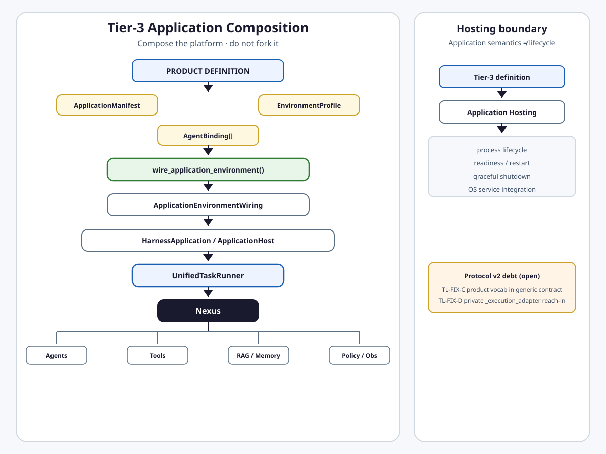

# Tier-3 Application Environment

**Intergrax Tier-3 Application Environment** is the product composition layer that declares an application's manifest, environment posture, agent bindings, and platform capability configuration while executing through canonical Harness runtime contracts.

> **Tier-3 composes the platform; it does not fork the platform.**

> **Application semantics ≠ hosting lifecycle.**

## Why it matters

Without this layer:

- every application assembles runtime differently,
- product code copies platform mechanisms instead of adopting them,
- HTTP, queue, MCP, and CLI entry points diverge onto different execution paths,
- manifest and environment profile responsibilities blur,
- hosting lifecycle leaks into application semantics,
- plugins are rediscovered per app,
- private platform-state reach-in becomes a normal integration pattern,
- product-specific vocabulary pollutes generic platform contracts.

Tier-3 solves this by keeping **one canonical composition path** from product definition to Nexus, with explicit boundaries to Hosting, Agents, Governance, Observability, Integrations, and Experimentation.

## Maturity boundary

> [!IMPORTANT]
> **Protocol v2 (2026-08-18) accepted two Tier-3 boundary defects that remain planned, not fixed:** **TL-FIX-C** (LKW-specific fields on generic `HostDeploymentProfile`) and **TL-FIX-D** (private `_execution_adapter` mutation in Legal and Dispute Sim hosts). Finding 05 (dynamic boundary guard scope) is owned by **TL-FIX-A** in [`PLATFORM_FOUNDATION`](PLATFORM_FOUNDATION.md) — not Tier-3 remediation. See [Current limitations](#current-limitations--protocol-v2).

> [!NOTE]
> Historical **L3 / Done** plan rows and AUDIT-IDEAL closeout labels describe harness delivery — **not** automatic universal product production qualification. Representative product proof exists for LKW ([`PROOFS.md`](../proofs/PROOFS.md)); other hosts vary.

**Primary audience:** Tier-3 application authors, principal engineers wiring host factories, and architects evaluating application vs platform ownership — after the platform overview in the root README.

## At a glance

| Concern | Summary |
| -------- | -------- |
| **Responsibility** | Product application definition, environment posture, agent roster, platform capability configuration |
| **Composition root** | `ApplicationEnvironmentProfile` — configures platform-owned mechanisms; does not implement them |
| **Canonical wiring** | `wire_application_environment()` → frozen `ApplicationEnvironmentWiring` |
| **Execution surface** | `UnifiedTaskRunner.run_task()` on supported intake paths → `NexusLoop` |
| **Agent roster** | `AgentBinding[]` — mount/config only; agent lifecycle owned by Agent layer |
| **Environment snapshot** | Immutable `EnvironmentSnapshot` on deploy/intake — request-bound, not durable history |
| **App hooks** | `ApplicationHost.on_hook` — task/domain reactions; distinct from Hosting lifecycle hooks |
| **Plugin boundary** | Applications consume admitted plugins; domain wiring discovers them |
| **Hosting boundary** | [`APPLICATION_HOSTING.md`](APPLICATION_HOSTING.md) owns process lifecycle — not application definition |
| **Protocol v2 debt** | TL-FIX-C · TL-FIX-D — **ACCEPTED / PLANNED** |
| **Maturity** | **A4 · I3 · P3 · E3** — see [Current maturity](#current-maturity) |
| **Go deeper** | [Engineering canon](#engineering-canon) · [extended depth satellite](satellites/TIER3_APPLICATION_ENVIRONMENT_extended_depth.md) · [production gates satellite](satellites/TIER3_APPLICATION_ENVIRONMENT_production_gates.md) · [plan](../maintainers/plans/TIER3_APPLICATION_ENVIRONMENT.md) |

## Flagship architecture visual

<a href="assets/fullsize/tier3-application-composition.md">
<picture>
  <source media="(prefers-color-scheme: dark)" srcset="assets/tier3-application-composition-dark.svg">
  <source media="(prefers-color-scheme: light)" srcset="assets/tier3-application-composition-light.svg">
  
</picture>
</a>

## Canonical composition flow

```text
product definition
      ↓
ApplicationManifest
      +
ApplicationEnvironmentProfile
      +
AgentBinding[]
      ↓
wire_application_environment()
      ↓
ApplicationEnvironmentWiring
      ↓
HarnessApplication / ApplicationHost
      ↓
UnifiedTaskRunner
      ↓
Nexus
      ↓
Agents / Tools / RAG / Memory / Policy / Observability
```

**Separate concern — hosting only:**

```text
Tier-3 application definition
      ↓
Application Hosting
      ↓
process lifecycle / readiness / restart / shutdown
```

1. Define product/application identity (`app_id`, ownership, route/env prefixes).
2. Build `ApplicationManifest` with roster entries.
3. Resolve `ApplicationEnvironmentProfile` (manifest field or lab/product defaults).
4. Attach typed `AgentBinding[]` with factories or mount helpers.
5. Resolve nested bundle fields / flat wire shims (`spec_version` 1.x compat).
6. Materialize `EnvironmentSnapshot` on deploy or task intake when wired.
7. Call `wire_application_environment(manifest, env, …)` — single domain wiring entry.
8. Build host facade via `build_harness_host_runtime()` or `HarnessApplication.build_*()`.
9. Route supported intake through `UnifiedTaskRunner.run_task()` (or `run_runtime_request`).
10. Execute through `NexusLoop` and platform domains.
11. Emit `ApplicationRunSummary` (Plane A) into Observability path when orchestration completes.
12. Optionally wrap with Application Hosting for continuous process lifecycle.

## Manifest vs profile vs hosting

| Concern | Owner |
| -------- | ------ |
| What the application **is** (identity, route, env prefix, roster declaration) | `ApplicationManifest` |
| How Harness **configures** capabilities for this host | `ApplicationEnvironmentProfile` |
| Agent roster mount / per-entry options | `AgentBinding` |
| Resolved runtime composition **output** | `ApplicationEnvironmentWiring` |
| Task execution author surface | `UnifiedTaskRunner` / `HarnessApplication` / host factory |
| Process lifecycle, readiness, restart, OS integration | [`Application Hosting`](APPLICATION_HOSTING.md) |

## Responsibility boundaries

### Tier-3 owns

- Declaring manifest, environment profile, bindings, interaction/workload posture.
- Selecting integration profiles, observability posture, budget **declarations**.
- Wiring through `wire_application_environment()` and public host factories.
- Application hooks (`ApplicationHost.on_hook`) for domain reactions.
- Consuming platform-admitted plugins and resolved wiring artifacts.

### Tier-3 does **not** own

| Neighbor | Boundary |
| -------- | -------- |
| **Application Hosting** | Process lifecycle, readiness, restart, shutdown — does not replace Manifest, Profile, `UnifiedTaskRunner`, or Nexus path |
| **Agents** | Agent contracts, cognition, tool behavior — Tier-3 composes/rosters only |
| **Governance** | Authorization decisions — application selects within allowed profiles; cannot weaken global policy |
| **Observability** | Execution evidence semantics — Tier-3 configures posture; no app-local trace authority |
| **Integrations** | Provider abstraction — Tier-3 selects profiles; no product-local vendor SDK wrappers when platform integration exists |
| **Experimentation** | Candidate config testing — Tier-3 defines actual composition; Hosting activates running service |

### Platform adopter invariant

```text
Tier-3 application  →  consumes public platform capabilities
Tier-3 application  ✗  duplicates universal platform mechanisms
```

Reusable infrastructure discovered during application work returns to the owning platform domain ([`INTERGRAX_ARCHITECTURE_PRINCIPLES.md`](INTERGRAX_ARCHITECTURE_PRINCIPLES.md) `PLATFORM-INV-001`, `PLATFORM-INV-002`, `PLATFORM-INV-004`).

## Public invariants

```text
Tier-3 composes the platform; it does not fork the platform.
Application semantics ≠ hosting lifecycle.
Application configuration ≠ authorization.
Applications consume admitted plugins; they do not rediscover them.
Plugin admission evidence ≠ production qualification.
Product-specific vocabulary belongs to product-owned configuration or typed extensions.
Tier-3 should use public typed composition APIs, not private platform-state mutation.
All supported intake surfaces should converge on the canonical task execution path.
```

## Current limitations — Protocol v2

Accepted audit: [`TIER_LAYER_BOUNDARIES`](../../audit_results/2026-08-18/TIER_LAYER_BOUNDARIES.md) findings **03–05** (2026-08-18). Remediation tracked in [plan](../maintainers/plans/TIER3_APPLICATION_ENVIRONMENT.md); **not implemented** by audit persistence.

### TL-FIX-C — product vocabulary in generic contract

**Status:** ACCEPTED / PLANNED · **not fixed**

Some generic Tier-3 profile surfaces still contain product-specific deployment vocabulary; accepted remediation will move those concerns to product-owned configuration or typed extensions.

| Field | Contract | Impacted product | Target ownership |
| ----- | -------- | ---------------- | ---------------- |
| `lkw_hybrid_daemon_enabled` | `HostDeploymentProfile` | Local Knowledge Workspace | Product-owned deployment config or typed extension |
| `lkw_daemon_bind_host` | `HostDeploymentProfile` | LKW hybrid daemon | Product-owned |
| `lkw_daemon_port` | `HostDeploymentProfile` | LKW hybrid daemon | Product-owned |
| `business_agents_deploy_enabled` | `HostDeploymentProfile` | LKW business agents deploy | Product-owned |

**Code:** `intergrax/applications/contracts/environment_profile/sub_profiles.py` (`HostDeploymentProfile`).

### TL-FIX-D — private composition reach-in

**Status:** ACCEPTED / PLANNED · **not fixed**

Some current product hosts still use private platform-state composition as a workaround; this is **not** the target public composition API and remediation is planned.

| Application | Path | Pattern |
| ----------- | ---- | ------- |
| `legal_application` | `applications/legal_application/host/factory.py` | `run_service._execution_adapter = queue_wiring.execution_adapter` |
| `dispute_sim_application` | `applications/dispute_sim_application/host/factory.py` | same private assignment |

**Cause:** `wire_optional_queue_execution` requires an existing `DefaultRunService` to build `QueuedNexusExecutionAdapter`; no public rebinding API on `DefaultRunService` today. **Not** all reference hosts use this pattern — LKW and lab hosts use `build_harness_host_runtime()` without documented reach-in.

### Finding 05 — dynamic boundary (Platform Foundation)

Tier-3 consumer code under top-level `applications/` is not in the current `check_harness_no_getattr.py` scan roots. **Target invariant:** dynamic boundary access must be explicit and mechanically governed. **Ownership:** **TL-FIX-A** in [`PLATFORM_FOUNDATION` plan](../maintainers/plans/PLATFORM_FOUNDATION.md) — do not treat as Tier-3-fixed.

<a id="protocol-v22-tier3-intake-target-invariants-2026-08-18"></a>

### Protocol v2.2 Tier-3 intake target invariants (2026-08-18)

Accepted [`INTERFACE_TASK_INTAKE`](../../audit_results/2026-08-18/INTERFACE_TASK_INTAKE.md) findings **01, 04, 06** (2026-08-18). Remediation **ACCEPTED / PLANNED** — **not implemented** by audit persistence.

1. Surface-specific external schemas/adapters are allowed at the edge.
2. They **MUST** converge into one canonical normalized intake contract before runtime `Task` execution semantics diverge.
3. `TaskEnvelope` is the current target canonical normalized intake contract; current implementation has incomplete adoption (**ITI-FIX-A**).
4. Typed SLA/risk/workspace/constraints semantics should remain typed canonical state after normalization; legacy flat metadata may remain only as bounded compatibility/serialization (**ITI-FIX-A** / finding 04).
5. Supported product interaction surfaces must reach the canonical execution runner, not production-mounted direct Nexus compatibility paths — cross-reference **ITI-FIX-C** in [`NEXUS_EXECUTION_FLOW`](NEXUS_EXECUTION_FLOW.md).
6. Streaming/async product intake parity requires real E2E proof. `streaming_intake_enabled=True` alone is not proof (**ITI-FIX-D**).

Historical AUDIT-IDEAL Done labels (including AUDIT-IDEAL-3.2) remain historical facts. Protocol v2.2 accepted new intake parity gaps qualified above.

<a id="protocol-v22-identitytrust-target-invariants-2026-08-18"></a>

### Protocol v2.2 identity/trust target invariants (2026-08-18)

Accepted [`IDENTITY_TRUST`](../../audit_results/2026-08-18/IDENTITY_TRUST.md) findings **01, 06** (2026-08-18). Remediation **ACCEPTED / PLANNED** — **not implemented** by audit persistence.

**Target flow:**

```text
credential/session → verified principal → canonical RequestIdentity / actor principal → Task/runtime
```

**Normative requirements (IDT-FIX-A):**

1. `tenant_id` / `user_id` / `principal_type` / `auth_subject` originate from authenticated/authorized principal where authentication applies.
2. Untrusted body/metadata **MUST NOT** override stronger verified identity.
3. One canonical principal/actor contract must connect Tier-3 intake with runtime execution identity.
4. `ActorIdentity` / `RequestIdentity` divergence must be resolved by one explicit canonical model or typed bridge.
5. Product-specific intake may adapt credentials but must not invent parallel identity semantics.

<a id="protocol-v2-security-boundaries-target-invariants-2026-08-18"></a>

### Protocol v2 security boundaries target invariants (2026-08-18)

Accepted [`SECURITY_BOUNDARIES`](../../audit_results/2026-08-18/SECURITY_BOUNDARIES.md) findings **01–06** (2026-08-21). Remediation **ACCEPTED / PLANNED** — **not implemented** by audit persistence.

1. **Canonical authentication source** — one resolved authentication authority materializes credentials consumed by all middleware and route dependencies; no component re-reads a different env variable than the configured profile authority. Required configured credentials that cannot be materialized **fail startup** (**SEC-BND-01** / **SEC-AUTHORITY-BOUNDARY-INTEGRITY**).
2. **Authentication ≠ authorization** — verified identity is propagated as a canonical authenticated principal, not reduced to boolean presence (**SEC-BND-02**). Cross-link **IDT-FIX-A** for principal spine — do not rewrite that block.
3. **Admin scope explicit** — application/environment admin and Agent Platform control-plane operations require authorization bound to exact operation, `application_id`, `environment_id`, tenant/org, and principal; reuse Governance/identity authority — no second permission engine (**SEC-BND-02**).
4. **Security toggle qualification** — profile `enabled=True` means enforceable and wired with a mechanically verified enforcement point; paper toggles without middleware/hook proof are **UNAVAILABLE/REQUIRED → fail assembly** (**SEC-BND-04**, **SEC-BND-05** / **SEC-DEFENSE-QUALIFICATION-INTEGRITY**).
5. **Strict/product fail-closed** — STRICT/product assembly fails closed on missing mandatory security capability, including signing secret absence on product hosts and unqualified defense toggles (**SEC-BND-04**, **SEC-BND-05**).

Historical Tier-3 **Done** delivery facts, maturity score, and existing **IDT-FIX-A** remediation remain valid — coordinate; do not duplicate IDENTITY_TRUST-01/02 ownership.

## Current implementation state

| Mechanism | State |
| --------- | ----- |
| `ApplicationManifest` | Shipped — identity, roster, optional embedded `environment`, integration profile, ownership metadata |
| `ApplicationEnvironmentProfile` | Shipped — nested bundles + flat 1.x shims; composition root |
| Hierarchical bundles | M1–M3 Done — nested canonical at `spec_version` 2.0; flat wire compat preserved |
| `EnvironmentSnapshot` | Shipped — immutable deploy/intake materialization; digests for profile/roster |
| `ApplicationEnvironmentState` | Shipped — task-scoped hook state (`app_env_state.v2`); phases via `EnvironmentTaskPhase` |
| `wire_application_environment()` | Shipped — canonical domain wiring entry |
| `ApplicationEnvironmentWiring` | Shipped — frozen dataclass output; not a second runtime authority |
| `HarnessApplication` | Shipped — fluent author facade → manifest + `build_harness_host_runtime()` |
| `ApplicationHost` | Shipped — Protocol for `on_hook`; distinct from `HostedApplicationHooks` |
| `UnifiedTaskRunner` | Shipped — HTTP/MCP/eval paths on major reference hosts; queue worker paths converge when wired |
| Intake parity | Done on plan register for product hosts (HTTP, async queue, streaming where implemented, scheduled/hybrid via profile) — not every theoretical surface |
| Sandbox / shadow | Partial — real `SandboxSessionManager` / `ShadowWorkspaceManager` when profile enables; not a universal production isolation guarantee |
| Production gates | Scripts exist (`check_application_production_gates.py` et al.); CI smoke invokes on PR/`main` — see [Evidence](#evidence--proof) |
| TL-FIX-C / TL-FIX-D | Open planned remediation |

## Current maturity

Four-axis qualification ([`MATURITY_TAXONOMY.md`](../technical/guides/MATURITY_TAXONOMY.md)):

| Axis | Rating | Rationale |
| ---- | ------ | --------- |
| **Architecture (A)** | **A4** | Stable composition model and adjacent ownership; **not A5** while TL-FIX-C/D remain accepted |
| **Implementation (I)** | **I3** | Canonical path works on major hosts; private reach-in isolated to Legal/Dispute Sim queue wiring |
| **Production (P)** | **P3** | Gate scripts + partial CI smoke; not universal product production qualification |
| **Evidence (E)** | **E3** | LKW bounded platform proof; no E5 external/customer deployment evidence |

**Sub-axis (honest, not averaged):**

| Area | Note |
| ---- | ---- |
| Composition contracts | Strong — wiring entry + frozen output |
| Intake parity | Good on reference/product hosts; not all surfaces proven |
| Profile resolution | Nested bundles shipped; no multi-file org/base resolver service |
| Plugin bootstrap | Domain wiring owns discovery; evidence on wiring result |
| Production gates | APP-PROD-1..8 Done in satellite register; CI wiring partial vs plan backlog drift |
| Sandbox/shadow | Runtime managers exist; maturity varies by host |
| Protocol v2 remediation | TL-FIX-C/D planned |

> **Legacy naming:** Historical **L3** / feature **Done** rows in the plan describe harness delivery phases — not automatic **P4** production readiness for every Tier-3 host.

## Evidence / proof

| Layer | Route |
| ----- | ----- |
| Architecture | This hub · satellites · ADR-APP-* · [`INTERGRAX_ARCHITECTURE_PRINCIPLES.md`](INTERGRAX_ARCHITECTURE_PRINCIPLES.md) |
| Unit / gate | `tests/unit/applications/` — profile bundles, manifest, wiring, runner, hooks; `scripts/gates/check_application_production_gates.py` |
| Integration | Host factory tests · intake convergence · plugin evidence · environment snapshot |
| Product / reference | LKW — [`PROOFS.md`](../proofs/PROOFS.md) · [`LKW Platform Proof`](../../../applications/local_workspace_application/docs/proof/LKW_PLATFORM_PROOF.md) |
| Public proof | LKW primary bounded path — not a dedicated generic Tier-3-only proof route |
| External / customer | Not claimed |

**Production gates + CI:** `check_application_production_gates.py` runs in `.github/workflows/unit-tests.yml` ci-smoke (PR and `main` push). **`development`-branch pushes and doc-only pushes do not trigger this path.** Plan §6.2y still lists **APP-PROD-9** without Done marker while production-gates satellite marks it Done — **plan drift; not reconciled in this task.**

## Go deeper

| Depth | Route |
| ----- | ----- |
| Engineering canon | [Below — key contracts reconciled to code](#engineering-canon) |
| Extended depth §20–§39 | [`satellites/TIER3_APPLICATION_ENVIRONMENT_extended_depth.md`](satellites/TIER3_APPLICATION_ENVIRONMENT_extended_depth.md) |
| Production gates §40+ | [`satellites/TIER3_APPLICATION_ENVIRONMENT_production_gates.md`](satellites/TIER3_APPLICATION_ENVIRONMENT_production_gates.md) |
| Implementation plan | [`plan/TIER3_APPLICATION_ENVIRONMENT.md`](../maintainers/plans/TIER3_APPLICATION_ENVIRONMENT.md) |
| Application Hosting | [`APPLICATION_HOSTING.md`](APPLICATION_HOSTING.md) |
| Agent contracts | [`AGENT_CONTRACTS_AND_ASSEMBLY.md`](AGENT_CONTRACTS_AND_ASSEMBLY.md) |
| Governance | [`GOVERNED_EXECUTION.md`](GOVERNED_EXECUTION.md) |
| Observability | [`OBSERVABILITY.md`](OBSERVABILITY.md) |
| Platform Foundation | [`PLATFORM_FOUNDATION.md`](PLATFORM_FOUNDATION.md) |
| Experimentation / DX | [`EXPERIMENTATION_AND_DEVELOPER_EXPERIENCE.md`](EXPERIMENTATION_AND_DEVELOPER_EXPERIENCE.md) |
| Protocol v2 audit | [`TIER_LAYER_BOUNDARIES`](../../audit_results/2026-08-18/TIER_LAYER_BOUNDARIES.md) |

---

## Engineering canon

**Topology:** this hub is the public front + engineering hub. Bulky §20–§39 detail lives in the [extended-depth satellite](satellites/TIER3_APPLICATION_ENVIRONMENT_extended_depth.md). §40+ production gates live in the [production-gates satellite](satellites/TIER3_APPLICATION_ENVIRONMENT_production_gates.md). Do not duplicate satellite bodies here.

**Implement / audit default:** profile + manifest + wiring (§22–§25 summary below). Load **at most one** satellite per session.

### Document metadata

| Field | Value |
| ----- | ----- |
| **Status** | Canonical architecture (domain pair 1:1) |
| **Hub** | [`intergrax_runtime_architecture.md`](intergrax_runtime_architecture.md) |
| **Plan (1:1)** | [`plan/TIER3_APPLICATION_ENVIRONMENT.md`](../maintainers/plans/TIER3_APPLICATION_ENVIRONMENT.md) |
| **Architecture governance** | [`INTERGRAX_ARCHITECTURE_PRINCIPLES.md`](INTERGRAX_ARCHITECTURE_PRINCIPLES.md) |
| **Agent cooperation** | [`AGENT_CONTRACTS_AND_ASSEMBLY.md`](AGENT_CONTRACTS_AND_ASSEMBLY.md) §30 · §35–§39 |
| **Last updated** | 2026-08-18 — DOC-3V design-system modernization |

### Related platform domains

| Domain | Relationship |
|--------|--------------|
| [`APPLICATION_HOSTING.md`](APPLICATION_HOSTING.md) | Optional deployment wrapper around a Tier-3 application definition |

A Tier-3 application definition may be wrapped by Application Hosting for continuous availability, readiness, instance ownership, signals, graceful shutdown, restart supervision, and OS service integration. **Tier-3 application semantics remain unchanged** — standalone runner, hosted engine, or future deployment models execute the same `Task` / `NexusLoop` path.

Application Hosting **does not replace** `ApplicationManifest`, `ApplicationEnvironmentProfile`, `UnifiedTaskRunner`, `ApplicationHost.on_hook`, or `NexusLoop`.

**Deployment-posture boundary:**

| Tier-3 owns (product workload posture) | Application Hosting owns (platform deployment mechanics) |
|----------------------------------------|----------------------------------------------------------|
| continuous availability requirement | process lifecycle |
| HTTP/MCP/interaction surface declaration | liveness/readiness coordination |
| background component contribution | instance ownership |
| reactive, scheduled, or hybrid workload declaration | signal handling |
| posture in profile and host factory | graceful shutdown |
| | restart supervision |
| | generic OS hosting adapters |

### Engineering canon index

| § | Topic | Detail location |
|---|--------|-----------------|
| §20 | Shadow workspace | [Satellite §20](satellites/TIER3_APPLICATION_ENVIRONMENT_extended_depth.md) |
| §21 | Sandbox | [Satellite §21](satellites/TIER3_APPLICATION_ENVIRONMENT_extended_depth.md) |
| §22 | `ApplicationEnvironmentProfile` | Below + [Satellite §22](satellites/TIER3_APPLICATION_ENVIRONMENT_extended_depth.md) |
| §23 | Interaction postures | [Satellite §23](satellites/TIER3_APPLICATION_ENVIRONMENT_extended_depth.md) · [`ORCHESTRATION.md`](ORCHESTRATION.md) §56 |
| §24 | `ApplicationManifest` | Below + [Satellite §24](satellites/TIER3_APPLICATION_ENVIRONMENT_extended_depth.md) |
| §25 | Execution facade | Below + [Satellite §25](satellites/TIER3_APPLICATION_ENVIRONMENT_extended_depth.md) |
| §26–§39 | Execution result, roster, APP canon, hooks, observability, bindings, checklists | [Extended-depth satellite](satellites/TIER3_APPLICATION_ENVIRONMENT_extended_depth.md) |
| §40+ | Production gates, env state, budget, scenarios, ops | [Production-gates satellite](satellites/TIER3_APPLICATION_ENVIRONMENT_production_gates.md) |

---

<a id="22-application-environment-profile-canonical"></a>

## §22 — ApplicationEnvironmentProfile (composition root)

`ApplicationEnvironmentProfile` is the **Tier-3 composition root**. It declares how this application configures available Harness capabilities — execution mode, identity, observability, policy, queueing, RAG, memory, context, scaling, budgets, interaction posture — as **data**, not custom runtime implementations.

**Code:** `intergrax/applications/contracts/environment_profile/root.py`

Nested bundles (ADR-APP-003 · APP-EVOL-8) are canonical storage:

```text
ApplicationEnvironmentProfile
├── meta (HostMeta)
├── security (SecurityEnvelope)
├── capabilities (CapabilityBundle)
├── cognition (CognitionBundle)
├── governance (GovernanceBundle)
├── topology (TopologyBundle)
├── isolation (IsolationBundle)
└── extensions (EnvironmentExtensions)
```

Flat top-level properties remain **wire-compatible shims** for `spec_version` 1.x JSON. **`spec_version` 2.0** nested wire is canonical (M3 Done). Wiring (`wire_application_environment`, `materialize_runtime_config`, `build_nexus_loop_from_environment`) reads slices through bundles/shims — no Nexus fork.

**Profile resolution today:** effective profile comes from `ApplicationManifest.environment` when set, else `ApplicationManifest.resolved_environment()` lab/product defaults — not a separate multi-file org/base/environment resolver service. Authors compose presets in Python or YAML; per-agent effective config uses `merge_environment()` (platform → application profile → binding → request).

<a id="226-hierarchical-profile-bundles"></a>

### §22.6 — Hierarchical profile bundles

| Phase | `spec_version` | Behavior |
| ----- | -------------- | -------- |
| M1 | 1.x | Nested models + flat `@property` shims |
| M2 | 1.x | Per-bundle presets (`CapabilityBundle.lab()`, …) |
| M3 | 2.0.0 | Nested JSON canonical; flat top-level deprecated |

`EnvironmentSnapshot` digests use bundle-normalized form so nested and flat serializations fingerprint equally when semantically equal.

### OECP profile surfaces (target)

Tier-3 profile may declare opt-in Observability & Evaluation Control Plane hooks (`custom_telemetry_providers`, `custom_eval_metric_plugins`, `eval_gate_profiles`, …) — **architectural target / docs**, not shipped runtime fields on all hosts. Full contract: [Satellite §22.1.1](satellites/TIER3_APPLICATION_ENVIRONMENT_extended_depth.md) · [`OBSERVABILITY.md`](OBSERVABILITY.md). Do not present OECP hooks as current universal capability.

### Platform plugin bootstrap evidence (APP-ADOPTION-1)

Domain plugin discovery and admission run in **domain/shared wiring** (`memory_wiring`, `policy_wiring`, `context_wiring`, …). Applications **do not** run setuptools discovery or maintain a global plugin inventory.

`wire_application_environment()` attaches:

- **Contract:** `ApplicationPlatformPluginEvidence`
- **Field:** `ApplicationEnvironmentWiring.platform_plugin_evidence`
- **Semantics:** per-domain `DomainPluginLoadReport` from the **same** bootstrap invocation — discovery/admission evidence only, **not** `PRODUCTION_QUALIFIED`.

> **Plugin admission evidence ≠ production qualification.**

<a id="wire-application-environment"></a>

### §22.2 — `wire_application_environment()`

**Canonical current composition path** for Tier-3 hosts. Single entry composes tool/skill/policy/memory/context/RAG/modality/codecraft/reliability/observability wiring, optional shadow/sandbox managers, registry snapshot, capability graph view, and plugin evidence.

**Output:** frozen `@dataclass` `ApplicationEnvironmentWiring` — resolved artifacts for host factories; **not** a parallel runtime authority.

**Code:** `intergrax/applications/_shared/environment_wiring.py`

<a id="24-application-contract"></a>

## §24 — ApplicationManifest

**Role:** identity / ownership / product application declaration.

**Useful fields (shipped):** `app_id`, `name`, `description`, `version`, `profile` (`ApplicationProfile` LAB/PRODUCT), `route_prefix`, `env_prefix`, `default_host`, `default_port`, `default_capability`, `agents: list[AgentBinding]`, `integration_profile`, `features`, optional `environment: ApplicationEnvironmentProfile`, optional `ownership`.

**Not overloaded here:** full runtime wiring (→ `wire_application_environment`), process lifecycle (→ Hosting), authorization (→ Governance).

`AgentBinding` — one roster entry: prefer `AgentBinding.mount(AgentClass, factory=…)`; serialized `import_path` / `factory_path` for scaffold/YAML only. Per-entry options (`memory_scope_override`, `rag_collection_override`, tool allow/deny lists, `budget_slice`) configure allowed extension points — they do **not** rewrite core `AgentContract` arbitrarily. Effective merge order at runtime: **platform → application profile → binding → request** (`merge_environment` in `intergrax/agents/run_environment.py`).

<a id="25-application-interface-run_task-facade-harnessapplication-and-applicationhost"></a>

## §25 — Application interface

### `UnifiedTaskRunner`

Single Task entry via `NexusLoop.handle_task`. Used by HTTP routers, MCP mirrors, eval paths, LKW task executor, and background worker factories on wired hosts.

```text
HTTP / CLI / queue worker / MCP / eval
      ↓
UnifiedTaskRunner.run_task()  (when host is wired correctly)
      ↓
NexusLoop
```

**Honest limit:** not every code path in the monorepo is proven to use `UnifiedTaskRunner` yet; queue composition in Legal/Dispute Sim additionally mutates private `_execution_adapter` (TL-FIX-D). Target: all **supported** intake surfaces converge on the same task semantics.

### `HarnessApplication`

Fluent author-facing builder (lab/scaffold flows) producing manifest + `build_harness_host_runtime()` / FastAPI app. Convenience facade — not a second platform.

### `ApplicationHost`

Protocol for `on_hook(point, context) -> HookResult | None`. Maps application/domain reactions to Nexus `HookPoint` values.

**Boundary (normative):**

```text
ApplicationHost.on_hook     → application reactions / domain integration
HostedApplicationHooks      → process lifecycle / readiness / shutdown / restart
```

Do not merge. See [`APPLICATION_HOSTING.md`](APPLICATION_HOSTING.md) HOST-INV-11.

<a id="environment-snapshot"></a>

## EnvironmentSnapshot

Immutable materialization for one deploy or Task intake (`environment_snapshot.v1`). Fields include `snapshot_id`, `app_id`, `app_version`, `profile_snapshot_id`, manifest/roster digests, `captured_by` (`deploy` | `intake` | `manual_export`).

**Semantics:** request/deploy-bound runtime object propagated via `Task.metadata` and hook runtime state — **not** a durable historical reconstruction store.

<a id="42-applicationenvironmentstate-typed-host-state"></a>

## §42 — ApplicationEnvironmentState

Typed host-scoped state on `HookContext.runtime_state` (`app_env_state.v2`). Tracks `EnvironmentTaskPhase` (intake → … → completed/failed), `EnvironmentHealthStatus`, HITL/budget overlays, shadow/sandbox refs — **not** BOOTING/READY/DRAINING process states (those belong to Application Hosting).

**Persistence:** task-scoped by default via MODIFY merges within one `Task` lifecycle; cross-task persistence uses Tier-0 stores — not unbounded `custom` growth.

<a id="20-shadow-workspace-model"></a> <a id="21-sandbox-model"></a>

## §20–§21 — Shadow workspace and sandbox (summary)

| Mechanism | Profile | Runtime | Maturity |
| --------- | ------- | ------- | -------- |
| Shadow workspace | `ShadowWorkspaceProfile` in `IsolationBundle` | `ShadowWorkspaceManager` when wired | Partial — real manager; retention/cleanup host-dependent (APP-CON-8 gate) |
| Sandbox | `SandboxProfile` | `SandboxSessionManager` when wired | Partial — code-exec isolation path; not universal prod guarantee |

Distinct from Experimentation shadow/candidate **profile versions** (AHI) — different ownership. Detail: [Satellite §20–§21](satellites/TIER3_APPLICATION_ENVIRONMENT_extended_depth.md).

<a id="26-application-execution-result"></a>

## §26 — ApplicationRunSummary

Plane A orchestration rollup (`application_run_summary.v1`) built from Nexus task execution — agent invocations, token totals, terminal status. Linked to Observability/evidence path; **optional** per task depending on orchestration path and wiring. Tier-3 does not define a second observability authority.

<a id="43-budget-reactions-and-token-governance"></a>

## §43 — Budget / token posture (boundary)

```text
Tier-3  →  declares budget_reaction profile + AgentBinding.budget_slice posture
Agent/runtime/policy layers  →  enforce metering and reactions
```

Tier-3 does **not** own global token accounting or the budget governor. STRICT product hosts: APP-PROD-7 gate expects COST profile + slices — see [production-gates satellite](satellites/TIER3_APPLICATION_ENVIRONMENT_production_gates.md).

<a id="protocol-v22-tier3-llm-uer-host-target-invariants-2026-08-18"></a>

### Protocol v2.2 Tier-3 LLM/UER host target invariants (2026-08-18)

Accepted [`LLM_ADAPTERS`](../../audit_results/2026-08-18/LLM_ADAPTERS.md) and [`EXECUTION_RUNTIME`](../../audit_results/2026-08-18/EXECUTION_RUNTIME.md) cross-layer host findings (layer audited 2026-08-19). **Target state** — **ACCEPTED / PLANNED**; **not implemented** by audit persistence.

1. Tier-3 composition selects/wires provider/model profile and canonical runtime policy environment.
2. Selected/authorized model+provider identity must be execution-bound to the actual provider candidate invoked.
3. Direct ACP host cannot silently create a different policy universe from application/Nexus policy composition.
4. Provider failover candidates either receive per-candidate authorization or are members of an explicitly pre-authorized immutable candidate set.

Remediation: **LLM-FIX-B/C**, **UER-FIX-A** in matching plans.

<a id="protocol-v2-tier3-boundary-target-invariants-2026-08-18"></a>

## Protocol v2 target invariants (2026-08-18)

Accepted [`TIER_LAYER_BOUNDARIES`](../../audit_results/2026-08-18/TIER_LAYER_BOUNDARIES.md) findings 03–05. **Target state** (remediation planned):

1. Product-neutral generic Tier-3 contracts (TL-FIX-C).
2. Public typed composition API — no private platform mutation (TL-FIX-D).
3. Platform-owned resolution of composition cycles (TL-FIX-D).
4. Governed dynamic access at consumer boundaries (TL-FIX-A / Platform Foundation).

<a id="protocol-v2-tier3-application-environment-target-invariants-2026-08-18"></a>

### Protocol v2 Tier-3 application environment target invariants (2026-08-18)

Accepted [`TIER3_APPLICATION_ENVIRONMENT`](../../audit_results/2026-08-18/TIER3_APPLICATION_ENVIRONMENT.md) findings **01–06** (2026-08-21). Remediation **ACCEPTED / PLANNED** — **not implemented** by audit persistence.

1. **Authoritative conformance** — distinguish diagnostic validation from blocking composition conformance. For product/STRICT composition, required profile/roster invariant violations **fail closed**. Lab/advisory mode, if retained, must be explicit policy — not hard-coded `fail_on_violation=False`. Do not create another conformance subsystem.
2. **Event spine ownership** — one authoritative `RuntimeEventBus` per runtime composition. The owning higher-level runtime composition root creates/resolves it once and passes the same instance through Tier-3/platform wiring. Standalone lab/test composition may explicitly request/create an isolated bus; canonical production wiring must not silently create one. Cross-link [`OBSERVABILITY_EVIDENCE`](../../audit_results/2026-08-18/OBSERVABILITY_EVIDENCE.md) rather than create another event architecture.
3. **Sandbox execution scope** — Tier-3 configures sandbox capability/provider; task-scoped sandbox session is materialized from canonical runtime execution identity (tenant + TaskId / required scope) at the execution boundary. No reusable production sandbox session may carry synthetic `harness/bootstrap` ownership. Cross-link [`IDENTITY_TRUST`](../../audit_results/2026-08-18/IDENTITY_TRUST.md) and sandbox ownership.
4. **Integration configuration authority** — one canonical effective integration-profile authority. If Manifest is only a default/reference source, say so contractually and resolve into `ApplicationEnvironmentProfile` before runtime wiring. If explicit overrides are supported, use typed override/merge semantics. Conflicting authoritative profiles fail explicitly rather than silently resolve through truthiness precedence.
5. **Snapshot execution provenance** — deploy configuration snapshot and execution binding evidence have explicit semantics. For Task intake, canonical evidence must prove Task/Run identity ↔ exact `EnvironmentSnapshot`. This may be a separate typed binding rather than adding every execution field to `EnvironmentSnapshot` itself. Reuse canonical execution identity.
6. **Typed composition boundary** — platform-significant canonical wiring artifacts use concrete types, Protocols, or typed unions/generics. In particular policy/governance artifacts must not be typed as arbitrary `Any`. Keep dynamic/`Any` values only at genuine edge adapters where unavoidable.

Historical Tier-3 **Done** delivery facts and existing **TL-FIX-C/D**, **ITI-FIX-***, **IDT-FIX-A** remediation remain **PLANNED** — coordinate; do not duplicate.

<a id="protocol-v2-end-to-end-system-tier3-composition-target-invariants-2026-08-18"></a>

### Protocol v2 END_TO_END_SYSTEM Tier-3 composition target invariants (2026-08-18)

Accepted [`END_TO_END_SYSTEM`](../../audit_results/2026-08-18/END_TO_END_SYSTEM.md) findings **01, 02** (2026-08-21). **Target state** — remediation **ACCEPTED / PLANNED**; **not implemented** by audit persistence task AUDIT-20260818-END-TO-END-SYSTEM-PERSIST.

1. Tier-3 materializes **one configured task execution service** (`UnifiedTaskRunner` + mandatory host-owned enricher) and passes that same instance to HTTP, MCP, queue, and other supported execution surfaces.
2. Tenant/model routing and LLM `RoutingContext` derive from the **runtime Task/Run execution identity** — not literal `tenant_id="default"` as product routing authority. Use a runtime `RoutingContextProvider` / execution-context bridge when the adapter is reused across tasks. Cross-link **IDENTITY_TRUST**, **LLM_ADAPTERS** — do not duplicate their findings.
3. A surface must not reconstruct `UnifiedTaskRunner(nexus_loop)` independently when canonical wiring supplies reliability enrichment via `build_reliability_task_enricher()`. Cross-link **E2E-EXECUTION-CONTEXT-INTEGRITY**, **ITI-FIX-C**.

<a id="protocol-v2-cross-layer-composition-qualification-target-invariants-2026-08-18"></a>

### Protocol v2 cross-layer composition qualification target invariants (2026-08-18)

Accepted Protocol v2 audit layer [`CROSS_LAYER_ARCHITECTURE`](../../audit_results/2026-08-18/CROSS_LAYER_ARCHITECTURE.md) (**FAIL**, CLA-03, CLA-05). **Target state** — remediation **ACCEPTED / PLANNED**; **not implemented** by audit persistence. **No monolithic ProductionEngine.**

**Conceptual inputs:** `TargetEnvironment` · materialized runtime identity · exact application/environment revision · exact component/capability qualification references · mandatory evidence freshness.

**Conceptual outcomes:** `QUALIFIED` · `NOT_QUALIFIED` · `STALE` · `INCOMPLETE`.

1. **Composition closure owner** — Tier-3/composition layer evaluates whether **all mandatory** components are simultaneously qualified for one target environment; each domain continues to own domain qualification (agent gates, plugin/provider qualification, hosting maturity, A/I/P/E axes, STRICT/PRODUCT profile, proof evidence).
2. **No false union** — local gate scripts, partial CI smoke, or hub maturity summaries do **not** substitute for composition closure evidence.
3. **Maturity requalification coupling** — when accepted findings affect production/evidence safety, composition and domain owners MUST record explicit maturity impact per [`MATURITY_TAXONOMY`](../technical/guides/MATURITY_TAXONOMY.md#finding-and-evidence-driven-maturity-impact-2026-08-18) before retaining prior four-axis claims.

Remediation: **CLA-PRODUCTION-QUALIFICATION-INTEGRITY** in [plan](../maintainers/plans/TIER3_APPLICATION_ENVIRONMENT.md). Cross-link **SEC-***, **IDT-FIX-***, **PLATFORM-EXTENSIBILITY-***, **HOSTING-***, **LKW-PROOF-***, existing production-gates satellite — coordinate; do not duplicate.

---

<a id="45-checklist-for-new-application-implementation"></a>

# §45 — Checklist for new application implementation

Before implementing a new Tier-3 environment, answer:

```text
 1. What product hypothesis does this environment test?
 2. What is app_id and deployment posture (§23.1)?
 3. Which agents are on the roster — AgentBinding.mount for each?
 4. What capabilities route tasks — explicit L1 or classifier L3?
 5. Single-agent or multi-agent — graph_spec vs pipeline token (§23.4)?
 6. Full ApplicationEnvironmentProfile declared — no orphan slices?
 7. wire_application_environment() — no getattr on manifest?
 8. build_harness_host_runtime() — not ad-hoc NexusLoop?
 9. All surfaces → UnifiedTaskRunner.run_task()?
10. IdentityProfile matches auth story (tenant/user)?
11. ExecutionMode STRICT for prod?
12. ObservabilityProfile + ApplicationRunSummary on Task completion?
13. Business logic only in Tier-2 agents?
14. Org simulation needed — OrganizationalPolicyEnvelope (§39)?
15. Dynamic reactions — ApplicationHost hooks (§32) vs profile-only?
16. Deploy triad present (Docker, BUILD_AND_DEPLOY, .env.example)?
17. pytest smoke for manifest + host factory?
18. Cross-ref product ARCHITECTURE.md — not duplicated in platform plan?
```

If these questions cannot be answered, do not ship the host. **Guides:** [`TIER3_PRODUCT_HYPOTHESIS_CONTRACT.md`](../technical/guides/TIER3_PRODUCT_HYPOTHESIS_CONTRACT.md) · [`APPLICATION_CREATION_GUIDE.md`](../technical/guides/APPLICATION_CREATION_GUIDE.md) · [`applications/USAGE.md`](../../../applications/USAGE.md).

**Full §26–§51 canon:** [extended-depth](satellites/TIER3_APPLICATION_ENVIRONMENT_extended_depth.md) · [production-gates](satellites/TIER3_APPLICATION_ENVIRONMENT_production_gates.md) satellites.
