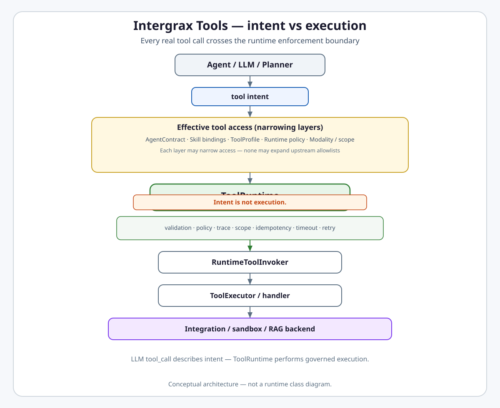
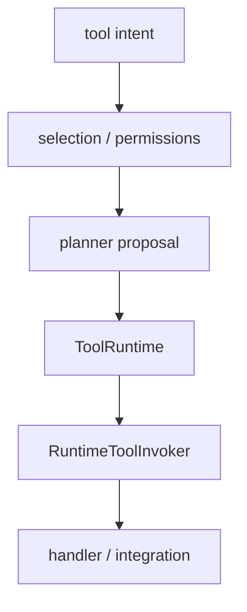
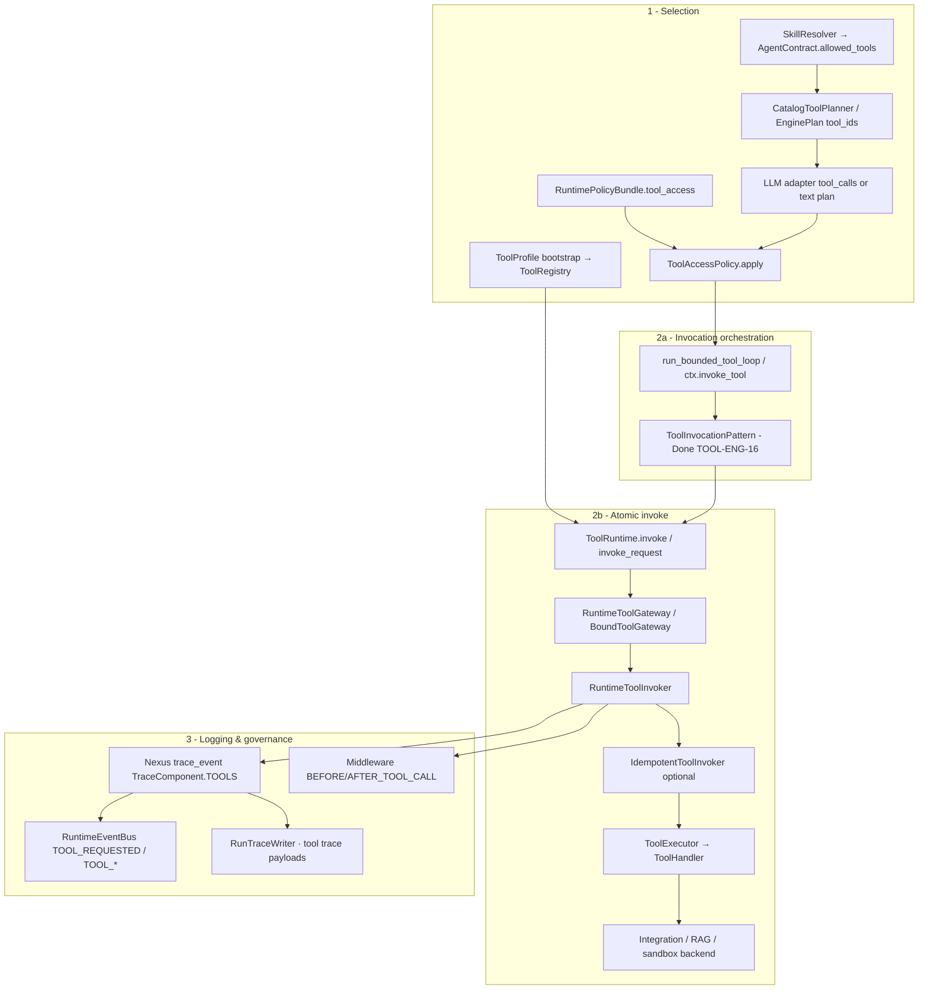

# Intergrax Tools

**Intergrax Tools** defines the governed runtime boundary between agent or model **tool intent** and actual execution - including discovery, selection, permissions, validation, orchestration, invocation, and audit.

## Why it matters

Without a platform-owned tool runtime:

- agents can call integrations or vendor SDKs directly,
- tool permissions become accidental,
- schema validation may be skipped,
- side effects can run multiple times without trace,
- policy enforcement is inconsistent,
- every agent reimplements its own tool loop,
- audit and observability fragment across paths,
- skills, tools, and integrations collapse into one concept.

Intergrax Tools addresses this through `ToolContract` / registry, layered permissions, planning and selection, `ToolRuntime`, invocation patterns, idempotency and resilience hooks, and observability on the platform event spine.

> [!NOTE]
> **Maturity boundary:** Phase **TOOL-ENG** is **closed** (36/36) with a gate-tested **200**-`tool_id` catalog and a mature invoke engine on the harness path. That is **not** universal production qualification: not every side-effect path is customer-qualified, governance wiring is **partial** on some external-effect surfaces, **TOKEN-TOOLS-1B** runtime compact-catalog wiring remains **Planned**, **TOOL-PRODUCT-ROI** tools (`code.*`, `git.*`, `patch.*`, browser automation, research evidence) remain **Planned**, and Protocol v2 audit (2026-08-18 campaign) accepted residual governed-boundary and side-effect safety gaps beyond prior closeout - see [Protocol v2 tools target invariants](#protocol-v2-tools-target-invariants-2026-08-18). See [Current maturity](#current-maturity).

**Primary audience:** Principal / Staff engineers, harness integrators, and extension authors wiring `ToolProfile`, plugins, and agent tool access - after the platform overview in the root README.

## At a glance

| Concern | Summary |
| -------- | -------- |
| **Responsibility** | Governed tool discovery, selection, permissions, validation, orchestration, invocation, audit |
| **Tool contract** | Stable `tool_id`, input/output schema, risk/side-effect metadata, retry/timeout metadata, handler binding |
| **Tool intent** | LLM `tool_call`, planner proposal, or `ToolRequest` - **not** execution |
| **Selection** | Which tools exist and which may this run use (host, agent/skill, policy, modality) |
| **Planning** | Which tool(s) the model/planner proposes (`CatalogToolPlanner`, `ToolPlanningService`) |
| **Effective permissions** | Monotonic intersection of host availability, agent/skill declaration, `RuntimePolicyBundle` / tool-scope policy, modality, invoker scope - explicit caller lists **narrow only**, never override stricter upstream authority |
| **ToolRuntime** | Enforcement facade - policy-checked execution path agents and Nexus **must** use |
| **Atomic invocation** | `ToolRuntime` → gateway → `RuntimeToolInvoker` → `ToolExecutor` → backend |
| **Invocation patterns** | `single_pass`, bounded ReAct, parallel batch - reusable orchestration, not agent-private loops |
| **Side effects / idempotency** | Stricter policy and optional `IdempotentToolInvoker` where contracts declare side effects |
| **Governance / HITL** | Policy owns allow/deny/approval semantics; Tools owns execution enforcement point |
| **Skills relation** | Skills compose `tool_ids` and guidance - **not** runtime-callable tools |
| **Integrations relation** | Vendor/backend binding behind tool handlers |
| **MCP** | `ToolContract` export/protocol surface - not a duplicate catalog |
| **Catalog scale** | Same runtime model exercised at **200** tools / **49** bundles (gate-tested count) |
| **Production boundary** | Harness-proven engine - not representative customer SLO or universal side-effect qualification |
| **Maturity** | Four-axis statement in [Current maturity](#current-maturity) |

## Flagship architecture visual

<a href="assets/fullsize/tool-runtime-boundary.md">
<picture>
  <source media="(prefers-color-scheme: dark)" srcset="assets/tool-runtime-boundary-dark.svg">
  <source media="(prefers-color-scheme: light)" srcset="assets/tool-runtime-boundary-light.svg">
  
</picture>
</a>

**Mental model:**

```text
Agent / LLM / Planner
        ↓
    tool intent
        ↓
Effective tool access (narrowing)
        ↓
    ToolRuntime
        ↓
validation · policy · trace · scope
idempotency · timeout · retry
        ↓
RuntimeToolInvoker
        ↓
ToolExecutor / handler
        ↓
Integration / sandbox / RAG backend
```

> **Intent is not execution.** Every real tool call crosses the runtime enforcement boundary.

## How it works

At a high level:

1. **Bootstrap** - Tier-3 `ToolProfile` and `IntegrationProfile` build a runtime `ToolRegistry` from catalog bundles.

Enterprise-private Tool catalog discovery (Capability Catalog Stage 7) exposes read-only metadata from non-public sources. **Private Tool discovery ≠ `ToolRegistry` availability** — runtime materialization still requires Platform Plugin availability, `ToolProfile` enablement, and `wire_application_environment()`.

2. **Declare** - `AgentContract.allowed_tools` and resolved skill `tool_ids` declare what an agent may request.
3. **Narrow** - `RuntimePolicyBundle.tool_access`, modality filters, and selection strategies shrink the visible schema set.
4. **Plan** - `CatalogToolPlanner` / `ToolPlanningService` or native `generate_with_tools` proposes `tool_id` + arguments (`ToolPlanDecision`).
5. **Filter** - `ToolAccessPolicy` and scope policies apply plan-level and per-call checks.
6. **Orchestrate** - `ToolInvocationPattern` runs single-pass, bounded ReAct, or parallel batches.
7. **Execute** - `ToolRuntime` routes through gateway and `RuntimeToolInvoker` with validation, trace, timeout, retry, optional idempotency.
8. **Observe** - `TOOL_*` runtime events and trace spine record attempts and outcomes.



**Rule:** Planner proposes; runtime enforces.

## Tool ≠ Skill ≠ Integration

| Layer | Role |
| ----- | ---- |
| **Skill** | Reusable behavior package - `tool_ids`, prompt refs, policy fragments |
| **Tool** | Concrete callable capability - stable `tool_id` executed via `ToolRuntime` |
| **Integration** | Backend/vendor implementation - databases, search, issue trackers, sandboxes |

**Example:**

```text
Skill: issue_triage
  → uses jira.search_tasks / jira.get_issue / jira.add_comment
  → backed by Jira integration
```

Skills are **not** invoked by the LLM. `SkillResolver` expands manifests into `allowed_tools` at agent bind time. A skill may reference tools but **must not** bypass `ToolRuntime`. See [`SKILLS.md`](SKILLS.md).

Integrations supply typed clients through `ToolWiringContext`; agents **must not** import vendor SDKs for invokable actions. See [`INTEGRATIONS.md`](INTEGRATIONS.md).

## Tool call ≠ tool execution

A model or planner may propose:

```text
tool_id + arguments
```

Execution happens only after:

- host catalog / `ToolProfile` availability,
- agent/skill allowlists,
- runtime policy and scope,
- schema validation,
- optional approval/HITL when governance requires it on wired paths,
- invocation through `ToolRuntime`.

```text
LLM tool_call  →  intent only
ToolRuntime    →  actual execution
```

LLM Adapters normalize provider tool calls to `LLMToolCall`; execution belongs here. See [`LLM_ADAPTERS.md`](LLM_ADAPTERS.md).

## Selection vs planning vs execution

| Phase | Question | Owner |
| ----- | -------- | ----- |
| **Selection** | Which tools are visible/allowed? | `ToolProfile`, `SkillResolver`, policy bundle, modality, selection strategy |
| **Planning** | Which tool(s) does the model propose? | `CatalogToolPlanner`, `ToolPlanningService`, native `generate_with_tools` |
| **Execution** | How is a governed invocation performed? | `ToolRuntime`, gateways, `RuntimeToolInvoker`, `ToolExecutor` |

```text
available schemas
  → selection narrowing
  → planner/model proposal (ToolPlanDecision / tool_calls)
  → policy/access filter
  → invocation pattern
  → ToolRuntime
  → execution
```

Do not treat planner choice as permission grant. `ToolPlanDecision` ≠ side effect. Cognition Plane 3 proposes; Tools enforces - see [`REASONING_AND_COGNITION.md`](REASONING_AND_COGNITION.md).

### Tool selection layers (public grouping)

Engineering detail uses L0–L7 in [Selection detail](#selection-detail-layers); publicly:

1. **Host availability** - `ToolProfile` + registry bootstrap
2. **Agent / skill declaration** - `AgentContract.allowed_tools`, skill `tool_ids`
3. **Runtime policy / scope** - `RuntimePolicyBundle.tool_access`, `StaticToolScopePolicy`
4. **Modality / plan narrowing** - modality profile, `ToolAccessPolicy`, selection strategy
5. **Final per-call invoker check** - `ToolScopePolicy` on `RuntimeToolInvoker`

**Invariant:** each layer may **narrow** access; no downstream layer may expand an upstream allowlist. Explicit per-call or invoker-supplied allow-lists MUST intersect with - not replace - `RuntimePolicyBundle.tool_access` and other stricter policy authorities (`resolve_allowed_tools_from_config` and canonical policy/tool-scope owners).

## AgentContract vs ToolProfile vs policy

```text
AgentContract.allowed_tools   → what agent may request
ToolProfile                   → what host exposes in this environment
SkillResolver                 → may compose allowed tool ids
RuntimePolicyBundle / scope   → what is allowed in this run/context
RuntimeToolInvoker            → final per-call enforcement
```

## ToolContract (public)

High-level contract surface:

- stable `tool_id`,
- input/output JSON schema,
- risk / `side_effects` metadata when declared,
- `ToolRetryPolicy` / timeout metadata on the contract,
- handler or provider binding via registry bootstrap.

Legacy `ToolBase` is **deprecated** - use `ToolContract`. Do not copy full ABC/dataclass definitions here.

## ToolRuntime

`ToolRuntime` is the **enforcement facade** for the tool execution path (UAEP §42.12). Agents and Nexus **must** call it for side effects - not handlers, integrations, or vendor SDKs directly.

It:

- receives invocation plans or `ToolRequest`s,
- applies effective permissions and plan filters,
- routes through `BoundToolGateway` / `RuntimeToolGateway`,
- delegates atomic execution to `RuntimeToolInvoker`,
- emits `TOOL_*` events on the runtime spine.

`ToolRuntime` is **not** a second orchestration runtime - Nexus/UER own task/graph lifecycle; Tools owns governed invocation inside those flows.

### Atomic invocation chain

```text
ToolRuntime
  → RuntimeToolGateway / BoundToolGateway
  → RuntimeToolInvoker
  → ToolExecutor
  → integration / sandbox / RAG backend
```

Per call: registry lookup, input/output schema validation, scope check, timeout/retry from contract, error mapping, trace. Capability aliases (`use_rag`, `use_tools`) remain **partial/legacy** - prefer explicit `tool_id`s.

### Entry paths (convergence)

| Path | Reaches governed invoker? |
| ---- | ------------------------- |
| ACP `ctx.invoke_tool` | **Yes** |
| Bounded tool loop (`run_bounded_tool_loop`) | **Yes** |
| `ToolRuntime` catalog context (`rag.retrieve`, `websearch.query`) | **Yes** |
| Engine plan `tool_ids` (Nexus host) | **Yes** when wired |
| Legacy capability `ToolRuntime.invoke` aliases | **Partial** - prefer explicit `tool_id`s |

## Tool planning

High-level planner stack:

- **`CatalogToolPlanner`** - LLM-facing planner wired from registry schemas,
- **`ToolPlanningService`** - native `generate_with_tools` or JSON fallback; respects `allowed_tool_ids`,
- **`tool_planner_input`** - assembles scoped planner context,
- **fallback** - structured JSON plan path when native tool calling is unavailable.

All paths narrow against effective permissions before exposure to the model.

## ToolInvocationPattern

Reusable orchestration primitive - agents should **not** build private tool loops.

| Mode | Role |
| ---- | ---- |
| `single_pass` | One planner round → invoke proposed calls |
| `bounded_react` | Limited tool/LLM iterations with platform caps |
| `parallel_batch` | Parallel call batch with concurrency limits |

The pattern controls **how** a plan or call series executes; it does not own domain reasoning. Shipped modes also include `parallel_semantic_batch` and `deterministic_chain`. Custom patterns register via entry point `intergrax.tool_invocation_patterns`. Author guide: [`TOOL_INVOCATION_PATTERN_AUTHOR_GUIDE.md`](../technical/guides/TOOL_INVOCATION_PATTERN_AUTHOR_GUIDE.md).

## Side effects, idempotency, retry, timeout

### Side effects

| Class | Posture |
| ----- | ------- |
| **Read-only tools** | Repeatable; lower mutation risk |
| **Side-effectful tools** | Stricter policy, audit, optional idempotency keys, possible approval on wired governance paths |

Do **not** claim every mutating tool has exactly-once semantics across external systems.

### Idempotency

`IdempotentToolInvoker` wraps the invoker when `ToolContract` declares `side_effects` and the request carries an `idempotency_key` - protecting against duplicate **platform** invocation. Idempotency identity MUST canonically bind `(tenant_id, idempotency_key)` to logical operation identity - at minimum `tool_id` and, when required, deterministic input/operation fingerprint via typed key contract (not loose hidden string concatenation). Repeated key with different operation identity MUST fail closed. Ledger outcome semantics MUST distinguish successful completion, known failed-before-effect, and failed-with-unknown-external-outcome - not collapse all returns into a single `COMPLETED` replay bucket. Platform idempotency support ≠ universal exactly-once guarantee for external vendors.

### Retry / timeout

`ToolRetryPolicy` and runtime timeout are enforced in `RuntimeToolInvoker` - **R1 ToolRuntime layer** only; agents **must not** retry tool calls themselves. `ToolContract.timeout_ms` MUST represent a real caller-visible execution latency boundary - timeout handling MUST NOT synchronously wait for a timed-out worker to finish. Architecture MUST acknowledge that a local thread timeout cannot undo an already-running external side effect; cancellation/abandon semantics MUST be explicit (no unsafe thread killing). Automatic retry of side-effectful tools MUST be positively authorized - via idempotent operation semantics with correctly scoped identity, explicit retry-safe contract metadata, or retryable error classification. Unknown-outcome mutating failures MUST NOT be blindly retried. Do not claim universal exactly-once against external providers.

## Governance / HITL boundary

```text
tool intent
   ↓
runtime policy / declarative tool policy decision
   ↓
ALLOW / DENY / REQUIRE_HITL (on wired paths)
   ↓
ToolRuntime enforcement
```

**Ownership split:**

- **Governed Execution / Policy** - authorization semantics, declarative `tool_invocation_control`, meaningful-side-effect rules, HITL pause/resume,
- **Tools** - execution enforcement point, `ToolAccessPolicy`, `ToolScopePolicy`, invoker contracts, trace emission.

`TOOL_PLAN_OR_ACCESS` is **covered** via `ToolAccessPolicy.apply` before plan exposure. **Meaningful external side effects** are **partial** - not every runtime side-effect path is wired through `MeaningfulSideEffectAuthorizationBoundary`. Do not duplicate full governance architecture - see [`GOVERNED_EXECUTION.md`](GOVERNED_EXECUTION.md).

### Policy layers (do not collapse)

| Layer | Examples |
| ----- | -------- |
| Static tool scope / allowlists | `StaticToolScopePolicy`, `AgentContract.allowed_tools` |
| Plan-level access filtering | `ToolAccessPolicy.apply` on `ToolInvocationPlan` |
| Runtime side-effect authorization | Meaningful-side-effect evaluators on wired adapter paths |
| Optional HITL | `REQUIRE_HITL` / human approval on declarative policy paths |

## MCP

```text
ToolContract (canonical registry)
  → native Intergrax runtime execution
  → MCP / function-schema export (AUDIT-IDEAL-11.2 Done)
```

MCP is an **exposure/protocol boundary** - not a second tool catalog or bypass around `ToolRuntime`.

## Catalog scale vs engine maturity

```text
Tool engine maturity  ≠  every planned tool exists
```

- **Shipped catalog:** **200** `tool_id`s and **49** bundles per plan/register; **200** count gate-tested in `tests/unit/tools/providers/test_catalog_expansion.py`.
- **TOOL-PRODUCT-ROI:** **Planned** - `code.*`, `git.*`, `patch.apply_safe`, browser automation suite, research evidence tools are **not** shipped unless a matching implementation PR lands.

Large catalog exercises the same runtime model - it is **not** a substitute for production qualification.

## Token Optimization boundary

| Row | Status |
| --- | ------ |
| **TOKEN-TOOLS-1A** | **Done** - helper-only `ToolSchemaOptimizer`; canonical registry unchanged |
| **TOKEN-TOOLS-1B** | **Planned** - runtime wiring in planner/schema export before `generate_with_tools` |

Compact catalog optimization is **not** active by default.

## Runtime-bound tools and legacy aliases

Some tools are platform/runtime-bound (`workspace.*`, `memory.*`, `harness.*`, `sandbox.exec`) via `runtime_bound_catalog` and `BoundToolGateway`. Standard catalog execution should prefer explicit `tool_id`s. Legacy capability aliases are compatibility surfaces - not the public mental model.

## Observability and sandbox

- Tool attempts/results use the unified trace/runtime event spine (`TOOL_REQUESTED`, `TOOL_COMPLETED`, `TOOL_FAILED`, `TOOL_DENIED`) - no per-agent private tool logging. See [`OBSERVABILITY.md`](OBSERVABILITY.md).
- Sandboxed execution applies to code/sandbox tool families where configured (AUDIT-IDEAL-11.1 **Done**). **Not** every tool runs in a process sandbox - sandboxing is tool/backend-specific.

## Responsibility boundaries

### Tools owns

- `ToolContract`, registry, catalog bundles, `ToolProfile` bootstrap
- Selection, planning services, `ToolInvocationPattern`
- `ToolRuntime`, gateways, `RuntimeToolInvoker`, idempotency wrapper
- Tool trace emission and invoke-side enforcement

### Tools does not own

- LLM provider tool-call normalization - [`LLM_ADAPTERS.md`](LLM_ADAPTERS.md)
- Cognition / `ToolPlanDecision` semantics - [`REASONING_AND_COGNITION.md`](REASONING_AND_COGNITION.md)
- Task/graph orchestration - [`NEXUS_EXECUTION_FLOW.md`](NEXUS_EXECUTION_FLOW.md)
- UAEP lifecycle, retry/HITL event semantics - [`UNIFIED_EXECUTION_RUNTIME.md`](UNIFIED_EXECUTION_RUNTIME.md)
- Policy definition and HITL ownership - [`GOVERNED_EXECUTION.md`](GOVERNED_EXECUTION.md)
- Integration vendor contracts - [`INTEGRATIONS.md`](INTEGRATIONS.md)
- Skill manifest resolution - [`SKILLS.md`](SKILLS.md)

### Applications (Tier-3) configure

- `ToolProfile.enabled` / `enabled_bundles`, `IntegrationProfile`, `tool_wiring.py`
- Static tool scope in runtime policy bundles
- Which bundles and integrations are available in the environment

## Relationship to Intergrax

| Neighbor | Relation |
| -------- | -------- |
| **Reasoning** | Plane 3 proposes `ToolPlanDecision`; Tools executes |
| **Nexus** | Third planning plane; converges on `ToolRuntime` for side effects |
| **UER / UAEP** | Execution lifecycle; `ToolRuntime` is a producer of `TOOL_*` events |
| **Governed Execution** | Policy decisions before/at tool paths; Tools enforces invoke boundary |
| **Skills** | Compose `tool_ids`; do not replace tools |
| **Integrations** | Backend behind handlers |
| **LLM Adapters** | Return `LLMToolCall` intent |

## Extensibility

Platform tool plugins register `ToolContract` rows at bootstrap (`ToolPlugin` → catalog → `ToolProfile` → registry → invoker). Quickstart: [`EXTENSION_AUTHOR_GUIDE.md`](../technical/guides/EXTENSION_AUTHOR_GUIDE.md) §3 · §16 · §17. Deeper selection/plugin semantics: [`satellites/TOOLS_selection_and_plugins.md`](satellites/TOOLS_selection_and_plugins.md).

## Five orthogonal axes (UE-DOC-0.8)

Frozen separation - do **not** collapse into one `mode` (authority: [`UNIFIED_EXECUTION_ARCHITECTURE.md`](UNIFIED_EXECUTION_ARCHITECTURE.md)):

| Axis | Question | Owner domain |
| ---- | -------- | ------------ |
| **A. Execution strategy** | How is work realized? | UER / Execution Boundary |
| **B. Agent reasoning strategy** | How does the agent think/plan? | ACP / Reasoning |
| **C. Tool selection strategy** | Which subset of allowed tools is model-visible? | Tools |
| **D. Tool invocation strategy** | How are proposed calls executed? | Tools (`ToolInvocationPattern`) |
| **E. Tool interaction loop** | How many tool rounds in the session? | UAEP / agentic Execution |
| **F. Output delivery** | Stream or batch delivery of **one** model invocation? | LLM Adapters + output release |

**Streaming (F)** is a delivery property of a single model call - not an Execution strategy, not an agent iteration identity, not a retry.

## Loop ownership - ToolInvocationPattern vs UAEP

| Owner | Owns | Does not own |
| ----- | ---- | ------------ |
| **UAEP / AgentEngine** | Agent session iteration lifecycle; continue/terminal/HITL intent; step advancement; Execution-level agent progression | Tool call mechanics, Run/Execution lifecycle minting, global retry |
| **ToolInvocationPattern** | Reusable single/sequential/parallel/bounded tool interaction mechanics inside agent Execution | Run lifecycle, Execution lifecycle, agent identity, HITL lifecycle, final Execution terminalization |

`bounded_react` is a **bounded reusable sub-loop** for tool interaction mechanics under UAEP - not a second agent runtime. See [`AGENT_CONTRACTS_AND_ASSEMBLY.md`](AGENT_CONTRACTS_AND_ASSEMBLY.md#loop-ownership--uaep-vs-toolinvocationpattern).

## Monotonic tool selection

Selection answers: **which subset of otherwise allowed tools is exposed to the planner/model?** Selection does **not** grant permission.

```text
host available
∩ agent/skill allowed
∩ runtime policy
∩ modality
∩ plan constraints
∩ selection strategy
= model-visible tools
```

Semantic retrieval may rank/select only within effective allowed scope. A semantic match **must not** re-enable a tool denied upstream.

## Tool planning vs selection vs execution

| Phase | Output | Permission? |
| ----- | ------ | ----------- |
| **Selection** | Visible schemas | Narrows authority only - monotonic |
| **Planning** | `ToolPlanDecision` / `LLMToolCall` | Intent only - not permission |
| **Execution** | `ToolResult` via `ToolRuntime` | Governed invocation only |

Every actual call crosses: tool intent → `ToolRuntime` → effective permissions → governance/side-effect policy → budget reservation/check → schema validation → `RuntimeToolInvoker` → handler. No agent/model/Nexus direct handler/vendor calls.

## Bounded iteration

Forbidden target pattern: unbounded `while True: llm(); tools()`. Bounded loops enforce platform caps - max iterations, model calls, tool calls, tokens, cost, duration, per-tool limits, policy/authority limits - all consuming canonical Run/Execution budget. No private ReAct budget ledger.

## Domain invariants (TOOLS-INV)

| ID | Invariant |
| -- | --------- |
| **TOOLS-INV-01** | Selection ≠ planning ≠ execution |
| **TOOLS-INV-02** | Selection only narrows authority - never expands |
| **TOOLS-INV-03** | All actual calls cross `ToolRuntime` |
| **TOOLS-INV-04** | Invocation pattern does not own agent/Execution lifecycle |
| **TOOLS-INV-05** | Tool result returns through typed context boundary - not ad-hoc prompt concat |
| **TOOLS-INV-06** | Parallel invocation preserves per-call policy and budget |

## Implementation readiness

For future implementation sessions - derive slices without making new architecture decisions. Detailed code mapping: **UE-DOC-0.9**.

### 1. TARGET STATE

Frozen UEA + this document: monotonic selection; planning as intent; governed execution via `ToolRuntime`; invocation patterns as mechanics under UAEP; parallel/sequential/chain/bounded patterns preserve per-call governance and budget.

### 2. CURRENT STATE

`ToolRuntime`, selection strategies (standard/semantic/hierarchical), `ToolInvocationPattern` modes (`single_pass`, `bounded_react`, `parallel_batch`, `parallel_semantic_batch`, `deterministic_chain`), planner paths - implemented on harness path. UAEP vs `bounded_react` ownership not fully unified; Execution Boundary not canonical.

### 3. GAPS

Unified Execution Boundary integration; resolve `bounded_react` vs UAEP loop ownership; canonical iterative loop under one Execution; pre-invoke budget hard gate (Protocol v2); platform-wide tool-result → CE contract on all paths.

### 4. DEPENDENCIES

- UEA / UER Execution Boundary
- ACP / UAEP session progression ([`AGENT_CONTRACTS_AND_ASSEMBLY.md`](AGENT_CONTRACTS_AND_ASSEMBLY.md))
- CE tool-output fragments ([`CONTEXT_ENGINEERING.md`](CONTEXT_ENGINEERING.md))
- Governance meaningful-side-effect wiring ([`GOVERNED_EXECUTION.md`](GOVERNED_EXECUTION.md))

### 5. MIGRATION ORDER (high level)

1. Canonical Execution Boundary / `ExecutionId`
2. UAEP owns agent session loop; patterns own invocation mechanics
3. Monotonic selection integration at Execution boundary
4. Invocation patterns invoked from UAEP agentic path only
5. Tool results → CE typed fragments on all hot paths
6. Parallel/bounded patterns under unified budget admission
7. Remove competing private tool loops

### 6. DO NOT VIOLATE

- UEA-INV-* without explicit reopen
- Semantic selection expanding permissions
- Planner proposal == permission grant
- `ToolInvocationPattern` owning Run/Execution lifecycle
- Direct handler/vendor calls bypassing `ToolRuntime`
- New `ToolLoopRuntime` or second generic tool-loop engine

### 7. ACCEPTANCE CONDITIONS

- Selection, planning, execution remain distinct
- Semantic match cannot re-enable denied tools
- Sequential and parallel invocation through governed patterns
- Selection strategy can differ from invocation strategy
- TARGET/CURRENT labeled where implementation lags

## Current maturity

Architecture maturity: **A4**  
Implementation maturity: **I4**  
Production readiness: **P2**  
Evidence maturity: **E3**

- **A4** - Clear Tool / Skill / Integration separation; stable `ToolContract` + `ToolRuntime`; layered selection/policy/invocation architecture; adjacent-domain boundaries validated; side-effect and governance boundaries documented honestly.
- **I4** - Phase **TOOL-ENG** **closed** (36/36); `ToolRuntime`, planner, invocation patterns, scope/access policy, idempotency wrapper, MCP export, sandboxing, 200-tool catalog, conformance/gates. Not I5 - **TOKEN-TOOLS-1B**, **TOOL-PRODUCT-ROI**, optional L1 critic on tool output, full meaningful-side-effect wiring, and Protocol v2 residual gaps (permission intersection, effective timeout, pre-invoke budget, idempotency operation identity, side-effect retry authorization, outcome-state model) remain open - **not remediated** by audit persistence.
- **P2** - Harness and lab qualification on core invoke/selection paths; not representative customer production qualification, universal side-effect SLO evidence, or runbook-backed operations (not P4).
- **E3** - Unit/gate tests (contracts, selection, invoker, patterns, idempotency, schema export), integration paths (ACP invoke, bounded loop, plugin dual-mode e2e, runtime-bound catalog). No dedicated Tools-only public proof route in [`PROOFS.md`](../proofs/PROOFS.md); LKW exercises tool paths only in **bounded** supporting-foundation scope - not E4/E5.

### Harness-proven vs production-qualified

| Harness-proven (representative) | Not claimed as universal production qualification |
| ------------------------------- | ------------------------------------------------- |
| `RuntimeToolInvoker` schema/timeout/retry/trace | Every side-effect tool customer-qualified |
| `ToolInvocationPattern` shipped modes | Universal exactly-once across external systems |
| 200-tool catalog + gate tests | TOOL-PRODUCT-ROI tools shipped |
| MCP/function-schema export | Compact catalog active by default (TOKEN-TOOLS-1B) |
| Sandboxed code tool path | Every tool process-sandboxed |

## Evidence / proof

| Evidence class | What exists | What it does not prove |
| -------------- | ----------- | ---------------------- |
| Architecture | This hub, satellites, ADR-TOOL-001..003 | Production operation |
| Unit / gate | `ToolContract`, selection/access, invoker, patterns, idempotency, MCP/schema gates | Full harness on every path |
| Integration | ACP `ctx.invoke_tool`, bounded tool loop, runtime-bound catalog, plugin dual-mode e2e (`test_plugin8_dual_mode_tool_e2e.py`) | Dedicated public tool-runtime proof |
| Public proof | **Bounded** - LKW supporting paths only ([`PROOFS.md`](../proofs/PROOFS.md)); no Tools-domain entry | Side-effect qualification at product scale |
| Production / customer | **None** cited for full domain qualification | Not E5 |

### Protocol v2 tools target invariants (2026-08-18)

Accepted Protocol v2 audit layer [`TOOLS`](../../audit_results/2026-08-18/TOOLS.md) (**FAIL**, 6 ACCEPTED findings). Canonical evidence: [`docs/audit_results/2026-08-18/`](../../audit_results/2026-08-18/README.md). Prior Phase **TOOL-ENG** **closed** and AUDIT-IDEAL §11 **Done** rows remain historical delivery facts - not rewritten. Target state only:

1. **Monotonic permission intersection** - effective tool permissions are host availability ∩ agent/skill declaration ∩ runtime policy ∩ modality ∩ per-call/invoker scope; explicit caller allow-lists intersect stricter authorities and MUST NOT override `RuntimePolicyBundle.tool_access` ([`AUDIT-20260818-TOOLS-01`](../../audit_results/2026-08-18/TOOLS.md)).
2. **Real timeout boundary** - `ToolContract.timeout_ms` bounds caller-visible latency; timeout exit MUST NOT wait for timed-out worker completion; external side effects already in flight require explicit abandon/cancel semantics - no unsafe thread killing ([`AUDIT-20260818-TOOLS-02`](../../audit_results/2026-08-18/TOOLS.md)).
3. **Pre-invoke hard budget** - hard tool-call budget reserved/checked before invocation crosses side-effect boundary; accounting uses authoritative invocation state; hard abort/HITL budget violations MUST NOT be swallowed as ordinary tools-context errors ([`AUDIT-20260818-TOOLS-03`](../../audit_results/2026-08-18/TOOLS.md)).
4. **Canonical idempotency operation identity** - ledger keys bind to logical operation (minimum `tool_id`); cross-tool/cross-operation key collision fails closed ([`AUDIT-20260818-TOOLS-04`](../../audit_results/2026-08-18/TOOLS.md)).
5. **Side-effect retry safety** - automatic retry of mutating tools requires positive authorization (idempotent semantics + scoped identity, retry-safe metadata, or retryable classification); unknown-outcome failures not blindly retried ([`AUDIT-20260818-TOOLS-05`](../../audit_results/2026-08-18/TOOLS.md)).
6. **Idempotency outcome-state semantics** - ledger distinguishes success, failed-before-effect, and unknown-outcome failure for deterministic retry decisions ([`AUDIT-20260818-TOOLS-06`](../../audit_results/2026-08-18/TOOLS.md)).

`ToolRuntime` remains the canonical execution spine; Tool / Skill / Integration ownership unchanged. Platform idempotency ≠ universal exactly-once against external providers.

Remediation: **TOOLS-GOVERNED-BOUNDARY-INTEGRITY** (01, 02, 03) and **TOOLS-SIDE-EFFECT-SAFETY** (04, 05, 06) in [plan](../maintainers/plans/TOOLS.md). **Not implemented** by audit persistence.

**Platform audit:** [`docs/audit_results/AUDIT_PROTOCOL.md`](../../audit_results/AUDIT_PROTOCOL.md).

## Go deeper

| Depth | Route |
| ----- | ----- |
| Engineering canon | [Below](#engineering-canon) |
| Selection / plugins | [`satellites/TOOLS_selection_and_plugins.md`](satellites/TOOLS_selection_and_plugins.md) |
| Runtime config reference | [`satellites/TOOLS_runtime_config_reference.md`](satellites/TOOLS_runtime_config_reference.md) |
| Plan | [`maintainers/plans/TOOLS.md`](../maintainers/plans/TOOLS.md) |
| Skills | [`SKILLS.md`](SKILLS.md) |
| Integrations | [`INTEGRATIONS.md`](INTEGRATIONS.md) |
| Governance | [`GOVERNED_EXECUTION.md`](GOVERNED_EXECUTION.md) |
| Nexus / UER | [`NEXUS_EXECUTION_FLOW.md`](NEXUS_EXECUTION_FLOW.md) · [`UNIFIED_EXECUTION_RUNTIME.md`](UNIFIED_EXECUTION_RUNTIME.md) |
| Reasoning | [`REASONING_AND_COGNITION.md`](REASONING_AND_COGNITION.md) |
| LLM Adapters | [`LLM_ADAPTERS.md`](LLM_ADAPTERS.md) |
| Extension author | [`EXTENSION_AUTHOR_GUIDE.md`](../technical/guides/EXTENSION_AUTHOR_GUIDE.md) |
| Invocation patterns | [`TOOL_INVOCATION_PATTERN_AUTHOR_GUIDE.md`](../technical/guides/TOOL_INVOCATION_PATTERN_AUTHOR_GUIDE.md) |
| Audit slice | [`docs/audit_results/TOOLS.md`](../../audit_results/2026-08-18/TOOLS.md) |

---

**Status:** Canonical architecture (domain pair 1:1)  
**Hub:** [`intergrax_runtime_architecture.md`](intergrax_runtime_architecture.md)  
**Plan (1:1):** [`plan/TOOLS.md`](../maintainers/plans/TOOLS.md)  
**Target:** [`IDEAL_HARNESS_AI_ARCHITECTURE.md`](../technical/guides/IDEAL_HARNESS_AI_ARCHITECTURE.md)  
**Audit layers:** 11  
**Platform audit:** [`docs/audit_results/AUDIT_PROTOCOL.md`](../../audit_results/AUDIT_PROTOCOL.md)
**Last updated:** 2026-08-26 - **UE-DOC-0.8** iterative tools/streaming alignment with frozen UEA

## Cursor read scope (token budget)

**Do not read this entire file in one session** (TOOLS canon).

- **Implement / audit default:** ToolRuntime path + plugin model + policy invoke (hub through production posture). Selection / invocation: [`satellites/TOOLS_selection_and_plugins.md`](satellites/TOOLS_selection_and_plugins.md). RuntimeConfig fields: [`satellites/TOOLS_runtime_config_reference.md`](satellites/TOOLS_runtime_config_reference.md).
- **Use** table of contents below - `Read` with offset/limit per §.
- **Plan hub:** [`plan/TOOLS.md`](../maintainers/plans/TOOLS.md) (scoped §6 only).
- **Platform audit:** [`docs/audit_results/AUDIT_PROTOCOL.md`](../../audit_results/AUDIT_PROTOCOL.md).
- **Max reads:** at most **one** file >5k tokens per session unless RESUME cites more.

## Architecture satellites (read on demand)

| Satellite | Contents |
| --------- | -------- |
| [`satellites/TOOLS_runtime_config_reference.md`](satellites/TOOLS_runtime_config_reference.md) | Runtime config reference |
| [`satellites/TOOLS_selection_and_plugins.md`](satellites/TOOLS_selection_and_plugins.md) | Selection and plugins |

> **Cursor context budget:** read hub read-scope block + **at most one** satellite per session.

---

## Engineering canon

### Four-layer stack

```text
Tier-2  Agent (skill_ids, allowed_tools, ToolRequest)
        │
        ▼
Tier-0  Skill Library (MVP Done) - composable packs: tool_ids + prompts + policy - see [SKILLS.md](SKILLS.md)
        │
        ▼
Tier-0  Tool Library (rag.retrieve, jira.search_tasks, …)
        │
        ▼
Tier-0  Integration Library (IssueTracker, SearchProvider, VectorStore, …)
```

Skills are **not** tools - see [`SKILLS.md`](SKILLS.md). **Agents declare tool_ids.** **Applications enable tools** via `ToolProfile` and inject integrations via `ToolWiringContext`. **Integrations** remain vendor-swappable without agent changes.

### How wiring works (Phase O.2)

```text
Tier-3 application (tool_wiring.py)
        │
        ├── IntegrationProfile.resolve()  ──►  ToolWiringContext.from_integration_profile()
        │
        ▼
ToolProfile(enabled=[...], enabled_bundles=[...])
        │
        ▼
bootstrap_catalogs()  ──►  register_default_tools()  ──►  build_registry_from_profile(profile, ctx)
        │
        ▼
ToolRegistry  ──►  RuntimeToolInvoker  ──►  Agent / CatalogToolPlanner / MCP
```

**Example - enable tools from catalog profile:**

```python
from intergrax.tools.registry import (
    ToolProfile,
    ToolWiringContext,
    build_registry_from_profile,
    register_default_tools,
)
from intergrax.integrations import IntegrationProfile, register_default_integrations

register_default_integrations()
register_default_tools()

profile = IntegrationProfile(issue_tracker="jira")
ctx = ToolWiringContext.from_integration_profile(profile)

registry = build_registry_from_profile(
    ToolProfile(enabled_bundles=["jira"]),
    ctx=ctx,
)
```

### Tool engine (implemented today)

Runtime tool engine (Phase O **Done** · **T-EXPAND Done** · **T14–T17 Done** - full **200-tool** catalog registered):

| Component | Path | Status |
|-----------|------|--------|
| `ToolContract` | `intergrax/tools/core/contracts.py` | **Done** - `ToolRiskLevel`, `ToolRetryPolicy`, metadata; invoker enforces timeout/retry |
| `ToolRegistry` | `intergrax/tools/registry/runtime.py` | **Done** |
| `ToolHandler` / `ToolExecutor` | `intergrax/tools/tool_executor.py` | **Done** |
| `ToolExecutionRequest` / `ToolExecutionResult` | `intergrax/tools/execution_models.py` | **Done** |
| `ToolProvider` protocol | `intergrax/tools/core/provider.py` | **Done** - accepts optional `ToolWiringContext` |
| `ToolCatalog` / `ToolProfile` / `ToolWiringContext` | `intergrax/tools/registry` | **Done** - Phase O.2; typed integration slots + `TaskMemoryViewBinding` / `shadow_workspace` (T-EXPAND) |
| `runtime_bound_catalog` | `intergrax/runtime/nexus/tools/runtime_bound_catalog.py` | **Done** - UAEP dispatch for `workspace.*` / `memory.*` / `harness.*` (incl. compare/export) · §42.12 |
| `register_default_tools()` / `build_registry_from_profile()` | `intergrax/tools/registry/bootstrap.py`, `factory.py` | **Done** |
| `RuntimeToolInvoker` | `intergrax/runtime/nexus/tools/invoker.py` | **Done** - validation, trace, error mapping |
| `RuntimeToolGateway` | `intergrax/runtime/nexus/tools/tool_gateway.py` | **Done** - capability aliases + registered catalog `tool_id` via `catalog_dispatch` (TOOL-ENG-2) |
| `catalog_dispatch` | `intergrax/runtime/nexus/tools/catalog_dispatch.py` | **Done** - per-id plan dispatch + gateway invoke (TOOL-ENG-1/2) |
| `BoundToolGateway` | `intergrax/runtime/nexus/tools/uaep_tool_gateway.py` | **Done** - UAEP §42.12 facade: `sandbox.exec` + 18 runtime-bound ids; catalog `tool_id`s delegate to `RuntimeToolGateway` (ADR-TOOL-001 · TOOL-ENG-2) |
| `CatalogToolPlanner` (LLM planner) | `intergrax/runtime/nexus/tools/catalog_tool_planner.py` | **Done** - OpenAI schema from registry via `ToolPlanningService` (see [`satellites/TOOLS_selection_and_plugins.md`](satellites/TOOLS_selection_and_plugins.md)) |
| `ToolPlanningService` | `intergrax/runtime/nexus/tools/tool_planning_service.py` | **Done** - native `generate_with_tools` or JSON fallback; `allowed_tool_ids` filter (TOOL-ENG-4) |
| `tool_planner_input` | `intergrax/runtime/nexus/tools/tool_planner_input.py` | **Done** - `tools_context_scope` assembly (TOOL-ENG-11) |
| `tool_selection` | `intergrax/runtime/nexus/tools/tool_selection.py` | **Done** - `ToolSelectionStrategy` router (TOOL-ENG-5/26/31/32) |
| `tool_loop` | `intergrax/runtime/nexus/tools/tool_loop.py` | **Done** - delegates to `ToolInvocationPattern` (TOOL-ENG-6,22) |
| `plan_context_invocation` | `intergrax/runtime/nexus/tools/plan_context_invocation.py` | **Done** - RAG/websearch/tools context for `ToolRuntime` (replaces retired pipeline steps) |
| `ToolInvocationPattern` | `intergrax/runtime/nexus/tools/tool_invocation_pattern.py` | **Done** - protocol + `pattern_for_mode()` (TOOL-ENG-16,21) · ADR-TOOL-003 |
| `SinglePassPattern` / `BoundedReactPattern` / `ParallelBatchPattern` | `intergrax/runtime/nexus/tools/patterns` | **Done** - shipped orchestration (TOOL-ENG-17,18,9) |
| `ToolInvocationAggregate` | `intergrax/runtime/nexus/tools/tool_invocation_aggregate.py` | **Done** - batch merge (TOOL-ENG-29) |
| `IdempotentToolInvoker` | `intergrax/runtime/tools/idempotent_invoker.py` | **Done** - dedup for `side_effects` + `idempotency_key` |
| `catalog_context` | `intergrax/runtime/nexus/tools/catalog_context.py` | **Done** - `rag.retrieve` / `websearch.query` dispatch via `plan_context_invocation` |
| `ToolAccessPolicy` | `intergrax/runtime/nexus/tools/tool_access_policy.py` | **Done** - plan-level filter (`ToolInvocationPlan`); modality intersect |
| `StaticToolScopePolicy` | `intergrax/runtime/tools/scope_policy.py` | **Done** - wired via `config.tool_scope_policy` in `RuntimeContext.build()` (TOOL-ENG-3) |
| `resolve_allowed_tools_from_config` | `intergrax/runtime/policy/tool_policy_resolution.py` | **Done** - merges `RuntimePolicyBundle.tool_access` into `ToolRuntime` / gateway |
| Legacy `ToolBase` | `intergrax/tools/tools_base.py` | **Deprecated** - use `ToolContract` (Phase O.7 Done) |

**Naming:** docs use **Tool engine** for the Tier-1 runtime stack below; **`ToolRuntime`** is the enforcement facade agents and Nexus MUST call (§42.12). Catalog types live in Tier-0 `intergrax/tools`.

### Tool execution pipeline

The **tool engine** is the Tier-1 stack that **selects** which catalog tools may run, **invokes** them through a single policy-checked path, and **logs** every attempt. Agents and graph nodes never call handlers or integrations directly.

**Read order:** this section (manifest) → [`NEXUS_EXECUTION_FLOW.md`](NEXUS_EXECUTION_FLOW.md) §15–§17 (runtime sequence) → [`UNIFIED_EXECUTION_RUNTIME.md`](UNIFIED_EXECUTION_RUNTIME.md) §42.12 (contracts).



#### Phase responsibilities

| Phase | Question answered | Primary components | Tier |
|-------|-------------------|-------------------|------|
| **1 - Selection** | Which tools exist and which may this run use? | `ToolProfile`, `SkillResolver`, `resolve_allowed_tools_from_config`, `ToolSelectionStrategy`, `CatalogToolPlanner`, `ToolPlanningService`, `ToolAccessPolicy` | Tier-3 bootstrap + Tier-1 |
| **2a - Orchestration** | How is a **plan batch** executed (single / parallel / chain / ReAct)? | `ToolInvocationPattern` **Done** (TOOL-ENG-16) via `run_bounded_tool_loop` / `resolve_invocation_pattern()` | Tier-1 |
| **2b - Atomic invoke** | How is **one** tool call executed safely? | `ToolRuntime`, `RuntimeToolGateway`, `RuntimeToolInvoker`, `ToolExecutor`, `runtime_bound_catalog` | Tier-1 |
| **3 - Logging** | What happened, for audit and debug? | `trace_event`, `RuntimeEvent` (`TOOL_*`), security middleware, `RunTraceWriter`, agent/tool trace metadata - **must** use spine ([`OBSERVABILITY.md`](OBSERVABILITY.md#observability-event-spine); no private tool trace stores) | Tier-1 + observability |

#### Entry paths - convergence on invoker

| Path | When used | Dispatch module | Reaches `RuntimeToolInvoker`? |
|------|-----------|-----------------|-------------------------------|
| **ACP `ctx.invoke_tool`** | Agent `on_next_step` / cognitive patterns (ReAct, etc.) | `BoundToolGateway` → `RuntimeToolGateway` | **Yes** - per `tool_id` on allow-list |
| **ToolRuntime catalog context** | `enable_rag` / `enable_websearch` or explicit `tool_ids` | `plan_context_invocation` + `catalog_context` | **Yes** - `rag.retrieve` / `websearch.query` |
| **Bounded tool loop** | ReAct / pattern with `max_tool_iterations > 1` | `tool_loop.run_bounded_tool_loop` | **Yes** - native tool-call rounds |
| **Capability `ToolRuntime.invoke`** | Legacy capability aliases (`use_rag`, `use_tools`) | `ToolRuntime` plan dispatch | **Partial** - prefer explicit `tool_ids` |
| **Engine plan tool_ids** | Nexus `EngineBackedNexusPlanner` node metadata | `ToolRuntime` via graph/agent host | **Yes** - when host wires planner output |
| **Tests / internal** | Unit tests, provider conformance | Direct `RuntimeToolInvoker.invoke` | **Yes** |

All successful catalog executions converge on **`RuntimeToolInvoker`** (optionally wrapped by **`IdempotentToolInvoker`**) - registry lookup, input/output schema validation, optional `ToolScopePolicy`, timeout/retry, error mapping, trace start/end.

Multi-call batches route through **`run_bounded_tool_loop`** / **`ctx.invoke_tool`**, which resolve and delegate to a configured **`ToolInvocationPattern`** before `RuntimeToolInvoker` (see [Tool invocation patterns](#tool-invocation-patterns) · author guide [`TOOL_INVOCATION_PATTERN_AUTHOR_GUIDE.md`](../technical/guides/TOOL_INVOCATION_PATTERN_AUTHOR_GUIDE.md)).

#### Selection detail (layers) {#selection-detail-layers}

| Layer | Mechanism | What it filters | Applied when |
|-------|-----------|-----------------|--------------|
| **L0 Host catalog** | `ToolProfile` + `build_registry_from_profile()` | Which tools exist in runtime `ToolRegistry` | `RuntimeContext.build()` |
| **L1 Agent contract** | `AgentContract.allowed_tools` | Declared agent capability | Graph / UAEP bind |
| **L2 Skill packs** | `SkillResolver` → `tool_ids` on contract | Composed allow-list | Agent registration |
| **L3 Policy bundle** | `RuntimePolicyBundle.tool_access` (`StaticToolScopePolicy`) | Tier-3 static scope | `resolve_allowed_tools_from_config` |
| **L4 Modality** | `ModalityProfile` → `filter_tool_ids_by_modality_profile` | Media/ML plane tools | `ToolAccessPolicy.apply_modality_profile` |
| **L5 Plan filter** | `ToolAccessPolicy.apply` on `ToolInvocationPlan` | `use_rag` / `use_websearch` / `tool_ids` / `use_tools` | `ToolRuntime.invoke` |
| **L6 Schema narrowing** | `ToolSelectionStrategy` → `resolve_planner_allowed_tool_ids` | Subset passed to `ToolPlanningService` / `to_openai_tools` (see [`satellites/TOOLS_selection_and_plugins.md`](satellites/TOOLS_selection_and_plugins.md)) | `run_bounded_tool_loop` / `ctx.invoke_tool` (TOOL-ENG-5) |
| **L6b LLM planner** | `ToolPlanningService` → `generate_with_tools` | Model picks `tool_calls` from narrowed schema | `CatalogToolPlanner` |
| **L7 Invoker scope** | `ToolScopePolicy.is_allowed` on `RuntimeToolInvoker` | Per-call deny | **Done** - `scope_policy` from `RuntimeConfig` (TOOL-ENG-3) |

See [`REASONING_AND_COGNITION.md`](REASONING_AND_COGNITION.md) - cognition Plane 3 (Tool): `ToolPlanDecision` ≠ `AgentDecision` (§42.7).

#### Invocation detail

```text
ToolExecutionRequest(run_id, step_id, tool_id, input, idempotency_key)
    → [optional] IdempotentToolInvoker (side_effects + idempotency_key)
    → RuntimeToolInvoker.invoke(state, agent_id, request)
        → ToolScopePolicy.is_allowed(agent_id, tool_id)   # when wired; else skipped
        → ToolRegistry.get(tool_id)
        → validate input_schema
        → ToolExecutor → ToolHandler → integration backend
        → validate output_schema (strict isinstance)
        → ToolRetryPolicy on contract (runtime-managed; agents MUST NOT retry)
    → ToolExecutionResult(success, output | error)
```

**Retry ownership:** tool retries are **R1 - ToolRuntime** layer only - [`RELIABILITY_FAILURE_AND_HITL.md`](RELIABILITY_FAILURE_AND_HITL.md#retry-layers). Attempt metadata must be reconstructable via the observability spine ([`OBSERVABILITY.md`](OBSERVABILITY.md#observability-event-spine)).

`ToolRuntime.invoke_request(ToolRequest)` is the UAEP §42.12 surface; routes **sandbox**, **runtime-bound** ids, **capability aliases**, and **catalog `tool_id`s** via `BoundToolGateway` → `RuntimeToolGateway` (TOOL-ENG-2 **Done** · ADR-TOOL-001).

#### Logging detail

| Signal | Mechanism | When |
|--------|-----------|------|
| Step trace | `state.trace_event(component=TOOLS, step=tool_invocation_*)` | Every invoker attempt (incl. denied scope) |
| Idempotency | `idempotency_cache_hit` trace step | Deduped side-effect replay |
| Runtime events | `TOOL_REQUESTED`, `TOOL_COMPLETED` / `TOOL_FAILED` / `TOOL_DENIED` | §42.12 |
| Ops filter | `ops:tool_audit` hint on tool events | [`OBSERVABILITY.md`](OBSERVABILITY.md) |
| Agent loop summary | `run_bounded_tool_loop` / `ctx.invoke_tool` → `state.tool_traces` (`ToolCallTrace`) | Single-pass planner |
| Budget | `enforce_tool_call_budget` → `BudgetEnforcer.check_tool_calls` | **Target:** reserve/check before crossing side-effect boundary; authoritative invocation accounting - not stale `tool_traces` mid-loop |
| Security | `MiddlewarePipeline` `BEFORE/AFTER_TOOL_CALL` | Guardrails / injection scan |
| Persisted run | `RunTraceWriter` / lab trace API | Post-mortem |

**Authoring:** [`AGENT_CREATION_GUIDE.md`](../technical/guides/AGENT_CREATION_GUIDE.md) Appendix J · **Audit:** [`docs/audit_results/AUDIT_PROTOCOL.md`](../../audit_results/AUDIT_PROTOCOL.md) · **Engine work:** [`plan/TOOLS.md`](../maintainers/plans/TOOLS.md) Phase **TOOL-ENG**.

### Platform tool plugin - developer path

**Task:** PLATFORM-PLUGIN-DOCS-3 · **Quickstart:** [`EXTENSION_AUTHOR_GUIDE.md`](../technical/guides/EXTENSION_AUTHOR_GUIDE.md) §3 · §16 · §17

| Delivery | Reference |
|----------|-----------|
| External wheel | `examples/platform_plugins/intergrax_reference_tool_plugin/` |
| Host-embedded | `examples/platform_plugins/local_embedded_tool_extension/` |
| In-repo minimal | `intergrax/tools/examples/custom_echo` |

**Sequence (both modes):** `ToolPlugin` → catalog registration → `ToolProfile` enablement → `ToolWiringContext` → `build_registry_from_profile` → `RuntimeToolInvoker`.

#### Lifecycle

`ToolPlugin` registration is **catalog/bootstrap-time**. Handlers may own resources only when their domain design requires it. There is no generic Platform Plugin unload/shutdown manager. Integrations injected via `ToolWiringContext` follow host/domain lifecycle ownership.

#### Failure behavior

| Condition | Behavior |
|-----------|----------|
| Duplicate bundle / tool id | `ValueError` from catalog or `ToolRegistry.register` |
| EP discovery/import failure | `PluginLoadError` |
| Bundle not on `ToolProfile` | Tool absent from runtime registry |
| Missing `ToolWiringContext` slot | Handler receives `None` - wire `IntegrationProfile` first |
| Qualification failure | Host `require_production_qualification` gate |
| Runtime invoke failure | `ToolExecutionResult` error / `TOOL_FAILED` trace event |

Bootstrap `on_conflict` policy: EXTENSION_AUTHOR_GUIDE §5.

#### Troubleshooting

| Symptom | Fix |
|---------|-----|
| Installed but tool missing | Enable discovery (`INTERGRAX_DISCOVER_PLUGINS`) |
| EP not discovered | Verify `intergrax.tools` entry-point group |
| Catalog row exists, not invokable | Add bundle/tool to `ToolProfile.enabled` |
| Qualification rejected | Host semantic evidence - not attestation |
| Handler dependency absent | Resolve `IntegrationProfile` → `ToolWiringContext` |
| Runtime invocation fails | Check schema, scope policy, integration backend |

Proof: `tests/integration/platform_plugins/test_plugin8_dual_mode_tool_e2e.py`

### Tool engine production posture (2026-06-10)

Full-stack audit of **Tier-0 catalog + Tier-1 tool engine** (selection → invoke → verify → log). Distinct from AUDIT-IDEAL-11.* (catalog sandbox/MCP/lint - **Done**).

#### Maturity matrix

| Area | Posture | Notes |
|------|---------|-------|
| **Tier-0 catalog** (`ToolContract`, plugins, 200 tools) | **Production** | Contracts, exporters, provider tests, integration composition |
| **Single invoke** (`RuntimeToolInvoker`) | **Production** | Schema, timeout, retry, trace, idempotency wrapper |
| **Pipeline tool step** (`run_bounded_tool_loop` / `ctx.invoke_tool`) | **Done** | Planner wired; bounded loop via `tool_loop_step` (TOOL-ENG-6 · ADR-TOOL-002) |
| **Planner wiring** (`CatalogToolPlanner`) | **Done** | `wire_catalog_tool_planner_if_enabled` in `planner_bootstrap.py` (TOOL-ENG-0) |
| **Multi-tool / ReAct loop** | **Done** | `max_tool_iterations` + native `role=tool` chain (TOOL-ENG-6) |

#### ENG-6 — native investigation proof (semantic evidence basis)

**Certified native transport (DS-E2E-12):** native planner action context is transported atomically through reserved non-executable function-call schema `intergrax.planner.action_context`. It is planning protocol metadata, not a `Tool`. Model owns basis and purpose. Tool Planning materializes the typed contract (`NativePlannerActionContext`, `NativePlannerRound`). ENG-6 validates evidence availability and binds refs to provenance. Tool Execution receives business calls only. Planner protocol validation ≠ tool authorization.

**Ownership boundary (frozen):**

| Owner | Responsibility |
|-------|----------------|
| **Model** | Public `purpose`; semantic selection of prior observations in `evidence_basis_references` via typed planner annotation |
| **Tool Planning** | Exposes planner protocol schema; separates annotation from business tool calls; validates cardinality; materializes `NativePlannerRound` |
| **Tool execution** | Canonical `LLMToolCall.id` after adapter normalization; semantic `evidence_reference` on `ToolModelObservation` rendered via `EVIDENCE_REF:` envelope (payload stays intact) |
| **ENG-6 runtime** | Deterministic bind declared semantic references → completed observations and optional prior model-visible inventory → `basis_tool_call_ids`; fail closed on unknown references and ambiguous provenance |

**Forbidden:** model-authored provider/runtime `tool_call_id` as the public basis contract; silent auto-binding of all available evidence; fuzzy or regex ID recovery from model text; registering `intergrax.planner.action_context` in `ToolRegistry`; executing or budgeting the annotation as a business tool.

**Legacy text envelope (compatibility only — NOT certified native authority):**

```text
EVIDENCE_BASIS: <comma-separated prior model-visible evidence references>
PURPOSE: <short user-facing purpose>
```

Layout whitespace is ignored before parsing. Non-native and legacy paths may still use `parse_public_decision_note()`; certified bounded-react uses `build_investigation_proof_step_from_action_context()`.

**Binding:** `investigation_proof.py` validates typed annotations (certified path) or parses legacy text, resolves declared references against the canonical native transcript plus any explicit prior model-visible inventory (`ModelVisibleEvidenceReference`), and records both `declared_basis_references` and runtime `basis_bindings` (`InvestigationEvidenceBasis`).

**Follow-up compliance context:** before each native planner round where prior model-visible evidence exists, the runtime injects bounded `ENG6_FOLLOW_UP_CONTEXT` listing `AVAILABLE_EVIDENCE_REFS` from the same inventory used by validation (`build_completed_observation_reference_index`). The model must emit exactly one `intergrax.planner.action_context` call together with business tool call(s) in the same response. Evidence basis expresses motivation/dependency on already-observed facts, not proof that the prior evidence determines the next tool's result.

**First action semantics:** empty `evidence_basis_references` is valid only when no prior model-visible evidence exists (no completed observations and no declared prior inventory). Baseline evidence visible before the first native tool round requires explicit typed annotation like any follow-up.

**Invariants:** one semantic identity per observation (`ToolModelObservation.evidence_reference`); domain/tool-contract identity wins over generic `observation.<tool_id>.<step_id>` fallback; scenario-known evidence IDs are not admissible until model-visible through transcript or declared prior inventory; runtime provenance (`tool_call_id` / acquisition id) stays separate from semantic identity; `prepared_tools_schema_hash` remains business-catalog identity (annotation schema appended after validation).

**Implementation:** `intergrax/runtime/nexus/tools/native_planner_action_context.py` · `intergrax/runtime/nexus/tools/investigation_proof.py` · `intergrax/tools/model_observation_format.py` · observation reference minting in `tool_loop.py` · shared policy `prompts/tools_investigation_policy/`.

| **Invocation pattern plugin** (`ToolInvocationPattern`) | **Production** | All shipped modes + `DeterministicChainPattern` (TOOL-ENG-16–24,28) |
| **Invoker test regression** (`modality_tool_trace`) | **Done** | TOOL-ENG-TEST.1 (S0) |
| **Deterministic tool chains** (output→input) | **Done** | `ToolChainSpec` + `DeterministicChainPattern` (TOOL-ENG-20) |
| **Parallel tool execution** | **Done** | `ParallelBatchPattern` + `max_parallel_tool_calls` (TOOL-ENG-9) |
| **Parallel semantic batch** | **Done** | `ParallelSemanticBatchPattern` (TOOL-ENG-25) |
| **Standard selection** (full schema → LLM) | **Production** | `FullCatalogSelectionStrategy` + `ToolPlanningService` (TOOL-ENG-0/4/5) |
| **Pre-filter selection** (keyword / skill / static) | **Production** | `ToolSelectionStrategy` - static, `skill_pack`, `retrieval_top_k` / `keyword_top_k` |
| **Semantic tool index** | **Done** | `ToolCatalogEmbedder` + `SEMANTIC` mode (TOOL-ENG-13) |
| **Hierarchical tool selection** | **Done** | Deterministic category→tool passes; optional LLM category pass opt-in (`tool_selection_hierarchical_llm_pass`, TOOL-MAINT-01b) |
| **`tool_ids` plan dispatch** | **Done** | `catalog_dispatch.invoke_catalog_tool_ids` (TOOL-ENG-1) |
| **§42.12 gateway** | **Done** | Catalog `tool_id` → invoker (TOOL-ENG-2); runtime-bound + sandbox unchanged |
| **`tool_scope_policy` wiring** | **Done** | `RuntimeToolInvoker` in `RuntimeContext.build()` (TOOL-ENG-3) |
| **Post-tool verification** | **Done** | `run_post_tool_verify` trace + enforce block (TOOL-ENG-7) - safety boundaries [`CRITIC_VERIFICATION.md`](CRITIC_VERIFICATION.md#verification-safety-boundaries) |
| **Optional L1 critic on tool output** | **Planned** / **Deferred** (default **OFF**) | Post-invoke hook via CVL on high-risk tools only - not part of post-tool verification ship; see [Deferred runtime features](#deferred-runtime-features-not-new-tools) |
| **AHI dynamic tool modes** | **Done** | `ToolEngineHook` + `recommend_tool_modes` (TOOL-ENG-10) |
| **Observability** | **Production** | Selection + pattern diag, budget ticks, `tool_traces` (TOOL-ENG-27/32) |

**Strategic focus (2026-06-12):** Phase **TOOL-ENG** **closed** - maintenance via gate scripts; deferred runtime features → [Phase TOOL-PRODUCT-ROI](#phase-tool-product-roi--catalog-extension-by-product-value-planned).

### Tool invocation patterns

**Author guide:** [`TOOL_INVOCATION_PATTERN_AUTHOR_GUIDE.md`](../technical/guides/TOOL_INVOCATION_PATTERN_AUTHOR_GUIDE.md)

| Layer | Contract | Role |
|-------|----------|------|
| Tool | `ToolPlugin` / `ToolContract` | What operation exists |
| Pattern | `ToolInvocationPattern` | How batches are orchestrated (ReAct, parallel, chain, custom EP) |
| Invoke | `RuntimeToolInvoker` | Single atomic tool execution (unchanged) |

Shipped modes: `ToolInvocationMode` (`single_pass`, `bounded_react`, `parallel_batch`, `parallel_semantic_batch`, `deterministic_chain`). Custom patterns: entry point group `intergrax.tool_invocation_patterns`, selected via `RuntimeConfig.tool_invocation_pattern_id` or instance override `tool_invocation_pattern`.

Resolution: `resolve_invocation_pattern` in `tool_invocation_pattern.py` · runtime entry `run_bounded_tool_loop` in `tool_loop.py`.

### Phase TOOL-PRODUCT-ROI - Catalog extension by product value (Planned)

**Status:** Architecture & plan only - **not shipped**  
**Plan (1:1):** [`plan/TOOLS.md`](../maintainers/plans/TOOLS.md) - Phase TOOL-PRODUCT-ROI  
**Policy:** One implementation ID per PR; register planned `tool_id`s only in matching task PRs.

**Purpose:** Extend the mature tool catalog (**200 shipped `tool_id`s**, **49** bundles, Full Harness LC **Done**) with **missing, high-ROI tools** for coding agents and change-audit agents - **not** general-purpose catalog padding. Existing families (RAG, filesystem, workspace, database, websearch, observability, eval, HITL, workflow, etc.) remain sufficient; add only gaps that improve **repository understanding** and **change safety**.

#### Why TOOL-PRODUCT-ROI (product value, not catalog padding)

| Gap today | Harness need |
|-----------|--------------|
| Agents read files textually | Structured **code intelligence** - repo map, symbols, dependencies, architecture boundaries, diff risk |
| GitHub/GitLab context scattered | Read-only **Git / PR context** for audit agents before merge/approve tools |
| Unsafe direct writes | **Safe patch** preview + gated apply (phase 2 - write-capable) |
| Research claims without evidence chain | **Research evidence** layer above websearch/RAG (phase 3) |
| Full browser automation | Deferred - `browser.fetch_page` exists; interactive suite only if web-app agents become first-class |

#### Wave 1 - Code Intelligence Tools (read-only, **P0**)

**Bundle id:** `code_intelligence` · **Public `tool_id` namespace:** `code.*` (bundle name and tool namespace are intentionally distinct).

All tools **read-only**, dispatch via **ToolRuntime**; backends may use `local_git` / workspace integrations (INT-P8.5) or in-process analyzers.

| `tool_id` | Purpose |
|-----------|---------|
| `code.repo_map` | Fast repository map: directories, modules, key files |
| `code.symbol_search` | Search classes, functions, methods, protocols, constants |
| `code.dependency_graph` | Module and layer dependency graph |
| `code.boundary_check` | Architecture boundary violations (e.g. tool bypassing ToolRuntime) |
| `code.diff_risk_analyze` | Pre-commit / pre-PR change risk assessment |
| `code.test_impact` | Tests to run after a change set |

**First-wave priority (highest ROI):** `code.repo_map`, `code.symbol_search`, `code.dependency_graph`, `code.boundary_check`, `code.diff_risk_analyze`.

#### Wave 2 - Git / PR Context Tools (read-only, **P1**)

Read-only GitHub/GitLab (and local git) context for audit agents. **No** merge, approve, push, or apply-patch tools in this wave.

**Backend vs tools:** `local_git` (INT-P8.5) may expose approval-gated write backend operations (`apply_patch`, `commit`); Wave 2 `git.*` tools consume **read-only** operations only. Patch/commit surface ships later via `patch.*` tools and ToolRuntime policy gates.

| `tool_id` | Purpose |
|-----------|---------|
| `git.branch_diff` | Diff between branches |
| `git.pr_context` | PR metadata, description, review threads, changed files |
| `git.ci_status` | CI/check run status for branch or PR |

#### Wave 3 - Safe Patch Tools (write-capable, **P2**)

Requires policy, idempotency, audit trail, optional HITL.

| `tool_id` | Purpose |
|-----------|---------|
| `patch.preview` | Show patch effect; validate allowed paths |
| `patch.apply_safe` | Apply patch only after preview + policy gate |

#### Later families (product-gated)

| Family | Example `tool_id`s | Gate |
|--------|-------------------|------|
| **Browser automation** | `browser.navigate`, `browser.click`, `browser.fill_form`, `browser.screenshot`, `browser.extract`, `browser.network_requests`, `browser.console_messages` | Only if Intergrax hosts web-app agents as first-class |
| **Research evidence** | `research.evidence_pack`, `research.claim_verify`, `research.source_rank` | Research/audit agents needing claim↔source binding above websearch/RAG |

#### Deferred runtime features (not new tools) {#deferred-runtime-features-not-new-tools}

These extend existing engine paths; **default OFF**.

| Feature | Config / hook | Purpose |
|---------|---------------|---------|
| **Hierarchical LLM category pass** | `RuntimeConfig.tool_selection_hierarchical_llm_pass = false` | Optional LLM step when deterministic hierarchical selection picks wrong category on large catalogs; **must not** expand permissions or select outside policy allow-list (ADR-TOOL-005) |
| **Optional L1 critic on tool output** | Post-invoke hook on `RuntimeToolInvoker`: execution → output validation → optional L1 critic → allow / suspicious / block / require_hitl | High-risk tools only (e.g. `database.execute`, `filesystem.write_text`, `storage.delete`, `rag.purge_collection`, `platform.put_secret`, `collaboration.send_mail`, `patch.apply_safe`); see [`CRITIC_VERIFICATION.md`](CRITIC_VERIFICATION.md) |

#### Architectural boundaries (unchanged)

```text
Agent → Skill → ToolRuntime → Tool handler → Integration (optional)
```

- All new tools register as `ToolContract` + handler; agents **MUST NOT** call git parsers, LSP, or GitHub SDKs directly.
- Read-only waves **MUST NOT** perform writes or side effects (`side_effects=False`).
- Write-capable patch tools **MUST** use ToolRuntime policy, idempotency keys, trace spine, and HITL where configured.

#### Explicit non-goals (TOOL-PRODUCT-ROI)

- Duplicating existing RAG, filesystem, workspace, websearch, or eval tools under new names
- Git write ops (merge, approve, push) before read-only context tools ship
- Global L1 critic on all read-only tools
- Browser automation suite without a Tier-3 product driver
