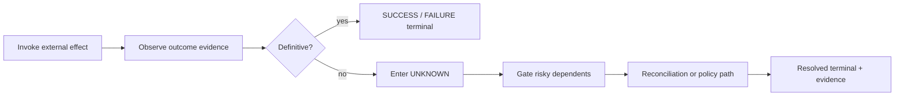

<!--
© Artur Czarnecki. All rights reserved.
Intergrax is source-available under the Intergrax Evaluation and Collaboration License 1.0.
See LICENSE for permitted evaluation, collaboration, and contribution use.
-->

# Uncertainty Management

**Uncertainty Management** is the Enterprise Reliability Layer capability that admits, tracks, and resolves **UNKNOWN** outcomes for external effects—without treating ambiguity as a generic failure.

Parent hub: [`ENTERPRISE_RELIABILITY_LAYER.md`](ENTERPRISE_RELIABILITY_LAYER.md).

> [!NOTE]
> Target architecture only. Runtime UNKNOWN semantics may be partially expressed today through Reliability failure classes and side-effect policies—see [`RELIABILITY_FAILURE_AND_HITL.md`](RELIABILITY_FAILURE_AND_HITL.md).

**Primary audience:** Architects and integrators defining workflows that call payments, inventory, shipping, or other systems of record.

---

## Why UNKNOWN exists

Distributed enterprise calls often end without a definitive answer:

| Situation | Why SUCCESS/FAILURE is premature |
| --------- | ------------------------------- |
| Client timeout | Request may have succeeded server-side. |
| Connection reset | Response may never have been read. |
| Async acceptance (`202 Accepted`) | Work is in flight; final state is elsewhere. |
| Duplicate delivery | Same logical operation may already be committed. |
| Partial provider outage | Status API and mutation API disagree temporarily. |

**Architectural meaning:** UNKNOWN preserves **honesty** in the execution model. Downstream steps that assume payment, shipment, or legal filing must not run on inference alone.

---

## Examples

1. **Payment charge** — HTTP client times out after 30s; provider dashboard shows “processing.”
2. **Inventory hold** — WMS acknowledges message to a queue; confirmation event is delayed.
3. **Identity verification** — Vendor webhook not yet received; session cannot be marked verified or failed.
4. **CRM update** — Bulk sync job started; per-record outcome unknown until job status is polled.

In each case, the correct platform posture is **pause or gate**, then **reconcile**—not blind retry and not silent failure.

---

## Lifecycle

| Phase | Responsibility |
| ----- | -------------- |
| **Admission** | Classify incoming evidence; if insufficient, mark UNKNOWN (not FAILURE). |
| **Containment** | Block or pause steps that would compound risk (ship, settle, publish). |
| **Resolution** | Reconciliation, bounded wait, compensation, or escalation per policy. |
| **Terminalization** | Map to SUCCESS, FAILURE, or governed ESCALATED outcome with audit record. |

Execution Runtime owns **pause/resume mechanics**; ERL owns **when** UNKNOWN requires those mechanics—[`UNIFIED_EXECUTION_RUNTIME.md`](UNIFIED_EXECUTION_RUNTIME.md).

---

## Decision rules (conceptual)

Rules are evaluated in platform policy context—not ad hoc in application code.

| Condition | Typical platform action |
| --------- | ------------------------ |
| Effect contract requires reconciliation on ambiguity | Enter UNKNOWN → mandatory reconcile before continue |
| Operation is read-only / idempotent probe | May retry read-style reconcile without mutating |
| Operation is non-idempotent and UNKNOWN | **Do not** auto-retry mutation; reconcile or escalate |
| Reconciliation confirms success | Resolve UNKNOWN → SUCCESS; resume gated steps |
| Reconciliation confirms no effect | Resolve UNKNOWN → FAILURE or alternate path |
| Reconciliation inconclusive after bounded attempts | Escalate to HITL or operator queue |
| Governance denies continue | Terminal stop with evidence—even if external truth is “success” |

Human paths use the canonical HITL spine—[`RELIABILITY_FAILURE_AND_HITL.md`](RELIABILITY_FAILURE_AND_HITL.md).

---

## Relationship to failure classification

Reliability classifies **failures** (dependency, policy, quality) and selects retry/HITL/degrade.

Uncertainty Management handles **missing truth** before that classification applies:

- UNKNOWN is **not** automatically `DEPENDENCY_ERROR` + retry.
- Transition to FAILURE or SUCCESS requires **evidence**, not elapsed time alone.

Cross-reference: Reliability side-effect row in [`RELIABILITY_FAILURE_AND_HITL.md`](RELIABILITY_FAILURE_AND_HITL.md#failure-model).

---

## Audit and observability

Operators and auditors should answer:

- When did execution enter UNKNOWN?
- What downstream steps were gated?
- What reconciliation evidence was used?
- Who or what resolved the state?

Observability records facts; ERL defines the semantic events to emit—[`OBSERVABILITY.md`](OBSERVABILITY.md).

---

## Further reading

- [`RECONCILIATION.md`](RECONCILIATION.md) — how external truth is verified
- [`EXTERNAL_EFFECT_CONTRACTS.md`](EXTERNAL_EFFECT_CONTRACTS.md) — declared behavior per operation type
- [`RECOVERY_AND_COMPENSATION.md`](RECOVERY_AND_COMPENSATION.md) — outcomes after resolution
