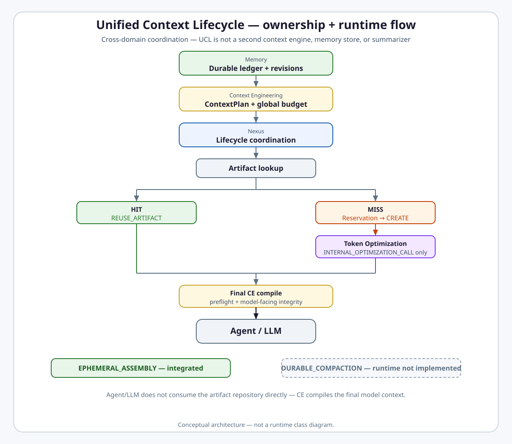
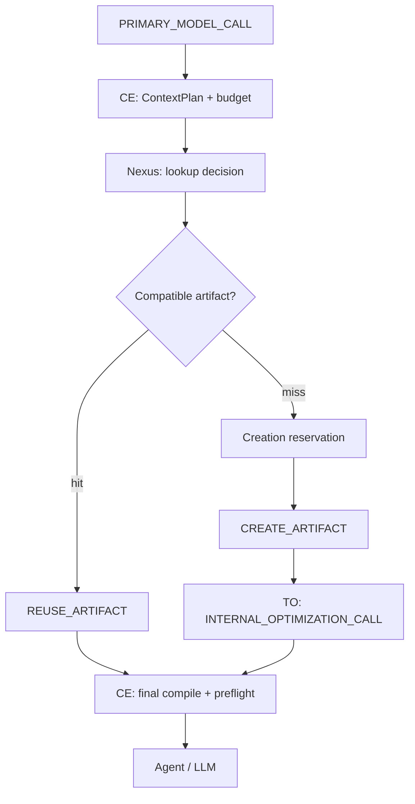

# Unified Context Lifecycle

**Intergrax Unified Context Lifecycle (UCL)** is the cross-domain coordination model that gives context optimization one durable source of truth, one global budget authority, one transformation path, and one reuse/create lifecycle across model calls.

## Why it matters

Before UCL, many independent mechanisms could trim history, summarize, compress, cache, decide budgets, or build alternate context representations — often without shared identity, provenance, or coordination. That produced competing authorities, duplicate summaries, inconsistent budgets, broken identity/provenance, duplicate expensive optimization calls, recursive optimization risk, and migrations that were hard to audit on the hot path.

UCL reduces that chaos to **one lifecycle architecture** with explicit domain ownership:

```text
Memory
→ durable conversation truth, ledger, revisions

Context Engineering
→ one global model-input budget authority + final model-facing assembly

Token Optimization
→ approved transformation execution

Nexus
→ lifecycle coordinator

Application Hosting
→ deployment config / authorization / UX
```

UCL is **not** another Context Engine, Memory store, summarizer, Token Optimization pipeline, cache layer, or Context Engineering replacement. It defines how those domains cooperate on each model call.

## At a glance

| Concern | Summary |
| -------- | -------- |
| **Problem solved** | Competing context-reduction authorities without shared lifecycle, budget, or reuse semantics |
| **Durable source of truth** | Memory — `ConversationLedger`, `SessionContextRevision`, artifact catalog contracts |
| **Budget authority** | Context Engineering — one global input budget + final `ChatMessage[]` assembly |
| **Transformation executor** | Token Optimization — typed executors on `CREATE_ARTIFACT` only |
| **Lifecycle coordinator** | Nexus — lookup, reuse/create decision, reservation coordination |
| **Ephemeral mode** | `EPHEMERAL_ASSEMBLY` — **integrated** on UCL-managed `PRIMARY_MODEL_CALL` |
| **Durable mode** | `DURABLE_COMPACTION` — contracts in progress; **runtime not implemented** |
| **Reuse/create** | Deterministic `ArtifactLookupKey` → `REUSE_ARTIFACT` before `CREATE_ARTIFACT` |
| **Concurrency** | Same-key single-flight creation in reference flow (not a universal distributed lock) |
| **Current maturity** | Four-axis statement in [Current maturity](#current-maturity) |
| **Go deeper** | [Engineering canon](#engineering-canon) · [plan](../maintainers/plans/UNIFIED_CONTEXT_LIFECYCLE.md) · [ADR-UCL-001](../technical/adr/entries/2026-08-01/ADR-UCL-001.md) |

> [!NOTE]
> **Maturity boundary**
>
> **Shipped / integrated:** CTX-UCL-1…6D and CTX-UCL-CLOSEOUT-1 accepted/closed; **EPHEMERAL_ASSEMBLY** integrated (`ContextEngine` → `resolve_ucl_context_plan()` → lookup/reservation → executor on create only → final CE compile); reuse-before-create; same-key single-flight in reference flow; internal-call recursion guards; legacy competing summary authorities removed or fail-closed on the UCL-managed primary path.
>
> **Not shipped / not proven:** `DURABLE_COMPACTION` runtime execution; first durable production `OptimizationArtifactRepository` adapter; durable `SessionContextRevision` activation in production; production/customer operational evidence; universal distributed single-flight guarantee. **ACCEPTED / CLOSED** task status does **not** imply taxonomy **P4** or **E5**.

**Primary audience:** Principal / Staff engineers and harness integrators tracing model-call context optimization — after the platform overview in the root README.

## Flagship architecture visual

<picture>
  <source media="(prefers-color-scheme: dark)" srcset="assets/ucl-lifecycle-dark.svg">
  <source media="(prefers-color-scheme: light)" srcset="assets/ucl-lifecycle-light.svg">
  
</picture>

```text
EPHEMERAL_ASSEMBLY   ✅ integrated

DURABLE_COMPACTION   ◌ runtime not implemented
```

## UCL ownership model

| Concern | Owner |
| -------- | ----- |
| Durable conversation ledger + revisions | Memory |
| Global input token budget + final assembly | Context Engineering |
| Optimization transformation execution | Token Optimization |
| Lookup / reuse / create lifecycle coordination | Nexus |
| Deployment config / auth / UX | Application Hosting |

> UCL defines the lifecycle across these domains; it does not replace their ownership.

## EPHEMERAL_ASSEMBLY vs DURABLE_COMPACTION

| Mode | Purpose | Current state |
| ---- | ------- | ------------- |
| **EPHEMERAL_ASSEMBLY** | Build or reuse bounded model context for the current call | **Integrated** — UCL-managed `PRIMARY_MODEL_CALL` |
| **DURABLE_COMPACTION** | Persist and activate a compacted durable context revision for future calls | **Runtime not implemented** — TOKEN-10E-1 contracts ready for review |

Ephemeral artifact reuse does **not** mutate durable history. Durable compaction requires candidate construction, validation, CAS activation, and rollback semantics — planned under TOKEN-10E extending UCL, not a second lifecycle.

## What UCL replaced

A 2026-08-01 platform audit found **19** independent context-reduction and presentation mechanisms. Closeout disposition (engineering canon [§3.2](#32-final-resolution-of-the-19-historical-mechanisms)) retained retention and presentation paths, removed or fail-closed competing summarization authorities, and established **one canonical optimization path** for UCL-managed `PRIMARY_MODEL_CALL`. The full mechanism register lives in engineering canon — not duplicated here.

## How EPHEMERAL_ASSEMBLY works

On each UCL-managed **`PRIMARY_MODEL_CALL`**:

1. **Context plan** — Context Engineering collects sources and produces one global `ContextPlan` with deterministic lookup inputs.
2. **Lookup key** — Nexus derives a deterministic `ArtifactLookupKey` when optimization is required.
3. **Repository lookup** — `OptimizationArtifactRepository.lookup()` searches for a compatible artifact.
4. **Reuse** — compatible hit → `REUSE_ARTIFACT` (no transformation executor, no LLM summarizer).
5. **Miss** — `try_acquire_creation_reservation()`; owner proceeds to `CREATE_ARTIFACT`.
6. **Internal optimization** — `MessageSequenceArtifactExecutor` runs under `INTERNAL_OPTIMIZATION_CALL` with recursion guard.
7. **Validate and store** — candidate validation, then `store_validated_artifact`; non-owners wait or defer.
8. **Final compile** — CE assembles model-facing `ChatMessage[]`, integrity validation, `verify_context_preflight`, adapter invocation.



Coverage applies to **UCL-managed** primary paths when Context Engine and `llm_adapter` are wired — not every model call in the platform.

## Reuse-before-create

UCL **must not** rerun a summarizer or create a second equivalent artifact when a compatible one already exists.

Reuse depends on a **deterministic** `ArtifactLookupKey` (tenant/session scope, source range, `source_content_hash`, artifact type, strategy/policy/validation versions, compression target, lossiness profile) and **explicit compatibility validation** at reuse time — not fuzzy semantic matching. A lookup hit produces `REUSE_ARTIFACT` with `llm_transform_invoked = false`.

## Single-flight creation

When two parallel requests need the **same** `ArtifactLookupKey` and no artifact exists yet:

- one caller acquires the creation reservation and runs `CREATE_ARTIFACT`;
- others observe `ALREADY_IN_PROGRESS`, do not launch a duplicate expensive model call, and reuse the stored artifact when available;
- failure releases the reservation; lease expiry enables recovery.

The reference `InMemoryOptimizationArtifactRepository` provides **process-local** single-flight coordination. A durable multi-process production adapter remains a future TOKEN-10E-4 concern — do not read reference behavior as a universal distributed lock guarantee.

## Internal-call boundary and recursion safety

```text
PRIMARY_MODEL_CALL
≠
INTERNAL_OPTIMIZATION_CALL
```

Internal summarization for artifact creation does **not** re-enter the full UCL optimization lifecycle for the same target. `OptimizationExecutionGuard` tracks depth and ancestry; recursive same-target optimization is **fail-closed** (`OPTIMIZATION_RECURSION_BLOCKED`, `OPTIMIZATION_DEPTH_EXCEEDED`).

## Responsibility boundaries

### UCL coordinates

- Lifecycle between `ContextPlan`, lookup, reuse/create, execution, and final compile.
- `PRIMARY_MODEL_CALL` vs `INTERNAL_OPTIMIZATION_CALL` distinction.
- Reuse-before-create and single-flight creation contract.
- Artifact compatibility and lookup flow.
- Ephemeral vs durable mode boundary.

### UCL does not own

- Durable ledger storage semantics → Memory.
- Final token budget and assembly → Context Engineering.
- Transformation algorithm implementation → Token Optimization.
- Business authorization → Application Hosting / Governance.
- Provider-specific cache mutation.
- Arbitrary LLM orchestration outside UCL-managed scope.

## Relationship to Intergrax

| Neighbor | Relationship |
| -------- | ------------- |
| [`MEMORY.md`](MEMORY.md) | Durable ledger, revisions, artifact catalog contracts |
| [`CONTEXT_ENGINEERING.md`](CONTEXT_ENGINEERING.md) | Global budget, `ContextPlan`, final model-facing assembly |
| [`TOKEN_OPTIMIZATION.md`](../capabilities/architecture/TOKEN_OPTIMIZATION.md) | Transformation executors on `CREATE_ARTIFACT`; not repository owner |
| [`NEXUS_EXECUTION_FLOW.md`](NEXUS_EXECUTION_FLOW.md) | Turn/step narrative; Nexus invokes UCL decision point |
| Application Hosting | Policy profiles, authorization, review/rollback UX |
| [`OBSERVABILITY.md`](OBSERVABILITY.md) | `optimization_decision` and related safe events |
| [`RAG.md`](RAG.md) | Indirect — retrieved fragments enter CE collect; not UCL artifact lifecycle |

## Extensibility

UCL is not a public plugin marketplace. Extension surfaces are architecture contracts:

| Surface | Role |
| ------- | ---- |
| `OptimizationArtifactRepository` | Port for lookup, reservation, store, invalidation |
| Production durable adapter | TOKEN-10E-4 — first non-reference repository backend |
| Typed artifact executors | Token Optimization — e.g. `MessageSequenceArtifactExecutor` |
| `ContextOptimizationPolicy` | Strategy IDs, mode (`EPHEMERAL_ASSEMBLY` \| `DURABLE_COMPACTION`), persistence policy |
| Application host wiring | `context_runtime_bridge` — profile → policy normalization |

## Current maturity

Architecture maturity: **A4**  
Implementation maturity: **I3**  
Production readiness: **P2**  
Evidence maturity: **E3**

- **A4** — Accepted [ADR-UCL-001](../technical/adr/entries/2026-08-01/ADR-UCL-001.md), closed CTX-UCL-1…6D + CLOSEOUT-1, explicit ownership and invariants in this hub; durable mode architecture defined but runtime not delivered.
- **I3** — **EPHEMERAL_ASSEMBLY** integrated on UCL-managed `PRIMARY_MODEL_CALL`; reuse, single-flight, recursion guards, legacy migration closed. **DURABLE_COMPACTION** runtime **not implemented** (TOKEN-10E-1 contracts only) — blocks I4/I5 for the full domain scope.
- **P2** — Reference in-memory repository and lab/integration paths; no UCL-specific production handoff, SLO/runbook package, or customer operational evidence.
- **E3** — Closeout integration proofs (lookup hit reuse, same-key single-flight, different-key concurrency, executor failure release, UAEP/context-plan integration, recursion guard, legacy source guard). No dedicated public UCL proof route — not E4/E5.

> **Task status vs taxonomy:** **ACCEPTED / CLOSED** on CTX-UCL phases records delivery state — not automatic **P4** or **E5**.

### Capability maturity

| Capability | State |
| ---------- | ----- |
| UCL contracts / ownership | **Accepted** — ADR-UCL-001 + engineering canon |
| **EPHEMERAL_ASSEMBLY** | **Integrated** |
| Artifact reuse (`REUSE_ARTIFACT`) | **Integrated** — lookup hit path proven |
| Same-key single-flight | **Integrated** — reference repository flow |
| Legacy migration (model-facing history) | **Closed** — competing authorities removed/fail-closed |
| **DURABLE_COMPACTION** contracts | **In progress** — TOKEN-10E-1 ready for review |
| **DURABLE_COMPACTION** runtime | **Not implemented** |
| Durable production repository adapter | **Not implemented** — TOKEN-10E-4 |

## Evidence / proof

### Architecture

- [ADR-UCL-001](../technical/adr/entries/2026-08-01/ADR-UCL-001.md)
- This hub and [plan](../maintainers/plans/UNIFIED_CONTEXT_LIFECYCLE.md)

### Runtime / integration (closeout)

- Lookup hit reuse without executor (`test_lookup_hit_reuses_without_executor`)
- Same-key single-flight (`test_concurrent_same_key_single_flight`)
- Different-key concurrency (`test_different_key_concurrency_allows_two_model_calls`)
- Executor failure releases reservation (`test_executor_failure_releases_reservation`)
- UAEP / context-plan integration (`test_uaep_assemble`, `test_context_plan_integration`)
- Recursive optimization guard (`OptimizationExecutionGuard`)
- Legacy summary source guard (`test_ctx_ucl_6d_legacy_summary_guard`)

### Public product proof

**No dedicated public UCL proof route** in [`docs/project/proofs/`](../proofs/PROOFS.md). Do not inherit qualification from LKW, RAG, or CE proofs that merely consume assembled context.

### Production evidence

None cited for the UCL domain — do not claim **P4** or **E5**.

## Go deeper

| Depth | Route |
| ----- | ----- |
| **Engineering canon** | [Below](#engineering-canon) — contracts, 19-mechanism register, invariants |
| **Implementation plan** | [`maintainers/plans/UNIFIED_CONTEXT_LIFECYCLE.md`](../maintainers/plans/UNIFIED_CONTEXT_LIFECYCLE.md) |
| **ADR** | [ADR-UCL-001](../technical/adr/entries/2026-08-01/ADR-UCL-001.md) |
| **Related domains** | [`CONTEXT_ENGINEERING.md`](CONTEXT_ENGINEERING.md) · [`MEMORY.md`](MEMORY.md) · [`TOKEN_OPTIMIZATION.md`](../capabilities/architecture/TOKEN_OPTIMIZATION.md) |
| **Nexus** | [`NEXUS_EXECUTION_FLOW.md`](NEXUS_EXECUTION_FLOW.md) |

---

## Maintainer and Cursor context

**Status:** **CTX-UCL-6** **ACCEPTED / CLOSED** through **6D**; **CTX-UCL-CLOSEOUT-1** **ACCEPTED / CLOSED**  
**Hub:** [`intergrax_runtime_architecture.md`](intergrax_runtime_architecture.md)  
**Plan (1:1):** [`plan/UNIFIED_CONTEXT_LIFECYCLE.md`](../maintainers/plans/UNIFIED_CONTEXT_LIFECYCLE.md)  
**Related:** [`CONTEXT_ENGINEERING.md`](CONTEXT_ENGINEERING.md) · [`MEMORY.md`](MEMORY.md) · [`TOKEN_OPTIMIZATION.md`](../capabilities/architecture/TOKEN_OPTIMIZATION.md) · [`NEXUS_EXECUTION_FLOW.md`](NEXUS_EXECUTION_FLOW.md)  
**ADR:** [`ADR-UCL-001`](../technical/adr/entries/2026-08-01/ADR-UCL-001.md) · [`ADR-MEM-001`](../technical/adr/entries/2026-06-08/ADR-MEM-001.md) (Context Compiler — superseded where UCL conflicts)  
**Last architecture/runtime pass:** 2026-08-04 — **CTX-UCL-CLOSEOUT-1** accepted/closed; **TOKEN-10E-1** durable safety contracts ready for review; **DURABLE_COMPACTION** runtime execution remains not implemented

### Cursor read scope (token budget)

**Do not read this entire file in one session.**

- **Public front:** sections above through [Go deeper](#go-deeper).
- **Implement / audit default:** [Engineering canon](#engineering-canon) §5–§6 (ownership + lifecycle flows).
- **Historical audit:** §3 only when tracing the 19-mechanism baseline.
- **Plan hub:** [`plan/UNIFIED_CONTEXT_LIFECYCLE.md`](../maintainers/plans/UNIFIED_CONTEXT_LIFECYCLE.md) — Current status and closeout gate only unless implementing a cited phase.

---

## Engineering canon

## 1. Status and ownership

| Item | Value |
|------|-------|
| Task | **CTX-UCL-CLOSEOUT-1** — **ACCEPTED / CLOSED** |
| Implemented phases | **CTX-UCL-1** through **CTX-UCL-6D** **ACCEPTED / CLOSED** |
| Runtime implementation | **EPHEMERAL_ASSEMBLY** integrated — `ContextEngine` → `resolve_ucl_context_plan()` → repository lookup/reservation → `MessageSequenceArtifactExecutor` on `CREATE_ARTIFACT` only |
| Legacy migration | **Complete** for model-facing conversation history — `HistoryLayer.OFF` raw-only; non-OFF strategies fail-closed; legacy provider slicing/flattening disabled; legacy compression profiles canonical or fail-closed; history summary prompt builder/YAML removed; no application-local summary caches; no direct conversation-summary bypass |
| TOKEN-10E-1 | **READY_FOR_REVIEW** — durable safety contracts only; candidate flow and activation not implemented |
| Owning domains | **MEMORY** (durable ledger/revisions) · **CONTEXT_ENGINEERING** (single budget authority) · **TOKEN_OPTIMIZATION** (transformation executor) · **NEXUS** (lifecycle coordinator) · **APPLICATION_HOSTING** (config/auth/UX) |
| Supersedes | **TOKEN-10E-ARCH-1** as standalone compaction architecture — durable compaction now defined under UCL + TOKEN-10E |

## 2. Purpose

> **Historical architecture-freeze scope (2026-08-01 — CTX-UCL-ARCH-1):** The paragraph below records the original architecture-freeze milestone. **CTX-UCL-1…6D** and **CTX-UCL-CLOSEOUT-1** subsequently implemented **EPHEMERAL_ASSEMBLY** runtime integration; the closing sentence applied only to CTX-UCL-ARCH-1, not to the domain today.

Platform audit identified **multiple independent context-reduction authorities** operating without a shared lifecycle model. Before **TOKEN-10E** (durable in-cache compaction) implementation begins, this document freezes:

1. **One durable source of truth** for conversation history (Memory/Session).
2. **One global input budget authority** (Context Engineering).
3. **One transformation executor** for optimization strategies (Token Optimization).
4. **One lifecycle coordinator** (Nexus) for ephemeral assembly and durable compaction.
5. **Two explicit modes:** `EPHEMERAL_ASSEMBLY` and `DURABLE_COMPACTION`.

This is **architecture and documentation only**. No runtime code, storage migration, or public API changes are in scope for **CTX-UCL-ARCH-1** alone. Ephemeral runtime integration is documented in §1 Status and ownership and in the public front [Current maturity](#current-maturity).

---

## 3. Historical baseline audit (2026-08-01)

> **Historical baseline captured on 2026-08-01 — not the post-migration runtime state.**
> The table below records pre-UCL mechanism discovery. Final closeout disposition is in §3.2.

Audit performed by tracing call sites and wiring (2026-08-01). **Existence of code or configuration does not imply production hot-path activity.** **Documented mechanism count: 19** (table rows below; prior delivery report incorrectly cited 17).

| Component / file | Owning domain today | Modifies durable history | Model-facing only | Operates on | Preserves message IDs | Preserves roles | Preserves tool linkage | Protected-region validation | Receipt | Rollback | Concurrency protection | Hot path | Classification | Target decision |
|------------------|---------------------|--------------------------|-------------------|-------------|----------------------|-----------------|------------------------|----------------------------|---------|----------|------------------------|----------|----------------|-----------------|
| `ConversationalMemory._trim_if_needed` (`intergrax/memory/conversational_memory.py`) | Memory | **No** | No — mutates active in-memory session state | messages in RAM | **No** (dropped from active view) | Yes (remaining) | Not validated | No | No | No | `threading.RLock` on aggregate | Active when `max_messages` set | in-memory retention / bounded active history | **retain** with explicit semantics; not durable retention, not ConversationLedger mutation, not token optimization |
| `InMemorySessionStorage` FIFO (`intergrax/runtime/nexus/session/in_memory_session_storage.py`) | Memory / Session | **Yes** | No | messages | **No** (dropped) | Yes | Not validated | No | No | No | per-session dict | Dev/test default path | retention-only | **retain** dev/test only; document as retention |
| `SqliteConversationalMemoryStore` max_messages (`intergrax/memory/stores/sqlite_conversational_memory_store.py`) | Memory | **Yes** | No | messages | Partial | Yes | Not validated | No | No | No | store-dependent | Active on SQLite conv path | retention-only | **adapt** — retention policy, not compaction |
| `SessionManager.append_message` docs (`session_manager.py`) | Memory | Delegates to storage | No | messages | Depends on store | Yes | Depends on store | No | No | No | storage-dependent | Active | canonical write path | **retain** — append-only contract target |
| `fragments_from_session_history` (`intergrax/context/providers/legacy_bridge.py`) | Context Engineering | No | **Yes** | strings (`role: text`) | **No** (synthetic `source_id`) | Partial (flattened) | **No** | No | No | No | None | **Active** — `builtin.session_history` on CE collect | legacy/compatibility | **replace** — structured `ConversationSnapshot` + refs |
| `builtin.session_history` max_entries (`intergrax/context/providers/builtin.py`) | Context Engineering | No | **Yes** | `messages[-N:]` → fragments | **No** | Partial | **No** | No | No | No | None | **Active** on CE graph/UAEP when handle wired | legacy slicing | **deprecate** pre-`ContextPlan` slicing |
| `DefaultContextFormatter` (`intergrax/context/formatter.py`) | Context Engineering | No | **Yes** | synthetic system strings | **No** | Lost in flatten | **No** | No | No | No | None | Active on CE format path | compatibility flattening | **adapt** — injection format only; not canonical history |
| `HistoryLayer` (`intergrax/runtime/nexus/context/engine_history_layer.py`) | Nexus (legacy) | No (ephemeral to `state.base_history`) | **Yes** | tokens/messages | Partial | Yes | Not validated | No | No | No | None | **Dormant** — constructed in `RuntimeContext.build()` but `build_base_history()` has **no production call sites** | legacy | **deprecate** → UCL `EPHEMERAL_ASSEMBLY` |
| `HistoryCompressionStrategy` (`intergrax/runtime/nexus/responses/response_schema.py`) | Nexus / Application | No | Intended model-facing | enum | N/A | N/A | N/A | No | No | No | None | **Dormant** with HistoryLayer; mapped from `legal_application` bridge | legacy config | **adapt** — map to `ContextOptimizationPolicy` |
| `ContextCompiler` + `DegradationLadder` (`context_compiler.py`, `degradation_ladder.py`) | Context Engineering | No | **Yes** | tokens/messages | Partial | Yes | Partial (index-based) | No | No | No | None | **Active** — ACP `compile_service`, `DefaultNexusContextEngine.assemble` | canonical budget path (partial) | **adapt** — sole global budget under UCL; trim rules frozen below |
| `TOKENIZER_HARD_TRIM` (`degradation_ladder.py`) | Context Engineering | No | **Yes** | tokens/strings | Partial | Yes | **No** | No | No | No | None | Active as last ladder step | legacy overflow behavior | **replace** — `trim_safe` segments only; fail-closed otherwise |
| `ContextManager` legacy char trim (`context_manager.py`) | Context Engineering | No | **Yes** | chars | Partial | Yes | Not validated | No | No | No | None | Active when engine not wired | legacy | **deprecate** after CE-3 full wiring |
| `verify_context_preflight` (`context_preflight.py`) | Context Engineering | No | Validates only | tokens | N/A | N/A | N/A | No | No | No | None | Active post-compile | canonical preflight | **retain** — final boundary before adapter |
| Token Optimization pipeline (`intergrax/runtime/token_optimization/pipeline.py`) | Token Optimization | No | **Yes** | strings (`TextArtifact`) | N/A | N/A | N/A | **Yes** (string) | **Yes** | Metadata only | None | Active when `CacheAwareTokenOptimizationRuntime.run()` invoked | canonical executor (text) | **retain** + extend `MessageSequenceArtifact` |
| `protected_regions.py` | Token Optimization | No | Validates | strings | N/A | N/A | N/A | **Yes** | Feeds receipt | No | None | Active in pipeline | canonical (text) | **retain** + structural validator for messages |
| `budget_aware_packing` / `context_pack.py` | Token Optimization | No | **Yes** | chars/fragments | N/A | N/A | N/A | Partial | Via pipeline | No | None | Active in pipeline layers | prototype | **retain** under CE budget allocation |
| `semantic_compression_enabled` + metadata (`context_runtime_bridge.py`, `applications/_shared/context_runtime_bridge.py`) | Application / Runtime wiring | No | Intended | config metadata | N/A | N/A | N/A | No | No | No | None | **Config-only** — no runtime consumer reads `semantic_compression.v1` | dormant / misleading | **adapt** — fail-fast or default-off (migration task) |
| `SessionMemoryConsolidationService._prepare_conversation_for_prompt` | User profile / LTM | No | **Yes** (prompt slice) | messages/chars | Partial | Yes | Not validated | No | No | No | None | Active on consolidation path | **separate concern** | **retain** — not conversation compaction |
| `ConversationalMemory.get_for_model(native_tools=True)` | Memory | No | **Yes** | messages | Yes | Filtered | Strips tool msgs | No | No | No | lock | Active when native_tools path used | model-presentation | **retain** — adapter presentation, not compaction |

### 3.2 Final resolution of the 19 historical mechanisms

The register below resolves exactly the 19 mechanisms from the 2026-08-01 historical baseline, one-to-one and in the same order. Additional closure surfaces discovered during migration are listed separately in §3.3 and are not included in the historical count.

Post-migration runtime disposition for each historical mechanism. Scope: **PRIMARY_MODEL_CALL** consuming UCL-managed model-facing context unless noted.

**Closeout classification dictionary (additions):**

| Classification | Meaning |
|----------------|---------|
| `LEGACY_COMPATIBILITY_PRESENTATION` | Active compatibility path outside UCL-managed PRIMARY_MODEL_CALL; model-presentation trim only; not a UCL decision point |
| `LEGACY_COMPILER_LADDER` | Legacy `DegradationLadder` step; may mutate message shape; post-UCL-resolution mutation rejected on managed primary path |
| `SEPARATE_TOKEN_OPTIMIZATION_PIPELINE` | Distinct TextArtifact/string Token Optimization mechanism; not invoked by UCL summary `CREATE_ARTIFACT`; not repository owner |

| Mechanism | Final classification | Final runtime status | Owner | UCL authority impact | Proof / test |
|-----------|---------------------|----------------------|-------|----------------------|--------------|
| `ConversationalMemory._trim_if_needed` | RETENTION_ONLY | Active in-RAM bounded active history only | Memory | None — not model-facing optimization | Memory retention contracts |
| `InMemorySessionStorage` FIFO | RETENTION_ONLY | Dev/test storage FIFO | Memory / Session | None — retention, not compaction | Session storage tests |
| `SqliteConversationalMemoryStore` max_messages | RETENTION_ONLY | Active on SQLite path | Memory | None — retention policy | Memory store tests |
| `SessionManager.append_message` | RAW_COMPATIBILITY_ONLY | Canonical append-only write path | Memory / Session | Durable source preserved; no optimization side effect | Session manager tests |
| `fragments_from_session_history` | DISABLED_FAIL_CLOSED | Raises `SessionHistorySnapshotRequiredError` | Context Engineering | Removed legacy slicing/flattening authority | `test_legacy_bridge_providers` |
| `builtin.session_history` `[-N:]` slicing | REMOVED_LEGACY_AUTHORITY | Canonical `SessionHistorySnapshot` path only | Context Engineering | CE collects structured snapshot refs | `test_context_runtime_bridge`, CE provider tests |
| `DefaultContextFormatter` | MODEL_PRESENTATION_ONLY | Active on CE format/injection path | Context Engineering | Presentation only — not canonical history transport | CE formatter tests |
| `HistoryLayer` | RAW_COMPATIBILITY_ONLY | **OFF** loads raw `SessionManager.get_history()`; non-OFF fail-closed | Nexus | No compression authority | `test_engine_history_layer` |
| `HistoryCompressionStrategy` | DISABLED_FAIL_CLOSED | Non-OFF modes mapped at bridge; non-OFF raises `LegacyHistoryCompressionDisabledError` | Nexus / Application | Fail-closed before planner/model | `test_engine_history_layer` |
| `ContextCompiler` + `DegradationLadder` | CANONICAL_UCL | Active CE global budget/compiler path; not a second UCL optimization decision point | Context Engineering | Sole global input budget authority | `test_context_plan_integration`, `test_uaep_assemble` |
| `TOKENIZER_HARD_TRIM` | LEGACY_COMPILER_LADDER | Last legacy `DegradationLadder` step; may reconstruct `ChatMessage` without full `entry_id` / `name` / `tool_calls` / `tool_call_id` | Context Engineering | Remains in compiler ladder; on UCL-managed planned context, post-resolution mutation is rejected by final compile integrity fence (`FINAL_COMPILE_MUTATED_PLAN`) | Degradation ladder / compiler tests |
| `ContextManager` | LEGACY_COMPATIBILITY_PRESENTATION | Active compatibility sync fallback via `build_agent_context()` → `_build_agent_context_core()` → `trim_message_to_budget()` char-budget model-presentation trim; **outside UCL-managed PRIMARY_MODEL_CALL** when Context Engine is not wired. Does not create conversation summary; does not use `OptimizationArtifactRepository`; not canonical UCL decision point; UCL closeout claim does not cover this fallback; future migration is a separate architectural task | Nexus / CE | Presentation-only fallback — not UCL-managed primary path | Nexus context manager tests |
| `verify_context_preflight` | CANONICAL_UCL | Active post-compile final boundary | Context Engineering | Mandatory pre-adapter validation | CE preflight tests |
| Token Optimization pipeline | SEPARATE_TOKEN_OPTIMIZATION_PIPELINE | Active for string `TextArtifact` transforms via `CacheAwareTokenOptimizationRuntime.run()`; **not** invoked by current UCL summary `CREATE_ARTIFACT`; not repository owner; not a second conversation-history summarizer | Token Optimization | Separate TO mechanism — not UCL summary executor | TO pipeline tests |
| `protected_regions.py` | SEPARATE_TOKEN_OPTIMIZATION_PIPELINE | Validation component for generic TextArtifact pipeline; used by `TokenOptimizationPipelineRunner`; **not** invoked by `resolve_ucl_context_plan()`; not part of `MessageSequenceArtifactExecutor`; not conversation-summary authority; not a second repository or decision point | Token Optimization | Protected-region validation on transforms — not UCL summary executor | TO validation tests |
| `budget_aware_packing` / `context_pack.py` | SEPARATE_TOKEN_OPTIMIZATION_PIPELINE | Prototype char-budget packing for RAG/retrieved evidence; generic Token Optimization pipeline layer; **not** invoked by UCL summary `CREATE_ARTIFACT`; not Context Engine global budget authority; does not create conversation-history summary | Token Optimization | Packing under pipeline layers — not UCL summary executor | TO packing tests |
| `semantic_compression_enabled` + metadata | DISABLED_FAIL_CLOSED | Fail-closed or maps `summarize_oldest` → canonical `ContextOptimizationPolicy` only | Application / Runtime wiring | No standalone `semantic_compression.v1` consumer | `test_context_runtime_bridge` |
| `SessionMemoryConsolidationService._prepare_conversation_for_prompt` | SEPARATE_MEMORY_LIFECYCLE | Active LTM consolidation path | User profile / LTM | **Out of UCL** — separate memory lifecycle | LTM consolidation tests |
| `ConversationalMemory.get_for_model(native_tools=True)` | MODEL_PRESENTATION_ONLY | Active when `native_tools=True`; adapter presentation filters tool messages; not compaction | Memory | Presentation only — not canonical history optimization | Memory adapter tests |

### 3.3 Additional closure surfaces

Surfaces discovered during UCL migration that are **not** part of the 19-mechanism historical baseline (§3.2).

| Surface | Final classification | Final runtime status | Owner | UCL authority impact | Proof / test |
|---------|---------------------|----------------------|-------|----------------------|--------------|
| `HistoryCompressionStrategy` non-OFF modes | DISABLED_FAIL_CLOSED | Bridge maps non-OFF to fail-closed before planner/model | Nexus / Application | No compression authority on non-OFF paths | `test_engine_history_layer` |
| `max_memory_entries_in_context` | RETENTION_ONLY (retrieval scope) | Retrieval-only cap for LTM fragments in CE collect | Context Engineering | No authority over session history | `builtin.py` LTM collect tests |
| History summary prompt builder / YAML | REMOVED_LEGACY_AUTHORITY | **Removed** | — | Canonical summary path only via `MessageSequenceArtifactExecutor` | `test_ctx_ucl_6d_legacy_summary_guard` |
| Application-local history summary caches | REMOVED_LEGACY_AUTHORITY | **None** in production scan roots | — | Reuse via `OptimizationArtifactRepository` only | `test_ctx_ucl_6d_legacy_summary_guard` |
| Direct conversation-summary model-call bypass | REMOVED_LEGACY_AUTHORITY | **None** — all summary creation via UCL reservation path | Nexus / TO | Single creation path enforced | `test_ucl_orchestration`, source guard |
| `MessageSequenceArtifactExecutor` | CANONICAL_UCL | Sole conversation-summary executor on UCL path: consumes structured `SessionHistoryMessage`; builds `INTERNAL_OPTIMIZATION_CALL`; creates message-sequence artifact via `resolve_ucl_context_plan()` → executor (not generic TextArtifact pipeline) | Token Optimization / Nexus | Canonical UCL summary creation authority | `test_message_sequence_artifact`, `test_ucl_orchestration` |
| `HistorySummaryDiagV1` / trace summaries | SEPARATE_TRACE_OR_RESPONSE_LIFECYCLE | Diagnostic trace payloads only | Nexus tracing | **Out of UCL** — trace/response lifecycle | History layer trace tests |
| `TRUNCATE_OLDEST_HISTORY` | LEGACY_COMPILER_LADDER | Remains in legacy `DegradationLadder`; on UCL-managed planned context, post-resolution mutation rejected by final compile integrity fence | Context Engineering | Compiler ladder step — not UCL optimization decision point | Degradation ladder tests |

**UCL-managed compile integrity fence:** On the UCL-managed Context Engine path, Context Engine compares planned model-facing hash vs compiled model-facing hash; mutation after UCL resolution raises `FINAL_COMPILE_MUTATED_PLAN` (fail-closed). `TRUNCATE_OLDEST_HISTORY` and `TOKENIZER_HARD_TRIM` remain in the legacy compiler ladder but are not accepted as post-UCL-resolution mutators on the managed primary path.

**Canonical model-facing summary creation (sole path):**

```text
PRIMARY_MODEL_CALL
→ ContextEngine.resolve_ucl_context_plan()
→ OptimizationArtifactRepository.lookup()
→ REUSE_ARTIFACT | CREATE_ARTIFACT (ArtifactCreationReservation)
→ MessageSequenceArtifactExecutor (CREATE + ACQUIRED only)
→ INTERNAL_OPTIMIZATION_CALL
→ store → final CE assembly → adapter
```

**Out of UCL scope (explicitly separate, not bypasses):** LTM extraction/consolidation; trace consolidation; planning/critic/eval calls; provider cache behavior; response summarization.

### 3.1 Duplicate authorities (highest risk — historical)

1. **Pre-`ContextPlan` history slicing** (`messages[-N:]`) vs **ContextCompiler global budget** vs **dormant HistoryLayer token compression**.
2. **Storage-backed FIFO retention** (may cause durable loss) vs **ConversationalMemory in-RAM FIFO** (active in-memory state loss only) — both presented as bounded memory but indistinguishable from optimization in ops.
3. **`semantic_compression_enabled`** in product defaults without runtime consumer.
4. **String flattening** (`role: text` fragments) blocks structural validation required for durable compaction.

---

## 4. Risk register

| ID | Risk | Severity | Mitigation (UCL) |
|----|------|----------|------------------|
| R1 | Silent durable loss via storage FIFO | High | Classify retention-only; separate from model-facing compaction |
| R2 | Competing global budgets (HistoryLayer + ContextCompiler) | High | CE sole budget authority; HistoryLayer deprecated |
| R3 | TOKEN-10E adds third compaction engine | High | UCL foundation before TOKEN-10E-1 |
| R4 | `semantic_compression_enabled` false advertising | Medium | Fail-fast or default-off migration |
| R5 | `TOKENIZER_HARD_TRIM` cuts protected content | High | `trim_safe` only + `MANDATORY_CONTEXT_EXCEEDS_MODEL_LIMIT` |
| R6 | No revision CAS → lost updates on durable compaction | High | CTX-UCL-2 activation contracts |
| R7 | String-only optimization cannot validate tool groups | High | CTX-UCL-4 `MessageSequenceArtifact` + structural validation |

---

## 5. Domain ownership

### 5.1 Memory / Session — durable source of truth

**Owns:** `ConversationLedger` (append-only raw messages and events); stable message IDs; sequence numbers; tool-call/tool-result relationships; attachments and message metadata; `SessionContextRevision` manifests; `ActiveContextRevisionPointer`; revision persistence contracts; revision activation through compare-and-swap; rollback execution; retention and archival lifecycle; optimistic concurrency; **Reusable Optimization Artifact Catalog** and **`OptimizationArtifactRepository`** contracts (persistence contract, lookup contract, single-flight creation reservation, content-addressed catalog, artifact availability and lifecycle state, artifact retention, artifact invalidation persistence); **`InMemoryOptimizationArtifactRepository`** reference implementation (**CTX-UCL-2**); artifact references from `SessionContextRevision`; tenant/session scoping for artifacts.

**Does not own:** global prompt budget; optimization algorithms; strategy selection; model-facing context composition; application authorization or UX; **whether an artifact should be used for the current model call** (Nexus orchestrates lookup-before-create; CE supplies requirements).

**Rule:** Context compression for the model must not be a hidden side effect of `append_message()`. Storage-level retention is not token optimization. Compaction does not rewrite or delete the raw `ConversationLedger`.

### 5.2 Context Engineering — single budget authority

**Owns:** one global input budget per model invocation; per-source budget allocation; segment classification (`mandatory`, `protected`, `compressible`, `droppable`, `trim_safe`); `ContextPlan`; determining required target size; determining whether the currently assembled context fits; classifying source groups; supplying source ranges and target requirements; final model-facing `ChatMessage[]`; final compilation using raw groups or reusable artifacts; final model-facing integrity validation orchestration; token-window preflight (`verify_context_preflight`).

**Does not own:** durable conversation persistence; active revision pointer; optimization strategy implementation; application policy persistence; artifact lookup or persistence (CE supplies deterministic lookup inputs; does not perform catalog lookup itself).

**Rule:** No history provider or optimization layer may hold a second independent global budget.

### 5.3 Token Optimization — transformation executor

**Owns:** optimization strategy catalog; policy gates used by transformation execution; typed artifact executors; artifact creation through the correct typed executor (only after `CREATE_ARTIFACT` decision); strategy compatibility metadata; candidate construction; transformation pipeline composition; text protected-region validation; message-sequence structural validation contracts; candidate validation; artifact measurement; receipts; safe result metadata; safe reporting; cache attribution; cache-lineage transition calculation.

**Does not own:** `ConversationLedger`; `SessionContextRevision` persistence; `ActiveContextRevisionPointer`; revision activation; rollback execution; global prompt budget; application authorization; retention; **reusable artifact repository or lookup persistence**.

### 5.4 Nexus — lifecycle coordinator

**Owns:** snapshot acquisition; CE `ContextPlan` orchestration; resolved policy delivery; **canonical optimization decision point** (every canonical model call traverses it); determining whether optimization is required; constructing `ArtifactLookupKey`; orchestrating lookup-before-create; mapping lookup result to `REUSE_ARTIFACT` or `CREATE_ARTIFACT`; preventing transform execution on a valid reuse hit; TOKEN-10D timing decision; optional Token Optimization invocation (only on `CREATE_ARTIFACT` or explicit approved refresh); validation sequencing; coordinating final validation and compilation; final CE compilation sequencing; final model-facing integrity check; preflight; adapter invocation sequencing; dispatch of durable activation request to Memory/Session.

**Does not own:** storage implementation; compression algorithms; tenant policy persistence; product UX; artifact persistence implementation.

### 5.5 Application host — configuration, authorization, UX

**Owns:** profile selection; tenant configuration; authorization; feature opt-in; human review UX; rollback UX; retention configuration; persistence adapter selection and wiring; product-specific presentation.

**Does not own:** a private session revision model; a private active revision pointer; a parallel compression engine; a parallel global budget; direct activation logic bypassing Memory/Session contracts; **its own summary cache** (application does not implement application-local summary caching).

**Normalization path:**

```text
ApplicationEnvironmentProfile
  → neutral RuntimeEnvironmentProfile
  → resolved ContextOptimizationPolicy
```

Canonical bridge: `intergrax/runtime/wiring/context_runtime_bridge.py`.
Compatibility shim: `intergrax/applications/_shared/context_runtime_bridge.py`.

### 5.6 Memory consolidation — separate concern

`SessionMemoryConsolidationService` and LTM consolidation remain **out of scope** for conversation context compaction. Distinct lifecycles:

| Concern | Owner |
|---------|-------|
| Conversation context compaction (ephemeral/durable) | UCL / CE + TO |
| User LTM extraction | Memory lifecycle |
| Session summary stored as memory | Memory lifecycle |
| Retention / archival | Memory / Session |
| Model-facing ephemeral reduction | CE + TO under Nexus |

---

## 6. Unified Context Lifecycle

### 6.1 Ephemeral assembly flow (`EPHEMERAL_ASSEMBLY` — `PRIMARY_MODEL_CALL`)

Every canonical model call is a **`PRIMARY_MODEL_CALL`** and traverses the full UCL optimization decision point. Token Optimization transformation execution is **optional**; artifact lookup may occur without invoking Token Optimization. Internal summarization for artifact creation uses a bounded **`INTERNAL_OPTIMIZATION_CALL`** path that does not re-enter full UCL for the same optimization target.

```text
PRIMARY_MODEL_CALL (execution_scope; optimization_depth == 0)
        ↓
Memory/Session snapshot:
  resolve ActiveContextRevisionPointer
  load immutable ConversationSnapshot / structural references
        ↓
Context Engineering:
  collect sources
  resolve one global ContextPlan
        ↓
Nexus UCL decision:
  determine whether optimization is required
        ↓
NO_OP / SELECT_ONLY (budget satisfied without transformation)
        ↓
optimization required
  → construct ArtifactLookupKey
        ↓
OptimizationArtifactRepository lookup
        ↓
artifact found
  → REUSE_ARTIFACT
  → validate artifact eligibility (reuse-time compatibility and integrity)
  → provide artifact to final CE compilation
  → llm_transform_invoked = false
        ↓
artifact not found
  → try_acquire_creation_reservation(key, operation_id, lease_deadline)
        ↓
reservation acquired (ACQUIRED)
  → CREATE_ARTIFACT
  → TOKEN-10D timing/policy gate when applicable
  → INTERNAL_OPTIMIZATION_CALL (optimization_depth == 1; bounded input/output budget)
  → candidate validation
  → store_validated_artifact (atomic or observably ordered)
  → release_creation_reservation
  → provide artifact to final CE compilation
  → llm_transform_invoked = true when LLM summarizer used (at most one per key)
        ↓
reservation already held (ALREADY_IN_PROGRESS)
  → no Token Optimization execution
  → no summarizer invocation for non-owner caller
  → wait_for_artifact_or_reservation_change (bounded timeout)
  → retry lookup → REUSE_ARTIFACT when artifact available
  → or explicit non-transforming defer / ARTIFACT_CREATION_IN_PROGRESS outcome
        ↓
Context Engineering:
  final compilation into exact model-facing ChatMessage[]
        ↓
FINAL MODEL-FACING INTEGRITY VALIDATION
        ↓
verify_context_preflight / token-window validation
        ↓
exact-send materialization and hash/integrity verification
        ↓
primary LLM adapter invocation
```

**Rules:** `EPHEMERAL_ASSEMBLY` never changes `ActiveContextRevisionPointer`; never creates a durable revision by default; no content transformation after final model-facing integrity validation. `REUSE_ARTIFACT` must not execute an LLM summarizer or transformation executor. `CREATE_ARTIFACT` may execute an LLM summarizer only when policy and strategy allow it **and** the caller holds a valid creation reservation. The internal summarizer result is **not** sent as the primary application response. No hidden busy loop; no unbounded waiting; no second LLM call for the same compatible key while a valid reservation exists.

### 6.2 Durable compaction flow (`DURABLE_COMPACTION` — TOKEN-10E scope)

Durable compaction **reuses** artifacts rather than regenerating them when a compatible artifact exists.

```text
active SessionContextRevision (immutable baseline)
        ↓
Context Engineering:
  ContextPlan-selected source range / MessageSequenceArtifact target
        ↓
Nexus:
  construct ArtifactLookupKey
        ↓
Memory/Session Optimization Artifact Catalog:
  lookup compatible artifact
        ↓
compatible artifact exists
  → REUSE_ARTIFACT (no LLM summarizer)
        ↓
no compatible artifact
  → CREATE_ARTIFACT
  → TOKEN-10D timing/policy decision
  → MessageSequenceArtifactExecutor candidate construction
  → candidate schema / structural / protected / quality validation
  → persist reusable artifact when policy permits
        ↓
build new immutable SessionContextRevision referencing artifact_id / content hash
  (must not copy full summary payload when stable artifact reference suffices)
        ↓
receipt + rollback metadata
        ↓
Memory/Session CAS:
  expected ActiveContextRevisionPointer == baseline revision
        ↓
activate candidate revision or return conflict
  (activation must not cause summary regeneration)
        ↓
cache-lineage transition
        ↓
safe audit event
```

**Rules:** no in-place mutation; no direct Application activation; no hidden retry after CAS conflict; no durable activation through Token Optimization itself; rollback changes the active revision pointer and **reuses** artifact references already associated with the prior revision; raw `ConversationLedger` is not rewritten.

### 6.3 Canonical optimization decision point (`reuse-before-create`)

**Normative rule:** UCL **MUST** prefer a valid existing optimization artifact over executing a new transformation.

An LLM-based summary **MUST NOT** be regenerated for an identical source range, source content hash, artifact type, policy version, strategy version, validation-contract version, and compression target.

The rule applies to: `EPHEMERAL_ASSEMBLY`; `DURABLE_COMPACTION`; `MessageSequenceArtifact`; `TextArtifact` where reusable transformation artifacts are supported; future typed artifact executors.

Reuse requires explicit compatibility validation. Not every transformation result is automatically reusable.

#### 6.3.1 Decision outcomes (`ContextOptimizationDecision`)

| Outcome | Definition |
|---------|------------|
| **`NO_OP`** | The current selected context fits the resolved budget without any optimization or artifact substitution. |
| **`SELECT_ONLY`** | CE satisfies the budget through deterministic selection of whole allowed groups (dropping droppable groups, excluding optional groups, keeping mandatory/protected groups, preserving recent tail). **Must not** invoke an LLM. |
| **`REUSE_ARTIFACT`** | A compatible existing artifact has been found and validated for the current source, policy, strategy, and target requirements. **Must not** invoke the transformation executor or LLM summarizer. |
| **`CREATE_ARTIFACT`** | Optimization is required and no compatible artifact exists. The approved typed artifact executor may create a new candidate. |
| **`POLICY_BLOCKED`** | Optimization would be technically possible but the resolved policy does not permit the requested target, strategy, or lossiness. |
| **`FAIL_CLOSED`** | The required model context cannot be assembled safely and no permitted selection, reusable artifact, or transformation can satisfy the constraints. |

`NO_OP`, `SELECT_ONLY`, and `REUSE_ARTIFACT` are distinct outcomes and must remain observable separately.

#### 6.3.2 Artifact compatibility identity (`ArtifactLookupKey`)

Canonical compatibility contract (exact field names may be finalized in **CTX-UCL-1** and **CTX-UCL-2**; dimensions below are normative):

| Dimension | Required |
|-----------|----------|
| `tenant_id` | Yes |
| `session_id` or scoped conversation identity | Yes |
| `artifact_type` | Yes |
| `source_range` or ordered source references | Yes |
| `source_content_hash` | Yes |
| `strategy_id` | Yes |
| `strategy_version` | Yes |
| `policy_version` | Yes |
| `validation_contract_version` | Yes |
| `compression_target` or `target_budget_class` | Yes |
| `lossiness_profile` | Yes |
| protected-region policy version | When applicable |
| model-family constraint | When artifact compatibility depends on it |
| language or locale constraint | When required |

**Normally excluded** from compatibility identity (must not force regeneration): `request_id`, `run_id`, `trace_id`, current timestamp, provider cache observation, unrelated newer messages outside the artifact source range.

#### 6.3.3 Reusable artifact record (`ReusableOptimizationArtifact`)

Conceptual metadata contract (not implemented in this task):

`artifact_id`, `artifact_type`, `tenant_id`, `session_id` or source scope, `source_refs` or `source_range`, `source_content_hash`, `artifact_content_hash`, `strategy_id`, `strategy_version`, `policy_version`, `validation_contract_version`, `compression_target`, `lossiness_profile`, `created_at`, `created_by_executor`, `validation_result`, `validation_timestamp`, `status`, `invalidation_reason`, `supersedes_artifact_id` (when applicable), `receipt_ref`, `safe_metadata`.

#### 6.3.4 Reuse eligibility

Reuse is allowed only when:

- tenant scope matches
- conversation/session scope matches
- source range or source references match
- `source_content_hash` matches
- artifact type matches
- strategy ID and version are compatible
- policy version is compatible
- validation-contract version is compatible
- compression target is sufficient
- protected-region policy remains satisfied
- artifact status is valid
- artifact has not been invalidated

A reuse candidate must pass lightweight eligibility validation. Do not rerun the full transformation to validate reuse.

**Validation stages (distinct):**

1. **Creation-time** — full candidate validation (Token Optimization boundary).
2. **Reuse-time** — compatibility and integrity validation.
3. **Final model-facing** — integrity validation after CE compilation.

#### 6.3.5 Invalidation rules

A reusable artifact becomes ineligible when any relevant condition changes:

- source messages, order, or range change
- `source_content_hash` changes
- tool-call or tool-result linkage changes inside the source
- attachment or citation references change
- strategy implementation version becomes incompatible
- policy version requires stronger preservation
- validation-contract version changes incompatibly
- protected-region policy changes incompatibly
- required compression target is stricter than the artifact can satisfy
- artifact validation status is revoked
- tenant/session scope changes
- artifact is explicitly retired or invalidated

**Closed-range stability:** new messages appended **after** the source range do **not** automatically invalidate an artifact for an unchanged closed range. Example: summary S1 covers messages 1–50; messages 51–120 are appended; if messages 1–50 and their structural metadata remain unchanged, S1 remains eligible for reuse. A changed message inside 1–50 invalidates S1 through a new source hash.

#### 6.3.6 Summary regeneration prohibition

The platform **MUST NOT** call an LLM summarizer again for an identical compatible `ArtifactLookupKey`. A lookup hit must produce `REUSE_ARTIFACT`.

A new summarization call is allowed only after: lookup miss; explicit incompatibility; invalidation; stronger compression requirement; policy-required regeneration; validation failure; or administrative refresh explicitly allowed by policy.

Administrative or quality refresh must not silently happen on every model call. If refresh is allowed in the future, it must be: policy-controlled; observable; versioned; receipt-backed; non-destructive.

#### 6.3.7 Ephemeral artifact persistence

`EPHEMERAL_ASSEMBLY` does **not** change `ActiveContextRevisionPointer`. A reusable artifact **may** still be stored in the Optimization Artifact Catalog when policy permits. An artifact created during an ephemeral call may be reused later without making it part of the active durable `SessionContextRevision`.

Conceptual persistence policy options: `do_not_persist_ephemeral_artifact`; `persist_reusable_artifact`; `persist_only_after_validation`; `persist_only_after_human_review`.

#### 6.3.8 Multi-level summary support

A source range may have multiple compatible artifacts at different compression levels (e.g. `summary_detail_high`, `summary_detail_medium`, `summary_detail_low`, or target budget classes 2000 / 1000 / 500 tokens). Reuse selection should choose the **least-lossy valid artifact** that satisfies the current target. Do not force reuse of an artifact that is too large for the current budget. Do not automatically compress an existing summary recursively unless the strategy explicitly supports summary-of-summary lineage with traceable source lineage, quality policy permission, and satisfied validation/receipt requirements. Prefer direct source-based regeneration when required by policy.

#### 6.3.9 Cache terminology

Do **not** call the reusable summary catalog a provider prompt cache or KV cache.

| Term | Meaning |
|------|---------|
| **Reusable Optimization Artifact Catalog** / **Optimization Artifact Store** | Platform-owned persisted optimization artifacts |
| `SessionContextRevision` | Immutable durable projection manifest |
| prompt prefix identity | Stable prefix hash for assembly |
| provider prefix-cache observation | Reported provider evidence only |
| provider KV cache | Provider-managed cache state |

A reusable summary artifact is platform-owned persisted content, not provider cache state.

### 6.4 Model call execution scope (`ModelCallExecutionScope`)

Typed distinction between user-facing model calls and internal optimization model calls. Do not overload an unrelated existing request type solely to encode this distinction.

| Value | Definition |
|-------|------------|
| **`PRIMARY_MODEL_CALL`** | A canonical model invocation whose result serves the application, agent workflow, or user-facing task. Traverses the full UCL optimization decision point (`optimization_depth == 0`). |
| **`INTERNAL_OPTIMIZATION_CALL`** | A bounded internal model invocation initiated by an approved Token Optimization executor to create or refresh an optimization artifact (for example an LLM-generated summary). Does not recursively traverse the full UCL optimization lifecycle for the same optimization target. |

Optional future values (not required now): `EVALUATION_CALL`, `VALIDATION_CALL`, `BACKGROUND_MAINTENANCE_CALL`.

**Canonical internal-call rule:** Every `PRIMARY_MODEL_CALL` traverses the canonical UCL optimization decision point. An `INTERNAL_OPTIMIZATION_CALL` does not recursively traverse the full UCL optimization lifecycle for the same optimization target. Internal optimization calls use a bounded internal assembly path with explicit budgets, protected inputs, preflight, and telemetry — but without history summarization or artifact creation recursion.

#### `INTERNAL_OPTIMIZATION_CALL` requirements

Must:

- have an explicit bounded input budget
- have an explicit reserved output budget
- use protected-region and structural constraints appropriate to the artifact
- run token-window preflight
- produce safe telemetry
- carry parent operation identity
- carry `ArtifactLookupKey` or target identity where applicable

Must not:

- re-enter the full optimization decision point for the same source target
- perform artifact lookup for the artifact it is currently creating
- trigger another `CREATE_ARTIFACT` for the same source
- recursively invoke the same summarization strategy
- mutate `ActiveContextRevisionPointer`
- activate a durable revision
- bypass adapter safety or token preflight

#### Internal call context rule

An internal summarization call must receive only the explicitly selected source material and required summarization instructions. It must not automatically receive: the complete original conversation; the current application history provider output; the active UCL history artifact as a new target; unrelated RAG context; the application's complete tool catalog; or application-specific context not required by the summarization strategy.

#### Internal model adapter rule

The internal summarizer may use the same underlying adapter family or a separately configured summarization adapter, but invocation must always be distinguishable by: `execution_scope`, operation lineage, strategy identity, artifact target, and telemetry classification. The architecture does not depend on a separate physical model — the same model may be used safely if execution scope and recursion guard are enforced.

### 6.5 Optimization execution guard (`OptimizationExecutionGuard`)

Conceptual recursion guard preventing infinite optimization recursion and duplicate concurrent creation for the same target.

| Field | Purpose |
|-------|---------|
| `execution_scope` | `PRIMARY_MODEL_CALL` or `INTERNAL_OPTIMIZATION_CALL` |
| `operation_id` | Current operation identity |
| `parent_operation_id` | Parent operation when nested |
| `optimization_depth` | Depth in optimization chain |
| `active_artifact_lookup_key` | Key currently being created (if any) |
| `active_strategy_id` | Strategy currently executing (if any) |

**Normative invariants:**

- `PRIMARY_MODEL_CALL`: `optimization_depth == 0`
- first `INTERNAL_OPTIMIZATION_CALL`: `optimization_depth == 1`
- `optimization_depth > 1`: rejected for the same artifact-creation chain unless a future explicitly approved strategy contract allows bounded composition
- same `ArtifactLookupKey` already active in the operation ancestry: **fail closed**
- same strategy + same source target already active: **fail closed**

**Required reason codes:** `OPTIMIZATION_RECURSION_BLOCKED`, `OPTIMIZATION_DEPTH_EXCEEDED`, `DUPLICATE_ACTIVE_ARTIFACT_CREATION`. Exact enum/package placement may be finalized during **CTX-UCL-1**; semantics are normative.

### 6.6 Single-flight artifact creation (`ArtifactCreationReservation`)

For one compatible `ArtifactLookupKey`, the platform **MUST** allow at most one active artifact-creation execution at a time. Content-addressed storage deduplication alone is insufficient because it does not prevent duplicate LLM calls.

**Canonical term:** `ArtifactCreationReservation` (lease semantics with bounded expiry).

**Normative repository operations** (exact method names may be finalized in **CTX-UCL-2**):

| Operation | Purpose |
|-----------|---------|
| `lookup(key)` | Find compatible existing artifact |
| `try_acquire_creation_reservation(key, operation_id, lease_deadline)` | Acquire exclusive creation right |
| `store_validated_artifact(reservation, artifact)` | Atomically store validated artifact and complete reservation |
| `release_creation_reservation(reservation, outcome)` | Release on failure or expiry |
| `wait_for_artifact_or_reservation_change(key, timeout)` | Bounded wait for non-owner callers |

**Reservation acquisition outcomes:**

| Outcome | UCL behavior |
|---------|--------------|
| `ARTIFACT_AVAILABLE` | `REUSE_ARTIFACT` (artifact appeared between lookup and acquisition) |
| `ACQUIRED` | `CREATE_ARTIFACT` |
| `ALREADY_IN_PROGRESS` | Defer or explicit `ARTIFACT_CREATION_IN_PROGRESS`; **no summarizer invocation** for non-owner |
| `RESERVATION_EXPIRED` | Policy-controlled reacquisition |
| `RESERVATION_CONFLICT` | Fail closed or explicit retryable conflict |

**Decision vs coordination separation:** `ContextOptimizationDecision` describes the context optimization result. `ArtifactCreationCoordinationStatus` describes reservation/concurrency state. Do not conflate the two.

**Lease and failure semantics:** A creation reservation must be scoped by tenant and `ArtifactLookupKey`; have an owner `operation_id`; have a bounded expiry or lease deadline; support safe recovery after process failure; and not permanently block future artifact creation. On summarizer or validation failure: do not store an eligible artifact; release or fail the reservation; record safe failure metadata; allow a later policy-controlled retry. On successful creation: artifact store and reservation completion must be atomic or observably ordered so waiters do not launch duplicate creation.

**Required reason/status codes:** `ARTIFACT_CREATION_IN_PROGRESS`, `ARTIFACT_CREATION_RESERVATION_CONFLICT`, `ARTIFACT_CREATION_LEASE_EXPIRED`, `ARTIFACT_CREATION_FAILED`. Do not expose raw summary or source content in reservation telemetry.

#### Concurrency acceptance invariant

Two concurrent canonical model calls with the same compatible `ArtifactLookupKey` and no existing artifact must result in:

- exactly one `CREATE_ARTIFACT` execution
- exactly one summarizer invocation
- one validated stored artifact
- the second caller observing in-progress state and later reusing the stored artifact, or returning an explicit non-transforming defer result

Two concurrent calls with different `ArtifactLookupKey` values may create artifacts independently.

### 6.7 TOKEN-10D relationship with reservation

Preserve existing TOKEN-10D semantics. Ordering:

| State | TOKEN-10D behavior |
|-------|-------------------|
| lookup hit → `REUSE_ARTIFACT` | TOKEN-10D transform timing does not run a transformation |
| lookup miss + reservation acquired → `CREATE_ARTIFACT` | TOKEN-10D timing/policy gate when applicable; `RUN` may invoke executor |
| reservation already held | no Token Optimization execution |

Do not change TOKEN-10D router/timing result semantics in this architecture pass.

---

## 7. Ephemeral assembly (`EPHEMERAL_ASSEMBLY`)

| Property | Rule |
|----------|------|
| Scope | Single model call |
| Active revision | Unchanged |
| Durable history | Not overwritten |
| Transforms | May select, skip, or temporarily compress approved segments |
| Output | Model-facing assembled context only |
| Legacy replacement | Replaces `HistoryLayer` responsibility on request path |

`HistoryLayer.build_base_history()` is **not** the canonical path. Ephemeral assembly flows through CE collection → `ContextPlan` → optional TO → CE compilation.

---

## 8. Durable compaction (`DURABLE_COMPACTION`)

| Property | Rule |
|----------|------|
| Baseline | Immutable revision |
| Candidate | Separate revision; no in-place mutation of active revision |
| Validation | Structural + protected + quality; receipt when policy requires |
| Activation | Compare-and-swap on active revision pointer |
| Ledger | Original append-only ledger preserved or referenced |
| Cache | Separate cache-lineage transition |
| Implementation | **CTX-UCL-1…6** then **TOKEN-10E-1…4** |

---

## 9. Canonical data model (CTX-UCL-1 contracts)

Implemented in `intergrax/runtime/context_lifecycle` — contracts only; no repository or runtime integration.

### 9.0 Core durable concepts

| Concept | Definition |
|---------|------------|
| **`ConversationLedger`** | Append-only raw record of conversation messages and events. Never replaced by compaction. Subject only to explicit retention or archival policy. |
| **`SessionContextRevision`** | Immutable model-facing context projection manifest. References raw ledger ranges, compacted artifacts, pinned segments, and recent tail. Does not rewrite or delete the raw `ConversationLedger`. |
| **`ActiveContextRevisionPointer`** | Tenant/session-scoped pointer to the currently active model-facing projection. Updated through compare-and-swap. |
| **Rollback** | Changes `ActiveContextRevisionPointer` to an eligible prior `SessionContextRevision`. Does not erase, rewrite, or time-travel the `ConversationLedger`. |

### 9.1 `ConversationSnapshot`

| Field | Purpose |
|-------|---------|
| `tenant_id`, `session_id`, `revision_id`, `parent_revision_id` | Identity and lineage |
| `message or segment references` | Paginated structural view |
| `sequence range` | Ledger slice |
| `model_facing_hash`, `ledger_hash`, `active_prefix_hash` | Integrity |
| `cache_lineage_ref` | Cache attribution |
| `created_at` | Audit |

### 9.2 `ConversationMessageRef`

`entry_id`, `role`, `sequence_no`, `created_at`, `tool_call_id`, tool linkage, attachments, `metadata_hash`, `content_hash`.

### 9.3 `MessageGroup`

Atomic groups: user+assistant exchange; assistant tool call + tool results; pinned decision block; citation/evidence group; protected recent tail.

### 9.4 `ContextPlan`

`resolved_global_budget`, per-source allocation, required/protected/compressible/droppable/trim_safe segment IDs, target sizes, allowed strategy classes, final validation requirements.

**Artifact requirements** (CTX-UCL-3): `optimization_required`, source target ranges/groups, requested artifact type, target token or budget class, allowed strategies, minimum preservation requirements. CE does not perform catalog lookup itself but supplies deterministic lookup inputs.

### 9.5 `ContextOptimizationPolicy`

Normalized contract: `policy_version`, `validation_contract_version`, `enabled`, `mode` (`EPHEMERAL_ASSEMBLY` | `DURABLE_COMPACTION`), `allow_lossy`, `allow_llm_summarization`, `allow_artifact_reuse`, `allow_administrative_refresh`, `allowed_artifact_types`, `allowed_strategy_ids`, `require_receipt`, `require_rollback_metadata`, `require_human_review`, `ephemeral_artifact_persistence`, `recent_tail_min_messages`, `protected_region_policy_version`, `minimum_quality_score`, `reservation_lease_seconds`, `cache_policy_ref`, `retention_policy_ref`, `safe_metadata`.

### 9.6 `OptimizationArtifact` (typed union)

| Variant | Executor |
|---------|----------|
| `TextArtifact` | `TextArtifactExecutor` — existing string pipeline (compatible) |
| `MessageSequenceArtifact` | `MessageSequenceArtifactExecutor` — TOKEN-10E / CTX-UCL-4 (conversation history; not string flattening) |
| `FragmentSetArtifact` | CE fragment sets |
| `ToolCatalogArtifact` | Tool schema optimization |
| `StructuredDataArtifact` | JSON/tabular payloads |

### 9.7 `OptimizationCandidate`

`operation_id`, `idempotency_key`, `baseline_revision_id`, `baseline_hash`, artifact type, candidate artifact, `policy_version`, strategy trace, validation results, measurement, receipt ref, rollback metadata ref, cache-lineage transition, status.

### 9.8 `SessionContextRevisionActivationRequest`

`tenant_id`, `session_id`, `expected_active_revision_id`, `candidate_revision_id`, `operation_id`, `idempotency_key`. Activation succeeds only when active revision matches baseline. Memory/Session owns activation execution; Application host authorizes and wires the persistence adapter.

**Compatibility:** provisional name `SessionRevisionActivationRequest` — superseded before implementation.

### 9.9 `ArtifactLookupKey`

Canonical artifact compatibility identity: `tenant_id`, `context_scope_id`, `artifact_type`, `source_content_hash`, `strategy_id`, `strategy_version`, `policy_version`, `validation_contract_version`, `compression_target` (`target_tokens` | `budget_class`), `lossiness_profile`, exactly one of `source_refs` or `source_range`, optional `protected_region_policy_version`, `model_family`, `locale`. Deterministic SHA-256 identity via `compute_artifact_lookup_key_hash`. Lookup contract in **CTX-UCL-2**.

### 9.10 `ReusableOptimizationArtifact`

Metadata-only reusable artifact record: `artifact_id`, `lookup_key`, `artifact_content_hash`, `created_at`, `created_by_executor`, `validation` (`ArtifactValidationSummary`), `status`, `invalidation_reason`, `supersedes_artifact_id`, `receipt_ref`, `safe_metadata`. No raw payload. Persisted by Memory/Session catalog (**CTX-UCL-2**); created by Token Optimization only on `CREATE_ARTIFACT`.

### 9.11 `ModelCallExecutionScope`

`PRIMARY_MODEL_CALL`, `INTERNAL_OPTIMIZATION_CALL`. Implemented in **CTX-UCL-1**.

### 9.12 `OptimizationExecutionGuard`

`execution_scope`, `operation_id`, `parent_operation_id`, `optimization_depth`, `active_artifact_lookup_key_hashes`, `active_strategy_ids`. Implemented in **CTX-UCL-1**.

### 9.13 `ArtifactCreationCoordinationStatus`

`ARTIFACT_AVAILABLE`, `ACQUIRED`, `ALREADY_IN_PROGRESS`, `RESERVATION_EXPIRED`, `RESERVATION_CONFLICT`. Implemented in **CTX-UCL-1**.

### 9.14 `ArtifactCreationReservation`

`reservation_id`, `artifact_lookup_key_hash`, `tenant_id`, `owner_operation_id`, `acquired_at`, `lease_deadline`. Contract in **CTX-UCL-1**; repository operations in **CTX-UCL-2**.

---

## 10. Policy normalization

### 10.1 `HistoryCompressionStrategy` compatibility map

| Legacy | UCL mapping |
|--------|-------------|
| `OFF` | Optimization policy disabled |
| `TRUNCATE_OLDEST` | CE selection/degradation on full message groups |
| `SUMMARIZE_OLDEST` | Structured `MessageSequence` optimization strategy — **UCL path:** `ContextPlan` identifies source range → `ArtifactLookupKey` → `REUSE_ARTIFACT` or `CREATE_ARTIFACT` → `MessageSequenceArtifactExecutor` **only on create** |
| `HYBRID` | **Deprecated** — require explicit composed pipeline |

### 10.2 `semantic_compression_enabled`

Until real runtime wiring: production preset must not declare an active function that does not execute; configuration defaults off **or** strict mode fails at startup with `UNSUPPORTED_CONTEXT_OPTIMIZATION_CONFIGURATION`. Migration task — not CTX-UCL-ARCH-1 implementation.

---

## 11. Structural and protected validation

### 11.1 Candidate validation (Token Optimization boundary)

Runs immediately after Token Optimization candidate creation:

```text
schema validation
structural validation
protected-region validation
quality validation
policy validation
```

**Purpose:** determine whether the proposed transformed artifact is acceptable before CE final compilation.

Required for `MessageSequenceArtifact` (not satisfied by string substring validator alone):

- Message IDs preserved when element not replaced
- Roles, order preserved
- No orphaned tool results; no tool calls without required results
- Attachments, citation/evidence groups, atomic message groups preserved
- Pinned decisions and active unresolved commitments preserved
- Recent tail preserved per policy
- Tenant/session identity unchanged

Text `protected_regions.py` remains valid for `TextArtifact` only.

### 11.2 Final model-facing integrity validation (Context Engineering boundary)

Runs **after** final CE compilation and **before** token preflight / exact send:

```text
final message order
roles
stable message identity where applicable
tool-call/tool-result linkage
required citation/evidence groups
protected values
system/developer/platform blocks
current user turn
recent tail
exact-send message hash
tool-envelope consistency
no post-validation transformation
```

**Purpose:** prove that formatting, merging, and compilation did not invalidate candidate-level safety guarantees.

---

## 12. Final compilation and preflight

**Required ordering:**

```text
candidate validation
  → final CE compilation
  → final model-facing integrity validation
  → token-window preflight (verify_context_preflight)
  → exact-send materialization
  → adapter invocation
```

**Final validation rule:** After final model-facing integrity validation, no further content transformation is permitted before adapter invocation.

`verify_context_preflight` is a budget/window check and must not be described as a replacement for structural or protected-content integrity validation.

`TOKENIZER_HARD_TRIM` (or equivalent):

- May operate **only** on segments marked `trim_safe`
- Must not cut: system/developer/platform instructions, current user turn, tool-call/result groups, pinned decisions, exact errors, code blocks, citations, protected identifiers, active recent tail
- If mandatory content exceeds model limit → **fail closed** with `MANDATORY_CONTEXT_EXCEEDS_MODEL_LIMIT`

`verify_context_preflight` remains the last token check before adapter call.

---

## 13. Storage and revision architecture

### 13.1 Append-only conversation ledger (`ConversationLedger` — preferred)

```text
tenant_id
session_id
sequence_no
message_id
message payload/reference
```

Do not model durable history as one growing JSON blob rewritten on each append.

### 13.2 Session context revision manifest (`SessionContextRevision`)

New revision references existing raw ledger ranges and summary artifacts — does not copy full conversation and does not mutate the `ConversationLedger`.

### 13.3 Reusable Optimization Artifact Catalog

Summary and transformed artifacts are content-addressed platform-owned persisted content in the **Reusable Optimization Artifact Catalog** (also: **Optimization Artifact Store**). Artifacts carry stable hashes; deduplication enabled. This is **not** provider prompt cache or KV cache state.

`SessionContextRevision` references artifact IDs or content hashes — must not copy the full summary payload when a stable artifact reference is sufficient.

### 13.4 Optimistic concurrency

Revision activation via compare-and-swap. May use existing backend-neutral conditional-store capability — no vendor-specific dependency.

### 13.5 Idempotency

Every durable operation: `operation_id`, `idempotency_key`, baseline revision, `policy_version`, strategy version.

### 13.6 Pagination

Snapshot API supports ranges and pagination — no full multi-year history load per request.

### 13.7 Multi-tenant safety

All snapshot, candidate, activation, and rollback operations are tenant-scoped.

---

## 14. Concurrency and idempotency

| Operation | Mechanism |
|-----------|-----------|
| Durable activation | CAS on `expected_active_revision_id` |
| Duplicate operation | `IDEMPOTENCY_CONFLICT` |
| Stale baseline | `STALE_CONTEXT_REVISION` |
| Concurrent activation | `ACTIVATION_CONFLICT` |

Rollback execution owner: **Memory/Session** (with Application host UX).

---

## 15. Cache lineage

Explicit separation:

| Concept | Meaning |
|---------|---------|
| Content revision | Durable conversation state |
| Prompt prefix identity | Stable prefix hash for assembly |
| Cache lineage | Logical lineage for attribution |
| Provider cache observation | Reported evidence only |

**Forbidden claims:** mutating provider KV cache; deleting provider cache; knowing TTL without provider report; guaranteeing cache hit; equating content savings with cache savings.

---

## 16. Observability and safe reporting

Safe event model — **no raw conversation content** in standard events.

| Event | Allowed fields |
|-------|----------------|
| `snapshot_created` | IDs, revision, hashes, counts |
| `context_plan_resolved` | budget, segment counts, policy version |
| `optimization_decision` | `decision` (`NO_OP`, `SELECT_ONLY`, `REUSE_ARTIFACT`, `CREATE_ARTIFACT`, `POLICY_BLOCKED`, `FAIL_CLOSED`); `artifact_id` or `artifact_ref` when reusable; `lookup_hit`; `lookup_miss_reason`; `compatibility_result`; `invalidation_reason`; `strategy_id`; `strategy_version`; `policy_version`; `source_hash`; `target_budget_class`; `llm_transform_invoked`; `receipt_ref`; `execution_scope`; `operation_id`; `parent_operation_id`; `optimization_depth`; `artifact_lookup_key_hash`; `creation_coordination_status`; `reservation_owner_operation_id` or safe hash; `lease_expiry` category; `wait_or_defer` outcome; `recursion_guard_result`; `reason_code`; `raw_content_included = false` |
| `optimization_requested` | operation_id, mode, strategy IDs |
| `candidate_generated` / `candidate_rejected` | status, reason codes, measurements |
| `validation_completed` | validation type, pass/fail, reason codes |
| `activation_succeeded` / `activation_conflict` | revision IDs, operation_id |
| `rollback_requested` / `rollback_completed` | revision IDs, status |
| `cache_lineage_changed` | lineage refs, hashes |

**Invariants:** `REUSE_ARTIFACT` → `llm_transform_invoked = false`. `ALREADY_IN_PROGRESS` (non-owner) → `llm_transform_invoked = false`. Reservation owner + `CREATE_ARTIFACT` → at most one `llm_transform_invoked = true`. `INTERNAL_OPTIMIZATION_CALL` → `execution_scope` explicitly reported. Do not expose raw source messages, summary content, full prompts, tool arguments, or raw `ArtifactLookupKey` content where it contains sensitive identity.

---

## 17. Failure semantics (fail-closed reason codes)

| Reason code | When |
|-------------|------|
| `UNSUPPORTED_CONTEXT_OPTIMIZATION_CONFIGURATION` | Config declares unsupported optimization |
| `MANDATORY_CONTEXT_EXCEEDS_MODEL_LIMIT` | Mandatory segments exceed model window |
| `STALE_CONTEXT_REVISION` | Baseline revision no longer active |
| `STRUCTURAL_VALIDATION_FAILED` | Message structure invariant violated |
| `PROTECTED_REGION_VALIDATION_FAILED` | Protected content altered |
| `QUALITY_VALIDATION_FAILED` | Quality threshold not met |
| `RECEIPT_REQUIRED` | Policy requires receipt; none produced |
| `ROLLBACK_METADATA_REQUIRED` | Policy requires rollback metadata |
| `REVIEW_REQUIRED` | Human review required |
| `ACTIVATION_CONFLICT` | CAS activation failed |
| `IDEMPOTENCY_CONFLICT` | Duplicate durable operation |
| `POLICY_BLOCKED` | Policy gate blocked transform |
| `OPTIMIZATION_RECURSION_BLOCKED` | Internal call attempted to re-enter full UCL for same target |
| `OPTIMIZATION_DEPTH_EXCEEDED` | `optimization_depth` violation in artifact-creation chain |
| `ARTIFACT_CREATION_IN_PROGRESS` | Valid reservation held by another operation |
| `ARTIFACT_CREATION_RESERVATION_CONFLICT` | Reservation acquisition conflict |
| `ARTIFACT_CREATION_LEASE_EXPIRED` | Creation lease expired; policy-controlled reacquisition |
| `ARTIFACT_CREATION_FAILED` | Summarizer or validation failed; no eligible artifact stored |
| Repository unavailable | No duplicate uncoordinated creation; fail closed, defer, or policy-approved no-op — do not silently bypass repository and invoke summarizer |

**No hidden fallback** to another lossy strategy without explicit result entry and receipt.

---

## 18. Legacy migration

| Mechanism | Decision |
|-----------|----------|
| `HistoryLayer` | Legacy; frozen for new code; remove from canonical runtime construction after call-graph confirmation; compatibility path only; **must not** keep its own summary cache or independently call the summarizer after UCL migration |
| `HistoryCompressionStrategy` | Map to `ContextOptimizationPolicy` (§10.1) |
| `semantic_compression_enabled` | Fail-fast or default-off (separate migration) |
| Provider `messages[-N:]` slicing | Legacy — canonical provider delivers structural snapshot |
| Context formatter flattening | Injection format only — not canonical history for optimization |
| Storage FIFO trimming | Retention-only classification |
| Duplicate bridges | Single normalization direction (§5.5) |

---

## 19. Scalability model

See §13. Production model: append-only ledger, revision manifests, content-addressed artifacts, paginated snapshots, tenant-scoped operations, CAS activation. Long-running sessions do not require full in-memory history per request.

---

## 20. Security and multi-tenancy

- Every snapshot, candidate, activation, and rollback is `tenant_id`-scoped.
- Application host enforces authorization before durable activation opt-in.
- Safe events exclude raw prompts and thread content.
- Cross-tenant access to revision or ledger data is forbidden.

---

## 21. Explicit invariants

1. One durable ledger owner (Memory/Session).
2. One global input budget owner per model call (CE).
3. One optimization executor (TO) — no parallel application compression engines.
4. Nexus coordinates; does not implement algorithms or storage.
5. Ephemeral assembly never mutates active revision.
6. Durable compaction never mutates active revision in place.
7. Final CE output is immutable before adapter invocation.
8. LTM consolidation ≠ conversation compaction.
9. Retention ≠ token optimization.
10. Cache lineage ≠ content revision.
11. Internal optimization calls do not recursively traverse full UCL for the same target.
12. Same-key concurrent artifact creation is single-flight coordinated.
13. Content addressing alone does not replace creation reservation coordination.

---

## 22. Rejected alternatives

1. Second universal compression engine beside CE.
2. Dual global budgets in HistoryLayer and ContextCompiler.
3. Storage-driven prompt optimization.
4. In-place active history overwrite.
5. LTM consolidation as conversation compaction.
6. String-only representation of full conversation for structural optimization.
7. Provider-specific durable compaction contracts.
8. Hidden fallbacks between lossy strategies.
9. Final hard trim after protected-region validation on non-`trim_safe` segments.
10. Application-specific parallel compression systems.
11. Separate UCL runtime independent of Nexus, CE, and TO.
12. Regenerate summary on every model call.
13. Application-local summary cache.
14. Token Optimization-owned artifact persistence.
15. Reuse based only on source range without `source_content_hash`.
16. Reuse without policy and validation version checks.
17. Run full UCL recursively for summarizer calls.
18. Rely only on content-addressed deduplication to prevent duplicate LLM calls.
19. Allow duplicate creation and deduplicate after LLM execution.
20. Application-local mutex for summary creation coordination.
21. Token Optimization-owned artifact repository.
22. Ambiguous `CTX-UCL-2+` repository delivery without concrete task assignment.

---

## 23. Out of scope (CTX-UCL-ARCH-1)

No Python runtime, public exports, SessionStorage changes, ContextCompiler changes, HistoryLayer removal, application preset changes, fail-fast config implementation, revision storage, CAS implementation, `MessageSequenceArtifact` implementation, TOKEN-10E implementation, LKW integration, Slack integration, or live infrastructure.

---

## 24. Implementation decomposition

| ID | Scope | Status |
|----|-------|--------|
| **CTX-UCL-ARCH-1** | Cross-domain architecture freeze | **ACCEPTED / CLOSED** through R4-R1 |
| **CTX-UCL-ARCH-1-R1** | Ownership, flow, TOKEN-10E reconciliation, ADR-UCL-001 | **Correction delivered** |
| **CTX-UCL-ARCH-1-R2** | Document integrity and audit accuracy | **Accepted / Closed** |
| **CTX-UCL-ARCH-1-R3** | Reusable artifact lifecycle, reuse-before-create, roadmap sync | **Closed through R4** |
| **CTX-UCL-ARCH-1-R4** | Internal model-call boundary, single-flight creation, repository delivery ownership | **Accepted / Closed** |
| **CTX-UCL-ARCH-1-R4-R1** | ADR BOM regression guard | **Accepted / Closed** |
| **CTX-UCL-1** | Contracts: `ModelCallExecutionScope`, `OptimizationExecutionGuard`, `ContextOptimizationDecision`, `ArtifactLookupKey`, `ReusableOptimizationArtifact`, `ArtifactCompatibilityResult`, `ArtifactCreationCoordinationStatus`, `ArtifactCreationReservation`, policy fields, reason codes, safe serialization — **no Nexus integration; no LLM calls** | **ACCEPTED / CLOSED** through R1/R2 |
| **CTX-UCL-2** | `OptimizationArtifactRepository` neutral Protocol; **`InMemoryOptimizationArtifactRepository`** reference adapter (process-local, non-durable, not a production fallback); atomic lookup; tenant-scoped keys; `try_acquire_creation_reservation`; bounded lease/expiry; validated store; reservation release; invalidation and retirement; reference resolution; deterministic concurrency tests — **no Nexus wiring; no durable backend** | **ACCEPTED / CLOSED through R1** |
| **CTX-UCL-2-R1** | Bounded wait correction, deterministic wake proofs, provider lifecycle correction | **ACCEPTED / CLOSED** |
| **CTX-UCL-3** | `ContextPlan` contracts; structured `SessionHistorySnapshot`; deterministic CE-owned `ArtifactLookupKey` inputs; canonical session provider without pre-plan `[-N:]` slicing; internal-call budget classification; CE sole global budget | **ACCEPTED / CLOSED** through CTX-UCL-3-R1 |
| **CTX-UCL-4** | `MessageSequenceArtifactExecutor` only on `CREATE_ARTIFACT`; internal summarizer marked `INTERNAL_OPTIMIZATION_CALL`; `OptimizationExecutionGuard` enforced; no recursive optimization of same source | **ACCEPTED / CLOSED** through R1 |
| **CTX-UCL-5** | Canonical integration: `PRIMARY_MODEL_CALL` → CE `ContextPlan` → artifact lookup → reservation coordination → `REUSE_ARTIFACT` or `CREATE_ARTIFACT` → bounded internal call on create → final CE compile | **ACCEPTED / CLOSED** through R1/R2/R3 |
| **CTX-UCL-6** | Legacy migration: disable independent `HistoryLayer` summarizer; remove provider-level duplicate summarization; remove application-local caches; remove direct summarizer calls bypassing reservation | **ACCEPTED / CLOSED** through **6D** |
| **CTX-UCL-CLOSEOUT-1** | Closure gates: one canonical optimization decision point; one canonical summary creation path; internal-call recursion blocked; single-flight same-key creation proven; different-key concurrency preserved; reference repository wired; no competing summary caches | **ACCEPTED / CLOSED** |

**Dependency gate (canonical):** `CTX-UCL-ARCH-1` accepted/closed → `CTX-UCL-1` … `CTX-UCL-6D` accepted/closed → **CTX-UCL-CLOSEOUT-1 ACCEPTED / CLOSED** → **TOKEN-10E-1 READY_FOR_REVIEW**.

**After CTX-UCL-CLOSEOUT-1:**

| ID | Scope | Status |
|----|-------|--------|
| **TOKEN-10E-1** | Durable policy, source identity, eligibility, and activation safety contracts extending UCL (reuses UCL repository and reservation contracts; no second repository) | **READY_FOR_REVIEW** |
| **TOKEN-10E-2** | Durable candidate flow using existing lookup/reservation semantics | Blocked |
| **TOKEN-10E-3** | Durable receipts and rollback metadata | Blocked |
| **TOKEN-10E-4** | First durable production `OptimizationArtifactRepository` adapter and durable `SessionContextRevision` activation integration (implementation may live in Memory/Session packages; delivery coordinated by TOKEN-10E-4) | Blocked |
| **TOKEN-10E-CLOSEOUT-1** | Public contract freeze | Blocked |

**`InMemoryOptimizationArtifactRepository`:** reference runtime implementation for unit/integration tests and local runtime wiring — not the final durable production backend; not application-owned; not Token Optimization-owned.

**TOKEN-10F/G/H:** Planned (proof harness, hard gates, public promotion).

---

## 25. User-visible meaning

- **Ephemeral assembly** (`EPHEMERAL_ASSEMBLY`) is **implemented and closure-ready** for UCL-managed `PRIMARY_MODEL_CALL` paths.
- **Durable compaction** (`DURABLE_COMPACTION`) remains **planned under TOKEN-10E** — not production-complete.
- **Users** retain full conversation history subject to retention policy; compaction does not silently delete durable turns without explicit durable mode + policy.
- **Review UX** (when `require_human_review`) shows candidate summary before activation — application host responsibility.
- **Rollback** restores prior active revision when policy and metadata support it.
- **Ephemeral assembly** may shorten what the model sees for one turn without changing stored history.
