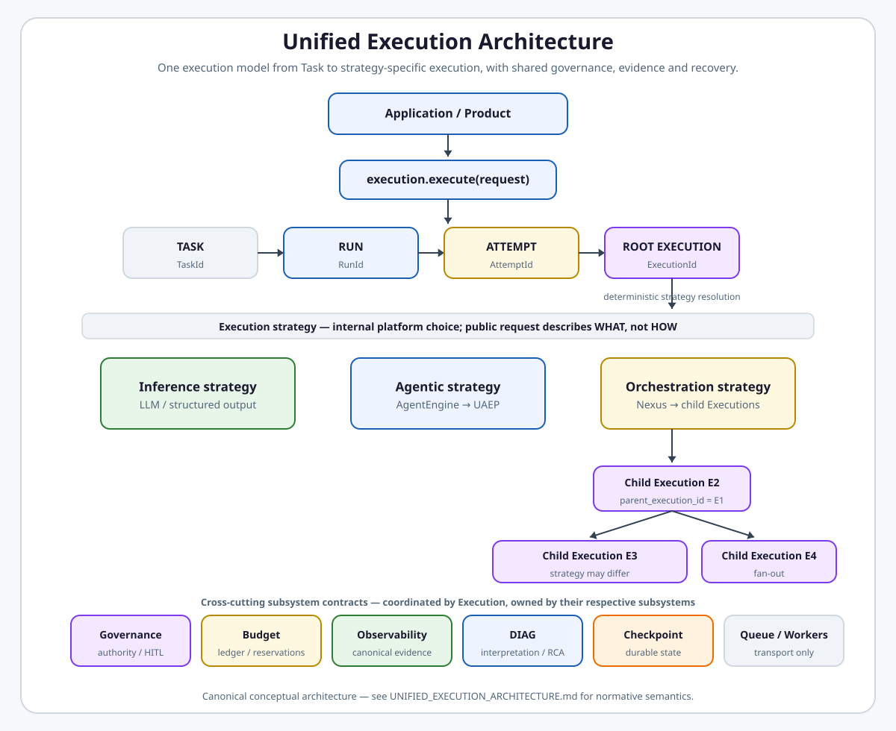

# Unified Execution Architecture

**Status:** Canonical cross-domain meta-architecture (frozen target semantics)  
**Classification:** `META_ARCHITECTURE` — coordinates platform-wide cross-domain execution semantics across existing domain owners; **not** a new platform DOMAIN and **not** paired with a 1:1 implementation plan  
**Owner:** Intergrax Platform Architecture (semantic coordination)  
**Audience:** Principal architects, domain owners, implementers, Cursor implementation sessions  
**Registered in:** [`intergrax_runtime_architecture.md`](intergrax_runtime_architecture.md#architecture-artifact-classification-register)  
**Last updated:** 2026-08-29 — **UE-8P3** pluggable `ExecutionAuthorityPolicy`, **UEA-INV-022** mandatory authority checkpoint

---

## 1. Purpose

This document establishes the **canonical Unified Execution mental model** for Intergrax: identity hierarchy, execution tree, ownership boundaries, and architectural invariants that cut across UER, Orchestration, Nexus, Agent/UAEP, Governance, Budget, Observability, Reliability/HITL, checkpointing, transport, and DIAG.

It answers:

```text
What is the fundamental execution unit?
How do Task, Run, Attempt, and Execution relate?
Where does Nexus sit relative to direct execution?
How do Agent/UAEP relate to Execution?
Who owns which semantic?
What MUST / MUST NOT happen at runtime?
```

**This document coordinates semantics; it does not replace domain owners.** Detailed contracts, APIs, and implementation roadmaps remain in the owning domain architecture/plan pairs listed in [§16 Canonical ownership matrix](#16-canonical-ownership-matrix).

**Normative authority:** Sections marked **TARGET ARCHITECTURE** are frozen. **CURRENT IMPLEMENTATION** and **MIGRATION GAPS** describe the as-built state without elevating it over target semantics.

---

## 2. Classification and topology

| Property | Value |
|----------|-------|
| **Topology class** | `META_ARCHITECTURE` (cross-domain semantic coordination model) |
| **Domain pair** | **None** — no `maintainers/plans/UNIFIED_EXECUTION_ARCHITECTURE.md` |
| **Relationship to UER** | UER owns Run/Attempt lifecycle and execution coordination contracts; this model defines cross-domain identity and tree semantics UER and others MUST align with |
| **Relationship to domain pairs** | Each row in [§16](#16-canonical-ownership-matrix) retains detailed semantic ownership |

Do not promote this file to a DOMAIN. Do not create competing owners for capabilities already assigned to UER, ORCHESTRATION, NEXUS_EXECUTION_FLOW, OBSERVABILITY, GOVERNED_EXECUTION, RELIABILITY_FAILURE_AND_HITL, or AGENT_CONTRACTS_AND_ASSEMBLY.

<a href="intergrax_runtime_architecture.md">
<picture>
  <source media="(prefers-color-scheme: dark)" srcset="assets/unified-execution-full-architecture-dark.svg">
  <source media="(prefers-color-scheme: light)" srcset="assets/unified-execution-full-architecture-light.svg">
  
</picture>
</a>

---

## 3. Mental model — identity hierarchy

**TARGET ARCHITECTURE**

The canonical lifecycle identity hierarchy is:

```text
TaskId
  ↓
RunId
  ↓
AttemptId
  ↓
ExecutionId
  ↓
EventId
```

Every **Run Attempt** contains at least one **root Execution**. Even the simplest public call:

```text
await execution.execute(...)
```

conceptually becomes:

```text
Task
└── Run
    └── Attempt
        └── Root Execution
```

Direct execution **MUST NOT** require Nexus merely because execution identity, governance, or observability exist (see **UEA-INV-008**).

<a href="UNIFIED_EXECUTION_RUNTIME.md">
<picture>
  <source media="(prefers-color-scheme: dark)" srcset="assets/unified-execution-simple-execute-flow-dark.svg">
  <source media="(prefers-color-scheme: light)" srcset="assets/unified-execution-simple-execute-flow-light.svg">
  
</picture>
</a>

### 3.1 Layer definitions (summary)

| Layer | What it is | Owner of semantics |
|-------|------------|-------------------|
| **Task** | Canonical work intent — what the user or system wants to achieve | Task/intake contract ([`ORCHESTRATION.md`](ORCHESTRATION.md) §10.1, application intake) |
| **Run** | One complete governed lifecycle of a Task | [`UNIFIED_EXECUTION_RUNTIME.md`](UNIFIED_EXECUTION_RUNTIME.md) (UER) |
| **Attempt** | One global attempt of the Run; local provider/tool/step retries do **not** automatically mint a new AttemptId | UER |
| **Execution** | A concrete, independently schedulable/governable unit of work inside an Attempt | Unified Execution Runtime / execution lifecycle layer |
| **Event** | One canonical runtime fact or transition | Observability spine + UER event contract |

**CURRENT IMPLEMENTATION:** Typed `TaskId`, `RunId`, `AttemptId`, and `EventId` exist. **`ExecutionId` is not yet a canonical Python identity** (see [§18 Migration gaps](#18-target-vs-current-implementation-and-migration-gaps)).

<a href="UNIFIED_EXECUTION_RUNTIME.md">
<picture>
  <source media="(prefers-color-scheme: dark)" srcset="assets/unified-execution-identity-lifecycle-dark.svg">
  <source media="(prefers-color-scheme: light)" srcset="assets/unified-execution-identity-lifecycle-light.svg">
  
</picture>
</a>

---

## 4. Execution tree

**TARGET ARCHITECTURE**

Execution supports hierarchical composition. The **one canonical runtime Execution Tree**:

```text
Execution E1
├── Execution E2
├── Execution E3
│   ├── Execution E5
│   └── Execution E6
└── Execution E4
```

Each Execution has:

- `execution_id` — unique within the Attempt (and globally addressable with Run/Attempt context)
- `parent_execution_id` — `None` for root; parent `ExecutionId` for children

Other subsystems may hold **projections or views** but **MUST NOT** create competing execution trees (**UEA-INV-005**).

---

## 5. Node vs Execution

**TARGET ARCHITECTURE**

| Concept | What it is | What it is not |
|---------|------------|----------------|
| **Node / NodeId** | Definition/topological position in an `OrchestrationDefinition` | A runtime instance of work |
| **Execution / ExecutionId** | Specific runtime instance of independently executable work | A graph topology slot |

**Example — dynamic fan-out:**

```text
Node: analyze_customer

Runtime:
  Execution E101 → customer A
  Execution E102 → customer B
  Execution E103 → customer C
```

Same `NodeId`. Different `ExecutionId`s. Orchestration topology **MUST NOT** be described as the canonical runtime Execution Tree (**UEA-INV-006**).

**Owner:** Orchestration topology → [`ORCHESTRATION.md`](ORCHESTRATION.md); runtime Execution Tree → execution lifecycle layer / UER.

<a href="ORCHESTRATION.md">
<picture>
  <source media="(prefers-color-scheme: dark)" srcset="assets/unified-execution-topology-vs-execution-tree-dark.svg">
  <source media="(prefers-color-scheme: light)" srcset="assets/unified-execution-topology-vs-execution-tree-light.svg">
  
</picture>
</a>

---

## 6. Orchestration

**TARGET ARCHITECTURE**

Orchestration is a **strategy for realizing an Execution** by coordinating child Executions.

```text
Execution E1
  strategy = orchestration
        ↓
       Nexus
        ↓
   child Executions
```

- Nested/hierarchical orchestration is architecturally legal (**UEA-INV-019**).
- Initial implementation may constrain max execution depth, orchestration depth, fan-out, or active children — the architecture **MUST NOT** assume a permanently flat DAG.
- **Do not invent `OrchestrationRunId`.** A child orchestration does **not** automatically create a new `RunId`.

**Owner:** Orchestration topology and configuration → [`ORCHESTRATION.md`](ORCHESTRATION.md). Runtime scheduling/control flow → [`NEXUS_EXECUTION_FLOW.md`](NEXUS_EXECUTION_FLOW.md).

<a href="ORCHESTRATION.md">
<picture>
  <source media="(prefers-color-scheme: dark)" srcset="assets/unified-execution-nested-orchestration-dark.svg">
  <source media="(prefers-color-scheme: light)" srcset="assets/unified-execution-nested-orchestration-light.svg">
  
</picture>
</a>

---

## 7. Nexus

**TARGET ARCHITECTURE**

Nexus answers: **WHAT EXECUTES NEXT?**

Nexus owns orchestration **runtime** concerns:

- readiness, dependencies, scheduling
- fan-out, parallelism, merge
- handoff/delegation topology
- orchestration-level failure decisions
- instantiation and scheduling of child Executions

**Target boundary:**

```text
Nexus
  ↓
Execution Boundary
  ↓
child Execution
```

Nexus **MUST NOT** be defined as (**UEA-INV-007**):

- the universal AI executor
- the owner of Run lifecycle
- the owner of canonical execution identity
- the budget ledger
- the diagnostic engine
- the observability store

Nexus orchestrates **Executions**, not Agents as the canonical abstraction. Agent invocation occurs **below** the execution boundary when an Execution's strategy is agentic.

**CURRENT IMPLEMENTATION / MIGRATION GAP:** `GraphExecutor` remains agent-centric and may call `AgentEngine` directly. That is implementation debt, not target semantics.

**Owner:** [`NEXUS_EXECUTION_FLOW.md`](NEXUS_EXECUTION_FLOW.md).

<a href="NEXUS_EXECUTION_FLOW.md">
<picture>
  <source media="(prefers-color-scheme: dark)" srcset="assets/unified-execution-orchestration-nexus-flow-dark.svg">
  <source media="(prefers-color-scheme: light)" srcset="assets/unified-execution-orchestration-nexus-flow-light.svg">
  
</picture>
</a>

---

## 8. Agent and UAEP

**TARGET ARCHITECTURE**

**Agent ≠ Execution.**

| Concept | What it is | Owner |
|---------|------------|-------|
| **Agent / AgentDefinition** | Reusable specialized executor definition/configuration | [`AGENT_CONTRACTS_AND_ASSEMBLY.md`](AGENT_CONTRACTS_AND_ASSEMBLY.md) |
| **Execution** | Runtime instance of schedulable work | Execution lifecycle layer |

One `AgentDefinition` may execute many Executions.

```text
Execution
  ↓  (agentic strategy)
AgentEngine
  ↓
UAEP
  ↓
steps → HarnessKernel / tools / model / memory
```

UAEP remains **agent-specific** runtime behavior. Do **not** redefine the current agent `RuntimeExecutionContext` as the generic platform-wide execution context in this model.

Conceptual placeholders (`ExecutionEnvelope`, `ExecutionResult`, `ExecutionService`) are **not** frozen API names in this slice.

---

## 9. Internal step vs child Execution

**TARGET ARCHITECTURE**

Many internal operations remain inside one Execution:

```text
LLM → tool → reasoning → tool → validation → result
```

**Decision rule:** If the platform can independently schedule, govern, retry, budget, cancel, observe, or delegate the unit as standalone work → **Execution**. Otherwise → internal step/operation of the parent Execution.

Do **not** create a second general-purpose arbitrary DAG runtime for internal agent steps.

**Owner:** Agent steps → UAEP; child Executions → execution lifecycle + Nexus when orchestrated.

---

## 9a. Optional Decision Lifecycle inside Execution

**TARGET ARCHITECTURE**

Not every Execution requires a Decision Lifecycle. When profiled, semantic decision progression runs **inside** the Nexus execution model — not as a parallel Decision Runtime:

```text
Execution (Nexus)
└ optional Decision Lifecycle
   ├── Strategy / Proposal (optional Deliberation)
   ├── Verification
   ├── Revision (optional)
   ├── Adjudication (optional)
   └── Resolution / Finalization
```

Nexus owns scheduling, checkpoint, budget, and technical retry. Decision Lifecycle owns semantic progression (`ACCEPTED` / `REJECTED` / `UNRESOLVED`). Governed Execution answers whether an **exact Decision Version** may execute — separate from decision correctness.

**Canonical:** [`DECISION_SYSTEM.md`](DECISION_SYSTEM.md) · [`DECISION_VERIFICATION.md`](DECISION_VERIFICATION.md) · [`DECISION_DELIBERATION.md`](DECISION_DELIBERATION.md). **CURRENT production:** [`CRITIC_VERIFICATION.md`](CRITIC_VERIFICATION.md).

---

## 10. Retry, pause, and resume

**TARGET ARCHITECTURE**

| Scenario | TaskId | RunId | AttemptId | ExecutionId |
|----------|--------|-------|-----------|-------------|
| Provider/tool/step retry | same | same | same | same (+ local retry metadata/events) |
| Execution-level retry of same logical execution | same | same | same | same (+ execution retry generation/counter/events) |
| Whole-Run retry | same | same | **new** | **new** instances for the new Attempt |
| Pause/resume (incl. HITL) | same | same | same | same |
| Worker crash / queue redelivery (same work) | same | same | same | same |

Pause/resume is **not** retry (**UEA-INV-012**, **UEA-INV-013**, **UEA-INV-014**).

**Owners:** Attempt boundaries and Run lifecycle → UER; retry policy layers → [`RELIABILITY_FAILURE_AND_HITL.md`](RELIABILITY_FAILURE_AND_HITL.md); HITL decision → Governance/HITL.

<a href="RELIABILITY_FAILURE_AND_HITL.md">
<picture>
  <source media="(prefers-color-scheme: dark)" srcset="assets/unified-execution-retry-pause-resume-cancel-dark.svg">
  <source media="(prefers-color-scheme: light)" srcset="assets/unified-execution-retry-pause-resume-cancel-light.svg">
  
</picture>
</a>

---

## 11. Distributed execution and transport

**TARGET ARCHITECTURE**

Transport/worker identity is **infrastructure identity**, not runtime execution identity.

Examples: `message_id`, broker task id, `delivery_id`, `lease_id`, `worker_id`.

Workers **receive** runtime identity; they do **not** invent a new Run because transport changed (**UEA-INV-011**).

Canonical distributed target:

```text
Execution Boundary / scheduler
  ↓ canonical Execution identity established
  ↓ immutable transport-safe execution envelope / reference
MessageBus / queue
  ↓ worker receives SAME runtime identity
  ↓ required transport → Execution causal evidence
Execution Boundary admission
  ↓ strategy executor / registered work
```

Conceptual future transport envelope preserves: `TaskId`, `RunId`, `AttemptId`, `ExecutionId`, tenant, effective authority, bounded budget allowance, input/context/policy references, causal/trace correlation. Exact Python schema is **not** frozen here.

**Owner:** Queue/transport/worker execution → [`BACKGROUND_TASKS.md`](BACKGROUND_TASKS.md). [`AGENT_DISTRIBUTION.md`](AGENT_DISTRIBUTION.md) covers package installation/activation only — not distributed execution identity. [`ELASTIC_CAPACITY_AND_SCALING.md`](ELASTIC_CAPACITY_AND_SCALING.md) may constrain worker capacity but does not own Execution identity.

<a href="BACKGROUND_TASKS.md">
<picture>
  <source media="(prefers-color-scheme: dark)" srcset="assets/unified-execution-distributed-queue-worker-dark.svg">
  <source media="(prefers-color-scheme: light)" srcset="assets/unified-execution-distributed-queue-worker-light.svg">
  
</picture>
</a>

---

## 12. Governance and authority

**TARGET ARCHITECTURE**

Governance owns policy/authority **decisions** and wider governance semantics. Execution **coordinates** with Governance but does **not** absorb it. `ExecutionAuthorityPolicy` owns **child authority-resolution strategy only** — it is **not** a replacement for `PolicyEngine` / Governance.

Every Execution enters governance with canonical identity, tenant/scope, effective authority, execution requirements, and relevant action/effect context. Governance answers whether the Execution or operation is allowed; UER/Execution Runtime applies the lifecycle consequence.

### 12.1 Mandatory authority checkpoint vs pluggable strategy

Intergrax separates two concerns:

**A. Mandatory platform checkpoint (not configurable off)**

Every child Execution **MUST** pass authority resolution before execution admission. Developers **MUST NOT** disable this checkpoint (`authority_check = off` is forbidden) or bypass it from Nexus, executors, or custom plugins.

**B. Pluggable decision strategy (replaceable)**

The execution engine does not hard-code a single inheritance algorithm. At the checkpoint it invokes the configured **`ExecutionAuthorityPolicy`**, which returns **`ChildAuthorityResolution`**. The policy implementation is replaceable; the checkpoint is not.

```text
Parent Execution
      ↓
Child Execution request
      ↓
MANDATORY Authority Policy Checkpoint
      ↓
ExecutionAuthorityPolicy
      ↓
ChildAuthorityResolution
      ↓
Execution Boundary (admission)
      ↓
Child Execution
```

For orchestration:

```text
Parent Execution
      ↓
Nexus decides WHAT executes next
      ↓
child Execution request
      ↓
mandatory authority checkpoint
      ↓
configured ExecutionAuthorityPolicy
      ↓
Execution Boundary
      ↓
Child Execution
```

Nexus **does not** compute authority, load authority plugins, or bypass the checkpoint.

**Platform invariant:** Every child Execution **MUST** pass the configured `ExecutionAuthorityPolicy` before execution admission (**UEA-INV-022**).

### 12.2 Default platform strategy: `DefaultStrictAuthorityPolicy`

When the developer configures nothing, Intergrax uses **`DefaultStrictAuthorityPolicy`** as the safe platform default. It preserves UE-8A semantics:

- normal child without explicit delegation → inherits immediate parent authority unchanged
- explicit delegation (`requested_permission_scopes` is a tuple, including empty) → resulting authority **cannot exceed** immediate parent authority
- nested child comparisons use **immediate parent Execution authority**, not root Run authority and not orchestration `depends_on` graph topology
- `None` ≠ empty tuple: `None` means inherit parent with no delegation evidence; `()` triggers explicit delegation narrowing

`DefaultStrictAuthorityPolicy` enforces **monotonic narrowing**: child authority cannot exceed immediate parent authority. This is **default platform behavior**, not a universal law — custom `ExecutionAuthorityPolicy` implementations may define different strategies (e.g. strict narrowing, governed elevation, tenant-specific corporate authority, regulated-domain rules). **Governed elevation** and similar strategies are **custom / future** implementations unless explicitly shipped — do not describe them as current platform contracts.

**Do not** state as universal platform law: “every child authority must be a subset of parent authority.” State instead that the **configured policy** decides at the mandatory checkpoint; the platform default applies strict narrowing (**UEA-INV-009** describes default strict behavior).

### 12.3 Custom `ExecutionAuthorityPolicy` and plugin resolution

Developers may supply a custom policy through:

1. **Direct instance override** — inject `ExecutionAuthorityPolicy` at composition time (highest precedence).
2. **Python entry-point plugin** — register under entry-point group **`intergrax.execution_authority_policies`**.
3. **Platform default** — `DefaultStrictAuthorityPolicy` when neither override is configured.

**Resolution order:** explicit instance → explicit entry-point id → `DefaultStrictAuthorityPolicy`.

**Fail-closed:**

- no policy configured → safe platform default (`DefaultStrictAuthorityPolicy`)
- explicit entry-point id configured but missing or invalid → composition **fails closed** (no silent fallback)

### 12.4 Composition-time resolution

Policy is resolved **once** during runtime composition, not per child Execution:

```text
RuntimeConfig
  → build_nexus_loop_from_environment
  → resolve_execution_authority_policy_from_runtime_config(...)
  → resolved ExecutionAuthorityPolicy
  → NexusLoop
  → GraphExecutor
  → ChildExecutionRunner
```

A plugin **MUST NOT** seize Execution lifecycle ownership or bypass the Execution Boundary.

### 12.5 Ownership

| Layer | Owns |
|-------|------|
| **Execution lifecycle layer** | Mandatory authority checkpoint integration; child execution admission path; active Execution authority binding |
| **`ExecutionAuthorityPolicy`** | Authority-resolution strategy only |
| **Nexus** | What executes next; child work requests — **not** authority algorithm, plugin loading, or checkpoint bypass |
| **Governance** | Policy/authority decisions and wider governance semantics; custom policies may integrate in future |

```text
Run authority context
  ↓
Execution
  ↓
[mandatory checkpoint → configured policy]
  ↓
child Execution
  ↓
Agent
  ↓
Tool
```

**Owner (governance decisions):** [`GOVERNED_EXECUTION.md`](GOVERNED_EXECUTION.md).

**CURRENT IMPLEMENTATION (UE-8P2 / UE-8P2R1):** `ExecutionAuthorityPolicy` Protocol; `DefaultStrictAuthorityPolicy`; direct instance override; entry-point plugin registry; `RuntimeConfig` composition wiring; explicit missing plugin fails closed.

**TARGET / FUTURE:** governed-elevation and richer authority strategies when explicitly implemented — **not** current production contracts.

**MIGRATION GAP (broader):** legacy graph/node-centric authority paths may still exist outside the canonical child admission checkpoint on some surfaces; converge on Execution-tree-centric checkpoint admission.

---

## 13. Budget

**TARGET ARCHITECTURE**

`RunBudget` remains the global budget source of truth.

```text
Run Budget
└── Execution allowance
    └── child Execution allowance
```

Budget subsystem owns accounting, reservations, consumption, release/reconciliation, and enforcement. Execution coordinates access; Nexus requests work under available reservation; Agent/Tool consume through platform budget contracts. Execution and Nexus **MUST NOT** implement competing budget ledgers in StrategyResolver, inference executor, AgentEngine, or workers (**UEA-INV-010**).

**Budget is part of admission:** a child Execution **MUST NOT** be admitted when required bounded budget cannot be reserved or authorized. For parallel fan-out, children collectively **MUST NOT** overcommit the parent allowance (`parent allowance → reservations for E2/E3/… → consumption → release/reconciliation`).

**CURRENT IMPLEMENTATION / MIGRATION GAP:** Hierarchical budget reservation is not yet the full target model.

**Forward-looking (UE-8B):** The same mandatory-checkpoint / pluggable-strategy architecture is intended to be reused for Execution budget allocation; budget strategy ownership belongs to UE-8B and is not frozen by UE-8P3.

<a href="GOVERNED_EXECUTION.md">
<picture>
  <source media="(prefers-color-scheme: dark)" srcset="assets/unified-execution-governance-budget-inheritance-dark.svg">
  <source media="(prefers-color-scheme: light)" srcset="assets/unified-execution-governance-budget-inheritance-light.svg">
  
</picture>
</a>

---

## 14. Cancellation

**TARGET ARCHITECTURE**

Cancellation follows the Execution Tree.

- **Cancel Run** → root and entire Execution Tree
- **Cancel Execution E** → E and all descendants

Nexus may stop scheduling dependent topology nodes after cancellation. Worker transport cancellation may carry infrastructure-specific mechanics, but transport cancellation **MUST NOT** create a second canonical cancellation tree.

No new cancellation identity hierarchy is required.

---

## 15. HITL

**TARGET ARCHITECTURE**

HITL/Governance owns the **human decision**. Execution owns the **lifecycle consequence**:

```text
Execution
  ↓ governance outcome REQUIRE_HUMAN
UER → PAUSED / WAITING_FOR_HUMAN
  ↓ canonical HITL decision store / evidence
authorized decision
  ↓
UER resumes SAME Execution identity
  ↓
strategy continues
```

Human decision is **not** a retry, new Attempt, new Run, or automatic authority expansion. Nexus involvement is conditional — only when the paused Execution uses orchestration strategy. Direct inference or agentic Executions may use HITL without Nexus.

Resume causality must be auditable: authorized decision → Execution resumed. Identity preserved across pause/resume (**UEA-INV-012**).

**Owners:** HITL decision → Governance/HITL ([`GOVERNED_EXECUTION.md`](GOVERNED_EXECUTION.md), [`RELIABILITY_FAILURE_AND_HITL.md`](RELIABILITY_FAILURE_AND_HITL.md)); lifecycle transitions → UER; Reliability may recommend or escalate to HITL but does not own human decision authority.

---

## 16. Checkpointing

**TARGET ARCHITECTURE**

Checkpoint subsystem persists durable recovery state. Checkpoint is **not** execution identity authority.

One canonical Run-scoped checkpoint model must be capable of preserving: `RunId`, current `AttemptId`, root `ExecutionId`, Execution Tree, per-Execution lifecycle state, orchestration readiness/scheduling state, Agent/UAEP cursors, pending HITL, budget reservations/reconciliation where required, cancellation state, and required recovery/idempotency state.

There is **no** separate Nexus checkpoint truth, Agent checkpoint truth, or worker checkpoint identity tree — subsystem-local snapshot structures may exist only as components of canonical recovery state.

Pause/resume preserves identity. Checkpoint restoration must resume canonical logical work and **MUST NOT** mint a new `ExecutionId` solely because process or worker changed. Whole-Run retry restoration is an explicit lifecycle decision and follows whole-Run retry identity semantics (**UEA-INV-014**).

**CURRENT IMPLEMENTATION / MIGRATION GAP:** `RuntimeCheckpoint` has no canonical Execution Tree representation.

<a href="RELIABILITY_FAILURE_AND_HITL.md">
<picture>
  <source media="(prefers-color-scheme: dark)" srcset="assets/unified-execution-checkpoint-recovery-dark.svg">
  <source media="(prefers-color-scheme: light)" srcset="assets/unified-execution-checkpoint-recovery-light.svg">
  
</picture>
</a>

---

## 17. Observability

**TARGET ARCHITECTURE**

Observability **records** execution truth; it does **not** invent execution truth (**UEA-INV-015**).

```text
Task → Run → Attempt → Execution Tree → RuntimeEvents
  → canonical evidence persistence / HOS
  → derived projections (e.g. Unified Run Journal)
```

`RuntimeEvent` will conceptually require `ExecutionId` in the target architecture. `parent_event_id` and `parent_execution_id` are **different** relationships; one cannot always be reconstructed from the other.

**Owner:** [`OBSERVABILITY.md`](OBSERVABILITY.md).

**CURRENT IMPLEMENTATION / MIGRATION GAP:** `RuntimeEvent` currently lacks `ExecutionId`; identity spine stops at `TaskId`/`RunId`/`AttemptId`/`EventId`.

<a href="OBSERVABILITY.md">
<picture>
  <source media="(prefers-color-scheme: dark)" srcset="assets/unified-execution-observability-diag-causal-flow-dark.svg">
  <source media="(prefers-color-scheme: light)" srcset="assets/unified-execution-observability-diag-causal-flow-light.svg">
  
</picture>
</a>

---

## 18. DIAG — diagnostic interpretation

**TARGET ARCHITECTURE**

Intergrax has **one** canonical diagnostic engine. Division of labor:

| Layer | Role |
|-------|------|
| **Execution** | Produces lifecycle and causal facts |
| **Observability** | Records canonical evidence |
| **DIAG** | Interprets evidence: what happened, why, what caused it, where failure originated |

DIAG **MUST NOT** (**UEA-INV-016**):

- mint `ExecutionId`
- create competing execution identity
- heuristically recreate the canonical Execution Tree from text logs
- own execution lifecycle

Target causal chain:

```text
Event → Execution → parent Execution(s) → Attempt → Run → Task
```

without heuristic guessing.

**CURRENT IMPLEMENTATION / MIGRATION GAP:** DIAG `RuntimeExecutionRef` currently stops at `TaskId`/`RunId`/`AttemptId`.

---

## 19. Causal admission

**TARGET ARCHITECTURE — UEA-INV-017**

Every independently schedulable Execution must establish **durable causal lineage** before meaningful work begins.

```text
mint child Execution E2
  ↓
establish/persist parent/trigger relation (E1 → E2)
  ↓
admit E2
  ↓
meaningful work
```

Likewise for transport:

```text
transport task
  ↓
durable transport → Execution causal evidence
  ↓
worker meaningful execution
```

Relationships required for audit/causality may be fail-closed evidence. Not every debug metric/event is fail-closed. Exact persistence APIs are not prescribed here.

**Owner:** Causal evidence recording → Observability (DIAG-1 plane); interpretation → DIAG.

---

## 20. Execution boundary

**TARGET ARCHITECTURE — UEA-INV-018**

> **Execution coordinates contracts; it does not absorb subsystem ownership.**

The execution layer is a **coordination boundary**, not a monolithic subsystem owner or a god object.

It may coordinate: lifecycle through UER, Governance admission, Budget reservation/consultation, Observability/evidence establishment, executor strategy selection, Nexus for orchestration, checkpoint/cancellation interfaces, and reliability coordination.

It **MUST NOT** absorb implementation ownership of: policy definitions or evaluation semantics, budget ledger, observability persistence, diagnostic interpretation, checkpoint persistence backend, transport backend, or Agent internals.

Preferred mental model:

```text
Execution Boundary
  → asks Governance
  → reserves/consults Budget
  → establishes evidence
  → invokes executor strategy
  → emits lifecycle facts
  → coordinates reliability / checkpoint / cancellation
```

Subsystem owners retain their state and decision semantics.

### 20.1 Shared execution guarantees

**Execution strategy may vary. Mandatory platform guarantees may not.**

Every independently executable unit enters the canonical Execution Boundary. Every child Execution **re-enters** that same boundary. This is **not** middleware decoration around the public API only — the guarantee is **per Execution**. Nested work **MUST NOT** assume “the parent was governed, therefore the child can call executor internals directly.”

**Mandatory for every Execution:**

- canonical runtime identity
- tenant/scope isolation
- effective authority context
- mandatory authority policy checkpoint (configured `ExecutionAuthorityPolicy` for child admission)
- governance admission / relevant policy evaluation
- budget context / bounded allowance
- lifecycle/audit facts
- observability correlation/evidence
- cancellation semantics
- explicit terminal lifecycle state

**Conditionally activated but platform-enforced when applicable:**

- detailed guardrails
- tool policy
- meaningful side-effect authorization
- HITL
- checkpointing
- recovery
- distributed causal admission
- compensation
- side-effect fencing/idempotency

**Important distinction:** “mandatory guarantee” does **not** mean every Execution executes every possible policy rule or persists a checkpoint. It means the canonical platform boundary decides whether the mechanism applies, and an executor **may not bypass** that decision.

Examples:

- **Simple inference:** governance boundary exists; result may be ALLOW; no tool side-effect policy when there is no tool effect.
- **Mutating tool:** governance boundary exists; may require authority, side-effect policy, guardrail, or HITL.

Do **not** model this as identical middleware actions for all strategies.

### 20.2 Strategy-independent admission

```text
execution.execute(...)
        ↓
canonical Execution Boundary
        ↓
mandatory shared guarantees
        ↓
strategy resolution
   ┌──────────┼───────────┐
   ↓          ↓           ↓
inference   agentic   orchestration
                        ↓
                      Nexus
                        ↓
                 child Execution request
                        ↓
             mandatory authority checkpoint
                        ↓
             canonical Execution Boundary
                        ↓
              mandatory guarantees again
```

| Strategy | Target admission path |
|----------|----------------------|
| **Direct inference** | Execution Boundary → governance/budget/evidence → InferenceExecutor |
| **Agentic** | Execution Boundary → governance/budget/evidence → AgentEngine/UAEP |
| **Orchestration** | Execution Boundary → governance/budget/evidence → Nexus |
| **Nexus child** | Nexus → request child Execution → mandatory authority checkpoint → Execution Boundary → governance/budget/evidence → child's strategy executor |

Nexus **MUST NOT** rely on “parent governance already happened” to call AgentEngine or another executor directly. Hard requirement for UE-1+.

---

## 21. Strategy resolution

**TARGET ARCHITECTURE — UEA-INV-020**

Developer-facing requests express **what** is required, not low-level engine selection. Internal strategy selection should be deterministic from explicit requirements/capabilities.

Strategy resolution **MUST NOT** silently invent orchestration topology. Dynamically generated topology must become an explicit, validated, governable, and auditable `OrchestrationDefinition` (or equivalent planning artifact) **before** Nexus executes it.

Do **not** freeze target public APIs such as `mode="react"`, `execute_agent()`, etc.

**TARGET ARCHITECTURE — UEA-INV-021**

No execution strategy may bypass the canonical Execution Boundary or its mandatory platform guarantees. Every child Execution re-enters the same canonical boundary.

---

## 22. Canonical ownership matrix

| Concept / responsibility | Canonical owner | Detailed semantics |
|--------------------------|-----------------|-------------------|
| Task intent | Task/intake contract | [`ORCHESTRATION.md`](ORCHESTRATION.md) §10.1 |
| Run lifecycle | UER | [`UNIFIED_EXECUTION_RUNTIME.md`](UNIFIED_EXECUTION_RUNTIME.md) |
| Attempt lifecycle | UER | [`UNIFIED_EXECUTION_RUNTIME.md`](UNIFIED_EXECUTION_RUNTIME.md) |
| Execution identity / Execution Tree | Execution lifecycle layer (UER coordination) | This model + UER |
| Orchestration topology | ORCHESTRATION | [`ORCHESTRATION.md`](ORCHESTRATION.md) |
| Orchestration scheduling / control flow | Nexus | [`NEXUS_EXECUTION_FLOW.md`](NEXUS_EXECUTION_FLOW.md) |
| Agent execution | AgentEngine / UAEP | [`AGENT_CONTRACTS_AND_ASSEMBLY.md`](AGENT_CONTRACTS_AND_ASSEMBLY.md) |
| Governance / authority decisions | GOVERNED_EXECUTION | [`GOVERNED_EXECUTION.md`](GOVERNED_EXECUTION.md) |
| Child authority-resolution strategy | `ExecutionAuthorityPolicy` (platform default: `DefaultStrictAuthorityPolicy`) | This model §12; implementation in execution lifecycle layer |
| Budget ledger | Budget subsystem (under existing owner) | UER + Context Engineering / platform budget contracts |
| HITL decision | Governance / HITL | GOVERNED_EXECUTION, RELIABILITY_FAILURE_AND_HITL |
| Checkpoint persistence / state | Long-running / checkpoint owner | UER, BACKGROUND_TASKS |
| Runtime event / evidence recording | OBSERVABILITY | [`OBSERVABILITY.md`](OBSERVABILITY.md) |
| Diagnostic interpretation | DIAG | Observability DIAG plane + future DIAG domain docs |
| Transport identity | Queue / transport subsystem | [`BACKGROUND_TASKS.md`](BACKGROUND_TASKS.md) |
| **Cross-domain execution semantics (this document)** | Platform Architecture | Coordinates only — does not steal ownership |

<a href="intergrax_runtime_architecture.md">
<picture>
  <source media="(prefers-color-scheme: dark)" srcset="assets/unified-execution-component-ownership-dark.svg">
  <source media="(prefers-color-scheme: light)" srcset="assets/unified-execution-component-ownership-light.svg">
  
</picture>
</a>

---

## 23. Glossary

Terms follow: **What it is** · **Who owns semantics** · **What it is not**.

### Identity and lifecycle

**Task** — Canonical work intent (`TaskId`). **Owner:** intake/Task contract. **Not:** a Run or an Execution instance.

**TaskId** — Stable identifier for work intent across retries and surfaces. **Owner:** Task/intake contract. Observability records/carries it; does not own creation semantics. **Not:** interchangeable with `RunId`.

**Run** — One complete governed lifecycle of a Task (`RunId`). **Owner:** UER. **Not:** an Attempt or a single agent session alias.

**RunId** — Identifier for one Run. **Owner:** UER. Observability records/carries it. **Not:** `TaskId` or `AttemptId`.

**Attempt** — One global try within a Run (`AttemptId`). **Owner:** UER. **Not:** every local tool retry or internal step retry.

**AttemptId** — Minted only at defined attempt boundaries (e.g. whole-Run retry). **Owner:** UER. **Not:** recreated on provider blips inside the same Attempt.

**Execution** — Independently schedulable/governable unit of work inside an Attempt. **Owner:** execution lifecycle layer. **Not:** an Agent, a Node, or a transport message.

**Root Execution** — Top-level Execution in an Attempt; `parent_execution_id = None`. **Owner:** execution lifecycle layer. **Not:** optional — every Attempt has at least one.

**Child Execution** — Execution with non-null `parent_execution_id`. **Owner:** execution lifecycle layer. **Not:** a UAEP step.

**ExecutionId** — Runtime identity of one Execution instance. **Owner:** execution lifecycle layer / UER coordination. **Not:** `NodeId`, `EventId`, or broker task id.

**Execution Tree** — Canonical parent/child graph of Executions within an Attempt. **Owner:** execution lifecycle layer. **Not:** orchestration topology or agent step list.

**Execution Strategy** — How an Execution is realized (direct, agentic, orchestration, etc.). **Owner:** execution coordination + domain executors. **Not:** a public `mode=` switch frozen here.

**Event** — One canonical runtime fact/transition. **Owner:** UER event model + Observability. **Not:** ad-hoc log lines.

**EventId** — Unique id per canonical event. **Owner:** UER event contract; Observability records event identity. **Not:** reusable across events.

### Orchestration and Nexus

**Orchestration** — Strategy coordinating child Executions to realize a parent Execution. **Owner:** ORCHESTRATION (topology) + Nexus (runtime). **Not:** synonymous with Nexus or UER.

**OrchestrationDefinition** — Validated, governable description of orchestration topology and policy inputs. **Owner:** ORCHESTRATION. **Not:** the runtime Execution Tree.

**Orchestration topology** — Nodes, edges, and structural relationships in a definition. **Owner:** ORCHESTRATION. **Not:** runtime Execution parent/child links.

**Node** — Topological slot in orchestration definition. **Owner:** ORCHESTRATION. **Not:** a running Execution.

**NodeId** — Identifier of a Node in definition space. **Owner:** ORCHESTRATION. **Not:** `ExecutionId`.

**Nexus** — Tier-1 control flow answering what Executes next; schedules child Executions. **Owner:** NEXUS_EXECUTION_FLOW. **Not:** universal executor, identity owner, or budget ledger.

### Agent stack

**Agent** — Domain decision unit / reusable executor role. **Owner:** AGENT_CONTRACTS_AND_ASSEMBLY. **Not:** an Execution.

**AgentDefinition** — Configuration/metadata for an Agent. **Owner:** ACP. **Not:** runtime Execution identity.

**AgentEngine** — Tier-1 engine running agent sessions for an Execution using agentic strategy. **Owner:** ACP / runtime. **Not:** Nexus or UER.

**UAEP** — Unified Agent Execution Protocol; step loop inside agentic Execution. **Owner:** UER §42.5 + ACP. **Not:** generic platform execution protocol for all strategies.

**Step** — Internal operation within one Execution (UAEP/HarnessKernel). **Owner:** UAEP. **Not:** child Execution unless independently schedulable per §9.

### Evidence, governance, operations

**RuntimeEvent** — Canonical persisted execution transition with typed identity. **Owner:** OBSERVABILITY + UER. **Not:** TraceEvent or unstructured logs.

**Execution Authority** — Effective permission envelope for an Execution, inherited and narrowable. **Owner:** GOVERNED_EXECUTION. **Not:** implicit graph defaults without audit.

**Budget allowance / reservation** — Bounded slice of Run budget assigned to an Execution or child. **Owner:** budget subsystem. **Not:** ad-hoc counters inside Nexus.

**HITL** — Human-in-the-loop governance mechanism; decision owned by Governance, lifecycle by Execution. **Owner:** GOVERNED_EXECUTION + RELIABILITY_FAILURE_AND_HITL. **Not:** a new identity layer.

**Checkpoint** — Run-scoped durable recovery state including tree and cursors. **Owner:** checkpoint/long-running owners. **Not:** source of truth for minting ExecutionId.

**Causal lineage** — Durable parent/trigger relations between Executions (and transport→Execution). **Owner:** Observability causal plane + execution admission. **Not:** inferred from logs.

**Causal evidence** — Persisted facts supporting lineage and DIAG. **Owner:** OBSERVABILITY. **Not:** DIAG-owned storage.

**Transport identity** — Broker/worker/delivery ids for infrastructure. **Owner:** queue/transport. **Not:** `RunId` or `ExecutionId`.

**Observability** — Records execution truth and projections. **Owner:** OBSERVABILITY. **Not:** lifecycle owner or DIAG.

**DIAG / Diagnostic Engine** — Interprets canonical evidence for explanation. **Owner:** DIAG (Observability plane today). **Not:** execution identity mint or lifecycle driver.

---

## 24. Architectural invariants (UEA-INV-*)

Stable IDs for implementation constraints. Map to domain invariants where they exist; do not contradict `SYS-INV-*` without architecture reopen.

| ID | Invariant | Related platform refs |
|----|-----------|----------------------|
| **UEA-INV-001** | One canonical identity hierarchy: TaskId → RunId → AttemptId → ExecutionId → EventId | UER §42.1; OBS §5 — *follow-up: align OBS/UER docs with ExecutionId in later UE-DOC slices* |
| **UEA-INV-002** | Every Run Attempt contains at least one root Execution | — |
| **UEA-INV-003** | Execution ≠ Agent; Agent is reusable executor definition | ACP, UER vs Nexus |
| **UEA-INV-004** | NodeId (definition topology) ≠ ExecutionId (runtime instance) | ORCHESTRATION |
| **UEA-INV-005** | One canonical Execution Tree per Attempt; no competing trees | — |
| **UEA-INV-006** | Orchestration topology ≠ canonical runtime Execution Tree | ORCHESTRATION vs this model |
| **UEA-INV-007** | Nexus orchestrates Executions; not owner of Run lifecycle, execution identity, budget, DIAG, or observability store | NEXUS_EXECUTION_FLOW |
| **UEA-INV-008** | Direct execution does not require Nexus | UER entry paths |
| **UEA-INV-009** | `DefaultStrictAuthorityPolicy` (platform default) enforces monotonic narrowing: child authority cannot exceed immediate parent; custom policies may differ | GOVERNED_EXECUTION, §12 |
| **UEA-INV-010** | Child budget ≤ effective parent allowance; no competing ledgers in Execution/Nexus | UER, Context budget |
| **UEA-INV-011** | Transport identity ≠ runtime execution identity | OBS DIAG-1, BACKGROUND_TASKS |
| **UEA-INV-012** | Pause/resume (incl. HITL) preserves Task/Run/Attempt/Execution identity | UER, REL |
| **UEA-INV-013** | Local retry (provider/tool/step/execution-level) does not mint new AttemptId | UER retry, REL R-layers |
| **UEA-INV-014** | Whole-Run retry: same TaskId+RunId, new AttemptId, new Execution instances | UER |
| **UEA-INV-015** | Observability records execution truth; does not invent it | OBS |
| **UEA-INV-016** | DIAG interprets evidence; does not mint ExecutionId or own lifecycle | OBS DIAG-1 |
| **UEA-INV-017** | Causal lineage established before independently schedulable meaningful work | OBS causal admission |
| **UEA-INV-018** | Execution boundary coordinates contracts; does not absorb subsystem ownership | — |
| **UEA-INV-019** | Nested orchestration is legal; depth/fan-out may be bounded in implementation | ORCHESTRATION, Nexus |
| **UEA-INV-020** | Strategy resolver must not silently invent unaudited orchestration topology | ORCHESTRATION |
| **UEA-INV-021** | No strategy may bypass Execution Boundary or mandatory guarantees; every child Execution re-enters the canonical boundary | GOVERNED_EXECUTION, UER, NEXUS |
| **UEA-INV-022** | Every child Execution MUST undergo authority resolution through the configured `ExecutionAuthorityPolicy` before admission; checkpoint is mandatory, strategy is replaceable | UE-8P, NEXUS_EXECUTION_FLOW |

**Follow-up:** UER/OBS identity tables aligned with five-ID target in UE-DOC-0.6. Remaining `SYSTEM_INVARIANTS.md` cross-reference sync is implementation hygiene, not an open architecture question.

---

## 25. Target vs current implementation and migration gaps

### TARGET ARCHITECTURE

Sections §3–§21 above.

### CURRENT IMPLEMENTATION (descriptive)

| Area | Current state |
|------|----------------|
| Identity spine | `TaskId`, `RunId`, `AttemptId`, `EventId` typed and wired on main harness paths |
| Active execution identity | `ActiveExecutionIdentity` carries `RunId` + `AttemptId` |
| Runtime events | `RuntimeEvent` requires Task/Run/Attempt/Event — **no ExecutionId** |
| DIAG refs | `RuntimeExecutionRef` stops at Task/Run/Attempt |
| Nexus | `GraphExecutor` agent-centric; direct `AgentEngine` / `AgentExecutionResult` dependency |
| Agent context | `RuntimeExecutionContext` is agent-specific |
| Checkpoint | `RuntimeCheckpoint` without canonical Execution Tree |
| Budget | Run-level budgeting exists; hierarchical execution allowances incomplete |
| Authority | `ExecutionAuthorityPolicy` + `DefaultStrictAuthorityPolicy`; composition-time resolution (UE-8P2); child admission checkpoint wired; legacy graph/node-centric paths may remain on some surfaces |

### MIGRATION GAPS (known)

1. Canonical Python identity lacks `ExecutionId`.
2. Execution Tree not represented in checkpoint or universal event envelope.
3. Nexus boundary not yet Execution-first.
4. Observability and DIAG not yet Execution-aware end-to-end.
5. Budget reservations not fully hierarchical per Execution tree.
6. Authority propagation not yet Execution-tree-centric.

Do **not** claim target behavior is already implemented.

**Detailed implementation mapping (UE-DOC-0.9):** canonical target→current→gap→transformation map — [`UNIFIED_EXECUTION_IMPLEMENTATION_MAP.md`](UNIFIED_EXECUTION_IMPLEMENTATION_MAP.md). Subordinate to this document; not an architecture authority.

**Implementation readiness gate (UE-DOC-0.10):** final pre-runtime audit — [`UNIFIED_EXECUTION_IMPLEMENTATION_READINESS.md`](UNIFIED_EXECUTION_IMPLEMENTATION_READINESS.md). **IMPLEMENTATION GATE: PASS** (baseline `fc7c76c999e3d49d0532c4bdd07941c688e2553c`).

---

## 26. Implementation interpretation rules

For Cursor and domain implementers:

1. **Implementation plans may realize this architecture; they may not redefine it.**
2. Treat **UEA-INV-*** as hard constraints unless architecture is explicitly reopened.
3. Each implementation slice must list **affected owners and contracts** (UER, OBS, Nexus, etc.).
4. If implementation appears to require violating an invariant, **stop** and reopen architecture — do not workaround silently.
5. **Current code shape is not authority** over frozen target semantics in this document.
6. **Do not create new generic runtime mechanisms** when an existing platform owner should provide the capability.
7. Prefer extending owning domain contracts over centralizing logic in a new pseudo-domain.

---

## 27. Required architecture views (UE-DOC-0.3)

**Diagram pack specification:** Production diagram asset contract, per-view semantics, naming, and embedding targets are defined in [`UNIFIED_EXECUTION_ARCHITECTURE_DIAGRAMS.md`](UNIFIED_EXECUTION_ARCHITECTURE_DIAGRAMS.md) (UE-DOC-0.3A). That document is subordinate to this file; graphic binaries are produced out of band per the asset contract there.

The twelve required views below are specified in detail in the diagram pack document:

| # | View | Purpose | MUST include | Ambiguity to eliminate |
|---|------|---------|--------------|------------------------|
| 1 | Full Unified Execution Architecture | End-to-end mental model | Identity hierarchy, Execution Tree, ownership matrix, boundary | Treating Nexus as universal executor |
| 2 | Simple `execute()` flow | Direct execution without orchestration | Task→Run→Attempt→root Execution; no Nexus requirement | Assuming Nexus always runs |
| 3 | Orchestration / Nexus flow | Orchestrated realization | Parent Execution, Nexus, child Executions | Confusing Node graph with Execution Tree |
| 4 | Topology vs Execution Tree | Definition vs runtime | NodeId vs ExecutionId fan-out | Single tree for both planes |
| 5 | Identity & lifecycle | ID minting rules | All five ID layers, Attempt boundaries | Local retry minting AttemptId |
| 6 | Retry / pause / resume / cancel | Recovery semantics | Tables from §10, §14 | Pause treated as retry |
| 7 | Nested orchestration | Legal hierarchy | Parent/child orchestration Executions, same Run | Inventing OrchestrationRunId |
| 8 | Distributed queue/worker | Transport vs runtime | Transport ids, causal admission, preserved runtime ids | Broker id as RunId |
| 9 | Governance + authority + budget | Inheritance | Narrow-only authority, allowance tree | Competing budget ledgers |
| 10 | Observability + DIAG causal flow | Evidence vs interpretation | Record vs invent; causal chain to Task | DIAG rebuilding tree from logs |
| 11 | Checkpoint / recovery | Durability | Tree, cursors, HITL, budget reservations | Checkpoint as identity source |
| 12 | Component ownership / dependency | Who owns what | Matrix §22, execution boundary | Execution absorbing Governance/OBS |

No placeholder screenshots in UE-DOC-0.2. Production diagrams are UE-DOC-0.3 scope.

---

## 28. Canonical reference scenarios

High-level matrix for later docs and tests. **Not** an implementation test suite.

| Scenario | Identity behavior | Nexus? | Child Executions? | Key causal evidence |
|----------|-------------------|--------|-------------------|---------------------|
| **A. Simple inference** | Task→Run→Attempt→single root Execution | No | No | Root execution events; no orchestration topology |
| **B. Autonomous agent with tools** | Same Attempt; one Execution; internal steps | No | No | Step/tool events under one ExecutionId (target) |
| **C. A→B→C orchestration** | One Run; parent Execution orchestrates sequential children | Yes | Yes (3+) | Parent→child lineage before each child runs |
| **D. Parallel fan-out** | One NodeId; many ExecutionIds | Yes | Yes (parallel) | Fan-out admission + per-branch ExecutionId |
| **E. Nested orchestration** | Same Run/Attempt; nested parent Executions | Yes (nested) | Yes (tree) | Multi-level parent_execution_id chain |
| **F. Local Execution retry** | Same Task/Run/Attempt/ExecutionId | Maybe | Unchanged tree | Retry generation events, not new Attempt |
| **G. Whole Run retry** | Same Task/Run; new Attempt; new ExecutionIds | Maybe | New tree instances | RETRY_SCHEDULED / new Attempt boundary |
| **H. HITL pause/resume** | All runtime ids preserved | Maybe | Unchanged | HITL decision → resume linkage |
| **I. Remote worker crash/redelivery** | Same runtime ids on redelivery | Maybe | Unchanged | Transport→Execution causal evidence |
| **J. Post-failure DIAG** | Read-only traversal Event→Execution→…→Task | N/A | N/A | Canonical evidence only; no DIAG minting |

---

## 29. Owning domain references

| Domain | Architecture | Plan |
|--------|--------------|------|
| UER | [`UNIFIED_EXECUTION_RUNTIME.md`](UNIFIED_EXECUTION_RUNTIME.md) | [`../maintainers/plans/UNIFIED_EXECUTION_RUNTIME.md`](../maintainers/plans/UNIFIED_EXECUTION_RUNTIME.md) |
| Orchestration | [`ORCHESTRATION.md`](ORCHESTRATION.md) | [`../maintainers/plans/ORCHESTRATION.md`](../maintainers/plans/ORCHESTRATION.md) |
| Nexus | [`NEXUS_EXECUTION_FLOW.md`](NEXUS_EXECUTION_FLOW.md) | [`../maintainers/plans/NEXUS_EXECUTION_FLOW.md`](../maintainers/plans/NEXUS_EXECUTION_FLOW.md) |
| Agent/UAEP | [`AGENT_CONTRACTS_AND_ASSEMBLY.md`](AGENT_CONTRACTS_AND_ASSEMBLY.md) | [`../maintainers/plans/AGENT_CONTRACTS_AND_ASSEMBLY.md`](../maintainers/plans/AGENT_CONTRACTS_AND_ASSEMBLY.md) |
| Observability | [`OBSERVABILITY.md`](OBSERVABILITY.md) | [`../maintainers/plans/OBSERVABILITY.md`](../maintainers/plans/OBSERVABILITY.md) |
| Governed Execution | [`GOVERNED_EXECUTION.md`](GOVERNED_EXECUTION.md) | [`../maintainers/plans/GOVERNED_EXECUTION.md`](../maintainers/plans/GOVERNED_EXECUTION.md) |
| Reliability / HITL | [`RELIABILITY_FAILURE_AND_HITL.md`](RELIABILITY_FAILURE_AND_HITL.md) | [`../maintainers/plans/RELIABILITY_FAILURE_AND_HITL.md`](../maintainers/plans/RELIABILITY_FAILURE_AND_HITL.md) |
| Background / transport | [`BACKGROUND_TASKS.md`](BACKGROUND_TASKS.md) | [`../maintainers/plans/BACKGROUND_TASKS.md`](../maintainers/plans/BACKGROUND_TASKS.md) |
| Agent distribution | [`AGENT_DISTRIBUTION.md`](AGENT_DISTRIBUTION.md) | [`../maintainers/plans/AGENT_DISTRIBUTION.md`](../maintainers/plans/AGENT_DISTRIBUTION.md) |

**Hub index:** [`intergrax_runtime_architecture.md`](intergrax_runtime_architecture.md)  
**Platform principles:** [`INTERGRAX_ARCHITECTURE_PRINCIPLES.md`](INTERGRAX_ARCHITECTURE_PRINCIPLES.md)
