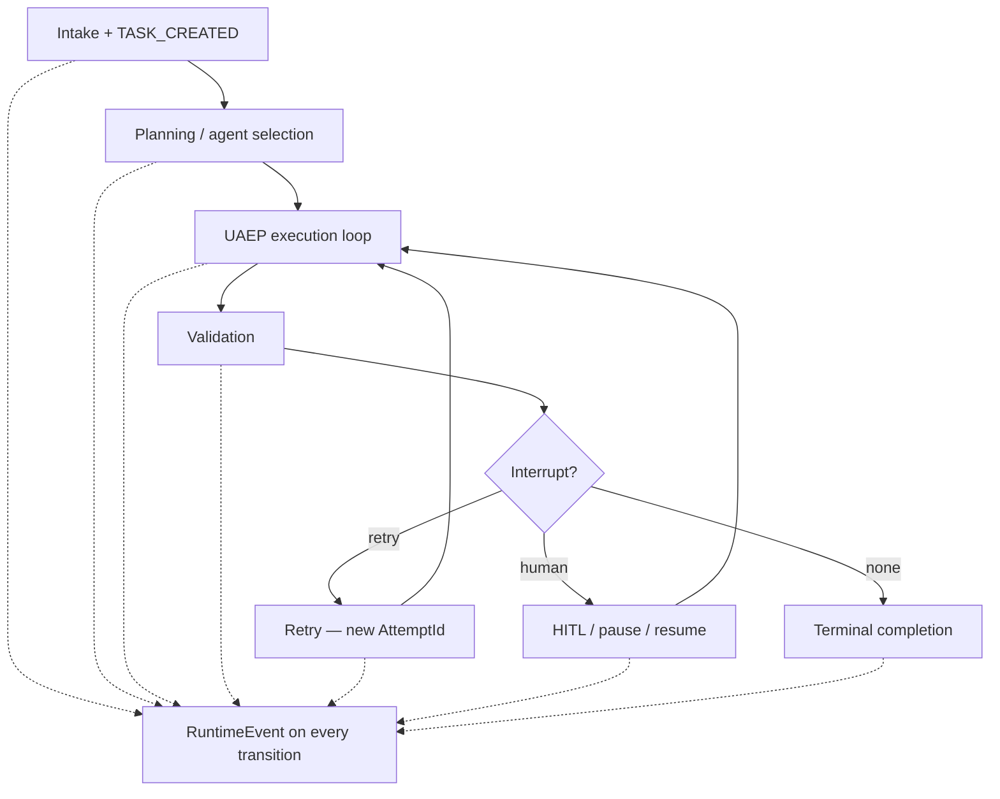

# Unified Execution Runtime

**Intergrax Unified Execution Runtime (UER)** defines the common lifecycle, identity, event, policy interception, retry, interruption, and completion semantics that every agent execution follows.

> **Nexus decides what should execute. Unified Execution Runtime defines how execution behaves.**

## Why it matters

Without a platform-owned execution runtime, every agent path could independently implement its own IDs, retries, failure handling, cancellation, pause/resume, HITL, event emission, policy checks, and terminal states. That produces inconsistent behavior, untraceable retries, hidden callbacks, policy bypass, incompatible audit histories, and difficult recovery.

UER makes execution behavior **platform-owned**. Agents express domain work and control-flow **intent** (`AgentDecision`); the runtime enforces lifecycle transitions, emits `RuntimeEvent` on every meaningful change, and applies policy consequences — proceed, deny, interrupt, wait, retry, cancel, or fail.

Agents **must not** implement ad hoc lifecycle, retry, HITL, or event semantics. They run through **UAEP** (`AgentEngine` / `HarnessKernel`) and the `RuntimeEventBus`.

> [!NOTE]
> **Maturity boundary:** Core runtime semantics — `RuntimeEvent` spine, UAEP, typed execution identity, retry/HITL/cancellation events — are **implemented** on the Nexus harness path. This is **not** a production-qualification claim: `execution_mode=strict` and `production_mode` are policy posture, not taxonomy **P4** evidence. Extended engineering sections (§42.8+) live in the [runtime extended satellite](satellites/UNIFIED_EXECUTION_RUNTIME_runtime_extended.md) (intentional progressive disclosure); Token Optimization runtime policy rows (`TOKEN-UER-*`) are **planned** in the plan — see [Current maturity](#current-maturity) and [unresolved documentation drift](#unresolved-documentation-drift-outside-scope).

**Primary audience:** Principal / Staff engineers, harness integrators, and extension authors wiring runtime policy, hooks, and application hosts — after the platform overview in the root README.

## At a glance

| Concern | Summary |
| -------- | -------- |
| **Responsibility** | Execution lifecycle semantics — task/run/attempt identity propagation, phases, events, retry, pause/resume, cancellation, HITL, policy interception |
| **Identity** | `TaskId` → `RunId` → `AttemptId` → `EventId` hierarchy; canonical identity authority in [`OBSERVABILITY.md`](OBSERVABILITY.md) §5 |
| **Event model** | Every meaningful transition emits `RuntimeEvent`; hooks, policy, recovery, and observability subscribe — no hidden agent callbacks |
| **UAEP** | Mandatory agent invocation protocol through `AgentEngine` — agents do not bypass context, step, validation, or decision emission |
| **Nexus relation** | Nexus routes **what** executes; UER defines **how** execution behaves inside the run |
| **Observability relation** | UER emits events; Observability owns journal, persistence, as-of/bitemporal interpretation |
| **Governance relation** | Policy decides allow/deny/approval; UER enforces lifecycle consequences |
| **Maturity** | Four-axis statement in [Current maturity](#current-maturity) — no dedicated public UER proof route |
| **Go deeper** | [Engineering canon](#engineering-canon) · [runtime extended satellite](satellites/UNIFIED_EXECUTION_RUNTIME_runtime_extended.md) · [plan](../maintainers/plans/UNIFIED_EXECUTION_RUNTIME.md) |

## Flagship architecture visual

<picture>
  <source media="(prefers-color-scheme: dark)" srcset="assets/unified-execution-runtime-lifecycle-dark.svg">
  <source media="(prefers-color-scheme: light)" srcset="assets/unified-execution-runtime-lifecycle-light.svg">
  
</picture>

Retry keeps the same `TaskId` and `RunId` and mints a new `AttemptId`. Resume without retry preserves the same `AttemptId`. Each event carries a unique `EventId`.

## UER vs Nexus vs Agent

| Domain | Core question | Owns |
| ------ | ------------- | ---- |
| **Nexus** | What should execute next? | Routing, orchestration, graph/task flow, planner, agent selection, completion decisions |
| **UER** | How does execution behave? | Lifecycle, runtime semantics, attempts, transitions, `RuntimeEvent` emission, UAEP enforcement |
| **Agent (Tier-2)** | What domain work should be done? | Agent-specific steps, tools, and `AgentDecision` intent — not global lifecycle or retry policy |

Nexus selects agents and interprets `AgentDecision` through `PolicyEngine`. `AgentEngine` / `UAEPExecutor` enforce the step loop inside a graph node. See [`NEXUS_EXECUTION_FLOW.md`](NEXUS_EXECUTION_FLOW.md) §1.3 for the three planning planes (Nexus graph, UAEP steps, tool planner).

## Task → Run → Attempt → Event

| Level | Meaning |
| ----- | ------- |
| **Task** | User or system intent — the work unit (`TaskId`) |
| **Run** | One execution lifecycle of that task (`RunId`) |
| **Attempt** | One concrete try inside the run (`AttemptId`) — minted at attempt boundaries |
| **Event** | One meaningful transition inside that attempt (`EventId`) — unique per event |

Canonical hierarchy:

```text
Task
  1:N Run
      1:N Attempt
          1:N RuntimeEvent
```

**Retry:** same `TaskId` + `RunId`, **new** `AttemptId`; emits `RETRY_SCHEDULED` / `RETRY_STARTED` and related events. **Resume without retry:** same `AttemptId`. Full typed-carrier matrix, unified journal, and as-of semantics — [`OBSERVABILITY.md`](OBSERVABILITY.md) §5–§10 (UER does not duplicate that canon).

## UER vs Observability

| UER | Observability |
| --- | ------------- |
| Defines execution transition semantics | Owns canonical execution identity model |
| Emits `RuntimeEvent` on lifecycle changes | Owns journal/read model, persistence, export |
| Participates in identity propagation (`EmitContext`) | Owns as-of/bitemporal historical interpretation |
| Defines `ExecutionPhase` and event catalog mapping | Enforces execution-scoped `RuntimeEvent` contract |

**Normative rule:** every execution-scoped `RuntimeEvent` **must** carry `TaskId`, `RunId`, `AttemptId`, and `EventId` — all required ([`OBSERVABILITY.md`](OBSERVABILITY.md) § Execution-scoped signals). UER is **not** the owner of the Unified Run Journal or bitemporal history.

## UER vs Governance / Policy

| Governance / policy | UER |
| ------------------- | --- |
| Decides allowed, denied, approval-required, escalate | Enforces lifecycle consequences on wired paths |
| Owns business policy rules and evaluation points | Owns transition mechanics — proceed, deny, interrupt, wait, retry, cancel, fail |
| `RuntimePolicyEngine`, `PolicyEngine`, declarative tool policy | UAEP step loop, hooks, `AgentDecision` interpretation, event emission |

UER does **not** own business policy rules. Policy hooks fire at defined `HookPoint` boundaries **around** execution — see [Engineering canon §42.3](#423-hook-system).

## How execution works

At a high level, every harness execution follows the same runtime path:

1. **Intake** — surface adapters normalize input; `TASK_CREATED` and classification events.
2. **Planning / classification** — Nexus selects graph topology and agents.
3. **Execution** — UAEP step loop: context build → steps → tools → decisions.
4. **Validation** — agent output validation before completion.
5. **Interruption** — retry, HITL, pause/resume, or cancellation when policy or failure requires it.
6. **Completion** — terminal `TASK_COMPLETED`, `TASK_FAILED`, or `CANCELLED` with observable events.

```text
intake → planning/classification → execution → validation
    → retry / HITL / interruption when needed → completion / failure / cancellation
```



Exact `RuntimeEventType` catalog and `ExecutionPhase` mapping live in [Engineering canon §42.1](#421-runtime-event-model) — not duplicated here.

## Event-first runtime

Every meaningful runtime transition **must** emit a `RuntimeEvent`. Orchestration, recovery, policy, HITL, audit, and observability depend on **platform-visible state**, not hidden callbacks inside agents.

- **UER** defines what transitions mean and emits events through producers (`NexusLoop`, `AgentEngine`, `ToolRuntime`, `ValidationEngine`).
- **Observability** persists, journals, and interprets execution history — including strict identity and export paths.

Agents **must not** publish directly to external queues or webhooks; they emit through the runtime bus ([§42.2.3](#4223-anti-pattern)).

## Retry semantics

- Retry is **not** a new task — it stays within the same `TaskId` and `RunId`.
- A new attempt mints a **new** `AttemptId`; retry events (`RETRY_SCHEDULED`, `RETRY_STARTED`) make the decision observable.
- Terminal outcome belongs to the **run** lifecycle; the Attempt Ledger must be reconstructable from events ([`RELIABILITY_FAILURE_AND_HITL.md`](RELIABILITY_FAILURE_AND_HITL.md#attempt-ledger)).

Intergrax has **two independent retry layers** today — graph/validation (`RetryEngine`) and run-level (`AgentEngine` / `HarnessKernel`) — plus protocol-level backend retries. Agents emit `AgentDecision.RETRY` intent; runtime owns policy and counts. A future `RetryCoordinator` may unify scheduling; see REL §31.1.

## Pause, resume, and HITL

The runtime may enter controlled interrupted or waiting states (`PAUSE_REQUESTED`, `PAUSED`, `HUMAN_APPROVAL_*`, `INTERRUPT_*`). Operator or human approval unblocks execution through observable transitions (`RESUMED`, `HUMAN_APPROVAL_RECEIVED`) — resume is **not** a silent restart from scratch when checkpointed state exists.

Agents **must not** block the event loop waiting for humans; they return `REQUEST_HUMAN` or `INTERRUPT` decisions. HITL ownership and Attempt Ledger rules — [`RELIABILITY_FAILURE_AND_HITL.md`](RELIABILITY_FAILURE_AND_HITL.md).

## Cancellation and terminal states

Cancellation is **explicit** (`CANCELLATION_REQUESTED`, `CANCELLED`). Failures emit classified terminal events (`TASK_FAILED`, `STEP_FAILED`, `TOOL_FAILED`) — executions do not silently disappear. Handler failures emit `RUNTIME_HANDLER_FAILED` per escalation policy.

## Responsibility boundaries

### UER owns

- `RuntimeEvent` contract and emission on lifecycle transitions.
- UAEP mandatory sequence and `AgentDecision` interpretation boundary.
- Hook points, middleware ordering, and runtime policy interception surfaces.
- Retry, pause/resume, cancellation, and HITL **semantics** on the harness path.
- Agent and step micro-lifecycles inside a run.

### UER does not own

- Nexus routing, planning, and graph orchestration — [`NEXUS_EXECUTION_FLOW.md`](NEXUS_EXECUTION_FLOW.md).
- Canonical execution identity authority, unified journal, as-of/bitemporal history — [`OBSERVABILITY.md`](OBSERVABILITY.md).
- Business policy rule definitions — [`GOVERNED_EXECUTION.md`](GOVERNED_EXECUTION.md).
- Context assembly — [`CONTEXT_ENGINEERING.md`](CONTEXT_ENGINEERING.md).
- Application product semantics — Tier-3 configures profiles and hooks.

### Applications (Tier-3) configure

- `ApplicationEnvironmentProfile`, `RuntimePolicyBundle`, hook registration at bootstrap.
- `execution_mode`, `production_mode`, and observability export profiles — posture, not UER implementation substitutes.

## Relationship to Intergrax

| Neighbor | Relationship |
| -------- | ------------- |
| [`NEXUS_EXECUTION_FLOW.md`](NEXUS_EXECUTION_FLOW.md) | Control-flow owner — invokes UER through `AgentEngine` / UAEP |
| [`OBSERVABILITY.md`](OBSERVABILITY.md) | Event persistence, identity canon, journal, as-of projections |
| [`GOVERNED_EXECUTION.md`](GOVERNED_EXECUTION.md) | Policy evaluation; UER enforces consequences at UAEP/hook boundaries |
| [`RELIABILITY_FAILURE_AND_HITL.md`](RELIABILITY_FAILURE_AND_HITL.md) | Retry layers, Attempt Ledger, HITL ownership |
| [`AGENT_CONTRACTS_AND_ASSEMBLY.md`](AGENT_CONTRACTS_AND_ASSEMBLY.md) | Agent interface; `execute()` delegates to UAEP |
| [`TOOLS.md`](TOOLS.md) | `ToolRuntime` emits `TOOL_*` events; tool policy at invocation |
| [`CONTEXT_ENGINEERING.md`](CONTEXT_ENGINEERING.md) | Context build inside UAEP; `CONTEXT_*` events |
| [`APPLICATION_HOSTING.md`](APPLICATION_HOSTING.md) | Host bootstrap wires runtime, hooks, and policy bundles |
| [`intergrax_runtime_architecture.md`](intergrax_runtime_architecture.md) | Platform hub — UER is Tier-1 execution semantics |

## Extensibility

UER is not a plugin marketplace. Real extension surfaces:

| Surface | Role | Guide |
| ------- | ---- | ----- |
| `HookRegistry` / `HookPoint` | Ordered interceptors at lifecycle boundaries | [`AGENT_CREATION_GUIDE.md`](../technical/guides/AGENT_CREATION_GUIDE.md) Appendix H–I |
| `RuntimeEventBus` handlers | Subscribers on event types or categories | Engineering canon §42.2 |
| `RuntimePolicyBundle` / profiles | Runtime policy and output posture | [`PLATFORM_CONFIGURATION.md`](../technical/guides/PLATFORM_CONFIGURATION.md) |
| Tier-3 bootstrap | Hook and middleware registration at application startup | Application host `*_wiring.py` patterns |

Do not expose internal `HarnessKernel` or `NexusLoop` details as public extension APIs without canonical evidence.

## Current maturity

Architecture maturity: **A4**  
Implementation maturity: **I4**  
Production readiness: **P2**  
Evidence maturity: **E3**

- **A4** — Foundational cross-domain canon: UAEP, `RuntimeEvent` spine, hook model, identity sync with Observability (TRACE-ARCH-SYNC-1, §42.1.8), REL retry/HITL ownership, Governed Execution evaluation-point map; Post-L3 AUDIT-IDEAL Band 2ay rows closed ([plan](../maintainers/plans/UNIFIED_EXECUTION_RUNTIME.md)).
- **I4** — Typed `TaskId`/`RunId`/`AttemptId`/`EventId` implemented (TRACE-1A/B/C **Done** per [OBS plan](../maintainers/plans/OBSERVABILITY.md)); UAEP/HarnessKernel path, event catalog gates, retry layers, HITL/cancellation events wired; §6.1av UAEP maintenance **closed**. Not I5 — `RetryCoordinator` future (when canonical), `EscalationRouter` lab-minimal/deferred, and other runtime hardening gaps not yet closed on the harness path.
- **P2** — Harness lab/reference profiles and strict-mode policy posture; **no UER-domain production handoff or operational SLO package** — `production_mode` ≠ taxonomy P4.
- **E3** — Unit/gate evidence (event catalog, tenant propagation, single `STEP_COMPLETED` per step), audit slice, 2026-06-19 audit results. **No dedicated public UER proof route** — not E4/E5.

> **Phase vs maturity:** AUDIT-IDEAL and UAEP-MAINT **Done** rows are plan delivery states, not P-axis or public proof claims.

### Capability coverage (summary)

| Area | Status |
| ---- | ------ |
| `RuntimeEvent` spine + catalog | **Implemented** — phase coverage gates in code |
| Typed execution identity | **Implemented** — TRACE-1A/B/C closed ([OBS plan](../maintainers/plans/OBSERVABILITY.md)) |
| UAEP / `AgentEngine` / `HarnessKernel` | **Implemented** — mandatory agent path |
| Hook system + policy interception | **Implemented** on wired harness paths |
| Graph + run-level retry | **Implemented** — two layers per REL §31.1 |
| HITL / pause / resume / cancel events | **Implemented** — REL + HITL plan **Done** |
| `TOKEN-UER-1` / `TOKEN-UER-2` | **Planned** in UER plan — may be stale vs Token Optimization feature canon; not evidence of missing core runtime |
| Extended §42.8+ engineering sections | **Satellite-referenced** — intentional progressive disclosure in [runtime extended satellite](satellites/UNIFIED_EXECUTION_RUNTIME_runtime_extended.md) |
| Public UER lifecycle proof | **Not claimed** |

## Evidence / proof

UER evidence is **engineering- and audit-oriented** — there is **no** dedicated public proof route in [`docs/project/proofs/`](../proofs/) for UER lifecycle semantics.

| Evidence class | What exists | What it does not prove |
| -------------- | ----------- | ---------------------- |
| Architecture | This hub, TRACE-ARCH-SYNC-1, REL/Governed Execution boundaries | Production operation at scale |
| Unit / gate | Event catalog phase coverage, UAEP tenant propagation, single `STEP_COMPLETED` gate | Full multi-tenant SLO |
| Integration / runtime | Nexus harness path, unified journal strictness (TRACE-1C) | Universal product-host qualification |
| Audit | [`docs/audit_results/AUDIT_PROTOCOL.md`](../technical/docs/audit_results/UNIFIED_EXECUTION_RUNTIME.md), 2026-06-19 audit closeout | Customer production window |
| Public product proof | **None** for UER domain | Do not infer UER qualification from RAG, Token Optimization, or LKW proofs that merely run on the harness stack |

## Go deeper

| Depth | Route |
| ----- | ----- |
| **Engineering canon** | [Below](#engineering-canon) — `RuntimeEvent`, UAEP, hooks, decisions (§42.1–§42.7) |
| **Runtime extended** | [`satellites/UNIFIED_EXECUTION_RUNTIME_runtime_extended.md`](satellites/UNIFIED_EXECUTION_RUNTIME_runtime_extended.md) — §42.8+ depth on demand |
| **Implementation plan** | [`maintainers/plans/UNIFIED_EXECUTION_RUNTIME.md`](../maintainers/plans/UNIFIED_EXECUTION_RUNTIME.md) |
| **Observability identity** | [`OBSERVABILITY.md`](OBSERVABILITY.md) §5–§10 |
| **Nexus flow** | [`NEXUS_EXECUTION_FLOW.md`](NEXUS_EXECUTION_FLOW.md) |
| **Reliability / HITL** | [`RELIABILITY_FAILURE_AND_HITL.md`](RELIABILITY_FAILURE_AND_HITL.md) |
| **Governance** | [`GOVERNED_EXECUTION.md`](GOVERNED_EXECUTION.md) |
| **Platform audit** | [`AUDIT_PROTOCOL.md`](../../audit_results/AUDIT_PROTOCOL.md) · [`audit_results/`](../../audit_results/README.md) |
| **Target architecture** | [`IDEAL_HARNESS_AI_ARCHITECTURE.md`](../technical/guides/IDEAL_HARNESS_AI_ARCHITECTURE.md) §8 |

### Documentation layout (hub / satellite)

Intentional progressive disclosure — **not** unresolved drift.

| Layer | Owns | Notes |
| ----- | ---- | ----- |
| Hub (engineering canon below) | §42.1–§42.7 | Default implement/audit read scope |
| [Runtime extended satellite](satellites/UNIFIED_EXECUTION_RUNTIME_runtime_extended.md) | §42.8+ | Interrupt, pause/resume, HITL flow, policy engine, tool runtime, shared contracts |
| Audit slice | §42.1–§42.15 | Valid when read against hub + satellite |

### Unresolved documentation drift (outside scope)

| Item | Notes |
| ---- | ----- |
| `TOKEN-UER-1` / `TOKEN-UER-2` (**Planned** in UER plan) | May be stale relative to Token Optimization feature canon — plan not modified in DOC-3E-R1 |

---

## Maintainer and Cursor context

**Status:** Canonical architecture (domain pair 1:1)  
**Hub:** [`intergrax_runtime_architecture.md`](intergrax_runtime_architecture.md)  
**Plan (1:1):** [`plan/UNIFIED_EXECUTION_RUNTIME.md`](../maintainers/plans/UNIFIED_EXECUTION_RUNTIME.md)  
**Target:** [`IDEAL_HARNESS_AI_ARCHITECTURE.md`](../technical/guides/IDEAL_HARNESS_AI_ARCHITECTURE.md)  
**Audit layers:** 4–5, 8, 23–24  
**Platform audit:** [`docs/audit_results/AUDIT_PROTOCOL.md`](../../audit_results/AUDIT_PROTOCOL.md)**Last updated:** 2026-08-17 — DOC-3E-R1 hub/satellite layout correction; DOC-3E public front modernization; TRACE identity supersession in §42.1.1

### Cursor read scope (token budget)

**Do not read this entire file in one session** (UNIFIED_EXECUTION_RUNTIME canon).

- **Implement / audit default:** UAEP + RuntimeEvent spine (§42.1–§42.7). Extended §42.8+: [`satellites/UNIFIED_EXECUTION_RUNTIME_runtime_extended.md`](satellites/UNIFIED_EXECUTION_RUNTIME_runtime_extended.md).
- **Use** table of contents below — `Read` with offset/limit per §.
- **Plan hub:** [`plan/UNIFIED_EXECUTION_RUNTIME.md`](../maintainers/plans/UNIFIED_EXECUTION_RUNTIME.md) (scoped §6 only).
- **Platform audit:** [`docs/audit_results/AUDIT_PROTOCOL.md`](../../audit_results/AUDIT_PROTOCOL.md).
- **Max reads:** at most **one** file >5k tokens per session unless RESUME cites more.

### Architecture satellites (read on demand)

Large § blocks moved out of the architecture hub to reduce Cursor context use.
Load **only** the satellite matching your task or cited §.

| Satellite | Contents |
|-----------|----------|
| [`satellites/UNIFIED_EXECUTION_RUNTIME_runtime_extended.md`](satellites/UNIFIED_EXECUTION_RUNTIME_runtime_extended.md) | runtime extended (§42.8+) |

> **Cursor context budget:** read hub read-scope block + **at most one** satellite per session.

---

## Engineering canon

Authoritative technical specification (§42.1–§42.7). Public front section above; extended depth in the [runtime extended satellite](satellites/UNIFIED_EXECUTION_RUNTIME_runtime_extended.md) (§42.8+).

## 42.1 Runtime Event Model

Every meaningful runtime transition MUST emit a `RuntimeEvent`.

Events are the **primary audit and orchestration signal**. Hooks, observability, policy, and recovery subscribe to events — they MUST NOT rely on hidden callbacks inside agents.

**Event spine canon:** [`OBSERVABILITY.md`](OBSERVABILITY.md#observability-event-spine) — signal-plane boundaries, [event ownership rules](OBSERVABILITY.md#event-ownership-rules), [required correlation fields](OBSERVABILITY.md#required-correlation-fields), [Cursor review checklist](OBSERVABILITY.md#cursor-review-checklist).

**CodeCraft canon:** [`CODE_CRAFT.md`](CODE_CRAFT.md#codecraft-safety-boundary) — ephemeral codegen orchestration through ToolRuntime; not a second agent runtime.

### 42.1.1 RuntimeEvent Contract

```text
RuntimeEvent:
    event_id: EventId          # UUID, globally unique
    task_id: TaskId            # Nexus task identifier
    run_id: RunId               # execution run (may span retries)
    attempt_id: AttemptId      # attempt within the run
    node_id: str | null        # ExecutionGraph node, if applicable
    agent_id: str | null       # agent responsible for this event
    step_id: str | null        # AgentStep identifier, if applicable
    event_type: RuntimeEventType
    phase: ExecutionPhase      # see §42.31
    severity: EventSeverity    # DEBUG | INFO | WARNING | ERROR | CRITICAL
    payload: dict              # structured, schema-versioned
    timestamp: datetime        # UTC, ISO-8601
    correlation_id: str        # ties related events across agents/tools
    parent_event_id: str | null # causal chain
    schema_version: str         # e.g. "runtime_event.v1"
```

**As-built (2026-08):** strongly typed `TaskId` / `RunId` / `AttemptId` / `EventId` via `typing.NewType(..., str)`; wire representation remains flat string at storage/export boundaries. Every canonical `RuntimeEvent` **must** carry all four identifiers — enforced per TRACE-1A/B/C ([`OBSERVABILITY.md`](OBSERVABILITY.md) §5, [`plan/OBSERVABILITY.md`](../maintainers/plans/OBSERVABILITY.md) Phase TRACE).

> **Supersession:** Pre-TRACE hub text stated identity was "planned in TRACE-1A / TRACE-1B." TRACE-1A, TRACE-1B, and TRACE-1C are **Done / Closed** — that wording is historical only.

### 42.1.2 RuntimeEventType (minimum set)

```text
TASK_CREATED
TASK_CLASSIFIED
PLAN_CREATED | PLAN_UPDATED | PLAN_FAILED
SKILL_RESOLVED | SKILL_IMPORT_FAILED
AGENT_SELECTED
CONTEXT_BUILT | CONTEXT_ASSEMBLED | CONTEXT_TRIMMED | INGESTION_FAILED
STEP_STARTED | STEP_COMPLETED | STEP_FAILED
TOOL_REQUESTED | TOOL_COMPLETED | TOOL_DENIED | TOOL_FAILED
VALIDATION_STARTED | VALIDATION_PASSED | VALIDATION_FAILED
DECISION_EMITTED
INTERRUPT_REQUESTED | INTERRUPT_HANDLED | INTERRUPT_ESCALATED
HUMAN_APPROVAL_REQUESTED | HUMAN_APPROVAL_RECEIVED | HUMAN_APPROVAL_TIMEOUT
PAUSE_REQUESTED | PAUSED | RESUMED
RETRY_SCHEDULED | RETRY_STARTED
CANCELLATION_REQUESTED | CANCELLED
MEMORY_READ | MEMORY_WRITE
HANDOFF_INITIATED | HANDOFF_COMPLETED
TRACE_PERSISTED
TASK_COMPLETED | TASK_FAILED
```

### 42.1.3 Example Payload — STEP_COMPLETED

```json
{
  "event_id": "evt_8f3a2b1c-...",
  "task_id": "task_legal_review_001",
  "run_id": "run_20260527_001",
  "attempt_id": "attempt_...",
  "node_id": "node_legal_review",
  "agent_id": "legal",
  "step_id": "step_clause_analysis",
  "event_type": "STEP_COMPLETED",
  "phase": "STEP_EXECUTION",
  "severity": "INFO",
  "payload": {
    "step_name": "clause_analysis",
    "step_index": 3,
    "duration_ms": 4200,
    "artifacts": ["artifact_clause_flags.json"],
    "decision": "CONTINUE"
  },
  "timestamp": "2026-05-27T14:32:01.123Z",
  "correlation_id": "corr_task_legal_review_001",
  "parent_event_id": "evt_step_started_...",
  "schema_version": "runtime_event.v1"
}
```

### 42.1.4 Rules

- Every `AgentStep` MUST emit `STEP_STARTED` and `STEP_COMPLETED` or `STEP_FAILED`.
- Every `ToolRuntime.invoke` MUST emit `TOOL_*` events.
- Every `AgentDecision` MUST emit `DECISION_EMITTED`.
- Events MUST be persisted to trace storage (§42.24).
- Events MUST NOT contain secrets; redact at emission time.

### 42.1.5 Runtime event catalog (ops filters)

**Phase DX-5.7.** Canonical mapping lives in code: `intergrax.runtime.events.phase_coverage` (`EVENT_PHASE_COVERAGE`, `EVENT_OPS_FILTER_HINTS`). Gate: `test_all_runtime_event_types_have_execution_phase` and `test_all_runtime_event_types_have_ops_filter_hint`.

| `RuntimeEventType` | `ExecutionPhase` | Ops filter hint | Typical subscriber |
|--------------------|------------------|-----------------|-------------------|
| `TASK_CREATED` | `INTAKE` | `trace:intake` | TraceStore, metrics |
| `TASK_CLASSIFIED` | `CLASSIFICATION` | `trace:classification` | TraceStore |
| `PLAN_CREATED` | `PLANNING` | `ops:planning` | TraceStore, planner metrics |
| `PLAN_UPDATED` | `PLANNING` | `ops:planning` | TraceStore |
| `PLAN_FAILED` | `PLANNING` | `ops:alert` | Alerting, TraceStore |
| `AGENT_SELECTED` | `AGENT_SELECTION` | `trace:selection` | TraceStore |
| `SKILL_RESOLVED` | `AGENT_SELECTION` | `trace:skills` | TraceStore |
| `SKILL_IMPORT_FAILED` | `AGENT_SELECTION` | `ops:alert` | Alerting |
| `CONTEXT_BUILT` | `CONTEXT_BUILDING` | `trace:context` | TraceStore |
| `CONTEXT_ASSEMBLED` | `CONTEXT_BUILDING` | `trace:context` | TraceStore |
| `CONTEXT_TRIMMED` | `CONTEXT_BUILDING` | `trace:context` | TraceStore |
| `INGESTION_FAILED` | `CONTEXT_BUILDING` | `ops:alert` | Alerting |
| `MEMORY_READ` | `CONTEXT_BUILDING` | `ops:memory` | TraceStore |
| `MEMORY_WRITE` | `CONTEXT_BUILDING` | `ops:memory` | TraceStore |
| `STEP_STARTED` | `STEP_EXECUTION` | `trace:step` | TraceStore, UAEP |
| `STEP_COMPLETED` | `STEP_EXECUTION` | `trace:step` | TraceStore |
| `STEP_FAILED` | `STEP_EXECUTION` | `ops:alert` | Alerting, recovery |
| `TOOL_REQUESTED` | `STEP_EXECUTION` | `ops:tool_audit` | ToolRuntime audit |
| `TOOL_COMPLETED` | `STEP_EXECUTION` | `ops:tool_audit` | ToolRuntime audit |
| `TOOL_DENIED` | `STEP_EXECUTION` | `ops:alert` | PolicyEngine, alerting |
| `TOOL_FAILED` | `STEP_EXECUTION` | `ops:alert` | Alerting, recovery |
| `TASK_PROGRESS` | `STEP_EXECUTION` | `ops:progress` | Long-running UI, scheduler |
| `HANDOFF_INITIATED` | `STEP_EXECUTION` | `ops:handoff` | Graph executor |
| `HANDOFF_COMPLETED` | `STEP_EXECUTION` | `ops:handoff` | Graph executor |
| `VALIDATION_STARTED` | `VALIDATION` | `trace:validation` | TraceStore |
| `VALIDATION_PASSED` | `VALIDATION` | `trace:validation` | TraceStore |
| `VALIDATION_FAILED` | `VALIDATION` | `ops:alert` | Alerting |
| `DECISION_EMITTED` | `FINALIZATION` | `trace:decision` | TraceStore, hooks |
| `INTERRUPT_REQUESTED` | `INTERRUPT_HANDLING` | `ops:hitl` | HITL queue |
| `INTERRUPT_HANDLED` | `INTERRUPT_HANDLING` | `ops:hitl` | HITL queue |
| `INTERRUPT_ESCALATED` | `INTERRUPT_HANDLING` | `ops:alert` | Alerting |
| `RUNTIME_HANDLER_FAILED` | `INTERRUPT_HANDLING` | `ops:alert` | Alerting |
| `HUMAN_APPROVAL_REQUESTED` | `HUMAN_APPROVAL` | `ops:hitl` | HITL / PagerDuty |
| `HUMAN_APPROVAL_RECEIVED` | `HUMAN_APPROVAL` | `ops:hitl` | HITL |
| `HUMAN_APPROVAL_TIMEOUT` | `HUMAN_APPROVAL` | `ops:alert` | Alerting |
| `PAUSE_REQUESTED` | `HUMAN_APPROVAL` | `ops:hitl` | Scheduler |
| `PAUSED` | `HUMAN_APPROVAL` | `ops:hitl` | Scheduler |
| `RESUMED` | `HUMAN_APPROVAL` | `ops:hitl` | Scheduler |
| `RETRY_SCHEDULED` | `RETRY_HANDLING` | `ops:retry` | RetryEngine metrics |
| `RETRY_STARTED` | `RETRY_HANDLING` | `ops:retry` | RetryEngine metrics |
| `CANCELLATION_REQUESTED` | `COMPLETION` | `ops:completion` | TraceStore |
| `CANCELLED` | `COMPLETION` | `ops:completion` | TraceStore |
| `TASK_COMPLETED` | `COMPLETION` | `ops:completion` | SLO dashboards |
| `TASK_FAILED` | `COMPLETION` | `ops:alert` | Alerting, SLO burn |
| `TRACE_PERSISTED` | `TRACE_PERSISTENCE` | `trace:persistence` | TraceStore |

**Filter token legend:** `trace:*` — default observability scrape; `ops:alert` — page-worthy failures; `ops:hitl` — human-in-the-loop queues; `ops:tool_audit` — tool policy audits; `ops:completion` — terminal task outcomes; `ops:retry` — retry scheduler; `ops:planning` — planner failures/updates; `ops:handoff` — graph delegation; `ops:memory` — memory store access; `ops:progress` — checkpointed long runs.

### 42.1.6 Layered event identity (OBS-EVOL-9)

**Canon:** [`architecture/OBSERVABILITY.md`](OBSERVABILITY.md) §4.4 · **ADR:** [`ADR-OBS-003`](../technical/adr/entries/2026-06-17/ADR-OBS-003.md)

`RuntimeEvent` carries:

```text
event_type      # spine — platform lifecycle (~50 at publication)
event_kind      # semantic namespaced id (domain extensions)
event_category  # derived ops grouping
```

- **Tier-2/3** extend via `emit_domain_signal(kind, payload)` → spine `DOMAIN_SIGNAL`.
- **Platform** adds spine types only via ADR + `EventCatalog` entry.
- **Pre-release:** consolidate adaptive/capacity/hook enums to `platform.*` kinds (OBS-EVOL-9.7).

### 42.1.7 Event catalog governance

| Rule | Enforcement |
|------|-------------|
| New spine `RuntimeEventType` | ADR + `EventCatalogEntry` + emission gate |
| New domain signal | `event_kind` registry + extension `payload_schema_id` |
| Debug detail | `DiagnosticPayload` (Plane B) — not spine unless operator-facing |
| Bus subscription | Prefer `event_category` / `kind_prefix` over enum lists |

**Code (target):** `intergrax/runtime/events/event_catalog.py`, `signals.py`

### 42.1.8 Execution identity ownership (TRACE-ARCH-SYNC-1)

Runtime lifecycle emits through `RuntimeEvent`; **canonical execution identity**, journal/as-of semantics, and bitemporal historical state are owned by [`OBSERVABILITY.md`](OBSERVABILITY.md) §5–§10.

| Identifier | Runtime role |
|------------|----------------|
| `TaskId` | **WHAT** task / intent |
| `RunId` | **WHICH** execution of the task |
| `AttemptId` | **WHICH** attempt inside the run — minted at attempt boundaries; all events in an attempt share it |

Hierarchy: `Task 1:N Run 1:N Attempt 1:N RuntimeEvent`. Retry: same `TaskId` + `RunId`, new `AttemptId`. Resume without retry: same `AttemptId`. Typed carrier matrix, unified journal, as-of projections, and bitemporal historical state — [`OBSERVABILITY.md`](OBSERVABILITY.md) §5–§10. TRACE-1A/B/C implementation **Done / Closed** — [`plan/OBSERVABILITY.md`](../maintainers/plans/OBSERVABILITY.md) Phase TRACE.

---

## 42.2 Event Bus Architecture

The **Runtime Event Bus** is the Tier-1 pub/sub backbone for all runtime signals.

```text
Producer (NexusLoop, AgentEngine, ToolRuntime, ValidationEngine)
    → RuntimeEventBus.publish(RuntimeEvent)
        → subscribers: HookRegistry, TraceStore, PolicyEngine, Metrics, RecoveryCoordinator
```

### 42.2.1 Event Bus Contract

```text
interface RuntimeEventBus:
    publish(event: RuntimeEvent) -> None
    subscribe(event_types: list[RuntimeEventType], handler: EventHandler) -> SubscriptionId
    unsubscribe(subscription_id: SubscriptionId) -> None
```

### 42.2.2 Delivery Semantics

- **Synchronous dispatch** for hooks and policy (same execution thread/task context).
- **Async fan-out** permitted for metrics and external sinks only — MUST NOT block step execution.
- Handlers MUST be idempotent where possible.
- Handler failure MUST emit `RUNTIME_HANDLER_FAILED` and follow escalation policy (§42.38).

### 42.2.3 Anti-Pattern

Agents MUST NOT publish directly to external queues, webhooks, or Slack. They emit decisions and events **through** the runtime bus only.

---

## 42.3 Hook System

Hooks are **registered, ordered, inspectable interceptors** invoked by the runtime at defined points.

Hooks are NOT agent code. Hooks are Tier-1 runtime extensions (§42.22).

### 42.3.1 HookPoint Enum

```text
BEFORE_TASK_INTAKE
AFTER_TASK_INTAKE
BEFORE_CLASSIFICATION | AFTER_CLASSIFICATION
BEFORE_PLANNING | AFTER_PLANNING
BEFORE_AGENT_SELECTION | AFTER_AGENT_SELECTION
BEFORE_CONTEXT_BUILD | AFTER_CONTEXT_BUILD
BEFORE_STEP | AFTER_STEP
BEFORE_TOOL_CALL | AFTER_TOOL_CALL
BEFORE_VALIDATION | AFTER_VALIDATION
BEFORE_DECISION | AFTER_DECISION
BEFORE_INTERRUPT | AFTER_INTERRUPT
BEFORE_HUMAN_APPROVAL | AFTER_HUMAN_APPROVAL
BEFORE_RETRY | AFTER_RETRY
BEFORE_HANDOFF | AFTER_HANDOFF
BEFORE_FINALIZATION | AFTER_FINALIZATION
BEFORE_TRACE_PERSIST | AFTER_TRACE_PERSIST
```

### 42.3.2 Hook Handler Contract

```text
HookContext:
    task_id, run_id, node_id, agent_id, step_id
    phase: ExecutionPhase
    mutable_runtime_state: RuntimeStateView   # read-mostly; mutation via approved APIs only
    event: RuntimeEvent | null

HookResult:
    action: ALLOW | BLOCK | MODIFY | ESCALATE
    modified_payload: dict | null
    reason: str | null
```

### 42.3.3 Example — Cost Guard Hook

```text
@hook(BEFORE_TOOL_CALL)
def enforce_cost_ceiling(ctx: HookContext) -> HookResult:
    if ctx.runtime_state.accumulated_cost_usd > ctx.runtime_state.cost_ceiling:
        return HookResult(action=BLOCK, reason="cost_ceiling_exceeded")
    return HookResult(action=ALLOW)
```

### 42.3.4 Rules

- Hooks run in **priority order** (integer priority, lower first).
- Hooks MUST NOT call adapters directly; they influence policy and decisions only.
- Hooks MUST be registered in `HookRegistry` at application startup (Tier-3) or Nexus bootstrap.

**Authoring reference:** full `HookPoint` list and orchestration hook placement — [`guides/AGENT_CREATION_GUIDE.md` Appendix I §I.2](guides/AGENT_CREATION_GUIDE.md#i2-orchestration-control-plane-map) · governance hooks Appendix H.

---

## 42.4 Standard Agent Lifecycle

Every agent execution follows the **same lifecycle**, enforced by `AgentEngine` and `NexusLoop`.

```text
REGISTERED          # in AgentRegistry
    → SELECTED      # Nexus chose agent for task/node
    → CONTEXT_BUILDING
    → READY
    → RUNNING       # one or more AgentSteps
    → DECIDING      # AgentDecision emitted
    → VALIDATING
    → [PAUSED | INTERRUPTED | RETRYING | HANDOFF]
    → COMPLETED | FAILED | CANCELLED
```

### 42.4.1 State Transition Rules

- Only Nexus / AgentEngine MAY transition global agent lifecycle states.
- Agents MUST NOT set lifecycle state directly.
- Agents signal intent via `AgentDecision` only.
- Every transition MUST emit a `RuntimeEvent`.

### 42.4.2 Lifecycle vs Task Lifecycle

- **Task lifecycle** (§23): global user-facing task states.
- **Agent lifecycle** (this section): per-agent execution within a task.
- One task may contain multiple agent lifecycles (sequential, parallel, handoff).

---

## 42.5 Unified Agent Execution Protocol

The **Unified Agent Execution Protocol (UAEP)** is the mandatory sequence for all agent invocations.

```text
protocol UnifiedAgentExecution:

    1. Nexus selects agent (capability match + policy)
    2. AgentEngine.prepare_execution(agent, RuntimeExecutionContext)
    3. Middleware: BEFORE_CONTEXT_BUILD hooks
    4. agent.build_context(request) → context
    5. Middleware: AFTER_CONTEXT_BUILD hooks
    6. FOR each AgentStep in agent.get_steps(context) OR runtime-controlled step plan:
           a. Middleware: BEFORE_STEP
           b. AgentEngine.execute_step(agent, step, context)
           c. emit STEP_* events
           d. collect AgentDecision from step
           e. Middleware: AFTER_STEP
           f. IF decision != CONTINUE: break loop (Nexus handles)
    7. agent.validate(output, context) → ValidationResult
    8. Middleware: BEFORE_VALIDATION / AFTER_VALIDATION
    9. AgentEngine.build_execution_result(...) → AgentExecutionResult
   10. Return to Nexus with AgentDecision + result
```

### 42.5.1 Rules

- No agent MAY bypass steps 3–8.
- `execute()` on `Agent` interface (§13) MUST delegate to UAEP via `AgentEngine`.
- Direct `Agent.run()` from agent code is **forbidden** outside AgentEngine (§42.41).

---

## 42.6 Agent Step Lifecycle

Each internal agent step follows a micro-lifecycle:

```text
STEP_PLANNED
    → STEP_STARTED
    → [TOOL_REQUESTED → TOOL_COMPLETED]*   # via ToolRuntime only
    → STEP_DECIDING
    → STEP_COMPLETED | STEP_FAILED | STEP_SKIPPED
```

### 42.6.1 AgentStep Contract

```text
AgentStep:
    step_id: str
    step_name: str
    step_index: int
    input_schema: JSONSchema
    output_schema: JSONSchema
    allowed_tools: list[str]          # subset of agent contract
    max_duration_ms: int
    max_retries: int                  # runtime-managed (§42.34)
    idempotent: bool
    trace_label: str
```

### 42.6.2 Step Execution Pseudocode

```text
async def execute_step(agent, step, context):
    emit(STEP_STARTED)
    middleware.run(BEFORE_STEP)
    try:
        output = await agent.run_step(step, context, tool_gateway=ToolRuntime)
        decision = agent.decide_after_step(step, output, context)
        emit(DECISION_EMITTED, decision=decision)
        middleware.run(AFTER_STEP)
        emit(STEP_COMPLETED)
        return output, decision
    except Exception as e:
        emit(STEP_FAILED, error=str(e))
        return None, AgentDecision(type=FAIL, reason=str(e))
```

---

## 42.7 Agent Decision Model

Agents express control flow intent through **`AgentDecision`** — never through side effects or direct runtime manipulation.

### 42.7.1 AgentDecision Contract

```text
AgentDecisionType:
    CONTINUE          # proceed to next step
    COMPLETE          # agent finished successfully
    RETRY             # request runtime-managed retry (§42.34)
    REQUEST_HUMAN     # pause for human input/approval
    INTERRUPT         # structured interrupt (§42.8)
    ESCALATE          # elevate to supervisor/policy/human
    MODIFY_PLAN       # request Nexus replanning
    FAIL              # terminal failure for this agent/node
    CANCEL            # request task cancellation

AgentDecision:
    type: AgentDecisionType
    reason: str
    severity: EventSeverity
    payload: dict                    # structured context for Nexus
    interrupt: ExecutionInterrupt | null
    suggested_plan_delta: PlanDelta | null
    human_request: HumanRequest | null
    retry_hint: RetryHint | null
    confidence: float | null
```

### 42.7.2 Example — LegalAgent Critical Clause

```text
# LegalAgent detects a severe contract issue during step "clause_analysis"

return AgentDecision(
    type=INTERRUPT,
    reason="critical_liability_clause_detected",
    severity=CRITICAL,
    payload={
        "clause_id": "§14.2",
        "issue": "unlimited_liability",
        "evidence_artifact": "artifact_clause_flags.json"
    },
    interrupt=ExecutionInterrupt(
        interrupt_type=POLICY_REVIEW_REQUIRED,
        source_agent_id="legal",
        source_step_id="step_clause_analysis",
        recommended_action=REQUEST_HUMAN,
        blocking=True,
        metadata={"risk_level": "critical"}
    )
)
```

### 42.7.3 Rules

- Agent MUST NOT call `pause()`, `sleep()` waiting for human, or stop the event loop.
- Agent MUST NOT send Slack messages directly for approval.
- Nexus interprets `AgentDecision` via **PolicyEngine** (§42.11).
- `DECISION_EMITTED` event MUST precede any Nexus action on the decision.

---
