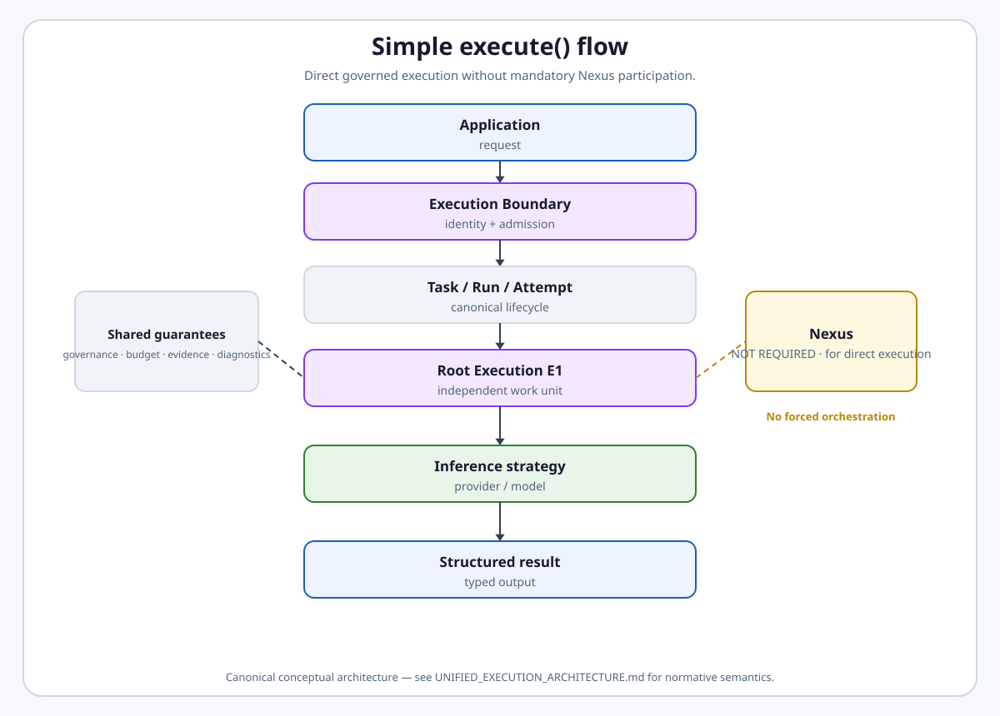
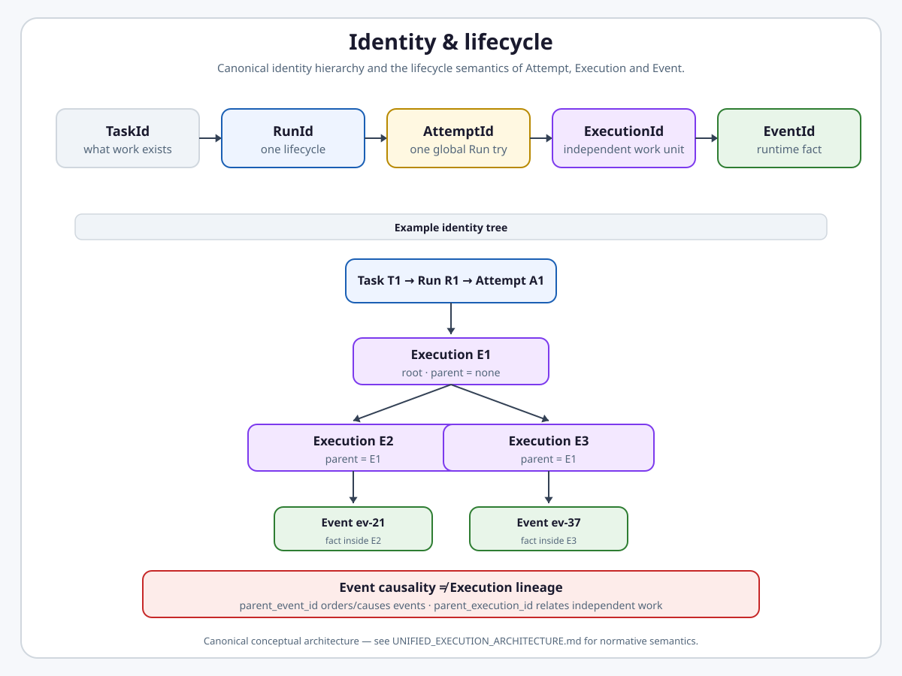
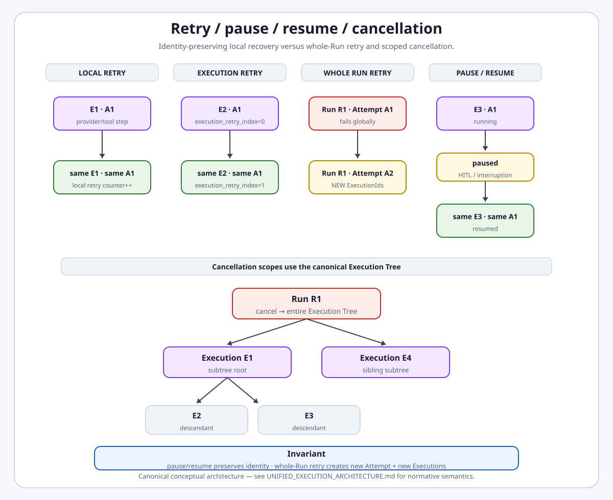
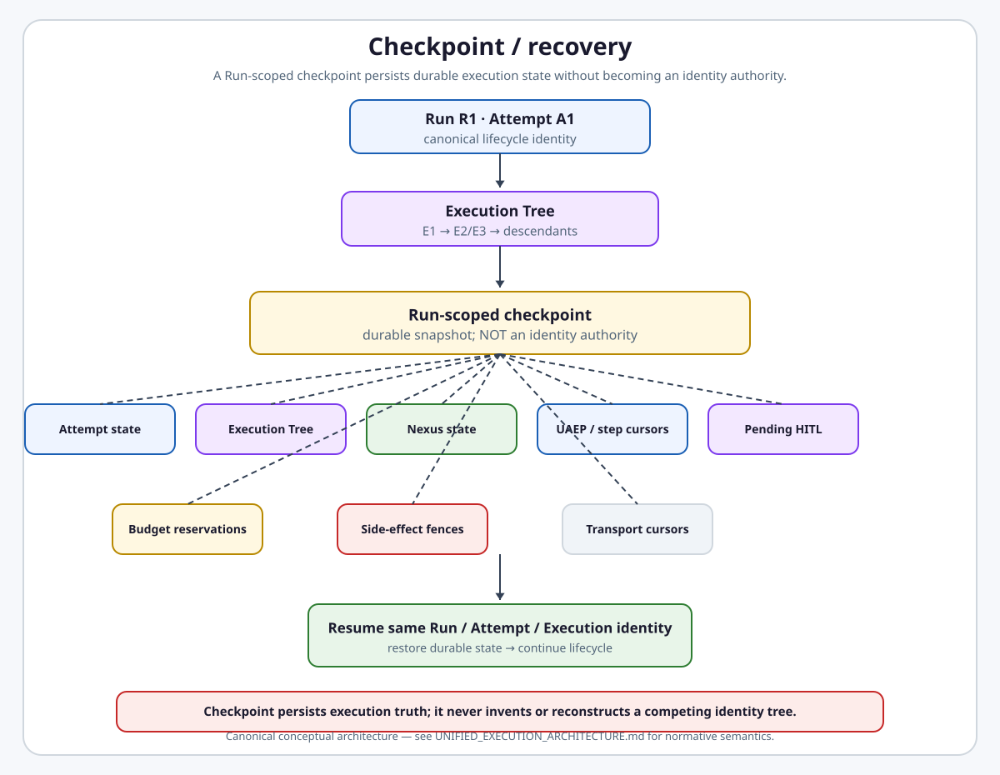
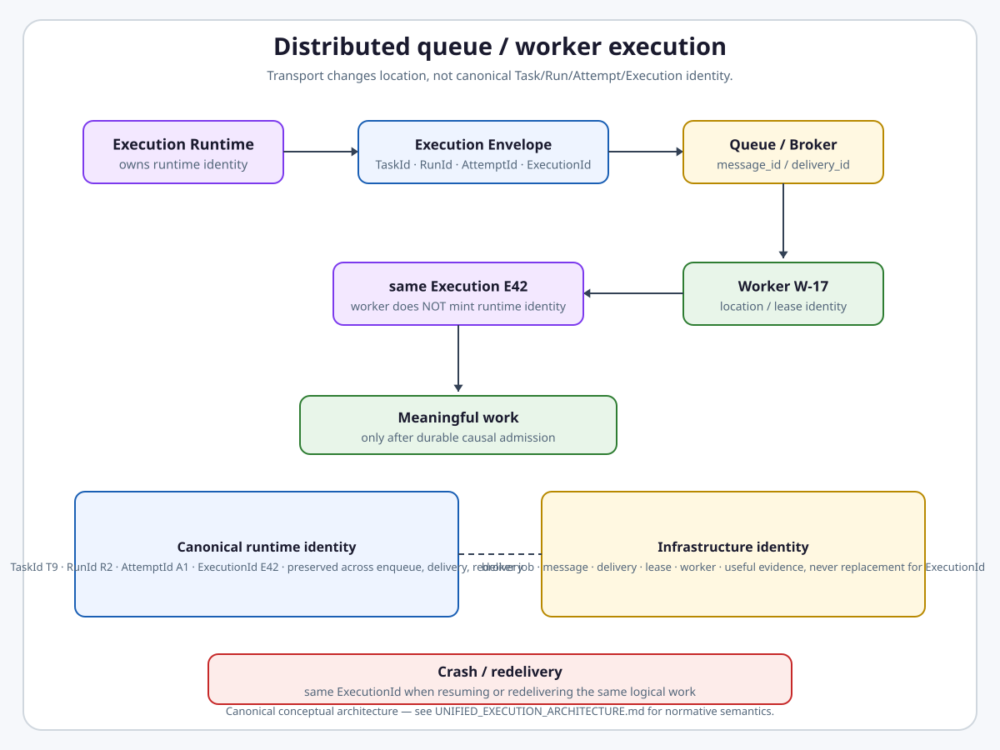
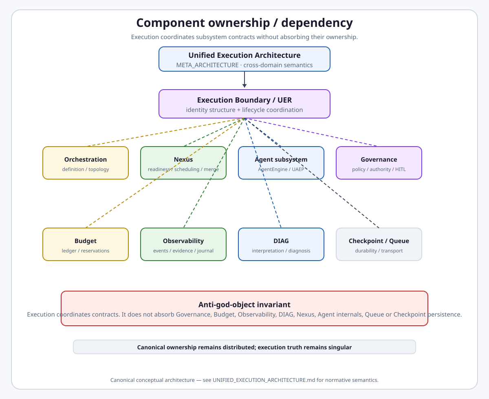

# Unified Execution Runtime

**Intergrax Unified Execution Runtime (UER)** owns Run/Attempt lifecycle structure, Execution identity coordination, executor strategy routing, and lifecycle facts for every platform work unit.

> **Nexus asks: WHAT EXECUTES NEXT?**
> **Unified Execution Runtime asks: HOW DOES AN EXECUTION BEHAVE?**

**Semantic authority:** This document is subordinate to the frozen [`UNIFIED_EXECUTION_ARCHITECTURE.md`](UNIFIED_EXECUTION_ARCHITECTURE.md) (UEA). Where UER and UEA conflict, **UEA wins**.

**Primary audience:** Principal / Staff architects and implementation sessions (including Cursor) that will migrate runtime code toward the frozen execution model.

> [!NOTE]
> **Maturity boundary:** Architecture semantics are frozen per UEA; **implementation is incomplete**. Core harness paths implement typed `TaskId`/`RunId`/`AttemptId`/`EventId`, UAEP on agent paths, and `RuntimeEvent` emission — this is **not** a production-qualification claim. Canonical `ExecutionId` and neutral Execution Boundary are **target**, not yet implemented in Python. Extended engineering sections (§42.8+) live in the [runtime extended satellite](satellites/UNIFIED_EXECUTION_RUNTIME_runtime_extended.md).

## Why it matters

Without a platform-owned execution runtime, every path could independently implement IDs, retries, failure handling, cancellation, pause/resume, HITL, event emission, policy checks, and terminal states. That produces inconsistent behavior, untraceable retries, hidden callbacks, policy bypass, incompatible audit histories, and difficult recovery.

UER makes **Execution** the fundamental independently executable, schedulable, governable, observable, retryable, cancellable, and checkpointable unit of platform work — and makes lifecycle behavior **platform-owned**.

## At a glance

| Concern | Summary |
| -------- | -------- |
| **Responsibility** | Run/Attempt lifecycle, Execution identity coordination, executor strategy routing, lifecycle transitions, `RuntimeEvent` emission, Governance/Budget/Observability/Checkpoint coordination |
| **Core question** | How does an Execution behave? (Nexus owns what executes next) |
| **Identity** | **TARGET:** `TaskId` → `RunId` → `AttemptId` → `ExecutionId` → `EventId`; **CURRENT:** spine stops at `AttemptId` → `EventId` |
| **Fundamental unit** | **Execution** — not Agent, Node, Nexus, LLM call, or Worker |
| **Strategies** | inference · agentic (AgentEngine → UAEP) · orchestration (Nexus → child Executions) |
| **UAEP** | **Agent-specific** governed loop — not the universal Execution Runtime contract |
| **Observability** | UER emits lifecycle facts; Observability records canonical evidence |
| **Maturity** | Four-axis statement in [Current maturity](#current-maturity) — no dedicated public UER proof route |
| **Go deeper** | [Engineering canon](#engineering-canon) · [runtime extended satellite](satellites/UNIFIED_EXECUTION_RUNTIME_runtime_extended.md) · [plan](../maintainers/plans/UNIFIED_EXECUTION_RUNTIME.md) · [UEA](UNIFIED_EXECUTION_ARCHITECTURE.md) |

## Mental model

**TARGET ARCHITECTURE** — every public execution path materializes:

```text
TASK
  ↓
RUN
  ↓
ATTEMPT
  ↓
ROOT EXECUTION
  ├─ inference strategy
  ├─ agentic strategy
  └─ orchestration strategy → Nexus → child Executions
```

Even the simplest call:

```text
result = await execution.execute(request=..., output_type=...)
```

conceptually becomes Task → Run → Attempt → root Execution. The developer describes **what** is required; the platform resolves **how** internally.

<a href="UNIFIED_EXECUTION_ARCHITECTURE.md">
<picture>
  <source media="(prefers-color-scheme: dark)" srcset="assets/unified-execution-simple-execute-flow-dark.svg">
  <source media="(prefers-color-scheme: light)" srcset="assets/unified-execution-simple-execute-flow-light.svg">
  
</picture>
</a>

### What is NOT Execution

| Concept | Role | Execution? |
| ------- | ---- | ---------- |
| **Agent** | Reusable executor definition | No |
| **Node / NodeId** | Definition topology slot | No |
| **Nexus** | Orchestration control plane when strategy = orchestration | No |
| **LLM call** | Internal operation — may stay inside one Execution | Not automatically separate |
| **Worker** | Transport/infrastructure host | No |

Do **not** invent `NodeRunId`, `AgentRunId`, `StepRunId`, `OrchestrationRunId`, or `WorkerRunId`. Local identities (`node_id`, `agent_id`, `step_id`, `tool_call_id`, broker/worker IDs) remain local. **`NodeId` ≠ `ExecutionId`.**

## UER vs Nexus vs neighboring domains

| Domain | Core question | Owns |
| ------ | ------------- | ---- |
| **Nexus** | What should execute next? | Topology execution, dependency readiness, scheduling, fan-out, delegation/handoff, merge, orchestration-level failure handling, **requesting child Executions** |
| **UER** | How does an Execution behave? | Run/Attempt lifecycle, Execution identity coordination, executor strategy routing, lifecycle transitions, lifecycle fact emission |
| **Governance** | Is this allowed? Who may act? | Policy, authority, approval **decisions** |
| **Budget** | What allowance remains? | Ledger, reservation, consumption, release, enforcement |
| **Observability** | What happened? | Persistence, indexing, as-of projection, export |
| **DIAG** | Why did it happen? | Evidence interpretation along canonical relationships |
| **Agent (Tier-2)** | What domain work? | Agent-specific steps, tools, `AgentDecision` intent |

UER does **not** decide business policy, authority, budget allocation policy, orchestration topology, diagnosis, canonical observability persistence, or queue transport semantics.

## Identity hierarchy

**TARGET ARCHITECTURE**

```text
TaskId
  → RunId
    → AttemptId
      → ExecutionId
        → EventId
```

Every Attempt has at least one **root Execution** (`parent_execution_id = None`). Child Executions link via `parent_execution_id`, forming one canonical **Execution Tree** per Attempt.

<a href="UNIFIED_EXECUTION_ARCHITECTURE.md">
<picture>
  <source media="(prefers-color-scheme: dark)" srcset="assets/unified-execution-identity-lifecycle-dark.svg">
  <source media="(prefers-color-scheme: light)" srcset="assets/unified-execution-identity-lifecycle-light.svg">
  
</picture>
</a>

| Level | Meaning |
| ----- | ------- |
| **Task** | User or system intent (`TaskId`) |
| **Run** | One complete governed lifecycle of that task (`RunId`) |
| **Attempt** | One global try inside the run (`AttemptId`) |
| **Execution** | Independently schedulable work unit inside the Attempt (`ExecutionId`) |
| **Event** | One meaningful lifecycle transition (`EventId`) |

**CURRENT IMPLEMENTATION:** Typed `TaskId`, `RunId`, `AttemptId`, and `EventId` exist on main harness paths. **`ExecutionId` is not yet a canonical Python identity** — the event spine currently stops at Task/Run/Attempt/Event.

## Public execution entry

**TARGET ARCHITECTURE**

```text
result = await execution.execute(
    request=...,
    output_type=...,
)
```

The request describes **what** is required. The developer does **not** select `LLMAdapter`, `AgentEngine`, UAEP, `BoundedReact`, Nexus, planner, or graph executor.

**Forbidden public API direction:** `execute_agent(...)`, `execute_with_nexus(...)`, `mode="react"`, `mode="agent"`, `mode="nexus"`. Strategy resolution is deterministic from explicit request requirements / capabilities.

Exact Python signature is **not** frozen here.

## Execution Boundary and strategies

**TARGET ARCHITECTURE** — conceptual coordination boundary (exact class/module names are **not** frozen):

```text
Execution Boundary
├─ InferenceExecutor        # direct inference strategy
├─ AgentExecutor
│    └─ AgentEngine
│         └─ UAEP           # agent-internal governed loop
└─ OrchestrationExecutor
     └─ Nexus
          └─ child Executions
```

Illustrative names (`ExecutionEnvelope`, `ExecutionResult`, `InferenceExecutor`) denote **target responsibility**, not mandatory implementation classes unless separately frozen.

### Internal executor strategies

| Strategy | When | Nexus required? |
| -------- | ---- | --------------- |
| **inference** | Direct model/provider call satisfies requirements | No |
| **agentic** | Agent loop with tools/decisions required | No |
| **orchestration** | Multi-unit topology, fan-out, delegation | Yes (behind orchestration strategy) |
| **future** | Additional executor strategies | Per capability contract |

Direct inference is still a **full Execution** with Task, Run, Attempt, Execution, governance, budget, observability, diagnostics, and recovery semantics where applicable. Nexus is **not** required for direct inference or ordinary agentic execution.

**CURRENT IMPLEMENTATION:** `UnifiedTaskRunner` currently routes through Nexus on many paths; strategy resolution is not yet neutral.

## Direct execution (inference strategy)

**TARGET ARCHITECTURE**

```text
Execution (inference strategy)
  → provider/model invocation
  → lifecycle facts + governance/budget/observability coordination
```

One root Execution; internal provider/tool retries remain inside the same `ExecutionId` unless policy escalates to Execution-level or whole-Run retry.

## Agentic execution and UAEP

**TARGET ARCHITECTURE**

```text
Execution
  → agentic strategy
  → AgentEngine
  → UAEP
```

UAEP owns **agent-internal** governed loop semantics (context build, steps, tools, validation, `AgentDecision`). It is **agent-specific** — not the generic Execution Runtime contract.

Do **not** state "every execution runs through UAEP." Do **not** treat `RuntimeExecutionContext` (agent-specific today despite its generic name) as the future universal execution context.

**CURRENT IMPLEMENTATION:** Agent paths run through `AgentEngine` / UAEP / `HarnessKernel` on the Nexus harness route. See [§42.5](#425-unified-agent-execution-protocol-current-agent-path).

## Orchestration and Nexus boundary

**TARGET ARCHITECTURE**

```text
Parent Execution
  → orchestration strategy
  → Nexus
  → request/admit child Execution
  → child Execution(s)
```

Nexus owns topology execution, dependency readiness, scheduling, fan-out, parallelism coordination, delegation/handoff topology, merge, orchestration-level failure handling, and **requesting** child Executions.

Nexus does **not**: execute AI internals as the canonical abstraction; own generic Run lifecycle; own `ExecutionId` authority; own budget ledger; own Governance; own Observability persistence; own DIAG.

Nested orchestration is legal. A child orchestration does **not** create a new `RunId`.

**CURRENT IMPLEMENTATION:** Nexus `GraphExecutor` remains agent-centric; `AgentExecutionResult` leaks orchestration concerns in places.

## Execution Tree

**TARGET ARCHITECTURE**

```text
Execution E1 (root)
├── Execution E2
├── Execution E3
│   ├── Execution E5
│   └── Execution E6
└── Execution E4
```

Each Execution: `execution_id`, `parent_execution_id` (`None` for root). No subsystem may maintain a competing canonical execution tree.

Cross-reference: UEA [§4 Execution tree](UNIFIED_EXECUTION_ARCHITECTURE.md#4-execution-tree), [§5 Node vs Execution](UNIFIED_EXECUTION_ARCHITECTURE.md#5-node-vs-execution).

## Step vs Execution

Internal operations — LLM call, reasoning step, tool call, validation, agent loop iteration — may remain **inside one Execution**.

A **child Execution** is created when the unit is independently meaningful as runtime work: independently schedulable, governable, retryable, budgetable, delegatable, cancellable, observable.

Do **not** create a second generic graph runtime inside each Execution.

## Lifecycle: retry, pause, resume, cancellation

**TARGET ARCHITECTURE**

| Scenario | TaskId | RunId | AttemptId | ExecutionId |
| -------- | ------ | ----- | --------- | ----------- |
| Provider/tool/internal-step retry | same | same | same | same |
| Execution-level retry (same logical execution) | same | same | same | same (+ retry generation/index) |
| Whole-Run retry | same | same | **new** | **new** instances |
| Pause/resume (incl. HITL) | same | same | same | same |
| Worker crash / redelivery (same work) | same | same | same | same |

Pause/resume is **not** retry. Whole-Run retry mints a new `AttemptId` and new runtime Execution instances; local retries do **not** automatically mint a new `AttemptId`.

<a href="UNIFIED_EXECUTION_ARCHITECTURE.md">
<picture>
  <source media="(prefers-color-scheme: dark)" srcset="assets/unified-execution-retry-pause-resume-cancel-dark.svg">
  <source media="(prefers-color-scheme: light)" srcset="assets/unified-execution-retry-pause-resume-cancel-light.svg">
  
</picture>
</a>

**CURRENT IMPLEMENTATION:** Run-level retry mints a new `AttemptId` as wired today. Two independent retry layers exist (graph/validation `RetryEngine` and run-level `AgentEngine`/`HarnessKernel`) plus protocol-level backend retries. Agents emit `AgentDecision.RETRY` intent; runtime owns policy and counts.

### Cancellation

**TARGET ARCHITECTURE**

- **Run cancellation** → cancels the complete Execution Tree
- **Execution cancellation** → cancels that Execution subtree

Cancellation follows canonical `parent_execution_id` lineage. No Nexus-private cancellation tree.

## Governance and authority

UER **invokes** Governance at defined boundaries. Governance owns policy, authority, and approval **decisions**. UER enforces lifecycle **consequences** (proceed, deny, interrupt, wait, retry, cancel, fail).

```text
Run/root authority
  → Execution
  → child Execution
  → Agent
  → Tool
```

Child effective authority ≤ parent; may narrow, never expand. UER does **not** own a private policy engine. `PolicyEngine` wiring inside Nexus/UAEP reflects **current implementation**, not architectural ownership.

**CURRENT IMPLEMENTATION / MIGRATION GAP:** Authority propagation is substantially graph/node-centric today.

## Budget

`RunBudget` is the root source. An Execution receives a bounded allowance/reservation; child allowance ≤ parent allowance.

Budget subsystem owns ledger, reservation, consumption, release, and enforcement. UER coordinates budget lifecycle interaction. UER and Nexus must **not** own private independent token/cost counters as the canonical architecture.

**CURRENT IMPLEMENTATION / MIGRATION GAP:** Hierarchical `RunBudget` reservations are incomplete.

## Observability

> **Observability records execution truth; it does not invent execution truth.**

**TARGET ARCHITECTURE**

```text
Task → Run → Attempt → Execution Tree → RuntimeEvents
  → HOS → persistence → Unified Run Journal
```

UER produces lifecycle facts/events. Observability owns persistence, indexing/read models, historical/as-of projection, and external export.

`RuntimeEvent` target identity includes `ExecutionId`. Execution lineage: `parent_execution_id`. Event causality: `parent_event_id` — these are **different** relationships.

Do **not** state that Observability owns `ExecutionId` or creates the Execution Tree.

**CURRENT IMPLEMENTATION / MIGRATION GAP:** `RuntimeEvent` lacks canonical `ExecutionId`.

Normative rule (current spine): every execution-scoped `RuntimeEvent` **must** carry `TaskId`, `RunId`, `AttemptId`, and `EventId` — see [`OBSERVABILITY.md`](OBSERVABILITY.md) § Execution-scoped signals.

## DIAG

UER does **not** diagnose.

```text
Execution produces facts
  → Observability records evidence
  → DIAG interprets evidence
```

DIAG reconstructs: Event → Execution → parent Execution(s) → Attempt → Run → Task.

DIAG must **not** mint `ExecutionId`, maintain a second execution tree, or infer canonical identity from text logs.

**CURRENT IMPLEMENTATION / MIGRATION GAP:** DIAG `RuntimeExecutionRef` stops at `TaskId`/`RunId`/`AttemptId`.

## Causal admission

**TARGET ARCHITECTURE** (UEA-INV-017)

Every independently schedulable child Execution must establish durable causal lineage **before** meaningful work begins:

```text
mint child Execution identity
  → persist parent_execution_id / causal relation
  → admit
  → execute meaningful work
```

For distributed execution: transport → Execution causal relation must be durable before meaningful worker work.

Distinguish **required audit/causal evidence** (may be fail-closed) from **optional telemetry** (not universally fail-closed).

## Checkpoint and recovery

Checkpoint is **durable state**, not identity authority.

One canonical Run-scoped checkpoint model must preserve enough state to restore: Attempt; root Execution; Execution Tree; per-Execution lifecycle state; Nexus orchestration state where applicable; UAEP cursors where applicable; pending HITL; budget reservations; relevant side-effect fences / transport cursors.

Checkpoint subsystem owns durable checkpoint persistence. UER coordinates lifecycle restore/resume. Do **not** define a competing Nexus checkpoint tree.

**CURRENT IMPLEMENTATION / MIGRATION GAP:** `RuntimeCheckpoint` does not persist canonical Execution Tree.

<a href="UNIFIED_EXECUTION_ARCHITECTURE.md">
<picture>
  <source media="(prefers-color-scheme: dark)" srcset="assets/unified-execution-checkpoint-recovery-dark.svg">
  <source media="(prefers-color-scheme: light)" srcset="assets/unified-execution-checkpoint-recovery-light.svg">
  
</picture>
</a>

## Distributed execution

Worker receives canonical execution identity/envelope. Transport changes **location**, not runtime identity.

Worker must **not** mint a new `ExecutionId` because work was queued, broker redelivered, or another worker picked it up. Broker IDs and worker IDs are infrastructure identities only.

Reference: UEA [§11 Distributed execution](UNIFIED_EXECUTION_ARCHITECTURE.md#11-distributed-execution-and-transport) (UEA-DIAG-H cross-ref in distributed scenarios).

<a href="UNIFIED_EXECUTION_ARCHITECTURE.md">
<picture>
  <source media="(prefers-color-scheme: dark)" srcset="assets/unified-execution-distributed-queue-worker-dark.svg">
  <source media="(prefers-color-scheme: light)" srcset="assets/unified-execution-distributed-queue-worker-light.svg">
  
</picture>
</a>

## HITL

Governance / HITL subsystem owns the human **decision** and authorization semantics. UER owns lifecycle **consequences**: pause, wait, resume, terminate/cancel where required.

Resume preserves execution identity. Approval must be causally linked to resumed work. HITL is **not** a second workflow engine.

```text
RUNNING → WAITING_FOR_HUMAN / PAUSED → RESUMED
```

Agents return `REQUEST_HUMAN` or `INTERRUPT` decisions; they must not block the event loop waiting for humans. Details: [`RELIABILITY_FAILURE_AND_HITL.md`](RELIABILITY_FAILURE_AND_HITL.md).

## Execution Runtime anti-god-object rule

> **Execution Runtime owns execution structure and lifecycle facts; platform subsystems own their respective decisions and state; Observability records canonical evidence; DIAG interprets that evidence. No subsystem recreates execution truth.**

From the developer perspective, UER **coordinates**:

- identity minting and propagation
- lifecycle transitions
- executor strategy resolution
- Governance calls at boundaries
- Budget calls at boundaries
- Observability emission
- Checkpoint interaction
- child Execution creation/admission boundary

UER does **not** absorb Governance, Budget, Observability, DIAG, Checkpoint persistence, Queue transport, or Agent internals.

<a href="UNIFIED_EXECUTION_ARCHITECTURE.md">
<picture>
  <source media="(prefers-color-scheme: dark)" srcset="assets/unified-execution-component-ownership-dark.svg">
  <source media="(prefers-color-scheme: light)" srcset="assets/unified-execution-component-ownership-light.svg">
  
</picture>
</a>

## Responsibility boundaries

### UER owns

- Run/Attempt lifecycle semantics and Execution identity coordination (target)
- Executor strategy routing (target) and lifecycle transition mechanics
- `RuntimeEvent` contract and emission on lifecycle transitions
- Hook points, middleware ordering, and runtime policy interception **surfaces**
- Retry, pause/resume, cancellation, and HITL **lifecycle semantics**
- Child Execution admission boundary (target)
- Coordination with Governance, Budget, Observability, Checkpoint at defined boundaries

### UER does not own

- Nexus routing, planning, and graph orchestration — [`NEXUS_EXECUTION_FLOW.md`](NEXUS_EXECUTION_FLOW.md)
- Business policy rule definitions — [`GOVERNED_EXECUTION.md`](GOVERNED_EXECUTION.md)
- Budget ledger enforcement semantics — Budget subsystem
- Canonical evidence persistence, journal, as-of/bitemporal history — [`OBSERVABILITY.md`](OBSERVABILITY.md)
- Diagnostic interpretation — DIAG
- Context assembly — [`CONTEXT_ENGINEERING.md`](CONTEXT_ENGINEERING.md)
- Application product semantics — Tier-3 configures profiles and hooks

### Applications (Tier-3) configure

- `ApplicationEnvironmentProfile`, `RuntimePolicyBundle`, hook registration at bootstrap
- `execution_mode`, `production_mode`, and observability export profiles — posture, not UER implementation substitutes

## UER-specific invariants (UER-INV-*)

UER-INV specialize frozen UEA invariants for the runtime domain. Full cross-domain set: [UEA §24](UNIFIED_EXECUTION_ARCHITECTURE.md#24-architectural-invariants-uea-inv).

| ID | Invariant |
| -- | --------- |
| **UER-INV-001** | Every independently schedulable platform work unit is represented by Execution |
| **UER-INV-002** | Every Attempt has at least one root Execution |
| **UER-INV-003** | A child Execution establishes `parent_execution_id` before meaningful work |
| **UER-INV-004** | Direct execution does not require Nexus |
| **UER-INV-005** | UAEP is agent-specific, not the universal Execution Runtime |
| **UER-INV-006** | Whole-Run retry creates a new Attempt and new runtime Execution instances; pause/resume preserves identity |
| **UER-INV-007** | Cancellation follows the canonical Execution Tree |
| **UER-INV-008** | UER coordinates Governance/Budget/Observability/Checkpoint contracts but does not own their decision/state authorities |
| **UER-INV-009** | Transport changes execution location, not Execution identity |
| **UER-INV-010** | Checkpoint state preserves execution state but is not an identity authority |
| **UER-INV-011** | Observability records lifecycle facts; it does not create execution identity |
| **UER-INV-012** | No runtime subsystem may maintain a competing canonical execution tree |

## Target vs current implementation

### TARGET ARCHITECTURE

- Neutral Execution Boundary with deterministic strategy resolution
- Canonical `ExecutionId` / `parent_execution_id` on all Executions
- One Execution Tree per Attempt; Nexus behind orchestration strategy only
- UAEP only on agentic strategy path
- Full retry/pause/resume/cancel taxonomy per frozen UEA
- Governance/Budget/Observability/Checkpoint coordination without ownership absorption

### CURRENT IMPLEMENTATION (descriptive)

| Area | As-built |
| ---- | -------- |
| Identity spine | `TaskId`/`RunId`/`AttemptId`/`EventId` typed; **no canonical `ExecutionId`** |
| Runtime events | `RuntimeEvent` lacks `ExecutionId` |
| Evidence refs | `RuntimeExecutionRef` lacks full Execution identity |
| Checkpoints | `RuntimeCheckpoint` has no canonical Execution Tree |
| Entry routing | `UnifiedTaskRunner` routes through Nexus on many paths |
| Agent path | Nexus `GraphExecutor` agent-centric; UAEP on harness path |
| Results | `AgentExecutionResult` leaks orchestration concerns |
| Context | `RuntimeExecutionContext` agent-specific despite generic name |
| Budget | Hierarchical reservations incomplete |
| Authority | Partly node-centric |
| Task contracts | `Task`/`TaskResult` agent-centric in places |

Do **not** claim target semantics are implemented unless repository evidence at HEAD proves it.

## Implementation readiness

For future implementation sessions — derive slices without making new architecture decisions.

### 1. TARGET STATE

Frozen UEA + this document: Execution-centric lifecycle, neutral boundary, strategy resolution, causal admission, canonical retry/cancel/checkpoint/distributed identity.

### 2. CURRENT STATE

Agent-centric harness path with typed Task/Run/Attempt/Event spine; UAEP on agent routes; Nexus as de facto entry for many workloads.

### 3. GAPS

See [Target vs current](#target-vs-current-implementation) table. Primary: missing `ExecutionId`, non-neutral entry, agent-centric graph executor, incomplete budget/authority/checkpoint tree.

### 4. DEPENDENCIES

- UEA frozen semantics (authority)
- Observability `ExecutionId` on `RuntimeEvent` (OBS domain)
- Governance authority model alignment (GOV domain)
- Nexus child Execution admission (NEXUS domain)
- Detailed code mapping: **UE-DOC-0.9** (not this slice)

### 5. MIGRATION ORDER (high level)

1. Introduce canonical `ExecutionId` / `parent_execution_id` contracts
2. Propagate Execution identity into `RuntimeEvent` / evidence references
3. Establish neutral Execution Boundary
4. Implement deterministic internal strategy resolution
5. Route direct inference through Execution
6. Route agentic execution through Agentic strategy / AgentEngine / UAEP
7. Place Nexus behind orchestration strategy
8. Create child Execution admission boundary
9. Align retry/pause/resume/cancel semantics
10. Align checkpoint/distributed identity
11. Migrate old agent-centric entry/result contracts
12. Remove obsolete bypasses/duplicate lifecycle ownership

### 6. DO NOT VIOLATE

- UEA-INV-* and UER-INV-* without explicit architecture reopen
- Public engine-selection APIs
- Competing execution trees or identity minting in Observability/DIAG/workers
- UAEP as universal runtime contract
- Nexus as mandatory path for direct inference

### 7. ACCEPTANCE CONDITIONS

- Canonical `ExecutionId` on all independently schedulable work units (target paths)
- Strategy resolution without public mode flags
- Retry taxonomy matches frozen table
- Cancellation follows Execution Tree
- No subsystem recreates execution truth
- TARGET/CURRENT labeled where implementation lags

## Current maturity

Architecture maturity: **A4** *(target)* — **current invariant closure reopened** by Protocol v2 [`STRATEGIC_HARNESS_MODEL`](../../audit_results/2026-08-18/STRATEGIC_HARNESS_MODEL.md)
Implementation maturity: **I3–I4** *(target I4)* — ExecutionId and neutral boundary **not** implemented
Production readiness: **P2**
Evidence maturity: **E3**

- **A4 (target)** — Cross-domain canon aligned with frozen UEA; Protocol v2 findings block universal closure until remediated.
- **I3–I4** — Typed identity spine and UAEP harness path implemented; canonical Execution model and neutral boundary are **planned**, not done.
- **P2** — Harness lab/reference profiles; **no UER-domain production handoff**.
- **E3** — Unit/gate evidence; **no dedicated public UER proof route**.

### Capability coverage (summary)

| Area | Status |
| ---- | ------ |
| Frozen execution architecture alignment | **This document** — UE-DOC-0.4 |
| Canonical `ExecutionId` | **Target** — not implemented |
| `RuntimeEvent` spine + catalog | **Implemented** — phase coverage gates |
| Typed Task/Run/Attempt/Event | **Implemented** — TRACE-1A/B/C |
| Neutral Execution Boundary | **Target** |
| UAEP on agent paths | **Implemented** (CURRENT wiring) |
| Nexus orchestration strategy placement | **Target** |
| HITL / pause / resume / cancel events | **Implemented** on wired paths |
| Public UER lifecycle proof | **Not claimed** |

## Verify / inspect implementation

### Evidence

UER evidence is **engineering- and audit-oriented** — there is **no** dedicated public proof route in [`docs/project/proofs/`](../proofs/) for UER lifecycle semantics.

| Evidence class | What exists | What it does not prove |
| -------------- | ----------- | ---------------------- |
| Architecture | This hub, UEA, TRACE-ARCH-SYNC-1, REL/Governed Execution boundaries | Production operation at scale |
| Unit / gate | Event catalog phase coverage, UAEP tenant propagation, single `STEP_COMPLETED` gate | Full multi-tenant SLO |
| Integration / runtime | Nexus harness path, unified journal strictness (TRACE-1C) | Universal product-host qualification |
| Audit | [`docs/audit_results/AUDIT_PROTOCOL.md`](../../audit_results/AUDIT_PROTOCOL.md) | Customer production window |
| Public product proof | **None** for UER domain | Do not infer UER qualification from product proofs |

### Core implementation

- [`RuntimeEvent`](../../../intergrax/runtime/events/runtime_event.py) · [event catalog](../../../intergrax/runtime/events/event_catalog.py)
- [`RuntimeEventBus`](../../../intergrax/runtime/events/event_bus.py)
- [`AgentEngine`](../../../intergrax/agents/agent_engine.py) · [`UAEP` / executor](../../../intergrax/agents/uaep.py)
- [`HarnessKernel`](../../../intergrax/runtime/kernel/step_kernel.py)

### Go deeper

| Depth | Route |
| ----- | ----- |
| **Meta-architecture** | [`UNIFIED_EXECUTION_ARCHITECTURE.md`](UNIFIED_EXECUTION_ARCHITECTURE.md) |
| **Engineering canon** | [Below](#engineering-canon) — `RuntimeEvent`, UAEP, hooks, decisions (§42.1–§42.7) |
| **Runtime extended** | [`satellites/UNIFIED_EXECUTION_RUNTIME_runtime_extended.md`](satellites/UNIFIED_EXECUTION_RUNTIME_runtime_extended.md) — §42.8+ |
| **Implementation plan** | [`maintainers/plans/UNIFIED_EXECUTION_RUNTIME.md`](../maintainers/plans/UNIFIED_EXECUTION_RUNTIME.md) |
| **Observability identity** | [`OBSERVABILITY.md`](OBSERVABILITY.md) §5–§10 |
| **Nexus flow** | [`NEXUS_EXECUTION_FLOW.md`](NEXUS_EXECUTION_FLOW.md) |
| **Reliability / HITL** | [`RELIABILITY_FAILURE_AND_HITL.md`](RELIABILITY_FAILURE_AND_HITL.md) |

## Relationship to Intergrax

| Neighbor | Relationship |
| -------- | ------------- |
| [`UNIFIED_EXECUTION_ARCHITECTURE.md`](UNIFIED_EXECUTION_ARCHITECTURE.md) | Frozen meta-architecture — semantic authority over UER |
| [`NEXUS_EXECUTION_FLOW.md`](NEXUS_EXECUTION_FLOW.md) | Orchestration control flow — behind orchestration strategy |
| [`OBSERVABILITY.md`](OBSERVABILITY.md) | Records lifecycle facts; journal and as-of projections |
| [`GOVERNED_EXECUTION.md`](GOVERNED_EXECUTION.md) | Policy evaluation; UER enforces lifecycle consequences |
| [`RELIABILITY_FAILURE_AND_HITL.md`](RELIABILITY_FAILURE_AND_HITL.md) | Retry layers, Attempt Ledger, HITL ownership |
| [`AGENT_CONTRACTS_AND_ASSEMBLY.md`](AGENT_CONTRACTS_AND_ASSEMBLY.md) | Agent interface; agentic path delegates to UAEP |
| [`intergrax_runtime_architecture.md`](intergrax_runtime_architecture.md) | Platform hub — UER is Tier-1 execution semantics |

## Extensibility

| Surface | Role |
| ------- | ---- |
| `HookRegistry` / `HookPoint` | Ordered interceptors at lifecycle boundaries |
| `RuntimeEventBus` handlers | Subscribers on event types or categories |
| `RuntimePolicyBundle` / profiles | Runtime policy and output posture |
| Tier-3 bootstrap | Hook and middleware registration at application startup |

Do not expose internal `HarnessKernel` or `NexusLoop` details as public extension APIs without canonical evidence.

---

## Historical audit target invariants

Accepted Protocol v2 / v2.2 audit findings remain **target state** until independently verified. Remediation blocks live in [`plan/UNIFIED_EXECUTION_RUNTIME.md`](../maintainers/plans/UNIFIED_EXECUTION_RUNTIME.md).

| Register | Source | Status |
| -------- | ------ | ------ |
| Strategic harness model | [`STRATEGIC_HARNESS_MODEL`](../../audit_results/2026-08-18/STRATEGIC_HARNESS_MODEL.md) | ACCEPTED / PLANNED |
| Execution identity closure | [`IDENTITY_TRUST`](../../audit_results/2026-08-18/IDENTITY_TRUST.md) | ACCEPTED / PLANNED |
| UER runtime | [`EXECUTION_RUNTIME`](../../audit_results/2026-08-18/EXECUTION_RUNTIME.md) | ACCEPTED / PLANNED |
| Security boundaries | [`SECURITY_BOUNDARIES`](../../audit_results/2026-08-18/SECURITY_BOUNDARIES.md) | ACCEPTED / PLANNED |

---

## Maintainer and Cursor context

**Status:** Canonical architecture (domain pair 1:1)
**Hub:** [`intergrax_runtime_architecture.md`](intergrax_runtime_architecture.md)
**Plan (1:1):** [`plan/UNIFIED_EXECUTION_RUNTIME.md`](../maintainers/plans/UNIFIED_EXECUTION_RUNTIME.md)
**Meta-architecture:** [`UNIFIED_EXECUTION_ARCHITECTURE.md`](UNIFIED_EXECUTION_ARCHITECTURE.md)
**Audit layers:** 4–5, 8, 23–24
**Last updated:** 2026-08-25 — UE-DOC-0.4 rewrite aligned with frozen UEA

### Cursor read scope (token budget)

**Do not read this entire file in one session.**

- **Architecture default:** Purpose through [Implementation readiness](#implementation-readiness) + UER-INV.
- **Implement / audit UAEP+events:** [Engineering canon](#engineering-canon) §42.1–§42.7 only.
- **Extended §42.8+:** [`satellites/UNIFIED_EXECUTION_RUNTIME_runtime_extended.md`](satellites/UNIFIED_EXECUTION_RUNTIME_runtime_extended.md).
- **Plan hub:** [`plan/UNIFIED_EXECUTION_RUNTIME.md`](../maintainers/plans/UNIFIED_EXECUTION_RUNTIME.md) — scoped § only.
- **Max reads:** at most **one** file >5k tokens per session unless RESUME cites more.

### Architecture satellites (read on demand)

| Satellite | Contents |
|-----------|----------|
| [`satellites/UNIFIED_EXECUTION_RUNTIME_runtime_extended.md`](satellites/UNIFIED_EXECUTION_RUNTIME_runtime_extended.md) | runtime extended (§42.8+) |

---

## Engineering canon

Authoritative technical specification (§42.1–§42.7) for **current harness implementation surfaces**. Target Execution-centric model is defined in the sections above; where §42 text reflects agent/Nexus-centric wiring, treat it as **CURRENT IMPLEMENTATION** detail.

## 42.1 Runtime Event Model

Every meaningful runtime transition MUST emit a `RuntimeEvent`.

Events are the **primary audit and orchestration signal**. Hooks, observability, policy, and recovery subscribe to events — they MUST NOT rely on hidden callbacks inside agents.

**Event spine canon:** [`OBSERVABILITY.md`](OBSERVABILITY.md#observability-event-spine).

**CodeCraft canon:** [`CODE_CRAFT.md`](CODE_CRAFT.md#codecraft-safety-boundary) — ephemeral codegen through ToolRuntime; not a second agent runtime.

### 42.1.1 RuntimeEvent Contract

**TARGET** fields include `execution_id` and `parent_execution_id` (see [Identity hierarchy](#identity-hierarchy)). **CURRENT** contract:

```text
RuntimeEvent:
    event_id: EventId
    task_id: TaskId
    run_id: RunId
    attempt_id: AttemptId
    node_id: str | null        # local — not ExecutionId
    agent_id: str | null
    step_id: str | null
    event_type: RuntimeEventType
    phase: ExecutionPhase
    severity: EventSeverity
    payload: dict
    timestamp: datetime
    correlation_id: str
    parent_event_id: str | null
    schema_version: str
```

**As-built:** typed `TaskId`/`RunId`/`AttemptId`/`EventId` via `typing.NewType(..., str)`; enforced per TRACE-1A/B/C. **`execution_id` not yet on wire.**

### 42.1.2 RuntimeEventType (minimum set)

```text
TASK_CREATED
TASK_CLASSIFIED
PLAN_CREATED | PLAN_UPDATED | PLAN_FAILED
SKILL_RESOLVED | SKILL_IMPORT_FAILED
AGENT_SELECTED
CONTEXT_BUILT | CONTEXT_ASSEMBLED | CONTEXT_TRIMMED | INGESTION_FAILED
STEP_STARTED | STEP_COMPLETED | STEP_FAILED
TOOL_REQUESTED | TOOL_COMPLETED | TOOL_DENIED | TOOL_FAILED
VALIDATION_STARTED | VALIDATION_PASSED | VALIDATION_FAILED
DECISION_EMITTED
INTERRUPT_REQUESTED | INTERRUPT_HANDLED | INTERRUPT_ESCALATED
HUMAN_APPROVAL_REQUESTED | HUMAN_APPROVAL_RECEIVED | HUMAN_APPROVAL_TIMEOUT
PAUSE_REQUESTED | PAUSED | RESUMED
RETRY_SCHEDULED | RETRY_STARTED
CANCELLATION_REQUESTED | CANCELLED
MEMORY_READ | MEMORY_WRITE
HANDOFF_INITIATED | HANDOFF_COMPLETED
TRACE_PERSISTED
TASK_COMPLETED | TASK_FAILED
```

### 42.1.3 Example Payload — STEP_COMPLETED

```json
{
  "event_id": "evt_8f3a2b1c-...",
  "task_id": "task_legal_review_001",
  "run_id": "run_20260527_001",
  "attempt_id": "attempt_...",
  "node_id": "node_legal_review",
  "agent_id": "legal",
  "step_id": "step_clause_analysis",
  "event_type": "STEP_COMPLETED",
  "phase": "STEP_EXECUTION",
  "severity": "INFO",
  "payload": {
    "step_name": "clause_analysis",
    "step_index": 3,
    "duration_ms": 4200,
    "artifacts": ["artifact_clause_flags.json"],
    "decision": "CONTINUE"
  },
  "timestamp": "2026-05-27T14:32:01.123Z",
  "correlation_id": "corr_task_legal_review_001",
  "parent_event_id": "evt_step_started_...",
  "schema_version": "runtime_event.v1"
}
```

### 42.1.4 Rules

- Every `AgentStep` MUST emit `STEP_STARTED` and `STEP_COMPLETED` or `STEP_FAILED`.
- Every `ToolRuntime.invoke` MUST emit `TOOL_*` events.
- Every `AgentDecision` MUST emit `DECISION_EMITTED`.
- Events MUST be persisted to trace storage (§42.24).
- Events MUST NOT contain secrets; redact at emission time.

### 42.1.5 Runtime event catalog (ops filters)

**Phase DX-5.7.** Canonical mapping: `intergrax.runtime.events.phase_coverage`. Gate: `test_all_runtime_event_types_have_execution_phase` and `test_all_runtime_event_types_have_ops_filter_hint`.

| `RuntimeEventType` | `ExecutionPhase` | Ops filter hint | Typical subscriber |
|--------------------|------------------|-----------------|-------------------|
| `TASK_CREATED` | `INTAKE` | `trace:intake` | TraceStore, metrics |
| `TASK_CLASSIFIED` | `CLASSIFICATION` | `trace:classification` | TraceStore |
| `PLAN_CREATED` | `PLANNING` | `ops:planning` | TraceStore, planner metrics |
| `PLAN_UPDATED` | `PLANNING` | `ops:planning` | TraceStore |
| `PLAN_FAILED` | `PLANNING` | `ops:alert` | Alerting, TraceStore |
| `AGENT_SELECTED` | `AGENT_SELECTION` | `trace:selection` | TraceStore |
| `SKILL_RESOLVED` | `AGENT_SELECTION` | `trace:skills` | TraceStore |
| `SKILL_IMPORT_FAILED` | `AGENT_SELECTION` | `ops:alert` | Alerting |
| `CONTEXT_BUILT` | `CONTEXT_BUILDING` | `trace:context` | TraceStore |
| `CONTEXT_ASSEMBLED` | `CONTEXT_BUILDING` | `trace:context` | TraceStore |
| `CONTEXT_TRIMMED` | `CONTEXT_BUILDING` | `trace:context` | TraceStore |
| `INGESTION_FAILED` | `CONTEXT_BUILDING` | `ops:alert` | Alerting |
| `MEMORY_READ` | `CONTEXT_BUILDING` | `ops:memory` | TraceStore |
| `MEMORY_WRITE` | `CONTEXT_BUILDING` | `ops:memory` | TraceStore |
| `STEP_STARTED` | `STEP_EXECUTION` | `trace:step` | TraceStore, UAEP |
| `STEP_COMPLETED` | `STEP_EXECUTION` | `trace:step` | TraceStore |
| `STEP_FAILED` | `STEP_EXECUTION` | `ops:alert` | Alerting, recovery |
| `TOOL_REQUESTED` | `STEP_EXECUTION` | `ops:tool_audit` | ToolRuntime audit |
| `TOOL_COMPLETED` | `STEP_EXECUTION` | `ops:tool_audit` | ToolRuntime audit |
| `TOOL_DENIED` | `STEP_EXECUTION` | `ops:alert` | PolicyEngine, alerting |
| `TOOL_FAILED` | `STEP_EXECUTION` | `ops:alert` | Alerting, recovery |
| `TASK_PROGRESS` | `STEP_EXECUTION` | `ops:progress` | Long-running UI, scheduler |
| `HANDOFF_INITIATED` | `STEP_EXECUTION` | `ops:handoff` | Graph executor |
| `HANDOFF_COMPLETED` | `STEP_EXECUTION` | `ops:handoff` | Graph executor |
| `VALIDATION_STARTED` | `VALIDATION` | `trace:validation` | TraceStore |
| `VALIDATION_PASSED` | `VALIDATION` | `trace:validation` | TraceStore |
| `VALIDATION_FAILED` | `VALIDATION` | `ops:alert` | Alerting |
| `DECISION_EMITTED` | `FINALIZATION` | `trace:decision` | TraceStore, hooks |
| `INTERRUPT_REQUESTED` | `INTERRUPT_HANDLING` | `ops:hitl` | HITL queue |
| `INTERRUPT_HANDLED` | `INTERRUPT_HANDLING` | `ops:hitl` | HITL queue |
| `INTERRUPT_ESCALATED` | `INTERRUPT_HANDLING` | `ops:alert` | Alerting |
| `RUNTIME_HANDLER_FAILED` | `INTERRUPT_HANDLING` | `ops:alert` | Alerting |
| `HUMAN_APPROVAL_REQUESTED` | `HUMAN_APPROVAL` | `ops:hitl` | HITL / PagerDuty |
| `HUMAN_APPROVAL_RECEIVED` | `HUMAN_APPROVAL` | `ops:hitl` | HITL |
| `HUMAN_APPROVAL_TIMEOUT` | `HUMAN_APPROVAL` | `ops:alert` | Alerting |
| `PAUSE_REQUESTED` | `HUMAN_APPROVAL` | `ops:hitl` | Scheduler |
| `PAUSED` | `HUMAN_APPROVAL` | `ops:hitl` | Scheduler |
| `RESUMED` | `HUMAN_APPROVAL` | `ops:hitl` | Scheduler |
| `RETRY_SCHEDULED` | `RETRY_HANDLING` | `ops:retry` | RetryEngine metrics |
| `RETRY_STARTED` | `RETRY_HANDLING` | `ops:retry` | RetryEngine metrics |
| `CANCELLATION_REQUESTED` | `COMPLETION` | `ops:completion` | TraceStore |
| `CANCELLED` | `COMPLETION` | `ops:completion` | TraceStore |
| `TASK_COMPLETED` | `COMPLETION` | `ops:completion` | SLO dashboards |
| `TASK_FAILED` | `COMPLETION` | `ops:alert` | Alerting, SLO burn |
| `TRACE_PERSISTED` | `TRACE_PERSISTENCE` | `trace:persistence` | TraceStore |

### 42.1.6 Layered event identity (OBS-EVOL-9)

**Canon:** [`OBSERVABILITY.md`](OBSERVABILITY.md) §4.4 · **ADR:** [`ADR-OBS-003`](../technical/adr/entries/2026-06-17/ADR-OBS-003.md)

### 42.1.7 Event catalog governance

| Rule | Enforcement |
|------|-------------|
| New spine `RuntimeEventType` | ADR + `EventCatalogEntry` + emission gate |
| New domain signal | `event_kind` registry + extension `payload_schema_id` |
| Debug detail | `DiagnosticPayload` (Plane B) — not spine unless operator-facing |
| Bus subscription | Prefer `event_category` / `kind_prefix` over enum lists |

### 42.1.8 Execution identity ownership (TRACE-ARCH-SYNC-1)

**TARGET:** UER / execution lifecycle layer mints `ExecutionId` and maintains the canonical Execution Tree. Observability **records** lifecycle facts and owns journal/as-of/bitemporal interpretation — it does **not** mint execution identity (**UER-INV-011**, UEA-INV-015).

| Identifier | Role |
|------------|------|
| `TaskId` | **WHAT** task / intent |
| `RunId` | **WHICH** governed lifecycle of the task |
| `AttemptId` | **WHICH** global attempt — minted at attempt boundaries |
| `ExecutionId` | **WHICH** independently schedulable work unit (**target**) |
| `EventId` | **WHICH** lifecycle transition |

**CURRENT:** hierarchy stops at `TaskId` → `RunId` → `AttemptId` → `RuntimeEvent` without canonical `ExecutionId`. Typed carrier matrix and unified journal — [`OBSERVABILITY.md`](OBSERVABILITY.md) §5–§10.

---

## 42.2 Event Bus Architecture

The **Runtime Event Bus** is the Tier-1 pub/sub backbone for runtime signals.

```text
Producer (execution lifecycle, AgentEngine, ToolRuntime, ValidationEngine, NexusLoop)
    → RuntimeEventBus.publish(RuntimeEvent)
        → subscribers: HookRegistry, TraceStore, PolicyEngine, Metrics, RecoveryCoordinator
```

### 42.2.1 Event Bus Contract

```text
interface RuntimeEventBus:
    publish(event: RuntimeEvent) -> None
    subscribe(event_types: list[RuntimeEventType], handler: EventHandler) -> SubscriptionId
    unsubscribe(subscription_id: SubscriptionId) -> None
```

### 42.2.2 Delivery Semantics

- **Synchronous dispatch** for hooks and policy (same execution thread/task context).
- **Async fan-out** permitted for metrics and external sinks only — MUST NOT block step execution.
- Handlers MUST be idempotent where possible.
- Handler failure MUST emit `RUNTIME_HANDLER_FAILED` and follow escalation policy (§42.38).

### 42.2.3 Anti-Pattern

Agents MUST NOT publish directly to external queues, webhooks, or Slack. They emit through the runtime bus only.

---

## 42.3 Hook System

Hooks are **registered, ordered, inspectable interceptors** at defined lifecycle boundaries. Hooks are Tier-1 runtime extensions (§42.22), not agent code.

### 42.3.1 HookPoint Enum

```text
BEFORE_TASK_INTAKE | AFTER_TASK_INTAKE
BEFORE_CLASSIFICATION | AFTER_CLASSIFICATION
BEFORE_PLANNING | AFTER_PLANNING
BEFORE_AGENT_SELECTION | AFTER_AGENT_SELECTION
BEFORE_CONTEXT_BUILD | AFTER_CONTEXT_BUILD
BEFORE_STEP | AFTER_STEP
BEFORE_TOOL_CALL | AFTER_TOOL_CALL
BEFORE_VALIDATION | AFTER_VALIDATION
BEFORE_DECISION | AFTER_DECISION
BEFORE_INTERRUPT | AFTER_INTERRUPT
BEFORE_HUMAN_APPROVAL | AFTER_HUMAN_APPROVAL
BEFORE_RETRY | AFTER_RETRY
BEFORE_HANDOFF | AFTER_HANDOFF
BEFORE_FINALIZATION | AFTER_FINALIZATION
BEFORE_TRACE_PERSIST | AFTER_TRACE_PERSIST
```

### 42.3.2 Hook Handler Contract

```text
HookContext:
    task_id, run_id, node_id, agent_id, step_id
    phase: ExecutionPhase
    mutable_runtime_state: RuntimeStateView
    event: RuntimeEvent | null

HookResult:
    action: ALLOW | BLOCK | MODIFY | ESCALATE
    modified_payload: dict | null
    reason: str | null
```

### 42.3.4 Rules

- Hooks run in **priority order** (integer priority, lower first).
- Hooks MUST NOT call adapters directly; they influence policy and decisions only.
- Hooks MUST be registered in `HookRegistry` at application startup (Tier-3) or host bootstrap.

---

## 42.4 Standard Agent Lifecycle

**CURRENT IMPLEMENTATION** — agent lifecycle **within an agentic Execution**, enforced by `AgentEngine` (and Nexus when orchestration strategy applies):

```text
REGISTERED → SELECTED → CONTEXT_BUILDING → READY → RUNNING
    → DECIDING → VALIDATING
    → [PAUSED | INTERRUPTED | RETRYING | HANDOFF]
    → COMPLETED | FAILED | CANCELLED
```

Agent lifecycle is **not** the same as Execution lifecycle. One Attempt may contain multiple agent lifecycles across one or more Executions.

### 42.4.1 State Transition Rules

- Agents signal intent via `AgentDecision` only.
- Every transition MUST emit a `RuntimeEvent`.
- Agents MUST NOT set global lifecycle state directly.

---

## 42.5 Unified Agent Execution Protocol

**CURRENT IMPLEMENTATION — agentic strategy path only.** UAEP is **not** the universal Execution Runtime contract (**UER-INV-005**).

```text
protocol UnifiedAgentExecution:

    1. Agent selected (orchestration or direct agentic admission)
    2. AgentEngine.prepare_execution(agent, RuntimeExecutionContext)
    3. Middleware: BEFORE_CONTEXT_BUILD hooks
    4. agent.build_context(request) → context
    5. Middleware: AFTER_CONTEXT_BUILD hooks
    6. FOR each AgentStep:
           a. Middleware: BEFORE_STEP
           b. AgentEngine.execute_step(agent, step, context)
           c. emit STEP_* events
           d. collect AgentDecision from step
           e. Middleware: AFTER_STEP
           f. IF decision != CONTINUE: break loop
    7. agent.validate(output, context) → ValidationResult
    8. Middleware: BEFORE_VALIDATION / AFTER_VALIDATION
    9. AgentEngine.build_execution_result(...) → AgentExecutionResult
   10. Return AgentDecision + result to caller
```

### 42.5.1 Rules

- No agent MAY bypass steps 3–8 on the agentic path.
- `execute()` on `Agent` interface MUST delegate to UAEP via `AgentEngine`.
- Direct `Agent.run()` from agent code is **forbidden** outside AgentEngine (§42.41).

---

## 42.6 Agent Step Lifecycle

Each internal agent step follows a micro-lifecycle **inside the parent Execution**:

```text
STEP_PLANNED → STEP_STARTED → [TOOL_*]* → STEP_DECIDING
    → STEP_COMPLETED | STEP_FAILED | STEP_SKIPPED
```

Steps are **not** Executions unless independently schedulable per [Step vs Execution](#step-vs-execution).

### 42.6.1 AgentStep Contract

```text
AgentStep:
    step_id: str
    step_name: str
    step_index: int
    input_schema: JSONSchema
    output_schema: JSONSchema
    allowed_tools: list[str]
    max_duration_ms: int
    max_retries: int
    idempotent: bool
    trace_label: str
```

---

## 42.7 Agent Decision Model

Agents express control-flow intent through **`AgentDecision`** — never through side effects or direct runtime manipulation.

### 42.7.1 AgentDecision Contract

```text
AgentDecisionType:
    CONTINUE | COMPLETE | RETRY | REQUEST_HUMAN | INTERRUPT
    ESCALATE | MODIFY_PLAN | FAIL | CANCEL

AgentDecision:
    type: AgentDecisionType
    reason: str
    severity: EventSeverity
    payload: dict
    interrupt: ExecutionInterrupt | null
    suggested_plan_delta: PlanDelta | null
    human_request: HumanRequest | null
    retry_hint: RetryHint | null
    confidence: float | null
```

### 42.7.3 Rules

- Agent MUST NOT block the event loop waiting for humans.
- Agent MUST NOT send approval requests outside the runtime bus.
- `DECISION_EMITTED` MUST precede runtime action on the decision.
- Retry intent from agents does **not** automatically mint a new `AttemptId` — see [Lifecycle](#lifecycle-retry-pause-resume-cancellation).

---
